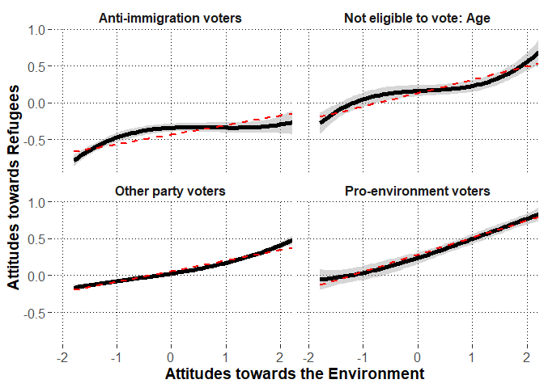

\newpage

# Preparations


## Load packages


```r
library(lme4)
library(lmerTest)
library(dplyr)
library(psych)
library(emmeans)
library(ggplot2)
library(metafor)
library(merTools)
```

## Session information about the packages


```r
sessionInfo()
```

```
## R version 3.6.3 (2020-02-29)
## Platform: x86_64-w64-mingw32/x64 (64-bit)
## Running under: Windows 10 x64 (build 18362)
## 
## Matrix products: default
## 
## locale:
## [1] LC_COLLATE=Finnish_Finland.1252  LC_CTYPE=Finnish_Finland.1252    LC_MONETARY=Finnish_Finland.1252
## [4] LC_NUMERIC=C                     LC_TIME=Finnish_Finland.1252    
## 
## attached base packages:
## [1] stats     graphics  grDevices utils     datasets  methods   base     
## 
## other attached packages:
##  [1] merTools_0.5.0  arm_1.10-1      MASS_7.3-51.5   metafor_2.4-0   ggplot2_3.3.0   emmeans_1.4.5   psych_1.9.12.31
##  [8] dplyr_0.8.5     lmerTest_3.1-2  lme4_1.1-23     Matrix_1.2-18  
## 
## loaded via a namespace (and not attached):
##  [1] Rcpp_1.0.4.6        mvtnorm_1.1-0       lattice_0.20-38     tidyr_1.0.2         zoo_1.8-7           foreach_1.5.0      
##  [7] assertthat_0.2.1    digest_0.6.25       mime_0.9            R6_2.4.1            backports_1.1.6     evaluate_0.14      
## [13] coda_0.19-3         pillar_1.4.3        rlang_0.4.5         multcomp_1.4-13     minqa_1.2.4         nloptr_1.2.2.1     
## [19] rmarkdown_2.1       splines_3.6.3       statmod_1.4.34      stringr_1.4.0       munsell_0.5.0       shiny_1.4.0.2      
## [25] broom_0.5.5         httpuv_1.5.2        compiler_3.6.3      numDeriv_2016.8-1.1 xfun_0.13           pkgconfig_2.0.3    
## [31] mnormt_1.5-6        htmltools_0.4.0     tidyselect_1.0.0    tibble_3.0.0        codetools_0.2-16    fansi_0.4.1        
## [37] later_1.0.0         crayon_1.3.4        withr_2.1.2         grid_3.6.3          nlme_3.1-144        xtable_1.8-4       
## [43] gtable_0.3.0        lifecycle_0.2.0     magrittr_1.5        scales_1.1.0        estimability_1.3    cli_2.0.2          
## [49] stringi_1.4.6       promises_1.1.0      generics_0.0.2      ellipsis_0.3.0      vctrs_0.2.4         boot_1.3-24        
## [55] sandwich_2.5-1      blme_1.0-4          TH.data_1.0-10      iterators_1.0.12    tools_3.6.3         glue_1.4.0         
## [61] purrr_0.3.3         fastmap_1.0.1       abind_1.4-5         parallel_3.6.3      survival_3.1-8      yaml_2.2.0         
## [67] colorspace_1.4-1    knitr_1.28
```

\newpage

## Custom functions


```r
#to extract fixed effects
getFE<-function(model){
  coefs<-data.frame(summary(model)$coefficients)
  coefs$lower<-coefs[,1]-qt(p=.975,df=coefs[,"df"])*coefs[,2]
  coefs$upper<-coefs[,1]+qt(p=.975,df=coefs[,"df"])*coefs[,2]
  coefs<-cbind.data.frame(round(coefs[,1:4],2),
                          p=round(coefs[,5],3),
                          LL=round(coefs$lower,2),
                          UL=round(coefs$upper,2))
  #row.names(coefs)<-substr(row.names(coefs),1,25)
  return(coefs)
}


#to extract random effects
getVC<-function(model){
  VC<-as.data.frame(VarCorr(model))
  VC<-cbind(VC[,c(1:3)],est_SD=VC[,5],est_SD2=VC[,4])
  return(VC)
}


#to extract model deviance
getDEV<-function(model){
  DEV<-unname(summary(model)$devcomp$cmp["dev"])
  return(DEV)
}


#partial correlation test
pcor.test <- function(x,y,z,use="mat",method="p",na.rm=T){


	x <- c(x)
	y <- c(y)
	z <- as.data.frame(z)

	if(use == "mat"){
		p.use <- "Var-Cov matrix"
		pcor = pcor.mat(x,y,z,method=method,na.rm=na.rm)
	}else if(use == "rec"){
		p.use <- "Recursive formula"
		pcor = pcor.rec(x,y,z,method=method,na.rm=na.rm)
	}else{
		stop("\'use\' should be either \"rec\" or \"mat\"!\n")
	}

	# print the method
	if(gregexpr("p",method)[[1]][1] == 1){
		p.method <- "Pearson"
	}else if(gregexpr("s",method)[[1]][1] == 1){
		p.method <- "Spearman"
	}else if(gregexpr("k",method)[[1]][1] == 1){
		p.method <- "Kendall"
	}else{
		stop("\'method\' should be \"pearson\" or \"spearman\" or \"kendall\"!\n")
	}

	# sample number
	n <- dim(na.omit(data.frame(x,y,z)))[1]
	
	# given variables' number
	gn <- dim(z)[2]

	# p-value
	if(p.method == "Kendall"){
		statistic <- pcor/sqrt(2*(2*(n-gn)+5)/(9*(n-gn)*(n-1-gn)))
		p.value <- 2*pnorm(-abs(statistic))

	}else{
		statistic <- pcor*sqrt((n-2-gn)/(1-pcor^2))
  		p.value <- 2*pnorm(-abs(statistic))
	}

	data.frame(estimate=pcor,p.value=p.value,statistic=statistic,n=n,gn=gn,Method=p.method,Use=p.use)
}			


# By using var-cov matrix
pcor.mat <- function(x,y,z,method="p",na.rm=T){

	x <- c(x)
	y <- c(y)
	z <- as.data.frame(z)

	if(dim(z)[2] == 0){
		stop("There should be given data\n")
	}

	data <- data.frame(x,y,z)

	if(na.rm == T){
		data = na.omit(data)
	}

	xdata <- na.omit(data.frame(data[,c(1,2)]))
	Sxx <- cov(xdata,xdata,m=method)

	xzdata <- na.omit(data)
	xdata <- data.frame(xzdata[,c(1,2)])
	zdata <- data.frame(xzdata[,-c(1,2)])
	Sxz <- cov(xdata,zdata,m=method)

	zdata <- na.omit(data.frame(data[,-c(1,2)]))
	Szz <- cov(zdata,zdata,m=method)

	# is Szz positive definite?
	zz.ev <- eigen(Szz)$values
	if(min(zz.ev)[1]<0){
		stop("\'Szz\' is not positive definite!\n")
	}

	# partial correlation
	Sxx.z <- Sxx - Sxz %*% solve(Szz) %*% t(Sxz)
	
	rxx.z <- cov2cor(Sxx.z)[1,2]

	rxx.z
}

# By using recursive formula
pcor.rec <- function(x,y,z,method="p",na.rm=T){
	# 

	x <- c(x)
	y <- c(y)
	z <- as.data.frame(z)

	if(dim(z)[2] == 0){
		stop("There should be given data\n")
	}

	data <- data.frame(x,y,z)

	if(na.rm == T){
		data = na.omit(data)
	}

	# recursive formula
	if(dim(z)[2] == 1){
		tdata <- na.omit(data.frame(data[,1],data[,2]))
		rxy <- cor(tdata[,1],tdata[,2],m=method)

		tdata <- na.omit(data.frame(data[,1],data[,-c(1,2)]))
		rxz <- cor(tdata[,1],tdata[,2],m=method)

		tdata <- na.omit(data.frame(data[,2],data[,-c(1,2)]))
		ryz <- cor(tdata[,1],tdata[,2],m=method)

		rxy.z <- (rxy - rxz*ryz)/( sqrt(1-rxz^2)*sqrt(1-ryz^2) )
		
		return(rxy.z)
	}else{
		x <- c(data[,1])
		y <- c(data[,2])
		z0 <- c(data[,3])
		zc <- as.data.frame(data[,-c(1,2,3)])

		rxy.zc <- pcor.rec(x,y,zc,method=method,na.rm=na.rm)
		rxz0.zc <- pcor.rec(x,z0,zc,method=method,na.rm=na.rm)
		ryz0.zc <- pcor.rec(y,z0,zc,method=method,na.rm=na.rm)
		
		rxy.z <- (rxy.zc - rxz0.zc*ryz0.zc)/( sqrt(1-rxz0.zc^2)*sqrt(1-ryz0.zc^2) )
		return(rxy.z)
	}			
}	
```

\newpage

## Load data


```r
dat<-read.csv2("dat.no.miss.csv",stringsAsFactors = F)
```

### Variable transformations

#### Country


```r
table(dat$cntry)
```

```
## 
##   AT   BE   CH   CZ   DE   EE   ES   FI   FR   GB   HU   IE   IT   LT   NL   NO   PL   PT   SE   SI 
## 1973 1753 1503 2156 2819 1974 1817 1862 2015 1876 1391 2676 2317 1927 1661 1538 1589 1228 1525 1276
```

#### Voting group


```r
#make voting group variable names unique to each country
dat$voting.group<-paste0(dat$cntry,": ",dat$vote.group.combined)
```

#### Centering Attitudes towards the Environment


```r
#recode the first variable to represent this attitude
dat$environ<-dat$inctxff.R
describe(dat$environ,fast=T)
```

```
##    vars     n mean   sd min max range   se
## X1    1 36131 2.78 1.24   1   5     4 0.01
```

```r
#grand mean center
dat$environ.gmc<-dat$environ-mean(dat$environ,na.rm=T)

#obtain dataframe with country means and add to data

environ.cntry<-dat %>%
  group_by(cntry) %>%
  summarize(environ.cntry=mean(environ.gmc,na.rm=T))

dat<-left_join(x=dat,
               y=environ.cntry,
               by=c("cntry"))

#center individuals around country means

dat$environ.cntrymc<-dat$environ.gmc-dat$environ.cntry

#obtain dataframe with voting group means and add to data

environ.voting.group<-dat %>%
  group_by(voting.group) %>%
  summarize(environ.voting.group=mean(environ.cntrymc,na.rm=T))

dat<-left_join(x=dat,
               y=environ.voting.group,
               by=c("voting.group"))

#center individuals around voting group means

dat$environ.vgmc<-dat$environ.cntrymc-dat$environ.voting.group

#describe the variable

describe(dat$environ.vgmc,fast=T)
```

```
##    vars     n mean   sd   min max range   se
## X1    1 36131    0 1.18 -3.29   3  6.29 0.01
```

```r
#rename as lvl1, lvl2, and lvl3

dat$environ.lvl1<-dat$environ.vgmc
dat$environ.lvl2<-dat$environ.voting.group
dat$environ.lvl3<-dat$environ.cntry
```

\newpage

#### Centering Political Engagement


```r
#correlation between the variables

corr.test(dat$nwspol.4,dat$polintr.R,adjust="none")
```

```
## Call:corr.test(x = dat$nwspol.4, y = dat$polintr.R, adjust = "none")
## Correlation matrix 
## [1] 0.32
## Sample Size 
## [1] 36545
## [1] 0
## 
##  To see confidence intervals of the correlations, print with the short=FALSE option
```

```r
#rename the variable

dat$engagement<-dat$polint.agg

#descriptive statistics
psych::describe(dat$engagement,fast=T)
```

```
##    vars     n mean  sd min max range se
## X1    1 36876 2.49 0.8   1   4     3  0
```

```r
#grand mean center
dat$engagement.gmc<-dat$engagement-mean(dat$engagement,na.rm=T)

#obtain dataframe with country means and add to data

engagement.cntry<-dat %>%
  group_by(cntry) %>%
  summarize(engagement.cntry=mean(engagement.gmc,na.rm=T))

dat<-left_join(x=dat,
               y=engagement.cntry,
               by=c("cntry"))

#center individuals around country means

dat$engagement.cntrymc<-dat$engagement.gmc-dat$engagement.cntry

#obtain dataframe with voting group means and add to data

engagement.voting.group<-dat %>%
  group_by(voting.group) %>%
  summarize(engagement.voting.group=mean(engagement.cntrymc,na.rm=T))

dat<-left_join(x=dat,
               y=engagement.voting.group,
               by=c("voting.group"))

#center individuals around voting group means

dat$engagement.vgmc<-dat$engagement.cntrymc-dat$engagement.voting.group

#describe the centered variable

describe(dat$engagement.vgmc,fast=T)
```

```
##    vars     n mean   sd   min  max range se
## X1    1 36876    0 0.74 -2.06 2.63  4.69  0
```

```r
#rename as lvl1, lvl2, and lvl3

dat$engagement.lvl1<-dat$engagement.vgmc
dat$engagement.lvl2<-dat$engagement.voting.group
dat$engagement.lvl3<-dat$engagement.cntry
```

\newpage

#### Rename and grand mean center the Attitudes towards refugees (pro-refugee attitudes indicate high scores)


```r
#grand mean center
dat$refugees<-dat$gvrfgap.R-mean(dat$gvrfgap.R,na.rm=T)
describe(dat$refugees,fast=T)
```

```
##    vars     n mean   sd   min  max range   se
## X1    1 36425    0 1.19 -1.93 2.07     4 0.01
```

```r
#rename
dat$refugees.gmc<-dat$refugees

#obtain dataframe with country means and add to data

refugees.cntry<-dat %>%
  group_by(cntry) %>%
  summarize(refugees.cntry=mean(refugees.gmc,na.rm=T))

dat<-left_join(x=dat,
               y=refugees.cntry,
               by=c("cntry"))

#center individuals around country means

dat$refugees.cntrymc<-dat$refugees.gmc-dat$refugees.cntry

#obtain dataframe with voting group means and add to data

refugees.voting.group<-dat %>%
  group_by(voting.group) %>%
  summarize(refugees.voting.group=mean(refugees.cntrymc,na.rm=T))

dat<-left_join(x=dat,
               y=refugees.voting.group,
               by=c("voting.group"))

#center individuals around voting group means

dat$refugees.vgmc<-dat$refugees.cntrymc-dat$refugees.voting.group

#describe the variable

describe(dat$refugees.vgmc,fast=T)
```

```
##    vars     n mean   sd   min  max range   se
## X1    1 36425    0 1.04 -3.27 3.26  6.53 0.01
```

```r
#rename as lvl1, lvl2, and lvl3

dat$refugees.lvl1<-dat$refugees.vgmc
dat$refugees.lvl2<-dat$refugees.voting.group
dat$refugees.lvl3<-dat$refugees.cntry
```

\newpage

#### Rename and Center the covariates aroung grand mean or logical middle points if applicable


```r
#grand-mean center age
dat$age<-dat$agea-mean(dat$agea,na.rm=T)
#sex around zero
dat$gender<-dat$gndr-1.5 #-0.5 males, 0.5 females
#rename occupation variable
dat$occup<-dat$isco.13
#grand-mean center education years
dat$educ<-dat$eduyrs-mean(dat$eduyrs,na.rm=T)
#residence around zero
dat$resid<-dat$rural-0.5 #-0.5 urban, 0.5 rural
```

\newpage

#### Voting group dummy-coded variables


```r
#recode if the party voted is =1, or not =0 anti-immigration
dat$anti.imm.party.dummy<-ifelse(is.na(dat$anti.imm.party.rule2),0,1)
#recode if the party voted is =1, or not =0 pro-environment
dat$pro.env.party.dummy<-ifelse(is.na(dat$pro.env.party.manual),0,1)

#dat$other.party.dummy<-ifelse(grepl("Other",dat$vote.group.combined),1,0)

#dummy-code not voting
dat$did.not.vote.dummy<-ifelse(grepl("did not vote",dat$vote.group.combined),1,0)
table(dat$did.not.vote.dummy)
```

```
## 
##     0     1 
## 29063  7813
```

```r
#dummy-code "don't know"
dat$dont.know.dummy<-ifelse(grepl("Don't know",dat$vote.group.combined),1,0)
table(dat$dont.know.dummy)
```

```
## 
##     0     1 
## 35670  1206
```

```r
#dummy-code invalid vote
dat$invalid.vote.dummy<-ifelse(grepl("Invalid vote",dat$vote.group.combined),1,0)
table(dat$invalid.vote.dummy)
```

```
## 
##     0     1 
## 36861    15
```

```r
#dummy-code "no answer"
dat$no.answer.dummy<-ifelse(grepl("No answer",dat$vote.group.combined),1,0)
table(dat$no.answer.dummy)
```

```
## 
##     0     1 
## 36864    12
```

```r
#dummy-code not-eligible: age
dat$not.eligible.age.dummy<-ifelse(grepl("not eligible: age",dat$vote.group.combined),1,0)
table(dat$not.eligible.age.dummy)
```

```
## 
##     0     1 
## 35063  1813
```

```r
#dummy code not-eligible: citizenship
dat$not.eligible.citizenship.dummy<-ifelse(grepl("not eligible: citizenship",dat$vote.group.combined),1,0)
table(dat$not.eligible.citizenship.dummy)
```

```
## 
##     0     1 
## 35663  1213
```

```r
#dummy-code not-eligible: other reasons
dat$not.eligible.other.dummy<-ifelse(grepl("not eligible: other",dat$vote.group.combined),1,0)
table(dat$not.eligible.other.dummy)
```

```
## 
##     0     1 
## 36611   265
```

```r
#add dummy-variable for other_party voting

dat<- dat %>%
  mutate(other.party.dummy:=case_when(
    anti.imm.party.dummy==1 |
      pro.env.party.dummy==1 |
      did.not.vote.dummy==1 |
      dont.know.dummy==1 |
      invalid.vote.dummy==1 |
      no.answer.dummy==1 |
      not.eligible.age.dummy==1 |
      not.eligible.citizenship.dummy==1 |
      not.eligible.other.dummy==1 ~0,
    TRUE~1
  ))

table(dat$other.party.dummy)
```

```
## 
##     0     1 
## 18517 18359
```

```r
#recode the names for a new multi-category variable: all.parties.lvl2

dat<-dat %>%
  mutate(all.parties.lvl2:=case_when(
    did.not.vote.dummy==1~"Did not vote",
    dont.know.dummy==1~"Don't know",
    no.answer.dummy==1~"No answer",
    invalid.vote.dummy==1~"Invalid vote",
    not.eligible.age.dummy==1~"NE age",
    not.eligible.citizenship.dummy==1~"NE citizen",
    not.eligible.other.dummy==1~"NE other",
    other.party.dummy==1~"Other party",
    anti.imm.party.dummy==1~"Anti-immigration party",
    pro.env.party.dummy==1~"Pro-environment party",
  ),
  party:=case_when(
    other.party.dummy==1~"Other party",
    anti.imm.party.dummy==1~"Anti-immigration party",
    pro.env.party.dummy==1~"Pro-environment party",
    TRUE~NA_character_
  ))
```


#### Omit missing variables


```r
#missing values per each row
dat$analysis.miss<-
  is.na(dat$cntry)+
  is.na(dat$voting.group)+
  is.na(dat$refugees)+
  is.na(dat$environ)+
  is.na(dat$vote.group.combined)+
  is.na(dat$age)+
  is.na(dat$gender)+
  is.na(dat$occup)+
  is.na(dat$educ)+
  is.na(dat$resid)+
  is.na(dat$engagement)
table(dat$analysis.miss)
```

```
## 
##     0     1     2 
## 35740  1076    60
```

```r
#include only those without any missing values
dat<-dat %>%
  filter(analysis.miss ==0)
```

\newpage


# Hypothesis 1: There will be a positive association between pro-environment and pro-refugee attitudes

### Model 0: Intercepts only


```r
H1.mod0<-lmer(refugees~(1|voting.group)+(1|cntry),
              data=dat,REML=F)

(FE.H1.mod0<-getFE(H1.mod0))
```

```
##             Estimate Std..Error    df t.value     p    LL   UL
## (Intercept)     0.08       0.11 19.92    0.69 0.499 -0.16 0.32
```

```r
(VC.H1.mod0<-getVC(H1.mod0))
```

```
##            grp        var1 var2    est_SD   est_SD2
## 1 voting.group (Intercept) <NA> 0.3247280 0.1054483
## 2        cntry (Intercept) <NA> 0.5023414 0.2523469
## 3     Residual        <NA> <NA> 1.0475008 1.0972579
```

```r
getDEV(H1.mod0)
```

```
## [1] 105426.7
```

```r
#ICC

##voting group

VC.H1.mod0[VC.H1.mod0$grp=="voting.group","est_SD2"]/
  sum(VC.H1.mod0[,"est_SD2"])
```

```
## [1] 0.07247039
```

```r
##country

VC.H1.mod0[VC.H1.mod0$grp=="cntry","est_SD2"]/
  sum(VC.H1.mod0[,"est_SD2"])
```

```
## [1] 0.173428
```


\newpage

### Model 1: Covariates


```r
H1.mod1<-lmer(refugees~(1|voting.group)+(1|cntry)+
                age+gender+educ+resid+occup
                ,data=dat,REML=F)

#model comparison
anova(H1.mod0,
      H1.mod1)
```

```
## Data: dat
## Models:
## H1.mod0: refugees ~ (1 | voting.group) + (1 | cntry)
## H1.mod1: refugees ~ (1 | voting.group) + (1 | cntry) + age + gender + 
## H1.mod1:     educ + resid + occup
##         npar    AIC    BIC logLik deviance  Chisq Df Pr(>Chisq)    
## H1.mod0    4 105435 105469 -52713   105427                         
## H1.mod1   20 105044 105214 -52502   105004 422.87 16  < 2.2e-16 ***
## ---
## Signif. codes:  0 '***' 0.001 '**' 0.01 '*' 0.05 '.' 0.1 ' ' 1
```

```r
(FE.H1.mod1<-getFE(H1.mod1))
```

```
##                                                         Estimate Std..Error       df t.value     p    LL    UL
## (Intercept)                                                 0.06       0.14    50.42    0.44 0.663 -0.22  0.35
## age                                                         0.00       0.00 34095.35    3.30 0.001  0.00  0.00
## gender                                                      0.06       0.01 35598.09    4.77 0.000  0.03  0.08
## educ                                                        0.02       0.00 35706.37    9.28 0.000  0.01  0.02
## resid                                                      -0.08       0.01 35657.25   -6.58 0.000 -0.10 -0.05
## occupClerical support workers                              -0.04       0.09 35532.93   -0.40 0.687 -0.21  0.14
## occupCraft and related trades workers                      -0.08       0.09 35539.44   -0.85 0.398 -0.25  0.10
## occupElementary occupations                                 0.01       0.09 35540.85    0.14 0.892 -0.16  0.19
## occupManagers                                               0.00       0.09 35533.47    0.00 0.998 -0.18  0.18
## occupOther: Not in paid work                                0.16       0.09 35696.52    1.71 0.088 -0.02  0.34
## occupPlant and machine operators, and assemblers           -0.07       0.09 35539.06   -0.77 0.442 -0.24  0.11
## occupProfessionals                                          0.10       0.09 35535.19    1.10 0.273 -0.08  0.27
## occupRetired                                               -0.03       0.10 35538.37   -0.28 0.782 -0.22  0.17
## occupService and sales workers                             -0.04       0.09 35534.90   -0.40 0.691 -0.21  0.14
## occupSkilled agricultural, forestry and fishery workers    -0.05       0.09 35544.87   -0.52 0.601 -0.23  0.14
## occupTechnicians and associate professionals               -0.03       0.09 35532.10   -0.29 0.774 -0.20  0.15
## occupUnemployed                                            -0.03       0.11 35546.28   -0.23 0.816 -0.24  0.19
```

```r
(VC.H1.mod1<-getVC(H1.mod1))
```

```
##            grp        var1 var2    est_SD    est_SD2
## 1 voting.group (Intercept) <NA> 0.3034866 0.09210413
## 2        cntry (Intercept) <NA> 0.4986022 0.24860415
## 3     Residual        <NA> <NA> 1.0417310 1.08520339
```

```r
getDEV(H1.mod1)
```

```
## [1] 105003.8
```

```r
write.csv2(FE.H1.mod1,"FE.H1.mod1.csv")

#variance explained

##lvl 1: individuals

(VC.H1.mod0[VC.H1.mod0$grp=="Residual","est_SD2"]-
     VC.H1.mod1[VC.H1.mod1$grp=="Residual","est_SD2"])/
  VC.H1.mod0[VC.H1.mod0$grp=="Residual","est_SD2"]
```

```
## [1] 0.01098601
```

```r
##lvl 2: voting group

(VC.H1.mod0[VC.H1.mod0$grp=="voting.group","est_SD2"]-
     VC.H1.mod1[VC.H1.mod1$grp=="voting.group","est_SD2"])/
  VC.H1.mod0[VC.H1.mod0$grp=="voting.group","est_SD2"]
```

```
## [1] 0.1265467
```

```r
##lvl 3: country

(VC.H1.mod0[VC.H1.mod0$grp=="cntry","est_SD2"]-
     VC.H1.mod1[VC.H1.mod1$grp=="cntry","est_SD2"])/
  VC.H1.mod0[VC.H1.mod0$grp=="cntry","est_SD2"]
```

```
## [1] 0.01483183
```

```r
##total

(sum(VC.H1.mod0$est_SD2)-sum(VC.H1.mod1$est_SD2))/
  sum(VC.H1.mod0$est_SD2)
```

```
## [1] 0.02002771
```

```r
#individual contributions of covariates
anova(H1.mod1)
```

```
## Type III Analysis of Variance Table with Satterthwaite's method
##         Sum Sq Mean Sq NumDF DenDF F value    Pr(>F)    
## age     11.807  11.807     1 34095 10.8797 0.0009732 ***
## gender  24.687  24.687     1 35598 22.7491 1.853e-06 ***
## educ    93.417  93.417     1 35706 86.0829 < 2.2e-16 ***
## resid   47.042  47.042     1 35657 43.3489 4.643e-11 ***
## occup  125.754  10.479    12 35223  9.6567 < 2.2e-16 ***
## ---
## Signif. codes:  0 '***' 0.001 '**' 0.01 '*' 0.05 '.' 0.1 ' ' 1
```

\newpage

### Model 2: Fixed effects for Attitudes towards the Environment


```r
H1.mod2<-lmer(refugees~(1|voting.group)+(1|cntry)+
                age+gender+educ+resid+occup+
                environ.lvl1,data=dat,REML=F)

#model comparison
anova(H1.mod1,
      H1.mod2)
```

```
## Data: dat
## Models:
## H1.mod1: refugees ~ (1 | voting.group) + (1 | cntry) + age + gender + 
## H1.mod1:     educ + resid + occup
## H1.mod2: refugees ~ (1 | voting.group) + (1 | cntry) + age + gender + 
## H1.mod2:     educ + resid + occup + environ.lvl1
##         npar    AIC    BIC logLik deviance  Chisq Df Pr(>Chisq)    
## H1.mod1   20 105044 105214 -52502   105004                         
## H1.mod2   21 104337 104515 -52147   104295 708.83  1  < 2.2e-16 ***
## ---
## Signif. codes:  0 '***' 0.001 '**' 0.01 '*' 0.05 '.' 0.1 ' ' 1
```

```r
(FE.H1.mod2<-getFE(H1.mod2))
```

```
##                                                         Estimate Std..Error       df t.value     p    LL    UL
## (Intercept)                                                 0.07       0.14    49.59    0.51 0.611 -0.21  0.36
## age                                                         0.00       0.00 34270.64    4.39 0.000  0.00  0.00
## gender                                                      0.06       0.01 35593.07    4.67 0.000  0.03  0.08
## educ                                                        0.01       0.00 35714.29    7.51 0.000  0.01  0.02
## resid                                                      -0.06       0.01 35651.76   -5.23 0.000 -0.08 -0.04
## occupClerical support workers                              -0.04       0.09 35528.94   -0.46 0.646 -0.21  0.13
## occupCraft and related trades workers                      -0.07       0.09 35535.31   -0.76 0.446 -0.24  0.11
## occupElementary occupations                                 0.01       0.09 35536.62    0.16 0.871 -0.16  0.19
## occupManagers                                              -0.02       0.09 35529.47   -0.18 0.859 -0.19  0.16
## occupOther: Not in paid work                                0.14       0.09 35691.43    1.54 0.123 -0.04  0.32
## occupPlant and machine operators, and assemblers           -0.06       0.09 35534.89   -0.72 0.474 -0.24  0.11
## occupProfessionals                                          0.07       0.09 35531.19    0.83 0.407 -0.10  0.24
## occupRetired                                               -0.03       0.10 35534.45   -0.34 0.734 -0.23  0.16
## occupService and sales workers                             -0.04       0.09 35530.91   -0.43 0.668 -0.21  0.13
## occupSkilled agricultural, forestry and fishery workers    -0.05       0.09 35540.59   -0.58 0.564 -0.24  0.13
## occupTechnicians and associate professionals               -0.03       0.09 35528.10   -0.36 0.718 -0.20  0.14
## occupUnemployed                                            -0.02       0.11 35542.75   -0.19 0.852 -0.23  0.19
## environ.lvl1                                                0.13       0.00 35459.04   26.76 0.000  0.12  0.13
```

```r
(VC.H1.mod2<-getVC(H1.mod2))
```

```
##            grp        var1 var2    est_SD    est_SD2
## 1 voting.group (Intercept) <NA> 0.3088935 0.09541521
## 2        cntry (Intercept) <NA> 0.4990552 0.24905606
## 3     Residual        <NA> <NA> 1.0312663 1.06351024
```

```r
getDEV(H1.mod2)
```

```
## [1] 104295
```

```r
write.csv2(FE.H1.mod2,"FE.H1.mod2.csv")

#variance explained

##lvl 1: individuals

(VC.H1.mod1[VC.H1.mod1$grp=="Residual","est_SD2"]-
     VC.H1.mod2[VC.H1.mod2$grp=="Residual","est_SD2"])/
  VC.H1.mod1[VC.H1.mod1$grp=="Residual","est_SD2"]
```

```
## [1] 0.01998994
```

```r
##total

(sum(VC.H1.mod1$est_SD2)-sum(VC.H1.mod2$est_SD2))/
  sum(VC.H1.mod1$est_SD2)
```

```
## [1] 0.01257453
```

\newpage

### Model 3: Random effects for Attitudes towards the Environment


```r
H1.mod3<-lmer(refugees~(environ.lvl1|voting.group)+
                (environ.lvl1|cntry)+
                age+gender+educ+resid+occup+
                environ.lvl1,data=dat,REML=F,
                 control=lmerControl(optimizer="bobyqa",
                                     optCtrl=list(maxfun=2e8)))


#model comparison
anova(H1.mod2,
      H1.mod3)
```

```
## Data: dat
## Models:
## H1.mod2: refugees ~ (1 | voting.group) + (1 | cntry) + age + gender + 
## H1.mod2:     educ + resid + occup + environ.lvl1
## H1.mod3: refugees ~ (environ.lvl1 | voting.group) + (environ.lvl1 | cntry) + 
## H1.mod3:     age + gender + educ + resid + occup + environ.lvl1
##         npar    AIC    BIC logLik deviance Chisq Df Pr(>Chisq)    
## H1.mod2   21 104337 104515 -52147   104295                        
## H1.mod3   25 104289 104502 -52120   104239 55.58  4  2.456e-11 ***
## ---
## Signif. codes:  0 '***' 0.001 '**' 0.01 '*' 0.05 '.' 0.1 ' ' 1
```

```r
(FE.H1.mod3<-getFE(H1.mod3))
```

```
##                                                         Estimate Std..Error       df t.value     p    LL    UL
## (Intercept)                                                 0.08       0.14    49.47    0.53 0.598 -0.21  0.36
## age                                                         0.00       0.00 34211.38    4.49 0.000  0.00  0.00
## gender                                                      0.06       0.01 35569.60    4.70 0.000  0.03  0.08
## educ                                                        0.01       0.00 35698.92    7.49 0.000  0.01  0.02
## resid                                                      -0.06       0.01 35634.38   -5.24 0.000 -0.08 -0.04
## occupClerical support workers                              -0.04       0.09 35508.21   -0.48 0.632 -0.22  0.13
## occupCraft and related trades workers                      -0.07       0.09 35518.38   -0.77 0.439 -0.24  0.10
## occupElementary occupations                                 0.01       0.09 35520.28    0.13 0.900 -0.16  0.18
## occupManagers                                              -0.02       0.09 35507.43   -0.22 0.827 -0.19  0.15
## occupOther: Not in paid work                                0.14       0.09 35674.75    1.52 0.127 -0.04  0.32
## occupPlant and machine operators, and assemblers           -0.07       0.09 35516.07   -0.74 0.460 -0.24  0.11
## occupProfessionals                                          0.07       0.09 35512.07    0.79 0.432 -0.10  0.24
## occupRetired                                               -0.04       0.10 35508.44   -0.36 0.716 -0.23  0.16
## occupService and sales workers                             -0.04       0.09 35513.92   -0.44 0.657 -0.21  0.13
## occupSkilled agricultural, forestry and fishery workers    -0.06       0.09 35523.04   -0.63 0.529 -0.24  0.12
## occupTechnicians and associate professionals               -0.03       0.09 35508.10   -0.38 0.705 -0.20  0.14
## occupUnemployed                                            -0.03       0.11 35525.32   -0.24 0.812 -0.24  0.18
## environ.lvl1                                                0.12       0.01    19.40   11.53 0.000  0.10  0.15
```

```r
(VC.H1.mod3<-getVC(H1.mod3))
```

```
##            grp         var1         var2      est_SD       est_SD2
## 1 voting.group  (Intercept)         <NA>  0.30918363  0.0955945141
## 2 voting.group environ.lvl1         <NA>  0.04317550  0.0018641240
## 3 voting.group  (Intercept) environ.lvl1  0.12926379  0.0017255628
## 4        cntry  (Intercept)         <NA>  0.49932256  0.2493230223
## 5        cntry environ.lvl1         <NA>  0.04000565  0.0016004517
## 6        cntry  (Intercept) environ.lvl1 -0.04865068 -0.0009718325
## 7     Residual         <NA>         <NA>  1.02912455  1.0590973317
```

```r
getDEV(H1.mod3)
```

```
## [1] 104239.4
```

```r
write.csv2(FE.H1.mod3,"FE.H1.mod3.csv")
```

\newpage


#### Describe the correlation between refugee and environment attitudes by country


```r
#model implied associations (posterior modes)

#fit also a model without covariates


slope.mod.no.cov<-lmer(refugees~(environ.lvl1|voting.group)+
                (environ.lvl1|cntry)+
                environ.lvl1,data=dat,REML=F,
                 control=lmerControl(optimizer="bobyqa",
                                     optCtrl=list(maxfun=2e8)))

#correlations from data

cntry.cor.dat<-dat %>%
  dplyr::select(cntry,environ.gmc,refugees,age,gender,educ,resid) %>%
  group_by(cntry) %>%
  summarize(observed_r=cor(environ.gmc,refugees,use="pairwise.complete.obs"),
            partial_r=pcor.test(x=environ.gmc,
                         y=refugees,
                         z=data.frame(age,
                                      gender,
                                      educ,
                                      resid))$estimate,
            n=n())

#posterior modes from multilevel models

country.effs.dat<-
  cbind.data.frame(
    cntry=rownames(
      coefficients(H1.mod3)$cntry),
    slope_with_covs=coefficients(
      H1.mod3)$cntry[,"environ.lvl1"],
    slope_without_covs=coefficients(
      slope.mod.no.cov)$cntry[,"environ.lvl1"],
    cntry.cor.dat[,2:4])
country.effs.dat
```

```
##    cntry slope_with_covs slope_without_covs observed_r  partial_r    n
## 1     AT      0.16388921         0.17073407 0.25596053 0.22287125 1934
## 2     BE      0.13561055         0.14776506 0.17729252 0.14631334 1746
## 3     CH      0.12415313         0.13494604 0.21389146 0.17601223 1469
## 4     CZ      0.13937493         0.14235903 0.17395316 0.16591222 2071
## 5     DE      0.18286129         0.19258682 0.24433787 0.23353039 2791
## 6     EE      0.07728714         0.08881514 0.05001522 0.04719782 1927
## 7     ES      0.10525890         0.11563744 0.15432815 0.13903233 1666
## 8     FI      0.15671522         0.16971104 0.23493567 0.22299268 1840
## 9     FR      0.17072139         0.17996195 0.20552407 0.19741954 1995
## 10    GB      0.14359012         0.15307094 0.20728022 0.18157755 1856
## 11    HU      0.12194688         0.12843216 0.17372436 0.17371641 1341
## 12    IE      0.14056993         0.15218857 0.19521566 0.17388402 2591
## 13    IT      0.11174664         0.11988893 0.14321699 0.13573951 2177
## 14    LT      0.08476625         0.09240974 0.09612563 0.09510338 1759
## 15    NL      0.09383763         0.10475537 0.15260881 0.14788809 1620
## 16    NO      0.13225738         0.14956688 0.26483270 0.22781088 1530
## 17    PL      0.05053810         0.06035134 0.02603599 0.02285898 1495
## 18    PT      0.07681183         0.09485497 0.11228764 0.08639693 1214
## 19    SE      0.13932739         0.15254652 0.25416405 0.22308459 1487
## 20    SI      0.12051011         0.13280999 0.17475936 0.15300594 1231
```

```r
write.csv2(country.effs.dat,"associations_within_countries.csv")

#calculate the meta-analytical estimate for partial correlation
country.effs.dat$partial_r.se<-1/sqrt(country.effs.dat$n-3)
rma.uni(yi=transf.rtoz(country.effs.dat$partial_r),
        sei=country.effs.dat$partial_r.se)
```

```
## 
## Random-Effects Model (k = 20; tau^2 estimator: REML)
## 
## tau^2 (estimated amount of total heterogeneity): 0.0031 (SE = 0.0012)
## tau (square root of estimated tau^2 value):      0.0555
## I^2 (total heterogeneity / total variability):   84.59%
## H^2 (total variability / sampling variability):  6.49
## 
## Test for Heterogeneity:
## Q(df = 19) = 122.1403, p-val < .0001
## 
## Model Results:
## 
## estimate      se     zval    pval   ci.lb   ci.ub 
##   0.1610  0.0135  11.8871  <.0001  0.1344  0.1875  *** 
## 
## ---
## Signif. codes:  0 '***' 0.001 '**' 0.01 '*' 0.05 '.' 0.1 ' ' 1
```

```r
#back-transform to r
transf.ztor(0.1610)
```

```
## [1] 0.1596232
```


\newpage

#### Describe the correlation between refugee and environment attitudes by voting group

* It was not possible to calculate the partial coefficients for all voting groups because of small group size and lack of variance in either attitudes or covariates, so only zero-order correlations were calculated as well as posterior mode slopes


```r
#get size of each voting group

voting.group.n<-dat %>%
  group_by(voting.group) %>%
  summarize(voting.group.n=n())

#add voting group size to the main data

dat<-left_join(x=dat,
               y=voting.group.n,
               by=c("voting.group"))

#calculate observed correlations


all.voting.group.cor.dat<-dat %>%
  #filter(voting.group.n>12) %>%
  dplyr::select(voting.group,environ.gmc,age,
                                      gender,
                                      educ,
                                      resid,
         refugees,anti.imm.party.dummy,
         pro.env.party.dummy) %>%
  group_by(voting.group) %>%
  summarize(observed_r=cor(environ.gmc,
                           refugees,use="pairwise.complete.obs"),

            n=n(),
            anti.imm=sum(anti.imm.party.dummy)/n(),
            pro.env=sum(pro.env.party.dummy)/n())
```

```
## Warning in cor(environ.gmc, refugees, use = "pairwise.complete.obs"): the standard deviation is zero

## Warning in cor(environ.gmc, refugees, use = "pairwise.complete.obs"): the standard deviation is zero
```

```r
#posterior modes for voting group specific associations

voting.group.effs.dat<-
  cbind.data.frame(
    voting.group=rownames(
      coefficients(H1.mod3)$voting.group),
    slope_with_covs=coefficients(
      H1.mod3)$voting.group[,"environ.lvl1"],
    slope_without_covs=coefficients(
      slope.mod.no.cov)$voting.group[,"environ.lvl1"])

#add country level variability to slope-estimates

voting.group.effs.dat$cntry<-substr(voting.group.effs.dat$voting.group,1,2)
voting.group.effs.dat.w.country<-left_join(x=voting.group.effs.dat,
                                           y=country.effs.dat,
                                           by="cntry",suffix=c("",".cntry"))
```

```
## Warning: Column `cntry` joining character vector and factor, coercing into character vector
```

```r
voting.group.effs.dat.w.country$slope_with_covs_add_cntry<-
  voting.group.effs.dat.w.country$slope_with_covs+
  voting.group.effs.dat.w.country$slope_with_covs.cntry
  
voting.group.effs.dat.w.country$slope_without_covs_add_cntry<-
  voting.group.effs.dat.w.country$slope_without_covs+
  voting.group.effs.dat.w.country$slope_without_covs.cntry

voting.group.effs.dat.w.country<-
  voting.group.effs.dat.w.country %>%
  dplyr::select(voting.group,
                slope_with_covs,
                slope_without_covs,
                slope_with_covs_add_cntry,
                slope_without_covs_add_cntry,
                n)


voting.group.slopes.dat<-left_join(x=voting.group.effs.dat.w.country,
                                 y=all.voting.group.cor.dat,
                                 by=c("voting.group"))
```

```
## Warning: Column `voting.group` joining factor and character vector, coercing into character vector
```

```r
write.csv2(voting.group.slopes.dat,"associations_within_voting_groups.csv")
```


\newpage

## Alternative (exploratory) approach for Hypothesis 1 with Environment attitudes as dependent variable, and immigrant attitudes as independent

### Model 0: Intercepts only


```r
H1.env.mod0<-lmer(environ.gmc~(1|voting.group)+(1|cntry),data=dat,REML=F)

(FE.H1.env.mod0<-getFE(H1.env.mod0))
```

```
##             Estimate Std..Error    df t.value     p    LL  UL
## (Intercept)     0.05       0.07 20.08    0.78 0.443 -0.09 0.2
```

```r
(VC.H1.env.mod0<-getVC(H1.env.mod0))
```

```
##            grp        var1 var2    est_SD    est_SD2
## 1 voting.group (Intercept) <NA> 0.2851622 0.08131749
## 2        cntry (Intercept) <NA> 0.3004455 0.09026750
## 3     Residual        <NA> <NA> 1.1844251 1.40286286
```

```r
getDEV(H1.env.mod0)
```

```
## [1] 114073.9
```

```r
#ICC

##voting group

VC.H1.env.mod0[VC.H1.env.mod0$grp=="voting.group","est_SD2"]/
  sum(VC.H1.env.mod0[,"est_SD2"])
```

```
## [1] 0.05164826
```

```r
##country

VC.H1.env.mod0[VC.H1.env.mod0$grp=="cntry","est_SD2"]/
  sum(VC.H1.env.mod0[,"est_SD2"])
```

```
## [1] 0.0573328
```


\newpage

### Model 1: Covariates


```r
H1.env.mod1<-lmer(environ.gmc~(1|voting.group)+(1|cntry)+
                age+gender+educ+resid+occup
                ,data=dat,REML=F)

#model comparison
anova(H1.env.mod0,
      H1.env.mod1)
```

```
## Data: dat
## Models:
## H1.env.mod0: environ.gmc ~ (1 | voting.group) + (1 | cntry)
## H1.env.mod1: environ.gmc ~ (1 | voting.group) + (1 | cntry) + age + gender + 
## H1.env.mod1:     educ + resid + occup
##             npar    AIC    BIC logLik deviance  Chisq Df Pr(>Chisq)    
## H1.env.mod0    4 114082 114116 -57037   114074                         
## H1.env.mod1   20 113129 113299 -56545   113089 984.48 16  < 2.2e-16 ***
## ---
## Signif. codes:  0 '***' 0.001 '**' 0.01 '*' 0.05 '.' 0.1 ' ' 1
```

```r
(FE.H1.env.mod1<-getFE(H1.env.mod1))
```

```
##                                                         Estimate Std..Error       df t.value     p    LL    UL
## (Intercept)                                                -0.04       0.12   188.50   -0.32 0.751 -0.27  0.20
## age                                                         0.00       0.00 29829.87   -8.11 0.000  0.00  0.00
## gender                                                      0.02       0.01 35659.58    1.14 0.253 -0.01  0.04
## educ                                                        0.03       0.00 35342.84   13.39 0.000  0.02  0.03
## resid                                                      -0.14       0.01 35731.67  -10.19 0.000 -0.16 -0.11
## occupClerical support workers                               0.04       0.10 35578.76    0.42 0.672 -0.15  0.24
## occupCraft and related trades workers                      -0.06       0.10 35588.19   -0.60 0.548 -0.26  0.14
## occupElementary occupations                                -0.01       0.10 35591.13   -0.11 0.915 -0.21  0.19
## occupManagers                                               0.13       0.10 35579.35    1.33 0.184 -0.06  0.33
## occupOther: Not in paid work                                0.16       0.10 35719.64    1.55 0.121 -0.04  0.36
## occupPlant and machine operators, and assemblers           -0.04       0.10 35588.53   -0.41 0.684 -0.24  0.16
## occupProfessionals                                          0.21       0.10 35581.91    2.09 0.037  0.01  0.40
## occupRetired                                                0.06       0.11 35582.94    0.52 0.604 -0.16  0.28
## occupService and sales workers                              0.02       0.10 35580.41    0.25 0.806 -0.17  0.22
## occupSkilled agricultural, forestry and fishery workers     0.05       0.11 35595.50    0.43 0.664 -0.16  0.25
## occupTechnicians and associate professionals                0.06       0.10 35577.81    0.59 0.557 -0.14  0.25
## occupUnemployed                                            -0.03       0.12 35586.90   -0.25 0.803 -0.27  0.21
```

```r
(VC.H1.env.mod1<-getVC(H1.env.mod1))
```

```
##            grp        var1 var2    est_SD    est_SD2
## 1 voting.group (Intercept) <NA> 0.2357854 0.05559476
## 2        cntry (Intercept) <NA> 0.2942470 0.08658130
## 3     Residual        <NA> <NA> 1.1693790 1.36744715
```

```r
getDEV(H1.env.mod1)
```

```
## [1] 113089.5
```

```r
write.csv2(FE.H1.env.mod1,"FE.H1.env.mod1.csv")

#variance explained

##lvl 1: individuals

(VC.H1.env.mod0[VC.H1.env.mod0$grp=="Residual","est_SD2"]-
     VC.H1.env.mod1[VC.H1.env.mod1$grp=="Residual","est_SD2"])/
  VC.H1.env.mod0[VC.H1.env.mod0$grp=="Residual","est_SD2"]
```

```
## [1] 0.02524532
```

```r
##lvl 2: voting group

(VC.H1.env.mod0[VC.H1.env.mod0$grp=="voting.group","est_SD2"]-
     VC.H1.env.mod1[VC.H1.env.mod1$grp=="voting.group","est_SD2"])/
  VC.H1.env.mod0[VC.H1.env.mod0$grp=="voting.group","est_SD2"]
```

```
## [1] 0.3163247
```

```r
##lvl 3: country

(VC.H1.env.mod0[VC.H1.env.mod0$grp=="cntry","est_SD2"]-
     VC.H1.env.mod1[VC.H1.env.mod1$grp=="cntry","est_SD2"])/
  VC.H1.env.mod0[VC.H1.env.mod0$grp=="cntry","est_SD2"]
```

```
## [1] 0.04083635
```

```r
##total

(sum(VC.H1.env.mod0$est_SD2)-sum(VC.H1.env.mod1$est_SD2))/
  sum(VC.H1.env.mod0$est_SD2)
```

```
## [1] 0.04117294
```

```r
#individual contributions of covariates
anova(H1.env.mod1)
```

```
## Type III Analysis of Variance Table with Satterthwaite's method
##         Sum Sq Mean Sq NumDF DenDF  F value    Pr(>F)    
## age     89.975  89.975     1 29830  65.7977 5.187e-16 ***
## gender   1.791   1.791     1 35660   1.3094    0.2525    
## educ   245.226 245.226     1 35343 179.3314 < 2.2e-16 ***
## resid  142.111 142.111     1 35732 103.9243 < 2.2e-16 ***
## occup  205.203  17.100    12 34368  12.5052 < 2.2e-16 ***
## ---
## Signif. codes:  0 '***' 0.001 '**' 0.01 '*' 0.05 '.' 0.1 ' ' 1
```

\newpage

### Model 2: Fixed effects for Attitudes towards Immigrants


```r
H1.env.mod2<-lmer(environ.gmc~(1|voting.group)+(1|cntry)+
                age+gender+educ+resid+occup+
                refugees.lvl1,data=dat,REML=F)

#model comparison
anova(H1.env.mod1,
      H1.env.mod2)
```

```
## Data: dat
## Models:
## H1.env.mod1: environ.gmc ~ (1 | voting.group) + (1 | cntry) + age + gender + 
## H1.env.mod1:     educ + resid + occup
## H1.env.mod2: environ.gmc ~ (1 | voting.group) + (1 | cntry) + age + gender + 
## H1.env.mod2:     educ + resid + occup + refugees.lvl1
##             npar    AIC    BIC logLik deviance  Chisq Df Pr(>Chisq)    
## H1.env.mod1   20 113129 113299 -56545   113089                         
## H1.env.mod2   21 112422 112600 -56190   112380 709.58  1  < 2.2e-16 ***
## ---
## Signif. codes:  0 '***' 0.001 '**' 0.01 '*' 0.05 '.' 0.1 ' ' 1
```

```r
(FE.H1.env.mod2<-getFE(H1.env.mod2))
```

```
##                                                         Estimate Std..Error       df t.value     p    LL    UL
## (Intercept)                                                -0.04       0.12   182.49   -0.30 0.763 -0.27  0.20
## age                                                         0.00       0.00 30300.28   -8.71 0.000  0.00  0.00
## gender                                                      0.01       0.01 35654.32    0.49 0.622 -0.02  0.03
## educ                                                        0.03       0.00 35392.50   12.22 0.000  0.02  0.03
## resid                                                      -0.12       0.01 35728.36   -9.40 0.000 -0.15 -0.10
## occupClerical support workers                               0.05       0.10 35574.16    0.48 0.629 -0.15  0.24
## occupCraft and related trades workers                      -0.05       0.10 35583.40   -0.49 0.625 -0.24  0.15
## occupElementary occupations                                -0.01       0.10 35586.20   -0.12 0.903 -0.21  0.18
## occupManagers                                               0.13       0.10 35574.73    1.34 0.181 -0.06  0.33
## occupOther: Not in paid work                                0.14       0.10 35722.40    1.35 0.178 -0.06  0.34
## occupPlant and machine operators, and assemblers           -0.03       0.10 35583.69   -0.30 0.762 -0.23  0.17
## occupProfessionals                                          0.19       0.10 35577.21    1.96 0.050  0.00  0.38
## occupRetired                                                0.06       0.11 35578.52    0.56 0.573 -0.15  0.28
## occupService and sales workers                              0.03       0.10 35575.86    0.31 0.760 -0.16  0.22
## occupSkilled agricultural, forestry and fishery workers     0.05       0.10 35590.53    0.51 0.610 -0.15  0.26
## occupTechnicians and associate professionals                0.06       0.10 35573.19    0.63 0.527 -0.13  0.25
## occupUnemployed                                            -0.02       0.12 35582.73   -0.20 0.838 -0.26  0.21
## refugees.lvl1                                               0.16       0.01 35453.62   26.78 0.000  0.15  0.17
```

```r
(VC.H1.env.mod2<-getVC(H1.env.mod2))
```

```
##            grp        var1 var2    est_SD    est_SD2
## 1 voting.group (Intercept) <NA> 0.2407043 0.05793855
## 2        cntry (Intercept) <NA> 0.2946595 0.08682425
## 3     Residual        <NA> <NA> 1.1576308 1.34010908
```

```r
getDEV(H1.env.mod2)
```

```
## [1] 112379.9
```

```r
write.csv2(FE.H1.env.mod2,"FE.H1.env.mod2.csv")

#variance explained

##lvl 1: individuals

(VC.H1.env.mod1[VC.H1.env.mod1$grp=="Residual","est_SD2"]-
     VC.H1.env.mod2[VC.H1.env.mod2$grp=="Residual","est_SD2"])/
  VC.H1.env.mod1[VC.H1.env.mod1$grp=="Residual","est_SD2"]
```

```
## [1] 0.01999204
```

```r
##lvl 2: voting group

(VC.H1.env.mod1[VC.H1.env.mod1$grp=="voting.group","est_SD2"]-
     VC.H1.env.mod2[VC.H1.env.mod2$grp=="voting.group","est_SD2"])/
  VC.H1.env.mod1[VC.H1.env.mod1$grp=="voting.group","est_SD2"]
```

```
## [1] -0.04215841
```

```r
##lvl 3: country

(VC.H1.env.mod1[VC.H1.env.mod1$grp=="cntry","est_SD2"]-
     VC.H1.env.mod2[VC.H1.env.mod2$grp=="cntry","est_SD2"])/
  VC.H1.env.mod1[VC.H1.env.mod1$grp=="cntry","est_SD2"]
```

```
## [1] -0.00280595
```

```r
##total

(sum(VC.H1.env.mod1$est_SD2)-sum(VC.H1.env.mod2$est_SD2))/
  sum(VC.H1.env.mod1$est_SD2)
```

```
## [1] 0.0163957
```

\newpage

### Model 3: Random effects for Attitudes towards the Immigrant


```r
H1.env.mod3<-lmer(environ.gmc~(refugees.lvl1|voting.group)+
                (refugees.lvl1|cntry)+
                age+gender+educ+resid+occup+
                refugees.lvl1,data=dat,REML=F,
                 control=lmerControl(optimizer="bobyqa",
                                     optCtrl=list(maxfun=2e8)))


#model comparison
anova(H1.env.mod2,
      H1.env.mod3)
```

```
## Data: dat
## Models:
## H1.env.mod2: environ.gmc ~ (1 | voting.group) + (1 | cntry) + age + gender + 
## H1.env.mod2:     educ + resid + occup + refugees.lvl1
## H1.env.mod3: environ.gmc ~ (refugees.lvl1 | voting.group) + (refugees.lvl1 | 
## H1.env.mod3:     cntry) + age + gender + educ + resid + occup + refugees.lvl1
##             npar    AIC    BIC logLik deviance  Chisq Df Pr(>Chisq)    
## H1.env.mod2   21 112422 112600 -56190   112380                         
## H1.env.mod3   25 112389 112602 -56170   112339 40.414  4  3.554e-08 ***
## ---
## Signif. codes:  0 '***' 0.001 '**' 0.01 '*' 0.05 '.' 0.1 ' ' 1
```

```r
(FE.H1.env.mod3<-getFE(H1.env.mod3))
```

```
##                                                         Estimate Std..Error       df t.value     p    LL    UL
## (Intercept)                                                -0.04       0.12   181.41   -0.33 0.740 -0.27  0.19
## age                                                         0.00       0.00 30229.24   -8.64 0.000  0.00  0.00
## gender                                                      0.01       0.01 35647.27    0.51 0.613 -0.02  0.03
## educ                                                        0.03       0.00 35243.03   12.16 0.000  0.02  0.03
## resid                                                      -0.12       0.01 35688.34   -9.42 0.000 -0.15 -0.10
## occupClerical support workers                               0.05       0.10 35558.96    0.52 0.604 -0.14  0.25
## occupCraft and related trades workers                      -0.04       0.10 35566.00   -0.45 0.652 -0.24  0.15
## occupElementary occupations                                -0.01       0.10 35571.70   -0.10 0.921 -0.20  0.19
## occupManagers                                               0.14       0.10 35560.44    1.37 0.170 -0.06  0.33
## occupOther: Not in paid work                                0.14       0.10 35708.21    1.40 0.163 -0.06  0.34
## occupPlant and machine operators, and assemblers           -0.03       0.10 35566.12   -0.27 0.788 -0.22  0.17
## occupProfessionals                                          0.19       0.10 35558.85    1.99 0.047  0.00  0.39
## occupRetired                                                0.06       0.11 35554.14    0.58 0.560 -0.15  0.28
## occupService and sales workers                              0.03       0.10 35560.22    0.34 0.735 -0.16  0.23
## occupSkilled agricultural, forestry and fishery workers     0.05       0.10 35572.65    0.50 0.615 -0.15  0.26
## occupTechnicians and associate professionals                0.07       0.10 35559.38    0.69 0.489 -0.12  0.26
## occupUnemployed                                            -0.02       0.12 35571.95   -0.19 0.848 -0.26  0.21
## refugees.lvl1                                               0.16       0.01    18.18   13.89 0.000  0.13  0.18
```

```r
(VC.H1.env.mod3<-getVC(H1.env.mod3))
```

```
##            grp          var1          var2      est_SD       est_SD2
## 1 voting.group   (Intercept)          <NA>  0.24114570  0.0581512497
## 2 voting.group refugees.lvl1          <NA>  0.05466987  0.0029887952
## 3 voting.group   (Intercept) refugees.lvl1 -0.05527857 -0.0007287598
## 4        cntry   (Intercept)          <NA>  0.29511810  0.0870946937
## 5        cntry refugees.lvl1          <NA>  0.03814282  0.0014548745
## 6        cntry   (Intercept) refugees.lvl1  0.80966258  0.0091140767
## 7     Residual          <NA>          <NA>  1.15572880  1.3357090675
```

```r
getDEV(H1.env.mod3)
```

```
## [1] 112339.5
```

```r
write.csv2(FE.H1.env.mod3,"FE.H1.env.mod3.csv")
```


\newpage


\newpage

# Hypothesis 2: Those who voted for pro-environment parties will report higher pro-refugee attitudes than those who voted for anti-immigration parties

### Model 1: random intercepts + covariates (same as in H1)


```r
H2.mod1<-lmer(refugees~(1|voting.group)+(1|cntry)+
                age+gender+educ+resid+occup
                ,data=dat,REML=F)


(FE.H2.mod1<-getFE(H2.mod1))
```

```
##                                                         Estimate Std..Error       df t.value     p    LL    UL
## (Intercept)                                                 0.06       0.14    50.42    0.44 0.663 -0.22  0.35
## age                                                         0.00       0.00 34095.35    3.30 0.001  0.00  0.00
## gender                                                      0.06       0.01 35598.09    4.77 0.000  0.03  0.08
## educ                                                        0.02       0.00 35706.37    9.28 0.000  0.01  0.02
## resid                                                      -0.08       0.01 35657.25   -6.58 0.000 -0.10 -0.05
## occupClerical support workers                              -0.04       0.09 35532.93   -0.40 0.687 -0.21  0.14
## occupCraft and related trades workers                      -0.08       0.09 35539.44   -0.85 0.398 -0.25  0.10
## occupElementary occupations                                 0.01       0.09 35540.85    0.14 0.892 -0.16  0.19
## occupManagers                                               0.00       0.09 35533.47    0.00 0.998 -0.18  0.18
## occupOther: Not in paid work                                0.16       0.09 35696.52    1.71 0.088 -0.02  0.34
## occupPlant and machine operators, and assemblers           -0.07       0.09 35539.06   -0.77 0.442 -0.24  0.11
## occupProfessionals                                          0.10       0.09 35535.19    1.10 0.273 -0.08  0.27
## occupRetired                                               -0.03       0.10 35538.37   -0.28 0.782 -0.22  0.17
## occupService and sales workers                             -0.04       0.09 35534.90   -0.40 0.691 -0.21  0.14
## occupSkilled agricultural, forestry and fishery workers    -0.05       0.09 35544.87   -0.52 0.601 -0.23  0.14
## occupTechnicians and associate professionals               -0.03       0.09 35532.10   -0.29 0.774 -0.20  0.15
## occupUnemployed                                            -0.03       0.11 35546.28   -0.23 0.816 -0.24  0.19
```

```r
(VC.H2.mod1<-getVC(H2.mod1))
```

```
##            grp        var1 var2    est_SD    est_SD2
## 1 voting.group (Intercept) <NA> 0.3034866 0.09210413
## 2        cntry (Intercept) <NA> 0.4986022 0.24860415
## 3     Residual        <NA> <NA> 1.0417310 1.08520339
```

\newpage


### Model 2: Categorical predictor at level-2


```r
H2.mod2<-lmer(refugees~(1|voting.group)+(1|cntry)+
                age+gender+educ+resid+occup+
                all.parties.lvl2
                ,data=dat,REML=F)


(FE.H2.mod2<-getFE(H2.mod2))
```

```
##                                                         Estimate Std..Error       df t.value     p    LL    UL
## (Intercept)                                                -0.47       0.15    62.98   -3.25 0.002 -0.76 -0.18
## age                                                         0.00       0.00 35716.28    3.73 0.000  0.00  0.00
## gender                                                      0.06       0.01 35620.34    4.74 0.000  0.03  0.08
## educ                                                        0.02       0.00 35722.81    9.31 0.000  0.01  0.02
## resid                                                      -0.08       0.01 35707.05   -6.49 0.000 -0.10 -0.05
## occupClerical support workers                              -0.04       0.09 35593.68   -0.44 0.661 -0.21  0.14
## occupCraft and related trades workers                      -0.08       0.09 35600.66   -0.86 0.390 -0.25  0.10
## occupElementary occupations                                 0.01       0.09 35596.76    0.09 0.928 -0.17  0.18
## occupManagers                                               0.00       0.09 35595.21   -0.03 0.978 -0.18  0.17
## occupOther: Not in paid work                                0.14       0.09 35644.56    1.49 0.135 -0.04  0.32
## occupPlant and machine operators, and assemblers           -0.07       0.09 35600.23   -0.80 0.426 -0.25  0.10
## occupProfessionals                                          0.09       0.09 35595.08    1.06 0.290 -0.08  0.27
## occupRetired                                               -0.03       0.10 35590.71   -0.33 0.741 -0.23  0.16
## occupService and sales workers                             -0.04       0.09 35594.22   -0.42 0.677 -0.21  0.14
## occupSkilled agricultural, forestry and fishery workers    -0.05       0.09 35609.85   -0.56 0.573 -0.24  0.13
## occupTechnicians and associate professionals               -0.03       0.09 35593.11   -0.31 0.753 -0.20  0.15
## occupUnemployed                                            -0.03       0.11 35590.31   -0.30 0.763 -0.25  0.18
## all.parties.lvl2Did not vote                                0.45       0.06   181.24    7.15 0.000  0.33  0.57
## all.parties.lvl2Don't know                                  0.42       0.07   270.53    6.02 0.000  0.28  0.56
## all.parties.lvl2Invalid vote                                0.50       0.36  1156.29    1.40 0.161 -0.20  1.20
## all.parties.lvl2NE age                                      0.73       0.07   274.23   10.42 0.000  0.59  0.87
## all.parties.lvl2NE citizen                                  0.85       0.08   268.85   11.25 0.000  0.70  1.00
## all.parties.lvl2NE other                                    0.71       0.10   672.84    7.21 0.000  0.51  0.90
## all.parties.lvl2No answer                                   0.56       0.38  1449.94    1.49 0.136 -0.18  1.30
## all.parties.lvl2Other party                                 0.54       0.05   230.15   11.29 0.000  0.45  0.63
## all.parties.lvl2Pro-environment party                       0.90       0.06   256.45   13.92 0.000  0.77  1.02
```

```r
(VC.H2.mod2<-getVC(H2.mod2))
```

```
##            grp        var1 var2    est_SD    est_SD2
## 1 voting.group (Intercept) <NA> 0.1942751 0.03774283
## 2        cntry (Intercept) <NA> 0.4821835 0.23250093
## 3     Residual        <NA> <NA> 1.0417292 1.08519972
```

```r
anova(H2.mod1,H2.mod2)
```

```
## Data: dat
## Models:
## H2.mod1: refugees ~ (1 | voting.group) + (1 | cntry) + age + gender + 
## H2.mod1:     educ + resid + occup
## H2.mod2: refugees ~ (1 | voting.group) + (1 | cntry) + age + gender + 
## H2.mod2:     educ + resid + occup + all.parties.lvl2
##         npar    AIC    BIC logLik deviance  Chisq Df Pr(>Chisq)    
## H2.mod1   20 105044 105214 -52502   105004                         
## H2.mod2   29 104880 105126 -52411   104822 182.15  9  < 2.2e-16 ***
## ---
## Signif. codes:  0 '***' 0.001 '**' 0.01 '*' 0.05 '.' 0.1 ' ' 1
```

```r
anova(H2.mod2)
```

```
## Type III Analysis of Variance Table with Satterthwaite's method
##                   Sum Sq Mean Sq NumDF DenDF F value    Pr(>F)    
## age               15.095  15.095     1 35716 13.9102 0.0001921 ***
## gender            24.404  24.404     1 35620 22.4878 2.123e-06 ***
## educ              94.051  94.051     1 35723 86.6668 < 2.2e-16 ***
## resid             45.677  45.677     1 35707 42.0906 8.828e-11 ***
## occup            115.467   9.622    12 35609  8.8668 < 2.2e-16 ***
## all.parties.lvl2 281.610  31.290     9   341 28.8334 < 2.2e-16 ***
## ---
## Signif. codes:  0 '***' 0.001 '**' 0.01 '*' 0.05 '.' 0.1 ' ' 1
```

```r
#see how much variance was explained at level-2

##lvl 2: voting group

(H2.total.eff<-(VC.H2.mod1[VC.H2.mod1$grp=="voting.group","est_SD2"]-
     VC.H2.mod2[VC.H2.mod2$grp=="voting.group","est_SD2"])/
  VC.H2.mod1[VC.H2.mod1$grp=="voting.group","est_SD2"])
```

```
## [1] 0.5902157
```

\newpage

#### Marginal means for and contrasts between Pro-environment and Anti-immigration parties


```r
H2.mod2.mmeans<-emmeans(H2.mod2,specs="all.parties.lvl2")

H2.mod2.mmeans.tab<-cbind(group=data.frame(H2.mod2.mmeans)[,1],
      data.frame(H2.mod2.mmeans)[,2:6])
H2.mod2.mmeans.tab$p<-
  2*(1-pnorm(abs(H2.mod2.mmeans.tab$emmean/
                   H2.mod2.mmeans.tab$SE)))
H2.mod2.mmeans.tab$adj.p<-
  p.adjust(H2.mod2.mmeans.tab$p,method="holm")

H2.mod2.mmeans.tab<-
  cbind(group=H2.mod2.mmeans.tab[,1],
      round(H2.mod2.mmeans.tab[,c(2,3)],2),
      round(H2.mod2.mmeans.tab[,c(7,8)],4),
      round(H2.mod2.mmeans.tab[,c(5,6)],2))
H2.mod2.mmeans.tab
```

```
##                     group emmean   SE      p  adj.p asymp.LCL asymp.UCL
## 1  Anti-immigration party  -0.48 0.12 0.0000 0.0004     -0.71     -0.25
## 2            Did not vote  -0.03 0.12 0.7812 1.0000     -0.26      0.20
## 3              Don't know  -0.06 0.12 0.6295 1.0000     -0.30      0.18
## 4            Invalid vote   0.02 0.37 0.9630 1.0000     -0.71      0.74
## 5                  NE age   0.25 0.12 0.0397 0.2782      0.01      0.49
## 6              NE citizen   0.37 0.12 0.0030 0.0240      0.13      0.61
## 7                NE other   0.22 0.14 0.1086 0.6513     -0.05      0.50
## 8               No answer   0.08 0.39 0.8389 1.0000     -0.68      0.84
## 9             Other party   0.06 0.11 0.5964 1.0000     -0.16      0.27
## 10  Pro-environment party   0.41 0.12 0.0005 0.0042      0.18      0.65
```

```r
write.csv2(H2.mod2.mmeans.tab,"H2.mod2.mmeans.tab.csv")


#contrast between anti-immigration and pro-environment
(H2.contrast<-data.frame(pairs(H2.mod2.mmeans, exclude = c(2:9),reverse=T)))
```

```
##                                         contrast  estimate         SE  df  z.ratio      p.value
## 1 Pro-environment party - Anti-immigration party 0.8955111 0.06434551 Inf 13.91723 4.978424e-44
```

```r
#contrast for all groups against mean of other groups
contrast(H2.mod2.mmeans, "del.eff", by = NULL,adjust=c("holm"))
```

```
##  contrast                      estimate     SE  df z.ratio p.value
##  Anti-immigration party effect -0.62831 0.0735 Inf -8.551  <.0001 
##  Did not vote effect           -0.12947 0.0749 Inf -1.728  0.4199 
##  Don't know effect             -0.15839 0.0812 Inf -1.950  0.3071 
##  Invalid vote effect           -0.07419 0.3559 Inf -0.208  1.0000 
##  NE age effect                  0.18394 0.0810 Inf  2.271  0.1620 
##  NE citizen effect              0.31827 0.0857 Inf  3.713  0.0016 
##  NE other effect                0.15526 0.1058 Inf  1.468  0.5686 
##  No answer effect              -0.00533 0.3764 Inf -0.014  1.0000 
##  Other party effect            -0.02848 0.0628 Inf -0.453  1.0000 
##  Pro-environment party effect   0.36670 0.0763 Inf  4.805  <.0001 
## 
## Results are averaged over the levels of: gender, resid, occup 
## Degrees-of-freedom method: asymptotic 
## P value adjustment: holm method for 10 tests
```

```r
#contrast for three voting groups
(H2.more.contrasts<-data.frame(pairs(H2.mod2.mmeans, 
         exclude=c(2:8), by = NULL,adjust=c("holm"),reverse=T)))
```

```
##                                         contrast  estimate         SE  df   z.ratio      p.value
## 1           Other party - Anti-immigration party 0.5398443 0.04779971 Inf 11.293884 2.813585e-29
## 2 Pro-environment party - Anti-immigration party 0.8955111 0.06434551 Inf 13.917228 1.493527e-43
## 3            Pro-environment party - Other party 0.3556668 0.05168896 Inf  6.880904 5.947390e-12
```

\newpage

#### Effect size for the difference between Anti-immigration and Pro-environment party voters

Pool the standard deviations first within both groups and then across


```r
H2.anti.imm.sd.dat<-dat %>%
  filter(all.parties.lvl2=="Anti-immigration party") %>%
  group_by(all.parties.lvl2,cntry) %>%
  summarize(pro.ref.mean=mean(refugees),
            pro.ref.sd=sd(refugees),
            n=n())
H2.anti.imm.sd.dat$numerator<-
  (H2.anti.imm.sd.dat$n-1)*H2.anti.imm.sd.dat$pro.ref.sd^2

H2.anti.imm.sd<-sqrt(sum(H2.anti.imm.sd.dat$numerator)/
  ((sum(H2.anti.imm.sd.dat$n)-nrow(H2.anti.imm.sd.dat))))

H2.anti.imm.sd
```

```
## [1] 1.076106
```

```r
H2.pro.env.sd.dat<-dat %>%
  filter(all.parties.lvl2=="Pro-environment party") %>%
  group_by(all.parties.lvl2,cntry) %>%
  summarize(pro.ref.mean=mean(refugees),
            pro.ref.sd=sd(refugees),
            n=n())
H2.pro.env.sd.dat$numerator<-
  (H2.pro.env.sd.dat$n-1)*H2.pro.env.sd.dat$pro.ref.sd^2

H2.pro.env.sd<-sqrt(sum(H2.pro.env.sd.dat$numerator)/
  ((sum(H2.pro.env.sd.dat$n)-nrow(H2.pro.env.sd.dat))))
H2.pro.env.sd
```

```
## [1] 1.001363
```

```r
H2.pooled.sd<-sqrt(
  ((nrow(H2.anti.imm.sd.dat)-1)*H2.anti.imm.sd^2+
  (nrow(H2.pro.env.sd.dat)-1)*H2.pro.env.sd^2)/
  (nrow(H2.anti.imm.sd.dat)+
     nrow(H2.pro.env.sd.dat)-2))
H2.pooled.sd  
```

```
## [1] 1.039407
```

```r
(H2.effect.size<-(H2.mod2.mmeans.tab[10,2]-
  H2.mod2.mmeans.tab[1,2])/H2.pooled.sd)
```

```
## [1] 0.8562574
```

```r
H2.other.sd.dat<-dat %>%
  filter(all.parties.lvl2=="Other party") %>%
  group_by(all.parties.lvl2,cntry) %>%
  summarize(pro.ref.mean=mean(refugees),
            pro.ref.sd=sd(refugees),
            n=n())
H2.other.sd.dat$numerator<-
  (H2.other.sd.dat$n-1)*H2.other.sd.dat$pro.ref.sd^2

H2.other.sd<-sqrt(sum(H2.other.sd.dat$numerator)/
  ((sum(H2.other.sd.dat$n)-nrow(H2.other.sd.dat))))
H2.other.sd
```

```
## [1] 1.049983
```

```r
H2.pooled.sd.other.env<-sqrt(
  ((nrow(H2.other.sd.dat)-1)*H2.other.sd^2+
  (nrow(H2.pro.env.sd.dat)-1)*H2.pro.env.sd^2)/
  (nrow(H2.other.sd.dat)+
     nrow(H2.pro.env.sd.dat)-2))
H2.pooled.sd.other.env 
```

```
## [1] 1.028043
```

```r
(H2.effect.size.env.other<-(H2.mod2.mmeans.tab[10,2]-
  H2.mod2.mmeans.tab[9,2])/H2.pooled.sd.other.env)
```

```
## [1] 0.3404528
```

```r
H2.pooled.sd.other.imm<-sqrt(
  ((nrow(H2.other.sd.dat)-1)*H2.other.sd^2+
  (nrow(H2.anti.imm.sd.dat)-1)*H2.anti.imm.sd^2)/
  (nrow(H2.other.sd.dat)+
     nrow(H2.anti.imm.sd.dat)-2))
H2.pooled.sd.other.imm 
```

```
## [1] 1.062005
```

```r
(H2.effect.size.imm.other<-(H2.mod2.mmeans.tab[9,2]-
  H2.mod2.mmeans.tab[1,2])/H2.pooled.sd.other.imm)
```

```
## [1] 0.5084721
```


\newpage


### Model 3: Dummy-predictors at level-2 


```r
#did not vote left as reference

H2.mod3<-lmer(refugees~(1|voting.group)+(1|cntry)+
                age+gender+educ+resid+occup+
                other.party.dummy+
                dont.know.dummy+
                 invalid.vote.dummy+
                no.answer.dummy+
                not.eligible.age.dummy+
                 not.eligible.citizenship.dummy+
                not.eligible.other.dummy+
                anti.imm.party.dummy+
                 pro.env.party.dummy
                ,data=dat,REML=F,
                 control=lmerControl(optimizer="bobyqa",
                                     optCtrl=list(maxfun=2e8)))


(FE.H2.mod3<-getFE(H2.mod3))
```

```
##                                                         Estimate Std..Error       df t.value     p    LL    UL
## (Intercept)                                                -0.02       0.15    64.39   -0.16 0.875 -0.31  0.27
## age                                                         0.00       0.00 35716.28    3.73 0.000  0.00  0.00
## gender                                                      0.06       0.01 35620.34    4.74 0.000  0.03  0.08
## educ                                                        0.02       0.00 35722.81    9.31 0.000  0.01  0.02
## resid                                                      -0.08       0.01 35707.05   -6.49 0.000 -0.10 -0.05
## occupClerical support workers                              -0.04       0.09 35593.68   -0.44 0.661 -0.21  0.14
## occupCraft and related trades workers                      -0.08       0.09 35600.66   -0.86 0.390 -0.25  0.10
## occupElementary occupations                                 0.01       0.09 35596.76    0.09 0.928 -0.17  0.18
## occupManagers                                               0.00       0.09 35595.21   -0.03 0.978 -0.18  0.17
## occupOther: Not in paid work                                0.14       0.09 35644.56    1.49 0.135 -0.04  0.32
## occupPlant and machine operators, and assemblers           -0.07       0.09 35600.23   -0.80 0.426 -0.25  0.10
## occupProfessionals                                          0.09       0.09 35595.08    1.06 0.290 -0.08  0.27
## occupRetired                                               -0.03       0.10 35590.71   -0.33 0.741 -0.23  0.16
## occupService and sales workers                             -0.04       0.09 35594.23   -0.42 0.677 -0.21  0.14
## occupSkilled agricultural, forestry and fishery workers    -0.05       0.09 35609.85   -0.56 0.573 -0.24  0.13
## occupTechnicians and associate professionals               -0.03       0.09 35593.11   -0.31 0.753 -0.20  0.15
## occupUnemployed                                            -0.03       0.11 35590.31   -0.30 0.763 -0.25  0.18
## other.party.dummy                                           0.09       0.05   163.48    1.82 0.071 -0.01  0.19
## dont.know.dummy                                            -0.03       0.07   222.65   -0.36 0.717 -0.17  0.12
## invalid.vote.dummy                                          0.05       0.36  1136.40    0.14 0.889 -0.65  0.75
## no.answer.dummy                                             0.11       0.38  1416.47    0.30 0.767 -0.63  0.85
## not.eligible.age.dummy                                      0.28       0.07   219.09    3.96 0.000  0.14  0.42
## not.eligible.citizenship.dummy                              0.40       0.08   226.00    5.23 0.000  0.25  0.55
## not.eligible.other.dummy                                    0.26       0.10   558.14    2.59 0.010  0.06  0.45
## anti.imm.party.dummy                                       -0.45       0.06   181.24   -7.15 0.000 -0.57 -0.33
## pro.env.party.dummy                                         0.45       0.07   206.58    6.76 0.000  0.32  0.58
```

```r
(VC.H2.mod3<-getVC(H2.mod3))
```

```
##            grp        var1 var2    est_SD    est_SD2
## 1 voting.group (Intercept) <NA> 0.1942750 0.03774278
## 2        cntry (Intercept) <NA> 0.4821838 0.23250125
## 3     Residual        <NA> <NA> 1.0417292 1.08519972
```

```r
#this just confirms that the dummy and categorical
#models are identical
anova(H2.mod2,H2.mod3)
```

```
## Data: dat
## Models:
## H2.mod2: refugees ~ (1 | voting.group) + (1 | cntry) + age + gender + 
## H2.mod2:     educ + resid + occup + all.parties.lvl2
## H2.mod3: refugees ~ (1 | voting.group) + (1 | cntry) + age + gender + 
## H2.mod3:     educ + resid + occup + other.party.dummy + dont.know.dummy + 
## H2.mod3:     invalid.vote.dummy + no.answer.dummy + not.eligible.age.dummy + 
## H2.mod3:     not.eligible.citizenship.dummy + not.eligible.other.dummy + 
## H2.mod3:     anti.imm.party.dummy + pro.env.party.dummy
##         npar    AIC    BIC logLik deviance Chisq Df Pr(>Chisq)    
## H2.mod2   29 104880 105126 -52411   104822                        
## H2.mod3   29 104880 105126 -52411   104822     0  0  < 2.2e-16 ***
## ---
## Signif. codes:  0 '***' 0.001 '**' 0.01 '*' 0.05 '.' 0.1 ' ' 1
```


\newpage


### Model 4: Dummy-predictors (anti-immigration and pro-environment) at level-2 allowed to vary between countries


```r
#did not vote left as reference

H2.mod4<-lmer(refugees~(1|voting.group)+
                (anti.imm.party.dummy+pro.env.party.dummy||cntry)+
                age+gender+educ+resid+occup+
                other.party.dummy+
                dont.know.dummy+
                 invalid.vote.dummy+
                no.answer.dummy+
                not.eligible.age.dummy+
                 not.eligible.citizenship.dummy+
                not.eligible.other.dummy+
                anti.imm.party.dummy+
                 pro.env.party.dummy
                ,data=dat,REML=F,
                 control=lmerControl(optimizer="bobyqa",
                                     optCtrl=list(maxfun=2e8)))

isSingular(H2.mod4)
```

```
## [1] FALSE
```

```r
(FE.H2.mod4<-getFE(H2.mod4))
```

```
##                                                         Estimate Std..Error       df t.value     p    LL    UL
## (Intercept)                                                -0.02       0.15    63.03   -0.16 0.873 -0.31  0.27
## age                                                         0.00       0.00 35701.12    3.74 0.000  0.00  0.00
## gender                                                      0.06       0.01 35620.05    4.74 0.000  0.03  0.08
## educ                                                        0.02       0.00 35718.65    9.31 0.000  0.01  0.02
## resid                                                      -0.08       0.01 35708.16   -6.51 0.000 -0.10 -0.05
## occupClerical support workers                              -0.04       0.09 35595.60   -0.44 0.661 -0.21  0.14
## occupCraft and related trades workers                      -0.08       0.09 35602.53   -0.86 0.391 -0.25  0.10
## occupElementary occupations                                 0.01       0.09 35598.49    0.09 0.926 -0.17  0.18
## occupManagers                                               0.00       0.09 35596.94   -0.03 0.976 -0.18  0.17
## occupOther: Not in paid work                                0.14       0.09 35647.42    1.49 0.136 -0.04  0.32
## occupPlant and machine operators, and assemblers           -0.07       0.09 35602.28   -0.79 0.427 -0.25  0.10
## occupProfessionals                                          0.09       0.09 35596.84    1.05 0.292 -0.08  0.27
## occupRetired                                               -0.03       0.10 35592.09   -0.33 0.741 -0.23  0.16
## occupService and sales workers                             -0.04       0.09 35595.92   -0.42 0.678 -0.21  0.14
## occupSkilled agricultural, forestry and fishery workers    -0.05       0.09 35612.90   -0.56 0.573 -0.24  0.13
## occupTechnicians and associate professionals               -0.03       0.09 35594.87   -0.32 0.753 -0.20  0.15
## occupUnemployed                                            -0.03       0.11 35592.09   -0.29 0.768 -0.24  0.18
## other.party.dummy                                           0.09       0.05   132.00    1.89 0.061  0.00  0.18
## dont.know.dummy                                            -0.03       0.07   184.46   -0.38 0.701 -0.16  0.11
## invalid.vote.dummy                                          0.05       0.35  1046.75    0.15 0.883 -0.63  0.74
## no.answer.dummy                                             0.10       0.37  1321.51    0.26 0.796 -0.63  0.82
## not.eligible.age.dummy                                      0.28       0.07   181.50    4.12 0.000  0.15  0.42
## not.eligible.citizenship.dummy                              0.40       0.07   186.15    5.44 0.000  0.26  0.55
## not.eligible.other.dummy                                    0.25       0.10   483.87    2.64 0.009  0.06  0.44
## anti.imm.party.dummy                                       -0.45       0.07    38.57   -6.83 0.000 -0.58 -0.32
## pro.env.party.dummy                                         0.44       0.08    30.86    5.76 0.000  0.28  0.59
```

```r
(VC.H2.mod4<-getVC(H2.mod4))
```

```
##            grp                 var1 var2    est_SD    est_SD2
## 1 voting.group          (Intercept) <NA> 0.1836158 0.03371476
## 2        cntry          (Intercept) <NA> 0.4828848 0.23317769
## 3      cntry.1 anti.imm.party.dummy <NA> 0.1103878 0.01218547
## 4      cntry.2  pro.env.party.dummy <NA> 0.1661464 0.02760461
## 5     Residual                 <NA> <NA> 1.0417661 1.08527658
```

```r
anova(H2.mod3,H2.mod4)
```

```
## Data: dat
## Models:
## H2.mod3: refugees ~ (1 | voting.group) + (1 | cntry) + age + gender + 
## H2.mod3:     educ + resid + occup + other.party.dummy + dont.know.dummy + 
## H2.mod3:     invalid.vote.dummy + no.answer.dummy + not.eligible.age.dummy + 
## H2.mod3:     not.eligible.citizenship.dummy + not.eligible.other.dummy + 
## H2.mod3:     anti.imm.party.dummy + pro.env.party.dummy
## H2.mod4: refugees ~ (1 | voting.group) + (anti.imm.party.dummy + pro.env.party.dummy || 
## H2.mod4:     cntry) + age + gender + educ + resid + occup + other.party.dummy + 
## H2.mod4:     dont.know.dummy + invalid.vote.dummy + no.answer.dummy + 
## H2.mod4:     not.eligible.age.dummy + not.eligible.citizenship.dummy + 
## H2.mod4:     not.eligible.other.dummy + anti.imm.party.dummy + pro.env.party.dummy
##         npar    AIC    BIC logLik deviance  Chisq Df Pr(>Chisq)
## H2.mod3   29 104880 105126 -52411   104822                     
## H2.mod4   31 104880 105143 -52409   104818 3.3674  2     0.1857
```

\newpage

### Model 5: explained variance by the focus groups


```r
#leave the focus group dummies out

H2.mod5<-lmer(refugees~(1|voting.group)+(1|cntry)+
                age+gender+educ+resid+occup+
                did.not.vote.dummy+
                dont.know.dummy+
                 invalid.vote.dummy+
                no.answer.dummy+
                not.eligible.age.dummy+
                 not.eligible.citizenship.dummy+
                not.eligible.other.dummy
                ,data=dat,REML=F,
                 control=lmerControl(optimizer="bobyqa",
                                     optCtrl=list(maxfun=2e8)))

(FE.H2.mod5<-getFE(H2.mod5))
```

```
##                                                         Estimate Std..Error       df t.value     p    LL    UL
## (Intercept)                                                 0.03       0.14    51.13    0.23 0.823 -0.26  0.32
## age                                                         0.00       0.00 35707.89    3.75 0.000  0.00  0.00
## gender                                                      0.06       0.01 35578.58    4.83 0.000  0.03  0.08
## educ                                                        0.02       0.00 35682.00    9.46 0.000  0.01  0.02
## resid                                                      -0.08       0.01 35640.73   -6.49 0.000 -0.10 -0.05
## occupClerical support workers                              -0.04       0.09 35542.31   -0.40 0.686 -0.21  0.14
## occupCraft and related trades workers                      -0.08       0.09 35548.02   -0.86 0.391 -0.25  0.10
## occupElementary occupations                                 0.01       0.09 35545.03    0.10 0.920 -0.17  0.18
## occupManagers                                               0.00       0.09 35543.00   -0.01 0.992 -0.18  0.17
## occupOther: Not in paid work                                0.14       0.09 35580.80    1.52 0.129 -0.04  0.32
## occupPlant and machine operators, and assemblers           -0.07       0.09 35546.89   -0.78 0.433 -0.25  0.11
## occupProfessionals                                          0.10       0.09 35544.96    1.09 0.276 -0.08  0.27
## occupRetired                                               -0.03       0.10 35542.87   -0.31 0.755 -0.22  0.16
## occupService and sales workers                             -0.04       0.09 35543.35   -0.42 0.677 -0.21  0.14
## occupSkilled agricultural, forestry and fishery workers    -0.05       0.09 35554.44   -0.53 0.596 -0.23  0.13
## occupTechnicians and associate professionals               -0.03       0.09 35541.81   -0.29 0.772 -0.20  0.15
## occupUnemployed                                            -0.03       0.11 35546.38   -0.29 0.774 -0.24  0.18
## did.not.vote.dummy                                         -0.06       0.07   197.35   -0.80 0.425 -0.19  0.08
## dont.know.dummy                                            -0.08       0.08   283.64   -1.10 0.273 -0.23  0.07
## invalid.vote.dummy                                          0.01       0.41   684.76    0.01 0.989 -0.81  0.82
## no.answer.dummy                                             0.04       0.43   809.06    0.08 0.933 -0.81  0.88
## not.eligible.age.dummy                                      0.23       0.08   286.48    3.01 0.003  0.08  0.38
## not.eligible.citizenship.dummy                              0.35       0.08   303.31    4.09 0.000  0.18  0.51
## not.eligible.other.dummy                                    0.22       0.11   711.72    2.06 0.040  0.01  0.43
```

```r
(VC.H2.mod5<-getVC(H2.mod5))
```

```
##            grp        var1 var2    est_SD    est_SD2
## 1 voting.group (Intercept) <NA> 0.2848488 0.08113883
## 2        cntry (Intercept) <NA> 0.4994842 0.24948451
## 3     Residual        <NA> <NA> 1.0416978 1.08513430
```

```r
#see how much variance was explained at level-2

##lvl 2: voting group

(H2.total.eff<-(VC.H2.mod1[VC.H2.mod1$grp=="voting.group","est_SD2"]-
     VC.H2.mod5[VC.H2.mod5$grp=="voting.group","est_SD2"])/
  VC.H2.mod1[VC.H2.mod1$grp=="voting.group","est_SD2"])
```

```
## [1] 0.1190533
```

```r
#see how much residual variance was explained at level-2 by anti-immigrants

H2.mod6<-lmer(refugees~(1|voting.group)+(1|cntry)+
                age+gender+educ+resid+occup+
                did.not.vote.dummy+
                dont.know.dummy+
                 invalid.vote.dummy+
                no.answer.dummy+
                not.eligible.age.dummy+
                 not.eligible.citizenship.dummy+
                not.eligible.other.dummy+
                anti.imm.party.dummy
                ,data=dat,REML=F,
                 control=lmerControl(optimizer="bobyqa",
                                     optCtrl=list(maxfun=2e8)))

(FE.H2.mod6<-getFE(H2.mod6))
```

```
##                                                         Estimate Std..Error       df t.value     p    LL    UL
## (Intercept)                                                 0.12       0.14    53.92    0.86 0.392 -0.16  0.40
## age                                                         0.00       0.00 35722.27    3.59 0.000  0.00  0.00
## gender                                                      0.06       0.01 35608.88    4.79 0.000  0.03  0.08
## educ                                                        0.02       0.00 35718.92    9.43 0.000  0.01  0.02
## resid                                                      -0.08       0.01 35691.03   -6.52 0.000 -0.10 -0.05
## occupClerical support workers                              -0.04       0.09 35576.83   -0.41 0.680 -0.21  0.14
## occupCraft and related trades workers                      -0.07       0.09 35584.02   -0.83 0.406 -0.25  0.10
## occupElementary occupations                                 0.01       0.09 35580.21    0.11 0.910 -0.17  0.19
## occupManagers                                               0.00       0.09 35577.58   -0.02 0.988 -0.18  0.17
## occupOther: Not in paid work                                0.14       0.09 35625.80    1.53 0.127 -0.04  0.32
## occupPlant and machine operators, and assemblers           -0.07       0.09 35583.03   -0.77 0.440 -0.25  0.11
## occupProfessionals                                          0.10       0.09 35579.90    1.09 0.274 -0.08  0.27
## occupRetired                                               -0.03       0.10 35574.87   -0.30 0.761 -0.22  0.16
## occupService and sales workers                             -0.04       0.09 35577.46   -0.40 0.690 -0.21  0.14
## occupSkilled agricultural, forestry and fishery workers    -0.05       0.09 35591.80   -0.54 0.590 -0.23  0.13
## occupTechnicians and associate professionals               -0.03       0.09 35576.48   -0.29 0.774 -0.20  0.15
## occupUnemployed                                            -0.03       0.11 35575.34   -0.28 0.781 -0.24  0.18
## did.not.vote.dummy                                         -0.15       0.05   170.98   -2.67 0.008 -0.25 -0.04
## dont.know.dummy                                            -0.17       0.06   287.04   -2.75 0.006 -0.30 -0.05
## invalid.vote.dummy                                         -0.06       0.37   987.47   -0.17 0.864 -0.78  0.66
## no.answer.dummy                                            -0.04       0.39  1213.22   -0.11 0.910 -0.80  0.72
## not.eligible.age.dummy                                      0.13       0.06   295.41    2.13 0.034  0.01  0.26
## not.eligible.citizenship.dummy                              0.25       0.07   288.85    3.64 0.000  0.12  0.39
## not.eligible.other.dummy                                    0.11       0.09   833.42    1.21 0.228 -0.07  0.30
## anti.imm.party.dummy                                       -0.60       0.05   235.80  -11.61 0.000 -0.70 -0.49
```

```r
(VC.H2.mod6<-getVC(H2.mod6))
```

```
##            grp        var1 var2    est_SD    est_SD2
## 1 voting.group (Intercept) <NA> 0.2175942 0.04734725
## 2        cntry (Intercept) <NA> 0.4852287 0.23544693
## 3     Residual        <NA> <NA> 1.0417471 1.08523704
```

```r
(H2.total.eff<-(VC.H2.mod5[VC.H2.mod5$grp=="voting.group","est_SD2"]-
     VC.H2.mod6[VC.H2.mod6$grp=="voting.group","est_SD2"])/
  VC.H2.mod5[VC.H2.mod5$grp=="voting.group","est_SD2"])
```

```
## [1] 0.4164662
```

```r
#see how much residual variance was explained at level-2 by pro-environments

H2.mod7<-lmer(refugees~(1|voting.group)+(1|cntry)+
                age+gender+educ+resid+occup+
                did.not.vote.dummy+
                dont.know.dummy+
                 invalid.vote.dummy+
                no.answer.dummy+
                not.eligible.age.dummy+
                 not.eligible.citizenship.dummy+
                not.eligible.other.dummy+
                pro.env.party.dummy
                ,data=dat,REML=F,
                 control=lmerControl(optimizer="bobyqa",
                                     optCtrl=list(maxfun=2e8)))

(FE.H2.mod7<-getFE(H2.mod7))
```

```
##                                                         Estimate Std..Error       df t.value     p    LL    UL
## (Intercept)                                                -0.03       0.14    52.30   -0.19 0.851 -0.31  0.26
## age                                                         0.00       0.00 35717.46    3.88 0.000  0.00  0.00
## gender                                                      0.06       0.01 35589.38    4.79 0.000  0.03  0.08
## educ                                                        0.02       0.00 35687.43    9.36 0.000  0.01  0.02
## resid                                                      -0.08       0.01 35660.33   -6.46 0.000 -0.10 -0.05
## occupClerical support workers                              -0.04       0.09 35558.32   -0.43 0.669 -0.21  0.14
## occupCraft and related trades workers                      -0.08       0.09 35564.26   -0.88 0.377 -0.25  0.10
## occupElementary occupations                                 0.01       0.09 35560.98    0.08 0.936 -0.17  0.18
## occupManagers                                               0.00       0.09 35559.65   -0.02 0.984 -0.18  0.17
## occupOther: Not in paid work                                0.14       0.09 35599.92    1.49 0.136 -0.04  0.32
## occupPlant and machine operators, and assemblers           -0.07       0.09 35563.39   -0.81 0.420 -0.25  0.10
## occupProfessionals                                          0.09       0.09 35559.75    1.06 0.290 -0.08  0.27
## occupRetired                                               -0.03       0.10 35557.95   -0.34 0.736 -0.23  0.16
## occupService and sales workers                             -0.04       0.09 35559.41   -0.43 0.665 -0.21  0.14
## occupSkilled agricultural, forestry and fishery workers    -0.05       0.09 35571.61   -0.55 0.582 -0.24  0.13
## occupTechnicians and associate professionals               -0.03       0.09 35557.67   -0.31 0.754 -0.20  0.15
## occupUnemployed                                            -0.03       0.11 35559.99   -0.31 0.757 -0.25  0.18
## did.not.vote.dummy                                          0.01       0.06   189.71    0.09 0.930 -0.12  0.13
## dont.know.dummy                                            -0.02       0.07   289.32   -0.31 0.756 -0.16  0.12
## invalid.vote.dummy                                          0.03       0.39   804.27    0.07 0.948 -0.74  0.79
## no.answer.dummy                                             0.11       0.41   965.65    0.27 0.790 -0.70  0.92
## not.eligible.age.dummy                                      0.29       0.07   293.85    4.13 0.000  0.15  0.43
## not.eligible.citizenship.dummy                              0.41       0.08   302.50    5.23 0.000  0.26  0.56
## not.eligible.other.dummy                                    0.28       0.10   768.38    2.74 0.006  0.08  0.47
## pro.env.party.dummy                                         0.45       0.06   285.94    7.32 0.000  0.33  0.57
```

```r
(VC.H2.mod7<-getVC(H2.mod7))
```

```
##            grp        var1 var2    est_SD    est_SD2
## 1 voting.group (Intercept) <NA> 0.2547649 0.06490517
## 2        cntry (Intercept) <NA> 0.4942343 0.24426750
## 3     Residual        <NA> <NA> 1.0416779 1.08509294
```

```r
(H2.total.eff<-(VC.H2.mod5[VC.H2.mod5$grp=="voting.group","est_SD2"]-
     VC.H2.mod7[VC.H2.mod7$grp=="voting.group","est_SD2"])/
  VC.H2.mod5[VC.H2.mod5$grp=="voting.group","est_SD2"])
```

```
## [1] 0.2000726
```

```r
#see how much residual variance was explained at level-2 by both focus groups

H2.mod8<-lmer(refugees~(1|voting.group)+(1|cntry)+
                age+gender+educ+resid+occup+
                did.not.vote.dummy+
                dont.know.dummy+
                 invalid.vote.dummy+
                no.answer.dummy+
                not.eligible.age.dummy+
                 not.eligible.citizenship.dummy+
                not.eligible.other.dummy+
                anti.imm.party.dummy+
                pro.env.party.dummy
                ,data=dat,REML=F,
                 control=lmerControl(optimizer="bobyqa",
                                     optCtrl=list(maxfun=2e8)))

(FE.H2.mod8<-getFE(H2.mod8))
```

```
##                                                         Estimate Std..Error       df t.value     p    LL    UL
## (Intercept)                                                 0.07       0.14    54.74    0.49 0.629 -0.21  0.35
## age                                                         0.00       0.00 35716.28    3.73 0.000  0.00  0.00
## gender                                                      0.06       0.01 35620.34    4.74 0.000  0.03  0.08
## educ                                                        0.02       0.00 35722.81    9.31 0.000  0.01  0.02
## resid                                                      -0.08       0.01 35707.05   -6.49 0.000 -0.10 -0.05
## occupClerical support workers                              -0.04       0.09 35593.68   -0.44 0.661 -0.21  0.14
## occupCraft and related trades workers                      -0.08       0.09 35600.66   -0.86 0.390 -0.25  0.10
## occupElementary occupations                                 0.01       0.09 35596.75    0.09 0.928 -0.17  0.18
## occupManagers                                               0.00       0.09 35595.21   -0.03 0.978 -0.18  0.17
## occupOther: Not in paid work                                0.14       0.09 35644.56    1.49 0.135 -0.04  0.32
## occupPlant and machine operators, and assemblers           -0.07       0.09 35600.23   -0.80 0.426 -0.25  0.10
## occupProfessionals                                          0.09       0.09 35595.08    1.06 0.290 -0.08  0.27
## occupRetired                                               -0.03       0.10 35590.71   -0.33 0.741 -0.23  0.16
## occupService and sales workers                             -0.04       0.09 35594.22   -0.42 0.677 -0.21  0.14
## occupSkilled agricultural, forestry and fishery workers    -0.05       0.09 35609.85   -0.56 0.573 -0.24  0.13
## occupTechnicians and associate professionals               -0.03       0.09 35593.11   -0.31 0.753 -0.20  0.15
## occupUnemployed                                            -0.03       0.11 35590.31   -0.30 0.763 -0.25  0.18
## did.not.vote.dummy                                         -0.09       0.05   163.48   -1.82 0.071 -0.19  0.01
## dont.know.dummy                                            -0.12       0.06   294.72   -1.98 0.048 -0.23  0.00
## invalid.vote.dummy                                         -0.04       0.35  1200.25   -0.12 0.907 -0.73  0.65
## no.answer.dummy                                             0.02       0.37  1493.88    0.06 0.956 -0.71  0.76
## not.eligible.age.dummy                                      0.19       0.06   306.55    3.23 0.001  0.07  0.31
## not.eligible.citizenship.dummy                              0.31       0.07   287.33    4.78 0.000  0.18  0.44
## not.eligible.other.dummy                                    0.17       0.09   897.11    1.83 0.068 -0.01  0.34
## anti.imm.party.dummy                                       -0.54       0.05   230.15  -11.29 0.000 -0.63 -0.45
## pro.env.party.dummy                                         0.36       0.05   274.55    6.88 0.000  0.25  0.46
```

```r
(VC.H2.mod8<-getVC(H2.mod8))
```

```
##            grp        var1 var2    est_SD    est_SD2
## 1 voting.group (Intercept) <NA> 0.1942750 0.03774279
## 2        cntry (Intercept) <NA> 0.4821848 0.23250222
## 3     Residual        <NA> <NA> 1.0417292 1.08519972
```

```r
(H2.total.eff<-(VC.H2.mod5[VC.H2.mod5$grp=="voting.group","est_SD2"]-
     VC.H2.mod8[VC.H2.mod8$grp=="voting.group","est_SD2"])/
  VC.H2.mod5[VC.H2.mod5$grp=="voting.group","est_SD2"])
```

```
## [1] 0.5348369
```

```r
#how much variance was left at level-2
1-H2.total.eff
```

```
## [1] 0.4651631
```


\newpage


# Hypothesis 3: Those who voted for anti-immigration parties will report lower pro-environment attitudes than those who voted for pro-environment parties.

### Model 0: random intercepts for environment attitudes


```r
H3.mod0<-lmer(environ.gmc~(1|voting.group)+(1|cntry),data=dat,REML=F)

(FE.H3.mod0<-getFE(H3.mod0))
```

```
##             Estimate Std..Error    df t.value     p    LL  UL
## (Intercept)     0.05       0.07 20.08    0.78 0.443 -0.09 0.2
```

```r
(VC.H3.mod0<-getVC(H3.mod0))
```

```
##            grp        var1 var2    est_SD    est_SD2
## 1 voting.group (Intercept) <NA> 0.2851622 0.08131749
## 2        cntry (Intercept) <NA> 0.3004455 0.09026750
## 3     Residual        <NA> <NA> 1.1844251 1.40286286
```

```r
#ICC

##voting group

VC.H3.mod0[VC.H3.mod0$grp=="voting.group","est_SD2"]/
  sum(VC.H3.mod0[,"est_SD2"])
```

```
## [1] 0.05164826
```

```r
##country

VC.H3.mod0[VC.H3.mod0$grp=="cntry","est_SD2"]/
  sum(VC.H3.mod0[,"est_SD2"])
```

```
## [1] 0.0573328
```

\newpage

### Model 1: random intercepts + covariates


```r
H3.mod1<-lmer(environ.gmc~(1|voting.group)+(1|cntry)+
                age+gender+educ+resid+occup
                ,data=dat,REML=F)

anova(H3.mod0,H3.mod1)
```

```
## Data: dat
## Models:
## H3.mod0: environ.gmc ~ (1 | voting.group) + (1 | cntry)
## H3.mod1: environ.gmc ~ (1 | voting.group) + (1 | cntry) + age + gender + 
## H3.mod1:     educ + resid + occup
##         npar    AIC    BIC logLik deviance  Chisq Df Pr(>Chisq)    
## H3.mod0    4 114082 114116 -57037   114074                         
## H3.mod1   20 113129 113299 -56545   113089 984.48 16  < 2.2e-16 ***
## ---
## Signif. codes:  0 '***' 0.001 '**' 0.01 '*' 0.05 '.' 0.1 ' ' 1
```

```r
(FE.H3.mod1<-getFE(H3.mod1))
```

```
##                                                         Estimate Std..Error       df t.value     p    LL    UL
## (Intercept)                                                -0.04       0.12   188.50   -0.32 0.751 -0.27  0.20
## age                                                         0.00       0.00 29829.87   -8.11 0.000  0.00  0.00
## gender                                                      0.02       0.01 35659.58    1.14 0.253 -0.01  0.04
## educ                                                        0.03       0.00 35342.84   13.39 0.000  0.02  0.03
## resid                                                      -0.14       0.01 35731.67  -10.19 0.000 -0.16 -0.11
## occupClerical support workers                               0.04       0.10 35578.76    0.42 0.672 -0.15  0.24
## occupCraft and related trades workers                      -0.06       0.10 35588.19   -0.60 0.548 -0.26  0.14
## occupElementary occupations                                -0.01       0.10 35591.13   -0.11 0.915 -0.21  0.19
## occupManagers                                               0.13       0.10 35579.35    1.33 0.184 -0.06  0.33
## occupOther: Not in paid work                                0.16       0.10 35719.64    1.55 0.121 -0.04  0.36
## occupPlant and machine operators, and assemblers           -0.04       0.10 35588.53   -0.41 0.684 -0.24  0.16
## occupProfessionals                                          0.21       0.10 35581.91    2.09 0.037  0.01  0.40
## occupRetired                                                0.06       0.11 35582.94    0.52 0.604 -0.16  0.28
## occupService and sales workers                              0.02       0.10 35580.41    0.25 0.806 -0.17  0.22
## occupSkilled agricultural, forestry and fishery workers     0.05       0.11 35595.50    0.43 0.664 -0.16  0.25
## occupTechnicians and associate professionals                0.06       0.10 35577.81    0.59 0.557 -0.14  0.25
## occupUnemployed                                            -0.03       0.12 35586.90   -0.25 0.803 -0.27  0.21
```

```r
(VC.H3.mod1<-getVC(H3.mod1))
```

```
##            grp        var1 var2    est_SD    est_SD2
## 1 voting.group (Intercept) <NA> 0.2357854 0.05559476
## 2        cntry (Intercept) <NA> 0.2942470 0.08658130
## 3     Residual        <NA> <NA> 1.1693790 1.36744715
```

```r
#variance explained

##lvl 1: individuals

(VC.H3.mod0[VC.H3.mod0$grp=="Residual","est_SD2"]-
     VC.H3.mod1[VC.H3.mod1$grp=="Residual","est_SD2"])/
  VC.H3.mod0[VC.H3.mod0$grp=="Residual","est_SD2"]
```

```
## [1] 0.02524532
```

```r
##lvl 2: voting group

(VC.H3.mod0[VC.H3.mod0$grp=="voting.group","est_SD2"]-
     VC.H3.mod1[VC.H3.mod1$grp=="voting.group","est_SD2"])/
  VC.H3.mod0[VC.H3.mod0$grp=="voting.group","est_SD2"]
```

```
## [1] 0.3163247
```

```r
##lvl 3: country

(VC.H3.mod0[VC.H3.mod0$grp=="cntry","est_SD2"]-
     VC.H3.mod1[VC.H3.mod1$grp=="cntry","est_SD2"])/
  VC.H3.mod0[VC.H3.mod0$grp=="cntry","est_SD2"]
```

```
## [1] 0.04083635
```

```r
##total

(sum(VC.H3.mod0$est_SD2)-sum(VC.H3.mod1$est_SD2))/
  sum(VC.H3.mod0$est_SD2)
```

```
## [1] 0.04117294
```

```r
#individual contributions of covariates
anova(H3.mod1)
```

```
## Type III Analysis of Variance Table with Satterthwaite's method
##         Sum Sq Mean Sq NumDF DenDF  F value    Pr(>F)    
## age     89.975  89.975     1 29830  65.7977 5.187e-16 ***
## gender   1.791   1.791     1 35660   1.3094    0.2525    
## educ   245.226 245.226     1 35343 179.3314 < 2.2e-16 ***
## resid  142.111 142.111     1 35732 103.9243 < 2.2e-16 ***
## occup  205.203  17.100    12 34368  12.5052 < 2.2e-16 ***
## ---
## Signif. codes:  0 '***' 0.001 '**' 0.01 '*' 0.05 '.' 0.1 ' ' 1
```

\newpage


### Model 2: Categorical predictor at level-2


```r
H3.mod2<-lmer(environ.gmc~(1|voting.group)+(1|cntry)+
                age+gender+educ+resid+occup+
                all.parties.lvl2
                ,data=dat,REML=F)


(FE.H3.mod2<-getFE(H3.mod2))
```

```
##                                                         Estimate Std..Error       df t.value     p    LL    UL
## (Intercept)                                                -0.27       0.12   280.06   -2.20 0.029 -0.50 -0.03
## age                                                         0.00       0.00 35583.97   -7.51 0.000  0.00  0.00
## gender                                                      0.02       0.01 35672.30    1.19 0.235 -0.01  0.04
## educ                                                        0.03       0.00 35720.39   13.27 0.000  0.02  0.03
## resid                                                      -0.13       0.01 35734.98  -10.05 0.000 -0.16 -0.11
## occupClerical support workers                               0.04       0.10 35641.21    0.40 0.689 -0.16  0.24
## occupCraft and related trades workers                      -0.06       0.10 35649.39   -0.60 0.548 -0.26  0.14
## occupElementary occupations                                -0.01       0.10 35645.09   -0.13 0.900 -0.21  0.18
## occupManagers                                               0.13       0.10 35642.84    1.34 0.181 -0.06  0.33
## occupOther: Not in paid work                                0.14       0.10 35697.06    1.32 0.188 -0.07  0.34
## occupPlant and machine operators, and assemblers           -0.04       0.10 35649.76   -0.41 0.682 -0.24  0.16
## occupProfessionals                                          0.20       0.10 35641.83    2.06 0.039  0.01  0.40
## occupRetired                                                0.05       0.11 35635.37    0.49 0.624 -0.16  0.27
## occupService and sales workers                              0.02       0.10 35640.53    0.24 0.812 -0.17  0.22
## occupSkilled agricultural, forestry and fishery workers     0.05       0.11 35660.17    0.45 0.656 -0.16  0.25
## occupTechnicians and associate professionals                0.06       0.10 35640.21    0.58 0.564 -0.14  0.25
## occupUnemployed                                            -0.04       0.12 35636.70   -0.30 0.765 -0.27  0.20
## all.parties.lvl2Did not vote                                0.10       0.05   151.88    1.82 0.070 -0.01  0.20
## all.parties.lvl2Don't know                                  0.08       0.06   275.08    1.18 0.240 -0.05  0.20
## all.parties.lvl2Invalid vote                               -0.62       0.36  2074.65   -1.69 0.092 -1.33  0.10
## all.parties.lvl2NE age                                      0.39       0.06   286.34    6.13 0.000  0.27  0.52
## all.parties.lvl2NE citizen                                  0.24       0.07   254.61    3.48 0.001  0.10  0.37
## all.parties.lvl2NE other                                    0.30       0.10   835.68    3.08 0.002  0.11  0.49
## all.parties.lvl2No answer                                   0.20       0.39  2698.12    0.52 0.603 -0.56  0.97
## all.parties.lvl2Other party                                 0.22       0.04   204.52    5.09 0.000  0.13  0.30
## all.parties.lvl2Pro-environment party                       0.70       0.06   241.69   12.15 0.000  0.59  0.82
```

```r
(VC.H3.mod2<-getVC(H3.mod2))
```

```
##            grp        var1 var2    est_SD    est_SD2
## 1 voting.group (Intercept) <NA> 0.1546593 0.02391949
## 2        cntry (Intercept) <NA> 0.2729290 0.07449022
## 3     Residual        <NA> <NA> 1.1692947 1.36725014
```

```r
anova(H3.mod1,H3.mod2)
```

```
## Data: dat
## Models:
## H3.mod1: environ.gmc ~ (1 | voting.group) + (1 | cntry) + age + gender + 
## H3.mod1:     educ + resid + occup
## H3.mod2: environ.gmc ~ (1 | voting.group) + (1 | cntry) + age + gender + 
## H3.mod2:     educ + resid + occup + all.parties.lvl2
##         npar    AIC    BIC logLik deviance  Chisq Df Pr(>Chisq)    
## H3.mod1   20 113129 113299 -56545   113089                         
## H3.mod2   29 112998 113244 -56470   112940 149.01  9  < 2.2e-16 ***
## ---
## Signif. codes:  0 '***' 0.001 '**' 0.01 '*' 0.05 '.' 0.1 ' ' 1
```

```r
anova(H3.mod2)
```

```
## Type III Analysis of Variance Table with Satterthwaite's method
##                   Sum Sq Mean Sq NumDF DenDF  F value    Pr(>F)    
## age               77.159  77.159     1 35584  56.4340 5.948e-14 ***
## gender             1.929   1.929     1 35672   1.4112    0.2349    
## educ             240.908 240.908     1 35720 176.1991 < 2.2e-16 ***
## resid            137.986 137.986     1 35735 100.9224 < 2.2e-16 ***
## occup            194.516  16.210    12 35592  11.8557 < 2.2e-16 ***
## all.parties.lvl2 263.281  29.253     9   336  21.3958 < 2.2e-16 ***
## ---
## Signif. codes:  0 '***' 0.001 '**' 0.01 '*' 0.05 '.' 0.1 ' ' 1
```

```r
#see how much variance was explained at level-2

##lvl 2: voting group

(H3.total.eff<-(VC.H3.mod1[VC.H3.mod1$grp=="voting.group","est_SD2"]-
     VC.H3.mod2[VC.H3.mod2$grp=="voting.group","est_SD2"])/
  VC.H3.mod1[VC.H3.mod1$grp=="voting.group","est_SD2"])
```

```
## [1] 0.5697528
```

\newpage

#### Marginal means for and contrasts between Pro-environment and Anti-immigration parties


```r
H3.mod2.mmeans<-emmeans(H3.mod2,specs="all.parties.lvl2")

H3.mod2.mmeans.tab<-cbind(group=data.frame(H3.mod2.mmeans)[,1],
      data.frame(H3.mod2.mmeans)[,2:6])
H3.mod2.mmeans.tab$p<-
  2*(1-pnorm(abs(H3.mod2.mmeans.tab$emmean/
                   H3.mod2.mmeans.tab$SE)))
H3.mod2.mmeans.tab$adj.p<-
  p.adjust(H3.mod2.mmeans.tab$p,method="holm")

H3.mod2.mmeans.tab<-
  cbind(group=H3.mod2.mmeans.tab[,1],
      round(H3.mod2.mmeans.tab[,c(2,3)],2),
      round(H3.mod2.mmeans.tab[,c(7,8)],4),
      round(H3.mod2.mmeans.tab[,c(5,6)],2))
H3.mod2.mmeans.tab
```

```
##                     group emmean   SE      p  adj.p asymp.LCL asymp.UCL
## 1  Anti-immigration party  -0.22 0.07 0.0022 0.0198     -0.36     -0.08
## 2            Did not vote  -0.12 0.07 0.0860 0.4299     -0.27      0.02
## 3              Don't know  -0.15 0.08 0.0663 0.3978     -0.30      0.01
## 4            Invalid vote  -0.84 0.37 0.0228 0.1827     -1.56     -0.12
## 5                  NE age   0.17 0.08 0.0345 0.2414      0.01      0.33
## 6              NE citizen   0.02 0.08 0.8496 1.0000     -0.15      0.18
## 7                NE other   0.07 0.11 0.4893 1.0000     -0.14      0.29
## 8               No answer  -0.02 0.39 0.9606 1.0000     -0.79      0.75
## 9             Other party  -0.01 0.06 0.9106 1.0000     -0.13      0.12
## 10  Pro-environment party   0.48 0.08 0.0000 0.0000      0.33      0.63
```

```r
write.csv2(H3.mod2.mmeans.tab,"H3.mod2.mmeans.tab.csv")

#contrast between anti-immigration and pro-environment
(H3.contrast<-data.frame(pairs(H3.mod2.mmeans, exclude = c(2:9),reverse=T)))
```

```
##                                         contrast  estimate         SE  df  z.ratio      p.value
## 1 Pro-environment party - Anti-immigration party 0.7023866 0.05780773 Inf 12.15039 5.709007e-34
```

```r
#contrast for all groups against mean of other groups
contrast(H3.mod2.mmeans, "del.eff", by = NULL,adjust=c("holm"))
```

```
##  contrast                      estimate     SE  df z.ratio p.value
##  Anti-immigration party effect  -0.1782 0.0720 Inf -2.476  0.1064 
##  Did not vote effect            -0.0695 0.0719 Inf -0.967  1.0000 
##  Don't know effect              -0.0949 0.0796 Inf -1.192  1.0000 
##  Invalid vote effect            -0.8625 0.3660 Inf -2.357  0.1291 
##  NE age effect                   0.2565 0.0794 Inf  3.229  0.0112 
##  NE citizen effect               0.0865 0.0831 Inf  1.041  1.0000 
##  NE other effect                 0.1519 0.1074 Inf  1.414  0.9438 
##  No answer effect                0.0472 0.3910 Inf  0.121  1.0000 
##  Other party effect              0.0608 0.0637 Inf  0.954  1.0000 
##  Pro-environment party effect    0.6022 0.0750 Inf  8.026  <.0001 
## 
## Results are averaged over the levels of: gender, resid, occup 
## Degrees-of-freedom method: asymptotic 
## P value adjustment: holm method for 10 tests
```

```r
#contrast for three voting groups
(H3.more.contrasts<-data.frame(pairs(H3.mod2.mmeans, 
         exclude=c(2:8), by = NULL,adjust=c("holm"),reverse=T)))
```

```
##                                         contrast  estimate         SE  df   z.ratio      p.value
## 1           Other party - Anti-immigration party 0.2151125 0.04227427 Inf  5.088498 3.609110e-07
## 2 Pro-environment party - Anti-immigration party 0.7023866 0.05780773 Inf 12.150394 1.712702e-33
## 3            Pro-environment party - Other party 0.4872741 0.04683923 Inf 10.403119 4.798968e-25
```

\newpage

#### Effect size for the difference between Anti-immigration and Pro-environment party voters


```r
H3.anti.imm.sd.dat<-dat %>%
  filter(all.parties.lvl2=="Anti-immigration party") %>%
  group_by(all.parties.lvl2,cntry) %>%
  summarize(pro.ref.mean=mean(environ.gmc),
            pro.ref.sd=sd(environ.gmc),
            n=n())
H3.anti.imm.sd.dat$numerator<-
  (H3.anti.imm.sd.dat$n-1)*H3.anti.imm.sd.dat$pro.ref.sd^2

H3.anti.imm.sd<-sqrt(sum(H3.anti.imm.sd.dat$numerator)/
  ((sum(H3.anti.imm.sd.dat$n)-nrow(H3.anti.imm.sd.dat))))
H3.anti.imm.sd
```

```
## [1] 1.189101
```

```r
H3.pro.env.sd.dat<-dat %>%
  filter(all.parties.lvl2=="Pro-environment party") %>%
  group_by(all.parties.lvl2,cntry) %>%
  summarize(pro.ref.mean=mean(environ.gmc),
            pro.ref.sd=sd(environ.gmc),
            n=n())
H3.pro.env.sd.dat$numerator<-
  (H3.pro.env.sd.dat$n-1)*H3.pro.env.sd.dat$pro.ref.sd^2

H3.pro.env.sd<-sqrt(sum(H3.pro.env.sd.dat$numerator)/
  ((sum(H3.pro.env.sd.dat$n)-nrow(H3.pro.env.sd.dat))))
H3.pro.env.sd
```

```
## [1] 1.178441
```

```r
H3.pooled.sd<-sqrt(
  ((nrow(H3.anti.imm.sd.dat)-1)*H3.anti.imm.sd^2+
  (nrow(H3.pro.env.sd.dat)-1)*H3.pro.env.sd^2)/
  (nrow(H3.anti.imm.sd.dat)+
     nrow(H3.pro.env.sd.dat)-2))
H3.pooled.sd  
```

```
## [1] 1.183783
```

```r
(H3.effect.size<-(H3.mod2.mmeans.tab[10,2]-
  H3.mod2.mmeans.tab[1,2])/H3.pooled.sd)
```

```
## [1] 0.5913246
```

```r
H3.other.sd.dat<-dat %>%
  filter(all.parties.lvl2=="Other party") %>%
  group_by(all.parties.lvl2,cntry) %>%
  summarize(pro.ref.mean=mean(environ.gmc),
            pro.ref.sd=sd(environ.gmc),
            n=n())
H3.other.sd.dat$numerator<-
  (H3.other.sd.dat$n-1)*H3.other.sd.dat$pro.ref.sd^2

H3.other.sd<-sqrt(sum(H3.other.sd.dat$numerator)/
  ((sum(H3.other.sd.dat$n)-nrow(H3.other.sd.dat))))
H3.other.sd
```

```
## [1] 1.193834
```

```r
H3.pooled.sd.other.env<-sqrt(
  ((nrow(H3.other.sd.dat)-1)*H3.other.sd^2+
  (nrow(H3.pro.env.sd.dat)-1)*H3.pro.env.sd^2)/
  (nrow(H3.other.sd.dat)+
     nrow(H3.pro.env.sd.dat)-2))
H3.pooled.sd.other.env 
```

```
## [1] 1.186822
```

```r
H3.mod2.mmeans.tab
```

```
##                     group emmean   SE      p  adj.p asymp.LCL asymp.UCL
## 1  Anti-immigration party  -0.22 0.07 0.0022 0.0198     -0.36     -0.08
## 2            Did not vote  -0.12 0.07 0.0860 0.4299     -0.27      0.02
## 3              Don't know  -0.15 0.08 0.0663 0.3978     -0.30      0.01
## 4            Invalid vote  -0.84 0.37 0.0228 0.1827     -1.56     -0.12
## 5                  NE age   0.17 0.08 0.0345 0.2414      0.01      0.33
## 6              NE citizen   0.02 0.08 0.8496 1.0000     -0.15      0.18
## 7                NE other   0.07 0.11 0.4893 1.0000     -0.14      0.29
## 8               No answer  -0.02 0.39 0.9606 1.0000     -0.79      0.75
## 9             Other party  -0.01 0.06 0.9106 1.0000     -0.13      0.12
## 10  Pro-environment party   0.48 0.08 0.0000 0.0000      0.33      0.63
```

```r
(H3.effect.size.env.other<-(H3.mod2.mmeans.tab[10,2]-
  H3.mod2.mmeans.tab[9,2])/H3.pooled.sd.other.env)
```

```
## [1] 0.4128673
```

```r
H3.pooled.sd.other.imm<-sqrt(
  ((nrow(H3.other.sd.dat)-1)*H3.other.sd^2+
  (nrow(H3.anti.imm.sd.dat)-1)*H3.anti.imm.sd^2)/
  (nrow(H3.other.sd.dat)+
     nrow(H3.anti.imm.sd.dat)-2))
H3.pooled.sd.other.imm 
```

```
## [1] 1.191673
```

```r
H3.mod2.mmeans.tab
```

```
##                     group emmean   SE      p  adj.p asymp.LCL asymp.UCL
## 1  Anti-immigration party  -0.22 0.07 0.0022 0.0198     -0.36     -0.08
## 2            Did not vote  -0.12 0.07 0.0860 0.4299     -0.27      0.02
## 3              Don't know  -0.15 0.08 0.0663 0.3978     -0.30      0.01
## 4            Invalid vote  -0.84 0.37 0.0228 0.1827     -1.56     -0.12
## 5                  NE age   0.17 0.08 0.0345 0.2414      0.01      0.33
## 6              NE citizen   0.02 0.08 0.8496 1.0000     -0.15      0.18
## 7                NE other   0.07 0.11 0.4893 1.0000     -0.14      0.29
## 8               No answer  -0.02 0.39 0.9606 1.0000     -0.79      0.75
## 9             Other party  -0.01 0.06 0.9106 1.0000     -0.13      0.12
## 10  Pro-environment party   0.48 0.08 0.0000 0.0000      0.33      0.63
```

```r
(H3.effect.size.imm.other<-(H3.mod2.mmeans.tab[9,2]-
  H3.mod2.mmeans.tab[1,2])/H3.pooled.sd.other.imm)
```

```
## [1] 0.1762229
```


\newpage


### Model 3: Dummy-predictors at level-2 


```r
#did not vote left as reference

H3.mod3<-lmer(environ.gmc~(1|voting.group)+(1|cntry)+
                age+gender+educ+resid+occup+
                other.party.dummy+
                dont.know.dummy+
                 invalid.vote.dummy+
                no.answer.dummy+
                not.eligible.age.dummy+
                 not.eligible.citizenship.dummy+
                not.eligible.other.dummy+
                anti.imm.party.dummy+
                 pro.env.party.dummy
                ,data=dat,REML=F,
                 control=lmerControl(optimizer="bobyqa",
                                     optCtrl=list(maxfun=2e8)))


(FE.H3.mod3<-getFE(H3.mod3))
```

```
##                                                         Estimate Std..Error       df t.value     p    LL    UL
## (Intercept)                                                -0.17       0.12   278.89   -1.39 0.167 -0.41  0.07
## age                                                         0.00       0.00 35583.97   -7.51 0.000  0.00  0.00
## gender                                                      0.02       0.01 35672.29    1.19 0.235 -0.01  0.04
## educ                                                        0.03       0.00 35720.39   13.27 0.000  0.02  0.03
## resid                                                      -0.13       0.01 35734.98  -10.05 0.000 -0.16 -0.11
## occupClerical support workers                               0.04       0.10 35641.21    0.40 0.689 -0.16  0.24
## occupCraft and related trades workers                      -0.06       0.10 35649.39   -0.60 0.548 -0.26  0.14
## occupElementary occupations                                -0.01       0.10 35645.08   -0.13 0.900 -0.21  0.18
## occupManagers                                               0.13       0.10 35642.84    1.34 0.181 -0.06  0.33
## occupOther: Not in paid work                                0.14       0.10 35697.06    1.32 0.188 -0.07  0.34
## occupPlant and machine operators, and assemblers           -0.04       0.10 35649.76   -0.41 0.682 -0.24  0.16
## occupProfessionals                                          0.20       0.10 35641.83    2.06 0.039  0.01  0.40
## occupRetired                                                0.05       0.11 35635.36    0.49 0.624 -0.16  0.27
## occupService and sales workers                              0.02       0.10 35640.53    0.24 0.812 -0.17  0.22
## occupSkilled agricultural, forestry and fishery workers     0.05       0.11 35660.17    0.45 0.656 -0.16  0.25
## occupTechnicians and associate professionals                0.06       0.10 35640.21    0.58 0.564 -0.14  0.25
## occupUnemployed                                            -0.04       0.12 35636.70   -0.30 0.765 -0.27  0.20
## other.party.dummy                                           0.12       0.04   132.01    2.79 0.006  0.03  0.20
## dont.know.dummy                                            -0.02       0.06   216.96   -0.36 0.720 -0.15  0.10
## invalid.vote.dummy                                         -0.71       0.36  2042.66   -1.96 0.051 -1.43  0.00
## no.answer.dummy                                             0.10       0.39  2638.69    0.27 0.788 -0.66  0.87
## not.eligible.age.dummy                                      0.29       0.06   214.47    4.65 0.000  0.17  0.42
## not.eligible.citizenship.dummy                              0.14       0.07   206.74    2.06 0.041  0.01  0.27
## not.eligible.other.dummy                                    0.20       0.10   697.82    2.06 0.039  0.01  0.39
## anti.imm.party.dummy                                       -0.10       0.05   151.88   -1.82 0.070 -0.20  0.01
## pro.env.party.dummy                                         0.60       0.06   185.57   10.47 0.000  0.49  0.72
```

```r
(VC.H3.mod3<-getVC(H3.mod3))
```

```
##            grp        var1 var2    est_SD    est_SD2
## 1 voting.group (Intercept) <NA> 0.1546575 0.02391893
## 2        cntry (Intercept) <NA> 0.2729257 0.07448842
## 3     Residual        <NA> <NA> 1.1692948 1.36725029
```

```r
anova(H3.mod2,H3.mod3)
```

```
## Data: dat
## Models:
## H3.mod2: environ.gmc ~ (1 | voting.group) + (1 | cntry) + age + gender + 
## H3.mod2:     educ + resid + occup + all.parties.lvl2
## H3.mod3: environ.gmc ~ (1 | voting.group) + (1 | cntry) + age + gender + 
## H3.mod3:     educ + resid + occup + other.party.dummy + dont.know.dummy + 
## H3.mod3:     invalid.vote.dummy + no.answer.dummy + not.eligible.age.dummy + 
## H3.mod3:     not.eligible.citizenship.dummy + not.eligible.other.dummy + 
## H3.mod3:     anti.imm.party.dummy + pro.env.party.dummy
##         npar    AIC    BIC logLik deviance Chisq Df Pr(>Chisq)    
## H3.mod2   29 112998 113244 -56470   112940                        
## H3.mod3   29 112998 113244 -56470   112940     0  0  < 2.2e-16 ***
## ---
## Signif. codes:  0 '***' 0.001 '**' 0.01 '*' 0.05 '.' 0.1 ' ' 1
```


\newpage


### Model 4: Dummy-predictors at level-2 allowed to vary between countries


```r
#did not vote left as reference

H3.mod4<-lmer(environ.gmc~(1|voting.group)+(anti.imm.party.dummy+pro.env.party.dummy||cntry)+
                age+gender+educ+resid+occup+
                other.party.dummy+
                dont.know.dummy+
                 invalid.vote.dummy+
                no.answer.dummy+
                not.eligible.age.dummy+
                 not.eligible.citizenship.dummy+
                not.eligible.other.dummy+
                anti.imm.party.dummy+
                 pro.env.party.dummy
                ,data=dat,REML=F,
                 control=lmerControl(optimizer="bobyqa",
                                     optCtrl=list(maxfun=2e8)))

isSingular(H3.mod4)
```

```
## [1] TRUE
```

```r
(FE.H3.mod4<-getFE(H3.mod4))
```

```
##                                                         Estimate Std..Error       df t.value     p    LL    UL
## (Intercept)                                                -0.17       0.12   286.87   -1.41 0.161 -0.41  0.07
## age                                                         0.00       0.00 35536.29   -7.50 0.000  0.00  0.00
## gender                                                      0.02       0.01 35674.84    1.18 0.239 -0.01  0.04
## educ                                                        0.03       0.00 35701.59   13.27 0.000  0.02  0.03
## resid                                                      -0.13       0.01 35722.10  -10.05 0.000 -0.16 -0.11
## occupClerical support workers                               0.04       0.10 35644.30    0.41 0.682 -0.16  0.24
## occupCraft and related trades workers                      -0.06       0.10 35652.54   -0.59 0.553 -0.25  0.14
## occupElementary occupations                                -0.01       0.10 35648.15   -0.12 0.907 -0.21  0.19
## occupManagers                                               0.14       0.10 35646.01    1.35 0.178 -0.06  0.33
## occupOther: Not in paid work                                0.14       0.10 35698.11    1.31 0.190 -0.07  0.34
## occupPlant and machine operators, and assemblers           -0.04       0.10 35653.05   -0.40 0.686 -0.24  0.16
## occupProfessionals                                          0.20       0.10 35644.89    2.06 0.039  0.01  0.40
## occupRetired                                                0.06       0.11 35638.46    0.50 0.618 -0.16  0.27
## occupService and sales workers                              0.02       0.10 35643.56    0.24 0.809 -0.17  0.22
## occupSkilled agricultural, forestry and fishery workers     0.05       0.11 35663.89    0.45 0.649 -0.16  0.25
## occupTechnicians and associate professionals                0.06       0.10 35643.20    0.58 0.559 -0.14  0.25
## occupUnemployed                                            -0.04       0.12 35640.61   -0.29 0.770 -0.27  0.20
## other.party.dummy                                           0.12       0.04   116.00    2.94 0.004  0.04  0.20
## dont.know.dummy                                            -0.02       0.06   198.20   -0.38 0.705 -0.14  0.10
## invalid.vote.dummy                                         -0.71       0.36  2073.56   -1.97 0.048 -1.42  0.00
## no.answer.dummy                                             0.10       0.39  2692.24    0.25 0.799 -0.66  0.86
## not.eligible.age.dummy                                      0.29       0.06   196.18    4.83 0.000  0.17  0.41
## not.eligible.citizenship.dummy                              0.14       0.07   186.70    2.16 0.032  0.01  0.27
## not.eligible.other.dummy                                    0.20       0.09   666.71    2.09 0.037  0.01  0.38
## anti.imm.party.dummy                                       -0.10       0.05   134.56   -1.86 0.065 -0.20  0.01
## pro.env.party.dummy                                         0.60       0.07    29.76    8.53 0.000  0.46  0.74
```

```r
(VC.H3.mod4<-getVC(H3.mod4))
```

```
##            grp                 var1 var2    est_SD    est_SD2
## 1 voting.group          (Intercept) <NA> 0.1457504 0.02124319
## 2        cntry          (Intercept) <NA> 0.2681739 0.07191726
## 3      cntry.1 anti.imm.party.dummy <NA> 0.0000000 0.00000000
## 4      cntry.2  pro.env.party.dummy <NA> 0.1677282 0.02813274
## 5     Residual                 <NA> <NA> 1.1693366 1.36734801
```

```r
anova(H3.mod3,H3.mod4)
```

```
## Data: dat
## Models:
## H3.mod3: environ.gmc ~ (1 | voting.group) + (1 | cntry) + age + gender + 
## H3.mod3:     educ + resid + occup + other.party.dummy + dont.know.dummy + 
## H3.mod3:     invalid.vote.dummy + no.answer.dummy + not.eligible.age.dummy + 
## H3.mod3:     not.eligible.citizenship.dummy + not.eligible.other.dummy + 
## H3.mod3:     anti.imm.party.dummy + pro.env.party.dummy
## H3.mod4: environ.gmc ~ (1 | voting.group) + (anti.imm.party.dummy + pro.env.party.dummy || 
## H3.mod4:     cntry) + age + gender + educ + resid + occup + other.party.dummy + 
## H3.mod4:     dont.know.dummy + invalid.vote.dummy + no.answer.dummy + 
## H3.mod4:     not.eligible.age.dummy + not.eligible.citizenship.dummy + 
## H3.mod4:     not.eligible.other.dummy + anti.imm.party.dummy + pro.env.party.dummy
##         npar    AIC    BIC logLik deviance  Chisq Df Pr(>Chisq)  
## H3.mod3   29 112998 113244 -56470   112940                       
## H3.mod4   31 112998 113261 -56468   112936 4.6209  2    0.09922 .
## ---
## Signif. codes:  0 '***' 0.001 '**' 0.01 '*' 0.05 '.' 0.1 ' ' 1
```


\newpage

### Model 5: explained variance by the focus groups


```r
H3.mod5<-lmer(environ.gmc~(1|voting.group)+(1|cntry)+
                age+gender+educ+resid+occup+
                did.not.vote.dummy+
                dont.know.dummy+
                 invalid.vote.dummy+
                no.answer.dummy+
                not.eligible.age.dummy+
                 not.eligible.citizenship.dummy+
                not.eligible.other.dummy
                ,data=dat,REML=F,
                 control=lmerControl(optimizer="bobyqa",
                                     optCtrl=list(maxfun=2e8)))

(FE.H3.mod5<-getFE(H3.mod5))
```

```
##                                                         Estimate Std..Error       df t.value     p    LL    UL
## (Intercept)                                                -0.02       0.12   194.57   -0.21 0.834 -0.26  0.21
## age                                                         0.00       0.00 35715.03   -7.62 0.000  0.00  0.00
## gender                                                      0.02       0.01 35632.32    1.30 0.193 -0.01  0.04
## educ                                                        0.03       0.00 35736.79   13.50 0.000  0.02  0.03
## resid                                                      -0.14       0.01 35717.92  -10.15 0.000 -0.16 -0.11
## occupClerical support workers                               0.04       0.10 35587.55    0.43 0.665 -0.15  0.24
## occupCraft and related trades workers                      -0.06       0.10 35595.29   -0.58 0.562 -0.25  0.14
## occupElementary occupations                                -0.01       0.10 35591.57   -0.10 0.924 -0.21  0.19
## occupManagers                                               0.13       0.10 35588.02    1.33 0.183 -0.06  0.33
## occupOther: Not in paid work                                0.14       0.10 35642.79    1.35 0.176 -0.06  0.34
## occupPlant and machine operators, and assemblers           -0.04       0.10 35594.52   -0.38 0.701 -0.24  0.16
## occupProfessionals                                          0.21       0.10 35590.81    2.10 0.036  0.01  0.40
## occupRetired                                                0.06       0.11 35584.13    0.51 0.611 -0.16  0.27
## occupService and sales workers                              0.02       0.10 35587.43    0.25 0.802 -0.17  0.22
## occupSkilled agricultural, forestry and fishery workers     0.05       0.11 35604.00    0.46 0.647 -0.16  0.26
## occupTechnicians and associate professionals                0.06       0.10 35586.88    0.60 0.549 -0.14  0.25
## occupUnemployed                                            -0.03       0.12 35584.96   -0.26 0.792 -0.27  0.21
## did.not.vote.dummy                                         -0.15       0.06   153.99   -2.63 0.009 -0.26 -0.04
## dont.know.dummy                                            -0.17       0.07   280.18   -2.60 0.010 -0.30 -0.04
## invalid.vote.dummy                                         -0.83       0.40  1108.73   -2.07 0.038 -1.61 -0.04
## no.answer.dummy                                            -0.04       0.42  1381.75   -0.09 0.930 -0.87  0.79
## not.eligible.age.dummy                                      0.15       0.07   290.03    2.29 0.023  0.02  0.28
## not.eligible.citizenship.dummy                              0.00       0.07   274.56    0.02 0.986 -0.14  0.15
## not.eligible.other.dummy                                    0.08       0.10   863.54    0.74 0.458 -0.12  0.27
```

```r
(VC.H3.mod5<-getVC(H3.mod5))
```

```
##            grp        var1 var2    est_SD    est_SD2
## 1 voting.group (Intercept) <NA> 0.2224381 0.04947869
## 2        cntry (Intercept) <NA> 0.2928747 0.08577560
## 3     Residual        <NA> <NA> 1.1693366 1.36734811
```

```r
#see how much variance was explained at level-2

##lvl 2: voting group

(H3.total.eff<-(VC.H3.mod1[VC.H3.mod1$grp=="voting.group","est_SD2"]-
     VC.H3.mod5[VC.H3.mod5$grp=="voting.group","est_SD2"])/
  VC.H3.mod1[VC.H3.mod1$grp=="voting.group","est_SD2"])
```

```
## [1] 0.1100117
```

```r
#see how much residual variance was explained at level-2 by anti-immigrants

H3.mod6<-lmer(environ.gmc~(1|voting.group)+(1|cntry)+
                age+gender+educ+resid+occup+
                did.not.vote.dummy+
                dont.know.dummy+
                 invalid.vote.dummy+
                no.answer.dummy+
                not.eligible.age.dummy+
                 not.eligible.citizenship.dummy+
                not.eligible.other.dummy+
                anti.imm.party.dummy
                ,data=dat,REML=F,
                 control=lmerControl(optimizer="bobyqa",
                                     optCtrl=list(maxfun=2e8)))

(FE.H3.mod6<-getFE(H3.mod6))
```

```
##                                                         Estimate Std..Error       df t.value     p    LL    UL
## (Intercept)                                                 0.02       0.12   201.45    0.17 0.867 -0.21  0.25
## age                                                         0.00       0.00 35693.16   -7.73 0.000  0.00  0.00
## gender                                                      0.02       0.01 35634.76    1.25 0.210 -0.01  0.04
## educ                                                        0.03       0.00 35737.10   13.43 0.000  0.02  0.03
## resid                                                      -0.13       0.01 35728.67  -10.12 0.000 -0.16 -0.11
## occupClerical support workers                               0.04       0.10 35598.90    0.43 0.667 -0.15  0.24
## occupCraft and related trades workers                      -0.06       0.10 35607.53   -0.56 0.575 -0.25  0.14
## occupElementary occupations                                -0.01       0.10 35603.29   -0.09 0.927 -0.21  0.19
## occupManagers                                               0.13       0.10 35599.54    1.34 0.182 -0.06  0.33
## occupOther: Not in paid work                                0.14       0.10 35657.41    1.36 0.175 -0.06  0.34
## occupPlant and machine operators, and assemblers           -0.04       0.10 35606.85   -0.37 0.708 -0.24  0.16
## occupProfessionals                                          0.21       0.10 35601.95    2.10 0.036  0.01  0.40
## occupRetired                                                0.06       0.11 35594.59    0.52 0.606 -0.16  0.28
## occupService and sales workers                              0.03       0.10 35598.77    0.26 0.795 -0.17  0.22
## occupSkilled agricultural, forestry and fishery workers     0.05       0.11 35616.48    0.46 0.646 -0.16  0.26
## occupTechnicians and associate professionals                0.06       0.10 35598.29    0.60 0.547 -0.13  0.25
## occupUnemployed                                            -0.03       0.12 35594.88   -0.27 0.791 -0.27  0.21
## did.not.vote.dummy                                         -0.19       0.05   144.47   -3.70 0.000 -0.29 -0.09
## dont.know.dummy                                            -0.22       0.06   279.00   -3.46 0.001 -0.34 -0.09
## invalid.vote.dummy                                         -0.86       0.39  1274.76   -2.23 0.026 -1.62 -0.10
## no.answer.dummy                                            -0.08       0.41  1605.89   -0.20 0.839 -0.89  0.72
## not.eligible.age.dummy                                      0.10       0.06   292.43    1.63 0.103 -0.02  0.23
## not.eligible.citizenship.dummy                             -0.05       0.07   265.67   -0.67 0.504 -0.18  0.09
## not.eligible.other.dummy                                    0.02       0.10   895.80    0.22 0.830 -0.17  0.21
## anti.imm.party.dummy                                       -0.29       0.05   209.84   -5.78 0.000 -0.39 -0.19
```

```r
(VC.H3.mod6<-getVC(H3.mod6))
```

```
##            grp        var1 var2    est_SD    est_SD2
## 1 voting.group (Intercept) <NA> 0.2021118 0.04084919
## 2        cntry (Intercept) <NA> 0.2907726 0.08454873
## 3     Residual        <NA> <NA> 1.1693914 1.36747627
```

```r
(H3.total.eff<-(VC.H3.mod5[VC.H3.mod5$grp=="voting.group","est_SD2"]-
     VC.H3.mod6[VC.H3.mod6$grp=="voting.group","est_SD2"])/
  VC.H3.mod5[VC.H3.mod5$grp=="voting.group","est_SD2"])
```

```
## [1] 0.1744084
```

```r
#see how much residual variance was explained at level-2 by pro-environments

H3.mod7<-lmer(environ.gmc~(1|voting.group)+(1|cntry)+
                age+gender+educ+resid+occup+
                did.not.vote.dummy+
                dont.know.dummy+
                 invalid.vote.dummy+
                no.answer.dummy+
                not.eligible.age.dummy+
                 not.eligible.citizenship.dummy+
                not.eligible.other.dummy+
                pro.env.party.dummy
                ,data=dat,REML=F,
                 control=lmerControl(optimizer="bobyqa",
                                     optCtrl=list(maxfun=2e8)))

(FE.H3.mod7<-getFE(H3.mod7))
```

```
##                                                         Estimate Std..Error       df t.value     p    LL    UL
## (Intercept)                                                -0.09       0.12   238.38   -0.78 0.437 -0.32  0.14
## age                                                         0.00       0.00 35625.90   -7.41 0.000  0.00  0.00
## gender                                                      0.02       0.01 35669.67    1.24 0.214 -0.01  0.04
## educ                                                        0.03       0.00 35725.28   13.35 0.000  0.02  0.03
## resid                                                      -0.13       0.01 35738.79  -10.08 0.000 -0.16 -0.11
## occupClerical support workers                               0.04       0.10 35631.32    0.40 0.686 -0.16  0.24
## occupCraft and related trades workers                      -0.06       0.10 35639.11   -0.62 0.537 -0.26  0.13
## occupElementary occupations                                -0.01       0.10 35635.03   -0.13 0.899 -0.21  0.18
## occupManagers                                               0.13       0.10 35632.76    1.34 0.182 -0.06  0.33
## occupOther: Not in paid work                                0.14       0.10 35686.91    1.32 0.188 -0.07  0.34
## occupPlant and machine operators, and assemblers           -0.04       0.10 35639.22   -0.42 0.677 -0.24  0.16
## occupProfessionals                                          0.20       0.10 35632.21    2.06 0.039  0.01  0.40
## occupRetired                                                0.05       0.11 35625.94    0.48 0.629 -0.16  0.27
## occupService and sales workers                              0.02       0.10 35630.70    0.23 0.818 -0.17  0.22
## occupSkilled agricultural, forestry and fishery workers     0.05       0.11 35649.61    0.45 0.654 -0.16  0.25
## occupTechnicians and associate professionals                0.06       0.10 35630.33    0.58 0.565 -0.14  0.25
## occupUnemployed                                            -0.04       0.12 35626.79   -0.30 0.768 -0.27  0.20
## did.not.vote.dummy                                         -0.08       0.04   139.08   -1.74 0.084 -0.17  0.01
## dont.know.dummy                                            -0.10       0.06   314.98   -1.79 0.074 -0.21  0.01
## invalid.vote.dummy                                         -0.80       0.37  1875.75   -2.16 0.031 -1.53 -0.07
## no.answer.dummy                                             0.03       0.40  2402.60    0.07 0.942 -0.75  0.80
## not.eligible.age.dummy                                      0.22       0.06   336.32    3.87 0.000  0.11  0.33
## not.eligible.citizenship.dummy                              0.07       0.06   282.81    1.05 0.296 -0.06  0.19
## not.eligible.other.dummy                                    0.13       0.09  1101.05    1.40 0.163 -0.05  0.31
## pro.env.party.dummy                                         0.53       0.05   271.99   10.85 0.000  0.43  0.62
```

```r
(VC.H3.mod7<-getVC(H3.mod7))
```

```
##            grp        var1 var2    est_SD    est_SD2
## 1 voting.group (Intercept) <NA> 0.1694007 0.02869660
## 2        cntry (Intercept) <NA> 0.2733412 0.07471543
## 3     Residual        <NA> <NA> 1.1692469 1.36713828
```

```r
(H3.total.eff<-(VC.H3.mod5[VC.H3.mod5$grp=="voting.group","est_SD2"]-
     VC.H3.mod7[VC.H3.mod7$grp=="voting.group","est_SD2"])/
  VC.H3.mod5[VC.H3.mod5$grp=="voting.group","est_SD2"])
```

```
## [1] 0.4200209
```

```r
#see how much residual variance was explained at level-2 by both focus #parties

H3.mod8<-lmer(environ.gmc~(1|voting.group)+(1|cntry)+
                age+gender+educ+resid+occup+
                did.not.vote.dummy+
                dont.know.dummy+
                 invalid.vote.dummy+
                no.answer.dummy+
                not.eligible.age.dummy+
                 not.eligible.citizenship.dummy+
                not.eligible.other.dummy+
                anti.imm.party.dummy+
                pro.env.party.dummy
                ,data=dat,REML=F,
                 control=lmerControl(optimizer="bobyqa",
                                     optCtrl=list(maxfun=2e8)))

(FE.H3.mod8<-getFE(H3.mod8))
```

```
##                                                         Estimate Std..Error       df t.value     p    LL    UL
## (Intercept)                                                -0.05       0.12   242.61   -0.44 0.663 -0.28  0.18
## age                                                         0.00       0.00 35583.97   -7.51 0.000  0.00  0.00
## gender                                                      0.02       0.01 35672.29    1.19 0.235 -0.01  0.04
## educ                                                        0.03       0.00 35720.39   13.27 0.000  0.02  0.03
## resid                                                      -0.13       0.01 35734.98  -10.05 0.000 -0.16 -0.11
## occupClerical support workers                               0.04       0.10 35641.21    0.40 0.689 -0.16  0.24
## occupCraft and related trades workers                      -0.06       0.10 35649.39   -0.60 0.548 -0.26  0.14
## occupElementary occupations                                -0.01       0.10 35645.08   -0.13 0.900 -0.21  0.18
## occupManagers                                               0.13       0.10 35642.84    1.34 0.181 -0.06  0.33
## occupOther: Not in paid work                                0.14       0.10 35697.06    1.32 0.188 -0.07  0.34
## occupPlant and machine operators, and assemblers           -0.04       0.10 35649.76   -0.41 0.682 -0.24  0.16
## occupProfessionals                                          0.20       0.10 35641.83    2.06 0.039  0.01  0.40
## occupRetired                                                0.05       0.11 35635.36    0.49 0.624 -0.16  0.27
## occupService and sales workers                              0.02       0.10 35640.53    0.24 0.812 -0.17  0.22
## occupSkilled agricultural, forestry and fishery workers     0.05       0.11 35660.17    0.45 0.656 -0.16  0.25
## occupTechnicians and associate professionals                0.06       0.10 35640.21    0.58 0.564 -0.14  0.25
## occupUnemployed                                            -0.04       0.12 35636.70   -0.30 0.765 -0.27  0.20
## did.not.vote.dummy                                         -0.12       0.04   132.01   -2.79 0.006 -0.20 -0.03
## dont.know.dummy                                            -0.14       0.05   316.43   -2.59 0.010 -0.25 -0.03
## invalid.vote.dummy                                         -0.83       0.36  2173.94   -2.29 0.022 -1.54 -0.12
## no.answer.dummy                                            -0.01       0.39  2799.75   -0.03 0.975 -0.77  0.75
## not.eligible.age.dummy                                      0.18       0.05   342.85    3.22 0.001  0.07  0.28
## not.eligible.citizenship.dummy                              0.02       0.06   276.20    0.39 0.697 -0.09  0.14
## not.eligible.other.dummy                                    0.08       0.09  1145.84    0.90 0.367 -0.10  0.26
## anti.imm.party.dummy                                       -0.22       0.04   204.52   -5.09 0.000 -0.30 -0.13
## pro.env.party.dummy                                         0.49       0.05   263.65   10.40 0.000  0.40  0.58
```

```r
(VC.H3.mod8<-getVC(H3.mod8))
```

```
##            grp        var1 var2    est_SD    est_SD2
## 1 voting.group (Intercept) <NA> 0.1546575 0.02391895
## 2        cntry (Intercept) <NA> 0.2729257 0.07448844
## 3     Residual        <NA> <NA> 1.1692948 1.36725028
```

```r
(H3.total.eff<-(VC.H3.mod5[VC.H3.mod5$grp=="voting.group","est_SD2"]-
     VC.H3.mod8[VC.H3.mod8$grp=="voting.group","est_SD2"])/
  VC.H3.mod5[VC.H3.mod5$grp=="voting.group","est_SD2"])
```

```
## [1] 0.5165807
```

```r
#variance not accounted for at level-2
1-H3.total.eff
```

```
## [1] 0.4834193
```


\newpage


# Hypothesis 4: The strength of the association between environment and refugee attitudes is stronger among those who voted for pro-environment or anti-immigration parties in the previous national elections

### Model 1: without interactions (only main effects, combine H1 and H2 final models in terms of predictors)


```r
H4.mod1<-lmer(refugees~(environ.lvl1|voting.group)+
                (environ.lvl1|cntry)+
                age+gender+educ+resid+occup+
                environ.lvl1+
                all.parties.lvl2,data=dat,REML=F,
                 control=lmerControl(optimizer="bobyqa",
                                     optCtrl=list(maxfun=2e8)))


isSingular(H4.mod1)
```

```
## [1] FALSE
```

```r
(FE.H4.mod1<-getFE(H4.mod1))
```

```
##                                                         Estimate Std..Error       df t.value     p    LL    UL
## (Intercept)                                                -0.47       0.14    62.06   -3.22 0.002 -0.75 -0.18
## age                                                         0.00       0.00 35705.43    4.89 0.000  0.00  0.00
## gender                                                      0.06       0.01 35593.59    4.67 0.000  0.03  0.08
## educ                                                        0.01       0.00 35719.00    7.54 0.000  0.01  0.02
## resid                                                      -0.06       0.01 35683.44   -5.14 0.000 -0.08 -0.04
## occupClerical support workers                              -0.04       0.09 35568.33   -0.51 0.611 -0.22  0.13
## occupCraft and related trades workers                      -0.07       0.09 35579.01   -0.78 0.434 -0.24  0.10
## occupElementary occupations                                 0.01       0.09 35575.90    0.09 0.931 -0.17  0.18
## occupManagers                                              -0.02       0.09 35568.40   -0.24 0.810 -0.19  0.15
## occupOther: Not in paid work                                0.12       0.09 35624.19    1.32 0.186 -0.06  0.30
## occupPlant and machine operators, and assemblers           -0.07       0.09 35576.73   -0.76 0.447 -0.24  0.11
## occupProfessionals                                          0.07       0.09 35571.35    0.76 0.450 -0.11  0.24
## occupRetired                                               -0.04       0.10 35560.28   -0.41 0.682 -0.23  0.15
## occupService and sales workers                             -0.04       0.09 35572.75   -0.46 0.647 -0.21  0.13
## occupSkilled agricultural, forestry and fishery workers    -0.06       0.09 35587.51   -0.66 0.506 -0.24  0.12
## occupTechnicians and associate professionals               -0.03       0.09 35568.43   -0.40 0.690 -0.21  0.14
## occupUnemployed                                            -0.03       0.11 35569.10   -0.30 0.763 -0.24  0.18
## environ.lvl1                                                0.12       0.01    19.43   11.50 0.000  0.10  0.15
## all.parties.lvl2Did not vote                                0.45       0.06   182.54    7.09 0.000  0.32  0.57
## all.parties.lvl2Don't know                                  0.42       0.07   269.12    5.99 0.000  0.28  0.56
## all.parties.lvl2Invalid vote                                0.49       0.35  1099.45    1.38 0.169 -0.21  1.18
## all.parties.lvl2NE age                                      0.74       0.07   272.45   10.51 0.000  0.60  0.88
## all.parties.lvl2NE citizen                                  0.86       0.08   268.81   11.34 0.000  0.71  1.01
## all.parties.lvl2NE other                                    0.72       0.10   659.04    7.33 0.000  0.52  0.91
## all.parties.lvl2No answer                                   0.56       0.37  1373.88    1.50 0.133 -0.17  1.30
## all.parties.lvl2Other party                                 0.54       0.05   230.96   11.28 0.000  0.45  0.64
## all.parties.lvl2Pro-environment party                       0.91       0.06   256.35   14.05 0.000  0.78  1.04
```

```r
(VC.H4.mod1<-getVC(H4.mod1))
```

```
##            grp         var1         var2      est_SD       est_SD2
## 1 voting.group  (Intercept)         <NA>  0.19740553  0.0389689413
## 2 voting.group environ.lvl1         <NA>  0.04295429  0.0018450708
## 3 voting.group  (Intercept) environ.lvl1  0.06604155  0.0005599936
## 4        cntry  (Intercept)         <NA>  0.48262919  0.2329309370
## 5        cntry environ.lvl1         <NA>  0.03997237  0.0015977908
## 6        cntry  (Intercept) environ.lvl1 -0.05083406 -0.0009806823
## 7     Residual         <NA>         <NA>  1.02913757  1.0591241343
```

\newpage

### Model 2: Cross-level interaction between environmental attitudes and voting group categories


```r
H4.mod2<-lmer(refugees~(environ.lvl1|voting.group)+
                (environ.lvl1|cntry)+
                age+gender+educ+resid+occup+
                environ.lvl1+
                all.parties.lvl2+
                environ.lvl1:all.parties.lvl2,data=dat,REML=F,
                 control=lmerControl(optimizer="bobyqa",
                                     optCtrl=list(maxfun=2e8)))
```

```
## Warning: Some predictor variables are on very different scales: consider rescaling

## Warning: Some predictor variables are on very different scales: consider rescaling
```

```r
isSingular(H4.mod2)
```

```
## [1] FALSE
```

```r
anova(H4.mod1,H4.mod2)
```

```
## Data: dat
## Models:
## H4.mod1: refugees ~ (environ.lvl1 | voting.group) + (environ.lvl1 | cntry) + 
## H4.mod1:     age + gender + educ + resid + occup + environ.lvl1 + all.parties.lvl2
## H4.mod2: refugees ~ (environ.lvl1 | voting.group) + (environ.lvl1 | cntry) + 
## H4.mod2:     age + gender + educ + resid + occup + environ.lvl1 + all.parties.lvl2 + 
## H4.mod2:     environ.lvl1:all.parties.lvl2
##         npar    AIC    BIC logLik deviance  Chisq Df Pr(>Chisq)
## H4.mod1   34 104123 104411 -52027   104055                     
## H4.mod2   43 104133 104498 -52024   104047 7.4587  9     0.5895
```

```r
(FE.H4.mod2<-getFE(H4.mod2))
```

```
##                                                         Estimate Std..Error       df t.value     p    LL    UL
## (Intercept)                                                -0.47       0.14    62.05   -3.22 0.002 -0.75 -0.18
## age                                                         0.00       0.00 35703.98    4.89 0.000  0.00  0.00
## gender                                                      0.06       0.01 35594.36    4.68 0.000  0.03  0.08
## educ                                                        0.01       0.00 35717.58    7.53 0.000  0.01  0.02
## resid                                                      -0.06       0.01 35680.08   -5.15 0.000 -0.08 -0.04
## occupClerical support workers                              -0.05       0.09 35565.71   -0.52 0.603 -0.22  0.13
## occupCraft and related trades workers                      -0.07       0.09 35577.12   -0.79 0.428 -0.24  0.10
## occupElementary occupations                                 0.01       0.09 35573.30    0.07 0.943 -0.17  0.18
## occupManagers                                              -0.02       0.09 35565.33   -0.25 0.800 -0.20  0.15
## occupOther: Not in paid work                                0.12       0.09 35622.51    1.32 0.188 -0.06  0.30
## occupPlant and machine operators, and assemblers           -0.07       0.09 35574.13   -0.77 0.442 -0.24  0.11
## occupProfessionals                                          0.07       0.09 35567.54    0.75 0.456 -0.11  0.24
## occupRetired                                               -0.04       0.10 35553.77   -0.41 0.680 -0.23  0.15
## occupService and sales workers                             -0.04       0.09 35570.97   -0.47 0.640 -0.21  0.13
## occupSkilled agricultural, forestry and fishery workers    -0.06       0.09 35584.95   -0.67 0.503 -0.24  0.12
## occupTechnicians and associate professionals               -0.04       0.09 35565.98   -0.41 0.684 -0.21  0.14
## occupUnemployed                                            -0.03       0.11 35567.13   -0.30 0.765 -0.24  0.18
## environ.lvl1                                                0.11       0.02   106.04    5.56 0.000  0.07  0.15
## all.parties.lvl2Did not vote                                0.45       0.06   182.70    7.07 0.000  0.32  0.57
## all.parties.lvl2Don't know                                  0.42       0.07   268.96    6.00 0.000  0.29  0.56
## all.parties.lvl2Invalid vote                                0.49       0.35  1099.20    1.38 0.168 -0.21  1.19
## all.parties.lvl2NE age                                      0.74       0.07   272.33   10.54 0.000  0.61  0.88
## all.parties.lvl2NE citizen                                  0.86       0.08   268.70   11.31 0.000  0.71  1.01
## all.parties.lvl2NE other                                    0.72       0.10   658.23    7.34 0.000  0.53  0.91
## all.parties.lvl2No answer                                   0.57       0.37  1373.19    1.51 0.131 -0.17  1.30
## all.parties.lvl2Other party                                 0.55       0.05   230.94   11.31 0.000  0.45  0.64
## all.parties.lvl2Pro-environment party                       0.91       0.06   256.28   14.07 0.000  0.78  1.04
## environ.lvl1:all.parties.lvl2Did not vote                   0.00       0.02    85.05    0.09 0.926 -0.04  0.05
## environ.lvl1:all.parties.lvl2Don't know                     0.03       0.03   333.74    0.82 0.413 -0.04  0.10
## environ.lvl1:all.parties.lvl2Invalid vote                   0.06       0.39 25263.41    0.15 0.878 -0.70  0.82
## environ.lvl1:all.parties.lvl2NE age                         0.04       0.03   232.54    1.28 0.203 -0.02  0.10
## environ.lvl1:all.parties.lvl2NE citizen                    -0.04       0.03   231.02   -1.12 0.265 -0.10  0.03
## environ.lvl1:all.parties.lvl2NE other                       0.03       0.06  1198.34    0.59 0.557 -0.08  0.14
## environ.lvl1:all.parties.lvl2No answer                      0.23       0.23  7338.62    0.99 0.320 -0.22  0.68
## environ.lvl1:all.parties.lvl2Other party                    0.02       0.02   132.60    0.98 0.329 -0.02  0.06
## environ.lvl1:all.parties.lvl2Pro-environment party          0.03       0.03   191.66    0.92 0.358 -0.03  0.08
```

```r
(VC.H4.mod2<-getVC(H4.mod2))
```

```
##            grp         var1         var2      est_SD       est_SD2
## 1 voting.group  (Intercept)         <NA>  0.19740057  0.0389669851
## 2 voting.group environ.lvl1         <NA>  0.04068572  0.0016553277
## 3 voting.group  (Intercept) environ.lvl1  0.07646619  0.0006141293
## 4        cntry  (Intercept)         <NA>  0.48264308  0.2329443406
## 5        cntry environ.lvl1         <NA>  0.04086829  0.0016702173
## 6        cntry  (Intercept) environ.lvl1 -0.05205339 -0.0010267426
## 7     Residual         <NA>         <NA>  1.02909763  1.0590419302
```

\newpage

#### Marginal effect for pro-environment and anti-immigration voters


```r
H4.mod2.trends<-emtrends(H4.mod2,specs = c("all.parties.lvl2"),var=c("environ.lvl1"))
(H4.mod2.trends.tab<-data.frame(H4.mod2.trends))
```

```
##          all.parties.lvl2 environ.lvl1.trend         SE  df   asymp.LCL asymp.UCL
## 1  Anti-immigration party          0.1092278 0.01965853 Inf  0.07069782 0.1477578
## 2            Did not vote          0.1113172 0.01672183 Inf  0.07854299 0.1440914
## 3              Don't know          0.1371619 0.03066732 Inf  0.07705508 0.1972688
## 4            Invalid vote          0.1691644 0.38971130 Inf -0.59465569 0.9329845
## 5                  NE age          0.1473647 0.02597979 Inf  0.09644529 0.1982842
## 6              NE citizen          0.0719242 0.02985865 Inf  0.01340233 0.1304461
## 7                NE other          0.1419778 0.05389060 Inf  0.03635421 0.2476015
## 8               No answer          0.3383275 0.22987473 Inf -0.11221865 0.7888737
## 9             Other party          0.1282221 0.01227225 Inf  0.10416897 0.1522753
## 10  Pro-environment party          0.1354104 0.02409777 Inf  0.08817959 0.1826411
```

```r
H4.mod2.trends.tab$p<-
  2*(1-pnorm(abs(H4.mod2.trends.tab$environ.lvl1.trend/
                   H4.mod2.trends.tab$SE)))
H4.mod2.trends.tab$adj.p<-
  p.adjust(H4.mod2.trends.tab$p,method="holm")

H4.mod2.trends.tab<-
  cbind(group=H4.mod2.trends.tab[,1],
      round(H4.mod2.trends.tab[,c(2,3)],2),
      round(H4.mod2.trends.tab[,c(7,8)],4),
      round(H4.mod2.trends.tab[,c(5,6)],2))
H4.mod2.trends.tab
```

```
##                     group environ.lvl1.trend   SE      p  adj.p asymp.LCL asymp.UCL
## 1  Anti-immigration party               0.11 0.02 0.0000 0.0000      0.07      0.15
## 2            Did not vote               0.11 0.02 0.0000 0.0000      0.08      0.14
## 3              Don't know               0.14 0.03 0.0000 0.0000      0.08      0.20
## 4            Invalid vote               0.17 0.39 0.6642 0.6642     -0.59      0.93
## 5                  NE age               0.15 0.03 0.0000 0.0000      0.10      0.20
## 6              NE citizen               0.07 0.03 0.0160 0.0480      0.01      0.13
## 7                NE other               0.14 0.05 0.0084 0.0337      0.04      0.25
## 8               No answer               0.34 0.23 0.1411 0.2822     -0.11      0.79
## 9             Other party               0.13 0.01 0.0000 0.0000      0.10      0.15
## 10  Pro-environment party               0.14 0.02 0.0000 0.0000      0.09      0.18
```

```r
write.csv2(H4.mod2.trends.tab,"H4.mod2.trends.tab.csv")

#contrast between anti-immigration and pro-environment
(H4.contrast<-data.frame(pairs(H4.mod2.trends, exclude = c(2:9),reverse=T)))
```

```
##                                         contrast   estimate         SE  df   z.ratio   p.value
## 1 Pro-environment party - Anti-immigration party 0.02618252 0.02840579 Inf 0.9217319 0.3566685
```

```r
#contrast for all groups against mean of other groups
contrast(H4.mod2.trends, "del.eff", by = NULL,adjust=c("none"))
```

```
##  contrast                      estimate     SE  df z.ratio p.value
##  Anti-immigration party effect -0.04420 0.0538 Inf -0.821  0.4117 
##  Did not vote effect           -0.04188 0.0529 Inf -0.792  0.4283 
##  Don't know effect             -0.01316 0.0587 Inf -0.224  0.8226 
##  Invalid vote effect            0.02239 0.3905 Inf  0.057  0.9543 
##  NE age effect                 -0.00183 0.0564 Inf -0.032  0.9742 
##  NE citizen effect             -0.08565 0.0583 Inf -1.470  0.1416 
##  NE other effect               -0.00781 0.0734 Inf -0.106  0.9152 
##  No answer effect               0.21035 0.2339 Inf  0.899  0.3685 
##  Other party effect            -0.02310 0.0516 Inf -0.448  0.6545 
##  Pro-environment party effect  -0.01511 0.0556 Inf -0.272  0.7859 
## 
## Results are averaged over the levels of: gender, resid, occup 
## Degrees-of-freedom method: asymptotic
```

```r
#contrast for three voting groups
(H4.more.contrasts<-data.frame(pairs(H4.mod2.trends, 
         exclude=c(2:8), by = NULL,adjust=c("none"),reverse=T)))
```

```
##                                         contrast    estimate         SE  df   z.ratio   p.value
## 1           Other party - Anti-immigration party 0.018994304 0.01937022 Inf 0.9805933 0.3267934
## 2 Pro-environment party - Anti-immigration party 0.026182522 0.02840579 Inf 0.9217319 0.3566685
## 3            Pro-environment party - Other party 0.007188218 0.02369191 Inf 0.3034039 0.7615821
```


\newpage


\newpage


# Hypothesis 5: The strength of the association between environment and refugee attitudes is stronger among more politically engaged individuals. 

### Model 1: without interactions (only main effects)


```r
H5.mod1<-lmer(refugees~(environ.lvl1|voting.group)+
                (environ.lvl1|cntry)+
                age+gender+educ+resid+occup+
                environ.lvl1+
                engagement.lvl1
                ,data=dat,REML=F,
                 control=lmerControl(optimizer="bobyqa",
                                     optCtrl=list(maxfun=2e8)))


isSingular(H5.mod1)
```

```
## [1] FALSE
```

```r
(FE.H5.mod1<-getFE(H5.mod1))
```

```
##                                                         Estimate Std..Error       df t.value     p    LL    UL
## (Intercept)                                                 0.07       0.14    49.43    0.48 0.634 -0.22  0.35
## age                                                         0.00       0.00 33758.85    2.39 0.017  0.00  0.00
## gender                                                      0.07       0.01 35565.52    5.66 0.000  0.04  0.09
## educ                                                        0.01       0.00 35675.86    6.63 0.000  0.01  0.02
## resid                                                      -0.06       0.01 35635.00   -4.98 0.000 -0.08 -0.04
## occupClerical support workers                              -0.04       0.09 35509.19   -0.42 0.673 -0.21  0.14
## occupCraft and related trades workers                      -0.06       0.09 35519.51   -0.67 0.502 -0.23  0.11
## occupElementary occupations                                 0.02       0.09 35521.98    0.27 0.787 -0.15  0.20
## occupManagers                                              -0.02       0.09 35508.37   -0.20 0.842 -0.19  0.16
## occupOther: Not in paid work                                0.14       0.09 35676.02    1.56 0.118 -0.04  0.32
## occupPlant and machine operators, and assemblers           -0.06       0.09 35517.21   -0.64 0.522 -0.23  0.12
## occupProfessionals                                          0.07       0.09 35513.08    0.83 0.409 -0.10  0.24
## occupRetired                                               -0.03       0.10 35510.01   -0.28 0.776 -0.22  0.16
## occupService and sales workers                             -0.03       0.09 35515.16   -0.35 0.725 -0.20  0.14
## occupSkilled agricultural, forestry and fishery workers    -0.05       0.09 35524.18   -0.53 0.598 -0.23  0.13
## occupTechnicians and associate professionals               -0.03       0.09 35509.06   -0.33 0.738 -0.20  0.14
## occupUnemployed                                            -0.02       0.11 35526.75   -0.16 0.876 -0.23  0.19
## environ.lvl1                                                0.12       0.01    19.45   11.43 0.000  0.10  0.14
## engagement.lvl1                                             0.06       0.01 35609.62    7.86 0.000  0.05  0.08
```

```r
(VC.H5.mod1<-getVC(H5.mod1))
```

```
##            grp         var1         var2      est_SD      est_SD2
## 1 voting.group  (Intercept)         <NA>  0.30760759  0.094622430
## 2 voting.group environ.lvl1         <NA>  0.04320212  0.001866423
## 3 voting.group  (Intercept) environ.lvl1  0.10968739  0.001457669
## 4        cntry  (Intercept)         <NA>  0.49927636  0.249276886
## 5        cntry environ.lvl1         <NA>  0.03945867  0.001556987
## 6        cntry  (Intercept) environ.lvl1 -0.06954526 -0.001370096
## 7     Residual         <NA>         <NA>  1.02826413  1.057327131
```

\newpage

### Model 2: Level-1 interaction between environmental attitudes and political engagement


```r
H5.mod2<-lmer(refugees~(environ.lvl1|voting.group)+
                (environ.lvl1|cntry)+
                age+gender+educ+resid+occup+
                environ.lvl1+
                engagement.lvl1+
                environ.lvl1:engagement.lvl1
                ,data=dat,REML=F,
                 control=lmerControl(optimizer="bobyqa",
                                     optCtrl=list(maxfun=2e8)))
isSingular(H5.mod2)
```

```
## [1] FALSE
```

```r
anova(H5.mod1,H5.mod2)
```

```
## Data: dat
## Models:
## H5.mod1: refugees ~ (environ.lvl1 | voting.group) + (environ.lvl1 | cntry) + 
## H5.mod1:     age + gender + educ + resid + occup + environ.lvl1 + engagement.lvl1
## H5.mod2: refugees ~ (environ.lvl1 | voting.group) + (environ.lvl1 | cntry) + 
## H5.mod2:     age + gender + educ + resid + occup + environ.lvl1 + engagement.lvl1 + 
## H5.mod2:     environ.lvl1:engagement.lvl1
##         npar    AIC    BIC logLik deviance  Chisq Df Pr(>Chisq)
## H5.mod1   26 104230 104450 -52089   104178                     
## H5.mod2   27 104231 104460 -52088   104177 1.0709  1     0.3007
```

```r
(FE.H5.mod2<-getFE(H5.mod2))
```

```
##                                                         Estimate Std..Error       df t.value     p    LL    UL
## (Intercept)                                                 0.07       0.14    49.44    0.48 0.637 -0.22  0.35
## age                                                         0.00       0.00 33750.64    2.38 0.017  0.00  0.00
## gender                                                      0.07       0.01 35565.68    5.67 0.000  0.04  0.09
## educ                                                        0.01       0.00 35675.75    6.64 0.000  0.01  0.02
## resid                                                      -0.06       0.01 35635.19   -4.97 0.000 -0.08 -0.04
## occupClerical support workers                              -0.04       0.09 35509.24   -0.42 0.674 -0.21  0.14
## occupCraft and related trades workers                      -0.06       0.09 35519.58   -0.67 0.504 -0.23  0.11
## occupElementary occupations                                 0.02       0.09 35522.03    0.27 0.786 -0.15  0.20
## occupManagers                                              -0.02       0.09 35508.41   -0.20 0.843 -0.19  0.16
## occupOther: Not in paid work                                0.14       0.09 35676.21    1.57 0.117 -0.04  0.32
## occupPlant and machine operators, and assemblers           -0.06       0.09 35517.29   -0.64 0.525 -0.23  0.12
## occupProfessionals                                          0.07       0.09 35513.13    0.83 0.408 -0.10  0.24
## occupRetired                                               -0.03       0.10 35510.04   -0.28 0.777 -0.22  0.16
## occupService and sales workers                             -0.03       0.09 35515.24   -0.35 0.728 -0.20  0.14
## occupSkilled agricultural, forestry and fishery workers    -0.05       0.09 35524.27   -0.52 0.600 -0.23  0.13
## occupTechnicians and associate professionals               -0.03       0.09 35509.12   -0.33 0.741 -0.20  0.14
## occupUnemployed                                            -0.02       0.11 35526.77   -0.16 0.875 -0.23  0.19
## environ.lvl1                                                0.12       0.01    19.46   11.42 0.000  0.10  0.14
## engagement.lvl1                                             0.06       0.01 35610.30    7.87 0.000  0.05  0.08
## environ.lvl1:engagement.lvl1                                0.01       0.01 35543.53    1.03 0.301 -0.01  0.02
```

```r
(VC.H5.mod2<-getVC(H5.mod2))
```

```
##            grp         var1         var2      est_SD      est_SD2
## 1 voting.group  (Intercept)         <NA>  0.30746398  0.094534097
## 2 voting.group environ.lvl1         <NA>  0.04325593  0.001871075
## 3 voting.group  (Intercept) environ.lvl1  0.10913820  0.001451499
## 4        cntry  (Intercept)         <NA>  0.49918132  0.249181994
## 5        cntry environ.lvl1         <NA>  0.03942038  0.001553966
## 6        cntry  (Intercept) environ.lvl1 -0.07008820 -0.001379190
## 7     Residual         <NA>         <NA>  1.02825024  1.057298557
```

\newpage

### Model 3: Level-1 interaction between environmental attitudes and political engagement, allow engagement effect to vary between voting groups and countries


```r
H5.mod3<-lmer(refugees~(environ.lvl1+engagement.lvl1|voting.group)+
                (environ.lvl1+engagement.lvl1|cntry)+
                age+gender+educ+resid+occup+
                environ.lvl1+
                engagement.lvl1+
                environ.lvl1:engagement.lvl1
                ,data=dat,REML=F,
                 control=lmerControl(optimizer="bobyqa",
                                     optCtrl=list(maxfun=2e8)))
isSingular(H5.mod3)
```

```
## [1] FALSE
```

```r
anova(H5.mod2,H5.mod3)
```

```
## Data: dat
## Models:
## H5.mod2: refugees ~ (environ.lvl1 | voting.group) + (environ.lvl1 | cntry) + 
## H5.mod2:     age + gender + educ + resid + occup + environ.lvl1 + engagement.lvl1 + 
## H5.mod2:     environ.lvl1:engagement.lvl1
## H5.mod3: refugees ~ (environ.lvl1 + engagement.lvl1 | voting.group) + 
## H5.mod3:     (environ.lvl1 + engagement.lvl1 | cntry) + age + gender + 
## H5.mod3:     educ + resid + occup + environ.lvl1 + engagement.lvl1 + environ.lvl1:engagement.lvl1
##         npar    AIC    BIC logLik deviance Chisq Df Pr(>Chisq)    
## H5.mod2   27 104231 104460 -52088   104177                        
## H5.mod3   33 104203 104483 -52069   104137 39.18  6  6.599e-07 ***
## ---
## Signif. codes:  0 '***' 0.001 '**' 0.01 '*' 0.05 '.' 0.1 ' ' 1
```

```r
(FE.H5.mod3<-getFE(H5.mod3))
```

```
##                                                         Estimate Std..Error       df t.value     p    LL    UL
## (Intercept)                                                 0.06       0.14    49.36    0.46 0.651 -0.22  0.35
## age                                                         0.00       0.00 33343.34    2.59 0.010  0.00  0.00
## gender                                                      0.07       0.01 35558.07    5.68 0.000  0.04  0.09
## educ                                                        0.01       0.00 35664.79    6.57 0.000  0.01  0.02
## resid                                                      -0.06       0.01 35611.45   -4.94 0.000 -0.08 -0.03
## occupClerical support workers                              -0.03       0.09 35484.87   -0.39 0.699 -0.21  0.14
## occupCraft and related trades workers                      -0.06       0.09 35493.52   -0.63 0.527 -0.23  0.12
## occupElementary occupations                                 0.03       0.09 35493.55    0.31 0.755 -0.15  0.20
## occupManagers                                              -0.01       0.09 35483.48   -0.15 0.877 -0.19  0.16
## occupOther: Not in paid work                                0.15       0.09 35654.04    1.62 0.106 -0.03  0.32
## occupPlant and machine operators, and assemblers           -0.05       0.09 35496.23   -0.59 0.555 -0.23  0.12
## occupProfessionals                                          0.07       0.09 35488.49    0.84 0.402 -0.10  0.24
## occupRetired                                               -0.03       0.10 35480.11   -0.27 0.785 -0.22  0.16
## occupService and sales workers                             -0.03       0.09 35487.34   -0.31 0.758 -0.20  0.14
## occupSkilled agricultural, forestry and fishery workers    -0.04       0.09 35503.28   -0.48 0.634 -0.23  0.14
## occupTechnicians and associate professionals               -0.03       0.09 35485.04   -0.30 0.767 -0.20  0.15
## occupUnemployed                                            -0.02       0.11 35505.62   -0.16 0.870 -0.23  0.19
## environ.lvl1                                                0.12       0.01    19.45   11.34 0.000  0.10  0.14
## engagement.lvl1                                             0.06       0.01    21.71    4.38 0.000  0.03  0.09
## environ.lvl1:engagement.lvl1                                0.01       0.01 35519.96    1.05 0.295 -0.01  0.02
```

```r
(VC.H5.mod3<-getVC(H5.mod3))
```

```
##             grp            var1            var2      est_SD       est_SD2
## 1  voting.group     (Intercept)            <NA>  0.30798224  9.485306e-02
## 2  voting.group    environ.lvl1            <NA>  0.04340675  1.884146e-03
## 3  voting.group engagement.lvl1            <NA>  0.06210001  3.856411e-03
## 4  voting.group     (Intercept)    environ.lvl1  0.08789352  1.175005e-03
## 5  voting.group     (Intercept) engagement.lvl1  0.31575322  6.039001e-03
## 6  voting.group    environ.lvl1 engagement.lvl1  0.04962916  1.337784e-04
## 7         cntry     (Intercept)            <NA>  0.49938528  2.493857e-01
## 8         cntry    environ.lvl1            <NA>  0.03943128  1.554826e-03
## 9         cntry engagement.lvl1            <NA>  0.04626914  2.140833e-03
## 10        cntry     (Intercept)    environ.lvl1 -0.08175091 -1.609790e-03
## 11        cntry     (Intercept) engagement.lvl1  0.54595401  1.261488e-02
## 12        cntry    environ.lvl1 engagement.lvl1  0.04572445  8.342203e-05
## 13     Residual            <NA>            <NA>  1.02670523  1.054124e+00
```


\newpage

### Model 4: Allow the level-1 interaction to vary between voting groups and countries


```r
H5.mod4<-lmer(refugees~
                (environ.lvl1+engagement.lvl1+
                   environ.lvl1:engagement.lvl1|voting.group)+
                (environ.lvl1+engagement.lvl1+
                   environ.lvl1:engagement.lvl1|cntry)+
                age+gender+educ+resid+occup+
                environ.lvl1+
                engagement.lvl1+
                environ.lvl1:engagement.lvl1
                ,data=dat,REML=F,
                 control=lmerControl(optimizer="bobyqa",
                                     optCtrl=list(maxfun=2e8)))
```

```
## boundary (singular) fit: see ?isSingular
```

```r
isSingular(H5.mod4)
```

```
## [1] TRUE
```

```r
anova(H5.mod3,H5.mod4)
```

```
## Data: dat
## Models:
## H5.mod3: refugees ~ (environ.lvl1 + engagement.lvl1 | voting.group) + 
## H5.mod3:     (environ.lvl1 + engagement.lvl1 | cntry) + age + gender + 
## H5.mod3:     educ + resid + occup + environ.lvl1 + engagement.lvl1 + environ.lvl1:engagement.lvl1
## H5.mod4: refugees ~ (environ.lvl1 + engagement.lvl1 + environ.lvl1:engagement.lvl1 | 
## H5.mod4:     voting.group) + (environ.lvl1 + engagement.lvl1 + environ.lvl1:engagement.lvl1 | 
## H5.mod4:     cntry) + age + gender + educ + resid + occup + environ.lvl1 + 
## H5.mod4:     engagement.lvl1 + environ.lvl1:engagement.lvl1
##         npar    AIC    BIC logLik deviance  Chisq Df Pr(>Chisq)   
## H5.mod3   33 104203 104483 -52069   104137                        
## H5.mod4   41 104199 104547 -52059   104117 20.312  8   0.009218 **
## ---
## Signif. codes:  0 '***' 0.001 '**' 0.01 '*' 0.05 '.' 0.1 ' ' 1
```

```r
(FE.H5.mod4<-getFE(H5.mod4))
```

```
##                                                         Estimate Std..Error       df t.value     p    LL    UL
## (Intercept)                                                 0.07       0.14    49.31    0.46 0.648 -0.22  0.35
## age                                                         0.00       0.00 33320.82    2.60 0.009  0.00  0.00
## gender                                                      0.07       0.01 35527.23    5.66 0.000  0.04  0.09
## educ                                                        0.01       0.00 35628.81    6.60 0.000  0.01  0.02
## resid                                                      -0.06       0.01 35604.24   -4.95 0.000 -0.08 -0.04
## occupClerical support workers                              -0.04       0.09 35454.99   -0.40 0.688 -0.21  0.14
## occupCraft and related trades workers                      -0.06       0.09 35464.39   -0.65 0.518 -0.23  0.12
## occupElementary occupations                                 0.03       0.09 35459.54    0.30 0.767 -0.15  0.20
## occupManagers                                              -0.02       0.09 35443.30   -0.17 0.863 -0.19  0.16
## occupOther: Not in paid work                                0.15       0.09 35629.00    1.62 0.105 -0.03  0.32
## occupPlant and machine operators, and assemblers           -0.05       0.09 35458.67   -0.60 0.545 -0.23  0.12
## occupProfessionals                                          0.07       0.09 35453.25    0.82 0.413 -0.10  0.24
## occupRetired                                               -0.02       0.10 35456.55   -0.25 0.801 -0.22  0.17
## occupService and sales workers                             -0.03       0.09 35452.88   -0.32 0.747 -0.20  0.14
## occupSkilled agricultural, forestry and fishery workers    -0.04       0.09 35474.75   -0.48 0.628 -0.23  0.14
## occupTechnicians and associate professionals               -0.03       0.09 35446.84   -0.31 0.755 -0.20  0.14
## occupUnemployed                                            -0.02       0.11 35488.30   -0.18 0.855 -0.23  0.19
## environ.lvl1                                                0.12       0.01    19.65   11.47 0.000  0.10  0.14
## engagement.lvl1                                             0.06       0.01    21.72    4.37 0.000  0.03  0.09
## environ.lvl1:engagement.lvl1                                0.01       0.01    27.73    0.86 0.396 -0.01  0.03
```

```r
(VC.H5.mod4<-getVC(H5.mod4))
```

```
##             grp                         var1                         var2      est_SD       est_SD2
## 1  voting.group                  (Intercept)                         <NA>  0.30666977  0.0940463483
## 2  voting.group                 environ.lvl1                         <NA>  0.04316499  0.0018632163
## 3  voting.group              engagement.lvl1                         <NA>  0.06352955  0.0040360037
## 4  voting.group environ.lvl1:engagement.lvl1                         <NA>  0.04537679  0.0020590531
## 5  voting.group                  (Intercept)                 environ.lvl1  0.08618317  0.0011408409
## 6  voting.group                  (Intercept)              engagement.lvl1  0.29709444  0.0057881699
## 7  voting.group                  (Intercept) environ.lvl1:engagement.lvl1  0.30736238  0.0042771596
## 8  voting.group                 environ.lvl1              engagement.lvl1  0.04133690  0.0001133562
## 9  voting.group                 environ.lvl1 environ.lvl1:engagement.lvl1 -0.22779132 -0.0004461723
## 10 voting.group              engagement.lvl1 environ.lvl1:engagement.lvl1 -0.17800013 -0.0005131329
## 11        cntry                  (Intercept)                         <NA>  0.49968388  0.2496839810
## 12        cntry                 environ.lvl1                         <NA>  0.03883750  0.0015083511
## 13        cntry              engagement.lvl1                         <NA>  0.04584691  0.0021019391
## 14        cntry environ.lvl1:engagement.lvl1                         <NA>  0.02252269  0.0005072716
## 15        cntry                  (Intercept)                 environ.lvl1 -0.05677543 -0.0011018106
## 16        cntry                  (Intercept)              engagement.lvl1  0.56550304  0.0129550876
## 17        cntry                  (Intercept) environ.lvl1:engagement.lvl1 -0.29825728 -0.0033566547
## 18        cntry                 environ.lvl1              engagement.lvl1  0.05592332  0.0000995759
## 19        cntry                 environ.lvl1 environ.lvl1:engagement.lvl1  0.90661876  0.0007930420
## 20        cntry              engagement.lvl1 environ.lvl1:engagement.lvl1 -0.37051502 -0.0003825922
## 21     Residual                         <NA>                         <NA>  1.02577908  1.0522227306
```

```r
theta <- getME(H5.mod4,"theta")

## diagonal elements are identifiable because they are fitted
##  with a lower bound of zero ...
diag.element <- getME(H5.mod4,"lower")==0
any(theta[diag.element]<1e-5)
```

```
## [1] TRUE
```

```r
round(theta,5)
```

```
##                                  voting.group.(Intercept)                     voting.group.environ.lvl1.(Intercept) 
##                                                   0.29896                                                   0.00363 
##                  voting.group.engagement.lvl1.(Intercept)     voting.group.environ.lvl1:engagement.lvl1.(Intercept) 
##                                                   0.01840                                                   0.01360 
##                                 voting.group.environ.lvl1                 voting.group.engagement.lvl1.environ.lvl1 
##                                                   0.04192                                                   0.00098 
##    voting.group.environ.lvl1:engagement.lvl1.environ.lvl1                              voting.group.engagement.lvl1 
##                                                  -0.01129                                                   0.05913 
## voting.group.environ.lvl1:engagement.lvl1.engagement.lvl1                 voting.group.environ.lvl1:engagement.lvl1 
##                                                  -0.01229                                                   0.03864 
##                                         cntry.(Intercept)                            cntry.environ.lvl1.(Intercept) 
##                                                   0.48713                                                  -0.00215 
##                         cntry.engagement.lvl1.(Intercept)            cntry.environ.lvl1:engagement.lvl1.(Intercept) 
##                                                   0.02528                                                  -0.00655 
##                                        cntry.environ.lvl1                        cntry.engagement.lvl1.environ.lvl1 
##                                                   0.03780                                                   0.00394 
##           cntry.environ.lvl1:engagement.lvl1.environ.lvl1                                     cntry.engagement.lvl1 
##                                                   0.01957                                                   0.03665 
##        cntry.environ.lvl1:engagement.lvl1.engagement.lvl1                        cntry.environ.lvl1:engagement.lvl1 
##                                                  -0.00751                                                   0.00000
```

\newpage

### Model 5: Enter voting group variable and both two-way interactions with environment and engagement


```r
H5.mod5<-lmer(refugees~
                (environ.lvl1+engagement.lvl1+environ.lvl1:engagement.lvl1|voting.group)+
                (environ.lvl1+engagement.lvl1+environ.lvl1:engagement.lvl1|cntry)+
                age+gender+educ+resid+occup+
                environ.lvl1+
                engagement.lvl1+
                environ.lvl1:engagement.lvl1+
                all.parties.lvl2+
                environ.lvl1:all.parties.lvl2+
                engagement.lvl1:all.parties.lvl2
                ,data=dat,REML=F,
                 control=lmerControl(optimizer="bobyqa",
                                     optCtrl=list(maxfun=2e8)))
```

```
## Warning: Some predictor variables are on very different scales: consider rescaling
```

```
## boundary (singular) fit: see ?isSingular
```

```
## Warning: Some predictor variables are on very different scales: consider rescaling
```

```r
isSingular(H5.mod5)
```

```
## [1] TRUE
```

```r
anova(H5.mod4,H5.mod5)
```

```
## Data: dat
## Models:
## H5.mod4: refugees ~ (environ.lvl1 + engagement.lvl1 + environ.lvl1:engagement.lvl1 | 
## H5.mod4:     voting.group) + (environ.lvl1 + engagement.lvl1 + environ.lvl1:engagement.lvl1 | 
## H5.mod4:     cntry) + age + gender + educ + resid + occup + environ.lvl1 + 
## H5.mod4:     engagement.lvl1 + environ.lvl1:engagement.lvl1
## H5.mod5: refugees ~ (environ.lvl1 + engagement.lvl1 + environ.lvl1:engagement.lvl1 | 
## H5.mod5:     voting.group) + (environ.lvl1 + engagement.lvl1 + environ.lvl1:engagement.lvl1 | 
## H5.mod5:     cntry) + age + gender + educ + resid + occup + environ.lvl1 + 
## H5.mod5:     engagement.lvl1 + environ.lvl1:engagement.lvl1 + all.parties.lvl2 + 
## H5.mod5:     environ.lvl1:all.parties.lvl2 + engagement.lvl1:all.parties.lvl2
##         npar    AIC    BIC logLik deviance  Chisq Df Pr(>Chisq)    
## H5.mod4   41 104199 104547 -52059   104117                         
## H5.mod5   68 104053 104630 -51959   103917 199.98 27  < 2.2e-16 ***
## ---
## Signif. codes:  0 '***' 0.001 '**' 0.01 '*' 0.05 '.' 0.1 ' ' 1
```

```r
(FE.H5.mod5<-getFE(H5.mod5))
```

```
##                                                         Estimate Std..Error       df t.value     p    LL    UL
## (Intercept)                                                -0.48       0.14    61.87   -3.30 0.002 -0.77 -0.19
## age                                                         0.00       0.00 35562.27    2.89 0.004  0.00  0.00
## gender                                                      0.07       0.01 35550.62    5.68 0.000  0.04  0.09
## educ                                                        0.01       0.00 35668.50    6.59 0.000  0.01  0.02
## resid                                                      -0.06       0.01 35653.24   -4.88 0.000 -0.08 -0.03
## occupClerical support workers                              -0.04       0.09 35509.60   -0.42 0.673 -0.21  0.14
## occupCraft and related trades workers                      -0.06       0.09 35519.06   -0.64 0.521 -0.23  0.12
## occupElementary occupations                                 0.02       0.09 35510.18    0.26 0.797 -0.15  0.20
## occupManagers                                              -0.02       0.09 35496.94   -0.19 0.850 -0.19  0.16
## occupOther: Not in paid work                                0.13       0.09 35568.62    1.43 0.153 -0.05  0.31
## occupPlant and machine operators, and assemblers           -0.05       0.09 35515.24   -0.61 0.543 -0.23  0.12
## occupProfessionals                                          0.07       0.09 35509.52    0.80 0.425 -0.10  0.24
## occupRetired                                               -0.03       0.10 35499.27   -0.27 0.786 -0.22  0.16
## occupService and sales workers                             -0.03       0.09 35507.14   -0.33 0.743 -0.20  0.14
## occupSkilled agricultural, forestry and fishery workers    -0.05       0.09 35535.86   -0.51 0.613 -0.23  0.14
## occupTechnicians and associate professionals               -0.03       0.09 35502.94   -0.32 0.753 -0.20  0.14
## occupUnemployed                                            -0.03       0.11 35531.23   -0.24 0.812 -0.24  0.18
## environ.lvl1                                                0.11       0.02   107.98    5.49 0.000  0.07  0.15
## engagement.lvl1                                             0.01       0.03   142.46    0.41 0.686 -0.04  0.07
## all.parties.lvl2Did not vote                                0.44       0.06   182.83    6.98 0.000  0.32  0.57
## all.parties.lvl2Don't know                                  0.42       0.07   268.91    6.00 0.000  0.29  0.56
## all.parties.lvl2Invalid vote                                0.48       0.35  1090.05    1.35 0.176 -0.22  1.17
## all.parties.lvl2NE age                                      0.72       0.07   273.86   10.15 0.000  0.58  0.86
## all.parties.lvl2NE citizen                                  0.86       0.08   268.92   11.30 0.000  0.71  1.01
## all.parties.lvl2NE other                                    0.71       0.10   657.74    7.29 0.000  0.52  0.90
## all.parties.lvl2No answer                                   0.54       0.38  1390.63    1.44 0.150 -0.20  1.28
## all.parties.lvl2Other party                                 0.55       0.05   231.13   11.42 0.000  0.46  0.65
## all.parties.lvl2Pro-environment party                       0.92       0.06   256.15   14.13 0.000  0.79  1.04
## environ.lvl1:engagement.lvl1                                0.01       0.01    26.79    0.63 0.535 -0.01  0.02
## environ.lvl1:all.parties.lvl2Did not vote                   0.00       0.02    86.20    0.04 0.967 -0.04  0.05
## environ.lvl1:all.parties.lvl2Don't know                     0.03       0.03   339.50    0.91 0.361 -0.04  0.10
## environ.lvl1:all.parties.lvl2Invalid vote                   0.06       0.39 25331.83    0.15 0.882 -0.70  0.82
## environ.lvl1:all.parties.lvl2NE age                         0.04       0.03   238.26    1.34 0.183 -0.02  0.10
## environ.lvl1:all.parties.lvl2NE citizen                    -0.04       0.03   236.37   -1.06 0.290 -0.10  0.03
## environ.lvl1:all.parties.lvl2NE other                       0.03       0.06  1243.41    0.61 0.545 -0.08  0.14
## environ.lvl1:all.parties.lvl2No answer                      0.24       0.23  7550.15    1.06 0.290 -0.21  0.69
## environ.lvl1:all.parties.lvl2Other party                    0.02       0.02   134.21    0.92 0.361 -0.02  0.06
## environ.lvl1:all.parties.lvl2Pro-environment party          0.02       0.03   195.88    0.80 0.423 -0.03  0.08
## engagement.lvl1:all.parties.lvl2Did not vote                0.03       0.03   105.78    0.76 0.450 -0.04  0.09
## engagement.lvl1:all.parties.lvl2Don't know                  0.00       0.05   513.61   -0.03 0.979 -0.10  0.10
## engagement.lvl1:all.parties.lvl2Invalid vote                0.11       0.45 18420.88    0.25 0.799 -0.77  1.00
## engagement.lvl1:all.parties.lvl2NE age                     -0.01       0.05   354.94   -0.13 0.900 -0.10  0.08
## engagement.lvl1:all.parties.lvl2NE citizen                  0.01       0.05   258.49    0.21 0.837 -0.09  0.11
## engagement.lvl1:all.parties.lvl2NE other                   -0.02       0.09  2570.22   -0.25 0.806 -0.20  0.16
## engagement.lvl1:all.parties.lvl2No answer                  -0.68       0.72 31757.51   -0.94 0.346 -2.09  0.73
## engagement.lvl1:all.parties.lvl2Other party                 0.07       0.03   171.19    2.46 0.015  0.01  0.13
## engagement.lvl1:all.parties.lvl2Pro-environment party       0.10       0.04   296.05    2.33 0.020  0.02  0.19
```

```r
(VC.H5.mod5<-getVC(H5.mod5))
```

```
##             grp                         var1                         var2      est_SD       est_SD2
## 1  voting.group                  (Intercept)                         <NA>  0.19753217  3.901896e-02
## 2  voting.group                 environ.lvl1                         <NA>  0.04094707  1.676662e-03
## 3  voting.group              engagement.lvl1                         <NA>  0.05449208  2.969387e-03
## 4  voting.group environ.lvl1:engagement.lvl1                         <NA>  0.04316977  1.863629e-03
## 5  voting.group                  (Intercept)                 environ.lvl1  0.06573845  5.317164e-04
## 6  voting.group                  (Intercept)              engagement.lvl1  0.15485894  1.666892e-03
## 7  voting.group                  (Intercept) environ.lvl1:engagement.lvl1 -0.07651028 -6.524352e-04
## 8  voting.group                 environ.lvl1              engagement.lvl1 -0.01103897 -2.463116e-05
## 9  voting.group                 environ.lvl1 environ.lvl1:engagement.lvl1 -0.23564127 -4.165373e-04
## 10 voting.group              engagement.lvl1 environ.lvl1:engagement.lvl1 -0.36840660 -8.666436e-04
## 11        cntry                  (Intercept)                         <NA>  0.48255877  2.328630e-01
## 12        cntry                 environ.lvl1                         <NA>  0.03970632  1.576592e-03
## 13        cntry              engagement.lvl1                         <NA>  0.04760744  2.266468e-03
## 14        cntry environ.lvl1:engagement.lvl1                         <NA>  0.02373098  5.631596e-04
## 15        cntry                  (Intercept)                 environ.lvl1 -0.06057173 -1.160593e-03
## 16        cntry                  (Intercept)              engagement.lvl1  0.51021906  1.172146e-02
## 17        cntry                  (Intercept) environ.lvl1:engagement.lvl1 -0.30364533 -3.477223e-03
## 18        cntry                 environ.lvl1              engagement.lvl1  0.10900597  2.060558e-04
## 19        cntry                 environ.lvl1 environ.lvl1:engagement.lvl1  0.89680996  8.450372e-04
## 20        cntry              engagement.lvl1 environ.lvl1:engagement.lvl1 -0.34142628 -3.857336e-04
## 21     Residual                         <NA>                         <NA>  1.02573145  1.052125e+00
```

\newpage

#### Look among which voting group there is strongest association between engagement and refugee attitudes


```r
H5.mod5.trends<-emtrends(H5.mod5,specs = c("all.parties.lvl2"),var=c("engagement.lvl1"))
```

```
## Note: D.f. calculations have been disabled because the number of observations exceeds 3000.
## To enable adjustments, add the argument 'pbkrtest.limit = 35740' (or larger)
## [or, globally, 'set emm_options(pbkrtest.limit = 35740)' or larger];
## but be warned that this may result in large computation time and memory use.
```

```
## Note: D.f. calculations have been disabled because the number of observations exceeds 3000.
## To enable adjustments, add the argument 'lmerTest.limit = 35740' (or larger)
## [or, globally, 'set emm_options(lmerTest.limit = 35740)' or larger];
## but be warned that this may result in large computation time and memory use.
```

```r
(H5.mod5.trends.tab<-data.frame(H5.mod5.trends))
```

```
##          all.parties.lvl2 engagement.lvl1.trend         SE  df   asymp.LCL  asymp.UCL
## 1  Anti-immigration party           0.011511487 0.02833794 Inf -0.04402985 0.06705282
## 2            Did not vote           0.036598204 0.02300658 Inf -0.00849387 0.08169028
## 3              Don't know           0.010135998 0.04581401 Inf -0.07965782 0.09992981
## 4            Invalid vote           0.126363928 0.45130400 Inf -0.75817565 1.01090351
## 5                  NE age           0.005759236 0.03915849 Inf -0.07098999 0.08250846
## 6              NE citizen           0.021501952 0.04214949 Inf -0.06110953 0.10411343
## 7                NE other          -0.010700005 0.08728812 Inf -0.18178157 0.16038156
## 8               No answer          -0.668262981 0.72111011 Inf -2.08161282 0.74508686
## 9             Other party           0.083001023 0.01669505 Inf  0.05027933 0.11572272
## 10  Pro-environment party           0.111997005 0.03582636 Inf  0.04177864 0.18221537
```

```r
H5.mod5.trends.tab$p<-
  2*(1-pnorm(abs(H5.mod5.trends.tab$engagement.lvl1.trend/
                   H5.mod5.trends.tab$SE)))
H5.mod5.trends.tab$adj.p<-
  p.adjust(H5.mod5.trends.tab$p,method="holm")

H5.mod5.trends.tab<-
  cbind(group=H5.mod5.trends.tab[,1],
      round(H5.mod5.trends.tab[,c(2,3)],2),
      round(H5.mod5.trends.tab[,c(7,8)],4),
      round(H5.mod5.trends.tab[,c(5,6)],2))
H5.mod5.trends.tab
```

```
##                     group engagement.lvl1.trend   SE      p  adj.p asymp.LCL asymp.UCL
## 1  Anti-immigration party                  0.01 0.03 0.6846 1.0000     -0.04      0.07
## 2            Did not vote                  0.04 0.02 0.1117 0.8933     -0.01      0.08
## 3              Don't know                  0.01 0.05 0.8249 1.0000     -0.08      0.10
## 4            Invalid vote                  0.13 0.45 0.7795 1.0000     -0.76      1.01
## 5                  NE age                  0.01 0.04 0.8831 1.0000     -0.07      0.08
## 6              NE citizen                  0.02 0.04 0.6100 1.0000     -0.06      0.10
## 7                NE other                 -0.01 0.09 0.9024 1.0000     -0.18      0.16
## 8               No answer                 -0.67 0.72 0.3541 1.0000     -2.08      0.75
## 9             Other party                  0.08 0.02 0.0000 0.0000      0.05      0.12
## 10  Pro-environment party                  0.11 0.04 0.0018 0.0159      0.04      0.18
```

```r
write.csv2(H5.mod5.trends.tab,"H5.mod5.trends.tab.csv")

#contrast between anti-immigration and pro-environment
(H5.contrast<-data.frame(pairs(H5.mod5.trends, exclude = c(2:9),reverse=T)))
```

```
##                                         contrast  estimate         SE  df  z.ratio    p.value
## 1 Pro-environment party - Anti-immigration party 0.1004855 0.04306793 Inf 2.333187 0.01963836
```

```r
#contrast for all groups against mean of other groups
contrast(H5.mod5.trends, "del.eff", by = NULL,adjust=c("none"))
```

```
##  contrast                      estimate     SE  df z.ratio p.value
##  Anti-immigration party effect   0.0430 0.0989 Inf  0.435  0.6636 
##  Did not vote effect             0.0709 0.0976 Inf  0.726  0.4676 
##  Don't know effect               0.0415 0.1052 Inf  0.394  0.6933 
##  Invalid vote effect             0.1706 0.4584 Inf  0.372  0.7097 
##  NE age effect                   0.0366 0.1026 Inf  0.357  0.7210 
##  NE citizen effect               0.0541 0.1037 Inf  0.522  0.6016 
##  NE other effect                 0.0183 0.1286 Inf  0.143  0.8865 
##  No answer effect               -0.7123 0.7229 Inf -0.985  0.3245 
##  Other party effect              0.1225 0.0963 Inf  1.272  0.2034 
##  Pro-environment party effect    0.1547 0.1014 Inf  1.526  0.1270 
## 
## Results are averaged over the levels of: gender, resid, occup 
## Degrees-of-freedom method: asymptotic
```

```r
#contrast for three voting groups
(H4.more.contrasts<-data.frame(pairs(H5.mod5.trends, 
         exclude=c(2:8), by = NULL,adjust=c("none"),reverse=T)))
```

```
##                                         contrast   estimate         SE  df   z.ratio    p.value
## 1           Other party - Anti-immigration party 0.07148954 0.02911709 Inf 2.4552429 0.01407894
## 2 Pro-environment party - Anti-immigration party 0.10048552 0.04306793 Inf 2.3331865 0.01963836
## 3            Pro-environment party - Other party 0.02899598 0.03638382 Inf 0.7969471 0.42548176
```

\newpage

### Model 6: Enter three-way interaction voting group x engagement x environment attitudes


```r
H5.mod6<-lmer(refugees~
                (environ.lvl1+engagement.lvl1+environ.lvl1:engagement.lvl1|voting.group)+
                (environ.lvl1+engagement.lvl1+environ.lvl1:engagement.lvl1|cntry)+
                age+gender+educ+resid+occup+
                environ.lvl1+
                engagement.lvl1+
                environ.lvl1:engagement.lvl1+
                all.parties.lvl2+
                environ.lvl1:all.parties.lvl2+
                engagement.lvl1:all.parties.lvl2+
                environ.lvl1:engagement.lvl1:all.parties.lvl2
                ,data=dat,REML=F,
                 control=lmerControl(optimizer="bobyqa",
                                     optCtrl=list(maxfun=2e8)))
```

```
## Warning: Some predictor variables are on very different scales: consider rescaling
```

```
## boundary (singular) fit: see ?isSingular
```

```
## Warning: Some predictor variables are on very different scales: consider rescaling
```

```r
isSingular(H5.mod6)
```

```
## [1] TRUE
```

```r
anova(H5.mod5,H5.mod6)
```

```
## Data: dat
## Models:
## H5.mod5: refugees ~ (environ.lvl1 + engagement.lvl1 + environ.lvl1:engagement.lvl1 | 
## H5.mod5:     voting.group) + (environ.lvl1 + engagement.lvl1 + environ.lvl1:engagement.lvl1 | 
## H5.mod5:     cntry) + age + gender + educ + resid + occup + environ.lvl1 + 
## H5.mod5:     engagement.lvl1 + environ.lvl1:engagement.lvl1 + all.parties.lvl2 + 
## H5.mod5:     environ.lvl1:all.parties.lvl2 + engagement.lvl1:all.parties.lvl2
## H5.mod6: refugees ~ (environ.lvl1 + engagement.lvl1 + environ.lvl1:engagement.lvl1 | 
## H5.mod6:     voting.group) + (environ.lvl1 + engagement.lvl1 + environ.lvl1:engagement.lvl1 | 
## H5.mod6:     cntry) + age + gender + educ + resid + occup + environ.lvl1 + 
## H5.mod6:     engagement.lvl1 + environ.lvl1:engagement.lvl1 + all.parties.lvl2 + 
## H5.mod6:     environ.lvl1:all.parties.lvl2 + engagement.lvl1:all.parties.lvl2 + 
## H5.mod6:     environ.lvl1:engagement.lvl1:all.parties.lvl2
##         npar    AIC    BIC logLik deviance  Chisq Df Pr(>Chisq)  
## H5.mod5   68 104053 104630 -51959   103917                       
## H5.mod6   77 104056 104710 -51951   103902 14.763  9    0.09765 .
## ---
## Signif. codes:  0 '***' 0.001 '**' 0.01 '*' 0.05 '.' 0.1 ' ' 1
```

```r
(FE.H5.mod6<-getFE(H5.mod6))
```

```
##                                                                    Estimate Std..Error       df t.value     p    LL    UL
## (Intercept)                                                           -0.47       0.14    61.81   -3.26 0.002 -0.76 -0.18
## age                                                                    0.00       0.00 35561.36    2.89 0.004  0.00  0.00
## gender                                                                 0.07       0.01 35553.22    5.72 0.000  0.04  0.09
## educ                                                                   0.01       0.00 35669.76    6.60 0.000  0.01  0.02
## resid                                                                 -0.06       0.01 35654.28   -4.87 0.000 -0.08 -0.03
## occupClerical support workers                                         -0.04       0.09 35512.26   -0.45 0.655 -0.21  0.13
## occupCraft and related trades workers                                 -0.06       0.09 35521.65   -0.67 0.503 -0.23  0.11
## occupElementary occupations                                            0.02       0.09 35512.45    0.23 0.816 -0.15  0.19
## occupManagers                                                         -0.02       0.09 35499.42   -0.22 0.830 -0.19  0.15
## occupOther: Not in paid work                                           0.13       0.09 35570.57    1.40 0.160 -0.05  0.31
## occupPlant and machine operators, and assemblers                      -0.06       0.09 35517.32   -0.64 0.521 -0.23  0.12
## occupProfessionals                                                     0.07       0.09 35511.77    0.76 0.444 -0.10  0.24
## occupRetired                                                          -0.03       0.10 35501.08   -0.31 0.757 -0.22  0.16
## occupService and sales workers                                        -0.03       0.09 35509.95   -0.36 0.721 -0.20  0.14
## occupSkilled agricultural, forestry and fishery workers               -0.05       0.09 35539.17   -0.53 0.598 -0.23  0.13
## occupTechnicians and associate professionals                          -0.03       0.09 35505.94   -0.34 0.731 -0.20  0.14
## occupUnemployed                                                       -0.03       0.11 35532.88   -0.24 0.808 -0.24  0.18
## environ.lvl1                                                           0.11       0.02   107.96    5.60 0.000  0.07  0.15
## engagement.lvl1                                                        0.02       0.03   142.26    0.53 0.597 -0.04  0.07
## all.parties.lvl2Did not vote                                           0.44       0.06   182.69    6.95 0.000  0.32  0.57
## all.parties.lvl2Don't know                                             0.42       0.07   268.25    5.95 0.000  0.28  0.56
## all.parties.lvl2Invalid vote                                           0.47       0.35  1087.13    1.34 0.180 -0.22  1.17
## all.parties.lvl2NE age                                                 0.72       0.07   273.89   10.12 0.000  0.58  0.86
## all.parties.lvl2NE citizen                                             0.85       0.08   268.13   11.12 0.000  0.70  1.00
## all.parties.lvl2NE other                                               0.71       0.10   656.69    7.25 0.000  0.52  0.90
## all.parties.lvl2No answer                                              0.54       0.38  1390.54    1.44 0.149 -0.20  1.28
## all.parties.lvl2Other party                                            0.55       0.05   230.67   11.33 0.000  0.45  0.64
## all.parties.lvl2Pro-environment party                                  0.91       0.06   256.51   14.03 0.000  0.78  1.04
## environ.lvl1:engagement.lvl1                                          -0.04       0.02   144.61   -1.70 0.091 -0.08  0.01
## environ.lvl1:all.parties.lvl2Did not vote                              0.00       0.02    86.02   -0.01 0.991 -0.04  0.04
## environ.lvl1:all.parties.lvl2Don't know                                0.03       0.03   338.63    0.86 0.390 -0.04  0.10
## environ.lvl1:all.parties.lvl2Invalid vote                              0.06       0.39 25427.50    0.16 0.870 -0.70  0.83
## environ.lvl1:all.parties.lvl2NE age                                    0.04       0.03   237.66    1.31 0.193 -0.02  0.10
## environ.lvl1:all.parties.lvl2NE citizen                               -0.04       0.03   233.93   -1.31 0.191 -0.11  0.02
## environ.lvl1:all.parties.lvl2NE other                                  0.04       0.06  1246.82    0.67 0.505 -0.07  0.15
## environ.lvl1:all.parties.lvl2No answer                                 0.24       0.23  7561.32    1.05 0.292 -0.21  0.69
## environ.lvl1:all.parties.lvl2Other party                               0.02       0.02   134.16    0.79 0.432 -0.02  0.05
## environ.lvl1:all.parties.lvl2Pro-environment party                     0.02       0.03   195.40    0.74 0.463 -0.04  0.08
## engagement.lvl1:all.parties.lvl2Did not vote                           0.02       0.03   104.77    0.70 0.487 -0.04  0.09
## engagement.lvl1:all.parties.lvl2Don't know                             0.00       0.05   502.12   -0.09 0.926 -0.11  0.10
## engagement.lvl1:all.parties.lvl2Invalid vote                           0.12       0.45 18649.67    0.28 0.783 -0.76  1.01
## engagement.lvl1:all.parties.lvl2NE age                                -0.01       0.05   348.95   -0.15 0.881 -0.10  0.08
## engagement.lvl1:all.parties.lvl2NE citizen                             0.00       0.05   254.20   -0.10 0.919 -0.10  0.09
## engagement.lvl1:all.parties.lvl2NE other                              -0.01       0.09  2622.74   -0.12 0.901 -0.19  0.17
## engagement.lvl1:all.parties.lvl2No answer                             -0.68       0.72 31703.95   -0.94 0.345 -2.10  0.73
## engagement.lvl1:all.parties.lvl2Other party                            0.07       0.03   168.71    2.29 0.023  0.01  0.12
## engagement.lvl1:all.parties.lvl2Pro-environment party                  0.10       0.04   291.53    2.25 0.025  0.01  0.18
## environ.lvl1:engagement.lvl1:all.parties.lvl2Did not vote              0.03       0.03    89.15    1.25 0.216 -0.02  0.08
## environ.lvl1:engagement.lvl1:all.parties.lvl2Don't know                0.04       0.04   450.31    0.93 0.354 -0.04  0.12
## environ.lvl1:engagement.lvl1:all.parties.lvl2Invalid vote              0.34       0.55 31115.62    0.62 0.537 -0.73  1.41
## environ.lvl1:engagement.lvl1:all.parties.lvl2NE age                    0.02       0.04   338.20    0.65 0.515 -0.05  0.10
## environ.lvl1:engagement.lvl1:all.parties.lvl2NE citizen                0.13       0.04   228.36    3.47 0.001  0.06  0.21
## environ.lvl1:engagement.lvl1:all.parties.lvl2NE other                 -0.04       0.07  1447.94   -0.55 0.579 -0.17  0.10
## environ.lvl1:engagement.lvl1:all.parties.lvl2No answer                -0.08       0.54 30988.47   -0.14 0.889 -1.14  0.99
## environ.lvl1:engagement.lvl1:all.parties.lvl2Other party               0.05       0.02   146.84    2.17 0.032  0.00  0.10
## environ.lvl1:engagement.lvl1:all.parties.lvl2Pro-environment party     0.05       0.04   281.08    1.33 0.185 -0.02  0.12
```

```r
(VC.H5.mod6<-getVC(H5.mod6))
```

```
##             grp                         var1                         var2      est_SD       est_SD2
## 1  voting.group                  (Intercept)                         <NA>  0.19774809  3.910431e-02
## 2  voting.group                 environ.lvl1                         <NA>  0.04074286  1.659981e-03
## 3  voting.group              engagement.lvl1                         <NA>  0.05485458  3.009024e-03
## 4  voting.group environ.lvl1:engagement.lvl1                         <NA>  0.03587722  1.287175e-03
## 5  voting.group                  (Intercept)                 environ.lvl1  0.05926903  4.775201e-04
## 6  voting.group                  (Intercept)              engagement.lvl1  0.15360858  1.666252e-03
## 7  voting.group                  (Intercept) environ.lvl1:engagement.lvl1 -0.07280733 -5.165427e-04
## 8  voting.group                 environ.lvl1              engagement.lvl1 -0.01718070 -3.839769e-05
## 9  voting.group                 environ.lvl1 environ.lvl1:engagement.lvl1 -0.17335628 -2.534019e-04
## 10 voting.group              engagement.lvl1 environ.lvl1:engagement.lvl1 -0.44021252 -8.663514e-04
## 11        cntry                  (Intercept)                         <NA>  0.48293468  2.332259e-01
## 12        cntry                 environ.lvl1                         <NA>  0.03971972  1.577656e-03
## 13        cntry              engagement.lvl1                         <NA>  0.04737523  2.244412e-03
## 14        cntry environ.lvl1:engagement.lvl1                         <NA>  0.02368416  5.609392e-04
## 15        cntry                  (Intercept)                 environ.lvl1 -0.06217027 -1.192552e-03
## 16        cntry                  (Intercept)              engagement.lvl1  0.51179009  1.170932e-02
## 17        cntry                  (Intercept) environ.lvl1:engagement.lvl1 -0.30965167 -3.541765e-03
## 18        cntry                 environ.lvl1              engagement.lvl1  0.11015106  2.072746e-04
## 19        cntry                 environ.lvl1 environ.lvl1:engagement.lvl1  0.91162995  8.575958e-04
## 20        cntry              engagement.lvl1 environ.lvl1:engagement.lvl1 -0.30542525 -3.427000e-04
## 21     Residual                         <NA>                         <NA>  1.02567279  1.052005e+00
```

#### Refit with manually coded level-1 interaction


```r
dat$env.eng.int<-dat$environ.lvl1*dat$engagement.lvl1

H5.mod6<-lmer(refugees~
                (environ.lvl1+engagement.lvl1+env.eng.int|voting.group)+
                (environ.lvl1+engagement.lvl1+env.eng.int|cntry)+
                age+gender+educ+resid+occup+
                environ.lvl1+
                engagement.lvl1+
                env.eng.int+
                all.parties.lvl2+
                environ.lvl1:all.parties.lvl2+
                engagement.lvl1:all.parties.lvl2+
                env.eng.int:all.parties.lvl2
                ,data=dat,REML=F,
                 control=lmerControl(optimizer="bobyqa",
                                     optCtrl=list(maxfun=2e8)))
```

```
## Warning: Some predictor variables are on very different scales: consider rescaling
```

```
## boundary (singular) fit: see ?isSingular
```

```
## Warning: Some predictor variables are on very different scales: consider rescaling
```

```r
isSingular(H5.mod6)
```

```
## [1] TRUE
```

```r
anova(H5.mod5,H5.mod6)
```

```
## Data: dat
## Models:
## H5.mod5: refugees ~ (environ.lvl1 + engagement.lvl1 + environ.lvl1:engagement.lvl1 | 
## H5.mod5:     voting.group) + (environ.lvl1 + engagement.lvl1 + environ.lvl1:engagement.lvl1 | 
## H5.mod5:     cntry) + age + gender + educ + resid + occup + environ.lvl1 + 
## H5.mod5:     engagement.lvl1 + environ.lvl1:engagement.lvl1 + all.parties.lvl2 + 
## H5.mod5:     environ.lvl1:all.parties.lvl2 + engagement.lvl1:all.parties.lvl2
## H5.mod6: refugees ~ (environ.lvl1 + engagement.lvl1 + env.eng.int | voting.group) + 
## H5.mod6:     (environ.lvl1 + engagement.lvl1 + env.eng.int | cntry) + 
## H5.mod6:     age + gender + educ + resid + occup + environ.lvl1 + engagement.lvl1 + 
## H5.mod6:     env.eng.int + all.parties.lvl2 + environ.lvl1:all.parties.lvl2 + 
## H5.mod6:     engagement.lvl1:all.parties.lvl2 + env.eng.int:all.parties.lvl2
##         npar    AIC    BIC logLik deviance  Chisq Df Pr(>Chisq)  
## H5.mod5   68 104053 104630 -51959   103917                       
## H5.mod6   77 104056 104710 -51951   103902 14.763  9    0.09765 .
## ---
## Signif. codes:  0 '***' 0.001 '**' 0.01 '*' 0.05 '.' 0.1 ' ' 1
```

```r
(FE.H5.mod6<-getFE(H5.mod6))
```

```
##                                                         Estimate Std..Error       df t.value     p    LL    UL
## (Intercept)                                                -0.47       0.14    61.81   -3.26 0.002 -0.76 -0.18
## age                                                         0.00       0.00 35561.36    2.89 0.004  0.00  0.00
## gender                                                      0.07       0.01 35553.22    5.72 0.000  0.04  0.09
## educ                                                        0.01       0.00 35669.76    6.60 0.000  0.01  0.02
## resid                                                      -0.06       0.01 35654.28   -4.87 0.000 -0.08 -0.03
## occupClerical support workers                              -0.04       0.09 35512.26   -0.45 0.655 -0.21  0.13
## occupCraft and related trades workers                      -0.06       0.09 35521.65   -0.67 0.503 -0.23  0.11
## occupElementary occupations                                 0.02       0.09 35512.44    0.23 0.816 -0.15  0.19
## occupManagers                                              -0.02       0.09 35499.41   -0.22 0.830 -0.19  0.15
## occupOther: Not in paid work                                0.13       0.09 35570.56    1.40 0.160 -0.05  0.31
## occupPlant and machine operators, and assemblers           -0.06       0.09 35517.31   -0.64 0.521 -0.23  0.12
## occupProfessionals                                          0.07       0.09 35511.76    0.76 0.444 -0.10  0.24
## occupRetired                                               -0.03       0.10 35501.08   -0.31 0.757 -0.22  0.16
## occupService and sales workers                             -0.03       0.09 35509.95   -0.36 0.721 -0.20  0.14
## occupSkilled agricultural, forestry and fishery workers    -0.05       0.09 35539.17   -0.53 0.598 -0.23  0.13
## occupTechnicians and associate professionals               -0.03       0.09 35505.93   -0.34 0.731 -0.20  0.14
## occupUnemployed                                            -0.03       0.11 35532.88   -0.24 0.808 -0.24  0.18
## environ.lvl1                                                0.11       0.02   107.96    5.60 0.000  0.07  0.15
## engagement.lvl1                                             0.02       0.03   142.26    0.53 0.597 -0.04  0.07
## env.eng.int                                                -0.04       0.02   144.61   -1.70 0.091 -0.08  0.01
## all.parties.lvl2Did not vote                                0.44       0.06   182.69    6.95 0.000  0.32  0.57
## all.parties.lvl2Don't know                                  0.42       0.07   268.25    5.95 0.000  0.28  0.56
## all.parties.lvl2Invalid vote                                0.47       0.35  1087.13    1.34 0.180 -0.22  1.17
## all.parties.lvl2NE age                                      0.72       0.07   273.89   10.12 0.000  0.58  0.86
## all.parties.lvl2NE citizen                                  0.85       0.08   268.13   11.12 0.000  0.70  1.00
## all.parties.lvl2NE other                                    0.71       0.10   656.69    7.25 0.000  0.52  0.90
## all.parties.lvl2No answer                                   0.54       0.38  1390.55    1.44 0.149 -0.20  1.28
## all.parties.lvl2Other party                                 0.55       0.05   230.67   11.33 0.000  0.45  0.64
## all.parties.lvl2Pro-environment party                       0.91       0.06   256.51   14.03 0.000  0.78  1.04
## environ.lvl1:all.parties.lvl2Did not vote                   0.00       0.02    86.02   -0.01 0.991 -0.04  0.04
## environ.lvl1:all.parties.lvl2Don't know                     0.03       0.03   338.63    0.86 0.390 -0.04  0.10
## environ.lvl1:all.parties.lvl2Invalid vote                   0.06       0.39 25427.47    0.16 0.870 -0.70  0.83
## environ.lvl1:all.parties.lvl2NE age                         0.04       0.03   237.66    1.31 0.193 -0.02  0.10
## environ.lvl1:all.parties.lvl2NE citizen                    -0.04       0.03   233.93   -1.31 0.191 -0.11  0.02
## environ.lvl1:all.parties.lvl2NE other                       0.04       0.06  1246.82    0.67 0.505 -0.07  0.15
## environ.lvl1:all.parties.lvl2No answer                      0.24       0.23  7561.30    1.05 0.292 -0.21  0.69
## environ.lvl1:all.parties.lvl2Other party                    0.02       0.02   134.16    0.79 0.432 -0.02  0.05
## environ.lvl1:all.parties.lvl2Pro-environment party          0.02       0.03   195.40    0.74 0.463 -0.04  0.08
## engagement.lvl1:all.parties.lvl2Did not vote                0.02       0.03   104.77    0.70 0.487 -0.04  0.09
## engagement.lvl1:all.parties.lvl2Don't know                  0.00       0.05   502.12   -0.09 0.926 -0.11  0.10
## engagement.lvl1:all.parties.lvl2Invalid vote                0.12       0.45 18649.66    0.28 0.783 -0.76  1.01
## engagement.lvl1:all.parties.lvl2NE age                     -0.01       0.05   348.95   -0.15 0.881 -0.10  0.08
## engagement.lvl1:all.parties.lvl2NE citizen                  0.00       0.05   254.20   -0.10 0.919 -0.10  0.09
## engagement.lvl1:all.parties.lvl2NE other                   -0.01       0.09  2622.73   -0.12 0.901 -0.19  0.17
## engagement.lvl1:all.parties.lvl2No answer                  -0.68       0.72 31703.95   -0.94 0.345 -2.10  0.73
## engagement.lvl1:all.parties.lvl2Other party                 0.07       0.03   168.71    2.29 0.023  0.01  0.12
## engagement.lvl1:all.parties.lvl2Pro-environment party       0.10       0.04   291.53    2.25 0.025  0.01  0.18
## env.eng.int:all.parties.lvl2Did not vote                    0.03       0.03    89.15    1.25 0.216 -0.02  0.08
## env.eng.int:all.parties.lvl2Don't know                      0.04       0.04   450.31    0.93 0.354 -0.04  0.12
## env.eng.int:all.parties.lvl2Invalid vote                    0.34       0.55 31115.63    0.62 0.537 -0.73  1.41
## env.eng.int:all.parties.lvl2NE age                          0.02       0.04   338.21    0.65 0.515 -0.05  0.10
## env.eng.int:all.parties.lvl2NE citizen                      0.13       0.04   228.36    3.47 0.001  0.06  0.21
## env.eng.int:all.parties.lvl2NE other                       -0.04       0.07  1447.94   -0.55 0.579 -0.17  0.10
## env.eng.int:all.parties.lvl2No answer                      -0.08       0.54 30988.48   -0.14 0.889 -1.14  0.99
## env.eng.int:all.parties.lvl2Other party                     0.05       0.02   146.84    2.17 0.032  0.00  0.10
## env.eng.int:all.parties.lvl2Pro-environment party           0.05       0.04   281.08    1.33 0.185 -0.02  0.12
```

```r
(VC.H5.mod6<-getVC(H5.mod6))
```

```
##             grp            var1            var2      est_SD       est_SD2
## 1  voting.group     (Intercept)            <NA>  0.19774799  3.910427e-02
## 2  voting.group    environ.lvl1            <NA>  0.04074296  1.659989e-03
## 3  voting.group engagement.lvl1            <NA>  0.05485461  3.009028e-03
## 4  voting.group     env.eng.int            <NA>  0.03587717  1.287171e-03
## 5  voting.group     (Intercept)    environ.lvl1  0.05927151  4.775409e-04
## 6  voting.group     (Intercept) engagement.lvl1  0.15361039  1.666272e-03
## 7  voting.group     (Intercept)     env.eng.int -0.07280364 -5.165155e-04
## 8  voting.group    environ.lvl1 engagement.lvl1 -0.01717751 -3.839069e-05
## 9  voting.group    environ.lvl1     env.eng.int -0.17336687 -2.534176e-04
## 10 voting.group engagement.lvl1     env.eng.int -0.44021109 -8.663478e-04
## 11        cntry     (Intercept)            <NA>  0.48293273  2.332240e-01
## 12        cntry    environ.lvl1            <NA>  0.03971959  1.577646e-03
## 13        cntry engagement.lvl1            <NA>  0.04737519  2.244409e-03
## 14        cntry     env.eng.int            <NA>  0.02368430  5.609462e-04
## 15        cntry     (Intercept)    environ.lvl1 -0.06216367 -1.192417e-03
## 16        cntry     (Intercept) engagement.lvl1  0.51179504  1.170937e-02
## 17        cntry     (Intercept)     env.eng.int -0.30965651 -3.541828e-03
## 18        cntry    environ.lvl1 engagement.lvl1  0.11015536  2.072819e-04
## 19        cntry    environ.lvl1     env.eng.int  0.91162729  8.575960e-04
## 20        cntry engagement.lvl1     env.eng.int -0.30542645 -3.427033e-04
## 21     Residual            <NA>            <NA>  1.02567279  1.052005e+00
```


#### Marginal effect for pro-environment and anti-immigration voters


```r
H5.mod6.trends<-emtrends(H5.mod6,specs = c("all.parties.lvl2"),var=c("env.eng.int"))
(H5.mod6.trends.tab<-data.frame(H5.mod6.trends))
```

```
##          all.parties.lvl2 env.eng.int.trend         SE  df    asymp.LCL   asymp.UCL
## 1  Anti-immigration party      -0.036599505 0.02149166 Inf -0.078722375 0.005523365
## 2            Did not vote      -0.004134442 0.01648642 Inf -0.036447225 0.028178342
## 3              Don't know       0.003360580 0.03807472 Inf -0.071264505 0.077985664
## 4            Invalid vote       0.300733211 0.54566214 Inf -0.768744936 1.370211358
## 5                  NE age      -0.012011093 0.03192660 Inf -0.074586077 0.050563891
## 6              NE citizen       0.095857958 0.03246905 Inf  0.032219791 0.159496125
## 7                NE other      -0.074699048 0.06566682 Inf -0.203403642 0.054005545
## 8               No answer      -0.112330663 0.54089240 Inf -1.172460290 0.947798964
## 9             Other party       0.013466283 0.01126837 Inf -0.008619325 0.035551891
## 10  Pro-environment party       0.010419460 0.02905574 Inf -0.046528739 0.067367658
```

```r
H5.mod6.trends.tab$p<-
  2*(1-pnorm(abs(H5.mod6.trends.tab$env.eng.int.trend/
                   H5.mod6.trends.tab$SE)))
H5.mod6.trends.tab$adj.p<-
  p.adjust(H5.mod6.trends.tab$p,method="holm")

H5.mod6.trends.tab<-
  cbind(group=H5.mod6.trends.tab[,1],
      round(H5.mod6.trends.tab[,c(2,3)],2),
      round(H5.mod6.trends.tab[,c(7,8)],4),
      round(H5.mod6.trends.tab[,c(5,6)],2))
H5.mod6.trends.tab
```

```
##                     group env.eng.int.trend   SE      p  adj.p asymp.LCL asymp.UCL
## 1  Anti-immigration party             -0.04 0.02 0.0886 0.7972     -0.08      0.01
## 2            Did not vote              0.00 0.02 0.8020 1.0000     -0.04      0.03
## 3              Don't know              0.00 0.04 0.9297 1.0000     -0.07      0.08
## 4            Invalid vote              0.30 0.55 0.5815 1.0000     -0.77      1.37
## 5                  NE age             -0.01 0.03 0.7068 1.0000     -0.07      0.05
## 6              NE citizen              0.10 0.03 0.0032 0.0315      0.03      0.16
## 7                NE other             -0.07 0.07 0.2553 1.0000     -0.20      0.05
## 8               No answer             -0.11 0.54 0.8355 1.0000     -1.17      0.95
## 9             Other party              0.01 0.01 0.2321 1.0000     -0.01      0.04
## 10  Pro-environment party              0.01 0.03 0.7199 1.0000     -0.05      0.07
```

```r
write.csv2(H5.mod6.trends.tab,"H5.mod6.trends.tab.csv")


#contrast between anti-immigration and pro-environment
(H5.contrast<-data.frame(pairs(H5.mod6.trends, exclude = c(2:9),reverse=T)))
```

```
##                                         contrast   estimate         SE  df  z.ratio   p.value
## 1 Pro-environment party - Anti-immigration party 0.04701896 0.03539014 Inf 1.328589 0.1839834
```

```r
#contrast for all groups against mean of other groups
contrast(H5.mod6.trends, "del.eff", by = NULL,adjust=c("holm"))
```

```
##  contrast                      estimate     SE  df z.ratio p.value
##  Anti-immigration party effect -0.06112 0.0885 Inf -0.691  1.0000 
##  Did not vote effect           -0.02505 0.0874 Inf -0.286  1.0000 
##  Don't know effect             -0.01672 0.0938 Inf -0.178  1.0000 
##  Invalid vote effect            0.31370 0.5490 Inf  0.571  1.0000 
##  NE age effect                 -0.03380 0.0915 Inf -0.369  1.0000 
##  NE citizen effect              0.08606 0.0917 Inf  0.938  1.0000 
##  NE other effect               -0.10345 0.1079 Inf -0.959  1.0000 
##  No answer effect              -0.14526 0.5444 Inf -0.267  1.0000 
##  Other party effect            -0.00549 0.0866 Inf -0.063  1.0000 
##  Pro-environment party effect  -0.00887 0.0906 Inf -0.098  1.0000 
## 
## Results are averaged over the levels of: gender, resid, occup 
## Degrees-of-freedom method: asymptotic 
## P value adjustment: holm method for 10 tests
```

```r
#contrast for three voting groups
(H5.more.contrasts<-data.frame(pairs(H5.mod6.trends, 
         exclude=c(2:8), by = NULL,adjust=c("holm"),reverse=T)))
```

```
##                                         contrast     estimate         SE  df    z.ratio    p.value
## 1           Other party - Anti-immigration party  0.050065788 0.02311458 Inf  2.1659834 0.09093737
## 2 Pro-environment party - Anti-immigration party  0.047018964 0.03539014 Inf  1.3285895 0.36796688
## 3            Pro-environment party - Other party -0.003046823 0.03025143 Inf -0.1007167 0.91977537
```


\newpage


# Exploratory analyses for moderators

## Does the association vary by age?

### Center the age variable


```r
describe(dat$age)
```

```
##    vars     n  mean   sd median trimmed   mad    min   max range skew kurtosis  se
## X1    1 35740 -0.09 18.4   0.64   -0.17 22.24 -34.36 50.64    85 0.02    -0.91 0.1
```

```r
#already grand-mean centered

#obtain dataframe with country means and add to data

age.cntry<-dat %>%
  group_by(cntry) %>%
  summarize(age.cntry=mean(age,na.rm=T))

dat<-left_join(x=dat,
               y=age.cntry,
               by=c("cntry"))

#center individuals around country means

dat$age.cntrymc<-dat$age-dat$age.cntry

#obtain dataframe with voting group means and add to data

age.voting.group<-dat %>%
  group_by(voting.group) %>%
  summarize(age.voting.group=mean(age.cntrymc,na.rm=T))

dat<-left_join(x=dat,
               y=age.voting.group,
               by=c("voting.group"))

#center individuals around voting group means

dat$age.vgmc<-dat$age.cntrymc-dat$age.voting.group

#describe the variable

describe(dat$age.vgmc)
```

```
##    vars     n mean    sd median trimmed   mad    min   max range skew kurtosis   se
## X1    1 35740    0 16.12  -0.02   -0.18 17.63 -41.78 55.52  97.3 0.09    -0.56 0.09
```

```r
#rename as lvl1, lvl2, and lvl3

dat$age.lvl1<-dat$age.vgmc
dat$age.lvl2<-dat$age.voting.group
dat$age.lvl3<-dat$age.cntry
```

\newpage

### Model 1 (Same as H1 selected model but with centered age)

* Divide age variable by 10 to give interpretation by a decade


```r
dat$age.lvl1.10<-dat$age.lvl1/10

EX3.mod1<-lmer(refugees~(environ.lvl1|voting.group)+
                (environ.lvl1|cntry)+
                gender+occup+educ+resid+
                 age.lvl1.10+
                environ.lvl1,data=dat,REML=F,
                 control=lmerControl(optimizer="bobyqa",
                                     optCtrl=list(maxfun=2e8)))


isSingular(EX3.mod1)
```

```
## [1] FALSE
```

```r
(VC.EX3.mod1<-getVC(EX3.mod1))
```

```
##            grp         var1         var2      est_SD       est_SD2
## 1 voting.group  (Intercept)         <NA>  0.30440667  0.0926634196
## 2 voting.group environ.lvl1         <NA>  0.04306793  0.0018548466
## 3 voting.group  (Intercept) environ.lvl1  0.11749126  0.0015403298
## 4        cntry  (Intercept)         <NA>  0.49917568  0.2491763637
## 5        cntry environ.lvl1         <NA>  0.04008438  0.0016067573
## 6        cntry  (Intercept) environ.lvl1 -0.04834386 -0.0009673194
## 7     Residual         <NA>         <NA>  1.02911869  1.0590852861
```

```r
getFE(EX3.mod1)
```

```
##                                                         Estimate Std..Error       df t.value     p    LL    UL
## (Intercept)                                                 0.07       0.14    49.52    0.51 0.615 -0.21  0.36
## gender                                                      0.06       0.01 35582.65    4.68 0.000  0.03  0.08
## occupClerical support workers                              -0.04       0.09 35512.24   -0.47 0.640 -0.21  0.13
## occupCraft and related trades workers                      -0.07       0.09 35522.70   -0.76 0.446 -0.24  0.11
## occupElementary occupations                                 0.01       0.09 35527.09    0.14 0.892 -0.16  0.19
## occupManagers                                              -0.02       0.09 35509.88   -0.22 0.824 -0.19  0.15
## occupOther: Not in paid work                                0.14       0.09 35700.60    1.53 0.126 -0.04  0.32
## occupPlant and machine operators, and assemblers           -0.06       0.09 35519.71   -0.73 0.464 -0.24  0.11
## occupProfessionals                                          0.07       0.09 35514.53    0.78 0.434 -0.10  0.24
## occupRetired                                               -0.04       0.10 35505.90   -0.40 0.687 -0.23  0.15
## occupService and sales workers                             -0.04       0.09 35521.63   -0.43 0.671 -0.21  0.13
## occupSkilled agricultural, forestry and fishery workers    -0.06       0.09 35525.96   -0.63 0.530 -0.24  0.12
## occupTechnicians and associate professionals               -0.03       0.09 35511.65   -0.37 0.710 -0.20  0.14
## occupUnemployed                                            -0.02       0.11 35547.75   -0.20 0.840 -0.23  0.19
## educ                                                        0.01       0.00 35715.13    7.76 0.000  0.01  0.02
## resid                                                      -0.06       0.01 35639.20   -5.25 0.000 -0.08 -0.04
## age.lvl1.10                                                 0.02       0.00 35528.89    5.25 0.000  0.01  0.03
## environ.lvl1                                                0.12       0.01    19.40   11.52 0.000  0.10  0.15
```


\newpage

### Model 2 (interaction between age and environmental attitudes)


```r
EX3.mod2<-lmer(refugees~(environ.lvl1|voting.group)+
                (environ.lvl1|cntry)+
                gender+occup+educ+resid+
                 age.lvl1.10+
                environ.lvl1+
                 age.lvl1.10:environ.lvl1,
                 data=dat,REML=F,
                 control=lmerControl(optimizer="bobyqa",
                                     optCtrl=list(maxfun=2e8)))


anova(EX3.mod1,EX3.mod2)
```

```
## Data: dat
## Models:
## EX3.mod1: refugees ~ (environ.lvl1 | voting.group) + (environ.lvl1 | cntry) + 
## EX3.mod1:     gender + occup + educ + resid + age.lvl1.10 + environ.lvl1
## EX3.mod2: refugees ~ (environ.lvl1 | voting.group) + (environ.lvl1 | cntry) + 
## EX3.mod2:     gender + occup + educ + resid + age.lvl1.10 + environ.lvl1 + 
## EX3.mod2:     age.lvl1.10:environ.lvl1
##          npar    AIC    BIC logLik deviance  Chisq Df Pr(>Chisq)   
## EX3.mod1   25 104282 104494 -52116   104232                        
## EX3.mod2   26 104275 104495 -52111   104223 9.3761  1   0.002198 **
## ---
## Signif. codes:  0 '***' 0.001 '**' 0.01 '*' 0.05 '.' 0.1 ' ' 1
```

```r
isSingular(EX3.mod2)
```

```
## [1] FALSE
```

```r
(VC.EX3.mod2<-getVC(EX3.mod2))
```

```
##            grp         var1         var2      est_SD       est_SD2
## 1 voting.group  (Intercept)         <NA>  0.30426074  0.0925745987
## 2 voting.group environ.lvl1         <NA>  0.04295373  0.0018450227
## 3 voting.group  (Intercept) environ.lvl1  0.12759011  0.0016674922
## 4        cntry  (Intercept)         <NA>  0.49911415  0.2491149305
## 5        cntry environ.lvl1         <NA>  0.04005143  0.0016041172
## 6        cntry  (Intercept) environ.lvl1 -0.04815853 -0.0009627004
## 7     Residual         <NA>         <NA>  1.02899151  1.0588235363
```

```r
getFE(EX3.mod2)
```

```
##                                                         Estimate Std..Error       df t.value     p    LL    UL
## (Intercept)                                                 0.07       0.14    49.52    0.51 0.614 -0.21  0.36
## gender                                                      0.05       0.01 35582.46    4.66 0.000  0.03  0.08
## occupClerical support workers                              -0.04       0.09 35512.30   -0.48 0.632 -0.22  0.13
## occupCraft and related trades workers                      -0.07       0.09 35522.74   -0.77 0.443 -0.24  0.10
## occupElementary occupations                                 0.01       0.09 35527.15    0.12 0.902 -0.16  0.18
## occupManagers                                              -0.02       0.09 35509.94   -0.23 0.815 -0.19  0.15
## occupOther: Not in paid work                                0.14       0.09 35700.95    1.50 0.134 -0.04  0.31
## occupPlant and machine operators, and assemblers           -0.07       0.09 35519.77   -0.74 0.458 -0.24  0.11
## occupProfessionals                                          0.07       0.09 35514.57    0.76 0.447 -0.10  0.24
## occupRetired                                               -0.04       0.10 35505.92   -0.43 0.665 -0.23  0.15
## occupService and sales workers                             -0.04       0.09 35521.68   -0.44 0.661 -0.21  0.13
## occupSkilled agricultural, forestry and fishery workers    -0.06       0.09 35526.03   -0.64 0.525 -0.24  0.12
## occupTechnicians and associate professionals               -0.03       0.09 35511.69   -0.38 0.702 -0.20  0.14
## occupUnemployed                                            -0.02       0.11 35547.78   -0.21 0.837 -0.23  0.19
## educ                                                        0.01       0.00 35716.30    7.84 0.000  0.01  0.02
## resid                                                      -0.06       0.01 35639.39   -5.24 0.000 -0.08 -0.04
## age.lvl1.10                                                 0.02       0.00 35528.59    5.35 0.000  0.01  0.03
## environ.lvl1                                                0.12       0.01    19.40   11.54 0.000  0.10  0.15
## age.lvl1.10:environ.lvl1                                   -0.01       0.00 35544.83   -3.06 0.002 -0.01  0.00
```


\newpage

#### Marginal effects for ages at -1SD and +1SD


```r
EX3.mod2.trends<-
  emtrends(EX3.mod2,specs = c("age.lvl1.10"),var=c("environ.lvl1"),
           at=list(age.lvl1.10=c(
             
             mean(dat$age.lvl1.10)-sd(dat$age.lvl1.10),
             mean(dat$age.lvl1.10),
             mean(dat$age.lvl1.10)+sd(dat$age.lvl1.10)
             )))

(EX3.mod2.trends.tab<-data.frame(EX3.mod2.trends))
```

```
##     age.lvl1.10 environ.lvl1.trend         SE  df  asymp.LCL asymp.UCL
## 1 -1.611745e+00          0.1381195 0.01171672 Inf 0.11515520 0.1610839
## 2  1.780079e-18          0.1237155 0.01072314 Inf 0.10269849 0.1447324
## 3  1.611745e+00          0.1093114 0.01170135 Inf 0.08637713 0.1322456
```

```r
EX3.mod2.trends.tab$p<-
  2*(1-pnorm(abs(EX3.mod2.trends.tab$environ.lvl1.trend/
                   EX3.mod2.trends.tab$SE)))
EX3.mod2.trends.tab$adj.p<-
  p.adjust(EX3.mod2.trends.tab$p,method="holm")

EX3.mod2.trends.tab<-
  cbind(group=round(EX3.mod2.trends.tab[,1],2),
      round(EX3.mod2.trends.tab[,c(2,3)],2),
      round(EX3.mod2.trends.tab[,c(7,8)],4),
      round(EX3.mod2.trends.tab[,c(5,6)],2))
EX3.mod2.trends.tab
```

```
##   group environ.lvl1.trend   SE p adj.p asymp.LCL asymp.UCL
## 1 -1.61               0.14 0.01 0     0      0.12      0.16
## 2  0.00               0.12 0.01 0     0      0.10      0.14
## 3  1.61               0.11 0.01 0     0      0.09      0.13
```

```r
pairs(EX3.mod2.trends,adjust="none")
```

```
##  contrast                                 estimate      SE  df z.ratio p.value
##  -1.61174532093322 - 1.78007855902334e-18   0.0144 0.00470 Inf 3.063   0.0022 
##  -1.61174532093322 - 1.61174532093322       0.0288 0.00941 Inf 3.063   0.0022 
##  1.78007855902334e-18 - 1.61174532093322    0.0144 0.00470 Inf 3.063   0.0022 
## 
## Results are averaged over the levels of: gender, occup, resid 
## Degrees-of-freedom method: asymptotic
```

\newpage

## Does the association vary by sex?

### Center the sex variable


```r
describe(dat$gender)
```

```
##    vars     n mean  sd median trimmed mad  min max range  skew kurtosis se
## X1    1 35740 0.02 0.5    0.5    0.02   0 -0.5 0.5     1 -0.07       -2  0
```

```r
#grand mean center
dat$gender.gmc<-dat$gender-mean(dat$gender,na.rm=T)

#obtain dataframe with country means and add to data

gender.cntry<-dat %>%
  group_by(cntry) %>%
  summarize(gender.cntry=mean(gender.gmc,na.rm=T))

dat<-left_join(x=dat,
               y=gender.cntry,
               by=c("cntry"))

#center individuals around country means

dat$gender.cntrymc<-dat$gender.gmc-dat$gender.cntry

#obtain dataframe with voting group means and add to data

gender.voting.group<-dat %>%
  group_by(voting.group) %>%
  summarize(gender.voting.group=mean(gender.cntrymc,na.rm=T))

dat<-left_join(x=dat,
               y=gender.voting.group,
               by=c("voting.group"))

#center individuals around voting group means

dat$gender.vgmc<-dat$gender.cntrymc-dat$gender.voting.group

#describe the variable

describe(dat$gender.vgmc)
```

```
##    vars     n mean   sd median trimmed mad  min  max range  skew kurtosis se
## X1    1 35740    0 0.49   0.34       0 0.4 -0.8 0.86  1.66 -0.07    -1.91  0
```

```r
#rename as lvl1, lvl2, and lvl3

dat$gender.lvl1<-dat$gender.vgmc
dat$gender.lvl2<-dat$gender.voting.group
dat$gender.lvl3<-dat$gender.cntry
```

\newpage

### Model 1 (Same as H1 selected model but with centered sex)


```r
EX1.mod1<-lmer(refugees~(environ.lvl1|voting.group)+
                (environ.lvl1|cntry)+
                age+occup+educ+resid+
                 gender.lvl1+
                environ.lvl1,data=dat,REML=F,
                 control=lmerControl(optimizer="bobyqa",
                                     optCtrl=list(maxfun=2e8)))


isSingular(EX1.mod1)
```

```
## [1] FALSE
```

```r
getVC(EX1.mod1)
```

```
##            grp         var1         var2      est_SD      est_SD2
## 1 voting.group  (Intercept)         <NA>  0.31081495  0.096605935
## 2 voting.group environ.lvl1         <NA>  0.04319467  0.001865779
## 3 voting.group  (Intercept) environ.lvl1  0.13043033  0.001751099
## 4        cntry  (Intercept)         <NA>  0.49963845  0.249638579
## 5        cntry environ.lvl1         <NA>  0.03998946  0.001599157
## 6        cntry  (Intercept) environ.lvl1 -0.05059339 -0.001010870
## 7     Residual         <NA>         <NA>  1.02912353  1.059095237
```

```r
getFE(EX1.mod1)
```

```
##                                                         Estimate Std..Error       df t.value     p    LL    UL
## (Intercept)                                                 0.08       0.14    49.42    0.53 0.597 -0.21  0.36
## age                                                         0.00       0.00 34236.53    4.50 0.000  0.00  0.00
## occupClerical support workers                              -0.04       0.09 35508.20   -0.46 0.646 -0.21  0.13
## occupCraft and related trades workers                      -0.07       0.09 35517.67   -0.77 0.439 -0.24  0.10
## occupElementary occupations                                 0.01       0.09 35520.15    0.14 0.888 -0.16  0.19
## occupManagers                                              -0.02       0.09 35506.79   -0.21 0.833 -0.19  0.15
## occupOther: Not in paid work                                0.14       0.09 35673.27    1.54 0.124 -0.04  0.32
## occupPlant and machine operators, and assemblers           -0.07       0.09 35515.40   -0.74 0.462 -0.24  0.11
## occupProfessionals                                          0.07       0.09 35512.10    0.80 0.423 -0.10  0.24
## occupRetired                                               -0.03       0.10 35508.45   -0.35 0.727 -0.23  0.16
## occupService and sales workers                             -0.04       0.09 35513.98   -0.42 0.671 -0.21  0.13
## occupSkilled agricultural, forestry and fishery workers    -0.06       0.09 35522.40   -0.62 0.532 -0.24  0.12
## occupTechnicians and associate professionals               -0.03       0.09 35507.83   -0.37 0.714 -0.20  0.14
## occupUnemployed                                            -0.02       0.11 35524.96   -0.23 0.819 -0.23  0.19
## educ                                                        0.01       0.00 35701.13    7.49 0.000  0.01  0.02
## resid                                                      -0.06       0.01 35633.28   -5.23 0.000 -0.08 -0.04
## gender.lvl1                                                 0.05       0.01 35448.50    4.44 0.000  0.03  0.08
## environ.lvl1                                                0.12       0.01    19.40   11.53 0.000  0.10  0.15
```

\newpage

### Model 2 (interaction between sex and environmental attitudes)


```r
EX1.mod2<-lmer(refugees~(environ.lvl1|voting.group)+
                (environ.lvl1|cntry)+
                age+occup+educ+resid+
                 gender.lvl1+
                environ.lvl1+
                 gender.lvl1:environ.lvl1,
                 data=dat,REML=F,
                 control=lmerControl(optimizer="bobyqa",
                                     optCtrl=list(maxfun=2e8)))


anova(EX1.mod1,EX1.mod2)
```

```
## Data: dat
## Models:
## EX1.mod1: refugees ~ (environ.lvl1 | voting.group) + (environ.lvl1 | cntry) + 
## EX1.mod1:     age + occup + educ + resid + gender.lvl1 + environ.lvl1
## EX1.mod2: refugees ~ (environ.lvl1 | voting.group) + (environ.lvl1 | cntry) + 
## EX1.mod2:     age + occup + educ + resid + gender.lvl1 + environ.lvl1 + 
## EX1.mod2:     gender.lvl1:environ.lvl1
##          npar    AIC    BIC logLik deviance Chisq Df Pr(>Chisq)
## EX1.mod1   25 104292 104504 -52121   104242                    
## EX1.mod2   26 104294 104514 -52121   104242 0.012  1     0.9128
```

```r
isSingular(EX1.mod2)
```

```
## [1] FALSE
```

```r
getVC(EX1.mod2)
```

```
##            grp         var1         var2      est_SD      est_SD2
## 1 voting.group  (Intercept)         <NA>  0.31082638  0.096613040
## 2 voting.group environ.lvl1         <NA>  0.04319942  0.001866190
## 3 voting.group  (Intercept) environ.lvl1  0.13037807  0.001750654
## 4        cntry  (Intercept)         <NA>  0.49964041  0.249640543
## 5        cntry environ.lvl1         <NA>  0.03999356  0.001599484
## 6        cntry  (Intercept) environ.lvl1 -0.05050727 -0.001009256
## 7     Residual         <NA>         <NA>  1.02912290  1.059093940
```

```r
getFE(EX1.mod2)
```

```
##                                                         Estimate Std..Error       df t.value     p    LL    UL
## (Intercept)                                                 0.08       0.14    49.42    0.53 0.598 -0.21  0.36
## age                                                         0.00       0.00 34235.66    4.50 0.000  0.00  0.00
## occupClerical support workers                              -0.04       0.09 35508.12   -0.46 0.646 -0.21  0.13
## occupCraft and related trades workers                      -0.07       0.09 35517.72   -0.77 0.439 -0.24  0.10
## occupElementary occupations                                 0.01       0.09 35520.04    0.14 0.888 -0.16  0.19
## occupManagers                                              -0.02       0.09 35506.74   -0.21 0.833 -0.19  0.16
## occupOther: Not in paid work                                0.14       0.09 35673.24    1.54 0.124 -0.04  0.32
## occupPlant and machine operators, and assemblers           -0.07       0.09 35515.40   -0.74 0.462 -0.24  0.11
## occupProfessionals                                          0.07       0.09 35512.07    0.80 0.423 -0.10  0.24
## occupRetired                                               -0.03       0.10 35508.36   -0.35 0.728 -0.23  0.16
## occupService and sales workers                             -0.04       0.09 35513.90   -0.42 0.671 -0.21  0.13
## occupSkilled agricultural, forestry and fishery workers    -0.06       0.09 35522.38   -0.62 0.532 -0.24  0.12
## occupTechnicians and associate professionals               -0.03       0.09 35507.78   -0.37 0.714 -0.20  0.14
## occupUnemployed                                            -0.02       0.11 35524.83   -0.23 0.819 -0.23  0.19
## educ                                                        0.01       0.00 35700.98    7.48 0.000  0.01  0.02
## resid                                                      -0.06       0.01 35633.12   -5.23 0.000 -0.08 -0.04
## gender.lvl1                                                 0.05       0.01 35448.16    4.44 0.000  0.03  0.08
## environ.lvl1                                                0.12       0.01    19.42   11.53 0.000  0.10  0.15
## gender.lvl1:environ.lvl1                                    0.00       0.01 35516.35    0.11 0.913 -0.02  0.02
```

\newpage


## Does the association vary by education (years)?

### Center the education variable


```r
describe(dat$educ)
```

```
##    vars     n mean   sd median trimmed  mad    min   max range skew kurtosis   se
## X1    1 35740 0.04 3.86  -0.02   -0.01 2.97 -13.02 40.98    54 0.33     1.88 0.02
```

```r
#already grand-mean centered

#obtain dataframe with country means and add to data

educ.cntry<-dat %>%
  group_by(cntry) %>%
  summarize(educ.cntry=mean(educ,na.rm=T))

dat<-left_join(x=dat,
               y=educ.cntry,
               by=c("cntry"))

#center individuals around country means

dat$educ.cntrymc<-dat$educ-dat$educ.cntry

#obtain dataframe with voting group means and add to data

educ.voting.group<-dat %>%
  group_by(voting.group) %>%
  summarize(educ.voting.group=mean(educ.cntrymc,na.rm=T))

dat<-left_join(x=dat,
               y=educ.voting.group,
               by=c("voting.group"))

#center individuals around voting group means

dat$educ.vgmc<-dat$educ.cntrymc-dat$educ.voting.group

#describe the variable

describe(dat$educ.vgmc)
```

```
##    vars     n mean   sd median trimmed  mad    min   max range skew kurtosis   se
## X1    1 35740    0 3.56  -0.16   -0.08 3.23 -15.82 39.72 55.54 0.42     2.49 0.02
```

```r
#rename as lvl1, lvl2, and lvl3

dat$educ.lvl1<-dat$educ.vgmc
dat$educ.lvl2<-dat$educ.voting.group
dat$educ.lvl3<-dat$educ.cntry
```

\newpage

### Model 1 (Same as H1 selected model but with centered education)


```r
EX4.mod1<-lmer(refugees~(environ.lvl1|voting.group)+
                (environ.lvl1|cntry)+
                gender+occup+age+resid+
                 educ.lvl1+
                environ.lvl1,data=dat,REML=F,
                 control=lmerControl(optimizer="bobyqa",
                                     optCtrl=list(maxfun=2e8)))


isSingular(EX4.mod1)
```

```
## [1] FALSE
```

```r
(VC.EX4.mod1<-getVC(EX4.mod1))
```

```
##            grp         var1         var2      est_SD       est_SD2
## 1 voting.group  (Intercept)         <NA>  0.31538141  0.0994654350
## 2 voting.group environ.lvl1         <NA>  0.04319669  0.0018659537
## 3 voting.group  (Intercept) environ.lvl1  0.13786860  0.0018782434
## 4        cntry  (Intercept)         <NA>  0.49968068  0.2496807852
## 5        cntry environ.lvl1         <NA>  0.03998612  0.0015988901
## 6        cntry  (Intercept) environ.lvl1 -0.03730454 -0.0007453556
## 7     Residual         <NA>         <NA>  1.02911789  1.0590836279
```

```r
getFE(EX4.mod1)
```

```
##                                                         Estimate Std..Error       df t.value     p    LL    UL
## (Intercept)                                                 0.08       0.14    49.37    0.56 0.579 -0.21  0.37
## gender                                                      0.06       0.01 35565.32    4.69 0.000  0.03  0.08
## occupClerical support workers                              -0.04       0.09 35505.86   -0.49 0.622 -0.22  0.13
## occupCraft and related trades workers                      -0.07       0.09 35518.14   -0.81 0.419 -0.24  0.10
## occupElementary occupations                                 0.01       0.09 35523.49    0.08 0.938 -0.17  0.18
## occupManagers                                              -0.02       0.09 35505.18   -0.21 0.832 -0.19  0.15
## occupOther: Not in paid work                                0.13       0.09 35680.92    1.46 0.145 -0.05  0.31
## occupPlant and machine operators, and assemblers           -0.07       0.09 35516.64   -0.78 0.437 -0.24  0.10
## occupProfessionals                                          0.07       0.09 35512.25    0.81 0.417 -0.10  0.24
## occupRetired                                               -0.04       0.10 35508.76   -0.39 0.694 -0.23  0.15
## occupService and sales workers                             -0.04       0.09 35513.41   -0.47 0.636 -0.21  0.13
## occupSkilled agricultural, forestry and fishery workers    -0.06       0.09 35523.19   -0.67 0.505 -0.24  0.12
## occupTechnicians and associate professionals               -0.03       0.09 35505.55   -0.38 0.701 -0.21  0.14
## occupUnemployed                                            -0.03       0.11 35526.98   -0.27 0.785 -0.24  0.18
## age                                                         0.00       0.00 34776.42    4.34 0.000  0.00  0.00
## resid                                                      -0.06       0.01 35638.63   -5.28 0.000 -0.09 -0.04
## educ.lvl1                                                   0.01       0.00 35615.19    6.90 0.000  0.01  0.02
## environ.lvl1                                                0.12       0.01    19.39   11.56 0.000  0.10  0.15
```

\newpage

### Model 2 (interaction between education and environment attitudes)


```r
EX4.mod2<-lmer(refugees~(environ.lvl1|voting.group)+
                (environ.lvl1|cntry)+
                gender+occup+age+resid+
                 educ.lvl1+
                environ.lvl1+
                 environ.lvl1:educ.lvl1,data=dat,REML=F,
                 control=lmerControl(optimizer="bobyqa",
                                     optCtrl=list(maxfun=2e8)))

anova(EX4.mod1,EX4.mod2)
```

```
## Data: dat
## Models:
## EX4.mod1: refugees ~ (environ.lvl1 | voting.group) + (environ.lvl1 | cntry) + 
## EX4.mod1:     gender + occup + age + resid + educ.lvl1 + environ.lvl1
## EX4.mod2: refugees ~ (environ.lvl1 | voting.group) + (environ.lvl1 | cntry) + 
## EX4.mod2:     gender + occup + age + resid + educ.lvl1 + environ.lvl1 + 
## EX4.mod2:     environ.lvl1:educ.lvl1
##          npar    AIC    BIC logLik deviance  Chisq Df Pr(>Chisq)    
## EX4.mod1   25 104298 104510 -52124   104248                         
## EX4.mod2   26 104280 104501 -52114   104228 19.406  1  1.057e-05 ***
## ---
## Signif. codes:  0 '***' 0.001 '**' 0.01 '*' 0.05 '.' 0.1 ' ' 1
```

```r
isSingular(EX4.mod2)
```

```
## [1] FALSE
```

```r
(VC.EX4.mod2<-getVC(EX4.mod2))
```

```
##            grp         var1         var2      est_SD       est_SD2
## 1 voting.group  (Intercept)         <NA>  0.31474748  0.0990659785
## 2 voting.group environ.lvl1         <NA>  0.04281063  0.0018327499
## 3 voting.group  (Intercept) environ.lvl1  0.14510199  0.0019551822
## 4        cntry  (Intercept)         <NA>  0.49874182  0.2487434013
## 5        cntry environ.lvl1         <NA>  0.04021941  0.0016176010
## 6        cntry  (Intercept) environ.lvl1 -0.03869034 -0.0007760934
## 7     Residual         <NA>         <NA>  1.02886241  1.0585578524
```

```r
getFE(EX4.mod2)
```

```
##                                                         Estimate Std..Error       df t.value     p    LL    UL
## (Intercept)                                                 0.08       0.14    49.48    0.56 0.577 -0.21  0.37
## gender                                                      0.05       0.01 35565.51    4.65 0.000  0.03  0.08
## occupClerical support workers                              -0.05       0.09 35506.10   -0.52 0.604 -0.22  0.13
## occupCraft and related trades workers                      -0.07       0.09 35518.38   -0.85 0.397 -0.25  0.10
## occupElementary occupations                                 0.00       0.09 35523.75    0.03 0.976 -0.17  0.18
## occupManagers                                              -0.02       0.09 35505.43   -0.25 0.804 -0.20  0.15
## occupOther: Not in paid work                                0.13       0.09 35681.55    1.41 0.158 -0.05  0.31
## occupPlant and machine operators, and assemblers           -0.07       0.09 35516.92   -0.81 0.418 -0.25  0.10
## occupProfessionals                                          0.07       0.09 35512.31    0.76 0.449 -0.11  0.24
## occupRetired                                               -0.04       0.10 35509.14   -0.45 0.651 -0.24  0.15
## occupService and sales workers                             -0.04       0.09 35513.61   -0.50 0.619 -0.22  0.13
## occupSkilled agricultural, forestry and fishery workers    -0.07       0.09 35523.45   -0.71 0.479 -0.25  0.12
## occupTechnicians and associate professionals               -0.04       0.09 35505.75   -0.40 0.686 -0.21  0.14
## occupUnemployed                                            -0.03       0.11 35527.26   -0.31 0.760 -0.24  0.18
## age                                                         0.00       0.00 34768.80    4.22 0.000  0.00  0.00
## resid                                                      -0.06       0.01 35639.30   -5.23 0.000 -0.08 -0.04
## educ.lvl1                                                   0.01       0.00 35614.80    6.75 0.000  0.01  0.02
## environ.lvl1                                                0.12       0.01    19.40   11.49 0.000  0.10  0.15
## educ.lvl1:environ.lvl1                                      0.01       0.00 35550.14    4.41 0.000  0.00  0.01
```


\newpage

#### Marginal effects for different levels of education


```r
EX4.mod2.trends<-
  emtrends(EX4.mod2,specs = c("educ.lvl1"),var=c("environ.lvl1"),
           at=
             list(educ.lvl1=
                    c(mean(dat$educ.lvl1)-sd(dat$educ.lvl1),
                      mean(dat$educ.lvl1),                              mean(dat$educ.lvl1)+sd(dat$educ.lvl1))))
(EX4.mod2.trends.tab<-data.frame(EX4.mod2.trends))
```

```
##       educ.lvl1 environ.lvl1.trend         SE  df  asymp.LCL asymp.UCL
## 1 -3.561414e+00          0.1033404 0.01171741 Inf 0.08037474 0.1263061
## 2  9.056577e-19          0.1234926 0.01075061 Inf 0.10242182 0.1445634
## 3  3.561414e+00          0.1436448 0.01164837 Inf 0.12081444 0.1664752
```

```r
EX4.mod2.trends.tab$p<-
  2*(1-pnorm(abs(EX4.mod2.trends.tab$environ.lvl1.trend/
                   EX4.mod2.trends.tab$SE)))
EX4.mod2.trends.tab$adj.p<-
  p.adjust(EX4.mod2.trends.tab$p,method="holm")

EX4.mod2.trends.tab<-
  cbind(group=round(EX4.mod2.trends.tab[,1],2),
        round(EX4.mod2.trends.tab[,c(2,3)],2),
        round(EX4.mod2.trends.tab[,c(7,8)],4),
        round(EX4.mod2.trends.tab[,c(5,6)],2))
EX4.mod2.trends.tab
```

```
##   group environ.lvl1.trend   SE p adj.p asymp.LCL asymp.UCL
## 1 -3.56               0.10 0.01 0     0      0.08      0.13
## 2  0.00               0.12 0.01 0     0      0.10      0.14
## 3  3.56               0.14 0.01 0     0      0.12      0.17
```

\newpage

## Does the association vary by place of residence (urban/rural)?

### Center the residence variable


```r
describe(dat$resid)
```

```
##    vars     n  mean   sd median trimmed mad  min max range skew kurtosis se
## X1    1 35740 -0.11 0.49   -0.5   -0.14   0 -0.5 0.5     1 0.45    -1.79  0
```

```r
dat$resid.gmc<-dat$resid-mean(dat$resid,na.rm=T)


#obtain dataframe with country means and add to data

resid.cntry<-dat %>%
  group_by(cntry) %>%
  summarize(resid.cntry=mean(resid.gmc,na.rm=T))

dat<-left_join(x=dat,
               y=resid.cntry,
               by=c("cntry"))

#center individuals around country means

dat$resid.cntrymc<-dat$resid.gmc-dat$resid.cntry

#obtain dataframe with voting group means and add to data

resid.voting.group<-dat %>%
  group_by(voting.group) %>%
  summarize(resid.voting.group=mean(resid.cntrymc,na.rm=T))

dat<-left_join(x=dat,
               y=resid.voting.group,
               by=c("voting.group"))

#center individuals around voting group means

dat$resid.vgmc<-dat$resid.cntrymc-dat$resid.voting.group

#describe the variable

describe(dat$resid.vgmc)
```

```
##    vars     n mean   sd median trimmed  mad   min  max range skew kurtosis se
## X1    1 35740    0 0.47  -0.25   -0.02 0.34 -0.86 0.97  1.83 0.41    -1.53  0
```

```r
#rename as lvl1, lvl2, and lvl3

dat$resid.lvl1<-dat$resid.vgmc
dat$resid.lvl2<-dat$resid.voting.group
dat$resid.lvl3<-dat$resid.cntry
```

\newpage

### Model 1 (Same as H1 selected model but with centered residence)


```r
EX5.mod1<-lmer(refugees~(environ.lvl1|voting.group)+
                (environ.lvl1|cntry)+
                gender+occup+age+educ+
                 resid.lvl1+
                environ.lvl1,data=dat,REML=F,
                 control=lmerControl(optimizer="bobyqa",
                                     optCtrl=list(maxfun=2e8)))


isSingular(EX5.mod1)
```

```
## [1] FALSE
```

```r
(VC.EX5.mod1<-getVC(EX5.mod1))
```

```
##            grp         var1         var2      est_SD       est_SD2
## 1 voting.group  (Intercept)         <NA>  0.31213323  0.0974271515
## 2 voting.group environ.lvl1         <NA>  0.04314186  0.0018612198
## 3 voting.group  (Intercept) environ.lvl1  0.12768151  0.0017193602
## 4        cntry  (Intercept)         <NA>  0.49932897  0.2493294180
## 5        cntry environ.lvl1         <NA>  0.04001042  0.0016008337
## 6        cntry  (Intercept) environ.lvl1 -0.04882110 -0.0009753655
## 7     Residual         <NA>         <NA>  1.02912226  1.0590926168
```

```r
getFE(EX5.mod1)
```

```
##                                                         Estimate Std..Error       df t.value     p    LL    UL
## (Intercept)                                                 0.08       0.14    49.44    0.58 0.563 -0.20  0.37
## gender                                                      0.06       0.01 35568.31    4.69 0.000  0.03  0.08
## occupClerical support workers                              -0.04       0.09 35507.14   -0.48 0.633 -0.22  0.13
## occupCraft and related trades workers                      -0.07       0.09 35517.33   -0.78 0.438 -0.24  0.10
## occupElementary occupations                                 0.01       0.09 35519.18    0.12 0.902 -0.16  0.18
## occupManagers                                              -0.02       0.09 35506.37   -0.22 0.827 -0.19  0.15
## occupOther: Not in paid work                                0.14       0.09 35672.96    1.52 0.128 -0.04  0.32
## occupPlant and machine operators, and assemblers           -0.07       0.09 35515.02   -0.74 0.458 -0.24  0.11
## occupProfessionals                                          0.07       0.09 35510.98    0.79 0.432 -0.10  0.24
## occupRetired                                               -0.04       0.10 35507.41   -0.37 0.715 -0.23  0.16
## occupService and sales workers                             -0.04       0.09 35512.89   -0.45 0.656 -0.21  0.13
## occupSkilled agricultural, forestry and fishery workers    -0.06       0.09 35524.34   -0.65 0.516 -0.24  0.12
## occupTechnicians and associate professionals               -0.03       0.09 35507.07   -0.38 0.704 -0.20  0.14
## occupUnemployed                                            -0.03       0.11 35524.45   -0.24 0.811 -0.24  0.18
## age                                                         0.00       0.00 34269.44    4.48 0.000  0.00  0.00
## educ                                                        0.01       0.00 35698.20    7.52 0.000  0.01  0.02
## resid.lvl1                                                 -0.06       0.01 35436.62   -4.83 0.000 -0.08 -0.03
## environ.lvl1                                                0.12       0.01    19.40   11.54 0.000  0.10  0.15
```

\newpage

### Model 2 (interaction between residence and environment attitudes)


```r
EX5.mod2<-lmer(refugees~(environ.lvl1|voting.group)+
                (environ.lvl1|cntry)+
                gender+occup+age+educ+
                 resid.lvl1+
                environ.lvl1+
                 environ.lvl1:resid.lvl1,data=dat,REML=F,
                 control=lmerControl(optimizer="bobyqa",
                                     optCtrl=list(maxfun=2e8)))

anova(EX5.mod1,EX5.mod2)
```

```
## Data: dat
## Models:
## EX5.mod1: refugees ~ (environ.lvl1 | voting.group) + (environ.lvl1 | cntry) + 
## EX5.mod1:     gender + occup + age + educ + resid.lvl1 + environ.lvl1
## EX5.mod2: refugees ~ (environ.lvl1 | voting.group) + (environ.lvl1 | cntry) + 
## EX5.mod2:     gender + occup + age + educ + resid.lvl1 + environ.lvl1 + 
## EX5.mod2:     environ.lvl1:resid.lvl1
##          npar    AIC    BIC logLik deviance  Chisq Df Pr(>Chisq)
## EX5.mod1   25 104293 104506 -52122   104243                     
## EX5.mod2   26 104295 104516 -52122   104243 0.1275  1      0.721
```

```r
isSingular(EX5.mod2)
```

```
## [1] FALSE
```

```r
(VC.EX5.mod2<-getVC(EX5.mod2))
```

```
##            grp         var1         var2      est_SD       est_SD2
## 1 voting.group  (Intercept)         <NA>  0.31212906  0.0974245472
## 2 voting.group environ.lvl1         <NA>  0.04311736  0.0018591063
## 3 voting.group  (Intercept) environ.lvl1  0.12866809  0.0017316382
## 4        cntry  (Intercept)         <NA>  0.49932953  0.2493299812
## 5        cntry environ.lvl1         <NA>  0.04002016  0.0016016135
## 6        cntry  (Intercept) environ.lvl1 -0.04828142 -0.0009648196
## 7     Residual         <NA>         <NA>  1.02912138  1.0590908084
```

```r
getFE(EX5.mod2)
```

```
##                                                         Estimate Std..Error       df t.value     p    LL    UL
## (Intercept)                                                 0.08       0.14    49.44    0.58 0.563 -0.20  0.37
## gender                                                      0.06       0.01 35568.19    4.70 0.000  0.03  0.08
## occupClerical support workers                              -0.04       0.09 35507.17   -0.48 0.633 -0.22  0.13
## occupCraft and related trades workers                      -0.07       0.09 35517.36   -0.78 0.437 -0.24  0.10
## occupElementary occupations                                 0.01       0.09 35519.21    0.12 0.902 -0.16  0.18
## occupManagers                                              -0.02       0.09 35506.44   -0.22 0.827 -0.19  0.15
## occupOther: Not in paid work                                0.14       0.09 35673.02    1.52 0.128 -0.04  0.32
## occupPlant and machine operators, and assemblers           -0.07       0.09 35515.08   -0.74 0.458 -0.24  0.11
## occupProfessionals                                          0.07       0.09 35511.04    0.79 0.432 -0.10  0.24
## occupRetired                                               -0.04       0.10 35507.69   -0.37 0.713 -0.23  0.16
## occupService and sales workers                             -0.04       0.09 35512.89   -0.44 0.656 -0.21  0.13
## occupSkilled agricultural, forestry and fishery workers    -0.06       0.09 35524.50   -0.65 0.515 -0.24  0.12
## occupTechnicians and associate professionals               -0.03       0.09 35507.07   -0.38 0.704 -0.20  0.14
## occupUnemployed                                            -0.03       0.11 35524.48   -0.24 0.810 -0.24  0.18
## age                                                         0.00       0.00 34269.03    4.48 0.000  0.00  0.00
## educ                                                        0.01       0.00 35698.28    7.51 0.000  0.01  0.02
## resid.lvl1                                                 -0.06       0.01 35436.44   -4.84 0.000 -0.08 -0.03
## environ.lvl1                                                0.12       0.01    19.40   11.53 0.000  0.10  0.15
## resid.lvl1:environ.lvl1                                     0.00       0.01 35520.29   -0.36 0.721 -0.02  0.02
```


\newpage

## Does the association vary by occupational groups

### Model 1 (Same as H1 selected model)


```r
EX2.mod1<-lmer(refugees~(environ.lvl1|voting.group)+
                (environ.lvl1|cntry)+
                age+gender+educ+resid+occup+
                environ.lvl1,data=dat,REML=F,
                 control=lmerControl(optimizer="bobyqa",
                                     optCtrl=list(maxfun=2e8)))


isSingular(EX2.mod1)
```

```
## [1] FALSE
```

```r
getVC(EX2.mod1)
```

```
##            grp         var1         var2      est_SD       est_SD2
## 1 voting.group  (Intercept)         <NA>  0.30918363  0.0955945141
## 2 voting.group environ.lvl1         <NA>  0.04317550  0.0018641240
## 3 voting.group  (Intercept) environ.lvl1  0.12926379  0.0017255628
## 4        cntry  (Intercept)         <NA>  0.49932256  0.2493230223
## 5        cntry environ.lvl1         <NA>  0.04000565  0.0016004517
## 6        cntry  (Intercept) environ.lvl1 -0.04865068 -0.0009718325
## 7     Residual         <NA>         <NA>  1.02912455  1.0590973317
```

\newpage


### Model 2 (Interaction between environment and occupational groups)


```r
EX2.mod2<-lmer(refugees~(environ.lvl1|voting.group)+
                (environ.lvl1|cntry)+
                age+gender+educ+resid+occup+
                environ.lvl1+
                 occup:environ.lvl1,data=dat,REML=F,
                 control=lmerControl(optimizer="bobyqa",
                                     optCtrl=list(maxfun=2e8)))


anova(EX2.mod1,EX2.mod2)
```

```
## Data: dat
## Models:
## EX2.mod1: refugees ~ (environ.lvl1 | voting.group) + (environ.lvl1 | cntry) + 
## EX2.mod1:     age + gender + educ + resid + occup + environ.lvl1
## EX2.mod2: refugees ~ (environ.lvl1 | voting.group) + (environ.lvl1 | cntry) + 
## EX2.mod2:     age + gender + educ + resid + occup + environ.lvl1 + occup:environ.lvl1
##          npar    AIC    BIC logLik deviance  Chisq Df Pr(>Chisq)   
## EX2.mod1   25 104289 104502 -52120   104239                        
## EX2.mod2   37 104281 104594 -52103   104207 32.836 12   0.001027 **
## ---
## Signif. codes:  0 '***' 0.001 '**' 0.01 '*' 0.05 '.' 0.1 ' ' 1
```

```r
isSingular(EX2.mod2)
```

```
## [1] FALSE
```

```r
getVC(EX2.mod2)
```

```
##            grp         var1         var2      est_SD       est_SD2
## 1 voting.group  (Intercept)         <NA>  0.30949953  0.0957899604
## 2 voting.group environ.lvl1         <NA>  0.04210546  0.0017728693
## 3 voting.group  (Intercept) environ.lvl1  0.09193784  0.0011980989
## 4        cntry  (Intercept)         <NA>  0.49892466  0.2489258209
## 5        cntry environ.lvl1         <NA>  0.03929672  0.0015442324
## 6        cntry  (Intercept) environ.lvl1 -0.03786228 -0.0007423317
## 7     Residual         <NA>         <NA>  1.02867966  1.0581818352
```

\newpage

#### Marginal effects for each occupation group


```r
EX2.mod2.trends<-emtrends(EX2.mod2,specs = c("occup"),var=c("environ.lvl1"))
(EX2.mod2.trends.tab<-data.frame(EX2.mod2.trends))
```

```
##                                                 occup environ.lvl1.trend         SE  df   asymp.LCL asymp.UCL
## 1                                        Armed forces        0.002458622 0.07237495 Inf -0.13939367 0.1443109
## 2                            Clerical support workers        0.171992561 0.01883320 Inf  0.13508017 0.2089050
## 3                    Craft and related trades workers        0.119880759 0.01694750 Inf  0.08666427 0.1530972
## 4                              Elementary occupations        0.101679221 0.01877408 Inf  0.06488271 0.1384757
## 5                                            Managers        0.081133954 0.01964255 Inf  0.04263527 0.1196326
## 6                             Other: Not in paid work        0.159899211 0.02207025 Inf  0.11664232 0.2031561
## 7         Plant and machine operators, and assemblers        0.102839704 0.01985327 Inf  0.06392801 0.1417514
## 8                                       Professionals        0.140211289 0.01480285 Inf  0.11119823 0.1692243
## 9                                             Retired        0.131422064 0.03913153 Inf  0.05472567 0.2081185
## 10                          Service and sales workers        0.110732091 0.01505900 Inf  0.08121700 0.1402472
## 11 Skilled agricultural, forestry and fishery workers        0.121043544 0.03187536 Inf  0.05856899 0.1835181
## 12            Technicians and associate professionals        0.130837107 0.01590712 Inf  0.09965973 0.1620145
## 13                                         Unemployed        0.007406265 0.05474532 Inf -0.09989260 0.1147051
```

```r
EX2.mod2.trends.tab$p<-
  2*(1-pnorm(abs(EX2.mod2.trends.tab$environ.lvl1.trend/
                   EX2.mod2.trends.tab$SE)))
EX2.mod2.trends.tab$adj.p<-
  p.adjust(EX2.mod2.trends.tab$p,method="holm")

EX2.mod2.trends.tab<-
  cbind(group=EX2.mod2.trends.tab[,1],
        round(EX2.mod2.trends.tab[,c(2,3)],2),
        round(EX2.mod2.trends.tab[,c(7,8)],4),
        round(EX2.mod2.trends.tab[,c(5,6)],2))
EX2.mod2.trends.tab
```

```
##                                                 group environ.lvl1.trend   SE      p  adj.p asymp.LCL asymp.UCL
## 1                                        Armed forces               0.00 0.07 0.9729 1.0000     -0.14      0.14
## 2                            Clerical support workers               0.17 0.02 0.0000 0.0000      0.14      0.21
## 3                    Craft and related trades workers               0.12 0.02 0.0000 0.0000      0.09      0.15
## 4                              Elementary occupations               0.10 0.02 0.0000 0.0000      0.06      0.14
## 5                                            Managers               0.08 0.02 0.0000 0.0002      0.04      0.12
## 6                             Other: Not in paid work               0.16 0.02 0.0000 0.0000      0.12      0.20
## 7         Plant and machine operators, and assemblers               0.10 0.02 0.0000 0.0000      0.06      0.14
## 8                                       Professionals               0.14 0.01 0.0000 0.0000      0.11      0.17
## 9                                             Retired               0.13 0.04 0.0008 0.0024      0.05      0.21
## 10                          Service and sales workers               0.11 0.02 0.0000 0.0000      0.08      0.14
## 11 Skilled agricultural, forestry and fishery workers               0.12 0.03 0.0001 0.0006      0.06      0.18
## 12            Technicians and associate professionals               0.13 0.02 0.0000 0.0000      0.10      0.16
## 13                                         Unemployed               0.01 0.05 0.8924 1.0000     -0.10      0.11
```

```r
#contrast for all groups against mean of other groups
contrast(EX2.mod2.trends, "del.eff", by = NULL,adjust=c("holm"))
```

```
##  contrast                                                  estimate     SE  df z.ratio p.value
##  Armed forces effect                                       -0.11246 0.0721 Inf -1.559  0.9523 
##  Clerical support workers effect                            0.07120 0.0187 Inf  3.806  0.0018 
##  Craft and related trades workers effect                    0.01474 0.0168 Inf  0.876  1.0000 
##  Elementary occupations effect                             -0.00498 0.0186 Inf -0.267  1.0000 
##  Managers effect                                           -0.02723 0.0196 Inf -1.392  1.0000 
##  Other: Not in paid work effect                             0.05810 0.0220 Inf  2.639  0.0999 
##  Plant and machine operators, and assemblers effect        -0.00372 0.0197 Inf -0.188  1.0000 
##  Professionals effect                                       0.03677 0.0148 Inf  2.491  0.1402 
##  Retired effect                                             0.02725 0.0389 Inf  0.700  1.0000 
##  Service and sales workers effect                           0.00483 0.0149 Inf  0.324  1.0000 
##  Skilled agricultural, forestry and fishery workers effect  0.01600 0.0318 Inf  0.504  1.0000 
##  Technicians and associate professionals effect             0.02661 0.0158 Inf  1.683  0.8310 
##  Unemployed effect                                         -0.10710 0.0545 Inf -1.965  0.4940 
## 
## Results are averaged over the levels of: gender, resid 
## Degrees-of-freedom method: asymptotic 
## P value adjustment: holm method for 13 tests
```


\newpage


# Exploratory analysis: Is the association linear?

## Data re-preparations


```r
##Remove two of the smallest voting groups

Rdat<-dat %>%
  filter(all.parties.lvl2!="Invalid vote" & all.parties.lvl2!="No answer")
```

## Model 1 (H1 selected model without random effect correlations)


```r
EX9RR.NCmod1<-lmer(refugees~
                     (environ.lvl1||voting.group)+
                     (environ.lvl1||cntry)+
                     age+gender+educ+resid+occup+
                     environ.lvl1,data=Rdat,REML=F,
                   control=lmerControl(optimizer="bobyqa",optCtrl=list(maxfun=2e8)))

isSingular(EX9RR.NCmod1)
```

```
## [1] FALSE
```

```r
(VC.EX9RR.NCmod1<-getVC(EX9RR.NCmod1))
```

```
##              grp         var1 var2     est_SD     est_SD2
## 1   voting.group  (Intercept) <NA> 0.30996069 0.096075628
## 2 voting.group.1 environ.lvl1 <NA> 0.04306744 0.001854804
## 3          cntry  (Intercept) <NA> 0.49934698 0.249347405
## 4        cntry.1 environ.lvl1 <NA> 0.04019147 0.001615354
## 5       Residual         <NA> <NA> 1.02930332 1.059465322
```

```r
getFE(EX9RR.NCmod1)
```

```
##                                                         Estimate Std..Error       df t.value     p    LL    UL
## (Intercept)                                                 0.07       0.14    49.46    0.53 0.602 -0.21  0.36
## age                                                         0.00       0.00 34257.10    4.47 0.000  0.00  0.00
## gender                                                      0.06       0.01 35544.08    4.68 0.000  0.03  0.08
## educ                                                        0.01       0.00 35691.90    7.51 0.000  0.01  0.02
## resid                                                      -0.06       0.01 35610.06   -5.25 0.000 -0.08 -0.04
## occupClerical support workers                              -0.04       0.09 35484.21   -0.48 0.633 -0.22  0.13
## occupCraft and related trades workers                      -0.07       0.09 35494.53   -0.77 0.443 -0.24  0.10
## occupElementary occupations                                 0.01       0.09 35496.59    0.14 0.890 -0.16  0.19
## occupManagers                                              -0.02       0.09 35483.77   -0.21 0.834 -0.19  0.16
## occupOther: Not in paid work                                0.14       0.09 35651.66    1.53 0.127 -0.04  0.32
## occupPlant and machine operators, and assemblers           -0.06       0.09 35492.07   -0.73 0.465 -0.24  0.11
## occupProfessionals                                          0.07       0.09 35488.61    0.80 0.424 -0.10  0.24
## occupRetired                                               -0.03       0.10 35484.99   -0.35 0.725 -0.23  0.16
## occupService and sales workers                             -0.04       0.09 35490.18   -0.44 0.663 -0.21  0.13
## occupSkilled agricultural, forestry and fishery workers    -0.06       0.09 35499.20   -0.61 0.539 -0.24  0.13
## occupTechnicians and associate professionals               -0.03       0.09 35484.38   -0.37 0.711 -0.20  0.14
## occupUnemployed                                            -0.02       0.11 35502.24   -0.23 0.816 -0.24  0.19
## environ.lvl1                                                0.12       0.01    19.45   11.40 0.000  0.10  0.15
```

\newpage

## Model 2 (add squared fixed effect)


```r
EX9RR.NCmod2<-lmer(refugees~(environ.lvl1||voting.group)+
                     (environ.lvl1||cntry)+
                     age+gender+educ+resid+occup+
                     environ.lvl1+
                     I(environ.lvl1^2),data=Rdat,REML=F,
                   control=lmerControl(optimizer="bobyqa",
                                       optCtrl=list(maxfun=2e8)))


anova(EX9RR.NCmod1,EX9RR.NCmod2)
```

```
## Data: Rdat
## Models:
## EX9RR.NCmod1: refugees ~ (environ.lvl1 || voting.group) + (environ.lvl1 || 
## EX9RR.NCmod1:     cntry) + age + gender + educ + resid + occup + environ.lvl1
## EX9RR.NCmod2: refugees ~ (environ.lvl1 || voting.group) + (environ.lvl1 || 
## EX9RR.NCmod2:     cntry) + age + gender + educ + resid + occup + environ.lvl1 + 
## EX9RR.NCmod2:     I(environ.lvl1^2)
##              npar    AIC    BIC logLik deviance  Chisq Df Pr(>Chisq)  
## EX9RR.NCmod1   23 104228 104424 -52091   104182                       
## EX9RR.NCmod2   24 104226 104430 -52089   104178 4.4154  1    0.03562 *
## ---
## Signif. codes:  0 '***' 0.001 '**' 0.01 '*' 0.05 '.' 0.1 ' ' 1
```

```r
isSingular(EX9RR.NCmod2)
```

```
## [1] FALSE
```

```r
(VC.EX9RR.NCmod2<-getVC(EX9RR.NCmod2))
```

```
##              grp         var1 var2     est_SD     est_SD2
## 1   voting.group  (Intercept) <NA> 0.30979150 0.095970771
## 2 voting.group.1 environ.lvl1 <NA> 0.04341201 0.001884603
## 3          cntry  (Intercept) <NA> 0.49939985 0.249400211
## 4        cntry.1 environ.lvl1 <NA> 0.03921179 0.001537565
## 5       Residual         <NA> <NA> 1.02924080 1.059336634
```

```r
getFE(EX9RR.NCmod2)
```

```
##                                                         Estimate Std..Error       df t.value     p    LL    UL
## (Intercept)                                                 0.09       0.14    49.58    0.60 0.550 -0.20  0.37
## age                                                         0.00       0.00 34256.05    4.49 0.000  0.00  0.00
## gender                                                      0.05       0.01 35544.88    4.59 0.000  0.03  0.08
## educ                                                        0.01       0.00 35691.75    7.54 0.000  0.01  0.02
## resid                                                      -0.06       0.01 35611.25   -5.28 0.000 -0.09 -0.04
## occupClerical support workers                              -0.04       0.09 35484.53   -0.47 0.636 -0.22  0.13
## occupCraft and related trades workers                      -0.07       0.09 35494.84   -0.76 0.445 -0.24  0.11
## occupElementary occupations                                 0.01       0.09 35497.02    0.14 0.885 -0.16  0.19
## occupManagers                                              -0.02       0.09 35484.32   -0.20 0.842 -0.19  0.16
## occupOther: Not in paid work                                0.14       0.09 35652.15    1.54 0.124 -0.04  0.32
## occupPlant and machine operators, and assemblers           -0.06       0.09 35492.33   -0.73 0.466 -0.24  0.11
## occupProfessionals                                          0.07       0.09 35489.04    0.80 0.421 -0.10  0.24
## occupRetired                                               -0.03       0.10 35485.50   -0.34 0.732 -0.23  0.16
## occupService and sales workers                             -0.04       0.09 35490.47   -0.43 0.665 -0.21  0.13
## occupSkilled agricultural, forestry and fishery workers    -0.06       0.09 35499.57   -0.61 0.542 -0.24  0.13
## occupTechnicians and associate professionals               -0.03       0.09 35484.54   -0.37 0.710 -0.20  0.14
## occupUnemployed                                            -0.02       0.11 35502.45   -0.23 0.818 -0.24  0.19
## environ.lvl1                                                0.12       0.01    19.50   11.65 0.000  0.10  0.15
## I(environ.lvl1^2)                                          -0.01       0.00 24591.48   -2.10 0.035 -0.02  0.00
```

\newpage

## Model 3 (add fixed cubic effect)


```r
EX9RR.NCmod3<-lmer(refugees~(environ.lvl1||voting.group)+
                     (environ.lvl1||cntry)+
                     age+gender+educ+resid+occup+
                     environ.lvl1+
            I(environ.lvl1^2)+
              I(environ.lvl1^3),
            data=Rdat,REML=F,
                   control=lmerControl(optimizer="bobyqa",
                                       optCtrl=list(maxfun=2e8)))

isSingular(EX9RR.NCmod3)
```

```
## [1] FALSE
```

```r
#test for cubic term only
anova(EX9RR.NCmod2,EX9RR.NCmod3)
```

```
## Data: Rdat
## Models:
## EX9RR.NCmod2: refugees ~ (environ.lvl1 || voting.group) + (environ.lvl1 || 
## EX9RR.NCmod2:     cntry) + age + gender + educ + resid + occup + environ.lvl1 + 
## EX9RR.NCmod2:     I(environ.lvl1^2)
## EX9RR.NCmod3: refugees ~ (environ.lvl1 || voting.group) + (environ.lvl1 || 
## EX9RR.NCmod3:     cntry) + age + gender + educ + resid + occup + environ.lvl1 + 
## EX9RR.NCmod3:     I(environ.lvl1^2) + I(environ.lvl1^3)
##              npar    AIC    BIC logLik deviance  Chisq Df Pr(>Chisq)  
## EX9RR.NCmod2   24 104226 104430 -52089   104178                       
## EX9RR.NCmod3   25 104224 104436 -52087   104174 3.9124  1    0.04793 *
## ---
## Signif. codes:  0 '***' 0.001 '**' 0.01 '*' 0.05 '.' 0.1 ' ' 1
```

```r
#test for both non-linear terms
anova(EX9RR.NCmod1,EX9RR.NCmod3)
```

```
## Data: Rdat
## Models:
## EX9RR.NCmod1: refugees ~ (environ.lvl1 || voting.group) + (environ.lvl1 || 
## EX9RR.NCmod1:     cntry) + age + gender + educ + resid + occup + environ.lvl1
## EX9RR.NCmod3: refugees ~ (environ.lvl1 || voting.group) + (environ.lvl1 || 
## EX9RR.NCmod3:     cntry) + age + gender + educ + resid + occup + environ.lvl1 + 
## EX9RR.NCmod3:     I(environ.lvl1^2) + I(environ.lvl1^3)
##              npar    AIC    BIC logLik deviance  Chisq Df Pr(>Chisq)  
## EX9RR.NCmod1   23 104228 104424 -52091   104182                       
## EX9RR.NCmod3   25 104224 104436 -52087   104174 8.3278  2    0.01555 *
## ---
## Signif. codes:  0 '***' 0.001 '**' 0.01 '*' 0.05 '.' 0.1 ' ' 1
```

```r
(VC.EX9RR.NCmod3<-getVC(EX9RR.NCmod3))
```

```
##              grp         var1 var2     est_SD     est_SD2
## 1   voting.group  (Intercept) <NA> 0.31111641 0.096793423
## 2 voting.group.1 environ.lvl1 <NA> 0.04337556 0.001881439
## 3          cntry  (Intercept) <NA> 0.49952815 0.249528372
## 4        cntry.1 environ.lvl1 <NA> 0.03898023 0.001519459
## 5       Residual         <NA> <NA> 1.02915958 1.059169442
```

```r
getFE(EX9RR.NCmod3)
```

```
##                                                         Estimate Std..Error       df t.value     p    LL    UL
## (Intercept)                                                 0.09       0.14    49.57    0.63 0.530 -0.20  0.38
## age                                                         0.00       0.00 34279.68    4.50 0.000  0.00  0.00
## gender                                                      0.05       0.01 35544.61    4.57 0.000  0.03  0.08
## educ                                                        0.01       0.00 35693.02    7.56 0.000  0.01  0.02
## resid                                                      -0.06       0.01 35610.42   -5.27 0.000 -0.09 -0.04
## occupClerical support workers                              -0.04       0.09 35483.10   -0.49 0.622 -0.22  0.13
## occupCraft and related trades workers                      -0.07       0.09 35493.41   -0.79 0.431 -0.24  0.10
## occupElementary occupations                                 0.01       0.09 35495.61    0.12 0.903 -0.16  0.18
## occupManagers                                              -0.02       0.09 35483.10   -0.22 0.828 -0.19  0.15
## occupOther: Not in paid work                                0.14       0.09 35651.27    1.52 0.129 -0.04  0.32
## occupPlant and machine operators, and assemblers           -0.07       0.09 35490.73   -0.75 0.452 -0.24  0.11
## occupProfessionals                                          0.07       0.09 35487.91    0.79 0.431 -0.10  0.24
## occupRetired                                               -0.04       0.10 35484.20   -0.36 0.717 -0.23  0.16
## occupService and sales workers                             -0.04       0.09 35489.32   -0.45 0.652 -0.21  0.13
## occupSkilled agricultural, forestry and fishery workers    -0.06       0.09 35498.32   -0.62 0.533 -0.24  0.12
## occupTechnicians and associate professionals               -0.03       0.09 35483.37   -0.39 0.693 -0.21  0.14
## occupUnemployed                                            -0.03       0.11 35501.65   -0.24 0.808 -0.24  0.18
## environ.lvl1                                                0.11       0.01    49.95    8.03 0.000  0.08  0.13
## I(environ.lvl1^2)                                          -0.01       0.00 22734.68   -2.56 0.010 -0.02  0.00
## I(environ.lvl1^3)                                           0.01       0.00 32672.25    1.98 0.048  0.00  0.01
```

## Model 4 (add random effects for non-linear terms by country)


```r
EX9RR.NCmod4<-lmer(refugees~(environ.lvl1||voting.group)+
                (environ.lvl1+
                   I(environ.lvl1^2)+
                   I(environ.lvl1^3)||cntry)+
                     age+gender+educ+resid+occup+
                     environ.lvl1+
                  I(environ.lvl1^2)+
                  I(environ.lvl1^3),
                data=Rdat,REML=F,
                   control=lmerControl(optimizer="bobyqa",
                                       optCtrl=list(maxfun=2e8)))

isSingular(EX9RR.NCmod4)
```

```
## [1] FALSE
```

```r
anova(EX9RR.NCmod3,EX9RR.NCmod4)
```

```
## Data: Rdat
## Models:
## EX9RR.NCmod3: refugees ~ (environ.lvl1 || voting.group) + (environ.lvl1 || 
## EX9RR.NCmod3:     cntry) + age + gender + educ + resid + occup + environ.lvl1 + 
## EX9RR.NCmod3:     I(environ.lvl1^2) + I(environ.lvl1^3)
## EX9RR.NCmod4: refugees ~ (environ.lvl1 || voting.group) + (environ.lvl1 + I(environ.lvl1^2) + 
## EX9RR.NCmod4:     I(environ.lvl1^3) || cntry) + age + gender + educ + resid + 
## EX9RR.NCmod4:     occup + environ.lvl1 + I(environ.lvl1^2) + I(environ.lvl1^3)
##              npar    AIC    BIC logLik deviance  Chisq Df Pr(>Chisq)    
## EX9RR.NCmod3   25 104224 104436 -52087   104174                         
## EX9RR.NCmod4   27 104206 104435 -52076   104152 22.138  2  1.559e-05 ***
## ---
## Signif. codes:  0 '***' 0.001 '**' 0.01 '*' 0.05 '.' 0.1 ' ' 1
```

```r
(VC.EX9RR.NCmod4<-getVC(EX9RR.NCmod4))
```

```
##              grp              var1 var2     est_SD      est_SD2
## 1   voting.group       (Intercept) <NA> 0.31245182 9.762614e-02
## 2 voting.group.1      environ.lvl1 <NA> 0.04243715 1.800912e-03
## 3          cntry       (Intercept) <NA> 0.48773044 2.378810e-01
## 4        cntry.1      environ.lvl1 <NA> 0.03329338 1.108449e-03
## 5        cntry.2 I(environ.lvl1^2) <NA> 0.02518698 6.343839e-04
## 6        cntry.3 I(environ.lvl1^3) <NA> 0.00926153 8.577593e-05
## 7       Residual              <NA> <NA> 1.02840797 1.057623e+00
```

```r
getFE(EX9RR.NCmod4)
```

```
##                                                         Estimate Std..Error       df t.value     p    LL    UL
## (Intercept)                                                 0.09       0.14    51.04    0.63 0.534 -0.19  0.37
## age                                                         0.00       0.00 34298.25    4.51 0.000  0.00  0.00
## gender                                                      0.05       0.01 35539.59    4.63 0.000  0.03  0.08
## educ                                                        0.01       0.00 35688.76    7.54 0.000  0.01  0.02
## resid                                                      -0.06       0.01 35600.99   -5.25 0.000 -0.08 -0.04
## occupClerical support workers                              -0.04       0.09 35475.45   -0.49 0.625 -0.22  0.13
## occupCraft and related trades workers                      -0.07       0.09 35485.47   -0.78 0.435 -0.24  0.10
## occupElementary occupations                                 0.01       0.09 35486.43    0.13 0.900 -0.16  0.18
## occupManagers                                              -0.02       0.09 35473.91   -0.23 0.822 -0.19  0.15
## occupOther: Not in paid work                                0.14       0.09 35644.31    1.55 0.122 -0.04  0.32
## occupPlant and machine operators, and assemblers           -0.07       0.09 35481.49   -0.75 0.456 -0.24  0.11
## occupProfessionals                                          0.07       0.09 35477.85    0.79 0.427 -0.10  0.24
## occupRetired                                               -0.04       0.10 35473.11   -0.37 0.713 -0.23  0.16
## occupService and sales workers                             -0.04       0.09 35479.95   -0.44 0.657 -0.21  0.13
## occupSkilled agricultural, forestry and fishery workers    -0.06       0.09 35490.33   -0.62 0.535 -0.24  0.12
## occupTechnicians and associate professionals               -0.03       0.09 35474.97   -0.38 0.700 -0.21  0.14
## occupUnemployed                                            -0.03       0.11 35489.69   -0.23 0.816 -0.24  0.19
## environ.lvl1                                                0.11       0.01    35.69    8.31 0.000  0.08  0.13
## I(environ.lvl1^2)                                          -0.01       0.01    20.82   -1.19 0.248 -0.02  0.01
## I(environ.lvl1^3)                                           0.01       0.00    38.41    1.77 0.085  0.00  0.01
```
## Model 5 (add random effects for non-linear terms by voting group)


```r
EX9RR.NCmod6<-lmer(refugees~
                     (environ.lvl1+
                        I(environ.lvl1^2)+
                        I(environ.lvl1^3)||voting.group)+
                     (environ.lvl1+
                        I(environ.lvl1^2)+
                        I(environ.lvl1^3)||cntry)+
                     age+gender+educ+resid+occup+
                     environ.lvl1+
                     I(environ.lvl1^2)+
                     I(environ.lvl1^3),data=Rdat,REML=F,
                   control=lmerControl(optimizer="bobyqa",
                                       optCtrl=list(maxfun=2e8)))

isSingular(EX9RR.NCmod6)
```

```
## [1] FALSE
```

```r
#test against fixed effects only
anova(EX9RR.NCmod3,EX9RR.NCmod6)
```

```
## Data: Rdat
## Models:
## EX9RR.NCmod3: refugees ~ (environ.lvl1 || voting.group) + (environ.lvl1 || 
## EX9RR.NCmod3:     cntry) + age + gender + educ + resid + occup + environ.lvl1 + 
## EX9RR.NCmod3:     I(environ.lvl1^2) + I(environ.lvl1^3)
## EX9RR.NCmod6: refugees ~ (environ.lvl1 + I(environ.lvl1^2) + I(environ.lvl1^3) || 
## EX9RR.NCmod6:     voting.group) + (environ.lvl1 + I(environ.lvl1^2) + I(environ.lvl1^3) || 
## EX9RR.NCmod6:     cntry) + age + gender + educ + resid + occup + environ.lvl1 + 
## EX9RR.NCmod6:     I(environ.lvl1^2) + I(environ.lvl1^3)
##              npar    AIC    BIC logLik deviance  Chisq Df Pr(>Chisq)    
## EX9RR.NCmod3   25 104224 104436 -52087   104174                         
## EX9RR.NCmod6   29 104200 104446 -52071   104142 32.135  4  1.795e-06 ***
## ---
## Signif. codes:  0 '***' 0.001 '**' 0.01 '*' 0.05 '.' 0.1 ' ' 1
```

```r
#test against random effects by country
anova(EX9RR.NCmod4,EX9RR.NCmod6)
```

```
## Data: Rdat
## Models:
## EX9RR.NCmod4: refugees ~ (environ.lvl1 || voting.group) + (environ.lvl1 + I(environ.lvl1^2) + 
## EX9RR.NCmod4:     I(environ.lvl1^3) || cntry) + age + gender + educ + resid + 
## EX9RR.NCmod4:     occup + environ.lvl1 + I(environ.lvl1^2) + I(environ.lvl1^3)
## EX9RR.NCmod6: refugees ~ (environ.lvl1 + I(environ.lvl1^2) + I(environ.lvl1^3) || 
## EX9RR.NCmod6:     voting.group) + (environ.lvl1 + I(environ.lvl1^2) + I(environ.lvl1^3) || 
## EX9RR.NCmod6:     cntry) + age + gender + educ + resid + occup + environ.lvl1 + 
## EX9RR.NCmod6:     I(environ.lvl1^2) + I(environ.lvl1^3)
##              npar    AIC    BIC logLik deviance  Chisq Df Pr(>Chisq)   
## EX9RR.NCmod4   27 104206 104435 -52076   104152                        
## EX9RR.NCmod6   29 104200 104446 -52071   104142 9.9974  2   0.006747 **
## ---
## Signif. codes:  0 '***' 0.001 '**' 0.01 '*' 0.05 '.' 0.1 ' ' 1
```

```r
(VC.EX9RR.NCmod6<-getVC(EX9RR.NCmod6))
```

```
##              grp              var1 var2      est_SD      est_SD2
## 1   voting.group       (Intercept) <NA> 0.307426195 9.451087e-02
## 2 voting.group.1      environ.lvl1 <NA> 0.014478170 2.096174e-04
## 3 voting.group.2 I(environ.lvl1^2) <NA> 0.031444852 9.887787e-04
## 4 voting.group.3 I(environ.lvl1^3) <NA> 0.012955276 1.678392e-04
## 5          cntry       (Intercept) <NA> 0.489157753 2.392753e-01
## 6        cntry.1      environ.lvl1 <NA> 0.035967289 1.293646e-03
## 7        cntry.2 I(environ.lvl1^2) <NA> 0.022173861 4.916801e-04
## 8        cntry.3 I(environ.lvl1^3) <NA> 0.008474988 7.182542e-05
## 9       Residual              <NA> <NA> 1.027514662 1.055786e+00
```

```r
getFE(EX9RR.NCmod6)
```

```
##                                                         Estimate Std..Error       df t.value     p    LL    UL
## (Intercept)                                                 0.08       0.14    50.85    0.60 0.550 -0.20  0.37
## age                                                         0.00       0.00 34169.44    4.52 0.000  0.00  0.00
## gender                                                      0.05       0.01 35517.87    4.64 0.000  0.03  0.08
## educ                                                        0.01       0.00 35678.33    7.53 0.000  0.01  0.02
## resid                                                      -0.06       0.01 35581.98   -5.26 0.000 -0.09 -0.04
## occupClerical support workers                              -0.04       0.09 35455.22   -0.46 0.648 -0.21  0.13
## occupCraft and related trades workers                      -0.07       0.09 35465.85   -0.76 0.445 -0.24  0.11
## occupElementary occupations                                 0.01       0.09 35465.83    0.14 0.887 -0.16  0.19
## occupManagers                                              -0.02       0.09 35454.42   -0.20 0.838 -0.19  0.16
## occupOther: Not in paid work                                0.14       0.09 35622.13    1.56 0.119 -0.04  0.32
## occupPlant and machine operators, and assemblers           -0.06       0.09 35460.83   -0.72 0.474 -0.24  0.11
## occupProfessionals                                          0.07       0.09 35454.69    0.81 0.416 -0.10  0.24
## occupRetired                                               -0.03       0.10 35453.15   -0.35 0.729 -0.23  0.16
## occupService and sales workers                             -0.04       0.09 35459.41   -0.42 0.671 -0.21  0.13
## occupSkilled agricultural, forestry and fishery workers    -0.06       0.09 35456.73   -0.59 0.553 -0.24  0.13
## occupTechnicians and associate professionals               -0.03       0.09 35453.44   -0.36 0.716 -0.20  0.14
## occupUnemployed                                            -0.02       0.11 35462.25   -0.23 0.818 -0.23  0.19
## environ.lvl1                                                0.10       0.01    36.08    8.00 0.000  0.08  0.13
## I(environ.lvl1^2)                                          -0.01       0.01    20.33   -1.09 0.290 -0.02  0.01
## I(environ.lvl1^3)                                           0.01       0.00    38.52    2.17 0.036  0.00  0.02
```

\newpage

### Marginal effects for non-linearity at level-1 


```r
EX9RR.NCmod6.trends<-
  emtrends(EX9RR.NCmod6,
           specs = c("environ.lvl1"),
           var=c("environ.lvl1"),
           at=list(environ.lvl1=
                     c(mean(Rdat$environ.lvl1)-1*sd(Rdat$environ.lvl1),
                       mean(Rdat$environ.lvl1)-0*sd(Rdat$environ.lvl1),
                       mean(Rdat$environ.lvl1)+1*sd(Rdat$environ.lvl1))))

(EX9RR.NCmod6.trends.tab<-data.frame(EX9RR.NCmod6.trends))
```

```
##   environ.lvl1 environ.lvl1.trend         SE  df  asymp.LCL asymp.UCL
## 1 -1.175205665          0.1527948 0.02196623 Inf 0.10974177 0.1958478
## 2  0.004159972          0.1014234 0.01270349 Inf 0.07652502 0.1263218
## 3  1.183525609          0.1176032 0.02108788 Inf 0.07627176 0.1589347
```

```r
EX9RR.NCmod6.trends.tab$p<-
  2*(1-pnorm(abs(EX9RR.NCmod6.trends.tab$environ.lvl1.trend/
                   EX9RR.NCmod6.trends.tab$SE)))
EX9RR.NCmod6.trends.tab$adj.p<-
  p.adjust(EX9RR.NCmod6.trends.tab$p,method="holm")

EX9RR.NCmod6.trends.tab<-
  cbind(group=EX9RR.NCmod6.trends.tab[,1],
        round(EX9RR.NCmod6.trends.tab[,c(2,3)],2),
        round(EX9RR.NCmod6.trends.tab[,c(7,8)],4),
        round(EX9RR.NCmod6.trends.tab[,c(5,6)],2))
EX9RR.NCmod6.trends.tab
```

```
##          group environ.lvl1.trend   SE p adj.p asymp.LCL asymp.UCL
## 1 -1.175205665               0.15 0.02 0     0      0.11      0.20
## 2  0.004159972               0.10 0.01 0     0      0.08      0.13
## 3  1.183525609               0.12 0.02 0     0      0.08      0.16
```

```r
write.csv2(EX9RR.NCmod6.trends.tab,"EX9RR.NCmod6.trends.tab.csv")
```

\newpage

## Model 6 (include voting group main effects at level-2)


```r
EX9RR.NCmod7<-lmer(refugees~
                     (environ.lvl1+
                        I(environ.lvl1^2)+
                        I(environ.lvl1^3)||voting.group)+
                     (environ.lvl1+
                        I(environ.lvl1^2)+
                        I(environ.lvl1^3)||cntry)+
                     age+gender+educ+resid+occup+
                     environ.lvl1+
                     I(environ.lvl1^2)+
                     I(environ.lvl1^3)+
                     all.parties.lvl2,data=Rdat,REML=F,
                   control=lmerControl(optimizer="bobyqa",
                                       optCtrl=list(maxfun=2e8)))
isSingular(EX9RR.NCmod7)
```

```
## [1] FALSE
```

```r
anova(EX9RR.NCmod6,EX9RR.NCmod7)
```

```
## Data: Rdat
## Models:
## EX9RR.NCmod6: refugees ~ (environ.lvl1 + I(environ.lvl1^2) + I(environ.lvl1^3) || 
## EX9RR.NCmod6:     voting.group) + (environ.lvl1 + I(environ.lvl1^2) + I(environ.lvl1^3) || 
## EX9RR.NCmod6:     cntry) + age + gender + educ + resid + occup + environ.lvl1 + 
## EX9RR.NCmod6:     I(environ.lvl1^2) + I(environ.lvl1^3)
## EX9RR.NCmod7: refugees ~ (environ.lvl1 + I(environ.lvl1^2) + I(environ.lvl1^3) || 
## EX9RR.NCmod7:     voting.group) + (environ.lvl1 + I(environ.lvl1^2) + I(environ.lvl1^3) || 
## EX9RR.NCmod7:     cntry) + age + gender + educ + resid + occup + environ.lvl1 + 
## EX9RR.NCmod7:     I(environ.lvl1^2) + I(environ.lvl1^3) + all.parties.lvl2
##              npar    AIC    BIC logLik deviance Chisq Df Pr(>Chisq)    
## EX9RR.NCmod6   29 104200 104446 -52071   104142                        
## EX9RR.NCmod7   36 104033 104338 -51980   103961 181.4  7  < 2.2e-16 ***
## ---
## Signif. codes:  0 '***' 0.001 '**' 0.01 '*' 0.05 '.' 0.1 ' ' 1
```

```r
getFE(EX9RR.NCmod7)
```

```
##                                                         Estimate Std..Error       df t.value     p    LL    UL
## (Intercept)                                                -0.45       0.14    64.50   -3.16 0.002 -0.74 -0.17
## age                                                         0.00       0.00 35629.81    4.94 0.000  0.00  0.00
## gender                                                      0.05       0.01 35545.28    4.61 0.000  0.03  0.08
## educ                                                        0.01       0.00 35686.35    7.58 0.000  0.01  0.02
## resid                                                      -0.06       0.01 35639.40   -5.17 0.000 -0.08 -0.04
## occupClerical support workers                              -0.04       0.09 35519.88   -0.50 0.616 -0.22  0.13
## occupCraft and related trades workers                      -0.07       0.09 35530.79   -0.79 0.432 -0.24  0.10
## occupElementary occupations                                 0.01       0.09 35525.28    0.09 0.928 -0.17  0.18
## occupManagers                                              -0.02       0.09 35519.15   -0.24 0.812 -0.19  0.15
## occupOther: Not in paid work                                0.12       0.09 35576.97    1.35 0.178 -0.06  0.30
## occupPlant and machine operators, and assemblers           -0.07       0.09 35525.84   -0.75 0.452 -0.24  0.11
## occupProfessionals                                          0.07       0.09 35518.30    0.77 0.441 -0.10  0.24
## occupRetired                                               -0.04       0.10 35509.14   -0.41 0.684 -0.23  0.15
## occupService and sales workers                             -0.04       0.09 35522.67   -0.45 0.653 -0.21  0.13
## occupSkilled agricultural, forestry and fishery workers    -0.06       0.09 35526.17   -0.64 0.523 -0.24  0.12
## occupTechnicians and associate professionals               -0.03       0.09 35518.08   -0.40 0.693 -0.21  0.14
## occupUnemployed                                            -0.03       0.11 35508.68   -0.30 0.763 -0.24  0.18
## environ.lvl1                                                0.10       0.01    36.24    7.97 0.000  0.08  0.13
## I(environ.lvl1^2)                                          -0.01       0.01    20.54   -1.19 0.248 -0.02  0.01
## I(environ.lvl1^3)                                           0.01       0.00    38.86    2.22 0.033  0.00  0.02
## all.parties.lvl2Did not vote                                0.45       0.06   180.45    7.04 0.000  0.32  0.58
## all.parties.lvl2Don't know                                  0.42       0.07   264.77    5.84 0.000  0.28  0.56
## all.parties.lvl2NE age                                      0.74       0.07   268.08   10.41 0.000  0.60  0.88
## all.parties.lvl2NE citizen                                  0.86       0.08   266.89   11.15 0.000  0.71  1.01
## all.parties.lvl2NE other                                    0.71       0.10   654.98    7.24 0.000  0.52  0.91
## all.parties.lvl2Other party                                 0.54       0.05   228.58   11.11 0.000  0.44  0.64
## all.parties.lvl2Pro-environment party                       0.91       0.07   254.07   13.95 0.000  0.78  1.04
```

```r
getVC(EX9RR.NCmod7)
```

```
##              grp              var1 var2      est_SD      est_SD2
## 1   voting.group       (Intercept) <NA> 0.196817449 0.0387371082
## 2 voting.group.1      environ.lvl1 <NA> 0.017962159 0.0003226391
## 3 voting.group.2 I(environ.lvl1^2) <NA> 0.025058248 0.0006279158
## 4 voting.group.3 I(environ.lvl1^3) <NA> 0.012426644 0.0001544215
## 5          cntry       (Intercept) <NA> 0.472145737 0.2229215971
## 6        cntry.1      environ.lvl1 <NA> 0.036060765 0.0013003787
## 7        cntry.2 I(environ.lvl1^2) <NA> 0.023060706 0.0005317962
## 8        cntry.3 I(environ.lvl1^3) <NA> 0.008334273 0.0000694601
## 9       Residual              <NA> <NA> 1.027756095 1.0562825916
```

## Model 7 (voting group interactions with linear term)


```r
EX9RR.NCmod8<-lmer(refugees~
                     (environ.lvl1+
                        I(environ.lvl1^2)+
                        I(environ.lvl1^3)||voting.group)+
                     (environ.lvl1+
                        I(environ.lvl1^2)+
                        I(environ.lvl1^3)||cntry)+
                     age+gender+educ+resid+occup+
                     environ.lvl1+
                     I(environ.lvl1^2)+
                     I(environ.lvl1^3)+
                     all.parties.lvl2+
                     all.parties.lvl2:environ.lvl1,
                   data=Rdat,REML=F,
                   control=lmerControl(optimizer="bobyqa",
                                       optCtrl=list(maxfun=2e8)))
isSingular(EX9RR.NCmod8)
```

```
## [1] FALSE
```

```r
anova(EX9RR.NCmod7,EX9RR.NCmod8)
```

```
## Data: Rdat
## Models:
## EX9RR.NCmod7: refugees ~ (environ.lvl1 + I(environ.lvl1^2) + I(environ.lvl1^3) || 
## EX9RR.NCmod7:     voting.group) + (environ.lvl1 + I(environ.lvl1^2) + I(environ.lvl1^3) || 
## EX9RR.NCmod7:     cntry) + age + gender + educ + resid + occup + environ.lvl1 + 
## EX9RR.NCmod7:     I(environ.lvl1^2) + I(environ.lvl1^3) + all.parties.lvl2
## EX9RR.NCmod8: refugees ~ (environ.lvl1 + I(environ.lvl1^2) + I(environ.lvl1^3) || 
## EX9RR.NCmod8:     voting.group) + (environ.lvl1 + I(environ.lvl1^2) + I(environ.lvl1^3) || 
## EX9RR.NCmod8:     cntry) + age + gender + educ + resid + occup + environ.lvl1 + 
## EX9RR.NCmod8:     I(environ.lvl1^2) + I(environ.lvl1^3) + all.parties.lvl2 + 
## EX9RR.NCmod8:     all.parties.lvl2:environ.lvl1
##              npar    AIC    BIC logLik deviance  Chisq Df Pr(>Chisq)
## EX9RR.NCmod7   36 104033 104338 -51980   103961                     
## EX9RR.NCmod8   43 104040 104405 -51977   103954 6.2321  7     0.5129
```

```r
getFE(EX9RR.NCmod8)
```

```
##                                                         Estimate Std..Error       df t.value     p    LL    UL
## (Intercept)                                                -0.45       0.14    64.47   -3.16 0.002 -0.74 -0.17
## age                                                         0.00       0.00 35638.53    4.95 0.000  0.00  0.00
## gender                                                      0.05       0.01 35541.82    4.63 0.000  0.03  0.08
## educ                                                        0.01       0.00 35685.52    7.57 0.000  0.01  0.02
## resid                                                      -0.06       0.01 35638.50   -5.16 0.000 -0.08 -0.04
## occupClerical support workers                              -0.04       0.09 35515.74   -0.51 0.612 -0.22  0.13
## occupCraft and related trades workers                      -0.07       0.09 35527.30   -0.79 0.428 -0.24  0.10
## occupElementary occupations                                 0.01       0.09 35521.23    0.08 0.937 -0.17  0.18
## occupManagers                                              -0.02       0.09 35515.04   -0.25 0.805 -0.20  0.15
## occupOther: Not in paid work                                0.12       0.09 35574.34    1.35 0.178 -0.06  0.30
## occupPlant and machine operators, and assemblers           -0.07       0.09 35522.26   -0.76 0.448 -0.24  0.11
## occupProfessionals                                          0.07       0.09 35512.67    0.76 0.445 -0.10  0.24
## occupRetired                                               -0.04       0.10 35501.04   -0.41 0.684 -0.23  0.15
## occupService and sales workers                             -0.04       0.09 35519.50   -0.46 0.649 -0.21  0.13
## occupSkilled agricultural, forestry and fishery workers    -0.06       0.09 35522.00   -0.64 0.520 -0.24  0.12
## occupTechnicians and associate professionals               -0.03       0.09 35514.61   -0.40 0.690 -0.21  0.14
## occupUnemployed                                            -0.03       0.11 35508.13   -0.30 0.767 -0.24  0.18
## environ.lvl1                                                0.09       0.02   114.32    4.36 0.000  0.05  0.13
## I(environ.lvl1^2)                                          -0.01       0.01    20.71   -1.10 0.283 -0.02  0.01
## I(environ.lvl1^3)                                           0.01       0.00    38.85    2.19 0.034  0.00  0.02
## all.parties.lvl2Did not vote                                0.45       0.06   180.33    7.05 0.000  0.32  0.58
## all.parties.lvl2Don't know                                  0.42       0.07   264.74    5.84 0.000  0.28  0.56
## all.parties.lvl2NE age                                      0.74       0.07   268.03   10.41 0.000  0.60  0.88
## all.parties.lvl2NE citizen                                  0.86       0.08   266.87   11.15 0.000  0.71  1.01
## all.parties.lvl2NE other                                    0.71       0.10   655.71    7.25 0.000  0.52  0.91
## all.parties.lvl2Other party                                 0.54       0.05   228.50   11.12 0.000  0.44  0.64
## all.parties.lvl2Pro-environment party                       0.91       0.07   254.10   13.95 0.000  0.78  1.04
## environ.lvl1:all.parties.lvl2Did not vote                   0.01       0.02    71.83    0.24 0.811 -0.04  0.05
## environ.lvl1:all.parties.lvl2Don't know                     0.03       0.03   340.56    0.89 0.376 -0.04  0.10
## environ.lvl1:all.parties.lvl2NE age                         0.04       0.03   229.65    1.21 0.227 -0.02  0.09
## environ.lvl1:all.parties.lvl2NE citizen                    -0.04       0.03   235.22   -1.19 0.234 -0.10  0.03
## environ.lvl1:all.parties.lvl2NE other                       0.03       0.06  1280.12    0.46 0.645 -0.08  0.14
## environ.lvl1:all.parties.lvl2Other party                    0.02       0.02   115.57    0.92 0.358 -0.02  0.05
## environ.lvl1:all.parties.lvl2Pro-environment party          0.03       0.03   192.73    0.93 0.353 -0.03  0.08
```

```r
getVC(EX9RR.NCmod8)
```

```
##              grp              var1 var2      est_SD      est_SD2
## 1   voting.group       (Intercept) <NA> 0.196553680 0.0386333490
## 2 voting.group.1      environ.lvl1 <NA> 0.014829854 0.0002199246
## 3 voting.group.2 I(environ.lvl1^2) <NA> 0.025780848 0.0006646521
## 4 voting.group.3 I(environ.lvl1^3) <NA> 0.012105853 0.0001465517
## 5          cntry       (Intercept) <NA> 0.472166732 0.2229414229
## 6        cntry.1      environ.lvl1 <NA> 0.037215243 0.0013849743
## 7        cntry.2 I(environ.lvl1^2) <NA> 0.023113385 0.0005342286
## 8        cntry.3 I(environ.lvl1^3) <NA> 0.008449817 0.0000713994
## 9       Residual              <NA> <NA> 1.027708667 1.0561851034
```

\newpage

## Model 8 (interactions with non-linear terms)


```r
EX9RR.NCmod10<-lmer(refugees~
                      (environ.lvl1+
                         I(environ.lvl1^2)+
                         I(environ.lvl1^3)||voting.group)+
                      (environ.lvl1+
                         I(environ.lvl1^2)+
                         I(environ.lvl1^3)||cntry)+
                      age+gender+educ+resid+occup+
                      environ.lvl1+
                      I(environ.lvl1^2)+
                      I(environ.lvl1^3)+
                      all.parties.lvl2+
                      all.parties.lvl2:environ.lvl1+
                      all.parties.lvl2:I(environ.lvl1^2)+
                      all.parties.lvl2:I(environ.lvl1^3),
                    data=Rdat,REML=F,
                    control=lmerControl(optimizer="bobyqa",
                                        optCtrl=list(maxfun=2e8)))

#test against linear interaction by voting groups
anova(EX9RR.NCmod8,EX9RR.NCmod10)
```

```
## Data: Rdat
## Models:
## EX9RR.NCmod8: refugees ~ (environ.lvl1 + I(environ.lvl1^2) + I(environ.lvl1^3) || 
## EX9RR.NCmod8:     voting.group) + (environ.lvl1 + I(environ.lvl1^2) + I(environ.lvl1^3) || 
## EX9RR.NCmod8:     cntry) + age + gender + educ + resid + occup + environ.lvl1 + 
## EX9RR.NCmod8:     I(environ.lvl1^2) + I(environ.lvl1^3) + all.parties.lvl2 + 
## EX9RR.NCmod8:     all.parties.lvl2:environ.lvl1
## EX9RR.NCmod10: refugees ~ (environ.lvl1 + I(environ.lvl1^2) + I(environ.lvl1^3) || 
## EX9RR.NCmod10:     voting.group) + (environ.lvl1 + I(environ.lvl1^2) + I(environ.lvl1^3) || 
## EX9RR.NCmod10:     cntry) + age + gender + educ + resid + occup + environ.lvl1 + 
## EX9RR.NCmod10:     I(environ.lvl1^2) + I(environ.lvl1^3) + all.parties.lvl2 + 
## EX9RR.NCmod10:     all.parties.lvl2:environ.lvl1 + all.parties.lvl2:I(environ.lvl1^2) + 
## EX9RR.NCmod10:     all.parties.lvl2:I(environ.lvl1^3)
##               npar    AIC    BIC logLik deviance  Chisq Df Pr(>Chisq)  
## EX9RR.NCmod8    43 104040 104405 -51977   103954                       
## EX9RR.NCmod10   57 104044 104527 -51965   103930 24.497 14    0.03986 *
## ---
## Signif. codes:  0 '***' 0.001 '**' 0.01 '*' 0.05 '.' 0.1 ' ' 1
```

```r
getFE(EX9RR.NCmod10)
```

```
##                                                         Estimate Std..Error       df t.value     p    LL    UL
## (Intercept)                                                -0.40       0.14    66.64   -2.76 0.008 -0.69 -0.11
## age                                                         0.00       0.00 35642.44    4.90 0.000  0.00  0.00
## gender                                                      0.05       0.01 35547.31    4.62 0.000  0.03  0.08
## educ                                                        0.01       0.00 35684.40    7.53 0.000  0.01  0.02
## resid                                                      -0.06       0.01 35641.28   -5.18 0.000 -0.08 -0.04
## occupClerical support workers                              -0.05       0.09 35519.83   -0.53 0.595 -0.22  0.13
## occupCraft and related trades workers                      -0.07       0.09 35530.07   -0.82 0.412 -0.24  0.10
## occupElementary occupations                                 0.00       0.09 35522.57    0.05 0.959 -0.17  0.18
## occupManagers                                              -0.02       0.09 35516.46   -0.28 0.779 -0.20  0.15
## occupOther: Not in paid work                                0.12       0.09 35575.67    1.31 0.192 -0.06  0.30
## occupPlant and machine operators, and assemblers           -0.07       0.09 35525.19   -0.79 0.428 -0.24  0.10
## occupProfessionals                                          0.06       0.09 35516.86    0.74 0.458 -0.11  0.24
## occupRetired                                               -0.04       0.10 35503.40   -0.43 0.664 -0.23  0.15
## occupService and sales workers                             -0.04       0.09 35522.32   -0.48 0.629 -0.21  0.13
## occupSkilled agricultural, forestry and fishery workers    -0.06       0.09 35525.29   -0.68 0.498 -0.25  0.12
## occupTechnicians and associate professionals               -0.04       0.09 35518.41   -0.43 0.669 -0.21  0.13
## occupUnemployed                                            -0.04       0.11 35512.22   -0.35 0.725 -0.25  0.17
## environ.lvl1                                                0.05       0.03   343.91    1.74 0.083 -0.01  0.11
## I(environ.lvl1^2)                                          -0.05       0.02   234.60   -3.33 0.001 -0.09 -0.02
## I(environ.lvl1^3)                                           0.02       0.01   625.02    2.42 0.016  0.00  0.05
## all.parties.lvl2Did not vote                                0.41       0.07   220.90    6.08 0.000  0.28  0.55
## all.parties.lvl2Don't know                                  0.34       0.08   388.17    4.32 0.000  0.19  0.50
## all.parties.lvl2NE age                                      0.65       0.08   354.42    8.49 0.000  0.50  0.80
## all.parties.lvl2NE citizen                                  0.77       0.08   377.20    9.15 0.000  0.61  0.94
## all.parties.lvl2NE other                                    0.64       0.12  1461.99    5.14 0.000  0.39  0.88
## all.parties.lvl2Other party                                 0.49       0.05   305.30    9.22 0.000  0.38  0.59
## all.parties.lvl2Pro-environment party                       0.83       0.07   342.20   11.69 0.000  0.69  0.97
## environ.lvl1:all.parties.lvl2Did not vote                   0.04       0.04   251.68    1.20 0.230 -0.03  0.12
## environ.lvl1:all.parties.lvl2Don't know                     0.06       0.06  1539.07    1.06 0.288 -0.05  0.18
## environ.lvl1:all.parties.lvl2NE age                         0.00       0.05  1020.29   -0.07 0.943 -0.11  0.10
## environ.lvl1:all.parties.lvl2NE citizen                     0.00       0.06   961.51    0.03 0.973 -0.12  0.12
## environ.lvl1:all.parties.lvl2NE other                       0.02       0.11  7763.51    0.20 0.841 -0.20  0.24
## environ.lvl1:all.parties.lvl2Other party                    0.05       0.03   403.27    1.52 0.130 -0.01  0.11
## environ.lvl1:all.parties.lvl2Pro-environment party          0.10       0.05   619.67    2.15 0.032  0.01  0.20
## I(environ.lvl1^2):all.parties.lvl2Did not vote              0.03       0.02   149.19    1.71 0.089 -0.01  0.07
## I(environ.lvl1^2):all.parties.lvl2Don't know                0.07       0.03   573.95    2.29 0.022  0.01  0.13
## I(environ.lvl1^2):all.parties.lvl2NE age                    0.08       0.02   336.73    3.39 0.001  0.03  0.13
## I(environ.lvl1^2):all.parties.lvl2NE citizen                0.07       0.03   342.72    2.63 0.009  0.02  0.12
## I(environ.lvl1^2):all.parties.lvl2NE other                  0.06       0.05  2545.09    1.28 0.202 -0.03  0.16
## I(environ.lvl1^2):all.parties.lvl2Other party               0.05       0.02   231.68    2.93 0.004  0.02  0.08
## I(environ.lvl1^2):all.parties.lvl2Pro-environment party     0.07       0.02   230.80    2.72 0.007  0.02  0.11
## I(environ.lvl1^3):all.parties.lvl2Did not vote             -0.02       0.01   472.82   -1.47 0.144 -0.04  0.01
## I(environ.lvl1^3):all.parties.lvl2Don't know               -0.02       0.02  1254.72   -0.89 0.375 -0.06  0.02
## I(environ.lvl1^3):all.parties.lvl2NE age                    0.01       0.02  1212.45    0.72 0.474 -0.02  0.05
## I(environ.lvl1^3):all.parties.lvl2NE citizen               -0.02       0.02  1196.65   -1.04 0.300 -0.06  0.02
## I(environ.lvl1^3):all.parties.lvl2NE other                 -0.01       0.03  3207.43   -0.17 0.864 -0.07  0.06
## I(environ.lvl1^3):all.parties.lvl2Other party              -0.02       0.01   753.38   -1.45 0.149 -0.04  0.01
## I(environ.lvl1^3):all.parties.lvl2Pro-environment party    -0.03       0.01   536.48   -1.93 0.054 -0.06  0.00
```

```r
getVC(EX9RR.NCmod10)
```

```
##              grp              var1 var2      est_SD      est_SD2
## 1   voting.group       (Intercept) <NA> 0.198599864 3.944191e-02
## 2 voting.group.1      environ.lvl1 <NA> 0.017750503 3.150804e-04
## 3 voting.group.2 I(environ.lvl1^2) <NA> 0.019833792 3.933793e-04
## 4 voting.group.3 I(environ.lvl1^3) <NA> 0.011536641 1.330941e-04
## 5          cntry       (Intercept) <NA> 0.471895023 2.226849e-01
## 6        cntry.1      environ.lvl1 <NA> 0.036861258 1.358752e-03
## 7        cntry.2 I(environ.lvl1^2) <NA> 0.024002372 5.761139e-04
## 8        cntry.3 I(environ.lvl1^3) <NA> 0.008735925 7.631638e-05
## 9       Residual              <NA> <NA> 1.027516886 1.055791e+00
```

\newpage

### Marginal trends for each voting group

#### Linear coefficients


```r
EX9RR.NCmod10.linear<-
  emtrends(EX9RR.NCmod10,specs = c("all.parties.lvl2"),var=c("environ.lvl1"))
(EX9RR.NCmod10.linear.tab<-data.frame(EX9RR.NCmod10.linear))
```

```
##         all.parties.lvl2 environ.lvl1.trend         SE  df    asymp.LCL asymp.UCL
## 1 Anti-immigration party         0.05275109 0.03088599 Inf -0.007784341 0.1132865
## 2           Did not vote         0.09787818 0.02384804 Inf  0.051136881 0.1446195
## 3             Don't know         0.11820430 0.05363857 Inf  0.013074631 0.2233340
## 4                 NE age         0.05012223 0.04569816 Inf -0.039444530 0.1396890
## 5             NE citizen         0.05587657 0.05443606 Inf -0.050816141 0.1625693
## 6               NE other         0.07618995 0.10908082 Inf -0.137604528 0.2899844
## 7            Other party         0.10332055 0.01618174 Inf  0.071604929 0.1350362
## 8  Pro-environment party         0.15672586 0.03824299 Inf  0.081770966 0.2316807
```

```r
EX9RR.NCmod10.linear.tab$p<-
  2*(1-pnorm(abs(EX9RR.NCmod10.linear.tab$environ.lvl1.trend/
                   EX9RR.NCmod10.linear.tab$SE)))
EX9RR.NCmod10.linear.tab$adj.p<-
  p.adjust(EX9RR.NCmod10.linear.tab$p,method="holm")

EX9RR.NCmod10.linear.tab<-
  cbind(group=EX9RR.NCmod10.linear.tab[,1],
        round(EX9RR.NCmod10.linear.tab[,c(2,3)],2),
        round(EX9RR.NCmod10.linear.tab[,c(7,8)],4),
        round(EX9RR.NCmod10.linear.tab[,c(5,6)],2))
EX9RR.NCmod10.linear.tab
```

```
##                    group environ.lvl1.trend   SE      p  adj.p asymp.LCL asymp.UCL
## 1 Anti-immigration party               0.05 0.03 0.0876 0.3506     -0.01      0.11
## 2           Did not vote               0.10 0.02 0.0000 0.0003      0.05      0.14
## 3             Don't know               0.12 0.05 0.0275 0.1377      0.01      0.22
## 4                 NE age               0.05 0.05 0.2727 0.8182     -0.04      0.14
## 5             NE citizen               0.06 0.05 0.3047 0.8182     -0.05      0.16
## 6               NE other               0.08 0.11 0.4849 0.8182     -0.14      0.29
## 7            Other party               0.10 0.02 0.0000 0.0000      0.07      0.14
## 8  Pro-environment party               0.16 0.04 0.0000 0.0003      0.08      0.23
```

```r
write.csv2(EX9RR.NCmod10.linear.tab,"EX9RR.NCmod10.linear.tab.csv")

#contrast for three voting groups
(EX9RR.more.contrasts<-data.frame(pairs(EX9RR.NCmod10.linear, 
                                        exclude=c(2:6), by = NULL,adjust=c("none"),reverse=T)))
```

```
##                                         contrast   estimate         SE  df  z.ratio    p.value
## 1           Other party - Anti-immigration party 0.05056946 0.03294233 Inf 1.535090 0.12476163
## 2 Pro-environment party - Anti-immigration party 0.10397477 0.04785163 Inf 2.172857 0.02979105
## 3            Pro-environment party - Other party 0.05340531 0.03968538 Inf 1.345717 0.17839368
```

### Quadratic and cubic coefficients

* Non-linear variables must be manually recoded to new variables for extracting marginal effects


```r
#recoding
Rdat$environ.lvl1.sq<-Rdat$environ.lvl1^2
Rdat$environ.lvl1.cu<-Rdat$environ.lvl1^3

#refitting the model
EX9RR.NCmod10.ma<-lmer(refugees~
                         (environ.lvl1+
                            environ.lvl1.sq+
                            environ.lvl1.cu||voting.group)+
                         (environ.lvl1+
                            environ.lvl1.sq+
                            environ.lvl1.cu||cntry)+
                         age+gender+educ+resid+occup+
                         environ.lvl1+
                         environ.lvl1.sq+
                         environ.lvl1.cu+
                         all.parties.lvl2+
                         all.parties.lvl2:environ.lvl1+
                         all.parties.lvl2:environ.lvl1.sq+
                       all.parties.lvl2:environ.lvl1.cu,
                       data=Rdat,REML=F,
                       control=lmerControl(optimizer="bobyqa",
                                           optCtrl=list(maxfun=2e8)))
isSingular(EX9RR.NCmod10.ma)
```

```
## [1] FALSE
```

```r
#check if identical
anova(EX9RR.NCmod10,EX9RR.NCmod10.ma)
```

```
## Data: Rdat
## Models:
## EX9RR.NCmod10: refugees ~ (environ.lvl1 + I(environ.lvl1^2) + I(environ.lvl1^3) || 
## EX9RR.NCmod10:     voting.group) + (environ.lvl1 + I(environ.lvl1^2) + I(environ.lvl1^3) || 
## EX9RR.NCmod10:     cntry) + age + gender + educ + resid + occup + environ.lvl1 + 
## EX9RR.NCmod10:     I(environ.lvl1^2) + I(environ.lvl1^3) + all.parties.lvl2 + 
## EX9RR.NCmod10:     all.parties.lvl2:environ.lvl1 + all.parties.lvl2:I(environ.lvl1^2) + 
## EX9RR.NCmod10:     all.parties.lvl2:I(environ.lvl1^3)
## EX9RR.NCmod10.ma: refugees ~ (environ.lvl1 + environ.lvl1.sq + environ.lvl1.cu || 
## EX9RR.NCmod10.ma:     voting.group) + (environ.lvl1 + environ.lvl1.sq + environ.lvl1.cu || 
## EX9RR.NCmod10.ma:     cntry) + age + gender + educ + resid + occup + environ.lvl1 + 
## EX9RR.NCmod10.ma:     environ.lvl1.sq + environ.lvl1.cu + all.parties.lvl2 + all.parties.lvl2:environ.lvl1 + 
## EX9RR.NCmod10.ma:     all.parties.lvl2:environ.lvl1.sq + all.parties.lvl2:environ.lvl1.cu
##                  npar    AIC    BIC logLik deviance Chisq Df Pr(>Chisq)
## EX9RR.NCmod10      57 104044 104527 -51965   103930                    
## EX9RR.NCmod10.ma   57 104044 104527 -51965   103930     0  0          1
```

```r
#
anova(EX9RR.NCmod8,EX9RR.NCmod10.ma)
```

```
## Data: Rdat
## Models:
## EX9RR.NCmod8: refugees ~ (environ.lvl1 + I(environ.lvl1^2) + I(environ.lvl1^3) || 
## EX9RR.NCmod8:     voting.group) + (environ.lvl1 + I(environ.lvl1^2) + I(environ.lvl1^3) || 
## EX9RR.NCmod8:     cntry) + age + gender + educ + resid + occup + environ.lvl1 + 
## EX9RR.NCmod8:     I(environ.lvl1^2) + I(environ.lvl1^3) + all.parties.lvl2 + 
## EX9RR.NCmod8:     all.parties.lvl2:environ.lvl1
## EX9RR.NCmod10.ma: refugees ~ (environ.lvl1 + environ.lvl1.sq + environ.lvl1.cu || 
## EX9RR.NCmod10.ma:     voting.group) + (environ.lvl1 + environ.lvl1.sq + environ.lvl1.cu || 
## EX9RR.NCmod10.ma:     cntry) + age + gender + educ + resid + occup + environ.lvl1 + 
## EX9RR.NCmod10.ma:     environ.lvl1.sq + environ.lvl1.cu + all.parties.lvl2 + all.parties.lvl2:environ.lvl1 + 
## EX9RR.NCmod10.ma:     all.parties.lvl2:environ.lvl1.sq + all.parties.lvl2:environ.lvl1.cu
##                  npar    AIC    BIC logLik deviance  Chisq Df Pr(>Chisq)  
## EX9RR.NCmod8       43 104040 104405 -51977   103954                       
## EX9RR.NCmod10.ma   57 104044 104527 -51965   103930 24.497 14    0.03986 *
## ---
## Signif. codes:  0 '***' 0.001 '**' 0.01 '*' 0.05 '.' 0.1 ' ' 1
```

```r
getFE(EX9RR.NCmod10.ma)
```

```
##                                                         Estimate Std..Error       df t.value     p    LL    UL
## (Intercept)                                                -0.40       0.14    66.64   -2.76 0.008 -0.69 -0.11
## age                                                         0.00       0.00 35642.44    4.90 0.000  0.00  0.00
## gender                                                      0.05       0.01 35547.31    4.62 0.000  0.03  0.08
## educ                                                        0.01       0.00 35684.40    7.53 0.000  0.01  0.02
## resid                                                      -0.06       0.01 35641.28   -5.18 0.000 -0.08 -0.04
## occupClerical support workers                              -0.05       0.09 35519.83   -0.53 0.595 -0.22  0.13
## occupCraft and related trades workers                      -0.07       0.09 35530.07   -0.82 0.412 -0.24  0.10
## occupElementary occupations                                 0.00       0.09 35522.57    0.05 0.959 -0.17  0.18
## occupManagers                                              -0.02       0.09 35516.46   -0.28 0.779 -0.20  0.15
## occupOther: Not in paid work                                0.12       0.09 35575.67    1.31 0.192 -0.06  0.30
## occupPlant and machine operators, and assemblers           -0.07       0.09 35525.19   -0.79 0.428 -0.24  0.10
## occupProfessionals                                          0.06       0.09 35516.86    0.74 0.458 -0.11  0.24
## occupRetired                                               -0.04       0.10 35503.40   -0.43 0.664 -0.23  0.15
## occupService and sales workers                             -0.04       0.09 35522.32   -0.48 0.629 -0.21  0.13
## occupSkilled agricultural, forestry and fishery workers    -0.06       0.09 35525.29   -0.68 0.498 -0.25  0.12
## occupTechnicians and associate professionals               -0.04       0.09 35518.41   -0.43 0.669 -0.21  0.13
## occupUnemployed                                            -0.04       0.11 35512.22   -0.35 0.725 -0.25  0.17
## environ.lvl1                                                0.05       0.03   343.91    1.74 0.083 -0.01  0.11
## environ.lvl1.sq                                            -0.05       0.02   234.60   -3.33 0.001 -0.09 -0.02
## environ.lvl1.cu                                             0.02       0.01   625.02    2.42 0.016  0.00  0.05
## all.parties.lvl2Did not vote                                0.41       0.07   220.90    6.08 0.000  0.28  0.55
## all.parties.lvl2Don't know                                  0.34       0.08   388.17    4.32 0.000  0.19  0.50
## all.parties.lvl2NE age                                      0.65       0.08   354.42    8.49 0.000  0.50  0.80
## all.parties.lvl2NE citizen                                  0.77       0.08   377.20    9.15 0.000  0.61  0.94
## all.parties.lvl2NE other                                    0.64       0.12  1461.99    5.14 0.000  0.39  0.88
## all.parties.lvl2Other party                                 0.49       0.05   305.30    9.22 0.000  0.38  0.59
## all.parties.lvl2Pro-environment party                       0.83       0.07   342.20   11.69 0.000  0.69  0.97
## environ.lvl1:all.parties.lvl2Did not vote                   0.04       0.04   251.68    1.20 0.230 -0.03  0.12
## environ.lvl1:all.parties.lvl2Don't know                     0.06       0.06  1539.07    1.06 0.288 -0.05  0.18
## environ.lvl1:all.parties.lvl2NE age                         0.00       0.05  1020.29   -0.07 0.943 -0.11  0.10
## environ.lvl1:all.parties.lvl2NE citizen                     0.00       0.06   961.51    0.03 0.973 -0.12  0.12
## environ.lvl1:all.parties.lvl2NE other                       0.02       0.11  7763.51    0.20 0.841 -0.20  0.24
## environ.lvl1:all.parties.lvl2Other party                    0.05       0.03   403.27    1.52 0.130 -0.01  0.11
## environ.lvl1:all.parties.lvl2Pro-environment party          0.10       0.05   619.67    2.15 0.032  0.01  0.20
## environ.lvl1.sq:all.parties.lvl2Did not vote                0.03       0.02   149.19    1.71 0.089 -0.01  0.07
## environ.lvl1.sq:all.parties.lvl2Don't know                  0.07       0.03   573.95    2.29 0.022  0.01  0.13
## environ.lvl1.sq:all.parties.lvl2NE age                      0.08       0.02   336.73    3.39 0.001  0.03  0.13
## environ.lvl1.sq:all.parties.lvl2NE citizen                  0.07       0.03   342.72    2.63 0.009  0.02  0.12
## environ.lvl1.sq:all.parties.lvl2NE other                    0.06       0.05  2545.09    1.28 0.202 -0.03  0.16
## environ.lvl1.sq:all.parties.lvl2Other party                 0.05       0.02   231.68    2.93 0.004  0.02  0.08
## environ.lvl1.sq:all.parties.lvl2Pro-environment party       0.07       0.02   230.80    2.72 0.007  0.02  0.11
## environ.lvl1.cu:all.parties.lvl2Did not vote               -0.02       0.01   472.82   -1.47 0.144 -0.04  0.01
## environ.lvl1.cu:all.parties.lvl2Don't know                 -0.02       0.02  1254.72   -0.89 0.375 -0.06  0.02
## environ.lvl1.cu:all.parties.lvl2NE age                      0.01       0.02  1212.45    0.72 0.474 -0.02  0.05
## environ.lvl1.cu:all.parties.lvl2NE citizen                 -0.02       0.02  1196.65   -1.04 0.300 -0.06  0.02
## environ.lvl1.cu:all.parties.lvl2NE other                   -0.01       0.03  3207.43   -0.17 0.864 -0.07  0.06
## environ.lvl1.cu:all.parties.lvl2Other party                -0.02       0.01   753.38   -1.45 0.149 -0.04  0.01
## environ.lvl1.cu:all.parties.lvl2Pro-environment party      -0.03       0.01   536.48   -1.93 0.054 -0.06  0.00
```

```r
getVC(EX9RR.NCmod10.ma)
```

```
##              grp            var1 var2      est_SD      est_SD2
## 1   voting.group     (Intercept) <NA> 0.198599864 3.944191e-02
## 2 voting.group.1    environ.lvl1 <NA> 0.017750503 3.150804e-04
## 3 voting.group.2 environ.lvl1.sq <NA> 0.019833792 3.933793e-04
## 4 voting.group.3 environ.lvl1.cu <NA> 0.011536641 1.330941e-04
## 5          cntry     (Intercept) <NA> 0.471895023 2.226849e-01
## 6        cntry.1    environ.lvl1 <NA> 0.036861258 1.358752e-03
## 7        cntry.2 environ.lvl1.sq <NA> 0.024002372 5.761139e-04
## 8        cntry.3 environ.lvl1.cu <NA> 0.008735925 7.631638e-05
## 9       Residual            <NA> <NA> 1.027516886 1.055791e+00
```

#### Marginal quadratic effects


```r
EX9RR.NCmod10.quadratic<-
  emtrends(EX9RR.NCmod10.ma,specs = c("all.parties.lvl2"),var=c("environ.lvl1.sq"))
(EX9RR.NCmod10.quadratic.tab<-data.frame(EX9RR.NCmod10.quadratic))
```

```
##         all.parties.lvl2 environ.lvl1.sq.trend          SE  df   asymp.LCL    asymp.UCL
## 1 Anti-immigration party          -0.054861468 0.016487912 Inf -0.08717718 -0.022545754
## 2           Did not vote          -0.022092639 0.012393712 Inf -0.04638387  0.002198591
## 3             Don't know           0.013430603 0.026015363 Inf -0.03755857  0.064419778
## 4                 NE age           0.028288566 0.019759105 Inf -0.01043857  0.067015701
## 5             NE citizen           0.015996783 0.022615463 Inf -0.02832871  0.060322277
## 6               NE other           0.009076641 0.047920497 Inf -0.08484581  0.102999089
## 7            Other party          -0.005403471 0.008365193 Inf -0.02179895  0.010992006
## 8  Pro-environment party           0.011339123 0.019326699 Inf -0.02654051  0.049218758
```

```r
EX9RR.NCmod10.quadratic.tab$p<-
  2*(1-pnorm(abs(EX9RR.NCmod10.quadratic.tab$environ.lvl1.sq.trend/
                   EX9RR.NCmod10.quadratic.tab$SE)))
EX9RR.NCmod10.quadratic.tab$adj.p<-
  p.adjust(EX9RR.NCmod10.quadratic.tab$p,method="holm")

EX9RR.NCmod10.quadratic.tab<-
  cbind(group=EX9RR.NCmod10.quadratic.tab[,1],
        round(EX9RR.NCmod10.quadratic.tab[,c(2,3)],2),
        round(EX9RR.NCmod10.quadratic.tab[,c(7,8)],4),
        round(EX9RR.NCmod10.quadratic.tab[,c(5,6)],2))
EX9RR.NCmod10.quadratic.tab
```

```
##                    group environ.lvl1.sq.trend   SE      p  adj.p asymp.LCL asymp.UCL
## 1 Anti-immigration party                 -0.05 0.02 0.0009 0.0070     -0.09     -0.02
## 2           Did not vote                 -0.02 0.01 0.0747 0.5226     -0.05      0.00
## 3             Don't know                  0.01 0.03 0.6057 1.0000     -0.04      0.06
## 4                 NE age                  0.03 0.02 0.1522 0.9134     -0.01      0.07
## 5             NE citizen                  0.02 0.02 0.4794 1.0000     -0.03      0.06
## 6               NE other                  0.01 0.05 0.8498 1.0000     -0.08      0.10
## 7            Other party                 -0.01 0.01 0.5183 1.0000     -0.02      0.01
## 8  Pro-environment party                  0.01 0.02 0.5574 1.0000     -0.03      0.05
```

```r
write.csv2(EX9RR.NCmod10.quadratic.tab,"EX9RR.NCmod10.quadratic.tab.csv")

#contrast for three voting groups
(EX9RR.more.contrasts<-data.frame(pairs(EX9RR.NCmod10.quadratic, 
                                        exclude=c(2:6), by = NULL,adjust=c("none"),reverse=T)))
```

```
##                                         contrast   estimate         SE  df   z.ratio     p.value
## 1           Other party - Anti-immigration party 0.04945800 0.01688706 Inf 2.9287517 0.003403261
## 2 Pro-environment party - Anti-immigration party 0.06620059 0.02431888 Inf 2.7221896 0.006485092
## 3            Pro-environment party - Other party 0.01674259 0.01949677 Inf 0.8587367 0.390485802
```

```r
(EX9RR.more.contrasts<-data.frame(pairs(EX9RR.NCmod10.quadratic, "del.eff",
                                        exclude=c(2:6), by = NULL,adjust=c("none"),reverse=T)))
```

```
##        all.parties.lvl2_del.eff    estimate         SE  df   z.ratio     p.value
## 1 Anti-immigration party effect -0.05782929 0.01852725 Inf -3.121309 0.001800488
## 2            Other party effect  0.01635770 0.01359399 Inf  1.203304 0.228858667
## 3  Pro-environment party effect  0.04147159 0.02035860 Inf  2.037055 0.041644550
```

\newpage

#### Marginal cubic effects


```r
EX9RR.NCmod10.cubic<-
  emtrends(EX9RR.NCmod10.ma,specs = c("all.parties.lvl2"),var=c("environ.lvl1.cu"))
(EX9RR.NCmod10.cubic.tab<-data.frame(EX9RR.NCmod10.cubic))
```

```
##         all.parties.lvl2 environ.lvl1.cu.trend          SE  df     asymp.LCL  asymp.UCL
## 1 Anti-immigration party           0.024970579 0.010337865 Inf  0.0047087363 0.04523242
## 2           Did not vote           0.006526409 0.007753576 Inf -0.0086703209 0.02172314
## 3             Don't know           0.007167199 0.017460060 Inf -0.0270538898 0.04138829
## 4                 NE age           0.037440225 0.014314681 Inf  0.0093839662 0.06549648
## 5             NE citizen           0.005484218 0.015934684 Inf -0.0257471894 0.03671563
## 6               NE other           0.019367561 0.031244319 Inf -0.0418701785 0.08060530
## 7            Other party           0.008954030 0.004882807 Inf -0.0006160968 0.01852416
## 8  Pro-environment party          -0.003896625 0.011089450 Inf -0.0256315472 0.01783830
```

```r
EX9RR.NCmod10.cubic.tab$p<-
  2*(1-pnorm(abs(EX9RR.NCmod10.cubic.tab$environ.lvl1.cu.trend/
                   EX9RR.NCmod10.cubic.tab$SE)))
EX9RR.NCmod10.cubic.tab$adj.p<-
  p.adjust(EX9RR.NCmod10.cubic.tab$p,method="holm")

EX9RR.NCmod10.cubic.tab<-
  cbind(group=EX9RR.NCmod10.cubic.tab[,1],
        round(EX9RR.NCmod10.cubic.tab[,c(2,3)],2),
        round(EX9RR.NCmod10.cubic.tab[,c(7,8)],4),
        round(EX9RR.NCmod10.cubic.tab[,c(5,6)],2))
EX9RR.NCmod10.cubic.tab
```

```
##                    group environ.lvl1.cu.trend   SE      p  adj.p asymp.LCL asymp.UCL
## 1 Anti-immigration party                  0.02 0.01 0.0157 0.1100      0.00      0.05
## 2           Did not vote                  0.01 0.01 0.3999 1.0000     -0.01      0.02
## 3             Don't know                  0.01 0.02 0.6814 1.0000     -0.03      0.04
## 4                 NE age                  0.04 0.01 0.0089 0.0713      0.01      0.07
## 5             NE citizen                  0.01 0.02 0.7307 1.0000     -0.03      0.04
## 6               NE other                  0.02 0.03 0.5353 1.0000     -0.04      0.08
## 7            Other party                  0.01 0.00 0.0667 0.4001      0.00      0.02
## 8  Pro-environment party                  0.00 0.01 0.7253 1.0000     -0.03      0.02
```

```r
write.csv2(EX9RR.NCmod10.cubic.tab,"EX9RR.NCmod10.cubic.tab.csv")

#contrast for three voting groups
(EX9RR.more.contrasts<-data.frame(pairs(EX9RR.NCmod10.cubic, 
                                        exclude=c(2:6), by = NULL,adjust=c("none"),reverse=T)))
```

```
##                                         contrast    estimate         SE  df   z.ratio    p.value
## 1           Other party - Anti-immigration party -0.01601655 0.01108249 Inf -1.445212 0.14839830
## 2 Pro-environment party - Anti-immigration party -0.02886720 0.01492070 Inf -1.934708 0.05302616
## 3            Pro-environment party - Other party -0.01285065 0.01166814 Inf -1.101346 0.27074613
```

```r
(EX9RR.more.contrasts<-data.frame(pairs(EX9RR.NCmod10.cubic, "del.eff",
                                        exclude=c(2:6), by = NULL,adjust=c("none"),reverse=T)))
```

```
##        all.parties.lvl2_del.eff     estimate          SE  df    z.ratio    p.value
## 1 Anti-immigration party effect  0.022441877 0.011776593 Inf  1.9056340 0.05669771
## 2            Other party effect -0.001582947 0.008592243 Inf -0.1842298 0.85383318
## 3  Pro-environment party effect -0.020858929 0.012193483 Inf -1.7106621 0.08714350
```

\newpage

### Simple slopes for each voting group at -1SD, mean, and +1SD (grand mean used to enhance comparisons between voting groups)

* Because the location of points on grand-mean vary for group-means, the locations of grand mean points for each voting group are calculated separately

#### This script would produce the slopes for group means (not interpreted in the main text)


```r
EX9RR.NCmod10.slopes<-emtrends(EX9RR.NCmod10,specs = c("environ.lvl1","all.parties.lvl2"),var="environ.lvl1",
                               at=list(environ.lvl1=c(mean(dat$environ.lvl1)-sd(dat$environ.lvl1),
                                                      mean(dat$environ.lvl1)-0*sd(dat$environ.lvl1),
                                                      mean(dat$environ.lvl1)+sd(dat$environ.lvl1))))
(EX9RR.NCmod10.slopes.tab<-data.frame(EX9RR.NCmod10.slopes))
```

```
##    environ.lvl1       all.parties.lvl2 environ.lvl1.trend         SE  df    asymp.LCL asymp.UCL
## 1  -1.175144455 Anti-immigration party         0.28504089 0.05450375 Inf  0.178215492 0.3918663
## 2   0.004157179 Anti-immigration party         0.05275139 0.03088596 Inf -0.007783985 0.1132868
## 3   1.183458812 Anti-immigration party         0.02882925 0.03872705 Inf -0.047074369 0.1047329
## 4  -1.175144455           Did not vote         0.17687860 0.04063306 Inf  0.097239269 0.2565179
## 5   0.004157179           Did not vote         0.09787830 0.02384802 Inf  0.051137041 0.1446196
## 6   1.183458812           Did not vote         0.07333770 0.03185323 Inf  0.010906513 0.1357689
## 7  -1.175144455             Don't know         0.11605971 0.08371854 Inf -0.048025609 0.2801450
## 8   0.004157179             Don't know         0.11820422 0.05363854 Inf  0.013074621 0.2233338
## 9   1.183458812             Don't know         0.18015552 0.06320766 Inf  0.056270787 0.3040403
## 10 -1.175144455                 NE age         0.13767568 0.05327805 Inf  0.033252627 0.2420987
## 11  0.004157179                 NE age         0.05012206 0.04569817 Inf -0.039444701 0.1396888
## 12  1.183458812                 NE age         0.27498893 0.06211810 Inf  0.153239686 0.3967382
## 13 -1.175144455             NE citizen         0.04074452 0.06776664 Inf -0.092075660 0.1735647
## 14  0.004157179             NE citizen         0.05587648 0.05443604 Inf -0.050816198 0.1625692
## 15  1.183458812             NE citizen         0.11677156 0.06115238 Inf -0.003084893 0.2366280
## 16 -1.175144455               NE other         0.13458712 0.14560598 Inf -0.150795357 0.4199696
## 17  0.004157179               NE other         0.07618990 0.10908074 Inf -0.137604421 0.2899842
## 18  1.183458812               NE other         0.17940556 0.11223628 Inf -0.040573502 0.3993846
## 19 -1.175144455            Other party         0.15296094 0.02599519 Inf  0.102011302 0.2039106
## 20  0.004157179            Other party         0.10332058 0.01618173 Inf  0.071604968 0.1350362
## 21  1.183458812            Other party         0.12839724 0.02452572 Inf  0.080327712 0.1764668
## 22 -1.175144455  Pro-environment party         0.11392498 0.04354684 Inf  0.028574736 0.1992752
## 23  0.004157179  Pro-environment party         0.15672579 0.03824301 Inf  0.081770873 0.2316807
## 24  1.183458812  Pro-environment party         0.16701117 0.06485639 Inf  0.039894987 0.2941273
```

```r
EX9RR.NCmod10.slopes.tab$p<-
  2*(1-pnorm(abs(EX9RR.NCmod10.slopes.tab$environ.lvl1.trend/
                   EX9RR.NCmod10.slopes.tab$SE)))
EX9RR.NCmod10.slopes.tab$adj.p<-
  p.adjust(EX9RR.NCmod10.slopes.tab$p,method="holm")

EX9RR.NCmod10.slopes.tab<-
  cbind(env_point=EX9RR.NCmod10.slopes.tab[,1],group=EX9RR.NCmod10.slopes.tab[,2],
        round(EX9RR.NCmod10.slopes.tab[,c(3,4)],2),
        round(EX9RR.NCmod10.slopes.tab[,c(8,9)],4),
        round(EX9RR.NCmod10.slopes.tab[,c(6,7)],2))
EX9RR.NCmod10.slopes.tab
```

```
##       env_point                  group environ.lvl1.trend   SE      p  adj.p asymp.LCL asymp.UCL
## 1  -1.175144455 Anti-immigration party               0.29 0.05 0.0000 0.0000      0.18      0.39
## 2   0.004157179 Anti-immigration party               0.05 0.03 0.0876 0.7888     -0.01      0.11
## 3   1.183458812 Anti-immigration party               0.03 0.04 0.4566 1.0000     -0.05      0.10
## 4  -1.175144455           Did not vote               0.18 0.04 0.0000 0.0003      0.10      0.26
## 5   0.004157179           Did not vote               0.10 0.02 0.0000 0.0007      0.05      0.14
## 6   1.183458812           Did not vote               0.07 0.03 0.0213 0.2558      0.01      0.14
## 7  -1.175144455             Don't know               0.12 0.08 0.1657 1.0000     -0.05      0.28
## 8   0.004157179             Don't know               0.12 0.05 0.0275 0.3030      0.01      0.22
## 9   1.183458812             Don't know               0.18 0.06 0.0044 0.0699      0.06      0.30
## 10 -1.175144455                 NE age               0.14 0.05 0.0098 0.1367      0.03      0.24
## 11  0.004157179                 NE age               0.05 0.05 0.2727 1.0000     -0.04      0.14
## 12  1.183458812                 NE age               0.27 0.06 0.0000 0.0002      0.15      0.40
## 13 -1.175144455             NE citizen               0.04 0.07 0.5477 1.0000     -0.09      0.17
## 14  0.004157179             NE citizen               0.06 0.05 0.3047 1.0000     -0.05      0.16
## 15  1.183458812             NE citizen               0.12 0.06 0.0562 0.5620      0.00      0.24
## 16 -1.175144455               NE other               0.13 0.15 0.3553 1.0000     -0.15      0.42
## 17  0.004157179               NE other               0.08 0.11 0.4849 1.0000     -0.14      0.29
## 18  1.183458812               NE other               0.18 0.11 0.1099 0.8795     -0.04      0.40
## 19 -1.175144455            Other party               0.15 0.03 0.0000 0.0000      0.10      0.20
## 20  0.004157179            Other party               0.10 0.02 0.0000 0.0000      0.07      0.14
## 21  1.183458812            Other party               0.13 0.02 0.0000 0.0000      0.08      0.18
## 22 -1.175144455  Pro-environment party               0.11 0.04 0.0089 0.1334      0.03      0.20
## 23  0.004157179  Pro-environment party               0.16 0.04 0.0000 0.0007      0.08      0.23
## 24  1.183458812  Pro-environment party               0.17 0.06 0.0100 0.1367      0.04      0.29
```

```r
write.csv2(EX9RR.NCmod10.slopes.tab,"EX9RR.NCmod10.slopes.tab.csv")
```

\newpage

#### Locating the grand-mean points for group-means


```r
all.parties.lvl2.means<-Rdat %>%
  group_by(all.parties.lvl2) %>%
  summarize(env.lvl2.mean=mean(environ.cntrymc),
            env.lvl1.sd=sd(environ.lvl1),
            ref.lvl2.mean=mean(refugees.cntrymc),
            ref.lvl1.sd=sd(refugees.lvl1),
            n=n())

all.parties.lvl2.means<-data.frame(all.parties.lvl2.means)

all.parties.lvl2.means$env.num<-
  (all.parties.lvl2.means$n-1)*
  (all.parties.lvl2.means$env.lvl1.sd^2)

all.parties.lvl2.means$env.pooled.sd<-
  sqrt(sum(all.parties.lvl2.means$env.num)/
         (sum(all.parties.lvl2.means$n)-
            nrow(all.parties.lvl2.means)))

all.parties.lvl2.means$ref.num<-
  (all.parties.lvl2.means$n-1)*
  (all.parties.lvl2.means$ref.lvl1.sd^2)

all.parties.lvl2.means$ref.pooled.sd<-
  sqrt(sum(all.parties.lvl2.means$ref.num)/
         (sum(all.parties.lvl2.means$n)-
            nrow(all.parties.lvl2.means)))
all.parties.lvl2.means
```

```
##         all.parties.lvl2 env.lvl2.mean env.lvl1.sd ref.lvl2.mean ref.lvl1.sd     n    env.num env.pooled.sd    ref.num
## 1 Anti-immigration party   -0.19378366    1.178983   -0.43503661    1.062387  3916  5441.8552      1.179479  4418.7318
## 2           Did not vote   -0.10458783    1.194766   -0.06325198    1.077707  7474 10667.4436      1.179479  8679.5307
## 3             Don't know   -0.14719577    1.124986   -0.07646043    1.045010  1163  1470.6209      1.179479  1268.9574
## 4                 NE age    0.23978598    1.130640    0.23289439    1.012210  1730  2210.2631      1.179479  1771.4817
## 5             NE citizen    0.03985547    1.206684    0.33587859    1.100438  1150  1673.0423      1.179479  1391.3980
## 6               NE other    0.13291121    1.284980    0.19966753    1.061528   249   409.4912      1.179479   279.4566
## 7            Other party    0.01713584    1.180109    0.03516285    1.030356 17905 24934.1409      1.179479 19007.4739
## 8  Pro-environment party    0.50764949    1.161147    0.40214213    0.982227  2129  2869.0999      1.179479  2053.0304
##   ref.pooled.sd
## 1      1.043338
## 2      1.043338
## 3      1.043338
## 4      1.043338
## 5      1.043338
## 6      1.043338
## 7      1.043338
## 8      1.043338
```

##### group.1: Anti-immigration party


```r
x.points.group.1<-
  c(mean(dat$environ.lvl1)-1*all.parties.lvl2.means$env.pooled.sd[1]+
      (mean(dat$environ.lvl1)-all.parties.lvl2.means$env.lvl2.mean[1]),
    mean(dat$environ.lvl1)-0*all.parties.lvl2.means$env.pooled.sd[1]+
      (mean(dat$environ.lvl1)-all.parties.lvl2.means$env.lvl2.mean[1]),
    mean(dat$environ.lvl1)+1*all.parties.lvl2.means$env.pooled.sd[1]+
      (mean(dat$environ.lvl1)-all.parties.lvl2.means$env.lvl2.mean[1]))

x.points.group.1
```

```
## [1] -0.9773814  0.2020980  1.3815774
```

```r
EX9RR.NCmod10.slopes.group.1<-emtrends(EX9RR.NCmod10,specs = c("environ.lvl1","all.parties.lvl2"),var="environ.lvl1",
                                       at=list(environ.lvl1=c(x.points.group.1)))
EX9RR.NCmod10.slopes.group.1.tab<-data.frame(EX9RR.NCmod10.slopes.group.1)
(EX9RR.NCmod10.slopes.group.1.tab<-
    EX9RR.NCmod10.slopes.group.1.tab[EX9RR.NCmod10.slopes.group.1.tab$all.parties.lvl2=="Anti-immigration party",])
```

```
##   environ.lvl1       all.parties.lvl2 environ.lvl1.trend         SE  df   asymp.LCL asymp.UCL
## 1   -0.9773814 Anti-immigration party         0.23154581 0.04109604 Inf  0.15099905 0.3120926
## 2    0.2020980 Anti-immigration party         0.03418445 0.03241705 Inf -0.02935180 0.0977207
## 3    1.3815774 Anti-immigration party         0.04525327 0.04640982 Inf -0.04570832 0.1362149
```

```r
EX9RR.NCmod10.slopes.group.1.tab$p<-
  2*(1-pnorm(abs(EX9RR.NCmod10.slopes.group.1.tab$environ.lvl1.trend/
                   EX9RR.NCmod10.slopes.group.1.tab$SE)))
EX9RR.NCmod10.slopes.group.1.tab$adj.p<-
  p.adjust(EX9RR.NCmod10.slopes.group.1.tab$p,method="holm")

EX9RR.NCmod10.slopes.group.1.tab<-
  cbind(env_point=EX9RR.NCmod10.slopes.group.1.tab[,1],group=EX9RR.NCmod10.slopes.group.1.tab[,2],
        round(EX9RR.NCmod10.slopes.group.1.tab[,c(3,4)],2),
        round(EX9RR.NCmod10.slopes.group.1.tab[,c(8,9)],4),
        round(EX9RR.NCmod10.slopes.group.1.tab[,c(6,7)],2))
EX9RR.NCmod10.slopes.group.1.tab
```

```
##    env_point                  group environ.lvl1.trend   SE      p  adj.p asymp.LCL asymp.UCL
## 1 -0.9773814 Anti-immigration party               0.23 0.04 0.0000 0.0000      0.15      0.31
## 2  0.2020980 Anti-immigration party               0.03 0.03 0.2916 0.5833     -0.03      0.10
## 3  1.3815774 Anti-immigration party               0.05 0.05 0.3295 0.5833     -0.05      0.14
```

\newpage

##### group.2: Did not vote -group


```r
x.points.group.2<-
  c(mean(dat$environ.lvl1)-1*all.parties.lvl2.means$env.pooled.sd[2]+
      (mean(dat$environ.lvl1)-all.parties.lvl2.means$env.lvl2.mean[2]),
    mean(dat$environ.lvl1)-0*all.parties.lvl2.means$env.pooled.sd[2]+
      (mean(dat$environ.lvl1)-all.parties.lvl2.means$env.lvl2.mean[2]),
    mean(dat$environ.lvl1)+1*all.parties.lvl2.means$env.pooled.sd[2]+
      (mean(dat$environ.lvl1)-all.parties.lvl2.means$env.lvl2.mean[2]))

x.points.group.2
```

```
## [1] -1.0665772  0.1129022  1.2923816
```

```r
EX9RR.NCmod10.slopes.group.2<-emtrends(EX9RR.NCmod10,specs = c("environ.lvl1","all.parties.lvl2"),var="environ.lvl1",
                                       at=list(environ.lvl1=c(x.points.group.2)))
EX9RR.NCmod10.slopes.group.2.tab<-data.frame(EX9RR.NCmod10.slopes.group.2)
(EX9RR.NCmod10.slopes.group.2.tab<-
    EX9RR.NCmod10.slopes.group.2.tab[EX9RR.NCmod10.slopes.group.2.tab$all.parties.lvl2=="Did not vote",])
```

```
##   environ.lvl1 all.parties.lvl2 environ.lvl1.trend         SE  df   asymp.LCL asymp.UCL
## 4   -1.0665772     Did not vote         0.16732977 0.03497184 Inf 0.098786211 0.2358733
## 5    0.1129022     Did not vote         0.09333601 0.02453223 Inf 0.045253722 0.1414183
## 6    1.2923816     Did not vote         0.07381838 0.03499545 Inf 0.005228565 0.1424082
```

```r
EX9RR.NCmod10.slopes.group.2.tab$p<-
  2*(1-pnorm(abs(EX9RR.NCmod10.slopes.group.2.tab$environ.lvl1.trend/
                   EX9RR.NCmod10.slopes.group.2.tab$SE)))
EX9RR.NCmod10.slopes.group.2.tab$adj.p<-
  p.adjust(EX9RR.NCmod10.slopes.group.2.tab$p,method="holm")

EX9RR.NCmod10.slopes.group.2.tab<-
  cbind(env_point=EX9RR.NCmod10.slopes.group.2.tab[,1],group=EX9RR.NCmod10.slopes.group.2.tab[,2],
        round(EX9RR.NCmod10.slopes.group.2.tab[,c(3,4)],2),
        round(EX9RR.NCmod10.slopes.group.2.tab[,c(8,9)],4),
        round(EX9RR.NCmod10.slopes.group.2.tab[,c(6,7)],2))
EX9RR.NCmod10.slopes.group.2.tab
```

```
##    env_point        group environ.lvl1.trend   SE      p  adj.p asymp.LCL asymp.UCL
## 4 -1.0665772 Did not vote               0.17 0.03 0.0000 0.0000      0.10      0.24
## 5  0.1129022 Did not vote               0.09 0.02 0.0001 0.0003      0.05      0.14
## 6  1.2923816 Did not vote               0.07 0.03 0.0349 0.0349      0.01      0.14
```

\newpage

##### group.3: Don't know -group


```r
x.points.group.3<-
  c(mean(dat$environ.lvl1)-1*all.parties.lvl2.means$env.pooled.sd[3]+
      (mean(dat$environ.lvl1)-all.parties.lvl2.means$env.lvl2.mean[3]),
    mean(dat$environ.lvl1)-0*all.parties.lvl2.means$env.pooled.sd[3]+
      (mean(dat$environ.lvl1)-all.parties.lvl2.means$env.lvl2.mean[3]),
    mean(dat$environ.lvl1)+1*all.parties.lvl2.means$env.pooled.sd[3]+
      (mean(dat$environ.lvl1)-all.parties.lvl2.means$env.lvl2.mean[3]))

x.points.group.3
```

```
## [1] -1.0239693  0.1555101  1.3349895
```

```r
EX9RR.NCmod10.slopes.group.3<-emtrends(EX9RR.NCmod10,specs = c("environ.lvl1","all.parties.lvl2"),var="environ.lvl1",
                                       at=list(environ.lvl1=c(x.points.group.3)))
EX9RR.NCmod10.slopes.group.3.tab<-data.frame(EX9RR.NCmod10.slopes.group.3)
(EX9RR.NCmod10.slopes.group.3.tab<-
    EX9RR.NCmod10.slopes.group.3.tab[EX9RR.NCmod10.slopes.group.3.tab$all.parties.lvl2=="Don't know",])
```

```
##   environ.lvl1 all.parties.lvl2 environ.lvl1.trend         SE  df   asymp.LCL asymp.UCL
## 7   -1.0239693       Don't know          0.1129927 0.06771479 Inf -0.01972586 0.2457112
## 8    0.1555101       Don't know          0.1228098 0.05497948 Inf  0.01505204 0.2305676
## 9    1.3349895       Don't know          0.1924518 0.07371813 Inf  0.04796695 0.3369367
```

```r
EX9RR.NCmod10.slopes.group.3.tab$p<-
  2*(1-pnorm(abs(EX9RR.NCmod10.slopes.group.3.tab$environ.lvl1.trend/
                   EX9RR.NCmod10.slopes.group.3.tab$SE)))
EX9RR.NCmod10.slopes.group.3.tab$adj.p<-
  p.adjust(EX9RR.NCmod10.slopes.group.3.tab$p,method="holm")

EX9RR.NCmod10.slopes.group.3.tab<-
  cbind(env_point=EX9RR.NCmod10.slopes.group.3.tab[,1],group=EX9RR.NCmod10.slopes.group.3.tab[,2],
        round(EX9RR.NCmod10.slopes.group.3.tab[,c(3,4)],2),
        round(EX9RR.NCmod10.slopes.group.3.tab[,c(8,9)],4),
        round(EX9RR.NCmod10.slopes.group.3.tab[,c(6,7)],2))
EX9RR.NCmod10.slopes.group.3.tab
```

```
##    env_point      group environ.lvl1.trend   SE      p  adj.p asymp.LCL asymp.UCL
## 7 -1.0239693 Don't know               0.11 0.07 0.0952 0.0952     -0.02      0.25
## 8  0.1555101 Don't know               0.12 0.05 0.0255 0.0510      0.02      0.23
## 9  1.3349895 Don't know               0.19 0.07 0.0090 0.0271      0.05      0.34
```

\newpage

##### group.4: Not eligible Age -group


```r
x.points.group.4<-
  c(mean(dat$environ.lvl1)-1*all.parties.lvl2.means$env.pooled.sd[4]+
      (mean(dat$environ.lvl1)-all.parties.lvl2.means$env.lvl2.mean[4]),
    mean(dat$environ.lvl1)-0*all.parties.lvl2.means$env.pooled.sd[4]+
      (mean(dat$environ.lvl1)-all.parties.lvl2.means$env.lvl2.mean[4]),
    mean(dat$environ.lvl1)+1*all.parties.lvl2.means$env.pooled.sd[4]+
      (mean(dat$environ.lvl1)-all.parties.lvl2.means$env.lvl2.mean[4]))

x.points.group.4
```

```
## [1] -1.4109510 -0.2314716  0.9480078
```

```r
EX9RR.NCmod10.slopes.group.4<-emtrends(EX9RR.NCmod10,specs = c("environ.lvl1","all.parties.lvl2"),var="environ.lvl1",
                                       at=list(environ.lvl1=c(x.points.group.4)))
EX9RR.NCmod10.slopes.group.4.tab<-data.frame(EX9RR.NCmod10.slopes.group.4)
(EX9RR.NCmod10.slopes.group.4.tab<-
    EX9RR.NCmod10.slopes.group.4.tab[EX9RR.NCmod10.slopes.group.4.tab$all.parties.lvl2=="NE age",])
```

```
##    environ.lvl1 all.parties.lvl2 environ.lvl1.trend         SE  df   asymp.LCL asymp.UCL
## 10   -1.4109510           NE age         0.19266290 0.07209069 Inf  0.05136775 0.3339581
## 11   -0.2314716           NE age         0.04264037 0.04503743 Inf -0.04563137 0.1309121
## 12    0.9480078           NE age         0.20513251 0.04785432 Inf  0.11133976 0.2989253
```

```r
EX9RR.NCmod10.slopes.group.4.tab$p<-
  2*(1-pnorm(abs(EX9RR.NCmod10.slopes.group.4.tab$environ.lvl1.trend/
                   EX9RR.NCmod10.slopes.group.4.tab$SE)))
EX9RR.NCmod10.slopes.group.4.tab$adj.p<-
  p.adjust(EX9RR.NCmod10.slopes.group.4.tab$p,method="holm")

EX9RR.NCmod10.slopes.group.4.tab<-
  cbind(env_point=EX9RR.NCmod10.slopes.group.4.tab[,1],group=EX9RR.NCmod10.slopes.group.4.tab[,2],
        round(EX9RR.NCmod10.slopes.group.4.tab[,c(3,4)],2),
        round(EX9RR.NCmod10.slopes.group.4.tab[,c(8,9)],4),
        round(EX9RR.NCmod10.slopes.group.4.tab[,c(6,7)],2))
EX9RR.NCmod10.slopes.group.4.tab
```

```
##     env_point  group environ.lvl1.trend   SE      p  adj.p asymp.LCL asymp.UCL
## 10 -1.4109510 NE age               0.19 0.07 0.0075 0.0151      0.05      0.33
## 11 -0.2314716 NE age               0.04 0.05 0.3438 0.3438     -0.05      0.13
## 12  0.9480078 NE age               0.21 0.05 0.0000 0.0001      0.11      0.30
```

\newpage

##### group.5: Not eligible citizenship -group


```r
x.points.group.5<-
  c(mean(dat$environ.lvl1)-1*all.parties.lvl2.means$env.pooled.sd[5]+
      (mean(dat$environ.lvl1)-all.parties.lvl2.means$env.lvl2.mean[5]),
    mean(dat$environ.lvl1)-0*all.parties.lvl2.means$env.pooled.sd[5]+
      (mean(dat$environ.lvl1)-all.parties.lvl2.means$env.lvl2.mean[5]),
    mean(dat$environ.lvl1)+1*all.parties.lvl2.means$env.pooled.sd[5]+
      (mean(dat$environ.lvl1)-all.parties.lvl2.means$env.lvl2.mean[5]))

x.points.group.5
```

```
## [1] -1.21102051 -0.03154112  1.14793828
```

```r
EX9RR.NCmod10.slopes.group.5<-emtrends(EX9RR.NCmod10,specs = c("environ.lvl1","all.parties.lvl2"),var="environ.lvl1",
                                       at=list(environ.lvl1=c(x.points.group.5)))
EX9RR.NCmod10.slopes.group.5.tab<-data.frame(EX9RR.NCmod10.slopes.group.5)
(EX9RR.NCmod10.slopes.group.5.tab<-
    EX9RR.NCmod10.slopes.group.5.tab[EX9RR.NCmod10.slopes.group.5.tab$all.parties.lvl2=="NE citizen",])
```

```
##    environ.lvl1 all.parties.lvl2 environ.lvl1.trend         SE  df    asymp.LCL asymp.UCL
## 13  -1.21102051       NE citizen         0.04100145 0.07103284 Inf -0.098220356 0.1802233
## 14  -0.03154112       NE citizen         0.05474675 0.05419441 Inf -0.051472351 0.1609658
## 15   1.14793828       NE citizen         0.11426897 0.05918868 Inf -0.001738718 0.2302767
```

```r
EX9RR.NCmod10.slopes.group.5.tab$p<-
  2*(1-pnorm(abs(EX9RR.NCmod10.slopes.group.5.tab$environ.lvl1.trend/
                   EX9RR.NCmod10.slopes.group.5.tab$SE)))
EX9RR.NCmod10.slopes.group.5.tab$adj.p<-
  p.adjust(EX9RR.NCmod10.slopes.group.5.tab$p,method="holm")

EX9RR.NCmod10.slopes.group.5.tab<-
  cbind(env_point=EX9RR.NCmod10.slopes.group.5.tab[,1],group=EX9RR.NCmod10.slopes.group.5.tab[,2],
        round(EX9RR.NCmod10.slopes.group.5.tab[,c(3,4)],2),
        round(EX9RR.NCmod10.slopes.group.5.tab[,c(8,9)],4),
        round(EX9RR.NCmod10.slopes.group.5.tab[,c(6,7)],2))
EX9RR.NCmod10.slopes.group.5.tab
```

```
##      env_point      group environ.lvl1.trend   SE      p  adj.p asymp.LCL asymp.UCL
## 13 -1.21102051 NE citizen               0.04 0.07 0.5638 0.6248     -0.10      0.18
## 14 -0.03154112 NE citizen               0.05 0.05 0.3124 0.6248     -0.05      0.16
## 15  1.14793828 NE citizen               0.11 0.06 0.0535 0.1606      0.00      0.23
```

\newpage

##### group.6: Not eligible Other -group


```r
x.points.group.6<-
  c(mean(dat$environ.lvl1)-1*all.parties.lvl2.means$env.pooled.sd[6]+
      (mean(dat$environ.lvl1)-all.parties.lvl2.means$env.lvl2.mean[6]),
    mean(dat$environ.lvl1)-0*all.parties.lvl2.means$env.pooled.sd[6]+
      (mean(dat$environ.lvl1)-all.parties.lvl2.means$env.lvl2.mean[6]),
    mean(dat$environ.lvl1)+1*all.parties.lvl2.means$env.pooled.sd[6]+
      (mean(dat$environ.lvl1)-all.parties.lvl2.means$env.lvl2.mean[6]))

x.points.group.6
```

```
## [1] -1.3040762 -0.1245969  1.0548825
```

```r
EX9RR.NCmod10.slopes.group.6<-emtrends(EX9RR.NCmod10,specs = c("environ.lvl1","all.parties.lvl2"),var="environ.lvl1",
                                       at=list(environ.lvl1=c(x.points.group.6)))
EX9RR.NCmod10.slopes.group.6.tab<-data.frame(EX9RR.NCmod10.slopes.group.6)
(EX9RR.NCmod10.slopes.group.6.tab<-
    EX9RR.NCmod10.slopes.group.6.tab[EX9RR.NCmod10.slopes.group.6.tab$all.parties.lvl2=="NE other",])
```

```
##    environ.lvl1 all.parties.lvl2 environ.lvl1.trend        SE  df  asymp.LCL asymp.UCL
## 16   -1.3040762         NE other          0.1507720 0.1751231 Inf -0.1924630 0.4940069
## 17   -0.1245969         NE other          0.0747065 0.1046609 Inf -0.1304251 0.2798381
## 18    1.0548825         NE other          0.1603026 0.1068783 Inf -0.0491750 0.3697803
```

```r
EX9RR.NCmod10.slopes.group.6.tab$p<-
  2*(1-pnorm(abs(EX9RR.NCmod10.slopes.group.6.tab$environ.lvl1.trend/
                   EX9RR.NCmod10.slopes.group.6.tab$SE)))
EX9RR.NCmod10.slopes.group.6.tab$adj.p<-
  p.adjust(EX9RR.NCmod10.slopes.group.6.tab$p,method="holm")

EX9RR.NCmod10.slopes.group.6.tab<-
  cbind(env_point=EX9RR.NCmod10.slopes.group.6.tab[,1],group=EX9RR.NCmod10.slopes.group.6.tab[,2],
        round(EX9RR.NCmod10.slopes.group.6.tab[,c(3,4)],2),
        round(EX9RR.NCmod10.slopes.group.6.tab[,c(8,9)],4),
        round(EX9RR.NCmod10.slopes.group.6.tab[,c(6,7)],2))
EX9RR.NCmod10.slopes.group.6.tab
```

```
##     env_point    group environ.lvl1.trend   SE      p  adj.p asymp.LCL asymp.UCL
## 16 -1.3040762 NE other               0.15 0.18 0.3893 0.7785     -0.19      0.49
## 17 -0.1245969 NE other               0.07 0.10 0.4754 0.7785     -0.13      0.28
## 18  1.0548825 NE other               0.16 0.11 0.1337 0.4010     -0.05      0.37
```

##### group.7: Other party -group


```r
x.points.group.7<-
  c(mean(dat$environ.lvl1)-1*all.parties.lvl2.means$env.pooled.sd[7]+
      (mean(dat$environ.lvl1)-all.parties.lvl2.means$env.lvl2.mean[7]),
    mean(dat$environ.lvl1)-0*all.parties.lvl2.means$env.pooled.sd[7]+
      (mean(dat$environ.lvl1)-all.parties.lvl2.means$env.lvl2.mean[7]),
    mean(dat$environ.lvl1)+1*all.parties.lvl2.means$env.pooled.sd[7]+
      (mean(dat$environ.lvl1)-all.parties.lvl2.means$env.lvl2.mean[7]))

x.points.group.7
```

```
## [1] -1.188300879 -0.008821484  1.170657911
```

```r
EX9RR.NCmod10.slopes.group.7<-emtrends(EX9RR.NCmod10,specs = c("environ.lvl1","all.parties.lvl2"),var="environ.lvl1",
                                       at=list(environ.lvl1=c(x.points.group.7)))
EX9RR.NCmod10.slopes.group.7.tab<-data.frame(EX9RR.NCmod10.slopes.group.7)
(EX9RR.NCmod10.slopes.group.7.tab<-
    EX9RR.NCmod10.slopes.group.7.tab[EX9RR.NCmod10.slopes.group.7.tab$all.parties.lvl2=="Other party",])
```

```
##    environ.lvl1 all.parties.lvl2 environ.lvl1.trend         SE  df  asymp.LCL asymp.UCL
## 19 -1.188300879      Other party          0.1539362 0.02639077 Inf 0.10221120 0.2056611
## 20 -0.008821484      Other party          0.1034603 0.01615921 Inf 0.07178879 0.1351317
## 21  1.170657911      Other party          0.1277239 0.02423238 Inf 0.08022934 0.1752185
```

```r
EX9RR.NCmod10.slopes.group.7.tab$p<-
  2*(1-pnorm(abs(EX9RR.NCmod10.slopes.group.7.tab$environ.lvl1.trend/
                   EX9RR.NCmod10.slopes.group.7.tab$SE)))
EX9RR.NCmod10.slopes.group.7.tab$adj.p<-
  p.adjust(EX9RR.NCmod10.slopes.group.7.tab$p,method="holm")

EX9RR.NCmod10.slopes.group.7.tab<-
  cbind(env_point=EX9RR.NCmod10.slopes.group.7.tab[,1],group=EX9RR.NCmod10.slopes.group.7.tab[,2],
        round(EX9RR.NCmod10.slopes.group.7.tab[,c(3,4)],2),
        round(EX9RR.NCmod10.slopes.group.7.tab[,c(8,9)],4),
        round(EX9RR.NCmod10.slopes.group.7.tab[,c(6,7)],2))
EX9RR.NCmod10.slopes.group.7.tab
```

```
##       env_point       group environ.lvl1.trend   SE p adj.p asymp.LCL asymp.UCL
## 19 -1.188300879 Other party               0.15 0.03 0     0      0.10      0.21
## 20 -0.008821484 Other party               0.10 0.02 0     0      0.07      0.14
## 21  1.170657911 Other party               0.13 0.02 0     0      0.08      0.18
```

\newpage

##### group.8: Pro-environment party -group


```r
x.points.group.8<-
  c(mean(dat$environ.lvl1)-1*all.parties.lvl2.means$env.pooled.sd[8]+
      (mean(dat$environ.lvl1)-all.parties.lvl2.means$env.lvl2.mean[8]),
    mean(dat$environ.lvl1)-0*all.parties.lvl2.means$env.pooled.sd[8]+
      (mean(dat$environ.lvl1)-all.parties.lvl2.means$env.lvl2.mean[8]),
    mean(dat$environ.lvl1)+1*all.parties.lvl2.means$env.pooled.sd[8]+
      (mean(dat$environ.lvl1)-all.parties.lvl2.means$env.lvl2.mean[8]))

x.points.group.8
```

```
## [1] -1.6788145 -0.4993351  0.6801443
```

```r
EX9RR.NCmod10.slopes.group.8<-emtrends(EX9RR.NCmod10,specs = c("environ.lvl1","all.parties.lvl2"),var="environ.lvl1",
                                       at=list(environ.lvl1=c(x.points.group.8)))
EX9RR.NCmod10.slopes.group.8.tab<-data.frame(EX9RR.NCmod10.slopes.group.8)
(EX9RR.NCmod10.slopes.group.8.tab<-
    EX9RR.NCmod10.slopes.group.8.tab[EX9RR.NCmod10.slopes.group.8.tab$all.parties.lvl2=="Pro-environment party",])
```

```
##    environ.lvl1      all.parties.lvl2 environ.lvl1.trend         SE  df   asymp.LCL asymp.UCL
## 22   -1.6788145 Pro-environment party         0.08573603 0.07155012 Inf -0.05449963 0.2259717
## 23   -0.4993351 Pro-environment party         0.14243002 0.03896286 Inf  0.06606422 0.2187958
## 24    0.6801443 Pro-environment party         0.16659876 0.03920425 Inf  0.08975984 0.2434377
```

```r
EX9RR.NCmod10.slopes.group.8.tab$p<-
  2*(1-pnorm(abs(EX9RR.NCmod10.slopes.group.8.tab$environ.lvl1.trend/
                   EX9RR.NCmod10.slopes.group.8.tab$SE)))
EX9RR.NCmod10.slopes.group.8.tab$adj.p<-
  p.adjust(EX9RR.NCmod10.slopes.group.8.tab$p,method="holm")

EX9RR.NCmod10.slopes.group.8.tab<-
  cbind(env_point=EX9RR.NCmod10.slopes.group.8.tab[,1],group=EX9RR.NCmod10.slopes.group.8.tab[,2],
        round(EX9RR.NCmod10.slopes.group.8.tab[,c(3,4)],2),
        round(EX9RR.NCmod10.slopes.group.8.tab[,c(8,9)],4),
        round(EX9RR.NCmod10.slopes.group.8.tab[,c(6,7)],2))
EX9RR.NCmod10.slopes.group.8.tab
```

```
##     env_point                 group environ.lvl1.trend   SE      p  adj.p asymp.LCL asymp.UCL
## 22 -1.6788145 Pro-environment party               0.09 0.07 0.2308 0.2308     -0.05      0.23
## 23 -0.4993351 Pro-environment party               0.14 0.04 0.0003 0.0005      0.07      0.22
## 24  0.6801443 Pro-environment party               0.17 0.04 0.0000 0.0001      0.09      0.24
```

### Plotting the effects

#### Make a separate long format data file for the focal groups + young non-voters


```r
EX9.plot.dat<-Rdat %>%
  filter(anti.imm.party.dummy==1 |
           pro.env.party.dummy==1 |
           other.party.dummy==1 |
           not.eligible.age.dummy==1)

#rename the groups
EX9.plot.dat$party<-ifelse(EX9.plot.dat$anti.imm.party.dummy==1,"Anti-immigration voters",
                           ifelse(EX9.plot.dat$pro.env.party.dummy==1,"Pro-environment voters",
                                  ifelse(EX9.plot.dat$other.party.dummy==1,"Other party voters",
                                         ifelse(EX9.plot.dat$not.eligible.age.dummy==1,"Not eligible to vote: Age",NA))))
```

\newpage

#### Plot the curves


```r
non.lin.plot<-
  ggplot(data=EX9.plot.dat,aes(x=environ.gmc,y=refugees))+
  geom_smooth(method="lm",
              se=T,
              formula=y ~ poly(x, 3),
              size=2,color="black")+
  geom_smooth(method="lm",
              se=F,
              formula=y ~ x,
              size=1,
              color="red",linetype="dashed")+
  xlab("Attitudes towards the Environment")+
  ylab("Attitudes towards Refugees")+
  theme(axis.text=element_text(size=12),
        axis.title=element_text(size=14,face="bold"),
        plot.title = element_text(size = 16, face = "bold"),
        legend.title=element_text(size=14), 
        legend.text=element_text(size=14),
        panel.background = element_blank(),
        panel.grid.major = element_line(size = 0.25,
                                        linetype = 'dotted',
                                        colour = "black"))+
  coord_cartesian(xlim=c(-2,2))+
  facet_wrap(~party,ncol=2)+
  theme(strip.text.x = element_text(size = 12,face="bold"),
        strip.background = element_blank())

non.lin.plot
```

<!-- -->

```r
ggsave(plot = non.lin.plot,
       filename="non.lin.plot.png",device = "png",
       units = "cm",width=12,height=18,dpi = 600)
```

