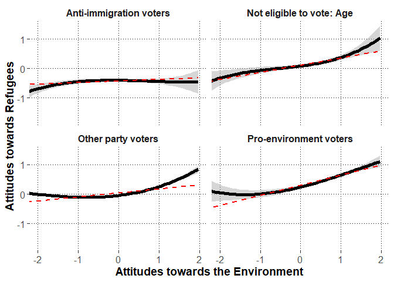

\newpage

# Preparations


## Load packages


```r
library(lme4)
library(lmerTest)
library(dplyr)
library(psych)
library(emmeans)
library(ggplot2)
library(metafor)
library(merTools)
```

## Session information about the packages


```r
sessionInfo()
```

```
## R version 3.6.3 (2020-02-29)
## Platform: x86_64-w64-mingw32/x64 (64-bit)
## Running under: Windows 10 x64 (build 17763)
## 
## Matrix products: default
## 
## locale:
## [1] LC_COLLATE=Finnish_Finland.1252  LC_CTYPE=Finnish_Finland.1252    LC_MONETARY=Finnish_Finland.1252
## [4] LC_NUMERIC=C                     LC_TIME=Finnish_Finland.1252    
## 
## attached base packages:
## [1] stats     graphics  grDevices utils     datasets  methods   base     
## 
## other attached packages:
##  [1] merTools_0.5.0  arm_1.10-1      MASS_7.3-51.5   metafor_2.4-0   ggplot2_3.3.2   emmeans_1.4.6   psych_1.9.12.31
##  [8] dplyr_0.8.5     lmerTest_3.1-2  lme4_1.1-23     Matrix_1.2-18  
## 
## loaded via a namespace (and not attached):
##  [1] Rcpp_1.0.4.6        mvtnorm_1.1-0       lattice_0.20-38     tidyr_1.1.0         zoo_1.8-7           assertthat_0.2.1   
##  [7] digest_0.6.25       foreach_1.5.0       mime_0.9            R6_2.4.1            backports_1.1.6     evaluate_0.14      
## [13] coda_0.19-3         pillar_1.4.3        rlang_0.4.6         multcomp_1.4-13     minqa_1.2.4         nloptr_1.2.2.1     
## [19] rmarkdown_2.1       splines_3.6.3       statmod_1.4.34      stringr_1.4.0       munsell_0.5.0       shiny_1.4.0.2      
## [25] broom_0.5.6         httpuv_1.5.2        compiler_3.6.3      numDeriv_2016.8-1.1 xfun_0.13           pkgconfig_2.0.3    
## [31] mnormt_1.5-6        htmltools_0.4.0     tidyselect_1.1.0    tibble_3.0.1        codetools_0.2-16    later_1.0.0        
## [37] crayon_1.3.4        withr_2.2.0         grid_3.6.3          nlme_3.1-144        xtable_1.8-4        gtable_0.3.0       
## [43] lifecycle_0.2.0     magrittr_1.5        scales_1.1.1        estimability_1.3    stringi_1.4.6       promises_1.1.0     
## [49] ellipsis_0.3.1      vctrs_0.3.0         generics_0.0.2      boot_1.3-24         sandwich_2.5-1      blme_1.0-4         
## [55] TH.data_1.0-10      iterators_1.0.12    tools_3.6.3         glue_1.4.1          purrr_0.3.4         fastmap_1.0.1      
## [61] abind_1.4-5         parallel_3.6.3      survival_3.1-8      yaml_2.2.1          colorspace_1.4-1    knitr_1.28
```

\newpage

## Custom functions


```r
#to extract fixed effects
getFE<-function(model){
  coefs<-data.frame(summary(model)$coefficients)
  coefs$lower<-coefs[,1]-qt(p=.975,df=coefs[,"df"])*coefs[,2]
  coefs$upper<-coefs[,1]+qt(p=.975,df=coefs[,"df"])*coefs[,2]
  coefs<-cbind.data.frame(round(coefs[,1:4],2),
                          p=round(coefs[,5],3),
                          LL=round(coefs$lower,2),
                          UL=round(coefs$upper,2))
  #row.names(coefs)<-substr(row.names(coefs),1,25)
  return(coefs)
}


#to extract random effects
getVC<-function(model){
  VC<-as.data.frame(VarCorr(model))
  VC<-cbind(VC[,c(1:3)],est_SD=VC[,5],est_SD2=VC[,4])
  return(VC)
}


#to extract model deviance
getDEV<-function(model){
  DEV<-unname(summary(model)$devcomp$cmp["dev"])
  return(DEV)
}


#partial correlation test
pcor.test <- function(x,y,z,use="mat",method="p",na.rm=T){


	x <- c(x)
	y <- c(y)
	z <- as.data.frame(z)

	if(use == "mat"){
		p.use <- "Var-Cov matrix"
		pcor = pcor.mat(x,y,z,method=method,na.rm=na.rm)
	}else if(use == "rec"){
		p.use <- "Recursive formula"
		pcor = pcor.rec(x,y,z,method=method,na.rm=na.rm)
	}else{
		stop("\'use\' should be either \"rec\" or \"mat\"!\n")
	}

	# print the method
	if(gregexpr("p",method)[[1]][1] == 1){
		p.method <- "Pearson"
	}else if(gregexpr("s",method)[[1]][1] == 1){
		p.method <- "Spearman"
	}else if(gregexpr("k",method)[[1]][1] == 1){
		p.method <- "Kendall"
	}else{
		stop("\'method\' should be \"pearson\" or \"spearman\" or \"kendall\"!\n")
	}

	# sample number
	n <- dim(na.omit(data.frame(x,y,z)))[1]
	
	# given variables' number
	gn <- dim(z)[2]

	# p-value
	if(p.method == "Kendall"){
		statistic <- pcor/sqrt(2*(2*(n-gn)+5)/(9*(n-gn)*(n-1-gn)))
		p.value <- 2*pnorm(-abs(statistic))

	}else{
		statistic <- pcor*sqrt((n-2-gn)/(1-pcor^2))
  		p.value <- 2*pnorm(-abs(statistic))
	}

	data.frame(estimate=pcor,p.value=p.value,statistic=statistic,n=n,gn=gn,Method=p.method,Use=p.use)
}			


# By using var-cov matrix
pcor.mat <- function(x,y,z,method="p",na.rm=T){

	x <- c(x)
	y <- c(y)
	z <- as.data.frame(z)

	if(dim(z)[2] == 0){
		stop("There should be given data\n")
	}

	data <- data.frame(x,y,z)

	if(na.rm == T){
		data = na.omit(data)
	}

	xdata <- na.omit(data.frame(data[,c(1,2)]))
	Sxx <- cov(xdata,xdata,m=method)

	xzdata <- na.omit(data)
	xdata <- data.frame(xzdata[,c(1,2)])
	zdata <- data.frame(xzdata[,-c(1,2)])
	Sxz <- cov(xdata,zdata,m=method)

	zdata <- na.omit(data.frame(data[,-c(1,2)]))
	Szz <- cov(zdata,zdata,m=method)

	# is Szz positive definite?
	zz.ev <- eigen(Szz)$values
	if(min(zz.ev)[1]<0){
		stop("\'Szz\' is not positive definite!\n")
	}

	# partial correlation
	Sxx.z <- Sxx - Sxz %*% solve(Szz) %*% t(Sxz)
	
	rxx.z <- cov2cor(Sxx.z)[1,2]

	rxx.z
}

# By using recursive formula
pcor.rec <- function(x,y,z,method="p",na.rm=T){
	# 

	x <- c(x)
	y <- c(y)
	z <- as.data.frame(z)

	if(dim(z)[2] == 0){
		stop("There should be given data\n")
	}

	data <- data.frame(x,y,z)

	if(na.rm == T){
		data = na.omit(data)
	}

	# recursive formula
	if(dim(z)[2] == 1){
		tdata <- na.omit(data.frame(data[,1],data[,2]))
		rxy <- cor(tdata[,1],tdata[,2],m=method)

		tdata <- na.omit(data.frame(data[,1],data[,-c(1,2)]))
		rxz <- cor(tdata[,1],tdata[,2],m=method)

		tdata <- na.omit(data.frame(data[,2],data[,-c(1,2)]))
		ryz <- cor(tdata[,1],tdata[,2],m=method)

		rxy.z <- (rxy - rxz*ryz)/( sqrt(1-rxz^2)*sqrt(1-ryz^2) )
		
		return(rxy.z)
	}else{
		x <- c(data[,1])
		y <- c(data[,2])
		z0 <- c(data[,3])
		zc <- as.data.frame(data[,-c(1,2,3)])

		rxy.zc <- pcor.rec(x,y,zc,method=method,na.rm=na.rm)
		rxz0.zc <- pcor.rec(x,z0,zc,method=method,na.rm=na.rm)
		ryz0.zc <- pcor.rec(y,z0,zc,method=method,na.rm=na.rm)
		
		rxy.z <- (rxy.zc - rxz0.zc*ryz0.zc)/( sqrt(1-rxz0.zc^2)*sqrt(1-ryz0.zc^2) )
		return(rxy.z)
	}			
}	
```

\newpage

## Load data


```r
dat<-read.csv2("alig.dat.csv",stringsAsFactors = F)
```

### Variable transformations

#### Country


```r
table(dat$cntry)
```

```
## 
##   AT   BE   CH   DE   EE   ES   FI   GB   IE   IT   NL   NO   PT   SE   SI 
## 1973 1753 1503 2819 1974 1817 1862 1876 2676 2317 1661 1538 1228 1525 1276
```

#### Voting group


```r
#make voting group variable names unique to each country
dat$voting.group<-paste0(dat$cntry,": ",dat$vote.group.combined)
```

#### Centering Attitudes towards the Environment


```r
#rename the variable
dat$environ<-dat$F.env
                                 
describe(dat$environ,fast=T)
```

```
##    vars     n mean   sd  min  max range   se
## X1    1 26887 -0.3 0.86 -3.6 1.67  5.27 0.01
```

```r
#grand mean center
dat$environ.gmc<-dat$environ-mean(dat$environ,na.rm=T)

#obtain dataframe with country means and add to data

environ.cntry<-dat %>%
  group_by(cntry) %>%
  summarize(environ.cntry=mean(environ.gmc,na.rm=T))

dat<-left_join(x=dat,
               y=environ.cntry,
               by=c("cntry"))

#center individuals around country means

dat$environ.cntrymc<-dat$environ.gmc-dat$environ.cntry

#obtain dataframe with voting group means and add to data

environ.voting.group<-dat %>%
  group_by(voting.group) %>%
  summarize(environ.voting.group=mean(environ.cntrymc,na.rm=T))

dat<-left_join(x=dat,
               y=environ.voting.group,
               by=c("voting.group"))

#center individuals around voting group means

dat$environ.vgmc<-dat$environ.cntrymc-dat$environ.voting.group

#describe the variable

describe(dat$environ.vgmc,fast=T)
```

```
##    vars     n mean   sd   min  max range se
## X1    1 26887    0 0.75 -3.01 2.47  5.48  0
```

```r
#rename as lvl1, lvl2, and lvl3

dat$environ.lvl1<-dat$environ.vgmc
dat$environ.lvl2<-dat$environ.voting.group
dat$environ.lvl3<-dat$environ.cntry
```

\newpage

#### Centering Political Engagement


```r
#correlation between the variables

corr.test(dat$nwspol.4,dat$polintr.R,adjust="none")
```

```
## Call:corr.test(x = dat$nwspol.4, y = dat$polintr.R, adjust = "none")
## Correlation matrix 
## [1] 0.3
## Sample Size 
## [1] 27625
## [1] 0
## 
##  To see confidence intervals of the correlations, print with the short=FALSE option
```

```r
#rename the variable

dat$engagement<-dat$polint.agg

#descriptive statistics
psych::describe(dat$engagement,fast=T)
```

```
##    vars     n mean   sd min max range se
## X1    1 27798 2.54 0.79   1   4     3  0
```

```r
#grand mean center
dat$engagement.gmc<-dat$engagement-mean(dat$engagement,na.rm=T)

#obtain dataframe with country means and add to data

engagement.cntry<-dat %>%
  group_by(cntry) %>%
  summarize(engagement.cntry=mean(engagement.gmc,na.rm=T))

dat<-left_join(x=dat,
               y=engagement.cntry,
               by=c("cntry"))

#center individuals around country means

dat$engagement.cntrymc<-dat$engagement.gmc-dat$engagement.cntry

#obtain dataframe with voting group means and add to data

engagement.voting.group<-dat %>%
  group_by(voting.group) %>%
  summarize(engagement.voting.group=mean(engagement.cntrymc,na.rm=T))

dat<-left_join(x=dat,
               y=engagement.voting.group,
               by=c("voting.group"))

#center individuals around voting group means

dat$engagement.vgmc<-dat$engagement.cntrymc-dat$engagement.voting.group

#describe the centered variable

describe(dat$engagement.vgmc,fast=T)
```

```
##    vars     n mean   sd   min max range se
## X1    1 27798    0 0.74 -2.06 2.1  4.17  0
```

```r
#rename as lvl1, lvl2, and lvl3

dat$engagement.lvl1<-dat$engagement.vgmc
dat$engagement.lvl2<-dat$engagement.voting.group
dat$engagement.lvl3<-dat$engagement.cntry
```

\newpage

#### Centering Political Interest Item (for exploratory analysis)


```r
#rename the variable (this will replace the previous item with same name)
dat$polintr<-dat$polintr.R

#descriptive statistics
psych::describe(dat$polintr,fast=T)
```

```
##    vars     n mean   sd min max range   se
## X1    1 27778 2.51 0.91   1   4     3 0.01
```

```r
#grand mean center
dat$polintr.gmc<-dat$polintr-mean(dat$polintr,na.rm=T)

#obtain dataframe with country means and add to data

polintr.cntry<-dat %>%
  group_by(cntry) %>%
  summarize(polintr.cntry=mean(polintr.gmc,na.rm=T))

dat<-left_join(x=dat,
               y=polintr.cntry,
               by=c("cntry"))

#center individuals around country means

dat$polintr.cntrymc<-dat$polintr.gmc-dat$polintr.cntry

#obtain dataframe with voting group means and add to data

polintr.voting.group<-dat %>%
  group_by(voting.group) %>%
  summarize(polintr.voting.group=mean(polintr.cntrymc,na.rm=T))

dat<-left_join(x=dat,
               y=polintr.voting.group,
               by=c("voting.group"))

#center individuals around voting group means

dat$polintr.vgmc<-dat$polintr.cntrymc-dat$polintr.voting.group

#describe the centered variable

describe(dat$polintr.vgmc,fast=T)
```

```
##    vars     n mean   sd   min  max range se
## X1    1 27778    0 0.82 -2.19 2.36  4.55  0
```

```r
#rename as lvl1, lvl2, and lvl3

dat$polintr.lvl1<-dat$polintr.vgmc
dat$polintr.lvl2<-dat$polintr.voting.group
dat$polintr.lvl3<-dat$polintr.cntry
```


\newpage

#### Centering "Time used for consuming political media" (for exploratory analysis)


```r
#rename the variable
dat$polnews<-dat$nwspol.4

#descriptive statistics
psych::describe(dat$polnews,fast=T)
```

```
##    vars     n mean   sd min max range   se
## X1    1 27645 2.59 1.04   1   4     3 0.01
```

```r
#grand mean center
dat$polnews.gmc<-dat$polnews-mean(dat$polnews,na.rm=T)

#obtain dataframe with country means and add to data

polnews.cntry<-dat %>%
  group_by(cntry) %>%
  summarize(polnews.cntry=mean(polnews.gmc,na.rm=T))

dat<-left_join(x=dat,
               y=polnews.cntry,
               by=c("cntry"))

#center individuals around country means

dat$polnews.cntrymc<-dat$polnews.gmc-dat$polnews.cntry

#obtain dataframe with voting group means and add to data

polnews.voting.group<-dat %>%
  group_by(voting.group) %>%
  summarize(polnews.voting.group=mean(polnews.cntrymc,na.rm=T))

dat<-left_join(x=dat,
               y=polnews.voting.group,
               by=c("voting.group"))

#center individuals around voting group means

dat$polnews.vgmc<-dat$polnews.cntrymc-dat$polnews.voting.group

#describe the centered variable

describe(dat$polnews.vgmc,fast=T)
```

```
##    vars     n mean sd   min  max range   se
## X1    1 27645    0  1 -2.19 2.31   4.5 0.01
```

```r
#rename as lvl1, lvl2, and lvl3

dat$polnews.lvl1<-dat$polnews.vgmc
dat$polnews.lvl2<-dat$polnews.voting.group
dat$polnews.lvl3<-dat$polnews.cntry
```

\newpage

#### Rename and grand mean center the Attitudes towards refugees (pro-refugee attitudes indicate high scores)


```r
#calculate the sum score
dat$refugees<-dat$F.imm
                                 
describe(dat$refugees,fast=T)
```

```
##    vars     n mean   sd   min  max range   se
## X1    1 25599 0.45 1.02 -2.23 2.93  5.15 0.01
```

```r
#grand mean center
dat$refugees<-dat$refugees-mean(dat$refugees,na.rm=T)

#rename
dat$refugees.gmc<-dat$refugees

#obtain dataframe with country means and add to data

refugees.cntry<-dat %>%
  group_by(cntry) %>%
  summarize(refugees.cntry=mean(refugees.gmc,na.rm=T))

dat<-left_join(x=dat,
               y=refugees.cntry,
               by=c("cntry"))

#center individuals around country means

dat$refugees.cntrymc<-dat$refugees.gmc-dat$refugees.cntry

#obtain dataframe with voting group means and add to data

refugees.voting.group<-dat %>%
  group_by(voting.group) %>%
  summarize(refugees.voting.group=mean(refugees.cntrymc,na.rm=T))

dat<-left_join(x=dat,
               y=refugees.voting.group,
               by=c("voting.group"))

#center individuals around voting group means

dat$refugees.vgmc<-dat$refugees.cntrymc-dat$refugees.voting.group

#describe the variable

describe(dat$refugees.vgmc,fast=T)
```

```
##    vars     n mean   sd   min  max range   se
## X1    1 25599    0 0.81 -3.02 3.63  6.66 0.01
```

```r
#rename as lvl1, lvl2, and lvl3

dat$refugees.lvl1<-dat$refugees.vgmc
dat$refugees.lvl2<-dat$refugees.voting.group
dat$refugees.lvl3<-dat$refugees.cntry
```

\newpage

#### Rename and Center the covariates aroung grand mean or logical middle points if applicable


```r
#grand-mean center age
dat$age<-dat$agea-mean(dat$agea,na.rm=T)
#sex around zero
dat$gender<-dat$gndr-1.5 #-0.5 males, 0.5 females
#rename occupation variable
dat$occup<-dat$isco.13
#grand-mean center education years
dat$educ<-dat$eduyrs-mean(dat$eduyrs,na.rm=T)
#residence around zero
dat$resid<-dat$rural-0.5 #-0.5 urban, 0.5 rural
```

\newpage

#### Voting group dummy-coded variables


```r
#recode if the party voted is =1, or not =0 anti-immigration
dat$anti.imm.party.dummy<-ifelse(is.na(dat$anti.imm.party.rule2),0,1)
#recode if the party voted is =1, or not =0 pro-environment
dat$pro.env.party.dummy<-ifelse(is.na(dat$pro.env.party.manual),0,1)

#dat$other.party.dummy<-ifelse(grepl("Other",dat$vote.group.combined),1,0)

#dummy-code not voting
dat$did.not.vote.dummy<-ifelse(grepl("did not vote",dat$vote.group.combined),1,0)
table(dat$did.not.vote.dummy)
```

```
## 
##     0     1 
## 22913  4885
```

```r
#dummy-code "don't know"
dat$dont.know.dummy<-ifelse(grepl("Don't know",dat$vote.group.combined),1,0)
table(dat$dont.know.dummy)
```

```
## 
##     0     1 
## 26778  1020
```

```r
#dummy-code invalid vote
dat$invalid.vote.dummy<-ifelse(grepl("Invalid vote",dat$vote.group.combined),1,0)
table(dat$invalid.vote.dummy)
```

```
## 
##     0     1 
## 27783    15
```

```r
#dummy-code "no answer"
dat$no.answer.dummy<-ifelse(grepl("No answer",dat$vote.group.combined),1,0)
table(dat$no.answer.dummy)
```

```
## 
##     0     1 
## 27786    12
```

```r
#dummy-code not-eligible: age
dat$not.eligible.age.dummy<-ifelse(grepl("not eligible: age",dat$vote.group.combined),1,0)
table(dat$not.eligible.age.dummy)
```

```
## 
##     0     1 
## 26501  1297
```

```r
#dummy code not-eligible: citizenship
dat$not.eligible.citizenship.dummy<-ifelse(grepl("not eligible: citizenship",dat$vote.group.combined),1,0)
table(dat$not.eligible.citizenship.dummy)
```

```
## 
##     0     1 
## 26659  1139
```

```r
#dummy-code not-eligible: other reasons
dat$not.eligible.other.dummy<-ifelse(grepl("not eligible: other",dat$vote.group.combined),1,0)
table(dat$not.eligible.other.dummy)
```

```
## 
##     0     1 
## 27636   162
```

```r
#add dummy-variable for other_party voting

dat<- dat %>%
  mutate(other.party.dummy:=case_when(
    anti.imm.party.dummy==1 |
      pro.env.party.dummy==1 |
      did.not.vote.dummy==1 |
      dont.know.dummy==1 |
      invalid.vote.dummy==1 |
      no.answer.dummy==1 |
      not.eligible.age.dummy==1 |
      not.eligible.citizenship.dummy==1 |
      not.eligible.other.dummy==1 ~0,
    TRUE~1
  ))

table(dat$other.party.dummy)
```

```
## 
##     0     1 
## 13004 14794
```

```r
#recode the names for a new multi-category variable: all.parties.lvl2

dat<-dat %>%
  mutate(all.parties.lvl2:=case_when(
    did.not.vote.dummy==1~"Did not vote",
    dont.know.dummy==1~"Don't know",
    no.answer.dummy==1~"No answer",
    invalid.vote.dummy==1~"Invalid vote",
    not.eligible.age.dummy==1~"NE age",
    not.eligible.citizenship.dummy==1~"NE citizen",
    not.eligible.other.dummy==1~"NE other",
    other.party.dummy==1~"Other party",
    anti.imm.party.dummy==1~"Anti-immigration party",
    pro.env.party.dummy==1~"Pro-environment party",
  ),
  party:=case_when(
    other.party.dummy==1~"Other party",
    anti.imm.party.dummy==1~"Anti-immigration party",
    pro.env.party.dummy==1~"Pro-environment party",
    TRUE~NA_character_
  ))
```


#### Omit missing variables


```r
#missing values per each row
dat$analysis.miss<-
  is.na(dat$cntry)+
  is.na(dat$voting.group)+
  is.na(dat$refugees)+
  is.na(dat$environ)+
  is.na(dat$vote.group.combined)+
  is.na(dat$age)+
  is.na(dat$gender)+
  is.na(dat$occup)+
  is.na(dat$educ)+
  is.na(dat$resid)+
  is.na(dat$engagement)
table(dat$analysis.miss)
```

```
## 
##     0     1     2 
## 25004  2478   316
```

```r
#include only those without any missing values
dat<-dat %>%
  filter(analysis.miss ==0)
```

\newpage


# Hypothesis 1: There will be a positive association between pro-environment and pro-refugee attitudes

### Model 0: Intercepts only


```r
H1.mod0<-lmer(refugees~(1|voting.group)+(1|cntry),
              data=dat,REML=F)

(FE.H1.mod0<-getFE(H1.mod0))
```

```
##             Estimate Std..Error    df t.value     p    LL  UL
## (Intercept)     0.09       0.15 14.99    0.59 0.563 -0.23 0.4
```

```r
(VC.H1.mod0<-getVC(H1.mod0))
```

```
##            grp        var1 var2    est_SD   est_SD2
## 1 voting.group (Intercept) <NA> 0.3295584 0.1086087
## 2        cntry (Intercept) <NA> 0.5592081 0.3127137
## 3     Residual        <NA> <NA> 0.8146453 0.6636470
```

```r
getDEV(H1.mod0)
```

```
## [1] 61322.27
```

```r
#ICC

##voting group

VC.H1.mod0[VC.H1.mod0$grp=="voting.group","est_SD2"]/
  sum(VC.H1.mod0[,"est_SD2"])
```

```
## [1] 0.100103
```

```r
##country

VC.H1.mod0[VC.H1.mod0$grp=="cntry","est_SD2"]/
  sum(VC.H1.mod0[,"est_SD2"])
```

```
## [1] 0.2882235
```


\newpage

### Model 1: Covariates


```r
H1.mod1<-lmer(refugees~(1|voting.group)+(1|cntry)+
                age+gender+educ+resid+occup
                ,data=dat,REML=F)

#model comparison
anova(H1.mod0,
      H1.mod1)
```

```
## Data: dat
## Models:
## H1.mod0: refugees ~ (1 | voting.group) + (1 | cntry)
## H1.mod1: refugees ~ (1 | voting.group) + (1 | cntry) + age + gender + 
## H1.mod1:     educ + resid + occup
##         npar   AIC   BIC logLik deviance  Chisq Df Pr(>Chisq)    
## H1.mod0    4 61330 61363 -30661    61322                         
## H1.mod1   20 60562 60725 -30261    60522 800.22 16  < 2.2e-16 ***
## ---
## Signif. codes:  0 '***' 0.001 '**' 0.01 '*' 0.05 '.' 0.1 ' ' 1
```

```r
(FE.H1.mod1<-getFE(H1.mod1))
```

```
##                                                         Estimate Std..Error       df t.value     p    LL    UL
## (Intercept)                                                 0.06       0.16    24.50    0.37 0.711 -0.27  0.40
## age                                                         0.00       0.00 24677.79   -2.69 0.007  0.00  0.00
## gender                                                      0.06       0.01 24867.92    5.87 0.000  0.04  0.09
## educ                                                        0.02       0.00 24989.31   12.52 0.000  0.02  0.02
## resid                                                      -0.08       0.01 24901.20   -7.18 0.000 -0.10 -0.06
## occupClerical support workers                              -0.02       0.08 24838.29   -0.25 0.802 -0.17  0.13
## occupCraft and related trades workers                      -0.10       0.08 24842.39   -1.32 0.188 -0.26  0.05
## occupElementary occupations                                 0.00       0.08 24842.22    0.02 0.986 -0.15  0.16
## occupManagers                                               0.05       0.08 24839.36    0.58 0.561 -0.11  0.20
## occupOther: Not in paid work                                0.12       0.08 24924.54    1.44 0.151 -0.04  0.27
## occupPlant and machine operators, and assemblers           -0.05       0.08 24842.98   -0.69 0.492 -0.21  0.10
## occupProfessionals                                          0.13       0.08 24839.51    1.66 0.096 -0.02  0.28
## occupRetired                                                0.01       0.09 24840.54    0.07 0.946 -0.17  0.18
## occupService and sales workers                             -0.06       0.08 24839.72   -0.81 0.419 -0.21  0.09
## occupSkilled agricultural, forestry and fishery workers    -0.01       0.08 24844.05   -0.13 0.900 -0.17  0.15
## occupTechnicians and associate professionals                0.00       0.08 24835.97    0.01 0.995 -0.15  0.15
## occupUnemployed                                            -0.01       0.09 24853.70   -0.14 0.886 -0.20  0.17
```

```r
(VC.H1.mod1<-getVC(H1.mod1))
```

```
##            grp        var1 var2    est_SD    est_SD2
## 1 voting.group (Intercept) <NA> 0.2998019 0.08988117
## 2        cntry (Intercept) <NA> 0.5521168 0.30483291
## 3     Residual        <NA> <NA> 0.8021827 0.64349707
```

```r
getDEV(H1.mod1)
```

```
## [1] 60522.05
```

```r
write.csv2(FE.H1.mod1,"FE.H1.mod1.csv")

#variance explained

##lvl 1: individuals

(VC.H1.mod0[VC.H1.mod0$grp=="Residual","est_SD2"]-
     VC.H1.mod1[VC.H1.mod1$grp=="Residual","est_SD2"])/
  VC.H1.mod0[VC.H1.mod0$grp=="Residual","est_SD2"]
```

```
## [1] 0.03036237
```

```r
##lvl 2: voting group

(VC.H1.mod0[VC.H1.mod0$grp=="voting.group","est_SD2"]-
     VC.H1.mod1[VC.H1.mod1$grp=="voting.group","est_SD2"])/
  VC.H1.mod0[VC.H1.mod0$grp=="voting.group","est_SD2"]
```

```
## [1] 0.1724315
```

```r
##lvl 3: country

(VC.H1.mod0[VC.H1.mod0$grp=="cntry","est_SD2"]-
     VC.H1.mod1[VC.H1.mod1$grp=="cntry","est_SD2"])/
  VC.H1.mod0[VC.H1.mod0$grp=="cntry","est_SD2"]
```

```
## [1] 0.02520132
```

```r
##total

(sum(VC.H1.mod0$est_SD2)-sum(VC.H1.mod1$est_SD2))/
  sum(VC.H1.mod0$est_SD2)
```

```
## [1] 0.04309638
```

```r
#individual contributions of covariates
anova(H1.mod1)
```

```
## Type III Analysis of Variance Table with Satterthwaite's method
##         Sum Sq Mean Sq NumDF DenDF  F value    Pr(>F)    
## age      4.665   4.665     1 24678   7.2491  0.007098 ** 
## gender  22.204  22.204     1 24868  34.5050 4.306e-09 ***
## educ   100.905 100.905     1 24989 156.8074 < 2.2e-16 ***
## resid   33.157  33.157     1 24901  51.5259 7.264e-13 ***
## occup  112.886   9.407    12 24824  14.6188 < 2.2e-16 ***
## ---
## Signif. codes:  0 '***' 0.001 '**' 0.01 '*' 0.05 '.' 0.1 ' ' 1
```

\newpage

### Model 2: Fixed effects for Attitudes towards the Environment


```r
H1.mod2<-lmer(refugees~(1|voting.group)+(1|cntry)+
                age+gender+educ+resid+occup+
                environ.lvl1,data=dat,REML=F)

#model comparison
anova(H1.mod1,
      H1.mod2)
```

```
## Data: dat
## Models:
## H1.mod1: refugees ~ (1 | voting.group) + (1 | cntry) + age + gender + 
## H1.mod1:     educ + resid + occup
## H1.mod2: refugees ~ (1 | voting.group) + (1 | cntry) + age + gender + 
## H1.mod2:     educ + resid + occup + environ.lvl1
##         npar   AIC   BIC logLik deviance  Chisq Df Pr(>Chisq)    
## H1.mod1   20 60562 60725 -30261    60522                         
## H1.mod2   21 59992 60162 -29975    59950 572.36  1  < 2.2e-16 ***
## ---
## Signif. codes:  0 '***' 0.001 '**' 0.01 '*' 0.05 '.' 0.1 ' ' 1
```

```r
(FE.H1.mod2<-getFE(H1.mod2))
```

```
##                                                         Estimate Std..Error       df t.value     p    LL    UL
## (Intercept)                                                 0.06       0.16    24.27    0.38 0.708 -0.27  0.40
## age                                                         0.00       0.00 24721.71   -1.79 0.074  0.00  0.00
## gender                                                      0.06       0.01 24865.24    5.33 0.000  0.04  0.08
## educ                                                        0.02       0.00 24987.26   10.46 0.000  0.01  0.02
## resid                                                      -0.07       0.01 24897.56   -6.62 0.000 -0.09 -0.05
## occupClerical support workers                              -0.02       0.08 24836.16   -0.26 0.794 -0.17  0.13
## occupCraft and related trades workers                      -0.09       0.08 24840.21   -1.18 0.239 -0.24  0.06
## occupElementary occupations                                 0.01       0.08 24840.00    0.17 0.861 -0.14  0.17
## occupManagers                                               0.04       0.08 24837.23    0.49 0.623 -0.11  0.19
## occupOther: Not in paid work                                0.12       0.08 24920.56    1.50 0.133 -0.04  0.28
## occupPlant and machine operators, and assemblers           -0.05       0.08 24840.67   -0.65 0.517 -0.20  0.10
## occupProfessionals                                          0.12       0.08 24837.36    1.54 0.123 -0.03  0.27
## occupRetired                                                0.03       0.09 24838.41    0.31 0.753 -0.14  0.20
## occupService and sales workers                             -0.06       0.08 24837.60   -0.72 0.469 -0.21  0.09
## occupSkilled agricultural, forestry and fishery workers     0.00       0.08 24841.91   -0.02 0.986 -0.16  0.16
## occupTechnicians and associate professionals               -0.01       0.08 24833.87   -0.09 0.932 -0.16  0.14
## occupUnemployed                                             0.01       0.09 24851.78    0.08 0.933 -0.18  0.19
## environ.lvl1                                                0.16       0.01 24793.19   24.07 0.000  0.15  0.18
```

```r
(VC.H1.mod2<-getVC(H1.mod2))
```

```
##            grp        var1 var2    est_SD    est_SD2
## 1 voting.group (Intercept) <NA> 0.3036170 0.09218326
## 2        cntry (Intercept) <NA> 0.5514434 0.30408984
## 3     Residual        <NA> <NA> 0.7929074 0.62870215
```

```r
getDEV(H1.mod2)
```

```
## [1] 59949.69
```

```r
write.csv2(FE.H1.mod2,"FE.H1.mod2.csv")

#variance explained

##lvl 1: individuals

(VC.H1.mod1[VC.H1.mod1$grp=="Residual","est_SD2"]-
     VC.H1.mod2[VC.H1.mod2$grp=="Residual","est_SD2"])/
  VC.H1.mod1[VC.H1.mod1$grp=="Residual","est_SD2"]
```

```
## [1] 0.02299143
```

```r
##total

(sum(VC.H1.mod1$est_SD2)-sum(VC.H1.mod2$est_SD2))/
  sum(VC.H1.mod1$est_SD2)
```

```
## [1] 0.01274876
```

\newpage

### Model 3: Random effects for Attitudes towards the Environment


```r
H1.mod3<-lmer(refugees~(environ.lvl1|voting.group)+
                (environ.lvl1|cntry)+
                age+gender+educ+resid+occup+
                environ.lvl1,data=dat,REML=F,
                 control=lmerControl(optimizer="bobyqa",
                                     optCtrl=list(maxfun=2e8)))


#model comparison
anova(H1.mod2,
      H1.mod3)
```

```
## Data: dat
## Models:
## H1.mod2: refugees ~ (1 | voting.group) + (1 | cntry) + age + gender + 
## H1.mod2:     educ + resid + occup + environ.lvl1
## H1.mod3: refugees ~ (environ.lvl1 | voting.group) + (environ.lvl1 | cntry) + 
## H1.mod3:     age + gender + educ + resid + occup + environ.lvl1
##         npar   AIC   BIC logLik deviance  Chisq Df Pr(>Chisq)    
## H1.mod2   21 59992 60162 -29975    59950                         
## H1.mod3   25 59850 60053 -29900    59800 149.46  4  < 2.2e-16 ***
## ---
## Signif. codes:  0 '***' 0.001 '**' 0.01 '*' 0.05 '.' 0.1 ' ' 1
```

```r
(FE.H1.mod3<-getFE(H1.mod3))
```

```
##                                                         Estimate Std..Error       df t.value     p    LL    UL
## (Intercept)                                                 0.07       0.16    24.16    0.40 0.689 -0.27  0.40
## age                                                         0.00       0.00 24472.93   -1.74 0.082  0.00  0.00
## gender                                                      0.06       0.01 24848.33    5.24 0.000  0.04  0.08
## educ                                                        0.02       0.00 24981.72   10.46 0.000  0.01  0.02
## resid                                                      -0.07       0.01 24880.41   -6.71 0.000 -0.09 -0.05
## occupClerical support workers                              -0.02       0.08 24806.23   -0.29 0.771 -0.17  0.13
## occupCraft and related trades workers                      -0.09       0.08 24814.17   -1.22 0.221 -0.24  0.06
## occupElementary occupations                                 0.01       0.08 24811.50    0.14 0.889 -0.14  0.16
## occupManagers                                               0.03       0.08 24812.38    0.42 0.673 -0.12  0.18
## occupOther: Not in paid work                                0.12       0.08 24892.44    1.46 0.145 -0.04  0.27
## occupPlant and machine operators, and assemblers           -0.05       0.08 24815.43   -0.70 0.482 -0.21  0.10
## occupProfessionals                                          0.11       0.08 24811.25    1.48 0.139 -0.04  0.26
## occupRetired                                                0.02       0.09 24809.13    0.27 0.788 -0.15  0.20
## occupService and sales workers                             -0.06       0.08 24810.57   -0.74 0.460 -0.21  0.09
## occupSkilled agricultural, forestry and fishery workers    -0.01       0.08 24815.14   -0.10 0.918 -0.17  0.15
## occupTechnicians and associate professionals               -0.01       0.08 24806.13   -0.12 0.904 -0.16  0.14
## occupUnemployed                                             0.00       0.09 24824.02    0.00 0.999 -0.18  0.18
## environ.lvl1                                                0.17       0.03    14.55    6.78 0.000  0.12  0.23
```

```r
(VC.H1.mod3<-getVC(H1.mod3))
```

```
##            grp         var1         var2     est_SD     est_SD2
## 1 voting.group  (Intercept)         <NA> 0.30340904 0.092057048
## 2 voting.group environ.lvl1         <NA> 0.06796968 0.004619877
## 3 voting.group  (Intercept) environ.lvl1 0.51590618 0.010639335
## 4        cntry  (Intercept)         <NA> 0.55222959 0.304957519
## 5        cntry environ.lvl1         <NA> 0.09172306 0.008413120
## 6        cntry  (Intercept) environ.lvl1 0.24468664 0.012393914
## 7     Residual         <NA>         <NA> 0.78911031 0.622695077
```

```r
getDEV(H1.mod3)
```

```
## [1] 59800.23
```

```r
write.csv2(FE.H1.mod3,"FE.H1.mod3.csv")
```

\newpage


#### Describe the correlation between refugee and environment attitudes by country


```r
#model implied associations (posterior modes)

#fit also a model without covariates


slope.mod.no.cov<-lmer(refugees~(environ.lvl1|voting.group)+
                (environ.lvl1|cntry)+
                environ.lvl1,data=dat,REML=F,
                 control=lmerControl(optimizer="bobyqa",
                                     optCtrl=list(maxfun=2e8)))

#correlations from data

cntry.cor.dat<-dat %>%
  dplyr::select(cntry,environ.gmc,refugees,age,gender,educ,resid) %>%
  group_by(cntry) %>%
  summarize(observed_r=cor(environ.gmc,refugees,use="pairwise.complete.obs"),
            partial_r=pcor.test(x=environ.gmc,
                         y=refugees,
                         z=data.frame(age,
                                      gender,
                                      educ,
                                      resid))$estimate,
            n=n())

#posterior modes from multilevel models

country.effs.dat<-
  cbind.data.frame(
    cntry=rownames(
      coefficients(H1.mod3)$cntry),
    slope_with_covs=coefficients(
      H1.mod3)$cntry[,"environ.lvl1"],
    slope_without_covs=coefficients(
      slope.mod.no.cov)$cntry[,"environ.lvl1"],
    cntry.cor.dat[,2:4])


country.effs.dat$partial_r.se<-1/sqrt(country.effs.dat$n-3)
country.effs.dat$country<-
  c("Austria",
    "Belgium",
    "Switzerland",
    #"Czech Republic",
    "Germany",
    "Estonia",
    "Spain",
    "Finland",
    #"France",
    "Great Britain",
    #"Hungary",
    "Ireland",
    "Italy",
    #"Lithuania",
    "Netherlands",
    "Norway",
    #"Poland",
    "Portugal",
    "Sweden",
    "Slovenia")


country.effs.dat <- country.effs.dat[order(country.effs.dat$country),]

write.csv2(country.effs.dat,"associations_within_countries.csv")
```

\newpage

#### Describe the correlation between refugee and environment attitudes by voting group

* It was not possible to calculate the partial coefficients for all voting groups because of small group size and lack of variance in either attitudes or covariates, so only zero-order correlations were calculated as well as posterior mode slopes


```r
#get size of each voting group

voting.group.n<-dat %>%
  group_by(voting.group) %>%
  summarize(voting.group.n=n())

#add voting group size to the main data

dat<-left_join(x=dat,
               y=voting.group.n,
               by=c("voting.group"))

#calculate observed correlations


all.voting.group.cor.dat<-dat %>%
  #filter(voting.group.n>12) %>%
  dplyr::select(voting.group,environ.gmc,age,
                                      gender,
                                      educ,
                                      resid,
         refugees,anti.imm.party.dummy,
         pro.env.party.dummy) %>%
  group_by(voting.group) %>%
  summarize(observed_r=cor(environ.gmc,
                           refugees,use="pairwise.complete.obs"),

            n=n(),
            anti.imm=sum(anti.imm.party.dummy)/n(),
            pro.env=sum(pro.env.party.dummy)/n())

#posterior modes for voting group specific associations

voting.group.effs.dat<-
  cbind.data.frame(
    voting.group=rownames(
      coefficients(H1.mod3)$voting.group),
    slope_with_covs=coefficients(
      H1.mod3)$voting.group[,"environ.lvl1"],
    slope_without_covs=coefficients(
      slope.mod.no.cov)$voting.group[,"environ.lvl1"])

#add country level variability to slope-estimates

voting.group.effs.dat$cntry<-substr(voting.group.effs.dat$voting.group,1,2)
voting.group.effs.dat.w.country<-left_join(x=voting.group.effs.dat,
                                           y=country.effs.dat,
                                           by="cntry",suffix=c("",".cntry"))
```

```
## Warning: Column `cntry` joining character vector and factor, coercing into character vector
```

```r
voting.group.effs.dat.w.country$slope_with_covs_add_cntry<-
  voting.group.effs.dat.w.country$slope_with_covs+
  voting.group.effs.dat.w.country$slope_with_covs.cntry
  
voting.group.effs.dat.w.country$slope_without_covs_add_cntry<-
  voting.group.effs.dat.w.country$slope_without_covs+
  voting.group.effs.dat.w.country$slope_without_covs.cntry

voting.group.effs.dat.w.country<-
  voting.group.effs.dat.w.country %>%
  dplyr::select(voting.group,
                slope_with_covs,
                slope_without_covs,
                slope_with_covs_add_cntry,
                slope_without_covs_add_cntry,
                n)


voting.group.slopes.dat<-left_join(x=voting.group.effs.dat.w.country,
                                 y=all.voting.group.cor.dat,
                                 by=c("voting.group"))
```

```
## Warning: Column `voting.group` joining factor and character vector, coercing into character vector
```

```r
write.csv2(voting.group.slopes.dat,"associations_within_voting_groups.csv")
```


\newpage

##### Print a forest plot


```r
#Create forest plot of country estimates
library(dmetar)
```

```
## Extensive documentation for the dmetar package can be found at: 
##  www.bookdown.org/MathiasHarrer/Doing_Meta_Analysis_in_R/
```

```r
library(meta)
```

```
## Loading 'meta' package (version 4.13-0).
## Type 'help(meta)' for a brief overview.
```

```r
# country-level
#nrow(country.effs.dat)
#col.vect.cntry<-rep(c("#4CC542","#05B3D8"),each=10)

m <- metacor(cor=partial_r,
             n=n,
             data=country.effs.dat,
             studlab=country.effs.dat$country,
             comb.fixed = FALSE,
             comb.random = TRUE,
             prediction=TRUE,
             sm="ZCOR",
             backtransf=TRUE,
             level=.95)
m
```

```
##                   COR            95%-CI %W(random)
## Austria        0.1952 [ 0.1500; 0.2395]        6.7
## Belgium        0.1645 [ 0.1177; 0.2105]        6.7
## Estonia       -0.0189 [-0.0640; 0.0263]        6.7
## Finland        0.2866 [ 0.2437; 0.3284]        6.7
## Germany        0.2579 [ 0.2221; 0.2930]        6.9
## Great Britain  0.2510 [ 0.2070; 0.2939]        6.7
## Ireland        0.1844 [ 0.1444; 0.2239]        6.8
## Italy          0.1111 [ 0.0675; 0.1543]        6.8
## Netherlands    0.1698 [ 0.1185; 0.2202]        6.6
## Norway         0.3019 [ 0.2552; 0.3472]        6.6
## Portugal       0.1487 [ 0.0911; 0.2053]        6.5
## Slovenia       0.0182 [-0.0397; 0.0760]        6.5
## Spain          0.1465 [ 0.0921; 0.1999]        6.5
## Sweden         0.2140 [ 0.1624; 0.2644]        6.6
## Switzerland    0.2185 [ 0.1669; 0.2688]        6.6
## 
## Number of studies combined: k = 15
## 
##                         COR            95%-CI    z  p-value
## Random effects model 0.1782 [ 0.1323; 0.2233] 7.50 < 0.0001
## Prediction interval         [-0.0201; 0.3630]              
## 
## Quantifying heterogeneity:
##  tau^2 = 0.0080 [0.0040; 0.0208]; tau = 0.0895 [0.0631; 0.1442];
##  I^2 = 93.0% [90.0%; 95.1%]; H = 3.78 [3.17; 4.51]
## 
## Test of heterogeneity:
##       Q d.f.  p-value
##  199.79   14 < 0.0001
## 
## Details on meta-analytical method:
## - Inverse variance method
## - DerSimonian-Laird estimator for tau^2
## - Jackson method for confidence interval of tau^2 and tau
## - Fisher's z transformation of correlations
```

```r
grDevices::pdf(file = "forestplot.pdf",family="sans") 

forest.m<-meta::forest(m,overall=T,
                       #layout = "JAMA",
                       prediction=F,
                       leftlabs=c("Country","n"),
                       print.I2=F,
                       print.tau2=F,
                       het.stat=F,
                       overall.hetstat=F,
                       text.random="Overall",
                       #weights=F,
                       #label.right="Partial Correlation Coefficient",
                       #bottom.lr=F
                       rightcols=c("effect", "ci"),
                       rightlabs = c("","95% CI"),
                       smlab = "Partial Correlation Coefficient",
                       weight.study="random"#,
                       #col.study=col.vect.cntry,
                       #col.square=col.vect.cntry
                       
)

graphics.off()


# print separate plots for voting groups within each country


cntry.vect<-as.character(unique(country.effs.dat$cntry))

#drop groups smaller than 6
voting.group.plot.dat<-voting.group.slopes.dat %>%
  filter(n.y>4)

voting.group.plot.dat$color<-ifelse(voting.group.plot.dat$anti.imm==1,
                                    "#05B3D8",
                                    ifelse(voting.group.plot.dat$pro.env==1,
                                           "#4CC542","darkgray"))

table(voting.group.plot.dat$color)
```

```
## 
##  #05B3D8  #4CC542 darkgray 
##       22       23      186
```

```r
pdf("forest_for_each_country.pdf",family = "sans",width = 12,height=10)

for (i in cntry.vect){
  
  dat.temp<-voting.group.plot.dat[grepl(paste0(i,": "),voting.group.plot.dat$voting.group),]
  
  m.temp <- metacor(cor=observed_r,
                    n=n.y,
                    data=dat.temp,
                    studlab=dat.temp[,"voting.group"],
                    comb.fixed = FALSE,
                    comb.random = TRUE,
                    prediction=TRUE,
                    sm="ZCOR",
                    backtransf=TRUE,
                    level=.95)
  
  forest.m.temp<-meta::forest(m.temp,overall=T,
                              prediction=F,
                              leftlabs=c("Voting group","n"),
                              print.I2=F,
                              print.tau2=F,
                              het.stat=F,
                              overall.hetstat=F,
                              text.random="Overall",
                              rightcols=c("effect", "ci"),
                              rightlabs = c("","95% CI"),
                              smlab = "Correlation Coefficient",
                              weight.study="random",
                              xlim=c(-0.8,0.8),
                              col.study=dat.temp[,"color"],
                              col.square=dat.temp[,"color"])
  
}


dev.off()
```

```
## null device 
##           1
```

```r
# print separate plots for anti-immigration parties


#drop groups smaller than 6 and filter only anti-refugee parties
anti.imm.group.plot.dat<-voting.group.slopes.dat %>%
  filter(n.y>4,anti.imm==1)

anti.imm.group.plot.dat$color<-"#05B3D8"

pdf("forest_for_anti_refugee.pdf",family = "sans",width = 12,height=10)

m.anti.imm <- metacor(cor=observed_r,
                    n=n.y,
                    data=anti.imm.group.plot.dat,
                    studlab=anti.imm.group.plot.dat[,"voting.group"],
                    comb.fixed = FALSE,
                    comb.random = TRUE,
                    prediction=TRUE,
                    sm="ZCOR",
                    backtransf=TRUE,
                    level=.95)

m.anti.imm
```

```
##                                             COR            95%-CI %W(random)
## AT: BZÖ                                  0.0359 [-0.7371; 0.7682]        0.3
## AT: FPÖ                                  0.2447 [ 0.1171; 0.3643]        8.2
## BE: N-VA                                -0.0186 [-0.1414; 0.1047]        8.6
## BE: Parti Populaire                     -0.3576 [-0.9425; 0.7665]        0.2
## BE: Vlaams Belang                        0.2188 [-0.1536; 0.5368]        2.0
## CH: Swiss People's Party                 0.1408 [-0.0289; 0.3025]        6.3
## DE: AfD                                  0.0242 [-0.2379; 0.2830]        3.5
## DE: NPD                                  0.6411 [-0.0401; 0.9154]        0.5
## EE: Eesti Konservatiivne Rahvaerakond    0.1247 [-0.1136; 0.3495]        4.1
## ES: Partido Popular - PP                 0.0872 [-0.0406; 0.2123]        8.4
## FI: True Finns                           0.1694 [ 0.0273; 0.3048]        7.6
## GB: Conservative                         0.2321 [ 0.1452; 0.3154]       10.6
## GB: Democratic Unionist Party (nir)      0.4390 [-0.4691; 0.8959]        0.3
## GB: UK Independence Party               -0.0145 [-0.2074; 0.1796]        5.4
## IT: Fratelli d'Italia                    0.1834 [-0.2195; 0.5329]        1.7
## IT: Lega Nord                           -0.1356 [-0.3576; 0.1009]        4.2
## IT: Popolo delle Libertà (PdL)           0.2532 [ 0.0577; 0.4300]        5.2
## NL: Party for Freedom                    0.0085 [-0.2001; 0.2164]        4.9
## NL: Reformed Political Party             0.1026 [-0.3688; 0.5320]        1.3
## NO: Progress Party (FRP)                 0.2586 [ 0.0833; 0.4185]        5.9
## SE: Sverigedemokraterna                  0.0426 [-0.1709; 0.2522]        4.8
## SI: SDS - Slovenska demokratska stranka -0.0048 [-0.1824; 0.1731]        6.0
## 
## Number of studies combined: k = 22
## 
##                         COR            95%-CI    z  p-value
## Random effects model 0.1174 [ 0.0604; 0.1736] 4.02 < 0.0001
## Prediction interval         [-0.0542; 0.2822]              
## 
## Quantifying heterogeneity:
##  tau^2 = 0.0060 [0.0000; 0.0244]; tau = 0.0772 [0.0000; 0.1562];
##  I^2 = 37.9% [0.0%; 62.8%]; H = 1.27 [1.00; 1.64]
## 
## Test of heterogeneity:
##      Q d.f. p-value
##  33.79   21  0.0381
## 
## Details on meta-analytical method:
## - Inverse variance method
## - DerSimonian-Laird estimator for tau^2
## - Jackson method for confidence interval of tau^2 and tau
## - Fisher's z transformation of correlations
```

```r
forest.m.anti.imm<-meta::forest(m.anti.imm,overall=T,
                              prediction=F,
                              leftlabs=c("Voting group","n"),
                              print.I2=F,
                              print.tau2=F,
                              het.stat=F,
                              overall.hetstat=F,
                              text.random="Overall",
                              rightcols=c("effect", "ci"),
                              rightlabs = c("","95% CI"),
                              smlab = "Correlation Coefficient",
                              weight.study="random",
                              xlim=c(-0.8,0.8),
                              col.study=anti.imm.group.plot.dat[,"color"],
                              col.square=anti.imm.group.plot.dat[,"color"])
  

dev.off()
```

```
## null device 
##           1
```

```r
#drop groups smaller than 6 and filter only pro-environment parties
pro.env.group.plot.dat<-voting.group.slopes.dat %>%
  filter(n.y>4,pro.env==1)

pro.env.group.plot.dat$color<-"#4CC542"

pdf("forest_for_pro_environment.pdf",family = "sans",width = 12,height=10)

m.pro.env <- metacor(cor=observed_r,
                      n=n.y,
                      data=pro.env.group.plot.dat,
                      studlab=pro.env.group.plot.dat[,"voting.group"],
                      comb.fixed = FALSE,
                      comb.random = TRUE,
                      prediction=TRUE,
                      sm="ZCOR",
                      backtransf=TRUE,
                      level=.95)

m.pro.env
```

```
##                                                        COR            95%-CI %W(random)
## AT: Grüne                                           0.3902 [ 0.2550; 0.5104]        7.9
## BE: Ecolo                                           0.1782 [-0.0840; 0.4173]        4.3
## BE: Groen!                                          0.0014 [-0.2227; 0.2253]        5.2
## CH: Green Party                                     0.1534 [-0.1069; 0.3940]        4.4
## CH: Social Democratic Party                         0.2456 [ 0.0725; 0.4044]        6.9
## DE: Bündnis 90/ Die Grünen                          0.1254 [-0.0049; 0.2515]        8.9
## EE: Erakond Eestimaa Rohelised                      0.5566 [-0.0255; 0.8568]        1.0
## FI: Green League                                    0.3160 [ 0.1706; 0.4480]        7.8
## GB: Green Party                                     0.3826 [ 0.0566; 0.6349]        2.9
## IE: Green Party                                     0.0320 [-0.3852; 0.4385]        2.0
## IT: Movimento 5 Stelle                              0.1105 [-0.0253; 0.2422]        8.6
## IT: Sinistra Ecologia e Libertà (SEL)               0.3879 [-0.0184; 0.6842]        2.1
## NL: Green Left                                      0.1912 [-0.0706; 0.4283]        4.3
## NL: Party for the Animals                           0.2307 [-0.1720; 0.5673]        2.2
## NO: Green Party (MDG)                               0.1174 [-0.2298; 0.4382]        2.8
## NO: Liberal Party (V)                              -0.0039 [-0.2820; 0.2747]        3.9
## NO: Socialist Left Party (SV)                       0.2476 [-0.0067; 0.4719]        4.4
## PT: B.E. - Bloco de Esquerda                        0.2333 [-0.0242; 0.4618]        4.4
## PT: PAN - Pessoas-Animais-Natureza                  0.2806 [-0.3839; 0.7536]        0.9
## SE: FI (Feministiskt initiativ)                     0.1298 [-0.2632; 0.4859]        2.3
## SE: Miljöpartiet de gröna                           0.3021 [ 0.0911; 0.4872]        5.4
## SE: Vänsterpartiet                                  0.3868 [ 0.1752; 0.5642]        5.1
## SI: ZL - Združena levica (DSD, IDS in Stranka TRS) -0.3630 [-0.6579; 0.0283]        2.2
## 
## Number of studies combined: k = 23
## 
##                         COR           95%-CI    z  p-value
## Random effects model 0.2081 [0.1434; 0.2710] 6.20 < 0.0001
## Prediction interval         [0.0052; 0.3945]              
## 
## Quantifying heterogeneity:
##  tau^2 = 0.0086 [0.0000; 0.0387]; tau = 0.0930 [0.0000; 0.1967];
##  I^2 = 37.1% [0.0%; 61.9%]; H = 1.26 [1.00; 1.62]
## 
## Test of heterogeneity:
##      Q d.f. p-value
##  34.96   22  0.0391
## 
## Details on meta-analytical method:
## - Inverse variance method
## - DerSimonian-Laird estimator for tau^2
## - Jackson method for confidence interval of tau^2 and tau
## - Fisher's z transformation of correlations
```

```r
forest.m.pro.env<-meta::forest(m.pro.env,overall=T,
                                prediction=F,
                                leftlabs=c("Voting group","n"),
                                print.I2=F,
                                print.tau2=F,
                                het.stat=F,
                                overall.hetstat=F,
                                text.random="Overall",
                                rightcols=c("effect", "ci"),
                                rightlabs = c("","95% CI"),
                                smlab = "Correlation Coefficient",
                                weight.study="random",
                                xlim=c(-0.8,0.8),
                                col.study=pro.env.group.plot.dat[,"color"],
                                col.square=pro.env.group.plot.dat[,"color"])


dev.off()
```

```
## null device 
##           1
```

\newpage

## Alternative (exploratory) approach for Hypothesis 1 with Environment attitudes as dependent variable, and immigrant attitudes as independent

### Model 0: Intercepts only


```r
H1.env.mod0<-lmer(environ.gmc~(1|voting.group)+(1|cntry),data=dat,REML=F)

(FE.H1.env.mod0<-getFE(H1.env.mod0))
```

```
##             Estimate Std..Error    df t.value     p    LL   UL
## (Intercept)     0.07       0.09 14.98    0.73 0.476 -0.13 0.26
```

```r
(VC.H1.env.mod0<-getVC(H1.env.mod0))
```

```
##            grp        var1 var2    est_SD    est_SD2
## 1 voting.group (Intercept) <NA> 0.1899440 0.03607874
## 2        cntry (Intercept) <NA> 0.3472832 0.12060562
## 3     Residual        <NA> <NA> 0.7506191 0.56342898
```

```r
getDEV(H1.env.mod0)
```

```
## [1] 57054.11
```

```r
#ICC

##voting group

VC.H1.env.mod0[VC.H1.env.mod0$grp=="voting.group","est_SD2"]/
  sum(VC.H1.env.mod0[,"est_SD2"])
```

```
## [1] 0.05010147
```

```r
##country

VC.H1.env.mod0[VC.H1.env.mod0$grp=="cntry","est_SD2"]/
  sum(VC.H1.env.mod0[,"est_SD2"])
```

```
## [1] 0.1674814
```


\newpage

### Model 1: Covariates


```r
H1.env.mod1<-lmer(environ.gmc~(1|voting.group)+(1|cntry)+
                age+gender+educ+resid+occup
                ,data=dat,REML=F)

#model comparison
anova(H1.env.mod0,
      H1.env.mod1)
```

```
## Data: dat
## Models:
## H1.env.mod0: environ.gmc ~ (1 | voting.group) + (1 | cntry)
## H1.env.mod1: environ.gmc ~ (1 | voting.group) + (1 | cntry) + age + gender + 
## H1.env.mod1:     educ + resid + occup
##             npar   AIC   BIC logLik deviance  Chisq Df Pr(>Chisq)    
## H1.env.mod0    4 57062 57095 -28527    57054                         
## H1.env.mod1   20 56269 56432 -28115    56229 824.82 16  < 2.2e-16 ***
## ---
## Signif. codes:  0 '***' 0.001 '**' 0.01 '*' 0.05 '.' 0.1 ' ' 1
```

```r
(FE.H1.env.mod1<-getFE(H1.env.mod1))
```

```
##                                                         Estimate Std..Error       df t.value     p    LL    UL
## (Intercept)                                                 0.05       0.11    38.05    0.42 0.676 -0.18  0.28
## age                                                         0.00       0.00 21667.53   -6.18 0.000  0.00  0.00
## gender                                                      0.04       0.01 24931.54    4.19 0.000  0.02  0.06
## educ                                                        0.02       0.00 24833.90   14.70 0.000  0.02  0.03
## resid                                                      -0.04       0.01 24985.71   -4.33 0.000 -0.06 -0.02
## occupClerical support workers                               0.01       0.07 24884.73    0.18 0.856 -0.13  0.15
## occupCraft and related trades workers                      -0.06       0.07 24891.04   -0.90 0.368 -0.21  0.08
## occupElementary occupations                                -0.07       0.07 24892.83   -0.92 0.359 -0.21  0.08
## occupManagers                                               0.06       0.07 24884.87    0.78 0.436 -0.09  0.20
## occupOther: Not in paid work                               -0.02       0.07 24989.36   -0.22 0.829 -0.16  0.13
## occupPlant and machine operators, and assemblers           -0.02       0.07 24895.01   -0.21 0.831 -0.16  0.13
## occupProfessionals                                          0.08       0.07 24886.54    1.11 0.269 -0.06  0.22
## occupRetired                                               -0.12       0.08 24886.72   -1.51 0.131 -0.28  0.04
## occupService and sales workers                             -0.04       0.07 24886.18   -0.49 0.622 -0.17  0.10
## occupSkilled agricultural, forestry and fishery workers    -0.05       0.08 24891.60   -0.59 0.553 -0.20  0.11
## occupTechnicians and associate professionals                0.05       0.07 24881.47    0.75 0.455 -0.09  0.19
## occupUnemployed                                            -0.12       0.09 24894.49   -1.38 0.169 -0.29  0.05
```

```r
(VC.H1.env.mod1<-getVC(H1.env.mod1))
```

```
##            grp        var1 var2    est_SD    est_SD2
## 1 voting.group (Intercept) <NA> 0.1590318 0.02529112
## 2        cntry (Intercept) <NA> 0.3484034 0.12138491
## 3     Residual        <NA> <NA> 0.7390657 0.54621805
```

```r
getDEV(H1.env.mod1)
```

```
## [1] 56229.29
```

```r
write.csv2(FE.H1.env.mod1,"FE.H1.env.mod1.csv")

#variance explained

##lvl 1: individuals

(VC.H1.env.mod0[VC.H1.env.mod0$grp=="Residual","est_SD2"]-
     VC.H1.env.mod1[VC.H1.env.mod1$grp=="Residual","est_SD2"])/
  VC.H1.env.mod0[VC.H1.env.mod0$grp=="Residual","est_SD2"]
```

```
## [1] 0.03054675
```

```r
##lvl 2: voting group

(VC.H1.env.mod0[VC.H1.env.mod0$grp=="voting.group","est_SD2"]-
     VC.H1.env.mod1[VC.H1.env.mod1$grp=="voting.group","est_SD2"])/
  VC.H1.env.mod0[VC.H1.env.mod0$grp=="voting.group","est_SD2"]
```

```
## [1] 0.2990019
```

```r
##lvl 3: country

(VC.H1.env.mod0[VC.H1.env.mod0$grp=="cntry","est_SD2"]-
     VC.H1.env.mod1[VC.H1.env.mod1$grp=="cntry","est_SD2"])/
  VC.H1.env.mod0[VC.H1.env.mod0$grp=="cntry","est_SD2"]
```

```
## [1] -0.006461495
```

```r
##total

(sum(VC.H1.env.mod0$est_SD2)-sum(VC.H1.env.mod1$est_SD2))/
  sum(VC.H1.env.mod0$est_SD2)
```

```
## [1] 0.03779856
```

```r
#individual contributions of covariates
anova(H1.env.mod1)
```

```
## Type III Analysis of Variance Table with Satterthwaite's method
##         Sum Sq Mean Sq NumDF DenDF  F value    Pr(>F)    
## age     20.864  20.864     1 21668  38.1968 6.510e-10 ***
## gender   9.574   9.574     1 24932  17.5277 2.841e-05 ***
## educ   118.039 118.039     1 24834 216.1026 < 2.2e-16 ***
## resid   10.240  10.240     1 24986  18.7473 1.498e-05 ***
## occup   55.679   4.640    12 24517   8.4946 2.533e-16 ***
## ---
## Signif. codes:  0 '***' 0.001 '**' 0.01 '*' 0.05 '.' 0.1 ' ' 1
```

\newpage

### Model 2: Fixed effects for Attitudes towards Immigrants


```r
H1.env.mod2<-lmer(environ.gmc~(1|voting.group)+(1|cntry)+
                age+gender+educ+resid+occup+
                refugees.lvl1,data=dat,REML=F)

#model comparison
anova(H1.env.mod1,
      H1.env.mod2)
```

```
## Data: dat
## Models:
## H1.env.mod1: environ.gmc ~ (1 | voting.group) + (1 | cntry) + age + gender + 
## H1.env.mod1:     educ + resid + occup
## H1.env.mod2: environ.gmc ~ (1 | voting.group) + (1 | cntry) + age + gender + 
## H1.env.mod2:     educ + resid + occup + refugees.lvl1
##             npar   AIC   BIC logLik deviance  Chisq Df Pr(>Chisq)    
## H1.env.mod1   20 56269 56432 -28115    56229                         
## H1.env.mod2   21 55704 55875 -27831    55662 567.41  1  < 2.2e-16 ***
## ---
## Signif. codes:  0 '***' 0.001 '**' 0.01 '*' 0.05 '.' 0.1 ' ' 1
```

```r
(FE.H1.env.mod2<-getFE(H1.env.mod2))
```

```
##                                                         Estimate Std..Error       df t.value     p    LL    UL
## (Intercept)                                                 0.05       0.11    37.52    0.45 0.653 -0.18  0.28
## age                                                         0.00       0.00 22070.85   -5.90 0.000  0.00  0.00
## gender                                                      0.03       0.01 24926.24    3.33 0.001  0.01  0.05
## educ                                                        0.02       0.00 24865.82   12.94 0.000  0.02  0.02
## resid                                                      -0.03       0.01 24981.31   -3.32 0.001 -0.05 -0.01
## occupClerical support workers                               0.02       0.07 24879.93    0.22 0.829 -0.12  0.16
## occupCraft and related trades workers                      -0.05       0.07 24886.13   -0.72 0.471 -0.19  0.09
## occupElementary occupations                                -0.07       0.07 24887.70   -0.93 0.353 -0.21  0.07
## occupManagers                                               0.05       0.07 24880.16    0.69 0.488 -0.09  0.19
## occupOther: Not in paid work                               -0.03       0.07 24987.46   -0.42 0.678 -0.17  0.11
## occupPlant and machine operators, and assemblers           -0.01       0.07 24889.81   -0.12 0.905 -0.15  0.13
## occupProfessionals                                          0.06       0.07 24881.72    0.86 0.388 -0.08  0.20
## occupRetired                                               -0.12       0.08 24882.04   -1.54 0.125 -0.28  0.03
## occupService and sales workers                             -0.03       0.07 24881.43   -0.38 0.705 -0.16  0.11
## occupSkilled agricultural, forestry and fishery workers    -0.04       0.08 24886.71   -0.59 0.557 -0.19  0.10
## occupTechnicians and associate professionals                0.05       0.07 24876.68    0.75 0.453 -0.09  0.19
## occupUnemployed                                            -0.12       0.09 24890.24   -1.36 0.173 -0.29  0.05
## refugees.lvl1                                               0.14       0.01 24803.57   23.96 0.000  0.13  0.15
```

```r
(VC.H1.env.mod2<-getVC(H1.env.mod2))
```

```
##            grp        var1 var2    est_SD    est_SD2
## 1 voting.group (Intercept) <NA> 0.1642361 0.02697348
## 2        cntry (Intercept) <NA> 0.3474618 0.12072973
## 3     Residual        <NA> <NA> 0.7305329 0.53367837
```

```r
getDEV(H1.env.mod2)
```

```
## [1] 55661.88
```

```r
write.csv2(FE.H1.env.mod2,"FE.H1.env.mod2.csv")

#variance explained

##lvl 1: individuals

(VC.H1.env.mod1[VC.H1.env.mod1$grp=="Residual","est_SD2"]-
     VC.H1.env.mod2[VC.H1.env.mod2$grp=="Residual","est_SD2"])/
  VC.H1.env.mod1[VC.H1.env.mod1$grp=="Residual","est_SD2"]
```

```
## [1] 0.02295729
```

```r
##lvl 2: voting group

(VC.H1.env.mod1[VC.H1.env.mod1$grp=="voting.group","est_SD2"]-
     VC.H1.env.mod2[VC.H1.env.mod2$grp=="voting.group","est_SD2"])/
  VC.H1.env.mod1[VC.H1.env.mod1$grp=="voting.group","est_SD2"]
```

```
## [1] -0.06651973
```

```r
##lvl 3: country

(VC.H1.env.mod1[VC.H1.env.mod1$grp=="cntry","est_SD2"]-
     VC.H1.env.mod2[VC.H1.env.mod2$grp=="cntry","est_SD2"])/
  VC.H1.env.mod1[VC.H1.env.mod1$grp=="cntry","est_SD2"]
```

```
## [1] 0.00539753
```

```r
##total

(sum(VC.H1.env.mod1$est_SD2)-sum(VC.H1.env.mod2$est_SD2))/
  sum(VC.H1.env.mod1$est_SD2)
```

```
## [1] 0.0166151
```

\newpage

### Model 3: Random effects for Attitudes towards the Immigrant


```r
H1.env.mod3<-lmer(environ.gmc~(refugees.lvl1|voting.group)+
                (refugees.lvl1|cntry)+
                age+gender+educ+resid+occup+
                refugees.lvl1,data=dat,REML=F,
                 control=lmerControl(optimizer="bobyqa",
                                     optCtrl=list(maxfun=2e8)))


#model comparison
anova(H1.env.mod2,
      H1.env.mod3)
```

```
## Data: dat
## Models:
## H1.env.mod2: environ.gmc ~ (1 | voting.group) + (1 | cntry) + age + gender + 
## H1.env.mod2:     educ + resid + occup + refugees.lvl1
## H1.env.mod3: environ.gmc ~ (refugees.lvl1 | voting.group) + (refugees.lvl1 | 
## H1.env.mod3:     cntry) + age + gender + educ + resid + occup + refugees.lvl1
##             npar   AIC   BIC logLik deviance  Chisq Df Pr(>Chisq)    
## H1.env.mod2   21 55704 55875 -27831    55662                         
## H1.env.mod3   25 55596 55799 -27773    55546 115.78  4  < 2.2e-16 ***
## ---
## Signif. codes:  0 '***' 0.001 '**' 0.01 '*' 0.05 '.' 0.1 ' ' 1
```

```r
(FE.H1.env.mod3<-getFE(H1.env.mod3))
```

```
##                                                         Estimate Std..Error       df t.value     p    LL    UL
## (Intercept)                                                 0.05       0.11    37.34    0.40 0.688 -0.18  0.28
## age                                                         0.00       0.00 22080.01   -5.93 0.000  0.00  0.00
## gender                                                      0.03       0.01 24911.45    3.23 0.001  0.01  0.05
## educ                                                        0.02       0.00 24825.57   12.68 0.000  0.02  0.02
## resid                                                      -0.03       0.01 24967.99   -3.49 0.000 -0.05 -0.02
## occupClerical support workers                               0.02       0.07 24855.68    0.30 0.762 -0.12  0.16
## occupCraft and related trades workers                      -0.05       0.07 24858.75   -0.66 0.507 -0.19  0.09
## occupElementary occupations                                -0.06       0.07 24862.11   -0.88 0.377 -0.20  0.08
## occupManagers                                               0.06       0.07 24857.28    0.78 0.434 -0.08  0.20
## occupOther: Not in paid work                               -0.02       0.07 24961.15   -0.28 0.778 -0.16  0.12
## occupPlant and machine operators, and assemblers            0.00       0.07 24864.76   -0.03 0.977 -0.14  0.14
## occupProfessionals                                          0.06       0.07 24855.77    0.92 0.358 -0.07  0.20
## occupRetired                                               -0.12       0.08 24847.24   -1.46 0.144 -0.28  0.04
## occupService and sales workers                             -0.02       0.07 24856.06   -0.30 0.763 -0.16  0.12
## occupSkilled agricultural, forestry and fishery workers    -0.04       0.08 24860.15   -0.53 0.599 -0.19  0.11
## occupTechnicians and associate professionals                0.06       0.07 24851.84    0.86 0.392 -0.08  0.20
## occupUnemployed                                            -0.10       0.09 24870.01   -1.21 0.225 -0.27  0.06
## refugees.lvl1                                               0.15       0.02    14.12    7.05 0.000  0.10  0.19
```

```r
(VC.H1.env.mod3<-getVC(H1.env.mod3))
```

```
##            grp          var1          var2     est_SD      est_SD2
## 1 voting.group   (Intercept)          <NA> 0.16474058 0.0271394599
## 2 voting.group refugees.lvl1          <NA> 0.04773257 0.0022783983
## 3 voting.group   (Intercept) refugees.lvl1 0.11732372 0.0009225741
## 4        cntry   (Intercept)          <NA> 0.34759066 0.1208192693
## 5        cntry refugees.lvl1          <NA> 0.07595944 0.0057698370
## 6        cntry   (Intercept) refugees.lvl1 0.05380809 0.0014206839
## 7     Residual          <NA>          <NA> 0.72759257 0.5293909471
```

```r
getDEV(H1.env.mod3)
```

```
## [1] 55546.1
```

```r
write.csv2(FE.H1.env.mod3,"FE.H1.env.mod3.csv")
```


\newpage


\newpage

# Hypothesis 2: Those who voted for pro-environment parties will report higher pro-refugee attitudes than those who voted for anti-immigration parties

### Model 1: random intercepts + covariates (same as in H1)


```r
H2.mod1<-lmer(refugees~(1|voting.group)+(1|cntry)+
                age+gender+educ+resid+occup
                ,data=dat,REML=F)


(FE.H2.mod1<-getFE(H2.mod1))
```

```
##                                                         Estimate Std..Error       df t.value     p    LL    UL
## (Intercept)                                                 0.06       0.16    24.50    0.37 0.711 -0.27  0.40
## age                                                         0.00       0.00 24677.79   -2.69 0.007  0.00  0.00
## gender                                                      0.06       0.01 24867.92    5.87 0.000  0.04  0.09
## educ                                                        0.02       0.00 24989.31   12.52 0.000  0.02  0.02
## resid                                                      -0.08       0.01 24901.20   -7.18 0.000 -0.10 -0.06
## occupClerical support workers                              -0.02       0.08 24838.29   -0.25 0.802 -0.17  0.13
## occupCraft and related trades workers                      -0.10       0.08 24842.39   -1.32 0.188 -0.26  0.05
## occupElementary occupations                                 0.00       0.08 24842.22    0.02 0.986 -0.15  0.16
## occupManagers                                               0.05       0.08 24839.36    0.58 0.561 -0.11  0.20
## occupOther: Not in paid work                                0.12       0.08 24924.54    1.44 0.151 -0.04  0.27
## occupPlant and machine operators, and assemblers           -0.05       0.08 24842.98   -0.69 0.492 -0.21  0.10
## occupProfessionals                                          0.13       0.08 24839.51    1.66 0.096 -0.02  0.28
## occupRetired                                                0.01       0.09 24840.54    0.07 0.946 -0.17  0.18
## occupService and sales workers                             -0.06       0.08 24839.72   -0.81 0.419 -0.21  0.09
## occupSkilled agricultural, forestry and fishery workers    -0.01       0.08 24844.05   -0.13 0.900 -0.17  0.15
## occupTechnicians and associate professionals                0.00       0.08 24835.97    0.01 0.995 -0.15  0.15
## occupUnemployed                                            -0.01       0.09 24853.70   -0.14 0.886 -0.20  0.17
```

```r
(VC.H2.mod1<-getVC(H2.mod1))
```

```
##            grp        var1 var2    est_SD    est_SD2
## 1 voting.group (Intercept) <NA> 0.2998019 0.08988117
## 2        cntry (Intercept) <NA> 0.5521168 0.30483291
## 3     Residual        <NA> <NA> 0.8021827 0.64349707
```

\newpage


### Model 2: Categorical predictor at level-2


```r
H2.mod2<-lmer(refugees~(1|voting.group)+(1|cntry)+
                age+gender+educ+resid+occup+
                all.parties.lvl2
                ,data=dat,REML=F)


(FE.H2.mod2<-getFE(H2.mod2))
```

```
##                                                         Estimate Std..Error       df t.value     p    LL    UL
## (Intercept)                                                -0.51       0.17    29.14   -3.05 0.005 -0.85 -0.17
## age                                                         0.00       0.00 24974.77   -2.34 0.019  0.00  0.00
## gender                                                      0.06       0.01 24891.00    5.84 0.000  0.04  0.09
## educ                                                        0.02       0.00 24961.26   12.45 0.000  0.02  0.02
## resid                                                      -0.08       0.01 24950.33   -7.08 0.000 -0.10 -0.06
## occupClerical support workers                              -0.02       0.08 24883.40   -0.27 0.786 -0.17  0.13
## occupCraft and related trades workers                      -0.10       0.08 24887.31   -1.32 0.185 -0.26  0.05
## occupElementary occupations                                 0.00       0.08 24884.45   -0.01 0.990 -0.16  0.15
## occupManagers                                               0.04       0.08 24883.78    0.55 0.579 -0.11  0.20
## occupOther: Not in paid work                                0.11       0.08 24909.36    1.31 0.192 -0.05  0.26
## occupPlant and machine operators, and assemblers           -0.06       0.08 24889.79   -0.71 0.480 -0.21  0.10
## occupProfessionals                                          0.13       0.08 24883.40    1.64 0.101 -0.02  0.28
## occupRetired                                                0.00       0.09 24880.95    0.04 0.968 -0.17  0.18
## occupService and sales workers                             -0.06       0.08 24883.34   -0.82 0.415 -0.21  0.09
## occupSkilled agricultural, forestry and fishery workers    -0.01       0.08 24889.77   -0.15 0.882 -0.18  0.15
## occupTechnicians and associate professionals                0.00       0.08 24880.50   -0.01 0.992 -0.15  0.15
## occupUnemployed                                            -0.02       0.09 24883.05   -0.22 0.822 -0.21  0.16
## all.parties.lvl2Did not vote                                0.46       0.07   161.92    6.66 0.000  0.32  0.60
## all.parties.lvl2Don't know                                  0.43       0.07   210.47    5.73 0.000  0.28  0.57
## all.parties.lvl2Invalid vote                                0.51       0.35  1137.14    1.48 0.138 -0.17  1.20
## all.parties.lvl2NE age                                      0.73       0.07   217.37    9.78 0.000  0.58  0.88
## all.parties.lvl2NE citizen                                  0.82       0.08   216.36   10.73 0.000  0.67  0.97
## all.parties.lvl2NE other                                    0.82       0.10   614.02    7.99 0.000  0.62  1.03
## all.parties.lvl2No answer                                   0.68       0.35  1142.35    1.97 0.049  0.00  1.37
## all.parties.lvl2Other party                                 0.57       0.05   194.80   10.88 0.000  0.46  0.67
## all.parties.lvl2Pro-environment party                       0.93       0.07   207.00   13.99 0.000  0.80  1.06
```

```r
(VC.H2.mod2<-getVC(H2.mod2))
```

```
##            grp        var1 var2    est_SD    est_SD2
## 1 voting.group (Intercept) <NA> 0.1866167 0.03482579
## 2        cntry (Intercept) <NA> 0.5416631 0.29339890
## 3     Residual        <NA> <NA> 0.8021326 0.64341679
```

```r
anova(H2.mod1,H2.mod2)
```

```
## Data: dat
## Models:
## H2.mod1: refugees ~ (1 | voting.group) + (1 | cntry) + age + gender + 
## H2.mod1:     educ + resid + occup
## H2.mod2: refugees ~ (1 | voting.group) + (1 | cntry) + age + gender + 
## H2.mod2:     educ + resid + occup + all.parties.lvl2
##         npar   AIC   BIC logLik deviance Chisq Df Pr(>Chisq)    
## H2.mod1   20 60562 60725 -30261    60522                        
## H2.mod2   29 60416 60652 -30179    60358 163.7  9  < 2.2e-16 ***
## ---
## Signif. codes:  0 '***' 0.001 '**' 0.01 '*' 0.05 '.' 0.1 ' ' 1
```

```r
anova(H2.mod2)
```

```
## Type III Analysis of Variance Table with Satterthwaite's method
##                   Sum Sq Mean Sq NumDF   DenDF  F value    Pr(>F)    
## age                3.525   3.525     1 24974.8   5.4786   0.01926 *  
## gender            21.946  21.946     1 24891.0  34.1080 5.279e-09 ***
## educ              99.795  99.795     1 24961.3 155.1012 < 2.2e-16 ***
## resid             32.283  32.283     1 24950.3  50.1745 1.444e-12 ***
## occup            109.374   9.114    12 24900.0  14.1657 < 2.2e-16 ***
## all.parties.lvl2 159.315  17.702     9   282.2  27.5120 < 2.2e-16 ***
## ---
## Signif. codes:  0 '***' 0.001 '**' 0.01 '*' 0.05 '.' 0.1 ' ' 1
```

```r
#see how much variance was explained at level-2

##lvl 2: voting group

(H2.total.eff<-(VC.H2.mod1[VC.H2.mod1$grp=="voting.group","est_SD2"]-
     VC.H2.mod2[VC.H2.mod2$grp=="voting.group","est_SD2"])/
  VC.H2.mod1[VC.H2.mod1$grp=="voting.group","est_SD2"])
```

```
## [1] 0.6125352
```

\newpage

#### Marginal means for and contrasts between Pro-environment and Anti-immigration parties


```r
H2.mod2.mmeans<-emmeans(H2.mod2,specs="all.parties.lvl2")

H2.mod2.mmeans.tab<-cbind(group=data.frame(H2.mod2.mmeans)[,1],
      data.frame(H2.mod2.mmeans)[,2:6])
H2.mod2.mmeans.tab$p<-
  2*(1-pnorm(abs(H2.mod2.mmeans.tab$emmean/
                   H2.mod2.mmeans.tab$SE)))
H2.mod2.mmeans.tab$adj.p<-
  p.adjust(H2.mod2.mmeans.tab$p,method="holm")

H2.mod2.mmeans.tab<-
  cbind(group=H2.mod2.mmeans.tab[,1],
      round(H2.mod2.mmeans.tab[,c(2,3)],2),
      round(H2.mod2.mmeans.tab[,c(7,8)],4),
      round(H2.mod2.mmeans.tab[,c(5,6)],2))
H2.mod2.mmeans.tab
```

```
##                     group emmean   SE      p  adj.p asymp.LCL asymp.UCL
## 1  Anti-immigration party  -0.50 0.15 0.0007 0.0065     -0.79     -0.21
## 2            Did not vote  -0.04 0.15 0.7682 1.0000     -0.34      0.25
## 3              Don't know  -0.08 0.15 0.6042 1.0000     -0.37      0.22
## 4            Invalid vote   0.01 0.37 0.9780 1.0000     -0.72      0.74
## 5                  NE age   0.23 0.15 0.1327 0.7965     -0.07      0.52
## 6              NE citizen   0.31 0.15 0.0390 0.3123      0.02      0.61
## 7                NE other   0.32 0.17 0.0563 0.3939     -0.01      0.65
## 8               No answer   0.18 0.37 0.6273 1.0000     -0.55      0.91
## 9             Other party   0.06 0.14 0.6646 1.0000     -0.22      0.34
## 10  Pro-environment party   0.43 0.15 0.0040 0.0358      0.14      0.71
```

```r
write.csv2(H2.mod2.mmeans.tab,"H2.mod2.mmeans.tab.csv")


#contrast between anti-immigration and pro-environment
(H2.contrast<-data.frame(pairs(H2.mod2.mmeans, exclude = c(2:9),reverse=T)))
```

```
##                                         contrast  estimate         SE  df  z.ratio     p.value
## 1 Pro-environment party - Anti-immigration party 0.9295757 0.06643365 Inf 13.99254 1.73111e-44
```

```r
#contrast for all groups against mean of other groups
contrast(H2.mod2.mmeans, "del.eff", by = NULL,adjust=c("holm"))
```

```
##  contrast                      estimate     SE  df z.ratio p.value
##  Anti-immigration party effect  -0.6617 0.0738 Inf -8.961  <.0001 
##  Did not vote effect            -0.1500 0.0756 Inf -1.985  0.2358 
##  Don't know effect              -0.1884 0.0804 Inf -2.344  0.1256 
##  Invalid vote effect            -0.0899 0.3464 Inf -0.259  1.0000 
##  NE age effect                   0.1517 0.0807 Inf  1.881  0.2402 
##  NE citizen effect               0.2480 0.0822 Inf  3.018  0.0204 
##  NE other effect                 0.2531 0.1070 Inf  2.367  0.1256 
##  No answer effect                0.0990 0.3464 Inf  0.286  1.0000 
##  Other party effect             -0.0330 0.0604 Inf -0.547  1.0000 
##  Pro-environment party effect    0.3712 0.0736 Inf  5.045  <.0001 
## 
## Results are averaged over the levels of: gender, resid, occup 
## Degrees-of-freedom method: asymptotic 
## P value adjustment: holm method for 10 tests
```

```r
#contrast for three voting groups
(H2.more.contrasts<-data.frame(pairs(H2.mod2.mmeans, 
         exclude=c(2:8), by = NULL,adjust=c("holm"),reverse=T)))
```

```
##                                         contrast  estimate         SE  df   z.ratio      p.value
## 1           Other party - Anti-immigration party 0.5658234 0.05202288 Inf 10.876433 2.985813e-27
## 2 Pro-environment party - Anti-immigration party 0.9295757 0.06643365 Inf 13.992542 5.193331e-44
## 3            Pro-environment party - Other party 0.3637523 0.05120827 Inf  7.103391 1.217322e-12
```

\newpage

#### Effect size for the difference between Anti-immigration and Pro-environment party voters

Pool the standard deviations first within both groups and then across


```r
H2.anti.imm.sd.dat<-dat %>%
  filter(all.parties.lvl2=="Anti-immigration party") %>%
  group_by(all.parties.lvl2,cntry) %>%
  summarize(pro.ref.mean=mean(refugees),
            pro.ref.sd=sd(refugees),
            n=n())
H2.anti.imm.sd.dat$numerator<-
  (H2.anti.imm.sd.dat$n-1)*H2.anti.imm.sd.dat$pro.ref.sd^2

H2.anti.imm.sd<-sqrt(sum(H2.anti.imm.sd.dat$numerator)/
  ((sum(H2.anti.imm.sd.dat$n)-nrow(H2.anti.imm.sd.dat))))

H2.anti.imm.sd
```

```
## [1] 0.8139825
```

```r
H2.pro.env.sd.dat<-dat %>%
  filter(all.parties.lvl2=="Pro-environment party") %>%
  group_by(all.parties.lvl2,cntry) %>%
  summarize(pro.ref.mean=mean(refugees),
            pro.ref.sd=sd(refugees),
            n=n())
H2.pro.env.sd.dat$numerator<-
  (H2.pro.env.sd.dat$n-1)*H2.pro.env.sd.dat$pro.ref.sd^2

H2.pro.env.sd<-sqrt(sum(H2.pro.env.sd.dat$numerator)/
  ((sum(H2.pro.env.sd.dat$n)-nrow(H2.pro.env.sd.dat))))
H2.pro.env.sd
```

```
## [1] 0.7805991
```

```r
H2.pooled.sd<-sqrt(
  ((nrow(H2.anti.imm.sd.dat)-1)*H2.anti.imm.sd^2+
  (nrow(H2.pro.env.sd.dat)-1)*H2.pro.env.sd^2)/
  (nrow(H2.anti.imm.sd.dat)+
     nrow(H2.pro.env.sd.dat)-2))
H2.pooled.sd  
```

```
## [1] 0.7967977
```

```r
(H2.effect.size<-(H2.mod2.mmeans.tab[10,2]-
  H2.mod2.mmeans.tab[1,2])/H2.pooled.sd)
```

```
## [1] 1.167172
```

```r
H2.other.sd.dat<-dat %>%
  filter(all.parties.lvl2=="Other party") %>%
  group_by(all.parties.lvl2,cntry) %>%
  summarize(pro.ref.mean=mean(refugees),
            pro.ref.sd=sd(refugees),
            n=n())
H2.other.sd.dat$numerator<-
  (H2.other.sd.dat$n-1)*H2.other.sd.dat$pro.ref.sd^2

H2.other.sd<-sqrt(sum(H2.other.sd.dat$numerator)/
  ((sum(H2.other.sd.dat$n)-nrow(H2.other.sd.dat))))
H2.other.sd
```

```
## [1] 0.8304825
```

```r
H2.pooled.sd.other.env<-sqrt(
  ((nrow(H2.other.sd.dat)-1)*H2.other.sd^2+
  (nrow(H2.pro.env.sd.dat)-1)*H2.pro.env.sd^2)/
  (nrow(H2.other.sd.dat)+
     nrow(H2.pro.env.sd.dat)-2))
H2.pooled.sd.other.env 
```

```
## [1] 0.8068496
```

```r
(H2.effect.size.env.other<-(H2.mod2.mmeans.tab[10,2]-
  H2.mod2.mmeans.tab[9,2])/H2.pooled.sd.other.env)
```

```
## [1] 0.4585737
```

```r
H2.pooled.sd.other.imm<-sqrt(
  ((nrow(H2.other.sd.dat)-1)*H2.other.sd^2+
  (nrow(H2.anti.imm.sd.dat)-1)*H2.anti.imm.sd^2)/
  (nrow(H2.other.sd.dat)+
     nrow(H2.anti.imm.sd.dat)-2))
H2.pooled.sd.other.imm 
```

```
## [1] 0.8229082
```

```r
(H2.effect.size.imm.other<-(H2.mod2.mmeans.tab[9,2]-
  H2.mod2.mmeans.tab[1,2])/H2.pooled.sd.other.imm)
```

```
## [1] 0.6805133
```


\newpage


### Model 3: Dummy-predictors at level-2 


```r
#did not vote left as reference

H2.mod3<-lmer(refugees~(1|voting.group)+(1|cntry)+
                age+gender+educ+resid+occup+
                other.party.dummy+
                dont.know.dummy+
                 invalid.vote.dummy+
                no.answer.dummy+
                not.eligible.age.dummy+
                 not.eligible.citizenship.dummy+
                not.eligible.other.dummy+
                anti.imm.party.dummy+
                 pro.env.party.dummy
                ,data=dat,REML=F,
                 control=lmerControl(optimizer="bobyqa",
                                     optCtrl=list(maxfun=2e8)))


(FE.H2.mod3<-getFE(H2.mod3))
```

```
##                                                         Estimate Std..Error       df t.value     p    LL    UL
## (Intercept)                                                -0.05       0.17    29.71   -0.28 0.784 -0.39  0.29
## age                                                         0.00       0.00 24974.77   -2.34 0.019  0.00  0.00
## gender                                                      0.06       0.01 24891.00    5.84 0.000  0.04  0.09
## educ                                                        0.02       0.00 24961.26   12.45 0.000  0.02  0.02
## resid                                                      -0.08       0.01 24950.33   -7.08 0.000 -0.10 -0.06
## occupClerical support workers                              -0.02       0.08 24883.40   -0.27 0.786 -0.17  0.13
## occupCraft and related trades workers                      -0.10       0.08 24887.31   -1.32 0.185 -0.26  0.05
## occupElementary occupations                                 0.00       0.08 24884.45   -0.01 0.990 -0.16  0.15
## occupManagers                                               0.04       0.08 24883.78    0.55 0.579 -0.11  0.20
## occupOther: Not in paid work                                0.11       0.08 24909.36    1.31 0.192 -0.05  0.26
## occupPlant and machine operators, and assemblers           -0.06       0.08 24889.79   -0.71 0.480 -0.21  0.10
## occupProfessionals                                          0.13       0.08 24883.40    1.64 0.101 -0.02  0.28
## occupRetired                                                0.00       0.09 24880.95    0.04 0.968 -0.17  0.18
## occupService and sales workers                             -0.06       0.08 24883.34   -0.82 0.415 -0.21  0.09
## occupSkilled agricultural, forestry and fishery workers    -0.01       0.08 24889.77   -0.15 0.882 -0.18  0.15
## occupTechnicians and associate professionals                0.00       0.08 24880.50   -0.01 0.992 -0.15  0.15
## occupUnemployed                                            -0.02       0.09 24883.05   -0.22 0.822 -0.21  0.16
## other.party.dummy                                           0.11       0.05   147.69    1.93 0.055  0.00  0.21
## dont.know.dummy                                            -0.03       0.08   179.66   -0.45 0.650 -0.18  0.12
## invalid.vote.dummy                                          0.05       0.35  1115.06    0.16 0.876 -0.63  0.74
## no.answer.dummy                                             0.22       0.35  1111.23    0.64 0.519 -0.46  0.91
## not.eligible.age.dummy                                      0.27       0.08   181.35    3.56 0.000  0.12  0.42
## not.eligible.citizenship.dummy                              0.36       0.08   184.53    4.59 0.000  0.20  0.51
## not.eligible.other.dummy                                    0.36       0.10   510.46    3.49 0.001  0.16  0.57
## anti.imm.party.dummy                                       -0.46       0.07   161.92   -6.66 0.000 -0.60 -0.32
## pro.env.party.dummy                                         0.47       0.07   172.03    6.84 0.000  0.33  0.60
```

```r
(VC.H2.mod3<-getVC(H2.mod3))
```

```
##            grp        var1 var2    est_SD    est_SD2
## 1 voting.group (Intercept) <NA> 0.1866166 0.03482575
## 2        cntry (Intercept) <NA> 0.5416652 0.29340118
## 3     Residual        <NA> <NA> 0.8021327 0.64341679
```

```r
#this just confirms that the dummy and categorical
#models are identical
anova(H2.mod2,H2.mod3)
```

```
## Data: dat
## Models:
## H2.mod2: refugees ~ (1 | voting.group) + (1 | cntry) + age + gender + 
## H2.mod2:     educ + resid + occup + all.parties.lvl2
## H2.mod3: refugees ~ (1 | voting.group) + (1 | cntry) + age + gender + 
## H2.mod3:     educ + resid + occup + other.party.dummy + dont.know.dummy + 
## H2.mod3:     invalid.vote.dummy + no.answer.dummy + not.eligible.age.dummy + 
## H2.mod3:     not.eligible.citizenship.dummy + not.eligible.other.dummy + 
## H2.mod3:     anti.imm.party.dummy + pro.env.party.dummy
##         npar   AIC   BIC logLik deviance Chisq Df Pr(>Chisq)    
## H2.mod2   29 60416 60652 -30179    60358                        
## H2.mod3   29 60416 60652 -30179    60358     0  0  < 2.2e-16 ***
## ---
## Signif. codes:  0 '***' 0.001 '**' 0.01 '*' 0.05 '.' 0.1 ' ' 1
```


\newpage


### Model 4: Dummy-predictors (anti-immigration and pro-environment) at level-2 allowed to vary between countries


```r
#did not vote left as reference

H2.mod4<-lmer(refugees~(1|voting.group)+
                (anti.imm.party.dummy+pro.env.party.dummy||cntry)+
                age+gender+educ+resid+occup+
                other.party.dummy+
                dont.know.dummy+
                 invalid.vote.dummy+
                no.answer.dummy+
                not.eligible.age.dummy+
                 not.eligible.citizenship.dummy+
                not.eligible.other.dummy+
                anti.imm.party.dummy+
                 pro.env.party.dummy
                ,data=dat,REML=F,
                 control=lmerControl(optimizer="bobyqa",
                                     optCtrl=list(maxfun=2e8)))

isSingular(H2.mod4)
```

```
## [1] FALSE
```

```r
(FE.H2.mod4<-getFE(H2.mod4))
```

```
##                                                         Estimate Std..Error       df t.value     p    LL    UL
## (Intercept)                                                -0.05       0.16    28.71   -0.28 0.779 -0.38  0.29
## age                                                         0.00       0.00 24975.20   -2.37 0.018  0.00  0.00
## gender                                                      0.06       0.01 24893.25    5.82 0.000  0.04  0.09
## educ                                                        0.02       0.00 24966.35   12.46 0.000  0.02  0.02
## resid                                                      -0.08       0.01 24958.52   -7.12 0.000 -0.10 -0.06
## occupClerical support workers                              -0.02       0.08 24888.19   -0.27 0.790 -0.17  0.13
## occupCraft and related trades workers                      -0.10       0.08 24891.46   -1.32 0.187 -0.26  0.05
## occupElementary occupations                                 0.00       0.08 24888.78   -0.01 0.995 -0.15  0.15
## occupManagers                                               0.04       0.08 24888.08    0.55 0.585 -0.11  0.20
## occupOther: Not in paid work                                0.11       0.08 24916.09    1.32 0.188 -0.05  0.26
## occupPlant and machine operators, and assemblers           -0.06       0.08 24894.76   -0.70 0.483 -0.21  0.10
## occupProfessionals                                          0.13       0.08 24887.67    1.65 0.099 -0.02  0.28
## occupRetired                                                0.00       0.09 24885.02    0.04 0.970 -0.17  0.18
## occupService and sales workers                             -0.06       0.08 24887.91   -0.81 0.418 -0.21  0.09
## occupSkilled agricultural, forestry and fishery workers    -0.01       0.08 24896.10   -0.15 0.880 -0.18  0.15
## occupTechnicians and associate professionals                0.00       0.08 24885.40   -0.01 0.992 -0.15  0.15
## occupUnemployed                                            -0.02       0.09 24887.06   -0.21 0.835 -0.21  0.17
## other.party.dummy                                           0.10       0.05   112.91    2.14 0.035  0.01  0.20
## dont.know.dummy                                            -0.03       0.07   143.64   -0.50 0.616 -0.17  0.10
## invalid.vote.dummy                                          0.06       0.33  1168.60    0.19 0.853 -0.59  0.72
## no.answer.dummy                                             0.21       0.33  1159.47    0.62 0.534 -0.45  0.86
## not.eligible.age.dummy                                      0.27       0.07   145.35    3.94 0.000  0.13  0.41
## not.eligible.citizenship.dummy                              0.36       0.07   145.75    5.14 0.000  0.22  0.50
## not.eligible.other.dummy                                    0.36       0.10   468.93    3.70 0.000  0.17  0.55
## anti.imm.party.dummy                                       -0.46       0.08    24.47   -5.81 0.000 -0.62 -0.30
## pro.env.party.dummy                                         0.47       0.09    22.61    5.46 0.000  0.29  0.65
```

```r
(VC.H2.mod4<-getVC(H2.mod4))
```

```
##            grp                 var1 var2    est_SD    est_SD2
## 1 voting.group          (Intercept) <NA> 0.1636125 0.02676904
## 2        cntry          (Intercept) <NA> 0.5403709 0.29200070
## 3      cntry.1 anti.imm.party.dummy <NA> 0.1744041 0.03041680
## 4      cntry.2  pro.env.party.dummy <NA> 0.2210793 0.04887606
## 5     Residual                 <NA> <NA> 0.8021894 0.64350791
```

```r
anova(H2.mod3,H2.mod4)
```

```
## Data: dat
## Models:
## H2.mod3: refugees ~ (1 | voting.group) + (1 | cntry) + age + gender + 
## H2.mod3:     educ + resid + occup + other.party.dummy + dont.know.dummy + 
## H2.mod3:     invalid.vote.dummy + no.answer.dummy + not.eligible.age.dummy + 
## H2.mod3:     not.eligible.citizenship.dummy + not.eligible.other.dummy + 
## H2.mod3:     anti.imm.party.dummy + pro.env.party.dummy
## H2.mod4: refugees ~ (1 | voting.group) + (anti.imm.party.dummy + pro.env.party.dummy || 
## H2.mod4:     cntry) + age + gender + educ + resid + occup + other.party.dummy + 
## H2.mod4:     dont.know.dummy + invalid.vote.dummy + no.answer.dummy + 
## H2.mod4:     not.eligible.age.dummy + not.eligible.citizenship.dummy + 
## H2.mod4:     not.eligible.other.dummy + anti.imm.party.dummy + pro.env.party.dummy
##         npar   AIC   BIC logLik deviance  Chisq Df Pr(>Chisq)   
## H2.mod3   29 60416 60652 -30179    60358                        
## H2.mod4   31 60408 60660 -30173    60346 12.118  2   0.002336 **
## ---
## Signif. codes:  0 '***' 0.001 '**' 0.01 '*' 0.05 '.' 0.1 ' ' 1
```

\newpage

### Model 5: explained variance by the focus groups


```r
#leave the focus group dummies out

H2.mod5<-lmer(refugees~(1|voting.group)+(1|cntry)+
                age+gender+educ+resid+occup+
                did.not.vote.dummy+
                dont.know.dummy+
                 invalid.vote.dummy+
                no.answer.dummy+
                not.eligible.age.dummy+
                 not.eligible.citizenship.dummy+
                not.eligible.other.dummy
                ,data=dat,REML=F,
                 control=lmerControl(optimizer="bobyqa",
                                     optCtrl=list(maxfun=2e8)))

(FE.H2.mod5<-getFE(H2.mod5))
```

```
##                                                         Estimate Std..Error       df t.value     p    LL    UL
## (Intercept)                                                 0.04       0.16    24.83    0.22 0.825 -0.30  0.37
## age                                                         0.00       0.00 24929.46   -2.36 0.018  0.00  0.00
## gender                                                      0.07       0.01 24858.00    5.93 0.000  0.04  0.09
## educ                                                        0.02       0.00 24918.59   12.61 0.000  0.02  0.02
## resid                                                      -0.08       0.01 24892.82   -7.12 0.000 -0.10 -0.06
## occupClerical support workers                              -0.02       0.08 24844.70   -0.25 0.801 -0.17  0.13
## occupCraft and related trades workers                      -0.10       0.08 24848.19   -1.33 0.183 -0.26  0.05
## occupElementary occupations                                 0.00       0.08 24845.18   -0.02 0.987 -0.16  0.15
## occupManagers                                               0.04       0.08 24845.48    0.57 0.572 -0.11  0.20
## occupOther: Not in paid work                                0.11       0.08 24862.70    1.31 0.189 -0.05  0.26
## occupPlant and machine operators, and assemblers           -0.06       0.08 24848.38   -0.70 0.483 -0.21  0.10
## occupProfessionals                                          0.13       0.08 24846.00    1.66 0.098 -0.02  0.28
## occupRetired                                                0.00       0.09 24844.05    0.05 0.963 -0.17  0.18
## occupService and sales workers                             -0.06       0.08 24845.04   -0.83 0.407 -0.22  0.09
## occupSkilled agricultural, forestry and fishery workers    -0.01       0.08 24850.34   -0.13 0.894 -0.17  0.15
## occupTechnicians and associate professionals                0.00       0.08 24842.37    0.00 1.000 -0.15  0.15
## occupUnemployed                                            -0.02       0.09 24850.97   -0.20 0.838 -0.20  0.17
## did.not.vote.dummy                                         -0.08       0.08   173.79   -1.05 0.294 -0.24  0.07
## dont.know.dummy                                            -0.12       0.08   217.50   -1.44 0.152 -0.28  0.04
## invalid.vote.dummy                                          0.00       0.41   607.54   -0.01 0.993 -0.80  0.80
## no.answer.dummy                                             0.14       0.41   605.73    0.34 0.735 -0.66  0.94
## not.eligible.age.dummy                                      0.19       0.08   224.06    2.26 0.025  0.02  0.35
## not.eligible.citizenship.dummy                              0.27       0.09   233.95    3.14 0.002  0.10  0.44
## not.eligible.other.dummy                                    0.28       0.11   580.89    2.49 0.013  0.06  0.50
```

```r
(VC.H2.mod5<-getVC(H2.mod5))
```

```
##            grp        var1 var2    est_SD   est_SD2
## 1 voting.group (Intercept) <NA> 0.2823507 0.0797219
## 2        cntry (Intercept) <NA> 0.5525981 0.3053647
## 3     Residual        <NA> <NA> 0.8021509 0.6434461
```

```r
#see how much variance was explained at level-2

##lvl 2: voting group

(H2.total.eff<-(VC.H2.mod1[VC.H2.mod1$grp=="voting.group","est_SD2"]-
     VC.H2.mod5[VC.H2.mod5$grp=="voting.group","est_SD2"])/
  VC.H2.mod1[VC.H2.mod1$grp=="voting.group","est_SD2"])
```

```
## [1] 0.1130301
```

```r
#see how much residual variance was explained at level-2 by anti-immigrants

H2.mod6<-lmer(refugees~(1|voting.group)+(1|cntry)+
                age+gender+educ+resid+occup+
                did.not.vote.dummy+
                dont.know.dummy+
                 invalid.vote.dummy+
                no.answer.dummy+
                not.eligible.age.dummy+
                 not.eligible.citizenship.dummy+
                not.eligible.other.dummy+
                anti.imm.party.dummy
                ,data=dat,REML=F,
                 control=lmerControl(optimizer="bobyqa",
                                     optCtrl=list(maxfun=2e8)))

(FE.H2.mod6<-getFE(H2.mod6))
```

```
##                                                         Estimate Std..Error       df t.value     p    LL    UL
## (Intercept)                                                 0.12       0.16    25.27    0.75 0.460 -0.21  0.45
## age                                                         0.00       0.00 24966.57   -2.47 0.014  0.00  0.00
## gender                                                      0.06       0.01 24882.11    5.89 0.000  0.04  0.09
## educ                                                        0.02       0.00 24953.32   12.57 0.000  0.02  0.02
## resid                                                      -0.08       0.01 24933.20   -7.13 0.000 -0.10 -0.06
## occupClerical support workers                              -0.02       0.08 24870.61   -0.25 0.800 -0.17  0.13
## occupCraft and related trades workers                      -0.10       0.08 24874.45   -1.30 0.192 -0.25  0.05
## occupElementary occupations                                 0.00       0.08 24871.47    0.00 1.000 -0.15  0.15
## occupManagers                                               0.04       0.08 24870.90    0.56 0.575 -0.11  0.20
## occupOther: Not in paid work                                0.11       0.08 24894.05    1.33 0.185 -0.05  0.27
## occupPlant and machine operators, and assemblers           -0.05       0.08 24876.06   -0.68 0.494 -0.21  0.10
## occupProfessionals                                          0.13       0.08 24871.82    1.67 0.095 -0.02  0.28
## occupRetired                                                0.00       0.09 24868.81    0.05 0.957 -0.17  0.18
## occupService and sales workers                             -0.06       0.08 24870.63   -0.81 0.420 -0.21  0.09
## occupSkilled agricultural, forestry and fishery workers    -0.01       0.08 24876.45   -0.13 0.894 -0.17  0.15
## occupTechnicians and associate professionals                0.00       0.08 24867.91    0.01 0.993 -0.15  0.15
## occupUnemployed                                            -0.02       0.09 24872.57   -0.20 0.841 -0.20  0.17
## did.not.vote.dummy                                         -0.17       0.06   157.88   -2.75 0.007 -0.29 -0.05
## dont.know.dummy                                            -0.20       0.07   220.67   -3.04 0.003 -0.34 -0.07
## invalid.vote.dummy                                         -0.07       0.36   936.53   -0.20 0.838 -0.78  0.64
## no.answer.dummy                                             0.05       0.36   931.29    0.14 0.891 -0.66  0.76
## not.eligible.age.dummy                                      0.10       0.07   231.55    1.50 0.135 -0.03  0.24
## not.eligible.citizenship.dummy                              0.19       0.07   233.07    2.69 0.008  0.05  0.32
## not.eligible.other.dummy                                    0.20       0.10   765.53    1.99 0.047  0.00  0.39
## anti.imm.party.dummy                                       -0.63       0.06   204.97  -10.98 0.000 -0.74 -0.52
```

```r
(VC.H2.mod6<-getVC(H2.mod6))
```

```
##            grp        var1 var2    est_SD    est_SD2
## 1 voting.group (Intercept) <NA> 0.2151678 0.04629718
## 2        cntry (Intercept) <NA> 0.5434320 0.29531835
## 3     Residual        <NA> <NA> 0.8021294 0.64341153
```

```r
(H2.total.eff<-(VC.H2.mod5[VC.H2.mod5$grp=="voting.group","est_SD2"]-
     VC.H2.mod6[VC.H2.mod6$grp=="voting.group","est_SD2"])/
  VC.H2.mod5[VC.H2.mod5$grp=="voting.group","est_SD2"])
```

```
## [1] 0.4192665
```

```r
#see how much residual variance was explained at level-2 by pro-environments

H2.mod7<-lmer(refugees~(1|voting.group)+(1|cntry)+
                age+gender+educ+resid+occup+
                did.not.vote.dummy+
                dont.know.dummy+
                 invalid.vote.dummy+
                no.answer.dummy+
                not.eligible.age.dummy+
                 not.eligible.citizenship.dummy+
                not.eligible.other.dummy+
                pro.env.party.dummy
                ,data=dat,REML=F,
                 control=lmerControl(optimizer="bobyqa",
                                     optCtrl=list(maxfun=2e8)))

(FE.H2.mod7<-getFE(H2.mod7))
```

```
##                                                         Estimate Std..Error       df t.value     p    LL    UL
## (Intercept)                                                -0.03       0.16    25.10   -0.19 0.852 -0.37  0.30
## age                                                         0.00       0.00 24940.85   -2.25 0.024  0.00  0.00
## gender                                                      0.06       0.01 24866.10    5.89 0.000  0.04  0.09
## educ                                                        0.02       0.00 24925.09   12.52 0.000  0.02  0.02
## resid                                                      -0.08       0.01 24907.91   -7.08 0.000 -0.10 -0.06
## occupClerical support workers                              -0.02       0.08 24855.62   -0.27 0.788 -0.17  0.13
## occupCraft and related trades workers                      -0.11       0.08 24859.32   -1.35 0.177 -0.26  0.05
## occupElementary occupations                                 0.00       0.08 24856.25   -0.03 0.978 -0.16  0.15
## occupManagers                                               0.04       0.08 24856.52    0.56 0.575 -0.11  0.20
## occupOther: Not in paid work                                0.10       0.08 24876.16    1.30 0.195 -0.05  0.26
## occupPlant and machine operators, and assemblers           -0.06       0.08 24860.15   -0.72 0.470 -0.21  0.10
## occupProfessionals                                          0.13       0.08 24856.06    1.63 0.103 -0.03  0.28
## occupRetired                                                0.00       0.09 24854.61    0.03 0.974 -0.17  0.18
## occupService and sales workers                             -0.06       0.08 24855.95   -0.84 0.402 -0.22  0.09
## occupSkilled agricultural, forestry and fishery workers    -0.01       0.08 24861.61   -0.15 0.883 -0.18  0.15
## occupTechnicians and associate professionals                0.00       0.08 24853.05   -0.02 0.987 -0.15  0.15
## occupUnemployed                                            -0.02       0.09 24859.93   -0.23 0.820 -0.21  0.16
## did.not.vote.dummy                                         -0.01       0.07   165.36   -0.20 0.840 -0.15  0.12
## dont.know.dummy                                            -0.05       0.08   217.09   -0.67 0.505 -0.20  0.10
## invalid.vote.dummy                                          0.02       0.38   736.11    0.04 0.965 -0.73  0.77
## no.answer.dummy                                             0.21       0.38   732.50    0.56 0.577 -0.54  0.97
## not.eligible.age.dummy                                      0.26       0.08   225.43    3.42 0.001  0.11  0.41
## not.eligible.citizenship.dummy                              0.34       0.08   232.01    4.37 0.000  0.19  0.49
## not.eligible.other.dummy                                    0.35       0.10   653.14    3.29 0.001  0.14  0.55
## pro.env.party.dummy                                         0.46       0.06   221.24    7.24 0.000  0.33  0.58
```

```r
(VC.H2.mod7<-getVC(H2.mod7))
```

```
##            grp        var1 var2    est_SD    est_SD2
## 1 voting.group (Intercept) <NA> 0.2476787 0.06134473
## 2        cntry (Intercept) <NA> 0.5490029 0.30140421
## 3     Residual        <NA> <NA> 0.8021437 0.64343445
```

```r
(H2.total.eff<-(VC.H2.mod5[VC.H2.mod5$grp=="voting.group","est_SD2"]-
     VC.H2.mod7[VC.H2.mod7$grp=="voting.group","est_SD2"])/
  VC.H2.mod5[VC.H2.mod5$grp=="voting.group","est_SD2"])
```

```
## [1] 0.2305158
```

```r
#see how much residual variance was explained at level-2 by both focus groups

H2.mod8<-lmer(refugees~(1|voting.group)+(1|cntry)+
                age+gender+educ+resid+occup+
                did.not.vote.dummy+
                dont.know.dummy+
                 invalid.vote.dummy+
                no.answer.dummy+
                not.eligible.age.dummy+
                 not.eligible.citizenship.dummy+
                not.eligible.other.dummy+
                anti.imm.party.dummy+
                pro.env.party.dummy
                ,data=dat,REML=F,
                 control=lmerControl(optimizer="bobyqa",
                                     optCtrl=list(maxfun=2e8)))

(FE.H2.mod8<-getFE(H2.mod8))
```

```
##                                                         Estimate Std..Error       df t.value     p    LL    UL
## (Intercept)                                                 0.06       0.16    25.44    0.37 0.716 -0.27  0.39
## age                                                         0.00       0.00 24974.77   -2.34 0.019  0.00  0.00
## gender                                                      0.06       0.01 24891.00    5.84 0.000  0.04  0.09
## educ                                                        0.02       0.00 24961.26   12.45 0.000  0.02  0.02
## resid                                                      -0.08       0.01 24950.33   -7.08 0.000 -0.10 -0.06
## occupClerical support workers                              -0.02       0.08 24883.40   -0.27 0.786 -0.17  0.13
## occupCraft and related trades workers                      -0.10       0.08 24887.31   -1.32 0.185 -0.26  0.05
## occupElementary occupations                                 0.00       0.08 24884.45   -0.01 0.990 -0.16  0.15
## occupManagers                                               0.04       0.08 24883.78    0.55 0.579 -0.11  0.20
## occupOther: Not in paid work                                0.11       0.08 24909.36    1.31 0.192 -0.05  0.26
## occupPlant and machine operators, and assemblers           -0.06       0.08 24889.79   -0.71 0.480 -0.21  0.10
## occupProfessionals                                          0.13       0.08 24883.40    1.64 0.101 -0.02  0.28
## occupRetired                                                0.00       0.09 24880.95    0.04 0.968 -0.17  0.18
## occupService and sales workers                             -0.06       0.08 24883.34   -0.82 0.415 -0.21  0.09
## occupSkilled agricultural, forestry and fishery workers    -0.01       0.08 24889.77   -0.15 0.882 -0.18  0.15
## occupTechnicians and associate professionals                0.00       0.08 24880.50   -0.01 0.992 -0.15  0.15
## occupUnemployed                                            -0.02       0.09 24883.05   -0.22 0.822 -0.21  0.16
## did.not.vote.dummy                                         -0.11       0.05   147.69   -1.93 0.055 -0.21  0.00
## dont.know.dummy                                            -0.14       0.06   220.74   -2.30 0.022 -0.26 -0.02
## invalid.vote.dummy                                         -0.05       0.34  1199.03   -0.15 0.882 -0.73  0.62
## no.answer.dummy                                             0.12       0.34  1189.14    0.34 0.730 -0.56  0.79
## not.eligible.age.dummy                                      0.17       0.06   234.57    2.69 0.008  0.04  0.29
## not.eligible.citizenship.dummy                              0.25       0.06   228.27    3.99 0.000  0.13  0.38
## not.eligible.other.dummy                                    0.26       0.09   866.74    2.75 0.006  0.07  0.44
## anti.imm.party.dummy                                       -0.57       0.05   194.80  -10.88 0.000 -0.67 -0.46
## pro.env.party.dummy                                         0.36       0.05   217.56    7.10 0.000  0.26  0.46
```

```r
(VC.H2.mod8<-getVC(H2.mod8))
```

```
##            grp        var1 var2    est_SD    est_SD2
## 1 voting.group (Intercept) <NA> 0.1866165 0.03482572
## 2        cntry (Intercept) <NA> 0.5416652 0.29340118
## 3     Residual        <NA> <NA> 0.8021327 0.64341679
```

```r
(H2.total.eff<-(VC.H2.mod5[VC.H2.mod5$grp=="voting.group","est_SD2"]-
     VC.H2.mod8[VC.H2.mod8$grp=="voting.group","est_SD2"])/
  VC.H2.mod5[VC.H2.mod5$grp=="voting.group","est_SD2"])
```

```
## [1] 0.5631599
```

```r
#how much variance was left at level-2
1-H2.total.eff
```

```
## [1] 0.4368401
```


\newpage


\newpage

# Hypothesis 3: Those who voted for anti-immigration parties will report lower pro-environment attitudes than those who voted for pro-environment parties.

### Model 0: random intercepts for environment attitudes


```r
H3.mod0<-lmer(environ.gmc~(1|voting.group)+(1|cntry),data=dat,REML=F)

(FE.H3.mod0<-getFE(H3.mod0))
```

```
##             Estimate Std..Error    df t.value     p    LL   UL
## (Intercept)     0.07       0.09 14.98    0.73 0.476 -0.13 0.26
```

```r
(VC.H3.mod0<-getVC(H3.mod0))
```

```
##            grp        var1 var2    est_SD    est_SD2
## 1 voting.group (Intercept) <NA> 0.1899440 0.03607874
## 2        cntry (Intercept) <NA> 0.3472832 0.12060562
## 3     Residual        <NA> <NA> 0.7506191 0.56342898
```

```r
#ICC

##voting group

VC.H3.mod0[VC.H3.mod0$grp=="voting.group","est_SD2"]/
  sum(VC.H3.mod0[,"est_SD2"])
```

```
## [1] 0.05010147
```

```r
##country

VC.H3.mod0[VC.H3.mod0$grp=="cntry","est_SD2"]/
  sum(VC.H3.mod0[,"est_SD2"])
```

```
## [1] 0.1674814
```

\newpage

### Model 1: random intercepts + covariates


```r
H3.mod1<-lmer(environ.gmc~(1|voting.group)+(1|cntry)+
                age+gender+educ+resid+occup
                ,data=dat,REML=F)

anova(H3.mod0,H3.mod1)
```

```
## Data: dat
## Models:
## H3.mod0: environ.gmc ~ (1 | voting.group) + (1 | cntry)
## H3.mod1: environ.gmc ~ (1 | voting.group) + (1 | cntry) + age + gender + 
## H3.mod1:     educ + resid + occup
##         npar   AIC   BIC logLik deviance  Chisq Df Pr(>Chisq)    
## H3.mod0    4 57062 57095 -28527    57054                         
## H3.mod1   20 56269 56432 -28115    56229 824.82 16  < 2.2e-16 ***
## ---
## Signif. codes:  0 '***' 0.001 '**' 0.01 '*' 0.05 '.' 0.1 ' ' 1
```

```r
(FE.H3.mod1<-getFE(H3.mod1))
```

```
##                                                         Estimate Std..Error       df t.value     p    LL    UL
## (Intercept)                                                 0.05       0.11    38.05    0.42 0.676 -0.18  0.28
## age                                                         0.00       0.00 21667.53   -6.18 0.000  0.00  0.00
## gender                                                      0.04       0.01 24931.54    4.19 0.000  0.02  0.06
## educ                                                        0.02       0.00 24833.90   14.70 0.000  0.02  0.03
## resid                                                      -0.04       0.01 24985.71   -4.33 0.000 -0.06 -0.02
## occupClerical support workers                               0.01       0.07 24884.73    0.18 0.856 -0.13  0.15
## occupCraft and related trades workers                      -0.06       0.07 24891.04   -0.90 0.368 -0.21  0.08
## occupElementary occupations                                -0.07       0.07 24892.83   -0.92 0.359 -0.21  0.08
## occupManagers                                               0.06       0.07 24884.87    0.78 0.436 -0.09  0.20
## occupOther: Not in paid work                               -0.02       0.07 24989.36   -0.22 0.829 -0.16  0.13
## occupPlant and machine operators, and assemblers           -0.02       0.07 24895.01   -0.21 0.831 -0.16  0.13
## occupProfessionals                                          0.08       0.07 24886.54    1.11 0.269 -0.06  0.22
## occupRetired                                               -0.12       0.08 24886.72   -1.51 0.131 -0.28  0.04
## occupService and sales workers                             -0.04       0.07 24886.18   -0.49 0.622 -0.17  0.10
## occupSkilled agricultural, forestry and fishery workers    -0.05       0.08 24891.60   -0.59 0.553 -0.20  0.11
## occupTechnicians and associate professionals                0.05       0.07 24881.47    0.75 0.455 -0.09  0.19
## occupUnemployed                                            -0.12       0.09 24894.49   -1.38 0.169 -0.29  0.05
```

```r
(VC.H3.mod1<-getVC(H3.mod1))
```

```
##            grp        var1 var2    est_SD    est_SD2
## 1 voting.group (Intercept) <NA> 0.1590318 0.02529112
## 2        cntry (Intercept) <NA> 0.3484034 0.12138491
## 3     Residual        <NA> <NA> 0.7390657 0.54621805
```

```r
#variance explained

##lvl 1: individuals

(VC.H3.mod0[VC.H3.mod0$grp=="Residual","est_SD2"]-
     VC.H3.mod1[VC.H3.mod1$grp=="Residual","est_SD2"])/
  VC.H3.mod0[VC.H3.mod0$grp=="Residual","est_SD2"]
```

```
## [1] 0.03054675
```

```r
##lvl 2: voting group

(VC.H3.mod0[VC.H3.mod0$grp=="voting.group","est_SD2"]-
     VC.H3.mod1[VC.H3.mod1$grp=="voting.group","est_SD2"])/
  VC.H3.mod0[VC.H3.mod0$grp=="voting.group","est_SD2"]
```

```
## [1] 0.2990019
```

```r
##lvl 3: country

(VC.H3.mod0[VC.H3.mod0$grp=="cntry","est_SD2"]-
     VC.H3.mod1[VC.H3.mod1$grp=="cntry","est_SD2"])/
  VC.H3.mod0[VC.H3.mod0$grp=="cntry","est_SD2"]
```

```
## [1] -0.006461495
```

```r
##total

(sum(VC.H3.mod0$est_SD2)-sum(VC.H3.mod1$est_SD2))/
  sum(VC.H3.mod0$est_SD2)
```

```
## [1] 0.03779856
```

```r
#individual contributions of covariates
anova(H3.mod1)
```

```
## Type III Analysis of Variance Table with Satterthwaite's method
##         Sum Sq Mean Sq NumDF DenDF  F value    Pr(>F)    
## age     20.864  20.864     1 21668  38.1968 6.510e-10 ***
## gender   9.574   9.574     1 24932  17.5277 2.841e-05 ***
## educ   118.039 118.039     1 24834 216.1026 < 2.2e-16 ***
## resid   10.240  10.240     1 24986  18.7473 1.498e-05 ***
## occup   55.679   4.640    12 24517   8.4946 2.533e-16 ***
## ---
## Signif. codes:  0 '***' 0.001 '**' 0.01 '*' 0.05 '.' 0.1 ' ' 1
```

\newpage


### Model 2: Categorical predictor at level-2


```r
H3.mod2<-lmer(environ.gmc~(1|voting.group)+(1|cntry)+
                age+gender+educ+resid+occup+
                all.parties.lvl2
                ,data=dat,REML=F)


(FE.H3.mod2<-getFE(H3.mod2))
```

```
##                                                         Estimate Std..Error       df t.value     p    LL    UL
## (Intercept)                                                -0.11       0.12    44.00   -0.97 0.335 -0.35  0.12
## age                                                         0.00       0.00 24960.54   -6.04 0.000  0.00  0.00
## gender                                                      0.04       0.01 24941.59    4.21 0.000  0.02  0.06
## educ                                                        0.02       0.00 24996.86   14.31 0.000  0.02  0.03
## resid                                                      -0.04       0.01 24989.23   -4.18 0.000 -0.06 -0.02
## occupClerical support workers                               0.01       0.07 24929.41    0.20 0.843 -0.13  0.16
## occupCraft and related trades workers                      -0.06       0.07 24935.07   -0.85 0.393 -0.20  0.08
## occupElementary occupations                                -0.06       0.07 24931.73   -0.88 0.377 -0.21  0.08
## occupManagers                                               0.06       0.07 24928.78    0.82 0.411 -0.08  0.20
## occupOther: Not in paid work                               -0.02       0.07 24962.44   -0.23 0.819 -0.16  0.13
## occupPlant and machine operators, and assemblers           -0.01       0.07 24940.28   -0.17 0.865 -0.15  0.13
## occupProfessionals                                          0.08       0.07 24928.51    1.11 0.266 -0.06  0.22
## occupRetired                                               -0.12       0.08 24923.22   -1.47 0.141 -0.28  0.04
## occupService and sales workers                             -0.03       0.07 24928.29   -0.45 0.654 -0.17  0.11
## occupSkilled agricultural, forestry and fishery workers    -0.04       0.08 24937.91   -0.56 0.577 -0.19  0.11
## occupTechnicians and associate professionals                0.06       0.07 24925.94    0.77 0.439 -0.08  0.19
## occupUnemployed                                            -0.12       0.09 24924.96   -1.39 0.163 -0.29  0.05
## all.parties.lvl2Did not vote                                0.04       0.04   111.89    0.98 0.328 -0.04  0.12
## all.parties.lvl2Don't know                                  0.07       0.05   187.27    1.42 0.157 -0.03  0.16
## all.parties.lvl2Invalid vote                               -0.25       0.28  2908.96   -0.87 0.382 -0.80  0.31
## all.parties.lvl2NE age                                      0.17       0.05   200.69    3.52 0.001  0.07  0.26
## all.parties.lvl2NE citizen                                  0.15       0.05   177.07    3.13 0.002  0.06  0.25
## all.parties.lvl2NE other                                    0.29       0.08   910.31    3.75 0.000  0.14  0.45
## all.parties.lvl2No answer                                   0.14       0.28  2935.50    0.49 0.621 -0.41  0.69
## all.parties.lvl2Other party                                 0.15       0.03   143.45    4.80 0.000  0.09  0.22
## all.parties.lvl2Pro-environment party                       0.47       0.04   167.76   11.25 0.000  0.39  0.55
```

```r
(VC.H3.mod2<-getVC(H3.mod2))
```

```
##            grp        var1 var2     est_SD     est_SD2
## 1 voting.group (Intercept) <NA> 0.09867466 0.009736689
## 2        cntry (Intercept) <NA> 0.34269492 0.117439810
## 3     Residual        <NA> <NA> 0.73908125 0.546241099
```

```r
anova(H3.mod1,H3.mod2)
```

```
## Data: dat
## Models:
## H3.mod1: environ.gmc ~ (1 | voting.group) + (1 | cntry) + age + gender + 
## H3.mod1:     educ + resid + occup
## H3.mod2: environ.gmc ~ (1 | voting.group) + (1 | cntry) + age + gender + 
## H3.mod2:     educ + resid + occup + all.parties.lvl2
##         npar   AIC   BIC logLik deviance  Chisq Df Pr(>Chisq)    
## H3.mod1   20 56269 56432 -28115    56229                         
## H3.mod2   29 56166 56401 -28054    56108 121.71  9  < 2.2e-16 ***
## ---
## Signif. codes:  0 '***' 0.001 '**' 0.01 '*' 0.05 '.' 0.1 ' ' 1
```

```r
anova(H3.mod2)
```

```
## Type III Analysis of Variance Table with Satterthwaite's method
##                   Sum Sq Mean Sq NumDF   DenDF  F value    Pr(>F)    
## age               19.901  19.901     1 24960.5  36.4331 1.602e-09 ***
## gender             9.702   9.702     1 24941.6  17.7620 2.512e-05 ***
## educ             111.852 111.852     1 24996.9 204.7660 < 2.2e-16 ***
## resid              9.561   9.561     1 24989.2  17.5029 2.878e-05 ***
## occup             54.456   4.538    12 24916.4   8.3077 6.933e-16 ***
## all.parties.lvl2  91.092  10.121     9   249.8  18.5290 < 2.2e-16 ***
## ---
## Signif. codes:  0 '***' 0.001 '**' 0.01 '*' 0.05 '.' 0.1 ' ' 1
```

```r
#see how much variance was explained at level-2

##lvl 2: voting group

(H3.total.eff<-(VC.H3.mod1[VC.H3.mod1$grp=="voting.group","est_SD2"]-
     VC.H3.mod2[VC.H3.mod2$grp=="voting.group","est_SD2"])/
  VC.H3.mod1[VC.H3.mod1$grp=="voting.group","est_SD2"])
```

```
## [1] 0.6150155
```

\newpage

#### Marginal means for and contrasts between Pro-environment and Anti-immigration parties


```r
H3.mod2.mmeans<-emmeans(H3.mod2,specs="all.parties.lvl2")

H3.mod2.mmeans.tab<-cbind(group=data.frame(H3.mod2.mmeans)[,1],
      data.frame(H3.mod2.mmeans)[,2:6])
H3.mod2.mmeans.tab$p<-
  2*(1-pnorm(abs(H3.mod2.mmeans.tab$emmean/
                   H3.mod2.mmeans.tab$SE)))
H3.mod2.mmeans.tab$adj.p<-
  p.adjust(H3.mod2.mmeans.tab$p,method="holm")

H3.mod2.mmeans.tab<-
  cbind(group=H3.mod2.mmeans.tab[,1],
      round(H3.mod2.mmeans.tab[,c(2,3)],2),
      round(H3.mod2.mmeans.tab[,c(7,8)],4),
      round(H3.mod2.mmeans.tab[,c(5,6)],2))
H3.mod2.mmeans.tab
```

```
##                     group emmean   SE      p  adj.p asymp.LCL asymp.UCL
## 1  Anti-immigration party  -0.13 0.09 0.1618 1.0000     -0.31      0.05
## 2            Did not vote  -0.09 0.09 0.3307 1.0000     -0.27      0.09
## 3              Don't know  -0.06 0.10 0.5094 1.0000     -0.25      0.13
## 4            Invalid vote  -0.38 0.30 0.1999 1.0000     -0.96      0.20
## 5                  NE age   0.04 0.10 0.6875 1.0000     -0.15      0.23
## 6              NE citizen   0.02 0.10 0.8246 1.0000     -0.17      0.21
## 7                NE other   0.16 0.11 0.1542 1.0000     -0.06      0.39
## 8               No answer   0.01 0.30 0.9756 1.0000     -0.57      0.59
## 9             Other party   0.02 0.09 0.7918 1.0000     -0.15      0.20
## 10  Pro-environment party   0.34 0.09 0.0003 0.0027      0.16      0.52
```

```r
write.csv2(H3.mod2.mmeans.tab,"H3.mod2.mmeans.tab.csv")

#contrast between anti-immigration and pro-environment
(H3.contrast<-data.frame(pairs(H3.mod2.mmeans, exclude = c(2:9),reverse=T)))
```

```
##                                         contrast  estimate         SE  df  z.ratio      p.value
## 1 Pro-environment party - Anti-immigration party 0.4719817 0.04195291 Inf 11.25027 2.308811e-29
```

```r
#contrast for all groups against mean of other groups
contrast(H3.mod2.mmeans, "del.eff", by = NULL,adjust=c("holm"))
```

```
##  contrast                      estimate     SE  df z.ratio p.value
##  Anti-immigration party effect  -0.1381 0.0544 Inf -2.539  0.0999 
##  Did not vote effect            -0.0934 0.0538 Inf -1.735  0.5792 
##  Don't know effect              -0.0632 0.0590 Inf -1.072  1.0000 
##  Invalid vote effect            -0.4131 0.2836 Inf -1.457  0.8711 
##  NE age effect                   0.0505 0.0594 Inf  0.850  1.0000 
##  NE citizen effect               0.0312 0.0599 Inf  0.521  1.0000 
##  NE other effect                 0.1888 0.0854 Inf  2.209  0.2173 
##  No answer effect                0.0174 0.2835 Inf  0.061  1.0000 
##  Other party effect              0.0337 0.0476 Inf  0.706  1.0000 
##  Pro-environment party effect    0.3864 0.0549 Inf  7.037  <.0001 
## 
## Results are averaged over the levels of: gender, resid, occup 
## Degrees-of-freedom method: asymptotic 
## P value adjustment: holm method for 10 tests
```

```r
#contrast for three voting groups
(H3.more.contrasts<-data.frame(pairs(H3.mod2.mmeans, 
         exclude=c(2:8), by = NULL,adjust=c("holm"),reverse=T)))
```

```
##                                         contrast  estimate         SE  df   z.ratio      p.value
## 1           Other party - Anti-immigration party 0.1545362 0.03219637 Inf  4.799803 1.588217e-06
## 2 Pro-environment party - Anti-immigration party 0.4719817 0.04195291 Inf 11.250271 6.926432e-29
## 3            Pro-environment party - Other party 0.3174454 0.03279806 Inf  9.678787 7.421830e-22
```

\newpage

#### Effect size for the difference between Anti-immigration and Pro-environment party voters


```r
H3.anti.imm.sd.dat<-dat %>%
  filter(all.parties.lvl2=="Anti-immigration party") %>%
  group_by(all.parties.lvl2,cntry) %>%
  summarize(pro.ref.mean=mean(environ.gmc),
            pro.ref.sd=sd(environ.gmc),
            n=n())
H3.anti.imm.sd.dat$numerator<-
  (H3.anti.imm.sd.dat$n-1)*H3.anti.imm.sd.dat$pro.ref.sd^2

H3.anti.imm.sd<-sqrt(sum(H3.anti.imm.sd.dat$numerator)/
  ((sum(H3.anti.imm.sd.dat$n)-nrow(H3.anti.imm.sd.dat))))
H3.anti.imm.sd
```

```
## [1] 0.7518326
```

```r
H3.pro.env.sd.dat<-dat %>%
  filter(all.parties.lvl2=="Pro-environment party") %>%
  group_by(all.parties.lvl2,cntry) %>%
  summarize(pro.ref.mean=mean(environ.gmc),
            pro.ref.sd=sd(environ.gmc),
            n=n())
H3.pro.env.sd.dat$numerator<-
  (H3.pro.env.sd.dat$n-1)*H3.pro.env.sd.dat$pro.ref.sd^2

H3.pro.env.sd<-sqrt(sum(H3.pro.env.sd.dat$numerator)/
  ((sum(H3.pro.env.sd.dat$n)-nrow(H3.pro.env.sd.dat))))
H3.pro.env.sd
```

```
## [1] 0.6793774
```

```r
H3.pooled.sd<-sqrt(
  ((nrow(H3.anti.imm.sd.dat)-1)*H3.anti.imm.sd^2+
  (nrow(H3.pro.env.sd.dat)-1)*H3.pro.env.sd^2)/
  (nrow(H3.anti.imm.sd.dat)+
     nrow(H3.pro.env.sd.dat)-2))
H3.pooled.sd  
```

```
## [1] 0.7150727
```

```r
(H3.effect.size<-(H3.mod2.mmeans.tab[10,2]-
  H3.mod2.mmeans.tab[1,2])/H3.pooled.sd)
```

```
## [1] 0.6572758
```

```r
H3.other.sd.dat<-dat %>%
  filter(all.parties.lvl2=="Other party") %>%
  group_by(all.parties.lvl2,cntry) %>%
  summarize(pro.ref.mean=mean(environ.gmc),
            pro.ref.sd=sd(environ.gmc),
            n=n())
H3.other.sd.dat$numerator<-
  (H3.other.sd.dat$n-1)*H3.other.sd.dat$pro.ref.sd^2

H3.other.sd<-sqrt(sum(H3.other.sd.dat$numerator)/
  ((sum(H3.other.sd.dat$n)-nrow(H3.other.sd.dat))))
H3.other.sd
```

```
## [1] 0.7670021
```

```r
H3.pooled.sd.other.env<-sqrt(
  ((nrow(H3.other.sd.dat)-1)*H3.other.sd^2+
  (nrow(H3.pro.env.sd.dat)-1)*H3.pro.env.sd^2)/
  (nrow(H3.other.sd.dat)+
     nrow(H3.pro.env.sd.dat)-2))
H3.pooled.sd.other.env 
```

```
## [1] 0.7261335
```

```r
H3.mod2.mmeans.tab
```

```
##                     group emmean   SE      p  adj.p asymp.LCL asymp.UCL
## 1  Anti-immigration party  -0.13 0.09 0.1618 1.0000     -0.31      0.05
## 2            Did not vote  -0.09 0.09 0.3307 1.0000     -0.27      0.09
## 3              Don't know  -0.06 0.10 0.5094 1.0000     -0.25      0.13
## 4            Invalid vote  -0.38 0.30 0.1999 1.0000     -0.96      0.20
## 5                  NE age   0.04 0.10 0.6875 1.0000     -0.15      0.23
## 6              NE citizen   0.02 0.10 0.8246 1.0000     -0.17      0.21
## 7                NE other   0.16 0.11 0.1542 1.0000     -0.06      0.39
## 8               No answer   0.01 0.30 0.9756 1.0000     -0.57      0.59
## 9             Other party   0.02 0.09 0.7918 1.0000     -0.15      0.20
## 10  Pro-environment party   0.34 0.09 0.0003 0.0027      0.16      0.52
```

```r
(H3.effect.size.env.other<-(H3.mod2.mmeans.tab[10,2]-
  H3.mod2.mmeans.tab[9,2])/H3.pooled.sd.other.env)
```

```
## [1] 0.4406903
```

```r
H3.pooled.sd.other.imm<-sqrt(
  ((nrow(H3.other.sd.dat)-1)*H3.other.sd^2+
  (nrow(H3.anti.imm.sd.dat)-1)*H3.anti.imm.sd^2)/
  (nrow(H3.other.sd.dat)+
     nrow(H3.anti.imm.sd.dat)-2))
H3.pooled.sd.other.imm 
```

```
## [1] 0.7600384
```

```r
H3.mod2.mmeans.tab
```

```
##                     group emmean   SE      p  adj.p asymp.LCL asymp.UCL
## 1  Anti-immigration party  -0.13 0.09 0.1618 1.0000     -0.31      0.05
## 2            Did not vote  -0.09 0.09 0.3307 1.0000     -0.27      0.09
## 3              Don't know  -0.06 0.10 0.5094 1.0000     -0.25      0.13
## 4            Invalid vote  -0.38 0.30 0.1999 1.0000     -0.96      0.20
## 5                  NE age   0.04 0.10 0.6875 1.0000     -0.15      0.23
## 6              NE citizen   0.02 0.10 0.8246 1.0000     -0.17      0.21
## 7                NE other   0.16 0.11 0.1542 1.0000     -0.06      0.39
## 8               No answer   0.01 0.30 0.9756 1.0000     -0.57      0.59
## 9             Other party   0.02 0.09 0.7918 1.0000     -0.15      0.20
## 10  Pro-environment party   0.34 0.09 0.0003 0.0027      0.16      0.52
```

```r
(H3.effect.size.imm.other<-(H3.mod2.mmeans.tab[9,2]-
  H3.mod2.mmeans.tab[1,2])/H3.pooled.sd.other.imm)
```

```
## [1] 0.1973584
```


\newpage


### Model 3: Dummy-predictors at level-2 


```r
#did not vote left as reference

H3.mod3<-lmer(environ.gmc~(1|voting.group)+(1|cntry)+
                age+gender+educ+resid+occup+
                other.party.dummy+
                dont.know.dummy+
                 invalid.vote.dummy+
                no.answer.dummy+
                not.eligible.age.dummy+
                 not.eligible.citizenship.dummy+
                not.eligible.other.dummy+
                anti.imm.party.dummy+
                 pro.env.party.dummy
                ,data=dat,REML=F,
                 control=lmerControl(optimizer="bobyqa",
                                     optCtrl=list(maxfun=2e8)))


(FE.H3.mod3<-getFE(H3.mod3))
```

```
##                                                         Estimate Std..Error       df t.value     p    LL    UL
## (Intercept)                                                -0.07       0.12    43.76   -0.63 0.532 -0.31  0.16
## age                                                         0.00       0.00 24960.54   -6.04 0.000  0.00  0.00
## gender                                                      0.04       0.01 24941.59    4.21 0.000  0.02  0.06
## educ                                                        0.02       0.00 24996.86   14.31 0.000  0.02  0.03
## resid                                                      -0.04       0.01 24989.23   -4.18 0.000 -0.06 -0.02
## occupClerical support workers                               0.01       0.07 24929.41    0.20 0.843 -0.13  0.16
## occupCraft and related trades workers                      -0.06       0.07 24935.07   -0.85 0.393 -0.20  0.08
## occupElementary occupations                                -0.06       0.07 24931.73   -0.88 0.377 -0.21  0.08
## occupManagers                                               0.06       0.07 24928.78    0.82 0.411 -0.08  0.20
## occupOther: Not in paid work                               -0.02       0.07 24962.44   -0.23 0.819 -0.16  0.13
## occupPlant and machine operators, and assemblers           -0.01       0.07 24940.28   -0.17 0.865 -0.15  0.13
## occupProfessionals                                          0.08       0.07 24928.51    1.11 0.266 -0.06  0.22
## occupRetired                                               -0.12       0.08 24923.22   -1.47 0.141 -0.28  0.04
## occupService and sales workers                             -0.03       0.07 24928.29   -0.45 0.654 -0.17  0.11
## occupSkilled agricultural, forestry and fishery workers    -0.04       0.08 24937.91   -0.56 0.577 -0.19  0.11
## occupTechnicians and associate professionals                0.06       0.07 24925.94    0.77 0.439 -0.08  0.19
## occupUnemployed                                            -0.12       0.09 24924.96   -1.39 0.163 -0.29  0.05
## other.party.dummy                                           0.11       0.03    97.81    3.64 0.000  0.05  0.18
## dont.know.dummy                                             0.03       0.05   151.68    0.58 0.563 -0.07  0.12
## invalid.vote.dummy                                         -0.29       0.28  2870.79   -1.02 0.309 -0.84  0.27
## no.answer.dummy                                             0.10       0.28  2866.92    0.35 0.725 -0.45  0.65
## not.eligible.age.dummy                                      0.13       0.05   154.72    2.75 0.007  0.04  0.22
## not.eligible.citizenship.dummy                              0.11       0.05   143.64    2.34 0.021  0.02  0.21
## not.eligible.other.dummy                                    0.25       0.08   780.27    3.26 0.001  0.10  0.41
## anti.imm.party.dummy                                       -0.04       0.04   111.89   -0.98 0.328 -0.12  0.04
## pro.env.party.dummy                                         0.43       0.04   131.55   10.41 0.000  0.35  0.51
```

```r
(VC.H3.mod3<-getVC(H3.mod3))
```

```
##            grp        var1 var2     est_SD     est_SD2
## 1 voting.group (Intercept) <NA> 0.09867472 0.009736701
## 2        cntry (Intercept) <NA> 0.34269788 0.117441834
## 3     Residual        <NA> <NA> 0.73908125 0.546241090
```

```r
anova(H3.mod2,H3.mod3)
```

```
## Data: dat
## Models:
## H3.mod2: environ.gmc ~ (1 | voting.group) + (1 | cntry) + age + gender + 
## H3.mod2:     educ + resid + occup + all.parties.lvl2
## H3.mod3: environ.gmc ~ (1 | voting.group) + (1 | cntry) + age + gender + 
## H3.mod3:     educ + resid + occup + other.party.dummy + dont.know.dummy + 
## H3.mod3:     invalid.vote.dummy + no.answer.dummy + not.eligible.age.dummy + 
## H3.mod3:     not.eligible.citizenship.dummy + not.eligible.other.dummy + 
## H3.mod3:     anti.imm.party.dummy + pro.env.party.dummy
##         npar   AIC   BIC logLik deviance Chisq Df Pr(>Chisq)    
## H3.mod2   29 56166 56401 -28054    56108                        
## H3.mod3   29 56166 56401 -28054    56108     0  0  < 2.2e-16 ***
## ---
## Signif. codes:  0 '***' 0.001 '**' 0.01 '*' 0.05 '.' 0.1 ' ' 1
```


\newpage


### Model 4: Dummy-predictors at level-2 allowed to vary between countries


```r
#did not vote left as reference

H3.mod4<-lmer(environ.gmc~(1|voting.group)+(anti.imm.party.dummy+pro.env.party.dummy||cntry)+
                age+gender+educ+resid+occup+
                other.party.dummy+
                dont.know.dummy+
                 invalid.vote.dummy+
                no.answer.dummy+
                not.eligible.age.dummy+
                 not.eligible.citizenship.dummy+
                not.eligible.other.dummy+
                anti.imm.party.dummy+
                 pro.env.party.dummy
                ,data=dat,REML=F,
                 control=lmerControl(optimizer="bobyqa",
                                     optCtrl=list(maxfun=2e8)))

isSingular(H3.mod4)
```

```
## [1] FALSE
```

```r
(FE.H3.mod4<-getFE(H3.mod4))
```

```
##                                                         Estimate Std..Error       df t.value     p    LL    UL
## (Intercept)                                                -0.07       0.12    43.57   -0.64 0.525 -0.31  0.16
## age                                                         0.00       0.00 24950.34   -6.05 0.000  0.00  0.00
## gender                                                      0.04       0.01 24942.49    4.20 0.000  0.02  0.06
## educ                                                        0.02       0.00 24983.51   14.31 0.000  0.02  0.03
## resid                                                      -0.04       0.01 24973.62   -4.18 0.000 -0.06 -0.02
## occupClerical support workers                               0.02       0.07 24930.04    0.21 0.834 -0.13  0.16
## occupCraft and related trades workers                      -0.06       0.07 24935.70   -0.85 0.397 -0.20  0.08
## occupElementary occupations                                -0.06       0.07 24932.59   -0.88 0.382 -0.21  0.08
## occupManagers                                               0.06       0.07 24929.47    0.83 0.407 -0.08  0.20
## occupOther: Not in paid work                               -0.02       0.07 24960.37   -0.23 0.816 -0.16  0.13
## occupPlant and machine operators, and assemblers           -0.01       0.07 24940.25   -0.16 0.871 -0.15  0.13
## occupProfessionals                                          0.08       0.07 24929.38    1.12 0.264 -0.06  0.22
## occupRetired                                               -0.12       0.08 24924.71   -1.46 0.144 -0.28  0.04
## occupService and sales workers                             -0.03       0.07 24929.03   -0.44 0.657 -0.17  0.11
## occupSkilled agricultural, forestry and fishery workers    -0.04       0.08 24938.53   -0.55 0.580 -0.19  0.11
## occupTechnicians and associate professionals                0.06       0.07 24926.76    0.78 0.433 -0.08  0.20
## occupUnemployed                                            -0.12       0.09 24926.46   -1.39 0.163 -0.29  0.05
## other.party.dummy                                           0.12       0.03    87.97    3.82 0.000  0.06  0.17
## dont.know.dummy                                             0.03       0.05   140.96    0.60 0.549 -0.06  0.12
## invalid.vote.dummy                                         -0.29       0.28  2992.64   -1.02 0.309 -0.84  0.26
## no.answer.dummy                                             0.10       0.28  2980.37    0.34 0.732 -0.45  0.65
## not.eligible.age.dummy                                      0.13       0.05   143.93    2.87 0.005  0.04  0.22
## not.eligible.citizenship.dummy                              0.11       0.05   132.06    2.44 0.016  0.02  0.20
## not.eligible.other.dummy                                    0.25       0.08   769.57    3.32 0.001  0.10  0.41
## anti.imm.party.dummy                                       -0.04       0.04    28.54   -0.96 0.345 -0.12  0.04
## pro.env.party.dummy                                         0.42       0.05    19.54    8.24 0.000  0.31  0.52
```

```r
(VC.H3.mod4<-getVC(H3.mod4))
```

```
##            grp                 var1 var2     est_SD     est_SD2
## 1 voting.group          (Intercept) <NA> 0.09316863 0.008680393
## 2        cntry          (Intercept) <NA> 0.34143612 0.116578625
## 3      cntry.1 anti.imm.party.dummy <NA> 0.04031391 0.001625211
## 4      cntry.2  pro.env.party.dummy <NA> 0.10936760 0.011961272
## 5     Residual                 <NA> <NA> 0.73905791 0.546206594
```

```r
anova(H3.mod3,H3.mod4)
```

```
## Data: dat
## Models:
## H3.mod3: environ.gmc ~ (1 | voting.group) + (1 | cntry) + age + gender + 
## H3.mod3:     educ + resid + occup + other.party.dummy + dont.know.dummy + 
## H3.mod3:     invalid.vote.dummy + no.answer.dummy + not.eligible.age.dummy + 
## H3.mod3:     not.eligible.citizenship.dummy + not.eligible.other.dummy + 
## H3.mod3:     anti.imm.party.dummy + pro.env.party.dummy
## H3.mod4: environ.gmc ~ (1 | voting.group) + (anti.imm.party.dummy + pro.env.party.dummy || 
## H3.mod4:     cntry) + age + gender + educ + resid + occup + other.party.dummy + 
## H3.mod4:     dont.know.dummy + invalid.vote.dummy + no.answer.dummy + 
## H3.mod4:     not.eligible.age.dummy + not.eligible.citizenship.dummy + 
## H3.mod4:     not.eligible.other.dummy + anti.imm.party.dummy + pro.env.party.dummy
##         npar   AIC   BIC logLik deviance  Chisq Df Pr(>Chisq)
## H3.mod3   29 56166 56401 -28054    56108                     
## H3.mod4   31 56166 56418 -28052    56104 3.3656  2     0.1858
```


\newpage

### Model 5: explained variance by the focus groups


```r
H3.mod5<-lmer(environ.gmc~(1|voting.group)+(1|cntry)+
                age+gender+educ+resid+occup+
                did.not.vote.dummy+
                dont.know.dummy+
                 invalid.vote.dummy+
                no.answer.dummy+
                not.eligible.age.dummy+
                 not.eligible.citizenship.dummy+
                not.eligible.other.dummy
                ,data=dat,REML=F,
                 control=lmerControl(optimizer="bobyqa",
                                     optCtrl=list(maxfun=2e8)))

(FE.H3.mod5<-getFE(H3.mod5))
```

```
##                                                         Estimate Std..Error       df t.value     p    LL    UL
## (Intercept)                                                 0.07       0.12    38.30    0.58 0.564 -0.17  0.30
## age                                                         0.00       0.00 24990.35   -6.19 0.000  0.00  0.00
## gender                                                      0.04       0.01 24911.13    4.28 0.000  0.02  0.06
## educ                                                        0.02       0.00 24995.33   14.57 0.000  0.02  0.03
## resid                                                      -0.04       0.01 24974.63   -4.32 0.000 -0.06 -0.02
## occupClerical support workers                               0.01       0.07 24890.13    0.19 0.847 -0.13  0.16
## occupCraft and related trades workers                      -0.06       0.07 24894.97   -0.88 0.378 -0.20  0.08
## occupElementary occupations                                -0.07       0.07 24891.57   -0.90 0.369 -0.21  0.08
## occupManagers                                               0.06       0.07 24889.59    0.78 0.433 -0.08  0.20
## occupOther: Not in paid work                               -0.02       0.07 24921.37   -0.22 0.824 -0.16  0.13
## occupPlant and machine operators, and assemblers           -0.01       0.07 24898.25   -0.19 0.850 -0.16  0.13
## occupProfessionals                                          0.08       0.07 24891.67    1.11 0.266 -0.06  0.22
## occupRetired                                               -0.12       0.08 24886.09   -1.48 0.138 -0.28  0.04
## occupService and sales workers                             -0.03       0.07 24889.42   -0.48 0.632 -0.17  0.11
## occupSkilled agricultural, forestry and fishery workers    -0.04       0.08 24896.81   -0.58 0.564 -0.20  0.11
## occupTechnicians and associate professionals                0.05       0.07 24886.79    0.76 0.448 -0.09  0.19
## occupUnemployed                                            -0.12       0.09 24887.94   -1.38 0.168 -0.29  0.05
## did.not.vote.dummy                                         -0.14       0.04   124.99   -3.21 0.002 -0.23 -0.05
## dont.know.dummy                                            -0.11       0.05   206.38   -2.27 0.025 -0.21 -0.01
## invalid.vote.dummy                                         -0.41       0.30  1431.87   -1.34 0.180 -1.01  0.19
## no.answer.dummy                                            -0.03       0.30  1425.29   -0.11 0.916 -0.63  0.57
## not.eligible.age.dummy                                     -0.01       0.05   221.89   -0.23 0.815 -0.11  0.09
## not.eligible.citizenship.dummy                             -0.02       0.05   208.25   -0.42 0.675 -0.12  0.08
## not.eligible.other.dummy                                    0.11       0.08   955.13    1.36 0.173 -0.05  0.27
```

```r
(VC.H3.mod5<-getVC(H3.mod5))
```

```
##            grp        var1 var2    est_SD    est_SD2
## 1 voting.group (Intercept) <NA> 0.1499337 0.02248012
## 2        cntry (Intercept) <NA> 0.3492093 0.12194713
## 3     Residual        <NA> <NA> 0.7390522 0.54619811
```

```r
#see how much variance was explained at level-2

##lvl 2: voting group

(H3.total.eff<-(VC.H3.mod1[VC.H3.mod1$grp=="voting.group","est_SD2"]-
     VC.H3.mod5[VC.H3.mod5$grp=="voting.group","est_SD2"])/
  VC.H3.mod1[VC.H3.mod1$grp=="voting.group","est_SD2"])
```

```
## [1] 0.1111459
```

```r
#see how much residual variance was explained at level-2 by anti-immigrants

H3.mod6<-lmer(environ.gmc~(1|voting.group)+(1|cntry)+
                age+gender+educ+resid+occup+
                did.not.vote.dummy+
                dont.know.dummy+
                 invalid.vote.dummy+
                no.answer.dummy+
                not.eligible.age.dummy+
                 not.eligible.citizenship.dummy+
                not.eligible.other.dummy+
                anti.imm.party.dummy
                ,data=dat,REML=F,
                 control=lmerControl(optimizer="bobyqa",
                                     optCtrl=list(maxfun=2e8)))

(FE.H3.mod6<-getFE(H3.mod6))
```

```
##                                                         Estimate Std..Error       df t.value     p    LL    UL
## (Intercept)                                                 0.10       0.12    37.97    0.82 0.416 -0.14  0.33
## age                                                         0.00       0.00 24990.34   -6.25 0.000  0.00  0.00
## gender                                                      0.04       0.01 24913.72    4.25 0.000  0.02  0.06
## educ                                                        0.02       0.00 24997.41   14.49 0.000  0.02  0.03
## resid                                                      -0.04       0.01 24983.88   -4.29 0.000 -0.06 -0.02
## occupClerical support workers                               0.01       0.07 24898.98    0.20 0.842 -0.13  0.16
## occupCraft and related trades workers                      -0.06       0.07 24904.16   -0.85 0.395 -0.20  0.08
## occupElementary occupations                                -0.06       0.07 24900.75   -0.89 0.375 -0.21  0.08
## occupManagers                                               0.06       0.07 24898.18    0.79 0.428 -0.08  0.20
## occupOther: Not in paid work                               -0.02       0.07 24931.63   -0.22 0.828 -0.16  0.13
## occupPlant and machine operators, and assemblers           -0.01       0.07 24908.06   -0.17 0.868 -0.15  0.13
## occupProfessionals                                          0.08       0.07 24900.23    1.12 0.261 -0.06  0.22
## occupRetired                                               -0.12       0.08 24894.18   -1.48 0.140 -0.28  0.04
## occupService and sales workers                             -0.03       0.07 24898.22   -0.46 0.645 -0.17  0.11
## occupSkilled agricultural, forestry and fishery workers    -0.04       0.08 24906.02   -0.57 0.569 -0.19  0.11
## occupTechnicians and associate professionals                0.05       0.07 24895.58    0.77 0.442 -0.08  0.19
## occupUnemployed                                            -0.12       0.09 24895.55   -1.38 0.169 -0.29  0.05
## did.not.vote.dummy                                         -0.17       0.04   118.10   -4.19 0.000 -0.25 -0.09
## dont.know.dummy                                            -0.14       0.05   205.87   -3.02 0.003 -0.24 -0.05
## invalid.vote.dummy                                         -0.43       0.30  1699.30   -1.45 0.147 -1.02  0.15
## no.answer.dummy                                            -0.07       0.30  1689.54   -0.22 0.826 -0.65  0.52
## not.eligible.age.dummy                                     -0.04       0.05   223.72   -0.88 0.379 -0.14  0.05
## not.eligible.citizenship.dummy                             -0.05       0.05   202.96   -1.07 0.284 -0.15  0.04
## not.eligible.other.dummy                                    0.08       0.08  1027.87    1.06 0.288 -0.07  0.24
## anti.imm.party.dummy                                       -0.21       0.04   163.50   -5.38 0.000 -0.29 -0.13
```

```r
(VC.H3.mod6<-getVC(H3.mod6))
```

```
##            grp        var1 var2    est_SD    est_SD2
## 1 voting.group (Intercept) <NA> 0.1361651 0.01854095
## 2        cntry (Intercept) <NA> 0.3524640 0.12423086
## 3     Residual        <NA> <NA> 0.7390424 0.54618371
```

```r
(H3.total.eff<-(VC.H3.mod5[VC.H3.mod5$grp=="voting.group","est_SD2"]-
     VC.H3.mod6[VC.H3.mod6$grp=="voting.group","est_SD2"])/
  VC.H3.mod5[VC.H3.mod5$grp=="voting.group","est_SD2"])
```

```
## [1] 0.1752291
```

```r
#see how much residual variance was explained at level-2 by pro-environments

H3.mod7<-lmer(environ.gmc~(1|voting.group)+(1|cntry)+
                age+gender+educ+resid+occup+
                did.not.vote.dummy+
                dont.know.dummy+
                 invalid.vote.dummy+
                no.answer.dummy+
                not.eligible.age.dummy+
                 not.eligible.citizenship.dummy+
                not.eligible.other.dummy+
                pro.env.party.dummy
                ,data=dat,REML=F,
                 control=lmerControl(optimizer="bobyqa",
                                     optCtrl=list(maxfun=2e8)))

(FE.H3.mod7<-getFE(H3.mod7))
```

```
##                                                         Estimate Std..Error       df t.value     p    LL    UL
## (Intercept)                                                 0.02       0.11    40.06    0.14 0.886 -0.21  0.24
## age                                                         0.00       0.00 24977.24   -5.98 0.000  0.00  0.00
## gender                                                      0.04       0.01 24939.44    4.26 0.000  0.02  0.06
## educ                                                        0.02       0.00 24999.57   14.39 0.000  0.02  0.03
## resid                                                      -0.04       0.01 24993.89   -4.22 0.000 -0.06 -0.02
## occupClerical support workers                               0.01       0.07 24921.56    0.19 0.846 -0.13  0.16
## occupCraft and related trades workers                      -0.06       0.07 24927.01   -0.88 0.377 -0.20  0.08
## occupElementary occupations                                -0.06       0.07 24923.58   -0.90 0.371 -0.21  0.08
## occupManagers                                               0.06       0.07 24921.10    0.82 0.414 -0.08  0.20
## occupOther: Not in paid work                               -0.02       0.07 24954.59   -0.23 0.818 -0.16  0.13
## occupPlant and machine operators, and assemblers           -0.01       0.07 24931.76   -0.19 0.847 -0.16  0.13
## occupProfessionals                                          0.08       0.07 24920.95    1.11 0.269 -0.06  0.22
## occupRetired                                               -0.12       0.08 24915.89   -1.48 0.140 -0.28  0.04
## occupService and sales workers                             -0.03       0.07 24920.53   -0.47 0.641 -0.17  0.11
## occupSkilled agricultural, forestry and fishery workers    -0.04       0.08 24929.63   -0.56 0.573 -0.19  0.11
## occupTechnicians and associate professionals                0.05       0.07 24918.11    0.77 0.444 -0.09  0.19
## occupUnemployed                                            -0.12       0.09 24917.11   -1.39 0.164 -0.29  0.05
## did.not.vote.dummy                                         -0.09       0.03   104.44   -2.65 0.009 -0.16 -0.02
## dont.know.dummy                                            -0.06       0.04   215.94   -1.49 0.137 -0.14  0.02
## invalid.vote.dummy                                         -0.38       0.29  2633.56   -1.34 0.181 -0.94  0.18
## no.answer.dummy                                             0.01       0.29  2621.10    0.05 0.964 -0.55  0.57
## not.eligible.age.dummy                                      0.04       0.04   239.92    0.99 0.325 -0.04  0.13
## not.eligible.citizenship.dummy                              0.02       0.04   200.52    0.57 0.570 -0.06  0.11
## not.eligible.other.dummy                                    0.16       0.08  1304.14    2.16 0.031  0.01  0.31
## pro.env.party.dummy                                         0.34       0.03   192.70   10.05 0.000  0.28  0.41
```

```r
(VC.H3.mod7<-getVC(H3.mod7))
```

```
##            grp        var1 var2    est_SD   est_SD2
## 1 voting.group (Intercept) <NA> 0.1090935 0.0119014
## 2        cntry (Intercept) <NA> 0.3397113 0.1154038
## 3     Residual        <NA> <NA> 0.7390716 0.5462269
```

```r
(H3.total.eff<-(VC.H3.mod5[VC.H3.mod5$grp=="voting.group","est_SD2"]-
     VC.H3.mod7[VC.H3.mod7$grp=="voting.group","est_SD2"])/
  VC.H3.mod5[VC.H3.mod5$grp=="voting.group","est_SD2"])
```

```
## [1] 0.4705812
```

```r
#see how much residual variance was explained at level-2 by both focus #parties

H3.mod8<-lmer(environ.gmc~(1|voting.group)+(1|cntry)+
                age+gender+educ+resid+occup+
                did.not.vote.dummy+
                dont.know.dummy+
                 invalid.vote.dummy+
                no.answer.dummy+
                not.eligible.age.dummy+
                 not.eligible.citizenship.dummy+
                not.eligible.other.dummy+
                anti.imm.party.dummy+
                pro.env.party.dummy
                ,data=dat,REML=F,
                 control=lmerControl(optimizer="bobyqa",
                                     optCtrl=list(maxfun=2e8)))

(FE.H3.mod8<-getFE(H3.mod8))
```

```
##                                                         Estimate Std..Error       df t.value     p    LL    UL
## (Intercept)                                                 0.04       0.11    39.70    0.36 0.719 -0.19  0.27
## age                                                         0.00       0.00 24960.54   -6.04 0.000  0.00  0.00
## gender                                                      0.04       0.01 24941.59    4.21 0.000  0.02  0.06
## educ                                                        0.02       0.00 24996.86   14.31 0.000  0.02  0.03
## resid                                                      -0.04       0.01 24989.23   -4.18 0.000 -0.06 -0.02
## occupClerical support workers                               0.01       0.07 24929.41    0.20 0.843 -0.13  0.16
## occupCraft and related trades workers                      -0.06       0.07 24935.07   -0.85 0.393 -0.20  0.08
## occupElementary occupations                                -0.06       0.07 24931.73   -0.88 0.377 -0.21  0.08
## occupManagers                                               0.06       0.07 24928.78    0.82 0.411 -0.08  0.20
## occupOther: Not in paid work                               -0.02       0.07 24962.44   -0.23 0.819 -0.16  0.13
## occupPlant and machine operators, and assemblers           -0.01       0.07 24940.28   -0.17 0.865 -0.15  0.13
## occupProfessionals                                          0.08       0.07 24928.51    1.11 0.266 -0.06  0.22
## occupRetired                                               -0.12       0.08 24923.22   -1.47 0.141 -0.28  0.04
## occupService and sales workers                             -0.03       0.07 24928.29   -0.45 0.654 -0.17  0.11
## occupSkilled agricultural, forestry and fishery workers    -0.04       0.08 24937.91   -0.56 0.577 -0.19  0.11
## occupTechnicians and associate professionals                0.06       0.07 24925.94    0.77 0.439 -0.08  0.19
## occupUnemployed                                            -0.12       0.09 24924.96   -1.39 0.163 -0.29  0.05
## did.not.vote.dummy                                         -0.11       0.03    97.81   -3.64 0.000 -0.18 -0.05
## dont.know.dummy                                            -0.09       0.04   215.13   -2.21 0.028 -0.16 -0.01
## invalid.vote.dummy                                         -0.40       0.28  3120.40   -1.43 0.154 -0.95  0.15
## no.answer.dummy                                            -0.01       0.28  3100.97   -0.05 0.958 -0.57  0.54
## not.eligible.age.dummy                                      0.02       0.04   241.55    0.37 0.710 -0.06  0.10
## not.eligible.citizenship.dummy                              0.00       0.04   193.89   -0.05 0.957 -0.08  0.08
## not.eligible.other.dummy                                    0.14       0.07  1388.12    1.89 0.059 -0.01  0.28
## anti.imm.party.dummy                                       -0.15       0.03   143.45   -4.80 0.000 -0.22 -0.09
## pro.env.party.dummy                                         0.32       0.03   185.53    9.68 0.000  0.25  0.38
```

```r
(VC.H3.mod8<-getVC(H3.mod8))
```

```
##            grp        var1 var2     est_SD     est_SD2
## 1 voting.group (Intercept) <NA> 0.09867474 0.009736703
## 2        cntry (Intercept) <NA> 0.34269794 0.117441879
## 3     Residual        <NA> <NA> 0.73908125 0.546241090
```

```r
(H3.total.eff<-(VC.H3.mod5[VC.H3.mod5$grp=="voting.group","est_SD2"]-
     VC.H3.mod8[VC.H3.mod8$grp=="voting.group","est_SD2"])/
  VC.H3.mod5[VC.H3.mod5$grp=="voting.group","est_SD2"])
```

```
## [1] 0.5668749
```

```r
#variance not accounted for at level-2
1-H3.total.eff
```

```
## [1] 0.4331251
```


\newpage


# Hypothesis 4: The strength of the association between environment and refugee attitudes is stronger among those who voted for pro-environment or anti-immigration parties in the previous national elections

### Model 1: without interactions (only main effects, combine H1 and H2 final models in terms of predictors)


```r
H4.mod1<-lmer(refugees~(environ.lvl1|voting.group)+
                (environ.lvl1|cntry)+
                age+gender+educ+resid+occup+
                environ.lvl1+
                all.parties.lvl2,data=dat,REML=F,
                 control=lmerControl(optimizer="bobyqa",
                                     optCtrl=list(maxfun=2e8)))


isSingular(H4.mod1)
```

```
## [1] FALSE
```

```r
(FE.H4.mod1<-getFE(H4.mod1))
```

```
##                                                         Estimate Std..Error       df t.value     p    LL    UL
## (Intercept)                                                -0.48       0.17    28.55   -2.88 0.007 -0.82 -0.14
## age                                                         0.00       0.00 24938.06   -1.36 0.173  0.00  0.00
## gender                                                      0.06       0.01 24867.82    5.17 0.000  0.03  0.08
## educ                                                        0.02       0.00 24951.87   10.41 0.000  0.01  0.02
## resid                                                      -0.07       0.01 24920.61   -6.61 0.000 -0.09 -0.05
## occupClerical support workers                              -0.02       0.08 24847.31   -0.30 0.760 -0.17  0.13
## occupCraft and related trades workers                      -0.09       0.08 24855.54   -1.23 0.221 -0.24  0.06
## occupElementary occupations                                 0.01       0.08 24850.29    0.11 0.910 -0.14  0.16
## occupManagers                                               0.03       0.08 24853.65    0.41 0.685 -0.12  0.18
## occupOther: Not in paid work                                0.11       0.08 24875.92    1.35 0.178 -0.05  0.26
## occupPlant and machine operators, and assemblers           -0.06       0.08 24858.19   -0.71 0.475 -0.21  0.10
## occupProfessionals                                          0.11       0.08 24852.43    1.48 0.140 -0.04  0.26
## occupRetired                                                0.02       0.09 24846.09    0.27 0.785 -0.15  0.20
## occupService and sales workers                             -0.06       0.08 24850.62   -0.74 0.457 -0.21  0.09
## occupSkilled agricultural, forestry and fishery workers    -0.01       0.08 24856.77   -0.12 0.905 -0.17  0.15
## occupTechnicians and associate professionals               -0.01       0.08 24847.49   -0.13 0.900 -0.16  0.14
## occupUnemployed                                            -0.01       0.09 24850.40   -0.06 0.949 -0.19  0.18
## environ.lvl1                                                0.17       0.03    14.53    6.63 0.000  0.12  0.22
## all.parties.lvl2Did not vote                                0.46       0.07   145.18    6.87 0.000  0.33  0.59
## all.parties.lvl2Don't know                                  0.39       0.07   210.81    5.39 0.000  0.25  0.54
## all.parties.lvl2Invalid vote                                0.48       0.35  1069.67    1.38 0.167 -0.20  1.15
## all.parties.lvl2NE age                                      0.69       0.07   216.52    9.41 0.000  0.55  0.84
## all.parties.lvl2NE citizen                                  0.82       0.07   210.77   10.96 0.000  0.67  0.97
## all.parties.lvl2NE other                                    0.79       0.10   616.49    7.77 0.000  0.59  0.99
## all.parties.lvl2No answer                                   0.67       0.34  1132.66    1.96 0.050  0.00  1.34
## all.parties.lvl2Other party                                 0.53       0.05   186.04   10.41 0.000  0.43  0.63
## all.parties.lvl2Pro-environment party                       0.91       0.07   204.19   14.01 0.000  0.78  1.04
```

```r
(VC.H4.mod1<-getVC(H4.mod1))
```

```
##            grp         var1         var2     est_SD     est_SD2
## 1 voting.group  (Intercept)         <NA> 0.18884870 0.035663831
## 2 voting.group environ.lvl1         <NA> 0.06966391 0.004853060
## 3 voting.group  (Intercept) environ.lvl1 0.46818503 0.006159413
## 4        cntry  (Intercept)         <NA> 0.54234317 0.294136119
## 5        cntry environ.lvl1         <NA> 0.09187142 0.008440358
## 6        cntry  (Intercept) environ.lvl1 0.24070203 0.011993181
## 7     Residual         <NA>         <NA> 0.78902934 0.622567294
```

\newpage

### Model 2: Cross-level interaction between environmental attitudes and voting group categories


```r
H4.mod2<-lmer(refugees~(environ.lvl1|voting.group)+
                (environ.lvl1|cntry)+
                age+gender+educ+resid+occup+
                environ.lvl1+
                all.parties.lvl2+
                environ.lvl1:all.parties.lvl2,data=dat,REML=F,
                 control=lmerControl(optimizer="bobyqa",
                                     optCtrl=list(maxfun=2e8)))
```

```
## Warning: Some predictor variables are on very different scales: consider rescaling

## Warning: Some predictor variables are on very different scales: consider rescaling
```

```r
isSingular(H4.mod2)
```

```
## [1] FALSE
```

```r
anova(H4.mod1,H4.mod2)
```

```
## Data: dat
## Models:
## H4.mod1: refugees ~ (environ.lvl1 | voting.group) + (environ.lvl1 | cntry) + 
## H4.mod1:     age + gender + educ + resid + occup + environ.lvl1 + all.parties.lvl2
## H4.mod2: refugees ~ (environ.lvl1 | voting.group) + (environ.lvl1 | cntry) + 
## H4.mod2:     age + gender + educ + resid + occup + environ.lvl1 + all.parties.lvl2 + 
## H4.mod2:     environ.lvl1:all.parties.lvl2
##         npar   AIC   BIC logLik deviance  Chisq Df Pr(>Chisq)  
## H4.mod1   34 59707 59983 -29819    59639                       
## H4.mod2   43 59703 60053 -29809    59617 21.401  9    0.01098 *
## ---
## Signif. codes:  0 '***' 0.001 '**' 0.01 '*' 0.05 '.' 0.1 ' ' 1
```

```r
(FE.H4.mod2<-getFE(H4.mod2))
```

```
##                                                         Estimate Std..Error       df t.value     p    LL    UL
## (Intercept)                                                -0.51       0.17    28.79   -3.06 0.005 -0.85 -0.17
## age                                                         0.00       0.00 24939.84   -1.32 0.186  0.00  0.00
## gender                                                      0.06       0.01 24872.35    5.17 0.000  0.03  0.08
## educ                                                        0.02       0.00 24952.83   10.41 0.000  0.01  0.02
## resid                                                      -0.07       0.01 24926.04   -6.60 0.000 -0.09 -0.05
## occupClerical support workers                              -0.02       0.08 24851.63   -0.32 0.748 -0.18  0.13
## occupCraft and related trades workers                      -0.10       0.08 24859.57   -1.24 0.214 -0.25  0.05
## occupElementary occupations                                 0.01       0.08 24854.68    0.10 0.920 -0.14  0.16
## occupManagers                                               0.03       0.08 24857.43    0.39 0.698 -0.12  0.18
## occupOther: Not in paid work                                0.11       0.08 24879.86    1.34 0.179 -0.05  0.26
## occupPlant and machine operators, and assemblers           -0.06       0.08 24862.10   -0.73 0.466 -0.21  0.10
## occupProfessionals                                          0.11       0.08 24855.15    1.45 0.146 -0.04  0.26
## occupRetired                                                0.02       0.09 24848.01    0.24 0.811 -0.15  0.19
## occupService and sales workers                             -0.06       0.08 24854.88   -0.76 0.447 -0.21  0.09
## occupSkilled agricultural, forestry and fishery workers    -0.01       0.08 24861.98   -0.12 0.904 -0.17  0.15
## occupTechnicians and associate professionals               -0.01       0.08 24851.30   -0.14 0.887 -0.16  0.14
## occupUnemployed                                            -0.01       0.09 24854.74   -0.09 0.926 -0.19  0.17
## environ.lvl1                                                0.09       0.04    49.57    2.49 0.016  0.02  0.17
## all.parties.lvl2Did not vote                                0.46       0.07   162.97    6.62 0.000  0.32  0.60
## all.parties.lvl2Don't know                                  0.43       0.07   209.88    5.78 0.000  0.28  0.58
## all.parties.lvl2Invalid vote                                0.51       0.34  1094.61    1.48 0.139 -0.17  1.19
## all.parties.lvl2NE age                                      0.73       0.08   216.64    9.80 0.000  0.59  0.88
## all.parties.lvl2NE citizen                                  0.83       0.08   216.20   10.83 0.000  0.68  0.98
## all.parties.lvl2NE other                                    0.82       0.10   600.37    8.02 0.000  0.62  1.02
## all.parties.lvl2No answer                                   0.73       0.35  1168.92    2.08 0.037  0.04  1.42
## all.parties.lvl2Other party                                 0.57       0.05   195.38   10.93 0.000  0.47  0.67
## all.parties.lvl2Pro-environment party                       0.94       0.07   207.00   14.19 0.000  0.81  1.08
## environ.lvl1:all.parties.lvl2Did not vote                   0.03       0.04    89.03    0.96 0.339 -0.04  0.11
## environ.lvl1:all.parties.lvl2Don't know                     0.10       0.05   283.64    2.04 0.043  0.00  0.20
## environ.lvl1:all.parties.lvl2Invalid vote                   0.11       0.46 16421.47    0.24 0.808 -0.80  1.02
## environ.lvl1:all.parties.lvl2NE age                         0.12       0.05   222.90    2.56 0.011  0.03  0.22
## environ.lvl1:all.parties.lvl2NE citizen                     0.01       0.05   168.53    0.28 0.777 -0.08  0.10
## environ.lvl1:all.parties.lvl2NE other                       0.00       0.10   792.80    0.01 0.993 -0.19  0.19
## environ.lvl1:all.parties.lvl2No answer                      0.21       0.35  9409.67    0.61 0.542 -0.48  0.90
## environ.lvl1:all.parties.lvl2Other party                    0.10       0.03   122.21    3.50 0.001  0.05  0.16
## environ.lvl1:all.parties.lvl2Pro-environment party          0.08       0.04   209.32    1.98 0.049  0.00  0.17
```

```r
(VC.H4.mod2<-getVC(H4.mod2))
```

```
##            grp         var1         var2     est_SD     est_SD2
## 1 voting.group  (Intercept)         <NA> 0.18818570 0.035413857
## 2 voting.group environ.lvl1         <NA> 0.05826362 0.003394649
## 3 voting.group  (Intercept) environ.lvl1 0.49778873 0.005457945
## 4        cntry  (Intercept)         <NA> 0.54169290 0.293431195
## 5        cntry environ.lvl1         <NA> 0.09455805 0.008941225
## 6        cntry  (Intercept) environ.lvl1 0.23949804 0.012267431
## 7     Residual         <NA>         <NA> 0.78894293 0.622430948
```

\newpage

#### Marginal effect for pro-environment and anti-immigration voters


```r
H4.mod2.trends<-emtrends(H4.mod2,specs = c("all.parties.lvl2"),var=c("environ.lvl1"))
(H4.mod2.trends.tab<-data.frame(H4.mod2.trends))
```

```
##          all.parties.lvl2 environ.lvl1.trend         SE  df   asymp.LCL asymp.UCL
## 1  Anti-immigration party         0.09136695 0.03672211 Inf  0.01939293 0.1633410
## 2            Did not vote         0.12563523 0.03349092 Inf  0.05999423 0.1912762
## 3              Don't know         0.19321060 0.04845652 Inf  0.09823757 0.2881836
## 4            Invalid vote         0.20384623 0.46390807 Inf -0.70539689 1.1130893
## 5                  NE age         0.21389222 0.04643768 Inf  0.12287603 0.3049084
## 6              NE citizen         0.10447459 0.04456878 Inf  0.01712139 0.1918278
## 7                NE other         0.09223514 0.09731472 Inf -0.09849821 0.2829685
## 8               No answer         0.30594006 0.35174628 Inf -0.38346997 0.9953501
## 9             Other party         0.19624761 0.02740219 Inf  0.14254031 0.2499549
## 10  Pro-environment party         0.17567646 0.04093019 Inf  0.09545476 0.2558982
```

```r
H4.mod2.trends.tab$p<-
  2*(1-pnorm(abs(H4.mod2.trends.tab$environ.lvl1.trend/
                   H4.mod2.trends.tab$SE)))
H4.mod2.trends.tab$adj.p<-
  p.adjust(H4.mod2.trends.tab$p,method="holm")

H4.mod2.trends.tab<-
  cbind(group=H4.mod2.trends.tab[,1],
      round(H4.mod2.trends.tab[,c(2,3)],2),
      round(H4.mod2.trends.tab[,c(7,8)],4),
      round(H4.mod2.trends.tab[,c(5,6)],2))
H4.mod2.trends.tab
```

```
##                     group environ.lvl1.trend   SE      p  adj.p asymp.LCL asymp.UCL
## 1  Anti-immigration party               0.09 0.04 0.0128 0.0642      0.02      0.16
## 2            Did not vote               0.13 0.03 0.0002 0.0011      0.06      0.19
## 3              Don't know               0.19 0.05 0.0001 0.0005      0.10      0.29
## 4            Invalid vote               0.20 0.46 0.6604 1.0000     -0.71      1.11
## 5                  NE age               0.21 0.05 0.0000 0.0000      0.12      0.30
## 6              NE citizen               0.10 0.04 0.0191 0.0763      0.02      0.19
## 7                NE other               0.09 0.10 0.3432 1.0000     -0.10      0.28
## 8               No answer               0.31 0.35 0.3844 1.0000     -0.38      1.00
## 9             Other party               0.20 0.03 0.0000 0.0000      0.14      0.25
## 10  Pro-environment party               0.18 0.04 0.0000 0.0001      0.10      0.26
```

```r
write.csv2(H4.mod2.trends.tab,"H4.mod2.trends.tab.csv")

#contrast between anti-immigration and pro-environment
(H4.contrast<-data.frame(pairs(H4.mod2.trends, exclude = c(2:9),reverse=T)))
```

```
##                                         contrast   estimate         SE  df  z.ratio    p.value
## 1 Pro-environment party - Anti-immigration party 0.08430951 0.04264815 Inf 1.976862 0.04805724
```

```r
#contrast for all groups against mean of other groups
contrast(H4.mod2.trends, "del.eff", by = NULL,adjust=c("none"))
```

```
##  contrast                      estimate     SE  df z.ratio p.value
##  Anti-immigration party effect -0.08765 0.0714 Inf -1.227  0.2197 
##  Did not vote effect           -0.04957 0.0698 Inf -0.710  0.4778 
##  Don't know effect              0.02551 0.0781 Inf  0.327  0.7438 
##  Invalid vote effect            0.03733 0.4651 Inf  0.080  0.9360 
##  NE age effect                  0.04849 0.0768 Inf  0.632  0.5276 
##  NE citizen effect             -0.07309 0.0757 Inf -0.966  0.3340 
##  NE other effect               -0.08669 0.1146 Inf -0.757  0.4492 
##  No answer effect               0.15076 0.3549 Inf  0.425  0.6710 
##  Other party effect             0.02888 0.0671 Inf  0.431  0.6666 
##  Pro-environment party effect   0.00603 0.0737 Inf  0.082  0.9348 
## 
## Results are averaged over the levels of: gender, resid, occup 
## Degrees-of-freedom method: asymptotic
```

```r
#contrast for three voting groups
(H4.more.contrasts<-data.frame(pairs(H4.mod2.trends, 
         exclude=c(2:8), by = NULL,adjust=c("none"),reverse=T)))
```

```
##                                         contrast    estimate         SE  df    z.ratio      p.value
## 1           Other party - Anti-immigration party  0.10488066 0.02996340 Inf  3.5002921 0.0004647486
## 2 Pro-environment party - Anti-immigration party  0.08430951 0.04264815 Inf  1.9768619 0.0480572425
## 3            Pro-environment party - Other party -0.02057115 0.03486827 Inf -0.5899676 0.5552124046
```


\newpage


\newpage


# Hypothesis 5: The strength of the association between environment and refugee attitudes is stronger among more politically engaged individuals. 

### Model 1: without interactions (only main effects)


```r
H5.mod1<-lmer(refugees~(environ.lvl1|voting.group)+
                (environ.lvl1|cntry)+
                age+gender+educ+resid+occup+
                environ.lvl1+
                engagement.lvl1
                ,data=dat,REML=F,
                 control=lmerControl(optimizer="bobyqa",
                                     optCtrl=list(maxfun=2e8)))


isSingular(H5.mod1)
```

```
## [1] FALSE
```

```r
(FE.H5.mod1<-getFE(H5.mod1))
```

```
##                                                         Estimate Std..Error       df t.value     p    LL    UL
## (Intercept)                                                 0.06       0.16    24.16    0.38 0.710 -0.27  0.40
## age                                                         0.00       0.00 24356.06   -3.43 0.001  0.00  0.00
## gender                                                      0.07       0.01 24841.90    6.06 0.000  0.04  0.09
## educ                                                        0.02       0.00 24985.63    9.72 0.000  0.01  0.02
## resid                                                      -0.07       0.01 24881.25   -6.47 0.000 -0.09 -0.05
## occupClerical support workers                              -0.02       0.08 24806.95   -0.26 0.794 -0.17  0.13
## occupCraft and related trades workers                      -0.09       0.08 24814.96   -1.15 0.250 -0.24  0.06
## occupElementary occupations                                 0.02       0.08 24812.73    0.25 0.799 -0.13  0.17
## occupManagers                                               0.03       0.08 24813.03    0.41 0.681 -0.12  0.18
## occupOther: Not in paid work                                0.12       0.08 24893.38    1.47 0.142 -0.04  0.27
## occupPlant and machine operators, and assemblers           -0.05       0.08 24816.29   -0.62 0.534 -0.20  0.10
## occupProfessionals                                          0.11       0.08 24811.89    1.49 0.137 -0.04  0.26
## occupRetired                                                0.03       0.09 24810.17    0.32 0.753 -0.14  0.20
## occupService and sales workers                             -0.05       0.08 24811.45   -0.68 0.498 -0.20  0.10
## occupSkilled agricultural, forestry and fishery workers     0.00       0.08 24816.04   -0.03 0.975 -0.16  0.16
## occupTechnicians and associate professionals               -0.01       0.08 24806.85   -0.10 0.918 -0.16  0.14
## occupUnemployed                                             0.00       0.09 24825.21    0.05 0.961 -0.18  0.19
## environ.lvl1                                                0.17       0.03    14.56    6.65 0.000  0.12  0.22
## engagement.lvl1                                             0.05       0.01 24860.68    7.04 0.000  0.04  0.06
```

```r
(VC.H5.mod1<-getVC(H5.mod1))
```

```
##            grp         var1         var2     est_SD     est_SD2
## 1 voting.group  (Intercept)         <NA> 0.30251882 0.091517639
## 2 voting.group environ.lvl1         <NA> 0.06650877 0.004423417
## 3 voting.group  (Intercept) environ.lvl1 0.51258905 0.010313372
## 4        cntry  (Intercept)         <NA> 0.55179169 0.304474070
## 5        cntry environ.lvl1         <NA> 0.09158023 0.008386938
## 6        cntry  (Intercept) environ.lvl1 0.24194645 0.012226330
## 7     Residual         <NA>         <NA> 0.78836672 0.621522082
```

\newpage

### Model 2: Level-1 interaction between environmental attitudes and political engagement


```r
H5.mod2<-lmer(refugees~(environ.lvl1|voting.group)+
                (environ.lvl1|cntry)+
                age+gender+educ+resid+occup+
                environ.lvl1+
                engagement.lvl1+
                environ.lvl1:engagement.lvl1
                ,data=dat,REML=F,
                 control=lmerControl(optimizer="bobyqa",
                                     optCtrl=list(maxfun=2e8)))
isSingular(H5.mod2)
```

```
## [1] FALSE
```

```r
anova(H5.mod1,H5.mod2)
```

```
## Data: dat
## Models:
## H5.mod1: refugees ~ (environ.lvl1 | voting.group) + (environ.lvl1 | cntry) + 
## H5.mod1:     age + gender + educ + resid + occup + environ.lvl1 + engagement.lvl1
## H5.mod2: refugees ~ (environ.lvl1 | voting.group) + (environ.lvl1 | cntry) + 
## H5.mod2:     age + gender + educ + resid + occup + environ.lvl1 + engagement.lvl1 + 
## H5.mod2:     environ.lvl1:engagement.lvl1
##         npar   AIC   BIC logLik deviance  Chisq Df Pr(>Chisq)   
## H5.mod1   26 59803 60014 -29875    59751                        
## H5.mod2   27 59796 60015 -29871    59742 9.1008  1   0.002555 **
## ---
## Signif. codes:  0 '***' 0.001 '**' 0.01 '*' 0.05 '.' 0.1 ' ' 1
```

```r
(FE.H5.mod2<-getFE(H5.mod2))
```

```
##                                                         Estimate Std..Error       df t.value     p    LL    UL
## (Intercept)                                                 0.06       0.16    24.17    0.38 0.709 -0.27  0.40
## age                                                         0.00       0.00 24347.63   -3.47 0.001  0.00  0.00
## gender                                                      0.07       0.01 24841.99    6.06 0.000  0.04  0.09
## educ                                                        0.02       0.00 24985.58    9.74 0.000  0.01  0.02
## resid                                                      -0.07       0.01 24881.19   -6.45 0.000 -0.09 -0.05
## occupClerical support workers                              -0.02       0.08 24806.82   -0.28 0.782 -0.17  0.13
## occupCraft and related trades workers                      -0.09       0.08 24814.79   -1.17 0.242 -0.24  0.06
## occupElementary occupations                                 0.02       0.08 24812.59    0.23 0.816 -0.13  0.17
## occupManagers                                               0.03       0.08 24812.91    0.39 0.696 -0.12  0.18
## occupOther: Not in paid work                                0.12       0.08 24893.33    1.46 0.145 -0.04  0.27
## occupPlant and machine operators, and assemblers           -0.05       0.08 24816.13   -0.64 0.519 -0.20  0.10
## occupProfessionals                                          0.11       0.08 24811.77    1.47 0.142 -0.04  0.26
## occupRetired                                                0.03       0.09 24810.15    0.30 0.763 -0.15  0.20
## occupService and sales workers                             -0.05       0.08 24811.30   -0.69 0.487 -0.20  0.10
## occupSkilled agricultural, forestry and fishery workers     0.00       0.08 24815.96   -0.04 0.965 -0.16  0.16
## occupTechnicians and associate professionals               -0.01       0.08 24806.77   -0.11 0.911 -0.16  0.14
## occupUnemployed                                             0.00       0.09 24824.92    0.03 0.979 -0.18  0.18
## environ.lvl1                                                0.17       0.03    14.56    6.66 0.000  0.11  0.22
## engagement.lvl1                                             0.05       0.01 24860.19    7.07 0.000  0.04  0.06
## environ.lvl1:engagement.lvl1                                0.03       0.01 24732.14    3.02 0.003  0.01  0.04
```

```r
(VC.H5.mod2<-getVC(H5.mod2))
```

```
##            grp         var1         var2     est_SD     est_SD2
## 1 voting.group  (Intercept)         <NA> 0.30211401 0.091272874
## 2 voting.group environ.lvl1         <NA> 0.06692521 0.004478983
## 3 voting.group  (Intercept) environ.lvl1 0.51551642 0.010423248
## 4        cntry  (Intercept)         <NA> 0.55136703 0.304005602
## 5        cntry environ.lvl1         <NA> 0.09115276 0.008308826
## 6        cntry  (Intercept) environ.lvl1 0.24561655 0.012344351
## 7     Residual         <NA>         <NA> 0.78822652 0.621301041
```

\newpage

### Model 3: Level-1 interaction between environmental attitudes and political engagement, allow engagement effect to vary between voting groups and countries


```r
H5.mod3<-lmer(refugees~(environ.lvl1+engagement.lvl1|voting.group)+
                (environ.lvl1+engagement.lvl1|cntry)+
                age+gender+educ+resid+occup+
                environ.lvl1+
                engagement.lvl1+
                environ.lvl1:engagement.lvl1
                ,data=dat,REML=F,
                 control=lmerControl(optimizer="bobyqa",
                                     optCtrl=list(maxfun=2e8)))
isSingular(H5.mod3)
```

```
## [1] FALSE
```

```r
anova(H5.mod2,H5.mod3)
```

```
## Data: dat
## Models:
## H5.mod2: refugees ~ (environ.lvl1 | voting.group) + (environ.lvl1 | cntry) + 
## H5.mod2:     age + gender + educ + resid + occup + environ.lvl1 + engagement.lvl1 + 
## H5.mod2:     environ.lvl1:engagement.lvl1
## H5.mod3: refugees ~ (environ.lvl1 + engagement.lvl1 | voting.group) + 
## H5.mod3:     (environ.lvl1 + engagement.lvl1 | cntry) + age + gender + 
## H5.mod3:     educ + resid + occup + environ.lvl1 + engagement.lvl1 + environ.lvl1:engagement.lvl1
##         npar   AIC   BIC logLik deviance  Chisq Df Pr(>Chisq)    
## H5.mod2   27 59796 60015 -29871    59742                         
## H5.mod3   33 59766 60034 -29850    59700 41.488  6  2.321e-07 ***
## ---
## Signif. codes:  0 '***' 0.001 '**' 0.01 '*' 0.05 '.' 0.1 ' ' 1
```

```r
(FE.H5.mod3<-getFE(H5.mod3))
```

```
##                                                         Estimate Std..Error       df t.value     p    LL    UL
## (Intercept)                                                 0.06       0.16    24.14    0.37 0.715 -0.27  0.39
## age                                                         0.00       0.00 24089.91   -3.33 0.001  0.00  0.00
## gender                                                      0.07       0.01 24821.84    6.13 0.000  0.05  0.09
## educ                                                        0.02       0.00 24974.53    9.71 0.000  0.01  0.02
## resid                                                      -0.07       0.01 24863.90   -6.36 0.000 -0.09 -0.05
## occupClerical support workers                              -0.02       0.08 24779.33   -0.25 0.800 -0.17  0.13
## occupCraft and related trades workers                      -0.09       0.08 24793.29   -1.15 0.249 -0.24  0.06
## occupElementary occupations                                 0.02       0.08 24788.67    0.25 0.799 -0.13  0.17
## occupManagers                                               0.03       0.08 24789.76    0.42 0.672 -0.12  0.18
## occupOther: Not in paid work                                0.12       0.08 24865.60    1.46 0.144 -0.04  0.27
## occupPlant and machine operators, and assemblers           -0.05       0.08 24795.67   -0.60 0.548 -0.20  0.11
## occupProfessionals                                          0.11       0.08 24783.47    1.46 0.143 -0.04  0.26
## occupRetired                                                0.02       0.09 24786.07    0.26 0.796 -0.15  0.19
## occupService and sales workers                             -0.05       0.08 24784.84   -0.66 0.508 -0.20  0.10
## occupSkilled agricultural, forestry and fishery workers     0.00       0.08 24797.68   -0.02 0.986 -0.16  0.16
## occupTechnicians and associate professionals               -0.01       0.08 24780.83   -0.09 0.930 -0.16  0.14
## occupUnemployed                                             0.00       0.09 24791.18    0.01 0.990 -0.18  0.18
## environ.lvl1                                                0.17       0.02    14.56    6.75 0.000  0.11  0.22
## engagement.lvl1                                             0.05       0.01    15.93    3.82 0.002  0.02  0.08
## environ.lvl1:engagement.lvl1                                0.03       0.01 24737.99    3.03 0.002  0.01  0.04
```

```r
(VC.H5.mod3<-getVC(H5.mod3))
```

```
##             grp            var1            var2     est_SD      est_SD2
## 1  voting.group     (Intercept)            <NA> 0.30263736 0.0915893734
## 2  voting.group    environ.lvl1            <NA> 0.06665688 0.0044431394
## 3  voting.group engagement.lvl1            <NA> 0.06281956 0.0039462973
## 4  voting.group     (Intercept)    environ.lvl1 0.49912850 0.0100688503
## 5  voting.group     (Intercept) engagement.lvl1 0.19448416 0.0036974446
## 6  voting.group    environ.lvl1 engagement.lvl1 0.04810160 0.0002014185
## 7         cntry     (Intercept)            <NA> 0.55164626 0.3043135926
## 8         cntry    environ.lvl1            <NA> 0.08913481 0.0079450146
## 9         cntry engagement.lvl1            <NA> 0.03657667 0.0013378527
## 10        cntry     (Intercept)    environ.lvl1 0.25186158 0.0123842569
## 11        cntry     (Intercept) engagement.lvl1 0.15134117 0.0030536687
## 12        cntry    environ.lvl1 engagement.lvl1 0.28072027 0.0009152195
## 13     Residual            <NA>            <NA> 0.78639063 0.6184102152
```


\newpage

### Model 4: Allow the level-1 interaction to vary between voting groups and countries


```r
H5.mod4<-lmer(refugees~
                (environ.lvl1+engagement.lvl1+
                   environ.lvl1:engagement.lvl1|voting.group)+
                (environ.lvl1+engagement.lvl1+
                   environ.lvl1:engagement.lvl1|cntry)+
                age+gender+educ+resid+occup+
                environ.lvl1+
                engagement.lvl1+
                environ.lvl1:engagement.lvl1
                ,data=dat,REML=F,
                 control=lmerControl(optimizer="bobyqa",
                                     optCtrl=list(maxfun=2e8)))
```

```
## boundary (singular) fit: see ?isSingular
```

```r
isSingular(H5.mod4)
```

```
## [1] TRUE
```

```r
anova(H5.mod3,H5.mod4)
```

```
## Data: dat
## Models:
## H5.mod3: refugees ~ (environ.lvl1 + engagement.lvl1 | voting.group) + 
## H5.mod3:     (environ.lvl1 + engagement.lvl1 | cntry) + age + gender + 
## H5.mod3:     educ + resid + occup + environ.lvl1 + engagement.lvl1 + environ.lvl1:engagement.lvl1
## H5.mod4: refugees ~ (environ.lvl1 + engagement.lvl1 + environ.lvl1:engagement.lvl1 | 
## H5.mod4:     voting.group) + (environ.lvl1 + engagement.lvl1 + environ.lvl1:engagement.lvl1 | 
## H5.mod4:     cntry) + age + gender + educ + resid + occup + environ.lvl1 + 
## H5.mod4:     engagement.lvl1 + environ.lvl1:engagement.lvl1
##         npar   AIC   BIC logLik deviance  Chisq Df Pr(>Chisq)  
## H5.mod3   33 59766 60034 -29850    59700                       
## H5.mod4   41 59764 60097 -29841    59682 18.616  8    0.01705 *
## ---
## Signif. codes:  0 '***' 0.001 '**' 0.01 '*' 0.05 '.' 0.1 ' ' 1
```

```r
(FE.H5.mod4<-getFE(H5.mod4))
```

```
##                                                         Estimate Std..Error       df t.value     p    LL    UL
## (Intercept)                                                 0.06       0.16    24.15    0.38 0.708 -0.27  0.40
## age                                                         0.00       0.00 24080.67   -3.40 0.001  0.00  0.00
## gender                                                      0.07       0.01 24791.38    6.16 0.000  0.05  0.09
## educ                                                        0.02       0.00 24957.36    9.65 0.000  0.01  0.02
## resid                                                      -0.07       0.01 24853.75   -6.37 0.000 -0.09 -0.05
## occupClerical support workers                              -0.02       0.08 24755.79   -0.27 0.784 -0.17  0.13
## occupCraft and related trades workers                      -0.09       0.08 24766.18   -1.17 0.241 -0.24  0.06
## occupElementary occupations                                 0.02       0.08 24769.88    0.24 0.812 -0.13  0.17
## occupManagers                                               0.03       0.08 24766.52    0.43 0.671 -0.12  0.18
## occupOther: Not in paid work                                0.11       0.08 24846.82    1.44 0.149 -0.04  0.27
## occupPlant and machine operators, and assemblers           -0.05       0.08 24773.29   -0.62 0.537 -0.20  0.10
## occupProfessionals                                          0.11       0.08 24758.72    1.45 0.147 -0.04  0.26
## occupRetired                                                0.02       0.09 24765.14    0.26 0.795 -0.15  0.19
## occupService and sales workers                             -0.05       0.08 24762.31   -0.68 0.495 -0.20  0.10
## occupSkilled agricultural, forestry and fishery workers     0.00       0.08 24777.83   -0.04 0.969 -0.16  0.16
## occupTechnicians and associate professionals               -0.01       0.08 24754.48   -0.10 0.917 -0.16  0.14
## occupUnemployed                                             0.00       0.09 24776.49    0.01 0.991 -0.18  0.18
## environ.lvl1                                                0.17       0.02    14.59    6.75 0.000  0.11  0.22
## engagement.lvl1                                             0.05       0.01    15.96    3.81 0.002  0.02  0.08
## environ.lvl1:engagement.lvl1                                0.02       0.01    17.35    1.54 0.141 -0.01  0.05
```

```r
(VC.H5.mod4<-getVC(H5.mod4))
```

```
##             grp                         var1                         var2      est_SD       est_SD2
## 1  voting.group                  (Intercept)                         <NA>  0.30264258  0.0915925331
## 2  voting.group                 environ.lvl1                         <NA>  0.06552979  0.0042941535
## 3  voting.group              engagement.lvl1                         <NA>  0.06224043  0.0038738717
## 4  voting.group environ.lvl1:engagement.lvl1                         <NA>  0.05427925  0.0029462369
## 5  voting.group                  (Intercept)                 environ.lvl1  0.49184636  0.0097543487
## 6  voting.group                  (Intercept)              engagement.lvl1  0.18837338  0.0035483151
## 7  voting.group                  (Intercept) environ.lvl1:engagement.lvl1 -0.01980478 -0.0003253373
## 8  voting.group                 environ.lvl1              engagement.lvl1  0.04915175  0.0002004704
## 9  voting.group                 environ.lvl1 environ.lvl1:engagement.lvl1 -0.58912497 -0.0020954632
## 10 voting.group              engagement.lvl1 environ.lvl1:engagement.lvl1 -0.17853118 -0.0006031433
## 11        cntry                  (Intercept)                         <NA>  0.55116329  0.3037809681
## 12        cntry                 environ.lvl1                         <NA>  0.08825736  0.0077893623
## 13        cntry              engagement.lvl1                         <NA>  0.03644794  0.0013284526
## 14        cntry environ.lvl1:engagement.lvl1                         <NA>  0.03417435  0.0011678863
## 15        cntry                  (Intercept)                 environ.lvl1  0.24708894  0.0120194483
## 16        cntry                  (Intercept)              engagement.lvl1  0.15405169  0.0030947087
## 17        cntry                  (Intercept) environ.lvl1:engagement.lvl1  0.56695777  0.0106790168
## 18        cntry                 environ.lvl1              engagement.lvl1  0.27368862  0.0008804014
## 19        cntry                 environ.lvl1 environ.lvl1:engagement.lvl1  0.92526539  0.0027907282
## 20        cntry              engagement.lvl1 environ.lvl1:engagement.lvl1  0.42632688  0.0005310263
## 21     Residual                         <NA>                         <NA>  0.78565831  0.6172589777
```

```r
theta <- getME(H5.mod4,"theta")

## diagonal elements are identifiable because they are fitted
##  with a lower bound of zero ...
diag.element <- getME(H5.mod4,"lower")==0
any(theta[diag.element]<1e-5)
```

```
## [1] TRUE
```

```r
round(theta,5)
```

```
##                                  voting.group.(Intercept)                     voting.group.environ.lvl1.(Intercept) 
##                                                   0.38521                                                   0.04102 
##                  voting.group.engagement.lvl1.(Intercept)     voting.group.environ.lvl1:engagement.lvl1.(Intercept) 
##                                                   0.01492                                                  -0.00137 
##                                 voting.group.environ.lvl1                 voting.group.engagement.lvl1.environ.lvl1 
##                                                   0.07262                                                  -0.00396 
##    voting.group.environ.lvl1:engagement.lvl1.environ.lvl1                              voting.group.engagement.lvl1 
##                                                  -0.04597                                                   0.07770 
## voting.group.environ.lvl1:engagement.lvl1.engagement.lvl1                 voting.group.environ.lvl1:engagement.lvl1 
##                                                  -0.01465                                                   0.04943 
##                                         cntry.(Intercept)                            cntry.environ.lvl1.(Intercept) 
##                                                   0.70153                                                   0.02776 
##                         cntry.engagement.lvl1.(Intercept)            cntry.environ.lvl1:engagement.lvl1.(Intercept) 
##                                                   0.00715                                                   0.02466 
##                                        cntry.environ.lvl1                        cntry.engagement.lvl1.environ.lvl1 
##                                                   0.10885                                                   0.01128 
##           cntry.environ.lvl1:engagement.lvl1.environ.lvl1                                     cntry.engagement.lvl1 
##                                                   0.03525                                                   0.04443 
##        cntry.environ.lvl1:engagement.lvl1.engagement.lvl1                        cntry.environ.lvl1:engagement.lvl1 
##                                                   0.00645                                                   0.00000
```

\newpage

### Model 5: Enter voting group variable and both two-way interactions with environment and engagement


```r
H5.mod5<-lmer(refugees~
                (environ.lvl1+engagement.lvl1+environ.lvl1:engagement.lvl1|voting.group)+
                (environ.lvl1+engagement.lvl1+environ.lvl1:engagement.lvl1|cntry)+
                age+gender+educ+resid+occup+
                environ.lvl1+
                engagement.lvl1+
                environ.lvl1:engagement.lvl1+
                all.parties.lvl2+
                environ.lvl1:all.parties.lvl2+
                engagement.lvl1:all.parties.lvl2
                ,data=dat,REML=F,
                 control=lmerControl(optimizer="bobyqa",
                                     optCtrl=list(maxfun=2e8)))
```

```
## Warning: Some predictor variables are on very different scales: consider rescaling
```

```
## boundary (singular) fit: see ?isSingular
```

```
## Warning: Some predictor variables are on very different scales: consider rescaling
```

```r
isSingular(H5.mod5)
```

```
## [1] TRUE
```

```r
anova(H5.mod4,H5.mod5)
```

```
## Data: dat
## Models:
## H5.mod4: refugees ~ (environ.lvl1 + engagement.lvl1 + environ.lvl1:engagement.lvl1 | 
## H5.mod4:     voting.group) + (environ.lvl1 + engagement.lvl1 + environ.lvl1:engagement.lvl1 | 
## H5.mod4:     cntry) + age + gender + educ + resid + occup + environ.lvl1 + 
## H5.mod4:     engagement.lvl1 + environ.lvl1:engagement.lvl1
## H5.mod5: refugees ~ (environ.lvl1 + engagement.lvl1 + environ.lvl1:engagement.lvl1 | 
## H5.mod5:     voting.group) + (environ.lvl1 + engagement.lvl1 + environ.lvl1:engagement.lvl1 | 
## H5.mod5:     cntry) + age + gender + educ + resid + occup + environ.lvl1 + 
## H5.mod5:     engagement.lvl1 + environ.lvl1:engagement.lvl1 + all.parties.lvl2 + 
## H5.mod5:     environ.lvl1:all.parties.lvl2 + engagement.lvl1:all.parties.lvl2
##         npar   AIC   BIC logLik deviance  Chisq Df Pr(>Chisq)    
## H5.mod4   41 59764 60097 -29841    59682                         
## H5.mod5   68 59624 60176 -29744    59488 193.86 27  < 2.2e-16 ***
## ---
## Signif. codes:  0 '***' 0.001 '**' 0.01 '*' 0.05 '.' 0.1 ' ' 1
```

```r
(FE.H5.mod5<-getFE(H5.mod5))
```

```
##                                                         Estimate Std..Error       df t.value     p    LL    UL
## (Intercept)                                                -0.51       0.17    28.72   -3.08 0.005 -0.85 -0.17
## age                                                         0.00       0.00 24841.00   -3.09 0.002  0.00  0.00
## gender                                                      0.07       0.01 24811.08    6.12 0.000  0.05  0.09
## educ                                                        0.02       0.00 24931.28    9.56 0.000  0.01  0.02
## resid                                                      -0.07       0.01 24904.56   -6.24 0.000 -0.09 -0.05
## occupClerical support workers                              -0.02       0.08 24804.58   -0.28 0.783 -0.17  0.13
## occupCraft and related trades workers                      -0.09       0.08 24813.53   -1.16 0.245 -0.24  0.06
## occupElementary occupations                                 0.02       0.08 24816.08    0.22 0.829 -0.13  0.17
## occupManagers                                               0.03       0.08 24815.38    0.42 0.675 -0.12  0.18
## occupOther: Not in paid work                                0.11       0.08 24837.71    1.35 0.176 -0.05  0.26
## occupPlant and machine operators, and assemblers           -0.05       0.08 24824.35   -0.63 0.527 -0.20  0.10
## occupProfessionals                                          0.11       0.08 24806.68    1.45 0.148 -0.04  0.26
## occupRetired                                                0.02       0.09 24808.31    0.25 0.805 -0.15  0.19
## occupService and sales workers                             -0.05       0.08 24808.71   -0.69 0.493 -0.20  0.10
## occupSkilled agricultural, forestry and fishery workers     0.00       0.08 24827.92   -0.04 0.967 -0.16  0.16
## occupTechnicians and associate professionals               -0.01       0.08 24803.20   -0.10 0.923 -0.16  0.14
## occupUnemployed                                            -0.01       0.09 24805.12   -0.08 0.939 -0.19  0.17
## environ.lvl1                                                0.09       0.04    49.69    2.58 0.013  0.02  0.16
## engagement.lvl1                                             0.02       0.03   112.77    0.73 0.465 -0.04  0.08
## all.parties.lvl2Did not vote                                0.45       0.07   158.72    6.54 0.000  0.32  0.59
## all.parties.lvl2Don't know                                  0.42       0.07   209.88    5.72 0.000  0.28  0.57
## all.parties.lvl2Invalid vote                                0.40       0.37  1293.63    1.09 0.274 -0.32  1.13
## all.parties.lvl2NE age                                      0.71       0.07   216.14    9.51 0.000  0.56  0.86
## all.parties.lvl2NE citizen                                  0.84       0.08   214.79   11.02 0.000  0.69  0.99
## all.parties.lvl2NE other                                    0.81       0.10   597.28    7.93 0.000  0.61  1.01
## all.parties.lvl2No answer                                   0.71       0.36  1208.20    1.99 0.047  0.01  1.42
## all.parties.lvl2Other party                                 0.57       0.05   194.20   10.92 0.000  0.46  0.67
## all.parties.lvl2Pro-environment party                       0.94       0.07   205.80   14.20 0.000  0.81  1.07
## environ.lvl1:engagement.lvl1                                0.02       0.01    17.44    1.67 0.113 -0.01  0.05
## environ.lvl1:all.parties.lvl2Did not vote                   0.03       0.03    80.92    0.80 0.428 -0.04  0.10
## environ.lvl1:all.parties.lvl2Don't know                     0.10       0.05   281.37    2.03 0.043  0.00  0.20
## environ.lvl1:all.parties.lvl2Invalid vote                   0.32       0.53 16608.15    0.60 0.549 -0.72  1.35
## environ.lvl1:all.parties.lvl2NE age                         0.12       0.05   224.51    2.47 0.014  0.02  0.21
## environ.lvl1:all.parties.lvl2NE citizen                     0.03       0.05   168.74    0.59 0.557 -0.06  0.12
## environ.lvl1:all.parties.lvl2NE other                       0.00       0.10   823.02   -0.02 0.982 -0.19  0.19
## environ.lvl1:all.parties.lvl2No answer                      0.15       0.40 11744.16    0.38 0.702 -0.63  0.94
## environ.lvl1:all.parties.lvl2Other party                    0.09       0.03   114.61    3.21 0.002  0.04  0.15
## environ.lvl1:all.parties.lvl2Pro-environment party          0.07       0.04   209.76    1.69 0.092 -0.01  0.15
## engagement.lvl1:all.parties.lvl2Did not vote                0.00       0.03    73.78    0.04 0.965 -0.07  0.07
## engagement.lvl1:all.parties.lvl2Don't know                 -0.02       0.05   262.14   -0.33 0.740 -0.11  0.08
## engagement.lvl1:all.parties.lvl2Invalid vote                0.42       0.57 19732.34    0.74 0.458 -0.70  1.55
## engagement.lvl1:all.parties.lvl2NE age                     -0.01       0.04   198.97   -0.20 0.839 -0.10  0.08
## engagement.lvl1:all.parties.lvl2NE citizen                 -0.04       0.04   148.57   -0.89 0.374 -0.13  0.05
## engagement.lvl1:all.parties.lvl2NE other                   -0.05       0.09  1940.98   -0.58 0.561 -0.24  0.13
## engagement.lvl1:all.parties.lvl2No answer                  -0.28       0.96 24084.82   -0.29 0.774 -2.17  1.61
## engagement.lvl1:all.parties.lvl2Other party                 0.05       0.03   108.47    1.70 0.092 -0.01  0.11
## engagement.lvl1:all.parties.lvl2Pro-environment party       0.08       0.04   165.70    1.89 0.061  0.00  0.15
```

```r
(VC.H5.mod5<-getVC(H5.mod5))
```

```
##             grp                         var1                         var2      est_SD       est_SD2
## 1  voting.group                  (Intercept)                         <NA>  0.18845141  0.0355139343
## 2  voting.group                 environ.lvl1                         <NA>  0.05718784  0.0032704486
## 3  voting.group              engagement.lvl1                         <NA>  0.05175059  0.0026781239
## 4  voting.group environ.lvl1:engagement.lvl1                         <NA>  0.04814380  0.0023178259
## 5  voting.group                  (Intercept)                 environ.lvl1  0.47635913  0.0051337836
## 6  voting.group                  (Intercept)              engagement.lvl1  0.08398369  0.0008190486
## 7  voting.group                  (Intercept) environ.lvl1:engagement.lvl1 -0.25613874 -0.0023238873
## 8  voting.group                 environ.lvl1              engagement.lvl1 -0.21340306 -0.0006315673
## 9  voting.group                 environ.lvl1 environ.lvl1:engagement.lvl1 -0.49787544 -0.0013707706
## 10 voting.group              engagement.lvl1 environ.lvl1:engagement.lvl1  0.07157052  0.0001783158
## 11        cntry                  (Intercept)                         <NA>  0.54090728  0.2925806823
## 12        cntry                 environ.lvl1                         <NA>  0.09130001  0.0083356912
## 13        cntry              engagement.lvl1                         <NA>  0.04096723  0.0016783136
## 14        cntry environ.lvl1:engagement.lvl1                         <NA>  0.03324223  0.0011050459
## 15        cntry                  (Intercept)                 environ.lvl1  0.23793169  0.0117502178
## 16        cntry                  (Intercept)              engagement.lvl1  0.12746229  0.0028244969
## 17        cntry                  (Intercept) environ.lvl1:engagement.lvl1  0.61034431  0.0109745795
## 18        cntry                 environ.lvl1              engagement.lvl1  0.30599595  0.0011445191
## 19        cntry                 environ.lvl1 environ.lvl1:engagement.lvl1  0.91089160  0.0027645705
## 20        cntry              engagement.lvl1 environ.lvl1:engagement.lvl1  0.37543642  0.0005112851
## 21     Residual                         <NA>                         <NA>  0.78558165  0.6171385310
```

\newpage

#### Look among which voting group there is strongest association between engagement and refugee attitudes


```r
H5.mod5.trends<-emtrends(H5.mod5,specs = c("all.parties.lvl2"),var=c("engagement.lvl1"))
```

```
## Note: D.f. calculations have been disabled because the number of observations exceeds 3000.
## To enable adjustments, add the argument 'pbkrtest.limit = 25004' (or larger)
## [or, globally, 'set emm_options(pbkrtest.limit = 25004)' or larger];
## but be warned that this may result in large computation time and memory use.
```

```
## Note: D.f. calculations have been disabled because the number of observations exceeds 3000.
## To enable adjustments, add the argument 'lmerTest.limit = 25004' (or larger)
## [or, globally, 'set emm_options(lmerTest.limit = 25004)' or larger];
## but be warned that this may result in large computation time and memory use.
```

```r
(H5.mod5.trends.tab<-data.frame(H5.mod5.trends))
```

```
##          all.parties.lvl2 engagement.lvl1.trend         SE  df   asymp.LCL  asymp.UCL
## 1  Anti-immigration party            0.02094505 0.02842675 Inf -0.03477037 0.07666046
## 2            Did not vote            0.02244481 0.02371228 Inf -0.02403041 0.06892004
## 3              Don't know            0.00513873 0.04104508 Inf -0.07530815 0.08558561
## 4            Invalid vote            0.44581949 0.57227372 Inf -0.67581640 1.56745537
## 5                  NE age            0.01183351 0.03763235 Inf -0.06192454 0.08559157
## 6              NE citizen           -0.01862218 0.03727027 Inf -0.09167057 0.05442620
## 7                NE other           -0.03324915 0.08990013 Inf -0.20945017 0.14295186
## 8               No answer           -0.25597029 0.96418107 Inf -2.14573047 1.63378989
## 9             Other party            0.06995925 0.01605413 Inf  0.03849373 0.10142478
## 10  Pro-environment party            0.09616353 0.03190184 Inf  0.03363707 0.15868998
```

```r
H5.mod5.trends.tab$p<-
  2*(1-pnorm(abs(H5.mod5.trends.tab$engagement.lvl1.trend/
                   H5.mod5.trends.tab$SE)))
H5.mod5.trends.tab$adj.p<-
  p.adjust(H5.mod5.trends.tab$p,method="holm")

H5.mod5.trends.tab<-
  cbind(group=H5.mod5.trends.tab[,1],
      round(H5.mod5.trends.tab[,c(2,3)],2),
      round(H5.mod5.trends.tab[,c(7,8)],4),
      round(H5.mod5.trends.tab[,c(5,6)],2))
H5.mod5.trends.tab
```

```
##                     group engagement.lvl1.trend   SE      p  adj.p asymp.LCL asymp.UCL
## 1  Anti-immigration party                  0.02 0.03 0.4612 1.0000     -0.03      0.08
## 2            Did not vote                  0.02 0.02 0.3439 1.0000     -0.02      0.07
## 3              Don't know                  0.01 0.04 0.9004 1.0000     -0.08      0.09
## 4            Invalid vote                  0.45 0.57 0.4360 1.0000     -0.68      1.57
## 5                  NE age                  0.01 0.04 0.7532 1.0000     -0.06      0.09
## 6              NE citizen                 -0.02 0.04 0.6173 1.0000     -0.09      0.05
## 7                NE other                 -0.03 0.09 0.7115 1.0000     -0.21      0.14
## 8               No answer                 -0.26 0.96 0.7906 1.0000     -2.15      1.63
## 9             Other party                  0.07 0.02 0.0000 0.0001      0.04      0.10
## 10  Pro-environment party                  0.10 0.03 0.0026 0.0232      0.03      0.16
```

```r
write.csv2(H5.mod5.trends.tab,"H5.mod5.trends.tab.csv")

#contrast between anti-immigration and pro-environment
(H5.contrast<-data.frame(pairs(H5.mod5.trends, exclude = c(2:9),reverse=T)))
```

```
##                                         contrast   estimate         SE  df  z.ratio    p.value
## 1 Pro-environment party - Anti-immigration party 0.07521848 0.03985623 Inf 1.887245 0.05912733
```

```r
#contrast for all groups against mean of other groups
contrast(H5.mod5.trends, "del.eff", by = NULL,adjust=c("none"))
```

```
##  contrast                      estimate    SE  df z.ratio p.value
##  Anti-immigration party effect  -0.0172 0.128 Inf -0.135  0.8929 
##  Did not vote effect            -0.0156 0.127 Inf -0.122  0.9025 
##  Don't know effect              -0.0348 0.131 Inf -0.265  0.7911 
##  Invalid vote effect             0.4549 0.582 Inf  0.781  0.4347 
##  NE age effect                  -0.0273 0.130 Inf -0.210  0.8338 
##  NE citizen effect              -0.0612 0.130 Inf -0.470  0.6384 
##  NE other effect                -0.0774 0.154 Inf -0.504  0.6139 
##  No answer effect               -0.3249 0.966 Inf -0.336  0.7367 
##  Other party effect              0.0372 0.126 Inf  0.296  0.7672 
##  Pro-environment party effect    0.0664 0.129 Inf  0.515  0.6065 
## 
## Results are averaged over the levels of: gender, resid, occup 
## Degrees-of-freedom method: asymptotic
```

```r
#contrast for three voting groups
(H4.more.contrasts<-data.frame(pairs(H5.mod5.trends, 
         exclude=c(2:8), by = NULL,adjust=c("none"),reverse=T)))
```

```
##                                         contrast   estimate         SE  df   z.ratio    p.value
## 1           Other party - Anti-immigration party 0.04901421 0.02884347 Inf 1.6993176 0.08925936
## 2 Pro-environment party - Anti-immigration party 0.07521848 0.03985623 Inf 1.8872454 0.05912733
## 3            Pro-environment party - Other party 0.02620427 0.03228701 Inf 0.8116041 0.41701881
```

\newpage

### Model 6: Enter three-way interaction voting group x engagement x environment attitudes


```r
H5.mod6<-lmer(refugees~
                (environ.lvl1+engagement.lvl1+environ.lvl1:engagement.lvl1|voting.group)+
                (environ.lvl1+engagement.lvl1+environ.lvl1:engagement.lvl1|cntry)+
                age+gender+educ+resid+occup+
                environ.lvl1+
                engagement.lvl1+
                environ.lvl1:engagement.lvl1+
                all.parties.lvl2+
                environ.lvl1:all.parties.lvl2+
                engagement.lvl1:all.parties.lvl2+
                environ.lvl1:engagement.lvl1:all.parties.lvl2
                ,data=dat,REML=F,
                 control=lmerControl(optimizer="bobyqa",
                                     optCtrl=list(maxfun=2e8)))
```

```
## Warning: Some predictor variables are on very different scales: consider rescaling
```

```
## boundary (singular) fit: see ?isSingular
```

```
## Warning: Some predictor variables are on very different scales: consider rescaling
```

```r
isSingular(H5.mod6)
```

```
## [1] TRUE
```

```r
anova(H5.mod5,H5.mod6)
```

```
## Data: dat
## Models:
## H5.mod5: refugees ~ (environ.lvl1 + engagement.lvl1 + environ.lvl1:engagement.lvl1 | 
## H5.mod5:     voting.group) + (environ.lvl1 + engagement.lvl1 + environ.lvl1:engagement.lvl1 | 
## H5.mod5:     cntry) + age + gender + educ + resid + occup + environ.lvl1 + 
## H5.mod5:     engagement.lvl1 + environ.lvl1:engagement.lvl1 + all.parties.lvl2 + 
## H5.mod5:     environ.lvl1:all.parties.lvl2 + engagement.lvl1:all.parties.lvl2
## H5.mod6: refugees ~ (environ.lvl1 + engagement.lvl1 + environ.lvl1:engagement.lvl1 | 
## H5.mod6:     voting.group) + (environ.lvl1 + engagement.lvl1 + environ.lvl1:engagement.lvl1 | 
## H5.mod6:     cntry) + age + gender + educ + resid + occup + environ.lvl1 + 
## H5.mod6:     engagement.lvl1 + environ.lvl1:engagement.lvl1 + all.parties.lvl2 + 
## H5.mod6:     environ.lvl1:all.parties.lvl2 + engagement.lvl1:all.parties.lvl2 + 
## H5.mod6:     environ.lvl1:engagement.lvl1:all.parties.lvl2
##         npar   AIC   BIC logLik deviance  Chisq Df Pr(>Chisq)  
## H5.mod5   68 59624 60176 -29744    59488                       
## H5.mod6   77 59622 60248 -29734    59468 19.883  9    0.01865 *
## ---
## Signif. codes:  0 '***' 0.001 '**' 0.01 '*' 0.05 '.' 0.1 ' ' 1
```

```r
(FE.H5.mod6<-getFE(H5.mod6))
```

```
##                                                                    Estimate Std..Error       df t.value     p    LL    UL
## (Intercept)                                                           -0.51       0.17    28.76   -3.07 0.005 -0.85 -0.17
## age                                                                    0.00       0.00 24860.71   -3.07 0.002  0.00  0.00
## gender                                                                 0.07       0.01 24820.86    6.13 0.000  0.05  0.09
## educ                                                                   0.02       0.00 24933.76    9.60 0.000  0.01  0.02
## resid                                                                 -0.07       0.01 24902.60   -6.19 0.000 -0.09 -0.05
## occupClerical support workers                                         -0.02       0.08 24810.61   -0.28 0.780 -0.17  0.13
## occupCraft and related trades workers                                 -0.09       0.08 24818.85   -1.17 0.240 -0.24  0.06
## occupElementary occupations                                            0.02       0.08 24821.80    0.21 0.836 -0.14  0.17
## occupManagers                                                          0.03       0.08 24820.53    0.41 0.682 -0.12  0.18
## occupOther: Not in paid work                                           0.11       0.08 24841.31    1.36 0.172 -0.05  0.26
## occupPlant and machine operators, and assemblers                      -0.05       0.08 24828.90   -0.63 0.526 -0.20  0.10
## occupProfessionals                                                     0.11       0.08 24810.49    1.44 0.150 -0.04  0.26
## occupRetired                                                           0.02       0.09 24814.24    0.24 0.810 -0.15  0.19
## occupService and sales workers                                        -0.05       0.08 24813.67   -0.69 0.493 -0.20  0.10
## occupSkilled agricultural, forestry and fishery workers                0.00       0.08 24831.49   -0.03 0.973 -0.16  0.16
## occupTechnicians and associate professionals                          -0.01       0.08 24809.24   -0.11 0.915 -0.16  0.14
## occupUnemployed                                                       -0.01       0.09 24811.36   -0.10 0.921 -0.19  0.17
## environ.lvl1                                                           0.09       0.04    50.56    2.56 0.013  0.02  0.16
## engagement.lvl1                                                        0.02       0.03   110.79    0.72 0.472 -0.04  0.08
## all.parties.lvl2Did not vote                                           0.45       0.07   163.43    6.49 0.000  0.31  0.59
## all.parties.lvl2Don't know                                             0.43       0.07   209.97    5.72 0.000  0.28  0.57
## all.parties.lvl2Invalid vote                                           0.10       0.50  4203.01    0.20 0.838 -0.87  1.07
## all.parties.lvl2NE age                                                 0.71       0.08   218.65    9.42 0.000  0.56  0.86
## all.parties.lvl2NE citizen                                             0.82       0.08   216.40   10.65 0.000  0.66  0.97
## all.parties.lvl2NE other                                               0.81       0.10   604.02    7.92 0.000  0.61  1.01
## all.parties.lvl2No answer                                              0.63       0.45  2977.61    1.41 0.158 -0.25  1.51
## all.parties.lvl2Other party                                            0.57       0.05   195.96   10.92 0.000  0.47  0.67
## all.parties.lvl2Pro-environment party                                  0.95       0.07   207.91   14.20 0.000  0.82  1.08
## environ.lvl1:engagement.lvl1                                           0.02       0.03   103.00    0.77 0.443 -0.04  0.08
## environ.lvl1:all.parties.lvl2Did not vote                              0.03       0.04    87.70    0.79 0.429 -0.04  0.10
## environ.lvl1:all.parties.lvl2Don't know                                0.10       0.05   284.96    2.04 0.042  0.00  0.20
## environ.lvl1:all.parties.lvl2Invalid vote                              0.98       0.89 24126.48    1.10 0.272 -0.77  2.72
## environ.lvl1:all.parties.lvl2NE age                                    0.12       0.05   225.88    2.45 0.015  0.02  0.21
## environ.lvl1:all.parties.lvl2NE citizen                                0.02       0.05   168.90    0.47 0.640 -0.07  0.11
## environ.lvl1:all.parties.lvl2NE other                                  0.00       0.10   813.61    0.00 0.997 -0.19  0.19
## environ.lvl1:all.parties.lvl2No answer                                 0.05       0.54 19922.80    0.09 0.929 -1.00  1.10
## environ.lvl1:all.parties.lvl2Other party                               0.10       0.03   120.32    3.25 0.001  0.04  0.15
## environ.lvl1:all.parties.lvl2Pro-environment party                     0.07       0.04   212.18    1.73 0.085 -0.01  0.16
## engagement.lvl1:all.parties.lvl2Did not vote                           0.00       0.03    72.37    0.05 0.958 -0.07  0.07
## engagement.lvl1:all.parties.lvl2Don't know                            -0.02       0.05   259.36   -0.32 0.746 -0.11  0.08
## engagement.lvl1:all.parties.lvl2Invalid vote                           0.82       0.72 23290.33    1.15 0.252 -0.58  2.23
## engagement.lvl1:all.parties.lvl2NE age                                -0.01       0.04   196.34   -0.20 0.844 -0.10  0.08
## engagement.lvl1:all.parties.lvl2NE citizen                            -0.04       0.04   147.27   -0.99 0.324 -0.13  0.04
## engagement.lvl1:all.parties.lvl2NE other                              -0.05       0.09  2109.01   -0.55 0.584 -0.24  0.13
## engagement.lvl1:all.parties.lvl2No answer                             -0.47       1.18 24479.29   -0.40 0.689 -2.79  1.85
## engagement.lvl1:all.parties.lvl2Other party                            0.05       0.03   106.40    1.70 0.092 -0.01  0.11
## engagement.lvl1:all.parties.lvl2Pro-environment party                  0.07       0.04   162.94    1.88 0.062  0.00  0.15
## environ.lvl1:engagement.lvl1:all.parties.lvl2Did not vote              0.00       0.04    68.73   -0.08 0.940 -0.08  0.07
## environ.lvl1:engagement.lvl1:all.parties.lvl2Don't know               -0.02       0.06   411.79   -0.27 0.786 -0.13  0.10
## environ.lvl1:engagement.lvl1:all.parties.lvl2Invalid vote             -1.23       1.34 24477.84   -0.92 0.358 -3.86  1.39
## environ.lvl1:engagement.lvl1:all.parties.lvl2NE age                    0.01       0.06   317.92    0.22 0.823 -0.10  0.12
## environ.lvl1:engagement.lvl1:all.parties.lvl2NE citizen                0.16       0.05   162.76    3.31 0.001  0.07  0.26
## environ.lvl1:engagement.lvl1:all.parties.lvl2NE other                 -0.03       0.12   961.13   -0.26 0.794 -0.26  0.20
## environ.lvl1:engagement.lvl1:all.parties.lvl2No answer                -0.41       1.42 24482.02   -0.29 0.773 -3.19  2.37
## environ.lvl1:engagement.lvl1:all.parties.lvl2Other party              -0.02       0.03   101.55   -0.51 0.611 -0.08  0.05
## environ.lvl1:engagement.lvl1:all.parties.lvl2Pro-environment party    -0.04       0.05   258.75   -0.79 0.429 -0.14  0.06
```

```r
(VC.H5.mod6<-getVC(H5.mod6))
```

```
##             grp                         var1                         var2      est_SD       est_SD2
## 1  voting.group                  (Intercept)                         <NA>  0.18864411  0.0355866020
## 2  voting.group                 environ.lvl1                         <NA>  0.05621000  0.0031595643
## 3  voting.group              engagement.lvl1                         <NA>  0.05138493  0.0026404114
## 4  voting.group environ.lvl1:engagement.lvl1                         <NA>  0.03109210  0.0009667186
## 5  voting.group                  (Intercept)                 environ.lvl1  0.47484388  0.0050350954
## 6  voting.group                  (Intercept)              engagement.lvl1  0.09823363  0.0009522243
## 7  voting.group                  (Intercept) environ.lvl1:engagement.lvl1 -0.40202797 -0.0023580313
## 8  voting.group                 environ.lvl1              engagement.lvl1 -0.21166926 -0.0006113743
## 9  voting.group                 environ.lvl1 environ.lvl1:engagement.lvl1 -0.84010969 -0.0014682487
## 10 voting.group              engagement.lvl1 environ.lvl1:engagement.lvl1  0.02880929  0.0000460276
## 11        cntry                  (Intercept)                         <NA>  0.54087577  0.2925465933
## 12        cntry                 environ.lvl1                         <NA>  0.09137928  0.0083501733
## 13        cntry              engagement.lvl1                         <NA>  0.04154078  0.0017256368
## 14        cntry environ.lvl1:engagement.lvl1                         <NA>  0.03434400  0.0011795100
## 15        cntry                  (Intercept)                 environ.lvl1  0.23894329  0.0118097337
## 16        cntry                  (Intercept)              engagement.lvl1  0.12815545  0.0028794484
## 17        cntry                  (Intercept) environ.lvl1:engagement.lvl1  0.65593746  0.0121845858
## 18        cntry                 environ.lvl1              engagement.lvl1  0.31486697  0.0011952246
## 19        cntry                 environ.lvl1 environ.lvl1:engagement.lvl1  0.88968249  0.0027921169
## 20        cntry              engagement.lvl1 environ.lvl1:engagement.lvl1  0.30439630  0.0004342751
## 21     Residual                         <NA>                         <NA>  0.78552252  0.6170456226
```

#### Refit with manually coded level-1 interaction


```r
dat$env.eng.int<-dat$environ.lvl1*dat$engagement.lvl1

H5.mod6<-lmer(refugees~
                (environ.lvl1+engagement.lvl1+env.eng.int|voting.group)+
                (environ.lvl1+engagement.lvl1+env.eng.int|cntry)+
                age+gender+educ+resid+occup+
                environ.lvl1+
                engagement.lvl1+
                env.eng.int+
                all.parties.lvl2+
                environ.lvl1:all.parties.lvl2+
                engagement.lvl1:all.parties.lvl2+
                env.eng.int:all.parties.lvl2
                ,data=dat,REML=F,
                 control=lmerControl(optimizer="bobyqa",
                                     optCtrl=list(maxfun=2e8)))
```

```
## Warning: Some predictor variables are on very different scales: consider rescaling
```

```
## boundary (singular) fit: see ?isSingular
```

```
## Warning: Some predictor variables are on very different scales: consider rescaling
```

```r
isSingular(H5.mod6)
```

```
## [1] TRUE
```

```r
anova(H5.mod5,H5.mod6)
```

```
## Data: dat
## Models:
## H5.mod5: refugees ~ (environ.lvl1 + engagement.lvl1 + environ.lvl1:engagement.lvl1 | 
## H5.mod5:     voting.group) + (environ.lvl1 + engagement.lvl1 + environ.lvl1:engagement.lvl1 | 
## H5.mod5:     cntry) + age + gender + educ + resid + occup + environ.lvl1 + 
## H5.mod5:     engagement.lvl1 + environ.lvl1:engagement.lvl1 + all.parties.lvl2 + 
## H5.mod5:     environ.lvl1:all.parties.lvl2 + engagement.lvl1:all.parties.lvl2
## H5.mod6: refugees ~ (environ.lvl1 + engagement.lvl1 + env.eng.int | voting.group) + 
## H5.mod6:     (environ.lvl1 + engagement.lvl1 + env.eng.int | cntry) + 
## H5.mod6:     age + gender + educ + resid + occup + environ.lvl1 + engagement.lvl1 + 
## H5.mod6:     env.eng.int + all.parties.lvl2 + environ.lvl1:all.parties.lvl2 + 
## H5.mod6:     engagement.lvl1:all.parties.lvl2 + env.eng.int:all.parties.lvl2
##         npar   AIC   BIC logLik deviance  Chisq Df Pr(>Chisq)  
## H5.mod5   68 59624 60176 -29744    59488                       
## H5.mod6   77 59622 60248 -29734    59468 19.883  9    0.01865 *
## ---
## Signif. codes:  0 '***' 0.001 '**' 0.01 '*' 0.05 '.' 0.1 ' ' 1
```

```r
(FE.H5.mod6<-getFE(H5.mod6))
```

```
##                                                         Estimate Std..Error       df t.value     p    LL    UL
## (Intercept)                                                -0.51       0.17    28.76   -3.08 0.005 -0.85 -0.17
## age                                                         0.00       0.00 24858.54   -3.07 0.002  0.00  0.00
## gender                                                      0.07       0.01 24820.73    6.13 0.000  0.05  0.09
## educ                                                        0.02       0.00 24932.96    9.60 0.000  0.01  0.02
## resid                                                      -0.07       0.01 24902.54   -6.19 0.000 -0.09 -0.05
## occupClerical support workers                              -0.02       0.08 24810.60   -0.28 0.780 -0.17  0.13
## occupCraft and related trades workers                      -0.09       0.08 24818.74   -1.17 0.240 -0.24  0.06
## occupElementary occupations                                 0.02       0.08 24821.76    0.21 0.836 -0.14  0.17
## occupManagers                                               0.03       0.08 24820.53    0.41 0.682 -0.12  0.18
## occupOther: Not in paid work                                0.11       0.08 24841.24    1.36 0.172 -0.05  0.26
## occupPlant and machine operators, and assemblers           -0.05       0.08 24828.90   -0.63 0.526 -0.20  0.10
## occupProfessionals                                          0.11       0.08 24810.49    1.44 0.150 -0.04  0.26
## occupRetired                                                0.02       0.09 24814.23    0.24 0.810 -0.15  0.19
## occupService and sales workers                             -0.05       0.08 24813.63   -0.69 0.493 -0.20  0.10
## occupSkilled agricultural, forestry and fishery workers     0.00       0.08 24831.49   -0.03 0.973 -0.16  0.16
## occupTechnicians and associate professionals               -0.01       0.08 24809.23   -0.11 0.915 -0.16  0.14
## occupUnemployed                                            -0.01       0.09 24811.35   -0.10 0.921 -0.19  0.17
## environ.lvl1                                                0.09       0.04    50.56    2.56 0.013  0.02  0.16
## engagement.lvl1                                             0.02       0.03   110.79    0.72 0.472 -0.04  0.08
## env.eng.int                                                 0.02       0.03   102.74    0.77 0.443 -0.04  0.08
## all.parties.lvl2Did not vote                                0.45       0.07   163.43    6.49 0.000  0.31  0.59
## all.parties.lvl2Don't know                                  0.43       0.07   209.97    5.72 0.000  0.28  0.57
## all.parties.lvl2Invalid vote                                0.10       0.50  4203.00    0.20 0.838 -0.87  1.07
## all.parties.lvl2NE age                                      0.71       0.08   218.65    9.42 0.000  0.56  0.86
## all.parties.lvl2NE citizen                                  0.82       0.08   216.40   10.65 0.000  0.66  0.97
## all.parties.lvl2NE other                                    0.81       0.10   604.02    7.92 0.000  0.61  1.01
## all.parties.lvl2No answer                                   0.63       0.45  2977.60    1.41 0.158 -0.25  1.51
## all.parties.lvl2Other party                                 0.57       0.05   195.96   10.92 0.000  0.47  0.67
## all.parties.lvl2Pro-environment party                       0.95       0.07   207.91   14.20 0.000  0.82  1.08
## environ.lvl1:all.parties.lvl2Did not vote                   0.03       0.04    87.70    0.79 0.429 -0.04  0.10
## environ.lvl1:all.parties.lvl2Don't know                     0.10       0.05   284.95    2.04 0.042  0.00  0.20
## environ.lvl1:all.parties.lvl2Invalid vote                   0.98       0.89 24126.41    1.10 0.272 -0.77  2.72
## environ.lvl1:all.parties.lvl2NE age                         0.12       0.05   225.87    2.45 0.015  0.02  0.21
## environ.lvl1:all.parties.lvl2NE citizen                     0.02       0.05   168.89    0.47 0.640 -0.07  0.11
## environ.lvl1:all.parties.lvl2NE other                       0.00       0.10   813.45    0.00 0.997 -0.19  0.19
## environ.lvl1:all.parties.lvl2No answer                      0.05       0.54 19922.79    0.09 0.929 -1.00  1.10
## environ.lvl1:all.parties.lvl2Other party                    0.10       0.03   120.31    3.25 0.001  0.04  0.15
## environ.lvl1:all.parties.lvl2Pro-environment party          0.07       0.04   212.16    1.73 0.085 -0.01  0.16
## engagement.lvl1:all.parties.lvl2Did not vote                0.00       0.03    72.36    0.05 0.958 -0.07  0.07
## engagement.lvl1:all.parties.lvl2Don't know                 -0.02       0.05   259.31   -0.32 0.746 -0.11  0.08
## engagement.lvl1:all.parties.lvl2Invalid vote                0.82       0.72 23289.12    1.15 0.252 -0.58  2.23
## engagement.lvl1:all.parties.lvl2NE age                     -0.01       0.04   196.31   -0.20 0.844 -0.10  0.08
## engagement.lvl1:all.parties.lvl2NE citizen                 -0.04       0.04   147.25   -0.99 0.324 -0.13  0.04
## engagement.lvl1:all.parties.lvl2NE other                   -0.05       0.09  2108.63   -0.55 0.584 -0.24  0.13
## engagement.lvl1:all.parties.lvl2No answer                  -0.47       1.18 24478.72   -0.40 0.689 -2.79  1.85
## engagement.lvl1:all.parties.lvl2Other party                 0.05       0.03   106.39    1.70 0.092 -0.01  0.11
## engagement.lvl1:all.parties.lvl2Pro-environment party       0.07       0.04   162.92    1.88 0.062  0.00  0.15
## env.eng.int:all.parties.lvl2Did not vote                    0.00       0.04    68.40   -0.08 0.940 -0.08  0.07
## env.eng.int:all.parties.lvl2Don't know                     -0.02       0.06   409.97   -0.27 0.786 -0.13  0.10
## env.eng.int:all.parties.lvl2Invalid vote                   -1.23       1.34 24477.77   -0.92 0.358 -3.86  1.39
## env.eng.int:all.parties.lvl2NE age                          0.01       0.06   316.43    0.22 0.823 -0.10  0.12
## env.eng.int:all.parties.lvl2NE citizen                      0.16       0.05   162.01    3.31 0.001  0.07  0.26
## env.eng.int:all.parties.lvl2NE other                       -0.03       0.12   956.70   -0.26 0.794 -0.26  0.20
## env.eng.int:all.parties.lvl2No answer                      -0.41       1.42 24481.98   -0.29 0.773 -3.19  2.37
## env.eng.int:all.parties.lvl2Other party                    -0.02       0.03   101.16   -0.51 0.611 -0.08  0.05
## env.eng.int:all.parties.lvl2Pro-environment party          -0.04       0.05   257.62   -0.79 0.429 -0.14  0.06
```

```r
(VC.H5.mod6<-getVC(H5.mod6))
```

```
##             grp            var1            var2      est_SD       est_SD2
## 1  voting.group     (Intercept)            <NA>  0.18864412  3.558660e-02
## 2  voting.group    environ.lvl1            <NA>  0.05621004  3.159568e-03
## 3  voting.group engagement.lvl1            <NA>  0.05138500  2.640418e-03
## 4  voting.group     env.eng.int            <NA>  0.03109230  9.667312e-04
## 5  voting.group     (Intercept)    environ.lvl1  0.47484460  5.035106e-03
## 6  voting.group     (Intercept) engagement.lvl1  0.09823327  9.522221e-04
## 7  voting.group     (Intercept)     env.eng.int -0.40202972 -2.358057e-03
## 8  voting.group    environ.lvl1 engagement.lvl1 -0.21166360 -6.113592e-04
## 9  voting.group    environ.lvl1     env.eng.int -0.84010410 -1.468249e-03
## 10 voting.group engagement.lvl1     env.eng.int  0.02881893  4.604337e-05
## 11        cntry     (Intercept)            <NA>  0.54086863  2.925389e-01
## 12        cntry    environ.lvl1            <NA>  0.09137895  8.350112e-03
## 13        cntry engagement.lvl1            <NA>  0.04154070  1.725630e-03
## 14        cntry     env.eng.int            <NA>  0.03434376  1.179494e-03
## 15        cntry     (Intercept)    environ.lvl1  0.23893996  1.180937e-02
## 16        cntry     (Intercept) engagement.lvl1  0.12815295  2.879348e-03
## 17        cntry     (Intercept)     env.eng.int  0.65593627  1.218432e-02
## 18        cntry    environ.lvl1 engagement.lvl1  0.31485961  1.195190e-03
## 19        cntry    environ.lvl1     env.eng.int  0.88968164  2.792085e-03
## 20        cntry engagement.lvl1     env.eng.int  0.30439197  4.342650e-04
## 21     Residual            <NA>            <NA>  0.78552252  6.170456e-01
```


#### Marginal effect for pro-environment and anti-immigration voters


```r
H5.mod6.trends<-emtrends(H5.mod6,specs = c("all.parties.lvl2"),var=c("env.eng.int"))
(H5.mod6.trends.tab<-data.frame(H5.mod6.trends))
```

```
##          all.parties.lvl2 env.eng.int.trend         SE  df   asymp.LCL  asymp.UCL
## 1  Anti-immigration party       0.023759351 0.03087382 Inf -0.03675223 0.08427093
## 2            Did not vote       0.020984521 0.02368368 Inf -0.02543463 0.06740368
## 3              Don't know       0.007841480 0.05122397 Inf -0.09255566 0.10823862
## 4            Invalid vote      -1.207418102 1.33844666 Inf -3.83072534 1.41588914
## 5                  NE age       0.036413268 0.04895762 Inf -0.05954190 0.13236844
## 6              NE citizen       0.188424014 0.04087262 Inf  0.10831515 0.26853288
## 7                NE other      -0.006353186 0.11150256 Inf -0.22489418 0.21218781
## 8               No answer      -0.384419246 1.41772639 Inf -3.16311190 2.39427341
## 9             Other party       0.007308733 0.01568597 Inf -0.02343521 0.03805268
## 10  Pro-environment party      -0.015049360 0.04011874 Inf -0.09368064 0.06358192
```

```r
H5.mod6.trends.tab$p<-
  2*(1-pnorm(abs(H5.mod6.trends.tab$env.eng.int.trend/
                   H5.mod6.trends.tab$SE)))
H5.mod6.trends.tab$adj.p<-
  p.adjust(H5.mod6.trends.tab$p,method="holm")

H5.mod6.trends.tab<-
  cbind(group=H5.mod6.trends.tab[,1],
      round(H5.mod6.trends.tab[,c(2,3)],2),
      round(H5.mod6.trends.tab[,c(7,8)],4),
      round(H5.mod6.trends.tab[,c(5,6)],2))
H5.mod6.trends.tab
```

```
##                     group env.eng.int.trend   SE      p adj.p asymp.LCL asymp.UCL
## 1  Anti-immigration party              0.02 0.03 0.4416     1     -0.04      0.08
## 2            Did not vote              0.02 0.02 0.3756     1     -0.03      0.07
## 3              Don't know              0.01 0.05 0.8783     1     -0.09      0.11
## 4            Invalid vote             -1.21 1.34 0.3670     1     -3.83      1.42
## 5                  NE age              0.04 0.05 0.4570     1     -0.06      0.13
## 6              NE citizen              0.19 0.04 0.0000     0      0.11      0.27
## 7                NE other             -0.01 0.11 0.9546     1     -0.22      0.21
## 8               No answer             -0.38 1.42 0.7863     1     -3.16      2.39
## 9             Other party              0.01 0.02 0.6413     1     -0.02      0.04
## 10  Pro-environment party             -0.02 0.04 0.7076     1     -0.09      0.06
```

```r
write.csv2(H5.mod6.trends.tab,"H5.mod6.trends.tab.csv")


#contrast between anti-immigration and pro-environment
(H5.contrast<-data.frame(pairs(H5.mod6.trends, exclude = c(2:9),reverse=T)))
```

```
##                                         contrast    estimate        SE  df    z.ratio   p.value
## 1 Pro-environment party - Anti-immigration party -0.03880871 0.0490437 Inf -0.7913087 0.4287639
```

```r
#contrast for all groups against mean of other groups
contrast(H5.mod6.trends, "del.eff", by = NULL,adjust=c("holm"))
```

```
##  contrast                      estimate    SE  df z.ratio p.value
##  Anti-immigration party effect    0.174 0.219 Inf  0.794  1.0000 
##  Did not vote effect              0.171 0.218 Inf  0.783  1.0000 
##  Don't know effect                0.156 0.223 Inf  0.701  1.0000 
##  Invalid vote effect             -1.194 1.348 Inf -0.886  1.0000 
##  NE age effect                    0.188 0.222 Inf  0.845  1.0000 
##  NE citizen effect                0.357 0.221 Inf  1.616  1.0000 
##  NE other effect                  0.141 0.244 Inf  0.577  1.0000 
##  No answer effect                -0.280 1.426 Inf -0.196  1.0000 
##  Other party effect               0.156 0.218 Inf  0.716  1.0000 
##  Pro-environment party effect     0.131 0.221 Inf  0.593  1.0000 
## 
## Results are averaged over the levels of: gender, resid, occup 
## Degrees-of-freedom method: asymptotic 
## P value adjustment: holm method for 10 tests
```

```r
#contrast for three voting groups
(H5.more.contrasts<-data.frame(pairs(H5.mod6.trends, 
         exclude=c(2:8), by = NULL,adjust=c("holm"),reverse=T)))
```

```
##                                         contrast    estimate         SE  df    z.ratio p.value
## 1           Other party - Anti-immigration party -0.01645062 0.03225896 Inf -0.5099550       1
## 2 Pro-environment party - Anti-immigration party -0.03880871 0.04904370 Inf -0.7913087       1
## 3            Pro-environment party - Other party -0.02235809 0.04118019 Inf -0.5429332       1
```


\newpage


# Exploratory analyses for moderators

## Does the association vary by age?

### Center the age variable


```r
describe(dat$age)
```

```
##    vars     n  mean    sd median trimmed   mad   min  max range skew kurtosis   se
## X1    1 25004 -0.36 18.38   -0.4   -0.49 22.24 -34.4 50.6    85 0.04     -0.9 0.12
```

```r
#already grand-mean centered

#obtain dataframe with country means and add to data

age.cntry<-dat %>%
  group_by(cntry) %>%
  summarize(age.cntry=mean(age,na.rm=T))

dat<-left_join(x=dat,
               y=age.cntry,
               by=c("cntry"))

#center individuals around country means

dat$age.cntrymc<-dat$age-dat$age.cntry

#obtain dataframe with voting group means and add to data

age.voting.group<-dat %>%
  group_by(voting.group) %>%
  summarize(age.voting.group=mean(age.cntrymc,na.rm=T))

dat<-left_join(x=dat,
               y=age.voting.group,
               by=c("voting.group"))

#center individuals around voting group means

dat$age.vgmc<-dat$age.cntrymc-dat$age.voting.group

#describe the variable

describe(dat$age.vgmc)
```

```
##    vars     n mean    sd median trimmed   mad    min   max range skew kurtosis  se
## X1    1 25004    0 16.21  -0.06   -0.19 17.71 -41.74 55.49 97.23  0.1    -0.57 0.1
```

```r
#rename as lvl1, lvl2, and lvl3

dat$age.lvl1<-dat$age.vgmc
dat$age.lvl2<-dat$age.voting.group
dat$age.lvl3<-dat$age.cntry
```

\newpage

### Model 1 (Same as H1 selected model but with centered age)

* Divide age variable by 10 to give interpretation by a decade


```r
dat$age.lvl1.10<-dat$age.lvl1/10

EX3.mod1<-lmer(refugees~(environ.lvl1|voting.group)+
                (environ.lvl1|cntry)+
                gender+occup+educ+resid+
                 age.lvl1.10+
                environ.lvl1,data=dat,REML=F,
                 control=lmerControl(optimizer="bobyqa",
                                     optCtrl=list(maxfun=2e8)))


isSingular(EX3.mod1)
```

```
## [1] FALSE
```

```r
(VC.EX3.mod1<-getVC(EX3.mod1))
```

```
##            grp         var1         var2     est_SD     est_SD2
## 1 voting.group  (Intercept)         <NA> 0.30489428 0.092960523
## 2 voting.group environ.lvl1         <NA> 0.06792457 0.004613747
## 3 voting.group  (Intercept) environ.lvl1 0.51526326 0.010671006
## 4        cntry  (Intercept)         <NA> 0.55245768 0.305209490
## 5        cntry environ.lvl1         <NA> 0.09178640 0.008424743
## 6        cntry  (Intercept) environ.lvl1 0.24462540 0.012404490
## 7     Residual         <NA>         <NA> 0.78911092 0.622696043
```

```r
getFE(EX3.mod1)
```

```
##                                                         Estimate Std..Error       df t.value     p    LL    UL
## (Intercept)                                                 0.07       0.16    24.16    0.41 0.688 -0.27  0.40
## gender                                                      0.06       0.01 24851.78    5.21 0.000  0.04  0.08
## occupClerical support workers                              -0.02       0.08 24806.67   -0.28 0.781 -0.17  0.13
## occupCraft and related trades workers                      -0.09       0.08 24814.99   -1.21 0.226 -0.24  0.06
## occupElementary occupations                                 0.01       0.08 24813.97    0.16 0.875 -0.14  0.16
## occupManagers                                               0.03       0.08 24811.78    0.42 0.676 -0.12  0.18
## occupOther: Not in paid work                                0.12       0.08 24915.46    1.51 0.131 -0.04  0.28
## occupPlant and machine operators, and assemblers           -0.05       0.08 24815.65   -0.69 0.488 -0.21  0.10
## occupProfessionals                                          0.11       0.08 24810.78    1.48 0.139 -0.04  0.26
## occupRetired                                                0.02       0.09 24805.45    0.24 0.812 -0.15  0.19
## occupService and sales workers                             -0.05       0.08 24813.51   -0.72 0.474 -0.20  0.09
## occupSkilled agricultural, forestry and fishery workers    -0.01       0.08 24814.82   -0.10 0.920 -0.17  0.15
## occupTechnicians and associate professionals               -0.01       0.08 24806.36   -0.11 0.912 -0.16  0.14
## occupUnemployed                                             0.00       0.09 24835.73    0.04 0.965 -0.18  0.19
## educ                                                        0.02       0.00 24949.52   10.64 0.000  0.01  0.02
## resid                                                      -0.07       0.01 24880.95   -6.73 0.000 -0.09 -0.05
## age.lvl1.10                                                 0.00       0.00 24814.38   -1.08 0.279 -0.01  0.00
## environ.lvl1                                                0.17       0.03    14.54    6.78 0.000  0.12  0.23
```


\newpage

### Model 2 (interaction between age and environmental attitudes)


```r
EX3.mod2<-lmer(refugees~(environ.lvl1|voting.group)+
                (environ.lvl1|cntry)+
                gender+occup+educ+resid+
                 age.lvl1.10+
                environ.lvl1+
                 age.lvl1.10:environ.lvl1,
                 data=dat,REML=F,
                 control=lmerControl(optimizer="bobyqa",
                                     optCtrl=list(maxfun=2e8)))


anova(EX3.mod1,EX3.mod2)
```

```
## Data: dat
## Models:
## EX3.mod1: refugees ~ (environ.lvl1 | voting.group) + (environ.lvl1 | cntry) + 
## EX3.mod1:     gender + occup + educ + resid + age.lvl1.10 + environ.lvl1
## EX3.mod2: refugees ~ (environ.lvl1 | voting.group) + (environ.lvl1 | cntry) + 
## EX3.mod2:     gender + occup + educ + resid + age.lvl1.10 + environ.lvl1 + 
## EX3.mod2:     age.lvl1.10:environ.lvl1
##          npar   AIC   BIC logLik deviance  Chisq Df Pr(>Chisq)    
## EX3.mod1   25 59852 60055 -29901    59802                         
## EX3.mod2   26 59836 60048 -29892    59784 17.813  1  2.438e-05 ***
## ---
## Signif. codes:  0 '***' 0.001 '**' 0.01 '*' 0.05 '.' 0.1 ' ' 1
```

```r
isSingular(EX3.mod2)
```

```
## [1] FALSE
```

```r
(VC.EX3.mod2<-getVC(EX3.mod2))
```

```
##            grp         var1         var2     est_SD     est_SD2
## 1 voting.group  (Intercept)         <NA> 0.30531500 0.093217246
## 2 voting.group environ.lvl1         <NA> 0.06796071 0.004618658
## 3 voting.group  (Intercept) environ.lvl1 0.51319846 0.010648573
## 4        cntry  (Intercept)         <NA> 0.55226271 0.304994098
## 5        cntry environ.lvl1         <NA> 0.09254428 0.008564444
## 6        cntry  (Intercept) environ.lvl1 0.24610019 0.012577875
## 7     Residual         <NA>         <NA> 0.78881344 0.622226648
```

```r
getFE(EX3.mod2)
```

```
##                                                         Estimate Std..Error       df t.value     p    LL    UL
## (Intercept)                                                 0.06       0.16    24.16    0.39 0.698 -0.27  0.40
## gender                                                      0.06       0.01 24851.13    5.16 0.000  0.03  0.08
## occupClerical support workers                              -0.02       0.08 24806.41   -0.26 0.791 -0.17  0.13
## occupCraft and related trades workers                      -0.09       0.08 24814.64   -1.19 0.236 -0.24  0.06
## occupElementary occupations                                 0.01       0.08 24813.65    0.18 0.856 -0.14  0.17
## occupManagers                                               0.03       0.08 24811.53    0.44 0.663 -0.12  0.19
## occupOther: Not in paid work                                0.12       0.08 24915.24    1.49 0.136 -0.04  0.27
## occupPlant and machine operators, and assemblers           -0.05       0.08 24815.36   -0.68 0.497 -0.20  0.10
## occupProfessionals                                          0.11       0.08 24810.55    1.49 0.137 -0.04  0.26
## occupRetired                                                0.02       0.09 24805.16    0.17 0.862 -0.16  0.19
## occupService and sales workers                             -0.05       0.08 24813.20   -0.69 0.488 -0.20  0.10
## occupSkilled agricultural, forestry and fishery workers    -0.01       0.08 24814.58   -0.11 0.914 -0.17  0.15
## occupTechnicians and associate professionals               -0.01       0.08 24806.10   -0.10 0.923 -0.16  0.14
## occupUnemployed                                             0.01       0.09 24835.27    0.08 0.938 -0.18  0.19
## educ                                                        0.02       0.00 24949.07   10.72 0.000  0.01  0.02
## resid                                                      -0.07       0.01 24880.70   -6.70 0.000 -0.09 -0.05
## age.lvl1.10                                                 0.00       0.00 24814.11   -1.12 0.264 -0.01  0.00
## environ.lvl1                                                0.17       0.03    14.56    6.79 0.000  0.12  0.23
## age.lvl1.10:environ.lvl1                                   -0.02       0.00 24758.08   -4.22 0.000 -0.03 -0.01
```


\newpage

#### Marginal effects for ages at -1SD and +1SD


```r
EX3.mod2.trends<-
  emtrends(EX3.mod2,specs = c("age.lvl1.10"),var=c("environ.lvl1"),
           at=list(age.lvl1.10=c(
             
             mean(dat$age.lvl1.10)-sd(dat$age.lvl1.10),
             mean(dat$age.lvl1.10),
             mean(dat$age.lvl1.10)+sd(dat$age.lvl1.10)
             )))

(EX3.mod2.trends.tab<-data.frame(EX3.mod2.trends))
```

```
##     age.lvl1.10 environ.lvl1.trend         SE  df  asymp.LCL asymp.UCL
## 1 -1.620808e+00          0.2034439 0.02672236 Inf 0.15106905 0.2558188
## 2 -2.830616e-20          0.1748143 0.02575844 Inf 0.12432870 0.2252999
## 3  1.620808e+00          0.1461847 0.02654981 Inf 0.09414804 0.1982214
```

```r
EX3.mod2.trends.tab$p<-
  2*(1-pnorm(abs(EX3.mod2.trends.tab$environ.lvl1.trend/
                   EX3.mod2.trends.tab$SE)))
EX3.mod2.trends.tab$adj.p<-
  p.adjust(EX3.mod2.trends.tab$p,method="holm")

EX3.mod2.trends.tab<-
  cbind(group=round(EX3.mod2.trends.tab[,1],2),
      round(EX3.mod2.trends.tab[,c(2,3)],2),
      round(EX3.mod2.trends.tab[,c(7,8)],4),
      round(EX3.mod2.trends.tab[,c(5,6)],2))
EX3.mod2.trends.tab
```

```
##   group environ.lvl1.trend   SE p adj.p asymp.LCL asymp.UCL
## 1 -1.62               0.20 0.03 0     0      0.15      0.26
## 2  0.00               0.17 0.03 0     0      0.12      0.23
## 3  1.62               0.15 0.03 0     0      0.09      0.20
```

```r
pairs(EX3.mod2.trends,adjust="none")
```

```
##  contrast                                  estimate      SE  df z.ratio p.value
##  -1.62080804852069 - -2.83061581426387e-20   0.0286 0.00678 Inf 4.222   <.0001 
##  -1.62080804852069 - 1.62080804852069        0.0573 0.01356 Inf 4.222   <.0001 
##  -2.83061581426387e-20 - 1.62080804852069    0.0286 0.00678 Inf 4.222   <.0001 
## 
## Results are averaged over the levels of: gender, occup, resid 
## Degrees-of-freedom method: asymptotic
```

\newpage

## Does the association vary by sex?

### Center the sex variable


```r
describe(dat$gender)
```

```
##    vars     n mean  sd median trimmed mad  min max range  skew kurtosis se
## X1    1 25004 0.01 0.5    0.5    0.01   0 -0.5 0.5     1 -0.02       -2  0
```

```r
#grand mean center
dat$gender.gmc<-dat$gender-mean(dat$gender,na.rm=T)

#obtain dataframe with country means and add to data

gender.cntry<-dat %>%
  group_by(cntry) %>%
  summarize(gender.cntry=mean(gender.gmc,na.rm=T))

dat<-left_join(x=dat,
               y=gender.cntry,
               by=c("cntry"))

#center individuals around country means

dat$gender.cntrymc<-dat$gender.gmc-dat$gender.cntry

#obtain dataframe with voting group means and add to data

gender.voting.group<-dat %>%
  group_by(voting.group) %>%
  summarize(gender.voting.group=mean(gender.cntrymc,na.rm=T))

dat<-left_join(x=dat,
               y=gender.voting.group,
               by=c("voting.group"))

#center individuals around voting group means

dat$gender.vgmc<-dat$gender.cntrymc-dat$gender.voting.group

#describe the variable

describe(dat$gender.vgmc)
```

```
##    vars     n mean   sd median trimmed  mad  min  max range  skew kurtosis se
## X1    1 25004    0 0.49   0.26       0 0.61 -0.8 0.86  1.66 -0.02    -1.91  0
```

```r
#rename as lvl1, lvl2, and lvl3

dat$gender.lvl1<-dat$gender.vgmc
dat$gender.lvl2<-dat$gender.voting.group
dat$gender.lvl3<-dat$gender.cntry
```

\newpage

### Model 1 (Same as H1 selected model but with centered sex)


```r
EX1.mod1<-lmer(refugees~(environ.lvl1|voting.group)+
                (environ.lvl1|cntry)+
                age+occup+educ+resid+
                 gender.lvl1+
                environ.lvl1,data=dat,REML=F,
                 control=lmerControl(optimizer="bobyqa",
                                     optCtrl=list(maxfun=2e8)))


isSingular(EX1.mod1)
```

```
## [1] FALSE
```

```r
getVC(EX1.mod1)
```

```
##            grp         var1         var2     est_SD     est_SD2
## 1 voting.group  (Intercept)         <NA> 0.30470694 0.092846317
## 2 voting.group environ.lvl1         <NA> 0.06800796 0.004625082
## 3 voting.group  (Intercept) environ.lvl1 0.51792589 0.010732717
## 4        cntry  (Intercept)         <NA> 0.55227019 0.305002360
## 5        cntry environ.lvl1         <NA> 0.09172099 0.008412741
## 6        cntry  (Intercept) environ.lvl1 0.24412766 0.012366231
## 7     Residual         <NA>         <NA> 0.78910579 0.622687952
```

```r
getFE(EX1.mod1)
```

```
##                                                         Estimate Std..Error       df t.value     p    LL    UL
## (Intercept)                                                 0.07       0.16    24.16    0.41 0.688 -0.27  0.40
## age                                                         0.00       0.00 24480.53   -1.73 0.084  0.00  0.00
## occupClerical support workers                              -0.02       0.08 24806.30   -0.28 0.778 -0.17  0.13
## occupCraft and related trades workers                      -0.09       0.08 24814.01   -1.23 0.221 -0.24  0.06
## occupElementary occupations                                 0.01       0.08 24811.34    0.15 0.884 -0.14  0.16
## occupManagers                                               0.03       0.08 24812.15    0.42 0.671 -0.12  0.18
## occupOther: Not in paid work                                0.12       0.08 24891.28    1.46 0.143 -0.04  0.27
## occupPlant and machine operators, and assemblers           -0.05       0.08 24815.21   -0.70 0.483 -0.21  0.10
## occupProfessionals                                          0.11       0.08 24811.28    1.49 0.137 -0.04  0.26
## occupRetired                                                0.02       0.09 24809.34    0.28 0.782 -0.15  0.20
## occupService and sales workers                             -0.06       0.08 24810.52   -0.73 0.466 -0.21  0.09
## occupSkilled agricultural, forestry and fishery workers    -0.01       0.08 24814.94   -0.10 0.920 -0.17  0.15
## occupTechnicians and associate professionals               -0.01       0.08 24805.97   -0.11 0.909 -0.16  0.14
## occupUnemployed                                             0.00       0.09 24823.81    0.00 0.998 -0.18  0.18
## educ                                                        0.02       0.00 24981.01   10.45 0.000  0.01  0.02
## resid                                                      -0.07       0.01 24880.04   -6.71 0.000 -0.09 -0.05
## gender.lvl1                                                 0.06       0.01 24778.58    5.12 0.000  0.03  0.08
## environ.lvl1                                                0.17       0.03    14.55    6.78 0.000  0.12  0.23
```

\newpage

### Model 2 (interaction between sex and environmental attitudes)


```r
EX1.mod2<-lmer(refugees~(environ.lvl1|voting.group)+
                (environ.lvl1|cntry)+
                age+occup+educ+resid+
                 gender.lvl1+
                environ.lvl1+
                 gender.lvl1:environ.lvl1,
                 data=dat,REML=F,
                 control=lmerControl(optimizer="bobyqa",
                                     optCtrl=list(maxfun=2e8)))


anova(EX1.mod1,EX1.mod2)
```

```
## Data: dat
## Models:
## EX1.mod1: refugees ~ (environ.lvl1 | voting.group) + (environ.lvl1 | cntry) + 
## EX1.mod1:     age + occup + educ + resid + gender.lvl1 + environ.lvl1
## EX1.mod2: refugees ~ (environ.lvl1 | voting.group) + (environ.lvl1 | cntry) + 
## EX1.mod2:     age + occup + educ + resid + gender.lvl1 + environ.lvl1 + 
## EX1.mod2:     gender.lvl1:environ.lvl1
##          npar   AIC   BIC logLik deviance Chisq Df Pr(>Chisq)
## EX1.mod1   25 59851 60055 -29901    59801                    
## EX1.mod2   26 59853 60064 -29901    59801  0.49  1     0.4839
```

```r
isSingular(EX1.mod2)
```

```
## [1] FALSE
```

```r
getVC(EX1.mod2)
```

```
##            grp         var1         var2     est_SD     est_SD2
## 1 voting.group  (Intercept)         <NA> 0.30461975 0.092793193
## 2 voting.group environ.lvl1         <NA> 0.06816789 0.004646861
## 3 voting.group  (Intercept) environ.lvl1 0.51611454 0.010717265
## 4        cntry  (Intercept)         <NA> 0.55223467 0.304963132
## 5        cntry environ.lvl1         <NA> 0.09164524 0.008398850
## 6        cntry  (Intercept) environ.lvl1 0.24498237 0.012398479
## 7     Residual         <NA>         <NA> 0.78909544 0.622671610
```

```r
getFE(EX1.mod2)
```

```
##                                                         Estimate Std..Error       df t.value     p    LL    UL
## (Intercept)                                                 0.07       0.16    24.16    0.41 0.688 -0.27  0.40
## age                                                         0.00       0.00 24479.52   -1.74 0.083  0.00  0.00
## occupClerical support workers                              -0.02       0.08 24806.25   -0.28 0.777 -0.17  0.13
## occupCraft and related trades workers                      -0.09       0.08 24814.08   -1.22 0.223 -0.24  0.06
## occupElementary occupations                                 0.01       0.08 24811.27    0.14 0.885 -0.14  0.16
## occupManagers                                               0.03       0.08 24812.11    0.43 0.671 -0.12  0.18
## occupOther: Not in paid work                                0.12       0.08 24891.24    1.46 0.144 -0.04  0.27
## occupPlant and machine operators, and assemblers           -0.05       0.08 24815.20   -0.70 0.484 -0.21  0.10
## occupProfessionals                                          0.11       0.08 24811.28    1.49 0.136 -0.04  0.26
## occupRetired                                                0.02       0.09 24809.29    0.27 0.784 -0.15  0.20
## occupService and sales workers                             -0.06       0.08 24810.47   -0.73 0.465 -0.21  0.09
## occupSkilled agricultural, forestry and fishery workers    -0.01       0.08 24814.95   -0.09 0.925 -0.17  0.15
## occupTechnicians and associate professionals               -0.01       0.08 24805.92   -0.11 0.910 -0.16  0.14
## occupUnemployed                                             0.00       0.09 24823.73    0.01 0.995 -0.18  0.18
## educ                                                        0.02       0.00 24980.97   10.47 0.000  0.01  0.02
## resid                                                      -0.07       0.01 24879.93   -6.71 0.000 -0.09 -0.05
## gender.lvl1                                                 0.06       0.01 24781.17    5.14 0.000  0.03  0.08
## environ.lvl1                                                0.17       0.03    14.55    6.78 0.000  0.12  0.23
## gender.lvl1:environ.lvl1                                   -0.01       0.01 24747.88   -0.70 0.484 -0.04  0.02
```

\newpage


## Does the association vary by education (years)?

### Center the education variable


```r
describe(dat$educ)
```

```
##    vars     n mean   sd median trimmed  mad   min  max range skew kurtosis   se
## X1    1 25004  0.1 3.94   -0.2    0.04 4.45 -13.2 40.8    54 0.28     1.42 0.02
```

```r
#already grand-mean centered

#obtain dataframe with country means and add to data

educ.cntry<-dat %>%
  group_by(cntry) %>%
  summarize(educ.cntry=mean(educ,na.rm=T))

dat<-left_join(x=dat,
               y=educ.cntry,
               by=c("cntry"))

#center individuals around country means

dat$educ.cntrymc<-dat$educ-dat$educ.cntry

#obtain dataframe with voting group means and add to data

educ.voting.group<-dat %>%
  group_by(voting.group) %>%
  summarize(educ.voting.group=mean(educ.cntrymc,na.rm=T))

dat<-left_join(x=dat,
               y=educ.voting.group,
               by=c("voting.group"))

#center individuals around voting group means

dat$educ.vgmc<-dat$educ.cntrymc-dat$educ.voting.group

#describe the variable

describe(dat$educ.vgmc)
```

```
##    vars     n mean   sd median trimmed  mad   min   max range skew kurtosis   se
## X1    1 25004    0 3.62  -0.15   -0.08 3.34 -15.9 39.72 55.62 0.39     1.93 0.02
```

```r
#rename as lvl1, lvl2, and lvl3

dat$educ.lvl1<-dat$educ.vgmc
dat$educ.lvl2<-dat$educ.voting.group
dat$educ.lvl3<-dat$educ.cntry
```

\newpage

### Model 1 (Same as H1 selected model but with centered education)


```r
EX4.mod1<-lmer(refugees~(environ.lvl1|voting.group)+
                (environ.lvl1|cntry)+
                gender+occup+age+resid+
                 educ.lvl1+
                environ.lvl1,data=dat,REML=F,
                 control=lmerControl(optimizer="bobyqa",
                                     optCtrl=list(maxfun=2e8)))


isSingular(EX4.mod1)
```

```
## [1] FALSE
```

```r
(VC.EX4.mod1<-getVC(EX4.mod1))
```

```
##            grp         var1         var2     est_SD     est_SD2
## 1 voting.group  (Intercept)         <NA> 0.31252047 0.097669045
## 2 voting.group environ.lvl1         <NA> 0.06787699 0.004607286
## 3 voting.group  (Intercept) environ.lvl1 0.52315881 0.011097742
## 4        cntry  (Intercept)         <NA> 0.55380400 0.306698867
## 5        cntry environ.lvl1         <NA> 0.09155441 0.008382210
## 6        cntry  (Intercept) environ.lvl1 0.25767164 0.013064776
## 7     Residual         <NA>         <NA> 0.78911702 0.622705664
```

```r
getFE(EX4.mod1)
```

```
##                                                         Estimate Std..Error       df t.value     p    LL    UL
## (Intercept)                                                 0.07       0.16    24.09    0.43 0.671 -0.27  0.41
## gender                                                      0.06       0.01 24844.29    5.23 0.000  0.04  0.08
## occupClerical support workers                              -0.02       0.08 24803.71   -0.30 0.761 -0.17  0.13
## occupCraft and related trades workers                      -0.10       0.08 24812.73   -1.26 0.209 -0.25  0.05
## occupElementary occupations                                 0.01       0.08 24811.67    0.10 0.924 -0.14  0.16
## occupManagers                                               0.03       0.08 24810.21    0.43 0.667 -0.12  0.18
## occupOther: Not in paid work                                0.11       0.08 24894.46    1.40 0.162 -0.04  0.27
## occupPlant and machine operators, and assemblers           -0.06       0.08 24814.28   -0.74 0.460 -0.21  0.09
## occupProfessionals                                          0.11       0.08 24811.11    1.51 0.131 -0.03  0.26
## occupRetired                                                0.02       0.09 24808.28    0.24 0.811 -0.15  0.19
## occupService and sales workers                             -0.06       0.08 24808.95   -0.76 0.444 -0.21  0.09
## occupSkilled agricultural, forestry and fishery workers    -0.01       0.08 24813.71   -0.14 0.892 -0.17  0.15
## occupTechnicians and associate professionals               -0.01       0.08 24803.67   -0.12 0.902 -0.16  0.14
## occupUnemployed                                             0.00       0.09 24823.47   -0.03 0.975 -0.19  0.18
## age                                                         0.00       0.00 24652.89   -1.84 0.066  0.00  0.00
## resid                                                      -0.07       0.01 24880.81   -6.74 0.000 -0.09 -0.05
## educ.lvl1                                                   0.02       0.00 24867.97    9.93 0.000  0.01  0.02
## environ.lvl1                                                0.17       0.03    14.54    6.81 0.000  0.12  0.23
```

\newpage

### Model 2 (interaction between education and environment attitudes)


```r
EX4.mod2<-lmer(refugees~(environ.lvl1|voting.group)+
                (environ.lvl1|cntry)+
                gender+occup+age+resid+
                 educ.lvl1+
                environ.lvl1+
                 environ.lvl1:educ.lvl1,data=dat,REML=F,
                 control=lmerControl(optimizer="bobyqa",
                                     optCtrl=list(maxfun=2e8)))

anova(EX4.mod1,EX4.mod2)
```

```
## Data: dat
## Models:
## EX4.mod1: refugees ~ (environ.lvl1 | voting.group) + (environ.lvl1 | cntry) + 
## EX4.mod1:     gender + occup + age + resid + educ.lvl1 + environ.lvl1
## EX4.mod2: refugees ~ (environ.lvl1 | voting.group) + (environ.lvl1 | cntry) + 
## EX4.mod2:     gender + occup + age + resid + educ.lvl1 + environ.lvl1 + 
## EX4.mod2:     environ.lvl1:educ.lvl1
##          npar   AIC   BIC logLik deviance Chisq Df Pr(>Chisq)    
## EX4.mod1   25 59861 60064 -29906    59811                        
## EX4.mod2   26 59813 60025 -29881    59761 49.64  1  1.847e-12 ***
## ---
## Signif. codes:  0 '***' 0.001 '**' 0.01 '*' 0.05 '.' 0.1 ' ' 1
```

```r
isSingular(EX4.mod2)
```

```
## [1] FALSE
```

```r
(VC.EX4.mod2<-getVC(EX4.mod2))
```

```
##            grp         var1         var2     est_SD     est_SD2
## 1 voting.group  (Intercept)         <NA> 0.31170650 0.097160943
## 2 voting.group environ.lvl1         <NA> 0.06906076 0.004769389
## 3 voting.group  (Intercept) environ.lvl1 0.52934219 0.011394985
## 4        cntry  (Intercept)         <NA> 0.55219935 0.304924119
## 5        cntry environ.lvl1         <NA> 0.09107851 0.008295295
## 6        cntry  (Intercept) environ.lvl1 0.27474655 0.013817964
## 7     Residual         <NA>         <NA> 0.78832919 0.621462907
```

```r
getFE(EX4.mod2)
```

```
##                                                         Estimate Std..Error       df t.value     p    LL    UL
## (Intercept)                                                 0.07       0.16    24.13    0.42 0.676 -0.27  0.40
## gender                                                      0.05       0.01 24842.07    4.99 0.000  0.03  0.08
## occupClerical support workers                              -0.02       0.08 24803.56   -0.32 0.748 -0.18  0.13
## occupCraft and related trades workers                      -0.10       0.08 24812.57   -1.32 0.185 -0.25  0.05
## occupElementary occupations                                 0.00       0.08 24811.50    0.03 0.976 -0.15  0.15
## occupManagers                                               0.03       0.08 24810.01    0.39 0.695 -0.12  0.18
## occupOther: Not in paid work                                0.10       0.08 24894.58    1.31 0.190 -0.05  0.26
## occupPlant and machine operators, and assemblers           -0.06       0.08 24814.16   -0.79 0.429 -0.21  0.09
## occupProfessionals                                          0.11       0.08 24810.86    1.44 0.150 -0.04  0.26
## occupRetired                                                0.01       0.09 24808.20    0.13 0.897 -0.16  0.18
## occupService and sales workers                             -0.06       0.08 24808.78   -0.79 0.429 -0.21  0.09
## occupSkilled agricultural, forestry and fishery workers    -0.02       0.08 24813.53   -0.25 0.799 -0.18  0.14
## occupTechnicians and associate professionals               -0.01       0.08 24803.45   -0.16 0.874 -0.16  0.14
## occupUnemployed                                            -0.01       0.09 24823.20   -0.06 0.954 -0.19  0.18
## age                                                         0.00       0.00 24646.18   -2.07 0.038  0.00  0.00
## resid                                                      -0.07       0.01 24880.73   -6.62 0.000 -0.09 -0.05
## educ.lvl1                                                   0.02       0.00 24868.19    9.67 0.000  0.01  0.02
## environ.lvl1                                                0.18       0.03    14.54    6.93 0.000  0.12  0.23
## educ.lvl1:environ.lvl1                                      0.01       0.00 24680.73    7.05 0.000  0.01  0.02
```


\newpage

#### Marginal effects for different levels of education


```r
EX4.mod2.trends<-
  emtrends(EX4.mod2,specs = c("educ.lvl1"),var=c("environ.lvl1"),
           at=
             list(educ.lvl1=
                    c(mean(dat$educ.lvl1)-sd(dat$educ.lvl1),
                      mean(dat$educ.lvl1),                              mean(dat$educ.lvl1)+sd(dat$educ.lvl1))))
(EX4.mod2.trends.tab<-data.frame(EX4.mod2.trends))
```

```
##       educ.lvl1 environ.lvl1.trend         SE  df asymp.LCL asymp.UCL
## 1 -3.624380e+00          0.1298646 0.02617994 Inf 0.0785529 0.1811764
## 2  4.410275e-18          0.1760537 0.02541769 Inf 0.1262360 0.2258715
## 3  3.624380e+00          0.2222428 0.02631644 Inf 0.1706635 0.2738221
```

```r
EX4.mod2.trends.tab$p<-
  2*(1-pnorm(abs(EX4.mod2.trends.tab$environ.lvl1.trend/
                   EX4.mod2.trends.tab$SE)))
EX4.mod2.trends.tab$adj.p<-
  p.adjust(EX4.mod2.trends.tab$p,method="holm")

EX4.mod2.trends.tab<-
  cbind(group=round(EX4.mod2.trends.tab[,1],2),
        round(EX4.mod2.trends.tab[,c(2,3)],2),
        round(EX4.mod2.trends.tab[,c(7,8)],4),
        round(EX4.mod2.trends.tab[,c(5,6)],2))
EX4.mod2.trends.tab
```

```
##   group environ.lvl1.trend   SE p adj.p asymp.LCL asymp.UCL
## 1 -3.62               0.13 0.03 0     0      0.08      0.18
## 2  0.00               0.18 0.03 0     0      0.13      0.23
## 3  3.62               0.22 0.03 0     0      0.17      0.27
```

\newpage

## Does the association vary by place of residence (urban/rural)?

### Center the residence variable


```r
describe(dat$resid)
```

```
##    vars     n mean   sd median trimmed mad  min max range skew kurtosis se
## X1    1 25004 -0.1 0.49   -0.5   -0.12   0 -0.5 0.5     1 0.39    -1.85  0
```

```r
dat$resid.gmc<-dat$resid-mean(dat$resid,na.rm=T)


#obtain dataframe with country means and add to data

resid.cntry<-dat %>%
  group_by(cntry) %>%
  summarize(resid.cntry=mean(resid.gmc,na.rm=T))

dat<-left_join(x=dat,
               y=resid.cntry,
               by=c("cntry"))

#center individuals around country means

dat$resid.cntrymc<-dat$resid.gmc-dat$resid.cntry

#obtain dataframe with voting group means and add to data

resid.voting.group<-dat %>%
  group_by(voting.group) %>%
  summarize(resid.voting.group=mean(resid.cntrymc,na.rm=T))

dat<-left_join(x=dat,
               y=resid.voting.group,
               by=c("voting.group"))

#center individuals around voting group means

dat$resid.vgmc<-dat$resid.cntrymc-dat$resid.voting.group

#describe the variable

describe(dat$resid.vgmc)
```

```
##    vars     n mean   sd median trimmed  mad   min  max range skew kurtosis se
## X1    1 25004    0 0.47  -0.24   -0.02 0.37 -0.84 0.98  1.82 0.35    -1.58  0
```

```r
#rename as lvl1, lvl2, and lvl3

dat$resid.lvl1<-dat$resid.vgmc
dat$resid.lvl2<-dat$resid.voting.group
dat$resid.lvl3<-dat$resid.cntry
```

\newpage

### Model 1 (Same as H1 selected model but with centered residence)


```r
EX5.mod1<-lmer(refugees~(environ.lvl1|voting.group)+
                (environ.lvl1|cntry)+
                gender+occup+age+educ+
                 resid.lvl1+
                environ.lvl1,data=dat,REML=F,
                 control=lmerControl(optimizer="bobyqa",
                                     optCtrl=list(maxfun=2e8)))


isSingular(EX5.mod1)
```

```
## [1] FALSE
```

```r
(VC.EX5.mod1<-getVC(EX5.mod1))
```

```
##            grp         var1         var2     est_SD     est_SD2
## 1 voting.group  (Intercept)         <NA> 0.30663720 0.094026371
## 2 voting.group environ.lvl1         <NA> 0.06786785 0.004606045
## 3 voting.group  (Intercept) environ.lvl1 0.51312246 0.010678492
## 4        cntry  (Intercept)         <NA> 0.55354722 0.306414529
## 5        cntry environ.lvl1         <NA> 0.09173045 0.008414476
## 6        cntry  (Intercept) environ.lvl1 0.24543005 0.012462236
## 7     Residual         <NA>         <NA> 0.78911197 0.622697703
```

```r
getFE(EX5.mod1)
```

```
##                                                         Estimate Std..Error       df t.value     p    LL    UL
## (Intercept)                                                 0.07       0.16    24.11    0.45 0.659 -0.26  0.41
## gender                                                      0.06       0.01 24847.35    5.23 0.000  0.04  0.08
## occupClerical support workers                              -0.02       0.08 24805.45   -0.29 0.771 -0.17  0.13
## occupCraft and related trades workers                      -0.09       0.08 24813.31   -1.23 0.220 -0.24  0.06
## occupElementary occupations                                 0.01       0.08 24810.61    0.14 0.890 -0.14  0.16
## occupManagers                                               0.03       0.08 24811.60    0.42 0.673 -0.12  0.18
## occupOther: Not in paid work                                0.12       0.08 24890.78    1.46 0.145 -0.04  0.27
## occupPlant and machine operators, and assemblers           -0.05       0.08 24814.54   -0.71 0.480 -0.21  0.10
## occupProfessionals                                          0.11       0.08 24810.46    1.48 0.139 -0.04  0.26
## occupRetired                                                0.02       0.09 24808.32    0.27 0.789 -0.15  0.20
## occupService and sales workers                             -0.06       0.08 24809.77   -0.74 0.460 -0.21  0.09
## occupSkilled agricultural, forestry and fishery workers    -0.01       0.08 24815.72   -0.12 0.904 -0.17  0.15
## occupTechnicians and associate professionals               -0.01       0.08 24805.36   -0.12 0.903 -0.16  0.14
## occupUnemployed                                             0.00       0.09 24823.27    0.00 0.999 -0.18  0.18
## age                                                         0.00       0.00 24494.80   -1.74 0.082  0.00  0.00
## educ                                                        0.02       0.00 24981.76   10.48 0.000  0.01  0.02
## resid.lvl1                                                 -0.07       0.01 24768.67   -6.40 0.000 -0.09 -0.05
## environ.lvl1                                                0.17       0.03    14.55    6.78 0.000  0.12  0.23
```

\newpage

### Model 2 (interaction between residence and environment attitudes)


```r
EX5.mod2<-lmer(refugees~(environ.lvl1|voting.group)+
                (environ.lvl1|cntry)+
                gender+occup+age+educ+
                 resid.lvl1+
                environ.lvl1+
                 environ.lvl1:resid.lvl1,data=dat,REML=F,
                 control=lmerControl(optimizer="bobyqa",
                                     optCtrl=list(maxfun=2e8)))

anova(EX5.mod1,EX5.mod2)
```

```
## Data: dat
## Models:
## EX5.mod1: refugees ~ (environ.lvl1 | voting.group) + (environ.lvl1 | cntry) + 
## EX5.mod1:     gender + occup + age + educ + resid.lvl1 + environ.lvl1
## EX5.mod2: refugees ~ (environ.lvl1 | voting.group) + (environ.lvl1 | cntry) + 
## EX5.mod2:     gender + occup + age + educ + resid.lvl1 + environ.lvl1 + 
## EX5.mod2:     environ.lvl1:resid.lvl1
##          npar   AIC   BIC logLik deviance  Chisq Df Pr(>Chisq)
## EX5.mod1   25 59854 60057 -29902    59804                     
## EX5.mod2   26 59856 60068 -29902    59804 0.1101  1       0.74
```

```r
isSingular(EX5.mod2)
```

```
## [1] FALSE
```

```r
(VC.EX5.mod2<-getVC(EX5.mod2))
```

```
##            grp         var1         var2     est_SD     est_SD2
## 1 voting.group  (Intercept)         <NA> 0.30666244 0.094041854
## 2 voting.group environ.lvl1         <NA> 0.06791411 0.004612327
## 3 voting.group  (Intercept) environ.lvl1 0.51282547 0.010680466
## 4        cntry  (Intercept)         <NA> 0.55358073 0.306451623
## 5        cntry environ.lvl1         <NA> 0.09175055 0.008418163
## 6        cntry  (Intercept) environ.lvl1 0.24478740 0.012433078
## 7     Residual         <NA>         <NA> 0.78910838 0.622692036
```

```r
getFE(EX5.mod2)
```

```
##                                                         Estimate Std..Error       df t.value     p    LL    UL
## (Intercept)                                                 0.07       0.16    24.11    0.45 0.658 -0.26  0.41
## gender                                                      0.06       0.01 24847.30    5.23 0.000  0.04  0.08
## occupClerical support workers                              -0.02       0.08 24805.52   -0.29 0.769 -0.17  0.13
## occupCraft and related trades workers                      -0.09       0.08 24813.38   -1.23 0.219 -0.24  0.06
## occupElementary occupations                                 0.01       0.08 24810.69    0.14 0.893 -0.14  0.16
## occupManagers                                               0.03       0.08 24811.68    0.42 0.674 -0.12  0.18
## occupOther: Not in paid work                                0.12       0.08 24890.92    1.45 0.146 -0.04  0.27
## occupPlant and machine operators, and assemblers           -0.05       0.08 24814.56   -0.71 0.479 -0.21  0.10
## occupProfessionals                                          0.11       0.08 24810.53    1.48 0.139 -0.04  0.26
## occupRetired                                                0.02       0.09 24808.23    0.27 0.788 -0.15  0.20
## occupService and sales workers                             -0.06       0.08 24809.88   -0.74 0.458 -0.21  0.09
## occupSkilled agricultural, forestry and fishery workers    -0.01       0.08 24815.64   -0.12 0.904 -0.17  0.15
## occupTechnicians and associate professionals               -0.01       0.08 24805.46   -0.12 0.901 -0.16  0.14
## occupUnemployed                                             0.00       0.09 24823.45    0.00 0.997 -0.18  0.18
## age                                                         0.00       0.00 24495.13   -1.74 0.082  0.00  0.00
## educ                                                        0.02       0.00 24981.85   10.48 0.000  0.01  0.02
## resid.lvl1                                                 -0.07       0.01 24768.09   -6.40 0.000 -0.09 -0.05
## environ.lvl1                                                0.17       0.03    14.55    6.78 0.000  0.12  0.23
## resid.lvl1:environ.lvl1                                     0.00       0.01 24747.77    0.33 0.740 -0.02  0.03
```


\newpage

## Does the association vary by occupational groups

### Model 1 (Same as H1 selected model)


```r
EX2.mod1<-lmer(refugees~(environ.lvl1|voting.group)+
                (environ.lvl1|cntry)+
                age+gender+educ+resid+occup+
                environ.lvl1,data=dat,REML=F,
                 control=lmerControl(optimizer="bobyqa",
                                     optCtrl=list(maxfun=2e8)))


isSingular(EX2.mod1)
```

```
## [1] FALSE
```

```r
getVC(EX2.mod1)
```

```
##            grp         var1         var2     est_SD     est_SD2
## 1 voting.group  (Intercept)         <NA> 0.30340904 0.092057048
## 2 voting.group environ.lvl1         <NA> 0.06796968 0.004619877
## 3 voting.group  (Intercept) environ.lvl1 0.51590618 0.010639335
## 4        cntry  (Intercept)         <NA> 0.55222959 0.304957519
## 5        cntry environ.lvl1         <NA> 0.09172306 0.008413120
## 6        cntry  (Intercept) environ.lvl1 0.24468664 0.012393914
## 7     Residual         <NA>         <NA> 0.78911031 0.622695077
```

\newpage


### Model 2 (Interaction between environment and occupational groups)


```r
EX2.mod2<-lmer(refugees~(environ.lvl1|voting.group)+
                (environ.lvl1|cntry)+
                age+gender+educ+resid+occup+
                environ.lvl1+
                 occup:environ.lvl1,data=dat,REML=F,
                 control=lmerControl(optimizer="bobyqa",
                                     optCtrl=list(maxfun=2e8)))


anova(EX2.mod1,EX2.mod2)
```

```
## Data: dat
## Models:
## EX2.mod1: refugees ~ (environ.lvl1 | voting.group) + (environ.lvl1 | cntry) + 
## EX2.mod1:     age + gender + educ + resid + occup + environ.lvl1
## EX2.mod2: refugees ~ (environ.lvl1 | voting.group) + (environ.lvl1 | cntry) + 
## EX2.mod2:     age + gender + educ + resid + occup + environ.lvl1 + occup:environ.lvl1
##          npar   AIC   BIC logLik deviance Chisq Df Pr(>Chisq)  
## EX2.mod1   25 59850 60053 -29900    59800                      
## EX2.mod2   37 59854 60154 -29890    59780  20.7 12    0.05495 .
## ---
## Signif. codes:  0 '***' 0.001 '**' 0.01 '*' 0.05 '.' 0.1 ' ' 1
```

```r
isSingular(EX2.mod2)
```

```
## [1] FALSE
```

```r
getVC(EX2.mod2)
```

```
##            grp         var1         var2     est_SD     est_SD2
## 1 voting.group  (Intercept)         <NA> 0.30311172 0.091876715
## 2 voting.group environ.lvl1         <NA> 0.06772024 0.004586031
## 3 voting.group  (Intercept) environ.lvl1 0.49220918 0.010103478
## 4        cntry  (Intercept)         <NA> 0.55141146 0.304054594
## 5        cntry environ.lvl1         <NA> 0.09105981 0.008291890
## 6        cntry  (Intercept) environ.lvl1 0.26262303 0.013186677
## 7     Residual         <NA>         <NA> 0.78877750 0.622169942
```

\newpage

#### Marginal effects for each occupation group


```r
EX2.mod2.trends<-emtrends(EX2.mod2,specs = c("occup"),var=c("environ.lvl1"))
(EX2.mod2.trends.tab<-data.frame(EX2.mod2.trends))
```

```
##                                                 occup environ.lvl1.trend         SE  df    asymp.LCL asymp.UCL
## 1                                        Armed forces          0.0646880 0.10696633 Inf -0.144962155 0.2743382
## 2                            Clerical support workers          0.1964921 0.03428504 Inf  0.129294617 0.2636895
## 3                    Craft and related trades workers          0.1791818 0.03250289 Inf  0.115477263 0.2428863
## 4                              Elementary occupations          0.1475473 0.03365005 Inf  0.081594437 0.2135002
## 5                                            Managers          0.1982457 0.03485006 Inf  0.129940866 0.2665506
## 6                             Other: Not in paid work          0.2024769 0.03886204 Inf  0.126308672 0.2786451
## 7         Plant and machine operators, and assemblers          0.1244760 0.03617147 Inf  0.053581187 0.1953707
## 8                                       Professionals          0.1859973 0.02927547 Inf  0.128618405 0.2433762
## 9                                             Retired          0.1623357 0.06024690 Inf  0.044253981 0.2804175
## 10                          Service and sales workers          0.1312320 0.02958009 Inf  0.073256084 0.1892079
## 11 Skilled agricultural, forestry and fishery workers          0.1571910 0.04909317 Inf  0.060970160 0.2534119
## 12            Technicians and associate professionals          0.2150161 0.03082990 Inf  0.154590587 0.2754416
## 13                                         Unemployed          0.1385689 0.07266527 Inf -0.003852392 0.2809902
```

```r
EX2.mod2.trends.tab$p<-
  2*(1-pnorm(abs(EX2.mod2.trends.tab$environ.lvl1.trend/
                   EX2.mod2.trends.tab$SE)))
EX2.mod2.trends.tab$adj.p<-
  p.adjust(EX2.mod2.trends.tab$p,method="holm")

EX2.mod2.trends.tab<-
  cbind(group=EX2.mod2.trends.tab[,1],
        round(EX2.mod2.trends.tab[,c(2,3)],2),
        round(EX2.mod2.trends.tab[,c(7,8)],4),
        round(EX2.mod2.trends.tab[,c(5,6)],2))
EX2.mod2.trends.tab
```

```
##                                                 group environ.lvl1.trend   SE      p  adj.p asymp.LCL asymp.UCL
## 1                                        Armed forces               0.06 0.11 0.5453 0.5453     -0.14      0.27
## 2                            Clerical support workers               0.20 0.03 0.0000 0.0000      0.13      0.26
## 3                    Craft and related trades workers               0.18 0.03 0.0000 0.0000      0.12      0.24
## 4                              Elementary occupations               0.15 0.03 0.0000 0.0001      0.08      0.21
## 5                                            Managers               0.20 0.03 0.0000 0.0000      0.13      0.27
## 6                             Other: Not in paid work               0.20 0.04 0.0000 0.0000      0.13      0.28
## 7         Plant and machine operators, and assemblers               0.12 0.04 0.0006 0.0029      0.05      0.20
## 8                                       Professionals               0.19 0.03 0.0000 0.0000      0.13      0.24
## 9                                             Retired               0.16 0.06 0.0070 0.0211      0.04      0.28
## 10                          Service and sales workers               0.13 0.03 0.0000 0.0001      0.07      0.19
## 11 Skilled agricultural, forestry and fishery workers               0.16 0.05 0.0014 0.0055      0.06      0.25
## 12            Technicians and associate professionals               0.22 0.03 0.0000 0.0000      0.15      0.28
## 13                                         Unemployed               0.14 0.07 0.0565 0.1131      0.00      0.28
```

```r
#contrast for all groups against mean of other groups
contrast(EX2.mod2.trends, "del.eff", by = NULL,adjust=c("holm"))
```

```
##  contrast                                                   estimate     SE  df z.ratio p.value
##  Armed forces effect                                       -0.105209 0.1047 Inf -1.005  1.0000 
##  Clerical support workers effect                            0.037579 0.0273 Inf  1.375  1.0000 
##  Craft and related trades workers effect                    0.018826 0.0251 Inf  0.749  1.0000 
##  Elementary occupations effect                             -0.015444 0.0264 Inf -0.585  1.0000 
##  Managers effect                                            0.039479 0.0280 Inf  1.412  1.0000 
##  Other: Not in paid work effect                             0.044063 0.0328 Inf  1.344  1.0000 
##  Plant and machine operators, and assemblers effect        -0.040438 0.0298 Inf -1.359  1.0000 
##  Professionals effect                                       0.026210 0.0209 Inf  1.257  1.0000 
##  Retired effect                                             0.000576 0.0564 Inf  0.010  1.0000 
##  Service and sales workers effect                          -0.033119 0.0211 Inf -1.567  1.0000 
##  Skilled agricultural, forestry and fishery workers effect -0.004997 0.0443 Inf -0.113  1.0000 
##  Technicians and associate professionals effect             0.057647 0.0229 Inf  2.516  0.1545 
##  Unemployed effect                                         -0.025171 0.0693 Inf -0.363  1.0000 
## 
## Results are averaged over the levels of: gender, resid 
## Degrees-of-freedom method: asymptotic 
## P value adjustment: holm method for 13 tests
```


\newpage


# Preparations


## Load packages


```r
library(lme4)
library(lmerTest)
library(dplyr)
library(psych)
library(emmeans)
library(ggplot2)
library(metafor)
library(merTools)
```

## Session information about the packages


```r
sessionInfo()
```

```
## R version 3.6.3 (2020-02-29)
## Platform: x86_64-w64-mingw32/x64 (64-bit)
## Running under: Windows 10 x64 (build 17763)
## 
## Matrix products: default
## 
## locale:
## [1] LC_COLLATE=Finnish_Finland.1252  LC_CTYPE=Finnish_Finland.1252    LC_MONETARY=Finnish_Finland.1252
## [4] LC_NUMERIC=C                     LC_TIME=Finnish_Finland.1252    
## 
## attached base packages:
## [1] stats     graphics  grDevices utils     datasets  methods   base     
## 
## other attached packages:
##  [1] meta_4.13-0     dmetar_0.0.9000 merTools_0.5.0  arm_1.10-1      MASS_7.3-51.5   metafor_2.4-0   ggplot2_3.3.2  
##  [8] emmeans_1.4.6   psych_1.9.12.31 dplyr_0.8.5     lmerTest_3.1-2  lme4_1.1-23     Matrix_1.2-18  
## 
## loaded via a namespace (and not attached):
##  [1] nlme_3.1-144        prabclus_2.3-2      numDeriv_2016.8-1.1 tools_3.6.3         backports_1.1.6     R6_2.4.1           
##  [7] colorspace_1.4-1    nnet_7.3-12         withr_2.2.0         netmeta_1.2-1       tidyselect_1.1.0    gridExtra_2.3      
## [13] mnormt_1.5-6        compiler_3.6.3      sandwich_2.5-1      diptest_0.75-7      scales_1.1.1        DEoptimR_1.0-8     
## [19] mvtnorm_1.1-0       robustbase_0.93-6   blme_1.0-4          stringr_1.4.0       digest_0.6.25       minqa_1.2.4        
## [25] rmarkdown_2.1       pkgconfig_2.0.3     htmltools_0.4.0     MuMIn_1.43.17       fastmap_1.0.1       rlang_0.4.6        
## [31] shiny_1.4.0.2       generics_0.0.2      zoo_1.8-7           mclust_5.4.6        magrittr_1.5        modeltools_0.2-23  
## [37] Rcpp_1.0.4.6        munsell_0.5.0       abind_1.4-5         lifecycle_0.2.0     stringi_1.4.6       multcomp_1.4-13    
## [43] yaml_2.2.1          CompQuadForm_1.4.3  plyr_1.8.6          flexmix_2.3-15      grid_3.6.3          parallel_3.6.3     
## [49] promises_1.1.0      ggrepel_0.8.2       crayon_1.3.4        lattice_0.20-38     splines_3.6.3       poibin_1.5         
## [55] knitr_1.28          pillar_1.4.3        boot_1.3-24         fpc_2.2-7           estimability_1.3    codetools_0.2-16   
## [61] stats4_3.6.3        magic_1.5-9         glue_1.4.1          evaluate_0.14       vctrs_0.3.0         nloptr_1.2.2.1     
## [67] httpuv_1.5.2        foreach_1.5.0       gtable_0.3.0        purrr_0.3.4         tidyr_1.1.0         kernlab_0.9-29     
## [73] assertthat_0.2.1    xfun_0.13           mime_0.9            xtable_1.8-4        broom_0.5.6         coda_0.19-3        
## [79] later_1.0.0         class_7.3-15        survival_3.1-8      tibble_3.0.1        iterators_1.0.12    cluster_2.1.0      
## [85] statmod_1.4.34      TH.data_1.0-10      ellipsis_0.3.1
```

\newpage

## Custom functions


```r
#to extract fixed effects
getFE<-function(model){
  coefs<-data.frame(summary(model)$coefficients)
  coefs$lower<-coefs[,1]-qt(p=.975,df=coefs[,"df"])*coefs[,2]
  coefs$upper<-coefs[,1]+qt(p=.975,df=coefs[,"df"])*coefs[,2]
  coefs<-cbind.data.frame(round(coefs[,1:4],2),
                          p=round(coefs[,5],3),
                          LL=round(coefs$lower,2),
                          UL=round(coefs$upper,2))
  #row.names(coefs)<-substr(row.names(coefs),1,25)
  return(coefs)
}


#to extract random effects
getVC<-function(model){
  VC<-as.data.frame(VarCorr(model))
  VC<-cbind(VC[,c(1:3)],est_SD=VC[,5],est_SD2=VC[,4])
  return(VC)
}


#to extract model deviance
getDEV<-function(model){
  DEV<-unname(summary(model)$devcomp$cmp["dev"])
  return(DEV)
}


#partial correlation test
pcor.test <- function(x,y,z,use="mat",method="p",na.rm=T){


	x <- c(x)
	y <- c(y)
	z <- as.data.frame(z)

	if(use == "mat"){
		p.use <- "Var-Cov matrix"
		pcor = pcor.mat(x,y,z,method=method,na.rm=na.rm)
	}else if(use == "rec"){
		p.use <- "Recursive formula"
		pcor = pcor.rec(x,y,z,method=method,na.rm=na.rm)
	}else{
		stop("\'use\' should be either \"rec\" or \"mat\"!\n")
	}

	# print the method
	if(gregexpr("p",method)[[1]][1] == 1){
		p.method <- "Pearson"
	}else if(gregexpr("s",method)[[1]][1] == 1){
		p.method <- "Spearman"
	}else if(gregexpr("k",method)[[1]][1] == 1){
		p.method <- "Kendall"
	}else{
		stop("\'method\' should be \"pearson\" or \"spearman\" or \"kendall\"!\n")
	}

	# sample number
	n <- dim(na.omit(data.frame(x,y,z)))[1]
	
	# given variables' number
	gn <- dim(z)[2]

	# p-value
	if(p.method == "Kendall"){
		statistic <- pcor/sqrt(2*(2*(n-gn)+5)/(9*(n-gn)*(n-1-gn)))
		p.value <- 2*pnorm(-abs(statistic))

	}else{
		statistic <- pcor*sqrt((n-2-gn)/(1-pcor^2))
  		p.value <- 2*pnorm(-abs(statistic))
	}

	data.frame(estimate=pcor,p.value=p.value,statistic=statistic,n=n,gn=gn,Method=p.method,Use=p.use)
}			


# By using var-cov matrix
pcor.mat <- function(x,y,z,method="p",na.rm=T){

	x <- c(x)
	y <- c(y)
	z <- as.data.frame(z)

	if(dim(z)[2] == 0){
		stop("There should be given data\n")
	}

	data <- data.frame(x,y,z)

	if(na.rm == T){
		data = na.omit(data)
	}

	xdata <- na.omit(data.frame(data[,c(1,2)]))
	Sxx <- cov(xdata,xdata,m=method)

	xzdata <- na.omit(data)
	xdata <- data.frame(xzdata[,c(1,2)])
	zdata <- data.frame(xzdata[,-c(1,2)])
	Sxz <- cov(xdata,zdata,m=method)

	zdata <- na.omit(data.frame(data[,-c(1,2)]))
	Szz <- cov(zdata,zdata,m=method)

	# is Szz positive definite?
	zz.ev <- eigen(Szz)$values
	if(min(zz.ev)[1]<0){
		stop("\'Szz\' is not positive definite!\n")
	}

	# partial correlation
	Sxx.z <- Sxx - Sxz %*% solve(Szz) %*% t(Sxz)
	
	rxx.z <- cov2cor(Sxx.z)[1,2]

	rxx.z
}

# By using recursive formula
pcor.rec <- function(x,y,z,method="p",na.rm=T){
	# 

	x <- c(x)
	y <- c(y)
	z <- as.data.frame(z)

	if(dim(z)[2] == 0){
		stop("There should be given data\n")
	}

	data <- data.frame(x,y,z)

	if(na.rm == T){
		data = na.omit(data)
	}

	# recursive formula
	if(dim(z)[2] == 1){
		tdata <- na.omit(data.frame(data[,1],data[,2]))
		rxy <- cor(tdata[,1],tdata[,2],m=method)

		tdata <- na.omit(data.frame(data[,1],data[,-c(1,2)]))
		rxz <- cor(tdata[,1],tdata[,2],m=method)

		tdata <- na.omit(data.frame(data[,2],data[,-c(1,2)]))
		ryz <- cor(tdata[,1],tdata[,2],m=method)

		rxy.z <- (rxy - rxz*ryz)/( sqrt(1-rxz^2)*sqrt(1-ryz^2) )
		
		return(rxy.z)
	}else{
		x <- c(data[,1])
		y <- c(data[,2])
		z0 <- c(data[,3])
		zc <- as.data.frame(data[,-c(1,2,3)])

		rxy.zc <- pcor.rec(x,y,zc,method=method,na.rm=na.rm)
		rxz0.zc <- pcor.rec(x,z0,zc,method=method,na.rm=na.rm)
		ryz0.zc <- pcor.rec(y,z0,zc,method=method,na.rm=na.rm)
		
		rxy.z <- (rxy.zc - rxz0.zc*ryz0.zc)/( sqrt(1-rxz0.zc^2)*sqrt(1-ryz0.zc^2) )
		return(rxy.z)
	}			
}	
```

\newpage

## Load data


```r
dat<-read.csv2("alig.dat.csv",stringsAsFactors = F)
```

### Variable transformations

#### Country


```r
table(dat$cntry)
```

```
## 
##   AT   BE   CH   DE   EE   ES   FI   GB   IE   IT   NL   NO   PT   SE   SI 
## 1973 1753 1503 2819 1974 1817 1862 1876 2676 2317 1661 1538 1228 1525 1276
```

#### Voting group


```r
#make voting group variable names unique to each country
dat$voting.group<-paste0(dat$cntry,": ",dat$vote.group.combined)
```

#### Centering Attitudes towards the Environment


```r
#rename the variable
dat$environ<-dat$F.env
                                 
describe(dat$environ,fast=T)
```

```
##    vars     n mean   sd  min  max range   se
## X1    1 26887 -0.3 0.86 -3.6 1.67  5.27 0.01
```

```r
#grand mean center
dat$environ.gmc<-dat$environ-mean(dat$environ,na.rm=T)

#obtain dataframe with country means and add to data

environ.cntry<-dat %>%
  group_by(cntry) %>%
  summarize(environ.cntry=mean(environ.gmc,na.rm=T))

dat<-left_join(x=dat,
               y=environ.cntry,
               by=c("cntry"))

#center individuals around country means

dat$environ.cntrymc<-dat$environ.gmc-dat$environ.cntry

#obtain dataframe with voting group means and add to data

environ.voting.group<-dat %>%
  group_by(voting.group) %>%
  summarize(environ.voting.group=mean(environ.cntrymc,na.rm=T))

dat<-left_join(x=dat,
               y=environ.voting.group,
               by=c("voting.group"))

#center individuals around voting group means

dat$environ.vgmc<-dat$environ.cntrymc-dat$environ.voting.group

#describe the variable

describe(dat$environ.vgmc,fast=T)
```

```
##    vars     n mean   sd   min  max range se
## X1    1 26887    0 0.75 -3.01 2.47  5.48  0
```

```r
#rename as lvl1, lvl2, and lvl3

dat$environ.lvl1<-dat$environ.vgmc
dat$environ.lvl2<-dat$environ.voting.group
dat$environ.lvl3<-dat$environ.cntry
```

\newpage

#### Centering Political Engagement


```r
#correlation between the variables

corr.test(dat$nwspol.4,dat$polintr.R,adjust="none")
```

```
## Call:corr.test(x = dat$nwspol.4, y = dat$polintr.R, adjust = "none")
## Correlation matrix 
## [1] 0.3
## Sample Size 
## [1] 27625
## [1] 0
## 
##  To see confidence intervals of the correlations, print with the short=FALSE option
```

```r
#rename the variable

dat$engagement<-dat$polint.agg

#descriptive statistics
psych::describe(dat$engagement,fast=T)
```

```
##    vars     n mean   sd min max range se
## X1    1 27798 2.54 0.79   1   4     3  0
```

```r
#grand mean center
dat$engagement.gmc<-dat$engagement-mean(dat$engagement,na.rm=T)

#obtain dataframe with country means and add to data

engagement.cntry<-dat %>%
  group_by(cntry) %>%
  summarize(engagement.cntry=mean(engagement.gmc,na.rm=T))

dat<-left_join(x=dat,
               y=engagement.cntry,
               by=c("cntry"))

#center individuals around country means

dat$engagement.cntrymc<-dat$engagement.gmc-dat$engagement.cntry

#obtain dataframe with voting group means and add to data

engagement.voting.group<-dat %>%
  group_by(voting.group) %>%
  summarize(engagement.voting.group=mean(engagement.cntrymc,na.rm=T))

dat<-left_join(x=dat,
               y=engagement.voting.group,
               by=c("voting.group"))

#center individuals around voting group means

dat$engagement.vgmc<-dat$engagement.cntrymc-dat$engagement.voting.group

#describe the centered variable

describe(dat$engagement.vgmc,fast=T)
```

```
##    vars     n mean   sd   min max range se
## X1    1 27798    0 0.74 -2.06 2.1  4.17  0
```

```r
#rename as lvl1, lvl2, and lvl3

dat$engagement.lvl1<-dat$engagement.vgmc
dat$engagement.lvl2<-dat$engagement.voting.group
dat$engagement.lvl3<-dat$engagement.cntry
```

\newpage

#### Centering Political Interest Item (for exploratory analysis)


```r
#rename the variable (this will replace the previous item with same name)
dat$polintr<-dat$polintr.R

#descriptive statistics
psych::describe(dat$polintr,fast=T)
```

```
##    vars     n mean   sd min max range   se
## X1    1 27778 2.51 0.91   1   4     3 0.01
```

```r
#grand mean center
dat$polintr.gmc<-dat$polintr-mean(dat$polintr,na.rm=T)

#obtain dataframe with country means and add to data

polintr.cntry<-dat %>%
  group_by(cntry) %>%
  summarize(polintr.cntry=mean(polintr.gmc,na.rm=T))

dat<-left_join(x=dat,
               y=polintr.cntry,
               by=c("cntry"))

#center individuals around country means

dat$polintr.cntrymc<-dat$polintr.gmc-dat$polintr.cntry

#obtain dataframe with voting group means and add to data

polintr.voting.group<-dat %>%
  group_by(voting.group) %>%
  summarize(polintr.voting.group=mean(polintr.cntrymc,na.rm=T))

dat<-left_join(x=dat,
               y=polintr.voting.group,
               by=c("voting.group"))

#center individuals around voting group means

dat$polintr.vgmc<-dat$polintr.cntrymc-dat$polintr.voting.group

#describe the centered variable

describe(dat$polintr.vgmc,fast=T)
```

```
##    vars     n mean   sd   min  max range se
## X1    1 27778    0 0.82 -2.19 2.36  4.55  0
```

```r
#rename as lvl1, lvl2, and lvl3

dat$polintr.lvl1<-dat$polintr.vgmc
dat$polintr.lvl2<-dat$polintr.voting.group
dat$polintr.lvl3<-dat$polintr.cntry
```


\newpage

#### Centering "Time used for consuming political media" (for exploratory analysis)


```r
#rename the variable
dat$polnews<-dat$nwspol.4

#descriptive statistics
psych::describe(dat$polnews,fast=T)
```

```
##    vars     n mean   sd min max range   se
## X1    1 27645 2.59 1.04   1   4     3 0.01
```

```r
#grand mean center
dat$polnews.gmc<-dat$polnews-mean(dat$polnews,na.rm=T)

#obtain dataframe with country means and add to data

polnews.cntry<-dat %>%
  group_by(cntry) %>%
  summarize(polnews.cntry=mean(polnews.gmc,na.rm=T))

dat<-left_join(x=dat,
               y=polnews.cntry,
               by=c("cntry"))

#center individuals around country means

dat$polnews.cntrymc<-dat$polnews.gmc-dat$polnews.cntry

#obtain dataframe with voting group means and add to data

polnews.voting.group<-dat %>%
  group_by(voting.group) %>%
  summarize(polnews.voting.group=mean(polnews.cntrymc,na.rm=T))

dat<-left_join(x=dat,
               y=polnews.voting.group,
               by=c("voting.group"))

#center individuals around voting group means

dat$polnews.vgmc<-dat$polnews.cntrymc-dat$polnews.voting.group

#describe the centered variable

describe(dat$polnews.vgmc,fast=T)
```

```
##    vars     n mean sd   min  max range   se
## X1    1 27645    0  1 -2.19 2.31   4.5 0.01
```

```r
#rename as lvl1, lvl2, and lvl3

dat$polnews.lvl1<-dat$polnews.vgmc
dat$polnews.lvl2<-dat$polnews.voting.group
dat$polnews.lvl3<-dat$polnews.cntry
```

\newpage

#### Rename and grand mean center the Attitudes towards refugees (pro-refugee attitudes indicate high scores)


```r
#calculate the sum score
dat$refugees<-dat$F.imm
                                 
describe(dat$refugees,fast=T)
```

```
##    vars     n mean   sd   min  max range   se
## X1    1 25599 0.45 1.02 -2.23 2.93  5.15 0.01
```

```r
#grand mean center
dat$refugees<-dat$refugees-mean(dat$refugees,na.rm=T)

#rename
dat$refugees.gmc<-dat$refugees

#obtain dataframe with country means and add to data

refugees.cntry<-dat %>%
  group_by(cntry) %>%
  summarize(refugees.cntry=mean(refugees.gmc,na.rm=T))

dat<-left_join(x=dat,
               y=refugees.cntry,
               by=c("cntry"))

#center individuals around country means

dat$refugees.cntrymc<-dat$refugees.gmc-dat$refugees.cntry

#obtain dataframe with voting group means and add to data

refugees.voting.group<-dat %>%
  group_by(voting.group) %>%
  summarize(refugees.voting.group=mean(refugees.cntrymc,na.rm=T))

dat<-left_join(x=dat,
               y=refugees.voting.group,
               by=c("voting.group"))

#center individuals around voting group means

dat$refugees.vgmc<-dat$refugees.cntrymc-dat$refugees.voting.group

#describe the variable

describe(dat$refugees.vgmc,fast=T)
```

```
##    vars     n mean   sd   min  max range   se
## X1    1 25599    0 0.81 -3.02 3.63  6.66 0.01
```

```r
#rename as lvl1, lvl2, and lvl3

dat$refugees.lvl1<-dat$refugees.vgmc
dat$refugees.lvl2<-dat$refugees.voting.group
dat$refugees.lvl3<-dat$refugees.cntry
```

\newpage

#### Rename and Center the covariates aroung grand mean or logical middle points if applicable


```r
#grand-mean center age
dat$age<-dat$agea-mean(dat$agea,na.rm=T)
#sex around zero
dat$gender<-dat$gndr-1.5 #-0.5 males, 0.5 females
#rename occupation variable
dat$occup<-dat$isco.13
#grand-mean center education years
dat$educ<-dat$eduyrs-mean(dat$eduyrs,na.rm=T)
#residence around zero
dat$resid<-dat$rural-0.5 #-0.5 urban, 0.5 rural
```

\newpage

#### Voting group dummy-coded variables


```r
#recode if the party voted is =1, or not =0 anti-immigration
dat$anti.imm.party.dummy<-ifelse(is.na(dat$anti.imm.party.rule2),0,1)
#recode if the party voted is =1, or not =0 pro-environment
dat$pro.env.party.dummy<-ifelse(is.na(dat$pro.env.party.manual),0,1)

#dat$other.party.dummy<-ifelse(grepl("Other",dat$vote.group.combined),1,0)

#dummy-code not voting
dat$did.not.vote.dummy<-ifelse(grepl("did not vote",dat$vote.group.combined),1,0)
table(dat$did.not.vote.dummy)
```

```
## 
##     0     1 
## 22913  4885
```

```r
#dummy-code "don't know"
dat$dont.know.dummy<-ifelse(grepl("Don't know",dat$vote.group.combined),1,0)
table(dat$dont.know.dummy)
```

```
## 
##     0     1 
## 26778  1020
```

```r
#dummy-code invalid vote
dat$invalid.vote.dummy<-ifelse(grepl("Invalid vote",dat$vote.group.combined),1,0)
table(dat$invalid.vote.dummy)
```

```
## 
##     0     1 
## 27783    15
```

```r
#dummy-code "no answer"
dat$no.answer.dummy<-ifelse(grepl("No answer",dat$vote.group.combined),1,0)
table(dat$no.answer.dummy)
```

```
## 
##     0     1 
## 27786    12
```

```r
#dummy-code not-eligible: age
dat$not.eligible.age.dummy<-ifelse(grepl("not eligible: age",dat$vote.group.combined),1,0)
table(dat$not.eligible.age.dummy)
```

```
## 
##     0     1 
## 26501  1297
```

```r
#dummy code not-eligible: citizenship
dat$not.eligible.citizenship.dummy<-ifelse(grepl("not eligible: citizenship",dat$vote.group.combined),1,0)
table(dat$not.eligible.citizenship.dummy)
```

```
## 
##     0     1 
## 26659  1139
```

```r
#dummy-code not-eligible: other reasons
dat$not.eligible.other.dummy<-ifelse(grepl("not eligible: other",dat$vote.group.combined),1,0)
table(dat$not.eligible.other.dummy)
```

```
## 
##     0     1 
## 27636   162
```

```r
#add dummy-variable for other_party voting

dat<- dat %>%
  mutate(other.party.dummy:=case_when(
    anti.imm.party.dummy==1 |
      pro.env.party.dummy==1 |
      did.not.vote.dummy==1 |
      dont.know.dummy==1 |
      invalid.vote.dummy==1 |
      no.answer.dummy==1 |
      not.eligible.age.dummy==1 |
      not.eligible.citizenship.dummy==1 |
      not.eligible.other.dummy==1 ~0,
    TRUE~1
  ))

table(dat$other.party.dummy)
```

```
## 
##     0     1 
## 13004 14794
```

```r
#recode the names for a new multi-category variable: all.parties.lvl2

dat<-dat %>%
  mutate(all.parties.lvl2:=case_when(
    did.not.vote.dummy==1~"Did not vote",
    dont.know.dummy==1~"Don't know",
    no.answer.dummy==1~"No answer",
    invalid.vote.dummy==1~"Invalid vote",
    not.eligible.age.dummy==1~"NE age",
    not.eligible.citizenship.dummy==1~"NE citizen",
    not.eligible.other.dummy==1~"NE other",
    other.party.dummy==1~"Other party",
    anti.imm.party.dummy==1~"Anti-immigration party",
    pro.env.party.dummy==1~"Pro-environment party",
  ),
  party:=case_when(
    other.party.dummy==1~"Other party",
    anti.imm.party.dummy==1~"Anti-immigration party",
    pro.env.party.dummy==1~"Pro-environment party",
    TRUE~NA_character_
  ))
```


#### Omit missing variables


```r
#missing values per each row
dat$analysis.miss<-
  is.na(dat$cntry)+
  is.na(dat$voting.group)+
  is.na(dat$refugees)+
  is.na(dat$environ)+
  is.na(dat$vote.group.combined)+
  is.na(dat$age)+
  is.na(dat$gender)+
  is.na(dat$occup)+
  is.na(dat$educ)+
  is.na(dat$resid)+
  is.na(dat$engagement)
table(dat$analysis.miss)
```

```
## 
##     0     1     2 
## 25004  2478   316
```

```r
#include only those without any missing values
dat<-dat %>%
  filter(analysis.miss ==0)
```


# Exploratory analysis: Is the association linear?

## Data re-preparations


```r
##Remove two of the smallest voting groups

Rdat<-dat %>%
  filter(all.parties.lvl2!="Invalid vote" & all.parties.lvl2!="No answer")
```

## Model 1 (H1 selected model without random effect correlations)


```r
EX9RR.NCmod1<-lmer(refugees~
                     (environ.lvl1||voting.group)+
                     (environ.lvl1||cntry)+
                     age+gender+educ+resid+occup+
                     environ.lvl1,data=Rdat,REML=F,
                   control=lmerControl(optimizer="bobyqa",optCtrl=list(maxfun=2e8)))

isSingular(EX9RR.NCmod1)
```

```
## [1] FALSE
```

```r
(VC.EX9RR.NCmod1<-getVC(EX9RR.NCmod1))
```

```
##              grp         var1 var2     est_SD     est_SD2
## 1   voting.group  (Intercept) <NA> 0.30461158 0.092788214
## 2 voting.group.1 environ.lvl1 <NA> 0.07051058 0.004971742
## 3          cntry  (Intercept) <NA> 0.55259526 0.305361518
## 4        cntry.1 environ.lvl1 <NA> 0.08975493 0.008055948
## 5       Residual         <NA> <NA> 0.78921911 0.622866807
```

```r
getFE(EX9RR.NCmod1)
```

```
##                                                         Estimate Std..Error       df t.value     p    LL    UL
## (Intercept)                                                 0.06       0.16    24.15    0.39 0.702 -0.27  0.40
## age                                                         0.00       0.00 24702.48   -1.72 0.085  0.00  0.00
## gender                                                      0.06       0.01 24822.96    5.21 0.000  0.04  0.08
## educ                                                        0.02       0.00 24962.23   10.52 0.000  0.01  0.02
## resid                                                      -0.07       0.01 24856.71   -6.71 0.000 -0.09 -0.05
## occupClerical support workers                              -0.02       0.08 24791.11   -0.27 0.785 -0.17  0.13
## occupCraft and related trades workers                      -0.09       0.08 24799.23   -1.21 0.228 -0.24  0.06
## occupElementary occupations                                 0.01       0.08 24796.41    0.16 0.876 -0.14  0.16
## occupManagers                                               0.03       0.08 24797.03    0.45 0.653 -0.12  0.19
## occupOther: Not in paid work                                0.12       0.08 24876.65    1.48 0.140 -0.04  0.27
## occupPlant and machine operators, and assemblers           -0.05       0.08 24799.62   -0.68 0.499 -0.20  0.10
## occupProfessionals                                          0.11       0.08 24797.21    1.51 0.131 -0.03  0.26
## occupRetired                                                0.03       0.09 24793.55    0.31 0.753 -0.14  0.20
## occupService and sales workers                             -0.05       0.08 24796.18   -0.72 0.471 -0.20  0.09
## occupSkilled agricultural, forestry and fishery workers    -0.01       0.08 24799.28   -0.07 0.945 -0.17  0.16
## occupTechnicians and associate professionals               -0.01       0.08 24791.24   -0.10 0.923 -0.16  0.14
## occupUnemployed                                             0.00       0.09 24806.90    0.02 0.988 -0.18  0.18
## environ.lvl1                                                0.17       0.03    14.54    6.73 0.000  0.12  0.22
```

\newpage

## Model 2 (add squared fixed effect)


```r
EX9RR.NCmod2<-lmer(refugees~(environ.lvl1||voting.group)+
                     (environ.lvl1||cntry)+
                     age+gender+educ+resid+occup+
                     environ.lvl1+
                     I(environ.lvl1^2),data=Rdat,REML=F,
                   control=lmerControl(optimizer="bobyqa",
                                       optCtrl=list(maxfun=2e8)))


anova(EX9RR.NCmod1,EX9RR.NCmod2)
```

```
## Data: Rdat
## Models:
## EX9RR.NCmod1: refugees ~ (environ.lvl1 || voting.group) + (environ.lvl1 || 
## EX9RR.NCmod1:     cntry) + age + gender + educ + resid + occup + environ.lvl1
## EX9RR.NCmod2: refugees ~ (environ.lvl1 || voting.group) + (environ.lvl1 || 
## EX9RR.NCmod2:     cntry) + age + gender + educ + resid + occup + environ.lvl1 + 
## EX9RR.NCmod2:     I(environ.lvl1^2)
##              npar   AIC   BIC logLik deviance  Chisq Df Pr(>Chisq)
## EX9RR.NCmod1   23 59832 60019 -29893    59786                     
## EX9RR.NCmod2   24 59834 60029 -29893    59786 0.0789  1     0.7789
```

```r
isSingular(EX9RR.NCmod2)
```

```
## [1] FALSE
```

```r
(VC.EX9RR.NCmod2<-getVC(EX9RR.NCmod2))
```

```
##              grp         var1 var2     est_SD     est_SD2
## 1   voting.group  (Intercept) <NA> 0.30468277 0.092831593
## 2 voting.group.1 environ.lvl1 <NA> 0.07054960 0.004977246
## 3          cntry  (Intercept) <NA> 0.55249814 0.305254193
## 4        cntry.1 environ.lvl1 <NA> 0.08973973 0.008053220
## 5       Residual         <NA> <NA> 0.78921571 0.622861432
```

```r
getFE(EX9RR.NCmod2)
```

```
##                                                         Estimate Std..Error       df t.value     p    LL    UL
## (Intercept)                                                 0.06       0.16    24.17    0.38 0.706 -0.27  0.40
## age                                                         0.00       0.00 24703.98   -1.73 0.084  0.00  0.00
## gender                                                      0.06       0.01 24822.93    5.21 0.000  0.04  0.08
## educ                                                        0.02       0.00 24962.51   10.51 0.000  0.01  0.02
## resid                                                      -0.07       0.01 24855.91   -6.70 0.000 -0.09 -0.05
## occupClerical support workers                              -0.02       0.08 24791.07   -0.27 0.785 -0.17  0.13
## occupCraft and related trades workers                      -0.09       0.08 24799.16   -1.21 0.228 -0.24  0.06
## occupElementary occupations                                 0.01       0.08 24796.40    0.15 0.877 -0.14  0.16
## occupManagers                                               0.03       0.08 24797.02    0.45 0.653 -0.12  0.19
## occupOther: Not in paid work                                0.12       0.08 24876.77    1.47 0.140 -0.04  0.27
## occupPlant and machine operators, and assemblers           -0.05       0.08 24799.55   -0.68 0.499 -0.20  0.10
## occupProfessionals                                          0.11       0.08 24797.28    1.51 0.131 -0.03  0.26
## occupRetired                                                0.03       0.09 24793.65    0.31 0.755 -0.14  0.20
## occupService and sales workers                             -0.06       0.08 24796.13   -0.72 0.471 -0.20  0.09
## occupSkilled agricultural, forestry and fishery workers    -0.01       0.08 24799.28   -0.07 0.944 -0.17  0.16
## occupTechnicians and associate professionals               -0.01       0.08 24791.18   -0.10 0.923 -0.16  0.14
## occupUnemployed                                             0.00       0.09 24806.87    0.01 0.989 -0.18  0.18
## environ.lvl1                                                0.17       0.03    14.83    6.72 0.000  0.12  0.22
## I(environ.lvl1^2)                                           0.00       0.01 24618.66    0.28 0.779 -0.01  0.01
```

\newpage

## Model 3 (add fixed cubic effect)


```r
EX9RR.NCmod3<-lmer(refugees~(environ.lvl1||voting.group)+
                     (environ.lvl1||cntry)+
                     age+gender+educ+resid+occup+
                     environ.lvl1+
            I(environ.lvl1^2)+
              I(environ.lvl1^3),
            data=Rdat,REML=F,
                   control=lmerControl(optimizer="bobyqa",
                                       optCtrl=list(maxfun=2e8)))

isSingular(EX9RR.NCmod3)
```

```
## [1] FALSE
```

```r
#test for cubic term only
anova(EX9RR.NCmod2,EX9RR.NCmod3)
```

```
## Data: Rdat
## Models:
## EX9RR.NCmod2: refugees ~ (environ.lvl1 || voting.group) + (environ.lvl1 || 
## EX9RR.NCmod2:     cntry) + age + gender + educ + resid + occup + environ.lvl1 + 
## EX9RR.NCmod2:     I(environ.lvl1^2)
## EX9RR.NCmod3: refugees ~ (environ.lvl1 || voting.group) + (environ.lvl1 || 
## EX9RR.NCmod3:     cntry) + age + gender + educ + resid + occup + environ.lvl1 + 
## EX9RR.NCmod3:     I(environ.lvl1^2) + I(environ.lvl1^3)
##              npar   AIC   BIC logLik deviance  Chisq Df Pr(>Chisq)
## EX9RR.NCmod2   24 59834 60029 -29893    59786                     
## EX9RR.NCmod3   25 59834 60037 -29892    59784 2.1119  1     0.1462
```

```r
#test for both non-linear terms
anova(EX9RR.NCmod1,EX9RR.NCmod3)
```

```
## Data: Rdat
## Models:
## EX9RR.NCmod1: refugees ~ (environ.lvl1 || voting.group) + (environ.lvl1 || 
## EX9RR.NCmod1:     cntry) + age + gender + educ + resid + occup + environ.lvl1
## EX9RR.NCmod3: refugees ~ (environ.lvl1 || voting.group) + (environ.lvl1 || 
## EX9RR.NCmod3:     cntry) + age + gender + educ + resid + occup + environ.lvl1 + 
## EX9RR.NCmod3:     I(environ.lvl1^2) + I(environ.lvl1^3)
##              npar   AIC   BIC logLik deviance  Chisq Df Pr(>Chisq)
## EX9RR.NCmod1   23 59832 60019 -29893    59786                     
## EX9RR.NCmod3   25 59834 60037 -29892    59784 2.1908  2     0.3344
```

```r
(VC.EX9RR.NCmod3<-getVC(EX9RR.NCmod3))
```

```
##              grp         var1 var2     est_SD     est_SD2
## 1   voting.group  (Intercept) <NA> 0.30486956 0.092945448
## 2 voting.group.1 environ.lvl1 <NA> 0.07102279 0.005044237
## 3          cntry  (Intercept) <NA> 0.55220002 0.304924859
## 4        cntry.1 environ.lvl1 <NA> 0.09059896 0.008208172
## 5       Residual         <NA> <NA> 0.78916354 0.622779089
```

```r
getFE(EX9RR.NCmod3)
```

```
##                                                         Estimate Std..Error       df t.value     p    LL    UL
## (Intercept)                                                 0.06       0.16    24.19    0.37 0.713 -0.27  0.40
## age                                                         0.00       0.00 24704.92   -1.73 0.084  0.00  0.00
## gender                                                      0.06       0.01 24823.52    5.19 0.000  0.03  0.08
## educ                                                        0.02       0.00 24962.15   10.51 0.000  0.01  0.02
## resid                                                      -0.07       0.01 24855.83   -6.69 0.000 -0.09 -0.05
## occupClerical support workers                              -0.02       0.08 24790.68   -0.28 0.780 -0.17  0.13
## occupCraft and related trades workers                      -0.09       0.08 24798.73   -1.21 0.225 -0.24  0.06
## occupElementary occupations                                 0.01       0.08 24796.04    0.15 0.881 -0.14  0.16
## occupManagers                                               0.03       0.08 24796.61    0.45 0.656 -0.12  0.19
## occupOther: Not in paid work                                0.12       0.08 24876.38    1.47 0.142 -0.04  0.27
## occupPlant and machine operators, and assemblers           -0.05       0.08 24799.15   -0.68 0.495 -0.21  0.10
## occupProfessionals                                          0.11       0.08 24797.00    1.51 0.131 -0.03  0.26
## occupRetired                                                0.03       0.09 24793.27    0.31 0.756 -0.14  0.20
## occupService and sales workers                             -0.06       0.08 24795.73   -0.73 0.466 -0.21  0.09
## occupSkilled agricultural, forestry and fishery workers    -0.01       0.08 24798.96   -0.08 0.940 -0.17  0.16
## occupTechnicians and associate professionals               -0.01       0.08 24790.85   -0.10 0.921 -0.16  0.14
## occupUnemployed                                             0.00       0.09 24806.67    0.02 0.984 -0.18  0.18
## environ.lvl1                                                0.16       0.03    17.53    6.01 0.000  0.10  0.22
## I(environ.lvl1^2)                                           0.01       0.01 24108.72    1.11 0.267 -0.01  0.02
## I(environ.lvl1^3)                                           0.01       0.01 19441.88    1.45 0.146  0.00  0.02
```

## Model 4 (add random effects for non-linear terms by country)


```r
EX9RR.NCmod4<-lmer(refugees~(environ.lvl1||voting.group)+
                (environ.lvl1+
                   I(environ.lvl1^2)+
                   I(environ.lvl1^3)||cntry)+
                     age+gender+educ+resid+occup+
                     environ.lvl1+
                  I(environ.lvl1^2)+
                  I(environ.lvl1^3),
                data=Rdat,REML=F,
                   control=lmerControl(optimizer="bobyqa",
                                       optCtrl=list(maxfun=2e8)))
```

```
## boundary (singular) fit: see ?isSingular
```

```r
isSingular(EX9RR.NCmod4)
```

```
## [1] TRUE
```

```r
anova(EX9RR.NCmod3,EX9RR.NCmod4)
```

```
## Data: Rdat
## Models:
## EX9RR.NCmod3: refugees ~ (environ.lvl1 || voting.group) + (environ.lvl1 || 
## EX9RR.NCmod3:     cntry) + age + gender + educ + resid + occup + environ.lvl1 + 
## EX9RR.NCmod3:     I(environ.lvl1^2) + I(environ.lvl1^3)
## EX9RR.NCmod4: refugees ~ (environ.lvl1 || voting.group) + (environ.lvl1 + I(environ.lvl1^2) + 
## EX9RR.NCmod4:     I(environ.lvl1^3) || cntry) + age + gender + educ + resid + 
## EX9RR.NCmod4:     occup + environ.lvl1 + I(environ.lvl1^2) + I(environ.lvl1^3)
##              npar   AIC   BIC logLik deviance  Chisq Df Pr(>Chisq)   
## EX9RR.NCmod3   25 59834 60037 -29892    59784                        
## EX9RR.NCmod4   27 59827 60047 -29887    59773 10.447  2   0.005389 **
## ---
## Signif. codes:  0 '***' 0.001 '**' 0.01 '*' 0.05 '.' 0.1 ' ' 1
```

```r
(VC.EX9RR.NCmod4<-getVC(EX9RR.NCmod4))
```

```
##              grp              var1 var2     est_SD     est_SD2
## 1   voting.group       (Intercept) <NA> 0.30476354 0.092880818
## 2 voting.group.1      environ.lvl1 <NA> 0.07161810 0.005129152
## 3          cntry       (Intercept) <NA> 0.55254157 0.305302191
## 4        cntry.1      environ.lvl1 <NA> 0.08589362 0.007377714
## 5        cntry.2 I(environ.lvl1^2) <NA> 0.00000000 0.000000000
## 6        cntry.3 I(environ.lvl1^3) <NA> 0.01829238 0.000334611
## 7       Residual              <NA> <NA> 0.78881101 0.622222813
```

```r
getFE(EX9RR.NCmod4)
```

```
##                                                         Estimate Std..Error       df t.value     p    LL    UL
## (Intercept)                                                 0.06       0.16    24.17    0.37 0.714 -0.28  0.40
## age                                                         0.00       0.00 24704.51   -1.70 0.090  0.00  0.00
## gender                                                      0.06       0.01 24818.74    5.16 0.000  0.03  0.08
## educ                                                        0.02       0.00 24962.75   10.50 0.000  0.01  0.02
## resid                                                      -0.07       0.01 24857.01   -6.65 0.000 -0.09 -0.05
## occupClerical support workers                              -0.02       0.08 24784.35   -0.28 0.779 -0.17  0.13
## occupCraft and related trades workers                      -0.09       0.08 24791.65   -1.21 0.227 -0.24  0.06
## occupElementary occupations                                 0.01       0.08 24790.26    0.17 0.868 -0.14  0.16
## occupManagers                                               0.03       0.08 24790.24    0.45 0.656 -0.12  0.19
## occupOther: Not in paid work                                0.12       0.08 24870.79    1.49 0.135 -0.04  0.27
## occupPlant and machine operators, and assemblers           -0.05       0.08 24792.97   -0.68 0.496 -0.21  0.10
## occupProfessionals                                          0.12       0.08 24790.54    1.51 0.130 -0.03  0.26
## occupRetired                                                0.03       0.09 24790.22    0.30 0.764 -0.15  0.20
## occupService and sales workers                             -0.05       0.08 24789.18   -0.71 0.476 -0.20  0.10
## occupSkilled agricultural, forestry and fishery workers    -0.01       0.08 24794.67   -0.08 0.939 -0.17  0.15
## occupTechnicians and associate professionals               -0.01       0.08 24785.28   -0.10 0.923 -0.16  0.14
## occupUnemployed                                             0.01       0.09 24803.24    0.10 0.922 -0.17  0.19
## environ.lvl1                                                0.17       0.03    16.54    6.47 0.000  0.11  0.22
## I(environ.lvl1^2)                                           0.01       0.01 21318.67    0.67 0.503 -0.01  0.02
## I(environ.lvl1^3)                                           0.00       0.01    17.86    0.41 0.689 -0.01  0.02
```
## Model 5 (add random effects for non-linear terms by voting group)


```r
EX9RR.NCmod6<-lmer(refugees~
                     (environ.lvl1+
                        I(environ.lvl1^2)+
                        I(environ.lvl1^3)||voting.group)+
                     (environ.lvl1+
                        I(environ.lvl1^2)+
                        I(environ.lvl1^3)||cntry)+
                     age+gender+educ+resid+occup+
                     environ.lvl1+
                     I(environ.lvl1^2)+
                     I(environ.lvl1^3),data=Rdat,REML=F,
                   control=lmerControl(optimizer="bobyqa",
                                       optCtrl=list(maxfun=2e8)))
```

```
## boundary (singular) fit: see ?isSingular
```

```r
isSingular(EX9RR.NCmod6)
```

```
## [1] TRUE
```

```r
#test against fixed effects only
anova(EX9RR.NCmod3,EX9RR.NCmod6)
```

```
## Data: Rdat
## Models:
## EX9RR.NCmod3: refugees ~ (environ.lvl1 || voting.group) + (environ.lvl1 || 
## EX9RR.NCmod3:     cntry) + age + gender + educ + resid + occup + environ.lvl1 + 
## EX9RR.NCmod3:     I(environ.lvl1^2) + I(environ.lvl1^3)
## EX9RR.NCmod6: refugees ~ (environ.lvl1 + I(environ.lvl1^2) + I(environ.lvl1^3) || 
## EX9RR.NCmod6:     voting.group) + (environ.lvl1 + I(environ.lvl1^2) + I(environ.lvl1^3) || 
## EX9RR.NCmod6:     cntry) + age + gender + educ + resid + occup + environ.lvl1 + 
## EX9RR.NCmod6:     I(environ.lvl1^2) + I(environ.lvl1^3)
##              npar   AIC   BIC logLik deviance  Chisq Df Pr(>Chisq)   
## EX9RR.NCmod3   25 59834 60037 -29892    59784                        
## EX9RR.NCmod6   29 59826 60062 -29884    59768 15.646  4   0.003533 **
## ---
## Signif. codes:  0 '***' 0.001 '**' 0.01 '*' 0.05 '.' 0.1 ' ' 1
```

```r
#test against random effects by country
anova(EX9RR.NCmod4,EX9RR.NCmod6)
```

```
## Data: Rdat
## Models:
## EX9RR.NCmod4: refugees ~ (environ.lvl1 || voting.group) + (environ.lvl1 + I(environ.lvl1^2) + 
## EX9RR.NCmod4:     I(environ.lvl1^3) || cntry) + age + gender + educ + resid + 
## EX9RR.NCmod4:     occup + environ.lvl1 + I(environ.lvl1^2) + I(environ.lvl1^3)
## EX9RR.NCmod6: refugees ~ (environ.lvl1 + I(environ.lvl1^2) + I(environ.lvl1^3) || 
## EX9RR.NCmod6:     voting.group) + (environ.lvl1 + I(environ.lvl1^2) + I(environ.lvl1^3) || 
## EX9RR.NCmod6:     cntry) + age + gender + educ + resid + occup + environ.lvl1 + 
## EX9RR.NCmod6:     I(environ.lvl1^2) + I(environ.lvl1^3)
##              npar   AIC   BIC logLik deviance  Chisq Df Pr(>Chisq)  
## EX9RR.NCmod4   27 59827 60047 -29887    59773                       
## EX9RR.NCmod6   29 59826 60062 -29884    59768 5.1991  2    0.07431 .
## ---
## Signif. codes:  0 '***' 0.001 '**' 0.01 '*' 0.05 '.' 0.1 ' ' 1
```

```r
(VC.EX9RR.NCmod6<-getVC(EX9RR.NCmod6))
```

```
##              grp              var1 var2     est_SD      est_SD2
## 1   voting.group       (Intercept) <NA> 0.30371822 0.0922447574
## 2 voting.group.1      environ.lvl1 <NA> 0.07271645 0.0052876828
## 3 voting.group.2 I(environ.lvl1^2) <NA> 0.04248299 0.0018048046
## 4 voting.group.3 I(environ.lvl1^3) <NA> 0.00000000 0.0000000000
## 5          cntry       (Intercept) <NA> 0.55145445 0.3041020070
## 6        cntry.1      environ.lvl1 <NA> 0.08549299 0.0073090510
## 7        cntry.2 I(environ.lvl1^2) <NA> 0.00000000 0.0000000000
## 8        cntry.3 I(environ.lvl1^3) <NA> 0.01893597 0.0003585711
## 9       Residual              <NA> <NA> 0.78809129 0.6210878869
```

```r
getFE(EX9RR.NCmod6)
```

```
##                                                         Estimate Std..Error       df t.value     p    LL    UL
## (Intercept)                                                 0.06       0.16    24.20    0.37 0.715 -0.27  0.40
## age                                                         0.00       0.00 24690.96   -1.69 0.090  0.00  0.00
## gender                                                      0.06       0.01 24810.17    5.15 0.000  0.03  0.08
## educ                                                        0.02       0.00 24962.44   10.53 0.000  0.01  0.02
## resid                                                      -0.07       0.01 24841.91   -6.65 0.000 -0.09 -0.05
## occupClerical support workers                              -0.02       0.08 24772.03   -0.27 0.785 -0.17  0.13
## occupCraft and related trades workers                      -0.09       0.08 24779.44   -1.21 0.226 -0.24  0.06
## occupElementary occupations                                 0.01       0.08 24779.12    0.16 0.871 -0.14  0.16
## occupManagers                                               0.03       0.08 24774.58    0.44 0.657 -0.12  0.19
## occupOther: Not in paid work                                0.12       0.08 24861.15    1.49 0.137 -0.04  0.27
## occupPlant and machine operators, and assemblers           -0.05       0.08 24777.75   -0.69 0.492 -0.21  0.10
## occupProfessionals                                          0.11       0.08 24776.89    1.51 0.132 -0.03  0.26
## occupRetired                                                0.03       0.09 24780.87    0.31 0.756 -0.14  0.20
## occupService and sales workers                             -0.05       0.08 24774.89   -0.71 0.476 -0.20  0.10
## occupSkilled agricultural, forestry and fishery workers    -0.01       0.08 24787.33   -0.10 0.924 -0.17  0.15
## occupTechnicians and associate professionals               -0.01       0.08 24773.57   -0.09 0.924 -0.16  0.14
## occupUnemployed                                             0.01       0.09 24789.60    0.09 0.929 -0.17  0.19
## environ.lvl1                                                0.17       0.03    16.58    6.47 0.000  0.11  0.22
## I(environ.lvl1^2)                                           0.01       0.01   130.87    0.68 0.498 -0.01  0.03
## I(environ.lvl1^3)                                           0.00       0.01    16.82    0.45 0.656 -0.01  0.02
```

\newpage

### Marginal effects for non-linearity at level-1 


```r
EX9RR.NCmod6.trends<-
  emtrends(EX9RR.NCmod6,
           specs = c("environ.lvl1"),
           var=c("environ.lvl1"),
           at=list(environ.lvl1=
                     c(mean(Rdat$environ.lvl1)-1*sd(Rdat$environ.lvl1),
                       mean(Rdat$environ.lvl1)-0*sd(Rdat$environ.lvl1),
                       mean(Rdat$environ.lvl1)+1*sd(Rdat$environ.lvl1))))

(EX9RR.NCmod6.trends.tab<-data.frame(EX9RR.NCmod6.trends))
```

```
##   environ.lvl1 environ.lvl1.trend         SE  df asymp.LCL asymp.UCL
## 1 -0.741717423          0.1621068 0.02792410 Inf 0.1073766 0.2168370
## 2  0.005748891          0.1658870 0.02562385 Inf 0.1156652 0.2161088
## 3  0.753215205          0.1815229 0.03108767 Inf 0.1205922 0.2424537
```

```r
EX9RR.NCmod6.trends.tab$p<-
  2*(1-pnorm(abs(EX9RR.NCmod6.trends.tab$environ.lvl1.trend/
                   EX9RR.NCmod6.trends.tab$SE)))
EX9RR.NCmod6.trends.tab$adj.p<-
  p.adjust(EX9RR.NCmod6.trends.tab$p,method="holm")

EX9RR.NCmod6.trends.tab<-
  cbind(group=EX9RR.NCmod6.trends.tab[,1],
        round(EX9RR.NCmod6.trends.tab[,c(2,3)],2),
        round(EX9RR.NCmod6.trends.tab[,c(7,8)],4),
        round(EX9RR.NCmod6.trends.tab[,c(5,6)],2))
EX9RR.NCmod6.trends.tab
```

```
##          group environ.lvl1.trend   SE p adj.p asymp.LCL asymp.UCL
## 1 -0.741717423               0.16 0.03 0     0      0.11      0.22
## 2  0.005748891               0.17 0.03 0     0      0.12      0.22
## 3  0.753215205               0.18 0.03 0     0      0.12      0.24
```

```r
write.csv2(EX9RR.NCmod6.trends.tab,"EX9RR.NCmod6.trends.tab.csv")
```

\newpage

## Model 6 (include voting group main effects at level-2)


```r
EX9RR.NCmod7<-lmer(refugees~
                     (environ.lvl1+
                        I(environ.lvl1^2)+
                        I(environ.lvl1^3)||voting.group)+
                     (environ.lvl1+
                        I(environ.lvl1^2)+
                        I(environ.lvl1^3)||cntry)+
                     age+gender+educ+resid+occup+
                     environ.lvl1+
                     I(environ.lvl1^2)+
                     I(environ.lvl1^3)+
                     all.parties.lvl2,data=Rdat,REML=F,
                   control=lmerControl(optimizer="bobyqa",
                                       optCtrl=list(maxfun=2e8)))
```

```
## boundary (singular) fit: see ?isSingular
```

```r
isSingular(EX9RR.NCmod7)
```

```
## [1] TRUE
```

```r
anova(EX9RR.NCmod6,EX9RR.NCmod7)
```

```
## Data: Rdat
## Models:
## EX9RR.NCmod6: refugees ~ (environ.lvl1 + I(environ.lvl1^2) + I(environ.lvl1^3) || 
## EX9RR.NCmod6:     voting.group) + (environ.lvl1 + I(environ.lvl1^2) + I(environ.lvl1^3) || 
## EX9RR.NCmod6:     cntry) + age + gender + educ + resid + occup + environ.lvl1 + 
## EX9RR.NCmod6:     I(environ.lvl1^2) + I(environ.lvl1^3)
## EX9RR.NCmod7: refugees ~ (environ.lvl1 + I(environ.lvl1^2) + I(environ.lvl1^3) || 
## EX9RR.NCmod7:     voting.group) + (environ.lvl1 + I(environ.lvl1^2) + I(environ.lvl1^3) || 
## EX9RR.NCmod7:     cntry) + age + gender + educ + resid + occup + environ.lvl1 + 
## EX9RR.NCmod7:     I(environ.lvl1^2) + I(environ.lvl1^3) + all.parties.lvl2
##              npar   AIC   BIC logLik deviance  Chisq Df Pr(>Chisq)    
## EX9RR.NCmod6   29 59826 60062 -29884    59768                         
## EX9RR.NCmod7   36 59676 59968 -29802    59604 164.08  7  < 2.2e-16 ***
## ---
## Signif. codes:  0 '***' 0.001 '**' 0.01 '*' 0.05 '.' 0.1 ' ' 1
```

```r
getFE(EX9RR.NCmod7)
```

```
##                                                         Estimate Std..Error       df t.value     p    LL    UL
## (Intercept)                                                -0.51       0.17    28.96   -3.09 0.004 -0.85 -0.17
## age                                                         0.00       0.00 24929.16   -1.36 0.173  0.00  0.00
## gender                                                      0.06       0.01 24833.76    5.11 0.000  0.03  0.08
## educ                                                        0.02       0.00 24935.94   10.47 0.000  0.01  0.02
## resid                                                      -0.07       0.01 24889.34   -6.56 0.000 -0.09 -0.05
## occupClerical support workers                              -0.02       0.08 24816.86   -0.29 0.768 -0.17  0.13
## occupCraft and related trades workers                      -0.09       0.08 24824.10   -1.22 0.223 -0.24  0.06
## occupElementary occupations                                 0.01       0.08 24821.00    0.13 0.897 -0.14  0.16
## occupManagers                                               0.03       0.08 24818.62    0.42 0.677 -0.12  0.18
## occupOther: Not in paid work                                0.11       0.08 24848.03    1.36 0.173 -0.05  0.26
## occupPlant and machine operators, and assemblers           -0.05       0.08 24824.06   -0.71 0.481 -0.21  0.10
## occupProfessionals                                          0.11       0.08 24820.30    1.48 0.138 -0.04  0.26
## occupRetired                                                0.02       0.09 24821.11    0.28 0.782 -0.15  0.20
## occupService and sales workers                             -0.06       0.08 24818.04   -0.72 0.470 -0.20  0.09
## occupSkilled agricultural, forestry and fishery workers    -0.01       0.08 24832.89   -0.12 0.906 -0.17  0.15
## occupTechnicians and associate professionals               -0.01       0.08 24817.68   -0.11 0.910 -0.16  0.14
## occupUnemployed                                             0.00       0.09 24817.48    0.01 0.994 -0.18  0.18
## environ.lvl1                                                0.17       0.03    16.58    6.46 0.000  0.11  0.22
## I(environ.lvl1^2)                                           0.01       0.01   130.01    0.68 0.496 -0.01  0.02
## I(environ.lvl1^3)                                           0.00       0.01    17.16    0.46 0.648 -0.01  0.02
## all.parties.lvl2Did not vote                                0.46       0.07   162.46    6.65 0.000  0.33  0.60
## all.parties.lvl2Don't know                                  0.43       0.07   209.08    5.73 0.000  0.28  0.58
## all.parties.lvl2NE age                                      0.73       0.08   215.17    9.75 0.000  0.59  0.88
## all.parties.lvl2NE citizen                                  0.83       0.08   216.68   10.73 0.000  0.67  0.98
## all.parties.lvl2NE other                                    0.82       0.10   599.83    7.93 0.000  0.61  1.02
## all.parties.lvl2Other party                                 0.57       0.05   195.02   10.79 0.000  0.46  0.67
## all.parties.lvl2Pro-environment party                       0.95       0.07   206.16   14.12 0.000  0.81  1.08
```

```r
getVC(EX9RR.NCmod7)
```

```
##              grp              var1 var2     est_SD      est_SD2
## 1   voting.group       (Intercept) <NA> 0.18818707 0.0354143733
## 2 voting.group.1      environ.lvl1 <NA> 0.07285455 0.0053077857
## 3 voting.group.2 I(environ.lvl1^2) <NA> 0.04153995 0.0017255678
## 4 voting.group.3 I(environ.lvl1^3) <NA> 0.00000000 0.0000000000
## 5          cntry       (Intercept) <NA> 0.54006403 0.2916691529
## 6        cntry.1      environ.lvl1 <NA> 0.08568104 0.0073412399
## 7        cntry.2 I(environ.lvl1^2) <NA> 0.00000000 0.0000000000
## 8        cntry.3 I(environ.lvl1^3) <NA> 0.01869883 0.0003496462
## 9       Residual              <NA> <NA> 0.78807924 0.6210688897
```

## Model 7 (voting group interactions with linear term)


```r
EX9RR.NCmod8<-lmer(refugees~
                     (environ.lvl1+
                        I(environ.lvl1^2)+
                        I(environ.lvl1^3)||voting.group)+
                     (environ.lvl1+
                        I(environ.lvl1^2)+
                        I(environ.lvl1^3)||cntry)+
                     age+gender+educ+resid+occup+
                     environ.lvl1+
                     I(environ.lvl1^2)+
                     I(environ.lvl1^3)+
                     all.parties.lvl2+
                     all.parties.lvl2:environ.lvl1,
                   data=Rdat,REML=F,
                   control=lmerControl(optimizer="bobyqa",
                                       optCtrl=list(maxfun=2e8)))
```

```
## boundary (singular) fit: see ?isSingular
```

```r
isSingular(EX9RR.NCmod8)
```

```
## [1] TRUE
```

```r
anova(EX9RR.NCmod7,EX9RR.NCmod8)
```

```
## Data: Rdat
## Models:
## EX9RR.NCmod7: refugees ~ (environ.lvl1 + I(environ.lvl1^2) + I(environ.lvl1^3) || 
## EX9RR.NCmod7:     voting.group) + (environ.lvl1 + I(environ.lvl1^2) + I(environ.lvl1^3) || 
## EX9RR.NCmod7:     cntry) + age + gender + educ + resid + occup + environ.lvl1 + 
## EX9RR.NCmod7:     I(environ.lvl1^2) + I(environ.lvl1^3) + all.parties.lvl2
## EX9RR.NCmod8: refugees ~ (environ.lvl1 + I(environ.lvl1^2) + I(environ.lvl1^3) || 
## EX9RR.NCmod8:     voting.group) + (environ.lvl1 + I(environ.lvl1^2) + I(environ.lvl1^3) || 
## EX9RR.NCmod8:     cntry) + age + gender + educ + resid + occup + environ.lvl1 + 
## EX9RR.NCmod8:     I(environ.lvl1^2) + I(environ.lvl1^3) + all.parties.lvl2 + 
## EX9RR.NCmod8:     all.parties.lvl2:environ.lvl1
##              npar   AIC   BIC logLik deviance  Chisq Df Pr(>Chisq)   
## EX9RR.NCmod7   36 59676 59968 -29802    59604                        
## EX9RR.NCmod8   43 59666 60016 -29790    59580 23.726  7   0.001273 **
## ---
## Signif. codes:  0 '***' 0.001 '**' 0.01 '*' 0.05 '.' 0.1 ' ' 1
```

```r
getFE(EX9RR.NCmod8)
```

```
##                                                         Estimate Std..Error       df t.value     p    LL    UL
## (Intercept)                                                -0.51       0.17    28.97   -3.07 0.005 -0.85 -0.17
## age                                                         0.00       0.00 24924.77   -1.31 0.189  0.00  0.00
## gender                                                      0.06       0.01 24836.30    5.09 0.000  0.03  0.08
## educ                                                        0.02       0.00 24936.95   10.47 0.000  0.01  0.02
## resid                                                      -0.07       0.01 24896.16   -6.54 0.000 -0.09 -0.05
## occupClerical support workers                              -0.02       0.08 24816.80   -0.31 0.757 -0.17  0.13
## occupCraft and related trades workers                      -0.10       0.08 24822.99   -1.24 0.214 -0.25  0.06
## occupElementary occupations                                 0.01       0.08 24818.70    0.11 0.909 -0.14  0.16
## occupManagers                                               0.03       0.08 24813.34    0.40 0.691 -0.12  0.18
## occupOther: Not in paid work                                0.11       0.08 24847.16    1.36 0.175 -0.05  0.26
## occupPlant and machine operators, and assemblers           -0.06       0.08 24821.01   -0.73 0.468 -0.21  0.10
## occupProfessionals                                          0.11       0.08 24818.18    1.46 0.144 -0.04  0.26
## occupRetired                                                0.02       0.09 24820.93    0.24 0.809 -0.15  0.19
## occupService and sales workers                             -0.06       0.08 24816.07   -0.74 0.459 -0.21  0.09
## occupSkilled agricultural, forestry and fishery workers    -0.01       0.08 24834.90   -0.12 0.901 -0.17  0.15
## occupTechnicians and associate professionals               -0.01       0.08 24816.23   -0.13 0.896 -0.16  0.14
## occupUnemployed                                             0.00       0.09 24820.15   -0.02 0.986 -0.18  0.18
## environ.lvl1                                                0.08       0.04    57.89    2.11 0.039  0.00  0.15
## I(environ.lvl1^2)                                           0.01       0.01   134.79    0.82 0.414 -0.01  0.03
## I(environ.lvl1^3)                                           0.00       0.01    16.99    0.62 0.541 -0.01  0.02
## all.parties.lvl2Did not vote                                0.46       0.07   162.44    6.65 0.000  0.33  0.60
## all.parties.lvl2Don't know                                  0.43       0.07   209.15    5.70 0.000  0.28  0.57
## all.parties.lvl2NE age                                      0.73       0.08   215.09    9.72 0.000  0.58  0.88
## all.parties.lvl2NE citizen                                  0.83       0.08   216.88   10.72 0.000  0.67  0.98
## all.parties.lvl2NE other                                    0.82       0.10   603.68    7.94 0.000  0.62  1.02
## all.parties.lvl2Other party                                 0.56       0.05   195.08   10.73 0.000  0.46  0.67
## all.parties.lvl2Pro-environment party                       0.94       0.07   206.17   14.10 0.000  0.81  1.08
## environ.lvl1:all.parties.lvl2Did not vote                   0.03       0.04    87.41    0.85 0.397 -0.04  0.10
## environ.lvl1:all.parties.lvl2Don't know                     0.12       0.05   277.09    2.31 0.022  0.02  0.22
## environ.lvl1:all.parties.lvl2NE age                         0.13       0.05   214.97    2.62 0.009  0.03  0.22
## environ.lvl1:all.parties.lvl2NE citizen                     0.02       0.05   162.39    0.43 0.669 -0.07  0.11
## environ.lvl1:all.parties.lvl2NE other                       0.01       0.10   698.74    0.07 0.948 -0.19  0.20
## environ.lvl1:all.parties.lvl2Other party                    0.11       0.03   120.24    3.71 0.000  0.05  0.17
## environ.lvl1:all.parties.lvl2Pro-environment party          0.09       0.04   204.02    2.15 0.033  0.01  0.18
```

```r
getVC(EX9RR.NCmod8)
```

```
##              grp              var1 var2      est_SD      est_SD2
## 1   voting.group       (Intercept) <NA> 0.188126526 3.539159e-02
## 2 voting.group.1      environ.lvl1 <NA> 0.056955407 3.243918e-03
## 3 voting.group.2 I(environ.lvl1^2) <NA> 0.045190637 2.042194e-03
## 4 voting.group.3 I(environ.lvl1^3) <NA> 0.007411094 5.492431e-05
## 5          cntry       (Intercept) <NA> 0.539783385 2.913661e-01
## 6        cntry.1      environ.lvl1 <NA> 0.089152995 7.948257e-03
## 7        cntry.2 I(environ.lvl1^2) <NA> 0.000000000 0.000000e+00
## 8        cntry.3 I(environ.lvl1^3) <NA> 0.018554349 3.442639e-04
## 9       Residual              <NA> <NA> 0.787883565 6.207605e-01
```

\newpage

## Model 8 (interactions with non-linear terms)


```r
EX9RR.NCmod10<-lmer(refugees~
                      (environ.lvl1+
                         I(environ.lvl1^2)+
                         I(environ.lvl1^3)||voting.group)+
                      (environ.lvl1+
                         I(environ.lvl1^2)+
                         I(environ.lvl1^3)||cntry)+
                      age+gender+educ+resid+occup+
                      environ.lvl1+
                      I(environ.lvl1^2)+
                      I(environ.lvl1^3)+
                      all.parties.lvl2+
                      all.parties.lvl2:environ.lvl1+
                      all.parties.lvl2:I(environ.lvl1^2)+
                      all.parties.lvl2:I(environ.lvl1^3),
                    data=Rdat,REML=F,
                    control=lmerControl(optimizer="bobyqa",
                                        optCtrl=list(maxfun=2e8)))
```

```
## boundary (singular) fit: see ?isSingular
```

```r
#test against linear interaction by voting groups
anova(EX9RR.NCmod8,EX9RR.NCmod10)
```

```
## Data: Rdat
## Models:
## EX9RR.NCmod8: refugees ~ (environ.lvl1 + I(environ.lvl1^2) + I(environ.lvl1^3) || 
## EX9RR.NCmod8:     voting.group) + (environ.lvl1 + I(environ.lvl1^2) + I(environ.lvl1^3) || 
## EX9RR.NCmod8:     cntry) + age + gender + educ + resid + occup + environ.lvl1 + 
## EX9RR.NCmod8:     I(environ.lvl1^2) + I(environ.lvl1^3) + all.parties.lvl2 + 
## EX9RR.NCmod8:     all.parties.lvl2:environ.lvl1
## EX9RR.NCmod10: refugees ~ (environ.lvl1 + I(environ.lvl1^2) + I(environ.lvl1^3) || 
## EX9RR.NCmod10:     voting.group) + (environ.lvl1 + I(environ.lvl1^2) + I(environ.lvl1^3) || 
## EX9RR.NCmod10:     cntry) + age + gender + educ + resid + occup + environ.lvl1 + 
## EX9RR.NCmod10:     I(environ.lvl1^2) + I(environ.lvl1^3) + all.parties.lvl2 + 
## EX9RR.NCmod10:     all.parties.lvl2:environ.lvl1 + all.parties.lvl2:I(environ.lvl1^2) + 
## EX9RR.NCmod10:     all.parties.lvl2:I(environ.lvl1^3)
##               npar   AIC   BIC logLik deviance  Chisq Df Pr(>Chisq)  
## EX9RR.NCmod8    43 59666 60016 -29790    59580                       
## EX9RR.NCmod10   57 59670 60133 -29778    59556 24.571 14    0.03904 *
## ---
## Signif. codes:  0 '***' 0.001 '**' 0.01 '*' 0.05 '.' 0.1 ' ' 1
```

```r
getFE(EX9RR.NCmod10)
```

```
##                                                         Estimate Std..Error       df t.value     p    LL    UL
## (Intercept)                                                -0.49       0.17    29.24   -2.94 0.006 -0.83 -0.15
## age                                                         0.00       0.00 24929.36   -1.35 0.177  0.00  0.00
## gender                                                      0.06       0.01 24839.79    5.10 0.000  0.03  0.08
## educ                                                        0.02       0.00 24931.47   10.38 0.000  0.01  0.02
## resid                                                      -0.07       0.01 24901.00   -6.56 0.000 -0.09 -0.05
## occupClerical support workers                              -0.03       0.08 24820.82   -0.32 0.745 -0.18  0.13
## occupCraft and related trades workers                      -0.10       0.08 24827.47   -1.26 0.208 -0.25  0.05
## occupElementary occupations                                 0.01       0.08 24822.32    0.09 0.930 -0.14  0.16
## occupManagers                                               0.03       0.08 24816.61    0.38 0.703 -0.12  0.18
## occupOther: Not in paid work                                0.11       0.08 24849.83    1.34 0.181 -0.05  0.26
## occupPlant and machine operators, and assemblers           -0.06       0.08 24825.65   -0.75 0.451 -0.21  0.09
## occupProfessionals                                          0.11       0.08 24822.28    1.46 0.146 -0.04  0.26
## occupRetired                                                0.02       0.09 24825.38    0.25 0.799 -0.15  0.19
## occupService and sales workers                             -0.06       0.08 24820.79   -0.76 0.449 -0.21  0.09
## occupSkilled agricultural, forestry and fishery workers    -0.01       0.08 24838.75   -0.14 0.892 -0.17  0.15
## occupTechnicians and associate professionals               -0.01       0.08 24820.17   -0.14 0.887 -0.16  0.14
## occupUnemployed                                             0.00       0.09 24815.30    0.02 0.987 -0.18  0.18
## environ.lvl1                                                0.08       0.05   117.81    1.85 0.067 -0.01  0.17
## I(environ.lvl1^2)                                          -0.04       0.03   173.47   -1.42 0.158 -0.10  0.02
## I(environ.lvl1^3)                                          -0.01       0.02   211.25   -0.33 0.745 -0.04  0.03
## all.parties.lvl2Did not vote                                0.46       0.07   175.63    6.43 0.000  0.32  0.60
## all.parties.lvl2Don't know                                  0.41       0.08   245.64    5.26 0.000  0.26  0.56
## all.parties.lvl2NE age                                      0.69       0.08   247.43    8.88 0.000  0.54  0.85
## all.parties.lvl2NE citizen                                  0.82       0.08   252.85   10.30 0.000  0.67  0.98
## all.parties.lvl2NE other                                    0.77       0.11   929.83    6.86 0.000  0.55  0.99
## all.parties.lvl2Other party                                 0.53       0.05   218.08    9.89 0.000  0.43  0.64
## all.parties.lvl2Pro-environment party                       0.94       0.07   248.07   13.46 0.000  0.81  1.08
## environ.lvl1:all.parties.lvl2Did not vote                   0.01       0.05   250.54    0.25 0.802 -0.09  0.11
## environ.lvl1:all.parties.lvl2Don't know                     0.15       0.07   955.46    2.01 0.045  0.00  0.29
## environ.lvl1:all.parties.lvl2NE age                         0.03       0.07   725.82    0.52 0.603 -0.10  0.17
## environ.lvl1:all.parties.lvl2NE citizen                     0.02       0.07   620.06    0.26 0.795 -0.12  0.15
## environ.lvl1:all.parties.lvl2NE other                      -0.16       0.15  8884.13   -1.07 0.286 -0.45  0.13
## environ.lvl1:all.parties.lvl2Other party                    0.11       0.04   344.92    2.70 0.007  0.03  0.20
## environ.lvl1:all.parties.lvl2Pro-environment party          0.12       0.06   518.83    2.13 0.034  0.01  0.24
## I(environ.lvl1^2):all.parties.lvl2Did not vote              0.01       0.03    98.85    0.36 0.716 -0.06  0.08
## I(environ.lvl1^2):all.parties.lvl2Don't know                0.03       0.05   458.85    0.64 0.522 -0.07  0.14
## I(environ.lvl1^2):all.parties.lvl2NE age                    0.11       0.05   386.85    2.05 0.041  0.00  0.22
## I(environ.lvl1^2):all.parties.lvl2NE citizen                0.01       0.05   193.29    0.31 0.757 -0.08  0.11
## I(environ.lvl1^2):all.parties.lvl2NE other                  0.14       0.10   445.66    1.39 0.165 -0.06  0.34
## I(environ.lvl1^2):all.parties.lvl2Other party               0.07       0.03   152.78    2.31 0.022  0.01  0.13
## I(environ.lvl1^2):all.parties.lvl2Pro-environment party    -0.02       0.06   950.74   -0.37 0.712 -0.14  0.09
## I(environ.lvl1^3):all.parties.lvl2Did not vote              0.02       0.02   100.19    0.73 0.468 -0.03  0.06
## I(environ.lvl1^3):all.parties.lvl2Don't know               -0.01       0.03   339.82   -0.29 0.770 -0.07  0.05
## I(environ.lvl1^3):all.parties.lvl2NE age                    0.08       0.03   248.08    2.37 0.019  0.01  0.14
## I(environ.lvl1^3):all.parties.lvl2NE citizen                0.01       0.03   362.29    0.17 0.863 -0.05  0.06
## I(environ.lvl1^3):all.parties.lvl2NE other                  0.11       0.07   464.03    1.69 0.092 -0.02  0.25
## I(environ.lvl1^3):all.parties.lvl2Other party               0.01       0.02   215.53    0.62 0.535 -0.03  0.05
## I(environ.lvl1^3):all.parties.lvl2Pro-environment party    -0.03       0.03   393.97   -1.02 0.310 -0.09  0.03
```

```r
getVC(EX9RR.NCmod10)
```

```
##              grp              var1 var2      est_SD      est_SD2
## 1   voting.group       (Intercept) <NA> 0.187898363 3.530579e-02
## 2 voting.group.1      environ.lvl1 <NA> 0.058762365 3.453016e-03
## 3 voting.group.2 I(environ.lvl1^2) <NA> 0.035635879 1.269916e-03
## 4 voting.group.3 I(environ.lvl1^3) <NA> 0.005707735 3.257824e-05
## 5          cntry       (Intercept) <NA> 0.539884711 2.914755e-01
## 6        cntry.1      environ.lvl1 <NA> 0.089733237 8.052054e-03
## 7        cntry.2 I(environ.lvl1^2) <NA> 0.000000000 0.000000e+00
## 8        cntry.3 I(environ.lvl1^3) <NA> 0.016330226 2.666763e-04
## 9       Residual              <NA> <NA> 0.787748002 6.205469e-01
```

\newpage

### Marginal trends for each voting group

#### Linear coefficients


```r
EX9RR.NCmod10.linear<-
  emtrends(EX9RR.NCmod10,specs = c("all.parties.lvl2"),var=c("environ.lvl1"))
(EX9RR.NCmod10.linear.tab<-data.frame(EX9RR.NCmod10.linear))
```

```
##         all.parties.lvl2 environ.lvl1.trend         SE  df    asymp.LCL asymp.UCL
## 1 Anti-immigration party         0.08306674 0.04524963 Inf -0.005620906 0.1717544
## 2           Did not vote         0.09570158 0.03843323 Inf  0.020373837 0.1710293
## 3             Don't know         0.22924118 0.06529439 Inf  0.101266533 0.3572158
## 4                 NE age         0.11985396 0.05942261 Inf  0.003387789 0.2363201
## 5             NE citizen         0.10137912 0.06179487 Inf -0.019736597 0.2224948
## 6               NE other        -0.07207832 0.14404533 Inf -0.354401982 0.2102453
## 7            Other party         0.19868954 0.02869801 Inf  0.142442481 0.2549366
## 8  Pro-environment party         0.20734184 0.04945930 Inf  0.110403402 0.3042803
```

```r
EX9RR.NCmod10.linear.tab$p<-
  2*(1-pnorm(abs(EX9RR.NCmod10.linear.tab$environ.lvl1.trend/
                   EX9RR.NCmod10.linear.tab$SE)))
EX9RR.NCmod10.linear.tab$adj.p<-
  p.adjust(EX9RR.NCmod10.linear.tab$p,method="holm")

EX9RR.NCmod10.linear.tab<-
  cbind(group=EX9RR.NCmod10.linear.tab[,1],
        round(EX9RR.NCmod10.linear.tab[,c(2,3)],2),
        round(EX9RR.NCmod10.linear.tab[,c(7,8)],4),
        round(EX9RR.NCmod10.linear.tab[,c(5,6)],2))
EX9RR.NCmod10.linear.tab
```

```
##                    group environ.lvl1.trend   SE      p  adj.p asymp.LCL asymp.UCL
## 1 Anti-immigration party               0.08 0.05 0.0664 0.1992     -0.01      0.17
## 2           Did not vote               0.10 0.04 0.0128 0.0639      0.02      0.17
## 3             Don't know               0.23 0.07 0.0004 0.0027      0.10      0.36
## 4                 NE age               0.12 0.06 0.0437 0.1748      0.00      0.24
## 5             NE citizen               0.10 0.06 0.1009 0.2018     -0.02      0.22
## 6               NE other              -0.07 0.14 0.6168 0.6168     -0.35      0.21
## 7            Other party               0.20 0.03 0.0000 0.0000      0.14      0.25
## 8  Pro-environment party               0.21 0.05 0.0000 0.0002      0.11      0.30
```

```r
write.csv2(EX9RR.NCmod10.linear.tab,"EX9RR.NCmod10.linear.tab.csv")

#contrast for three voting groups
(EX9RR.more.contrasts<-data.frame(pairs(EX9RR.NCmod10.linear, 
                                        exclude=c(2:6), by = NULL,adjust=c("none"),reverse=T)))
```

```
##                                         contrast    estimate         SE  df  z.ratio    p.value
## 1           Other party - Anti-immigration party 0.115622804 0.04233000 Inf 2.731463 0.00630539
## 2 Pro-environment party - Anti-immigration party 0.124275104 0.05831638 Inf 2.131050 0.03308504
## 3            Pro-environment party - Other party 0.008652301 0.04677753 Inf 0.184967 0.85325491
```

### Quadratic and cubic coefficients

* Non-linear variables must be manually recoded to new variables for extracting marginal effects


```r
#recoding
Rdat$environ.lvl1.sq<-Rdat$environ.lvl1^2
Rdat$environ.lvl1.cu<-Rdat$environ.lvl1^3

#refitting the model
EX9RR.NCmod10.ma<-lmer(refugees~
                         (environ.lvl1+
                            environ.lvl1.sq+
                            environ.lvl1.cu||voting.group)+
                         (environ.lvl1+
                            environ.lvl1.sq+
                            environ.lvl1.cu||cntry)+
                         age+gender+educ+resid+occup+
                         environ.lvl1+
                         environ.lvl1.sq+
                         environ.lvl1.cu+
                         all.parties.lvl2+
                         all.parties.lvl2:environ.lvl1+
                         all.parties.lvl2:environ.lvl1.sq+
                       all.parties.lvl2:environ.lvl1.cu,
                       data=Rdat,REML=F,
                       control=lmerControl(optimizer="bobyqa",
                                           optCtrl=list(maxfun=2e8)))
```

```
## boundary (singular) fit: see ?isSingular
```

```r
isSingular(EX9RR.NCmod10.ma)
```

```
## [1] TRUE
```

```r
#check if identical
anova(EX9RR.NCmod10,EX9RR.NCmod10.ma)
```

```
## Data: Rdat
## Models:
## EX9RR.NCmod10: refugees ~ (environ.lvl1 + I(environ.lvl1^2) + I(environ.lvl1^3) || 
## EX9RR.NCmod10:     voting.group) + (environ.lvl1 + I(environ.lvl1^2) + I(environ.lvl1^3) || 
## EX9RR.NCmod10:     cntry) + age + gender + educ + resid + occup + environ.lvl1 + 
## EX9RR.NCmod10:     I(environ.lvl1^2) + I(environ.lvl1^3) + all.parties.lvl2 + 
## EX9RR.NCmod10:     all.parties.lvl2:environ.lvl1 + all.parties.lvl2:I(environ.lvl1^2) + 
## EX9RR.NCmod10:     all.parties.lvl2:I(environ.lvl1^3)
## EX9RR.NCmod10.ma: refugees ~ (environ.lvl1 + environ.lvl1.sq + environ.lvl1.cu || 
## EX9RR.NCmod10.ma:     voting.group) + (environ.lvl1 + environ.lvl1.sq + environ.lvl1.cu || 
## EX9RR.NCmod10.ma:     cntry) + age + gender + educ + resid + occup + environ.lvl1 + 
## EX9RR.NCmod10.ma:     environ.lvl1.sq + environ.lvl1.cu + all.parties.lvl2 + all.parties.lvl2:environ.lvl1 + 
## EX9RR.NCmod10.ma:     all.parties.lvl2:environ.lvl1.sq + all.parties.lvl2:environ.lvl1.cu
##                  npar   AIC   BIC logLik deviance Chisq Df Pr(>Chisq)
## EX9RR.NCmod10      57 59670 60133 -29778    59556                    
## EX9RR.NCmod10.ma   57 59670 60133 -29778    59556     0  0          1
```

```r
#
anova(EX9RR.NCmod8,EX9RR.NCmod10.ma)
```

```
## Data: Rdat
## Models:
## EX9RR.NCmod8: refugees ~ (environ.lvl1 + I(environ.lvl1^2) + I(environ.lvl1^3) || 
## EX9RR.NCmod8:     voting.group) + (environ.lvl1 + I(environ.lvl1^2) + I(environ.lvl1^3) || 
## EX9RR.NCmod8:     cntry) + age + gender + educ + resid + occup + environ.lvl1 + 
## EX9RR.NCmod8:     I(environ.lvl1^2) + I(environ.lvl1^3) + all.parties.lvl2 + 
## EX9RR.NCmod8:     all.parties.lvl2:environ.lvl1
## EX9RR.NCmod10.ma: refugees ~ (environ.lvl1 + environ.lvl1.sq + environ.lvl1.cu || 
## EX9RR.NCmod10.ma:     voting.group) + (environ.lvl1 + environ.lvl1.sq + environ.lvl1.cu || 
## EX9RR.NCmod10.ma:     cntry) + age + gender + educ + resid + occup + environ.lvl1 + 
## EX9RR.NCmod10.ma:     environ.lvl1.sq + environ.lvl1.cu + all.parties.lvl2 + all.parties.lvl2:environ.lvl1 + 
## EX9RR.NCmod10.ma:     all.parties.lvl2:environ.lvl1.sq + all.parties.lvl2:environ.lvl1.cu
##                  npar   AIC   BIC logLik deviance  Chisq Df Pr(>Chisq)  
## EX9RR.NCmod8       43 59666 60016 -29790    59580                       
## EX9RR.NCmod10.ma   57 59670 60133 -29778    59556 24.571 14    0.03904 *
## ---
## Signif. codes:  0 '***' 0.001 '**' 0.01 '*' 0.05 '.' 0.1 ' ' 1
```

```r
getFE(EX9RR.NCmod10.ma)
```

```
##                                                         Estimate Std..Error       df t.value     p    LL    UL
## (Intercept)                                                -0.49       0.17    29.24   -2.94 0.006 -0.83 -0.15
## age                                                         0.00       0.00 24929.36   -1.35 0.177  0.00  0.00
## gender                                                      0.06       0.01 24839.79    5.10 0.000  0.03  0.08
## educ                                                        0.02       0.00 24931.47   10.38 0.000  0.01  0.02
## resid                                                      -0.07       0.01 24901.00   -6.56 0.000 -0.09 -0.05
## occupClerical support workers                              -0.03       0.08 24820.82   -0.32 0.745 -0.18  0.13
## occupCraft and related trades workers                      -0.10       0.08 24827.47   -1.26 0.208 -0.25  0.05
## occupElementary occupations                                 0.01       0.08 24822.32    0.09 0.930 -0.14  0.16
## occupManagers                                               0.03       0.08 24816.61    0.38 0.703 -0.12  0.18
## occupOther: Not in paid work                                0.11       0.08 24849.83    1.34 0.181 -0.05  0.26
## occupPlant and machine operators, and assemblers           -0.06       0.08 24825.65   -0.75 0.451 -0.21  0.09
## occupProfessionals                                          0.11       0.08 24822.28    1.46 0.146 -0.04  0.26
## occupRetired                                                0.02       0.09 24825.38    0.25 0.799 -0.15  0.19
## occupService and sales workers                             -0.06       0.08 24820.79   -0.76 0.449 -0.21  0.09
## occupSkilled agricultural, forestry and fishery workers    -0.01       0.08 24838.75   -0.14 0.892 -0.17  0.15
## occupTechnicians and associate professionals               -0.01       0.08 24820.17   -0.14 0.887 -0.16  0.14
## occupUnemployed                                             0.00       0.09 24815.30    0.02 0.987 -0.18  0.18
## environ.lvl1                                                0.08       0.05   117.81    1.85 0.067 -0.01  0.17
## environ.lvl1.sq                                            -0.04       0.03   173.47   -1.42 0.158 -0.10  0.02
## environ.lvl1.cu                                            -0.01       0.02   211.25   -0.33 0.745 -0.04  0.03
## all.parties.lvl2Did not vote                                0.46       0.07   175.63    6.43 0.000  0.32  0.60
## all.parties.lvl2Don't know                                  0.41       0.08   245.64    5.26 0.000  0.26  0.56
## all.parties.lvl2NE age                                      0.69       0.08   247.43    8.88 0.000  0.54  0.85
## all.parties.lvl2NE citizen                                  0.82       0.08   252.85   10.30 0.000  0.67  0.98
## all.parties.lvl2NE other                                    0.77       0.11   929.83    6.86 0.000  0.55  0.99
## all.parties.lvl2Other party                                 0.53       0.05   218.08    9.89 0.000  0.43  0.64
## all.parties.lvl2Pro-environment party                       0.94       0.07   248.07   13.46 0.000  0.81  1.08
## environ.lvl1:all.parties.lvl2Did not vote                   0.01       0.05   250.54    0.25 0.802 -0.09  0.11
## environ.lvl1:all.parties.lvl2Don't know                     0.15       0.07   955.46    2.01 0.045  0.00  0.29
## environ.lvl1:all.parties.lvl2NE age                         0.03       0.07   725.82    0.52 0.603 -0.10  0.17
## environ.lvl1:all.parties.lvl2NE citizen                     0.02       0.07   620.06    0.26 0.795 -0.12  0.15
## environ.lvl1:all.parties.lvl2NE other                      -0.16       0.15  8884.13   -1.07 0.286 -0.45  0.13
## environ.lvl1:all.parties.lvl2Other party                    0.11       0.04   344.92    2.70 0.007  0.03  0.20
## environ.lvl1:all.parties.lvl2Pro-environment party          0.12       0.06   518.83    2.13 0.034  0.01  0.24
## environ.lvl1.sq:all.parties.lvl2Did not vote                0.01       0.03    98.85    0.36 0.716 -0.06  0.08
## environ.lvl1.sq:all.parties.lvl2Don't know                  0.03       0.05   458.85    0.64 0.522 -0.07  0.14
## environ.lvl1.sq:all.parties.lvl2NE age                      0.11       0.05   386.85    2.05 0.041  0.00  0.22
## environ.lvl1.sq:all.parties.lvl2NE citizen                  0.01       0.05   193.29    0.31 0.757 -0.08  0.11
## environ.lvl1.sq:all.parties.lvl2NE other                    0.14       0.10   445.66    1.39 0.165 -0.06  0.34
## environ.lvl1.sq:all.parties.lvl2Other party                 0.07       0.03   152.78    2.31 0.022  0.01  0.13
## environ.lvl1.sq:all.parties.lvl2Pro-environment party      -0.02       0.06   950.74   -0.37 0.712 -0.14  0.09
## environ.lvl1.cu:all.parties.lvl2Did not vote                0.02       0.02   100.19    0.73 0.468 -0.03  0.06
## environ.lvl1.cu:all.parties.lvl2Don't know                 -0.01       0.03   339.82   -0.29 0.770 -0.07  0.05
## environ.lvl1.cu:all.parties.lvl2NE age                      0.08       0.03   248.08    2.37 0.019  0.01  0.14
## environ.lvl1.cu:all.parties.lvl2NE citizen                  0.01       0.03   362.29    0.17 0.863 -0.05  0.06
## environ.lvl1.cu:all.parties.lvl2NE other                    0.11       0.07   464.03    1.69 0.092 -0.02  0.25
## environ.lvl1.cu:all.parties.lvl2Other party                 0.01       0.02   215.53    0.62 0.535 -0.03  0.05
## environ.lvl1.cu:all.parties.lvl2Pro-environment party      -0.03       0.03   393.97   -1.02 0.310 -0.09  0.03
```

```r
getVC(EX9RR.NCmod10.ma)
```

```
##              grp            var1 var2      est_SD      est_SD2
## 1   voting.group     (Intercept) <NA> 0.187898363 3.530579e-02
## 2 voting.group.1    environ.lvl1 <NA> 0.058762365 3.453016e-03
## 3 voting.group.2 environ.lvl1.sq <NA> 0.035635879 1.269916e-03
## 4 voting.group.3 environ.lvl1.cu <NA> 0.005707735 3.257824e-05
## 5          cntry     (Intercept) <NA> 0.539884711 2.914755e-01
## 6        cntry.1    environ.lvl1 <NA> 0.089733237 8.052054e-03
## 7        cntry.2 environ.lvl1.sq <NA> 0.000000000 0.000000e+00
## 8        cntry.3 environ.lvl1.cu <NA> 0.016330226 2.666763e-04
## 9       Residual            <NA> <NA> 0.787748002 6.205469e-01
```

#### Marginal quadratic effects


```r
EX9RR.NCmod10.quadratic<-
  emtrends(EX9RR.NCmod10.ma,specs = c("all.parties.lvl2"),var=c("environ.lvl1.sq"))
(EX9RR.NCmod10.quadratic.tab<-data.frame(EX9RR.NCmod10.quadratic))
```

```
##         all.parties.lvl2 environ.lvl1.sq.trend         SE  df    asymp.LCL  asymp.UCL
## 1 Anti-immigration party           -0.04004512 0.02826913 Inf -0.095451592 0.01536135
## 2           Did not vote           -0.02732427 0.02059382 Inf -0.067687404 0.01303887
## 3             Don't know           -0.00551286 0.04603177 Inf -0.095733467 0.08470775
## 4                 NE age            0.07015228 0.04568164 Inf -0.019382101 0.15968665
## 5             NE citizen           -0.02565880 0.03690659 Inf -0.097994389 0.04667679
## 6               NE other            0.09932585 0.09613015 Inf -0.089085785 0.28773749
## 7            Other party            0.03078653 0.01212030 Inf  0.007031181 0.05454189
## 8  Pro-environment party           -0.06150590 0.05074020 Inf -0.160954870 0.03794307
```

```r
EX9RR.NCmod10.quadratic.tab$p<-
  2*(1-pnorm(abs(EX9RR.NCmod10.quadratic.tab$environ.lvl1.sq.trend/
                   EX9RR.NCmod10.quadratic.tab$SE)))
EX9RR.NCmod10.quadratic.tab$adj.p<-
  p.adjust(EX9RR.NCmod10.quadratic.tab$p,method="holm")

EX9RR.NCmod10.quadratic.tab<-
  cbind(group=EX9RR.NCmod10.quadratic.tab[,1],
        round(EX9RR.NCmod10.quadratic.tab[,c(2,3)],2),
        round(EX9RR.NCmod10.quadratic.tab[,c(7,8)],4),
        round(EX9RR.NCmod10.quadratic.tab[,c(5,6)],2))
EX9RR.NCmod10.quadratic.tab
```

```
##                    group environ.lvl1.sq.trend   SE      p  adj.p asymp.LCL asymp.UCL
## 1 Anti-immigration party                 -0.04 0.03 0.1566 0.9397     -0.10      0.02
## 2           Did not vote                 -0.03 0.02 0.1846 0.9397     -0.07      0.01
## 3             Don't know                 -0.01 0.05 0.9047 0.9738     -0.10      0.08
## 4                 NE age                  0.07 0.05 0.1246 0.8723     -0.02      0.16
## 5             NE citizen                 -0.03 0.04 0.4869 0.9738     -0.10      0.05
## 6               NE other                  0.10 0.10 0.3015 0.9397     -0.09      0.29
## 7            Other party                  0.03 0.01 0.0111 0.0887      0.01      0.05
## 8  Pro-environment party                 -0.06 0.05 0.2254 0.9397     -0.16      0.04
```

```r
write.csv2(EX9RR.NCmod10.quadratic.tab,"EX9RR.NCmod10.quadratic.tab.csv")

#contrast for three voting groups
(EX9RR.more.contrasts<-data.frame(pairs(EX9RR.NCmod10.quadratic, 
                                        exclude=c(2:6), by = NULL,adjust=c("none"),reverse=T)))
```

```
##                                         contrast    estimate         SE  df    z.ratio    p.value
## 1           Other party - Anti-immigration party  0.07083165 0.03069187 Inf  2.3078310 0.02100854
## 2 Pro-environment party - Anti-immigration party -0.02146078 0.05803643 Inf -0.3697812 0.71154550
## 3            Pro-environment party - Other party -0.09229244 0.05205859 Inf -1.7728568 0.07625243
```

```r
(EX9RR.more.contrasts<-data.frame(pairs(EX9RR.NCmod10.quadratic, "del.eff",
                                        exclude=c(2:6), by = NULL,adjust=c("none"),reverse=T)))
```

```
##        all.parties.lvl2_del.eff    estimate         SE  df    z.ratio     p.value
## 1 Anti-immigration party effect -0.02468544 0.03843936 Inf -0.6421916 0.520748791
## 2            Other party effect  0.08156204 0.03136857 Inf  2.6001196 0.009319127
## 3  Pro-environment party effect -0.05687661 0.05294964 Inf -1.0741642 0.282749089
```

\newpage

#### Marginal cubic effects


```r
EX9RR.NCmod10.cubic<-
  emtrends(EX9RR.NCmod10.ma,specs = c("all.parties.lvl2"),var=c("environ.lvl1.cu"))
(EX9RR.NCmod10.cubic.tab<-data.frame(EX9RR.NCmod10.cubic))
```

```
##         all.parties.lvl2 environ.lvl1.cu.trend          SE  df   asymp.LCL  asymp.UCL
## 1 Anti-immigration party         -0.0058793709 0.018017522 Inf -0.04119307 0.02943432
## 2           Did not vote          0.0096346446 0.013120965 Inf -0.01608197 0.03535126
## 3             Don't know         -0.0152933277 0.027720604 Inf -0.06962471 0.03903806
## 4                 NE age          0.0702186332 0.027633108 Inf  0.01605874 0.12437853
## 5             NE citizen         -0.0007571017 0.024378256 Inf -0.04853761 0.04702340
## 6               NE other          0.1080511334 0.065318131 Inf -0.01997005 0.23607232
## 7            Other party          0.0058757166 0.008870916 Inf -0.01151096 0.02326239
## 8  Pro-environment party         -0.0376678540 0.026482679 Inf -0.08957295 0.01423724
```

```r
EX9RR.NCmod10.cubic.tab$p<-
  2*(1-pnorm(abs(EX9RR.NCmod10.cubic.tab$environ.lvl1.cu.trend/
                   EX9RR.NCmod10.cubic.tab$SE)))
EX9RR.NCmod10.cubic.tab$adj.p<-
  p.adjust(EX9RR.NCmod10.cubic.tab$p,method="holm")

EX9RR.NCmod10.cubic.tab<-
  cbind(group=EX9RR.NCmod10.cubic.tab[,1],
        round(EX9RR.NCmod10.cubic.tab[,c(2,3)],2),
        round(EX9RR.NCmod10.cubic.tab[,c(7,8)],4),
        round(EX9RR.NCmod10.cubic.tab[,c(5,6)],2))
EX9RR.NCmod10.cubic.tab
```

```
##                    group environ.lvl1.cu.trend   SE      p  adj.p asymp.LCL asymp.UCL
## 1 Anti-immigration party                 -0.01 0.02 0.7442 1.0000     -0.04      0.03
## 2           Did not vote                  0.01 0.01 0.4628 1.0000     -0.02      0.04
## 3             Don't know                 -0.02 0.03 0.5812 1.0000     -0.07      0.04
## 4                 NE age                  0.07 0.03 0.0111 0.0884      0.02      0.12
## 5             NE citizen                  0.00 0.02 0.9752 1.0000     -0.05      0.05
## 6               NE other                  0.11 0.07 0.0981 0.6866     -0.02      0.24
## 7            Other party                  0.01 0.01 0.5077 1.0000     -0.01      0.02
## 8  Pro-environment party                 -0.04 0.03 0.1549 0.9295     -0.09      0.01
```

```r
write.csv2(EX9RR.NCmod10.cubic.tab,"EX9RR.NCmod10.cubic.tab.csv")

#contrast for three voting groups
(EX9RR.more.contrasts<-data.frame(pairs(EX9RR.NCmod10.cubic, 
                                        exclude=c(2:6), by = NULL,adjust=c("none"),reverse=T)))
```

```
##                                         contrast    estimate         SE  df    z.ratio   p.value
## 1           Other party - Anti-immigration party  0.01175509 0.01892451 Inf  0.6211566 0.5344966
## 2 Pro-environment party - Anti-immigration party -0.03178848 0.03128832 Inf -1.0159858 0.3096362
## 3            Pro-environment party - Other party -0.04354357 0.02720831 Inf -1.6003779 0.1095148
```

```r
(EX9RR.more.contrasts<-data.frame(pairs(EX9RR.NCmod10.cubic, "del.eff",
                                        exclude=c(2:6), by = NULL,adjust=c("none"),reverse=T)))
```

```
##        all.parties.lvl2_del.eff    estimate         SE  df    z.ratio   p.value
## 1 Anti-immigration party effect  0.01001670 0.02198806 Inf  0.4555516 0.6487125
## 2            Other party effect  0.02764933 0.01744921 Inf  1.5845606 0.1130662
## 3  Pro-environment party effect -0.03766603 0.02775051 Inf -1.3573092 0.1746830
```

\newpage

### Simple slopes for each voting group at -1SD, mean, and +1SD (grand mean used to enhance comparisons between voting groups)

* Because the location of points on grand-mean vary for group-means, the locations of grand mean points for each voting group are calculated separately

#### This script would produce the slopes for group means (not interpreted in the main text)


```r
EX9RR.NCmod10.slopes<-emtrends(EX9RR.NCmod10,specs = c("environ.lvl1","all.parties.lvl2"),var="environ.lvl1",
                               at=list(environ.lvl1=c(mean(dat$environ.lvl1)-sd(dat$environ.lvl1),
                                                      mean(dat$environ.lvl1)-0*sd(dat$environ.lvl1),
                                                      mean(dat$environ.lvl1)+sd(dat$environ.lvl1))))
(EX9RR.NCmod10.slopes.tab<-data.frame(EX9RR.NCmod10.slopes))
```

```
##    environ.lvl1       all.parties.lvl2 environ.lvl1.trend         SE  df    asymp.LCL asymp.UCL
## 1  -0.741754824 Anti-immigration party         0.13330284 0.05025507 Inf  0.034804722 0.2318010
## 2   0.005700588 Anti-immigration party         0.08307062 0.04525014 Inf -0.005618022 0.1717593
## 3   0.753156000 Anti-immigration party         0.01312994 0.06357303 Inf -0.111470903 0.1377308
## 4  -0.741754824           Did not vote         0.15233514 0.04300194 Inf  0.068052879 0.2366174
## 5   0.005700588           Did not vote         0.09570419 0.03843351 Inf  0.020375890 0.1710325
## 6   0.753156000           Did not vote         0.07136990 0.04896252 Inf -0.024594884 0.1673347
## 7  -0.741754824             Don't know         0.21242924 0.07410781 Inf  0.067180597 0.3576779
## 8   0.005700588             Don't know         0.22924175 0.06529539 Inf  0.101265146 0.3572184
## 9   0.753156000             Don't know         0.19478892 0.09724522 Inf  0.004191783 0.3853861
## 10 -0.741754824                 NE age         0.13000874 0.07178727 Inf -0.010691712 0.2707092
## 11  0.005700588                 NE age         0.11984701 0.05942368 Inf  0.003378736 0.2363153
## 12  0.753156000                 NE age         0.34506779 0.09580586 Inf  0.157291749 0.5328438
## 13 -0.741754824             NE citizen         0.13849892 0.06660817 Inf  0.007949316 0.2690485
## 14  0.005700588             NE citizen         0.10138160 0.06179577 Inf -0.019735887 0.2224991
## 15  0.753156000             NE citizen         0.06172637 0.07775873 Inf -0.090677940 0.2141307
## 16 -0.741754824               NE other        -0.04356062 0.16346230 Inf -0.363940841 0.2768196
## 17  0.005700588               NE other        -0.07208818 0.14404670 Inf -0.354414528 0.2102382
## 18  0.753156000               NE other         0.26158652 0.18645956 Inf -0.103867514 0.6270405
## 19 -0.741754824            Other party         0.16228911 0.03096371 Inf  0.101601360 0.2229769
## 20  0.005700588            Other party         0.19868655 0.02869814 Inf  0.142439228 0.2549339
## 21  0.753156000            Other party         0.25478021 0.03536920 Inf  0.185457849 0.3241026
## 22 -0.741754824  Pro-environment party         0.23758572 0.06505555 Inf  0.110079185 0.3650923
## 23  0.005700588  Pro-environment party         0.20734788 0.04946009 Inf  0.110407886 0.3042879
## 24  0.753156000  Pro-environment party         0.05084221 0.11120028 Inf -0.167106339 0.2687908
```

```r
EX9RR.NCmod10.slopes.tab$p<-
  2*(1-pnorm(abs(EX9RR.NCmod10.slopes.tab$environ.lvl1.trend/
                   EX9RR.NCmod10.slopes.tab$SE)))
EX9RR.NCmod10.slopes.tab$adj.p<-
  p.adjust(EX9RR.NCmod10.slopes.tab$p,method="holm")

EX9RR.NCmod10.slopes.tab<-
  cbind(env_point=EX9RR.NCmod10.slopes.tab[,1],group=EX9RR.NCmod10.slopes.tab[,2],
        round(EX9RR.NCmod10.slopes.tab[,c(3,4)],2),
        round(EX9RR.NCmod10.slopes.tab[,c(8,9)],4),
        round(EX9RR.NCmod10.slopes.tab[,c(6,7)],2))
EX9RR.NCmod10.slopes.tab
```

```
##       env_point                  group environ.lvl1.trend   SE      p  adj.p asymp.LCL asymp.UCL
## 1  -0.741754824 Anti-immigration party               0.13 0.05 0.0080 0.1198      0.03      0.23
## 2   0.005700588 Anti-immigration party               0.08 0.05 0.0664 0.6639     -0.01      0.17
## 3   0.753156000 Anti-immigration party               0.01 0.06 0.8364 1.0000     -0.11      0.14
## 4  -0.741754824           Did not vote               0.15 0.04 0.0004 0.0071      0.07      0.24
## 5   0.005700588           Did not vote               0.10 0.04 0.0128 0.1788      0.02      0.17
## 6   0.753156000           Did not vote               0.07 0.05 0.1449 1.0000     -0.02      0.17
## 7  -0.741754824             Don't know               0.21 0.07 0.0042 0.0664      0.07      0.36
## 8   0.005700588             Don't know               0.23 0.07 0.0004 0.0076      0.10      0.36
## 9   0.753156000             Don't know               0.19 0.10 0.0452 0.5246      0.00      0.39
## 10 -0.741754824                 NE age               0.13 0.07 0.0701 0.6639     -0.01      0.27
## 11  0.005700588                 NE age               0.12 0.06 0.0437 0.5246      0.00      0.24
## 12  0.753156000                 NE age               0.35 0.10 0.0003 0.0060      0.16      0.53
## 13 -0.741754824             NE citizen               0.14 0.07 0.0376 0.4887      0.01      0.27
## 14  0.005700588             NE citizen               0.10 0.06 0.1009 0.8071     -0.02      0.22
## 15  0.753156000             NE citizen               0.06 0.08 0.4273 1.0000     -0.09      0.21
## 16 -0.741754824               NE other              -0.04 0.16 0.7899 1.0000     -0.36      0.28
## 17  0.005700588               NE other              -0.07 0.14 0.6168 1.0000     -0.35      0.21
## 18  0.753156000               NE other               0.26 0.19 0.1606 1.0000     -0.10      0.63
## 19 -0.741754824            Other party               0.16 0.03 0.0000 0.0000      0.10      0.22
## 20  0.005700588            Other party               0.20 0.03 0.0000 0.0000      0.14      0.25
## 21  0.753156000            Other party               0.25 0.04 0.0000 0.0000      0.19      0.32
## 22 -0.741754824  Pro-environment party               0.24 0.07 0.0003 0.0052      0.11      0.37
## 23  0.005700588  Pro-environment party               0.21 0.05 0.0000 0.0006      0.11      0.30
## 24  0.753156000  Pro-environment party               0.05 0.11 0.6475 1.0000     -0.17      0.27
```

```r
write.csv2(EX9RR.NCmod10.slopes.tab,"EX9RR.NCmod10.slopes.tab.csv")
```

\newpage

#### Locating the grand-mean points for group-means


```r
all.parties.lvl2.means<-Rdat %>%
  group_by(all.parties.lvl2) %>%
  summarize(env.lvl2.mean=mean(environ.cntrymc),
            env.lvl1.sd=sd(environ.lvl1),
            ref.lvl2.mean=mean(refugees.cntrymc),
            ref.lvl1.sd=sd(refugees.lvl1),
            n=n())

all.parties.lvl2.means<-data.frame(all.parties.lvl2.means)

all.parties.lvl2.means$env.num<-
  (all.parties.lvl2.means$n-1)*
  (all.parties.lvl2.means$env.lvl1.sd^2)

all.parties.lvl2.means$env.pooled.sd<-
  sqrt(sum(all.parties.lvl2.means$env.num)/
         (sum(all.parties.lvl2.means$n)-
            nrow(all.parties.lvl2.means)))

all.parties.lvl2.means$ref.num<-
  (all.parties.lvl2.means$n-1)*
  (all.parties.lvl2.means$ref.lvl1.sd^2)

all.parties.lvl2.means$ref.pooled.sd<-
  sqrt(sum(all.parties.lvl2.means$ref.num)/
         (sum(all.parties.lvl2.means$n)-
            nrow(all.parties.lvl2.means)))
all.parties.lvl2.means
```

```
##         all.parties.lvl2 env.lvl2.mean env.lvl1.sd ref.lvl2.mean ref.lvl1.sd     n    env.num env.pooled.sd    ref.num
## 1 Anti-immigration party   -0.13763144   0.7466511   -0.49793401   0.8030285  2437 1358.04036     0.7475447 1570.86628
## 2           Did not vote   -0.11260263   0.7622766   -0.09031957   0.8381866  4295 2495.09569     0.7475447 3016.77871
## 3             Don't know   -0.06464144   0.7025777   -0.09262905   0.7908895   884  435.86246     0.7475447  552.32196
## 4                 NE age    0.01546465   0.6598148    0.21977398   0.7528518  1187  516.33163     0.7475447  672.20807
## 5             NE citizen    0.02895292   0.8084471    0.30236880   0.8707147   969  632.67197     0.7475447  733.88346
## 6               NE other    0.19384372   0.7753446    0.30818352   0.7603034   134   79.95418     0.7475447   76.88216
## 7            Other party    0.02509211   0.7579057    0.02283530   0.8118594 13386 7688.62522     0.7475447 8822.26325
## 8  Pro-environment party    0.37454011   0.6664397    0.48916011   0.7665512  1696  752.82044     0.7475447  995.98315
##   ref.pooled.sd
## 1     0.8112792
## 2     0.8112792
## 3     0.8112792
## 4     0.8112792
## 5     0.8112792
## 6     0.8112792
## 7     0.8112792
## 8     0.8112792
```

##### group.1: Anti-immigration party


```r
x.points.group.1<-
  c(mean(dat$environ.lvl1)-1*all.parties.lvl2.means$env.pooled.sd[1]+
      (mean(dat$environ.lvl1)-all.parties.lvl2.means$env.lvl2.mean[1]),
    mean(dat$environ.lvl1)-0*all.parties.lvl2.means$env.pooled.sd[1]+
      (mean(dat$environ.lvl1)-all.parties.lvl2.means$env.lvl2.mean[1]),
    mean(dat$environ.lvl1)+1*all.parties.lvl2.means$env.pooled.sd[1]+
      (mean(dat$environ.lvl1)-all.parties.lvl2.means$env.lvl2.mean[1]))

x.points.group.1
```

```
## [1] -0.5985121  0.1490326  0.8965774
```

```r
EX9RR.NCmod10.slopes.group.1<-emtrends(EX9RR.NCmod10,specs = c("environ.lvl1","all.parties.lvl2"),var="environ.lvl1",
                                       at=list(environ.lvl1=c(x.points.group.1)))
EX9RR.NCmod10.slopes.group.1.tab<-data.frame(EX9RR.NCmod10.slopes.group.1)
(EX9RR.NCmod10.slopes.group.1.tab<-
    EX9RR.NCmod10.slopes.group.1.tab[EX9RR.NCmod10.slopes.group.1.tab$all.parties.lvl2=="Anti-immigration party",])
```

```
##   environ.lvl1       all.parties.lvl2 environ.lvl1.trend         SE  df   asymp.LCL asymp.UCL
## 1   -0.5985121 Anti-immigration party        0.125202877 0.04948049 Inf  0.02822289 0.2221829
## 2    0.1490326 Anti-immigration party        0.071186088 0.04397956 Inf -0.01501226 0.1573844
## 3    0.8965774 Anti-immigration party       -0.002543871 0.07739172 Inf -0.15422886 0.1491411
```

```r
EX9RR.NCmod10.slopes.group.1.tab$p<-
  2*(1-pnorm(abs(EX9RR.NCmod10.slopes.group.1.tab$environ.lvl1.trend/
                   EX9RR.NCmod10.slopes.group.1.tab$SE)))
EX9RR.NCmod10.slopes.group.1.tab$adj.p<-
  p.adjust(EX9RR.NCmod10.slopes.group.1.tab$p,method="holm")

EX9RR.NCmod10.slopes.group.1.tab<-
  cbind(env_point=EX9RR.NCmod10.slopes.group.1.tab[,1],group=EX9RR.NCmod10.slopes.group.1.tab[,2],
        round(EX9RR.NCmod10.slopes.group.1.tab[,c(3,4)],2),
        round(EX9RR.NCmod10.slopes.group.1.tab[,c(8,9)],4),
        round(EX9RR.NCmod10.slopes.group.1.tab[,c(6,7)],2))
EX9RR.NCmod10.slopes.group.1.tab
```

```
##    env_point                  group environ.lvl1.trend   SE      p  adj.p asymp.LCL asymp.UCL
## 1 -0.5985121 Anti-immigration party               0.13 0.05 0.0114 0.0342      0.03      0.22
## 2  0.1490326 Anti-immigration party               0.07 0.04 0.1055 0.2111     -0.02      0.16
## 3  0.8965774 Anti-immigration party               0.00 0.08 0.9738 0.9738     -0.15      0.15
```

\newpage

##### group.2: Did not vote -group


```r
x.points.group.2<-
  c(mean(dat$environ.lvl1)-1*all.parties.lvl2.means$env.pooled.sd[2]+
      (mean(dat$environ.lvl1)-all.parties.lvl2.means$env.lvl2.mean[2]),
    mean(dat$environ.lvl1)-0*all.parties.lvl2.means$env.pooled.sd[2]+
      (mean(dat$environ.lvl1)-all.parties.lvl2.means$env.lvl2.mean[2]),
    mean(dat$environ.lvl1)+1*all.parties.lvl2.means$env.pooled.sd[2]+
      (mean(dat$environ.lvl1)-all.parties.lvl2.means$env.lvl2.mean[2]))

x.points.group.2
```

```
## [1] -0.6235409  0.1240038  0.8715485
```

```r
EX9RR.NCmod10.slopes.group.2<-emtrends(EX9RR.NCmod10,specs = c("environ.lvl1","all.parties.lvl2"),var="environ.lvl1",
                                       at=list(environ.lvl1=c(x.points.group.2)))
EX9RR.NCmod10.slopes.group.2.tab<-data.frame(EX9RR.NCmod10.slopes.group.2)
(EX9RR.NCmod10.slopes.group.2.tab<-
    EX9RR.NCmod10.slopes.group.2.tab[EX9RR.NCmod10.slopes.group.2.tab$all.parties.lvl2=="Did not vote",])
```

```
##   environ.lvl1 all.parties.lvl2 environ.lvl1.trend         SE  df   asymp.LCL asymp.UCL
## 4   -0.6235409     Did not vote         0.14122864 0.04189849 Inf  0.05910911 0.2233482
## 5    0.1240038     Did not vote         0.08970135 0.03781345 Inf  0.01558834 0.1638144
## 6    0.8715485     Did not vote         0.07047843 0.05592312 Inf -0.03912888 0.1800857
```

```r
EX9RR.NCmod10.slopes.group.2.tab$p<-
  2*(1-pnorm(abs(EX9RR.NCmod10.slopes.group.2.tab$environ.lvl1.trend/
                   EX9RR.NCmod10.slopes.group.2.tab$SE)))
EX9RR.NCmod10.slopes.group.2.tab$adj.p<-
  p.adjust(EX9RR.NCmod10.slopes.group.2.tab$p,method="holm")

EX9RR.NCmod10.slopes.group.2.tab<-
  cbind(env_point=EX9RR.NCmod10.slopes.group.2.tab[,1],group=EX9RR.NCmod10.slopes.group.2.tab[,2],
        round(EX9RR.NCmod10.slopes.group.2.tab[,c(3,4)],2),
        round(EX9RR.NCmod10.slopes.group.2.tab[,c(8,9)],4),
        round(EX9RR.NCmod10.slopes.group.2.tab[,c(6,7)],2))
EX9RR.NCmod10.slopes.group.2.tab
```

```
##    env_point        group environ.lvl1.trend   SE      p  adj.p asymp.LCL asymp.UCL
## 4 -0.6235409 Did not vote               0.14 0.04 0.0007 0.0022      0.06      0.22
## 5  0.1240038 Did not vote               0.09 0.04 0.0177 0.0354      0.02      0.16
## 6  0.8715485 Did not vote               0.07 0.06 0.2076 0.2076     -0.04      0.18
```

\newpage

##### group.3: Don't know -group


```r
x.points.group.3<-
  c(mean(dat$environ.lvl1)-1*all.parties.lvl2.means$env.pooled.sd[3]+
      (mean(dat$environ.lvl1)-all.parties.lvl2.means$env.lvl2.mean[3]),
    mean(dat$environ.lvl1)-0*all.parties.lvl2.means$env.pooled.sd[3]+
      (mean(dat$environ.lvl1)-all.parties.lvl2.means$env.lvl2.mean[3]),
    mean(dat$environ.lvl1)+1*all.parties.lvl2.means$env.pooled.sd[3]+
      (mean(dat$environ.lvl1)-all.parties.lvl2.means$env.lvl2.mean[3]))

x.points.group.3
```

```
## [1] -0.67150212  0.07604262  0.82358736
```

```r
EX9RR.NCmod10.slopes.group.3<-emtrends(EX9RR.NCmod10,specs = c("environ.lvl1","all.parties.lvl2"),var="environ.lvl1",
                                       at=list(environ.lvl1=c(x.points.group.3)))
EX9RR.NCmod10.slopes.group.3.tab<-data.frame(EX9RR.NCmod10.slopes.group.3)
(EX9RR.NCmod10.slopes.group.3.tab<-
    EX9RR.NCmod10.slopes.group.3.tab[EX9RR.NCmod10.slopes.group.3.tab$all.parties.lvl2=="Don't know",])
```

```
##   environ.lvl1 all.parties.lvl2 environ.lvl1.trend         SE  df   asymp.LCL asymp.UCL
## 7  -0.67150212       Don't know          0.2161922 0.07372206 Inf  0.07169961 0.3606848
## 8   0.07604262       Don't know          0.2281847 0.06392488 Inf  0.10289421 0.3534752
## 9   0.82358736       Don't know          0.1888996 0.10793927 Inf -0.02265750 0.4004567
```

```r
EX9RR.NCmod10.slopes.group.3.tab$p<-
  2*(1-pnorm(abs(EX9RR.NCmod10.slopes.group.3.tab$environ.lvl1.trend/
                   EX9RR.NCmod10.slopes.group.3.tab$SE)))
EX9RR.NCmod10.slopes.group.3.tab$adj.p<-
  p.adjust(EX9RR.NCmod10.slopes.group.3.tab$p,method="holm")

EX9RR.NCmod10.slopes.group.3.tab<-
  cbind(env_point=EX9RR.NCmod10.slopes.group.3.tab[,1],group=EX9RR.NCmod10.slopes.group.3.tab[,2],
        round(EX9RR.NCmod10.slopes.group.3.tab[,c(3,4)],2),
        round(EX9RR.NCmod10.slopes.group.3.tab[,c(8,9)],4),
        round(EX9RR.NCmod10.slopes.group.3.tab[,c(6,7)],2))
EX9RR.NCmod10.slopes.group.3.tab
```

```
##     env_point      group environ.lvl1.trend   SE      p  adj.p asymp.LCL asymp.UCL
## 7 -0.67150212 Don't know               0.22 0.07 0.0034 0.0067      0.07      0.36
## 8  0.07604262 Don't know               0.23 0.06 0.0004 0.0011      0.10      0.35
## 9  0.82358736 Don't know               0.19 0.11 0.0801 0.0801     -0.02      0.40
```

\newpage

##### group.4: Not eligible Age -group


```r
x.points.group.4<-
  c(mean(dat$environ.lvl1)-1*all.parties.lvl2.means$env.pooled.sd[4]+
      (mean(dat$environ.lvl1)-all.parties.lvl2.means$env.lvl2.mean[4]),
    mean(dat$environ.lvl1)-0*all.parties.lvl2.means$env.pooled.sd[4]+
      (mean(dat$environ.lvl1)-all.parties.lvl2.means$env.lvl2.mean[4]),
    mean(dat$environ.lvl1)+1*all.parties.lvl2.means$env.pooled.sd[4]+
      (mean(dat$environ.lvl1)-all.parties.lvl2.means$env.lvl2.mean[4]))

x.points.group.4
```

```
## [1] -0.751608216 -0.004063477  0.743481262
```

```r
EX9RR.NCmod10.slopes.group.4<-emtrends(EX9RR.NCmod10,specs = c("environ.lvl1","all.parties.lvl2"),var="environ.lvl1",
                                       at=list(environ.lvl1=c(x.points.group.4)))
EX9RR.NCmod10.slopes.group.4.tab<-data.frame(EX9RR.NCmod10.slopes.group.4)
(EX9RR.NCmod10.slopes.group.4.tab<-
    EX9RR.NCmod10.slopes.group.4.tab[EX9RR.NCmod10.slopes.group.4.tab$all.parties.lvl2=="NE age",])
```

```
##    environ.lvl1 all.parties.lvl2 environ.lvl1.trend         SE  df    asymp.LCL asymp.UCL
## 10 -0.751608216           NE age          0.1317146 0.07193465 Inf -0.009274686 0.2727039
## 11 -0.004063477           NE age          0.1184624 0.05964229 Inf  0.001565680 0.2353592
## 12  0.743481262           NE age          0.3406490 0.09436243 Inf  0.155702035 0.5255960
```

```r
EX9RR.NCmod10.slopes.group.4.tab$p<-
  2*(1-pnorm(abs(EX9RR.NCmod10.slopes.group.4.tab$environ.lvl1.trend/
                   EX9RR.NCmod10.slopes.group.4.tab$SE)))
EX9RR.NCmod10.slopes.group.4.tab$adj.p<-
  p.adjust(EX9RR.NCmod10.slopes.group.4.tab$p,method="holm")

EX9RR.NCmod10.slopes.group.4.tab<-
  cbind(env_point=EX9RR.NCmod10.slopes.group.4.tab[,1],group=EX9RR.NCmod10.slopes.group.4.tab[,2],
        round(EX9RR.NCmod10.slopes.group.4.tab[,c(3,4)],2),
        round(EX9RR.NCmod10.slopes.group.4.tab[,c(8,9)],4),
        round(EX9RR.NCmod10.slopes.group.4.tab[,c(6,7)],2))
EX9RR.NCmod10.slopes.group.4.tab
```

```
##       env_point  group environ.lvl1.trend   SE      p  adj.p asymp.LCL asymp.UCL
## 10 -0.751608216 NE age               0.13 0.07 0.0671 0.0940     -0.01      0.27
## 11 -0.004063477 NE age               0.12 0.06 0.0470 0.0940      0.00      0.24
## 12  0.743481262 NE age               0.34 0.09 0.0003 0.0009      0.16      0.53
```

\newpage

##### group.5: Not eligible citizenship -group


```r
x.points.group.5<-
  c(mean(dat$environ.lvl1)-1*all.parties.lvl2.means$env.pooled.sd[5]+
      (mean(dat$environ.lvl1)-all.parties.lvl2.means$env.lvl2.mean[5]),
    mean(dat$environ.lvl1)-0*all.parties.lvl2.means$env.pooled.sd[5]+
      (mean(dat$environ.lvl1)-all.parties.lvl2.means$env.lvl2.mean[5]),
    mean(dat$environ.lvl1)+1*all.parties.lvl2.means$env.pooled.sd[5]+
      (mean(dat$environ.lvl1)-all.parties.lvl2.means$env.lvl2.mean[5]))

x.points.group.5
```

```
## [1] -0.76509648 -0.01755174  0.72999300
```

```r
EX9RR.NCmod10.slopes.group.5<-emtrends(EX9RR.NCmod10,specs = c("environ.lvl1","all.parties.lvl2"),var="environ.lvl1",
                                       at=list(environ.lvl1=c(x.points.group.5)))
EX9RR.NCmod10.slopes.group.5.tab<-data.frame(EX9RR.NCmod10.slopes.group.5)
(EX9RR.NCmod10.slopes.group.5.tab<-
    EX9RR.NCmod10.slopes.group.5.tab[EX9RR.NCmod10.slopes.group.5.tab$all.parties.lvl2=="NE citizen",])
```

```
##    environ.lvl1 all.parties.lvl2 environ.lvl1.trend         SE  df    asymp.LCL asymp.UCL
## 13  -0.76509648       NE citizen         0.13961717 0.06669871 Inf  0.008890088 0.2703442
## 14  -0.01755174       NE citizen         0.10257452 0.06222661 Inf -0.019387389 0.2245364
## 15   0.72999300       NE citizen         0.06299336 0.07542719 Inf -0.084841223 0.2108279
```

```r
EX9RR.NCmod10.slopes.group.5.tab$p<-
  2*(1-pnorm(abs(EX9RR.NCmod10.slopes.group.5.tab$environ.lvl1.trend/
                   EX9RR.NCmod10.slopes.group.5.tab$SE)))
EX9RR.NCmod10.slopes.group.5.tab$adj.p<-
  p.adjust(EX9RR.NCmod10.slopes.group.5.tab$p,method="holm")

EX9RR.NCmod10.slopes.group.5.tab<-
  cbind(env_point=EX9RR.NCmod10.slopes.group.5.tab[,1],group=EX9RR.NCmod10.slopes.group.5.tab[,2],
        round(EX9RR.NCmod10.slopes.group.5.tab[,c(3,4)],2),
        round(EX9RR.NCmod10.slopes.group.5.tab[,c(8,9)],4),
        round(EX9RR.NCmod10.slopes.group.5.tab[,c(6,7)],2))
EX9RR.NCmod10.slopes.group.5.tab
```

```
##      env_point      group environ.lvl1.trend   SE      p  adj.p asymp.LCL asymp.UCL
## 13 -0.76509648 NE citizen               0.14 0.07 0.0363 0.1090      0.01      0.27
## 14 -0.01755174 NE citizen               0.10 0.06 0.0993 0.1985     -0.02      0.22
## 15  0.72999300 NE citizen               0.06 0.08 0.4036 0.4036     -0.08      0.21
```

\newpage

##### group.6: Not eligible Other -group


```r
x.points.group.6<-
  c(mean(dat$environ.lvl1)-1*all.parties.lvl2.means$env.pooled.sd[6]+
      (mean(dat$environ.lvl1)-all.parties.lvl2.means$env.lvl2.mean[6]),
    mean(dat$environ.lvl1)-0*all.parties.lvl2.means$env.pooled.sd[6]+
      (mean(dat$environ.lvl1)-all.parties.lvl2.means$env.lvl2.mean[6]),
    mean(dat$environ.lvl1)+1*all.parties.lvl2.means$env.pooled.sd[6]+
      (mean(dat$environ.lvl1)-all.parties.lvl2.means$env.lvl2.mean[6]))

x.points.group.6
```

```
## [1] -0.9299873 -0.1824425  0.5651022
```

```r
EX9RR.NCmod10.slopes.group.6<-emtrends(EX9RR.NCmod10,specs = c("environ.lvl1","all.parties.lvl2"),var="environ.lvl1",
                                       at=list(environ.lvl1=c(x.points.group.6)))
EX9RR.NCmod10.slopes.group.6.tab<-data.frame(EX9RR.NCmod10.slopes.group.6)
(EX9RR.NCmod10.slopes.group.6.tab<-
    EX9RR.NCmod10.slopes.group.6.tab[EX9RR.NCmod10.slopes.group.6.tab$all.parties.lvl2=="NE other",])
```

```
##    environ.lvl1 all.parties.lvl2 environ.lvl1.trend        SE  df  asymp.LCL asymp.UCL
## 16   -0.9299873         NE other         0.02071562 0.1866336 Inf -0.3450795 0.3865107
## 17   -0.1824425         NE other        -0.09901837 0.1484839 Inf -0.3900415 0.1920048
## 18    0.5651022         NE other         0.14353647 0.1518875 Inf -0.1541576 0.4412305
```

```r
EX9RR.NCmod10.slopes.group.6.tab$p<-
  2*(1-pnorm(abs(EX9RR.NCmod10.slopes.group.6.tab$environ.lvl1.trend/
                   EX9RR.NCmod10.slopes.group.6.tab$SE)))
EX9RR.NCmod10.slopes.group.6.tab$adj.p<-
  p.adjust(EX9RR.NCmod10.slopes.group.6.tab$p,method="holm")

EX9RR.NCmod10.slopes.group.6.tab<-
  cbind(env_point=EX9RR.NCmod10.slopes.group.6.tab[,1],group=EX9RR.NCmod10.slopes.group.6.tab[,2],
        round(EX9RR.NCmod10.slopes.group.6.tab[,c(3,4)],2),
        round(EX9RR.NCmod10.slopes.group.6.tab[,c(8,9)],4),
        round(EX9RR.NCmod10.slopes.group.6.tab[,c(6,7)],2))
EX9RR.NCmod10.slopes.group.6.tab
```

```
##     env_point    group environ.lvl1.trend   SE      p adj.p asymp.LCL asymp.UCL
## 16 -0.9299873 NE other               0.02 0.19 0.9116     1     -0.35      0.39
## 17 -0.1824425 NE other              -0.10 0.15 0.5049     1     -0.39      0.19
## 18  0.5651022 NE other               0.14 0.15 0.3446     1     -0.15      0.44
```

##### group.7: Other party -group


```r
x.points.group.7<-
  c(mean(dat$environ.lvl1)-1*all.parties.lvl2.means$env.pooled.sd[7]+
      (mean(dat$environ.lvl1)-all.parties.lvl2.means$env.lvl2.mean[7]),
    mean(dat$environ.lvl1)-0*all.parties.lvl2.means$env.pooled.sd[7]+
      (mean(dat$environ.lvl1)-all.parties.lvl2.means$env.lvl2.mean[7]),
    mean(dat$environ.lvl1)+1*all.parties.lvl2.means$env.pooled.sd[7]+
      (mean(dat$environ.lvl1)-all.parties.lvl2.means$env.lvl2.mean[7]))

x.points.group.7
```

```
## [1] -0.76123567 -0.01369093  0.73385381
```

```r
EX9RR.NCmod10.slopes.group.7<-emtrends(EX9RR.NCmod10,specs = c("environ.lvl1","all.parties.lvl2"),var="environ.lvl1",
                                       at=list(environ.lvl1=c(x.points.group.7)))
EX9RR.NCmod10.slopes.group.7.tab<-data.frame(EX9RR.NCmod10.slopes.group.7)
(EX9RR.NCmod10.slopes.group.7.tab<-
    EX9RR.NCmod10.slopes.group.7.tab[EX9RR.NCmod10.slopes.group.7.tab$all.parties.lvl2=="Other party",])
```

```
##    environ.lvl1 all.parties.lvl2 environ.lvl1.trend         SE  df asymp.LCL asymp.UCL
## 19  -0.76123567      Other party          0.1616038 0.03110747 Inf 0.1006343 0.2225734
## 20  -0.01369093      Other party          0.1974934 0.02875290 Inf 0.1411388 0.2538481
## 21   0.73385381      Other party          0.2530839 0.03477012 Inf 0.1849357 0.3212321
```

```r
EX9RR.NCmod10.slopes.group.7.tab$p<-
  2*(1-pnorm(abs(EX9RR.NCmod10.slopes.group.7.tab$environ.lvl1.trend/
                   EX9RR.NCmod10.slopes.group.7.tab$SE)))
EX9RR.NCmod10.slopes.group.7.tab$adj.p<-
  p.adjust(EX9RR.NCmod10.slopes.group.7.tab$p,method="holm")

EX9RR.NCmod10.slopes.group.7.tab<-
  cbind(env_point=EX9RR.NCmod10.slopes.group.7.tab[,1],group=EX9RR.NCmod10.slopes.group.7.tab[,2],
        round(EX9RR.NCmod10.slopes.group.7.tab[,c(3,4)],2),
        round(EX9RR.NCmod10.slopes.group.7.tab[,c(8,9)],4),
        round(EX9RR.NCmod10.slopes.group.7.tab[,c(6,7)],2))
EX9RR.NCmod10.slopes.group.7.tab
```

```
##      env_point       group environ.lvl1.trend   SE p adj.p asymp.LCL asymp.UCL
## 19 -0.76123567 Other party               0.16 0.03 0     0      0.10      0.22
## 20 -0.01369093 Other party               0.20 0.03 0     0      0.14      0.25
## 21  0.73385381 Other party               0.25 0.03 0     0      0.18      0.32
```

\newpage

##### group.8: Pro-environment party -group


```r
x.points.group.8<-
  c(mean(dat$environ.lvl1)-1*all.parties.lvl2.means$env.pooled.sd[8]+
      (mean(dat$environ.lvl1)-all.parties.lvl2.means$env.lvl2.mean[8]),
    mean(dat$environ.lvl1)-0*all.parties.lvl2.means$env.pooled.sd[8]+
      (mean(dat$environ.lvl1)-all.parties.lvl2.means$env.lvl2.mean[8]),
    mean(dat$environ.lvl1)+1*all.parties.lvl2.means$env.pooled.sd[8]+
      (mean(dat$environ.lvl1)-all.parties.lvl2.means$env.lvl2.mean[8]))

x.points.group.8
```

```
## [1] -1.1106837 -0.3631389  0.3844058
```

```r
EX9RR.NCmod10.slopes.group.8<-emtrends(EX9RR.NCmod10,specs = c("environ.lvl1","all.parties.lvl2"),var="environ.lvl1",
                                       at=list(environ.lvl1=c(x.points.group.8)))
EX9RR.NCmod10.slopes.group.8.tab<-data.frame(EX9RR.NCmod10.slopes.group.8)
(EX9RR.NCmod10.slopes.group.8.tab<-
    EX9RR.NCmod10.slopes.group.8.tab[EX9RR.NCmod10.slopes.group.8.tab$all.parties.lvl2=="Pro-environment party",])
```

```
##    environ.lvl1      all.parties.lvl2 environ.lvl1.trend         SE  df  asymp.LCL asymp.UCL
## 22   -1.1106837 Pro-environment party          0.2059681 0.07165753 Inf 0.06552197 0.3464143
## 23   -0.3631389 Pro-environment party          0.2380498 0.05892478 Inf 0.12255937 0.3535403
## 24    0.3844058 Pro-environment party          0.1438335 0.06037701 Inf 0.02549673 0.2621703
```

```r
EX9RR.NCmod10.slopes.group.8.tab$p<-
  2*(1-pnorm(abs(EX9RR.NCmod10.slopes.group.8.tab$environ.lvl1.trend/
                   EX9RR.NCmod10.slopes.group.8.tab$SE)))
EX9RR.NCmod10.slopes.group.8.tab$adj.p<-
  p.adjust(EX9RR.NCmod10.slopes.group.8.tab$p,method="holm")

EX9RR.NCmod10.slopes.group.8.tab<-
  cbind(env_point=EX9RR.NCmod10.slopes.group.8.tab[,1],group=EX9RR.NCmod10.slopes.group.8.tab[,2],
        round(EX9RR.NCmod10.slopes.group.8.tab[,c(3,4)],2),
        round(EX9RR.NCmod10.slopes.group.8.tab[,c(8,9)],4),
        round(EX9RR.NCmod10.slopes.group.8.tab[,c(6,7)],2))
EX9RR.NCmod10.slopes.group.8.tab
```

```
##     env_point                 group environ.lvl1.trend   SE      p  adj.p asymp.LCL asymp.UCL
## 22 -1.1106837 Pro-environment party               0.21 0.07 0.0040 0.0081      0.07      0.35
## 23 -0.3631389 Pro-environment party               0.24 0.06 0.0001 0.0002      0.12      0.35
## 24  0.3844058 Pro-environment party               0.14 0.06 0.0172 0.0172      0.03      0.26
```

### Plotting the effects

#### Make a separate long format data file for the focal groups + young non-voters


```r
EX9.plot.dat<-Rdat %>%
  filter(anti.imm.party.dummy==1 |
           pro.env.party.dummy==1 |
           other.party.dummy==1 |
           not.eligible.age.dummy==1)

#rename the groups
EX9.plot.dat$party<-ifelse(EX9.plot.dat$anti.imm.party.dummy==1,"Anti-immigration voters",
                           ifelse(EX9.plot.dat$pro.env.party.dummy==1,"Pro-environment voters",
                                  ifelse(EX9.plot.dat$other.party.dummy==1,"Other party voters",
                                         ifelse(EX9.plot.dat$not.eligible.age.dummy==1,"Not eligible to vote: Age",NA))))
```

\newpage

#### Plot the curves


```r
non.lin.plot<-
  ggplot(data=EX9.plot.dat,aes(x=environ.gmc,y=refugees))+
  geom_smooth(method="lm",
              se=T,
              formula=y ~ poly(x, 3),
              size=2,color="black")+
  geom_smooth(method="lm",
              se=F,
              formula=y ~ x,
              size=1,
              color="red",linetype="dashed")+
  xlab("Attitudes towards the Environment")+
  ylab("Attitudes towards Refugees")+
  theme(axis.text=element_text(size=12),
        axis.title=element_text(size=14,face="bold"),
        plot.title = element_text(size = 16, face = "bold"),
        legend.title=element_text(size=14), 
        legend.text=element_text(size=14),
        panel.background = element_blank(),
        panel.grid.major = element_line(size = 0.25,
                                        linetype = 'dotted',
                                        colour = "black"))+
  coord_cartesian(xlim=c(-2,2))+
  facet_wrap(~party,ncol=2)+
  theme(strip.text.x = element_text(size = 12,face="bold"),
        strip.background = element_blank())

non.lin.plot
```

<!-- -->

```r
ggsave(plot = non.lin.plot,
       filename="non.lin.plot.png",device = "png",
       units = "cm",width=12,height=18,dpi = 600)
```


\newpage


# Preparations


## Load packages


```r
library(lme4)
library(lmerTest)
library(dplyr)
library(psych)
library(emmeans)
library(ggplot2)
library(metafor)
library(merTools)
```

## Session information about the packages


```r
sessionInfo()
```

```
## R version 3.6.3 (2020-02-29)
## Platform: x86_64-w64-mingw32/x64 (64-bit)
## Running under: Windows 10 x64 (build 17763)
## 
## Matrix products: default
## 
## locale:
## [1] LC_COLLATE=Finnish_Finland.1252  LC_CTYPE=Finnish_Finland.1252    LC_MONETARY=Finnish_Finland.1252
## [4] LC_NUMERIC=C                     LC_TIME=Finnish_Finland.1252    
## 
## attached base packages:
## [1] stats     graphics  grDevices utils     datasets  methods   base     
## 
## other attached packages:
##  [1] meta_4.13-0     dmetar_0.0.9000 merTools_0.5.0  arm_1.10-1      MASS_7.3-51.5   metafor_2.4-0   ggplot2_3.3.2  
##  [8] emmeans_1.4.6   psych_1.9.12.31 dplyr_0.8.5     lmerTest_3.1-2  lme4_1.1-23     Matrix_1.2-18  
## 
## loaded via a namespace (and not attached):
##  [1] nlme_3.1-144        prabclus_2.3-2      numDeriv_2016.8-1.1 tools_3.6.3         backports_1.1.6     R6_2.4.1           
##  [7] mgcv_1.8-31         colorspace_1.4-1    nnet_7.3-12         withr_2.2.0         netmeta_1.2-1       tidyselect_1.1.0   
## [13] gridExtra_2.3       mnormt_1.5-6        compiler_3.6.3      sandwich_2.5-1      labeling_0.3        diptest_0.75-7     
## [19] scales_1.1.1        DEoptimR_1.0-8      mvtnorm_1.1-0       robustbase_0.93-6   blme_1.0-4          stringr_1.4.0      
## [25] digest_0.6.25       minqa_1.2.4         rmarkdown_2.1       pkgconfig_2.0.3     htmltools_0.4.0     MuMIn_1.43.17      
## [31] fastmap_1.0.1       rlang_0.4.6         shiny_1.4.0.2       farver_2.0.3        generics_0.0.2      zoo_1.8-7          
## [37] mclust_5.4.6        magrittr_1.5        modeltools_0.2-23   Rcpp_1.0.4.6        munsell_0.5.0       abind_1.4-5        
## [43] lifecycle_0.2.0     stringi_1.4.6       multcomp_1.4-13     yaml_2.2.1          CompQuadForm_1.4.3  plyr_1.8.6         
## [49] flexmix_2.3-15      grid_3.6.3          parallel_3.6.3      promises_1.1.0      ggrepel_0.8.2       crayon_1.3.4       
## [55] lattice_0.20-38     splines_3.6.3       poibin_1.5          knitr_1.28          pillar_1.4.3        boot_1.3-24        
## [61] fpc_2.2-7           estimability_1.3    codetools_0.2-16    stats4_3.6.3        magic_1.5-9         glue_1.4.1         
## [67] evaluate_0.14       vctrs_0.3.0         nloptr_1.2.2.1      httpuv_1.5.2        foreach_1.5.0       gtable_0.3.0       
## [73] purrr_0.3.4         tidyr_1.1.0         kernlab_0.9-29      assertthat_0.2.1    xfun_0.13           mime_0.9           
## [79] xtable_1.8-4        broom_0.5.6         coda_0.19-3         later_1.0.0         class_7.3-15        survival_3.1-8     
## [85] tibble_3.0.1        iterators_1.0.12    cluster_2.1.0       statmod_1.4.34      TH.data_1.0-10      ellipsis_0.3.1
```

\newpage

## Custom functions


```r
#to extract fixed effects
getFE<-function(model){
  coefs<-data.frame(summary(model)$coefficients)
  coefs$lower<-coefs[,1]-qt(p=.975,df=coefs[,"df"])*coefs[,2]
  coefs$upper<-coefs[,1]+qt(p=.975,df=coefs[,"df"])*coefs[,2]
  coefs<-cbind.data.frame(round(coefs[,1:4],2),
                          p=round(coefs[,5],3),
                          LL=round(coefs$lower,2),
                          UL=round(coefs$upper,2))
  #row.names(coefs)<-substr(row.names(coefs),1,25)
  return(coefs)
}


#to extract random effects
getVC<-function(model){
  VC<-as.data.frame(VarCorr(model))
  VC<-cbind(VC[,c(1:3)],est_SD=VC[,5],est_SD2=VC[,4])
  return(VC)
}


#to extract model deviance
getDEV<-function(model){
  DEV<-unname(summary(model)$devcomp$cmp["dev"])
  return(DEV)
}


#partial correlation test
pcor.test <- function(x,y,z,use="mat",method="p",na.rm=T){


	x <- c(x)
	y <- c(y)
	z <- as.data.frame(z)

	if(use == "mat"){
		p.use <- "Var-Cov matrix"
		pcor = pcor.mat(x,y,z,method=method,na.rm=na.rm)
	}else if(use == "rec"){
		p.use <- "Recursive formula"
		pcor = pcor.rec(x,y,z,method=method,na.rm=na.rm)
	}else{
		stop("\'use\' should be either \"rec\" or \"mat\"!\n")
	}

	# print the method
	if(gregexpr("p",method)[[1]][1] == 1){
		p.method <- "Pearson"
	}else if(gregexpr("s",method)[[1]][1] == 1){
		p.method <- "Spearman"
	}else if(gregexpr("k",method)[[1]][1] == 1){
		p.method <- "Kendall"
	}else{
		stop("\'method\' should be \"pearson\" or \"spearman\" or \"kendall\"!\n")
	}

	# sample number
	n <- dim(na.omit(data.frame(x,y,z)))[1]
	
	# given variables' number
	gn <- dim(z)[2]

	# p-value
	if(p.method == "Kendall"){
		statistic <- pcor/sqrt(2*(2*(n-gn)+5)/(9*(n-gn)*(n-1-gn)))
		p.value <- 2*pnorm(-abs(statistic))

	}else{
		statistic <- pcor*sqrt((n-2-gn)/(1-pcor^2))
  		p.value <- 2*pnorm(-abs(statistic))
	}

	data.frame(estimate=pcor,p.value=p.value,statistic=statistic,n=n,gn=gn,Method=p.method,Use=p.use)
}			


# By using var-cov matrix
pcor.mat <- function(x,y,z,method="p",na.rm=T){

	x <- c(x)
	y <- c(y)
	z <- as.data.frame(z)

	if(dim(z)[2] == 0){
		stop("There should be given data\n")
	}

	data <- data.frame(x,y,z)

	if(na.rm == T){
		data = na.omit(data)
	}

	xdata <- na.omit(data.frame(data[,c(1,2)]))
	Sxx <- cov(xdata,xdata,m=method)

	xzdata <- na.omit(data)
	xdata <- data.frame(xzdata[,c(1,2)])
	zdata <- data.frame(xzdata[,-c(1,2)])
	Sxz <- cov(xdata,zdata,m=method)

	zdata <- na.omit(data.frame(data[,-c(1,2)]))
	Szz <- cov(zdata,zdata,m=method)

	# is Szz positive definite?
	zz.ev <- eigen(Szz)$values
	if(min(zz.ev)[1]<0){
		stop("\'Szz\' is not positive definite!\n")
	}

	# partial correlation
	Sxx.z <- Sxx - Sxz %*% solve(Szz) %*% t(Sxz)
	
	rxx.z <- cov2cor(Sxx.z)[1,2]

	rxx.z
}

# By using recursive formula
pcor.rec <- function(x,y,z,method="p",na.rm=T){
	# 

	x <- c(x)
	y <- c(y)
	z <- as.data.frame(z)

	if(dim(z)[2] == 0){
		stop("There should be given data\n")
	}

	data <- data.frame(x,y,z)

	if(na.rm == T){
		data = na.omit(data)
	}

	# recursive formula
	if(dim(z)[2] == 1){
		tdata <- na.omit(data.frame(data[,1],data[,2]))
		rxy <- cor(tdata[,1],tdata[,2],m=method)

		tdata <- na.omit(data.frame(data[,1],data[,-c(1,2)]))
		rxz <- cor(tdata[,1],tdata[,2],m=method)

		tdata <- na.omit(data.frame(data[,2],data[,-c(1,2)]))
		ryz <- cor(tdata[,1],tdata[,2],m=method)

		rxy.z <- (rxy - rxz*ryz)/( sqrt(1-rxz^2)*sqrt(1-ryz^2) )
		
		return(rxy.z)
	}else{
		x <- c(data[,1])
		y <- c(data[,2])
		z0 <- c(data[,3])
		zc <- as.data.frame(data[,-c(1,2,3)])

		rxy.zc <- pcor.rec(x,y,zc,method=method,na.rm=na.rm)
		rxz0.zc <- pcor.rec(x,z0,zc,method=method,na.rm=na.rm)
		ryz0.zc <- pcor.rec(y,z0,zc,method=method,na.rm=na.rm)
		
		rxy.z <- (rxy.zc - rxz0.zc*ryz0.zc)/( sqrt(1-rxz0.zc^2)*sqrt(1-ryz0.zc^2) )
		return(rxy.z)
	}			
}	
```

\newpage

## Load data


```r
dat<-read.csv2("alig.dat.csv",stringsAsFactors = F)
```

### Variable transformations

#### Country


```r
table(dat$cntry)
```

```
## 
##   AT   BE   CH   DE   EE   ES   FI   GB   IE   IT   NL   NO   PT   SE   SI 
## 1973 1753 1503 2819 1974 1817 1862 1876 2676 2317 1661 1538 1228 1525 1276
```

#### Voting group


```r
#make voting group variable names unique to each country
dat$voting.group<-paste0(dat$cntry,": ",dat$vote.group.combined)
```

#### Centering Attitudes towards the Environment


```r
#rename the variable
dat$environ<-dat$F.env
                                 
describe(dat$environ,fast=T)
```

```
##    vars     n mean   sd  min  max range   se
## X1    1 26887 -0.3 0.86 -3.6 1.67  5.27 0.01
```

```r
#grand mean center
dat$environ.gmc<-dat$environ-mean(dat$environ,na.rm=T)

#obtain dataframe with country means and add to data

environ.cntry<-dat %>%
  group_by(cntry) %>%
  summarize(environ.cntry=mean(environ.gmc,na.rm=T))

dat<-left_join(x=dat,
               y=environ.cntry,
               by=c("cntry"))

#center individuals around country means

dat$environ.cntrymc<-dat$environ.gmc-dat$environ.cntry

#obtain dataframe with voting group means and add to data

environ.voting.group<-dat %>%
  group_by(voting.group) %>%
  summarize(environ.voting.group=mean(environ.cntrymc,na.rm=T))

dat<-left_join(x=dat,
               y=environ.voting.group,
               by=c("voting.group"))

#center individuals around voting group means

dat$environ.vgmc<-dat$environ.cntrymc-dat$environ.voting.group

#describe the variable

describe(dat$environ.vgmc,fast=T)
```

```
##    vars     n mean   sd   min  max range se
## X1    1 26887    0 0.75 -3.01 2.47  5.48  0
```

```r
#rename as lvl1, lvl2, and lvl3

dat$environ.lvl1<-dat$environ.vgmc
dat$environ.lvl2<-dat$environ.voting.group
dat$environ.lvl3<-dat$environ.cntry
```

\newpage

#### Centering Political Engagement


```r
#correlation between the variables

corr.test(dat$nwspol.4,dat$polintr.R,adjust="none")
```

```
## Call:corr.test(x = dat$nwspol.4, y = dat$polintr.R, adjust = "none")
## Correlation matrix 
## [1] 0.3
## Sample Size 
## [1] 27625
## [1] 0
## 
##  To see confidence intervals of the correlations, print with the short=FALSE option
```

```r
#rename the variable

dat$engagement<-dat$polint.agg

#descriptive statistics
psych::describe(dat$engagement,fast=T)
```

```
##    vars     n mean   sd min max range se
## X1    1 27798 2.54 0.79   1   4     3  0
```

```r
#grand mean center
dat$engagement.gmc<-dat$engagement-mean(dat$engagement,na.rm=T)

#obtain dataframe with country means and add to data

engagement.cntry<-dat %>%
  group_by(cntry) %>%
  summarize(engagement.cntry=mean(engagement.gmc,na.rm=T))

dat<-left_join(x=dat,
               y=engagement.cntry,
               by=c("cntry"))

#center individuals around country means

dat$engagement.cntrymc<-dat$engagement.gmc-dat$engagement.cntry

#obtain dataframe with voting group means and add to data

engagement.voting.group<-dat %>%
  group_by(voting.group) %>%
  summarize(engagement.voting.group=mean(engagement.cntrymc,na.rm=T))

dat<-left_join(x=dat,
               y=engagement.voting.group,
               by=c("voting.group"))

#center individuals around voting group means

dat$engagement.vgmc<-dat$engagement.cntrymc-dat$engagement.voting.group

#describe the centered variable

describe(dat$engagement.vgmc,fast=T)
```

```
##    vars     n mean   sd   min max range se
## X1    1 27798    0 0.74 -2.06 2.1  4.17  0
```

```r
#rename as lvl1, lvl2, and lvl3

dat$engagement.lvl1<-dat$engagement.vgmc
dat$engagement.lvl2<-dat$engagement.voting.group
dat$engagement.lvl3<-dat$engagement.cntry
```

\newpage

#### Centering Political Interest Item (for exploratory analysis)


```r
#rename the variable (this will replace the previous item with same name)
dat$polintr<-dat$polintr.R

#descriptive statistics
psych::describe(dat$polintr,fast=T)
```

```
##    vars     n mean   sd min max range   se
## X1    1 27778 2.51 0.91   1   4     3 0.01
```

```r
#grand mean center
dat$polintr.gmc<-dat$polintr-mean(dat$polintr,na.rm=T)

#obtain dataframe with country means and add to data

polintr.cntry<-dat %>%
  group_by(cntry) %>%
  summarize(polintr.cntry=mean(polintr.gmc,na.rm=T))

dat<-left_join(x=dat,
               y=polintr.cntry,
               by=c("cntry"))

#center individuals around country means

dat$polintr.cntrymc<-dat$polintr.gmc-dat$polintr.cntry

#obtain dataframe with voting group means and add to data

polintr.voting.group<-dat %>%
  group_by(voting.group) %>%
  summarize(polintr.voting.group=mean(polintr.cntrymc,na.rm=T))

dat<-left_join(x=dat,
               y=polintr.voting.group,
               by=c("voting.group"))

#center individuals around voting group means

dat$polintr.vgmc<-dat$polintr.cntrymc-dat$polintr.voting.group

#describe the centered variable

describe(dat$polintr.vgmc,fast=T)
```

```
##    vars     n mean   sd   min  max range se
## X1    1 27778    0 0.82 -2.19 2.36  4.55  0
```

```r
#rename as lvl1, lvl2, and lvl3

dat$polintr.lvl1<-dat$polintr.vgmc
dat$polintr.lvl2<-dat$polintr.voting.group
dat$polintr.lvl3<-dat$polintr.cntry
```


\newpage

#### Centering "Time used for consuming political media" (for exploratory analysis)


```r
#rename the variable
dat$polnews<-dat$nwspol.4

#descriptive statistics
psych::describe(dat$polnews,fast=T)
```

```
##    vars     n mean   sd min max range   se
## X1    1 27645 2.59 1.04   1   4     3 0.01
```

```r
#grand mean center
dat$polnews.gmc<-dat$polnews-mean(dat$polnews,na.rm=T)

#obtain dataframe with country means and add to data

polnews.cntry<-dat %>%
  group_by(cntry) %>%
  summarize(polnews.cntry=mean(polnews.gmc,na.rm=T))

dat<-left_join(x=dat,
               y=polnews.cntry,
               by=c("cntry"))

#center individuals around country means

dat$polnews.cntrymc<-dat$polnews.gmc-dat$polnews.cntry

#obtain dataframe with voting group means and add to data

polnews.voting.group<-dat %>%
  group_by(voting.group) %>%
  summarize(polnews.voting.group=mean(polnews.cntrymc,na.rm=T))

dat<-left_join(x=dat,
               y=polnews.voting.group,
               by=c("voting.group"))

#center individuals around voting group means

dat$polnews.vgmc<-dat$polnews.cntrymc-dat$polnews.voting.group

#describe the centered variable

describe(dat$polnews.vgmc,fast=T)
```

```
##    vars     n mean sd   min  max range   se
## X1    1 27645    0  1 -2.19 2.31   4.5 0.01
```

```r
#rename as lvl1, lvl2, and lvl3

dat$polnews.lvl1<-dat$polnews.vgmc
dat$polnews.lvl2<-dat$polnews.voting.group
dat$polnews.lvl3<-dat$polnews.cntry
```

\newpage

#### Rename and grand mean center the Attitudes towards refugees (pro-refugee attitudes indicate high scores)


```r
#calculate the sum score
dat$refugees<-dat$F.imm
                                 
describe(dat$refugees,fast=T)
```

```
##    vars     n mean   sd   min  max range   se
## X1    1 25599 0.45 1.02 -2.23 2.93  5.15 0.01
```

```r
#grand mean center
dat$refugees<-dat$refugees-mean(dat$refugees,na.rm=T)

#rename
dat$refugees.gmc<-dat$refugees

#obtain dataframe with country means and add to data

refugees.cntry<-dat %>%
  group_by(cntry) %>%
  summarize(refugees.cntry=mean(refugees.gmc,na.rm=T))

dat<-left_join(x=dat,
               y=refugees.cntry,
               by=c("cntry"))

#center individuals around country means

dat$refugees.cntrymc<-dat$refugees.gmc-dat$refugees.cntry

#obtain dataframe with voting group means and add to data

refugees.voting.group<-dat %>%
  group_by(voting.group) %>%
  summarize(refugees.voting.group=mean(refugees.cntrymc,na.rm=T))

dat<-left_join(x=dat,
               y=refugees.voting.group,
               by=c("voting.group"))

#center individuals around voting group means

dat$refugees.vgmc<-dat$refugees.cntrymc-dat$refugees.voting.group

#describe the variable

describe(dat$refugees.vgmc,fast=T)
```

```
##    vars     n mean   sd   min  max range   se
## X1    1 25599    0 0.81 -3.02 3.63  6.66 0.01
```

```r
#rename as lvl1, lvl2, and lvl3

dat$refugees.lvl1<-dat$refugees.vgmc
dat$refugees.lvl2<-dat$refugees.voting.group
dat$refugees.lvl3<-dat$refugees.cntry
```

\newpage

#### Rename and Center the covariates aroung grand mean or logical middle points if applicable


```r
#grand-mean center age
dat$age<-dat$agea-mean(dat$agea,na.rm=T)
#sex around zero
dat$gender<-dat$gndr-1.5 #-0.5 males, 0.5 females
#rename occupation variable
dat$occup<-dat$isco.13
#grand-mean center education years
dat$educ<-dat$eduyrs-mean(dat$eduyrs,na.rm=T)
#residence around zero
dat$resid<-dat$rural-0.5 #-0.5 urban, 0.5 rural
```

\newpage

#### Voting group dummy-coded variables


```r
#recode if the party voted is =1, or not =0 anti-immigration
dat$anti.imm.party.dummy<-ifelse(is.na(dat$anti.imm.party.rule2),0,1)
#recode if the party voted is =1, or not =0 pro-environment
dat$pro.env.party.dummy<-ifelse(is.na(dat$pro.env.party.manual),0,1)

#dat$other.party.dummy<-ifelse(grepl("Other",dat$vote.group.combined),1,0)

#dummy-code not voting
dat$did.not.vote.dummy<-ifelse(grepl("did not vote",dat$vote.group.combined),1,0)
table(dat$did.not.vote.dummy)
```

```
## 
##     0     1 
## 22913  4885
```

```r
#dummy-code "don't know"
dat$dont.know.dummy<-ifelse(grepl("Don't know",dat$vote.group.combined),1,0)
table(dat$dont.know.dummy)
```

```
## 
##     0     1 
## 26778  1020
```

```r
#dummy-code invalid vote
dat$invalid.vote.dummy<-ifelse(grepl("Invalid vote",dat$vote.group.combined),1,0)
table(dat$invalid.vote.dummy)
```

```
## 
##     0     1 
## 27783    15
```

```r
#dummy-code "no answer"
dat$no.answer.dummy<-ifelse(grepl("No answer",dat$vote.group.combined),1,0)
table(dat$no.answer.dummy)
```

```
## 
##     0     1 
## 27786    12
```

```r
#dummy-code not-eligible: age
dat$not.eligible.age.dummy<-ifelse(grepl("not eligible: age",dat$vote.group.combined),1,0)
table(dat$not.eligible.age.dummy)
```

```
## 
##     0     1 
## 26501  1297
```

```r
#dummy code not-eligible: citizenship
dat$not.eligible.citizenship.dummy<-ifelse(grepl("not eligible: citizenship",dat$vote.group.combined),1,0)
table(dat$not.eligible.citizenship.dummy)
```

```
## 
##     0     1 
## 26659  1139
```

```r
#dummy-code not-eligible: other reasons
dat$not.eligible.other.dummy<-ifelse(grepl("not eligible: other",dat$vote.group.combined),1,0)
table(dat$not.eligible.other.dummy)
```

```
## 
##     0     1 
## 27636   162
```

```r
#add dummy-variable for other_party voting

dat<- dat %>%
  mutate(other.party.dummy:=case_when(
    anti.imm.party.dummy==1 |
      pro.env.party.dummy==1 |
      did.not.vote.dummy==1 |
      dont.know.dummy==1 |
      invalid.vote.dummy==1 |
      no.answer.dummy==1 |
      not.eligible.age.dummy==1 |
      not.eligible.citizenship.dummy==1 |
      not.eligible.other.dummy==1 ~0,
    TRUE~1
  ))

table(dat$other.party.dummy)
```

```
## 
##     0     1 
## 13004 14794
```

```r
#recode the names for a new multi-category variable: all.parties.lvl2

dat<-dat %>%
  mutate(all.parties.lvl2:=case_when(
    did.not.vote.dummy==1~"Did not vote",
    dont.know.dummy==1~"Don't know",
    no.answer.dummy==1~"No answer",
    invalid.vote.dummy==1~"Invalid vote",
    not.eligible.age.dummy==1~"NE age",
    not.eligible.citizenship.dummy==1~"NE citizen",
    not.eligible.other.dummy==1~"NE other",
    other.party.dummy==1~"Other party",
    anti.imm.party.dummy==1~"Anti-immigration party",
    pro.env.party.dummy==1~"Pro-environment party",
  ),
  party:=case_when(
    other.party.dummy==1~"Other party",
    anti.imm.party.dummy==1~"Anti-immigration party",
    pro.env.party.dummy==1~"Pro-environment party",
    TRUE~NA_character_
  ))
```


#### Omit missing variables


```r
#missing values per each row
dat$analysis.miss<-
  is.na(dat$cntry)+
  is.na(dat$voting.group)+
  is.na(dat$refugees)+
  is.na(dat$environ)+
  is.na(dat$vote.group.combined)+
  is.na(dat$age)+
  is.na(dat$gender)+
  is.na(dat$occup)+
  is.na(dat$educ)+
  is.na(dat$resid)+
  is.na(dat$engagement)
table(dat$analysis.miss)
```

```
## 
##     0     1     2 
## 25004  2478   316
```

```r
#include only those without any missing values
dat<-dat %>%
  filter(analysis.miss ==0)
```


# Hypothesis 5: The strength of the association between environment and refugee attitudes is stronger among more politically engaged individuals. 

Omit missing values on political interest item


```r
dat.H5.intr<-dat %>%
  filter(!is.na(polintr))
```

### Model 1: without interactions (only main effects)


```r
H5.exp.intr.mod1<-lmer(refugees~(environ.lvl1|voting.group)+
                (environ.lvl1|cntry)+
                age+gender+educ+resid+occup+
                environ.lvl1+
                polintr.lvl1
                ,data=dat.H5.intr,REML=F,
                 control=lmerControl(optimizer="bobyqa",
                                     optCtrl=list(maxfun=2e8)))


isSingular(H5.exp.intr.mod1)
```

```
## [1] FALSE
```

```r
(FE.H5.exp.intr.mod1<-getFE(H5.exp.intr.mod1))
```

```
##                                                         Estimate Std..Error       df t.value     p    LL    UL
## (Intercept)                                                 0.06       0.16    24.14    0.39 0.701 -0.27  0.40
## age                                                         0.00       0.00 24456.66   -3.02 0.003  0.00  0.00
## gender                                                      0.07       0.01 24827.71    6.42 0.000  0.05  0.09
## educ                                                        0.02       0.00 24972.82    9.14 0.000  0.01  0.02
## resid                                                      -0.07       0.01 24868.24   -6.39 0.000 -0.09 -0.05
## occupClerical support workers                              -0.02       0.08 24793.71   -0.29 0.772 -0.17  0.13
## occupCraft and related trades workers                      -0.09       0.08 24801.72   -1.13 0.259 -0.24  0.06
## occupElementary occupations                                 0.02       0.08 24799.31    0.27 0.783 -0.13  0.17
## occupManagers                                               0.02       0.08 24799.75    0.32 0.749 -0.13  0.18
## occupOther: Not in paid work                                0.12       0.08 24880.22    1.51 0.132 -0.04  0.28
## occupPlant and machine operators, and assemblers           -0.05       0.08 24802.86   -0.63 0.527 -0.20  0.10
## occupProfessionals                                          0.11       0.08 24798.59    1.41 0.158 -0.04  0.26
## occupRetired                                                0.03       0.09 24796.91    0.32 0.746 -0.14  0.20
## occupService and sales workers                             -0.05       0.08 24798.13   -0.67 0.503 -0.20  0.10
## occupSkilled agricultural, forestry and fishery workers     0.00       0.08 24802.86   -0.05 0.958 -0.17  0.16
## occupTechnicians and associate professionals               -0.01       0.08 24793.61   -0.14 0.891 -0.16  0.14
## occupUnemployed                                             0.01       0.09 24811.19    0.16 0.877 -0.17  0.20
## environ.lvl1                                                0.17       0.03    14.50    6.61 0.000  0.11  0.22
## polintr.lvl1                                                0.06       0.01 24824.43    9.26 0.000  0.05  0.07
```

```r
(VC.H5.exp.intr.mod1<-getVC(H5.exp.intr.mod1))
```

```
##            grp         var1         var2     est_SD     est_SD2
## 1 voting.group  (Intercept)         <NA> 0.30389437 0.092351789
## 2 voting.group environ.lvl1         <NA> 0.06539889 0.004277014
## 3 voting.group  (Intercept) environ.lvl1 0.48854210 0.009709459
## 4        cntry  (Intercept)         <NA> 0.55173790 0.304414714
## 5        cntry environ.lvl1         <NA> 0.09032483 0.008158575
## 6        cntry  (Intercept) environ.lvl1 0.24380273 0.012150063
## 7     Residual         <NA>         <NA> 0.78757678 0.620277189
```

\newpage

### Model 2: Level-1 interaction between environmental attitudes and political polintr


```r
H5.exp.intr.mod2<-lmer(refugees~(environ.lvl1|voting.group)+
                (environ.lvl1|cntry)+
                age+gender+educ+resid+occup+
                environ.lvl1+
                polintr.lvl1+
                environ.lvl1:polintr.lvl1
                ,data=dat.H5.intr,REML=F,
                 control=lmerControl(optimizer="bobyqa",
                                     optCtrl=list(maxfun=2e8)))
isSingular(H5.exp.intr.mod2)
```

```
## [1] FALSE
```

```r
anova(H5.exp.intr.mod1,H5.exp.intr.mod2)
```

```
## Data: dat.H5.intr
## Models:
## H5.exp.intr.mod1: refugees ~ (environ.lvl1 | voting.group) + (environ.lvl1 | cntry) + 
## H5.exp.intr.mod1:     age + gender + educ + resid + occup + environ.lvl1 + polintr.lvl1
## H5.exp.intr.mod2: refugees ~ (environ.lvl1 | voting.group) + (environ.lvl1 | cntry) + 
## H5.exp.intr.mod2:     age + gender + educ + resid + occup + environ.lvl1 + polintr.lvl1 + 
## H5.exp.intr.mod2:     environ.lvl1:polintr.lvl1
##                  npar   AIC   BIC logLik deviance Chisq Df Pr(>Chisq)    
## H5.exp.intr.mod1   26 59723 59935 -29836    59671                        
## H5.exp.intr.mod2   27 59704 59923 -29825    59650 21.96  1  2.784e-06 ***
## ---
## Signif. codes:  0 '***' 0.001 '**' 0.01 '*' 0.05 '.' 0.1 ' ' 1
```

```r
(FE.H5.exp.intr.mod2<-getFE(H5.exp.intr.mod2))
```

```
##                                                         Estimate Std..Error       df t.value     p    LL    UL
## (Intercept)                                                 0.06       0.16    24.17    0.37 0.711 -0.27  0.40
## age                                                         0.00       0.00 24442.55   -3.07 0.002  0.00  0.00
## gender                                                      0.07       0.01 24827.71    6.40 0.000  0.05  0.09
## educ                                                        0.02       0.00 24972.80    9.18 0.000  0.01  0.02
## resid                                                      -0.07       0.01 24868.02   -6.31 0.000 -0.09 -0.05
## occupClerical support workers                              -0.02       0.08 24793.83   -0.29 0.772 -0.17  0.13
## occupCraft and related trades workers                      -0.09       0.08 24801.80   -1.14 0.255 -0.24  0.06
## occupElementary occupations                                 0.02       0.08 24799.42    0.27 0.786 -0.13  0.17
## occupManagers                                               0.02       0.08 24799.83    0.31 0.754 -0.13  0.18
## occupOther: Not in paid work                                0.12       0.08 24880.48    1.50 0.135 -0.04  0.27
## occupPlant and machine operators, and assemblers           -0.05       0.08 24802.98   -0.64 0.524 -0.20  0.10
## occupProfessionals                                          0.11       0.08 24798.68    1.41 0.159 -0.04  0.26
## occupRetired                                                0.03       0.09 24797.03    0.32 0.752 -0.14  0.20
## occupService and sales workers                             -0.05       0.08 24798.23   -0.67 0.502 -0.20  0.10
## occupSkilled agricultural, forestry and fishery workers     0.00       0.08 24802.94   -0.06 0.956 -0.17  0.16
## occupTechnicians and associate professionals               -0.01       0.08 24793.71   -0.13 0.898 -0.16  0.14
## occupUnemployed                                             0.01       0.09 24811.18    0.14 0.886 -0.17  0.20
## environ.lvl1                                                0.17       0.03    14.51    6.59 0.000  0.11  0.22
## polintr.lvl1                                                0.06       0.01 24824.47    9.36 0.000  0.05  0.07
## environ.lvl1:polintr.lvl1                                   0.04       0.01 24578.23    4.69 0.000  0.02  0.05
```

```r
(VC.H5.exp.intr.mod2<-getVC(H5.exp.intr.mod2))
```

```
##            grp         var1         var2     est_SD     est_SD2
## 1 voting.group  (Intercept)         <NA> 0.30295356 0.091780861
## 2 voting.group environ.lvl1         <NA> 0.06590075 0.004342909
## 3 voting.group  (Intercept) environ.lvl1 0.49519744 0.009886552
## 4        cntry  (Intercept)         <NA> 0.55082021 0.303402903
## 5        cntry environ.lvl1         <NA> 0.09013707 0.008124692
## 6        cntry  (Intercept) environ.lvl1 0.24381617 0.012105307
## 7     Residual         <NA>         <NA> 0.78724214 0.619750193
```

\newpage

### Model 3: Level-1 interaction between environmental attitudes and political polintr, allow polintr effect to vary between voting groups and countries


```r
H5.exp.intr.mod3<-lmer(refugees~(environ.lvl1+polintr.lvl1|voting.group)+
                (environ.lvl1+polintr.lvl1|cntry)+
                age+gender+educ+resid+occup+
                environ.lvl1+
                polintr.lvl1+
                environ.lvl1:polintr.lvl1
                ,data=dat.H5.intr,REML=F,
                 control=lmerControl(optimizer="bobyqa",
                                     optCtrl=list(maxfun=2e8)))
isSingular(H5.exp.intr.mod3)
```

```
## [1] FALSE
```

```r
anova(H5.exp.intr.mod2,H5.exp.intr.mod3)
```

```
## Data: dat.H5.intr
## Models:
## H5.exp.intr.mod2: refugees ~ (environ.lvl1 | voting.group) + (environ.lvl1 | cntry) + 
## H5.exp.intr.mod2:     age + gender + educ + resid + occup + environ.lvl1 + polintr.lvl1 + 
## H5.exp.intr.mod2:     environ.lvl1:polintr.lvl1
## H5.exp.intr.mod3: refugees ~ (environ.lvl1 + polintr.lvl1 | voting.group) + (environ.lvl1 + 
## H5.exp.intr.mod3:     polintr.lvl1 | cntry) + age + gender + educ + resid + occup + 
## H5.exp.intr.mod3:     environ.lvl1 + polintr.lvl1 + environ.lvl1:polintr.lvl1
##                  npar   AIC   BIC logLik deviance  Chisq Df Pr(>Chisq)    
## H5.exp.intr.mod2   27 59704 59923 -29825    59650                         
## H5.exp.intr.mod3   33 59627 59895 -29780    59561 88.793  6  < 2.2e-16 ***
## ---
## Signif. codes:  0 '***' 0.001 '**' 0.01 '*' 0.05 '.' 0.1 ' ' 1
```

```r
(FE.H5.exp.intr.mod3<-getFE(H5.exp.intr.mod3))
```

```
##                                                         Estimate Std..Error       df t.value     p    LL    UL
## (Intercept)                                                 0.06       0.16    24.10    0.37 0.713 -0.27  0.39
## age                                                         0.00       0.00 24435.65   -3.26 0.001  0.00  0.00
## gender                                                      0.07       0.01 24808.65    6.39 0.000  0.05  0.09
## educ                                                        0.02       0.00 24959.38    9.23 0.000  0.01  0.02
## resid                                                      -0.07       0.01 24843.49   -6.32 0.000 -0.09 -0.05
## occupClerical support workers                              -0.02       0.08 24751.42   -0.28 0.781 -0.17  0.13
## occupCraft and related trades workers                      -0.09       0.08 24763.04   -1.13 0.260 -0.24  0.06
## occupElementary occupations                                 0.02       0.08 24757.87    0.28 0.776 -0.13  0.17
## occupManagers                                               0.03       0.08 24764.65    0.34 0.734 -0.12  0.18
## occupOther: Not in paid work                                0.12       0.08 24838.60    1.49 0.136 -0.04  0.27
## occupPlant and machine operators, and assemblers           -0.05       0.08 24770.62   -0.63 0.527 -0.20  0.10
## occupProfessionals                                          0.11       0.08 24761.23    1.39 0.164 -0.04  0.25
## occupRetired                                                0.03       0.09 24758.41    0.32 0.745 -0.14  0.20
## occupService and sales workers                             -0.05       0.08 24754.47   -0.63 0.529 -0.20  0.10
## occupSkilled agricultural, forestry and fishery workers     0.00       0.08 24769.96   -0.04 0.966 -0.16  0.16
## occupTechnicians and associate professionals               -0.01       0.08 24754.83   -0.12 0.905 -0.16  0.14
## occupUnemployed                                             0.02       0.09 24769.55    0.17 0.861 -0.17  0.20
## environ.lvl1                                                0.16       0.02    14.48    6.77 0.000  0.11  0.22
## polintr.lvl1                                                0.06       0.02    15.53    4.13 0.001  0.03  0.10
## environ.lvl1:polintr.lvl1                                   0.04       0.01 24581.14    4.71 0.000  0.02  0.05
```

```r
(VC.H5.exp.intr.mod3<-getVC(H5.exp.intr.mod3))
```

```
##             grp         var1         var2      est_SD       est_SD2
## 1  voting.group  (Intercept)         <NA>  0.30345389  0.0920842662
## 2  voting.group environ.lvl1         <NA>  0.06427668  0.0041314912
## 3  voting.group polintr.lvl1         <NA>  0.06538656  0.0042754018
## 4  voting.group  (Intercept) environ.lvl1  0.45831425  0.0089394231
## 5  voting.group  (Intercept) polintr.lvl1  0.38972509  0.0077328494
## 6  voting.group environ.lvl1 polintr.lvl1  0.03327146  0.0001398343
## 7         cntry  (Intercept)         <NA>  0.55119225  0.3038128985
## 8         cntry environ.lvl1         <NA>  0.08621833  0.0074336005
## 9         cntry polintr.lvl1         <NA>  0.04928312  0.0024288263
## 10        cntry  (Intercept) environ.lvl1  0.27040609  0.0128504750
## 11        cntry  (Intercept) polintr.lvl1 -0.14087347 -0.0038267539
## 12        cntry environ.lvl1 polintr.lvl1  0.37785779  0.0016055588
## 13     Residual         <NA>         <NA>  0.78446114  0.6153792834
```


\newpage

### Model 4: Allow the level-1 interaction to vary between voting groups and countries


```r
H5.exp.intr.mod4<-lmer(refugees~
                (environ.lvl1+polintr.lvl1+
                   environ.lvl1:polintr.lvl1|voting.group)+
                (environ.lvl1+polintr.lvl1+
                   environ.lvl1:polintr.lvl1|cntry)+
                age+gender+educ+resid+occup+
                environ.lvl1+
                polintr.lvl1+
                environ.lvl1:polintr.lvl1
                ,data=dat.H5.intr,REML=F,
                 control=lmerControl(optimizer="bobyqa",
                                     optCtrl=list(maxfun=2e8)))
```

```
## boundary (singular) fit: see ?isSingular
```

```r
isSingular(H5.exp.intr.mod4)
```

```
## [1] TRUE
```

```r
anova(H5.exp.intr.mod3,H5.exp.intr.mod4)
```

```
## Data: dat.H5.intr
## Models:
## H5.exp.intr.mod3: refugees ~ (environ.lvl1 + polintr.lvl1 | voting.group) + (environ.lvl1 + 
## H5.exp.intr.mod3:     polintr.lvl1 | cntry) + age + gender + educ + resid + occup + 
## H5.exp.intr.mod3:     environ.lvl1 + polintr.lvl1 + environ.lvl1:polintr.lvl1
## H5.exp.intr.mod4: refugees ~ (environ.lvl1 + polintr.lvl1 + environ.lvl1:polintr.lvl1 | 
## H5.exp.intr.mod4:     voting.group) + (environ.lvl1 + polintr.lvl1 + environ.lvl1:polintr.lvl1 | 
## H5.exp.intr.mod4:     cntry) + age + gender + educ + resid + occup + environ.lvl1 + 
## H5.exp.intr.mod4:     polintr.lvl1 + environ.lvl1:polintr.lvl1
##                  npar   AIC   BIC logLik deviance  Chisq Df Pr(>Chisq)  
## H5.exp.intr.mod3   33 59627 59895 -29780    59561                       
## H5.exp.intr.mod4   41 59627 59960 -29773    59545 15.442  8     0.0511 .
## ---
## Signif. codes:  0 '***' 0.001 '**' 0.01 '*' 0.05 '.' 0.1 ' ' 1
```

```r
(FE.H5.exp.intr.mod4<-getFE(H5.exp.intr.mod4))
```

```
##                                                         Estimate Std..Error       df t.value     p    LL    UL
## (Intercept)                                                 0.06       0.16    24.11    0.39 0.702 -0.27  0.40
## age                                                         0.00       0.00 24424.28   -3.27 0.001  0.00  0.00
## gender                                                      0.07       0.01 24785.68    6.43 0.000  0.05  0.09
## educ                                                        0.02       0.00 24935.32    9.22 0.000  0.01  0.02
## resid                                                      -0.07       0.01 24829.15   -6.36 0.000 -0.09 -0.05
## occupClerical support workers                              -0.02       0.08 24730.55   -0.31 0.756 -0.17  0.13
## occupCraft and related trades workers                      -0.09       0.08 24739.36   -1.15 0.249 -0.24  0.06
## occupElementary occupations                                 0.02       0.08 24737.68    0.25 0.801 -0.13  0.17
## occupManagers                                               0.03       0.08 24751.95    0.33 0.743 -0.13  0.18
## occupOther: Not in paid work                                0.12       0.08 24821.95    1.45 0.146 -0.04  0.27
## occupPlant and machine operators, and assemblers           -0.05       0.08 24752.38   -0.66 0.509 -0.20  0.10
## occupProfessionals                                          0.10       0.08 24739.89    1.36 0.173 -0.05  0.25
## occupRetired                                                0.03       0.09 24739.74    0.29 0.773 -0.15  0.20
## occupService and sales workers                             -0.05       0.08 24733.40   -0.67 0.505 -0.20  0.10
## occupSkilled agricultural, forestry and fishery workers    -0.01       0.08 24753.59   -0.07 0.948 -0.17  0.16
## occupTechnicians and associate professionals               -0.01       0.08 24735.24   -0.15 0.883 -0.16  0.14
## occupUnemployed                                             0.02       0.09 24747.89    0.18 0.854 -0.16  0.20
## environ.lvl1                                                0.16       0.02    14.59    6.88 0.000  0.11  0.21
## polintr.lvl1                                                0.06       0.02    15.42    4.14 0.001  0.03  0.10
## environ.lvl1:polintr.lvl1                                   0.03       0.01    18.02    2.80 0.012  0.01  0.06
```

```r
(VC.H5.exp.intr.mod4<-getVC(H5.exp.intr.mod4))
```

```
##             grp                      var1                      var2      est_SD       est_SD2
## 1  voting.group               (Intercept)                      <NA>  0.30369270  0.0922292568
## 2  voting.group              environ.lvl1                      <NA>  0.06352607  0.0040355612
## 3  voting.group              polintr.lvl1                      <NA>  0.06571763  0.0043188071
## 4  voting.group environ.lvl1:polintr.lvl1                      <NA>  0.04915922  0.0024166292
## 5  voting.group               (Intercept)              environ.lvl1  0.46035091  0.0088812752
## 6  voting.group               (Intercept)              polintr.lvl1  0.37947312  0.0075735113
## 7  voting.group               (Intercept) environ.lvl1:polintr.lvl1 -0.11031227 -0.0016468847
## 8  voting.group              environ.lvl1              polintr.lvl1  0.04033946  0.0001684085
## 9  voting.group              environ.lvl1 environ.lvl1:polintr.lvl1 -0.39433350 -0.0012314610
## 10 voting.group              polintr.lvl1 environ.lvl1:polintr.lvl1 -0.19478767 -0.0006292864
## 11        cntry               (Intercept)                      <NA>  0.55089708  0.3034875916
## 12        cntry              environ.lvl1                      <NA>  0.08425670  0.0070991918
## 13        cntry              polintr.lvl1                      <NA>  0.04896315  0.0023973900
## 14        cntry environ.lvl1:polintr.lvl1                      <NA>  0.02751089  0.0007568493
## 15        cntry               (Intercept)              environ.lvl1  0.25969497  0.0120542021
## 16        cntry               (Intercept)              polintr.lvl1 -0.13208362 -0.0035627782
## 17        cntry               (Intercept) environ.lvl1:polintr.lvl1  0.29216538  0.0044279624
## 18        cntry              environ.lvl1              polintr.lvl1  0.38544827  0.0015901566
## 19        cntry              environ.lvl1 environ.lvl1:polintr.lvl1  0.99676502  0.0023104786
## 20        cntry              polintr.lvl1 environ.lvl1:polintr.lvl1  0.31123856  0.0004192446
## 21     Residual                      <NA>                      <NA>  0.78369884  0.6141838782
```

```r
theta <- getME(H5.exp.intr.mod4,"theta")

## diagonal elements are identifiable because they are fitted
##  with a lower bound of zero ...
diag.element <- getME(H5.exp.intr.mod4,"lower")==0
any(theta[diag.element]<1e-5)
```

```
## [1] TRUE
```

```r
round(theta,5)
```

```
##                            voting.group.(Intercept)               voting.group.environ.lvl1.(Intercept) 
##                                             0.38751                                             0.03732 
##               voting.group.polintr.lvl1.(Intercept)  voting.group.environ.lvl1:polintr.lvl1.(Intercept) 
##                                             0.03182                                            -0.00692 
##                           voting.group.environ.lvl1              voting.group.polintr.lvl1.environ.lvl1 
##                                             0.07196                                            -0.01269 
## voting.group.environ.lvl1:polintr.lvl1.environ.lvl1                           voting.group.polintr.lvl1 
##                                            -0.02428                                             0.07654 
## voting.group.environ.lvl1:polintr.lvl1.polintr.lvl1              voting.group.environ.lvl1:polintr.lvl1 
##                                            -0.01453                                             0.05555 
##                                   cntry.(Intercept)                      cntry.environ.lvl1.(Intercept) 
##                                             0.70294                                             0.02792 
##                      cntry.polintr.lvl1.(Intercept)         cntry.environ.lvl1:polintr.lvl1.(Intercept) 
##                                            -0.00825                                             0.01026 
##                                  cntry.environ.lvl1                     cntry.polintr.lvl1.environ.lvl1 
##                                             0.10382                                             0.02716 
##        cntry.environ.lvl1:polintr.lvl1.environ.lvl1                                  cntry.polintr.lvl1 
##                                             0.03348                                             0.05566 
##        cntry.environ.lvl1:polintr.lvl1.polintr.lvl1                     cntry.environ.lvl1:polintr.lvl1 
##                                            -0.00255                                             0.00000
```

\newpage

### Model 5: Enter voting group variable and both two-way interactions with environment and polintr


```r
H5.exp.intr.mod5<-lmer(refugees~
                (environ.lvl1+polintr.lvl1+environ.lvl1:polintr.lvl1|voting.group)+
                (environ.lvl1+polintr.lvl1+environ.lvl1:polintr.lvl1|cntry)+
                age+gender+educ+resid+occup+
                environ.lvl1+
                polintr.lvl1+
                environ.lvl1:polintr.lvl1+
                all.parties.lvl2+
                environ.lvl1:all.parties.lvl2+
                polintr.lvl1:all.parties.lvl2
                ,data=dat.H5.intr,REML=F,
                 control=lmerControl(optimizer="bobyqa",
                                     optCtrl=list(maxfun=2e8)))
```

```
## Warning: Some predictor variables are on very different scales: consider rescaling
```

```
## boundary (singular) fit: see ?isSingular
```

```
## Warning: Some predictor variables are on very different scales: consider rescaling
```

```r
isSingular(H5.exp.intr.mod5)
```

```
## [1] TRUE
```

```r
anova(H5.exp.intr.mod4,H5.exp.intr.mod5)
```

```
## Data: dat.H5.intr
## Models:
## H5.exp.intr.mod4: refugees ~ (environ.lvl1 + polintr.lvl1 + environ.lvl1:polintr.lvl1 | 
## H5.exp.intr.mod4:     voting.group) + (environ.lvl1 + polintr.lvl1 + environ.lvl1:polintr.lvl1 | 
## H5.exp.intr.mod4:     cntry) + age + gender + educ + resid + occup + environ.lvl1 + 
## H5.exp.intr.mod4:     polintr.lvl1 + environ.lvl1:polintr.lvl1
## H5.exp.intr.mod5: refugees ~ (environ.lvl1 + polintr.lvl1 + environ.lvl1:polintr.lvl1 | 
## H5.exp.intr.mod5:     voting.group) + (environ.lvl1 + polintr.lvl1 + environ.lvl1:polintr.lvl1 | 
## H5.exp.intr.mod5:     cntry) + age + gender + educ + resid + occup + environ.lvl1 + 
## H5.exp.intr.mod5:     polintr.lvl1 + environ.lvl1:polintr.lvl1 + all.parties.lvl2 + 
## H5.exp.intr.mod5:     environ.lvl1:all.parties.lvl2 + polintr.lvl1:all.parties.lvl2
##                  npar   AIC   BIC logLik deviance  Chisq Df Pr(>Chisq)    
## H5.exp.intr.mod4   41 59627 59960 -29773    59545                         
## H5.exp.intr.mod5   68 59483 60036 -29674    59347 197.86 27  < 2.2e-16 ***
## ---
## Signif. codes:  0 '***' 0.001 '**' 0.01 '*' 0.05 '.' 0.1 ' ' 1
```

```r
(FE.H5.exp.intr.mod5<-getFE(H5.exp.intr.mod5))
```

```
##                                                         Estimate Std..Error       df t.value     p    LL    UL
## (Intercept)                                                -0.50       0.17    28.76   -3.06 0.005 -0.84 -0.17
## age                                                         0.00       0.00 24899.05   -2.89 0.004  0.00  0.00
## gender                                                      0.07       0.01 24810.18    6.41 0.000  0.05  0.09
## educ                                                        0.02       0.00 24909.48    9.13 0.000  0.01  0.02
## resid                                                      -0.07       0.01 24871.00   -6.17 0.000 -0.09 -0.05
## occupClerical support workers                              -0.03       0.08 24771.81   -0.33 0.740 -0.18  0.12
## occupCraft and related trades workers                      -0.09       0.08 24781.37   -1.17 0.242 -0.24  0.06
## occupElementary occupations                                 0.02       0.08 24777.88    0.20 0.844 -0.14  0.17
## occupManagers                                               0.02       0.08 24795.22    0.29 0.769 -0.13  0.17
## occupOther: Not in paid work                                0.11       0.08 24805.35    1.34 0.179 -0.05  0.26
## occupPlant and machine operators, and assemblers           -0.05       0.08 24796.77   -0.70 0.485 -0.21  0.10
## occupProfessionals                                          0.10       0.08 24780.10    1.33 0.183 -0.05  0.25
## occupRetired                                                0.02       0.09 24774.13    0.27 0.786 -0.15  0.19
## occupService and sales workers                             -0.05       0.08 24775.41   -0.69 0.489 -0.20  0.10
## occupSkilled agricultural, forestry and fishery workers    -0.01       0.08 24796.86   -0.10 0.924 -0.17  0.15
## occupTechnicians and associate professionals               -0.01       0.08 24777.55   -0.16 0.874 -0.16  0.14
## occupUnemployed                                             0.01       0.09 24773.13    0.08 0.938 -0.17  0.19
## environ.lvl1                                                0.09       0.04    52.95    2.61 0.012  0.02  0.16
## polintr.lvl1                                                0.01       0.03    88.85    0.18 0.855 -0.05  0.06
## all.parties.lvl2Did not vote                                0.45       0.07   162.83    6.43 0.000  0.31  0.58
## all.parties.lvl2Don't know                                  0.42       0.07   209.63    5.67 0.000  0.28  0.57
## all.parties.lvl2Invalid vote                                0.33       0.43  2145.69    0.75 0.454 -0.53  1.18
## all.parties.lvl2NE age                                      0.71       0.08   216.57    9.43 0.000  0.56  0.86
## all.parties.lvl2NE citizen                                  0.83       0.08   215.77   10.83 0.000  0.68  0.98
## all.parties.lvl2NE other                                    0.81       0.10   594.32    7.94 0.000  0.61  1.01
## all.parties.lvl2No answer                                   0.74       0.35  1135.81    2.13 0.034  0.06  1.43
## all.parties.lvl2Other party                                 0.57       0.05   195.66   10.87 0.000  0.47  0.67
## all.parties.lvl2Pro-environment party                       0.94       0.07   206.83   14.15 0.000  0.81  1.07
## environ.lvl1:polintr.lvl1                                   0.03       0.01    18.03    2.95 0.009  0.01  0.06
## environ.lvl1:all.parties.lvl2Did not vote                   0.03       0.03    86.85    0.79 0.431 -0.04  0.10
## environ.lvl1:all.parties.lvl2Don't know                     0.10       0.05   285.79    2.03 0.043  0.00  0.20
## environ.lvl1:all.parties.lvl2Invalid vote                   0.25       0.52 12810.51    0.49 0.624 -0.76  1.27
## environ.lvl1:all.parties.lvl2NE age                         0.11       0.05   232.36    2.36 0.019  0.02  0.21
## environ.lvl1:all.parties.lvl2NE citizen                     0.02       0.05   172.34    0.42 0.677 -0.07  0.11
## environ.lvl1:all.parties.lvl2NE other                      -0.01       0.10   814.43   -0.13 0.898 -0.20  0.18
## environ.lvl1:all.parties.lvl2No answer                      0.25       0.36 10156.31    0.70 0.484 -0.45  0.96
## environ.lvl1:all.parties.lvl2Other party                    0.09       0.03   120.69    3.12 0.002  0.03  0.15
## environ.lvl1:all.parties.lvl2Pro-environment party          0.06       0.04   217.60    1.39 0.166 -0.02  0.14
## polintr.lvl1:all.parties.lvl2Did not vote                   0.03       0.03    78.45    1.00 0.321 -0.03  0.09
## polintr.lvl1:all.parties.lvl2Don't know                     0.06       0.04   269.12    1.29 0.200 -0.03  0.15
## polintr.lvl1:all.parties.lvl2Invalid vote                   0.28       0.45 14598.91    0.64 0.525 -0.59  1.16
## polintr.lvl1:all.parties.lvl2NE age                         0.02       0.04   210.42    0.49 0.627 -0.06  0.10
## polintr.lvl1:all.parties.lvl2NE citizen                    -0.02       0.04   149.66   -0.47 0.639 -0.10  0.06
## polintr.lvl1:all.parties.lvl2NE other                       0.01       0.09  1301.80    0.15 0.884 -0.16  0.18
## polintr.lvl1:all.parties.lvl2No answer                      0.26       0.66 23152.15    0.39 0.696 -1.04  1.56
## polintr.lvl1:all.parties.lvl2Other party                    0.07       0.03   111.23    2.71 0.008  0.02  0.13
## polintr.lvl1:all.parties.lvl2Pro-environment party          0.13       0.04   171.74    3.60 0.000  0.06  0.21
```

```r
(VC.H5.exp.intr.mod5<-getVC(H5.exp.intr.mod5))
```

```
##             grp                      var1                      var2      est_SD       est_SD2
## 1  voting.group               (Intercept)                      <NA>  0.18915258  0.0357786994
## 2  voting.group              environ.lvl1                      <NA>  0.05645031  0.0031866372
## 3  voting.group              polintr.lvl1                      <NA>  0.05067052  0.0025675019
## 4  voting.group environ.lvl1:polintr.lvl1                      <NA>  0.04737451  0.0022443444
## 5  voting.group               (Intercept)              environ.lvl1  0.41749084  0.0044578509
## 6  voting.group               (Intercept)              polintr.lvl1  0.26528458  0.0025426095
## 7  voting.group               (Intercept) environ.lvl1:polintr.lvl1 -0.10941156 -0.0009804382
## 8  voting.group              environ.lvl1              polintr.lvl1 -0.26425182 -0.0007558571
## 9  voting.group              environ.lvl1 environ.lvl1:polintr.lvl1 -0.28605220 -0.0007649910
## 10 voting.group              polintr.lvl1 environ.lvl1:polintr.lvl1  0.09532539  0.0002288278
## 11        cntry               (Intercept)                      <NA>  0.54027026  0.2918919536
## 12        cntry              environ.lvl1                      <NA>  0.08737225  0.0076339105
## 13        cntry              polintr.lvl1                      <NA>  0.05468037  0.0029899426
## 14        cntry environ.lvl1:polintr.lvl1                      <NA>  0.02681495  0.0007190416
## 15        cntry               (Intercept)              environ.lvl1  0.25678521  0.0121214506
## 16        cntry               (Intercept)              polintr.lvl1 -0.11068778 -0.0032699579
## 17        cntry               (Intercept) environ.lvl1:polintr.lvl1  0.33388921  0.0048371602
## 18        cntry              environ.lvl1              polintr.lvl1  0.41518425  0.0019835622
## 19        cntry              environ.lvl1 environ.lvl1:polintr.lvl1  0.99114425  0.0023221347
## 20        cntry              polintr.lvl1 environ.lvl1:polintr.lvl1  0.30106124  0.0004414315
## 21     Residual                      <NA>                      <NA>  0.78357759  0.6139938440
```

\newpage

#### Look among which voting group there is strongest association between polintr and refugee attitudes


```r
H5.exp.intr.mod5.trends<-emtrends(H5.exp.intr.mod5,specs = c("all.parties.lvl2"),var=c("polintr.lvl1"))
```

```
## Note: D.f. calculations have been disabled because the number of observations exceeds 3000.
## To enable adjustments, add the argument 'pbkrtest.limit = 24991' (or larger)
## [or, globally, 'set emm_options(pbkrtest.limit = 24991)' or larger];
## but be warned that this may result in large computation time and memory use.
```

```
## Note: D.f. calculations have been disabled because the number of observations exceeds 3000.
## To enable adjustments, add the argument 'lmerTest.limit = 24991' (or larger)
## [or, globally, 'set emm_options(lmerTest.limit = 24991)' or larger];
## but be warned that this may result in large computation time and memory use.
```

```r
(H5.exp.intr.mod5.trends.tab<-data.frame(H5.exp.intr.mod5.trends))
```

```
##          all.parties.lvl2 polintr.lvl1.trend         SE  df   asymp.LCL  asymp.UCL
## 1  Anti-immigration party         0.00537529 0.02821438 Inf -0.04992388 0.06067446
## 2            Did not vote         0.03668936 0.02433455 Inf -0.01100548 0.08438420
## 3              Don't know         0.06271003 0.03990885 Inf -0.01550988 0.14092993
## 4            Invalid vote         0.28924651 0.44664171 Inf -0.58615516 1.16464818
## 5                  NE age         0.02559152 0.03655695 Inf -0.04605878 0.09724182
## 6              NE citizen        -0.01373051 0.03554361 Inf -0.08339471 0.05593370
## 7                NE other         0.01817354 0.08504542 Inf -0.14851242 0.18485950
## 8               No answer         0.26466784 0.66379974 Inf -1.03635574 1.56569142
## 9             Other party         0.07788299 0.01796911 Inf  0.04266418 0.11310180
## 10  Pro-environment party         0.13907161 0.03141189 Inf  0.07750544 0.20063778
```

```r
H5.exp.intr.mod5.trends.tab$p<-
  2*(1-pnorm(abs(H5.exp.intr.mod5.trends.tab$polintr.lvl1.trend/
                   H5.exp.intr.mod5.trends.tab$SE)))
H5.exp.intr.mod5.trends.tab$adj.p<-
  p.adjust(H5.exp.intr.mod5.trends.tab$p,method="holm")

H5.exp.intr.mod5.trends.tab<-
  cbind(group=H5.exp.intr.mod5.trends.tab[,1],
      round(H5.exp.intr.mod5.trends.tab[,c(2,3)],2),
      round(H5.exp.intr.mod5.trends.tab[,c(7,8)],4),
      round(H5.exp.intr.mod5.trends.tab[,c(5,6)],2))
H5.exp.intr.mod5.trends.tab
```

```
##                     group polintr.lvl1.trend   SE      p  adj.p asymp.LCL asymp.UCL
## 1  Anti-immigration party               0.01 0.03 0.8489 1.0000     -0.05      0.06
## 2            Did not vote               0.04 0.02 0.1316 0.9288     -0.01      0.08
## 3              Don't know               0.06 0.04 0.1161 0.9288     -0.02      0.14
## 4            Invalid vote               0.29 0.45 0.5172 1.0000     -0.59      1.16
## 5                  NE age               0.03 0.04 0.4839 1.0000     -0.05      0.10
## 6              NE citizen              -0.01 0.04 0.6993 1.0000     -0.08      0.06
## 7                NE other               0.02 0.09 0.8308 1.0000     -0.15      0.18
## 8               No answer               0.26 0.66 0.6901 1.0000     -1.04      1.57
## 9             Other party               0.08 0.02 0.0000 0.0001      0.04      0.11
## 10  Pro-environment party               0.14 0.03 0.0000 0.0001      0.08      0.20
```

```r
write.csv2(H5.exp.intr.mod5.trends.tab,"H5.exp.intr.mod5.trends.tab.csv")

#contrast between anti-immigration and pro-environment
(H5.exp.intr.contrast<-data.frame(pairs(H5.exp.intr.mod5.trends, exclude = c(2:9),reverse=T)))
```

```
##                                         contrast  estimate         SE  df  z.ratio     p.value
## 1 Pro-environment party - Anti-immigration party 0.1336963 0.03709924 Inf 3.603748 0.000313661
```

```r
#contrast for all groups against mean of other groups
contrast(H5.exp.intr.mod5.trends, "del.eff", by = NULL,adjust=c("none"))
```

```
##  contrast                      estimate     SE  df z.ratio p.value
##  Anti-immigration party effect  -0.0947 0.0929 Inf -1.019  0.3083 
##  Did not vote effect            -0.0599 0.0918 Inf -0.652  0.5145 
##  Don't know effect              -0.0310 0.0971 Inf -0.319  0.7500 
##  Invalid vote effect             0.2208 0.4526 Inf  0.488  0.6258 
##  NE age effect                  -0.0722 0.0958 Inf -0.754  0.4509 
##  NE citizen effect              -0.1159 0.0954 Inf -1.215  0.2243 
##  NE other effect                -0.0804 0.1225 Inf -0.657  0.5113 
##  No answer effect                0.1934 0.6656 Inf  0.291  0.7713 
##  Other party effect             -0.0141 0.0903 Inf -0.156  0.8760 
##  Pro-environment party effect    0.0539 0.0940 Inf  0.573  0.5665 
## 
## Results are averaged over the levels of: gender, resid, occup 
## Degrees-of-freedom method: asymptotic
```

```r
#contrast for three voting groups
(H4.more.contrasts<-data.frame(pairs(H5.exp.intr.mod5.trends, 
         exclude=c(2:8), by = NULL,adjust=c("none"),reverse=T)))
```

```
##                                         contrast   estimate         SE  df  z.ratio     p.value
## 1           Other party - Anti-immigration party 0.07250770 0.02671893 Inf 2.713720 0.006653237
## 2 Pro-environment party - Anti-immigration party 0.13369632 0.03709924 Inf 3.603748 0.000313661
## 3            Pro-environment party - Other party 0.06118861 0.03010775 Inf 2.032321 0.042121146
```

\newpage

### Model 6: Enter three-way interaction voting group x polintr x environment attitudes


```r
H5.exp.intr.mod6<-lmer(refugees~
                (environ.lvl1+polintr.lvl1+environ.lvl1:polintr.lvl1|voting.group)+
                (environ.lvl1+polintr.lvl1+environ.lvl1:polintr.lvl1|cntry)+
                age+gender+educ+resid+occup+
                environ.lvl1+
                polintr.lvl1+
                environ.lvl1:polintr.lvl1+
                all.parties.lvl2+
                environ.lvl1:all.parties.lvl2+
                polintr.lvl1:all.parties.lvl2+
                environ.lvl1:polintr.lvl1:all.parties.lvl2
                ,data=dat.H5.intr,REML=F,
                 control=lmerControl(optimizer="bobyqa",
                                     optCtrl=list(maxfun=2e8)))
```

```
## Warning: Some predictor variables are on very different scales: consider rescaling
```

```
## boundary (singular) fit: see ?isSingular
```

```
## Warning: Some predictor variables are on very different scales: consider rescaling
```

```r
isSingular(H5.exp.intr.mod6)
```

```
## [1] TRUE
```

```r
anova(H5.exp.intr.mod5,H5.exp.intr.mod6)
```

```
## Data: dat.H5.intr
## Models:
## H5.exp.intr.mod5: refugees ~ (environ.lvl1 + polintr.lvl1 + environ.lvl1:polintr.lvl1 | 
## H5.exp.intr.mod5:     voting.group) + (environ.lvl1 + polintr.lvl1 + environ.lvl1:polintr.lvl1 | 
## H5.exp.intr.mod5:     cntry) + age + gender + educ + resid + occup + environ.lvl1 + 
## H5.exp.intr.mod5:     polintr.lvl1 + environ.lvl1:polintr.lvl1 + all.parties.lvl2 + 
## H5.exp.intr.mod5:     environ.lvl1:all.parties.lvl2 + polintr.lvl1:all.parties.lvl2
## H5.exp.intr.mod6: refugees ~ (environ.lvl1 + polintr.lvl1 + environ.lvl1:polintr.lvl1 | 
## H5.exp.intr.mod6:     voting.group) + (environ.lvl1 + polintr.lvl1 + environ.lvl1:polintr.lvl1 | 
## H5.exp.intr.mod6:     cntry) + age + gender + educ + resid + occup + environ.lvl1 + 
## H5.exp.intr.mod6:     polintr.lvl1 + environ.lvl1:polintr.lvl1 + all.parties.lvl2 + 
## H5.exp.intr.mod6:     environ.lvl1:all.parties.lvl2 + polintr.lvl1:all.parties.lvl2 + 
## H5.exp.intr.mod6:     environ.lvl1:polintr.lvl1:all.parties.lvl2
##                  npar   AIC   BIC logLik deviance  Chisq Df Pr(>Chisq)
## H5.exp.intr.mod5   68 59483 60036 -29674    59347                     
## H5.exp.intr.mod6   77 59487 60113 -29667    59333 14.185  9     0.1159
```

```r
(FE.H5.exp.intr.mod6<-getFE(H5.exp.intr.mod6))
```

```
##                                                                 Estimate Std..Error       df t.value     p    LL    UL
## (Intercept)                                                        -0.51       0.17    28.80   -3.06 0.005 -0.84 -0.17
## age                                                                 0.00       0.00 24908.30   -2.90 0.004  0.00  0.00
## gender                                                              0.07       0.01 24810.43    6.43 0.000  0.05  0.09
## educ                                                                0.02       0.00 24913.43    9.13 0.000  0.01  0.02
## resid                                                              -0.07       0.01 24871.53   -6.18 0.000 -0.09 -0.05
## occupClerical support workers                                      -0.03       0.08 24772.62   -0.34 0.735 -0.18  0.12
## occupCraft and related trades workers                              -0.09       0.08 24781.77   -1.17 0.240 -0.24  0.06
## occupElementary occupations                                         0.02       0.08 24778.65    0.20 0.845 -0.14  0.17
## occupManagers                                                       0.02       0.08 24795.79    0.29 0.773 -0.13  0.17
## occupOther: Not in paid work                                        0.11       0.08 24806.30    1.35 0.176 -0.05  0.26
## occupPlant and machine operators, and assemblers                   -0.05       0.08 24797.04   -0.70 0.482 -0.21  0.10
## occupProfessionals                                                  0.10       0.08 24780.76    1.33 0.184 -0.05  0.25
## occupRetired                                                        0.02       0.09 24776.42    0.28 0.780 -0.15  0.20
## occupService and sales workers                                     -0.05       0.08 24776.63   -0.69 0.488 -0.20  0.10
## occupSkilled agricultural, forestry and fishery workers            -0.01       0.08 24797.56   -0.10 0.919 -0.17  0.15
## occupTechnicians and associate professionals                       -0.01       0.08 24778.28   -0.16 0.869 -0.16  0.14
## occupUnemployed                                                     0.01       0.09 24776.13    0.07 0.941 -0.18  0.19
## environ.lvl1                                                        0.09       0.04    53.42    2.53 0.014  0.02  0.16
## polintr.lvl1                                                        0.01       0.03    87.72    0.19 0.847 -0.05  0.06
## all.parties.lvl2Did not vote                                        0.45       0.07   162.97    6.44 0.000  0.31  0.59
## all.parties.lvl2Don't know                                          0.42       0.07   208.79    5.67 0.000  0.28  0.57
## all.parties.lvl2Invalid vote                                       -0.32       0.71 11944.73   -0.45 0.651 -1.72  1.07
## all.parties.lvl2NE age                                              0.70       0.08   217.19    9.29 0.000  0.55  0.85
## all.parties.lvl2NE citizen                                          0.82       0.08   216.09   10.61 0.000  0.66  0.97
## all.parties.lvl2NE other                                            0.81       0.10   593.82    7.93 0.000  0.61  1.02
## all.parties.lvl2No answer                                           0.72       0.36  1259.33    2.00 0.046  0.01  1.42
## all.parties.lvl2Other party                                         0.57       0.05   195.18   10.88 0.000  0.47  0.67
## all.parties.lvl2Pro-environment party                               0.95       0.07   207.61   14.23 0.000  0.82  1.09
## environ.lvl1:polintr.lvl1                                           0.05       0.03    78.41    1.92 0.058  0.00  0.11
## environ.lvl1:all.parties.lvl2Did not vote                           0.03       0.04    89.52    0.90 0.372 -0.04  0.10
## environ.lvl1:all.parties.lvl2Don't know                             0.10       0.05   291.93    2.08 0.038  0.01  0.20
## environ.lvl1:all.parties.lvl2Invalid vote                           1.50       1.19 24439.04    1.25 0.210 -0.84  3.84
## environ.lvl1:all.parties.lvl2NE age                                 0.11       0.05   230.94    2.34 0.020  0.02  0.21
## environ.lvl1:all.parties.lvl2NE citizen                             0.02       0.05   172.58    0.46 0.647 -0.07  0.11
## environ.lvl1:all.parties.lvl2NE other                              -0.01       0.10   807.89   -0.08 0.940 -0.20  0.19
## environ.lvl1:all.parties.lvl2No answer                              0.36       0.49 18155.14    0.74 0.458 -0.60  1.32
## environ.lvl1:all.parties.lvl2Other party                            0.10       0.03   123.99    3.22 0.002  0.04  0.15
## environ.lvl1:all.parties.lvl2Pro-environment party                  0.06       0.04   218.33    1.45 0.149 -0.02  0.15
## polintr.lvl1:all.parties.lvl2Did not vote                           0.03       0.03    77.54    0.97 0.335 -0.03  0.09
## polintr.lvl1:all.parties.lvl2Don't know                             0.06       0.04   265.47    1.28 0.200 -0.03  0.15
## polintr.lvl1:all.parties.lvl2Invalid vote                           0.91       0.71 23562.69    1.29 0.196 -0.47  2.29
## polintr.lvl1:all.parties.lvl2NE age                                 0.02       0.04   207.52    0.49 0.626 -0.06  0.10
## polintr.lvl1:all.parties.lvl2NE citizen                            -0.02       0.04   148.91   -0.55 0.586 -0.10  0.06
## polintr.lvl1:all.parties.lvl2NE other                               0.01       0.09  1380.53    0.16 0.874 -0.16  0.19
## polintr.lvl1:all.parties.lvl2No answer                              0.33       0.70 23571.49    0.47 0.636 -1.04  1.71
## polintr.lvl1:all.parties.lvl2Other party                            0.07       0.03   110.07    2.70 0.008  0.02  0.13
## polintr.lvl1:all.parties.lvl2Pro-environment party                  0.13       0.04   169.20    3.53 0.001  0.06  0.20
## environ.lvl1:polintr.lvl1:all.parties.lvl2Did not vote             -0.03       0.03    55.33   -0.95 0.345 -0.10  0.04
## environ.lvl1:polintr.lvl1:all.parties.lvl2Don't know               -0.03       0.05   307.43   -0.48 0.630 -0.13  0.08
## environ.lvl1:polintr.lvl1:all.parties.lvl2Invalid vote             -1.38       1.18 24458.05   -1.17 0.243 -3.69  0.94
## environ.lvl1:polintr.lvl1:all.parties.lvl2NE age                    0.03       0.05   260.71    0.65 0.515 -0.07  0.14
## environ.lvl1:polintr.lvl1:all.parties.lvl2NE citizen                0.08       0.04   112.70    1.81 0.072 -0.01  0.17
## environ.lvl1:polintr.lvl1:all.parties.lvl2NE other                 -0.05       0.11   632.28   -0.43 0.668 -0.26  0.17
## environ.lvl1:polintr.lvl1:all.parties.lvl2No answer                -0.55       1.64 24466.53   -0.34 0.736 -3.77  2.66
## environ.lvl1:polintr.lvl1:all.parties.lvl2Other party              -0.03       0.03    74.65   -0.87 0.387 -0.08  0.03
## environ.lvl1:polintr.lvl1:all.parties.lvl2Pro-environment party    -0.08       0.05   210.48   -1.86 0.065 -0.17  0.01
```

```r
(VC.H5.exp.intr.mod6<-getVC(H5.exp.intr.mod6))
```

```
##             grp                      var1                      var2      est_SD       est_SD2
## 1  voting.group               (Intercept)                      <NA>  0.18954004  0.0359254273
## 2  voting.group              environ.lvl1                      <NA>  0.05632128  0.0031720864
## 3  voting.group              polintr.lvl1                      <NA>  0.05082644  0.0025833270
## 4  voting.group environ.lvl1:polintr.lvl1                      <NA>  0.03330213  0.0011090322
## 5  voting.group               (Intercept)              environ.lvl1  0.41237667  0.0044021776
## 6  voting.group               (Intercept)              polintr.lvl1  0.26871794  0.0025887334
## 7  voting.group               (Intercept) environ.lvl1:polintr.lvl1 -0.15489804 -0.0009777300
## 8  voting.group              environ.lvl1              polintr.lvl1 -0.26954495 -0.0007716021
## 9  voting.group              environ.lvl1 environ.lvl1:polintr.lvl1 -0.39235076 -0.0007359005
## 10 voting.group              polintr.lvl1 environ.lvl1:polintr.lvl1  0.14203651  0.0002404151
## 11        cntry               (Intercept)                      <NA>  0.53982343  0.2914093354
## 12        cntry              environ.lvl1                      <NA>  0.08762222  0.0076776543
## 13        cntry              polintr.lvl1                      <NA>  0.05494774  0.0030192537
## 14        cntry environ.lvl1:polintr.lvl1                      <NA>  0.02703590  0.0007309399
## 15        cntry               (Intercept)              environ.lvl1  0.25624392  0.0121204733
## 16        cntry               (Intercept)              polintr.lvl1 -0.10911979 -0.0032367194
## 17        cntry               (Intercept) environ.lvl1:polintr.lvl1  0.38952486  0.0056849644
## 18        cntry              environ.lvl1              polintr.lvl1  0.41801555  0.0020125956
## 19        cntry              environ.lvl1 environ.lvl1:polintr.lvl1  0.95769277  0.0022687222
## 20        cntry              polintr.lvl1 environ.lvl1:polintr.lvl1  0.15024271  0.0002231948
## 21     Residual                      <NA>                      <NA>  0.78356606  0.6139757726
```

#### Refit with manually coded level-1 interaction


```r
dat.H5.intr$env.intr.int<-dat.H5.intr$environ.lvl1*dat.H5.intr$polintr.lvl1

H5.exp.intr.mod6<-lmer(refugees~
                (environ.lvl1+polintr.lvl1+env.intr.int|voting.group)+
                (environ.lvl1+polintr.lvl1+env.intr.int|cntry)+
                age+gender+educ+resid+occup+
                environ.lvl1+
                polintr.lvl1+
                env.intr.int+
                all.parties.lvl2+
                environ.lvl1:all.parties.lvl2+
                polintr.lvl1:all.parties.lvl2+
                env.intr.int:all.parties.lvl2
                ,data=dat.H5.intr,REML=F,
                 control=lmerControl(optimizer="bobyqa",
                                     optCtrl=list(maxfun=2e8)))
```

```
## Warning: Some predictor variables are on very different scales: consider rescaling
```

```
## boundary (singular) fit: see ?isSingular
```

```
## Warning: Some predictor variables are on very different scales: consider rescaling
```

```r
isSingular(H5.exp.intr.mod6)
```

```
## [1] TRUE
```

```r
anova(H5.exp.intr.mod5,H5.exp.intr.mod6)
```

```
## Data: dat.H5.intr
## Models:
## H5.exp.intr.mod5: refugees ~ (environ.lvl1 + polintr.lvl1 + environ.lvl1:polintr.lvl1 | 
## H5.exp.intr.mod5:     voting.group) + (environ.lvl1 + polintr.lvl1 + environ.lvl1:polintr.lvl1 | 
## H5.exp.intr.mod5:     cntry) + age + gender + educ + resid + occup + environ.lvl1 + 
## H5.exp.intr.mod5:     polintr.lvl1 + environ.lvl1:polintr.lvl1 + all.parties.lvl2 + 
## H5.exp.intr.mod5:     environ.lvl1:all.parties.lvl2 + polintr.lvl1:all.parties.lvl2
## H5.exp.intr.mod6: refugees ~ (environ.lvl1 + polintr.lvl1 + env.intr.int | voting.group) + 
## H5.exp.intr.mod6:     (environ.lvl1 + polintr.lvl1 + env.intr.int | cntry) + age + 
## H5.exp.intr.mod6:     gender + educ + resid + occup + environ.lvl1 + polintr.lvl1 + 
## H5.exp.intr.mod6:     env.intr.int + all.parties.lvl2 + environ.lvl1:all.parties.lvl2 + 
## H5.exp.intr.mod6:     polintr.lvl1:all.parties.lvl2 + env.intr.int:all.parties.lvl2
##                  npar   AIC   BIC logLik deviance  Chisq Df Pr(>Chisq)
## H5.exp.intr.mod5   68 59483 60036 -29674    59347                     
## H5.exp.intr.mod6   77 59487 60113 -29667    59333 14.185  9     0.1159
```

```r
(FE.H5.exp.intr.mod6<-getFE(H5.exp.intr.mod6))
```

```
##                                                         Estimate Std..Error       df t.value     p    LL    UL
## (Intercept)                                                -0.51       0.17    28.79   -3.06 0.005 -0.84 -0.17
## age                                                         0.00       0.00 24908.30   -2.90 0.004  0.00  0.00
## gender                                                      0.07       0.01 24810.43    6.43 0.000  0.05  0.09
## educ                                                        0.02       0.00 24913.43    9.13 0.000  0.01  0.02
## resid                                                      -0.07       0.01 24871.53   -6.18 0.000 -0.09 -0.05
## occupClerical support workers                              -0.03       0.08 24772.65   -0.34 0.735 -0.18  0.12
## occupCraft and related trades workers                      -0.09       0.08 24781.79   -1.17 0.240 -0.24  0.06
## occupElementary occupations                                 0.02       0.08 24778.67    0.20 0.845 -0.14  0.17
## occupManagers                                               0.02       0.08 24795.81    0.29 0.773 -0.13  0.17
## occupOther: Not in paid work                                0.11       0.08 24806.32    1.35 0.176 -0.05  0.26
## occupPlant and machine operators, and assemblers           -0.05       0.08 24797.06   -0.70 0.482 -0.21  0.10
## occupProfessionals                                          0.10       0.08 24780.78    1.33 0.184 -0.05  0.25
## occupRetired                                                0.02       0.09 24776.44    0.28 0.780 -0.15  0.20
## occupService and sales workers                             -0.05       0.08 24776.65   -0.69 0.488 -0.20  0.10
## occupSkilled agricultural, forestry and fishery workers    -0.01       0.08 24797.58   -0.10 0.919 -0.17  0.15
## occupTechnicians and associate professionals               -0.01       0.08 24778.30   -0.16 0.869 -0.16  0.14
## occupUnemployed                                             0.01       0.09 24776.15    0.07 0.941 -0.18  0.19
## environ.lvl1                                                0.09       0.04    53.42    2.53 0.014  0.02  0.16
## polintr.lvl1                                                0.01       0.03    87.72    0.19 0.847 -0.05  0.06
## env.intr.int                                                0.05       0.03    78.41    1.92 0.058  0.00  0.11
## all.parties.lvl2Did not vote                                0.45       0.07   162.97    6.44 0.000  0.31  0.59
## all.parties.lvl2Don't know                                  0.42       0.07   208.79    5.67 0.000  0.28  0.57
## all.parties.lvl2Invalid vote                               -0.32       0.71 11944.75   -0.45 0.651 -1.72  1.07
## all.parties.lvl2NE age                                      0.70       0.08   217.19    9.29 0.000  0.55  0.85
## all.parties.lvl2NE citizen                                  0.82       0.08   216.09   10.61 0.000  0.66  0.97
## all.parties.lvl2NE other                                    0.81       0.10   593.83    7.93 0.000  0.61  1.02
## all.parties.lvl2No answer                                   0.72       0.36  1259.33    2.00 0.046  0.01  1.42
## all.parties.lvl2Other party                                 0.57       0.05   195.18   10.88 0.000  0.47  0.67
## all.parties.lvl2Pro-environment party                       0.95       0.07   207.61   14.23 0.000  0.82  1.09
## environ.lvl1:all.parties.lvl2Did not vote                   0.03       0.04    89.52    0.90 0.372 -0.04  0.10
## environ.lvl1:all.parties.lvl2Don't know                     0.10       0.05   291.93    2.08 0.038  0.01  0.20
## environ.lvl1:all.parties.lvl2Invalid vote                   1.50       1.19 24439.04    1.25 0.210 -0.84  3.84
## environ.lvl1:all.parties.lvl2NE age                         0.11       0.05   230.94    2.34 0.020  0.02  0.21
## environ.lvl1:all.parties.lvl2NE citizen                     0.02       0.05   172.58    0.46 0.647 -0.07  0.11
## environ.lvl1:all.parties.lvl2NE other                      -0.01       0.10   807.89   -0.08 0.940 -0.20  0.19
## environ.lvl1:all.parties.lvl2No answer                      0.36       0.49 18155.12    0.74 0.458 -0.60  1.32
## environ.lvl1:all.parties.lvl2Other party                    0.10       0.03   123.99    3.22 0.002  0.04  0.15
## environ.lvl1:all.parties.lvl2Pro-environment party          0.06       0.04   218.33    1.45 0.149 -0.02  0.15
## polintr.lvl1:all.parties.lvl2Did not vote                   0.03       0.03    77.54    0.97 0.335 -0.03  0.09
## polintr.lvl1:all.parties.lvl2Don't know                     0.06       0.04   265.47    1.28 0.200 -0.03  0.15
## polintr.lvl1:all.parties.lvl2Invalid vote                   0.91       0.71 23562.69    1.29 0.196 -0.47  2.29
## polintr.lvl1:all.parties.lvl2NE age                         0.02       0.04   207.52    0.49 0.626 -0.06  0.10
## polintr.lvl1:all.parties.lvl2NE citizen                    -0.02       0.04   148.91   -0.55 0.586 -0.10  0.06
## polintr.lvl1:all.parties.lvl2NE other                       0.01       0.09  1380.53    0.16 0.874 -0.16  0.19
## polintr.lvl1:all.parties.lvl2No answer                      0.33       0.70 23571.49    0.47 0.636 -1.04  1.71
## polintr.lvl1:all.parties.lvl2Other party                    0.07       0.03   110.07    2.70 0.008  0.02  0.13
## polintr.lvl1:all.parties.lvl2Pro-environment party          0.13       0.04   169.20    3.53 0.001  0.06  0.20
## env.intr.int:all.parties.lvl2Did not vote                  -0.03       0.03    55.33   -0.95 0.345 -0.10  0.04
## env.intr.int:all.parties.lvl2Don't know                    -0.03       0.05   307.43   -0.48 0.630 -0.13  0.08
## env.intr.int:all.parties.lvl2Invalid vote                  -1.38       1.18 24458.05   -1.17 0.243 -3.69  0.94
## env.intr.int:all.parties.lvl2NE age                         0.03       0.05   260.71    0.65 0.515 -0.07  0.14
## env.intr.int:all.parties.lvl2NE citizen                     0.08       0.04   112.70    1.81 0.072 -0.01  0.17
## env.intr.int:all.parties.lvl2NE other                      -0.05       0.11   632.28   -0.43 0.668 -0.26  0.17
## env.intr.int:all.parties.lvl2No answer                     -0.55       1.64 24466.53   -0.34 0.736 -3.77  2.66
## env.intr.int:all.parties.lvl2Other party                   -0.03       0.03    74.65   -0.87 0.387 -0.08  0.03
## env.intr.int:all.parties.lvl2Pro-environment party         -0.08       0.05   210.48   -1.86 0.065 -0.17  0.01
```

```r
(VC.H5.exp.intr.mod6<-getVC(H5.exp.intr.mod6))
```

```
##             grp         var1         var2      est_SD       est_SD2
## 1  voting.group  (Intercept)         <NA>  0.18953991  0.0359253776
## 2  voting.group environ.lvl1         <NA>  0.05632140  0.0031720998
## 3  voting.group polintr.lvl1         <NA>  0.05082650  0.0025833332
## 4  voting.group env.intr.int         <NA>  0.03330198  0.0011090220
## 5  voting.group  (Intercept) environ.lvl1  0.41237491  0.0044021651
## 6  voting.group  (Intercept) polintr.lvl1  0.26871649  0.0025887207
## 7  voting.group  (Intercept) env.intr.int -0.15489642 -0.0009777147
## 8  voting.group environ.lvl1 polintr.lvl1 -0.26954692 -0.0007716103
## 9  voting.group environ.lvl1 env.intr.int -0.39234444 -0.0007358868
## 10 voting.group polintr.lvl1 env.intr.int  0.14203975  0.0002404198
## 11        cntry  (Intercept)         <NA>  0.53983289  0.2914195506
## 12        cntry environ.lvl1         <NA>  0.08762276  0.0076777488
## 13        cntry polintr.lvl1         <NA>  0.05494770  0.0030192496
## 14        cntry env.intr.int         <NA>  0.02703595  0.0007309424
## 15        cntry  (Intercept) environ.lvl1  0.25625064  0.0121210782
## 16        cntry  (Intercept) polintr.lvl1 -0.10911884 -0.0032367458
## 17        cntry  (Intercept) env.intr.int  0.38953357  0.0056852008
## 18        cntry environ.lvl1 polintr.lvl1  0.41801678  0.0020126126
## 19        cntry environ.lvl1 env.intr.int  0.95769241  0.0022687392
## 20        cntry polintr.lvl1 env.intr.int  0.15024329  0.0002231959
## 21     Residual         <NA>         <NA>  0.78356605  0.6139757590
```


#### Marginal effect for pro-environment and anti-immigration voters


```r
H5.exp.intr.mod6.trends<-emtrends(H5.exp.intr.mod6,specs = c("all.parties.lvl2"),var=c("env.intr.int"))
(H5.exp.intr.mod6.trends.tab<-data.frame(H5.exp.intr.mod6.trends))
```

```
##          all.parties.lvl2 env.intr.int.trend         SE  df     asymp.LCL  asymp.UCL
## 1  Anti-immigration party        0.052752426 0.02744951 Inf -0.0010476335 0.10655249
## 2            Did not vote        0.020982111 0.02139817 Inf -0.0209575348 0.06292176
## 3              Don't know        0.026890968 0.04699006 Inf -0.0652078574 0.11898979
## 4            Invalid vote       -1.323900292 1.17988656 Inf -3.6364354582 0.98863487
## 5                  NE age        0.087660440 0.04701777 Inf -0.0044926976 0.17981358
## 6              NE citizen        0.133807943 0.03656538 Inf  0.0621411207 0.20547476
## 7                NE other        0.006054166 0.10582823 Inf -0.2013653459 0.21347368
## 8               No answer       -0.500951351 1.64182549 Inf -3.7188701789 2.71696748
## 9             Other party        0.027484386 0.01369934 Inf  0.0006341693 0.05433460
## 10  Pro-environment party       -0.031789990 0.03765166 Inf -0.1055858942 0.04200592
```

```r
H5.exp.intr.mod6.trends.tab$p<-
  2*(1-pnorm(abs(H5.exp.intr.mod6.trends.tab$env.intr.int.trend/
                   H5.exp.intr.mod6.trends.tab$SE)))
H5.exp.intr.mod6.trends.tab$adj.p<-
  p.adjust(H5.exp.intr.mod6.trends.tab$p,method="holm")

H5.exp.intr.mod6.trends.tab<-
  cbind(group=H5.exp.intr.mod6.trends.tab[,1],
      round(H5.exp.intr.mod6.trends.tab[,c(2,3)],2),
      round(H5.exp.intr.mod6.trends.tab[,c(7,8)],4),
      round(H5.exp.intr.mod6.trends.tab[,c(5,6)],2))
H5.exp.intr.mod6.trends.tab
```

```
##                     group env.intr.int.trend   SE      p  adj.p asymp.LCL asymp.UCL
## 1  Anti-immigration party               0.05 0.03 0.0546 0.4370      0.00      0.11
## 2            Did not vote               0.02 0.02 0.3268 1.0000     -0.02      0.06
## 3              Don't know               0.03 0.05 0.5671 1.0000     -0.07      0.12
## 4            Invalid vote              -1.32 1.18 0.2618 1.0000     -3.64      0.99
## 5                  NE age               0.09 0.05 0.0623 0.4370      0.00      0.18
## 6              NE citizen               0.13 0.04 0.0003 0.0025      0.06      0.21
## 7                NE other               0.01 0.11 0.9544 1.0000     -0.20      0.21
## 8               No answer              -0.50 1.64 0.7603 1.0000     -3.72      2.72
## 9             Other party               0.03 0.01 0.0448 0.4035      0.00      0.05
## 10  Pro-environment party              -0.03 0.04 0.3985 1.0000     -0.11      0.04
```

```r
write.csv2(H5.exp.intr.mod6.trends.tab,"H5.exp.intr.mod6.trends.tab.csv")


#contrast between anti-immigration and pro-environment
(H5.exp.intr.contrast<-data.frame(pairs(H5.exp.intr.mod6.trends, exclude = c(2:9),reverse=T)))
```

```
##                                         contrast    estimate         SE  df   z.ratio    p.value
## 1 Pro-environment party - Anti-immigration party -0.08454242 0.04557462 Inf -1.855033 0.06359155
```

```r
#contrast for all groups against mean of other groups
contrast(H5.exp.intr.mod6.trends, "del.eff", by = NULL,adjust=c("holm"))
```

```
##  contrast                      estimate    SE  df z.ratio p.value
##  Anti-immigration party effect    0.225 0.227 Inf  0.994  1.0000 
##  Did not vote effect              0.190 0.226 Inf  0.841  1.0000 
##  Don't know effect                0.197 0.230 Inf  0.855  1.0000 
##  Invalid vote effect             -1.304 1.194 Inf -1.092  1.0000 
##  NE age effect                    0.264 0.230 Inf  1.149  1.0000 
##  NE citizen effect                0.315 0.228 Inf  1.384  1.0000 
##  NE other effect                  0.174 0.248 Inf  0.698  1.0000 
##  No answer effect                -0.390 1.647 Inf -0.237  1.0000 
##  Other party effect               0.197 0.225 Inf  0.875  1.0000 
##  Pro-environment party effect     0.131 0.228 Inf  0.576  1.0000 
## 
## Results are averaged over the levels of: gender, resid, occup 
## Degrees-of-freedom method: asymptotic 
## P value adjustment: holm method for 10 tests
```

```r
#contrast for three voting groups
(H5.exp.intr.more.contrasts<-data.frame(pairs(H5.exp.intr.mod6.trends, 
         exclude=c(2:8), by = NULL,adjust=c("holm"),reverse=T)))
```

```
##                                         contrast    estimate         SE  df    z.ratio   p.value
## 1           Other party - Anti-immigration party -0.02526804 0.02902200 Inf -0.8706512 0.3839447
## 2 Pro-environment party - Anti-immigration party -0.08454242 0.04557462 Inf -1.8550327 0.1907747
## 3            Pro-environment party - Other party -0.05927438 0.03880563 Inf -1.5274686 0.2532890
```


\newpage


# Hypothesis 5: The strength of the association between environment and refugee attitudes is stronger among more politically engaged individuals. 

Omit missing values on political interest item


```r
dat.H5.news<-dat %>%
  filter(!is.na(polnews))
```

### Model 1: without interactions (only main effects)


```r
H5.exp.news.mod1<-lmer(refugees~(environ.lvl1|voting.group)+
                (environ.lvl1|cntry)+
                age+gender+educ+resid+occup+
                environ.lvl1+
                polnews.lvl1
                ,data=dat.H5.news,REML=F,
                 control=lmerControl(optimizer="bobyqa",
                                     optCtrl=list(maxfun=2e8)))


isSingular(H5.exp.news.mod1)
```

```
## [1] FALSE
```

```r
(FE.H5.exp.news.mod1<-getFE(H5.exp.news.mod1))
```

```
##                                                         Estimate Std..Error       df t.value     p    LL    UL
## (Intercept)                                                 0.06       0.16    24.18    0.39 0.700 -0.27  0.40
## age                                                         0.00       0.00 24248.45   -2.35 0.019  0.00  0.00
## gender                                                      0.06       0.01 24723.99    5.30 0.000  0.04  0.08
## educ                                                        0.02       0.00 24863.27   10.40 0.000  0.01  0.02
## resid                                                      -0.07       0.01 24759.52   -6.70 0.000 -0.09 -0.05
## occupClerical support workers                              -0.02       0.08 24686.17   -0.31 0.755 -0.18  0.13
## occupCraft and related trades workers                      -0.09       0.08 24694.48   -1.18 0.237 -0.24  0.06
## occupElementary occupations                                 0.01       0.08 24691.67    0.16 0.871 -0.14  0.16
## occupManagers                                               0.03       0.08 24692.47    0.44 0.659 -0.12  0.19
## occupOther: Not in paid work                                0.12       0.08 24773.62    1.47 0.142 -0.04  0.27
## occupPlant and machine operators, and assemblers           -0.05       0.08 24695.59   -0.66 0.511 -0.20  0.10
## occupProfessionals                                          0.11       0.08 24691.37    1.51 0.131 -0.03  0.26
## occupRetired                                                0.03       0.09 24686.64    0.29 0.773 -0.15  0.20
## occupService and sales workers                             -0.05       0.08 24690.68   -0.72 0.472 -0.20  0.09
## occupSkilled agricultural, forestry and fishery workers    -0.01       0.08 24694.89   -0.07 0.944 -0.17  0.16
## occupTechnicians and associate professionals               -0.01       0.08 24686.19   -0.11 0.914 -0.16  0.14
## occupUnemployed                                             0.00       0.09 24704.09    0.02 0.985 -0.18  0.18
## environ.lvl1                                                0.17       0.03    14.54    6.77 0.000  0.12  0.23
## polnews.lvl1                                                0.01       0.01 24715.00    2.81 0.005  0.00  0.02
```

```r
(VC.H5.exp.news.mod1<-getVC(H5.exp.news.mod1))
```

```
##            grp         var1         var2     est_SD     est_SD2
## 1 voting.group  (Intercept)         <NA> 0.30262730 0.091583281
## 2 voting.group environ.lvl1         <NA> 0.06712356 0.004505573
## 3 voting.group  (Intercept) environ.lvl1 0.48882097 0.009929627
## 4        cntry  (Intercept)         <NA> 0.55171914 0.304394014
## 5        cntry environ.lvl1         <NA> 0.09171445 0.008411541
## 6        cntry  (Intercept) environ.lvl1 0.24256686 0.012274033
## 7     Residual         <NA>         <NA> 0.78875431 0.622133357
```

\newpage

### Model 2: Level-1 interaction between environmental attitudes and political polnews


```r
H5.exp.news.mod2<-lmer(refugees~(environ.lvl1|voting.group)+
                (environ.lvl1|cntry)+
                age+gender+educ+resid+occup+
                environ.lvl1+
                polnews.lvl1+
                environ.lvl1:polnews.lvl1
                ,data=dat.H5.news,REML=F,
                 control=lmerControl(optimizer="bobyqa",
                                     optCtrl=list(maxfun=2e8)))
isSingular(H5.exp.news.mod2)
```

```
## [1] FALSE
```

```r
anova(H5.exp.news.mod1,H5.exp.news.mod2)
```

```
## Data: dat.H5.news
## Models:
## H5.exp.news.mod1: refugees ~ (environ.lvl1 | voting.group) + (environ.lvl1 | cntry) + 
## H5.exp.news.mod1:     age + gender + educ + resid + occup + environ.lvl1 + polnews.lvl1
## H5.exp.news.mod2: refugees ~ (environ.lvl1 | voting.group) + (environ.lvl1 | cntry) + 
## H5.exp.news.mod2:     age + gender + educ + resid + occup + environ.lvl1 + polnews.lvl1 + 
## H5.exp.news.mod2:     environ.lvl1:polnews.lvl1
##                  npar   AIC   BIC logLik deviance Chisq Df Pr(>Chisq)
## H5.exp.news.mod1   26 59545 59756 -29746    59493                    
## H5.exp.news.mod2   27 59546 59766 -29746    59492 0.253  1      0.615
```

```r
(FE.H5.exp.news.mod2<-getFE(H5.exp.news.mod2))
```

```
##                                                         Estimate Std..Error       df t.value     p    LL    UL
## (Intercept)                                                 0.06       0.16    24.18    0.39 0.699 -0.27  0.40
## age                                                         0.00       0.00 24247.76   -2.36 0.018  0.00  0.00
## gender                                                      0.06       0.01 24723.89    5.31 0.000  0.04  0.08
## educ                                                        0.02       0.00 24863.26   10.41 0.000  0.01  0.02
## resid                                                      -0.07       0.01 24759.51   -6.70 0.000 -0.09 -0.05
## occupClerical support workers                              -0.02       0.08 24685.96   -0.32 0.752 -0.18  0.13
## occupCraft and related trades workers                      -0.09       0.08 24694.28   -1.19 0.236 -0.24  0.06
## occupElementary occupations                                 0.01       0.08 24691.47    0.16 0.875 -0.14  0.16
## occupManagers                                               0.03       0.08 24692.30    0.44 0.662 -0.12  0.19
## occupOther: Not in paid work                                0.12       0.08 24773.49    1.47 0.143 -0.04  0.27
## occupPlant and machine operators, and assemblers           -0.05       0.08 24695.39   -0.66 0.508 -0.20  0.10
## occupProfessionals                                          0.11       0.08 24691.18    1.51 0.132 -0.03  0.26
## occupRetired                                                0.03       0.09 24686.57    0.29 0.775 -0.15  0.20
## occupService and sales workers                             -0.06       0.08 24690.46   -0.72 0.469 -0.20  0.09
## occupSkilled agricultural, forestry and fishery workers    -0.01       0.08 24694.79   -0.07 0.942 -0.17  0.16
## occupTechnicians and associate professionals               -0.01       0.08 24686.03   -0.11 0.912 -0.16  0.14
## occupUnemployed                                             0.00       0.09 24703.82    0.01 0.989 -0.18  0.18
## environ.lvl1                                                0.17       0.03    14.54    6.78 0.000  0.12  0.23
## polnews.lvl1                                                0.01       0.01 24714.54    2.81 0.005  0.00  0.03
## environ.lvl1:polnews.lvl1                                   0.00       0.01 24663.27    0.50 0.615 -0.01  0.02
```

```r
(VC.H5.exp.news.mod2<-getVC(H5.exp.news.mod2))
```

```
##            grp         var1         var2    est_SD     est_SD2
## 1 voting.group  (Intercept)         <NA> 0.3026134 0.091574900
## 2 voting.group environ.lvl1         <NA> 0.0671705 0.004511876
## 3 voting.group  (Intercept) environ.lvl1 0.4890386 0.009940539
## 4        cntry  (Intercept)         <NA> 0.5517020 0.304375148
## 5        cntry environ.lvl1         <NA> 0.0916264 0.008395397
## 6        cntry  (Intercept) environ.lvl1 0.2434574 0.012306888
## 7     Residual         <NA>         <NA> 0.7887503 0.622126968
```

\newpage

### Model 3: Level-1 interaction between environmental attitudes and political polnews, allow polnews effect to vary between voting groups and countries


```r
H5.exp.news.mod3<-lmer(refugees~(environ.lvl1+polnews.lvl1|voting.group)+
                (environ.lvl1+polnews.lvl1|cntry)+
                age+gender+educ+resid+occup+
                environ.lvl1+
                polnews.lvl1+
                environ.lvl1:polnews.lvl1
                ,data=dat.H5.news,REML=F,
                 control=lmerControl(optimizer="bobyqa",
                                     optCtrl=list(maxfun=2e8)))
isSingular(H5.exp.news.mod3)
```

```
## [1] FALSE
```

```r
anova(H5.exp.news.mod2,H5.exp.news.mod3)
```

```
## Data: dat.H5.news
## Models:
## H5.exp.news.mod2: refugees ~ (environ.lvl1 | voting.group) + (environ.lvl1 | cntry) + 
## H5.exp.news.mod2:     age + gender + educ + resid + occup + environ.lvl1 + polnews.lvl1 + 
## H5.exp.news.mod2:     environ.lvl1:polnews.lvl1
## H5.exp.news.mod3: refugees ~ (environ.lvl1 + polnews.lvl1 | voting.group) + (environ.lvl1 + 
## H5.exp.news.mod3:     polnews.lvl1 | cntry) + age + gender + educ + resid + occup + 
## H5.exp.news.mod3:     environ.lvl1 + polnews.lvl1 + environ.lvl1:polnews.lvl1
##                  npar   AIC   BIC logLik deviance  Chisq Df Pr(>Chisq)  
## H5.exp.news.mod2   27 59546 59766 -29746    59492                       
## H5.exp.news.mod3   33 59544 59812 -29739    59478 14.639  6    0.02326 *
## ---
## Signif. codes:  0 '***' 0.001 '**' 0.01 '*' 0.05 '.' 0.1 ' ' 1
```

```r
(FE.H5.exp.news.mod3<-getFE(H5.exp.news.mod3))
```

```
##                                                         Estimate Std..Error       df t.value     p    LL    UL
## (Intercept)                                                 0.06       0.16    24.17    0.39 0.697 -0.27  0.40
## age                                                         0.00       0.00 23611.47   -2.17 0.030  0.00  0.00
## gender                                                      0.06       0.01 24713.59    5.38 0.000  0.04  0.08
## educ                                                        0.02       0.00 24856.40   10.41 0.000  0.01  0.02
## resid                                                      -0.07       0.01 24738.57   -6.61 0.000 -0.09 -0.05
## occupClerical support workers                              -0.02       0.08 24663.78   -0.31 0.756 -0.18  0.13
## occupCraft and related trades workers                      -0.09       0.08 24678.49   -1.19 0.233 -0.24  0.06
## occupElementary occupations                                 0.01       0.08 24673.62    0.17 0.869 -0.14  0.16
## occupManagers                                               0.03       0.08 24673.64    0.44 0.663 -0.12  0.19
## occupOther: Not in paid work                                0.11       0.08 24751.08    1.44 0.150 -0.04  0.27
## occupPlant and machine operators, and assemblers           -0.05       0.08 24678.51   -0.64 0.524 -0.20  0.10
## occupProfessionals                                          0.11       0.08 24667.44    1.49 0.135 -0.04  0.26
## occupRetired                                                0.02       0.09 24668.80    0.25 0.805 -0.15  0.19
## occupService and sales workers                             -0.06       0.08 24670.84   -0.73 0.466 -0.20  0.09
## occupSkilled agricultural, forestry and fishery workers    -0.01       0.08 24678.89   -0.07 0.948 -0.17  0.16
## occupTechnicians and associate professionals               -0.01       0.08 24663.70   -0.11 0.915 -0.16  0.14
## occupUnemployed                                             0.00       0.09 24673.37   -0.03 0.976 -0.19  0.18
## environ.lvl1                                                0.17       0.03    14.53    6.81 0.000  0.12  0.23
## polnews.lvl1                                                0.01       0.01    16.60    1.66 0.116  0.00  0.03
## environ.lvl1:polnews.lvl1                                   0.00       0.01 24650.30    0.52 0.604 -0.01  0.02
```

```r
(VC.H5.exp.news.mod3<-getVC(H5.exp.news.mod3))
```

```
##             grp         var1         var2      est_SD       est_SD2
## 1  voting.group  (Intercept)         <NA>  0.30286228  9.172556e-02
## 2  voting.group environ.lvl1         <NA>  0.06776372  4.591922e-03
## 3  voting.group polnews.lvl1         <NA>  0.03640910  1.325623e-03
## 4  voting.group  (Intercept) environ.lvl1  0.48273699  9.907247e-03
## 5  voting.group  (Intercept) polnews.lvl1 -0.04335144 -4.780339e-04
## 6  voting.group environ.lvl1 polnews.lvl1  0.04085364  1.007948e-04
## 7         cntry  (Intercept)         <NA>  0.55173652  3.044132e-01
## 8         cntry environ.lvl1         <NA>  0.09096474  8.274583e-03
## 9         cntry polnews.lvl1         <NA>  0.01991448  3.965864e-04
## 10        cntry  (Intercept) environ.lvl1  0.24383400  1.223768e-02
## 11        cntry  (Intercept) polnews.lvl1  0.45899655  5.043245e-03
## 12        cntry environ.lvl1 polnews.lvl1  0.02204384  3.993276e-05
## 13     Residual         <NA>         <NA>  0.78770435  6.204781e-01
```


\newpage

### Model 4: Allow the level-1 interaction to vary between voting groups and countries


```r
H5.exp.news.mod4<-lmer(refugees~
                (environ.lvl1+polnews.lvl1+
                   environ.lvl1:polnews.lvl1|voting.group)+
                (environ.lvl1+polnews.lvl1+
                   environ.lvl1:polnews.lvl1|cntry)+
                age+gender+educ+resid+occup+
                environ.lvl1+
                polnews.lvl1+
                environ.lvl1:polnews.lvl1
                ,data=dat.H5.news,REML=F,
                 control=lmerControl(optimizer="bobyqa",
                                     optCtrl=list(maxfun=2e8)))
```

```
## boundary (singular) fit: see ?isSingular
```

```r
isSingular(H5.exp.news.mod4)
```

```
## [1] TRUE
```

```r
anova(H5.exp.news.mod3,H5.exp.news.mod4)
```

```
## Data: dat.H5.news
## Models:
## H5.exp.news.mod3: refugees ~ (environ.lvl1 + polnews.lvl1 | voting.group) + (environ.lvl1 + 
## H5.exp.news.mod3:     polnews.lvl1 | cntry) + age + gender + educ + resid + occup + 
## H5.exp.news.mod3:     environ.lvl1 + polnews.lvl1 + environ.lvl1:polnews.lvl1
## H5.exp.news.mod4: refugees ~ (environ.lvl1 + polnews.lvl1 + environ.lvl1:polnews.lvl1 | 
## H5.exp.news.mod4:     voting.group) + (environ.lvl1 + polnews.lvl1 + environ.lvl1:polnews.lvl1 | 
## H5.exp.news.mod4:     cntry) + age + gender + educ + resid + occup + environ.lvl1 + 
## H5.exp.news.mod4:     polnews.lvl1 + environ.lvl1:polnews.lvl1
##                  npar   AIC   BIC logLik deviance  Chisq Df Pr(>Chisq)  
## H5.exp.news.mod3   33 59544 59812 -29739    59478                       
## H5.exp.news.mod4   41 59546 59879 -29732    59464 14.024  8    0.08115 .
## ---
## Signif. codes:  0 '***' 0.001 '**' 0.01 '*' 0.05 '.' 0.1 ' ' 1
```

```r
(FE.H5.exp.news.mod4<-getFE(H5.exp.news.mod4))
```

```
##                                                         Estimate Std..Error       df t.value     p    LL    UL
## (Intercept)                                                 0.06       0.16    24.16    0.39 0.698 -0.27  0.40
## age                                                         0.00       0.00 23642.08   -2.20 0.028  0.00  0.00
## gender                                                      0.06       0.01 24710.09    5.38 0.000  0.04  0.08
## educ                                                        0.02       0.00 24846.85   10.39 0.000  0.01  0.02
## resid                                                      -0.07       0.01 24733.85   -6.57 0.000 -0.09 -0.05
## occupClerical support workers                              -0.02       0.08 24626.29   -0.31 0.757 -0.18  0.13
## occupCraft and related trades workers                      -0.09       0.08 24631.79   -1.19 0.233 -0.24  0.06
## occupElementary occupations                                 0.01       0.08 24636.16    0.17 0.868 -0.14  0.16
## occupManagers                                               0.03       0.08 24634.12    0.45 0.655 -0.12  0.19
## occupOther: Not in paid work                                0.12       0.08 24717.86    1.45 0.146 -0.04  0.27
## occupPlant and machine operators, and assemblers           -0.05       0.08 24636.92   -0.63 0.532 -0.20  0.10
## occupProfessionals                                          0.11       0.08 24627.56    1.50 0.133 -0.03  0.26
## occupRetired                                                0.02       0.09 24628.77    0.26 0.795 -0.15  0.19
## occupService and sales workers                             -0.06       0.08 24634.17   -0.73 0.468 -0.20  0.09
## occupSkilled agricultural, forestry and fishery workers    -0.01       0.08 24649.62   -0.07 0.945 -0.17  0.16
## occupTechnicians and associate professionals               -0.01       0.08 24619.84   -0.10 0.918 -0.16  0.14
## occupUnemployed                                             0.00       0.09 24655.67   -0.03 0.973 -0.19  0.18
## environ.lvl1                                                0.17       0.03    14.53    6.71 0.000  0.12  0.23
## polnews.lvl1                                                0.01       0.01    16.92    1.59 0.131  0.00  0.03
## environ.lvl1:polnews.lvl1                                   0.00       0.01    15.96    0.03 0.979 -0.02  0.02
```

```r
(VC.H5.exp.news.mod4<-getVC(H5.exp.news.mod4))
```

```
##             grp                      var1                      var2       est_SD       est_SD2
## 1  voting.group               (Intercept)                      <NA>  0.302996572  9.180692e-02
## 2  voting.group              environ.lvl1                      <NA>  0.066790981  4.461035e-03
## 3  voting.group              polnews.lvl1                      <NA>  0.034735153  1.206531e-03
## 4  voting.group environ.lvl1:polnews.lvl1                      <NA>  0.028038421  7.861531e-04
## 5  voting.group               (Intercept)              environ.lvl1  0.468597465  9.483212e-03
## 6  voting.group               (Intercept)              polnews.lvl1 -0.046737425 -4.918942e-04
## 7  voting.group               (Intercept) environ.lvl1:polnews.lvl1  0.082618443  7.018887e-04
## 8  voting.group              environ.lvl1              polnews.lvl1  0.002801175  6.498712e-06
## 9  voting.group              environ.lvl1 environ.lvl1:polnews.lvl1 -0.796694045 -1.491980e-03
## 10 voting.group              polnews.lvl1 environ.lvl1:polnews.lvl1 -0.344317785 -3.353376e-04
## 11        cntry               (Intercept)                      <NA>  0.551667579  3.043371e-01
## 12        cntry              environ.lvl1                      <NA>  0.091655450  8.400721e-03
## 13        cntry              polnews.lvl1                      <NA>  0.020540965  4.219312e-04
## 14        cntry environ.lvl1:polnews.lvl1                      <NA>  0.024985921  6.242962e-04
## 15        cntry               (Intercept)              environ.lvl1  0.238689423  1.206893e-02
## 16        cntry               (Intercept)              polnews.lvl1  0.447908798  5.075606e-03
## 17        cntry               (Intercept) environ.lvl1:polnews.lvl1  0.595690103  8.210946e-03
## 18        cntry              environ.lvl1              polnews.lvl1  0.043936382  8.271865e-05
## 19        cntry              environ.lvl1 environ.lvl1:polnews.lvl1  0.868626860  1.989239e-03
## 20        cntry              polnews.lvl1 environ.lvl1:polnews.lvl1  0.479128795  2.459056e-04
## 21     Residual                      <NA>                      <NA>  0.787310603  6.198580e-01
```

```r
theta <- getME(H5.exp.news.mod4,"theta")

## diagonal elements are identifiable because they are fitted
##  with a lower bound of zero ...
diag.element <- getME(H5.exp.news.mod4,"lower")==0
any(theta[diag.element]<1e-5)
```

```
## [1] TRUE
```

```r
round(theta,5)
```

```
##                            voting.group.(Intercept)               voting.group.environ.lvl1.(Intercept) 
##                                             0.38485                                             0.03975 
##               voting.group.polnews.lvl1.(Intercept)  voting.group.environ.lvl1:polnews.lvl1.(Intercept) 
##                                            -0.00206                                             0.00294 
##                           voting.group.environ.lvl1              voting.group.polnews.lvl1.environ.lvl1 
##                                             0.07494                                             0.00123 
## voting.group.environ.lvl1:polnews.lvl1.environ.lvl1                           voting.group.polnews.lvl1 
##                                            -0.03368                                             0.04405 
## voting.group.environ.lvl1:polnews.lvl1.polnews.lvl1              voting.group.environ.lvl1:polnews.lvl1 
##                                            -0.01120                                             0.00000 
##                                   cntry.(Intercept)                      cntry.environ.lvl1.(Intercept) 
##                                             0.70070                                             0.02779 
##                      cntry.polnews.lvl1.(Intercept)         cntry.environ.lvl1:polnews.lvl1.(Intercept) 
##                                             0.01169                                             0.01890 
##                                  cntry.environ.lvl1                     cntry.polnews.lvl1.environ.lvl1 
##                                             0.11305                                            -0.00169 
##        cntry.environ.lvl1:polnews.lvl1.environ.lvl1                                  cntry.polnews.lvl1 
##                                             0.02374                                             0.02327 
##        cntry.environ.lvl1:polnews.lvl1.polnews.lvl1                     cntry.environ.lvl1:polnews.lvl1 
##                                             0.00928                                             0.00000
```

\newpage

### Model 5: Enter voting group variable and both two-way interactions with environment and polnews


```r
H5.exp.news.mod5<-lmer(refugees~
                (environ.lvl1+polnews.lvl1+environ.lvl1:polnews.lvl1|voting.group)+
                (environ.lvl1+polnews.lvl1+environ.lvl1:polnews.lvl1|cntry)+
                age+gender+educ+resid+occup+
                environ.lvl1+
                polnews.lvl1+
                environ.lvl1:polnews.lvl1+
                all.parties.lvl2+
                environ.lvl1:all.parties.lvl2+
                polnews.lvl1:all.parties.lvl2
                ,data=dat.H5.news,REML=F,
                 control=lmerControl(optimizer="bobyqa",
                                     optCtrl=list(maxfun=2e8)))
```

```
## Warning: Some predictor variables are on very different scales: consider rescaling
```

```
## boundary (singular) fit: see ?isSingular
```

```
## Warning: Some predictor variables are on very different scales: consider rescaling
```

```r
isSingular(H5.exp.news.mod5)
```

```
## [1] TRUE
```

```r
anova(H5.exp.news.mod4,H5.exp.news.mod5)
```

```
## Data: dat.H5.news
## Models:
## H5.exp.news.mod4: refugees ~ (environ.lvl1 + polnews.lvl1 + environ.lvl1:polnews.lvl1 | 
## H5.exp.news.mod4:     voting.group) + (environ.lvl1 + polnews.lvl1 + environ.lvl1:polnews.lvl1 | 
## H5.exp.news.mod4:     cntry) + age + gender + educ + resid + occup + environ.lvl1 + 
## H5.exp.news.mod4:     polnews.lvl1 + environ.lvl1:polnews.lvl1
## H5.exp.news.mod5: refugees ~ (environ.lvl1 + polnews.lvl1 + environ.lvl1:polnews.lvl1 | 
## H5.exp.news.mod5:     voting.group) + (environ.lvl1 + polnews.lvl1 + environ.lvl1:polnews.lvl1 | 
## H5.exp.news.mod5:     cntry) + age + gender + educ + resid + occup + environ.lvl1 + 
## H5.exp.news.mod5:     polnews.lvl1 + environ.lvl1:polnews.lvl1 + all.parties.lvl2 + 
## H5.exp.news.mod5:     environ.lvl1:all.parties.lvl2 + polnews.lvl1:all.parties.lvl2
##                  npar   AIC   BIC logLik deviance  Chisq Df Pr(>Chisq)    
## H5.exp.news.mod4   41 59546 59879 -29732    59464                         
## H5.exp.news.mod5   68 59412 59964 -29638    59276 187.93 27  < 2.2e-16 ***
## ---
## Signif. codes:  0 '***' 0.001 '**' 0.01 '*' 0.05 '.' 0.1 ' ' 1
```

```r
(FE.H5.exp.news.mod5<-getFE(H5.exp.news.mod5))
```

```
##                                                         Estimate Std..Error       df t.value     p    LL    UL
## (Intercept)                                                -0.51       0.17    28.71   -3.10 0.004 -0.85 -0.17
## age                                                         0.00       0.00 24593.50   -1.87 0.061  0.00  0.00
## gender                                                      0.06       0.01 24735.50    5.33 0.000  0.04  0.08
## educ                                                        0.02       0.00 24808.52   10.30 0.000  0.01  0.02
## resid                                                      -0.07       0.01 24782.20   -6.47 0.000 -0.09 -0.05
## occupClerical support workers                              -0.02       0.08 24689.54   -0.31 0.759 -0.17  0.13
## occupCraft and related trades workers                      -0.09       0.08 24697.01   -1.17 0.240 -0.24  0.06
## occupElementary occupations                                 0.01       0.08 24695.36    0.16 0.871 -0.14  0.16
## occupManagers                                               0.03       0.08 24696.74    0.45 0.651 -0.12  0.19
## occupOther: Not in paid work                                0.11       0.08 24720.23    1.36 0.173 -0.05  0.26
## occupPlant and machine operators, and assemblers           -0.05       0.08 24702.90   -0.62 0.535 -0.20  0.10
## occupProfessionals                                          0.11       0.08 24689.41    1.51 0.131 -0.03  0.26
## occupRetired                                                0.02       0.09 24686.72    0.25 0.803 -0.15  0.19
## occupService and sales workers                             -0.05       0.08 24695.00   -0.72 0.473 -0.20  0.09
## occupSkilled agricultural, forestry and fishery workers     0.00       0.08 24712.75   -0.06 0.954 -0.17  0.16
## occupTechnicians and associate professionals               -0.01       0.08 24683.23   -0.09 0.925 -0.16  0.14
## occupUnemployed                                            -0.01       0.09 24698.37   -0.11 0.914 -0.19  0.17
## environ.lvl1                                                0.09       0.04    48.33    2.58 0.013  0.02  0.17
## polnews.lvl1                                                0.02       0.02    95.22    0.85 0.398 -0.02  0.05
## all.parties.lvl2Did not vote                                0.47       0.07   153.70    6.78 0.000  0.33  0.60
## all.parties.lvl2Don't know                                  0.43       0.07   208.83    5.79 0.000  0.28  0.57
## all.parties.lvl2Invalid vote                                0.55       0.35  1156.30    1.56 0.118 -0.14  1.23
## all.parties.lvl2NE age                                      0.73       0.07   215.13    9.81 0.000  0.58  0.88
## all.parties.lvl2NE citizen                                  0.85       0.08   215.48   11.17 0.000  0.70  1.00
## all.parties.lvl2NE other                                    0.82       0.10   596.31    8.04 0.000  0.62  1.02
## all.parties.lvl2No answer                                   0.70       0.36  1168.52    1.97 0.049  0.00  1.40
## all.parties.lvl2Other party                                 0.57       0.05   191.68   11.00 0.000  0.47  0.67
## all.parties.lvl2Pro-environment party                       0.95       0.07   204.73   14.31 0.000  0.82  1.08
## environ.lvl1:polnews.lvl1                                   0.00       0.01    16.28    0.04 0.972 -0.02  0.02
## environ.lvl1:all.parties.lvl2Did not vote                   0.04       0.03    84.17    1.00 0.319 -0.03  0.10
## environ.lvl1:all.parties.lvl2Don't know                     0.10       0.05   282.98    2.00 0.046  0.00  0.20
## environ.lvl1:all.parties.lvl2Invalid vote                   0.20       0.49 17394.39    0.41 0.682 -0.75  1.15
## environ.lvl1:all.parties.lvl2NE age                         0.12       0.05   220.21    2.54 0.012  0.03  0.21
## environ.lvl1:all.parties.lvl2NE citizen                     0.02       0.05   167.21    0.45 0.651 -0.07  0.11
## environ.lvl1:all.parties.lvl2NE other                       0.00       0.10   805.67    0.05 0.964 -0.19  0.20
## environ.lvl1:all.parties.lvl2No answer                      0.14       0.37  7962.55    0.38 0.707 -0.58  0.86
## environ.lvl1:all.parties.lvl2Other party                    0.10       0.03   117.91    3.30 0.001  0.04  0.16
## environ.lvl1:all.parties.lvl2Pro-environment party          0.08       0.04   206.58    1.85 0.065  0.00  0.16
## polnews.lvl1:all.parties.lvl2Did not vote                  -0.01       0.02    55.72   -0.61 0.543 -0.06  0.03
## polnews.lvl1:all.parties.lvl2Don't know                    -0.05       0.03   214.17   -1.38 0.168 -0.11  0.02
## polnews.lvl1:all.parties.lvl2Invalid vote                   0.20       0.42 20362.50    0.48 0.628 -0.61  1.02
## polnews.lvl1:all.parties.lvl2NE age                        -0.02       0.03   147.10   -0.69 0.494 -0.08  0.04
## polnews.lvl1:all.parties.lvl2NE citizen                    -0.02       0.03   141.87   -0.76 0.449 -0.09  0.04
## polnews.lvl1:all.parties.lvl2NE other                      -0.05       0.07  2242.83   -0.80 0.426 -0.18  0.08
## polnews.lvl1:all.parties.lvl2No answer                     -0.20       0.42 20746.97   -0.49 0.622 -1.02  0.61
## polnews.lvl1:all.parties.lvl2Other party                    0.01       0.02    86.31    0.33 0.739 -0.03  0.05
## polnews.lvl1:all.parties.lvl2Pro-environment party          0.00       0.03   136.07    0.02 0.980 -0.05  0.06
```

```r
(VC.H5.exp.news.mod5<-getVC(H5.exp.news.mod5))
```

```
##             grp                      var1                      var2      est_SD       est_SD2
## 1  voting.group               (Intercept)                      <NA>  0.18755747  0.0351778054
## 2  voting.group              environ.lvl1                      <NA>  0.05777219  0.0033376259
## 3  voting.group              polnews.lvl1                      <NA>  0.03029897  0.0009180274
## 4  voting.group environ.lvl1:polnews.lvl1                      <NA>  0.01946470  0.0003788744
## 5  voting.group               (Intercept)              environ.lvl1  0.45984553  0.0049827049
## 6  voting.group               (Intercept)              polnews.lvl1 -0.08637745 -0.0004908655
## 7  voting.group               (Intercept) environ.lvl1:polnews.lvl1 -0.53374740 -0.0019485780
## 8  voting.group              environ.lvl1              polnews.lvl1 -0.11675558 -0.0002043734
## 9  voting.group              environ.lvl1 environ.lvl1:polnews.lvl1 -0.89588454 -0.0010074385
## 10 voting.group              polnews.lvl1 environ.lvl1:polnews.lvl1 -0.30976556 -0.0001826874
## 11        cntry               (Intercept)                      <NA>  0.54107889  0.2927663613
## 12        cntry              environ.lvl1                      <NA>  0.09437521  0.0089066796
## 13        cntry              polnews.lvl1                      <NA>  0.02169728  0.0004707719
## 14        cntry environ.lvl1:polnews.lvl1                      <NA>  0.02413053  0.0005822822
## 15        cntry               (Intercept)              environ.lvl1  0.23462391  0.0119809368
## 16        cntry               (Intercept)              polnews.lvl1  0.41626287  0.0048869007
## 17        cntry               (Intercept) environ.lvl1:polnews.lvl1  0.62298778  0.0081340509
## 18        cntry              environ.lvl1              polnews.lvl1  0.05661661  0.0001159330
## 19        cntry              environ.lvl1 environ.lvl1:polnews.lvl1  0.87123345  0.0019840802
## 20        cntry              polnews.lvl1 environ.lvl1:polnews.lvl1  0.44187984  0.0002313536
## 21     Residual                      <NA>                      <NA>  0.78730449  0.6198483653
```

\newpage

#### Look among which voting group there is strongest association between polnews and refugee attitudes


```r
H5.exp.news.mod5.trends<-emtrends(H5.exp.news.mod5,specs = c("all.parties.lvl2"),var=c("polnews.lvl1"))
```

```
## Note: D.f. calculations have been disabled because the number of observations exceeds 3000.
## To enable adjustments, add the argument 'pbkrtest.limit = 24884' (or larger)
## [or, globally, 'set emm_options(pbkrtest.limit = 24884)' or larger];
## but be warned that this may result in large computation time and memory use.
```

```
## Note: D.f. calculations have been disabled because the number of observations exceeds 3000.
## To enable adjustments, add the argument 'lmerTest.limit = 24884' (or larger)
## [or, globally, 'set emm_options(lmerTest.limit = 24884)' or larger];
## but be warned that this may result in large computation time and memory use.
```

```r
(H5.exp.news.mod5.trends.tab<-data.frame(H5.exp.news.mod5.trends))
```

```
##          all.parties.lvl2 polnews.lvl1.trend         SE  df    asymp.LCL  asymp.UCL
## 1  Anti-immigration party        0.016441941 0.01937075 Inf -0.021524032 0.05440791
## 2            Did not vote        0.002232235 0.01523396 Inf -0.027625779 0.03209025
## 3              Don't know       -0.029790514 0.02843076 Inf -0.085513786 0.02593276
## 4            Invalid vote        0.217784591 0.41506317 Inf -0.595724273 1.03129346
## 5                  NE age       -0.004681281 0.02526176 Inf -0.054193426 0.04483086
## 6              NE citizen       -0.007947520 0.02685475 Inf -0.060581863 0.04468682
## 7                NE other       -0.036904764 0.06465555 Inf -0.163627305 0.08981778
## 8               No answer       -0.188044729 0.41469642 Inf -1.000834776 0.62474532
## 9             Other party        0.023214258 0.01013077 Inf  0.003358319 0.04307020
## 10  Pro-environment party        0.017140899 0.02198284 Inf -0.025944681 0.06022648
```

```r
H5.exp.news.mod5.trends.tab$p<-
  2*(1-pnorm(abs(H5.exp.news.mod5.trends.tab$polnews.lvl1.trend/
                   H5.exp.news.mod5.trends.tab$SE)))
H5.exp.news.mod5.trends.tab$adj.p<-
  p.adjust(H5.exp.news.mod5.trends.tab$p,method="holm")

H5.exp.news.mod5.trends.tab<-
  cbind(group=H5.exp.news.mod5.trends.tab[,1],
      round(H5.exp.news.mod5.trends.tab[,c(2,3)],2),
      round(H5.exp.news.mod5.trends.tab[,c(7,8)],4),
      round(H5.exp.news.mod5.trends.tab[,c(5,6)],2))
H5.exp.news.mod5.trends.tab
```

```
##                     group polnews.lvl1.trend   SE      p  adj.p asymp.LCL asymp.UCL
## 1  Anti-immigration party               0.02 0.02 0.3960 1.0000     -0.02      0.05
## 2            Did not vote               0.00 0.02 0.8835 1.0000     -0.03      0.03
## 3              Don't know              -0.03 0.03 0.2947 1.0000     -0.09      0.03
## 4            Invalid vote               0.22 0.42 0.5998 1.0000     -0.60      1.03
## 5                  NE age               0.00 0.03 0.8530 1.0000     -0.05      0.04
## 6              NE citizen              -0.01 0.03 0.7673 1.0000     -0.06      0.04
## 7                NE other              -0.04 0.06 0.5681 1.0000     -0.16      0.09
## 8               No answer              -0.19 0.41 0.6502 1.0000     -1.00      0.62
## 9             Other party               0.02 0.01 0.0219 0.2194      0.00      0.04
## 10  Pro-environment party               0.02 0.02 0.4355 1.0000     -0.03      0.06
```

```r
write.csv2(H5.exp.news.mod5.trends.tab,"H5.exp.news.mod5.trends.tab.csv")

#contrast between anti-immigration and pro-environment
(H5.exp.news.contrast<-data.frame(pairs(H5.exp.news.mod5.trends, exclude = c(2:9),reverse=T)))
```

```
##                                         contrast     estimate         SE  df    z.ratio   p.value
## 1 Pro-environment party - Anti-immigration party 0.0006989579 0.02810868 Inf 0.02486627 0.9801616
```

```r
#contrast for all groups against mean of other groups
contrast(H5.exp.news.mod5.trends, "del.eff", by = NULL,adjust=c("none"))
```

```
##  contrast                      estimate     SE  df z.ratio p.value
##  Anti-immigration party effect  0.01722 0.0684 Inf  0.252  0.8012 
##  Did not vote effect            0.00143 0.0673 Inf  0.021  0.9830 
##  Don't know effect             -0.03415 0.0715 Inf -0.478  0.6327 
##  Invalid vote effect            0.24093 0.4177 Inf  0.577  0.5641 
##  NE age effect                 -0.00625 0.0703 Inf -0.089  0.9291 
##  NE citizen effect             -0.00988 0.0708 Inf -0.139  0.8891 
##  NE other effect               -0.04205 0.0918 Inf -0.458  0.6470 
##  No answer effect              -0.20999 0.4173 Inf -0.503  0.6149 
##  Other party effect             0.02474 0.0664 Inf  0.373  0.7093 
##  Pro-environment party effect   0.01800 0.0692 Inf  0.260  0.7948 
## 
## Results are averaged over the levels of: gender, resid, occup 
## Degrees-of-freedom method: asymptotic
```

```r
#contrast for three voting groups
(H4.more.contrasts<-data.frame(pairs(H5.exp.news.mod5.trends, 
         exclude=c(2:8), by = NULL,adjust=c("none"),reverse=T)))
```

```
##                                         contrast      estimate         SE  df     z.ratio   p.value
## 1           Other party - Anti-immigration party  0.0067723174 0.02026934 Inf  0.33411632 0.7382918
## 2 Pro-environment party - Anti-immigration party  0.0006989579 0.02810868 Inf  0.02486627 0.9801616
## 3            Pro-environment party - Other party -0.0060733594 0.02275980 Inf -0.26684585 0.7895879
```

\newpage

### Model 6: Enter three-way interaction voting group x polnews x environment attitudes


```r
H5.exp.news.mod6<-lmer(refugees~
                (environ.lvl1+polnews.lvl1+environ.lvl1:polnews.lvl1|voting.group)+
                (environ.lvl1+polnews.lvl1+environ.lvl1:polnews.lvl1|cntry)+
                age+gender+educ+resid+occup+
                environ.lvl1+
                polnews.lvl1+
                environ.lvl1:polnews.lvl1+
                all.parties.lvl2+
                environ.lvl1:all.parties.lvl2+
                polnews.lvl1:all.parties.lvl2+
                environ.lvl1:polnews.lvl1:all.parties.lvl2
                ,data=dat.H5.news,REML=F,
                 control=lmerControl(optimizer="bobyqa",
                                     optCtrl=list(maxfun=2e8)))
```

```
## Warning: Some predictor variables are on very different scales: consider rescaling
```

```
## boundary (singular) fit: see ?isSingular
```

```
## Warning: Some predictor variables are on very different scales: consider rescaling
```

```r
isSingular(H5.exp.news.mod6)
```

```
## [1] TRUE
```

```r
anova(H5.exp.news.mod5,H5.exp.news.mod6)
```

```
## Data: dat.H5.news
## Models:
## H5.exp.news.mod5: refugees ~ (environ.lvl1 + polnews.lvl1 + environ.lvl1:polnews.lvl1 | 
## H5.exp.news.mod5:     voting.group) + (environ.lvl1 + polnews.lvl1 + environ.lvl1:polnews.lvl1 | 
## H5.exp.news.mod5:     cntry) + age + gender + educ + resid + occup + environ.lvl1 + 
## H5.exp.news.mod5:     polnews.lvl1 + environ.lvl1:polnews.lvl1 + all.parties.lvl2 + 
## H5.exp.news.mod5:     environ.lvl1:all.parties.lvl2 + polnews.lvl1:all.parties.lvl2
## H5.exp.news.mod6: refugees ~ (environ.lvl1 + polnews.lvl1 + environ.lvl1:polnews.lvl1 | 
## H5.exp.news.mod6:     voting.group) + (environ.lvl1 + polnews.lvl1 + environ.lvl1:polnews.lvl1 | 
## H5.exp.news.mod6:     cntry) + age + gender + educ + resid + occup + environ.lvl1 + 
## H5.exp.news.mod6:     polnews.lvl1 + environ.lvl1:polnews.lvl1 + all.parties.lvl2 + 
## H5.exp.news.mod6:     environ.lvl1:all.parties.lvl2 + polnews.lvl1:all.parties.lvl2 + 
## H5.exp.news.mod6:     environ.lvl1:polnews.lvl1:all.parties.lvl2
##                  npar   AIC   BIC logLik deviance  Chisq Df Pr(>Chisq)  
## H5.exp.news.mod5   68 59412 59964 -29638    59276                       
## H5.exp.news.mod6   77 59412 60038 -29629    59258 17.355  9    0.04343 *
## ---
## Signif. codes:  0 '***' 0.001 '**' 0.01 '*' 0.05 '.' 0.1 ' ' 1
```

```r
(FE.H5.exp.news.mod6<-getFE(H5.exp.news.mod6))
```

```
##                                                                 Estimate Std..Error       df t.value     p    LL    UL
## (Intercept)                                                        -0.51       0.17    28.73   -3.08 0.004 -0.85 -0.17
## age                                                                 0.00       0.00 24612.54   -1.84 0.066  0.00  0.00
## gender                                                              0.06       0.01 24736.92    5.33 0.000  0.04  0.08
## educ                                                                0.02       0.00 24809.75   10.35 0.000  0.01  0.02
## resid                                                              -0.07       0.01 24783.12   -6.40 0.000 -0.09 -0.05
## occupClerical support workers                                      -0.02       0.08 24694.58   -0.30 0.765 -0.17  0.13
## occupCraft and related trades workers                              -0.09       0.08 24701.52   -1.18 0.239 -0.24  0.06
## occupElementary occupations                                         0.01       0.08 24699.88    0.16 0.870 -0.14  0.16
## occupManagers                                                       0.03       0.08 24701.42    0.45 0.653 -0.12  0.19
## occupOther: Not in paid work                                        0.11       0.08 24724.72    1.37 0.170 -0.05  0.26
## occupPlant and machine operators, and assemblers                   -0.05       0.08 24706.79   -0.62 0.538 -0.20  0.10
## occupProfessionals                                                  0.11       0.08 24693.76    1.52 0.130 -0.03  0.26
## occupRetired                                                        0.02       0.09 24689.90    0.25 0.804 -0.15  0.19
## occupService and sales workers                                     -0.05       0.08 24699.52   -0.71 0.479 -0.20  0.10
## occupSkilled agricultural, forestry and fishery workers             0.00       0.08 24714.31   -0.05 0.963 -0.16  0.16
## occupTechnicians and associate professionals                       -0.01       0.08 24689.16   -0.10 0.924 -0.16  0.14
## occupUnemployed                                                    -0.01       0.09 24699.16   -0.12 0.906 -0.19  0.17
## environ.lvl1                                                        0.10       0.04    49.42    2.63 0.011  0.02  0.17
## polnews.lvl1                                                        0.02       0.02    98.23    0.84 0.405 -0.02  0.05
## all.parties.lvl2Did not vote                                        0.46       0.07   162.90    6.63 0.000  0.32  0.60
## all.parties.lvl2Don't know                                          0.43       0.07   209.96    5.77 0.000  0.28  0.57
## all.parties.lvl2Invalid vote                                        0.41       0.38  1584.45    1.10 0.273 -0.33  1.16
## all.parties.lvl2NE age                                              0.73       0.07   217.97    9.77 0.000  0.58  0.88
## all.parties.lvl2NE citizen                                          0.83       0.08   217.05   10.88 0.000  0.68  0.98
## all.parties.lvl2NE other                                            0.82       0.10   606.69    8.00 0.000  0.62  1.02
## all.parties.lvl2No answer                                           0.67       0.39  1886.65    1.69 0.091 -0.11  1.44
## all.parties.lvl2Other party                                         0.57       0.05   195.46   10.97 0.000  0.47  0.67
## all.parties.lvl2Pro-environment party                               0.94       0.07   207.11   14.22 0.000  0.81  1.07
## environ.lvl1:polnews.lvl1                                          -0.01       0.02   250.91   -0.47 0.640 -0.06  0.03
## environ.lvl1:all.parties.lvl2Did not vote                           0.03       0.04    89.92    0.83 0.408 -0.04  0.10
## environ.lvl1:all.parties.lvl2Don't know                             0.10       0.05   286.36    1.96 0.051  0.00  0.20
## environ.lvl1:all.parties.lvl2Invalid vote                           0.52       0.60 21283.90    0.87 0.385 -0.66  1.70
## environ.lvl1:all.parties.lvl2NE age                                 0.12       0.05   224.43    2.52 0.013  0.03  0.21
## environ.lvl1:all.parties.lvl2NE citizen                             0.01       0.05   170.12    0.24 0.809 -0.08  0.10
## environ.lvl1:all.parties.lvl2NE other                               0.00       0.10   816.67    0.02 0.986 -0.19  0.19
## environ.lvl1:all.parties.lvl2No answer                              0.08       0.50 18473.73    0.15 0.879 -0.91  1.07
## environ.lvl1:all.parties.lvl2Other party                            0.10       0.03   123.22    3.25 0.002  0.04  0.16
## environ.lvl1:all.parties.lvl2Pro-environment party                  0.08       0.04   211.56    1.77 0.078 -0.01  0.16
## polnews.lvl1:all.parties.lvl2Did not vote                          -0.01       0.02    58.36   -0.62 0.537 -0.06  0.03
## polnews.lvl1:all.parties.lvl2Don't know                            -0.05       0.03   221.11   -1.38 0.169 -0.11  0.02
## polnews.lvl1:all.parties.lvl2Invalid vote                           0.66       0.65 24197.81    1.01 0.310 -0.61  1.92
## polnews.lvl1:all.parties.lvl2NE age                                -0.02       0.03   152.43   -0.67 0.501 -0.08  0.04
## polnews.lvl1:all.parties.lvl2NE citizen                            -0.03       0.03   147.70   -0.92 0.360 -0.09  0.03
## polnews.lvl1:all.parties.lvl2NE other                              -0.05       0.07  2409.28   -0.77 0.439 -0.19  0.08
## polnews.lvl1:all.parties.lvl2No answer                             -0.23       0.45 22394.62   -0.52 0.606 -1.13  0.66
## polnews.lvl1:all.parties.lvl2Other party                            0.01       0.02    89.99    0.37 0.713 -0.03  0.05
## polnews.lvl1:all.parties.lvl2Pro-environment party                  0.00       0.03   140.83    0.02 0.980 -0.05  0.06
## environ.lvl1:polnews.lvl1:all.parties.lvl2Did not vote              0.02       0.03   228.84    0.74 0.461 -0.03  0.07
## environ.lvl1:polnews.lvl1:all.parties.lvl2Don't know                0.00       0.04  1112.38    0.00 0.997 -0.08  0.09
## environ.lvl1:polnews.lvl1:all.parties.lvl2Invalid vote             -1.35       1.48 24370.03   -0.91 0.363 -4.25  1.55
## environ.lvl1:polnews.lvl1:all.parties.lvl2NE age                   -0.01       0.04  1049.45   -0.13 0.900 -0.09  0.08
## environ.lvl1:polnews.lvl1:all.parties.lvl2NE citizen                0.13       0.04   625.24    3.36 0.001  0.05  0.20
## environ.lvl1:polnews.lvl1:all.parties.lvl2NE other                  0.00       0.09  2956.92    0.04 0.965 -0.17  0.18
## environ.lvl1:polnews.lvl1:all.parties.lvl2No answer                -0.09       0.60 24048.11   -0.14 0.886 -1.27  1.09
## environ.lvl1:polnews.lvl1:all.parties.lvl2Other party               0.00       0.02   369.51   -0.02 0.987 -0.05  0.05
## environ.lvl1:polnews.lvl1:all.parties.lvl2Pro-environment party     0.02       0.04   747.39    0.45 0.650 -0.05  0.09
```

```r
(VC.H5.exp.news.mod6<-getVC(H5.exp.news.mod6))
```

```
##             grp                      var1                      var2      est_SD       est_SD2
## 1  voting.group               (Intercept)                      <NA>  0.18741175  0.0351231626
## 2  voting.group              environ.lvl1                      <NA>  0.05775755  0.0033359343
## 3  voting.group              polnews.lvl1                      <NA>  0.03064135  0.0009388924
## 4  voting.group environ.lvl1:polnews.lvl1                      <NA>  0.02012481  0.0004050078
## 5  voting.group               (Intercept)              environ.lvl1  0.45945480  0.0049733422
## 6  voting.group               (Intercept)              polnews.lvl1 -0.08090322 -0.0004645907
## 7  voting.group               (Intercept) environ.lvl1:polnews.lvl1 -0.48398756 -0.0018254195
## 8  voting.group              environ.lvl1              polnews.lvl1 -0.08909639 -0.0001576801
## 9  voting.group              environ.lvl1 environ.lvl1:polnews.lvl1 -0.91506496 -0.0010636344
## 10 voting.group              polnews.lvl1 environ.lvl1:polnews.lvl1 -0.31017673 -0.0001912709
## 11        cntry               (Intercept)                      <NA>  0.54150739  0.2932302500
## 12        cntry              environ.lvl1                      <NA>  0.09431558  0.0088954293
## 13        cntry              polnews.lvl1                      <NA>  0.02210458  0.0004886125
## 14        cntry environ.lvl1:polnews.lvl1                      <NA>  0.02461086  0.0006056946
## 15        cntry               (Intercept)              environ.lvl1  0.23445964  0.0119744597
## 16        cntry               (Intercept)              polnews.lvl1  0.41010831  0.0049089120
## 17        cntry               (Intercept) environ.lvl1:polnews.lvl1  0.67003077  0.0089294764
## 18        cntry              environ.lvl1              polnews.lvl1  0.06456617  0.0001346080
## 19        cntry              environ.lvl1 environ.lvl1:polnews.lvl1  0.85193119  0.0019774925
## 20        cntry              polnews.lvl1 environ.lvl1:polnews.lvl1  0.43425666  0.0002362412
## 21     Residual                      <NA>                      <NA>  0.78700898  0.6193831422
```

#### Refit with manually coded level-1 interaction


```r
dat.H5.news$env.news.int<-dat.H5.news$environ.lvl1*dat.H5.news$polnews.lvl1

H5.exp.news.mod6<-lmer(refugees~
                (environ.lvl1+polnews.lvl1+env.news.int|voting.group)+
                (environ.lvl1+polnews.lvl1+env.news.int|cntry)+
                age+gender+educ+resid+occup+
                environ.lvl1+
                polnews.lvl1+
                env.news.int+
                all.parties.lvl2+
                environ.lvl1:all.parties.lvl2+
                polnews.lvl1:all.parties.lvl2+
                env.news.int:all.parties.lvl2
                ,data=dat.H5.news,REML=F,
                 control=lmerControl(optimizer="bobyqa",
                                     optCtrl=list(maxfun=2e8)))
```

```
## Warning: Some predictor variables are on very different scales: consider rescaling
```

```
## boundary (singular) fit: see ?isSingular
```

```
## Warning: Some predictor variables are on very different scales: consider rescaling
```

```r
isSingular(H5.exp.news.mod6)
```

```
## [1] TRUE
```

```r
anova(H5.exp.news.mod5,H5.exp.news.mod6)
```

```
## Data: dat.H5.news
## Models:
## H5.exp.news.mod5: refugees ~ (environ.lvl1 + polnews.lvl1 + environ.lvl1:polnews.lvl1 | 
## H5.exp.news.mod5:     voting.group) + (environ.lvl1 + polnews.lvl1 + environ.lvl1:polnews.lvl1 | 
## H5.exp.news.mod5:     cntry) + age + gender + educ + resid + occup + environ.lvl1 + 
## H5.exp.news.mod5:     polnews.lvl1 + environ.lvl1:polnews.lvl1 + all.parties.lvl2 + 
## H5.exp.news.mod5:     environ.lvl1:all.parties.lvl2 + polnews.lvl1:all.parties.lvl2
## H5.exp.news.mod6: refugees ~ (environ.lvl1 + polnews.lvl1 + env.news.int | voting.group) + 
## H5.exp.news.mod6:     (environ.lvl1 + polnews.lvl1 + env.news.int | cntry) + age + 
## H5.exp.news.mod6:     gender + educ + resid + occup + environ.lvl1 + polnews.lvl1 + 
## H5.exp.news.mod6:     env.news.int + all.parties.lvl2 + environ.lvl1:all.parties.lvl2 + 
## H5.exp.news.mod6:     polnews.lvl1:all.parties.lvl2 + env.news.int:all.parties.lvl2
##                  npar   AIC   BIC logLik deviance  Chisq Df Pr(>Chisq)  
## H5.exp.news.mod5   68 59412 59964 -29638    59276                       
## H5.exp.news.mod6   77 59412 60038 -29629    59258 17.355  9    0.04343 *
## ---
## Signif. codes:  0 '***' 0.001 '**' 0.01 '*' 0.05 '.' 0.1 ' ' 1
```

```r
(FE.H5.exp.news.mod6<-getFE(H5.exp.news.mod6))
```

```
##                                                         Estimate Std..Error       df t.value     p    LL    UL
## (Intercept)                                                -0.51       0.17    28.73   -3.08 0.004 -0.85 -0.17
## age                                                         0.00       0.00 24612.54   -1.84 0.066  0.00  0.00
## gender                                                      0.06       0.01 24736.92    5.33 0.000  0.04  0.08
## educ                                                        0.02       0.00 24809.75   10.35 0.000  0.01  0.02
## resid                                                      -0.07       0.01 24783.12   -6.40 0.000 -0.09 -0.05
## occupClerical support workers                              -0.02       0.08 24694.58   -0.30 0.765 -0.17  0.13
## occupCraft and related trades workers                      -0.09       0.08 24701.52   -1.18 0.239 -0.24  0.06
## occupElementary occupations                                 0.01       0.08 24699.88    0.16 0.870 -0.14  0.16
## occupManagers                                               0.03       0.08 24701.42    0.45 0.653 -0.12  0.19
## occupOther: Not in paid work                                0.11       0.08 24724.72    1.37 0.170 -0.05  0.26
## occupPlant and machine operators, and assemblers           -0.05       0.08 24706.79   -0.62 0.538 -0.20  0.10
## occupProfessionals                                          0.11       0.08 24693.76    1.52 0.130 -0.03  0.26
## occupRetired                                                0.02       0.09 24689.90    0.25 0.804 -0.15  0.19
## occupService and sales workers                             -0.05       0.08 24699.52   -0.71 0.479 -0.20  0.10
## occupSkilled agricultural, forestry and fishery workers     0.00       0.08 24714.31   -0.05 0.963 -0.16  0.16
## occupTechnicians and associate professionals               -0.01       0.08 24689.16   -0.10 0.924 -0.16  0.14
## occupUnemployed                                            -0.01       0.09 24699.16   -0.12 0.906 -0.19  0.17
## environ.lvl1                                                0.10       0.04    49.42    2.63 0.011  0.02  0.17
## polnews.lvl1                                                0.02       0.02    98.23    0.84 0.405 -0.02  0.05
## env.news.int                                               -0.01       0.02   250.91   -0.47 0.640 -0.06  0.03
## all.parties.lvl2Did not vote                                0.46       0.07   162.90    6.63 0.000  0.32  0.60
## all.parties.lvl2Don't know                                  0.43       0.07   209.96    5.77 0.000  0.28  0.57
## all.parties.lvl2Invalid vote                                0.41       0.38  1584.45    1.10 0.273 -0.33  1.16
## all.parties.lvl2NE age                                      0.73       0.07   217.97    9.77 0.000  0.58  0.88
## all.parties.lvl2NE citizen                                  0.83       0.08   217.04   10.88 0.000  0.68  0.98
## all.parties.lvl2NE other                                    0.82       0.10   606.69    8.00 0.000  0.62  1.02
## all.parties.lvl2No answer                                   0.67       0.39  1886.65    1.69 0.091 -0.11  1.44
## all.parties.lvl2Other party                                 0.57       0.05   195.46   10.97 0.000  0.47  0.67
## all.parties.lvl2Pro-environment party                       0.94       0.07   207.11   14.22 0.000  0.81  1.07
## environ.lvl1:all.parties.lvl2Did not vote                   0.03       0.04    89.92    0.83 0.408 -0.04  0.10
## environ.lvl1:all.parties.lvl2Don't know                     0.10       0.05   286.36    1.96 0.051  0.00  0.20
## environ.lvl1:all.parties.lvl2Invalid vote                   0.52       0.60 21283.89    0.87 0.385 -0.66  1.70
## environ.lvl1:all.parties.lvl2NE age                         0.12       0.05   224.43    2.52 0.013  0.03  0.21
## environ.lvl1:all.parties.lvl2NE citizen                     0.01       0.05   170.12    0.24 0.809 -0.08  0.10
## environ.lvl1:all.parties.lvl2NE other                       0.00       0.10   816.67    0.02 0.986 -0.19  0.19
## environ.lvl1:all.parties.lvl2No answer                      0.08       0.50 18473.72    0.15 0.879 -0.91  1.07
## environ.lvl1:all.parties.lvl2Other party                    0.10       0.03   123.22    3.25 0.002  0.04  0.16
## environ.lvl1:all.parties.lvl2Pro-environment party          0.08       0.04   211.56    1.77 0.078 -0.01  0.16
## polnews.lvl1:all.parties.lvl2Did not vote                  -0.01       0.02    58.36   -0.62 0.537 -0.06  0.03
## polnews.lvl1:all.parties.lvl2Don't know                    -0.05       0.03   221.11   -1.38 0.169 -0.11  0.02
## polnews.lvl1:all.parties.lvl2Invalid vote                   0.66       0.65 24197.82    1.01 0.310 -0.61  1.92
## polnews.lvl1:all.parties.lvl2NE age                        -0.02       0.03   152.43   -0.67 0.501 -0.08  0.04
## polnews.lvl1:all.parties.lvl2NE citizen                    -0.03       0.03   147.70   -0.92 0.360 -0.09  0.03
## polnews.lvl1:all.parties.lvl2NE other                      -0.05       0.07  2409.29   -0.77 0.439 -0.19  0.08
## polnews.lvl1:all.parties.lvl2No answer                     -0.23       0.45 22394.63   -0.52 0.606 -1.13  0.66
## polnews.lvl1:all.parties.lvl2Other party                    0.01       0.02    89.99    0.37 0.713 -0.03  0.05
## polnews.lvl1:all.parties.lvl2Pro-environment party          0.00       0.03   140.83    0.02 0.980 -0.05  0.06
## env.news.int:all.parties.lvl2Did not vote                   0.02       0.03   228.83    0.74 0.461 -0.03  0.07
## env.news.int:all.parties.lvl2Don't know                     0.00       0.04  1112.38    0.00 0.997 -0.08  0.09
## env.news.int:all.parties.lvl2Invalid vote                  -1.35       1.48 24370.04   -0.91 0.363 -4.25  1.55
## env.news.int:all.parties.lvl2NE age                        -0.01       0.04  1049.45   -0.13 0.900 -0.09  0.08
## env.news.int:all.parties.lvl2NE citizen                     0.13       0.04   625.24    3.36 0.001  0.05  0.20
## env.news.int:all.parties.lvl2NE other                       0.00       0.09  2956.92    0.04 0.965 -0.17  0.18
## env.news.int:all.parties.lvl2No answer                     -0.09       0.60 24048.10   -0.14 0.886 -1.27  1.09
## env.news.int:all.parties.lvl2Other party                    0.00       0.02   369.51   -0.02 0.987 -0.05  0.05
## env.news.int:all.parties.lvl2Pro-environment party          0.02       0.04   747.39    0.45 0.650 -0.05  0.09
```

```r
(VC.H5.exp.news.mod6<-getVC(H5.exp.news.mod6))
```

```
##             grp         var1         var2      est_SD       est_SD2
## 1  voting.group  (Intercept)         <NA>  0.18741184  0.0351231976
## 2  voting.group environ.lvl1         <NA>  0.05775758  0.0033359383
## 3  voting.group polnews.lvl1         <NA>  0.03064123  0.0009388848
## 4  voting.group env.news.int         <NA>  0.02012484  0.0004050091
## 5  voting.group  (Intercept) environ.lvl1  0.45945440  0.0049733433
## 6  voting.group  (Intercept) polnews.lvl1 -0.08090267 -0.0004645859
## 7  voting.group  (Intercept) env.news.int -0.48398786 -0.0018254245
## 8  voting.group environ.lvl1 polnews.lvl1 -0.08909321 -0.0001576739
## 9  voting.group environ.lvl1 env.news.int -0.91506230 -0.0010636336
## 10 voting.group polnews.lvl1 env.news.int -0.31018554 -0.0001912758
## 11        cntry  (Intercept)         <NA>  0.54150657  0.2932293646
## 12        cntry environ.lvl1         <NA>  0.09431520  0.0088953564
## 13        cntry polnews.lvl1         <NA>  0.02210448  0.0004886081
## 14        cntry env.news.int         <NA>  0.02461106  0.0006057042
## 15        cntry  (Intercept) environ.lvl1  0.23447215  0.0119750317
## 16        cntry  (Intercept) polnews.lvl1  0.41010518  0.0049088447
## 17        cntry  (Intercept) env.news.int  0.67003780  0.0089296273
## 18        cntry environ.lvl1 polnews.lvl1  0.06457366  0.0001346224
## 19        cntry environ.lvl1 env.news.int  0.85193386  0.0019775062
## 20        cntry polnews.lvl1 env.news.int  0.43425612  0.0002362417
## 21     Residual         <NA>         <NA>  0.78700899  0.6193831483
```


#### Marginal effect for pro-environment and anti-immigration voters


```r
H5.exp.news.mod6.trends<-emtrends(H5.exp.news.mod6,specs = c("all.parties.lvl2"),var=c("env.news.int"))
(H5.exp.news.mod6.trends.tab<-data.frame(H5.exp.news.mod6.trends))
```

```
##          all.parties.lvl2 env.news.int.trend         SE  df   asymp.LCL  asymp.UCL
## 1  Anti-immigration party       -0.010776098 0.02304135 Inf -0.05593632 0.03438412
## 2            Did not vote        0.009269504 0.01699857 Inf -0.02404708 0.04258609
## 3              Don't know       -0.010614938 0.03782202 Inf -0.08474473 0.06351486
## 4            Invalid vote       -1.359103045 1.48102188 Inf -4.26185259 1.54364650
## 5                  NE age       -0.016047712 0.03637827 Inf -0.08734780 0.05525238
## 6              NE citizen        0.116479354 0.03144145 Inf  0.05485524 0.17810346
## 7                NE other       -0.006974889 0.08486583 Inf -0.17330886 0.15935908
## 8               No answer       -0.097201030 0.60104816 Inf -1.27523377 1.08083171
## 9             Other party       -0.011157174 0.01158591 Inf -0.03386514 0.01155080
## 10  Pro-environment party        0.005665311 0.02931713 Inf -0.05179521 0.06312583
```

```r
H5.exp.news.mod6.trends.tab$p<-
  2*(1-pnorm(abs(H5.exp.news.mod6.trends.tab$env.news.int.trend/
                   H5.exp.news.mod6.trends.tab$SE)))
H5.exp.news.mod6.trends.tab$adj.p<-
  p.adjust(H5.exp.news.mod6.trends.tab$p,method="holm")

H5.exp.news.mod6.trends.tab<-
  cbind(group=H5.exp.news.mod6.trends.tab[,1],
      round(H5.exp.news.mod6.trends.tab[,c(2,3)],2),
      round(H5.exp.news.mod6.trends.tab[,c(7,8)],4),
      round(H5.exp.news.mod6.trends.tab[,c(5,6)],2))
H5.exp.news.mod6.trends.tab
```

```
##                     group env.news.int.trend   SE      p  adj.p asymp.LCL asymp.UCL
## 1  Anti-immigration party              -0.01 0.02 0.6400 1.0000     -0.06      0.03
## 2            Did not vote               0.01 0.02 0.5855 1.0000     -0.02      0.04
## 3              Don't know              -0.01 0.04 0.7790 1.0000     -0.08      0.06
## 4            Invalid vote              -1.36 1.48 0.3588 1.0000     -4.26      1.54
## 5                  NE age              -0.02 0.04 0.6591 1.0000     -0.09      0.06
## 6              NE citizen               0.12 0.03 0.0002 0.0021      0.05      0.18
## 7                NE other              -0.01 0.08 0.9345 1.0000     -0.17      0.16
## 8               No answer              -0.10 0.60 0.8715 1.0000     -1.28      1.08
## 9             Other party              -0.01 0.01 0.3356 1.0000     -0.03      0.01
## 10  Pro-environment party               0.01 0.03 0.8468 1.0000     -0.05      0.06
```

```r
write.csv2(H5.exp.news.mod6.trends.tab,"H5.exp.news.mod6.trends.tab.csv")


#contrast between anti-immigration and pro-environment
(H5.exp.news.contrast<-data.frame(pairs(H5.exp.news.mod6.trends, exclude = c(2:9),reverse=T)))
```

```
##                                         contrast   estimate         SE  df   z.ratio   p.value
## 1 Pro-environment party - Anti-immigration party 0.01644141 0.03617988 Inf 0.4544351 0.6495157
```

```r
#contrast for all groups against mean of other groups
contrast(H5.exp.news.mod6.trends, "del.eff", by = NULL,adjust=c("holm"))
```

```
##  contrast                      estimate    SE  df z.ratio p.value
##  Anti-immigration party effect   0.1414 0.179 Inf  0.788  1.0000 
##  Did not vote effect             0.1637 0.179 Inf  0.916  1.0000 
##  Don't know effect               0.1416 0.182 Inf  0.779  1.0000 
##  Invalid vote effect            -1.3567 1.483 Inf -0.915  1.0000 
##  NE age effect                   0.1356 0.182 Inf  0.747  1.0000 
##  NE citizen effect               0.2828 0.181 Inf  1.566  1.0000 
##  NE other effect                 0.1456 0.197 Inf  0.740  1.0000 
##  No answer effect                0.0454 0.623 Inf  0.073  1.0000 
##  Other party effect              0.1410 0.178 Inf  0.791  1.0000 
##  Pro-environment party effect    0.1597 0.180 Inf  0.886  1.0000 
## 
## Results are averaged over the levels of: gender, resid, occup 
## Degrees-of-freedom method: asymptotic 
## P value adjustment: holm method for 10 tests
```

```r
#contrast for three voting groups
(H5.exp.news.more.contrasts<-data.frame(pairs(H5.exp.news.mod6.trends, 
         exclude=c(2:8), by = NULL,adjust=c("holm"),reverse=T)))
```

```
##                                         contrast      estimate         SE  df     z.ratio p.value
## 1           Other party - Anti-immigration party -0.0003810763 0.02416992 Inf -0.01576655       1
## 2 Pro-environment party - Anti-immigration party  0.0164414082 0.03617988 Inf  0.45443509       1
## 3            Pro-environment party - Other party  0.0168224845 0.03019668 Inf  0.55709710       1
```

