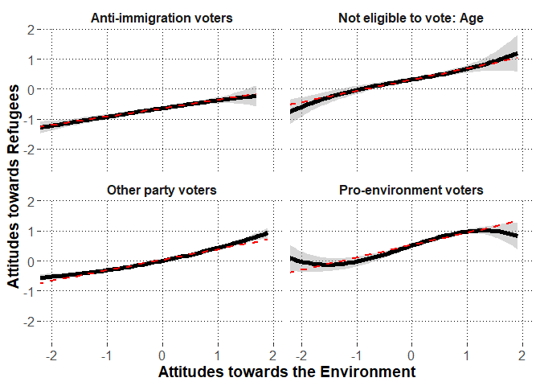

\newpage

# Preparations


## Load packages


```r
library(lme4)
library(lmerTest)
library(dplyr)
library(psych)
library(emmeans)
library(ggplot2)
library(metafor)
library(merTools)
```

## Session information about the packages


```r
sessionInfo()
```

```
## R version 3.6.3 (2020-02-29)
## Platform: x86_64-w64-mingw32/x64 (64-bit)
## Running under: Windows 10 x64 (build 17763)
## 
## Matrix products: default
## 
## locale:
## [1] LC_COLLATE=Finnish_Finland.1252  LC_CTYPE=Finnish_Finland.1252    LC_MONETARY=Finnish_Finland.1252
## [4] LC_NUMERIC=C                     LC_TIME=Finnish_Finland.1252    
## 
## attached base packages:
## [1] stats     graphics  grDevices utils     datasets  methods   base     
## 
## other attached packages:
##  [1] merTools_0.5.0  arm_1.10-1      MASS_7.3-51.5   metafor_2.4-0   ggplot2_3.3.2   emmeans_1.4.6   psych_1.9.12.31
##  [8] dplyr_0.8.5     lmerTest_3.1-2  lme4_1.1-23     Matrix_1.2-18  
## 
## loaded via a namespace (and not attached):
##  [1] Rcpp_1.0.4.6        mvtnorm_1.1-0       lattice_0.20-38     tidyr_1.1.0         zoo_1.8-7           assertthat_0.2.1   
##  [7] digest_0.6.25       foreach_1.5.0       mime_0.9            R6_2.4.1            backports_1.1.6     evaluate_0.14      
## [13] coda_0.19-3         pillar_1.4.3        rlang_0.4.6         multcomp_1.4-13     minqa_1.2.4         nloptr_1.2.2.1     
## [19] rmarkdown_2.1       splines_3.6.3       statmod_1.4.34      stringr_1.4.0       munsell_0.5.0       shiny_1.4.0.2      
## [25] broom_0.5.6         httpuv_1.5.2        compiler_3.6.3      numDeriv_2016.8-1.1 xfun_0.13           pkgconfig_2.0.3    
## [31] mnormt_1.5-6        htmltools_0.4.0     tidyselect_1.1.0    tibble_3.0.1        codetools_0.2-16    later_1.0.0        
## [37] crayon_1.3.4        withr_2.2.0         grid_3.6.3          nlme_3.1-144        xtable_1.8-4        gtable_0.3.0       
## [43] lifecycle_0.2.0     magrittr_1.5        scales_1.1.1        estimability_1.3    stringi_1.4.6       promises_1.1.0     
## [49] ellipsis_0.3.1      vctrs_0.3.0         generics_0.0.2      boot_1.3-24         sandwich_2.5-1      blme_1.0-4         
## [55] TH.data_1.0-10      iterators_1.0.12    tools_3.6.3         glue_1.4.1          purrr_0.3.4         fastmap_1.0.1      
## [61] abind_1.4-5         parallel_3.6.3      survival_3.1-8      yaml_2.2.1          colorspace_1.4-1    knitr_1.28
```

\newpage

## Custom functions


```r
#to extract fixed effects
getFE<-function(model){
  coefs<-data.frame(summary(model)$coefficients)
  coefs$lower<-coefs[,1]-qt(p=.975,df=coefs[,"df"])*coefs[,2]
  coefs$upper<-coefs[,1]+qt(p=.975,df=coefs[,"df"])*coefs[,2]
  coefs<-cbind.data.frame(round(coefs[,1:4],2),
                          p=round(coefs[,5],3),
                          LL=round(coefs$lower,2),
                          UL=round(coefs$upper,2))
  #row.names(coefs)<-substr(row.names(coefs),1,25)
  return(coefs)
}


#to extract random effects
getVC<-function(model){
  VC<-as.data.frame(VarCorr(model))
  VC<-cbind(VC[,c(1:3)],est_SD=VC[,5],est_SD2=VC[,4])
  return(VC)
}


#to extract model deviance
getDEV<-function(model){
  DEV<-unname(summary(model)$devcomp$cmp["dev"])
  return(DEV)
}


#partial correlation test
pcor.test <- function(x,y,z,use="mat",method="p",na.rm=T){


	x <- c(x)
	y <- c(y)
	z <- as.data.frame(z)

	if(use == "mat"){
		p.use <- "Var-Cov matrix"
		pcor = pcor.mat(x,y,z,method=method,na.rm=na.rm)
	}else if(use == "rec"){
		p.use <- "Recursive formula"
		pcor = pcor.rec(x,y,z,method=method,na.rm=na.rm)
	}else{
		stop("\'use\' should be either \"rec\" or \"mat\"!\n")
	}

	# print the method
	if(gregexpr("p",method)[[1]][1] == 1){
		p.method <- "Pearson"
	}else if(gregexpr("s",method)[[1]][1] == 1){
		p.method <- "Spearman"
	}else if(gregexpr("k",method)[[1]][1] == 1){
		p.method <- "Kendall"
	}else{
		stop("\'method\' should be \"pearson\" or \"spearman\" or \"kendall\"!\n")
	}

	# sample number
	n <- dim(na.omit(data.frame(x,y,z)))[1]
	
	# given variables' number
	gn <- dim(z)[2]

	# p-value
	if(p.method == "Kendall"){
		statistic <- pcor/sqrt(2*(2*(n-gn)+5)/(9*(n-gn)*(n-1-gn)))
		p.value <- 2*pnorm(-abs(statistic))

	}else{
		statistic <- pcor*sqrt((n-2-gn)/(1-pcor^2))
  		p.value <- 2*pnorm(-abs(statistic))
	}

	data.frame(estimate=pcor,p.value=p.value,statistic=statistic,n=n,gn=gn,Method=p.method,Use=p.use)
}			


# By using var-cov matrix
pcor.mat <- function(x,y,z,method="p",na.rm=T){

	x <- c(x)
	y <- c(y)
	z <- as.data.frame(z)

	if(dim(z)[2] == 0){
		stop("There should be given data\n")
	}

	data <- data.frame(x,y,z)

	if(na.rm == T){
		data = na.omit(data)
	}

	xdata <- na.omit(data.frame(data[,c(1,2)]))
	Sxx <- cov(xdata,xdata,m=method)

	xzdata <- na.omit(data)
	xdata <- data.frame(xzdata[,c(1,2)])
	zdata <- data.frame(xzdata[,-c(1,2)])
	Sxz <- cov(xdata,zdata,m=method)

	zdata <- na.omit(data.frame(data[,-c(1,2)]))
	Szz <- cov(zdata,zdata,m=method)

	# is Szz positive definite?
	zz.ev <- eigen(Szz)$values
	if(min(zz.ev)[1]<0){
		stop("\'Szz\' is not positive definite!\n")
	}

	# partial correlation
	Sxx.z <- Sxx - Sxz %*% solve(Szz) %*% t(Sxz)
	
	rxx.z <- cov2cor(Sxx.z)[1,2]

	rxx.z
}

# By using recursive formula
pcor.rec <- function(x,y,z,method="p",na.rm=T){
	# 

	x <- c(x)
	y <- c(y)
	z <- as.data.frame(z)

	if(dim(z)[2] == 0){
		stop("There should be given data\n")
	}

	data <- data.frame(x,y,z)

	if(na.rm == T){
		data = na.omit(data)
	}

	# recursive formula
	if(dim(z)[2] == 1){
		tdata <- na.omit(data.frame(data[,1],data[,2]))
		rxy <- cor(tdata[,1],tdata[,2],m=method)

		tdata <- na.omit(data.frame(data[,1],data[,-c(1,2)]))
		rxz <- cor(tdata[,1],tdata[,2],m=method)

		tdata <- na.omit(data.frame(data[,2],data[,-c(1,2)]))
		ryz <- cor(tdata[,1],tdata[,2],m=method)

		rxy.z <- (rxy - rxz*ryz)/( sqrt(1-rxz^2)*sqrt(1-ryz^2) )
		
		return(rxy.z)
	}else{
		x <- c(data[,1])
		y <- c(data[,2])
		z0 <- c(data[,3])
		zc <- as.data.frame(data[,-c(1,2,3)])

		rxy.zc <- pcor.rec(x,y,zc,method=method,na.rm=na.rm)
		rxz0.zc <- pcor.rec(x,z0,zc,method=method,na.rm=na.rm)
		ryz0.zc <- pcor.rec(y,z0,zc,method=method,na.rm=na.rm)
		
		rxy.z <- (rxy.zc - rxz0.zc*ryz0.zc)/( sqrt(1-rxz0.zc^2)*sqrt(1-ryz0.zc^2) )
		return(rxy.z)
	}			
}	
```

\newpage

## Load data


```r
dat<-read.csv2("alig.dat.csv",stringsAsFactors = F)
```

### Variable transformations

#### Country


```r
table(dat$cntry)
```

```
## 
##   AT   BE   CH   DE   EE   ES   FI   FR   GB   IE   IT   NL   NO   PT   SE   SI 
## 1973 1753 1503 2819 1974 1817 1862 2015 1876 2676 2317 1661 1538 1228 1525 1276
```

#### Voting group


```r
#make voting group variable names unique to each country
dat$voting.group<-paste0(dat$cntry,": ",dat$vote.group.combined)
```

#### Centering Attitudes towards the Environment


```r
#rename the variable
dat$environ<-dat$F.env
                                 
describe(dat$environ,fast=T)
```

```
##    vars     n mean   sd   min  max range se
## X1    1 28884    0 0.76 -2.95 1.91  4.85  0
```

```r
#grand mean center
dat$environ.gmc<-dat$environ-mean(dat$environ,na.rm=T)

#obtain dataframe with country means and add to data

environ.cntry<-dat %>%
  group_by(cntry) %>%
  summarize(environ.cntry=mean(environ.gmc,na.rm=T))

dat<-left_join(x=dat,
               y=environ.cntry,
               by=c("cntry"))

#center individuals around country means

dat$environ.cntrymc<-dat$environ.gmc-dat$environ.cntry

#obtain dataframe with voting group means and add to data

environ.voting.group<-dat %>%
  group_by(voting.group) %>%
  summarize(environ.voting.group=mean(environ.cntrymc,na.rm=T))

dat<-left_join(x=dat,
               y=environ.voting.group,
               by=c("voting.group"))

#center individuals around voting group means

dat$environ.vgmc<-dat$environ.cntrymc-dat$environ.voting.group

#describe the variable

describe(dat$environ.vgmc,fast=T)
```

```
##    vars     n mean   sd   min  max range se
## X1    1 28884    0 0.74 -3.04 2.23  5.27  0
```

```r
#rename as lvl1, lvl2, and lvl3

dat$environ.lvl1<-dat$environ.vgmc
dat$environ.lvl2<-dat$environ.voting.group
dat$environ.lvl3<-dat$environ.cntry
```

\newpage

#### Centering Political Engagement


```r
#correlation between the variables

corr.test(dat$nwspol.4,dat$polintr.R,adjust="none")
```

```
## Call:corr.test(x = dat$nwspol.4, y = dat$polintr.R, adjust = "none")
## Correlation matrix 
## [1] 0.31
## Sample Size 
## [1] 29637
## [1] 0
## 
##  To see confidence intervals of the correlations, print with the short=FALSE option
```

```r
#rename the variable

dat$engagement<-dat$polint.agg

#descriptive statistics
psych::describe(dat$engagement,fast=T)
```

```
##    vars     n mean   sd min max range se
## X1    1 29813 2.54 0.79   1   4     3  0
```

```r
#grand mean center
dat$engagement.gmc<-dat$engagement-mean(dat$engagement,na.rm=T)

#obtain dataframe with country means and add to data

engagement.cntry<-dat %>%
  group_by(cntry) %>%
  summarize(engagement.cntry=mean(engagement.gmc,na.rm=T))

dat<-left_join(x=dat,
               y=engagement.cntry,
               by=c("cntry"))

#center individuals around country means

dat$engagement.cntrymc<-dat$engagement.gmc-dat$engagement.cntry

#obtain dataframe with voting group means and add to data

engagement.voting.group<-dat %>%
  group_by(voting.group) %>%
  summarize(engagement.voting.group=mean(engagement.cntrymc,na.rm=T))

dat<-left_join(x=dat,
               y=engagement.voting.group,
               by=c("voting.group"))

#center individuals around voting group means

dat$engagement.vgmc<-dat$engagement.cntrymc-dat$engagement.voting.group

#describe the centered variable

describe(dat$engagement.vgmc,fast=T)
```

```
##    vars     n mean   sd   min max range se
## X1    1 29813    0 0.74 -2.06 2.1  4.17  0
```

```r
#rename as lvl1, lvl2, and lvl3

dat$engagement.lvl1<-dat$engagement.vgmc
dat$engagement.lvl2<-dat$engagement.voting.group
dat$engagement.lvl3<-dat$engagement.cntry
```

\newpage

#### Centering Political Interest Item (for exploratory analysis)


```r
#rename the variable (this will replace the previous item with same name)
dat$polintr<-dat$polintr.R

#descriptive statistics
psych::describe(dat$polintr,fast=T)
```

```
##    vars     n mean   sd min max range   se
## X1    1 29793  2.5 0.91   1   4     3 0.01
```

```r
#grand mean center
dat$polintr.gmc<-dat$polintr-mean(dat$polintr,na.rm=T)

#obtain dataframe with country means and add to data

polintr.cntry<-dat %>%
  group_by(cntry) %>%
  summarize(polintr.cntry=mean(polintr.gmc,na.rm=T))

dat<-left_join(x=dat,
               y=polintr.cntry,
               by=c("cntry"))

#center individuals around country means

dat$polintr.cntrymc<-dat$polintr.gmc-dat$polintr.cntry

#obtain dataframe with voting group means and add to data

polintr.voting.group<-dat %>%
  group_by(voting.group) %>%
  summarize(polintr.voting.group=mean(polintr.cntrymc,na.rm=T))

dat<-left_join(x=dat,
               y=polintr.voting.group,
               by=c("voting.group"))

#center individuals around voting group means

dat$polintr.vgmc<-dat$polintr.cntrymc-dat$polintr.voting.group

#describe the centered variable

describe(dat$polintr.vgmc,fast=T)
```

```
##    vars     n mean   sd   min  max range se
## X1    1 29793    0 0.83 -2.19 2.36  4.55  0
```

```r
#rename as lvl1, lvl2, and lvl3

dat$polintr.lvl1<-dat$polintr.vgmc
dat$polintr.lvl2<-dat$polintr.voting.group
dat$polintr.lvl3<-dat$polintr.cntry
```


\newpage

#### Centering "Time used for consuming political media" (for exploratory analysis)


```r
#rename the variable
dat$polnews<-dat$nwspol.4

#descriptive statistics
psych::describe(dat$polnews,fast=T)
```

```
##    vars     n mean   sd min max range   se
## X1    1 29657 2.59 1.04   1   4     3 0.01
```

```r
#grand mean center
dat$polnews.gmc<-dat$polnews-mean(dat$polnews,na.rm=T)

#obtain dataframe with country means and add to data

polnews.cntry<-dat %>%
  group_by(cntry) %>%
  summarize(polnews.cntry=mean(polnews.gmc,na.rm=T))

dat<-left_join(x=dat,
               y=polnews.cntry,
               by=c("cntry"))

#center individuals around country means

dat$polnews.cntrymc<-dat$polnews.gmc-dat$polnews.cntry

#obtain dataframe with voting group means and add to data

polnews.voting.group<-dat %>%
  group_by(voting.group) %>%
  summarize(polnews.voting.group=mean(polnews.cntrymc,na.rm=T))

dat<-left_join(x=dat,
               y=polnews.voting.group,
               by=c("voting.group"))

#center individuals around voting group means

dat$polnews.vgmc<-dat$polnews.cntrymc-dat$polnews.voting.group

#describe the centered variable

describe(dat$polnews.vgmc,fast=T)
```

```
##    vars     n mean sd   min  max range   se
## X1    1 29657    0  1 -2.19 2.31   4.5 0.01
```

```r
#rename as lvl1, lvl2, and lvl3

dat$polnews.lvl1<-dat$polnews.vgmc
dat$polnews.lvl2<-dat$polnews.voting.group
dat$polnews.lvl3<-dat$polnews.cntry
```

\newpage

#### Rename and grand mean center the Attitudes towards refugees (pro-refugee attitudes indicate high scores)


```r
#calculate the sum score
dat$refugees<-dat$F.imm
                                 
describe(dat$refugees,fast=T)
```

```
##    vars     n mean   sd   min  max range   se
## X1    1 27492    0 1.27 -3.96 3.96  7.92 0.01
```

```r
#grand mean center
dat$refugees<-dat$refugees-mean(dat$refugees,na.rm=T)

#rename
dat$refugees.gmc<-dat$refugees

#obtain dataframe with country means and add to data

refugees.cntry<-dat %>%
  group_by(cntry) %>%
  summarize(refugees.cntry=mean(refugees.gmc,na.rm=T))

dat<-left_join(x=dat,
               y=refugees.cntry,
               by=c("cntry"))

#center individuals around country means

dat$refugees.cntrymc<-dat$refugees.gmc-dat$refugees.cntry

#obtain dataframe with voting group means and add to data

refugees.voting.group<-dat %>%
  group_by(voting.group) %>%
  summarize(refugees.voting.group=mean(refugees.cntrymc,na.rm=T))

dat<-left_join(x=dat,
               y=refugees.voting.group,
               by=c("voting.group"))

#center individuals around voting group means

dat$refugees.vgmc<-dat$refugees.cntrymc-dat$refugees.voting.group

#describe the variable

describe(dat$refugees.vgmc,fast=T)
```

```
##    vars     n mean  sd   min  max range   se
## X1    1 27492    0 1.2 -4.13 4.35  8.48 0.01
```

```r
#rename as lvl1, lvl2, and lvl3

dat$refugees.lvl1<-dat$refugees.vgmc
dat$refugees.lvl2<-dat$refugees.voting.group
dat$refugees.lvl3<-dat$refugees.cntry
```

\newpage

#### Rename and Center the covariates aroung grand mean or logical middle points if applicable


```r
#grand-mean center age
dat$age<-dat$agea-mean(dat$agea,na.rm=T)
#sex around zero
dat$gender<-dat$gndr-1.5 #-0.5 males, 0.5 females
#rename occupation variable
dat$occup<-dat$isco.13
#grand-mean center education years
dat$educ<-dat$eduyrs-mean(dat$eduyrs,na.rm=T)
#residence around zero
dat$resid<-dat$rural-0.5 #-0.5 urban, 0.5 rural
```

\newpage

#### Voting group dummy-coded variables


```r
#recode if the party voted is =1, or not =0 anti-immigration
dat$anti.imm.party.dummy<-ifelse(is.na(dat$anti.imm.party.rule2),0,1)
#recode if the party voted is =1, or not =0 pro-environment
dat$pro.env.party.dummy<-ifelse(is.na(dat$pro.env.party.manual),0,1)

#dat$other.party.dummy<-ifelse(grepl("Other",dat$vote.group.combined),1,0)

#dummy-code not voting
dat$did.not.vote.dummy<-ifelse(grepl("did not vote",dat$vote.group.combined),1,0)
table(dat$did.not.vote.dummy)
```

```
## 
##     0     1 
## 24330  5483
```

```r
#dummy-code "don't know"
dat$dont.know.dummy<-ifelse(grepl("Don't know",dat$vote.group.combined),1,0)
table(dat$dont.know.dummy)
```

```
## 
##     0     1 
## 28722  1091
```

```r
#dummy-code invalid vote
dat$invalid.vote.dummy<-ifelse(grepl("Invalid vote",dat$vote.group.combined),1,0)
table(dat$invalid.vote.dummy)
```

```
## 
##     0     1 
## 29798    15
```

```r
#dummy-code "no answer"
dat$no.answer.dummy<-ifelse(grepl("No answer",dat$vote.group.combined),1,0)
table(dat$no.answer.dummy)
```

```
## 
##     0     1 
## 29801    12
```

```r
#dummy-code not-eligible: age
dat$not.eligible.age.dummy<-ifelse(grepl("not eligible: age",dat$vote.group.combined),1,0)
table(dat$not.eligible.age.dummy)
```

```
## 
##     0     1 
## 28390  1423
```

```r
#dummy code not-eligible: citizenship
dat$not.eligible.citizenship.dummy<-ifelse(grepl("not eligible: citizenship",dat$vote.group.combined),1,0)
table(dat$not.eligible.citizenship.dummy)
```

```
## 
##     0     1 
## 28611  1202
```

```r
#dummy-code not-eligible: other reasons
dat$not.eligible.other.dummy<-ifelse(grepl("not eligible: other",dat$vote.group.combined),1,0)
table(dat$not.eligible.other.dummy)
```

```
## 
##     0     1 
## 29594   219
```

```r
#add dummy-variable for other_party voting

dat<- dat %>%
  mutate(other.party.dummy:=case_when(
    anti.imm.party.dummy==1 |
      pro.env.party.dummy==1 |
      did.not.vote.dummy==1 |
      dont.know.dummy==1 |
      invalid.vote.dummy==1 |
      no.answer.dummy==1 |
      not.eligible.age.dummy==1 |
      not.eligible.citizenship.dummy==1 |
      not.eligible.other.dummy==1 ~0,
    TRUE~1
  ))

table(dat$other.party.dummy)
```

```
## 
##     0     1 
## 14441 15372
```

```r
#recode the names for a new multi-category variable: all.parties.lvl2

dat<-dat %>%
  mutate(all.parties.lvl2:=case_when(
    did.not.vote.dummy==1~"Did not vote",
    dont.know.dummy==1~"Don't know",
    no.answer.dummy==1~"No answer",
    invalid.vote.dummy==1~"Invalid vote",
    not.eligible.age.dummy==1~"NE age",
    not.eligible.citizenship.dummy==1~"NE citizen",
    not.eligible.other.dummy==1~"NE other",
    other.party.dummy==1~"Other party",
    anti.imm.party.dummy==1~"Anti-immigration party",
    pro.env.party.dummy==1~"Pro-environment party",
  ),
  party:=case_when(
    other.party.dummy==1~"Other party",
    anti.imm.party.dummy==1~"Anti-immigration party",
    pro.env.party.dummy==1~"Pro-environment party",
    TRUE~NA_character_
  ))
```


#### Omit missing variables


```r
#missing values per each row
dat$analysis.miss<-
  is.na(dat$cntry)+
  is.na(dat$voting.group)+
  is.na(dat$refugees)+
  is.na(dat$environ)+
  is.na(dat$vote.group.combined)+
  is.na(dat$age)+
  is.na(dat$gender)+
  is.na(dat$occup)+
  is.na(dat$educ)+
  is.na(dat$resid)+
  is.na(dat$engagement)
table(dat$analysis.miss)
```

```
## 
##     0     1     2 
## 26886  2604   323
```

```r
#include only those without any missing values
dat<-dat %>%
  filter(analysis.miss ==0)
```

\newpage


# Hypothesis 1: There will be a positive association between pro-environment and pro-refugee attitudes

### Model 0: Intercepts only


```r
H1.mod0<-lmer(refugees~(1|voting.group),#+(1|cntry),
              data=dat,REML=F)

(FE.H1.mod0<-getFE(H1.mod0))
```

```
##             Estimate Std..Error     df t.value     p   LL   UL
## (Intercept)     0.08       0.03 251.81    2.44 0.015 0.01 0.14
```

```r
(VC.H1.mod0<-getVC(H1.mod0))
```

```
##            grp        var1 var2    est_SD   est_SD2
## 1 voting.group (Intercept) <NA> 0.4568751 0.2087348
## 2     Residual        <NA> <NA> 1.2016464 1.4439540
```

```r
getDEV(H1.mod0)
```

```
## [1] 86754.07
```

```r
#ICC

##voting group

VC.H1.mod0[VC.H1.mod0$grp=="voting.group","est_SD2"]/
  sum(VC.H1.mod0[,"est_SD2"])
```

```
## [1] 0.1263001
```

```r
##country

VC.H1.mod0[VC.H1.mod0$grp=="cntry","est_SD2"]/
  sum(VC.H1.mod0[,"est_SD2"])
```

```
## numeric(0)
```


\newpage

### Model 1: Covariates


```r
H1.mod1<-lmer(refugees~(1|voting.group)+#(1|cntry)+
                age+gender+educ+resid+occup
                ,data=dat,REML=F)

#model comparison
anova(H1.mod0,
      H1.mod1)
```

```
## Data: dat
## Models:
## H1.mod0: refugees ~ (1 | voting.group)
## H1.mod1: refugees ~ (1 | voting.group) + age + gender + educ + resid + 
## H1.mod1:     occup
##         npar   AIC   BIC logLik deviance  Chisq Df Pr(>Chisq)    
## H1.mod0    3 86760 86785 -43377    86754                         
## H1.mod1   19 85874 86030 -42918    85836 918.15 16  < 2.2e-16 ***
## ---
## Signif. codes:  0 '***' 0.001 '**' 0.01 '*' 0.05 '.' 0.1 ' ' 1
```

```r
(FE.H1.mod1<-getFE(H1.mod1))
```

```
##                                                         Estimate Std..Error       df t.value     p    LL    UL
## (Intercept)                                                 0.03       0.11 19271.69    0.28 0.778 -0.19  0.25
## age                                                         0.00       0.00 26347.70   -2.70 0.007  0.00  0.00
## gender                                                      0.10       0.02 26757.71    6.49 0.000  0.07  0.13
## educ                                                        0.03       0.00 26811.38   14.59 0.000  0.03  0.04
## resid                                                      -0.12       0.02 26849.56   -7.87 0.000 -0.15 -0.09
## occupClerical support workers                              -0.02       0.11 26727.20   -0.17 0.863 -0.23  0.20
## occupCraft and related trades workers                      -0.14       0.11 26731.95   -1.28 0.202 -0.35  0.08
## occupElementary occupations                                 0.00       0.11 26736.38   -0.04 0.969 -0.22  0.21
## occupManagers                                               0.07       0.11 26728.08    0.60 0.549 -0.15  0.28
## occupOther: Not in paid work                                0.18       0.11 26834.31    1.58 0.115 -0.04  0.40
## occupPlant and machine operators, and assemblers           -0.07       0.11 26734.02   -0.65 0.517 -0.29  0.15
## occupProfessionals                                          0.19       0.11 26724.72    1.75 0.080 -0.02  0.40
## occupRetired                                                0.03       0.12 26732.28    0.22 0.830 -0.22  0.27
## occupService and sales workers                             -0.07       0.11 26727.59   -0.63 0.527 -0.28  0.14
## occupSkilled agricultural, forestry and fishery workers    -0.02       0.12 26730.64   -0.18 0.859 -0.25  0.21
## occupTechnicians and associate professionals                0.00       0.11 26723.36    0.04 0.970 -0.21  0.22
## occupUnemployed                                            -0.02       0.14 26752.26   -0.13 0.898 -0.28  0.25
```

```r
(VC.H1.mod1<-getVC(H1.mod1))
```

```
##            grp        var1 var2    est_SD   est_SD2
## 1 voting.group (Intercept) <NA> 0.4133723 0.1708767
## 2     Residual        <NA> <NA> 1.1820745 1.3973001
```

```r
getDEV(H1.mod1)
```

```
## [1] 85835.92
```

```r
write.csv2(FE.H1.mod1,"FE.H1.mod1.csv")

#variance explained

##lvl 1: individuals

(VC.H1.mod0[VC.H1.mod0$grp=="Residual","est_SD2"]-
     VC.H1.mod1[VC.H1.mod1$grp=="Residual","est_SD2"])/
  VC.H1.mod0[VC.H1.mod0$grp=="Residual","est_SD2"]
```

```
## [1] 0.03230982
```

```r
##lvl 2: voting group

(VC.H1.mod0[VC.H1.mod0$grp=="voting.group","est_SD2"]-
     VC.H1.mod1[VC.H1.mod1$grp=="voting.group","est_SD2"])/
  VC.H1.mod0[VC.H1.mod0$grp=="voting.group","est_SD2"]
```

```
## [1] 0.1813696
```

```r
##lvl 3: country

(VC.H1.mod0[VC.H1.mod0$grp=="cntry","est_SD2"]-
     VC.H1.mod1[VC.H1.mod1$grp=="cntry","est_SD2"])/
  VC.H1.mod0[VC.H1.mod0$grp=="cntry","est_SD2"]
```

```
## numeric(0)
```

```r
##total

(sum(VC.H1.mod0$est_SD2)-sum(VC.H1.mod1$est_SD2))/
  sum(VC.H1.mod0$est_SD2)
```

```
## [1] 0.05113609
```

```r
#individual contributions of covariates
anova(H1.mod1)
```

```
## Type III Analysis of Variance Table with Satterthwaite's method
##         Sum Sq Mean Sq NumDF DenDF  F value    Pr(>F)    
## age     10.178  10.178     1 26348   7.2843  0.006961 ** 
## gender  58.764  58.764     1 26758  42.0557 9.026e-11 ***
## educ   297.411 297.411     1 26811 212.8470 < 2.2e-16 ***
## resid   86.588  86.588     1 26850  61.9680 3.622e-15 ***
## occup  243.412  20.284    12 26690  14.5168 < 2.2e-16 ***
## ---
## Signif. codes:  0 '***' 0.001 '**' 0.01 '*' 0.05 '.' 0.1 ' ' 1
```

\newpage

### Model 2: Fixed effects for Attitudes towards the Environment


```r
H1.mod2<-lmer(refugees~(1|voting.group)+#(1|cntry)+
                age+gender+educ+resid+occup+
                environ.lvl1,data=dat,REML=F)

#model comparison
anova(H1.mod1,
      H1.mod2)
```

```
## Data: dat
## Models:
## H1.mod1: refugees ~ (1 | voting.group) + age + gender + educ + resid + 
## H1.mod1:     occup
## H1.mod2: refugees ~ (1 | voting.group) + age + gender + educ + resid + 
## H1.mod2:     occup + environ.lvl1
##         npar   AIC   BIC logLik deviance  Chisq Df Pr(>Chisq)    
## H1.mod1   19 85874 86030 -42918    85836                         
## H1.mod2   20 85196 85360 -42578    85156 679.54  1  < 2.2e-16 ***
## ---
## Signif. codes:  0 '***' 0.001 '**' 0.01 '*' 0.05 '.' 0.1 ' ' 1
```

```r
(FE.H1.mod2<-getFE(H1.mod2))
```

```
##                                                         Estimate Std..Error       df t.value     p    LL    UL
## (Intercept)                                                 0.04       0.11 18787.02    0.35 0.725 -0.18  0.25
## age                                                         0.00       0.00 26421.71   -1.65 0.099  0.00  0.00
## gender                                                      0.09       0.02 26754.01    5.82 0.000  0.06  0.12
## educ                                                        0.03       0.00 26825.81   12.34 0.000  0.02  0.03
## resid                                                      -0.11       0.02 26844.75   -7.18 0.000 -0.14 -0.08
## occupClerical support workers                              -0.03       0.11 26723.85   -0.25 0.803 -0.24  0.19
## occupCraft and related trades workers                      -0.13       0.11 26728.58   -1.20 0.231 -0.34  0.08
## occupElementary occupations                                 0.01       0.11 26732.79    0.09 0.930 -0.20  0.22
## occupManagers                                               0.05       0.11 26724.75    0.45 0.654 -0.16  0.26
## occupOther: Not in paid work                                0.18       0.11 26829.27    1.61 0.107 -0.04  0.40
## occupPlant and machine operators, and assemblers           -0.07       0.11 26730.45   -0.67 0.502 -0.29  0.14
## occupProfessionals                                          0.17       0.11 26721.52    1.57 0.116 -0.04  0.38
## occupRetired                                                0.05       0.12 26729.05    0.43 0.670 -0.19  0.29
## occupService and sales workers                             -0.06       0.11 26724.33   -0.60 0.549 -0.28  0.15
## occupSkilled agricultural, forestry and fishery workers    -0.02       0.12 26727.42   -0.13 0.894 -0.24  0.21
## occupTechnicians and associate professionals               -0.01       0.11 26720.11   -0.11 0.912 -0.22  0.20
## occupUnemployed                                             0.02       0.13 26749.23    0.12 0.906 -0.25  0.28
## environ.lvl1                                                0.26       0.01 26661.62   26.24 0.000  0.24  0.28
```

```r
(VC.H1.mod2<-getVC(H1.mod2))
```

```
##            grp        var1 var2    est_SD   est_SD2
## 1 voting.group (Intercept) <NA> 0.4189837 0.1755473
## 2     Residual        <NA> <NA> 1.1669922 1.3618708
```

```r
getDEV(H1.mod2)
```

```
## [1] 85156.38
```

```r
write.csv2(FE.H1.mod2,"FE.H1.mod2.csv")

#variance explained

##lvl 1: individuals

(VC.H1.mod1[VC.H1.mod1$grp=="Residual","est_SD2"]-
     VC.H1.mod2[VC.H1.mod2$grp=="Residual","est_SD2"])/
  VC.H1.mod1[VC.H1.mod1$grp=="Residual","est_SD2"]
```

```
## [1] 0.02535559
```

```r
##total

(sum(VC.H1.mod1$est_SD2)-sum(VC.H1.mod2$est_SD2))/
  sum(VC.H1.mod1$est_SD2)
```

```
## [1] 0.01961433
```

\newpage

### Model 3: Random effects for Attitudes towards the Environment


```r
H1.mod3<-lmer(refugees~(environ.lvl1|voting.group)+
                (0+environ.lvl1|cntry)+
                age+gender+educ+resid+occup+
                environ.lvl1,data=dat,REML=F,
                 control=lmerControl(optimizer="bobyqa",
                                     optCtrl=list(maxfun=2e8)))


#model comparison
anova(H1.mod2,
      H1.mod3)
```

```
## Data: dat
## Models:
## H1.mod2: refugees ~ (1 | voting.group) + age + gender + educ + resid + 
## H1.mod2:     occup + environ.lvl1
## H1.mod3: refugees ~ (environ.lvl1 | voting.group) + (0 + environ.lvl1 | 
## H1.mod3:     cntry) + age + gender + educ + resid + occup + environ.lvl1
##         npar   AIC   BIC logLik deviance  Chisq Df Pr(>Chisq)    
## H1.mod2   20 85196 85360 -42578    85156                         
## H1.mod3   23 85078 85267 -42516    85032 124.29  3  < 2.2e-16 ***
## ---
## Signif. codes:  0 '***' 0.001 '**' 0.01 '*' 0.05 '.' 0.1 ' ' 1
```

```r
(FE.H1.mod3<-getFE(H1.mod3))
```

```
##                                                         Estimate Std..Error       df t.value     p    LL    UL
## (Intercept)                                                 0.04       0.11 18762.80    0.39 0.695 -0.17  0.26
## age                                                         0.00       0.00 25948.59   -1.57 0.117  0.00  0.00
## gender                                                      0.09       0.02 26742.17    5.64 0.000  0.06  0.12
## educ                                                        0.03       0.00 26806.67   12.26 0.000  0.02  0.03
## resid                                                      -0.11       0.02 26830.44   -7.22 0.000 -0.14 -0.08
## occupClerical support workers                              -0.03       0.11 26695.53   -0.26 0.792 -0.24  0.18
## occupCraft and related trades workers                      -0.13       0.11 26702.49   -1.23 0.219 -0.34  0.08
## occupElementary occupations                                 0.01       0.11 26705.26    0.07 0.943 -0.21  0.22
## occupManagers                                               0.04       0.11 26699.38    0.40 0.692 -0.17  0.26
## occupOther: Not in paid work                                0.18       0.11 26800.07    1.58 0.113 -0.04  0.40
## occupPlant and machine operators, and assemblers           -0.08       0.11 26704.59   -0.72 0.471 -0.29  0.14
## occupProfessionals                                          0.16       0.11 26694.69    1.54 0.124 -0.05  0.37
## occupRetired                                                0.05       0.12 26700.61    0.37 0.709 -0.19  0.29
## occupService and sales workers                             -0.06       0.11 26696.12   -0.60 0.552 -0.27  0.15
## occupSkilled agricultural, forestry and fishery workers    -0.02       0.12 26704.73   -0.20 0.843 -0.25  0.20
## occupTechnicians and associate professionals               -0.01       0.11 26692.75   -0.14 0.891 -0.22  0.20
## occupUnemployed                                             0.01       0.13 26720.62    0.08 0.940 -0.25  0.27
## environ.lvl1                                                0.27       0.03    15.95    8.22 0.000  0.20  0.34
```

```r
(VC.H1.mod3<-getVC(H1.mod3))
```

```
##            grp         var1         var2     est_SD     est_SD2
## 1 voting.group  (Intercept)         <NA> 0.41857780 0.175207375
## 2 voting.group environ.lvl1         <NA> 0.09120255 0.008317904
## 3 voting.group  (Intercept) environ.lvl1 0.63782258 0.024349107
## 4        cntry environ.lvl1         <NA> 0.11995018 0.014388045
## 5     Residual         <NA>         <NA> 1.16262160 1.351688977
```

```r
getDEV(H1.mod3)
```

```
## [1] 85032.09
```

```r
write.csv2(FE.H1.mod3,"FE.H1.mod3.csv")
```

\newpage


#### Describe the correlation between refugee and environment attitudes by country


```r
#model implied associations (posterior modes)

#fit also a model without covariates


slope.mod.no.cov<-lmer(refugees~(environ.lvl1|voting.group)+
                (0+environ.lvl1|cntry)+
                environ.lvl1,data=dat,REML=F,
                 control=lmerControl(optimizer="bobyqa",
                                     optCtrl=list(maxfun=2e8)))

#correlations from data

cntry.cor.dat<-dat %>%
  dplyr::select(cntry,environ.gmc,refugees,age,gender,educ,resid) %>%
  group_by(cntry) %>%
  summarize(observed_r=cor(environ.gmc,refugees,use="pairwise.complete.obs"),
            partial_r=pcor.test(x=environ.gmc,
                         y=refugees,
                         z=data.frame(age,
                                      gender,
                                      educ,
                                      resid))$estimate,
            n=n())

#posterior modes from multilevel models

country.effs.dat<-
  cbind.data.frame(
    cntry=rownames(
      coefficients(H1.mod3)$cntry),
    slope_with_covs=coefficients(
      H1.mod3)$cntry[,"environ.lvl1"],
    slope_without_covs=coefficients(
      slope.mod.no.cov)$cntry[,"environ.lvl1"],
    cntry.cor.dat[,2:4])


country.effs.dat$partial_r.se<-1/sqrt(country.effs.dat$n-3)
country.effs.dat$country<-
  c("Austria",
    "Belgium",
    "Switzerland",
    #"Czech Republic",
    "Germany",
    "Estonia",
    "Spain",
    "Finland",
    "France",
    "Great Britain",
    #"Hungary",
    "Ireland",
    "Italy",
    #"Lithuania",
    "Netherlands",
    "Norway",
    #"Poland",
    "Portugal",
    "Sweden",
    "Slovenia")


country.effs.dat <- country.effs.dat[order(country.effs.dat$country),]

write.csv2(country.effs.dat,"associations_within_countries.csv")
```

\newpage

#### Describe the correlation between refugee and environment attitudes by voting group

* It was not possible to calculate the partial coefficients for all voting groups because of small group size and lack of variance in either attitudes or covariates, so only zero-order correlations were calculated as well as posterior mode slopes


```r
#get size of each voting group

voting.group.n<-dat %>%
  group_by(voting.group) %>%
  summarize(voting.group.n=n())

#add voting group size to the main data

dat<-left_join(x=dat,
               y=voting.group.n,
               by=c("voting.group"))

#calculate observed correlations


all.voting.group.cor.dat<-dat %>%
  #filter(voting.group.n>12) %>%
  dplyr::select(voting.group,environ.gmc,age,
                                      gender,
                                      educ,
                                      resid,
         refugees,anti.imm.party.dummy,
         pro.env.party.dummy) %>%
  group_by(voting.group) %>%
  summarize(observed_r=cor(environ.gmc,
                           refugees,use="pairwise.complete.obs"),

            n=n(),
            anti.imm=sum(anti.imm.party.dummy)/n(),
            pro.env=sum(pro.env.party.dummy)/n())

#posterior modes for voting group specific associations

voting.group.effs.dat<-
  cbind.data.frame(
    voting.group=rownames(
      coefficients(H1.mod3)$voting.group),
    slope_with_covs=coefficients(
      H1.mod3)$voting.group[,"environ.lvl1"],
    slope_without_covs=coefficients(
      slope.mod.no.cov)$voting.group[,"environ.lvl1"])

#add country level variability to slope-estimates

voting.group.effs.dat$cntry<-substr(voting.group.effs.dat$voting.group,1,2)
voting.group.effs.dat.w.country<-left_join(x=voting.group.effs.dat,
                                           y=country.effs.dat,
                                           by="cntry",suffix=c("",".cntry"))
```

```
## Warning: Column `cntry` joining character vector and factor, coercing into character vector
```

```r
voting.group.effs.dat.w.country$slope_with_covs_add_cntry<-
  voting.group.effs.dat.w.country$slope_with_covs+
  voting.group.effs.dat.w.country$slope_with_covs.cntry
  
voting.group.effs.dat.w.country$slope_without_covs_add_cntry<-
  voting.group.effs.dat.w.country$slope_without_covs+
  voting.group.effs.dat.w.country$slope_without_covs.cntry

voting.group.effs.dat.w.country<-
  voting.group.effs.dat.w.country %>%
  dplyr::select(voting.group,
                slope_with_covs,
                slope_without_covs,
                slope_with_covs_add_cntry,
                slope_without_covs_add_cntry,
                n)


voting.group.slopes.dat<-left_join(x=voting.group.effs.dat.w.country,
                                 y=all.voting.group.cor.dat,
                                 by=c("voting.group"))
```

```
## Warning: Column `voting.group` joining factor and character vector, coercing into character vector
```

```r
write.csv2(voting.group.slopes.dat,"associations_within_voting_groups.csv")
```


\newpage

##### Print a forest plot


```r
#Create forest plot of country estimates
library(dmetar)
```

```
## Extensive documentation for the dmetar package can be found at: 
##  www.bookdown.org/MathiasHarrer/Doing_Meta_Analysis_in_R/
```

```r
library(meta)
```

```
## Loading 'meta' package (version 4.13-0).
## Type 'help(meta)' for a brief overview.
```

```r
# country-level
#nrow(country.effs.dat)
#col.vect.cntry<-rep(c("#4CC542","#05B3D8"),each=10)

m <- metacor(cor=partial_r,
             n=n,
             data=country.effs.dat,
             studlab=country.effs.dat$country,
             comb.fixed = FALSE,
             comb.random = TRUE,
             prediction=TRUE,
             sm="ZCOR",
             backtransf=TRUE,
             level=.95)
m
```

```
##                   COR            95%-CI %W(random)
## Austria        0.2195 [ 0.1747; 0.2633]        6.3
## Belgium        0.1586 [ 0.1117; 0.2047]        6.3
## Estonia       -0.0150 [-0.0601; 0.0302]        6.3
## Finland        0.2875 [ 0.2446; 0.3292]        6.3
## France         0.2320 [ 0.1888; 0.2743]        6.3
## Germany        0.2636 [ 0.2279; 0.2986]        6.5
## Great Britain  0.2597 [ 0.2159; 0.3025]        6.3
## Ireland        0.1877 [ 0.1477; 0.2271]        6.4
## Italy          0.1335 [ 0.0901; 0.1764]        6.4
## Netherlands    0.1706 [ 0.1193; 0.2210]        6.2
## Norway         0.2698 [ 0.2222; 0.3161]        6.2
## Portugal       0.1488 [ 0.0912; 0.2054]        6.0
## Slovenia       0.0196 [-0.0383; 0.0774]        6.1
## Spain          0.1622 [ 0.1081; 0.2153]        6.1
## Sweden         0.2160 [ 0.1645; 0.2664]        6.2
## Switzerland    0.2167 [ 0.1651; 0.2671]        6.2
## 
## Number of studies combined: k = 16
## 
##                         COR           95%-CI    z  p-value
## Random effects model 0.1847 [0.1431; 0.2257] 8.56 < 0.0001
## Prediction interval         [0.0016; 0.3559]              
## 
## Quantifying heterogeneity:
##  tau^2 = 0.0070 [0.0035; 0.0176]; tau = 0.0836 [0.0593; 0.1326];
##  I^2 = 92.1% [88.8%; 94.5%]; H = 3.56 [2.98; 4.25]
## 
## Test of heterogeneity:
##       Q d.f.  p-value
##  190.13   15 < 0.0001
## 
## Details on meta-analytical method:
## - Inverse variance method
## - DerSimonian-Laird estimator for tau^2
## - Jackson method for confidence interval of tau^2 and tau
## - Fisher's z transformation of correlations
```

```r
grDevices::pdf(file = "forestplot.pdf",family="sans") 

forest.m<-meta::forest(m,overall=T,
                       #layout = "JAMA",
                       prediction=F,
                       leftlabs=c("Country","n"),
                       print.I2=F,
                       print.tau2=F,
                       het.stat=F,
                       overall.hetstat=F,
                       text.random="Overall",
                       #weights=F,
                       #label.right="Partial Correlation Coefficient",
                       #bottom.lr=F
                       rightcols=c("effect", "ci"),
                       rightlabs = c("","95% CI"),
                       smlab = "Partial Correlation Coefficient",
                       weight.study="random"#,
                       #col.study=col.vect.cntry,
                       #col.square=col.vect.cntry
                       
)

graphics.off()


# print separate plots for voting groups within each country


cntry.vect<-as.character(unique(country.effs.dat$cntry))

#drop groups smaller than 6
voting.group.plot.dat<-voting.group.slopes.dat %>%
  filter(n.y>4)

voting.group.plot.dat$color<-ifelse(voting.group.plot.dat$anti.imm==1,
                                    "#05B3D8",
                                    ifelse(voting.group.plot.dat$pro.env==1,
                                           "#4CC542","darkgray"))

table(voting.group.plot.dat$color)
```

```
## 
##  #05B3D8  #4CC542 darkgray 
##       25       25      199
```

```r
pdf("forest_for_each_country.pdf",family = "sans",width = 12,height=10)

for (i in cntry.vect){
  
  dat.temp<-voting.group.plot.dat[grepl(paste0(i,": "),voting.group.plot.dat$voting.group),]
  
  m.temp <- metacor(cor=observed_r,
                    n=n.y,
                    data=dat.temp,
                    studlab=dat.temp[,"voting.group"],
                    comb.fixed = FALSE,
                    comb.random = TRUE,
                    prediction=TRUE,
                    sm="ZCOR",
                    backtransf=TRUE,
                    level=.95)
  
  forest.m.temp<-meta::forest(m.temp,overall=T,
                              prediction=F,
                              leftlabs=c("Voting group","n"),
                              print.I2=F,
                              print.tau2=F,
                              het.stat=F,
                              overall.hetstat=F,
                              text.random="Overall",
                              rightcols=c("effect", "ci"),
                              rightlabs = c("","95% CI"),
                              smlab = "Correlation Coefficient",
                              weight.study="random",
                              xlim=c(-0.8,0.8),
                              col.study=dat.temp[,"color"],
                              col.square=dat.temp[,"color"])
  
}


dev.off()
```

```
## null device 
##           1
```

```r
# print separate plots for anti-immigration parties


#drop groups smaller than 6 and filter only anti-refugee parties
anti.imm.group.plot.dat<-voting.group.slopes.dat %>%
  filter(n.y>4,anti.imm==1)

anti.imm.group.plot.dat$color<-"#05B3D8"

pdf("forest_for_anti_refugee.pdf",family = "sans",width = 12,height=10)

m.anti.imm <- metacor(cor=observed_r,
                    n=n.y,
                    data=anti.imm.group.plot.dat,
                    studlab=anti.imm.group.plot.dat[,"voting.group"],
                    comb.fixed = FALSE,
                    comb.random = TRUE,
                    prediction=TRUE,
                    sm="ZCOR",
                    backtransf=TRUE,
                    level=.95)

m.anti.imm
```

```
##                                                 COR             95%-CI %W(random)
## AT: BZÖ                                      0.2746 [-0.6032;  0.8516]        0.3
## AT: FPÖ                                      0.2317 [ 0.1035;  0.3523]        7.0
## BE: N-VA                                    -0.0224 [-0.1451;  0.1010]        7.4
## BE: Parti Populaire                         -0.2968 [-0.9344;  0.7932]        0.2
## BE: Vlaams Belang                            0.2186 [-0.1538;  0.5366]        1.8
## CH: Swiss People's Party                     0.1508 [-0.0187;  0.3118]        5.5
## DE: AfD                                      0.0508 [-0.2126;  0.3073]        3.1
## DE: NPD                                      0.5766 [-0.1418;  0.8972]        0.4
## EE: Eesti Konservatiivne Rahvaerakond        0.1494 [-0.0887;  0.3713]        3.6
## ES: Partido Popular - PP                     0.0966 [-0.0312;  0.2213]        7.2
## FI: True Finns                               0.1808 [ 0.0390;  0.3153]        6.5
## FR: FN (Front National)                      0.1966 [ 0.0140;  0.3665]        5.0
## FR: MPF (Mouvement pour la France)           0.4571 [ 0.0037;  0.7546]        1.1
## FR: UMP (Union pour un Mouvement Populaire)  0.1545 [ 0.0375;  0.2673]        7.6
## GB: Conservative                             0.2588 [ 0.1729;  0.3407]        8.9
## GB: Democratic Unionist Party (nir)          0.3725 [-0.5290;  0.8790]        0.3
## GB: UK Independence Party                    0.0081 [-0.1857;  0.2013]        4.7
## IT: Fratelli d'Italia                        0.0918 [-0.3065;  0.4627]        1.5
## IT: Lega Nord                               -0.2438 [-0.4514; -0.0111]        3.6
## IT: Popolo delle Libertà (PdL)               0.2902 [ 0.0973;  0.4620]        4.5
## NL: Party for Freedom                        0.0408 [-0.1689;  0.2470]        4.3
## NL: Reformed Political Party                 0.0484 [-0.4149;  0.4918]        1.1
## NO: Progress Party (FRP)                     0.1817 [ 0.0026;  0.3496]        5.1
## SE: Sverigedemokraterna                      0.0396 [-0.1737;  0.2494]        4.2
## SI: SDS - Slovenska demokratska stranka      0.0140 [-0.1642;  0.1913]        5.2
## 
## Number of studies combined: k = 25
## 
##                         COR            95%-CI    z  p-value
## Random effects model 0.1280 [ 0.0741; 0.1811] 4.63 < 0.0001
## Prediction interval         [-0.0478; 0.2961]              
## 
## Quantifying heterogeneity:
##  tau^2 = 0.0065 [0.0000; 0.0227]; tau = 0.0807 [0.0000; 0.1506];
##  I^2 = 40.9% [4.7%; 63.4%]; H = 1.30 [1.02; 1.65]
## 
## Test of heterogeneity:
##      Q d.f. p-value
##  40.62   24  0.0183
## 
## Details on meta-analytical method:
## - Inverse variance method
## - DerSimonian-Laird estimator for tau^2
## - Jackson method for confidence interval of tau^2 and tau
## - Fisher's z transformation of correlations
```

```r
forest.m.anti.imm<-meta::forest(m.anti.imm,overall=T,
                              prediction=F,
                              leftlabs=c("Voting group","n"),
                              print.I2=F,
                              print.tau2=F,
                              het.stat=F,
                              overall.hetstat=F,
                              text.random="Overall",
                              rightcols=c("effect", "ci"),
                              rightlabs = c("","95% CI"),
                              smlab = "Correlation Coefficient",
                              weight.study="random",
                              xlim=c(-0.8,0.8),
                              col.study=anti.imm.group.plot.dat[,"color"],
                              col.square=anti.imm.group.plot.dat[,"color"])
  

dev.off()
```

```
## null device 
##           1
```

```r
#drop groups smaller than 6 and filter only pro-environment parties
pro.env.group.plot.dat<-voting.group.slopes.dat %>%
  filter(n.y>4,pro.env==1)

pro.env.group.plot.dat$color<-"#4CC542"

pdf("forest_for_pro_environment.pdf",family = "sans",width = 12,height=10)

m.pro.env <- metacor(cor=observed_r,
                      n=n.y,
                      data=pro.env.group.plot.dat,
                      studlab=pro.env.group.plot.dat[,"voting.group"],
                      comb.fixed = FALSE,
                      comb.random = TRUE,
                      prediction=TRUE,
                      sm="ZCOR",
                      backtransf=TRUE,
                      level=.95)

m.pro.env
```

```
##                                                        COR            95%-CI %W(random)
## AT: Grüne                                           0.4411 [ 0.3117; 0.5545]        7.2
## BE: Ecolo                                           0.1651 [-0.0973; 0.4061]        4.1
## BE: Groen!                                          0.0050 [-0.2192; 0.2287]        5.0
## CH: Green Party                                     0.1653 [-0.0948; 0.4042]        4.2
## CH: Social Democratic Party                         0.2520 [ 0.0792; 0.4101]        6.3
## DE: Bündnis 90/ Die Grünen                          0.1388 [ 0.0087; 0.2642]        8.0
## EE: Erakond Eestimaa Rohelised                      0.5466 [-0.0398; 0.8529]        1.0
## FI: Green League                                    0.3189 [ 0.1736; 0.4505]        7.1
## FR: Autres mouvements écologistes                  -0.2693 [-0.6360; 0.1967]        1.7
## FR: EELV (Europe Ecologie Les Verts)                0.2375 [-0.0246; 0.4691]        4.1
## GB: Green Party                                     0.2902 [-0.0476; 0.5685]        2.8
## IE: Green Party                                     0.0425 [-0.3763; 0.4469]        2.0
## IT: Movimento 5 Stelle                              0.1271 [-0.0085; 0.2580]        7.8
## IT: Sinistra Ecologia e Libertà (SEL)               0.4806 [ 0.0958; 0.7404]        2.0
## NL: Green Left                                      0.1772 [-0.0850; 0.4164]        4.1
## NL: Party for the Animals                           0.2571 [-0.1447; 0.5861]        2.2
## NO: Green Party (MDG)                               0.1821 [-0.1663; 0.4901]        2.8
## NO: Liberal Party (V)                              -0.0212 [-0.2977; 0.2587]        3.7
## NO: Socialist Left Party (SV)                       0.2948 [ 0.0442; 0.5105]        4.2
## PT: B.E. - Bloco de Esquerda                        0.2588 [ 0.0029; 0.4829]        4.2
## PT: PAN - Pessoas-Animais-Natureza                  0.2388 [-0.4215; 0.7336]        0.9
## SE: FI (Feministiskt initiativ)                     0.1285 [-0.2644; 0.4848]        2.3
## SE: Miljöpartiet de gröna                           0.3086 [ 0.0982; 0.4926]        5.1
## SE: Vänsterpartiet                                  0.3888 [ 0.1775; 0.5658]        4.9
## SI: ZL - Združena levica (DSD, IDS in Stranka TRS) -0.2527 [-0.5830; 0.1493]        2.2
## 
## Number of studies combined: k = 25
## 
##                         COR            95%-CI    z  p-value
## Random effects model 0.2144 [ 0.1491; 0.2778] 6.32 < 0.0001
## Prediction interval         [-0.0055; 0.4145]              
## 
## Quantifying heterogeneity:
##  tau^2 = 0.0105 [0.0000; 0.0410]; tau = 0.1023 [0.0000; 0.2024];
##  I^2 = 40.7% [4.3%; 63.2%]; H = 1.30 [1.02; 1.65]
## 
## Test of heterogeneity:
##      Q d.f. p-value
##  40.45   24  0.0191
## 
## Details on meta-analytical method:
## - Inverse variance method
## - DerSimonian-Laird estimator for tau^2
## - Jackson method for confidence interval of tau^2 and tau
## - Fisher's z transformation of correlations
```

```r
forest.m.pro.env<-meta::forest(m.pro.env,overall=T,
                                prediction=F,
                                leftlabs=c("Voting group","n"),
                                print.I2=F,
                                print.tau2=F,
                                het.stat=F,
                                overall.hetstat=F,
                                text.random="Overall",
                                rightcols=c("effect", "ci"),
                                rightlabs = c("","95% CI"),
                                smlab = "Correlation Coefficient",
                                weight.study="random",
                                xlim=c(-0.8,0.8),
                                col.study=pro.env.group.plot.dat[,"color"],
                                col.square=pro.env.group.plot.dat[,"color"])


dev.off()
```

```
## null device 
##           1
```

\newpage

## Alternative (exploratory) approach for Hypothesis 1 with Environment attitudes as dependent variable, and immigrant attitudes as independent

### Model 0: Intercepts only


```r
H1.env.mod0<-lmer(environ.gmc~(1|voting.group),#+(1|cntry),
                  data=dat,REML=F)

(FE.H1.env.mod0<-getFE(H1.env.mod0))
```

```
##             Estimate Std..Error     df t.value    p   LL   UL
## (Intercept)     0.03       0.01 219.95    2.61 0.01 0.01 0.06
```

```r
(VC.H1.env.mod0<-getVC(H1.env.mod0))
```

```
##            grp        var1 var2    est_SD    est_SD2
## 1 voting.group (Intercept) <NA> 0.1750141 0.03062994
## 2     Residual        <NA> <NA> 0.7409473 0.54900283
```

```r
getDEV(H1.env.mod0)
```

```
## [1] 60567.31
```

```r
#ICC

##voting group

VC.H1.env.mod0[VC.H1.env.mod0$grp=="voting.group","est_SD2"]/
  sum(VC.H1.env.mod0[,"est_SD2"])
```

```
## [1] 0.0528437
```

```r
##country

VC.H1.env.mod0[VC.H1.env.mod0$grp=="cntry","est_SD2"]/
  sum(VC.H1.env.mod0[,"est_SD2"])
```

```
## numeric(0)
```


\newpage

### Model 1: Covariates


```r
H1.env.mod1<-lmer(environ.gmc~(1|voting.group)+#(1|cntry)+
                age+gender+educ+resid+occup
                ,data=dat,REML=F)

#model comparison
anova(H1.env.mod0,
      H1.env.mod1)
```

```
## Data: dat
## Models:
## H1.env.mod0: environ.gmc ~ (1 | voting.group)
## H1.env.mod1: environ.gmc ~ (1 | voting.group) + age + gender + educ + resid + 
## H1.env.mod1:     occup
##             npar   AIC   BIC logLik deviance Chisq Df Pr(>Chisq)    
## H1.env.mod0    3 60573 60598 -30284    60567                        
## H1.env.mod1   19 59726 59882 -29844    59688 879.3 16  < 2.2e-16 ***
## ---
## Signif. codes:  0 '***' 0.001 '**' 0.01 '*' 0.05 '.' 0.1 ' ' 1
```

```r
(FE.H1.env.mod1<-getFE(H1.env.mod1))
```

```
##                                                         Estimate Std..Error       df t.value     p    LL    UL
## (Intercept)                                                -0.01       0.07 24922.59   -0.13 0.894 -0.14  0.12
## age                                                         0.00       0.00 22321.00   -6.87 0.000  0.00  0.00
## gender                                                      0.05       0.01 26838.20    4.84 0.000  0.03  0.06
## educ                                                        0.02       0.00 25203.66   15.41 0.000  0.02  0.03
## resid                                                      -0.05       0.01 26831.48   -5.11 0.000 -0.07 -0.03
## occupClerical support workers                               0.04       0.07 26800.75    0.61 0.539 -0.09  0.17
## occupCraft and related trades workers                      -0.03       0.07 26807.69   -0.47 0.640 -0.16  0.10
## occupElementary occupations                                -0.05       0.07 26817.30   -0.68 0.497 -0.18  0.09
## occupManagers                                               0.08       0.07 26800.42    1.14 0.256 -0.06  0.21
## occupOther: Not in paid work                                0.00       0.07 26881.47    0.06 0.949 -0.13  0.14
## occupPlant and machine operators, and assemblers            0.01       0.07 26813.57    0.19 0.849 -0.12  0.15
## occupProfessionals                                          0.10       0.07 26794.04    1.45 0.146 -0.03  0.23
## occupRetired                                               -0.09       0.08 26803.99   -1.16 0.247 -0.24  0.06
## occupService and sales workers                             -0.01       0.07 26799.57   -0.13 0.895 -0.14  0.12
## occupSkilled agricultural, forestry and fishery workers    -0.01       0.07 26801.96   -0.15 0.882 -0.15  0.13
## occupTechnicians and associate professionals                0.07       0.07 26794.67    1.08 0.279 -0.06  0.20
## occupUnemployed                                            -0.12       0.08 26820.32   -1.40 0.160 -0.28  0.05
```

```r
(VC.H1.env.mod1<-getVC(H1.env.mod1))
```

```
##            grp        var1 var2    est_SD    est_SD2
## 1 voting.group (Intercept) <NA> 0.1473832 0.02172182
## 2     Residual        <NA> <NA> 0.7296591 0.53240246
```

```r
getDEV(H1.env.mod1)
```

```
## [1] 59688.01
```

```r
write.csv2(FE.H1.env.mod1,"FE.H1.env.mod1.csv")

#variance explained

##lvl 1: individuals

(VC.H1.env.mod0[VC.H1.env.mod0$grp=="Residual","est_SD2"]-
     VC.H1.env.mod1[VC.H1.env.mod1$grp=="Residual","est_SD2"])/
  VC.H1.env.mod0[VC.H1.env.mod0$grp=="Residual","est_SD2"]
```

```
## [1] 0.03023731
```

```r
##lvl 2: voting group

(VC.H1.env.mod0[VC.H1.env.mod0$grp=="voting.group","est_SD2"]-
     VC.H1.env.mod1[VC.H1.env.mod1$grp=="voting.group","est_SD2"])/
  VC.H1.env.mod0[VC.H1.env.mod0$grp=="voting.group","est_SD2"]
```

```
## [1] 0.2908304
```

```r
##lvl 3: country

(VC.H1.env.mod0[VC.H1.env.mod0$grp=="cntry","est_SD2"]-
     VC.H1.env.mod1[VC.H1.env.mod1$grp=="cntry","est_SD2"])/
  VC.H1.env.mod0[VC.H1.env.mod0$grp=="cntry","est_SD2"]
```

```
## numeric(0)
```

```r
##total

(sum(VC.H1.env.mod0$est_SD2)-sum(VC.H1.env.mod1$est_SD2))/
  sum(VC.H1.env.mod0$est_SD2)
```

```
## [1] 0.04400802
```

```r
#individual contributions of covariates
anova(H1.env.mod1)
```

```
## Type III Analysis of Variance Table with Satterthwaite's method
##         Sum Sq Mean Sq NumDF DenDF  F value    Pr(>F)    
## age     25.098  25.098     1 22321  47.1418 6.777e-12 ***
## gender  12.470  12.470     1 26838  23.4228 1.307e-06 ***
## educ   126.411 126.411     1 25204 237.4347 < 2.2e-16 ***
## resid   13.913  13.913     1 26832  26.1324 3.210e-07 ***
## occup   55.892   4.658    12 26249   8.7484 < 2.2e-16 ***
## ---
## Signif. codes:  0 '***' 0.001 '**' 0.01 '*' 0.05 '.' 0.1 ' ' 1
```

\newpage

### Model 2: Fixed effects for Attitudes towards Immigrants


```r
H1.env.mod2<-lmer(environ.gmc~(1|voting.group)+#(1|cntry)+
                age+gender+educ+resid+occup+
                refugees.lvl1,data=dat,REML=F)

#model comparison
anova(H1.env.mod1,
      H1.env.mod2)
```

```
## Data: dat
## Models:
## H1.env.mod1: environ.gmc ~ (1 | voting.group) + age + gender + educ + resid + 
## H1.env.mod1:     occup
## H1.env.mod2: environ.gmc ~ (1 | voting.group) + age + gender + educ + resid + 
## H1.env.mod2:     occup + refugees.lvl1
##             npar   AIC   BIC logLik deviance  Chisq Df Pr(>Chisq)    
## H1.env.mod1   19 59726 59882 -29844    59688                         
## H1.env.mod2   20 59054 59218 -29507    59014 674.01  1  < 2.2e-16 ***
## ---
## Signif. codes:  0 '***' 0.001 '**' 0.01 '*' 0.05 '.' 0.1 ' ' 1
```

```r
(FE.H1.env.mod2<-getFE(H1.env.mod2))
```

```
##                                                         Estimate Std..Error       df t.value     p    LL    UL
## (Intercept)                                                 0.00       0.07 24676.53   -0.07 0.948 -0.13  0.13
## age                                                         0.00       0.00 22838.64   -6.58 0.000  0.00  0.00
## gender                                                      0.04       0.01 26831.22    3.86 0.000  0.02  0.05
## educ                                                        0.02       0.00 25427.43   13.26 0.000  0.02  0.02
## resid                                                      -0.04       0.01 26850.28   -3.95 0.000 -0.06 -0.02
## occupClerical support workers                               0.04       0.07 26792.99    0.64 0.521 -0.09  0.17
## occupCraft and related trades workers                      -0.02       0.07 26799.90   -0.28 0.778 -0.15  0.11
## occupElementary occupations                                -0.05       0.07 26809.20   -0.68 0.497 -0.18  0.09
## occupManagers                                               0.07       0.07 26792.72    1.05 0.295 -0.06  0.20
## occupOther: Not in paid work                               -0.01       0.07 26884.56   -0.16 0.870 -0.15  0.12
## occupPlant and machine operators, and assemblers            0.02       0.07 26805.54    0.29 0.773 -0.11  0.15
## occupProfessionals                                          0.08       0.07 26786.50    1.19 0.234 -0.05  0.21
## occupRetired                                               -0.09       0.08 26796.49   -1.21 0.226 -0.24  0.06
## occupService and sales workers                              0.00       0.07 26791.98   -0.04 0.972 -0.13  0.13
## occupSkilled agricultural, forestry and fishery workers    -0.01       0.07 26794.35   -0.13 0.897 -0.15  0.13
## occupTechnicians and associate professionals                0.07       0.07 26786.97    1.08 0.278 -0.06  0.20
## occupUnemployed                                            -0.11       0.08 26813.28   -1.39 0.165 -0.28  0.05
## refugees.lvl1                                               0.10       0.00 26679.13   26.13 0.000  0.09  0.10
```

```r
(VC.H1.env.mod2<-getVC(H1.env.mod2))
```

```
##            grp        var1 var2    est_SD    est_SD2
## 1 voting.group (Intercept) <NA> 0.1522856 0.02319091
## 2     Residual        <NA> <NA> 0.7203663 0.51892756
```

```r
getDEV(H1.env.mod2)
```

```
## [1] 59014
```

```r
write.csv2(FE.H1.env.mod2,"FE.H1.env.mod2.csv")

#variance explained

##lvl 1: individuals

(VC.H1.env.mod1[VC.H1.env.mod1$grp=="Residual","est_SD2"]-
     VC.H1.env.mod2[VC.H1.env.mod2$grp=="Residual","est_SD2"])/
  VC.H1.env.mod1[VC.H1.env.mod1$grp=="Residual","est_SD2"]
```

```
## [1] 0.02530962
```

```r
##lvl 2: voting group

(VC.H1.env.mod1[VC.H1.env.mod1$grp=="voting.group","est_SD2"]-
     VC.H1.env.mod2[VC.H1.env.mod2$grp=="voting.group","est_SD2"])/
  VC.H1.env.mod1[VC.H1.env.mod1$grp=="voting.group","est_SD2"]
```

```
## [1] -0.06763193
```

```r
##lvl 3: country

(VC.H1.env.mod1[VC.H1.env.mod1$grp=="cntry","est_SD2"]-
     VC.H1.env.mod2[VC.H1.env.mod2$grp=="cntry","est_SD2"])/
  VC.H1.env.mod1[VC.H1.env.mod1$grp=="cntry","est_SD2"]
```

```
## numeric(0)
```

```r
##total

(sum(VC.H1.env.mod1$est_SD2)-sum(VC.H1.env.mod2$est_SD2))/
  sum(VC.H1.env.mod1$est_SD2)
```

```
## [1] 0.02166629
```

\newpage

### Model 3: Random effects for Attitudes towards the Immigrant


```r
H1.env.mod3<-lmer(environ.gmc~(refugees.lvl1|voting.group)+
                (0+refugees.lvl1|cntry)+
                age+gender+educ+resid+occup+
                refugees.lvl1,data=dat,REML=F,
                 control=lmerControl(optimizer="bobyqa",
                                     optCtrl=list(maxfun=2e8)))


#model comparison
anova(H1.env.mod2,
      H1.env.mod3)
```

```
## Data: dat
## Models:
## H1.env.mod2: environ.gmc ~ (1 | voting.group) + age + gender + educ + resid + 
## H1.env.mod2:     occup + refugees.lvl1
## H1.env.mod3: environ.gmc ~ (refugees.lvl1 | voting.group) + (0 + refugees.lvl1 | 
## H1.env.mod3:     cntry) + age + gender + educ + resid + occup + refugees.lvl1
##             npar   AIC   BIC logLik deviance  Chisq Df Pr(>Chisq)    
## H1.env.mod2   20 59054 59218 -29507    59014                         
## H1.env.mod3   23 58931 59120 -29443    58885 128.98  3  < 2.2e-16 ***
## ---
## Signif. codes:  0 '***' 0.001 '**' 0.01 '*' 0.05 '.' 0.1 ' ' 1
```

```r
(FE.H1.env.mod3<-getFE(H1.env.mod3))
```

```
##                                                         Estimate Std..Error       df t.value     p    LL    UL
## (Intercept)                                                -0.01       0.07 24635.10   -0.12 0.901 -0.14  0.12
## age                                                         0.00       0.00 22778.47   -6.51 0.000  0.00  0.00
## gender                                                      0.04       0.01 26816.36    3.84 0.000  0.02  0.05
## educ                                                        0.02       0.00 25432.75   13.01 0.000  0.02  0.02
## resid                                                      -0.04       0.01 26835.34   -4.23 0.000 -0.06 -0.02
## occupClerical support workers                               0.05       0.07 26774.32    0.70 0.485 -0.08  0.18
## occupCraft and related trades workers                      -0.02       0.07 26777.52   -0.23 0.816 -0.15  0.11
## occupElementary occupations                                -0.04       0.07 26788.60   -0.64 0.522 -0.17  0.09
## occupManagers                                               0.08       0.07 26773.91    1.13 0.259 -0.06  0.21
## occupOther: Not in paid work                                0.00       0.07 26864.19   -0.05 0.959 -0.14  0.13
## occupPlant and machine operators, and assemblers            0.02       0.07 26786.79    0.36 0.717 -0.11  0.16
## occupProfessionals                                          0.08       0.07 26766.41    1.22 0.221 -0.05  0.21
## occupRetired                                               -0.09       0.08 26766.99   -1.15 0.250 -0.24  0.06
## occupService and sales workers                              0.00       0.07 26772.01    0.03 0.978 -0.13  0.13
## occupSkilled agricultural, forestry and fishery workers    -0.01       0.07 26773.71   -0.07 0.941 -0.14  0.13
## occupTechnicians and associate professionals                0.08       0.07 26767.24    1.16 0.247 -0.05  0.21
## occupUnemployed                                            -0.10       0.08 26795.44   -1.25 0.212 -0.26  0.06
## refugees.lvl1                                               0.10       0.01    15.93    8.02 0.000  0.07  0.13
```

```r
(VC.H1.env.mod3<-getVC(H1.env.mod3))
```

```
##            grp          var1          var2     est_SD      est_SD2
## 1 voting.group   (Intercept)          <NA> 0.15262567 0.0232945943
## 2 voting.group refugees.lvl1          <NA> 0.02877705 0.0008281183
## 3 voting.group   (Intercept) refugees.lvl1 0.29060987 0.0012763922
## 4        cntry refugees.lvl1          <NA> 0.04703414 0.0022122108
## 5     Residual          <NA>          <NA> 0.71755521 0.5148854828
```

```r
getDEV(H1.env.mod3)
```

```
## [1] 58885.02
```

```r
write.csv2(FE.H1.env.mod3,"FE.H1.env.mod3.csv")
```


\newpage


\newpage

# Hypothesis 2: Those who voted for pro-environment parties will report higher pro-refugee attitudes than those who voted for anti-immigration parties

### Model 1: random intercepts + covariates (same as in H1)


```r
H2.mod1<-lmer(refugees~(1|voting.group)+#(1|cntry)+
                age+gender+educ+resid+occup
                ,data=dat,REML=F)


(FE.H2.mod1<-getFE(H2.mod1))
```

```
##                                                         Estimate Std..Error       df t.value     p    LL    UL
## (Intercept)                                                 0.03       0.11 19271.69    0.28 0.778 -0.19  0.25
## age                                                         0.00       0.00 26347.70   -2.70 0.007  0.00  0.00
## gender                                                      0.10       0.02 26757.71    6.49 0.000  0.07  0.13
## educ                                                        0.03       0.00 26811.38   14.59 0.000  0.03  0.04
## resid                                                      -0.12       0.02 26849.56   -7.87 0.000 -0.15 -0.09
## occupClerical support workers                              -0.02       0.11 26727.20   -0.17 0.863 -0.23  0.20
## occupCraft and related trades workers                      -0.14       0.11 26731.95   -1.28 0.202 -0.35  0.08
## occupElementary occupations                                 0.00       0.11 26736.38   -0.04 0.969 -0.22  0.21
## occupManagers                                               0.07       0.11 26728.08    0.60 0.549 -0.15  0.28
## occupOther: Not in paid work                                0.18       0.11 26834.31    1.58 0.115 -0.04  0.40
## occupPlant and machine operators, and assemblers           -0.07       0.11 26734.02   -0.65 0.517 -0.29  0.15
## occupProfessionals                                          0.19       0.11 26724.72    1.75 0.080 -0.02  0.40
## occupRetired                                                0.03       0.12 26732.28    0.22 0.830 -0.22  0.27
## occupService and sales workers                             -0.07       0.11 26727.59   -0.63 0.527 -0.28  0.14
## occupSkilled agricultural, forestry and fishery workers    -0.02       0.12 26730.64   -0.18 0.859 -0.25  0.21
## occupTechnicians and associate professionals                0.00       0.11 26723.36    0.04 0.970 -0.21  0.22
## occupUnemployed                                            -0.02       0.14 26752.26   -0.13 0.898 -0.28  0.25
```

```r
(VC.H2.mod1<-getVC(H2.mod1))
```

```
##            grp        var1 var2    est_SD   est_SD2
## 1 voting.group (Intercept) <NA> 0.4133723 0.1708767
## 2     Residual        <NA> <NA> 1.1820745 1.3973001
```

\newpage


### Model 2: Categorical predictor at level-2


```r
H2.mod2<-lmer(refugees~(1|voting.group)+#(1|cntry)+
                age+gender+educ+resid+occup+
                all.parties.lvl2
                ,data=dat,REML=F)


(FE.H2.mod2<-getFE(H2.mod2))
```

```
##                                                         Estimate Std..Error       df t.value     p    LL    UL
## (Intercept)                                                -0.75       0.12  3229.56   -6.15 0.000 -0.99 -0.51
## age                                                         0.00       0.00 26885.99   -2.28 0.022  0.00  0.00
## gender                                                      0.10       0.02 26796.75    6.48 0.000  0.07  0.13
## educ                                                        0.03       0.00 26553.32   14.52 0.000  0.03  0.04
## resid                                                      -0.12       0.02 26880.87   -7.70 0.000 -0.15 -0.09
## occupClerical support workers                              -0.02       0.11 26795.71   -0.15 0.882 -0.23  0.20
## occupCraft and related trades workers                      -0.14       0.11 26800.78   -1.24 0.214 -0.35  0.08
## occupElementary occupations                                 0.00       0.11 26805.92   -0.02 0.984 -0.22  0.21
## occupManagers                                               0.07       0.11 26795.33    0.62 0.538 -0.15  0.28
## occupOther: Not in paid work                                0.17       0.11 26839.52    1.50 0.132 -0.05  0.39
## occupPlant and machine operators, and assemblers           -0.07       0.11 26805.29   -0.62 0.532 -0.29  0.15
## occupProfessionals                                          0.19       0.11 26788.45    1.77 0.077 -0.02  0.40
## occupRetired                                                0.03       0.12 26795.24    0.25 0.804 -0.21  0.28
## occupService and sales workers                             -0.07       0.11 26794.02   -0.60 0.548 -0.28  0.15
## occupSkilled agricultural, forestry and fishery workers    -0.02       0.12 26796.88   -0.18 0.860 -0.25  0.21
## occupTechnicians and associate professionals                0.01       0.11 26790.15    0.06 0.951 -0.21  0.22
## occupUnemployed                                            -0.02       0.14 26807.62   -0.14 0.886 -0.28  0.25
## all.parties.lvl2Did not vote                                0.63       0.09   174.91    6.97 0.000  0.45  0.81
## all.parties.lvl2Don't know                                  0.58       0.10   235.82    5.93 0.000  0.39  0.77
## all.parties.lvl2Invalid vote                                0.77       0.49  1594.66    1.56 0.118 -0.20  1.74
## all.parties.lvl2NE age                                      1.02       0.10   244.96   10.33 0.000  0.83  1.22
## all.parties.lvl2NE citizen                                  1.15       0.10   239.02   11.41 0.000  0.95  1.35
## all.parties.lvl2NE other                                    1.02       0.13   588.95    7.60 0.000  0.76  1.29
## all.parties.lvl2No answer                                   1.00       0.49  1595.33    2.03 0.042  0.03  1.97
## all.parties.lvl2Other party                                 0.79       0.07   214.12   11.77 0.000  0.65  0.92
## all.parties.lvl2Pro-environment party                       1.29       0.09   232.78   14.86 0.000  1.12  1.46
```

```r
(VC.H2.mod2<-getVC(H2.mod2))
```

```
##            grp        var1 var2    est_SD    est_SD2
## 1 voting.group (Intercept) <NA> 0.2549113 0.06497977
## 2     Residual        <NA> <NA> 1.1820631 1.39727308
```

```r
anova(H2.mod1,H2.mod2)
```

```
## Data: dat
## Models:
## H2.mod1: refugees ~ (1 | voting.group) + age + gender + educ + resid + 
## H2.mod1:     occup
## H2.mod2: refugees ~ (1 | voting.group) + age + gender + educ + resid + 
## H2.mod2:     occup + all.parties.lvl2
##         npar   AIC   BIC logLik deviance  Chisq Df Pr(>Chisq)    
## H2.mod1   19 85874 86030 -42918    85836                         
## H2.mod2   28 85708 85937 -42826    85652 184.21  9  < 2.2e-16 ***
## ---
## Signif. codes:  0 '***' 0.001 '**' 0.01 '*' 0.05 '.' 0.1 ' ' 1
```

```r
anova(H2.mod2)
```

```
## Type III Analysis of Variance Table with Satterthwaite's method
##                  Sum Sq Mean Sq NumDF DenDF  F value    Pr(>F)    
## age                7.29   7.293     1 26886   5.2196   0.02234 *  
## gender            58.66  58.664     1 26797  41.9844 9.360e-11 ***
## educ             294.40 294.403     1 26553 210.6985 < 2.2e-16 ***
## resid             82.85  82.850     1 26881  59.2944 1.404e-14 ***
## occup            236.63  19.719    12 26808  14.1124 < 2.2e-16 ***
## all.parties.lvl2 389.10  43.233     9   314  30.9409 < 2.2e-16 ***
## ---
## Signif. codes:  0 '***' 0.001 '**' 0.01 '*' 0.05 '.' 0.1 ' ' 1
```

```r
#see how much variance was explained at level-2

##lvl 2: voting group

(H2.total.eff<-(VC.H2.mod1[VC.H2.mod1$grp=="voting.group","est_SD2"]-
     VC.H2.mod2[VC.H2.mod2$grp=="voting.group","est_SD2"])/
  VC.H2.mod1[VC.H2.mod1$grp=="voting.group","est_SD2"])
```

```
## [1] 0.6197271
```

\newpage

#### Marginal means for and contrasts between Pro-environment and Anti-immigration parties


```r
H2.mod2.mmeans<-emmeans(H2.mod2,specs="all.parties.lvl2")

H2.mod2.mmeans.tab<-cbind(group=data.frame(H2.mod2.mmeans)[,1],
      data.frame(H2.mod2.mmeans)[,2:6])
H2.mod2.mmeans.tab$p<-
  2*(1-pnorm(abs(H2.mod2.mmeans.tab$emmean/
                   H2.mod2.mmeans.tab$SE)))
H2.mod2.mmeans.tab$adj.p<-
  p.adjust(H2.mod2.mmeans.tab$p,method="holm")

H2.mod2.mmeans.tab<-
  cbind(group=H2.mod2.mmeans.tab[,1],
      round(H2.mod2.mmeans.tab[,c(2,3)],2),
      round(H2.mod2.mmeans.tab[,c(7,8)],4),
      round(H2.mod2.mmeans.tab[,c(5,6)],2))
H2.mod2.mmeans.tab
```

```
##                     group emmean   SE      p  adj.p asymp.LCL asymp.UCL
## 1  Anti-immigration party  -0.74 0.06 0.0000 0.0000     -0.86     -0.62
## 2            Did not vote  -0.11 0.07 0.0996 0.3985     -0.24      0.02
## 3              Don't know  -0.16 0.08 0.0405 0.2023     -0.31     -0.01
## 4            Invalid vote   0.03 0.49 0.9500 1.0000     -0.93      0.99
## 5                  NE age   0.28 0.08 0.0003 0.0021      0.13      0.44
## 6              NE citizen   0.41 0.08 0.0000 0.0000      0.25      0.57
## 7                NE other   0.28 0.12 0.0187 0.1125      0.05      0.52
## 8               No answer   0.26 0.49 0.5920 1.0000     -0.70      1.22
## 9             Other party   0.05 0.03 0.1231 0.3985     -0.01      0.11
## 10  Pro-environment party   0.55 0.06 0.0000 0.0000      0.42      0.67
```

```r
write.csv2(H2.mod2.mmeans.tab,"H2.mod2.mmeans.tab.csv")


#contrast between anti-immigration and pro-environment
(H2.contrast<-data.frame(pairs(H2.mod2.mmeans, exclude = c(2:9),reverse=T)))
```

```
##                                         contrast estimate         SE  df  z.ratio      p.value
## 1 Pro-environment party - Anti-immigration party 1.286806 0.08657952 Inf 14.86271 5.754788e-50
```

```r
#contrast for all groups against mean of other groups
contrast(H2.mod2.mmeans, "del.eff", by = NULL,adjust=c("holm"))
```

```
##  contrast                      estimate     SE  df z.ratio p.value
##  Anti-immigration party effect  -0.9165 0.1007 Inf -9.106  <.0001 
##  Did not vote effect            -0.2180 0.1042 Inf -2.092  0.2185 
##  Don't know effect              -0.2713 0.1110 Inf -2.445  0.1015 
##  Invalid vote effect            -0.0603 0.4932 Inf -0.122  1.0000 
##  NE age effect                   0.2191 0.1115 Inf  1.965  0.2469 
##  NE citizen effect               0.3595 0.1132 Inf  3.176  0.0120 
##  NE other effect                 0.2196 0.1437 Inf  1.528  0.5056 
##  No answer effect                0.1972 0.4933 Inf  0.400  1.0000 
##  Other party effect             -0.0425 0.0853 Inf -0.499  1.0000 
##  Pro-environment party effect    0.5133 0.1012 Inf  5.072  <.0001 
## 
## Results are averaged over the levels of: gender, resid, occup 
## Degrees-of-freedom method: asymptotic 
## P value adjustment: holm method for 10 tests
```

```r
#contrast for three voting groups
(H2.more.contrasts<-data.frame(pairs(H2.mod2.mmeans, 
         exclude=c(2:8), by = NULL,adjust=c("holm"),reverse=T)))
```

```
##                                         contrast  estimate         SE  df   z.ratio      p.value
## 1           Other party - Anti-immigration party 0.7865943 0.06683493 Inf 11.769210 1.124977e-31
## 2 Pro-environment party - Anti-immigration party 1.2868064 0.08657952 Inf 14.862712 1.726437e-49
## 3            Pro-environment party - Other party 0.5002121 0.06764793 Inf  7.394345 1.421070e-13
```

\newpage

#### Effect size for the difference between Anti-immigration and Pro-environment party voters

Pool the standard deviations first within both groups and then across


```r
H2.anti.imm.sd.dat<-dat %>%
  filter(all.parties.lvl2=="Anti-immigration party") %>%
  group_by(all.parties.lvl2,cntry) %>%
  summarize(pro.ref.mean=mean(refugees),
            pro.ref.sd=sd(refugees),
            n=n())
H2.anti.imm.sd.dat$numerator<-
  (H2.anti.imm.sd.dat$n-1)*H2.anti.imm.sd.dat$pro.ref.sd^2

H2.anti.imm.sd<-sqrt(sum(H2.anti.imm.sd.dat$numerator)/
  ((sum(H2.anti.imm.sd.dat$n)-nrow(H2.anti.imm.sd.dat))))

H2.anti.imm.sd
```

```
## [1] 1.165751
```

```r
H2.pro.env.sd.dat<-dat %>%
  filter(all.parties.lvl2=="Pro-environment party") %>%
  group_by(all.parties.lvl2,cntry) %>%
  summarize(pro.ref.mean=mean(refugees),
            pro.ref.sd=sd(refugees),
            n=n())
H2.pro.env.sd.dat$numerator<-
  (H2.pro.env.sd.dat$n-1)*H2.pro.env.sd.dat$pro.ref.sd^2

H2.pro.env.sd<-sqrt(sum(H2.pro.env.sd.dat$numerator)/
  ((sum(H2.pro.env.sd.dat$n)-nrow(H2.pro.env.sd.dat))))
H2.pro.env.sd
```

```
## [1] 1.152943
```

```r
H2.pooled.sd<-sqrt(
  ((nrow(H2.anti.imm.sd.dat)-1)*H2.anti.imm.sd^2+
  (nrow(H2.pro.env.sd.dat)-1)*H2.pro.env.sd^2)/
  (nrow(H2.anti.imm.sd.dat)+
     nrow(H2.pro.env.sd.dat)-2))
H2.pooled.sd  
```

```
## [1] 1.159128
```

```r
(H2.effect.size<-(H2.mod2.mmeans.tab[10,2]-
  H2.mod2.mmeans.tab[1,2])/H2.pooled.sd)
```

```
## [1] 1.112906
```

```r
H2.other.sd.dat<-dat %>%
  filter(all.parties.lvl2=="Other party") %>%
  group_by(all.parties.lvl2,cntry) %>%
  summarize(pro.ref.mean=mean(refugees),
            pro.ref.sd=sd(refugees),
            n=n())
H2.other.sd.dat$numerator<-
  (H2.other.sd.dat$n-1)*H2.other.sd.dat$pro.ref.sd^2

H2.other.sd<-sqrt(sum(H2.other.sd.dat$numerator)/
  ((sum(H2.other.sd.dat$n)-nrow(H2.other.sd.dat))))
H2.other.sd
```

```
## [1] 1.224836
```

```r
H2.pooled.sd.other.env<-sqrt(
  ((nrow(H2.other.sd.dat)-1)*H2.other.sd^2+
  (nrow(H2.pro.env.sd.dat)-1)*H2.pro.env.sd^2)/
  (nrow(H2.other.sd.dat)+
     nrow(H2.pro.env.sd.dat)-2))
H2.pooled.sd.other.env 
```

```
## [1] 1.190671
```

```r
(H2.effect.size.env.other<-(H2.mod2.mmeans.tab[10,2]-
  H2.mod2.mmeans.tab[9,2])/H2.pooled.sd.other.env)
```

```
## [1] 0.4199312
```

```r
H2.pooled.sd.other.imm<-sqrt(
  ((nrow(H2.other.sd.dat)-1)*H2.other.sd^2+
  (nrow(H2.anti.imm.sd.dat)-1)*H2.anti.imm.sd^2)/
  (nrow(H2.other.sd.dat)+
     nrow(H2.anti.imm.sd.dat)-2))
H2.pooled.sd.other.imm 
```

```
## [1] 1.197766
```

```r
(H2.effect.size.imm.other<-(H2.mod2.mmeans.tab[9,2]-
  H2.mod2.mmeans.tab[1,2])/H2.pooled.sd.other.imm)
```

```
## [1] 0.659561
```


\newpage


### Model 3: Dummy-predictors at level-2 


```r
#did not vote left as reference

H2.mod3<-lmer(refugees~(1|voting.group)+#(1|cntry)+
                age+gender+educ+resid+occup+
                other.party.dummy+
                dont.know.dummy+
                 invalid.vote.dummy+
                no.answer.dummy+
                not.eligible.age.dummy+
                 not.eligible.citizenship.dummy+
                not.eligible.other.dummy+
                anti.imm.party.dummy+
                 pro.env.party.dummy
                ,data=dat,REML=F,
                 control=lmerControl(optimizer="bobyqa",
                                     optCtrl=list(maxfun=2e8)))


(FE.H2.mod3<-getFE(H2.mod3))
```

```
##                                                         Estimate Std..Error       df t.value     p    LL    UL
## (Intercept)                                                -0.13       0.13  1841.24   -1.00 0.319 -0.37  0.12
## age                                                         0.00       0.00 26885.99   -2.28 0.022  0.00  0.00
## gender                                                      0.10       0.02 26796.75    6.48 0.000  0.07  0.13
## educ                                                        0.03       0.00 26553.32   14.52 0.000  0.03  0.04
## resid                                                      -0.12       0.02 26880.87   -7.70 0.000 -0.15 -0.09
## occupClerical support workers                              -0.02       0.11 26795.71   -0.15 0.882 -0.23  0.20
## occupCraft and related trades workers                      -0.14       0.11 26800.78   -1.24 0.214 -0.35  0.08
## occupElementary occupations                                 0.00       0.11 26805.92   -0.02 0.984 -0.22  0.21
## occupManagers                                               0.07       0.11 26795.33    0.62 0.538 -0.15  0.28
## occupOther: Not in paid work                                0.17       0.11 26839.52    1.50 0.132 -0.05  0.39
## occupPlant and machine operators, and assemblers           -0.07       0.11 26805.29   -0.62 0.532 -0.29  0.15
## occupProfessionals                                          0.19       0.11 26788.45    1.77 0.077 -0.02  0.40
## occupRetired                                                0.03       0.12 26795.24    0.25 0.804 -0.21  0.28
## occupService and sales workers                             -0.07       0.11 26794.02   -0.60 0.548 -0.28  0.15
## occupSkilled agricultural, forestry and fishery workers    -0.02       0.12 26796.88   -0.18 0.860 -0.25  0.21
## occupTechnicians and associate professionals                0.01       0.11 26790.15    0.06 0.951 -0.21  0.22
## occupUnemployed                                            -0.02       0.14 26807.62   -0.14 0.886 -0.28  0.25
## other.party.dummy                                           0.16       0.07   160.59    2.18 0.031  0.01  0.30
## dont.know.dummy                                            -0.05       0.10   199.17   -0.47 0.638 -0.25  0.15
## invalid.vote.dummy                                          0.14       0.49  1549.87    0.29 0.774 -0.83  1.11
## no.answer.dummy                                             0.37       0.49  1551.48    0.76 0.450 -0.60  1.34
## not.eligible.age.dummy                                      0.39       0.10   200.14    3.86 0.000  0.19  0.59
## not.eligible.citizenship.dummy                              0.52       0.10   202.05    4.99 0.000  0.31  0.73
## not.eligible.other.dummy                                    0.39       0.14   484.85    2.87 0.004  0.12  0.66
## anti.imm.party.dummy                                       -0.63       0.09   174.91   -6.97 0.000 -0.81 -0.45
## pro.env.party.dummy                                         0.66       0.09   189.61    7.24 0.000  0.48  0.84
```

```r
(VC.H2.mod3<-getVC(H2.mod3))
```

```
##            grp        var1 var2    est_SD    est_SD2
## 1 voting.group (Intercept) <NA> 0.2549113 0.06497977
## 2     Residual        <NA> <NA> 1.1820631 1.39727308
```

```r
#this just confirms that the dummy and categorical
#models are identical
anova(H2.mod2,H2.mod3)
```

```
## Data: dat
## Models:
## H2.mod2: refugees ~ (1 | voting.group) + age + gender + educ + resid + 
## H2.mod2:     occup + all.parties.lvl2
## H2.mod3: refugees ~ (1 | voting.group) + age + gender + educ + resid + 
## H2.mod3:     occup + other.party.dummy + dont.know.dummy + invalid.vote.dummy + 
## H2.mod3:     no.answer.dummy + not.eligible.age.dummy + not.eligible.citizenship.dummy + 
## H2.mod3:     not.eligible.other.dummy + anti.imm.party.dummy + pro.env.party.dummy
##         npar   AIC   BIC logLik deviance Chisq Df Pr(>Chisq)    
## H2.mod2   28 85708 85937 -42826    85652                        
## H2.mod3   28 85708 85937 -42826    85652     0  0  < 2.2e-16 ***
## ---
## Signif. codes:  0 '***' 0.001 '**' 0.01 '*' 0.05 '.' 0.1 ' ' 1
```


\newpage


### Model 4: Dummy-predictors (anti-immigration and pro-environment) at level-2 allowed to vary between countries


```r
#did not vote left as reference

H2.mod4<-lmer(refugees~(1|voting.group)+
                (0+anti.imm.party.dummy+pro.env.party.dummy||cntry)+
                age+gender+educ+resid+occup+
                other.party.dummy+
                dont.know.dummy+
                 invalid.vote.dummy+
                no.answer.dummy+
                not.eligible.age.dummy+
                 not.eligible.citizenship.dummy+
                not.eligible.other.dummy+
                anti.imm.party.dummy+
                 pro.env.party.dummy
                ,data=dat,REML=F,
                 control=lmerControl(optimizer="bobyqa",
                                     optCtrl=list(maxfun=2e8)))

isSingular(H2.mod4)
```

```
## [1] FALSE
```

```r
(FE.H2.mod4<-getFE(H2.mod4))
```

```
##                                                         Estimate Std..Error       df t.value     p    LL    UL
## (Intercept)                                                -0.13       0.12  1726.13   -1.02 0.310 -0.37  0.12
## age                                                         0.00       0.00 26881.61   -2.31 0.021  0.00  0.00
## gender                                                      0.10       0.02 26798.21    6.47 0.000  0.07  0.13
## educ                                                        0.03       0.00 26453.94   14.52 0.000  0.03  0.04
## resid                                                      -0.12       0.02 26870.38   -7.71 0.000 -0.15 -0.09
## occupClerical support workers                              -0.02       0.11 26797.24   -0.14 0.885 -0.23  0.20
## occupCraft and related trades workers                      -0.14       0.11 26801.73   -1.24 0.216 -0.35  0.08
## occupElementary occupations                                 0.00       0.11 26807.67   -0.01 0.988 -0.22  0.22
## occupManagers                                               0.07       0.11 26796.45    0.61 0.541 -0.15  0.28
## occupOther: Not in paid work                                0.17       0.11 26840.76    1.51 0.131 -0.05  0.39
## occupPlant and machine operators, and assemblers           -0.07       0.11 26806.91   -0.62 0.536 -0.29  0.15
## occupProfessionals                                          0.19       0.11 26790.24    1.77 0.077 -0.02  0.40
## occupRetired                                                0.03       0.12 26796.82    0.25 0.803 -0.21  0.28
## occupService and sales workers                             -0.06       0.11 26795.63   -0.60 0.550 -0.28  0.15
## occupSkilled agricultural, forestry and fishery workers    -0.02       0.12 26800.14   -0.18 0.858 -0.25  0.21
## occupTechnicians and associate professionals                0.01       0.11 26790.88    0.06 0.950 -0.21  0.22
## occupUnemployed                                            -0.02       0.14 26809.25   -0.13 0.893 -0.28  0.25
## other.party.dummy                                           0.16       0.07   126.05    2.30 0.023  0.02  0.29
## dont.know.dummy                                            -0.05       0.10   160.19   -0.49 0.623 -0.24  0.14
## invalid.vote.dummy                                          0.14       0.49  1445.33    0.29 0.770 -0.81  1.09
## no.answer.dummy                                             0.37       0.49  1446.88    0.77 0.441 -0.58  1.33
## not.eligible.age.dummy                                      0.39       0.10   161.04    4.07 0.000  0.20  0.58
## not.eligible.citizenship.dummy                              0.52       0.10   161.38    5.26 0.000  0.32  0.71
## not.eligible.other.dummy                                    0.39       0.13   409.62    2.93 0.004  0.13  0.65
## anti.imm.party.dummy                                       -0.65       0.10    32.94   -6.50 0.000 -0.85 -0.44
## pro.env.party.dummy                                         0.67       0.10    30.54    6.46 0.000  0.46  0.88
```

```r
(VC.H2.mod4<-getVC(H2.mod4))
```

```
##            grp                 var1 var2    est_SD    est_SD2
## 1 voting.group          (Intercept) <NA> 0.2381506 0.05671572
## 2        cntry anti.imm.party.dummy <NA> 0.1827981 0.03341514
## 3      cntry.1  pro.env.party.dummy <NA> 0.2089535 0.04366157
## 4     Residual                 <NA> <NA> 1.1821198 1.39740727
```

```r
anova(H2.mod3,H2.mod4)
```

```
## Data: dat
## Models:
## H2.mod3: refugees ~ (1 | voting.group) + age + gender + educ + resid + 
## H2.mod3:     occup + other.party.dummy + dont.know.dummy + invalid.vote.dummy + 
## H2.mod3:     no.answer.dummy + not.eligible.age.dummy + not.eligible.citizenship.dummy + 
## H2.mod3:     not.eligible.other.dummy + anti.imm.party.dummy + pro.env.party.dummy
## H2.mod4: refugees ~ (1 | voting.group) + (0 + anti.imm.party.dummy + pro.env.party.dummy || 
## H2.mod4:     cntry) + age + gender + educ + resid + occup + other.party.dummy + 
## H2.mod4:     dont.know.dummy + invalid.vote.dummy + no.answer.dummy + 
## H2.mod4:     not.eligible.age.dummy + not.eligible.citizenship.dummy + 
## H2.mod4:     not.eligible.other.dummy + anti.imm.party.dummy + pro.env.party.dummy
##         npar   AIC   BIC logLik deviance  Chisq Df Pr(>Chisq)
## H2.mod3   28 85708 85937 -42826    85652                     
## H2.mod4   30 85708 85954 -42824    85648 3.9917  2     0.1359
```

\newpage

### Model 5: explained variance by the focus groups


```r
#leave the focus group dummies out

H2.mod5<-lmer(refugees~(1|voting.group)+#(1|cntry)+
                age+gender+educ+resid+occup+
                did.not.vote.dummy+
                dont.know.dummy+
                 invalid.vote.dummy+
                no.answer.dummy+
                not.eligible.age.dummy+
                 not.eligible.citizenship.dummy+
                not.eligible.other.dummy
                ,data=dat,REML=F,
                 control=lmerControl(optimizer="bobyqa",
                                     optCtrl=list(maxfun=2e8)))

(FE.H2.mod5<-getFE(H2.mod5))
```

```
##                                                         Estimate Std..Error       df t.value     p    LL    UL
## (Intercept)                                                 0.00       0.11 15816.36   -0.02 0.987 -0.22  0.22
## age                                                         0.00       0.00 26847.00   -2.33 0.020  0.00  0.00
## gender                                                      0.10       0.02 26747.27    6.55 0.000  0.07  0.13
## educ                                                        0.04       0.00 26881.23   14.69 0.000  0.03  0.04
## resid                                                      -0.12       0.02 26846.56   -7.79 0.000 -0.15 -0.09
## occupClerical support workers                              -0.02       0.11 26735.24   -0.17 0.865 -0.23  0.20
## occupCraft and related trades workers                      -0.14       0.11 26739.49   -1.29 0.198 -0.36  0.07
## occupElementary occupations                                -0.01       0.11 26741.40   -0.07 0.943 -0.22  0.21
## occupManagers                                               0.06       0.11 26735.94    0.59 0.557 -0.15  0.28
## occupOther: Not in paid work                                0.16       0.11 26769.28    1.44 0.149 -0.06  0.39
## occupPlant and machine operators, and assemblers           -0.07       0.11 26741.09   -0.66 0.508 -0.29  0.14
## occupProfessionals                                          0.19       0.11 26732.62    1.75 0.081 -0.02  0.40
## occupRetired                                                0.02       0.12 26737.54    0.20 0.844 -0.22  0.27
## occupService and sales workers                             -0.07       0.11 26734.81   -0.65 0.517 -0.28  0.14
## occupSkilled agricultural, forestry and fishery workers    -0.02       0.12 26738.23   -0.19 0.852 -0.25  0.21
## occupTechnicians and associate professionals                0.00       0.11 26731.40    0.04 0.972 -0.21  0.22
## occupUnemployed                                            -0.02       0.14 26751.82   -0.18 0.854 -0.29  0.24
## did.not.vote.dummy                                         -0.12       0.11   192.89   -1.14 0.257 -0.33  0.09
## dont.know.dummy                                            -0.17       0.11   246.54   -1.51 0.131 -0.39  0.05
## invalid.vote.dummy                                          0.02       0.57   787.82    0.04 0.969 -1.10  1.15
## no.answer.dummy                                             0.25       0.57   788.04    0.44 0.659 -0.87  1.38
## not.eligible.age.dummy                                      0.28       0.11   254.47    2.44 0.015  0.05  0.50
## not.eligible.citizenship.dummy                              0.40       0.12   262.33    3.43 0.001  0.17  0.62
## not.eligible.other.dummy                                    0.30       0.15   594.99    2.03 0.042  0.01  0.60
```

```r
(VC.H2.mod5<-getVC(H2.mod5))
```

```
##            grp        var1 var2    est_SD  est_SD2
## 1 voting.group (Intercept) <NA> 0.3908401 0.152756
## 2     Residual        <NA> <NA> 1.1820293 1.397193
```

```r
#see how much variance was explained at level-2

##lvl 2: voting group

(H2.total.eff<-(VC.H2.mod1[VC.H2.mod1$grp=="voting.group","est_SD2"]-
     VC.H2.mod5[VC.H2.mod5$grp=="voting.group","est_SD2"])/
  VC.H2.mod1[VC.H2.mod1$grp=="voting.group","est_SD2"])
```

```
## [1] 0.1060454
```

```r
#see how much residual variance was explained at level-2 by anti-immigrants

H2.mod6<-lmer(refugees~(1|voting.group)+#(1|cntry)+
                age+gender+educ+resid+occup+
                did.not.vote.dummy+
                dont.know.dummy+
                 invalid.vote.dummy+
                no.answer.dummy+
                not.eligible.age.dummy+
                 not.eligible.citizenship.dummy+
                not.eligible.other.dummy+
                anti.imm.party.dummy
                ,data=dat,REML=F,
                 control=lmerControl(optimizer="bobyqa",
                                     optCtrl=list(maxfun=2e8)))

(FE.H2.mod6<-getFE(H2.mod6))
```

```
##                                                         Estimate Std..Error       df t.value     p    LL    UL
## (Intercept)                                                 0.12       0.11 19152.33    1.09 0.274 -0.10  0.34
## age                                                         0.00       0.00 26883.16   -2.42 0.015  0.00  0.00
## gender                                                      0.10       0.02 26781.81    6.53 0.000  0.07  0.13
## educ                                                        0.03       0.00 26741.47   14.61 0.000  0.03  0.04
## resid                                                      -0.12       0.02 26885.04   -7.77 0.000 -0.15 -0.09
## occupClerical support workers                              -0.02       0.11 26775.09   -0.16 0.876 -0.23  0.20
## occupCraft and related trades workers                      -0.14       0.11 26779.88   -1.25 0.212 -0.35  0.08
## occupElementary occupations                                 0.00       0.11 26783.94   -0.04 0.967 -0.22  0.21
## occupManagers                                               0.07       0.11 26775.09    0.60 0.551 -0.15  0.28
## occupOther: Not in paid work                                0.17       0.11 26817.04    1.49 0.137 -0.05  0.39
## occupPlant and machine operators, and assemblers           -0.07       0.11 26783.42   -0.63 0.527 -0.29  0.15
## occupProfessionals                                          0.19       0.11 26770.07    1.78 0.076 -0.02  0.41
## occupRetired                                                0.03       0.12 26775.62    0.23 0.815 -0.22  0.27
## occupService and sales workers                             -0.07       0.11 26773.82   -0.62 0.538 -0.28  0.15
## occupSkilled agricultural, forestry and fishery workers    -0.02       0.12 26776.78   -0.18 0.855 -0.25  0.21
## occupTechnicians and associate professionals                0.01       0.11 26770.15    0.06 0.952 -0.21  0.22
## occupUnemployed                                            -0.02       0.14 26788.39   -0.15 0.880 -0.29  0.24
## did.not.vote.dummy                                         -0.25       0.08   171.67   -3.03 0.003 -0.41 -0.09
## dont.know.dummy                                            -0.29       0.09   248.90   -3.28 0.001 -0.47 -0.12
## invalid.vote.dummy                                         -0.10       0.51  1283.23   -0.20 0.839 -1.11  0.90
## no.answer.dummy                                             0.13       0.51  1283.62    0.25 0.802 -0.87  1.13
## not.eligible.age.dummy                                      0.15       0.09   261.52    1.62 0.106 -0.03  0.33
## not.eligible.citizenship.dummy                              0.27       0.09   258.03    2.93 0.004  0.09  0.46
## not.eligible.other.dummy                                    0.16       0.13   722.47    1.22 0.223 -0.10  0.41
## anti.imm.party.dummy                                       -0.87       0.07   225.47  -11.88 0.000 -1.02 -0.73
```

```r
(VC.H2.mod6<-getVC(H2.mod6))
```

```
##            grp        var1 var2   est_SD    est_SD2
## 1 voting.group (Intercept) <NA> 0.293254 0.08599792
## 2     Residual        <NA> <NA> 1.182050 1.39724248
```

```r
(H2.total.eff<-(VC.H2.mod5[VC.H2.mod5$grp=="voting.group","est_SD2"]-
     VC.H2.mod6[VC.H2.mod6$grp=="voting.group","est_SD2"])/
  VC.H2.mod5[VC.H2.mod5$grp=="voting.group","est_SD2"])
```

```
## [1] 0.4370242
```

```r
#see how much residual variance was explained at level-2 by pro-environments

H2.mod7<-lmer(refugees~(1|voting.group)+#(1|cntry)+
                age+gender+educ+resid+occup+
                did.not.vote.dummy+
                dont.know.dummy+
                 invalid.vote.dummy+
                no.answer.dummy+
                not.eligible.age.dummy+
                 not.eligible.citizenship.dummy+
                not.eligible.other.dummy+
                pro.env.party.dummy
                ,data=dat,REML=F,
                 control=lmerControl(optimizer="bobyqa",
                                     optCtrl=list(maxfun=2e8)))

(FE.H2.mod7<-getFE(H2.mod7))
```

```
##                                                         Estimate Std..Error       df t.value     p    LL    UL
## (Intercept)                                                -0.10       0.11 16171.21   -0.87 0.382 -0.32  0.12
## age                                                         0.00       0.00 26860.08   -2.21 0.027  0.00  0.00
## gender                                                      0.10       0.02 26758.93    6.51 0.000  0.07  0.13
## educ                                                        0.03       0.00 26851.37   14.62 0.000  0.03  0.04
## resid                                                      -0.12       0.02 26867.13   -7.73 0.000 -0.15 -0.09
## occupClerical support workers                              -0.02       0.11 26751.64   -0.17 0.868 -0.23  0.20
## occupCraft and related trades workers                      -0.14       0.11 26756.15   -1.29 0.199 -0.36  0.07
## occupElementary occupations                                -0.01       0.11 26759.00   -0.06 0.954 -0.22  0.21
## occupManagers                                               0.07       0.11 26752.03    0.60 0.547 -0.15  0.28
## occupOther: Not in paid work                                0.17       0.11 26789.76    1.46 0.145 -0.06  0.39
## occupPlant and machine operators, and assemblers           -0.07       0.11 26758.62   -0.66 0.510 -0.29  0.14
## occupProfessionals                                          0.19       0.11 26747.26    1.74 0.083 -0.02  0.40
## occupRetired                                                0.03       0.12 26753.26    0.21 0.837 -0.22  0.27
## occupService and sales workers                             -0.07       0.11 26750.86   -0.64 0.522 -0.28  0.14
## occupSkilled agricultural, forestry and fishery workers    -0.02       0.12 26754.11   -0.18 0.855 -0.25  0.21
## occupTechnicians and associate professionals                0.00       0.11 26747.14    0.03 0.973 -0.21  0.22
## occupUnemployed                                            -0.02       0.14 26766.89   -0.18 0.855 -0.29  0.24
## did.not.vote.dummy                                         -0.02       0.09   183.07   -0.26 0.798 -0.21  0.16
## dont.know.dummy                                            -0.07       0.10   245.76   -0.73 0.468 -0.27  0.13
## invalid.vote.dummy                                          0.12       0.54   963.21    0.22 0.828 -0.95  1.18
## no.answer.dummy                                             0.35       0.54   963.50    0.64 0.521 -0.72  1.41
## not.eligible.age.dummy                                      0.37       0.10   255.60    3.62 0.000  0.17  0.57
## not.eligible.citizenship.dummy                              0.49       0.11   259.35    4.69 0.000  0.29  0.70
## not.eligible.other.dummy                                    0.39       0.14   642.96    2.79 0.005  0.12  0.67
## pro.env.party.dummy                                         0.63       0.08   252.77    7.55 0.000  0.47  0.80
```

```r
(VC.H2.mod7<-getVC(H2.mod7))
```

```
##            grp        var1 var2    est_SD   est_SD2
## 1 voting.group (Intercept) <NA> 0.3440338 0.1183592
## 2     Residual        <NA> <NA> 1.1820235 1.3971794
```

```r
(H2.total.eff<-(VC.H2.mod5[VC.H2.mod5$grp=="voting.group","est_SD2"]-
     VC.H2.mod7[VC.H2.mod7$grp=="voting.group","est_SD2"])/
  VC.H2.mod5[VC.H2.mod5$grp=="voting.group","est_SD2"])
```

```
## [1] 0.2251745
```

```r
#see how much residual variance was explained at level-2 by both focus groups

H2.mod8<-lmer(refugees~(1|voting.group)+#(1|cntry)+
                age+gender+educ+resid+occup+
                did.not.vote.dummy+
                dont.know.dummy+
                 invalid.vote.dummy+
                no.answer.dummy+
                not.eligible.age.dummy+
                 not.eligible.citizenship.dummy+
                not.eligible.other.dummy+
                anti.imm.party.dummy+
                pro.env.party.dummy
                ,data=dat,REML=F,
                 control=lmerControl(optimizer="bobyqa",
                                     optCtrl=list(maxfun=2e8)))

(FE.H2.mod8<-getFE(H2.mod8))
```

```
##                                                         Estimate Std..Error       df t.value     p    LL    UL
## (Intercept)                                                 0.03       0.11 19007.55    0.29 0.768 -0.18  0.25
## age                                                         0.00       0.00 26885.99   -2.28 0.022  0.00  0.00
## gender                                                      0.10       0.02 26796.75    6.48 0.000  0.07  0.13
## educ                                                        0.03       0.00 26553.32   14.52 0.000  0.03  0.04
## resid                                                      -0.12       0.02 26880.87   -7.70 0.000 -0.15 -0.09
## occupClerical support workers                              -0.02       0.11 26795.71   -0.15 0.882 -0.23  0.20
## occupCraft and related trades workers                      -0.14       0.11 26800.78   -1.24 0.214 -0.35  0.08
## occupElementary occupations                                 0.00       0.11 26805.92   -0.02 0.984 -0.22  0.21
## occupManagers                                               0.07       0.11 26795.33    0.62 0.538 -0.15  0.28
## occupOther: Not in paid work                                0.17       0.11 26839.52    1.50 0.132 -0.05  0.39
## occupPlant and machine operators, and assemblers           -0.07       0.11 26805.29   -0.62 0.532 -0.29  0.15
## occupProfessionals                                          0.19       0.11 26788.45    1.77 0.077 -0.02  0.40
## occupRetired                                                0.03       0.12 26795.24    0.25 0.804 -0.21  0.28
## occupService and sales workers                             -0.07       0.11 26794.02   -0.60 0.548 -0.28  0.15
## occupSkilled agricultural, forestry and fishery workers    -0.02       0.12 26796.88   -0.18 0.860 -0.25  0.21
## occupTechnicians and associate professionals                0.01       0.11 26790.15    0.06 0.951 -0.21  0.22
## occupUnemployed                                            -0.02       0.14 26807.62   -0.14 0.886 -0.28  0.25
## did.not.vote.dummy                                         -0.16       0.07   160.59   -2.18 0.031 -0.30 -0.01
## dont.know.dummy                                            -0.21       0.08   249.60   -2.52 0.012 -0.37 -0.04
## invalid.vote.dummy                                         -0.02       0.49  1663.54   -0.03 0.974 -0.98  0.95
## no.answer.dummy                                             0.22       0.49  1664.01    0.44 0.660 -0.75  1.18
## not.eligible.age.dummy                                      0.24       0.08   265.18    2.83 0.005  0.07  0.40
## not.eligible.citizenship.dummy                              0.36       0.08   253.30    4.26 0.000  0.19  0.53
## not.eligible.other.dummy                                    0.24       0.12   777.60    1.91 0.056 -0.01  0.48
## anti.imm.party.dummy                                       -0.79       0.07   214.12  -11.77 0.000 -0.92 -0.65
## pro.env.party.dummy                                         0.50       0.07   248.54    7.39 0.000  0.37  0.63
```

```r
(VC.H2.mod8<-getVC(H2.mod8))
```

```
##            grp        var1 var2    est_SD    est_SD2
## 1 voting.group (Intercept) <NA> 0.2549113 0.06497977
## 2     Residual        <NA> <NA> 1.1820631 1.39727308
```

```r
(H2.total.eff<-(VC.H2.mod5[VC.H2.mod5$grp=="voting.group","est_SD2"]-
     VC.H2.mod8[VC.H2.mod8$grp=="voting.group","est_SD2"])/
  VC.H2.mod5[VC.H2.mod5$grp=="voting.group","est_SD2"])
```

```
## [1] 0.5746172
```

```r
#how much variance was left at level-2
1-H2.total.eff
```

```
## [1] 0.4253828
```


\newpage


\newpage

# Hypothesis 3: Those who voted for anti-immigration parties will report lower pro-environment attitudes than those who voted for pro-environment parties.

### Model 0: random intercepts for environment attitudes


```r
H3.mod0<-lmer(environ.gmc~(1|voting.group),#+(1|cntry),
              data=dat,REML=F)

(FE.H3.mod0<-getFE(H3.mod0))
```

```
##             Estimate Std..Error     df t.value    p   LL   UL
## (Intercept)     0.03       0.01 219.95    2.61 0.01 0.01 0.06
```

```r
(VC.H3.mod0<-getVC(H3.mod0))
```

```
##            grp        var1 var2    est_SD    est_SD2
## 1 voting.group (Intercept) <NA> 0.1750141 0.03062994
## 2     Residual        <NA> <NA> 0.7409473 0.54900283
```

```r
#ICC

##voting group

VC.H3.mod0[VC.H3.mod0$grp=="voting.group","est_SD2"]/
  sum(VC.H3.mod0[,"est_SD2"])
```

```
## [1] 0.0528437
```

```r
##country

VC.H3.mod0[VC.H3.mod0$grp=="cntry","est_SD2"]/
  sum(VC.H3.mod0[,"est_SD2"])
```

```
## numeric(0)
```

\newpage

### Model 1: random intercepts + covariates


```r
H3.mod1<-lmer(environ.gmc~(1|voting.group)+#(1|cntry)+
                age+gender+educ+resid+occup
                ,data=dat,REML=F)

anova(H3.mod0,H3.mod1)
```

```
## Data: dat
## Models:
## H3.mod0: environ.gmc ~ (1 | voting.group)
## H3.mod1: environ.gmc ~ (1 | voting.group) + age + gender + educ + resid + 
## H3.mod1:     occup
##         npar   AIC   BIC logLik deviance Chisq Df Pr(>Chisq)    
## H3.mod0    3 60573 60598 -30284    60567                        
## H3.mod1   19 59726 59882 -29844    59688 879.3 16  < 2.2e-16 ***
## ---
## Signif. codes:  0 '***' 0.001 '**' 0.01 '*' 0.05 '.' 0.1 ' ' 1
```

```r
(FE.H3.mod1<-getFE(H3.mod1))
```

```
##                                                         Estimate Std..Error       df t.value     p    LL    UL
## (Intercept)                                                -0.01       0.07 24922.59   -0.13 0.894 -0.14  0.12
## age                                                         0.00       0.00 22321.00   -6.87 0.000  0.00  0.00
## gender                                                      0.05       0.01 26838.20    4.84 0.000  0.03  0.06
## educ                                                        0.02       0.00 25203.66   15.41 0.000  0.02  0.03
## resid                                                      -0.05       0.01 26831.48   -5.11 0.000 -0.07 -0.03
## occupClerical support workers                               0.04       0.07 26800.75    0.61 0.539 -0.09  0.17
## occupCraft and related trades workers                      -0.03       0.07 26807.69   -0.47 0.640 -0.16  0.10
## occupElementary occupations                                -0.05       0.07 26817.30   -0.68 0.497 -0.18  0.09
## occupManagers                                               0.08       0.07 26800.42    1.14 0.256 -0.06  0.21
## occupOther: Not in paid work                                0.00       0.07 26881.47    0.06 0.949 -0.13  0.14
## occupPlant and machine operators, and assemblers            0.01       0.07 26813.57    0.19 0.849 -0.12  0.15
## occupProfessionals                                          0.10       0.07 26794.04    1.45 0.146 -0.03  0.23
## occupRetired                                               -0.09       0.08 26803.99   -1.16 0.247 -0.24  0.06
## occupService and sales workers                             -0.01       0.07 26799.57   -0.13 0.895 -0.14  0.12
## occupSkilled agricultural, forestry and fishery workers    -0.01       0.07 26801.96   -0.15 0.882 -0.15  0.13
## occupTechnicians and associate professionals                0.07       0.07 26794.67    1.08 0.279 -0.06  0.20
## occupUnemployed                                            -0.12       0.08 26820.32   -1.40 0.160 -0.28  0.05
```

```r
(VC.H3.mod1<-getVC(H3.mod1))
```

```
##            grp        var1 var2    est_SD    est_SD2
## 1 voting.group (Intercept) <NA> 0.1473832 0.02172182
## 2     Residual        <NA> <NA> 0.7296591 0.53240246
```

```r
#variance explained

##lvl 1: individuals

(VC.H3.mod0[VC.H3.mod0$grp=="Residual","est_SD2"]-
     VC.H3.mod1[VC.H3.mod1$grp=="Residual","est_SD2"])/
  VC.H3.mod0[VC.H3.mod0$grp=="Residual","est_SD2"]
```

```
## [1] 0.03023731
```

```r
##lvl 2: voting group

(VC.H3.mod0[VC.H3.mod0$grp=="voting.group","est_SD2"]-
     VC.H3.mod1[VC.H3.mod1$grp=="voting.group","est_SD2"])/
  VC.H3.mod0[VC.H3.mod0$grp=="voting.group","est_SD2"]
```

```
## [1] 0.2908304
```

```r
##lvl 3: country

(VC.H3.mod0[VC.H3.mod0$grp=="cntry","est_SD2"]-
     VC.H3.mod1[VC.H3.mod1$grp=="cntry","est_SD2"])/
  VC.H3.mod0[VC.H3.mod0$grp=="cntry","est_SD2"]
```

```
## numeric(0)
```

```r
##total

(sum(VC.H3.mod0$est_SD2)-sum(VC.H3.mod1$est_SD2))/
  sum(VC.H3.mod0$est_SD2)
```

```
## [1] 0.04400802
```

```r
#individual contributions of covariates
anova(H3.mod1)
```

```
## Type III Analysis of Variance Table with Satterthwaite's method
##         Sum Sq Mean Sq NumDF DenDF  F value    Pr(>F)    
## age     25.098  25.098     1 22321  47.1418 6.777e-12 ***
## gender  12.470  12.470     1 26838  23.4228 1.307e-06 ***
## educ   126.411 126.411     1 25204 237.4347 < 2.2e-16 ***
## resid   13.913  13.913     1 26832  26.1324 3.210e-07 ***
## occup   55.892   4.658    12 26249   8.7484 < 2.2e-16 ***
## ---
## Signif. codes:  0 '***' 0.001 '**' 0.01 '*' 0.05 '.' 0.1 ' ' 1
```

\newpage


### Model 2: Categorical predictor at level-2


```r
H3.mod2<-lmer(environ.gmc~(1|voting.group)+#(1|cntry)+
                age+gender+educ+resid+occup+
                all.parties.lvl2
                ,data=dat,REML=F)


(FE.H3.mod2<-getFE(H3.mod2))
```

```
##                                                         Estimate Std..Error       df t.value     p    LL    UL
## (Intercept)                                                -0.17       0.07  7166.05   -2.35 0.019 -0.30 -0.03
## age                                                         0.00       0.00 26695.16   -6.70 0.000  0.00  0.00
## gender                                                      0.05       0.01 26867.90    4.90 0.000  0.03  0.07
## educ                                                        0.02       0.00 23779.10   14.96 0.000  0.02  0.02
## resid                                                      -0.05       0.01 26366.56   -4.92 0.000 -0.06 -0.03
## occupClerical support workers                               0.05       0.07 26866.97    0.70 0.484 -0.09  0.18
## occupCraft and related trades workers                      -0.02       0.07 26871.80   -0.36 0.719 -0.16  0.11
## occupElementary occupations                                -0.04       0.07 26876.94   -0.58 0.565 -0.17  0.09
## occupManagers                                               0.08       0.07 26866.05    1.24 0.213 -0.05  0.22
## occupOther: Not in paid work                                0.01       0.07 26885.59    0.14 0.889 -0.13  0.15
## occupPlant and machine operators, and assemblers            0.02       0.07 26876.47    0.30 0.764 -0.11  0.15
## occupProfessionals                                          0.10       0.07 26857.68    1.52 0.129 -0.03  0.23
## occupRetired                                               -0.08       0.08 26864.78   -1.04 0.300 -0.23  0.07
## occupService and sales workers                              0.00       0.07 26864.46   -0.03 0.975 -0.13  0.13
## occupSkilled agricultural, forestry and fishery workers     0.00       0.07 26868.14   -0.06 0.951 -0.15  0.14
## occupTechnicians and associate professionals                0.08       0.07 26861.43    1.16 0.245 -0.05  0.21
## occupUnemployed                                            -0.11       0.08 26875.78   -1.35 0.176 -0.28  0.05
## all.parties.lvl2Did not vote                                0.03       0.04   126.75    0.95 0.342 -0.04  0.11
## all.parties.lvl2Don't know                                  0.05       0.04   224.18    1.12 0.263 -0.04  0.13
## all.parties.lvl2Invalid vote                               -0.23       0.27  4317.35   -0.84 0.399 -0.77  0.31
## all.parties.lvl2NE age                                      0.16       0.04   239.63    3.61 0.000  0.07  0.24
## all.parties.lvl2NE citizen                                  0.15       0.04   208.72    3.50 0.001  0.07  0.24
## all.parties.lvl2NE other                                    0.26       0.07   773.05    3.91 0.000  0.13  0.40
## all.parties.lvl2No answer                                   0.10       0.28  4318.42    0.37 0.708 -0.44  0.64
## all.parties.lvl2Other party                                 0.15       0.03   165.07    5.28 0.000  0.09  0.20
## all.parties.lvl2Pro-environment party                       0.45       0.04   200.99   11.89 0.000  0.37  0.52
```

```r
(VC.H3.mod2<-getVC(H3.mod2))
```

```
##            grp        var1 var2     est_SD    est_SD2
## 1 voting.group (Intercept) <NA> 0.09154595 0.00838066
## 2     Residual        <NA> <NA> 0.72965308 0.53239361
```

```r
anova(H3.mod1,H3.mod2)
```

```
## Data: dat
## Models:
## H3.mod1: environ.gmc ~ (1 | voting.group) + age + gender + educ + resid + 
## H3.mod1:     occup
## H3.mod2: environ.gmc ~ (1 | voting.group) + age + gender + educ + resid + 
## H3.mod2:     occup + all.parties.lvl2
##         npar   AIC   BIC logLik deviance  Chisq Df Pr(>Chisq)    
## H3.mod1   19 59726 59882 -29844    59688                         
## H3.mod2   28 59607 59837 -29776    59551 136.78  9  < 2.2e-16 ***
## ---
## Signif. codes:  0 '***' 0.001 '**' 0.01 '*' 0.05 '.' 0.1 ' ' 1
```

```r
anova(H3.mod2)
```

```
## Type III Analysis of Variance Table with Satterthwaite's method
##                   Sum Sq Mean Sq NumDF   DenDF F value    Pr(>F)    
## age               23.896  23.896     1 26695.2  44.883 2.133e-11 ***
## gender            12.783  12.783     1 26867.9  24.010 9.640e-07 ***
## educ             119.224 119.224     1 23779.1 223.940 < 2.2e-16 ***
## resid             12.882  12.882     1 26366.6  24.197 8.751e-07 ***
## occup             54.349   4.529    12 26777.1   8.507 2.351e-16 ***
## all.parties.lvl2  98.307  10.923     9   289.8  20.517 < 2.2e-16 ***
## ---
## Signif. codes:  0 '***' 0.001 '**' 0.01 '*' 0.05 '.' 0.1 ' ' 1
```

```r
#see how much variance was explained at level-2

##lvl 2: voting group

(H3.total.eff<-(VC.H3.mod1[VC.H3.mod1$grp=="voting.group","est_SD2"]-
     VC.H3.mod2[VC.H3.mod2$grp=="voting.group","est_SD2"])/
  VC.H3.mod1[VC.H3.mod1$grp=="voting.group","est_SD2"])
```

```
## [1] 0.6141824
```

\newpage

#### Marginal means for and contrasts between Pro-environment and Anti-immigration parties


```r
H3.mod2.mmeans<-emmeans(H3.mod2,specs="all.parties.lvl2")

H3.mod2.mmeans.tab<-cbind(group=data.frame(H3.mod2.mmeans)[,1],
      data.frame(H3.mod2.mmeans)[,2:6])
H3.mod2.mmeans.tab$p<-
  2*(1-pnorm(abs(H3.mod2.mmeans.tab$emmean/
                   H3.mod2.mmeans.tab$SE)))
H3.mod2.mmeans.tab$adj.p<-
  p.adjust(H3.mod2.mmeans.tab$p,method="holm")

H3.mod2.mmeans.tab<-
  cbind(group=H3.mod2.mmeans.tab[,1],
      round(H3.mod2.mmeans.tab[,c(2,3)],2),
      round(H3.mod2.mmeans.tab[,c(7,8)],4),
      round(H3.mod2.mmeans.tab[,c(5,6)],2))
H3.mod2.mmeans.tab
```

```
##                     group emmean   SE      p  adj.p asymp.LCL asymp.UCL
## 1  Anti-immigration party  -0.16 0.03 0.0000 0.0000     -0.21     -0.11
## 2            Did not vote  -0.12 0.03 0.0000 0.0000     -0.17     -0.07
## 3              Don't know  -0.11 0.03 0.0018 0.0127     -0.18     -0.04
## 4            Invalid vote  -0.39 0.27 0.1558 0.7789     -0.93      0.15
## 5                  NE age   0.00 0.04 0.9926 1.0000     -0.07      0.07
## 6              NE citizen   0.00 0.04 0.9089 1.0000     -0.07      0.07
## 7                NE other   0.11 0.06 0.0873 0.5241     -0.02      0.23
## 8               No answer  -0.05 0.27 0.8439 1.0000     -0.59      0.48
## 9             Other party  -0.01 0.01 0.5590 1.0000     -0.04      0.02
## 10  Pro-environment party   0.29 0.03 0.0000 0.0000      0.23      0.34
```

```r
write.csv2(H3.mod2.mmeans.tab,"H3.mod2.mmeans.tab.csv")

#contrast between anti-immigration and pro-environment
(H3.contrast<-data.frame(pairs(H3.mod2.mmeans, exclude = c(2:9),reverse=T)))
```

```
##                                         contrast  estimate         SE  df  z.ratio      p.value
## 1 Pro-environment party - Anti-immigration party 0.4450365 0.03743501 Inf 11.88824 1.362418e-32
```

```r
#contrast for all groups against mean of other groups
contrast(H3.mod2.mmeans, "del.eff", by = NULL,adjust=c("holm"))
```

```
##  contrast                      estimate     SE  df z.ratio p.value
##  Anti-immigration party effect  -0.1248 0.0512 Inf -2.437  0.1333 
##  Did not vote effect            -0.0863 0.0512 Inf -1.684  0.6448 
##  Don't know effect              -0.0714 0.0560 Inf -1.276  1.0000 
##  Invalid vote effect            -0.3822 0.2757 Inf -1.386  0.9937 
##  NE age effect                   0.0501 0.0563 Inf  0.889  1.0000 
##  NE citizen effect               0.0451 0.0566 Inf  0.797  1.0000 
##  NE other effect                 0.1693 0.0764 Inf  2.215  0.2143 
##  No answer effect               -0.0102 0.2758 Inf -0.037  1.0000 
##  Other party effect              0.0407 0.0460 Inf  0.884  1.0000 
##  Pro-environment party effect    0.3697 0.0520 Inf  7.104  <.0001 
## 
## Results are averaged over the levels of: gender, resid, occup 
## Degrees-of-freedom method: asymptotic 
## P value adjustment: holm method for 10 tests
```

```r
#contrast for three voting groups
(H3.more.contrasts<-data.frame(pairs(H3.mod2.mmeans, 
         exclude=c(2:8), by = NULL,adjust=c("holm"),reverse=T)))
```

```
##                                         contrast  estimate         SE  df   z.ratio      p.value
## 1           Other party - Anti-immigration party 0.1488763 0.02819157 Inf  5.280882 1.285633e-07
## 2 Pro-environment party - Anti-immigration party 0.4450365 0.03743501 Inf 11.888243 4.087254e-32
## 3            Pro-environment party - Other party 0.2961601 0.02974614 Inf  9.956255 4.736302e-23
```

\newpage

#### Effect size for the difference between Anti-immigration and Pro-environment party voters


```r
H3.anti.imm.sd.dat<-dat %>%
  filter(all.parties.lvl2=="Anti-immigration party") %>%
  group_by(all.parties.lvl2,cntry) %>%
  summarize(pro.ref.mean=mean(environ.gmc),
            pro.ref.sd=sd(environ.gmc),
            n=n())
H3.anti.imm.sd.dat$numerator<-
  (H3.anti.imm.sd.dat$n-1)*H3.anti.imm.sd.dat$pro.ref.sd^2

H3.anti.imm.sd<-sqrt(sum(H3.anti.imm.sd.dat$numerator)/
  ((sum(H3.anti.imm.sd.dat$n)-nrow(H3.anti.imm.sd.dat))))
H3.anti.imm.sd
```

```
## [1] 0.7521715
```

```r
H3.pro.env.sd.dat<-dat %>%
  filter(all.parties.lvl2=="Pro-environment party") %>%
  group_by(all.parties.lvl2,cntry) %>%
  summarize(pro.ref.mean=mean(environ.gmc),
            pro.ref.sd=sd(environ.gmc),
            n=n())
H3.pro.env.sd.dat$numerator<-
  (H3.pro.env.sd.dat$n-1)*H3.pro.env.sd.dat$pro.ref.sd^2

H3.pro.env.sd<-sqrt(sum(H3.pro.env.sd.dat$numerator)/
  ((sum(H3.pro.env.sd.dat$n)-nrow(H3.pro.env.sd.dat))))
H3.pro.env.sd
```

```
## [1] 0.6766856
```

```r
H3.pooled.sd<-sqrt(
  ((nrow(H3.anti.imm.sd.dat)-1)*H3.anti.imm.sd^2+
  (nrow(H3.pro.env.sd.dat)-1)*H3.pro.env.sd^2)/
  (nrow(H3.anti.imm.sd.dat)+
     nrow(H3.pro.env.sd.dat)-2))
H3.pooled.sd  
```

```
## [1] 0.7140275
```

```r
(H3.effect.size<-(H3.mod2.mmeans.tab[10,2]-
  H3.mod2.mmeans.tab[1,2])/H3.pooled.sd)
```

```
## [1] 0.6302278
```

```r
H3.other.sd.dat<-dat %>%
  filter(all.parties.lvl2=="Other party") %>%
  group_by(all.parties.lvl2,cntry) %>%
  summarize(pro.ref.mean=mean(environ.gmc),
            pro.ref.sd=sd(environ.gmc),
            n=n())
H3.other.sd.dat$numerator<-
  (H3.other.sd.dat$n-1)*H3.other.sd.dat$pro.ref.sd^2

H3.other.sd<-sqrt(sum(H3.other.sd.dat$numerator)/
  ((sum(H3.other.sd.dat$n)-nrow(H3.other.sd.dat))))
H3.other.sd
```

```
## [1] 0.750495
```

```r
H3.pooled.sd.other.env<-sqrt(
  ((nrow(H3.other.sd.dat)-1)*H3.other.sd^2+
  (nrow(H3.pro.env.sd.dat)-1)*H3.pro.env.sd^2)/
  (nrow(H3.other.sd.dat)+
     nrow(H3.pro.env.sd.dat)-2))
H3.pooled.sd.other.env 
```

```
## [1] 0.7158137
```

```r
H3.mod2.mmeans.tab
```

```
##                     group emmean   SE      p  adj.p asymp.LCL asymp.UCL
## 1  Anti-immigration party  -0.16 0.03 0.0000 0.0000     -0.21     -0.11
## 2            Did not vote  -0.12 0.03 0.0000 0.0000     -0.17     -0.07
## 3              Don't know  -0.11 0.03 0.0018 0.0127     -0.18     -0.04
## 4            Invalid vote  -0.39 0.27 0.1558 0.7789     -0.93      0.15
## 5                  NE age   0.00 0.04 0.9926 1.0000     -0.07      0.07
## 6              NE citizen   0.00 0.04 0.9089 1.0000     -0.07      0.07
## 7                NE other   0.11 0.06 0.0873 0.5241     -0.02      0.23
## 8               No answer  -0.05 0.27 0.8439 1.0000     -0.59      0.48
## 9             Other party  -0.01 0.01 0.5590 1.0000     -0.04      0.02
## 10  Pro-environment party   0.29 0.03 0.0000 0.0000      0.23      0.34
```

```r
(H3.effect.size.env.other<-(H3.mod2.mmeans.tab[10,2]-
  H3.mod2.mmeans.tab[9,2])/H3.pooled.sd.other.env)
```

```
## [1] 0.4191035
```

```r
H3.pooled.sd.other.imm<-sqrt(
  ((nrow(H3.other.sd.dat)-1)*H3.other.sd^2+
  (nrow(H3.anti.imm.sd.dat)-1)*H3.anti.imm.sd^2)/
  (nrow(H3.other.sd.dat)+
     nrow(H3.anti.imm.sd.dat)-2))
H3.pooled.sd.other.imm 
```

```
## [1] 0.7512739
```

```r
H3.mod2.mmeans.tab
```

```
##                     group emmean   SE      p  adj.p asymp.LCL asymp.UCL
## 1  Anti-immigration party  -0.16 0.03 0.0000 0.0000     -0.21     -0.11
## 2            Did not vote  -0.12 0.03 0.0000 0.0000     -0.17     -0.07
## 3              Don't know  -0.11 0.03 0.0018 0.0127     -0.18     -0.04
## 4            Invalid vote  -0.39 0.27 0.1558 0.7789     -0.93      0.15
## 5                  NE age   0.00 0.04 0.9926 1.0000     -0.07      0.07
## 6              NE citizen   0.00 0.04 0.9089 1.0000     -0.07      0.07
## 7                NE other   0.11 0.06 0.0873 0.5241     -0.02      0.23
## 8               No answer  -0.05 0.27 0.8439 1.0000     -0.59      0.48
## 9             Other party  -0.01 0.01 0.5590 1.0000     -0.04      0.02
## 10  Pro-environment party   0.29 0.03 0.0000 0.0000      0.23      0.34
```

```r
(H3.effect.size.imm.other<-(H3.mod2.mmeans.tab[9,2]-
  H3.mod2.mmeans.tab[1,2])/H3.pooled.sd.other.imm)
```

```
## [1] 0.1996609
```


\newpage


### Model 3: Dummy-predictors at level-2 


```r
#did not vote left as reference

H3.mod3<-lmer(environ.gmc~(1|voting.group)+#(1|cntry)+
                age+gender+educ+resid+occup+
                other.party.dummy+
                dont.know.dummy+
                 invalid.vote.dummy+
                no.answer.dummy+
                not.eligible.age.dummy+
                 not.eligible.citizenship.dummy+
                not.eligible.other.dummy+
                anti.imm.party.dummy+
                 pro.env.party.dummy
                ,data=dat,REML=F,
                 control=lmerControl(optimizer="bobyqa",
                                     optCtrl=list(maxfun=2e8)))


(FE.H3.mod3<-getFE(H3.mod3))
```

```
##                                                         Estimate Std..Error       df t.value     p    LL    UL
## (Intercept)                                                -0.13       0.07  4845.34   -1.86 0.064 -0.27  0.01
## age                                                         0.00       0.00 26695.16   -6.70 0.000  0.00  0.00
## gender                                                      0.05       0.01 26867.90    4.90 0.000  0.03  0.07
## educ                                                        0.02       0.00 23779.10   14.96 0.000  0.02  0.02
## resid                                                      -0.05       0.01 26366.56   -4.92 0.000 -0.06 -0.03
## occupClerical support workers                               0.05       0.07 26866.97    0.70 0.484 -0.09  0.18
## occupCraft and related trades workers                      -0.02       0.07 26871.80   -0.36 0.719 -0.16  0.11
## occupElementary occupations                                -0.04       0.07 26876.94   -0.58 0.565 -0.17  0.09
## occupManagers                                               0.08       0.07 26866.05    1.24 0.213 -0.05  0.22
## occupOther: Not in paid work                                0.01       0.07 26885.59    0.14 0.889 -0.13  0.15
## occupPlant and machine operators, and assemblers            0.02       0.07 26876.47    0.30 0.764 -0.11  0.15
## occupProfessionals                                          0.10       0.07 26857.68    1.52 0.129 -0.03  0.23
## occupRetired                                               -0.08       0.08 26864.78   -1.04 0.300 -0.23  0.07
## occupService and sales workers                              0.00       0.07 26864.46   -0.03 0.975 -0.13  0.13
## occupSkilled agricultural, forestry and fishery workers     0.00       0.07 26868.14   -0.06 0.951 -0.15  0.14
## occupTechnicians and associate professionals                0.08       0.07 26861.43    1.16 0.245 -0.05  0.21
## occupUnemployed                                            -0.11       0.08 26875.78   -1.35 0.176 -0.28  0.05
## other.party.dummy                                           0.11       0.03   112.02    4.01 0.000  0.06  0.17
## dont.know.dummy                                             0.01       0.04   179.75    0.31 0.756 -0.07  0.10
## invalid.vote.dummy                                         -0.27       0.27  4216.54   -0.97 0.333 -0.81  0.27
## no.answer.dummy                                             0.07       0.28  4220.80    0.25 0.804 -0.47  0.61
## not.eligible.age.dummy                                      0.12       0.04   180.20    2.86 0.005  0.04  0.21
## not.eligible.citizenship.dummy                              0.12       0.04   168.42    2.70 0.008  0.03  0.20
## not.eligible.other.dummy                                    0.23       0.07   648.92    3.40 0.001  0.10  0.36
## anti.imm.party.dummy                                       -0.03       0.04   126.75   -0.95 0.341 -0.11  0.04
## pro.env.party.dummy                                         0.41       0.04   154.49   10.91 0.000  0.34  0.48
```

```r
(VC.H3.mod3<-getVC(H3.mod3))
```

```
##            grp        var1 var2     est_SD    est_SD2
## 1 voting.group (Intercept) <NA> 0.09154594 0.00838066
## 2     Residual        <NA> <NA> 0.72965308 0.53239361
```

```r
anova(H3.mod2,H3.mod3)
```

```
## Data: dat
## Models:
## H3.mod2: environ.gmc ~ (1 | voting.group) + age + gender + educ + resid + 
## H3.mod2:     occup + all.parties.lvl2
## H3.mod3: environ.gmc ~ (1 | voting.group) + age + gender + educ + resid + 
## H3.mod3:     occup + other.party.dummy + dont.know.dummy + invalid.vote.dummy + 
## H3.mod3:     no.answer.dummy + not.eligible.age.dummy + not.eligible.citizenship.dummy + 
## H3.mod3:     not.eligible.other.dummy + anti.imm.party.dummy + pro.env.party.dummy
##         npar   AIC   BIC logLik deviance Chisq Df Pr(>Chisq)    
## H3.mod2   28 59607 59837 -29776    59551                        
## H3.mod3   28 59607 59837 -29776    59551     0  0  < 2.2e-16 ***
## ---
## Signif. codes:  0 '***' 0.001 '**' 0.01 '*' 0.05 '.' 0.1 ' ' 1
```


\newpage


### Model 4: Dummy-predictors at level-2 allowed to vary between countries


```r
#did not vote left as reference

H3.mod4<-lmer(environ.gmc~(1|voting.group)+(0+anti.imm.party.dummy+pro.env.party.dummy||cntry)+
                age+gender+educ+resid+occup+
                other.party.dummy+
                dont.know.dummy+
                 invalid.vote.dummy+
                no.answer.dummy+
                not.eligible.age.dummy+
                 not.eligible.citizenship.dummy+
                not.eligible.other.dummy+
                anti.imm.party.dummy+
                 pro.env.party.dummy
                ,data=dat,REML=F,
                 control=lmerControl(optimizer="bobyqa",
                                     optCtrl=list(maxfun=2e8)))

isSingular(H3.mod4)
```

```
## [1] TRUE
```

```r
(FE.H3.mod4<-getFE(H3.mod4))
```

```
##                                                         Estimate Std..Error       df t.value     p    LL    UL
## (Intercept)                                                -0.13       0.07  4769.49   -1.86 0.063 -0.27  0.01
## age                                                         0.00       0.00 26702.66   -6.70 0.000  0.00  0.00
## gender                                                      0.05       0.01 26867.09    4.90 0.000  0.03  0.07
## educ                                                        0.02       0.00 23725.79   14.98 0.000  0.02  0.02
## resid                                                      -0.05       0.01 26371.82   -4.92 0.000 -0.07 -0.03
## occupClerical support workers                               0.05       0.07 26865.46    0.71 0.481 -0.09  0.18
## occupCraft and related trades workers                      -0.02       0.07 26870.96   -0.35 0.723 -0.16  0.11
## occupElementary occupations                                -0.04       0.07 26875.98   -0.57 0.568 -0.17  0.09
## occupManagers                                               0.08       0.07 26864.80    1.25 0.211 -0.05  0.22
## occupOther: Not in paid work                                0.01       0.07 26878.74    0.14 0.888 -0.13  0.15
## occupPlant and machine operators, and assemblers            0.02       0.07 26875.74    0.31 0.758 -0.11  0.15
## occupProfessionals                                          0.10       0.07 26856.23    1.52 0.128 -0.03  0.23
## occupRetired                                               -0.08       0.08 26862.89   -1.04 0.301 -0.23  0.07
## occupService and sales workers                              0.00       0.07 26863.13   -0.03 0.978 -0.13  0.13
## occupSkilled agricultural, forestry and fishery workers     0.00       0.07 26866.72   -0.06 0.954 -0.15  0.14
## occupTechnicians and associate professionals                0.08       0.07 26859.34    1.17 0.243 -0.05  0.21
## occupUnemployed                                            -0.11       0.08 26872.50   -1.35 0.176 -0.28  0.05
## other.party.dummy                                           0.11       0.03   105.98    4.05 0.000  0.06  0.17
## dont.know.dummy                                             0.01       0.04   171.58    0.31 0.755 -0.07  0.10
## invalid.vote.dummy                                         -0.27       0.27  4148.49   -0.97 0.332 -0.80  0.27
## no.answer.dummy                                             0.07       0.27  4152.70    0.25 0.803 -0.47  0.61
## not.eligible.age.dummy                                      0.12       0.04   171.98    2.88 0.004  0.04  0.21
## not.eligible.citizenship.dummy                              0.12       0.04   160.31    2.72 0.007  0.03  0.20
## not.eligible.other.dummy                                    0.23       0.07   626.12    3.41 0.001  0.10  0.36
## anti.imm.party.dummy                                       -0.04       0.04    32.91   -0.94 0.354 -0.12  0.04
## pro.env.party.dummy                                         0.41       0.04   146.90   11.01 0.000  0.34  0.48
```

```r
(VC.H3.mod4<-getVC(H3.mod4))
```

```
##            grp                 var1 var2     est_SD     est_SD2
## 1 voting.group          (Intercept) <NA> 0.09022949 0.008141361
## 2        cntry anti.imm.party.dummy <NA> 0.05163445 0.002666116
## 3      cntry.1  pro.env.party.dummy <NA> 0.00000000 0.000000000
## 4     Residual                 <NA> <NA> 0.72964489 0.532381665
```

```r
anova(H3.mod3,H3.mod4)
```

```
## Data: dat
## Models:
## H3.mod3: environ.gmc ~ (1 | voting.group) + age + gender + educ + resid + 
## H3.mod3:     occup + other.party.dummy + dont.know.dummy + invalid.vote.dummy + 
## H3.mod3:     no.answer.dummy + not.eligible.age.dummy + not.eligible.citizenship.dummy + 
## H3.mod3:     not.eligible.other.dummy + anti.imm.party.dummy + pro.env.party.dummy
## H3.mod4: environ.gmc ~ (1 | voting.group) + (0 + anti.imm.party.dummy + 
## H3.mod4:     pro.env.party.dummy || cntry) + age + gender + educ + resid + 
## H3.mod4:     occup + other.party.dummy + dont.know.dummy + invalid.vote.dummy + 
## H3.mod4:     no.answer.dummy + not.eligible.age.dummy + not.eligible.citizenship.dummy + 
## H3.mod4:     not.eligible.other.dummy + anti.imm.party.dummy + pro.env.party.dummy
##         npar   AIC   BIC logLik deviance  Chisq Df Pr(>Chisq)
## H3.mod3   28 59607 59837 -29776    59551                     
## H3.mod4   30 59611 59857 -29775    59551 0.4798  2     0.7867
```


\newpage

### Model 5: explained variance by the focus groups


```r
H3.mod5<-lmer(environ.gmc~(1|voting.group)+#(1|cntry)+
                age+gender+educ+resid+occup+
                did.not.vote.dummy+
                dont.know.dummy+
                 invalid.vote.dummy+
                no.answer.dummy+
                not.eligible.age.dummy+
                 not.eligible.citizenship.dummy+
                not.eligible.other.dummy
                ,data=dat,REML=F,
                 control=lmerControl(optimizer="bobyqa",
                                     optCtrl=list(maxfun=2e8)))

(FE.H3.mod5<-getFE(H3.mod5))
```

```
##                                                         Estimate Std..Error       df t.value     p    LL    UL
## (Intercept)                                                 0.01       0.07 23357.87    0.13 0.897 -0.12  0.14
## age                                                         0.00       0.00 26867.83   -6.86 0.000  0.00  0.00
## gender                                                      0.05       0.01 26821.13    4.95 0.000  0.03  0.07
## educ                                                        0.02       0.00 26110.66   15.24 0.000  0.02  0.03
## resid                                                      -0.05       0.01 26840.10   -5.08 0.000 -0.07 -0.03
## occupClerical support workers                               0.04       0.07 26810.09    0.64 0.525 -0.09  0.18
## occupCraft and related trades workers                      -0.03       0.07 26815.79   -0.44 0.661 -0.16  0.10
## occupElementary occupations                                -0.04       0.07 26821.87   -0.66 0.512 -0.18  0.09
## occupManagers                                               0.08       0.07 26809.24    1.15 0.250 -0.06  0.21
## occupOther: Not in paid work                                0.00       0.07 26856.42    0.06 0.951 -0.13  0.14
## occupPlant and machine operators, and assemblers            0.02       0.07 26821.14    0.22 0.824 -0.12  0.15
## occupProfessionals                                          0.10       0.07 26803.02    1.47 0.140 -0.03  0.23
## occupRetired                                               -0.09       0.08 26808.48   -1.12 0.261 -0.24  0.06
## occupService and sales workers                             -0.01       0.07 26807.65   -0.11 0.913 -0.14  0.12
## occupSkilled agricultural, forestry and fishery workers    -0.01       0.07 26810.90   -0.13 0.900 -0.15  0.13
## occupTechnicians and associate professionals                0.07       0.07 26803.99    1.10 0.269 -0.06  0.21
## occupUnemployed                                            -0.12       0.08 26821.77   -1.40 0.162 -0.28  0.05
## did.not.vote.dummy                                         -0.14       0.04   137.36   -3.50 0.001 -0.21 -0.06
## dont.know.dummy                                            -0.12       0.05   236.83   -2.69 0.008 -0.21 -0.03
## invalid.vote.dummy                                         -0.40       0.29  2010.55   -1.37 0.171 -0.98  0.17
## no.answer.dummy                                            -0.07       0.29  2011.18   -0.23 0.818 -0.64  0.51
## not.eligible.age.dummy                                     -0.01       0.05   254.06   -0.18 0.854 -0.10  0.08
## not.eligible.citizenship.dummy                             -0.01       0.05   234.18   -0.29 0.775 -0.11  0.08
## not.eligible.other.dummy                                    0.10       0.07   809.88    1.35 0.178 -0.04  0.24
```

```r
(VC.H3.mod5<-getVC(H3.mod5))
```

```
##            grp        var1 var2    est_SD    est_SD2
## 1 voting.group (Intercept) <NA> 0.1382869 0.01912327
## 2     Residual        <NA> <NA> 0.7296465 0.53238402
```

```r
#see how much variance was explained at level-2

##lvl 2: voting group

(H3.total.eff<-(VC.H3.mod1[VC.H3.mod1$grp=="voting.group","est_SD2"]-
     VC.H3.mod5[VC.H3.mod5$grp=="voting.group","est_SD2"])/
  VC.H3.mod1[VC.H3.mod1$grp=="voting.group","est_SD2"])
```

```
## [1] 0.1196288
```

```r
#see how much residual variance was explained at level-2 by anti-immigrants

H3.mod6<-lmer(environ.gmc~(1|voting.group)+#(1|cntry)+
                age+gender+educ+resid+occup+
                did.not.vote.dummy+
                dont.know.dummy+
                 invalid.vote.dummy+
                no.answer.dummy+
                not.eligible.age.dummy+
                 not.eligible.citizenship.dummy+
                not.eligible.other.dummy+
                anti.imm.party.dummy
                ,data=dat,REML=F,
                 control=lmerControl(optimizer="bobyqa",
                                     optCtrl=list(maxfun=2e8)))

(FE.H3.mod6<-getFE(H3.mod6))
```

```
##                                                         Estimate Std..Error       df t.value     p    LL    UL
## (Intercept)                                                 0.04       0.07 23090.59    0.56 0.576 -0.09  0.17
## age                                                         0.00       0.00 26837.41   -6.92 0.000  0.00  0.00
## gender                                                      0.05       0.01 26829.96    4.92 0.000  0.03  0.07
## educ                                                        0.02       0.00 25781.82   15.12 0.000  0.02  0.03
## resid                                                      -0.05       0.01 26785.65   -5.04 0.000 -0.07 -0.03
## occupClerical support workers                               0.04       0.07 26825.92    0.65 0.517 -0.09  0.18
## occupCraft and related trades workers                      -0.03       0.07 26831.83   -0.40 0.686 -0.16  0.11
## occupElementary occupations                                -0.04       0.07 26838.23   -0.64 0.523 -0.18  0.09
## occupManagers                                               0.08       0.07 26824.89    1.16 0.244 -0.05  0.21
## occupOther: Not in paid work                                0.01       0.07 26869.45    0.08 0.937 -0.13  0.14
## occupPlant and machine operators, and assemblers            0.02       0.07 26837.51    0.25 0.802 -0.12  0.15
## occupProfessionals                                          0.10       0.07 26817.88    1.49 0.137 -0.03  0.23
## occupRetired                                               -0.08       0.08 26823.83   -1.10 0.273 -0.24  0.07
## occupService and sales workers                             -0.01       0.07 26823.34   -0.09 0.931 -0.14  0.13
## occupSkilled agricultural, forestry and fishery workers    -0.01       0.07 26826.55   -0.12 0.908 -0.15  0.13
## occupTechnicians and associate professionals                0.08       0.07 26819.75    1.12 0.262 -0.06  0.21
## occupUnemployed                                            -0.12       0.08 26837.03   -1.39 0.166 -0.28  0.05
## did.not.vote.dummy                                         -0.17       0.04   131.21   -4.61 0.000 -0.24 -0.09
## dont.know.dummy                                            -0.15       0.04   240.49   -3.56 0.000 -0.24 -0.07
## invalid.vote.dummy                                         -0.43       0.29  2458.20   -1.50 0.133 -0.99  0.13
## no.answer.dummy                                            -0.10       0.29  2458.88   -0.34 0.735 -0.66  0.47
## not.eligible.age.dummy                                     -0.04       0.04   259.99   -0.93 0.354 -0.13  0.05
## not.eligible.citizenship.dummy                             -0.04       0.04   232.37   -1.01 0.315 -0.13  0.04
## not.eligible.other.dummy                                    0.07       0.07   856.66    0.95 0.343 -0.07  0.20
## anti.imm.party.dummy                                       -0.20       0.03   183.92   -5.94 0.000 -0.27 -0.14
```

```r
(VC.H3.mod6<-getVC(H3.mod6))
```

```
##            grp        var1 var2    est_SD    est_SD2
## 1 voting.group (Intercept) <NA> 0.1249494 0.01561235
## 2     Residual        <NA> <NA> 0.7296225 0.53234906
```

```r
(H3.total.eff<-(VC.H3.mod5[VC.H3.mod5$grp=="voting.group","est_SD2"]-
     VC.H3.mod6[VC.H3.mod6$grp=="voting.group","est_SD2"])/
  VC.H3.mod5[VC.H3.mod5$grp=="voting.group","est_SD2"])
```

```
## [1] 0.1835938
```

```r
#see how much residual variance was explained at level-2 by pro-environments

H3.mod7<-lmer(environ.gmc~(1|voting.group)+#(1|cntry)+
                age+gender+educ+resid+occup+
                did.not.vote.dummy+
                dont.know.dummy+
                 invalid.vote.dummy+
                no.answer.dummy+
                not.eligible.age.dummy+
                 not.eligible.citizenship.dummy+
                not.eligible.other.dummy+
                pro.env.party.dummy
                ,data=dat,REML=F,
                 control=lmerControl(optimizer="bobyqa",
                                     optCtrl=list(maxfun=2e8)))

(FE.H3.mod7<-getFE(H3.mod7))
```

```
##                                                         Estimate Std..Error       df t.value     p    LL    UL
## (Intercept)                                                -0.04       0.07 24262.43   -0.63 0.528 -0.17  0.09
## age                                                         0.00       0.00 26766.13   -6.65 0.000  0.00  0.00
## gender                                                      0.05       0.01 26860.83    4.94 0.000  0.03  0.07
## educ                                                        0.02       0.00 24457.92   15.10 0.000  0.02  0.02
## resid                                                      -0.05       0.01 26538.11   -4.98 0.000 -0.07 -0.03
## occupClerical support workers                               0.05       0.07 26855.74    0.69 0.491 -0.09  0.18
## occupCraft and related trades workers                      -0.03       0.07 26861.12   -0.39 0.694 -0.16  0.11
## occupElementary occupations                                -0.04       0.07 26867.23   -0.59 0.553 -0.17  0.09
## occupManagers                                               0.08       0.07 26854.73    1.23 0.218 -0.05  0.22
## occupOther: Not in paid work                                0.01       0.07 26885.16    0.12 0.902 -0.13  0.15
## occupPlant and machine operators, and assemblers            0.02       0.07 26866.58    0.27 0.785 -0.12  0.15
## occupProfessionals                                          0.10       0.07 26846.09    1.51 0.132 -0.03  0.23
## occupRetired                                               -0.08       0.08 26853.22   -1.06 0.287 -0.23  0.07
## occupService and sales workers                              0.00       0.07 26852.98   -0.05 0.957 -0.14  0.13
## occupSkilled agricultural, forestry and fishery workers     0.00       0.07 26856.86   -0.07 0.946 -0.15  0.14
## occupTechnicians and associate professionals                0.08       0.07 26849.64    1.15 0.251 -0.05  0.21
## occupUnemployed                                            -0.11       0.08 26865.65   -1.36 0.173 -0.28  0.05
## did.not.vote.dummy                                         -0.09       0.03   116.01   -2.90 0.005 -0.15 -0.03
## dont.know.dummy                                            -0.07       0.04   252.53   -1.97 0.050 -0.15  0.00
## invalid.vote.dummy                                         -0.35       0.28  3758.07   -1.28 0.202 -0.90  0.19
## no.answer.dummy                                            -0.02       0.28  3758.85   -0.07 0.943 -0.56  0.52
## not.eligible.age.dummy                                      0.04       0.04   277.58    0.95 0.345 -0.04  0.11
## not.eligible.citizenship.dummy                              0.03       0.04   231.20    0.80 0.425 -0.05  0.11
## not.eligible.other.dummy                                    0.14       0.07   997.74    2.19 0.029  0.01  0.27
## pro.env.party.dummy                                         0.32       0.03   229.54   10.41 0.000  0.26  0.38
```

```r
(VC.H3.mod7<-getVC(H3.mod7))
```

```
##            grp        var1 var2    est_SD    est_SD2
## 1 voting.group (Intercept) <NA> 0.1011237 0.01022599
## 2     Residual        <NA> <NA> 0.7296738 0.53242388
```

```r
(H3.total.eff<-(VC.H3.mod5[VC.H3.mod5$grp=="voting.group","est_SD2"]-
     VC.H3.mod7[VC.H3.mod7$grp=="voting.group","est_SD2"])/
  VC.H3.mod5[VC.H3.mod5$grp=="voting.group","est_SD2"])
```

```
## [1] 0.465259
```

```r
#see how much residual variance was explained at level-2 by both focus #parties

H3.mod8<-lmer(environ.gmc~(1|voting.group)+#(1|cntry)+
                age+gender+educ+resid+occup+
                did.not.vote.dummy+
                dont.know.dummy+
                 invalid.vote.dummy+
                no.answer.dummy+
                not.eligible.age.dummy+
                 not.eligible.citizenship.dummy+
                not.eligible.other.dummy+
                anti.imm.party.dummy+
                pro.env.party.dummy
                ,data=dat,REML=F,
                 control=lmerControl(optimizer="bobyqa",
                                     optCtrl=list(maxfun=2e8)))

(FE.H3.mod8<-getFE(H3.mod8))
```

```
##                                                         Estimate Std..Error       df t.value     p    LL    UL
## (Intercept)                                                -0.02       0.07 23722.02   -0.25 0.800 -0.15  0.11
## age                                                         0.00       0.00 26695.16   -6.70 0.000  0.00  0.00
## gender                                                      0.05       0.01 26867.90    4.90 0.000  0.03  0.07
## educ                                                        0.02       0.00 23779.10   14.96 0.000  0.02  0.02
## resid                                                      -0.05       0.01 26366.56   -4.92 0.000 -0.06 -0.03
## occupClerical support workers                               0.05       0.07 26866.97    0.70 0.484 -0.09  0.18
## occupCraft and related trades workers                      -0.02       0.07 26871.80   -0.36 0.719 -0.16  0.11
## occupElementary occupations                                -0.04       0.07 26876.94   -0.58 0.565 -0.17  0.09
## occupManagers                                               0.08       0.07 26866.05    1.24 0.213 -0.05  0.22
## occupOther: Not in paid work                                0.01       0.07 26885.59    0.14 0.889 -0.13  0.15
## occupPlant and machine operators, and assemblers            0.02       0.07 26876.47    0.30 0.764 -0.11  0.15
## occupProfessionals                                          0.10       0.07 26857.68    1.52 0.129 -0.03  0.23
## occupRetired                                               -0.08       0.08 26864.78   -1.04 0.300 -0.23  0.07
## occupService and sales workers                              0.00       0.07 26864.46   -0.03 0.975 -0.13  0.13
## occupSkilled agricultural, forestry and fishery workers     0.00       0.07 26868.14   -0.06 0.951 -0.15  0.14
## occupTechnicians and associate professionals                0.08       0.07 26861.43    1.16 0.245 -0.05  0.21
## occupUnemployed                                            -0.11       0.08 26875.78   -1.35 0.176 -0.28  0.05
## did.not.vote.dummy                                         -0.11       0.03   112.02   -4.01 0.000 -0.17 -0.06
## dont.know.dummy                                            -0.10       0.04   260.03   -2.78 0.006 -0.17 -0.03
## invalid.vote.dummy                                         -0.38       0.27  4555.01   -1.39 0.165 -0.92  0.16
## no.answer.dummy                                            -0.05       0.27  4555.65   -0.17 0.867 -0.58  0.49
## not.eligible.age.dummy                                      0.01       0.04   287.48    0.23 0.821 -0.07  0.08
## not.eligible.citizenship.dummy                              0.00       0.04   231.91    0.11 0.915 -0.07  0.08
## not.eligible.other.dummy                                    0.12       0.06  1065.08    1.81 0.070 -0.01  0.24
## anti.imm.party.dummy                                       -0.15       0.03   165.07   -5.28 0.000 -0.20 -0.09
## pro.env.party.dummy                                         0.30       0.03   228.62    9.96 0.000  0.24  0.35
```

```r
(VC.H3.mod8<-getVC(H3.mod8))
```

```
##            grp        var1 var2     est_SD     est_SD2
## 1 voting.group (Intercept) <NA> 0.09154591 0.008380654
## 2     Residual        <NA> <NA> 0.72965308 0.532393616
```

```r
(H3.total.eff<-(VC.H3.mod5[VC.H3.mod5$grp=="voting.group","est_SD2"]-
     VC.H3.mod8[VC.H3.mod8$grp=="voting.group","est_SD2"])/
  VC.H3.mod5[VC.H3.mod5$grp=="voting.group","est_SD2"])
```

```
## [1] 0.5617562
```

```r
#variance not accounted for at level-2
1-H3.total.eff
```

```
## [1] 0.4382438
```


\newpage


# Hypothesis 4: The strength of the association between environment and refugee attitudes is stronger among those who voted for pro-environment or anti-immigration parties in the previous national elections

### Model 1: without interactions (only main effects, combine H1 and H2 final models in terms of predictors)


```r
H4.mod1<-lmer(refugees~(environ.lvl1|voting.group)+
                (0+environ.lvl1|cntry)+
                age+gender+educ+resid+occup+
                environ.lvl1+
                all.parties.lvl2,data=dat,REML=F,
                 control=lmerControl(optimizer="bobyqa",
                                     optCtrl=list(maxfun=2e8)))


isSingular(H4.mod1)
```

```
## [1] FALSE
```

```r
(FE.H4.mod1<-getFE(H4.mod1))
```

```
##                                                         Estimate Std..Error       df t.value     p    LL    UL
## (Intercept)                                                -0.70       0.12  3281.55   -5.84 0.000 -0.94 -0.47
## age                                                         0.00       0.00 26833.17   -1.13 0.258  0.00  0.00
## gender                                                      0.09       0.02 26776.47    5.59 0.000  0.06  0.12
## educ                                                        0.03       0.00 26557.78   12.24 0.000  0.02  0.03
## resid                                                      -0.11       0.02 26854.89   -7.05 0.000 -0.14 -0.08
## occupClerical support workers                              -0.02       0.11 26759.43   -0.22 0.823 -0.24  0.19
## occupCraft and related trades workers                      -0.13       0.11 26767.26   -1.19 0.236 -0.34  0.08
## occupElementary occupations                                 0.01       0.11 26770.77    0.10 0.922 -0.20  0.22
## occupManagers                                               0.05       0.11 26763.15    0.43 0.664 -0.17  0.26
## occupOther: Not in paid work                                0.17       0.11 26804.87    1.54 0.124 -0.05  0.39
## occupPlant and machine operators, and assemblers           -0.07       0.11 26771.37   -0.68 0.494 -0.29  0.14
## occupProfessionals                                          0.17       0.11 26754.96    1.58 0.114 -0.04  0.38
## occupRetired                                                0.05       0.12 26758.98    0.45 0.655 -0.19  0.30
## occupService and sales workers                             -0.06       0.11 26758.29   -0.55 0.579 -0.27  0.15
## occupSkilled agricultural, forestry and fishery workers    -0.02       0.12 26765.86   -0.19 0.852 -0.25  0.20
## occupTechnicians and associate professionals               -0.01       0.11 26755.61   -0.09 0.926 -0.22  0.20
## occupUnemployed                                             0.01       0.13 26771.92    0.09 0.930 -0.25  0.27
## environ.lvl1                                                0.26       0.03    15.81    8.11 0.000  0.20  0.33
## all.parties.lvl2Did not vote                                0.63       0.09   146.35    7.32 0.000  0.46  0.80
## all.parties.lvl2Don't know                                  0.53       0.10   236.69    5.58 0.000  0.35  0.72
## all.parties.lvl2Invalid vote                                0.72       0.49  1503.56    1.47 0.141 -0.24  1.68
## all.parties.lvl2NE age                                      0.95       0.10   243.88    9.88 0.000  0.76  1.14
## all.parties.lvl2NE citizen                                  1.14       0.10   233.04   11.70 0.000  0.95  1.34
## all.parties.lvl2NE other                                    0.97       0.13   600.86    7.32 0.000  0.71  1.23
## all.parties.lvl2No answer                                   0.99       0.48  1601.97    2.06 0.040  0.05  1.94
## all.parties.lvl2Other party                                 0.73       0.06   201.20   11.31 0.000  0.60  0.86
## all.parties.lvl2Pro-environment party                       1.26       0.08   229.20   14.89 0.000  1.09  1.42
```

```r
(VC.H4.mod1<-getVC(H4.mod1))
```

```
##            grp         var1         var2     est_SD     est_SD2
## 1 voting.group  (Intercept)         <NA> 0.25782789 0.066475222
## 2 voting.group environ.lvl1         <NA> 0.09412447 0.008859416
## 3 voting.group  (Intercept) environ.lvl1 0.55797450 0.013540877
## 4        cntry environ.lvl1         <NA> 0.11868378 0.014085839
## 5     Residual         <NA>         <NA> 1.16255916 1.351543809
```

\newpage

### Model 2: Cross-level interaction between environmental attitudes and voting group categories


```r
H4.mod2<-lmer(refugees~(environ.lvl1|voting.group)+
                (0+environ.lvl1|cntry)+
                age+gender+educ+resid+occup+
                environ.lvl1+
                all.parties.lvl2+
                environ.lvl1:all.parties.lvl2,data=dat,REML=F,
                 control=lmerControl(optimizer="bobyqa",
                                     optCtrl=list(maxfun=2e8)))
```

```
## Warning: Some predictor variables are on very different scales: consider rescaling

## Warning: Some predictor variables are on very different scales: consider rescaling
```

```r
isSingular(H4.mod2)
```

```
## [1] FALSE
```

```r
anova(H4.mod1,H4.mod2)
```

```
## Data: dat
## Models:
## H4.mod1: refugees ~ (environ.lvl1 | voting.group) + (0 + environ.lvl1 | 
## H4.mod1:     cntry) + age + gender + educ + resid + occup + environ.lvl1 + 
## H4.mod1:     all.parties.lvl2
## H4.mod2: refugees ~ (environ.lvl1 | voting.group) + (0 + environ.lvl1 | 
## H4.mod2:     cntry) + age + gender + educ + resid + occup + environ.lvl1 + 
## H4.mod2:     all.parties.lvl2 + environ.lvl1:all.parties.lvl2
##         npar   AIC   BIC logLik deviance  Chisq Df Pr(>Chisq)   
## H4.mod1   32 84915 85178 -42426    84851                        
## H4.mod2   41 84910 85246 -42414    84828 23.641  9   0.004906 **
## ---
## Signif. codes:  0 '***' 0.001 '**' 0.01 '*' 0.05 '.' 0.1 ' ' 1
```

```r
(FE.H4.mod2<-getFE(H4.mod2))
```

```
##                                                         Estimate Std..Error       df t.value     p    LL    UL
## (Intercept)                                                -0.75       0.12  3103.52   -6.19 0.000 -0.99 -0.51
## age                                                         0.00       0.00 26835.83   -1.10 0.272  0.00  0.00
## gender                                                      0.09       0.02 26781.09    5.60 0.000  0.06  0.12
## educ                                                        0.03       0.00 26554.04   12.24 0.000  0.02  0.03
## resid                                                      -0.11       0.02 26859.61   -7.04 0.000 -0.14 -0.08
## occupClerical support workers                              -0.03       0.11 26763.63   -0.25 0.805 -0.24  0.19
## occupCraft and related trades workers                      -0.13       0.11 26772.22   -1.21 0.228 -0.34  0.08
## occupElementary occupations                                 0.01       0.11 26775.77    0.08 0.938 -0.20  0.22
## occupManagers                                               0.04       0.11 26767.39    0.40 0.686 -0.17  0.26
## occupOther: Not in paid work                                0.17       0.11 26808.03    1.53 0.127 -0.05  0.39
## occupPlant and machine operators, and assemblers           -0.08       0.11 26775.44   -0.71 0.479 -0.29  0.14
## occupProfessionals                                          0.17       0.11 26758.35    1.55 0.122 -0.04  0.37
## occupRetired                                                0.05       0.12 26762.19    0.41 0.684 -0.19  0.29
## occupService and sales workers                             -0.06       0.11 26763.31   -0.57 0.566 -0.27  0.15
## occupSkilled agricultural, forestry and fishery workers    -0.02       0.12 26771.95   -0.19 0.849 -0.25  0.20
## occupTechnicians and associate professionals               -0.01       0.11 26759.68   -0.12 0.908 -0.22  0.20
## occupUnemployed                                             0.01       0.13 26779.15    0.06 0.951 -0.25  0.27
## environ.lvl1                                                0.15       0.05    56.52    3.19 0.002  0.06  0.24
## all.parties.lvl2Did not vote                                0.63       0.09   175.97    6.96 0.000  0.45  0.81
## all.parties.lvl2Don't know                                  0.59       0.10   235.10    6.02 0.000  0.40  0.78
## all.parties.lvl2Invalid vote                                0.77       0.49  1526.33    1.58 0.115 -0.19  1.73
## all.parties.lvl2NE age                                      1.03       0.10   244.11   10.42 0.000  0.83  1.22
## all.parties.lvl2NE citizen                                  1.17       0.10   238.83   11.60 0.000  0.97  1.36
## all.parties.lvl2NE other                                    1.02       0.13   581.77    7.63 0.000  0.76  1.28
## all.parties.lvl2No answer                                   1.09       0.50  1660.74    2.18 0.030  0.11  2.07
## all.parties.lvl2Other party                                 0.80       0.07   214.64   11.91 0.000  0.66  0.93
## all.parties.lvl2Pro-environment party                       1.31       0.09   232.62   15.15 0.000  1.14  1.48
## environ.lvl1:all.parties.lvl2Did not vote                   0.05       0.05    80.20    1.15 0.253 -0.04  0.15
## environ.lvl1:all.parties.lvl2Don't know                     0.14       0.07   303.49    2.02 0.045  0.00  0.27
## environ.lvl1:all.parties.lvl2Invalid vote                   0.08       0.74 20555.74    0.11 0.909 -1.36  1.53
## environ.lvl1:all.parties.lvl2NE age                         0.21       0.07   264.49    3.17 0.002  0.08  0.34
## environ.lvl1:all.parties.lvl2NE citizen                     0.03       0.06   204.41    0.50 0.618 -0.09  0.16
## environ.lvl1:all.parties.lvl2NE other                       0.04       0.13  1058.69    0.28 0.778 -0.21  0.28
## environ.lvl1:all.parties.lvl2No answer                      0.32       0.58 14169.85    0.55 0.580 -0.81  1.45
## environ.lvl1:all.parties.lvl2Other party                    0.15       0.04   123.07    3.76 0.000  0.07  0.23
## environ.lvl1:all.parties.lvl2Pro-environment party          0.14       0.06   223.94    2.35 0.020  0.02  0.25
```

```r
(VC.H4.mod2<-getVC(H4.mod2))
```

```
##            grp         var1         var2     est_SD     est_SD2
## 1 voting.group  (Intercept)         <NA> 0.25633692 0.065708617
## 2 voting.group environ.lvl1         <NA> 0.07592881 0.005765184
## 3 voting.group  (Intercept) environ.lvl1 0.59871614 0.011653026
## 4        cntry environ.lvl1         <NA> 0.12043334 0.014504188
## 5     Residual         <NA>         <NA> 1.16243385 1.351252446
```

\newpage

#### Marginal effect for pro-environment and anti-immigration voters


```r
H4.mod2.trends<-emtrends(H4.mod2,specs = c("all.parties.lvl2"),var=c("environ.lvl1"))
(H4.mod2.trends.tab<-data.frame(H4.mod2.trends))
```

```
##          all.parties.lvl2 environ.lvl1.trend         SE  df   asymp.LCL asymp.UCL
## 1  Anti-immigration party          0.1501048 0.04705690 Inf  0.05787496 0.2423346
## 2            Did not vote          0.2040939 0.04289907 Inf  0.12001326 0.2881745
## 3              Don't know          0.2891729 0.06607949 Inf  0.15965950 0.4186864
## 4            Invalid vote          0.2342102 0.73837543 Inf -1.21297903 1.6813995
## 5                  NE age          0.3569415 0.06245242 Inf  0.23453705 0.4793460
## 6              NE citizen          0.1819405 0.06070804 Inf  0.06295487 0.3009260
## 7                NE other          0.1858491 0.12518458 Inf -0.05950812 0.4312064
## 8               No answer          0.4683672 0.57467837 Inf -0.65798171 1.5947161
## 9             Other party          0.3003528 0.03483645 Inf  0.23207460 0.3686310
## 10  Pro-environment party          0.2882629 0.05550016 Inf  0.17948463 0.3970413
```

```r
H4.mod2.trends.tab$p<-
  2*(1-pnorm(abs(H4.mod2.trends.tab$environ.lvl1.trend/
                   H4.mod2.trends.tab$SE)))
H4.mod2.trends.tab$adj.p<-
  p.adjust(H4.mod2.trends.tab$p,method="holm")

H4.mod2.trends.tab<-
  cbind(group=H4.mod2.trends.tab[,1],
      round(H4.mod2.trends.tab[,c(2,3)],2),
      round(H4.mod2.trends.tab[,c(7,8)],4),
      round(H4.mod2.trends.tab[,c(5,6)],2))
H4.mod2.trends.tab
```

```
##                     group environ.lvl1.trend   SE      p  adj.p asymp.LCL asymp.UCL
## 1  Anti-immigration party               0.15 0.05 0.0014 0.0071      0.06      0.24
## 2            Did not vote               0.20 0.04 0.0000 0.0000      0.12      0.29
## 3              Don't know               0.29 0.07 0.0000 0.0001      0.16      0.42
## 4            Invalid vote               0.23 0.74 0.7511 0.8301     -1.21      1.68
## 5                  NE age               0.36 0.06 0.0000 0.0000      0.23      0.48
## 6              NE citizen               0.18 0.06 0.0027 0.0109      0.06      0.30
## 7                NE other               0.19 0.13 0.1376 0.4129     -0.06      0.43
## 8               No answer               0.47 0.57 0.4151 0.8301     -0.66      1.59
## 9             Other party               0.30 0.03 0.0000 0.0000      0.23      0.37
## 10  Pro-environment party               0.29 0.06 0.0000 0.0000      0.18      0.40
```

```r
write.csv2(H4.mod2.trends.tab,"H4.mod2.trends.tab.csv")

#contrast between anti-immigration and pro-environment
(H4.contrast<-data.frame(pairs(H4.mod2.trends, exclude = c(2:9),reverse=T)))
```

```
##                                         contrast  estimate         SE  df  z.ratio    p.value
## 1 Pro-environment party - Anti-immigration party 0.1381582 0.05879975 Inf 2.349639 0.01879163
```

```r
#contrast for all groups against mean of other groups
contrast(H4.mod2.trends, "del.eff", by = NULL,adjust=c("none"))
```

```
##  contrast                      estimate    SE  df z.ratio p.value
##  Anti-immigration party effect  -0.1287 0.111 Inf -1.156  0.2478 
##  Did not vote effect            -0.0687 0.110 Inf -0.626  0.5311 
##  Don't know effect               0.0258 0.121 Inf  0.214  0.8304 
##  Invalid vote effect            -0.0352 0.741 Inf -0.048  0.9621 
##  NE age effect                   0.1011 0.119 Inf  0.853  0.3938 
##  NE citizen effect              -0.0933 0.118 Inf -0.793  0.4280 
##  NE other effect                -0.0890 0.160 Inf -0.555  0.5789 
##  No answer effect                0.2249 0.580 Inf  0.388  0.6982 
##  Other party effect              0.0382 0.107 Inf  0.358  0.7202 
##  Pro-environment party effect    0.0248 0.115 Inf  0.215  0.8295 
## 
## Results are averaged over the levels of: gender, resid, occup 
## Degrees-of-freedom method: asymptotic
```

```r
#contrast for three voting groups
(H4.more.contrasts<-data.frame(pairs(H4.mod2.trends, 
         exclude=c(2:8), by = NULL,adjust=c("none"),reverse=T)))
```

```
##                                         contrast    estimate         SE  df    z.ratio      p.value
## 1           Other party - Anti-immigration party  0.15024801 0.04000306 Inf  3.7559133 0.0001727105
## 2 Pro-environment party - Anti-immigration party  0.13815817 0.05879975 Inf  2.3496389 0.0187916323
## 3            Pro-environment party - Other party -0.01208984 0.04932082 Inf -0.2451265 0.8063584866
```


\newpage


\newpage


# Hypothesis 5: The strength of the association between environment and refugee attitudes is stronger among more politically engaged individuals. 

### Model 1: without interactions (only main effects)


```r
H5.mod1<-lmer(refugees~(environ.lvl1|voting.group)+
                (0+environ.lvl1|cntry)+
                age+gender+educ+resid+occup+
                environ.lvl1+
                engagement.lvl1
                ,data=dat,REML=F,
                 control=lmerControl(optimizer="bobyqa",
                                     optCtrl=list(maxfun=2e8)))


isSingular(H5.mod1)
```

```
## [1] FALSE
```

```r
(FE.H5.mod1<-getFE(H5.mod1))
```

```
##                                                         Estimate Std..Error       df t.value     p    LL    UL
## (Intercept)                                                 0.04       0.11 18811.69    0.33 0.744 -0.18  0.25
## age                                                         0.00       0.00 25790.71   -3.21 0.001  0.00  0.00
## gender                                                      0.10       0.02 26736.11    6.43 0.000  0.07  0.13
## educ                                                        0.03       0.00 26788.06   11.50 0.000  0.02  0.03
## resid                                                      -0.11       0.02 26831.31   -6.97 0.000 -0.14 -0.08
## occupClerical support workers                              -0.02       0.11 26696.39   -0.22 0.827 -0.24  0.19
## occupCraft and related trades workers                      -0.12       0.11 26703.54   -1.15 0.252 -0.33  0.09
## occupElementary occupations                                 0.02       0.11 26706.78    0.19 0.848 -0.19  0.23
## occupManagers                                               0.04       0.11 26700.12    0.40 0.691 -0.17  0.26
## occupOther: Not in paid work                                0.18       0.11 26801.21    1.60 0.110 -0.04  0.40
## occupPlant and machine operators, and assemblers           -0.07       0.11 26705.69   -0.64 0.522 -0.28  0.14
## occupProfessionals                                          0.17       0.11 26695.51    1.56 0.120 -0.04  0.38
## occupRetired                                                0.05       0.12 26701.77    0.42 0.674 -0.19  0.29
## occupService and sales workers                             -0.06       0.11 26697.30   -0.52 0.601 -0.27  0.15
## occupSkilled agricultural, forestry and fishery workers    -0.01       0.12 26705.67   -0.12 0.904 -0.24  0.21
## occupTechnicians and associate professionals               -0.01       0.11 26693.62   -0.11 0.915 -0.22  0.20
## occupUnemployed                                             0.02       0.13 26721.95    0.13 0.900 -0.24  0.28
## environ.lvl1                                                0.26       0.03    15.93    8.07 0.000  0.20  0.33
## engagement.lvl1                                             0.07       0.01 26753.06    6.85 0.000  0.05  0.09
```

```r
(VC.H5.mod1<-getVC(H5.mod1))
```

```
##            grp         var1         var2     est_SD     est_SD2
## 1 voting.group  (Intercept)         <NA> 0.41719664 0.174053034
## 2 voting.group environ.lvl1         <NA> 0.08901292 0.007923299
## 3 voting.group  (Intercept) environ.lvl1 0.62813789 0.023326459
## 4        cntry environ.lvl1         <NA> 0.11989870 0.014375698
## 5     Residual         <NA>         <NA> 1.16165188 1.349435086
```

\newpage

### Model 2: Level-1 interaction between environmental attitudes and political engagement


```r
H5.mod2<-lmer(refugees~(environ.lvl1|voting.group)+
                (0+environ.lvl1|cntry)+
                age+gender+educ+resid+occup+
                environ.lvl1+
                engagement.lvl1+
                environ.lvl1:engagement.lvl1
                ,data=dat,REML=F,
                 control=lmerControl(optimizer="bobyqa",
                                     optCtrl=list(maxfun=2e8)))
isSingular(H5.mod2)
```

```
## [1] FALSE
```

```r
anova(H5.mod1,H5.mod2)
```

```
## Data: dat
## Models:
## H5.mod1: refugees ~ (environ.lvl1 | voting.group) + (0 + environ.lvl1 | 
## H5.mod1:     cntry) + age + gender + educ + resid + occup + environ.lvl1 + 
## H5.mod1:     engagement.lvl1
## H5.mod2: refugees ~ (environ.lvl1 | voting.group) + (0 + environ.lvl1 | 
## H5.mod2:     cntry) + age + gender + educ + resid + occup + environ.lvl1 + 
## H5.mod2:     engagement.lvl1 + environ.lvl1:engagement.lvl1
##         npar   AIC   BIC logLik deviance  Chisq Df Pr(>Chisq)   
## H5.mod1   24 85033 85230 -42493    84985                        
## H5.mod2   25 85026 85231 -42488    84976 9.2338  1   0.002376 **
## ---
## Signif. codes:  0 '***' 0.001 '**' 0.01 '*' 0.05 '.' 0.1 ' ' 1
```

```r
(FE.H5.mod2<-getFE(H5.mod2))
```

```
##                                                         Estimate Std..Error       df t.value     p    LL    UL
## (Intercept)                                                 0.04       0.11 18840.05    0.33 0.743 -0.18  0.25
## age                                                         0.00       0.00 25772.74   -3.24 0.001  0.00  0.00
## gender                                                      0.10       0.02 26736.22    6.42 0.000  0.07  0.13
## educ                                                        0.03       0.00 26786.42   11.52 0.000  0.02  0.03
## resid                                                      -0.11       0.02 26831.46   -6.95 0.000 -0.14 -0.08
## occupClerical support workers                              -0.03       0.11 26696.41   -0.24 0.814 -0.24  0.19
## occupCraft and related trades workers                      -0.13       0.11 26703.54   -1.16 0.244 -0.34  0.09
## occupElementary occupations                                 0.02       0.11 26706.80    0.17 0.865 -0.19  0.23
## occupManagers                                               0.04       0.11 26700.16    0.38 0.704 -0.17  0.25
## occupOther: Not in paid work                                0.18       0.11 26801.27    1.59 0.113 -0.04  0.40
## occupPlant and machine operators, and assemblers           -0.07       0.11 26705.72   -0.66 0.509 -0.29  0.14
## occupProfessionals                                          0.16       0.11 26695.52    1.54 0.124 -0.04  0.37
## occupRetired                                                0.05       0.12 26701.85    0.41 0.683 -0.19  0.29
## occupService and sales workers                             -0.06       0.11 26697.31   -0.54 0.590 -0.27  0.15
## occupSkilled agricultural, forestry and fishery workers    -0.02       0.12 26705.69   -0.13 0.894 -0.24  0.21
## occupTechnicians and associate professionals               -0.01       0.11 26693.65   -0.12 0.907 -0.22  0.20
## occupUnemployed                                             0.01       0.13 26721.66    0.10 0.920 -0.25  0.27
## environ.lvl1                                                0.26       0.03    15.95    8.10 0.000  0.19  0.33
## engagement.lvl1                                             0.07       0.01 26753.14    6.89 0.000  0.05  0.09
## environ.lvl1:engagement.lvl1                                0.04       0.01 26479.49    3.04 0.002  0.01  0.06
```

```r
(VC.H5.mod2<-getVC(H5.mod2))
```

```
##            grp         var1         var2     est_SD     est_SD2
## 1 voting.group  (Intercept)         <NA> 0.41646428 0.173442494
## 2 voting.group environ.lvl1         <NA> 0.09008067 0.008114527
## 3 voting.group  (Intercept) environ.lvl1 0.63107327 0.023674953
## 4        cntry environ.lvl1         <NA> 0.11910701 0.014186480
## 5     Residual         <NA>         <NA> 1.16145695 1.348982243
```

\newpage

### Model 3: Level-1 interaction between environmental attitudes and political engagement, allow engagement effect to vary between voting groups and countries


```r
H5.mod3<-lmer(refugees~(environ.lvl1+engagement.lvl1|voting.group)+
                (0+environ.lvl1+engagement.lvl1|cntry)+
                age+gender+educ+resid+occup+
                environ.lvl1+
                engagement.lvl1+
                environ.lvl1:engagement.lvl1
                ,data=dat,REML=F,
                 control=lmerControl(optimizer="bobyqa",
                                     optCtrl=list(maxfun=2e8)))
isSingular(H5.mod3)
```

```
## [1] FALSE
```

```r
anova(H5.mod2,H5.mod3)
```

```
## Data: dat
## Models:
## H5.mod2: refugees ~ (environ.lvl1 | voting.group) + (0 + environ.lvl1 | 
## H5.mod2:     cntry) + age + gender + educ + resid + occup + environ.lvl1 + 
## H5.mod2:     engagement.lvl1 + environ.lvl1:engagement.lvl1
## H5.mod3: refugees ~ (environ.lvl1 + engagement.lvl1 | voting.group) + 
## H5.mod3:     (0 + environ.lvl1 + engagement.lvl1 | cntry) + age + gender + 
## H5.mod3:     educ + resid + occup + environ.lvl1 + engagement.lvl1 + environ.lvl1:engagement.lvl1
##         npar   AIC   BIC logLik deviance  Chisq Df Pr(>Chisq)    
## H5.mod2   25 85026 85231 -42488    84976                         
## H5.mod3   30 85009 85255 -42475    84949 26.846  5  6.111e-05 ***
## ---
## Signif. codes:  0 '***' 0.001 '**' 0.01 '*' 0.05 '.' 0.1 ' ' 1
```

```r
(FE.H5.mod3<-getFE(H5.mod3))
```

```
##                                                         Estimate Std..Error       df t.value     p    LL    UL
## (Intercept)                                                 0.03       0.11 18791.40    0.31 0.758 -0.18  0.25
## age                                                         0.00       0.00 25456.65   -3.11 0.002  0.00  0.00
## gender                                                      0.10       0.02 26725.36    6.46 0.000  0.07  0.13
## educ                                                        0.03       0.00 26783.99   11.49 0.000  0.02  0.03
## resid                                                      -0.11       0.02 26806.70   -6.91 0.000 -0.13 -0.08
## occupClerical support workers                              -0.02       0.11 26671.79   -0.21 0.834 -0.23  0.19
## occupCraft and related trades workers                      -0.12       0.11 26681.63   -1.15 0.252 -0.33  0.09
## occupElementary occupations                                 0.02       0.11 26685.11    0.20 0.845 -0.19  0.23
## occupManagers                                               0.04       0.11 26676.68    0.41 0.678 -0.17  0.26
## occupOther: Not in paid work                                0.18       0.11 26778.74    1.61 0.108 -0.04  0.40
## occupPlant and machine operators, and assemblers           -0.07       0.11 26685.48   -0.62 0.536 -0.28  0.15
## occupProfessionals                                          0.16       0.11 26666.75    1.54 0.123 -0.04  0.37
## occupRetired                                                0.05       0.12 26674.30    0.38 0.704 -0.19  0.29
## occupService and sales workers                             -0.05       0.11 26672.48   -0.51 0.613 -0.26  0.16
## occupSkilled agricultural, forestry and fishery workers    -0.01       0.12 26688.35   -0.10 0.918 -0.24  0.21
## occupTechnicians and associate professionals               -0.01       0.11 26668.34   -0.09 0.927 -0.22  0.20
## occupUnemployed                                             0.01       0.13 26694.04    0.10 0.920 -0.25  0.27
## environ.lvl1                                                0.26       0.03    15.91    8.12 0.000  0.19  0.33
## engagement.lvl1                                             0.07       0.02    17.23    4.45 0.000  0.04  0.10
## environ.lvl1:engagement.lvl1                                0.04       0.01 26473.11    3.07 0.002  0.01  0.06
```

```r
(VC.H5.mod3<-getVC(H5.mod3))
```

```
##             grp            var1            var2     est_SD      est_SD2
## 1  voting.group     (Intercept)            <NA> 0.41691343 0.1738168060
## 2  voting.group    environ.lvl1            <NA> 0.08914639 0.0079470787
## 3  voting.group engagement.lvl1            <NA> 0.07659566 0.0058668956
## 4  voting.group     (Intercept)    environ.lvl1 0.61768280 0.0229570006
## 5  voting.group     (Intercept) engagement.lvl1 0.29126274 0.0093011144
## 6  voting.group    environ.lvl1 engagement.lvl1 0.05783774 0.0003949292
## 7         cntry    environ.lvl1            <NA> 0.11781675 0.0138807855
## 8         cntry engagement.lvl1            <NA> 0.04143857 0.0017171548
## 9         cntry    environ.lvl1 engagement.lvl1 0.19180347 0.0009364147
## 10     Residual            <NA>            <NA> 1.15964026 1.3447655431
```


\newpage

### Model 4: Allow the level-1 interaction to vary between voting groups and countries


```r
H5.mod4<-lmer(refugees~
                (environ.lvl1+engagement.lvl1+
                   environ.lvl1:engagement.lvl1|voting.group)+
                (0+environ.lvl1+engagement.lvl1+
                   environ.lvl1:engagement.lvl1|cntry)+
                age+gender+educ+resid+occup+
                environ.lvl1+
                engagement.lvl1+
                environ.lvl1:engagement.lvl1
                ,data=dat,REML=F,
                 control=lmerControl(optimizer="bobyqa",
                                     optCtrl=list(maxfun=2e8)))
```

```
## boundary (singular) fit: see ?isSingular
```

```r
isSingular(H5.mod4)
```

```
## [1] TRUE
```

```r
anova(H5.mod3,H5.mod4)
```

```
## Data: dat
## Models:
## H5.mod3: refugees ~ (environ.lvl1 + engagement.lvl1 | voting.group) + 
## H5.mod3:     (0 + environ.lvl1 + engagement.lvl1 | cntry) + age + gender + 
## H5.mod3:     educ + resid + occup + environ.lvl1 + engagement.lvl1 + environ.lvl1:engagement.lvl1
## H5.mod4: refugees ~ (environ.lvl1 + engagement.lvl1 + environ.lvl1:engagement.lvl1 | 
## H5.mod4:     voting.group) + (0 + environ.lvl1 + engagement.lvl1 + environ.lvl1:engagement.lvl1 | 
## H5.mod4:     cntry) + age + gender + educ + resid + occup + environ.lvl1 + 
## H5.mod4:     engagement.lvl1 + environ.lvl1:engagement.lvl1
##         npar   AIC   BIC logLik deviance  Chisq Df Pr(>Chisq)  
## H5.mod3   30 85009 85255 -42475    84949                       
## H5.mod4   37 85006 85309 -42466    84932 17.041  7    0.01714 *
## ---
## Signif. codes:  0 '***' 0.001 '**' 0.01 '*' 0.05 '.' 0.1 ' ' 1
```

```r
(FE.H5.mod4<-getFE(H5.mod4))
```

```
##                                                         Estimate Std..Error       df t.value     p    LL    UL
## (Intercept)                                                 0.03       0.11 18774.52    0.32 0.753 -0.18  0.25
## age                                                         0.00       0.00 25449.11   -3.17 0.002  0.00  0.00
## gender                                                      0.10       0.02 26708.36    6.47 0.000  0.07  0.13
## educ                                                        0.03       0.00 26708.83   11.47 0.000  0.02  0.03
## resid                                                      -0.11       0.02 26801.12   -6.93 0.000 -0.13 -0.08
## occupClerical support workers                              -0.02       0.11 26637.09   -0.22 0.826 -0.24  0.19
## occupCraft and related trades workers                      -0.12       0.11 26646.05   -1.16 0.248 -0.34  0.09
## occupElementary occupations                                 0.02       0.11 26659.29    0.19 0.851 -0.19  0.23
## occupManagers                                               0.05       0.11 26642.17    0.42 0.671 -0.17  0.26
## occupOther: Not in paid work                                0.18       0.11 26752.45    1.60 0.110 -0.04  0.40
## occupPlant and machine operators, and assemblers           -0.07       0.11 26656.13   -0.62 0.534 -0.28  0.15
## occupProfessionals                                          0.16       0.11 26629.25    1.53 0.125 -0.05  0.37
## occupRetired                                                0.05       0.12 26643.03    0.39 0.700 -0.19  0.29
## occupService and sales workers                             -0.06       0.11 26644.51   -0.52 0.607 -0.26  0.15
## occupSkilled agricultural, forestry and fishery workers    -0.01       0.12 26661.85   -0.11 0.914 -0.24  0.21
## occupTechnicians and associate professionals               -0.01       0.11 26631.73   -0.10 0.923 -0.22  0.20
## occupUnemployed                                             0.01       0.13 26687.13    0.10 0.918 -0.25  0.27
## environ.lvl1                                                0.26       0.03    15.91    8.13 0.000  0.19  0.33
## engagement.lvl1                                             0.07       0.02    17.83    4.35 0.000  0.04  0.10
## environ.lvl1:engagement.lvl1                                0.03       0.02    17.53    1.70 0.107 -0.01  0.07
```

```r
(VC.H5.mod4<-getVC(H5.mod4))
```

```
##             grp                         var1                         var2      est_SD       est_SD2
## 1  voting.group                  (Intercept)                         <NA>  0.41677632  0.1737025050
## 2  voting.group                 environ.lvl1                         <NA>  0.08897592  0.0079167142
## 3  voting.group              engagement.lvl1                         <NA>  0.07541843  0.0056879391
## 4  voting.group environ.lvl1:engagement.lvl1                         <NA>  0.06406261  0.0041040174
## 5  voting.group                  (Intercept)                 environ.lvl1  0.60079275  0.0222792316
## 6  voting.group                  (Intercept)              engagement.lvl1  0.28638770  0.0090019142
## 7  voting.group                  (Intercept) environ.lvl1:engagement.lvl1 -0.02160911 -0.0005769585
## 8  voting.group                 environ.lvl1              engagement.lvl1  0.05916292  0.0003970082
## 9  voting.group                 environ.lvl1 environ.lvl1:engagement.lvl1 -0.77219661 -0.0044015432
## 10 voting.group              engagement.lvl1 environ.lvl1:engagement.lvl1 -0.16805275 -0.0008119470
## 11        cntry                 environ.lvl1                         <NA>  0.11620809  0.0135043210
## 12        cntry              engagement.lvl1                         <NA>  0.04286872  0.0018377268
## 13        cntry environ.lvl1:engagement.lvl1                         <NA>  0.05024416  0.0025244758
## 14        cntry                 environ.lvl1              engagement.lvl1  0.19635384  0.0009781743
## 15        cntry                 environ.lvl1 environ.lvl1:engagement.lvl1  0.92099401  0.0053774798
## 16        cntry              engagement.lvl1 environ.lvl1:engagement.lvl1  0.56283359  0.0012122888
## 17     Residual                         <NA>                         <NA>  1.15882977  1.3428864343
```

```r
theta <- getME(H5.mod4,"theta")

## diagonal elements are identifiable because they are fitted
##  with a lower bound of zero ...
diag.element <- getME(H5.mod4,"lower")==0
any(theta[diag.element]<1e-5)
```

```
## [1] TRUE
```

```r
round(theta,5)
```

```
##                                  voting.group.(Intercept)                     voting.group.environ.lvl1.(Intercept) 
##                                                   0.35965                                                   0.04613 
##                  voting.group.engagement.lvl1.(Intercept)     voting.group.environ.lvl1:engagement.lvl1.(Intercept) 
##                                                   0.01864                                                  -0.00119 
##                                 voting.group.environ.lvl1                 voting.group.engagement.lvl1.environ.lvl1 
##                                                   0.06138                                                  -0.00919 
##    voting.group.environ.lvl1:engagement.lvl1.environ.lvl1                              voting.group.engagement.lvl1 
##                                                  -0.05250                                                   0.06167 
## voting.group.environ.lvl1:engagement.lvl1.engagement.lvl1                 voting.group.environ.lvl1:engagement.lvl1 
##                                                  -0.01727                                                   0.00000 
##                                        cntry.environ.lvl1                        cntry.engagement.lvl1.environ.lvl1 
##                                                   0.10028                                                   0.00726 
##           cntry.environ.lvl1:engagement.lvl1.environ.lvl1                                     cntry.engagement.lvl1 
##                                                   0.03993                                                   0.03627 
##        cntry.environ.lvl1:engagement.lvl1.engagement.lvl1                        cntry.environ.lvl1:engagement.lvl1 
##                                                   0.01689                                                   0.00000
```

\newpage

### Model 5: Enter voting group variable and both two-way interactions with environment and engagement


```r
H5.mod5<-lmer(refugees~
                (environ.lvl1+engagement.lvl1+environ.lvl1:engagement.lvl1|voting.group)+
                (0+environ.lvl1+engagement.lvl1+environ.lvl1:engagement.lvl1|cntry)+
                age+gender+educ+resid+occup+
                environ.lvl1+
                engagement.lvl1+
                environ.lvl1:engagement.lvl1+
                all.parties.lvl2+
                environ.lvl1:all.parties.lvl2+
                engagement.lvl1:all.parties.lvl2
                ,data=dat,REML=F,
                 control=lmerControl(optimizer="bobyqa",
                                     optCtrl=list(maxfun=2e8)))
```

```
## Warning: Some predictor variables are on very different scales: consider rescaling
```

```
## boundary (singular) fit: see ?isSingular
```

```
## Warning: Some predictor variables are on very different scales: consider rescaling
```

```r
isSingular(H5.mod5)
```

```
## [1] TRUE
```

```r
anova(H5.mod4,H5.mod5)
```

```
## Data: dat
## Models:
## H5.mod4: refugees ~ (environ.lvl1 + engagement.lvl1 + environ.lvl1:engagement.lvl1 | 
## H5.mod4:     voting.group) + (0 + environ.lvl1 + engagement.lvl1 + environ.lvl1:engagement.lvl1 | 
## H5.mod4:     cntry) + age + gender + educ + resid + occup + environ.lvl1 + 
## H5.mod4:     engagement.lvl1 + environ.lvl1:engagement.lvl1
## H5.mod5: refugees ~ (environ.lvl1 + engagement.lvl1 + environ.lvl1:engagement.lvl1 | 
## H5.mod5:     voting.group) + (0 + environ.lvl1 + engagement.lvl1 + environ.lvl1:engagement.lvl1 | 
## H5.mod5:     cntry) + age + gender + educ + resid + occup + environ.lvl1 + 
## H5.mod5:     engagement.lvl1 + environ.lvl1:engagement.lvl1 + all.parties.lvl2 + 
## H5.mod5:     environ.lvl1:all.parties.lvl2 + engagement.lvl1:all.parties.lvl2
##         npar   AIC   BIC logLik deviance Chisq Df Pr(>Chisq)    
## H5.mod4   37 85006 85309 -42466    84932                        
## H5.mod5   64 84841 85366 -42356    84713 219.3 27  < 2.2e-16 ***
## ---
## Signif. codes:  0 '***' 0.001 '**' 0.01 '*' 0.05 '.' 0.1 ' ' 1
```

```r
(FE.H5.mod5<-getFE(H5.mod5))
```

```
##                                                         Estimate Std..Error       df t.value     p    LL    UL
## (Intercept)                                                -0.76       0.12  3137.48   -6.30 0.000 -1.00 -0.52
## age                                                         0.00       0.00 26443.90   -2.79 0.005  0.00  0.00
## gender                                                      0.10       0.02 26761.32    6.45 0.000  0.07  0.13
## educ                                                        0.03       0.00 25701.39   11.43 0.000  0.02  0.03
## resid                                                      -0.10       0.02 26800.08   -6.71 0.000 -0.13 -0.07
## occupClerical support workers                              -0.02       0.11 26713.52   -0.17 0.865 -0.23  0.19
## occupCraft and related trades workers                      -0.12       0.11 26723.10   -1.10 0.272 -0.33  0.09
## occupElementary occupations                                 0.02       0.11 26735.86    0.22 0.823 -0.19  0.24
## occupManagers                                               0.05       0.11 26717.48    0.47 0.639 -0.16  0.26
## occupOther: Not in paid work                                0.18       0.11 26768.05    1.57 0.116 -0.04  0.39
## occupPlant and machine operators, and assemblers           -0.06       0.11 26738.06   -0.59 0.554 -0.28  0.15
## occupProfessionals                                          0.17       0.11 26702.11    1.57 0.117 -0.04  0.38
## occupRetired                                                0.05       0.12 26713.14    0.43 0.665 -0.19  0.29
## occupService and sales workers                             -0.05       0.11 26718.64   -0.47 0.639 -0.26  0.16
## occupSkilled agricultural, forestry and fishery workers    -0.01       0.12 26739.97   -0.08 0.934 -0.24  0.22
## occupTechnicians and associate professionals                0.00       0.11 26708.61   -0.04 0.969 -0.21  0.20
## occupUnemployed                                             0.01       0.13 26742.87    0.10 0.924 -0.25  0.27
## environ.lvl1                                                0.15       0.05    55.65    3.17 0.003  0.05  0.24
## engagement.lvl1                                             0.02       0.04   127.10    0.53 0.598 -0.05  0.09
## all.parties.lvl2Did not vote                                0.62       0.09   159.46    7.04 0.000  0.45  0.80
## all.parties.lvl2Don't know                                  0.59       0.10   236.21    6.04 0.000  0.39  0.78
## all.parties.lvl2Invalid vote                                0.61       0.52  1725.56    1.17 0.243 -0.42  1.64
## all.parties.lvl2NE age                                      1.00       0.10   243.53   10.26 0.000  0.81  1.19
## all.parties.lvl2NE citizen                                  1.20       0.10   235.50   12.08 0.000  1.00  1.39
## all.parties.lvl2NE other                                    1.00       0.13   584.14    7.55 0.000  0.74  1.26
## all.parties.lvl2No answer                                   1.05       0.51  1659.21    2.06 0.039  0.05  2.05
## all.parties.lvl2Other party                                 0.79       0.07   210.19   12.02 0.000  0.66  0.92
## all.parties.lvl2Pro-environment party                       1.31       0.09   230.70   15.28 0.000  1.14  1.48
## environ.lvl1:engagement.lvl1                                0.03       0.02    17.56    1.75 0.098 -0.01  0.07
## environ.lvl1:all.parties.lvl2Did not vote                   0.05       0.04    88.95    1.14 0.255 -0.04  0.14
## environ.lvl1:all.parties.lvl2Don't know                     0.14       0.07   342.85    2.10 0.037  0.01  0.28
## environ.lvl1:all.parties.lvl2Invalid vote                   0.45       0.86 23801.15    0.52 0.603 -1.24  2.13
## environ.lvl1:all.parties.lvl2NE age                         0.21       0.06   305.65    3.29 0.001  0.09  0.34
## environ.lvl1:all.parties.lvl2NE citizen                     0.06       0.06   230.16    1.02 0.311 -0.06  0.19
## environ.lvl1:all.parties.lvl2NE other                       0.03       0.13  1181.84    0.26 0.797 -0.22  0.28
## environ.lvl1:all.parties.lvl2No answer                      0.22       0.61 14312.84    0.36 0.717 -0.97  1.42
## environ.lvl1:all.parties.lvl2Other party                    0.14       0.04   134.23    3.60 0.000  0.06  0.22
## environ.lvl1:all.parties.lvl2Pro-environment party          0.12       0.06   255.42    2.13 0.034  0.01  0.24
## engagement.lvl1:all.parties.lvl2Did not vote                0.02       0.04    75.65    0.43 0.666 -0.07  0.10
## engagement.lvl1:all.parties.lvl2Don't know                  0.00       0.06   344.49   -0.06 0.956 -0.13  0.12
## engagement.lvl1:all.parties.lvl2Invalid vote                0.67       0.86 23307.11    0.78 0.437 -1.02  2.36
## engagement.lvl1:all.parties.lvl2NE age                     -0.01       0.06   245.39   -0.19 0.849 -0.13  0.11
## engagement.lvl1:all.parties.lvl2NE citizen                 -0.05       0.06   189.62   -0.90 0.368 -0.17  0.06
## engagement.lvl1:all.parties.lvl2NE other                    0.00       0.12  1952.82    0.01 0.993 -0.23  0.24
## engagement.lvl1:all.parties.lvl2No answer                  -0.72       1.32 26219.60   -0.55 0.586 -3.31  1.87
## engagement.lvl1:all.parties.lvl2Other party                 0.08       0.04   120.44    2.15 0.034  0.01  0.15
## engagement.lvl1:all.parties.lvl2Pro-environment party       0.12       0.05   209.65    2.25 0.025  0.02  0.22
```

```r
(VC.H5.mod5<-getVC(H5.mod5))
```

```
##             grp                         var1                         var2      est_SD       est_SD2
## 1  voting.group                  (Intercept)                         <NA>  0.25638896  0.0657352997
## 2  voting.group                 environ.lvl1                         <NA>  0.07500612  0.0056259178
## 3  voting.group              engagement.lvl1                         <NA>  0.06061981  0.0036747619
## 4  voting.group environ.lvl1:engagement.lvl1                         <NA>  0.05245696  0.0027517322
## 5  voting.group                  (Intercept)                 environ.lvl1  0.56928938  0.0109478566
## 6  voting.group                  (Intercept)              engagement.lvl1  0.23734322  0.0036888479
## 7  voting.group                  (Intercept) environ.lvl1:engagement.lvl1 -0.58225751 -0.0078310051
## 8  voting.group                 environ.lvl1              engagement.lvl1 -0.28635412 -0.0013020112
## 9  voting.group                 environ.lvl1 environ.lvl1:engagement.lvl1 -0.99726128 -0.0039238169
## 10 voting.group              engagement.lvl1 environ.lvl1:engagement.lvl1  0.21770582  0.0006922894
## 11        cntry                 environ.lvl1                         <NA>  0.11762307  0.0138351872
## 12        cntry              engagement.lvl1                         <NA>  0.04851450  0.0023536567
## 13        cntry environ.lvl1:engagement.lvl1                         <NA>  0.05047429  0.0025476537
## 14        cntry                 environ.lvl1              engagement.lvl1  0.18990027  0.0010836516
## 15        cntry                 environ.lvl1 environ.lvl1:engagement.lvl1  0.88263005  0.0052401223
## 16        cntry              engagement.lvl1 environ.lvl1:engagement.lvl1  0.62912632  0.0015405635
## 17     Residual                         <NA>                         <NA>  1.15880374  1.3428261063
```

\newpage

#### Look among which voting group there is strongest association between engagement and refugee attitudes


```r
H5.mod5.trends<-emtrends(H5.mod5,specs = c("all.parties.lvl2"),var=c("engagement.lvl1"))
```

```
## Note: D.f. calculations have been disabled because the number of observations exceeds 3000.
## To enable adjustments, add the argument 'pbkrtest.limit = 26886' (or larger)
## [or, globally, 'set emm_options(pbkrtest.limit = 26886)' or larger];
## but be warned that this may result in large computation time and memory use.
```

```
## Note: D.f. calculations have been disabled because the number of observations exceeds 3000.
## To enable adjustments, add the argument 'lmerTest.limit = 26886' (or larger)
## [or, globally, 'set emm_options(lmerTest.limit = 26886)' or larger];
## but be warned that this may result in large computation time and memory use.
```

```r
(H5.mod5.trends.tab<-data.frame(H5.mod5.trends))
```

```
##          all.parties.lvl2 engagement.lvl1.trend         SE  df   asymp.LCL  asymp.UCL
## 1  Anti-immigration party            0.01910620 0.03583922 Inf -0.05113738 0.08934979
## 2            Did not vote            0.03774589 0.02973676 Inf -0.02053708 0.09602887
## 3              Don't know            0.01558112 0.05577807 Inf -0.09374189 0.12490413
## 4            Invalid vote            0.68913879 0.86158073 Inf -0.99952842 2.37780600
## 5                  NE age            0.00782722 0.05046247 Inf -0.09107740 0.10673184
## 6              NE citizen           -0.03448363 0.05054434 Inf -0.13354871 0.06458145
## 7                NE other            0.02021220 0.11612225 Inf -0.20738322 0.24780762
## 8               No answer           -0.70011699 1.31900325 Inf -3.28531586 1.88508188
## 9             Other party            0.09908194 0.02037265 Inf  0.05915229 0.13901160
## 10  Pro-environment party            0.13878791 0.04305092 Inf  0.05440965 0.22316616
```

```r
H5.mod5.trends.tab$p<-
  2*(1-pnorm(abs(H5.mod5.trends.tab$engagement.lvl1.trend/
                   H5.mod5.trends.tab$SE)))
H5.mod5.trends.tab$adj.p<-
  p.adjust(H5.mod5.trends.tab$p,method="holm")

H5.mod5.trends.tab<-
  cbind(group=H5.mod5.trends.tab[,1],
      round(H5.mod5.trends.tab[,c(2,3)],2),
      round(H5.mod5.trends.tab[,c(7,8)],4),
      round(H5.mod5.trends.tab[,c(5,6)],2))
H5.mod5.trends.tab
```

```
##                     group engagement.lvl1.trend   SE      p  adj.p asymp.LCL asymp.UCL
## 1  Anti-immigration party                  0.02 0.04 0.5940 1.0000     -0.05      0.09
## 2            Did not vote                  0.04 0.03 0.2043 1.0000     -0.02      0.10
## 3              Don't know                  0.02 0.06 0.7800 1.0000     -0.09      0.12
## 4            Invalid vote                  0.69 0.86 0.4238 1.0000     -1.00      2.38
## 5                  NE age                  0.01 0.05 0.8767 1.0000     -0.09      0.11
## 6              NE citizen                 -0.03 0.05 0.4951 1.0000     -0.13      0.06
## 7                NE other                  0.02 0.12 0.8618 1.0000     -0.21      0.25
## 8               No answer                 -0.70 1.32 0.5956 1.0000     -3.29      1.89
## 9             Other party                  0.10 0.02 0.0000 0.0000      0.06      0.14
## 10  Pro-environment party                  0.14 0.04 0.0013 0.0114      0.05      0.22
```

```r
write.csv2(H5.mod5.trends.tab,"H5.mod5.trends.tab.csv")

#contrast between anti-immigration and pro-environment
(H5.contrast<-data.frame(pairs(H5.mod5.trends, exclude = c(2:9),reverse=T)))
```

```
##                                         contrast  estimate         SE  df z.ratio    p.value
## 1 Pro-environment party - Anti-immigration party 0.1196817 0.05308428 Inf 2.25456 0.02416096
```

```r
#contrast for all groups against mean of other groups
contrast(H5.mod5.trends, "del.eff", by = NULL,adjust=c("none"))
```

```
##  contrast                      estimate    SE  df z.ratio p.value
##  Anti-immigration party effect  -0.0113 0.179 Inf -0.063  0.9496 
##  Did not vote effect             0.0094 0.178 Inf  0.053  0.9579 
##  Don't know effect              -0.0152 0.184 Inf -0.083  0.9341 
##  Invalid vote effect             0.7332 0.874 Inf  0.839  0.4016 
##  NE age effect                  -0.0238 0.183 Inf -0.131  0.8960 
##  NE citizen effect              -0.0709 0.183 Inf -0.388  0.6979 
##  NE other effect                -0.0101 0.210 Inf -0.048  0.9617 
##  No answer effect               -0.8105 1.323 Inf -0.613  0.5400 
##  Other party effect              0.0775 0.177 Inf  0.439  0.6606 
##  Pro-environment party effect    0.1217 0.181 Inf  0.673  0.5006 
## 
## Results are averaged over the levels of: gender, resid, occup 
## Degrees-of-freedom method: asymptotic
```

```r
#contrast for three voting groups
(H4.more.contrasts<-data.frame(pairs(H5.mod5.trends, 
         exclude=c(2:8), by = NULL,adjust=c("none"),reverse=T)))
```

```
##                                         contrast   estimate         SE  df   z.ratio    p.value
## 1           Other party - Anti-immigration party 0.07997574 0.03722896 Inf 2.1482132 0.03169682
## 2 Pro-environment party - Anti-immigration party 0.11968170 0.05308428 Inf 2.2545599 0.02416096
## 3            Pro-environment party - Other party 0.03970596 0.04417894 Inf 0.8987532 0.36878413
```

\newpage

### Model 6: Enter three-way interaction voting group x engagement x environment attitudes


```r
H5.mod6<-lmer(refugees~
                (environ.lvl1+engagement.lvl1+environ.lvl1:engagement.lvl1|voting.group)+
                (0+environ.lvl1+engagement.lvl1+environ.lvl1:engagement.lvl1|cntry)+
                age+gender+educ+resid+occup+
                environ.lvl1+
                engagement.lvl1+
                environ.lvl1:engagement.lvl1+
                all.parties.lvl2+
                environ.lvl1:all.parties.lvl2+
                engagement.lvl1:all.parties.lvl2+
                environ.lvl1:engagement.lvl1:all.parties.lvl2
                ,data=dat,REML=F,
                 control=lmerControl(optimizer="bobyqa",
                                     optCtrl=list(maxfun=2e8)))
```

```
## Warning: Some predictor variables are on very different scales: consider rescaling
```

```
## boundary (singular) fit: see ?isSingular
```

```
## Warning: Some predictor variables are on very different scales: consider rescaling
```

```r
isSingular(H5.mod6)
```

```
## [1] TRUE
```

```r
anova(H5.mod5,H5.mod6)
```

```
## Data: dat
## Models:
## H5.mod5: refugees ~ (environ.lvl1 + engagement.lvl1 + environ.lvl1:engagement.lvl1 | 
## H5.mod5:     voting.group) + (0 + environ.lvl1 + engagement.lvl1 + environ.lvl1:engagement.lvl1 | 
## H5.mod5:     cntry) + age + gender + educ + resid + occup + environ.lvl1 + 
## H5.mod5:     engagement.lvl1 + environ.lvl1:engagement.lvl1 + all.parties.lvl2 + 
## H5.mod5:     environ.lvl1:all.parties.lvl2 + engagement.lvl1:all.parties.lvl2
## H5.mod6: refugees ~ (environ.lvl1 + engagement.lvl1 + environ.lvl1:engagement.lvl1 | 
## H5.mod6:     voting.group) + (0 + environ.lvl1 + engagement.lvl1 + environ.lvl1:engagement.lvl1 | 
## H5.mod6:     cntry) + age + gender + educ + resid + occup + environ.lvl1 + 
## H5.mod6:     engagement.lvl1 + environ.lvl1:engagement.lvl1 + all.parties.lvl2 + 
## H5.mod6:     environ.lvl1:all.parties.lvl2 + engagement.lvl1:all.parties.lvl2 + 
## H5.mod6:     environ.lvl1:engagement.lvl1:all.parties.lvl2
##         npar   AIC   BIC logLik deviance  Chisq Df Pr(>Chisq)  
## H5.mod5   64 84841 85366 -42356    84713                       
## H5.mod6   73 84839 85438 -42347    84693 19.567  9    0.02078 *
## ---
## Signif. codes:  0 '***' 0.001 '**' 0.01 '*' 0.05 '.' 0.1 ' ' 1
```

```r
(FE.H5.mod6<-getFE(H5.mod6))
```

```
##                                                                    Estimate Std..Error       df t.value     p    LL    UL
## (Intercept)                                                           -0.76       0.12  3077.29   -6.25 0.000 -0.99 -0.52
## age                                                                    0.00       0.00 26481.26   -2.76 0.006  0.00  0.00
## gender                                                                 0.10       0.02 26761.57    6.47 0.000  0.07  0.13
## educ                                                                   0.03       0.00 25806.59   11.43 0.000  0.02  0.03
## resid                                                                 -0.10       0.02 26805.66   -6.67 0.000 -0.13 -0.07
## occupClerical support workers                                         -0.02       0.11 26723.71   -0.18 0.861 -0.23  0.19
## occupCraft and related trades workers                                 -0.12       0.11 26732.63   -1.11 0.267 -0.33  0.09
## occupElementary occupations                                            0.02       0.11 26743.73    0.21 0.831 -0.19  0.24
## occupManagers                                                          0.05       0.11 26726.53    0.45 0.651 -0.16  0.26
## occupOther: Not in paid work                                           0.18       0.11 26774.68    1.58 0.114 -0.04  0.40
## occupPlant and machine operators, and assemblers                      -0.07       0.11 26744.32   -0.60 0.549 -0.28  0.15
## occupProfessionals                                                     0.17       0.11 26712.08    1.56 0.119 -0.04  0.37
## occupRetired                                                           0.05       0.12 26721.81    0.42 0.673 -0.19  0.29
## occupService and sales workers                                        -0.05       0.11 26727.25   -0.47 0.637 -0.26  0.16
## occupSkilled agricultural, forestry and fishery workers               -0.01       0.12 26746.50   -0.08 0.938 -0.23  0.22
## occupTechnicians and associate professionals                          -0.01       0.11 26718.84   -0.05 0.957 -0.21  0.20
## occupUnemployed                                                        0.01       0.13 26748.35    0.08 0.933 -0.25  0.27
## environ.lvl1                                                           0.15       0.05    58.06    3.16 0.003  0.05  0.24
## engagement.lvl1                                                        0.02       0.04   126.56    0.51 0.613 -0.05  0.09
## all.parties.lvl2Did not vote                                           0.62       0.09   175.50    6.83 0.000  0.44  0.80
## all.parties.lvl2Don't know                                             0.58       0.10   233.96    5.95 0.000  0.39  0.78
## all.parties.lvl2Invalid vote                                           0.29       0.67  4947.03    0.43 0.670 -1.03  1.61
## all.parties.lvl2NE age                                                 0.99       0.10   245.54   10.02 0.000  0.80  1.19
## all.parties.lvl2NE citizen                                             1.14       0.10   238.15   11.36 0.000  0.94  1.34
## all.parties.lvl2NE other                                               1.01       0.13   583.35    7.54 0.000  0.75  1.27
## all.parties.lvl2No answer                                              0.90       0.59  3120.04    1.52 0.129 -0.26  2.06
## all.parties.lvl2Other party                                            0.80       0.07   213.92   11.91 0.000  0.66  0.93
## all.parties.lvl2Pro-environment party                                  1.31       0.09   232.51   15.11 0.000  1.14  1.48
## environ.lvl1:engagement.lvl1                                           0.02       0.04   170.31    0.48 0.632 -0.06  0.10
## environ.lvl1:all.parties.lvl2Did not vote                              0.05       0.05    86.68    1.04 0.299 -0.04  0.14
## environ.lvl1:all.parties.lvl2Don't know                                0.14       0.07   331.76    2.04 0.042  0.01  0.28
## environ.lvl1:all.parties.lvl2Invalid vote                              1.15       1.27 26025.00    0.91 0.365 -1.34  3.64
## environ.lvl1:all.parties.lvl2NE age                                    0.21       0.07   291.19    3.20 0.002  0.08  0.34
## environ.lvl1:all.parties.lvl2NE citizen                                0.05       0.06   223.73    0.80 0.424 -0.07  0.18
## environ.lvl1:all.parties.lvl2NE other                                  0.03       0.13  1197.41    0.23 0.819 -0.22  0.28
## environ.lvl1:all.parties.lvl2No answer                                -0.04       0.81 22679.08   -0.06 0.956 -1.64  1.55
## environ.lvl1:all.parties.lvl2Other party                               0.14       0.04   134.18    3.58 0.000  0.06  0.22
## environ.lvl1:all.parties.lvl2Pro-environment party                     0.12       0.06   246.85    2.12 0.035  0.01  0.24
## engagement.lvl1:all.parties.lvl2Did not vote                           0.02       0.04    75.57    0.46 0.649 -0.07  0.11
## engagement.lvl1:all.parties.lvl2Don't know                             0.00       0.06   344.77   -0.04 0.964 -0.13  0.12
## engagement.lvl1:all.parties.lvl2Invalid vote                           1.07       1.01 25500.84    1.06 0.290 -0.91  3.05
## engagement.lvl1:all.parties.lvl2NE age                                -0.01       0.06   245.48   -0.17 0.862 -0.13  0.11
## engagement.lvl1:all.parties.lvl2NE citizen                            -0.06       0.06   190.97   -0.98 0.326 -0.18  0.06
## engagement.lvl1:all.parties.lvl2NE other                               0.02       0.12  2345.18    0.12 0.902 -0.22  0.25
## engagement.lvl1:all.parties.lvl2No answer                             -1.08       1.51 26430.44   -0.71 0.475 -4.05  1.88
## engagement.lvl1:all.parties.lvl2Other party                            0.08       0.04   120.60    2.13 0.035  0.01  0.15
## engagement.lvl1:all.parties.lvl2Pro-environment party                  0.12       0.05   209.36    2.24 0.026  0.01  0.22
## environ.lvl1:engagement.lvl1:all.parties.lvl2Did not vote              0.01       0.05   154.04    0.29 0.772 -0.08  0.11
## environ.lvl1:engagement.lvl1:all.parties.lvl2Don't know                0.02       0.08   959.38    0.19 0.851 -0.14  0.17
## environ.lvl1:engagement.lvl1:all.parties.lvl2Invalid vote             -1.43       1.91 26355.15   -0.75 0.454 -5.16  2.31
## environ.lvl1:engagement.lvl1:all.parties.lvl2NE age                    0.05       0.08   825.11    0.57 0.566 -0.11  0.20
## environ.lvl1:engagement.lvl1:all.parties.lvl2NE citizen                0.26       0.07   475.43    3.59 0.000  0.12  0.40
## environ.lvl1:engagement.lvl1:all.parties.lvl2NE other                 -0.09       0.16  3966.26   -0.54 0.591 -0.41  0.23
## environ.lvl1:engagement.lvl1:all.parties.lvl2No answer                -1.15       2.38 26379.11   -0.48 0.629 -5.81  3.51
## environ.lvl1:engagement.lvl1:all.parties.lvl2Other party              -0.01       0.04   249.64   -0.17 0.861 -0.09  0.08
## environ.lvl1:engagement.lvl1:all.parties.lvl2Pro-environment party    -0.01       0.07   668.25   -0.19 0.848 -0.15  0.12
```

```r
(VC.H5.mod6<-getVC(H5.mod6))
```

```
##             grp                         var1                         var2      est_SD       est_SD2
## 1  voting.group                  (Intercept)                         <NA>  0.25657750  0.0658320148
## 2  voting.group                 environ.lvl1                         <NA>  0.07513531  0.0056453141
## 3  voting.group              engagement.lvl1                         <NA>  0.05998835  0.0035986023
## 4  voting.group environ.lvl1:engagement.lvl1                         <NA>  0.04505391  0.0020298552
## 5  voting.group                  (Intercept)                 environ.lvl1  0.55882005  0.0107729491
## 6  voting.group                  (Intercept)              engagement.lvl1  0.24743023  0.0038083623
## 7  voting.group                  (Intercept) environ.lvl1:engagement.lvl1 -0.62603675 -0.0072368725
## 8  voting.group                 environ.lvl1              engagement.lvl1 -0.26471943 -0.0011931548
## 9  voting.group                 environ.lvl1 environ.lvl1:engagement.lvl1 -0.98622016 -0.0033384929
## 10 voting.group              engagement.lvl1 environ.lvl1:engagement.lvl1  0.10182750  0.0002752102
## 11        cntry                 environ.lvl1                         <NA>  0.11757623  0.0138241699
## 12        cntry              engagement.lvl1                         <NA>  0.04889703  0.0023909194
## 13        cntry environ.lvl1:engagement.lvl1                         <NA>  0.05202864  0.0027069798
## 14        cntry                 environ.lvl1              engagement.lvl1  0.21446415  0.0012329819
## 15        cntry                 environ.lvl1 environ.lvl1:engagement.lvl1  0.90015092  0.0055065219
## 16        cntry              engagement.lvl1 environ.lvl1:engagement.lvl1  0.61849316  0.0015734751
## 17     Residual                         <NA>                         <NA>  1.15841886  1.3419342610
```

#### Refit with manually coded level-1 interaction


```r
dat$env.eng.int<-dat$environ.lvl1*dat$engagement.lvl1

H5.mod6<-lmer(refugees~
                (environ.lvl1+engagement.lvl1+env.eng.int|voting.group)+
                (0+environ.lvl1+engagement.lvl1+env.eng.int|cntry)+
                age+gender+educ+resid+occup+
                environ.lvl1+
                engagement.lvl1+
                env.eng.int+
                all.parties.lvl2+
                environ.lvl1:all.parties.lvl2+
                engagement.lvl1:all.parties.lvl2+
                env.eng.int:all.parties.lvl2
                ,data=dat,REML=F,
                 control=lmerControl(optimizer="bobyqa",
                                     optCtrl=list(maxfun=2e8)))
```

```
## Warning: Some predictor variables are on very different scales: consider rescaling
```

```
## boundary (singular) fit: see ?isSingular
```

```
## Warning: Some predictor variables are on very different scales: consider rescaling
```

```r
isSingular(H5.mod6)
```

```
## [1] TRUE
```

```r
anova(H5.mod5,H5.mod6)
```

```
## Data: dat
## Models:
## H5.mod5: refugees ~ (environ.lvl1 + engagement.lvl1 + environ.lvl1:engagement.lvl1 | 
## H5.mod5:     voting.group) + (0 + environ.lvl1 + engagement.lvl1 + environ.lvl1:engagement.lvl1 | 
## H5.mod5:     cntry) + age + gender + educ + resid + occup + environ.lvl1 + 
## H5.mod5:     engagement.lvl1 + environ.lvl1:engagement.lvl1 + all.parties.lvl2 + 
## H5.mod5:     environ.lvl1:all.parties.lvl2 + engagement.lvl1:all.parties.lvl2
## H5.mod6: refugees ~ (environ.lvl1 + engagement.lvl1 + env.eng.int | voting.group) + 
## H5.mod6:     (0 + environ.lvl1 + engagement.lvl1 + env.eng.int | cntry) + 
## H5.mod6:     age + gender + educ + resid + occup + environ.lvl1 + engagement.lvl1 + 
## H5.mod6:     env.eng.int + all.parties.lvl2 + environ.lvl1:all.parties.lvl2 + 
## H5.mod6:     engagement.lvl1:all.parties.lvl2 + env.eng.int:all.parties.lvl2
##         npar   AIC   BIC logLik deviance  Chisq Df Pr(>Chisq)  
## H5.mod5   64 84841 85366 -42356    84713                       
## H5.mod6   73 84839 85438 -42347    84693 19.567  9    0.02078 *
## ---
## Signif. codes:  0 '***' 0.001 '**' 0.01 '*' 0.05 '.' 0.1 ' ' 1
```

```r
(FE.H5.mod6<-getFE(H5.mod6))
```

```
##                                                         Estimate Std..Error       df t.value     p    LL    UL
## (Intercept)                                                -0.76       0.12  3077.30   -6.25 0.000 -0.99 -0.52
## age                                                         0.00       0.00 26481.26   -2.76 0.006  0.00  0.00
## gender                                                      0.10       0.02 26761.57    6.47 0.000  0.07  0.13
## educ                                                        0.03       0.00 25806.59   11.43 0.000  0.02  0.03
## resid                                                      -0.10       0.02 26805.66   -6.67 0.000 -0.13 -0.07
## occupClerical support workers                              -0.02       0.11 26723.71   -0.18 0.861 -0.23  0.19
## occupCraft and related trades workers                      -0.12       0.11 26732.63   -1.11 0.267 -0.33  0.09
## occupElementary occupations                                 0.02       0.11 26743.73    0.21 0.831 -0.19  0.24
## occupManagers                                               0.05       0.11 26726.53    0.45 0.651 -0.16  0.26
## occupOther: Not in paid work                                0.18       0.11 26774.68    1.58 0.114 -0.04  0.40
## occupPlant and machine operators, and assemblers           -0.07       0.11 26744.32   -0.60 0.549 -0.28  0.15
## occupProfessionals                                          0.17       0.11 26712.08    1.56 0.119 -0.04  0.37
## occupRetired                                                0.05       0.12 26721.81    0.42 0.673 -0.19  0.29
## occupService and sales workers                             -0.05       0.11 26727.25   -0.47 0.637 -0.26  0.16
## occupSkilled agricultural, forestry and fishery workers    -0.01       0.12 26746.50   -0.08 0.938 -0.23  0.22
## occupTechnicians and associate professionals               -0.01       0.11 26718.84   -0.05 0.957 -0.21  0.20
## occupUnemployed                                             0.01       0.13 26748.35    0.08 0.933 -0.25  0.27
## environ.lvl1                                                0.15       0.05    58.06    3.16 0.003  0.05  0.24
## engagement.lvl1                                             0.02       0.04   126.56    0.51 0.613 -0.05  0.09
## env.eng.int                                                 0.02       0.04   170.30    0.48 0.632 -0.06  0.10
## all.parties.lvl2Did not vote                                0.62       0.09   175.50    6.83 0.000  0.44  0.80
## all.parties.lvl2Don't know                                  0.58       0.10   233.96    5.95 0.000  0.39  0.78
## all.parties.lvl2Invalid vote                                0.29       0.67  4947.05    0.43 0.670 -1.03  1.61
## all.parties.lvl2NE age                                      0.99       0.10   245.54   10.02 0.000  0.80  1.19
## all.parties.lvl2NE citizen                                  1.14       0.10   238.15   11.36 0.000  0.94  1.34
## all.parties.lvl2NE other                                    1.01       0.13   583.35    7.54 0.000  0.75  1.27
## all.parties.lvl2No answer                                   0.90       0.59  3120.05    1.52 0.129 -0.26  2.06
## all.parties.lvl2Other party                                 0.80       0.07   213.92   11.91 0.000  0.66  0.93
## all.parties.lvl2Pro-environment party                       1.31       0.09   232.51   15.11 0.000  1.14  1.48
## environ.lvl1:all.parties.lvl2Did not vote                   0.05       0.05    86.68    1.04 0.299 -0.04  0.14
## environ.lvl1:all.parties.lvl2Don't know                     0.14       0.07   331.76    2.04 0.042  0.01  0.28
## environ.lvl1:all.parties.lvl2Invalid vote                   1.15       1.27 26025.00    0.91 0.365 -1.34  3.64
## environ.lvl1:all.parties.lvl2NE age                         0.21       0.07   291.19    3.20 0.002  0.08  0.34
## environ.lvl1:all.parties.lvl2NE citizen                     0.05       0.06   223.73    0.80 0.424 -0.07  0.18
## environ.lvl1:all.parties.lvl2NE other                       0.03       0.13  1197.41    0.23 0.819 -0.22  0.28
## environ.lvl1:all.parties.lvl2No answer                     -0.04       0.81 22679.09   -0.06 0.956 -1.64  1.55
## environ.lvl1:all.parties.lvl2Other party                    0.14       0.04   134.18    3.58 0.000  0.06  0.22
## environ.lvl1:all.parties.lvl2Pro-environment party          0.12       0.06   246.85    2.12 0.035  0.01  0.24
## engagement.lvl1:all.parties.lvl2Did not vote                0.02       0.04    75.57    0.46 0.649 -0.07  0.11
## engagement.lvl1:all.parties.lvl2Don't know                  0.00       0.06   344.77   -0.04 0.964 -0.13  0.12
## engagement.lvl1:all.parties.lvl2Invalid vote                1.07       1.01 25500.84    1.06 0.290 -0.91  3.05
## engagement.lvl1:all.parties.lvl2NE age                     -0.01       0.06   245.48   -0.17 0.862 -0.13  0.11
## engagement.lvl1:all.parties.lvl2NE citizen                 -0.06       0.06   190.97   -0.98 0.326 -0.18  0.06
## engagement.lvl1:all.parties.lvl2NE other                    0.02       0.12  2345.18    0.12 0.902 -0.22  0.25
## engagement.lvl1:all.parties.lvl2No answer                  -1.08       1.51 26430.44   -0.71 0.475 -4.05  1.88
## engagement.lvl1:all.parties.lvl2Other party                 0.08       0.04   120.60    2.13 0.035  0.01  0.15
## engagement.lvl1:all.parties.lvl2Pro-environment party       0.12       0.05   209.36    2.24 0.026  0.01  0.22
## env.eng.int:all.parties.lvl2Did not vote                    0.01       0.05   154.04    0.29 0.772 -0.08  0.11
## env.eng.int:all.parties.lvl2Don't know                      0.02       0.08   959.36    0.19 0.851 -0.14  0.17
## env.eng.int:all.parties.lvl2Invalid vote                   -1.43       1.91 26355.15   -0.75 0.454 -5.16  2.31
## env.eng.int:all.parties.lvl2NE age                          0.05       0.08   825.09    0.57 0.566 -0.11  0.20
## env.eng.int:all.parties.lvl2NE citizen                      0.26       0.07   475.43    3.59 0.000  0.12  0.40
## env.eng.int:all.parties.lvl2NE other                       -0.09       0.16  3966.21   -0.54 0.591 -0.41  0.23
## env.eng.int:all.parties.lvl2No answer                      -1.15       2.38 26379.11   -0.48 0.629 -5.81  3.51
## env.eng.int:all.parties.lvl2Other party                    -0.01       0.04   249.64   -0.17 0.861 -0.09  0.08
## env.eng.int:all.parties.lvl2Pro-environment party          -0.01       0.07   668.23   -0.19 0.848 -0.15  0.12
```

```r
(VC.H5.mod6<-getVC(H5.mod6))
```

```
##             grp            var1            var2      est_SD       est_SD2
## 1  voting.group     (Intercept)            <NA>  0.25657729  0.0658319058
## 2  voting.group    environ.lvl1            <NA>  0.07513514  0.0056452891
## 3  voting.group engagement.lvl1            <NA>  0.05998821  0.0035985859
## 4  voting.group     env.eng.int            <NA>  0.04505408  0.0020298706
## 5  voting.group     (Intercept)    environ.lvl1  0.55882314  0.0107729758
## 6  voting.group     (Intercept) engagement.lvl1  0.24742652  0.0038082934
## 7  voting.group     (Intercept)     env.eng.int -0.62603501 -0.0072368739
## 8  voting.group    environ.lvl1 engagement.lvl1 -0.26473164 -0.0011932045
## 9  voting.group    environ.lvl1     env.eng.int -0.98621665 -0.0033384863
## 10 voting.group engagement.lvl1     env.eng.int  0.10181793  0.0002751848
## 11        cntry    environ.lvl1            <NA>  0.11757609  0.0138241373
## 12        cntry engagement.lvl1            <NA>  0.04889704  0.0023909205
## 13        cntry     env.eng.int            <NA>  0.05202879  0.0027069952
## 14        cntry    environ.lvl1 engagement.lvl1  0.21446783  0.0012330019
## 15        cntry    environ.lvl1     env.eng.int  0.90015244  0.0055065403
## 16        cntry engagement.lvl1     env.eng.int  0.61849337  0.0015734805
## 17     Residual            <NA>            <NA>  1.15841888  1.3419342926
```


#### Marginal effect for pro-environment and anti-immigration voters


```r
H5.mod6.trends<-emtrends(H5.mod6,specs = c("all.parties.lvl2"),var=c("env.eng.int"))
(H5.mod6.trends.tab<-data.frame(H5.mod6.trends))
```

```
##          all.parties.lvl2 env.eng.int.trend         SE  df   asymp.LCL  asymp.UCL
## 1  Anti-immigration party       0.020123261 0.04198007 Inf -0.06215615 0.10240268
## 2            Did not vote       0.034574347 0.03274632 Inf -0.02960725 0.09875594
## 3              Don't know       0.035305365 0.07130445 Inf -0.10444878 0.17505951
## 4            Invalid vote      -1.406159530 1.90559325 Inf -5.14105368 2.32873462
## 5                  NE age       0.065382387 0.06907325 Inf -0.06999869 0.20076347
## 6              NE citizen       0.278011175 0.06122316 Inf  0.15801599 0.39800636
## 7                NE other      -0.067677722 0.15906837 Inf -0.37944600 0.24409055
## 8               No answer      -1.127339718 2.37764052 Inf -5.78742950 3.53275006
## 9             Other party       0.012412460 0.02297133 Inf -0.03261052 0.05743544
## 10  Pro-environment party       0.006731737 0.05866624 Inf -0.10825197 0.12171545
```

```r
H5.mod6.trends.tab$p<-
  2*(1-pnorm(abs(H5.mod6.trends.tab$env.eng.int.trend/
                   H5.mod6.trends.tab$SE)))
H5.mod6.trends.tab$adj.p<-
  p.adjust(H5.mod6.trends.tab$p,method="holm")

H5.mod6.trends.tab<-
  cbind(group=H5.mod6.trends.tab[,1],
      round(H5.mod6.trends.tab[,c(2,3)],2),
      round(H5.mod6.trends.tab[,c(7,8)],4),
      round(H5.mod6.trends.tab[,c(5,6)],2))
H5.mod6.trends.tab
```

```
##                     group env.eng.int.trend   SE      p adj.p asymp.LCL asymp.UCL
## 1  Anti-immigration party              0.02 0.04 0.6317 1e+00     -0.06      0.10
## 2            Did not vote              0.03 0.03 0.2910 1e+00     -0.03      0.10
## 3              Don't know              0.04 0.07 0.6205 1e+00     -0.10      0.18
## 4            Invalid vote             -1.41 1.91 0.4606 1e+00     -5.14      2.33
## 5                  NE age              0.07 0.07 0.3439 1e+00     -0.07      0.20
## 6              NE citizen              0.28 0.06 0.0000 1e-04      0.16      0.40
## 7                NE other             -0.07 0.16 0.6705 1e+00     -0.38      0.24
## 8               No answer             -1.13 2.38 0.6354 1e+00     -5.79      3.53
## 9             Other party              0.01 0.02 0.5890 1e+00     -0.03      0.06
## 10  Pro-environment party              0.01 0.06 0.9086 1e+00     -0.11      0.12
```

```r
write.csv2(H5.mod6.trends.tab,"H5.mod6.trends.tab.csv")


#contrast between anti-immigration and pro-environment
(H5.contrast<-data.frame(pairs(H5.mod6.trends, exclude = c(2:9),reverse=T)))
```

```
##                                         contrast    estimate         SE  df    z.ratio   p.value
## 1 Pro-environment party - Anti-immigration party -0.01339152 0.06972524 Inf -0.1920614 0.8476941
```

```r
#contrast for all groups against mean of other groups
contrast(H5.mod6.trends, "del.eff", by = NULL,adjust=c("holm"))
```

```
##  contrast                      estimate    SE  df z.ratio p.value
##  Anti-immigration party effect    0.261 0.342 Inf  0.764  1.0000 
##  Did not vote effect              0.277 0.341 Inf  0.814  1.0000 
##  Don't know effect                0.278 0.346 Inf  0.802  1.0000 
##  Invalid vote effect             -1.324 1.924 Inf -0.688  1.0000 
##  NE age effect                    0.311 0.346 Inf  0.900  1.0000 
##  NE citizen effect                0.548 0.345 Inf  1.590  1.0000 
##  NE other effect                  0.164 0.374 Inf  0.437  1.0000 
##  No answer effect                -1.014 2.387 Inf -0.425  1.0000 
##  Other party effect               0.253 0.340 Inf  0.743  1.0000 
##  Pro-environment party effect     0.246 0.344 Inf  0.716  1.0000 
## 
## Results are averaged over the levels of: gender, resid, occup 
## Degrees-of-freedom method: asymptotic 
## P value adjustment: holm method for 10 tests
```

```r
#contrast for three voting groups
(H5.more.contrasts<-data.frame(pairs(H5.mod6.trends, 
         exclude=c(2:8), by = NULL,adjust=c("holm"),reverse=T)))
```

```
##                                         contrast     estimate         SE  df     z.ratio p.value
## 1           Other party - Anti-immigration party -0.007710801 0.04412518 Inf -0.17474833       1
## 2 Pro-environment party - Anti-immigration party -0.013391524 0.06972524 Inf -0.19206136       1
## 3            Pro-environment party - Other party -0.005680723 0.06019848 Inf -0.09436655       1
```


\newpage


# Preparations


## Load packages


```r
library(lme4)
library(lmerTest)
library(dplyr)
library(psych)
library(emmeans)
library(ggplot2)
library(metafor)
library(merTools)
```

## Session information about the packages


```r
sessionInfo()
```

```
## R version 3.6.3 (2020-02-29)
## Platform: x86_64-w64-mingw32/x64 (64-bit)
## Running under: Windows 10 x64 (build 17763)
## 
## Matrix products: default
## 
## locale:
## [1] LC_COLLATE=Finnish_Finland.1252  LC_CTYPE=Finnish_Finland.1252    LC_MONETARY=Finnish_Finland.1252
## [4] LC_NUMERIC=C                     LC_TIME=Finnish_Finland.1252    
## 
## attached base packages:
## [1] stats     graphics  grDevices utils     datasets  methods   base     
## 
## other attached packages:
##  [1] meta_4.13-0     dmetar_0.0.9000 merTools_0.5.0  arm_1.10-1      MASS_7.3-51.5   metafor_2.4-0   ggplot2_3.3.2  
##  [8] emmeans_1.4.6   psych_1.9.12.31 dplyr_0.8.5     lmerTest_3.1-2  lme4_1.1-23     Matrix_1.2-18  
## 
## loaded via a namespace (and not attached):
##  [1] nlme_3.1-144        prabclus_2.3-2      numDeriv_2016.8-1.1 tools_3.6.3         backports_1.1.6     R6_2.4.1           
##  [7] colorspace_1.4-1    nnet_7.3-12         withr_2.2.0         netmeta_1.2-1       tidyselect_1.1.0    gridExtra_2.3      
## [13] mnormt_1.5-6        compiler_3.6.3      sandwich_2.5-1      diptest_0.75-7      scales_1.1.1        DEoptimR_1.0-8     
## [19] mvtnorm_1.1-0       robustbase_0.93-6   blme_1.0-4          stringr_1.4.0       digest_0.6.25       minqa_1.2.4        
## [25] rmarkdown_2.1       pkgconfig_2.0.3     htmltools_0.4.0     MuMIn_1.43.17       fastmap_1.0.1       rlang_0.4.6        
## [31] shiny_1.4.0.2       generics_0.0.2      zoo_1.8-7           mclust_5.4.6        magrittr_1.5        modeltools_0.2-23  
## [37] Rcpp_1.0.4.6        munsell_0.5.0       abind_1.4-5         lifecycle_0.2.0     stringi_1.4.6       multcomp_1.4-13    
## [43] yaml_2.2.1          CompQuadForm_1.4.3  plyr_1.8.6          flexmix_2.3-15      grid_3.6.3          parallel_3.6.3     
## [49] promises_1.1.0      ggrepel_0.8.2       crayon_1.3.4        lattice_0.20-38     splines_3.6.3       poibin_1.5         
## [55] knitr_1.28          pillar_1.4.3        boot_1.3-24         fpc_2.2-7           estimability_1.3    codetools_0.2-16   
## [61] stats4_3.6.3        magic_1.5-9         glue_1.4.1          evaluate_0.14       vctrs_0.3.0         nloptr_1.2.2.1     
## [67] httpuv_1.5.2        foreach_1.5.0       gtable_0.3.0        purrr_0.3.4         tidyr_1.1.0         kernlab_0.9-29     
## [73] assertthat_0.2.1    xfun_0.13           mime_0.9            xtable_1.8-4        broom_0.5.6         coda_0.19-3        
## [79] later_1.0.0         class_7.3-15        survival_3.1-8      tibble_3.0.1        iterators_1.0.12    cluster_2.1.0      
## [85] statmod_1.4.34      TH.data_1.0-10      ellipsis_0.3.1
```

\newpage

## Custom functions


```r
#to extract fixed effects
getFE<-function(model){
  coefs<-data.frame(summary(model)$coefficients)
  coefs$lower<-coefs[,1]-qt(p=.975,df=coefs[,"df"])*coefs[,2]
  coefs$upper<-coefs[,1]+qt(p=.975,df=coefs[,"df"])*coefs[,2]
  coefs<-cbind.data.frame(round(coefs[,1:4],2),
                          p=round(coefs[,5],3),
                          LL=round(coefs$lower,2),
                          UL=round(coefs$upper,2))
  #row.names(coefs)<-substr(row.names(coefs),1,25)
  return(coefs)
}


#to extract random effects
getVC<-function(model){
  VC<-as.data.frame(VarCorr(model))
  VC<-cbind(VC[,c(1:3)],est_SD=VC[,5],est_SD2=VC[,4])
  return(VC)
}


#to extract model deviance
getDEV<-function(model){
  DEV<-unname(summary(model)$devcomp$cmp["dev"])
  return(DEV)
}


#partial correlation test
pcor.test <- function(x,y,z,use="mat",method="p",na.rm=T){


	x <- c(x)
	y <- c(y)
	z <- as.data.frame(z)

	if(use == "mat"){
		p.use <- "Var-Cov matrix"
		pcor = pcor.mat(x,y,z,method=method,na.rm=na.rm)
	}else if(use == "rec"){
		p.use <- "Recursive formula"
		pcor = pcor.rec(x,y,z,method=method,na.rm=na.rm)
	}else{
		stop("\'use\' should be either \"rec\" or \"mat\"!\n")
	}

	# print the method
	if(gregexpr("p",method)[[1]][1] == 1){
		p.method <- "Pearson"
	}else if(gregexpr("s",method)[[1]][1] == 1){
		p.method <- "Spearman"
	}else if(gregexpr("k",method)[[1]][1] == 1){
		p.method <- "Kendall"
	}else{
		stop("\'method\' should be \"pearson\" or \"spearman\" or \"kendall\"!\n")
	}

	# sample number
	n <- dim(na.omit(data.frame(x,y,z)))[1]
	
	# given variables' number
	gn <- dim(z)[2]

	# p-value
	if(p.method == "Kendall"){
		statistic <- pcor/sqrt(2*(2*(n-gn)+5)/(9*(n-gn)*(n-1-gn)))
		p.value <- 2*pnorm(-abs(statistic))

	}else{
		statistic <- pcor*sqrt((n-2-gn)/(1-pcor^2))
  		p.value <- 2*pnorm(-abs(statistic))
	}

	data.frame(estimate=pcor,p.value=p.value,statistic=statistic,n=n,gn=gn,Method=p.method,Use=p.use)
}			


# By using var-cov matrix
pcor.mat <- function(x,y,z,method="p",na.rm=T){

	x <- c(x)
	y <- c(y)
	z <- as.data.frame(z)

	if(dim(z)[2] == 0){
		stop("There should be given data\n")
	}

	data <- data.frame(x,y,z)

	if(na.rm == T){
		data = na.omit(data)
	}

	xdata <- na.omit(data.frame(data[,c(1,2)]))
	Sxx <- cov(xdata,xdata,m=method)

	xzdata <- na.omit(data)
	xdata <- data.frame(xzdata[,c(1,2)])
	zdata <- data.frame(xzdata[,-c(1,2)])
	Sxz <- cov(xdata,zdata,m=method)

	zdata <- na.omit(data.frame(data[,-c(1,2)]))
	Szz <- cov(zdata,zdata,m=method)

	# is Szz positive definite?
	zz.ev <- eigen(Szz)$values
	if(min(zz.ev)[1]<0){
		stop("\'Szz\' is not positive definite!\n")
	}

	# partial correlation
	Sxx.z <- Sxx - Sxz %*% solve(Szz) %*% t(Sxz)
	
	rxx.z <- cov2cor(Sxx.z)[1,2]

	rxx.z
}

# By using recursive formula
pcor.rec <- function(x,y,z,method="p",na.rm=T){
	# 

	x <- c(x)
	y <- c(y)
	z <- as.data.frame(z)

	if(dim(z)[2] == 0){
		stop("There should be given data\n")
	}

	data <- data.frame(x,y,z)

	if(na.rm == T){
		data = na.omit(data)
	}

	# recursive formula
	if(dim(z)[2] == 1){
		tdata <- na.omit(data.frame(data[,1],data[,2]))
		rxy <- cor(tdata[,1],tdata[,2],m=method)

		tdata <- na.omit(data.frame(data[,1],data[,-c(1,2)]))
		rxz <- cor(tdata[,1],tdata[,2],m=method)

		tdata <- na.omit(data.frame(data[,2],data[,-c(1,2)]))
		ryz <- cor(tdata[,1],tdata[,2],m=method)

		rxy.z <- (rxy - rxz*ryz)/( sqrt(1-rxz^2)*sqrt(1-ryz^2) )
		
		return(rxy.z)
	}else{
		x <- c(data[,1])
		y <- c(data[,2])
		z0 <- c(data[,3])
		zc <- as.data.frame(data[,-c(1,2,3)])

		rxy.zc <- pcor.rec(x,y,zc,method=method,na.rm=na.rm)
		rxz0.zc <- pcor.rec(x,z0,zc,method=method,na.rm=na.rm)
		ryz0.zc <- pcor.rec(y,z0,zc,method=method,na.rm=na.rm)
		
		rxy.z <- (rxy.zc - rxz0.zc*ryz0.zc)/( sqrt(1-rxz0.zc^2)*sqrt(1-ryz0.zc^2) )
		return(rxy.z)
	}			
}	
```

\newpage

## Load data


```r
dat<-read.csv2("alig.dat.csv",stringsAsFactors = F)
```

### Variable transformations

#### Country


```r
table(dat$cntry)
```

```
## 
##   AT   BE   CH   DE   EE   ES   FI   FR   GB   IE   IT   NL   NO   PT   SE   SI 
## 1973 1753 1503 2819 1974 1817 1862 2015 1876 2676 2317 1661 1538 1228 1525 1276
```

#### Voting group


```r
#make voting group variable names unique to each country
dat$voting.group<-paste0(dat$cntry,": ",dat$vote.group.combined)
```

#### Centering Attitudes towards the Environment


```r
#rename the variable
dat$environ<-dat$F.env
                                 
describe(dat$environ,fast=T)
```

```
##    vars     n mean   sd   min  max range se
## X1    1 28884    0 0.76 -2.95 1.91  4.85  0
```

```r
#grand mean center
dat$environ.gmc<-dat$environ-mean(dat$environ,na.rm=T)

#obtain dataframe with country means and add to data

environ.cntry<-dat %>%
  group_by(cntry) %>%
  summarize(environ.cntry=mean(environ.gmc,na.rm=T))

dat<-left_join(x=dat,
               y=environ.cntry,
               by=c("cntry"))

#center individuals around country means

dat$environ.cntrymc<-dat$environ.gmc-dat$environ.cntry

#obtain dataframe with voting group means and add to data

environ.voting.group<-dat %>%
  group_by(voting.group) %>%
  summarize(environ.voting.group=mean(environ.cntrymc,na.rm=T))

dat<-left_join(x=dat,
               y=environ.voting.group,
               by=c("voting.group"))

#center individuals around voting group means

dat$environ.vgmc<-dat$environ.cntrymc-dat$environ.voting.group

#describe the variable

describe(dat$environ.vgmc,fast=T)
```

```
##    vars     n mean   sd   min  max range se
## X1    1 28884    0 0.74 -3.04 2.23  5.27  0
```

```r
#rename as lvl1, lvl2, and lvl3

dat$environ.lvl1<-dat$environ.vgmc
dat$environ.lvl2<-dat$environ.voting.group
dat$environ.lvl3<-dat$environ.cntry
```

\newpage

#### Centering Political Engagement


```r
#correlation between the variables

corr.test(dat$nwspol.4,dat$polintr.R,adjust="none")
```

```
## Call:corr.test(x = dat$nwspol.4, y = dat$polintr.R, adjust = "none")
## Correlation matrix 
## [1] 0.31
## Sample Size 
## [1] 29637
## [1] 0
## 
##  To see confidence intervals of the correlations, print with the short=FALSE option
```

```r
#rename the variable

dat$engagement<-dat$polint.agg

#descriptive statistics
psych::describe(dat$engagement,fast=T)
```

```
##    vars     n mean   sd min max range se
## X1    1 29813 2.54 0.79   1   4     3  0
```

```r
#grand mean center
dat$engagement.gmc<-dat$engagement-mean(dat$engagement,na.rm=T)

#obtain dataframe with country means and add to data

engagement.cntry<-dat %>%
  group_by(cntry) %>%
  summarize(engagement.cntry=mean(engagement.gmc,na.rm=T))

dat<-left_join(x=dat,
               y=engagement.cntry,
               by=c("cntry"))

#center individuals around country means

dat$engagement.cntrymc<-dat$engagement.gmc-dat$engagement.cntry

#obtain dataframe with voting group means and add to data

engagement.voting.group<-dat %>%
  group_by(voting.group) %>%
  summarize(engagement.voting.group=mean(engagement.cntrymc,na.rm=T))

dat<-left_join(x=dat,
               y=engagement.voting.group,
               by=c("voting.group"))

#center individuals around voting group means

dat$engagement.vgmc<-dat$engagement.cntrymc-dat$engagement.voting.group

#describe the centered variable

describe(dat$engagement.vgmc,fast=T)
```

```
##    vars     n mean   sd   min max range se
## X1    1 29813    0 0.74 -2.06 2.1  4.17  0
```

```r
#rename as lvl1, lvl2, and lvl3

dat$engagement.lvl1<-dat$engagement.vgmc
dat$engagement.lvl2<-dat$engagement.voting.group
dat$engagement.lvl3<-dat$engagement.cntry
```

\newpage

#### Centering Political Interest Item (for exploratory analysis)


```r
#rename the variable (this will replace the previous item with same name)
dat$polintr<-dat$polintr.R

#descriptive statistics
psych::describe(dat$polintr,fast=T)
```

```
##    vars     n mean   sd min max range   se
## X1    1 29793  2.5 0.91   1   4     3 0.01
```

```r
#grand mean center
dat$polintr.gmc<-dat$polintr-mean(dat$polintr,na.rm=T)

#obtain dataframe with country means and add to data

polintr.cntry<-dat %>%
  group_by(cntry) %>%
  summarize(polintr.cntry=mean(polintr.gmc,na.rm=T))

dat<-left_join(x=dat,
               y=polintr.cntry,
               by=c("cntry"))

#center individuals around country means

dat$polintr.cntrymc<-dat$polintr.gmc-dat$polintr.cntry

#obtain dataframe with voting group means and add to data

polintr.voting.group<-dat %>%
  group_by(voting.group) %>%
  summarize(polintr.voting.group=mean(polintr.cntrymc,na.rm=T))

dat<-left_join(x=dat,
               y=polintr.voting.group,
               by=c("voting.group"))

#center individuals around voting group means

dat$polintr.vgmc<-dat$polintr.cntrymc-dat$polintr.voting.group

#describe the centered variable

describe(dat$polintr.vgmc,fast=T)
```

```
##    vars     n mean   sd   min  max range se
## X1    1 29793    0 0.83 -2.19 2.36  4.55  0
```

```r
#rename as lvl1, lvl2, and lvl3

dat$polintr.lvl1<-dat$polintr.vgmc
dat$polintr.lvl2<-dat$polintr.voting.group
dat$polintr.lvl3<-dat$polintr.cntry
```


\newpage

#### Centering "Time used for consuming political media" (for exploratory analysis)


```r
#rename the variable
dat$polnews<-dat$nwspol.4

#descriptive statistics
psych::describe(dat$polnews,fast=T)
```

```
##    vars     n mean   sd min max range   se
## X1    1 29657 2.59 1.04   1   4     3 0.01
```

```r
#grand mean center
dat$polnews.gmc<-dat$polnews-mean(dat$polnews,na.rm=T)

#obtain dataframe with country means and add to data

polnews.cntry<-dat %>%
  group_by(cntry) %>%
  summarize(polnews.cntry=mean(polnews.gmc,na.rm=T))

dat<-left_join(x=dat,
               y=polnews.cntry,
               by=c("cntry"))

#center individuals around country means

dat$polnews.cntrymc<-dat$polnews.gmc-dat$polnews.cntry

#obtain dataframe with voting group means and add to data

polnews.voting.group<-dat %>%
  group_by(voting.group) %>%
  summarize(polnews.voting.group=mean(polnews.cntrymc,na.rm=T))

dat<-left_join(x=dat,
               y=polnews.voting.group,
               by=c("voting.group"))

#center individuals around voting group means

dat$polnews.vgmc<-dat$polnews.cntrymc-dat$polnews.voting.group

#describe the centered variable

describe(dat$polnews.vgmc,fast=T)
```

```
##    vars     n mean sd   min  max range   se
## X1    1 29657    0  1 -2.19 2.31   4.5 0.01
```

```r
#rename as lvl1, lvl2, and lvl3

dat$polnews.lvl1<-dat$polnews.vgmc
dat$polnews.lvl2<-dat$polnews.voting.group
dat$polnews.lvl3<-dat$polnews.cntry
```

\newpage

#### Rename and grand mean center the Attitudes towards refugees (pro-refugee attitudes indicate high scores)


```r
#calculate the sum score
dat$refugees<-dat$F.imm
                                 
describe(dat$refugees,fast=T)
```

```
##    vars     n mean   sd   min  max range   se
## X1    1 27492    0 1.27 -3.96 3.96  7.92 0.01
```

```r
#grand mean center
dat$refugees<-dat$refugees-mean(dat$refugees,na.rm=T)

#rename
dat$refugees.gmc<-dat$refugees

#obtain dataframe with country means and add to data

refugees.cntry<-dat %>%
  group_by(cntry) %>%
  summarize(refugees.cntry=mean(refugees.gmc,na.rm=T))

dat<-left_join(x=dat,
               y=refugees.cntry,
               by=c("cntry"))

#center individuals around country means

dat$refugees.cntrymc<-dat$refugees.gmc-dat$refugees.cntry

#obtain dataframe with voting group means and add to data

refugees.voting.group<-dat %>%
  group_by(voting.group) %>%
  summarize(refugees.voting.group=mean(refugees.cntrymc,na.rm=T))

dat<-left_join(x=dat,
               y=refugees.voting.group,
               by=c("voting.group"))

#center individuals around voting group means

dat$refugees.vgmc<-dat$refugees.cntrymc-dat$refugees.voting.group

#describe the variable

describe(dat$refugees.vgmc,fast=T)
```

```
##    vars     n mean  sd   min  max range   se
## X1    1 27492    0 1.2 -4.13 4.35  8.48 0.01
```

```r
#rename as lvl1, lvl2, and lvl3

dat$refugees.lvl1<-dat$refugees.vgmc
dat$refugees.lvl2<-dat$refugees.voting.group
dat$refugees.lvl3<-dat$refugees.cntry
```

\newpage

#### Rename and Center the covariates aroung grand mean or logical middle points if applicable


```r
#grand-mean center age
dat$age<-dat$agea-mean(dat$agea,na.rm=T)
#sex around zero
dat$gender<-dat$gndr-1.5 #-0.5 males, 0.5 females
#rename occupation variable
dat$occup<-dat$isco.13
#grand-mean center education years
dat$educ<-dat$eduyrs-mean(dat$eduyrs,na.rm=T)
#residence around zero
dat$resid<-dat$rural-0.5 #-0.5 urban, 0.5 rural
```

\newpage

#### Voting group dummy-coded variables


```r
#recode if the party voted is =1, or not =0 anti-immigration
dat$anti.imm.party.dummy<-ifelse(is.na(dat$anti.imm.party.rule2),0,1)
#recode if the party voted is =1, or not =0 pro-environment
dat$pro.env.party.dummy<-ifelse(is.na(dat$pro.env.party.manual),0,1)

#dat$other.party.dummy<-ifelse(grepl("Other",dat$vote.group.combined),1,0)

#dummy-code not voting
dat$did.not.vote.dummy<-ifelse(grepl("did not vote",dat$vote.group.combined),1,0)
table(dat$did.not.vote.dummy)
```

```
## 
##     0     1 
## 24330  5483
```

```r
#dummy-code "don't know"
dat$dont.know.dummy<-ifelse(grepl("Don't know",dat$vote.group.combined),1,0)
table(dat$dont.know.dummy)
```

```
## 
##     0     1 
## 28722  1091
```

```r
#dummy-code invalid vote
dat$invalid.vote.dummy<-ifelse(grepl("Invalid vote",dat$vote.group.combined),1,0)
table(dat$invalid.vote.dummy)
```

```
## 
##     0     1 
## 29798    15
```

```r
#dummy-code "no answer"
dat$no.answer.dummy<-ifelse(grepl("No answer",dat$vote.group.combined),1,0)
table(dat$no.answer.dummy)
```

```
## 
##     0     1 
## 29801    12
```

```r
#dummy-code not-eligible: age
dat$not.eligible.age.dummy<-ifelse(grepl("not eligible: age",dat$vote.group.combined),1,0)
table(dat$not.eligible.age.dummy)
```

```
## 
##     0     1 
## 28390  1423
```

```r
#dummy code not-eligible: citizenship
dat$not.eligible.citizenship.dummy<-ifelse(grepl("not eligible: citizenship",dat$vote.group.combined),1,0)
table(dat$not.eligible.citizenship.dummy)
```

```
## 
##     0     1 
## 28611  1202
```

```r
#dummy-code not-eligible: other reasons
dat$not.eligible.other.dummy<-ifelse(grepl("not eligible: other",dat$vote.group.combined),1,0)
table(dat$not.eligible.other.dummy)
```

```
## 
##     0     1 
## 29594   219
```

```r
#add dummy-variable for other_party voting

dat<- dat %>%
  mutate(other.party.dummy:=case_when(
    anti.imm.party.dummy==1 |
      pro.env.party.dummy==1 |
      did.not.vote.dummy==1 |
      dont.know.dummy==1 |
      invalid.vote.dummy==1 |
      no.answer.dummy==1 |
      not.eligible.age.dummy==1 |
      not.eligible.citizenship.dummy==1 |
      not.eligible.other.dummy==1 ~0,
    TRUE~1
  ))

table(dat$other.party.dummy)
```

```
## 
##     0     1 
## 14441 15372
```

```r
#recode the names for a new multi-category variable: all.parties.lvl2

dat<-dat %>%
  mutate(all.parties.lvl2:=case_when(
    did.not.vote.dummy==1~"Did not vote",
    dont.know.dummy==1~"Don't know",
    no.answer.dummy==1~"No answer",
    invalid.vote.dummy==1~"Invalid vote",
    not.eligible.age.dummy==1~"NE age",
    not.eligible.citizenship.dummy==1~"NE citizen",
    not.eligible.other.dummy==1~"NE other",
    other.party.dummy==1~"Other party",
    anti.imm.party.dummy==1~"Anti-immigration party",
    pro.env.party.dummy==1~"Pro-environment party",
  ),
  party:=case_when(
    other.party.dummy==1~"Other party",
    anti.imm.party.dummy==1~"Anti-immigration party",
    pro.env.party.dummy==1~"Pro-environment party",
    TRUE~NA_character_
  ))
```


#### Omit missing variables


```r
#missing values per each row
dat$analysis.miss<-
  is.na(dat$cntry)+
  is.na(dat$voting.group)+
  is.na(dat$refugees)+
  is.na(dat$environ)+
  is.na(dat$vote.group.combined)+
  is.na(dat$age)+
  is.na(dat$gender)+
  is.na(dat$occup)+
  is.na(dat$educ)+
  is.na(dat$resid)+
  is.na(dat$engagement)
table(dat$analysis.miss)
```

```
## 
##     0     1     2 
## 26886  2604   323
```

```r
#include only those without any missing values
dat<-dat %>%
  filter(analysis.miss ==0)
```


# Exploratory analyses for moderators

## Does the association vary by age?

### Center the age variable


```r
describe(dat$age)
```

```
##    vars     n  mean    sd median trimmed   mad   min  max range skew kurtosis   se
## X1    1 26886 -0.34 18.44    0.4   -0.45 22.24 -34.6 50.4    85 0.03     -0.9 0.11
```

```r
#already grand-mean centered

#obtain dataframe with country means and add to data

age.cntry<-dat %>%
  group_by(cntry) %>%
  summarize(age.cntry=mean(age,na.rm=T))

dat<-left_join(x=dat,
               y=age.cntry,
               by=c("cntry"))

#center individuals around country means

dat$age.cntrymc<-dat$age-dat$age.cntry

#obtain dataframe with voting group means and add to data

age.voting.group<-dat %>%
  group_by(voting.group) %>%
  summarize(age.voting.group=mean(age.cntrymc,na.rm=T))

dat<-left_join(x=dat,
               y=age.voting.group,
               by=c("voting.group"))

#center individuals around voting group means

dat$age.vgmc<-dat$age.cntrymc-dat$age.voting.group

#describe the variable

describe(dat$age.vgmc)
```

```
##    vars     n mean    sd median trimmed   mad    min   max range skew kurtosis  se
## X1    1 26886    0 16.19  -0.05    -0.2 17.65 -41.74 55.49 97.23  0.1    -0.56 0.1
```

```r
#rename as lvl1, lvl2, and lvl3

dat$age.lvl1<-dat$age.vgmc
dat$age.lvl2<-dat$age.voting.group
dat$age.lvl3<-dat$age.cntry
```

\newpage

### Model 1 (Same as H1 selected model but with centered age)

* Divide age variable by 10 to give interpretation by a decade


```r
dat$age.lvl1.10<-dat$age.lvl1/10

EX3.mod1<-lmer(refugees~(environ.lvl1|voting.group)+
                (0+environ.lvl1|cntry)+
                gender+occup+educ+resid+
                 age.lvl1.10+
                environ.lvl1,data=dat,REML=F,
                 control=lmerControl(optimizer="bobyqa",
                                     optCtrl=list(maxfun=2e8)))


isSingular(EX3.mod1)
```

```
## [1] FALSE
```

```r
(VC.EX3.mod1<-getVC(EX3.mod1))
```

```
##            grp         var1         var2     est_SD     est_SD2
## 1 voting.group  (Intercept)         <NA> 0.42043360 0.176764413
## 2 voting.group environ.lvl1         <NA> 0.09112496 0.008303758
## 3 voting.group  (Intercept) environ.lvl1 0.63814039 0.024448431
## 4        cntry environ.lvl1         <NA> 0.12006884 0.014416525
## 5     Residual         <NA>         <NA> 1.16262084 1.351687219
```

```r
getFE(EX3.mod1)
```

```
##                                                         Estimate Std..Error       df t.value     p    LL    UL
## (Intercept)                                                 0.04       0.11 18678.17    0.39 0.696 -0.17  0.26
## gender                                                      0.09       0.02 26746.65    5.61 0.000  0.06  0.12
## occupClerical support workers                              -0.03       0.11 26695.69   -0.25 0.802 -0.24  0.19
## occupCraft and related trades workers                      -0.13       0.11 26703.25   -1.21 0.225 -0.34  0.08
## occupElementary occupations                                 0.01       0.11 26707.87    0.09 0.928 -0.20  0.22
## occupManagers                                               0.04       0.11 26698.90    0.39 0.695 -0.17  0.26
## occupOther: Not in paid work                                0.18       0.11 26823.37    1.64 0.101 -0.04  0.40
## occupPlant and machine operators, and assemblers           -0.08       0.11 26704.76   -0.71 0.476 -0.29  0.14
## occupProfessionals                                          0.16       0.11 26694.18    1.54 0.125 -0.05  0.37
## occupRetired                                                0.04       0.12 26697.55    0.34 0.737 -0.20  0.28
## occupService and sales workers                             -0.06       0.11 26699.16   -0.57 0.568 -0.27  0.15
## occupSkilled agricultural, forestry and fishery workers    -0.02       0.12 26704.38   -0.20 0.844 -0.25  0.20
## occupTechnicians and associate professionals               -0.01       0.11 26692.73   -0.13 0.898 -0.22  0.20
## occupUnemployed                                             0.02       0.13 26733.57    0.13 0.900 -0.24  0.28
## educ                                                        0.03       0.00 26862.33   12.48 0.000  0.02  0.03
## resid                                                      -0.11       0.02 26830.34   -7.24 0.000 -0.14 -0.08
## age.lvl1.10                                                 0.00       0.00 26721.90   -0.84 0.402 -0.01  0.01
## environ.lvl1                                                0.27       0.03    15.94    8.23 0.000  0.20  0.34
```


\newpage

### Model 2 (interaction between age and environmental attitudes)


```r
EX3.mod2<-lmer(refugees~(environ.lvl1|voting.group)+
                (0+environ.lvl1|cntry)+
                gender+occup+educ+resid+
                 age.lvl1.10+
                environ.lvl1+
                 age.lvl1.10:environ.lvl1,
                 data=dat,REML=F,
                 control=lmerControl(optimizer="bobyqa",
                                     optCtrl=list(maxfun=2e8)))


anova(EX3.mod1,EX3.mod2)
```

```
## Data: dat
## Models:
## EX3.mod1: refugees ~ (environ.lvl1 | voting.group) + (0 + environ.lvl1 | 
## EX3.mod1:     cntry) + gender + occup + educ + resid + age.lvl1.10 + environ.lvl1
## EX3.mod2: refugees ~ (environ.lvl1 | voting.group) + (0 + environ.lvl1 | 
## EX3.mod2:     cntry) + gender + occup + educ + resid + age.lvl1.10 + environ.lvl1 + 
## EX3.mod2:     age.lvl1.10:environ.lvl1
##          npar   AIC   BIC logLik deviance  Chisq Df Pr(>Chisq)    
## EX3.mod1   23 85080 85268 -42517    85034                         
## EX3.mod2   24 85068 85265 -42510    85020 13.883  1  0.0001945 ***
## ---
## Signif. codes:  0 '***' 0.001 '**' 0.01 '*' 0.05 '.' 0.1 ' ' 1
```

```r
isSingular(EX3.mod2)
```

```
## [1] FALSE
```

```r
(VC.EX3.mod2<-getVC(EX3.mod2))
```

```
##            grp         var1         var2     est_SD     est_SD2
## 1 voting.group  (Intercept)         <NA> 0.42097276 0.177218068
## 2 voting.group environ.lvl1         <NA> 0.09081816 0.008247938
## 3 voting.group  (Intercept) environ.lvl1 0.63693050 0.024351109
## 4        cntry environ.lvl1         <NA> 0.12118443 0.014685667
## 5     Residual         <NA>         <NA> 1.16230398 1.350950543
```

```r
getFE(EX3.mod2)
```

```
##                                                         Estimate Std..Error       df t.value     p    LL    UL
## (Intercept)                                                 0.04       0.11 18647.92    0.37 0.714 -0.17  0.25
## gender                                                      0.09       0.02 26746.16    5.57 0.000  0.06  0.12
## occupClerical support workers                              -0.03       0.11 26695.37   -0.24 0.807 -0.24  0.19
## occupCraft and related trades workers                      -0.13       0.11 26702.84   -1.19 0.233 -0.34  0.08
## occupElementary occupations                                 0.01       0.11 26707.49    0.11 0.911 -0.20  0.23
## occupManagers                                               0.04       0.11 26698.59    0.40 0.688 -0.17  0.26
## occupOther: Not in paid work                                0.18       0.11 26823.12    1.63 0.104 -0.04  0.40
## occupPlant and machine operators, and assemblers           -0.08       0.11 26704.39   -0.70 0.484 -0.29  0.14
## occupProfessionals                                          0.16       0.11 26693.89    1.54 0.124 -0.05  0.37
## occupRetired                                                0.04       0.12 26697.06    0.29 0.775 -0.21  0.28
## occupService and sales workers                             -0.06       0.11 26698.79   -0.55 0.579 -0.27  0.15
## occupSkilled agricultural, forestry and fishery workers    -0.02       0.12 26704.08   -0.21 0.837 -0.25  0.20
## occupTechnicians and associate professionals               -0.01       0.11 26692.42   -0.12 0.907 -0.22  0.20
## occupUnemployed                                             0.02       0.13 26732.98    0.15 0.880 -0.24  0.28
## educ                                                        0.03       0.00 26862.45   12.55 0.000  0.03  0.03
## resid                                                      -0.11       0.02 26830.06   -7.20 0.000 -0.14 -0.08
## age.lvl1.10                                                 0.00       0.00 26721.61   -0.87 0.385 -0.01  0.01
## environ.lvl1                                                0.27       0.03    15.95    8.21 0.000  0.20  0.34
## age.lvl1.10:environ.lvl1                                   -0.02       0.01 26569.04   -3.73 0.000 -0.03 -0.01
```


\newpage

#### Marginal effects for ages at -1SD and +1SD


```r
EX3.mod2.trends<-
  emtrends(EX3.mod2,specs = c("age.lvl1.10"),var=c("environ.lvl1"),
           at=list(age.lvl1.10=c(
             
             mean(dat$age.lvl1.10)-sd(dat$age.lvl1.10),
             mean(dat$age.lvl1.10),
             mean(dat$age.lvl1.10)+sd(dat$age.lvl1.10)
             )))

(EX3.mod2.trends.tab<-data.frame(EX3.mod2.trends))
```

```
##     age.lvl1.10 environ.lvl1.trend         SE  df asymp.LCL asymp.UCL
## 1 -1.619436e+00          0.3081306 0.03464194 Inf 0.2402337 0.3760276
## 2  1.108176e-18          0.2718712 0.03310899 Inf 0.2069787 0.3367636
## 3  1.619436e+00          0.2356117 0.03437513 Inf 0.1682377 0.3029857
```

```r
EX3.mod2.trends.tab$p<-
  2*(1-pnorm(abs(EX3.mod2.trends.tab$environ.lvl1.trend/
                   EX3.mod2.trends.tab$SE)))
EX3.mod2.trends.tab$adj.p<-
  p.adjust(EX3.mod2.trends.tab$p,method="holm")

EX3.mod2.trends.tab<-
  cbind(group=round(EX3.mod2.trends.tab[,1],2),
      round(EX3.mod2.trends.tab[,c(2,3)],2),
      round(EX3.mod2.trends.tab[,c(7,8)],4),
      round(EX3.mod2.trends.tab[,c(5,6)],2))
EX3.mod2.trends.tab
```

```
##   group environ.lvl1.trend   SE p adj.p asymp.LCL asymp.UCL
## 1 -1.62               0.31 0.03 0     0      0.24      0.38
## 2  0.00               0.27 0.03 0     0      0.21      0.34
## 3  1.62               0.24 0.03 0     0      0.17      0.30
```

```r
pairs(EX3.mod2.trends,adjust="none")
```

```
##  contrast                                 estimate      SE  df z.ratio p.value
##  -1.61943561763092 - 1.10817592059019e-18   0.0363 0.00973 Inf 3.727   0.0002 
##  -1.61943561763092 - 1.61943561763092       0.0725 0.01946 Inf 3.727   0.0002 
##  1.10817592059019e-18 - 1.61943561763092    0.0363 0.00973 Inf 3.727   0.0002 
## 
## Results are averaged over the levels of: gender, occup, resid 
## Degrees-of-freedom method: asymptotic
```

\newpage

## Does the association vary by sex?

### Center the sex variable


```r
describe(dat$gender)
```

```
##    vars     n mean  sd median trimmed mad  min max range  skew kurtosis se
## X1    1 26886 0.01 0.5    0.5    0.01   0 -0.5 0.5     1 -0.03       -2  0
```

```r
#grand mean center
dat$gender.gmc<-dat$gender-mean(dat$gender,na.rm=T)

#obtain dataframe with country means and add to data

gender.cntry<-dat %>%
  group_by(cntry) %>%
  summarize(gender.cntry=mean(gender.gmc,na.rm=T))

dat<-left_join(x=dat,
               y=gender.cntry,
               by=c("cntry"))

#center individuals around country means

dat$gender.cntrymc<-dat$gender.gmc-dat$gender.cntry

#obtain dataframe with voting group means and add to data

gender.voting.group<-dat %>%
  group_by(voting.group) %>%
  summarize(gender.voting.group=mean(gender.cntrymc,na.rm=T))

dat<-left_join(x=dat,
               y=gender.voting.group,
               by=c("voting.group"))

#center individuals around voting group means

dat$gender.vgmc<-dat$gender.cntrymc-dat$gender.voting.group

#describe the variable

describe(dat$gender.vgmc)
```

```
##    vars     n mean   sd median trimmed  mad  min  max range  skew kurtosis se
## X1    1 26886    0 0.49    0.3       0 0.52 -0.8 0.86  1.66 -0.03    -1.91  0
```

```r
#rename as lvl1, lvl2, and lvl3

dat$gender.lvl1<-dat$gender.vgmc
dat$gender.lvl2<-dat$gender.voting.group
dat$gender.lvl3<-dat$gender.cntry
```

\newpage

### Model 1 (Same as H1 selected model but with centered sex)


```r
EX1.mod1<-lmer(refugees~(environ.lvl1|voting.group)+
                (0+environ.lvl1|cntry)+
                age+occup+educ+resid+
                 gender.lvl1+
                environ.lvl1,data=dat,REML=F,
                 control=lmerControl(optimizer="bobyqa",
                                     optCtrl=list(maxfun=2e8)))


isSingular(EX1.mod1)
```

```
## [1] FALSE
```

```r
getVC(EX1.mod1)
```

```
##            grp         var1         var2     est_SD     est_SD2
## 1 voting.group  (Intercept)         <NA> 0.42080481 0.177076691
## 2 voting.group environ.lvl1         <NA> 0.09126277 0.008328893
## 3 voting.group  (Intercept) environ.lvl1 0.63874478 0.024530235
## 4        cntry environ.lvl1         <NA> 0.12012462 0.014429925
## 5     Residual         <NA>         <NA> 1.16261292 1.351668799
```

```r
getFE(EX1.mod1)
```

```
##                                                         Estimate Std..Error       df t.value     p    LL    UL
## (Intercept)                                                 0.04       0.11 18672.18    0.39 0.695 -0.17  0.26
## age                                                         0.00       0.00 25964.98   -1.56 0.120  0.00  0.00
## occupClerical support workers                              -0.03       0.11 26695.84   -0.25 0.802 -0.24  0.19
## occupCraft and related trades workers                      -0.13       0.11 26702.05   -1.23 0.219 -0.34  0.08
## occupElementary occupations                                 0.01       0.11 26705.20    0.08 0.936 -0.20  0.22
## occupManagers                                               0.04       0.11 26699.00    0.40 0.689 -0.17  0.26
## occupOther: Not in paid work                                0.18       0.11 26798.69    1.59 0.111 -0.04  0.40
## occupPlant and machine operators, and assemblers           -0.08       0.11 26704.17   -0.72 0.472 -0.29  0.14
## occupProfessionals                                          0.17       0.11 26694.91    1.55 0.122 -0.04  0.37
## occupRetired                                                0.05       0.12 26700.82    0.38 0.701 -0.19  0.29
## occupService and sales workers                             -0.06       0.11 26696.33   -0.58 0.560 -0.27  0.15
## occupSkilled agricultural, forestry and fishery workers    -0.02       0.12 26704.28   -0.20 0.845 -0.25  0.20
## occupTechnicians and associate professionals               -0.01       0.11 26692.57   -0.13 0.898 -0.22  0.20
## occupUnemployed                                             0.01       0.13 26720.25    0.08 0.936 -0.25  0.27
## educ                                                        0.03       0.00 26810.22   12.26 0.000  0.02  0.03
## resid                                                      -0.11       0.02 26829.46   -7.22 0.000 -0.14 -0.08
## gender.lvl1                                                 0.08       0.02 26649.01    5.47 0.000  0.05  0.11
## environ.lvl1                                                0.27       0.03    15.95    8.21 0.000  0.20  0.34
```

\newpage

### Model 2 (interaction between sex and environmental attitudes)


```r
EX1.mod2<-lmer(refugees~(environ.lvl1|voting.group)+
                (0+environ.lvl1|cntry)+
                age+occup+educ+resid+
                 gender.lvl1+
                environ.lvl1+
                 gender.lvl1:environ.lvl1,
                 data=dat,REML=F,
                 control=lmerControl(optimizer="bobyqa",
                                     optCtrl=list(maxfun=2e8)))


anova(EX1.mod1,EX1.mod2)
```

```
## Data: dat
## Models:
## EX1.mod1: refugees ~ (environ.lvl1 | voting.group) + (0 + environ.lvl1 | 
## EX1.mod1:     cntry) + age + occup + educ + resid + gender.lvl1 + environ.lvl1
## EX1.mod2: refugees ~ (environ.lvl1 | voting.group) + (0 + environ.lvl1 | 
## EX1.mod2:     cntry) + age + occup + educ + resid + gender.lvl1 + environ.lvl1 + 
## EX1.mod2:     gender.lvl1:environ.lvl1
##          npar   AIC   BIC logLik deviance  Chisq Df Pr(>Chisq)
## EX1.mod1   23 85080 85269 -42517    85034                     
## EX1.mod2   24 85082 85279 -42517    85034 0.1721  1     0.6783
```

```r
isSingular(EX1.mod2)
```

```
## [1] FALSE
```

```r
getVC(EX1.mod2)
```

```
##            grp         var1         var2     est_SD     est_SD2
## 1 voting.group  (Intercept)         <NA> 0.42074353 0.177025114
## 2 voting.group environ.lvl1         <NA> 0.09139018 0.008352165
## 3 voting.group  (Intercept) environ.lvl1 0.63760448 0.024517057
## 4        cntry environ.lvl1         <NA> 0.12001477 0.014403545
## 5     Residual         <NA>         <NA> 1.16260739 1.351655932
```

```r
getFE(EX1.mod2)
```

```
##                                                         Estimate Std..Error       df t.value     p    LL    UL
## (Intercept)                                                 0.04       0.11 18674.20    0.39 0.695 -0.17  0.26
## age                                                         0.00       0.00 25964.07   -1.56 0.119  0.00  0.00
## occupClerical support workers                              -0.03       0.11 26695.81   -0.25 0.801 -0.24  0.19
## occupCraft and related trades workers                      -0.13       0.11 26702.20   -1.23 0.220 -0.34  0.08
## occupElementary occupations                                 0.01       0.11 26705.14    0.08 0.936 -0.20  0.22
## occupManagers                                               0.04       0.11 26698.98    0.40 0.688 -0.17  0.26
## occupOther: Not in paid work                                0.18       0.11 26798.62    1.59 0.112 -0.04  0.40
## occupPlant and machine operators, and assemblers           -0.08       0.11 26704.20   -0.72 0.473 -0.29  0.14
## occupProfessionals                                          0.17       0.11 26694.95    1.55 0.121 -0.04  0.37
## occupRetired                                                0.05       0.12 26700.75    0.38 0.703 -0.19  0.29
## occupService and sales workers                             -0.06       0.11 26696.29   -0.58 0.560 -0.27  0.15
## occupSkilled agricultural, forestry and fishery workers    -0.02       0.12 26704.33   -0.19 0.848 -0.25  0.20
## occupTechnicians and associate professionals               -0.01       0.11 26692.55   -0.13 0.898 -0.22  0.20
## occupUnemployed                                             0.01       0.13 26720.25    0.08 0.935 -0.25  0.27
## educ                                                        0.03       0.00 26810.79   12.26 0.000  0.02  0.03
## resid                                                      -0.11       0.02 26829.45   -7.22 0.000 -0.14 -0.08
## gender.lvl1                                                 0.08       0.02 26650.89    5.48 0.000  0.05  0.11
## environ.lvl1                                                0.27       0.03    15.95    8.21 0.000  0.20  0.34
## gender.lvl1:environ.lvl1                                   -0.01       0.02 26566.47   -0.41 0.678 -0.05  0.03
```

\newpage


## Does the association vary by education (years)?

### Center the education variable


```r
describe(dat$educ)
```

```
##    vars     n mean   sd median trimmed  mad    min   max range skew kurtosis   se
## X1    1 26886 0.09 3.94  -0.15    0.04 4.45 -13.15 40.85    54 0.27     1.34 0.02
```

```r
#already grand-mean centered

#obtain dataframe with country means and add to data

educ.cntry<-dat %>%
  group_by(cntry) %>%
  summarize(educ.cntry=mean(educ,na.rm=T))

dat<-left_join(x=dat,
               y=educ.cntry,
               by=c("cntry"))

#center individuals around country means

dat$educ.cntrymc<-dat$educ-dat$educ.cntry

#obtain dataframe with voting group means and add to data

educ.voting.group<-dat %>%
  group_by(voting.group) %>%
  summarize(educ.voting.group=mean(educ.cntrymc,na.rm=T))

dat<-left_join(x=dat,
               y=educ.voting.group,
               by=c("voting.group"))

#center individuals around voting group means

dat$educ.vgmc<-dat$educ.cntrymc-dat$educ.voting.group

#describe the variable

describe(dat$educ.vgmc)
```

```
##    vars     n mean   sd median trimmed  mad   min   max range skew kurtosis   se
## X1    1 26886    0 3.63  -0.15   -0.08 3.38 -15.9 39.72 55.62 0.37     1.79 0.02
```

```r
#rename as lvl1, lvl2, and lvl3

dat$educ.lvl1<-dat$educ.vgmc
dat$educ.lvl2<-dat$educ.voting.group
dat$educ.lvl3<-dat$educ.cntry
```

\newpage

### Model 1 (Same as H1 selected model but with centered education)


```r
EX4.mod1<-lmer(refugees~(environ.lvl1|voting.group)+
                (0+environ.lvl1|cntry)+
                gender+occup+age+resid+
                 educ.lvl1+
                environ.lvl1,data=dat,REML=F,
                 control=lmerControl(optimizer="bobyqa",
                                     optCtrl=list(maxfun=2e8)))


isSingular(EX4.mod1)
```

```
## [1] FALSE
```

```r
(VC.EX4.mod1<-getVC(EX4.mod1))
```

```
##            grp         var1         var2     est_SD    est_SD2
## 1 voting.group  (Intercept)         <NA> 0.43257180 0.18711836
## 2 voting.group environ.lvl1         <NA> 0.09113935 0.00830638
## 3 voting.group  (Intercept) environ.lvl1 0.65216270 0.02571107
## 4        cntry environ.lvl1         <NA> 0.11826157 0.01398580
## 5     Residual         <NA>         <NA> 1.16263514 1.35172046
```

```r
getFE(EX4.mod1)
```

```
##                                                         Estimate Std..Error       df t.value     p    LL    UL
## (Intercept)                                                 0.05       0.11 18121.47    0.46 0.644 -0.16  0.26
## gender                                                      0.09       0.02 26737.47    5.63 0.000  0.06  0.12
## occupClerical support workers                              -0.03       0.11 26692.34   -0.28 0.778 -0.24  0.18
## occupCraft and related trades workers                      -0.14       0.11 26701.49   -1.27 0.205 -0.35  0.07
## occupElementary occupations                                 0.00       0.11 26704.92    0.02 0.981 -0.21  0.22
## occupManagers                                               0.04       0.11 26695.33    0.40 0.690 -0.17  0.26
## occupOther: Not in paid work                                0.17       0.11 26801.97    1.51 0.131 -0.05  0.39
## occupPlant and machine operators, and assemblers           -0.08       0.11 26703.49   -0.76 0.446 -0.30  0.13
## occupProfessionals                                          0.17       0.11 26691.52    1.56 0.119 -0.04  0.38
## occupRetired                                                0.04       0.12 26699.92    0.34 0.736 -0.20  0.28
## occupService and sales workers                             -0.07       0.11 26694.08   -0.63 0.531 -0.28  0.14
## occupSkilled agricultural, forestry and fishery workers    -0.03       0.12 26702.56   -0.23 0.817 -0.25  0.20
## occupTechnicians and associate professionals               -0.02       0.11 26689.06   -0.15 0.884 -0.23  0.19
## occupUnemployed                                             0.00       0.13 26719.92    0.04 0.970 -0.26  0.27
## age                                                         0.00       0.00 26258.30   -1.66 0.096  0.00  0.00
## resid                                                      -0.11       0.02 26830.28   -7.27 0.000 -0.14 -0.08
## educ.lvl1                                                   0.03       0.00 26757.52   11.72 0.000  0.02  0.03
## environ.lvl1                                                0.27       0.03    15.98    8.36 0.000  0.20  0.34
```

\newpage

### Model 2 (interaction between education and environment attitudes)


```r
EX4.mod2<-lmer(refugees~(environ.lvl1|voting.group)+
                (0+environ.lvl1|cntry)+
                gender+occup+age+resid+
                 educ.lvl1+
                environ.lvl1+
                 environ.lvl1:educ.lvl1,data=dat,REML=F,
                 control=lmerControl(optimizer="bobyqa",
                                     optCtrl=list(maxfun=2e8)))

anova(EX4.mod1,EX4.mod2)
```

```
## Data: dat
## Models:
## EX4.mod1: refugees ~ (environ.lvl1 | voting.group) + (0 + environ.lvl1 | 
## EX4.mod1:     cntry) + gender + occup + age + resid + educ.lvl1 + environ.lvl1
## EX4.mod2: refugees ~ (environ.lvl1 | voting.group) + (0 + environ.lvl1 | 
## EX4.mod2:     cntry) + gender + occup + age + resid + educ.lvl1 + environ.lvl1 + 
## EX4.mod2:     environ.lvl1:educ.lvl1
##          npar   AIC   BIC logLik deviance  Chisq Df Pr(>Chisq)    
## EX4.mod1   23 85091 85280 -42523    85045                         
## EX4.mod2   24 85050 85247 -42501    85002 43.238  1  4.847e-11 ***
## ---
## Signif. codes:  0 '***' 0.001 '**' 0.01 '*' 0.05 '.' 0.1 ' ' 1
```

```r
isSingular(EX4.mod2)
```

```
## [1] FALSE
```

```r
(VC.EX4.mod2<-getVC(EX4.mod2))
```

```
##            grp         var1         var2    est_SD     est_SD2
## 1 voting.group  (Intercept)         <NA> 0.4311365 0.185878646
## 2 voting.group environ.lvl1         <NA> 0.0923120 0.008521506
## 3 voting.group  (Intercept) environ.lvl1 0.6620128 0.026347492
## 4        cntry environ.lvl1         <NA> 0.1177848 0.013873263
## 5     Residual         <NA>         <NA> 1.1617204 1.349594343
```

```r
getFE(EX4.mod2)
```

```
##                                                         Estimate Std..Error       df t.value     p    LL    UL
## (Intercept)                                                 0.05       0.11 18167.84    0.47 0.636 -0.16  0.27
## gender                                                      0.08       0.02 26736.04    5.40 0.000  0.05  0.11
## occupClerical support workers                              -0.04       0.11 26692.49   -0.33 0.744 -0.25  0.18
## occupCraft and related trades workers                      -0.15       0.11 26701.76   -1.35 0.176 -0.36  0.07
## occupElementary occupations                                -0.01       0.11 26705.08   -0.06 0.954 -0.22  0.21
## occupManagers                                               0.04       0.11 26695.54    0.34 0.738 -0.18  0.25
## occupOther: Not in paid work                                0.16       0.11 26802.47    1.41 0.159 -0.06  0.38
## occupPlant and machine operators, and assemblers           -0.09       0.11 26703.80   -0.83 0.408 -0.30  0.12
## occupProfessionals                                          0.16       0.11 26691.55    1.47 0.142 -0.05  0.37
## occupRetired                                                0.03       0.12 26700.38    0.22 0.829 -0.21  0.27
## occupService and sales workers                             -0.07       0.11 26694.22   -0.67 0.501 -0.28  0.14
## occupSkilled agricultural, forestry and fishery workers    -0.04       0.12 26703.00   -0.36 0.719 -0.27  0.18
## occupTechnicians and associate professionals               -0.02       0.11 26689.22   -0.20 0.839 -0.23  0.19
## occupUnemployed                                             0.00       0.13 26720.14   -0.02 0.985 -0.26  0.26
## age                                                         0.00       0.00 26235.59   -1.88 0.061  0.00  0.00
## resid                                                      -0.11       0.02 26830.38   -7.15 0.000 -0.14 -0.08
## educ.lvl1                                                   0.03       0.00 26754.36   11.49 0.000  0.02  0.03
## environ.lvl1                                                0.27       0.03    15.99    8.46 0.000  0.20  0.34
## educ.lvl1:environ.lvl1                                      0.02       0.00 26350.53    6.58 0.000  0.01  0.02
```


\newpage

#### Marginal effects for different levels of education


```r
EX4.mod2.trends<-
  emtrends(EX4.mod2,specs = c("educ.lvl1"),var=c("environ.lvl1"),
           at=
             list(educ.lvl1=
                    c(mean(dat$educ.lvl1)-sd(dat$educ.lvl1),
                      mean(dat$educ.lvl1),                              mean(dat$educ.lvl1)+sd(dat$educ.lvl1))))
(EX4.mod2.trends.tab<-data.frame(EX4.mod2.trends))
```

```
##       educ.lvl1 environ.lvl1.trend         SE  df asymp.LCL asymp.UCL
## 1 -3.631213e+00          0.2113345 0.03359684 Inf 0.1454859 0.2771831
## 2  1.581291e-18          0.2734103 0.03233354 Inf 0.2100378 0.3367829
## 3  3.631213e+00          0.3354862 0.03376648 Inf 0.2693051 0.4016673
```

```r
EX4.mod2.trends.tab$p<-
  2*(1-pnorm(abs(EX4.mod2.trends.tab$environ.lvl1.trend/
                   EX4.mod2.trends.tab$SE)))
EX4.mod2.trends.tab$adj.p<-
  p.adjust(EX4.mod2.trends.tab$p,method="holm")

EX4.mod2.trends.tab<-
  cbind(group=round(EX4.mod2.trends.tab[,1],2),
        round(EX4.mod2.trends.tab[,c(2,3)],2),
        round(EX4.mod2.trends.tab[,c(7,8)],4),
        round(EX4.mod2.trends.tab[,c(5,6)],2))
EX4.mod2.trends.tab
```

```
##   group environ.lvl1.trend   SE p adj.p asymp.LCL asymp.UCL
## 1 -3.63               0.21 0.03 0     0      0.15      0.28
## 2  0.00               0.27 0.03 0     0      0.21      0.34
## 3  3.63               0.34 0.03 0     0      0.27      0.40
```

\newpage

## Does the association vary by place of residence (urban/rural)?

### Center the residence variable


```r
describe(dat$resid)
```

```
##    vars     n mean   sd median trimmed mad  min max range skew kurtosis se
## X1    1 26886 -0.1 0.49   -0.5   -0.12   0 -0.5 0.5     1  0.4    -1.84  0
```

```r
dat$resid.gmc<-dat$resid-mean(dat$resid,na.rm=T)


#obtain dataframe with country means and add to data

resid.cntry<-dat %>%
  group_by(cntry) %>%
  summarize(resid.cntry=mean(resid.gmc,na.rm=T))

dat<-left_join(x=dat,
               y=resid.cntry,
               by=c("cntry"))

#center individuals around country means

dat$resid.cntrymc<-dat$resid.gmc-dat$resid.cntry

#obtain dataframe with voting group means and add to data

resid.voting.group<-dat %>%
  group_by(voting.group) %>%
  summarize(resid.voting.group=mean(resid.cntrymc,na.rm=T))

dat<-left_join(x=dat,
               y=resid.voting.group,
               by=c("voting.group"))

#center individuals around voting group means

dat$resid.vgmc<-dat$resid.cntrymc-dat$resid.voting.group

#describe the variable

describe(dat$resid.vgmc)
```

```
##    vars     n mean   sd median trimmed  mad   min  max range skew kurtosis se
## X1    1 26886    0 0.47  -0.25   -0.02 0.34 -0.84 0.98  1.82 0.36    -1.58  0
```

```r
#rename as lvl1, lvl2, and lvl3

dat$resid.lvl1<-dat$resid.vgmc
dat$resid.lvl2<-dat$resid.voting.group
dat$resid.lvl3<-dat$resid.cntry
```

\newpage

### Model 1 (Same as H1 selected model but with centered residence)


```r
EX5.mod1<-lmer(refugees~(environ.lvl1|voting.group)+
                (0+environ.lvl1|cntry)+
                gender+occup+age+educ+
                 resid.lvl1+
                environ.lvl1,data=dat,REML=F,
                 control=lmerControl(optimizer="bobyqa",
                                     optCtrl=list(maxfun=2e8)))


isSingular(EX5.mod1)
```

```
## [1] FALSE
```

```r
(VC.EX5.mod1<-getVC(EX5.mod1))
```

```
##            grp         var1         var2     est_SD     est_SD2
## 1 voting.group  (Intercept)         <NA> 0.42273069 0.178701240
## 2 voting.group environ.lvl1         <NA> 0.09095172 0.008272216
## 3 voting.group  (Intercept) environ.lvl1 0.63640585 0.024468587
## 4        cntry environ.lvl1         <NA> 0.11998503 0.014396408
## 5     Residual         <NA>         <NA> 1.16262125 1.351688179
```

```r
getFE(EX5.mod1)
```

```
##                                                         Estimate Std..Error       df t.value     p    LL    UL
## (Intercept)                                                 0.05       0.11 18580.43    0.49 0.626 -0.16  0.27
## gender                                                      0.09       0.02 26740.96    5.63 0.000  0.06  0.12
## occupClerical support workers                              -0.03       0.11 26694.56   -0.26 0.792 -0.24  0.18
## occupCraft and related trades workers                      -0.13       0.11 26701.43   -1.23 0.219 -0.34  0.08
## occupElementary occupations                                 0.01       0.11 26704.12    0.07 0.943 -0.21  0.22
## occupManagers                                               0.04       0.11 26698.42    0.40 0.692 -0.17  0.26
## occupOther: Not in paid work                                0.18       0.11 26798.28    1.58 0.114 -0.04  0.40
## occupPlant and machine operators, and assemblers           -0.08       0.11 26703.44   -0.72 0.470 -0.29  0.14
## occupProfessionals                                          0.16       0.11 26693.80    1.54 0.124 -0.05  0.37
## occupRetired                                                0.05       0.12 26699.63    0.37 0.711 -0.20  0.29
## occupService and sales workers                             -0.06       0.11 26695.16   -0.60 0.552 -0.27  0.15
## occupSkilled agricultural, forestry and fishery workers    -0.02       0.12 26704.41   -0.21 0.831 -0.25  0.20
## occupTechnicians and associate professionals               -0.01       0.11 26691.83   -0.14 0.890 -0.22  0.19
## occupUnemployed                                             0.01       0.13 26719.59    0.07 0.942 -0.25  0.27
## age                                                         0.00       0.00 25981.86   -1.57 0.116  0.00  0.00
## educ                                                        0.03       0.00 26807.92   12.29 0.000  0.02  0.03
## resid.lvl1                                                 -0.11       0.02 26638.58   -6.94 0.000 -0.14 -0.08
## environ.lvl1                                                0.27       0.03    15.96    8.22 0.000  0.20  0.34
```

\newpage

### Model 2 (interaction between residence and environment attitudes)


```r
EX5.mod2<-lmer(refugees~(environ.lvl1|voting.group)+
                (0+environ.lvl1|cntry)+
                gender+occup+age+educ+
                 resid.lvl1+
                environ.lvl1+
                 environ.lvl1:resid.lvl1,data=dat,REML=F,
                 control=lmerControl(optimizer="bobyqa",
                                     optCtrl=list(maxfun=2e8)))

anova(EX5.mod1,EX5.mod2)
```

```
## Data: dat
## Models:
## EX5.mod1: refugees ~ (environ.lvl1 | voting.group) + (0 + environ.lvl1 | 
## EX5.mod1:     cntry) + gender + occup + age + educ + resid.lvl1 + environ.lvl1
## EX5.mod2: refugees ~ (environ.lvl1 | voting.group) + (0 + environ.lvl1 | 
## EX5.mod2:     cntry) + gender + occup + age + educ + resid.lvl1 + environ.lvl1 + 
## EX5.mod2:     environ.lvl1:resid.lvl1
##          npar   AIC   BIC logLik deviance  Chisq Df Pr(>Chisq)
## EX5.mod1   23 85082 85271 -42518    85036                     
## EX5.mod2   24 85084 85281 -42518    85036 0.0317  1     0.8588
```

```r
isSingular(EX5.mod2)
```

```
## [1] FALSE
```

```r
(VC.EX5.mod2<-getVC(EX5.mod2))
```

```
##            grp         var1         var2     est_SD     est_SD2
## 1 voting.group  (Intercept)         <NA> 0.42271829 0.178690754
## 2 voting.group environ.lvl1         <NA> 0.09090207 0.008263186
## 3 voting.group  (Intercept) environ.lvl1 0.63681574 0.024470260
## 4        cntry environ.lvl1         <NA> 0.11997201 0.014393283
## 5     Residual         <NA>         <NA> 1.16262226 1.351690519
```

```r
getFE(EX5.mod2)
```

```
##                                                         Estimate Std..Error       df t.value     p    LL    UL
## (Intercept)                                                 0.05       0.11 18582.66    0.49 0.627 -0.16  0.27
## gender                                                      0.09       0.02 26740.98    5.63 0.000  0.06  0.12
## occupClerical support workers                              -0.03       0.11 26694.58   -0.26 0.793 -0.24  0.18
## occupCraft and related trades workers                      -0.13       0.11 26701.45   -1.23 0.219 -0.34  0.08
## occupElementary occupations                                 0.01       0.11 26704.16    0.07 0.942 -0.21  0.22
## occupManagers                                               0.04       0.11 26698.46    0.40 0.691 -0.17  0.26
## occupOther: Not in paid work                                0.18       0.11 26798.41    1.58 0.113 -0.04  0.40
## occupPlant and machine operators, and assemblers           -0.08       0.11 26703.45   -0.72 0.470 -0.29  0.14
## occupProfessionals                                          0.16       0.11 26693.87    1.54 0.124 -0.04  0.37
## occupRetired                                                0.05       0.12 26699.59    0.37 0.711 -0.20  0.29
## occupService and sales workers                             -0.06       0.11 26695.21   -0.59 0.553 -0.27  0.15
## occupSkilled agricultural, forestry and fishery workers    -0.02       0.12 26704.42   -0.21 0.831 -0.25  0.20
## occupTechnicians and associate professionals               -0.01       0.11 26691.88   -0.14 0.891 -0.22  0.20
## occupUnemployed                                             0.01       0.13 26719.71    0.07 0.941 -0.25  0.27
## age                                                         0.00       0.00 25980.98   -1.57 0.116  0.00  0.00
## educ                                                        0.03       0.00 26807.27   12.28 0.000  0.02  0.03
## resid.lvl1                                                 -0.11       0.02 26637.77   -6.94 0.000 -0.14 -0.08
## environ.lvl1                                                0.27       0.03    15.95    8.22 0.000  0.20  0.34
## resid.lvl1:environ.lvl1                                     0.00       0.02 26520.53   -0.18 0.859 -0.04  0.04
```


\newpage

## Does the association vary by occupational groups

### Model 1 (Same as H1 selected model)


```r
EX2.mod1<-lmer(refugees~(environ.lvl1|voting.group)+
                (0+environ.lvl1|cntry)+
                age+gender+educ+resid+occup+
                environ.lvl1,data=dat,REML=F,
                 control=lmerControl(optimizer="bobyqa",
                                     optCtrl=list(maxfun=2e8)))


isSingular(EX2.mod1)
```

```
## [1] FALSE
```

```r
getVC(EX2.mod1)
```

```
##            grp         var1         var2     est_SD     est_SD2
## 1 voting.group  (Intercept)         <NA> 0.41857780 0.175207375
## 2 voting.group environ.lvl1         <NA> 0.09120255 0.008317904
## 3 voting.group  (Intercept) environ.lvl1 0.63782258 0.024349107
## 4        cntry environ.lvl1         <NA> 0.11995018 0.014388045
## 5     Residual         <NA>         <NA> 1.16262160 1.351688977
```

\newpage


### Model 2 (Interaction between environment and occupational groups)


```r
EX2.mod2<-lmer(refugees~(environ.lvl1|voting.group)+
                (0+environ.lvl1|cntry)+
                age+gender+educ+resid+occup+
                environ.lvl1+
                 occup:environ.lvl1,data=dat,REML=F,
                 control=lmerControl(optimizer="bobyqa",
                                     optCtrl=list(maxfun=2e8)))


anova(EX2.mod1,EX2.mod2)
```

```
## Data: dat
## Models:
## EX2.mod1: refugees ~ (environ.lvl1 | voting.group) + (0 + environ.lvl1 | 
## EX2.mod1:     cntry) + age + gender + educ + resid + occup + environ.lvl1
## EX2.mod2: refugees ~ (environ.lvl1 | voting.group) + (0 + environ.lvl1 | 
## EX2.mod2:     cntry) + age + gender + educ + resid + occup + environ.lvl1 + 
## EX2.mod2:     occup:environ.lvl1
##          npar   AIC   BIC logLik deviance  Chisq Df Pr(>Chisq)  
## EX2.mod1   23 85078 85267 -42516    85032                       
## EX2.mod2   35 85080 85367 -42505    85010 21.587 12    0.04242 *
## ---
## Signif. codes:  0 '***' 0.001 '**' 0.01 '*' 0.05 '.' 0.1 ' ' 1
```

```r
isSingular(EX2.mod2)
```

```
## [1] FALSE
```

```r
getVC(EX2.mod2)
```

```
##            grp         var1         var2     est_SD    est_SD2
## 1 voting.group  (Intercept)         <NA> 0.41813605 0.17483775
## 2 voting.group environ.lvl1         <NA> 0.08973199 0.00805183
## 3 voting.group  (Intercept) environ.lvl1 0.61298129 0.02299917
## 4        cntry environ.lvl1         <NA> 0.11802202 0.01392920
## 5     Residual         <NA>         <NA> 1.16216050 1.35061703
```

\newpage

#### Marginal effects for each occupation group


```r
EX2.mod2.trends<-emtrends(EX2.mod2,specs = c("occup"),var=c("environ.lvl1"))
(EX2.mod2.trends.tab<-data.frame(EX2.mod2.trends))
```

```
##                                                 occup environ.lvl1.trend         SE  df    asymp.LCL asymp.UCL
## 1                                        Armed forces          0.1488196 0.14957075 Inf -0.144333696 0.4419729
## 2                            Clerical support workers          0.3132550 0.04616785 Inf  0.222767650 0.4037423
## 3                    Craft and related trades workers          0.2862463 0.04365816 Inf  0.200677898 0.3718147
## 4                              Elementary occupations          0.2354232 0.04537882 Inf  0.146482335 0.3243640
## 5                                            Managers          0.2838370 0.04718220 Inf  0.191361604 0.3763124
## 6                             Other: Not in paid work          0.3073434 0.05317431 Inf  0.203123628 0.4115631
## 7         Plant and machine operators, and assemblers          0.1685377 0.04933858 Inf  0.071835883 0.2652396
## 8                                       Professionals          0.2955657 0.03839569 Inf  0.220311552 0.3708199
## 9                                             Retired          0.2765820 0.08250632 Inf  0.114872622 0.4382915
## 10                          Service and sales workers          0.2167257 0.03923800 Inf  0.139820656 0.2936308
## 11 Skilled agricultural, forestry and fishery workers          0.2307368 0.06863929 Inf  0.096206299 0.3652674
## 12            Technicians and associate professionals          0.3210390 0.04076030 Inf  0.241150256 0.4009277
## 13                                         Unemployed          0.2112246 0.10557905 Inf  0.004293424 0.4181557
```

```r
EX2.mod2.trends.tab$p<-
  2*(1-pnorm(abs(EX2.mod2.trends.tab$environ.lvl1.trend/
                   EX2.mod2.trends.tab$SE)))
EX2.mod2.trends.tab$adj.p<-
  p.adjust(EX2.mod2.trends.tab$p,method="holm")

EX2.mod2.trends.tab<-
  cbind(group=EX2.mod2.trends.tab[,1],
        round(EX2.mod2.trends.tab[,c(2,3)],2),
        round(EX2.mod2.trends.tab[,c(7,8)],4),
        round(EX2.mod2.trends.tab[,c(5,6)],2))
EX2.mod2.trends.tab
```

```
##                                                 group environ.lvl1.trend   SE      p  adj.p asymp.LCL asymp.UCL
## 1                                        Armed forces               0.15 0.15 0.3197 0.3197     -0.14      0.44
## 2                            Clerical support workers               0.31 0.05 0.0000 0.0000      0.22      0.40
## 3                    Craft and related trades workers               0.29 0.04 0.0000 0.0000      0.20      0.37
## 4                              Elementary occupations               0.24 0.05 0.0000 0.0000      0.15      0.32
## 5                                            Managers               0.28 0.05 0.0000 0.0000      0.19      0.38
## 6                             Other: Not in paid work               0.31 0.05 0.0000 0.0000      0.20      0.41
## 7         Plant and machine operators, and assemblers               0.17 0.05 0.0006 0.0032      0.07      0.27
## 8                                       Professionals               0.30 0.04 0.0000 0.0000      0.22      0.37
## 9                                             Retired               0.28 0.08 0.0008 0.0032      0.11      0.44
## 10                          Service and sales workers               0.22 0.04 0.0000 0.0000      0.14      0.29
## 11 Skilled agricultural, forestry and fishery workers               0.23 0.07 0.0008 0.0032      0.10      0.37
## 12            Technicians and associate professionals               0.32 0.04 0.0000 0.0000      0.24      0.40
## 13                                         Unemployed               0.21 0.11 0.0454 0.0909      0.00      0.42
```

```r
#contrast for all groups against mean of other groups
contrast(EX2.mod2.trends, "del.eff", by = NULL,adjust=c("holm"))
```

```
##  contrast                                                  estimate     SE  df z.ratio p.value
##  Armed forces effect                                        -0.1134 0.1472 Inf -0.770  1.0000 
##  Clerical support workers effect                             0.0647 0.0390 Inf  1.658  1.0000 
##  Craft and related trades workers effect                     0.0355 0.0361 Inf  0.983  1.0000 
##  Elementary occupations effect                              -0.0196 0.0380 Inf -0.515  1.0000 
##  Managers effect                                             0.0329 0.0402 Inf  0.817  1.0000 
##  Other: Not in paid work effect                              0.0583 0.0469 Inf  1.244  1.0000 
##  Plant and machine operators, and assemblers effect         -0.0920 0.0429 Inf -2.147  0.3816 
##  Professionals effect                                        0.0456 0.0297 Inf  1.535  1.0000 
##  Retired effect                                              0.0250 0.0784 Inf  0.319  1.0000 
##  Service and sales workers effect                           -0.0398 0.0306 Inf -1.302  1.0000 
##  Skilled agricultural, forestry and fishery workers effect  -0.0246 0.0638 Inf -0.386  1.0000 
##  Technicians and associate professionals effect              0.0732 0.0326 Inf  2.245  0.3221 
##  Unemployed effect                                          -0.0458 0.1022 Inf -0.448  1.0000 
## 
## Results are averaged over the levels of: gender, resid 
## Degrees-of-freedom method: asymptotic 
## P value adjustment: holm method for 13 tests
```


\newpage


# Exploratory analysis: Is the association linear?

## Data re-preparations


```r
##Remove two of the smallest voting groups

Rdat<-dat %>%
  filter(all.parties.lvl2!="Invalid vote" & all.parties.lvl2!="No answer")
```

## Model 1 (H1 selected model without random effect correlations)


```r
EX9RR.NCmod1<-lmer(refugees~
                     (environ.lvl1||voting.group)+
                     (0+environ.lvl1||cntry)+
                     age+gender+educ+resid+occup+
                     environ.lvl1,data=Rdat,REML=F,
                   control=lmerControl(optimizer="bobyqa",optCtrl=list(maxfun=2e8)))

isSingular(EX9RR.NCmod1)
```

```
## [1] FALSE
```

```r
(VC.EX9RR.NCmod1<-getVC(EX9RR.NCmod1))
```

```
##              grp         var1 var2     est_SD     est_SD2
## 1   voting.group  (Intercept) <NA> 0.42018611 0.176556365
## 2 voting.group.1 environ.lvl1 <NA> 0.09386318 0.008810296
## 3          cntry environ.lvl1 <NA> 0.11630492 0.013526833
## 4       Residual         <NA> <NA> 1.16278526 1.352069560
```

```r
getFE(EX9RR.NCmod1)
```

```
##                                                         Estimate Std..Error       df t.value     p    LL    UL
## (Intercept)                                                 0.04       0.11 18547.55    0.35 0.728 -0.18  0.25
## age                                                         0.00       0.00 26408.23   -1.56 0.119  0.00  0.00
## gender                                                      0.09       0.02 26714.32    5.61 0.000  0.06  0.12
## educ                                                        0.03       0.00 26808.80   12.36 0.000  0.02  0.03
## resid                                                      -0.11       0.02 26807.58   -7.23 0.000 -0.14 -0.08
## occupClerical support workers                              -0.03       0.11 26680.08   -0.24 0.810 -0.24  0.19
## occupCraft and related trades workers                      -0.13       0.11 26687.32   -1.21 0.228 -0.34  0.08
## occupElementary occupations                                 0.01       0.11 26689.79    0.09 0.929 -0.20  0.22
## occupManagers                                               0.05       0.11 26683.86    0.43 0.668 -0.17  0.26
## occupOther: Not in paid work                                0.18       0.11 26785.47    1.61 0.107 -0.04  0.40
## occupPlant and machine operators, and assemblers           -0.08       0.11 26688.36   -0.69 0.489 -0.29  0.14
## occupProfessionals                                          0.17       0.11 26680.86    1.57 0.116 -0.04  0.38
## occupRetired                                                0.05       0.12 26683.17    0.42 0.671 -0.19  0.29
## occupService and sales workers                             -0.06       0.11 26681.71   -0.58 0.565 -0.27  0.15
## occupSkilled agricultural, forestry and fishery workers    -0.02       0.12 26688.32   -0.16 0.872 -0.25  0.21
## occupTechnicians and associate professionals               -0.01       0.11 26677.72   -0.11 0.915 -0.22  0.20
## occupUnemployed                                             0.01       0.13 26700.80    0.09 0.924 -0.25  0.27
## environ.lvl1                                                0.26       0.03    15.56    8.16 0.000  0.19  0.33
```

\newpage

## Model 2 (add squared fixed effect)


```r
EX9RR.NCmod2<-lmer(refugees~(environ.lvl1||voting.group)+
                     (0+environ.lvl1||cntry)+
                     age+gender+educ+resid+occup+
                     environ.lvl1+
                     I(environ.lvl1^2),data=Rdat,REML=F,
                   control=lmerControl(optimizer="bobyqa",
                                       optCtrl=list(maxfun=2e8)))


anova(EX9RR.NCmod1,EX9RR.NCmod2)
```

```
## Data: Rdat
## Models:
## EX9RR.NCmod1: refugees ~ (environ.lvl1 || voting.group) + (0 + environ.lvl1 || 
## EX9RR.NCmod1:     cntry) + age + gender + educ + resid + occup + environ.lvl1
## EX9RR.NCmod2: refugees ~ (environ.lvl1 || voting.group) + (0 + environ.lvl1 || 
## EX9RR.NCmod2:     cntry) + age + gender + educ + resid + occup + environ.lvl1 + 
## EX9RR.NCmod2:     I(environ.lvl1^2)
##              npar   AIC   BIC logLik deviance Chisq Df Pr(>Chisq)
## EX9RR.NCmod1   22 85054 85234 -42505    85010                    
## EX9RR.NCmod2   23 85055 85243 -42504    85009  1.13  1     0.2878
```

```r
isSingular(EX9RR.NCmod2)
```

```
## [1] FALSE
```

```r
(VC.EX9RR.NCmod2<-getVC(EX9RR.NCmod2))
```

```
##              grp         var1 var2    est_SD     est_SD2
## 1   voting.group  (Intercept) <NA> 0.4206751 0.176967533
## 2 voting.group.1 environ.lvl1 <NA> 0.0941495 0.008864128
## 3          cntry environ.lvl1 <NA> 0.1163575 0.013539057
## 4       Residual         <NA> <NA> 1.1627433 1.351971915
```

```r
getFE(EX9RR.NCmod2)
```

```
##                                                         Estimate Std..Error       df t.value     p    LL    UL
## (Intercept)                                                 0.03       0.11 18543.11    0.31 0.758 -0.18  0.25
## age                                                         0.00       0.00 26412.57   -1.57 0.116  0.00  0.00
## gender                                                      0.09       0.02 26713.38    5.63 0.000  0.06  0.12
## educ                                                        0.03       0.00 26809.42   12.32 0.000  0.02  0.03
## resid                                                      -0.11       0.02 26806.00   -7.22 0.000 -0.14 -0.08
## occupClerical support workers                              -0.03       0.11 26679.90   -0.24 0.808 -0.24  0.19
## occupCraft and related trades workers                      -0.13       0.11 26687.07   -1.21 0.227 -0.34  0.08
## occupElementary occupations                                 0.01       0.11 26689.66    0.08 0.933 -0.20  0.22
## occupManagers                                               0.05       0.11 26683.79    0.42 0.673 -0.17  0.26
## occupOther: Not in paid work                                0.18       0.11 26785.59    1.60 0.109 -0.04  0.40
## occupPlant and machine operators, and assemblers           -0.08       0.11 26688.10   -0.69 0.487 -0.29  0.14
## occupProfessionals                                          0.17       0.11 26680.90    1.57 0.118 -0.04  0.38
## occupRetired                                                0.05       0.12 26683.31    0.42 0.678 -0.19  0.29
## occupService and sales workers                             -0.06       0.11 26681.50   -0.58 0.563 -0.27  0.15
## occupSkilled agricultural, forestry and fishery workers    -0.02       0.12 26688.22   -0.17 0.867 -0.25  0.21
## occupTechnicians and associate professionals               -0.01       0.11 26677.53   -0.11 0.913 -0.22  0.20
## occupUnemployed                                             0.01       0.13 26700.63    0.09 0.929 -0.25  0.27
## environ.lvl1                                                0.27       0.03    15.95    8.22 0.000  0.20  0.34
## I(environ.lvl1^2)                                           0.01       0.01 26433.23    1.06 0.288 -0.01  0.03
```

\newpage

## Model 3 (add fixed cubic effect)


```r
EX9RR.NCmod3<-lmer(refugees~(environ.lvl1||voting.group)+
                     (0+environ.lvl1||cntry)+
                     age+gender+educ+resid+occup+
                     environ.lvl1+
            I(environ.lvl1^2)+
              I(environ.lvl1^3),
            data=Rdat,REML=F,
                   control=lmerControl(optimizer="bobyqa",
                                       optCtrl=list(maxfun=2e8)))

isSingular(EX9RR.NCmod3)
```

```
## [1] FALSE
```

```r
#test for cubic term only
anova(EX9RR.NCmod2,EX9RR.NCmod3)
```

```
## Data: Rdat
## Models:
## EX9RR.NCmod2: refugees ~ (environ.lvl1 || voting.group) + (0 + environ.lvl1 || 
## EX9RR.NCmod2:     cntry) + age + gender + educ + resid + occup + environ.lvl1 + 
## EX9RR.NCmod2:     I(environ.lvl1^2)
## EX9RR.NCmod3: refugees ~ (environ.lvl1 || voting.group) + (0 + environ.lvl1 || 
## EX9RR.NCmod3:     cntry) + age + gender + educ + resid + occup + environ.lvl1 + 
## EX9RR.NCmod3:     I(environ.lvl1^2) + I(environ.lvl1^3)
##              npar   AIC   BIC logLik deviance  Chisq Df Pr(>Chisq)
## EX9RR.NCmod2   23 85055 85243 -42504    85009                     
## EX9RR.NCmod3   24 85057 85254 -42504    85009 0.0085  1     0.9266
```

```r
#test for both non-linear terms
anova(EX9RR.NCmod1,EX9RR.NCmod3)
```

```
## Data: Rdat
## Models:
## EX9RR.NCmod1: refugees ~ (environ.lvl1 || voting.group) + (0 + environ.lvl1 || 
## EX9RR.NCmod1:     cntry) + age + gender + educ + resid + occup + environ.lvl1
## EX9RR.NCmod3: refugees ~ (environ.lvl1 || voting.group) + (0 + environ.lvl1 || 
## EX9RR.NCmod3:     cntry) + age + gender + educ + resid + occup + environ.lvl1 + 
## EX9RR.NCmod3:     I(environ.lvl1^2) + I(environ.lvl1^3)
##              npar   AIC   BIC logLik deviance  Chisq Df Pr(>Chisq)
## EX9RR.NCmod1   22 85054 85234 -42505    85010                     
## EX9RR.NCmod3   24 85057 85254 -42504    85009 1.1385  2      0.566
```

```r
(VC.EX9RR.NCmod3<-getVC(EX9RR.NCmod3))
```

```
##              grp         var1 var2     est_SD     est_SD2
## 1   voting.group  (Intercept) <NA> 0.42065663 0.176952000
## 2 voting.group.1 environ.lvl1 <NA> 0.09411469 0.008857574
## 3          cntry environ.lvl1 <NA> 0.11631531 0.013529251
## 4       Residual         <NA> <NA> 1.16274448 1.351974716
```

```r
getFE(EX9RR.NCmod3)
```

```
##                                                         Estimate Std..Error       df t.value     p    LL    UL
## (Intercept)                                                 0.03       0.11 18550.61    0.31 0.757 -0.18  0.25
## age                                                         0.00       0.00 26413.36   -1.57 0.116  0.00  0.00
## gender                                                      0.09       0.02 26714.63    5.63 0.000  0.06  0.12
## educ                                                        0.03       0.00 26809.42   12.32 0.000  0.02  0.03
## resid                                                      -0.11       0.02 26806.08   -7.22 0.000 -0.14 -0.08
## occupClerical support workers                              -0.03       0.11 26679.87   -0.24 0.808 -0.24  0.19
## occupCraft and related trades workers                      -0.13       0.11 26686.89   -1.21 0.227 -0.34  0.08
## occupElementary occupations                                 0.01       0.11 26689.61    0.08 0.933 -0.20  0.22
## occupManagers                                               0.05       0.11 26683.99    0.42 0.673 -0.17  0.26
## occupOther: Not in paid work                                0.18       0.11 26785.34    1.60 0.109 -0.04  0.40
## occupPlant and machine operators, and assemblers           -0.08       0.11 26688.02   -0.69 0.487 -0.29  0.14
## occupProfessionals                                          0.17       0.11 26681.12    1.57 0.118 -0.04  0.38
## occupRetired                                                0.05       0.12 26683.49    0.42 0.678 -0.19  0.29
## occupService and sales workers                             -0.06       0.11 26681.32   -0.58 0.563 -0.27  0.15
## occupSkilled agricultural, forestry and fishery workers    -0.02       0.12 26688.18   -0.17 0.867 -0.25  0.21
## occupTechnicians and associate professionals               -0.01       0.11 26677.66   -0.11 0.913 -0.22  0.20
## occupUnemployed                                             0.01       0.13 26701.00    0.09 0.929 -0.25  0.27
## environ.lvl1                                                0.27       0.03    19.65    7.85 0.000  0.20  0.34
## I(environ.lvl1^2)                                           0.01       0.01 26297.23    0.74 0.459 -0.01  0.03
## I(environ.lvl1^3)                                           0.00       0.01 21463.17   -0.09 0.927 -0.02  0.01
```

## Model 4 (add random effects for non-linear terms by country)


```r
EX9RR.NCmod4<-lmer(refugees~(environ.lvl1||voting.group)+
                (0+environ.lvl1+
                   I(environ.lvl1^2)+
                   I(environ.lvl1^3)||cntry)+
                     age+gender+educ+resid+occup+
                     environ.lvl1+
                  I(environ.lvl1^2)+
                  I(environ.lvl1^3),
                data=Rdat,REML=F,
                   control=lmerControl(optimizer="bobyqa",
                                       optCtrl=list(maxfun=2e8)))
```

```
## boundary (singular) fit: see ?isSingular
```

```r
isSingular(EX9RR.NCmod4)
```

```
## [1] TRUE
```

```r
anova(EX9RR.NCmod3,EX9RR.NCmod4)
```

```
## Data: Rdat
## Models:
## EX9RR.NCmod3: refugees ~ (environ.lvl1 || voting.group) + (0 + environ.lvl1 || 
## EX9RR.NCmod3:     cntry) + age + gender + educ + resid + occup + environ.lvl1 + 
## EX9RR.NCmod3:     I(environ.lvl1^2) + I(environ.lvl1^3)
## EX9RR.NCmod4: refugees ~ (environ.lvl1 || voting.group) + (0 + environ.lvl1 + 
## EX9RR.NCmod4:     I(environ.lvl1^2) + I(environ.lvl1^3) || cntry) + age + gender + 
## EX9RR.NCmod4:     educ + resid + occup + environ.lvl1 + I(environ.lvl1^2) + 
## EX9RR.NCmod4:     I(environ.lvl1^3)
##              npar   AIC   BIC logLik deviance  Chisq Df Pr(>Chisq)   
## EX9RR.NCmod3   24 85057 85254 -42504    85009                        
## EX9RR.NCmod4   26 85051 85264 -42499    84999 10.309  2   0.005772 **
## ---
## Signif. codes:  0 '***' 0.001 '**' 0.01 '*' 0.05 '.' 0.1 ' ' 1
```

```r
(VC.EX9RR.NCmod4<-getVC(EX9RR.NCmod4))
```

```
##              grp              var1 var2       est_SD      est_SD2
## 1   voting.group       (Intercept) <NA> 4.204997e-01 1.768200e-01
## 2 voting.group.1      environ.lvl1 <NA> 9.545887e-02 9.112396e-03
## 3          cntry      environ.lvl1 <NA> 1.088580e-01 1.185007e-02
## 4        cntry.1 I(environ.lvl1^2) <NA> 1.341084e-05 1.798505e-10
## 5        cntry.2 I(environ.lvl1^3) <NA> 2.763390e-02 7.636325e-04
## 6       Residual              <NA> <NA> 1.162211e+00 1.350734e+00
```

```r
getFE(EX9RR.NCmod4)
```

```
##                                                         Estimate Std..Error       df t.value     p    LL    UL
## (Intercept)                                                 0.03       0.11 18546.25    0.30 0.762 -0.18  0.25
## age                                                         0.00       0.00 26414.33   -1.51 0.130  0.00  0.00
## gender                                                      0.09       0.02 26705.28    5.59 0.000  0.06  0.12
## educ                                                        0.03       0.00 26811.46   12.34 0.000  0.02  0.03
## resid                                                      -0.11       0.02 26806.87   -7.17 0.000 -0.14 -0.08
## occupClerical support workers                              -0.03       0.11 26673.35   -0.24 0.809 -0.24  0.19
## occupCraft and related trades workers                      -0.13       0.11 26678.95   -1.20 0.230 -0.34  0.08
## occupElementary occupations                                 0.01       0.11 26683.51    0.10 0.918 -0.20  0.22
## occupManagers                                               0.05       0.11 26676.94    0.42 0.675 -0.17  0.26
## occupOther: Not in paid work                                0.18       0.11 26778.05    1.63 0.104 -0.04  0.40
## occupPlant and machine operators, and assemblers           -0.08       0.11 26681.18   -0.69 0.489 -0.29  0.14
## occupProfessionals                                          0.17       0.11 26673.95    1.57 0.116 -0.04  0.38
## occupRetired                                                0.05       0.12 26679.86    0.40 0.691 -0.19  0.29
## occupService and sales workers                             -0.06       0.11 26674.53   -0.56 0.575 -0.27  0.15
## occupSkilled agricultural, forestry and fishery workers    -0.02       0.12 26681.95   -0.16 0.872 -0.25  0.21
## occupTechnicians and associate professionals               -0.01       0.11 26671.67   -0.11 0.914 -0.22  0.20
## occupUnemployed                                             0.02       0.13 26694.21    0.16 0.872 -0.24  0.28
## environ.lvl1                                                0.27       0.03    18.10    8.36 0.000  0.20  0.34
## I(environ.lvl1^2)                                           0.01       0.01 25558.41    0.57 0.571 -0.02  0.03
## I(environ.lvl1^3)                                           0.00       0.01    17.03   -0.43 0.670 -0.03  0.02
```
## Model 5 (add random effects for non-linear terms by voting group)


```r
EX9RR.NCmod6<-lmer(refugees~
                     (environ.lvl1+
                        I(environ.lvl1^2)+
                        I(environ.lvl1^3)||voting.group)+
                     (0+environ.lvl1+
                        I(environ.lvl1^2)+
                        I(environ.lvl1^3)||cntry)+
                     age+gender+educ+resid+occup+
                     environ.lvl1+
                     I(environ.lvl1^2)+
                     I(environ.lvl1^3),data=Rdat,REML=F,
                   control=lmerControl(optimizer="bobyqa",
                                       optCtrl=list(maxfun=2e8)))
```

```
## boundary (singular) fit: see ?isSingular
```

```r
isSingular(EX9RR.NCmod6)
```

```
## [1] TRUE
```

```r
#test against fixed effects only
anova(EX9RR.NCmod3,EX9RR.NCmod6)
```

```
## Data: Rdat
## Models:
## EX9RR.NCmod3: refugees ~ (environ.lvl1 || voting.group) + (0 + environ.lvl1 || 
## EX9RR.NCmod3:     cntry) + age + gender + educ + resid + occup + environ.lvl1 + 
## EX9RR.NCmod3:     I(environ.lvl1^2) + I(environ.lvl1^3)
## EX9RR.NCmod6: refugees ~ (environ.lvl1 + I(environ.lvl1^2) + I(environ.lvl1^3) || 
## EX9RR.NCmod6:     voting.group) + (0 + environ.lvl1 + I(environ.lvl1^2) + I(environ.lvl1^3) || 
## EX9RR.NCmod6:     cntry) + age + gender + educ + resid + occup + environ.lvl1 + 
## EX9RR.NCmod6:     I(environ.lvl1^2) + I(environ.lvl1^3)
##              npar   AIC   BIC logLik deviance  Chisq Df Pr(>Chisq)   
## EX9RR.NCmod3   24 85057 85254 -42504    85009                        
## EX9RR.NCmod6   28 85050 85279 -42497    84994 15.204  4   0.004296 **
## ---
## Signif. codes:  0 '***' 0.001 '**' 0.01 '*' 0.05 '.' 0.1 ' ' 1
```

```r
#test against random effects by country
anova(EX9RR.NCmod4,EX9RR.NCmod6)
```

```
## Data: Rdat
## Models:
## EX9RR.NCmod4: refugees ~ (environ.lvl1 || voting.group) + (0 + environ.lvl1 + 
## EX9RR.NCmod4:     I(environ.lvl1^2) + I(environ.lvl1^3) || cntry) + age + gender + 
## EX9RR.NCmod4:     educ + resid + occup + environ.lvl1 + I(environ.lvl1^2) + 
## EX9RR.NCmod4:     I(environ.lvl1^3)
## EX9RR.NCmod6: refugees ~ (environ.lvl1 + I(environ.lvl1^2) + I(environ.lvl1^3) || 
## EX9RR.NCmod6:     voting.group) + (0 + environ.lvl1 + I(environ.lvl1^2) + I(environ.lvl1^3) || 
## EX9RR.NCmod6:     cntry) + age + gender + educ + resid + occup + environ.lvl1 + 
## EX9RR.NCmod6:     I(environ.lvl1^2) + I(environ.lvl1^3)
##              npar   AIC   BIC logLik deviance  Chisq Df Pr(>Chisq)  
## EX9RR.NCmod4   26 85051 85264 -42499    84999                       
## EX9RR.NCmod6   28 85050 85279 -42497    84994 4.8945  2    0.08653 .
## ---
## Signif. codes:  0 '***' 0.001 '**' 0.01 '*' 0.05 '.' 0.1 ' ' 1
```

```r
(VC.EX9RR.NCmod6<-getVC(EX9RR.NCmod6))
```

```
##              grp              var1 var2     est_SD      est_SD2
## 1   voting.group       (Intercept) <NA> 0.41831305 0.1749858106
## 2 voting.group.1      environ.lvl1 <NA> 0.09767626 0.0095406519
## 3 voting.group.2 I(environ.lvl1^2) <NA> 0.05851718 0.0034242607
## 4 voting.group.3 I(environ.lvl1^3) <NA> 0.00000000 0.0000000000
## 5          cntry      environ.lvl1 <NA> 0.10769252 0.0115976780
## 6        cntry.1 I(environ.lvl1^2) <NA> 0.00000000 0.0000000000
## 7        cntry.2 I(environ.lvl1^3) <NA> 0.02937159 0.0008626901
## 8       Residual              <NA> <NA> 1.16125836 1.3485209715
```

```r
getFE(EX9RR.NCmod6)
```

```
##                                                         Estimate Std..Error       df t.value     p    LL    UL
## (Intercept)                                                 0.03       0.11 18569.27    0.31 0.754 -0.18  0.25
## age                                                         0.00       0.00 26385.10   -1.51 0.132  0.00  0.00
## gender                                                      0.09       0.02 26696.38    5.57 0.000  0.06  0.12
## educ                                                        0.03       0.00 26810.48   12.35 0.000  0.02  0.03
## resid                                                      -0.11       0.02 26797.83   -7.17 0.000 -0.14 -0.08
## occupClerical support workers                              -0.03       0.11 26655.67   -0.25 0.803 -0.24  0.19
## occupCraft and related trades workers                      -0.13       0.11 26661.15   -1.21 0.224 -0.34  0.08
## occupElementary occupations                                 0.01       0.11 26665.27    0.09 0.930 -0.20  0.22
## occupManagers                                               0.04       0.11 26654.27    0.41 0.682 -0.17  0.26
## occupOther: Not in paid work                                0.18       0.11 26762.95    1.62 0.105 -0.04  0.40
## occupPlant and machine operators, and assemblers           -0.08       0.11 26659.10   -0.70 0.482 -0.29  0.14
## occupProfessionals                                          0.17       0.11 26654.79    1.55 0.120 -0.04  0.38
## occupRetired                                                0.05       0.12 26668.10    0.41 0.685 -0.19  0.29
## occupService and sales workers                             -0.06       0.11 26653.48   -0.57 0.569 -0.27  0.15
## occupSkilled agricultural, forestry and fishery workers    -0.02       0.12 26669.08   -0.19 0.853 -0.25  0.21
## occupTechnicians and associate professionals               -0.01       0.11 26654.33   -0.12 0.907 -0.22  0.20
## occupUnemployed                                             0.02       0.13 26676.22    0.16 0.872 -0.24  0.28
## environ.lvl1                                                0.27       0.03    18.04    8.39 0.000  0.20  0.34
## I(environ.lvl1^2)                                           0.01       0.01   149.71    0.54 0.588 -0.02  0.03
## I(environ.lvl1^3)                                           0.00       0.01    15.56   -0.37 0.715 -0.03  0.02
```

\newpage

### Marginal effects for non-linearity at level-1 


```r
EX9RR.NCmod6.trends<-
  emtrends(EX9RR.NCmod6,
           specs = c("environ.lvl1"),
           var=c("environ.lvl1"),
           at=list(environ.lvl1=
                     c(mean(Rdat$environ.lvl1)-1*sd(Rdat$environ.lvl1),
                       mean(Rdat$environ.lvl1)-0*sd(Rdat$environ.lvl1),
                       mean(Rdat$environ.lvl1)+1*sd(Rdat$environ.lvl1))))

(EX9RR.NCmod6.trends.tab<-data.frame(EX9RR.NCmod6.trends))
```

```
##   environ.lvl1 environ.lvl1.trend         SE  df asymp.LCL asymp.UCL
## 1 -0.732642543          0.2558959 0.03639197 Inf 0.1845690 0.3272229
## 2  0.005082754          0.2733260 0.03252750 Inf 0.2095732 0.3370787
## 3  0.742808052          0.2771310 0.04075873 Inf 0.1972453 0.3570166
```

```r
EX9RR.NCmod6.trends.tab$p<-
  2*(1-pnorm(abs(EX9RR.NCmod6.trends.tab$environ.lvl1.trend/
                   EX9RR.NCmod6.trends.tab$SE)))
EX9RR.NCmod6.trends.tab$adj.p<-
  p.adjust(EX9RR.NCmod6.trends.tab$p,method="holm")

EX9RR.NCmod6.trends.tab<-
  cbind(group=EX9RR.NCmod6.trends.tab[,1],
        round(EX9RR.NCmod6.trends.tab[,c(2,3)],2),
        round(EX9RR.NCmod6.trends.tab[,c(7,8)],4),
        round(EX9RR.NCmod6.trends.tab[,c(5,6)],2))
EX9RR.NCmod6.trends.tab
```

```
##          group environ.lvl1.trend   SE p adj.p asymp.LCL asymp.UCL
## 1 -0.732642543               0.26 0.04 0     0      0.18      0.33
## 2  0.005082754               0.27 0.03 0     0      0.21      0.34
## 3  0.742808052               0.28 0.04 0     0      0.20      0.36
```

```r
write.csv2(EX9RR.NCmod6.trends.tab,"EX9RR.NCmod6.trends.tab.csv")
```

\newpage

## Model 6 (include voting group main effects at level-2)


```r
EX9RR.NCmod7<-lmer(refugees~
                     (environ.lvl1+
                        I(environ.lvl1^2)+
                        I(environ.lvl1^3)||voting.group)+
                     (0+environ.lvl1+
                        I(environ.lvl1^2)+
                        I(environ.lvl1^3)||cntry)+
                     age+gender+educ+resid+occup+
                     environ.lvl1+
                     I(environ.lvl1^2)+
                     I(environ.lvl1^3)+
                     all.parties.lvl2,data=Rdat,REML=F,
                   control=lmerControl(optimizer="bobyqa",
                                       optCtrl=list(maxfun=2e8)))
```

```
## boundary (singular) fit: see ?isSingular
```

```r
isSingular(EX9RR.NCmod7)
```

```
## [1] TRUE
```

```r
anova(EX9RR.NCmod6,EX9RR.NCmod7)
```

```
## Data: Rdat
## Models:
## EX9RR.NCmod6: refugees ~ (environ.lvl1 + I(environ.lvl1^2) + I(environ.lvl1^3) || 
## EX9RR.NCmod6:     voting.group) + (0 + environ.lvl1 + I(environ.lvl1^2) + I(environ.lvl1^3) || 
## EX9RR.NCmod6:     cntry) + age + gender + educ + resid + occup + environ.lvl1 + 
## EX9RR.NCmod6:     I(environ.lvl1^2) + I(environ.lvl1^3)
## EX9RR.NCmod7: refugees ~ (environ.lvl1 + I(environ.lvl1^2) + I(environ.lvl1^3) || 
## EX9RR.NCmod7:     voting.group) + (0 + environ.lvl1 + I(environ.lvl1^2) + I(environ.lvl1^3) || 
## EX9RR.NCmod7:     cntry) + age + gender + educ + resid + occup + environ.lvl1 + 
## EX9RR.NCmod7:     I(environ.lvl1^2) + I(environ.lvl1^3) + all.parties.lvl2
##              npar   AIC   BIC logLik deviance  Chisq Df Pr(>Chisq)    
## EX9RR.NCmod6   28 85050 85279 -42497    84994                         
## EX9RR.NCmod7   35 84876 85163 -42403    84806 187.57  7  < 2.2e-16 ***
## ---
## Signif. codes:  0 '***' 0.001 '**' 0.01 '*' 0.05 '.' 0.1 ' ' 1
```

```r
getFE(EX9RR.NCmod7)
```

```
##                                                         Estimate Std..Error       df t.value     p    LL    UL
## (Intercept)                                                -0.76       0.12  3097.71   -6.24 0.000 -1.00 -0.52
## age                                                         0.00       0.00 26838.11   -1.10 0.269  0.00  0.00
## gender                                                      0.09       0.02 26735.60    5.56 0.000  0.06  0.11
## educ                                                        0.03       0.00 26564.94   12.31 0.000  0.02  0.03
## resid                                                      -0.11       0.02 26827.00   -7.01 0.000 -0.14 -0.08
## occupClerical support workers                              -0.02       0.11 26724.69   -0.23 0.820 -0.24  0.19
## occupCraft and related trades workers                      -0.13       0.11 26730.46   -1.18 0.236 -0.34  0.08
## occupElementary occupations                                 0.01       0.11 26734.97    0.10 0.918 -0.20  0.22
## occupManagers                                               0.05       0.11 26721.74    0.42 0.671 -0.17  0.26
## occupOther: Not in paid work                                0.17       0.11 26771.19    1.55 0.122 -0.05  0.39
## occupPlant and machine operators, and assemblers           -0.07       0.11 26730.78   -0.68 0.496 -0.29  0.14
## occupProfessionals                                          0.17       0.11 26718.67    1.57 0.117 -0.04  0.38
## occupRetired                                                0.05       0.12 26730.36    0.43 0.665 -0.19  0.29
## occupService and sales workers                             -0.06       0.11 26720.29   -0.54 0.589 -0.27  0.15
## occupSkilled agricultural, forestry and fishery workers    -0.02       0.12 26735.53   -0.18 0.855 -0.25  0.21
## occupTechnicians and associate professionals               -0.01       0.11 26721.32   -0.10 0.923 -0.22  0.20
## occupUnemployed                                             0.02       0.13 26729.93    0.14 0.887 -0.24  0.28
## environ.lvl1                                                0.27       0.03    18.08    8.37 0.000  0.20  0.34
## I(environ.lvl1^2)                                           0.01       0.01   158.62    0.46 0.647 -0.02  0.03
## I(environ.lvl1^3)                                           0.00       0.01    16.08   -0.39 0.699 -0.03  0.02
## all.parties.lvl2Did not vote                                0.64       0.09   174.45    7.04 0.000  0.46  0.81
## all.parties.lvl2Don't know                                  0.59       0.10   233.68    6.01 0.000  0.40  0.78
## all.parties.lvl2NE age                                      1.03       0.10   241.65   10.47 0.000  0.84  1.23
## all.parties.lvl2NE citizen                                  1.17       0.10   238.79   11.58 0.000  0.97  1.36
## all.parties.lvl2NE other                                    1.02       0.13   581.22    7.62 0.000  0.76  1.28
## all.parties.lvl2Other party                                 0.79       0.07   213.59   11.84 0.000  0.66  0.92
## all.parties.lvl2Pro-environment party                       1.31       0.09   230.78   15.16 0.000  1.14  1.48
```

```r
getVC(EX9RR.NCmod7)
```

```
##              grp              var1 var2     est_SD      est_SD2
## 1   voting.group       (Intercept) <NA> 0.25425676 0.0646465004
## 2 voting.group.1      environ.lvl1 <NA> 0.09788057 0.0095806069
## 3 voting.group.2 I(environ.lvl1^2) <NA> 0.06135442 0.0037643643
## 4 voting.group.3 I(environ.lvl1^3) <NA> 0.00000000 0.0000000000
## 5          cntry      environ.lvl1 <NA> 0.10844002 0.0117592383
## 6        cntry.1 I(environ.lvl1^2) <NA> 0.00000000 0.0000000000
## 7        cntry.2 I(environ.lvl1^3) <NA> 0.02899099 0.0008404777
## 8       Residual              <NA> <NA> 1.16121284 1.3484152634
```

## Model 7 (voting group interactions with linear term)


```r
EX9RR.NCmod8<-lmer(refugees~
                     (environ.lvl1+
                        I(environ.lvl1^2)+
                        I(environ.lvl1^3)||voting.group)+
                     (0+environ.lvl1+
                        I(environ.lvl1^2)+
                        I(environ.lvl1^3)||cntry)+
                     age+gender+educ+resid+occup+
                     environ.lvl1+
                     I(environ.lvl1^2)+
                     I(environ.lvl1^3)+
                     all.parties.lvl2+
                     all.parties.lvl2:environ.lvl1,
                   data=Rdat,REML=F,
                   control=lmerControl(optimizer="bobyqa",
                                       optCtrl=list(maxfun=2e8)))
```

```
## boundary (singular) fit: see ?isSingular
```

```r
isSingular(EX9RR.NCmod8)
```

```
## [1] TRUE
```

```r
anova(EX9RR.NCmod7,EX9RR.NCmod8)
```

```
## Data: Rdat
## Models:
## EX9RR.NCmod7: refugees ~ (environ.lvl1 + I(environ.lvl1^2) + I(environ.lvl1^3) || 
## EX9RR.NCmod7:     voting.group) + (0 + environ.lvl1 + I(environ.lvl1^2) + I(environ.lvl1^3) || 
## EX9RR.NCmod7:     cntry) + age + gender + educ + resid + occup + environ.lvl1 + 
## EX9RR.NCmod7:     I(environ.lvl1^2) + I(environ.lvl1^3) + all.parties.lvl2
## EX9RR.NCmod8: refugees ~ (environ.lvl1 + I(environ.lvl1^2) + I(environ.lvl1^3) || 
## EX9RR.NCmod8:     voting.group) + (0 + environ.lvl1 + I(environ.lvl1^2) + I(environ.lvl1^3) || 
## EX9RR.NCmod8:     cntry) + age + gender + educ + resid + occup + environ.lvl1 + 
## EX9RR.NCmod8:     I(environ.lvl1^2) + I(environ.lvl1^3) + all.parties.lvl2 + 
## EX9RR.NCmod8:     all.parties.lvl2:environ.lvl1
##              npar   AIC   BIC logLik deviance  Chisq Df Pr(>Chisq)    
## EX9RR.NCmod7   35 84876 85163 -42403    84806                         
## EX9RR.NCmod8   42 84865 85210 -42391    84781 24.823  7  0.0008156 ***
## ---
## Signif. codes:  0 '***' 0.001 '**' 0.01 '*' 0.05 '.' 0.1 ' ' 1
```

```r
getFE(EX9RR.NCmod8)
```

```
##                                                         Estimate Std..Error       df t.value     p    LL    UL
## (Intercept)                                                -0.75       0.12  3101.29   -6.20 0.000 -0.99 -0.51
## age                                                         0.00       0.00 26837.36   -1.07 0.286  0.00  0.00
## gender                                                      0.08       0.02 26740.05    5.56 0.000  0.06  0.11
## educ                                                        0.03       0.00 26564.82   12.31 0.000  0.02  0.03
## resid                                                      -0.11       0.02 26836.59   -7.01 0.000 -0.14 -0.08
## occupClerical support workers                              -0.03       0.11 26726.22   -0.25 0.801 -0.24  0.19
## occupCraft and related trades workers                      -0.13       0.11 26732.87   -1.21 0.226 -0.34  0.08
## occupElementary occupations                                 0.01       0.11 26737.07    0.08 0.938 -0.20  0.22
## occupManagers                                               0.04       0.11 26723.84    0.39 0.694 -0.17  0.26
## occupOther: Not in paid work                                0.17       0.11 26772.36    1.53 0.126 -0.05  0.39
## occupPlant and machine operators, and assemblers           -0.08       0.11 26732.25   -0.71 0.480 -0.29  0.14
## occupProfessionals                                          0.16       0.11 26719.95    1.54 0.124 -0.04  0.37
## occupRetired                                                0.05       0.12 26730.97    0.39 0.696 -0.19  0.29
## occupService and sales workers                             -0.06       0.11 26722.58   -0.56 0.573 -0.27  0.15
## occupSkilled agricultural, forestry and fishery workers    -0.02       0.12 26738.67   -0.19 0.849 -0.25  0.20
## occupTechnicians and associate professionals               -0.01       0.11 26723.27   -0.12 0.904 -0.22  0.20
## occupUnemployed                                             0.01       0.13 26736.08    0.11 0.912 -0.25  0.28
## environ.lvl1                                                0.15       0.05    66.86    3.11 0.003  0.05  0.25
## I(environ.lvl1^2)                                           0.01       0.01   169.31    0.62 0.536 -0.02  0.04
## I(environ.lvl1^3)                                           0.00       0.01    16.69   -0.19 0.855 -0.03  0.02
## all.parties.lvl2Did not vote                                0.64       0.09   174.50    7.04 0.000  0.46  0.81
## all.parties.lvl2Don't know                                  0.58       0.10   233.96    5.97 0.000  0.39  0.78
## all.parties.lvl2NE age                                      1.03       0.10   241.76   10.45 0.000  0.84  1.23
## all.parties.lvl2NE citizen                                  1.17       0.10   239.20   11.58 0.000  0.97  1.36
## all.parties.lvl2NE other                                    1.02       0.13   585.21    7.63 0.000  0.76  1.28
## all.parties.lvl2Other party                                 0.79       0.07   213.78   11.78 0.000  0.66  0.92
## all.parties.lvl2Pro-environment party                       1.31       0.09   230.92   15.13 0.000  1.14  1.48
## environ.lvl1:all.parties.lvl2Did not vote                   0.05       0.05    83.22    1.01 0.315 -0.05  0.15
## environ.lvl1:all.parties.lvl2Don't know                     0.16       0.07   309.78    2.25 0.025  0.02  0.30
## environ.lvl1:all.parties.lvl2NE age                         0.21       0.07   255.01    3.13 0.002  0.08  0.34
## environ.lvl1:all.parties.lvl2NE citizen                     0.03       0.07   201.25    0.52 0.603 -0.10  0.16
## environ.lvl1:all.parties.lvl2NE other                       0.02       0.13   933.66    0.15 0.883 -0.23  0.27
## environ.lvl1:all.parties.lvl2Other party                    0.16       0.04   128.53    3.81 0.000  0.08  0.24
## environ.lvl1:all.parties.lvl2Pro-environment party          0.15       0.06   228.19    2.39 0.018  0.03  0.26
```

```r
getVC(EX9RR.NCmod8)
```

```
##              grp              var1 var2     est_SD      est_SD2
## 1   voting.group       (Intercept) <NA> 0.25388671 0.0644584628
## 2 voting.group.1      environ.lvl1 <NA> 0.07689706 0.0059131583
## 3 voting.group.2 I(environ.lvl1^2) <NA> 0.06645007 0.0044156112
## 4 voting.group.3 I(environ.lvl1^3) <NA> 0.00000000 0.0000000000
## 5          cntry      environ.lvl1 <NA> 0.11409395 0.0130174302
## 6        cntry.1 I(environ.lvl1^2) <NA> 0.00000000 0.0000000000
## 7        cntry.2 I(environ.lvl1^3) <NA> 0.02780874 0.0007733258
## 8       Residual              <NA> <NA> 1.16099058 1.3478991330
```

\newpage

## Model 8 (interactions with non-linear terms)


```r
EX9RR.NCmod10<-lmer(refugees~
                      (environ.lvl1+
                         I(environ.lvl1^2)+
                         I(environ.lvl1^3)||voting.group)+
                      (0+environ.lvl1+
                         I(environ.lvl1^2)+
                         I(environ.lvl1^3)||cntry)+
                      age+gender+educ+resid+occup+
                      environ.lvl1+
                      I(environ.lvl1^2)+
                      I(environ.lvl1^3)+
                      all.parties.lvl2+
                      all.parties.lvl2:environ.lvl1+
                      all.parties.lvl2:I(environ.lvl1^2)+
                      all.parties.lvl2:I(environ.lvl1^3),
                    data=Rdat,REML=F,
                    control=lmerControl(optimizer="bobyqa",
                                        optCtrl=list(maxfun=2e8)))
```

```
## boundary (singular) fit: see ?isSingular
```

```r
#test against linear interaction by voting groups
anova(EX9RR.NCmod8,EX9RR.NCmod10)
```

```
## Data: Rdat
## Models:
## EX9RR.NCmod8: refugees ~ (environ.lvl1 + I(environ.lvl1^2) + I(environ.lvl1^3) || 
## EX9RR.NCmod8:     voting.group) + (0 + environ.lvl1 + I(environ.lvl1^2) + I(environ.lvl1^3) || 
## EX9RR.NCmod8:     cntry) + age + gender + educ + resid + occup + environ.lvl1 + 
## EX9RR.NCmod8:     I(environ.lvl1^2) + I(environ.lvl1^3) + all.parties.lvl2 + 
## EX9RR.NCmod8:     all.parties.lvl2:environ.lvl1
## EX9RR.NCmod10: refugees ~ (environ.lvl1 + I(environ.lvl1^2) + I(environ.lvl1^3) || 
## EX9RR.NCmod10:     voting.group) + (0 + environ.lvl1 + I(environ.lvl1^2) + I(environ.lvl1^3) || 
## EX9RR.NCmod10:     cntry) + age + gender + educ + resid + occup + environ.lvl1 + 
## EX9RR.NCmod10:     I(environ.lvl1^2) + I(environ.lvl1^3) + all.parties.lvl2 + 
## EX9RR.NCmod10:     all.parties.lvl2:environ.lvl1 + all.parties.lvl2:I(environ.lvl1^2) + 
## EX9RR.NCmod10:     all.parties.lvl2:I(environ.lvl1^3)
##               npar   AIC   BIC logLik deviance  Chisq Df Pr(>Chisq)
## EX9RR.NCmod8    42 84865 85210 -42391    84781                     
## EX9RR.NCmod10   56 84875 85334 -42381    84763 18.401 14     0.1891
```

```r
getFE(EX9RR.NCmod10)
```

```
##                                                         Estimate Std..Error       df t.value     p    LL    UL
## (Intercept)                                                -0.73       0.12  3157.50   -6.00 0.000 -0.97 -0.49
## age                                                         0.00       0.00 26815.19   -1.09 0.275  0.00  0.00
## gender                                                      0.09       0.02 26742.40    5.56 0.000  0.06  0.11
## educ                                                        0.03       0.00 26496.14   12.26 0.000  0.02  0.03
## resid                                                      -0.11       0.02 26841.99   -7.01 0.000 -0.14 -0.08
## occupClerical support workers                              -0.03       0.11 26722.82   -0.26 0.797 -0.24  0.18
## occupCraft and related trades workers                      -0.13       0.11 26734.33   -1.21 0.225 -0.34  0.08
## occupElementary occupations                                 0.01       0.11 26739.40    0.07 0.941 -0.21  0.22
## occupManagers                                               0.04       0.11 26724.45    0.39 0.698 -0.17  0.25
## occupOther: Not in paid work                                0.17       0.11 26777.78    1.52 0.127 -0.05  0.39
## occupPlant and machine operators, and assemblers           -0.08       0.11 26735.00   -0.72 0.475 -0.29  0.14
## occupProfessionals                                          0.16       0.11 26720.94    1.54 0.123 -0.04  0.37
## occupRetired                                                0.05       0.12 26732.46    0.40 0.688 -0.19  0.29
## occupService and sales workers                             -0.06       0.11 26721.70   -0.56 0.573 -0.27  0.15
## occupSkilled agricultural, forestry and fishery workers    -0.02       0.12 26739.87   -0.20 0.845 -0.25  0.20
## occupTechnicians and associate professionals               -0.01       0.11 26722.96   -0.12 0.907 -0.22  0.20
## occupUnemployed                                             0.02       0.13 26737.37    0.14 0.885 -0.24  0.28
## environ.lvl1                                                0.13       0.06   146.95    2.08 0.039  0.01  0.24
## I(environ.lvl1^2)                                          -0.03       0.04   145.12   -0.84 0.404 -0.11  0.04
## I(environ.lvl1^3)                                           0.01       0.02   268.79    0.24 0.810 -0.04  0.05
## all.parties.lvl2Did not vote                                0.63       0.09   188.31    6.83 0.000  0.45  0.81
## all.parties.lvl2Don't know                                  0.56       0.10   278.68    5.48 0.000  0.36  0.76
## all.parties.lvl2NE age                                      1.00       0.10   280.16    9.71 0.000  0.80  1.20
## all.parties.lvl2NE citizen                                  1.19       0.11   286.74   11.24 0.000  0.98  1.39
## all.parties.lvl2NE other                                    1.03       0.15   919.81    6.98 0.000  0.74  1.32
## all.parties.lvl2Other party                                 0.75       0.07   240.30   10.93 0.000  0.62  0.89
## all.parties.lvl2Pro-environment party                       1.30       0.09   280.16   14.31 0.000  1.12  1.48
## environ.lvl1:all.parties.lvl2Did not vote                   0.06       0.07   302.70    0.93 0.354 -0.07  0.20
## environ.lvl1:all.parties.lvl2Don't know                     0.21       0.10  1318.83    2.08 0.038  0.01  0.41
## environ.lvl1:all.parties.lvl2NE age                         0.15       0.09   872.87    1.59 0.113 -0.03  0.33
## environ.lvl1:all.parties.lvl2NE citizen                     0.07       0.10   793.09    0.69 0.490 -0.12  0.26
## environ.lvl1:all.parties.lvl2NE other                      -0.05       0.20  8418.39   -0.27 0.789 -0.44  0.33
## environ.lvl1:all.parties.lvl2Other party                    0.19       0.06   444.29    3.30 0.001  0.08  0.31
## environ.lvl1:all.parties.lvl2Pro-environment party          0.23       0.08   677.32    2.84 0.005  0.07  0.39
## I(environ.lvl1^2):all.parties.lvl2Did not vote              0.00       0.05    97.72   -0.02 0.984 -0.09  0.09
## I(environ.lvl1^2):all.parties.lvl2Don't know                0.04       0.08   703.50    0.57 0.568 -0.11  0.20
## I(environ.lvl1^2):all.parties.lvl2NE age                    0.09       0.08   682.73    1.17 0.241 -0.06  0.24
## I(environ.lvl1^2):all.parties.lvl2NE citizen               -0.05       0.07   364.71   -0.67 0.503 -0.18  0.09
## I(environ.lvl1^2):all.parties.lvl2NE other                  0.00       0.14  1378.69   -0.02 0.981 -0.28  0.27
## I(environ.lvl1^2):all.parties.lvl2Other party               0.07       0.04   171.56    1.80 0.074 -0.01  0.16
## I(environ.lvl1^2):all.parties.lvl2Pro-environment party    -0.02       0.08   820.54   -0.20 0.839 -0.17  0.14
## I(environ.lvl1^3):all.parties.lvl2Did not vote             -0.01       0.03  4644.27   -0.18 0.854 -0.06  0.05
## I(environ.lvl1^3):all.parties.lvl2Don't know               -0.02       0.05  5904.72   -0.45 0.651 -0.11  0.07
## I(environ.lvl1^3):all.parties.lvl2NE age                    0.06       0.05  8628.41    1.24 0.216 -0.03  0.15
## I(environ.lvl1^3):all.parties.lvl2NE citizen               -0.02       0.04  3875.92   -0.57 0.568 -0.11  0.06
## I(environ.lvl1^3):all.parties.lvl2NE other                  0.05       0.10 18389.79    0.52 0.603 -0.15  0.25
## I(environ.lvl1^3):all.parties.lvl2Other party              -0.01       0.03  2828.10   -0.26 0.797 -0.06  0.04
## I(environ.lvl1^3):all.parties.lvl2Pro-environment party    -0.06       0.04  3427.54   -1.42 0.157 -0.14  0.02
```

```r
getVC(EX9RR.NCmod10)
```

```
##              grp              var1 var2     est_SD      est_SD2
## 1   voting.group       (Intercept) <NA> 0.25445909 0.0647494293
## 2 voting.group.1      environ.lvl1 <NA> 0.07935646 0.0062974480
## 3 voting.group.2 I(environ.lvl1^2) <NA> 0.04480070 0.0020071027
## 4 voting.group.3 I(environ.lvl1^3) <NA> 0.00000000 0.0000000000
## 5          cntry      environ.lvl1 <NA> 0.11483711 0.0131875614
## 6        cntry.1 I(environ.lvl1^2) <NA> 0.02016514 0.0004066330
## 7        cntry.2 I(environ.lvl1^3) <NA> 0.02890422 0.0008354541
## 8       Residual              <NA> <NA> 1.16095502 1.3478165516
```

\newpage

### Marginal trends for each voting group

#### Linear coefficients


```r
EX9RR.NCmod10.linear<-
  emtrends(EX9RR.NCmod10,specs = c("all.parties.lvl2"),var=c("environ.lvl1"))
(EX9RR.NCmod10.linear.tab<-data.frame(EX9RR.NCmod10.linear))
```

```
##         all.parties.lvl2 environ.lvl1.trend         SE  df    asymp.LCL asymp.UCL
## 1 Anti-immigration party         0.12457067 0.06005645 Inf  0.006862191 0.2422792
## 2           Did not vote         0.18731950 0.05120979 Inf  0.086950149 0.2876888
## 3             Don't know         0.33635230 0.09116013 Inf  0.157681733 0.5150229
## 4                 NE age         0.27353878 0.08174494 Inf  0.113321650 0.4337559
## 5             NE citizen         0.19125924 0.08662169 Inf  0.021483838 0.3610346
## 6               NE other         0.07167838 0.19181535 Inf -0.304272805 0.4476296
## 7            Other party         0.31758165 0.03759503 Inf  0.243896742 0.3912666
## 8  Pro-environment party         0.35314692 0.06725403 Inf  0.221331443 0.4849624
```

```r
EX9RR.NCmod10.linear.tab$p<-
  2*(1-pnorm(abs(EX9RR.NCmod10.linear.tab$environ.lvl1.trend/
                   EX9RR.NCmod10.linear.tab$SE)))
EX9RR.NCmod10.linear.tab$adj.p<-
  p.adjust(EX9RR.NCmod10.linear.tab$p,method="holm")

EX9RR.NCmod10.linear.tab<-
  cbind(group=EX9RR.NCmod10.linear.tab[,1],
        round(EX9RR.NCmod10.linear.tab[,c(2,3)],2),
        round(EX9RR.NCmod10.linear.tab[,c(7,8)],4),
        round(EX9RR.NCmod10.linear.tab[,c(5,6)],2))
EX9RR.NCmod10.linear.tab
```

```
##                    group environ.lvl1.trend   SE      p  adj.p asymp.LCL asymp.UCL
## 1 Anti-immigration party               0.12 0.06 0.0381 0.0817      0.01      0.24
## 2           Did not vote               0.19 0.05 0.0003 0.0013      0.09      0.29
## 3             Don't know               0.34 0.09 0.0002 0.0013      0.16      0.52
## 4                 NE age               0.27 0.08 0.0008 0.0033      0.11      0.43
## 5             NE citizen               0.19 0.09 0.0272 0.0817      0.02      0.36
## 6               NE other               0.07 0.19 0.7086 0.7086     -0.30      0.45
## 7            Other party               0.32 0.04 0.0000 0.0000      0.24      0.39
## 8  Pro-environment party               0.35 0.07 0.0000 0.0000      0.22      0.48
```

```r
write.csv2(EX9RR.NCmod10.linear.tab,"EX9RR.NCmod10.linear.tab.csv")

#contrast for three voting groups
(EX9RR.more.contrasts<-data.frame(pairs(EX9RR.NCmod10.linear, 
                                        exclude=c(2:6), by = NULL,adjust=c("none"),reverse=T)))
```

```
##                                         contrast   estimate         SE  df  z.ratio      p.value
## 1           Other party - Anti-immigration party 0.19301098 0.05791551 Inf 3.332630 0.0008602921
## 2 Pro-environment party - Anti-immigration party 0.22857625 0.08038410 Inf 2.843551 0.0044613928
## 3            Pro-environment party - Other party 0.03556527 0.06513308 Inf 0.546040 0.5850384576
```

### Quadratic and cubic coefficients

* Non-linear variables must be manually recoded to new variables for extracting marginal effects


```r
#recoding
Rdat$environ.lvl1.sq<-Rdat$environ.lvl1^2
Rdat$environ.lvl1.cu<-Rdat$environ.lvl1^3

#refitting the model
EX9RR.NCmod10.ma<-lmer(refugees~
                         (environ.lvl1+
                            environ.lvl1.sq+
                            environ.lvl1.cu||voting.group)+
                         (0+environ.lvl1+
                            environ.lvl1.sq+
                            environ.lvl1.cu||cntry)+
                         age+gender+educ+resid+occup+
                         environ.lvl1+
                         environ.lvl1.sq+
                         environ.lvl1.cu+
                         all.parties.lvl2+
                         all.parties.lvl2:environ.lvl1+
                         all.parties.lvl2:environ.lvl1.sq+
                       all.parties.lvl2:environ.lvl1.cu,
                       data=Rdat,REML=F,
                       control=lmerControl(optimizer="bobyqa",
                                           optCtrl=list(maxfun=2e8)))
```

```
## boundary (singular) fit: see ?isSingular
```

```r
isSingular(EX9RR.NCmod10.ma)
```

```
## [1] TRUE
```

```r
#check if identical
anova(EX9RR.NCmod10,EX9RR.NCmod10.ma)
```

```
## Data: Rdat
## Models:
## EX9RR.NCmod10: refugees ~ (environ.lvl1 + I(environ.lvl1^2) + I(environ.lvl1^3) || 
## EX9RR.NCmod10:     voting.group) + (0 + environ.lvl1 + I(environ.lvl1^2) + I(environ.lvl1^3) || 
## EX9RR.NCmod10:     cntry) + age + gender + educ + resid + occup + environ.lvl1 + 
## EX9RR.NCmod10:     I(environ.lvl1^2) + I(environ.lvl1^3) + all.parties.lvl2 + 
## EX9RR.NCmod10:     all.parties.lvl2:environ.lvl1 + all.parties.lvl2:I(environ.lvl1^2) + 
## EX9RR.NCmod10:     all.parties.lvl2:I(environ.lvl1^3)
## EX9RR.NCmod10.ma: refugees ~ (environ.lvl1 + environ.lvl1.sq + environ.lvl1.cu || 
## EX9RR.NCmod10.ma:     voting.group) + (0 + environ.lvl1 + environ.lvl1.sq + environ.lvl1.cu || 
## EX9RR.NCmod10.ma:     cntry) + age + gender + educ + resid + occup + environ.lvl1 + 
## EX9RR.NCmod10.ma:     environ.lvl1.sq + environ.lvl1.cu + all.parties.lvl2 + all.parties.lvl2:environ.lvl1 + 
## EX9RR.NCmod10.ma:     all.parties.lvl2:environ.lvl1.sq + all.parties.lvl2:environ.lvl1.cu
##                  npar   AIC   BIC logLik deviance Chisq Df Pr(>Chisq)
## EX9RR.NCmod10      56 84875 85334 -42381    84763                    
## EX9RR.NCmod10.ma   56 84875 85334 -42381    84763     0  0          1
```

```r
#
anova(EX9RR.NCmod8,EX9RR.NCmod10.ma)
```

```
## Data: Rdat
## Models:
## EX9RR.NCmod8: refugees ~ (environ.lvl1 + I(environ.lvl1^2) + I(environ.lvl1^3) || 
## EX9RR.NCmod8:     voting.group) + (0 + environ.lvl1 + I(environ.lvl1^2) + I(environ.lvl1^3) || 
## EX9RR.NCmod8:     cntry) + age + gender + educ + resid + occup + environ.lvl1 + 
## EX9RR.NCmod8:     I(environ.lvl1^2) + I(environ.lvl1^3) + all.parties.lvl2 + 
## EX9RR.NCmod8:     all.parties.lvl2:environ.lvl1
## EX9RR.NCmod10.ma: refugees ~ (environ.lvl1 + environ.lvl1.sq + environ.lvl1.cu || 
## EX9RR.NCmod10.ma:     voting.group) + (0 + environ.lvl1 + environ.lvl1.sq + environ.lvl1.cu || 
## EX9RR.NCmod10.ma:     cntry) + age + gender + educ + resid + occup + environ.lvl1 + 
## EX9RR.NCmod10.ma:     environ.lvl1.sq + environ.lvl1.cu + all.parties.lvl2 + all.parties.lvl2:environ.lvl1 + 
## EX9RR.NCmod10.ma:     all.parties.lvl2:environ.lvl1.sq + all.parties.lvl2:environ.lvl1.cu
##                  npar   AIC   BIC logLik deviance  Chisq Df Pr(>Chisq)
## EX9RR.NCmod8       42 84865 85210 -42391    84781                     
## EX9RR.NCmod10.ma   56 84875 85334 -42381    84763 18.401 14     0.1891
```

```r
getFE(EX9RR.NCmod10.ma)
```

```
##                                                         Estimate Std..Error       df t.value     p    LL    UL
## (Intercept)                                                -0.73       0.12  3157.50   -6.00 0.000 -0.97 -0.49
## age                                                         0.00       0.00 26815.19   -1.09 0.275  0.00  0.00
## gender                                                      0.09       0.02 26742.40    5.56 0.000  0.06  0.11
## educ                                                        0.03       0.00 26496.14   12.26 0.000  0.02  0.03
## resid                                                      -0.11       0.02 26841.99   -7.01 0.000 -0.14 -0.08
## occupClerical support workers                              -0.03       0.11 26722.82   -0.26 0.797 -0.24  0.18
## occupCraft and related trades workers                      -0.13       0.11 26734.33   -1.21 0.225 -0.34  0.08
## occupElementary occupations                                 0.01       0.11 26739.40    0.07 0.941 -0.21  0.22
## occupManagers                                               0.04       0.11 26724.45    0.39 0.698 -0.17  0.25
## occupOther: Not in paid work                                0.17       0.11 26777.78    1.52 0.127 -0.05  0.39
## occupPlant and machine operators, and assemblers           -0.08       0.11 26735.00   -0.72 0.475 -0.29  0.14
## occupProfessionals                                          0.16       0.11 26720.94    1.54 0.123 -0.04  0.37
## occupRetired                                                0.05       0.12 26732.46    0.40 0.688 -0.19  0.29
## occupService and sales workers                             -0.06       0.11 26721.70   -0.56 0.573 -0.27  0.15
## occupSkilled agricultural, forestry and fishery workers    -0.02       0.12 26739.87   -0.20 0.845 -0.25  0.20
## occupTechnicians and associate professionals               -0.01       0.11 26722.96   -0.12 0.907 -0.22  0.20
## occupUnemployed                                             0.02       0.13 26737.37    0.14 0.885 -0.24  0.28
## environ.lvl1                                                0.13       0.06   146.95    2.08 0.039  0.01  0.24
## environ.lvl1.sq                                            -0.03       0.04   145.12   -0.84 0.404 -0.11  0.04
## environ.lvl1.cu                                             0.01       0.02   268.79    0.24 0.810 -0.04  0.05
## all.parties.lvl2Did not vote                                0.63       0.09   188.31    6.83 0.000  0.45  0.81
## all.parties.lvl2Don't know                                  0.56       0.10   278.68    5.48 0.000  0.36  0.76
## all.parties.lvl2NE age                                      1.00       0.10   280.16    9.71 0.000  0.80  1.20
## all.parties.lvl2NE citizen                                  1.19       0.11   286.74   11.24 0.000  0.98  1.39
## all.parties.lvl2NE other                                    1.03       0.15   919.81    6.98 0.000  0.74  1.32
## all.parties.lvl2Other party                                 0.75       0.07   240.30   10.93 0.000  0.62  0.89
## all.parties.lvl2Pro-environment party                       1.30       0.09   280.16   14.31 0.000  1.12  1.48
## environ.lvl1:all.parties.lvl2Did not vote                   0.06       0.07   302.70    0.93 0.354 -0.07  0.20
## environ.lvl1:all.parties.lvl2Don't know                     0.21       0.10  1318.83    2.08 0.038  0.01  0.41
## environ.lvl1:all.parties.lvl2NE age                         0.15       0.09   872.87    1.59 0.113 -0.03  0.33
## environ.lvl1:all.parties.lvl2NE citizen                     0.07       0.10   793.09    0.69 0.490 -0.12  0.26
## environ.lvl1:all.parties.lvl2NE other                      -0.05       0.20  8418.39   -0.27 0.789 -0.44  0.33
## environ.lvl1:all.parties.lvl2Other party                    0.19       0.06   444.29    3.30 0.001  0.08  0.31
## environ.lvl1:all.parties.lvl2Pro-environment party          0.23       0.08   677.32    2.84 0.005  0.07  0.39
## environ.lvl1.sq:all.parties.lvl2Did not vote                0.00       0.05    97.72   -0.02 0.984 -0.09  0.09
## environ.lvl1.sq:all.parties.lvl2Don't know                  0.04       0.08   703.50    0.57 0.568 -0.11  0.20
## environ.lvl1.sq:all.parties.lvl2NE age                      0.09       0.08   682.73    1.17 0.241 -0.06  0.24
## environ.lvl1.sq:all.parties.lvl2NE citizen                 -0.05       0.07   364.71   -0.67 0.503 -0.18  0.09
## environ.lvl1.sq:all.parties.lvl2NE other                    0.00       0.14  1378.69   -0.02 0.981 -0.28  0.27
## environ.lvl1.sq:all.parties.lvl2Other party                 0.07       0.04   171.56    1.80 0.074 -0.01  0.16
## environ.lvl1.sq:all.parties.lvl2Pro-environment party      -0.02       0.08   820.54   -0.20 0.839 -0.17  0.14
## environ.lvl1.cu:all.parties.lvl2Did not vote               -0.01       0.03  4644.27   -0.18 0.854 -0.06  0.05
## environ.lvl1.cu:all.parties.lvl2Don't know                 -0.02       0.05  5904.72   -0.45 0.651 -0.11  0.07
## environ.lvl1.cu:all.parties.lvl2NE age                      0.06       0.05  8628.41    1.24 0.216 -0.03  0.15
## environ.lvl1.cu:all.parties.lvl2NE citizen                 -0.02       0.04  3875.92   -0.57 0.568 -0.11  0.06
## environ.lvl1.cu:all.parties.lvl2NE other                    0.05       0.10 18389.79    0.52 0.603 -0.15  0.25
## environ.lvl1.cu:all.parties.lvl2Other party                -0.01       0.03  2828.10   -0.26 0.797 -0.06  0.04
## environ.lvl1.cu:all.parties.lvl2Pro-environment party      -0.06       0.04  3427.54   -1.42 0.157 -0.14  0.02
```

```r
getVC(EX9RR.NCmod10.ma)
```

```
##              grp            var1 var2     est_SD      est_SD2
## 1   voting.group     (Intercept) <NA> 0.25445909 0.0647494293
## 2 voting.group.1    environ.lvl1 <NA> 0.07935646 0.0062974480
## 3 voting.group.2 environ.lvl1.sq <NA> 0.04480070 0.0020071027
## 4 voting.group.3 environ.lvl1.cu <NA> 0.00000000 0.0000000000
## 5          cntry    environ.lvl1 <NA> 0.11483711 0.0131875614
## 6        cntry.1 environ.lvl1.sq <NA> 0.02016514 0.0004066330
## 7        cntry.2 environ.lvl1.cu <NA> 0.02890422 0.0008354541
## 8       Residual            <NA> <NA> 1.16095502 1.3478165516
```

#### Marginal quadratic effects


```r
EX9RR.NCmod10.quadratic<-
  emtrends(EX9RR.NCmod10.ma,specs = c("all.parties.lvl2"),var=c("environ.lvl1.sq"))
(EX9RR.NCmod10.quadratic.tab<-data.frame(EX9RR.NCmod10.quadratic))
```

```
##         all.parties.lvl2 environ.lvl1.sq.trend         SE  df    asymp.LCL  asymp.UCL
## 1 Anti-immigration party           -0.03131884 0.03742349 Inf -0.104667532 0.04202984
## 2           Did not vote           -0.03224909 0.02814433 Inf -0.087410969 0.02291278
## 3             Don't know            0.01330015 0.06890462 Inf -0.121750426 0.14835072
## 4                 NE age            0.05958371 0.06818967 Inf -0.074065598 0.19323301
## 5             NE citizen           -0.07832264 0.05968792 Inf -0.195308814 0.03866353
## 6               NE other           -0.03473194 0.13611014 Inf -0.301502906 0.23203903
## 7            Other party            0.04301486 0.01890830 Inf  0.005955274 0.08007445
## 8  Pro-environment party           -0.04741514 0.06991337 Inf -0.184442834 0.08961256
```

```r
EX9RR.NCmod10.quadratic.tab$p<-
  2*(1-pnorm(abs(EX9RR.NCmod10.quadratic.tab$environ.lvl1.sq.trend/
                   EX9RR.NCmod10.quadratic.tab$SE)))
EX9RR.NCmod10.quadratic.tab$adj.p<-
  p.adjust(EX9RR.NCmod10.quadratic.tab$p,method="holm")

EX9RR.NCmod10.quadratic.tab<-
  cbind(group=EX9RR.NCmod10.quadratic.tab[,1],
        round(EX9RR.NCmod10.quadratic.tab[,c(2,3)],2),
        round(EX9RR.NCmod10.quadratic.tab[,c(7,8)],4),
        round(EX9RR.NCmod10.quadratic.tab[,c(5,6)],2))
EX9RR.NCmod10.quadratic.tab
```

```
##                    group environ.lvl1.sq.trend   SE      p  adj.p asymp.LCL asymp.UCL
## 1 Anti-immigration party                 -0.03 0.04 0.4027 1.0000     -0.10      0.04
## 2           Did not vote                 -0.03 0.03 0.2519 1.0000     -0.09      0.02
## 3             Don't know                  0.01 0.07 0.8469 1.0000     -0.12      0.15
## 4                 NE age                  0.06 0.07 0.3822 1.0000     -0.07      0.19
## 5             NE citizen                 -0.08 0.06 0.1895 1.0000     -0.20      0.04
## 6               NE other                 -0.03 0.14 0.7986 1.0000     -0.30      0.23
## 7            Other party                  0.04 0.02 0.0229 0.1833      0.01      0.08
## 8  Pro-environment party                 -0.05 0.07 0.4976 1.0000     -0.18      0.09
```

```r
write.csv2(EX9RR.NCmod10.quadratic.tab,"EX9RR.NCmod10.quadratic.tab.csv")

#contrast for three voting groups
(EX9RR.more.contrasts<-data.frame(pairs(EX9RR.NCmod10.quadratic, 
                                        exclude=c(2:6), by = NULL,adjust=c("none"),reverse=T)))
```

```
##                                         contrast    estimate         SE  df    z.ratio    p.value
## 1           Other party - Anti-immigration party  0.07433371 0.04129465 Inf  1.8000810 0.07184786
## 2 Pro-environment party - Anti-immigration party -0.01609629 0.07896824 Inf -0.2038325 0.83848439
## 3            Pro-environment party - Other party -0.09043000 0.07193672 Inf -1.2570770 0.20872576
```

```r
(EX9RR.more.contrasts<-data.frame(pairs(EX9RR.NCmod10.quadratic, "del.eff",
                                        exclude=c(2:6), by = NULL,adjust=c("none"),reverse=T)))
```

```
##        all.parties.lvl2_del.eff    estimate         SE  df    z.ratio    p.value
## 1 Anti-immigration party effect -0.02911871 0.05173869 Inf -0.5628033 0.57356885
## 2            Other party effect  0.08238185 0.04337135 Inf  1.8994531 0.05750492
## 3  Pro-environment party effect -0.05326315 0.07265759 Inf -0.7330706 0.46351535
```

\newpage

#### Marginal cubic effects


```r
EX9RR.NCmod10.cubic<-
  emtrends(EX9RR.NCmod10.ma,specs = c("all.parties.lvl2"),var=c("environ.lvl1.cu"))
(EX9RR.NCmod10.cubic.tab<-data.frame(EX9RR.NCmod10.cubic))
```

```
##         all.parties.lvl2 environ.lvl1.cu.trend         SE  df   asymp.LCL  asymp.UCL
## 1 Anti-immigration party          0.0057898683 0.02412149 Inf -0.04148739 0.05306713
## 2           Did not vote          0.0006465263 0.01825857 Inf -0.03513961 0.03643266
## 3             Don't know         -0.0148195397 0.04033033 Inf -0.09386554 0.06422646
## 4                 NE age          0.0620505051 0.04033451 Inf -0.01700368 0.14110469
## 5             NE citizen         -0.0187196007 0.03723764 Inf -0.09170404 0.05426484
## 6               NE other          0.0588988984 0.09990144 Inf -0.13690433 0.25470213
## 7            Other party         -0.0007275800 0.01350796 Inf -0.02720270 0.02574754
## 8  Pro-environment party         -0.0522382754 0.03475163 Inf -0.12035021 0.01587366
```

```r
EX9RR.NCmod10.cubic.tab$p<-
  2*(1-pnorm(abs(EX9RR.NCmod10.cubic.tab$environ.lvl1.cu.trend/
                   EX9RR.NCmod10.cubic.tab$SE)))
EX9RR.NCmod10.cubic.tab$adj.p<-
  p.adjust(EX9RR.NCmod10.cubic.tab$p,method="holm")

EX9RR.NCmod10.cubic.tab<-
  cbind(group=EX9RR.NCmod10.cubic.tab[,1],
        round(EX9RR.NCmod10.cubic.tab[,c(2,3)],2),
        round(EX9RR.NCmod10.cubic.tab[,c(7,8)],4),
        round(EX9RR.NCmod10.cubic.tab[,c(5,6)],2))
EX9RR.NCmod10.cubic.tab
```

```
##                    group environ.lvl1.cu.trend   SE      p  adj.p asymp.LCL asymp.UCL
## 1 Anti-immigration party                  0.01 0.02 0.8103 1.0000     -0.04      0.05
## 2           Did not vote                  0.00 0.02 0.9718 1.0000     -0.04      0.04
## 3             Don't know                 -0.01 0.04 0.7133 1.0000     -0.09      0.06
## 4                 NE age                  0.06 0.04 0.1240 0.9916     -0.02      0.14
## 5             NE citizen                 -0.02 0.04 0.6152 1.0000     -0.09      0.05
## 6               NE other                  0.06 0.10 0.5555 1.0000     -0.14      0.25
## 7            Other party                  0.00 0.01 0.9570 1.0000     -0.03      0.03
## 8  Pro-environment party                 -0.05 0.03 0.1328 0.9916     -0.12      0.02
```

```r
write.csv2(EX9RR.NCmod10.cubic.tab,"EX9RR.NCmod10.cubic.tab.csv")

#contrast for three voting groups
(EX9RR.more.contrasts<-data.frame(pairs(EX9RR.NCmod10.cubic, 
                                        exclude=c(2:6), by = NULL,adjust=c("none"),reverse=T)))
```

```
##                                         contrast     estimate         SE  df    z.ratio   p.value
## 1           Other party - Anti-immigration party -0.006517448 0.02527909 Inf -0.2578198 0.7965460
## 2 Pro-environment party - Anti-immigration party -0.058028144 0.04095367 Inf -1.4169218 0.1565058
## 3            Pro-environment party - Other party -0.051510695 0.03553559 Inf -1.4495522 0.1471834
```

```r
(EX9RR.more.contrasts<-data.frame(pairs(EX9RR.NCmod10.cubic, "del.eff",
                                        exclude=c(2:6), by = NULL,adjust=c("none"),reverse=T)))
```

```
##        all.parties.lvl2_del.eff    estimate         SE  df   z.ratio   p.value
## 1 Anti-immigration party effect  0.03227280 0.02902452 Inf  1.111915 0.2661748
## 2            Other party effect  0.02249662 0.02305655 Inf  0.975715 0.3292057
## 3  Pro-environment party effect -0.05476942 0.03619713 Inf -1.513087 0.1302575
```

\newpage

### Simple slopes for each voting group at -1SD, mean, and +1SD (grand mean used to enhance comparisons between voting groups)

* Because the location of points on grand-mean vary for group-means, the locations of grand mean points for each voting group are calculated separately

#### This script would produce the slopes for group means (not interpreted in the main text)


```r
EX9RR.NCmod10.slopes<-emtrends(EX9RR.NCmod10,specs = c("environ.lvl1","all.parties.lvl2"),var="environ.lvl1",
                               at=list(environ.lvl1=c(mean(dat$environ.lvl1)-sd(dat$environ.lvl1),
                                                      mean(dat$environ.lvl1)-0*sd(dat$environ.lvl1),
                                                      mean(dat$environ.lvl1)+sd(dat$environ.lvl1))))
(EX9RR.NCmod10.slopes.tab<-data.frame(EX9RR.NCmod10.slopes))
```

```
##    environ.lvl1       all.parties.lvl2 environ.lvl1.trend         SE  df   asymp.LCL asymp.UCL
## 1  -0.732651275 Anti-immigration party         0.18003631 0.06677437 Inf  0.04916096 0.3109117
## 2   0.005031221 Anti-immigration party         0.12457389 0.06005724 Inf  0.00686386 0.2422839
## 3   0.742713717 Anti-immigration party         0.08801569 0.08221233 Inf -0.07311752 0.2491489
## 4  -0.732651275           Did not vote         0.23593554 0.05783983 Inf  0.12257155 0.3492995
## 5   0.005031221           Did not vote         0.18732282 0.05121033 Inf  0.08695242 0.2876932
## 6   0.742713717           Did not vote         0.14082104 0.06469682 Inf  0.01401760 0.2676245
## 7  -0.732651275             Don't know         0.29303785 0.10672010 Inf  0.08387029 0.5022054
## 8   0.005031221             Don't know         0.33635097 0.09116198 Inf  0.15767677 0.5150252
## 9   0.742713717             Don't know         0.33127751 0.14127035 Inf  0.05439270 0.6081623
## 10 -0.732651275                 NE age         0.28481884 0.10162884 Inf  0.08562997 0.4840077
## 11  0.005031221                 NE age         0.27353249 0.08174690 Inf  0.11331151 0.4337535
## 12  0.742713717                 NE age         0.46484432 0.13944157 Inf  0.19154388 0.7381448
## 13 -0.732651275             NE citizen         0.27689665 0.09850805 Inf  0.08382442 0.4699689
## 14  0.005031221             NE citizen         0.19126736 0.08662362 Inf  0.02148818 0.3610465
## 15  0.742713717             NE citizen         0.04451758 0.12046942 Inf -0.19159814 0.2806333
## 16 -0.732651275               NE other         0.21708000 0.21471184 Inf -0.20374747 0.6379075
## 17  0.005031221               NE other         0.07168182 0.19181870 Inf -0.30427593 0.4476396
## 18  0.742713717               NE other         0.11859165 0.26407185 Inf -0.39897966 0.6361630
## 19 -0.732651275            Other party         0.25295149 0.04261773 Inf  0.16942227 0.3364807
## 20  0.005031221            Other party         0.31757722 0.03759531 Inf  0.24389177 0.3912627
## 21  0.742713717            Other party         0.37982736 0.04939521 Inf  0.28301453 0.4766402
## 22 -0.732651275  Pro-environment party         0.33959835 0.09188282 Inf  0.15951134 0.5196854
## 23  0.005031221  Pro-environment party         0.35315193 0.06725524 Inf  0.22133409 0.4849698
## 24  0.742713717  Pro-environment party         0.19614478 0.14778612 Inf -0.09351069 0.4858002
```

```r
EX9RR.NCmod10.slopes.tab$p<-
  2*(1-pnorm(abs(EX9RR.NCmod10.slopes.tab$environ.lvl1.trend/
                   EX9RR.NCmod10.slopes.tab$SE)))
EX9RR.NCmod10.slopes.tab$adj.p<-
  p.adjust(EX9RR.NCmod10.slopes.tab$p,method="holm")

EX9RR.NCmod10.slopes.tab<-
  cbind(env_point=EX9RR.NCmod10.slopes.tab[,1],group=EX9RR.NCmod10.slopes.tab[,2],
        round(EX9RR.NCmod10.slopes.tab[,c(3,4)],2),
        round(EX9RR.NCmod10.slopes.tab[,c(8,9)],4),
        round(EX9RR.NCmod10.slopes.tab[,c(6,7)],2))
EX9RR.NCmod10.slopes.tab
```

```
##       env_point                  group environ.lvl1.trend   SE      p  adj.p asymp.LCL asymp.UCL
## 1  -0.732651275 Anti-immigration party               0.18 0.07 0.0070 0.0772      0.05      0.31
## 2   0.005031221 Anti-immigration party               0.12 0.06 0.0381 0.2664      0.01      0.24
## 3   0.742713717 Anti-immigration party               0.09 0.08 0.2844 1.0000     -0.07      0.25
## 4  -0.732651275           Did not vote               0.24 0.06 0.0000 0.0009      0.12      0.35
## 5   0.005031221           Did not vote               0.19 0.05 0.0003 0.0043      0.09      0.29
## 6   0.742713717           Did not vote               0.14 0.06 0.0295 0.2452      0.01      0.27
## 7  -0.732651275             Don't know               0.29 0.11 0.0060 0.0724      0.08      0.50
## 8   0.005031221             Don't know               0.34 0.09 0.0002 0.0042      0.16      0.52
## 9   0.742713717             Don't know               0.33 0.14 0.0190 0.1903      0.05      0.61
## 10 -0.732651275                 NE age               0.28 0.10 0.0051 0.0692      0.09      0.48
## 11  0.005031221                 NE age               0.27 0.08 0.0008 0.0131      0.11      0.43
## 12  0.742713717                 NE age               0.46 0.14 0.0009 0.0131      0.19      0.74
## 13 -0.732651275             NE citizen               0.28 0.10 0.0049 0.0692      0.08      0.47
## 14  0.005031221             NE citizen               0.19 0.09 0.0272 0.2452      0.02      0.36
## 15  0.742713717             NE citizen               0.04 0.12 0.7117 1.0000     -0.19      0.28
## 16 -0.732651275               NE other               0.22 0.21 0.3120 1.0000     -0.20      0.64
## 17  0.005031221               NE other               0.07 0.19 0.7086 1.0000     -0.30      0.45
## 18  0.742713717               NE other               0.12 0.26 0.6534 1.0000     -0.40      0.64
## 19 -0.732651275            Other party               0.25 0.04 0.0000 0.0000      0.17      0.34
## 20  0.005031221            Other party               0.32 0.04 0.0000 0.0000      0.24      0.39
## 21  0.742713717            Other party               0.38 0.05 0.0000 0.0000      0.28      0.48
## 22 -0.732651275  Pro-environment party               0.34 0.09 0.0002 0.0042      0.16      0.52
## 23  0.005031221  Pro-environment party               0.35 0.07 0.0000 0.0000      0.22      0.48
## 24  0.742713717  Pro-environment party               0.20 0.15 0.1844 1.0000     -0.09      0.49
```

```r
write.csv2(EX9RR.NCmod10.slopes.tab,"EX9RR.NCmod10.slopes.tab.csv")
```

\newpage

#### Locating the grand-mean points for group-means


```r
all.parties.lvl2.means<-Rdat %>%
  group_by(all.parties.lvl2) %>%
  summarize(env.lvl2.mean=mean(environ.cntrymc),
            env.lvl1.sd=sd(environ.lvl1),
            ref.lvl2.mean=mean(refugees.cntrymc),
            ref.lvl1.sd=sd(refugees.lvl1),
            n=n())

all.parties.lvl2.means<-data.frame(all.parties.lvl2.means)

all.parties.lvl2.means$env.num<-
  (all.parties.lvl2.means$n-1)*
  (all.parties.lvl2.means$env.lvl1.sd^2)

all.parties.lvl2.means$env.pooled.sd<-
  sqrt(sum(all.parties.lvl2.means$env.num)/
         (sum(all.parties.lvl2.means$n)-
            nrow(all.parties.lvl2.means)))

all.parties.lvl2.means$ref.num<-
  (all.parties.lvl2.means$n-1)*
  (all.parties.lvl2.means$ref.lvl1.sd^2)

all.parties.lvl2.means$ref.pooled.sd<-
  sqrt(sum(all.parties.lvl2.means$ref.num)/
         (sum(all.parties.lvl2.means$n)-
            nrow(all.parties.lvl2.means)))
all.parties.lvl2.means
```

```
##         all.parties.lvl2 env.lvl2.mean env.lvl1.sd ref.lvl2.mean ref.lvl1.sd     n   env.num env.pooled.sd    ref.num
## 1 Anti-immigration party   -0.12965518   0.7452427   -0.68091781    1.140878  2849 1581.7412     0.7377974  3706.9661
## 2           Did not vote   -0.11272603   0.7669877   -0.12981858    1.258465  4847 2850.7573     0.7377974  7674.7729
## 3             Don't know   -0.07632149   0.7010388   -0.13921433    1.200881   946  464.4254     0.7377974  1362.7997
## 4                 NE age    0.01780473   0.6459101    0.31979582    1.115241  1309  545.6975     0.7377974  1626.8425
## 5             NE citizen    0.03275884   0.7825044    0.43175211    1.261020  1025  627.0087     0.7377974  1628.3353
## 6               NE other    0.14357143   0.7368132    0.22518877    1.089917   186  100.4353     0.7377974   219.7652
## 7            Other party    0.02874254   0.7419764    0.04685267    1.197374 13935 7671.0714     0.7377974 19977.2441
## 8  Pro-environment party    0.37554736   0.6639112    0.68654378    1.130794  1773  781.0587     0.7377974  2265.8486
##   ref.pooled.sd
## 1      1.196603
## 2      1.196603
## 3      1.196603
## 4      1.196603
## 5      1.196603
## 6      1.196603
## 7      1.196603
## 8      1.196603
```

##### group.1: Anti-immigration party


```r
x.points.group.1<-
  c(mean(dat$environ.lvl1)-1*all.parties.lvl2.means$env.pooled.sd[1]+
      (mean(dat$environ.lvl1)-all.parties.lvl2.means$env.lvl2.mean[1]),
    mean(dat$environ.lvl1)-0*all.parties.lvl2.means$env.pooled.sd[1]+
      (mean(dat$environ.lvl1)-all.parties.lvl2.means$env.lvl2.mean[1]),
    mean(dat$environ.lvl1)+1*all.parties.lvl2.means$env.pooled.sd[1]+
      (mean(dat$environ.lvl1)-all.parties.lvl2.means$env.lvl2.mean[1]))

x.points.group.1
```

```
## [1] -0.5980798  0.1397176  0.8775150
```

```r
EX9RR.NCmod10.slopes.group.1<-emtrends(EX9RR.NCmod10,specs = c("environ.lvl1","all.parties.lvl2"),var="environ.lvl1",
                                       at=list(environ.lvl1=c(x.points.group.1)))
EX9RR.NCmod10.slopes.group.1.tab<-data.frame(EX9RR.NCmod10.slopes.group.1)
(EX9RR.NCmod10.slopes.group.1.tab<-
    EX9RR.NCmod10.slopes.group.1.tab[EX9RR.NCmod10.slopes.group.1.tab$all.parties.lvl2=="Anti-immigration party",])
```

```
##   environ.lvl1       all.parties.lvl2 environ.lvl1.trend         SE  df    asymp.LCL asymp.UCL
## 1   -0.5980798 Anti-immigration party         0.16850885 0.06588107 Inf  0.039384326 0.2976334
## 2    0.1397176 Anti-immigration party         0.11648840 0.05823586 Inf  0.002348214 0.2306286
## 3    0.8775150 Anti-immigration party         0.08337806 0.09906922 Inf -0.110794048 0.2775502
```

```r
EX9RR.NCmod10.slopes.group.1.tab$p<-
  2*(1-pnorm(abs(EX9RR.NCmod10.slopes.group.1.tab$environ.lvl1.trend/
                   EX9RR.NCmod10.slopes.group.1.tab$SE)))
EX9RR.NCmod10.slopes.group.1.tab$adj.p<-
  p.adjust(EX9RR.NCmod10.slopes.group.1.tab$p,method="holm")

EX9RR.NCmod10.slopes.group.1.tab<-
  cbind(env_point=EX9RR.NCmod10.slopes.group.1.tab[,1],group=EX9RR.NCmod10.slopes.group.1.tab[,2],
        round(EX9RR.NCmod10.slopes.group.1.tab[,c(3,4)],2),
        round(EX9RR.NCmod10.slopes.group.1.tab[,c(8,9)],4),
        round(EX9RR.NCmod10.slopes.group.1.tab[,c(6,7)],2))
EX9RR.NCmod10.slopes.group.1.tab
```

```
##    env_point                  group environ.lvl1.trend   SE      p  adj.p asymp.LCL asymp.UCL
## 1 -0.5980798 Anti-immigration party               0.17 0.07 0.0105 0.0316      0.04      0.30
## 2  0.1397176 Anti-immigration party               0.12 0.06 0.0455 0.0909      0.00      0.23
## 3  0.8775150 Anti-immigration party               0.08 0.10 0.4000 0.4000     -0.11      0.28
```

\newpage

##### group.2: Did not vote -group


```r
x.points.group.2<-
  c(mean(dat$environ.lvl1)-1*all.parties.lvl2.means$env.pooled.sd[2]+
      (mean(dat$environ.lvl1)-all.parties.lvl2.means$env.lvl2.mean[2]),
    mean(dat$environ.lvl1)-0*all.parties.lvl2.means$env.pooled.sd[2]+
      (mean(dat$environ.lvl1)-all.parties.lvl2.means$env.lvl2.mean[2]),
    mean(dat$environ.lvl1)+1*all.parties.lvl2.means$env.pooled.sd[2]+
      (mean(dat$environ.lvl1)-all.parties.lvl2.means$env.lvl2.mean[2]))

x.points.group.2
```

```
## [1] -0.6150089  0.1227885  0.8605859
```

```r
EX9RR.NCmod10.slopes.group.2<-emtrends(EX9RR.NCmod10,specs = c("environ.lvl1","all.parties.lvl2"),var="environ.lvl1",
                                       at=list(environ.lvl1=c(x.points.group.2)))
EX9RR.NCmod10.slopes.group.2.tab<-data.frame(EX9RR.NCmod10.slopes.group.2)
(EX9RR.NCmod10.slopes.group.2.tab<-
    EX9RR.NCmod10.slopes.group.2.tab[EX9RR.NCmod10.slopes.group.2.tab$all.parties.lvl2=="Did not vote",])
```

```
##   environ.lvl1 all.parties.lvl2 environ.lvl1.trend         SE  df   asymp.LCL asymp.UCL
## 4   -0.6150089     Did not vote          0.2280415 0.05648159 Inf  0.11733964 0.3387434
## 5    0.1227885     Did not vote          0.1797581 0.05009041 Inf  0.08158269 0.2779335
## 6    0.8605859     Did not vote          0.1335863 0.07444692 Inf -0.01232703 0.2794995
```

```r
EX9RR.NCmod10.slopes.group.2.tab$p<-
  2*(1-pnorm(abs(EX9RR.NCmod10.slopes.group.2.tab$environ.lvl1.trend/
                   EX9RR.NCmod10.slopes.group.2.tab$SE)))
EX9RR.NCmod10.slopes.group.2.tab$adj.p<-
  p.adjust(EX9RR.NCmod10.slopes.group.2.tab$p,method="holm")

EX9RR.NCmod10.slopes.group.2.tab<-
  cbind(env_point=EX9RR.NCmod10.slopes.group.2.tab[,1],group=EX9RR.NCmod10.slopes.group.2.tab[,2],
        round(EX9RR.NCmod10.slopes.group.2.tab[,c(3,4)],2),
        round(EX9RR.NCmod10.slopes.group.2.tab[,c(8,9)],4),
        round(EX9RR.NCmod10.slopes.group.2.tab[,c(6,7)],2))
EX9RR.NCmod10.slopes.group.2.tab
```

```
##    env_point        group environ.lvl1.trend   SE      p  adj.p asymp.LCL asymp.UCL
## 4 -0.6150089 Did not vote               0.23 0.06 0.0001 0.0002      0.12      0.34
## 5  0.1227885 Did not vote               0.18 0.05 0.0003 0.0007      0.08      0.28
## 6  0.8605859 Did not vote               0.13 0.07 0.0728 0.0728     -0.01      0.28
```

\newpage

##### group.3: Don't know -group


```r
x.points.group.3<-
  c(mean(dat$environ.lvl1)-1*all.parties.lvl2.means$env.pooled.sd[3]+
      (mean(dat$environ.lvl1)-all.parties.lvl2.means$env.lvl2.mean[3]),
    mean(dat$environ.lvl1)-0*all.parties.lvl2.means$env.pooled.sd[3]+
      (mean(dat$environ.lvl1)-all.parties.lvl2.means$env.lvl2.mean[3]),
    mean(dat$environ.lvl1)+1*all.parties.lvl2.means$env.pooled.sd[3]+
      (mean(dat$environ.lvl1)-all.parties.lvl2.means$env.lvl2.mean[3]))

x.points.group.3
```

```
## [1] -0.65141347  0.08638393  0.82418133
```

```r
EX9RR.NCmod10.slopes.group.3<-emtrends(EX9RR.NCmod10,specs = c("environ.lvl1","all.parties.lvl2"),var="environ.lvl1",
                                       at=list(environ.lvl1=c(x.points.group.3)))
EX9RR.NCmod10.slopes.group.3.tab<-data.frame(EX9RR.NCmod10.slopes.group.3)
(EX9RR.NCmod10.slopes.group.3.tab<-
    EX9RR.NCmod10.slopes.group.3.tab[EX9RR.NCmod10.slopes.group.3.tab$all.parties.lvl2=="Don't know",])
```

```
##   environ.lvl1 all.parties.lvl2 environ.lvl1.trend         SE  df  asymp.LCL asymp.UCL
## 7  -0.65141347       Don't know          0.3001786 0.10631033 Inf 0.09181421 0.5085430
## 8   0.08638393       Don't know          0.3381653 0.08847418 Inf 0.16475909 0.5115715
## 9   0.82418133       Don't know          0.3277503 0.16047050 Inf 0.01323390 0.6422667
```

```r
EX9RR.NCmod10.slopes.group.3.tab$p<-
  2*(1-pnorm(abs(EX9RR.NCmod10.slopes.group.3.tab$environ.lvl1.trend/
                   EX9RR.NCmod10.slopes.group.3.tab$SE)))
EX9RR.NCmod10.slopes.group.3.tab$adj.p<-
  p.adjust(EX9RR.NCmod10.slopes.group.3.tab$p,method="holm")

EX9RR.NCmod10.slopes.group.3.tab<-
  cbind(env_point=EX9RR.NCmod10.slopes.group.3.tab[,1],group=EX9RR.NCmod10.slopes.group.3.tab[,2],
        round(EX9RR.NCmod10.slopes.group.3.tab[,c(3,4)],2),
        round(EX9RR.NCmod10.slopes.group.3.tab[,c(8,9)],4),
        round(EX9RR.NCmod10.slopes.group.3.tab[,c(6,7)],2))
EX9RR.NCmod10.slopes.group.3.tab
```

```
##     env_point      group environ.lvl1.trend   SE      p  adj.p asymp.LCL asymp.UCL
## 7 -0.65141347 Don't know               0.30 0.11 0.0047 0.0095      0.09      0.51
## 8  0.08638393 Don't know               0.34 0.09 0.0001 0.0004      0.16      0.51
## 9  0.82418133 Don't know               0.33 0.16 0.0411 0.0411      0.01      0.64
```

\newpage

##### group.4: Not eligible Age -group


```r
x.points.group.4<-
  c(mean(dat$environ.lvl1)-1*all.parties.lvl2.means$env.pooled.sd[4]+
      (mean(dat$environ.lvl1)-all.parties.lvl2.means$env.lvl2.mean[4]),
    mean(dat$environ.lvl1)-0*all.parties.lvl2.means$env.pooled.sd[4]+
      (mean(dat$environ.lvl1)-all.parties.lvl2.means$env.lvl2.mean[4]),
    mean(dat$environ.lvl1)+1*all.parties.lvl2.means$env.pooled.sd[4]+
      (mean(dat$environ.lvl1)-all.parties.lvl2.means$env.lvl2.mean[4]))

x.points.group.4
```

```
## [1] -0.745539681 -0.007742284  0.730055114
```

```r
EX9RR.NCmod10.slopes.group.4<-emtrends(EX9RR.NCmod10,specs = c("environ.lvl1","all.parties.lvl2"),var="environ.lvl1",
                                       at=list(environ.lvl1=c(x.points.group.4)))
EX9RR.NCmod10.slopes.group.4.tab<-data.frame(EX9RR.NCmod10.slopes.group.4)
(EX9RR.NCmod10.slopes.group.4.tab<-
    EX9RR.NCmod10.slopes.group.4.tab[EX9RR.NCmod10.slopes.group.4.tab$all.parties.lvl2=="NE age",])
```

```
##    environ.lvl1 all.parties.lvl2 environ.lvl1.trend         SE  df  asymp.LCL asymp.UCL
## 10 -0.745539681           NE age          0.2868168 0.10182223 Inf 0.08724888 0.4863847
## 11 -0.007742284           NE age          0.2720042 0.08223933 Inf 0.11081812 0.4331903
## 12  0.730055114           NE age          0.4598530 0.13652060 Inf 0.19227750 0.7274284
```

```r
EX9RR.NCmod10.slopes.group.4.tab$p<-
  2*(1-pnorm(abs(EX9RR.NCmod10.slopes.group.4.tab$environ.lvl1.trend/
                   EX9RR.NCmod10.slopes.group.4.tab$SE)))
EX9RR.NCmod10.slopes.group.4.tab$adj.p<-
  p.adjust(EX9RR.NCmod10.slopes.group.4.tab$p,method="holm")

EX9RR.NCmod10.slopes.group.4.tab<-
  cbind(env_point=EX9RR.NCmod10.slopes.group.4.tab[,1],group=EX9RR.NCmod10.slopes.group.4.tab[,2],
        round(EX9RR.NCmod10.slopes.group.4.tab[,c(3,4)],2),
        round(EX9RR.NCmod10.slopes.group.4.tab[,c(8,9)],4),
        round(EX9RR.NCmod10.slopes.group.4.tab[,c(6,7)],2))
EX9RR.NCmod10.slopes.group.4.tab
```

```
##       env_point  group environ.lvl1.trend   SE      p  adj.p asymp.LCL asymp.UCL
## 10 -0.745539681 NE age               0.29 0.10 0.0048 0.0048      0.09      0.49
## 11 -0.007742284 NE age               0.27 0.08 0.0009 0.0023      0.11      0.43
## 12  0.730055114 NE age               0.46 0.14 0.0008 0.0023      0.19      0.73
```

\newpage

##### group.5: Not eligible citizenship -group


```r
x.points.group.5<-
  c(mean(dat$environ.lvl1)-1*all.parties.lvl2.means$env.pooled.sd[5]+
      (mean(dat$environ.lvl1)-all.parties.lvl2.means$env.lvl2.mean[5]),
    mean(dat$environ.lvl1)-0*all.parties.lvl2.means$env.pooled.sd[5]+
      (mean(dat$environ.lvl1)-all.parties.lvl2.means$env.lvl2.mean[5]),
    mean(dat$environ.lvl1)+1*all.parties.lvl2.means$env.pooled.sd[5]+
      (mean(dat$environ.lvl1)-all.parties.lvl2.means$env.lvl2.mean[5]))

x.points.group.5
```

```
## [1] -0.7604938 -0.0226964  0.7151010
```

```r
EX9RR.NCmod10.slopes.group.5<-emtrends(EX9RR.NCmod10,specs = c("environ.lvl1","all.parties.lvl2"),var="environ.lvl1",
                                       at=list(environ.lvl1=c(x.points.group.5)))
EX9RR.NCmod10.slopes.group.5.tab<-data.frame(EX9RR.NCmod10.slopes.group.5)
(EX9RR.NCmod10.slopes.group.5.tab<-
    EX9RR.NCmod10.slopes.group.5.tab[EX9RR.NCmod10.slopes.group.5.tab$all.parties.lvl2=="NE citizen",])
```

```
##    environ.lvl1 all.parties.lvl2 environ.lvl1.trend         SE  df   asymp.LCL asymp.UCL
## 13   -0.7604938       NE citizen         0.27893160 0.09849086 Inf  0.08589306 0.4719701
## 14   -0.0226964       NE citizen         0.19559145 0.08765827 Inf  0.02378440 0.3673985
## 15    0.7151010       NE citizen         0.05111178 0.11543617 Inf -0.17513895 0.2773625
```

```r
EX9RR.NCmod10.slopes.group.5.tab$p<-
  2*(1-pnorm(abs(EX9RR.NCmod10.slopes.group.5.tab$environ.lvl1.trend/
                   EX9RR.NCmod10.slopes.group.5.tab$SE)))
EX9RR.NCmod10.slopes.group.5.tab$adj.p<-
  p.adjust(EX9RR.NCmod10.slopes.group.5.tab$p,method="holm")

EX9RR.NCmod10.slopes.group.5.tab<-
  cbind(env_point=EX9RR.NCmod10.slopes.group.5.tab[,1],group=EX9RR.NCmod10.slopes.group.5.tab[,2],
        round(EX9RR.NCmod10.slopes.group.5.tab[,c(3,4)],2),
        round(EX9RR.NCmod10.slopes.group.5.tab[,c(8,9)],4),
        round(EX9RR.NCmod10.slopes.group.5.tab[,c(6,7)],2))
EX9RR.NCmod10.slopes.group.5.tab
```

```
##     env_point      group environ.lvl1.trend   SE      p  adj.p asymp.LCL asymp.UCL
## 13 -0.7604938 NE citizen               0.28 0.10 0.0046 0.0139      0.09      0.47
## 14 -0.0226964 NE citizen               0.20 0.09 0.0257 0.0513      0.02      0.37
## 15  0.7151010 NE citizen               0.05 0.12 0.6579 0.6579     -0.18      0.28
```

\newpage

##### group.6: Not eligible Other -group


```r
x.points.group.6<-
  c(mean(dat$environ.lvl1)-1*all.parties.lvl2.means$env.pooled.sd[6]+
      (mean(dat$environ.lvl1)-all.parties.lvl2.means$env.lvl2.mean[6]),
    mean(dat$environ.lvl1)-0*all.parties.lvl2.means$env.pooled.sd[6]+
      (mean(dat$environ.lvl1)-all.parties.lvl2.means$env.lvl2.mean[6]),
    mean(dat$environ.lvl1)+1*all.parties.lvl2.means$env.pooled.sd[6]+
      (mean(dat$environ.lvl1)-all.parties.lvl2.means$env.lvl2.mean[6]))

x.points.group.6
```

```
## [1] -0.8713064 -0.1335090  0.6042884
```

```r
EX9RR.NCmod10.slopes.group.6<-emtrends(EX9RR.NCmod10,specs = c("environ.lvl1","all.parties.lvl2"),var="environ.lvl1",
                                       at=list(environ.lvl1=c(x.points.group.6)))
EX9RR.NCmod10.slopes.group.6.tab<-data.frame(EX9RR.NCmod10.slopes.group.6)
(EX9RR.NCmod10.slopes.group.6.tab<-
    EX9RR.NCmod10.slopes.group.6.tab[EX9RR.NCmod10.slopes.group.6.tab$all.parties.lvl2=="NE other",])
```

```
##    environ.lvl1 all.parties.lvl2 environ.lvl1.trend        SE  df  asymp.LCL asymp.UCL
## 16   -0.8713064         NE other         0.26587929 0.2307474 Inf -0.1863773 0.7181359
## 17   -0.1335090         NE other         0.08432151 0.1997224 Inf -0.3071272 0.4757703
## 18    0.6042884         NE other         0.09513166 0.2145151 Inf -0.3253103 0.5155736
```

```r
EX9RR.NCmod10.slopes.group.6.tab$p<-
  2*(1-pnorm(abs(EX9RR.NCmod10.slopes.group.6.tab$environ.lvl1.trend/
                   EX9RR.NCmod10.slopes.group.6.tab$SE)))
EX9RR.NCmod10.slopes.group.6.tab$adj.p<-
  p.adjust(EX9RR.NCmod10.slopes.group.6.tab$p,method="holm")

EX9RR.NCmod10.slopes.group.6.tab<-
  cbind(env_point=EX9RR.NCmod10.slopes.group.6.tab[,1],group=EX9RR.NCmod10.slopes.group.6.tab[,2],
        round(EX9RR.NCmod10.slopes.group.6.tab[,c(3,4)],2),
        round(EX9RR.NCmod10.slopes.group.6.tab[,c(8,9)],4),
        round(EX9RR.NCmod10.slopes.group.6.tab[,c(6,7)],2))
EX9RR.NCmod10.slopes.group.6.tab
```

```
##     env_point    group environ.lvl1.trend   SE      p  adj.p asymp.LCL asymp.UCL
## 16 -0.8713064 NE other               0.27 0.23 0.2492 0.7477     -0.19      0.72
## 17 -0.1335090 NE other               0.08 0.20 0.6729 1.0000     -0.31      0.48
## 18  0.6042884 NE other               0.10 0.21 0.6574 1.0000     -0.33      0.52
```

##### group.7: Other party -group


```r
x.points.group.7<-
  c(mean(dat$environ.lvl1)-1*all.parties.lvl2.means$env.pooled.sd[7]+
      (mean(dat$environ.lvl1)-all.parties.lvl2.means$env.lvl2.mean[7]),
    mean(dat$environ.lvl1)-0*all.parties.lvl2.means$env.pooled.sd[7]+
      (mean(dat$environ.lvl1)-all.parties.lvl2.means$env.lvl2.mean[7]),
    mean(dat$environ.lvl1)+1*all.parties.lvl2.means$env.pooled.sd[7]+
      (mean(dat$environ.lvl1)-all.parties.lvl2.means$env.lvl2.mean[7]))

x.points.group.7
```

```
## [1] -0.75647749 -0.01868009  0.71911730
```

```r
EX9RR.NCmod10.slopes.group.7<-emtrends(EX9RR.NCmod10,specs = c("environ.lvl1","all.parties.lvl2"),var="environ.lvl1",
                                       at=list(environ.lvl1=c(x.points.group.7)))
EX9RR.NCmod10.slopes.group.7.tab<-data.frame(EX9RR.NCmod10.slopes.group.7)
(EX9RR.NCmod10.slopes.group.7.tab<-
    EX9RR.NCmod10.slopes.group.7.tab[EX9RR.NCmod10.slopes.group.7.tab$all.parties.lvl2=="Other party",])
```

```
##    environ.lvl1 all.parties.lvl2 environ.lvl1.trend         SE  df asymp.LCL asymp.UCL
## 19  -0.75647749      Other party          0.2508246 0.04296279 Inf 0.1666190 0.3350301
## 20  -0.01868009      Other party          0.3155369 0.03772538 Inf 0.2415965 0.3894773
## 21   0.71911730      Other party          0.3778729 0.04815676 Inf 0.2834874 0.4722584
```

```r
EX9RR.NCmod10.slopes.group.7.tab$p<-
  2*(1-pnorm(abs(EX9RR.NCmod10.slopes.group.7.tab$environ.lvl1.trend/
                   EX9RR.NCmod10.slopes.group.7.tab$SE)))
EX9RR.NCmod10.slopes.group.7.tab$adj.p<-
  p.adjust(EX9RR.NCmod10.slopes.group.7.tab$p,method="holm")

EX9RR.NCmod10.slopes.group.7.tab<-
  cbind(env_point=EX9RR.NCmod10.slopes.group.7.tab[,1],group=EX9RR.NCmod10.slopes.group.7.tab[,2],
        round(EX9RR.NCmod10.slopes.group.7.tab[,c(3,4)],2),
        round(EX9RR.NCmod10.slopes.group.7.tab[,c(8,9)],4),
        round(EX9RR.NCmod10.slopes.group.7.tab[,c(6,7)],2))
EX9RR.NCmod10.slopes.group.7.tab
```

```
##      env_point       group environ.lvl1.trend   SE p adj.p asymp.LCL asymp.UCL
## 19 -0.75647749 Other party               0.25 0.04 0     0      0.17      0.34
## 20 -0.01868009 Other party               0.32 0.04 0     0      0.24      0.39
## 21  0.71911730 Other party               0.38 0.05 0     0      0.28      0.47
```

\newpage

##### group.8: Pro-environment party -group


```r
x.points.group.8<-
  c(mean(dat$environ.lvl1)-1*all.parties.lvl2.means$env.pooled.sd[8]+
      (mean(dat$environ.lvl1)-all.parties.lvl2.means$env.lvl2.mean[8]),
    mean(dat$environ.lvl1)-0*all.parties.lvl2.means$env.pooled.sd[8]+
      (mean(dat$environ.lvl1)-all.parties.lvl2.means$env.lvl2.mean[8]),
    mean(dat$environ.lvl1)+1*all.parties.lvl2.means$env.pooled.sd[8]+
      (mean(dat$environ.lvl1)-all.parties.lvl2.means$env.lvl2.mean[8]))

x.points.group.8
```

```
## [1] -1.1032823 -0.3654849  0.3723125
```

```r
EX9RR.NCmod10.slopes.group.8<-emtrends(EX9RR.NCmod10,specs = c("environ.lvl1","all.parties.lvl2"),var="environ.lvl1",
                                       at=list(environ.lvl1=c(x.points.group.8)))
EX9RR.NCmod10.slopes.group.8.tab<-data.frame(EX9RR.NCmod10.slopes.group.8)
(EX9RR.NCmod10.slopes.group.8.tab<-
    EX9RR.NCmod10.slopes.group.8.tab[EX9RR.NCmod10.slopes.group.8.tab$all.parties.lvl2=="Pro-environment party",])
```

```
##    environ.lvl1      all.parties.lvl2 environ.lvl1.trend         SE  df  asymp.LCL asymp.UCL
## 22   -1.1032823 Pro-environment party          0.2684141 0.10255837 Inf 0.06740337 0.4694248
## 23   -0.3654849 Pro-environment party          0.3676640 0.08135465 Inf 0.20821183 0.5271162
## 24    0.3723125 Pro-environment party          0.2963001 0.08069794 Inf 0.13813503 0.4544652
```

```r
EX9RR.NCmod10.slopes.group.8.tab$p<-
  2*(1-pnorm(abs(EX9RR.NCmod10.slopes.group.8.tab$environ.lvl1.trend/
                   EX9RR.NCmod10.slopes.group.8.tab$SE)))
EX9RR.NCmod10.slopes.group.8.tab$adj.p<-
  p.adjust(EX9RR.NCmod10.slopes.group.8.tab$p,method="holm")

EX9RR.NCmod10.slopes.group.8.tab<-
  cbind(env_point=EX9RR.NCmod10.slopes.group.8.tab[,1],group=EX9RR.NCmod10.slopes.group.8.tab[,2],
        round(EX9RR.NCmod10.slopes.group.8.tab[,c(3,4)],2),
        round(EX9RR.NCmod10.slopes.group.8.tab[,c(8,9)],4),
        round(EX9RR.NCmod10.slopes.group.8.tab[,c(6,7)],2))
EX9RR.NCmod10.slopes.group.8.tab
```

```
##     env_point                 group environ.lvl1.trend   SE      p  adj.p asymp.LCL asymp.UCL
## 22 -1.1032823 Pro-environment party               0.27 0.10 0.0089 0.0089      0.07      0.47
## 23 -0.3654849 Pro-environment party               0.37 0.08 0.0000 0.0000      0.21      0.53
## 24  0.3723125 Pro-environment party               0.30 0.08 0.0002 0.0005      0.14      0.45
```

### Plotting the effects

#### Make a separate long format data file for the focal groups + young non-voters


```r
EX9.plot.dat<-Rdat %>%
  filter(anti.imm.party.dummy==1 |
           pro.env.party.dummy==1 |
           other.party.dummy==1 |
           not.eligible.age.dummy==1)

#rename the groups
EX9.plot.dat$party<-ifelse(EX9.plot.dat$anti.imm.party.dummy==1,"Anti-immigration voters",
                           ifelse(EX9.plot.dat$pro.env.party.dummy==1,"Pro-environment voters",
                                  ifelse(EX9.plot.dat$other.party.dummy==1,"Other party voters",
                                         ifelse(EX9.plot.dat$not.eligible.age.dummy==1,"Not eligible to vote: Age",NA))))
```

\newpage

#### Plot the curves


```r
non.lin.plot<-
  ggplot(data=EX9.plot.dat,aes(x=environ.gmc,y=refugees))+
  geom_smooth(method="lm",
              se=T,
              formula=y ~ poly(x, 3),
              size=2,color="black")+
  geom_smooth(method="lm",
              se=F,
              formula=y ~ x,
              size=1,
              color="red",linetype="dashed")+
  xlab("Attitudes towards the Environment")+
  ylab("Attitudes towards Refugees")+
  theme(axis.text=element_text(size=12),
        axis.title=element_text(size=14,face="bold"),
        plot.title = element_text(size = 16, face = "bold"),
        legend.title=element_text(size=14), 
        legend.text=element_text(size=14),
        panel.background = element_blank(),
        panel.grid.major = element_line(size = 0.25,
                                        linetype = 'dotted',
                                        colour = "black"))+
  coord_cartesian(xlim=c(-2,2))+
  facet_wrap(~party,ncol=2)+
  theme(strip.text.x = element_text(size = 12,face="bold"),
        strip.background = element_blank())

non.lin.plot
```

<!-- -->

```r
ggsave(plot = non.lin.plot,
       filename="non.lin.plot.png",device = "png",
       units = "cm",width=12,height=18,dpi = 600)
```


\newpage


# Hypothesis 5: The strength of the association between environment and refugee attitudes is stronger among more politically engaged individuals. 

Omit missing values on political interest item


```r
dat.H5.intr<-dat %>%
  filter(!is.na(polintr))
```

### Model 1: without interactions (only main effects)


```r
H5.exp.intr.mod1<-lmer(refugees~(environ.lvl1|voting.group)+
                (0+environ.lvl1|cntry)+
                age+gender+educ+resid+occup+
                environ.lvl1+
                polintr.lvl1
                ,data=dat.H5.intr,REML=F,
                 control=lmerControl(optimizer="bobyqa",
                                     optCtrl=list(maxfun=2e8)))


isSingular(H5.exp.intr.mod1)
```

```
## [1] FALSE
```

```r
(FE.H5.exp.intr.mod1<-getFE(H5.exp.intr.mod1))
```

```
##                                                         Estimate Std..Error       df t.value     p    LL    UL
## (Intercept)                                                 0.04       0.11 18697.43    0.34 0.731 -0.18  0.25
## age                                                         0.00       0.00 25950.69   -2.84 0.005  0.00  0.00
## gender                                                      0.11       0.02 26723.18    6.83 0.000  0.08  0.14
## educ                                                        0.03       0.00 26777.13   10.79 0.000  0.02  0.03
## resid                                                      -0.10       0.02 26818.15   -6.87 0.000 -0.13 -0.07
## occupClerical support workers                              -0.03       0.11 26682.70   -0.24 0.811 -0.24  0.19
## occupCraft and related trades workers                      -0.12       0.11 26689.94   -1.12 0.262 -0.33  0.09
## occupElementary occupations                                 0.02       0.11 26692.92    0.22 0.823 -0.19  0.24
## occupManagers                                               0.03       0.11 26686.32    0.32 0.751 -0.18  0.25
## occupOther: Not in paid work                                0.18       0.11 26787.83    1.64 0.101 -0.04  0.40
## occupPlant and machine operators, and assemblers           -0.07       0.11 26691.87   -0.65 0.518 -0.28  0.14
## occupProfessionals                                          0.16       0.11 26681.76    1.49 0.135 -0.05  0.37
## occupRetired                                                0.05       0.12 26688.02    0.43 0.669 -0.19  0.29
## occupService and sales workers                             -0.05       0.11 26683.56   -0.51 0.611 -0.26  0.16
## occupSkilled agricultural, forestry and fishery workers    -0.02       0.12 26692.12   -0.14 0.891 -0.24  0.21
## occupTechnicians and associate professionals               -0.01       0.11 26679.94   -0.13 0.895 -0.22  0.20
## occupUnemployed                                             0.03       0.13 26707.38    0.24 0.809 -0.23  0.29
## environ.lvl1                                                0.26       0.03    15.74    7.99 0.000  0.19  0.33
## polintr.lvl1                                                0.09       0.01 26705.97    9.47 0.000  0.07  0.10
```

```r
(VC.H5.exp.intr.mod1<-getVC(H5.exp.intr.mod1))
```

```
##            grp         var1         var2     est_SD    est_SD2
## 1 voting.group  (Intercept)         <NA> 0.41911659 0.17565872
## 2 voting.group environ.lvl1         <NA> 0.08684613 0.00754225
## 3 voting.group  (Intercept) environ.lvl1 0.60539205 0.02203545
## 4        cntry environ.lvl1         <NA> 0.11887070 0.01413024
## 5     Residual         <NA>         <NA> 1.16044527 1.34663322
```

\newpage

### Model 2: Level-1 interaction between environmental attitudes and political polintr


```r
H5.exp.intr.mod2<-lmer(refugees~(environ.lvl1|voting.group)+
                (0+environ.lvl1|cntry)+
                age+gender+educ+resid+occup+
                environ.lvl1+
                polintr.lvl1+
                environ.lvl1:polintr.lvl1
                ,data=dat.H5.intr,REML=F,
                 control=lmerControl(optimizer="bobyqa",
                                     optCtrl=list(maxfun=2e8)))
isSingular(H5.exp.intr.mod2)
```

```
## [1] FALSE
```

```r
anova(H5.exp.intr.mod1,H5.exp.intr.mod2)
```

```
## Data: dat.H5.intr
## Models:
## H5.exp.intr.mod1: refugees ~ (environ.lvl1 | voting.group) + (0 + environ.lvl1 | 
## H5.exp.intr.mod1:     cntry) + age + gender + educ + resid + occup + environ.lvl1 + 
## H5.exp.intr.mod1:     polintr.lvl1
## H5.exp.intr.mod2: refugees ~ (environ.lvl1 | voting.group) + (0 + environ.lvl1 | 
## H5.exp.intr.mod2:     cntry) + age + gender + educ + resid + occup + environ.lvl1 + 
## H5.exp.intr.mod2:     polintr.lvl1 + environ.lvl1:polintr.lvl1
##                  npar   AIC   BIC logLik deviance  Chisq Df Pr(>Chisq)    
## H5.exp.intr.mod1   24 84938 85135 -42445    84890                         
## H5.exp.intr.mod2   25 84917 85122 -42434    84867 23.326  1  1.367e-06 ***
## ---
## Signif. codes:  0 '***' 0.001 '**' 0.01 '*' 0.05 '.' 0.1 ' ' 1
```

```r
(FE.H5.exp.intr.mod2<-getFE(H5.exp.intr.mod2))
```

```
##                                                         Estimate Std..Error       df t.value     p    LL    UL
## (Intercept)                                                 0.03       0.11 18764.55    0.32 0.751 -0.18  0.25
## age                                                         0.00       0.00 25915.37   -2.88 0.004  0.00  0.00
## gender                                                      0.10       0.02 26723.31    6.81 0.000  0.07  0.13
## educ                                                        0.03       0.00 26773.15   10.84 0.000  0.02  0.03
## resid                                                      -0.10       0.02 26818.36   -6.79 0.000 -0.13 -0.07
## occupClerical support workers                              -0.03       0.11 26682.96   -0.24 0.808 -0.24  0.19
## occupCraft and related trades workers                      -0.12       0.11 26690.20   -1.13 0.257 -0.33  0.09
## occupElementary occupations                                 0.02       0.11 26693.21    0.22 0.829 -0.19  0.24
## occupManagers                                               0.03       0.11 26686.55    0.31 0.757 -0.18  0.25
## occupOther: Not in paid work                                0.18       0.11 26788.30    1.62 0.105 -0.04  0.40
## occupPlant and machine operators, and assemblers           -0.07       0.11 26692.15   -0.65 0.513 -0.28  0.14
## occupProfessionals                                          0.16       0.11 26681.95    1.48 0.138 -0.05  0.37
## occupRetired                                                0.05       0.12 26688.31    0.41 0.679 -0.19  0.29
## occupService and sales workers                             -0.05       0.11 26683.81   -0.51 0.609 -0.26  0.15
## occupSkilled agricultural, forestry and fishery workers    -0.02       0.12 26692.29   -0.14 0.886 -0.24  0.21
## occupTechnicians and associate professionals               -0.01       0.11 26680.10   -0.13 0.898 -0.22  0.20
## occupUnemployed                                             0.03       0.13 26707.46    0.22 0.822 -0.23  0.29
## environ.lvl1                                                0.26       0.03    15.78    7.98 0.000  0.19  0.33
## polintr.lvl1                                                0.09       0.01 26708.56    9.57 0.000  0.07  0.10
## environ.lvl1:polintr.lvl1                                   0.05       0.01 26159.72    4.83 0.000  0.03  0.08
```

```r
(VC.H5.exp.intr.mod2<-getVC(H5.exp.intr.mod2))
```

```
##            grp         var1         var2     est_SD     est_SD2
## 1 voting.group  (Intercept)         <NA> 0.41742694 0.174245253
## 2 voting.group environ.lvl1         <NA> 0.08857118 0.007844854
## 3 voting.group  (Intercept) environ.lvl1 0.61506265 0.022740095
## 4        cntry environ.lvl1         <NA> 0.11822937 0.013978183
## 5     Residual         <NA>         <NA> 1.15996033 1.345507968
```

\newpage

### Model 3: Level-1 interaction between environmental attitudes and political polintr, allow polintr effect to vary between voting groups and countries


```r
H5.exp.intr.mod3<-lmer(refugees~(environ.lvl1+polintr.lvl1|voting.group)+
                (0+environ.lvl1+polintr.lvl1|cntry)+
                age+gender+educ+resid+occup+
                environ.lvl1+
                polintr.lvl1+
                environ.lvl1:polintr.lvl1
                ,data=dat.H5.intr,REML=F,
                 control=lmerControl(optimizer="bobyqa",
                                     optCtrl=list(maxfun=2e8)))
```

```
## boundary (singular) fit: see ?isSingular
```

```
## Warning: Model failed to converge with 1 negative eigenvalue: -6.0e+03
```

```r
isSingular(H5.exp.intr.mod3)
```

```
## [1] TRUE
```

```r
anova(H5.exp.intr.mod2,H5.exp.intr.mod3)
```

```
## Data: dat.H5.intr
## Models:
## H5.exp.intr.mod2: refugees ~ (environ.lvl1 | voting.group) + (0 + environ.lvl1 | 
## H5.exp.intr.mod2:     cntry) + age + gender + educ + resid + occup + environ.lvl1 + 
## H5.exp.intr.mod2:     polintr.lvl1 + environ.lvl1:polintr.lvl1
## H5.exp.intr.mod3: refugees ~ (environ.lvl1 + polintr.lvl1 | voting.group) + (0 + 
## H5.exp.intr.mod3:     environ.lvl1 + polintr.lvl1 | cntry) + age + gender + educ + 
## H5.exp.intr.mod3:     resid + occup + environ.lvl1 + polintr.lvl1 + environ.lvl1:polintr.lvl1
##                  npar   AIC   BIC logLik deviance  Chisq Df Pr(>Chisq)    
## H5.exp.intr.mod2   25 84917 85122 -42434    84867                         
## H5.exp.intr.mod3   30 84878 85124 -42409    84818 48.839  5  2.394e-09 ***
## ---
## Signif. codes:  0 '***' 0.001 '**' 0.01 '*' 0.05 '.' 0.1 ' ' 1
```

```r
(FE.H5.exp.intr.mod3<-getFE(H5.exp.intr.mod3))
```

```
##                                                         Estimate Std..Error       df t.value     p    LL    UL
## (Intercept)                                                 0.03       0.11 18715.41    0.32 0.751 -0.18  0.25
## age                                                         0.00       0.00 25811.97   -2.97 0.003  0.00  0.00
## gender                                                      0.10       0.02 26717.39    6.79 0.000  0.07  0.13
## educ                                                        0.03       0.00 26726.48   10.79 0.000  0.02  0.03
## resid                                                      -0.10       0.02 26789.73   -6.78 0.000 -0.13 -0.07
## occupClerical support workers                              -0.03       0.11 26648.23   -0.24 0.811 -0.24  0.19
## occupCraft and related trades workers                      -0.12       0.11 26655.47   -1.13 0.260 -0.33  0.09
## occupElementary occupations                                 0.03       0.11 26658.00    0.23 0.815 -0.19  0.24
## occupManagers                                               0.04       0.11 26656.35    0.34 0.735 -0.18  0.25
## occupOther: Not in paid work                                0.18       0.11 26758.91    1.62 0.104 -0.04  0.40
## occupPlant and machine operators, and assemblers           -0.07       0.11 26664.81   -0.66 0.506 -0.29  0.14
## occupProfessionals                                          0.16       0.11 26651.06    1.48 0.140 -0.05  0.37
## occupRetired                                                0.05       0.12 26655.15    0.42 0.672 -0.19  0.29
## occupService and sales workers                             -0.05       0.11 26646.94   -0.48 0.629 -0.26  0.16
## occupSkilled agricultural, forestry and fishery workers    -0.01       0.12 26663.12   -0.11 0.910 -0.24  0.21
## occupTechnicians and associate professionals               -0.01       0.11 26646.84   -0.13 0.900 -0.22  0.20
## occupUnemployed                                             0.03       0.13 26681.24    0.23 0.815 -0.23  0.29
## environ.lvl1                                                0.25       0.03    15.58    7.98 0.000  0.18  0.32
## polintr.lvl1                                                0.09       0.02    17.33    5.57 0.000  0.06  0.13
## environ.lvl1:polintr.lvl1                                   0.05       0.01 26636.59    4.85 0.000  0.03  0.08
```

```r
(VC.H5.exp.intr.mod3<-getVC(H5.exp.intr.mod3))
```

```
##             grp         var1         var2     est_SD      est_SD2
## 1  voting.group  (Intercept)         <NA> 0.41763282 0.1744171699
## 2  voting.group environ.lvl1         <NA> 0.05248939 0.0027551363
## 3  voting.group polintr.lvl1         <NA> 0.08693883 0.0075583610
## 4  voting.group  (Intercept) environ.lvl1 1.00000000 0.0219212927
## 5  voting.group  (Intercept) polintr.lvl1 0.43921958 0.0159474088
## 6  voting.group environ.lvl1 polintr.lvl1 0.43921958 0.0020043200
## 7         cntry environ.lvl1         <NA> 0.11670510 0.0136200794
## 8         cntry polintr.lvl1         <NA> 0.04883098 0.0023844645
## 9         cntry environ.lvl1 polintr.lvl1 0.10832747 0.0006173392
## 10     Residual         <NA>         <NA> 1.15804094 1.3410588282
```


\newpage

### Model 4: Allow the level-1 interaction to vary between voting groups and countries


```r
H5.exp.intr.mod4<-lmer(refugees~
                (environ.lvl1+polintr.lvl1+
                   environ.lvl1:polintr.lvl1|voting.group)+
                (0+environ.lvl1+polintr.lvl1+
                   environ.lvl1:polintr.lvl1|cntry)+
                age+gender+educ+resid+occup+
                environ.lvl1+
                polintr.lvl1+
                environ.lvl1:polintr.lvl1
                ,data=dat.H5.intr,REML=F,
                 control=lmerControl(optimizer="bobyqa",
                                     optCtrl=list(maxfun=2e8)))
```

```
## boundary (singular) fit: see ?isSingular
```

```r
isSingular(H5.exp.intr.mod4)
```

```
## [1] TRUE
```

```r
anova(H5.exp.intr.mod3,H5.exp.intr.mod4)
```

```
## Data: dat.H5.intr
## Models:
## H5.exp.intr.mod3: refugees ~ (environ.lvl1 + polintr.lvl1 | voting.group) + (0 + 
## H5.exp.intr.mod3:     environ.lvl1 + polintr.lvl1 | cntry) + age + gender + educ + 
## H5.exp.intr.mod3:     resid + occup + environ.lvl1 + polintr.lvl1 + environ.lvl1:polintr.lvl1
## H5.exp.intr.mod4: refugees ~ (environ.lvl1 + polintr.lvl1 + environ.lvl1:polintr.lvl1 | 
## H5.exp.intr.mod4:     voting.group) + (0 + environ.lvl1 + polintr.lvl1 + environ.lvl1:polintr.lvl1 | 
## H5.exp.intr.mod4:     cntry) + age + gender + educ + resid + occup + environ.lvl1 + 
## H5.exp.intr.mod4:     polintr.lvl1 + environ.lvl1:polintr.lvl1
##                  npar   AIC   BIC logLik deviance  Chisq Df Pr(>Chisq)   
## H5.exp.intr.mod3   30 84878 85124 -42409    84818                        
## H5.exp.intr.mod4   37 84870 85174 -42398    84796 21.943  7   0.002599 **
## ---
## Signif. codes:  0 '***' 0.001 '**' 0.01 '*' 0.05 '.' 0.1 ' ' 1
```

```r
(FE.H5.exp.intr.mod4<-getFE(H5.exp.intr.mod4))
```

```
##                                                         Estimate Std..Error       df t.value     p    LL    UL
## (Intercept)                                                 0.04       0.11 18662.41    0.35 0.728 -0.18  0.25
## age                                                         0.00       0.00 25830.07   -3.05 0.002  0.00  0.00
## gender                                                      0.10       0.02 26687.81    6.80 0.000  0.07  0.13
## educ                                                        0.03       0.00 26636.61   10.85 0.000  0.02  0.03
## resid                                                      -0.10       0.02 26764.67   -6.88 0.000 -0.13 -0.07
## occupClerical support workers                              -0.03       0.11 26629.94   -0.27 0.786 -0.24  0.18
## occupCraft and related trades workers                      -0.12       0.11 26639.72   -1.16 0.248 -0.33  0.09
## occupElementary occupations                                 0.02       0.11 26643.54    0.20 0.845 -0.19  0.23
## occupManagers                                               0.04       0.11 26638.86    0.33 0.743 -0.18  0.25
## occupOther: Not in paid work                                0.18       0.11 26746.03    1.59 0.112 -0.04  0.40
## occupPlant and machine operators, and assemblers           -0.07       0.11 26650.75   -0.68 0.494 -0.29  0.14
## occupProfessionals                                          0.15       0.11 26629.51    1.44 0.149 -0.06  0.36
## occupRetired                                                0.05       0.12 26635.34    0.39 0.694 -0.19  0.29
## occupService and sales workers                             -0.06       0.11 26632.51   -0.52 0.605 -0.26  0.15
## occupSkilled agricultural, forestry and fishery workers    -0.02       0.12 26647.22   -0.15 0.880 -0.24  0.21
## occupTechnicians and associate professionals               -0.02       0.11 26629.67   -0.14 0.885 -0.22  0.19
## occupUnemployed                                             0.04       0.13 26664.27    0.27 0.784 -0.22  0.30
## environ.lvl1                                                0.25       0.03    15.77    8.21 0.000  0.19  0.32
## polintr.lvl1                                                0.09       0.02    17.16    5.37 0.000  0.06  0.13
## environ.lvl1:polintr.lvl1                                   0.05       0.02    18.89    2.97 0.008  0.01  0.08
```

```r
(VC.H5.exp.intr.mod4<-getVC(H5.exp.intr.mod4))
```

```
##             grp                      var1                      var2      est_SD       est_SD2
## 1  voting.group               (Intercept)                      <NA>  0.41817800  0.1748728373
## 2  voting.group              environ.lvl1                      <NA>  0.08621675  0.0074333277
## 3  voting.group              polintr.lvl1                      <NA>  0.08813827  0.0077683552
## 4  voting.group environ.lvl1:polintr.lvl1                      <NA>  0.05692954  0.0032409728
## 5  voting.group               (Intercept)              environ.lvl1  0.59062673  0.0212944250
## 6  voting.group               (Intercept)              polintr.lvl1  0.42642296  0.0157168786
## 7  voting.group               (Intercept) environ.lvl1:polintr.lvl1 -0.16488856 -0.0039254495
## 8  voting.group              environ.lvl1              polintr.lvl1  0.09152983  0.0006955347
## 9  voting.group              environ.lvl1 environ.lvl1:polintr.lvl1 -0.86334554 -0.0042375417
## 10 voting.group              polintr.lvl1 environ.lvl1:polintr.lvl1 -0.11820118 -0.0005930947
## 11        cntry              environ.lvl1                      <NA>  0.11163389  0.0124621246
## 12        cntry              polintr.lvl1                      <NA>  0.05022285  0.0025223342
## 13        cntry environ.lvl1:polintr.lvl1                      <NA>  0.03973149  0.0015785910
## 14        cntry              environ.lvl1              polintr.lvl1  0.14846748  0.0008323935
## 15        cntry              environ.lvl1 environ.lvl1:polintr.lvl1  0.94302988  0.0041826960
## 16        cntry              polintr.lvl1 environ.lvl1:polintr.lvl1  0.46903000  0.0009359157
## 17     Residual                      <NA>                      <NA>  1.15634476  1.3371332136
```

```r
theta <- getME(H5.exp.intr.mod4,"theta")

## diagonal elements are identifiable because they are fitted
##  with a lower bound of zero ...
diag.element <- getME(H5.exp.intr.mod4,"lower")==0
any(theta[diag.element]<1e-5)
```

```
## [1] TRUE
```

```r
round(theta,5)
```

```
##                            voting.group.(Intercept)               voting.group.environ.lvl1.(Intercept) 
##                                             0.36164                                             0.04404 
##               voting.group.polintr.lvl1.(Intercept)  voting.group.environ.lvl1:polintr.lvl1.(Intercept) 
##                                             0.03250                                            -0.00812 
##                           voting.group.environ.lvl1              voting.group.polintr.lvl1.environ.lvl1 
##                                             0.06017                                            -0.01514 
## voting.group.environ.lvl1:polintr.lvl1.environ.lvl1                           voting.group.polintr.lvl1 
##                                            -0.04673                                             0.06726 
## voting.group.environ.lvl1:polintr.lvl1.polintr.lvl1              voting.group.environ.lvl1:polintr.lvl1 
##                                            -0.01319                                             0.00000 
##                                  cntry.environ.lvl1                     cntry.polintr.lvl1.environ.lvl1 
##                                             0.09654                                             0.00645 
##        cntry.environ.lvl1:polintr.lvl1.environ.lvl1                                  cntry.polintr.lvl1 
##                                             0.03240                                             0.04295 
##        cntry.environ.lvl1:polintr.lvl1.polintr.lvl1                     cntry.environ.lvl1:polintr.lvl1 
##                                             0.01143                                             0.00000
```

\newpage

#### Slopes of environmental attitudes at different polintr points


```r
polintr.points<-c(mean(dat.H5.intr$polintr.lvl1)-sd(dat.H5.intr$polintr.lvl1),
                  mean(dat.H5.intr$polintr.lvl1),
                  mean(dat.H5.intr$polintr.lvl1)+sd(dat.H5.intr$polintr.lvl1))

emtrends(H5.exp.intr.mod4,
         var = "environ.lvl1",
         specs="polintr.lvl1",
         at=list(polintr.lvl.1=polintr.points))
```

```
## Note: D.f. calculations have been disabled because the number of observations exceeds 3000.
## To enable adjustments, add the argument 'pbkrtest.limit = 26873' (or larger)
## [or, globally, 'set emm_options(pbkrtest.limit = 26873)' or larger];
## but be warned that this may result in large computation time and memory use.
```

```
## Note: D.f. calculations have been disabled because the number of observations exceeds 3000.
## To enable adjustments, add the argument 'lmerTest.limit = 26873' (or larger)
## [or, globally, 'set emm_options(lmerTest.limit = 26873)' or larger];
## but be warned that this may result in large computation time and memory use.
```

```
##  polintr.lvl1 environ.lvl1.trend    SE  df asymp.LCL asymp.UCL
##        0.0153              0.254 0.031 Inf     0.193     0.314
## 
## Results are averaged over the levels of: gender, resid, occup 
## Degrees-of-freedom method: asymptotic 
## Confidence level used: 0.95
```

\newpage

### Model 5: Enter voting group variable and both two-way interactions with environment and polintr


```r
H5.exp.intr.mod5<-lmer(refugees~
                (environ.lvl1+polintr.lvl1+environ.lvl1:polintr.lvl1|voting.group)+
                (0+environ.lvl1+polintr.lvl1+environ.lvl1:polintr.lvl1|cntry)+
                age+gender+educ+resid+occup+
                environ.lvl1+
                polintr.lvl1+
                environ.lvl1:polintr.lvl1+
                all.parties.lvl2+
                environ.lvl1:all.parties.lvl2+
                polintr.lvl1:all.parties.lvl2
                ,data=dat.H5.intr,REML=F,
                 control=lmerControl(optimizer="bobyqa",
                                     optCtrl=list(maxfun=2e8)))
```

```
## Warning: Some predictor variables are on very different scales: consider rescaling
```

```
## boundary (singular) fit: see ?isSingular
```

```
## Warning: Some predictor variables are on very different scales: consider rescaling
```

```r
isSingular(H5.exp.intr.mod5)
```

```
## [1] TRUE
```

```r
anova(H5.exp.intr.mod4,H5.exp.intr.mod5)
```

```
## Data: dat.H5.intr
## Models:
## H5.exp.intr.mod4: refugees ~ (environ.lvl1 + polintr.lvl1 + environ.lvl1:polintr.lvl1 | 
## H5.exp.intr.mod4:     voting.group) + (0 + environ.lvl1 + polintr.lvl1 + environ.lvl1:polintr.lvl1 | 
## H5.exp.intr.mod4:     cntry) + age + gender + educ + resid + occup + environ.lvl1 + 
## H5.exp.intr.mod4:     polintr.lvl1 + environ.lvl1:polintr.lvl1
## H5.exp.intr.mod5: refugees ~ (environ.lvl1 + polintr.lvl1 + environ.lvl1:polintr.lvl1 | 
## H5.exp.intr.mod5:     voting.group) + (0 + environ.lvl1 + polintr.lvl1 + environ.lvl1:polintr.lvl1 | 
## H5.exp.intr.mod5:     cntry) + age + gender + educ + resid + occup + environ.lvl1 + 
## H5.exp.intr.mod5:     polintr.lvl1 + environ.lvl1:polintr.lvl1 + all.parties.lvl2 + 
## H5.exp.intr.mod5:     environ.lvl1:all.parties.lvl2 + polintr.lvl1:all.parties.lvl2
##                  npar   AIC   BIC logLik deviance Chisq Df Pr(>Chisq)    
## H5.exp.intr.mod4   37 84870 85174 -42398    84796                        
## H5.exp.intr.mod5   64 84697 85222 -42285    84569 227.1 27  < 2.2e-16 ***
## ---
## Signif. codes:  0 '***' 0.001 '**' 0.01 '*' 0.05 '.' 0.1 ' ' 1
```

```r
(FE.H5.exp.intr.mod5<-getFE(H5.exp.intr.mod5))
```

```
##                                                         Estimate Std..Error       df t.value     p    LL    UL
## (Intercept)                                                -0.75       0.12  3126.34   -6.26 0.000 -0.99 -0.52
## age                                                         0.00       0.00 26713.82   -2.57 0.010  0.00  0.00
## gender                                                      0.10       0.02 26720.75    6.80 0.000  0.07  0.13
## educ                                                        0.03       0.00 25600.05   10.83 0.000  0.02  0.03
## resid                                                      -0.10       0.02 26775.85   -6.62 0.000 -0.13 -0.07
## occupClerical support workers                              -0.03       0.11 26683.89   -0.23 0.816 -0.24  0.19
## occupCraft and related trades workers                      -0.12       0.11 26693.72   -1.11 0.265 -0.33  0.09
## occupElementary occupations                                 0.02       0.11 26696.96    0.21 0.837 -0.19  0.23
## occupManagers                                               0.04       0.11 26701.81    0.34 0.731 -0.17  0.25
## occupOther: Not in paid work                                0.17       0.11 26733.82    1.54 0.123 -0.05  0.39
## occupPlant and machine operators, and assemblers           -0.07       0.11 26708.26   -0.67 0.505 -0.29  0.14
## occupProfessionals                                          0.15       0.11 26680.68    1.45 0.146 -0.05  0.36
## occupRetired                                                0.05       0.12 26681.40    0.44 0.661 -0.19  0.29
## occupService and sales workers                             -0.05       0.11 26684.38   -0.49 0.624 -0.26  0.16
## occupSkilled agricultural, forestry and fishery workers    -0.02       0.11 26706.51   -0.16 0.875 -0.24  0.21
## occupTechnicians and associate professionals               -0.01       0.11 26684.83   -0.10 0.917 -0.22  0.20
## occupUnemployed                                             0.03       0.13 26696.48    0.25 0.805 -0.23  0.29
## environ.lvl1                                                0.15       0.05    55.18    3.22 0.002  0.06  0.24
## polintr.lvl1                                                0.01       0.03   110.65    0.18 0.855 -0.06  0.07
## all.parties.lvl2Did not vote                                0.62       0.09   164.74    6.98 0.000  0.44  0.80
## all.parties.lvl2Don't know                                  0.58       0.10   237.02    5.97 0.000  0.39  0.77
## all.parties.lvl2Invalid vote                                0.51       0.63  2861.86    0.82 0.412 -0.71  1.74
## all.parties.lvl2NE age                                      1.00       0.10   245.21   10.23 0.000  0.81  1.20
## all.parties.lvl2NE citizen                                  1.19       0.10   235.37   11.96 0.000  0.99  1.38
## all.parties.lvl2NE other                                    1.00       0.13   581.27    7.53 0.000  0.74  1.26
## all.parties.lvl2No answer                                   1.12       0.50  1606.84    2.24 0.025  0.14  2.10
## all.parties.lvl2Other party                                 0.80       0.07   213.04   12.02 0.000  0.67  0.93
## all.parties.lvl2Pro-environment party                       1.31       0.09   232.22   15.28 0.000  1.14  1.48
## environ.lvl1:polintr.lvl1                                   0.05       0.02    18.33    3.17 0.005  0.02  0.08
## environ.lvl1:all.parties.lvl2Did not vote                   0.05       0.04    67.81    1.15 0.256 -0.04  0.14
## environ.lvl1:all.parties.lvl2Don't know                     0.13       0.07   283.73    1.99 0.047  0.00  0.27
## environ.lvl1:all.parties.lvl2Invalid vote                   0.32       0.84 20290.47    0.38 0.703 -1.33  1.97
## environ.lvl1:all.parties.lvl2NE age                         0.21       0.07   271.67    3.18 0.002  0.08  0.34
## environ.lvl1:all.parties.lvl2NE citizen                     0.06       0.06   204.94    0.98 0.330 -0.06  0.19
## environ.lvl1:all.parties.lvl2NE other                       0.02       0.13  1080.01    0.12 0.905 -0.23  0.26
## environ.lvl1:all.parties.lvl2No answer                      0.40       0.59 15409.84    0.67 0.501 -0.76  1.55
## environ.lvl1:all.parties.lvl2Other party                    0.13       0.04   107.31    3.43 0.001  0.06  0.21
## environ.lvl1:all.parties.lvl2Pro-environment party          0.10       0.06   224.99    1.67 0.096 -0.02  0.21
## polintr.lvl1:all.parties.lvl2Did not vote                   0.05       0.04    74.45    1.34 0.184 -0.03  0.13
## polintr.lvl1:all.parties.lvl2Don't know                     0.09       0.06   323.38    1.50 0.135 -0.03  0.21
## polintr.lvl1:all.parties.lvl2Invalid vote                   0.40       0.67 18044.46    0.59 0.555 -0.92  1.71
## polintr.lvl1:all.parties.lvl2NE age                         0.01       0.06   229.24    0.14 0.885 -0.10  0.12
## polintr.lvl1:all.parties.lvl2NE citizen                    -0.04       0.05   173.85   -0.77 0.442 -0.15  0.07
## polintr.lvl1:all.parties.lvl2NE other                       0.12       0.11   899.16    1.11 0.269 -0.09  0.33
## polintr.lvl1:all.parties.lvl2No answer                      0.45       0.98 25300.60    0.46 0.645 -1.47  2.37
## polintr.lvl1:all.parties.lvl2Other party                    0.11       0.03   112.93    3.12 0.002  0.04  0.18
## polintr.lvl1:all.parties.lvl2Pro-environment party          0.20       0.05   197.24    3.95 0.000  0.10  0.29
```

```r
(VC.H5.exp.intr.mod5<-getVC(H5.exp.intr.mod5))
```

```
##             grp                      var1                      var2      est_SD       est_SD2
## 1  voting.group               (Intercept)                      <NA>  0.25729842  0.0662024744
## 2  voting.group              environ.lvl1                      <NA>  0.07546274  0.0056946250
## 3  voting.group              polintr.lvl1                      <NA>  0.06461187  0.0041746933
## 4  voting.group environ.lvl1:polintr.lvl1                      <NA>  0.05027388  0.0025274631
## 5  voting.group               (Intercept)              environ.lvl1  0.51416752  0.0099833045
## 6  voting.group               (Intercept)              polintr.lvl1  0.40320882  0.0067031574
## 7  voting.group               (Intercept) environ.lvl1:polintr.lvl1 -0.50194524 -0.0064928573
## 8  voting.group              environ.lvl1              polintr.lvl1 -0.24109258 -0.0011755164
## 9  voting.group              environ.lvl1 environ.lvl1:polintr.lvl1 -0.95614761 -0.0036274373
## 10 voting.group              polintr.lvl1 environ.lvl1:polintr.lvl1  0.29144639  0.0009467022
## 11        cntry              environ.lvl1                      <NA>  0.11369716  0.0129270444
## 12        cntry              polintr.lvl1                      <NA>  0.05767173  0.0033260286
## 13        cntry environ.lvl1:polintr.lvl1                      <NA>  0.03870668  0.0014982069
## 14        cntry              environ.lvl1              polintr.lvl1  0.16058866  0.0010529978
## 15        cntry              environ.lvl1 environ.lvl1:polintr.lvl1  0.91613508  0.0040317634
## 16        cntry              polintr.lvl1 environ.lvl1:polintr.lvl1  0.54278789  0.0012116552
## 17     Residual                      <NA>                      <NA>  1.15626171  1.3369411441
```

\newpage

#### Look among which voting group there is strongest association between polintr and refugee attitudes


```r
H5.exp.intr.mod5.trends<-emtrends(H5.exp.intr.mod5,specs = c("all.parties.lvl2"),var=c("polintr.lvl1"))
```

```
## Note: D.f. calculations have been disabled because the number of observations exceeds 3000.
## To enable adjustments, add the argument 'pbkrtest.limit = 26873' (or larger)
## [or, globally, 'set emm_options(pbkrtest.limit = 26873)' or larger];
## but be warned that this may result in large computation time and memory use.
```

```
## Note: D.f. calculations have been disabled because the number of observations exceeds 3000.
## To enable adjustments, add the argument 'lmerTest.limit = 26873' (or larger)
## [or, globally, 'set emm_options(lmerTest.limit = 26873)' or larger];
## but be warned that this may result in large computation time and memory use.
```

```r
(H5.exp.intr.mod5.trends.tab<-data.frame(H5.exp.intr.mod5.trends))
```

```
##          all.parties.lvl2 polintr.lvl1.trend         SE  df    asymp.LCL  asymp.UCL
## 1  Anti-immigration party        0.006569538 0.03456168 Inf -0.061170117 0.07430919
## 2            Did not vote        0.060870688 0.02970721 Inf  0.002645631 0.11909575
## 3              Don't know        0.097057832 0.05368755 Inf -0.008167823 0.20228349
## 4            Invalid vote        0.403101111 0.67190809 Inf -0.913814543 1.72001676
## 5                  NE age        0.014574802 0.04803716 Inf -0.079576299 0.10872590
## 6              NE citizen       -0.035713015 0.04732294 Inf -0.128464273 0.05703824
## 7                NE other        0.125085943 0.10354806 Inf -0.077864518 0.32803640
## 8               No answer        0.457441113 0.97924648 Inf -1.461846713 2.37672894
## 9             Other party        0.115032214 0.02095351 Inf  0.073964086 0.15610034
## 10  Pro-environment party        0.202674496 0.04129123 Inf  0.121745162 0.28360383
```

```r
H5.exp.intr.mod5.trends.tab$p<-
  2*(1-pnorm(abs(H5.exp.intr.mod5.trends.tab$polintr.lvl1.trend/
                   H5.exp.intr.mod5.trends.tab$SE)))
H5.exp.intr.mod5.trends.tab$adj.p<-
  p.adjust(H5.exp.intr.mod5.trends.tab$p,method="holm")

H5.exp.intr.mod5.trends.tab<-
  cbind(group=H5.exp.intr.mod5.trends.tab[,1],
      round(H5.exp.intr.mod5.trends.tab[,c(2,3)],2),
      round(H5.exp.intr.mod5.trends.tab[,c(7,8)],4),
      round(H5.exp.intr.mod5.trends.tab[,c(5,6)],2))
H5.exp.intr.mod5.trends.tab
```

```
##                     group polintr.lvl1.trend   SE      p  adj.p asymp.LCL asymp.UCL
## 1  Anti-immigration party               0.01 0.03 0.8492 1.0000     -0.06      0.07
## 2            Did not vote               0.06 0.03 0.0405 0.3237      0.00      0.12
## 3              Don't know               0.10 0.05 0.0706 0.4944     -0.01      0.20
## 4            Invalid vote               0.40 0.67 0.5485 1.0000     -0.91      1.72
## 5                  NE age               0.01 0.05 0.7616 1.0000     -0.08      0.11
## 6              NE citizen              -0.04 0.05 0.4504 1.0000     -0.13      0.06
## 7                NE other               0.13 0.10 0.2270 1.0000     -0.08      0.33
## 8               No answer               0.46 0.98 0.6404 1.0000     -1.46      2.38
## 9             Other party               0.12 0.02 0.0000 0.0000      0.07      0.16
## 10  Pro-environment party               0.20 0.04 0.0000 0.0000      0.12      0.28
```

```r
write.csv2(H5.exp.intr.mod5.trends.tab,"H5.exp.intr.mod5.trends.tab.csv")

#contrast between anti-immigration and pro-environment
(H5.exp.intr.contrast<-data.frame(pairs(H5.exp.intr.mod5.trends, exclude = c(2:9),reverse=T)))
```

```
##                                         contrast estimate         SE  df  z.ratio      p.value
## 1 Pro-environment party - Anti-immigration party 0.196105 0.04966265 Inf 3.948741 7.856322e-05
```

```r
#contrast for all groups against mean of other groups
contrast(H5.exp.intr.mod5.trends, "del.eff", by = NULL,adjust=c("none"))
```

```
##  contrast                      estimate    SE  df z.ratio p.value
##  Anti-immigration party effect  -0.1534 0.136 Inf -1.125  0.2607 
##  Did not vote effect            -0.0931 0.135 Inf -0.688  0.4915 
##  Don't know effect              -0.0529 0.143 Inf -0.371  0.7105 
##  Invalid vote effect             0.2871 0.681 Inf  0.422  0.6731 
##  NE age effect                  -0.1445 0.140 Inf -1.029  0.3034 
##  NE citizen effect              -0.2004 0.140 Inf -1.430  0.1528 
##  NE other effect                -0.0218 0.167 Inf -0.130  0.8966 
##  No answer effect                0.3475 0.982 Inf  0.354  0.7235 
##  Other party effect             -0.0329 0.134 Inf -0.246  0.8054 
##  Pro-environment party effect    0.0644 0.138 Inf  0.466  0.6414 
## 
## Results are averaged over the levels of: gender, resid, occup 
## Degrees-of-freedom method: asymptotic
```

```r
#contrast for three voting groups
(H4.more.contrasts<-data.frame(pairs(H5.exp.intr.mod5.trends, 
         exclude=c(2:8), by = NULL,adjust=c("none"),reverse=T)))
```

```
##                                         contrast   estimate         SE  df  z.ratio      p.value
## 1           Other party - Anti-immigration party 0.10846268 0.03470886 Inf 3.124928 1.778486e-03
## 2 Pro-environment party - Anti-immigration party 0.19610496 0.04966265 Inf 3.948741 7.856322e-05
## 3            Pro-environment party - Other party 0.08764228 0.04140901 Inf 2.116503 3.430208e-02
```

\newpage

### Model 6: Enter three-way interaction voting group x polintr x environment attitudes


```r
H5.exp.intr.mod6<-lmer(refugees~
                (environ.lvl1+polintr.lvl1+environ.lvl1:polintr.lvl1|voting.group)+
                (0+environ.lvl1+polintr.lvl1+environ.lvl1:polintr.lvl1|cntry)+
                age+gender+educ+resid+occup+
                environ.lvl1+
                polintr.lvl1+
                environ.lvl1:polintr.lvl1+
                all.parties.lvl2+
                environ.lvl1:all.parties.lvl2+
                polintr.lvl1:all.parties.lvl2+
                environ.lvl1:polintr.lvl1:all.parties.lvl2
                ,data=dat.H5.intr,REML=F,
                 control=lmerControl(optimizer="bobyqa",
                                     optCtrl=list(maxfun=2e8)))
```

```
## Warning: Some predictor variables are on very different scales: consider rescaling
```

```
## boundary (singular) fit: see ?isSingular
```

```
## Warning: Some predictor variables are on very different scales: consider rescaling
```

```r
isSingular(H5.exp.intr.mod6)
```

```
## [1] TRUE
```

```r
anova(H5.exp.intr.mod5,H5.exp.intr.mod6)
```

```
## Data: dat.H5.intr
## Models:
## H5.exp.intr.mod5: refugees ~ (environ.lvl1 + polintr.lvl1 + environ.lvl1:polintr.lvl1 | 
## H5.exp.intr.mod5:     voting.group) + (0 + environ.lvl1 + polintr.lvl1 + environ.lvl1:polintr.lvl1 | 
## H5.exp.intr.mod5:     cntry) + age + gender + educ + resid + occup + environ.lvl1 + 
## H5.exp.intr.mod5:     polintr.lvl1 + environ.lvl1:polintr.lvl1 + all.parties.lvl2 + 
## H5.exp.intr.mod5:     environ.lvl1:all.parties.lvl2 + polintr.lvl1:all.parties.lvl2
## H5.exp.intr.mod6: refugees ~ (environ.lvl1 + polintr.lvl1 + environ.lvl1:polintr.lvl1 | 
## H5.exp.intr.mod6:     voting.group) + (0 + environ.lvl1 + polintr.lvl1 + environ.lvl1:polintr.lvl1 | 
## H5.exp.intr.mod6:     cntry) + age + gender + educ + resid + occup + environ.lvl1 + 
## H5.exp.intr.mod6:     polintr.lvl1 + environ.lvl1:polintr.lvl1 + all.parties.lvl2 + 
## H5.exp.intr.mod6:     environ.lvl1:all.parties.lvl2 + polintr.lvl1:all.parties.lvl2 + 
## H5.exp.intr.mod6:     environ.lvl1:polintr.lvl1:all.parties.lvl2
##                  npar   AIC   BIC logLik deviance  Chisq Df Pr(>Chisq)
## H5.exp.intr.mod5   64 84697 85222 -42285    84569                     
## H5.exp.intr.mod6   73 84704 85302 -42279    84558 11.614  9     0.2359
```

```r
(FE.H5.exp.intr.mod6<-getFE(H5.exp.intr.mod6))
```

```
##                                                                 Estimate Std..Error       df t.value     p     LL    UL
## (Intercept)                                                        -0.75       0.12  3022.65   -6.23 0.000  -0.99 -0.52
## age                                                                 0.00       0.00 26726.70   -2.58 0.010   0.00  0.00
## gender                                                              0.11       0.02 26733.28    6.84 0.000   0.07  0.14
## educ                                                                0.03       0.00 25692.65   10.81 0.000   0.02  0.03
## resid                                                              -0.10       0.02 26780.29   -6.62 0.000  -0.13 -0.07
## occupClerical support workers                                      -0.03       0.11 26695.83   -0.24 0.812  -0.24  0.19
## occupCraft and related trades workers                              -0.12       0.11 26705.67   -1.12 0.264  -0.33  0.09
## occupElementary occupations                                         0.02       0.11 26708.68    0.20 0.840  -0.19  0.23
## occupManagers                                                       0.04       0.11 26706.28    0.34 0.735  -0.18  0.25
## occupOther: Not in paid work                                        0.17       0.11 26749.66    1.54 0.123  -0.05  0.39
## occupPlant and machine operators, and assemblers                   -0.07       0.11 26720.37   -0.67 0.502  -0.29  0.14
## occupProfessionals                                                  0.15       0.11 26691.05    1.45 0.148  -0.05  0.36
## occupRetired                                                        0.05       0.12 26692.92    0.44 0.663  -0.19  0.29
## occupService and sales workers                                     -0.05       0.11 26697.35   -0.49 0.621  -0.26  0.16
## occupSkilled agricultural, forestry and fishery workers            -0.02       0.11 26713.20   -0.16 0.875  -0.24  0.21
## occupTechnicians and associate professionals                       -0.01       0.11 26695.98   -0.11 0.910  -0.22  0.20
## occupUnemployed                                                     0.03       0.13 26711.21    0.25 0.800  -0.23  0.29
## environ.lvl1                                                        0.15       0.05    59.80    3.18 0.002   0.05  0.24
## polintr.lvl1                                                        0.01       0.03   109.83    0.17 0.865  -0.06  0.07
## all.parties.lvl2Did not vote                                        0.62       0.09   174.89    6.79 0.000   0.44  0.80
## all.parties.lvl2Don't know                                          0.58       0.10   232.60    5.93 0.000   0.39  0.78
## all.parties.lvl2Invalid vote                                       -0.24       0.98 14046.40   -0.25 0.804  -2.17  1.68
## all.parties.lvl2NE age                                              0.99       0.10   243.52    9.96 0.000   0.79  1.19
## all.parties.lvl2NE citizen                                          1.15       0.10   238.26   11.34 0.000   0.95  1.34
## all.parties.lvl2NE other                                            1.01       0.13   579.17    7.54 0.000   0.75  1.27
## all.parties.lvl2No answer                                           1.04       0.53  2037.94    1.96 0.050   0.00  2.08
## all.parties.lvl2Other party                                         0.80       0.07   212.99   11.91 0.000   0.67  0.93
## all.parties.lvl2Pro-environment party                               1.32       0.09   232.26   15.19 0.000   1.15  1.49
## environ.lvl1:polintr.lvl1                                           0.05       0.04   166.38    1.27 0.205  -0.03  0.12
## environ.lvl1:all.parties.lvl2Did not vote                           0.05       0.05    83.41    1.05 0.296  -0.04  0.14
## environ.lvl1:all.parties.lvl2Don't know                             0.14       0.07   318.90    1.98 0.048   0.00  0.27
## environ.lvl1:all.parties.lvl2Invalid vote                           1.81       1.71 26379.56    1.06 0.289  -1.54  5.17
## environ.lvl1:all.parties.lvl2NE age                                 0.20       0.07   276.51    3.08 0.002   0.07  0.33
## environ.lvl1:all.parties.lvl2NE citizen                             0.06       0.06   215.81    0.87 0.387  -0.07  0.18
## environ.lvl1:all.parties.lvl2NE other                               0.01       0.13  1131.23    0.09 0.928  -0.24  0.26
## environ.lvl1:all.parties.lvl2No answer                              0.92       1.31 26035.61    0.70 0.482  -1.65  3.49
## environ.lvl1:all.parties.lvl2Other party                            0.14       0.04   129.85    3.39 0.001   0.06  0.21
## environ.lvl1:all.parties.lvl2Pro-environment party                  0.10       0.06   237.65    1.70 0.090  -0.02  0.22
## polintr.lvl1:all.parties.lvl2Did not vote                           0.06       0.04    73.83    1.36 0.179  -0.03  0.14
## polintr.lvl1:all.parties.lvl2Don't know                             0.09       0.06   314.82    1.50 0.135  -0.03  0.21
## polintr.lvl1:all.parties.lvl2Invalid vote                           1.13       0.99 25520.36    1.14 0.255  -0.81  3.07
## polintr.lvl1:all.parties.lvl2NE age                                 0.01       0.06   224.08    0.16 0.872  -0.10  0.12
## polintr.lvl1:all.parties.lvl2NE citizen                            -0.04       0.05   171.16   -0.78 0.434  -0.15  0.07
## polintr.lvl1:all.parties.lvl2NE other                               0.13       0.11  1061.75    1.21 0.226  -0.08  0.34
## polintr.lvl1:all.parties.lvl2No answer                              0.73       1.17 26132.10    0.63 0.529  -1.55  3.02
## polintr.lvl1:all.parties.lvl2Other party                            0.11       0.03   112.31    3.09 0.003   0.04  0.18
## polintr.lvl1:all.parties.lvl2Pro-environment party                  0.19       0.05   193.05    3.88 0.000   0.10  0.29
## environ.lvl1:polintr.lvl1:all.parties.lvl2Did not vote              0.01       0.04   124.05    0.14 0.886  -0.08  0.09
## environ.lvl1:polintr.lvl1:all.parties.lvl2Don't know               -0.01       0.07   835.75   -0.15 0.879  -0.16  0.13
## environ.lvl1:polintr.lvl1:all.parties.lvl2Invalid vote             -1.70       1.70 26315.53   -1.00 0.317  -5.04  1.63
## environ.lvl1:polintr.lvl1:all.parties.lvl2NE age                    0.07       0.07   786.26    0.89 0.374  -0.08  0.21
## environ.lvl1:polintr.lvl1:all.parties.lvl2NE citizen                0.14       0.06   332.89    2.29 0.023   0.02  0.27
## environ.lvl1:polintr.lvl1:all.parties.lvl2NE other                 -0.10       0.14  1766.17   -0.69 0.491  -0.37  0.18
## environ.lvl1:polintr.lvl1:all.parties.lvl2No answer                -2.22       4.95 26334.04   -0.45 0.655 -11.92  7.49
## environ.lvl1:polintr.lvl1:all.parties.lvl2Other party              -0.01       0.04   193.56   -0.20 0.841  -0.08  0.07
## environ.lvl1:polintr.lvl1:all.parties.lvl2Pro-environment party    -0.06       0.06   581.17   -0.86 0.389  -0.18  0.07
```

```r
(VC.H5.exp.intr.mod6<-getVC(H5.exp.intr.mod6))
```

```
##             grp                      var1                      var2      est_SD      est_SD2
## 1  voting.group               (Intercept)                      <NA>  0.25767494  0.066396375
## 2  voting.group              environ.lvl1                      <NA>  0.07618001  0.005803394
## 3  voting.group              polintr.lvl1                      <NA>  0.06498842  0.004223494
## 4  voting.group environ.lvl1:polintr.lvl1                      <NA>  0.04515735  0.002039186
## 5  voting.group               (Intercept)              environ.lvl1  0.49810096  0.009777562
## 6  voting.group               (Intercept)              polintr.lvl1  0.39897315  0.006681159
## 7  voting.group               (Intercept) environ.lvl1:polintr.lvl1 -0.52604503 -0.006121016
## 8  voting.group              environ.lvl1              polintr.lvl1 -0.25425445 -0.001258768
## 9  voting.group              environ.lvl1 environ.lvl1:polintr.lvl1 -0.99619799 -0.003427008
## 10 voting.group              polintr.lvl1 environ.lvl1:polintr.lvl1  0.29274361  0.000859116
## 11        cntry              environ.lvl1                      <NA>  0.11379091  0.012948371
## 12        cntry              polintr.lvl1                      <NA>  0.05756919  0.003314212
## 13        cntry environ.lvl1:polintr.lvl1                      <NA>  0.03844036  0.001477661
## 14        cntry              environ.lvl1              polintr.lvl1  0.17453607  0.001143360
## 15        cntry              environ.lvl1 environ.lvl1:polintr.lvl1  0.94516567  0.004134309
## 16        cntry              polintr.lvl1 environ.lvl1:polintr.lvl1  0.48654385  0.001076712
## 17     Residual                      <NA>                      <NA>  1.15602079  1.336384057
```

#### Refit with manually coded level-1 interaction


```r
dat.H5.intr$env.intr.int<-dat.H5.intr$environ.lvl1*dat.H5.intr$polintr.lvl1

H5.exp.intr.mod6<-lmer(refugees~
                (environ.lvl1+polintr.lvl1+env.intr.int|voting.group)+
                (0+environ.lvl1+polintr.lvl1+env.intr.int|cntry)+
                age+gender+educ+resid+occup+
                environ.lvl1+
                polintr.lvl1+
                env.intr.int+
                all.parties.lvl2+
                environ.lvl1:all.parties.lvl2+
                polintr.lvl1:all.parties.lvl2+
                env.intr.int:all.parties.lvl2
                ,data=dat.H5.intr,REML=F,
                 control=lmerControl(optimizer="bobyqa",
                                     optCtrl=list(maxfun=2e8)))
```

```
## Warning: Some predictor variables are on very different scales: consider rescaling
```

```
## boundary (singular) fit: see ?isSingular
```

```
## Warning: Some predictor variables are on very different scales: consider rescaling
```

```
## Warning: Model failed to converge with 2 negative eigenvalues: -2.3e+00 -2.0e+03
```

```r
isSingular(H5.exp.intr.mod6)
```

```
## [1] TRUE
```

```r
anova(H5.exp.intr.mod5,H5.exp.intr.mod6)
```

```
## Data: dat.H5.intr
## Models:
## H5.exp.intr.mod5: refugees ~ (environ.lvl1 + polintr.lvl1 + environ.lvl1:polintr.lvl1 | 
## H5.exp.intr.mod5:     voting.group) + (0 + environ.lvl1 + polintr.lvl1 + environ.lvl1:polintr.lvl1 | 
## H5.exp.intr.mod5:     cntry) + age + gender + educ + resid + occup + environ.lvl1 + 
## H5.exp.intr.mod5:     polintr.lvl1 + environ.lvl1:polintr.lvl1 + all.parties.lvl2 + 
## H5.exp.intr.mod5:     environ.lvl1:all.parties.lvl2 + polintr.lvl1:all.parties.lvl2
## H5.exp.intr.mod6: refugees ~ (environ.lvl1 + polintr.lvl1 + env.intr.int | voting.group) + 
## H5.exp.intr.mod6:     (0 + environ.lvl1 + polintr.lvl1 + env.intr.int | cntry) + 
## H5.exp.intr.mod6:     age + gender + educ + resid + occup + environ.lvl1 + polintr.lvl1 + 
## H5.exp.intr.mod6:     env.intr.int + all.parties.lvl2 + environ.lvl1:all.parties.lvl2 + 
## H5.exp.intr.mod6:     polintr.lvl1:all.parties.lvl2 + env.intr.int:all.parties.lvl2
##                  npar   AIC   BIC logLik deviance  Chisq Df Pr(>Chisq)
## H5.exp.intr.mod5   64 84697 85222 -42285    84569                     
## H5.exp.intr.mod6   73 84713 85311 -42283    84567 2.6279  9     0.9772
```

```r
(FE.H5.exp.intr.mod6<-getFE(H5.exp.intr.mod6))
```

```
##                                                         Estimate Std..Error       df t.value     p     LL    UL
## (Intercept)                                                -0.76       0.12  3029.00   -6.25 0.000  -0.99 -0.52
## age                                                         0.00       0.00 26678.08   -2.49 0.013   0.00  0.00
## gender                                                      0.11       0.02 26709.67    6.85 0.000   0.08  0.14
## educ                                                        0.03       0.00 25352.10   10.78 0.000   0.02  0.03
## resid                                                      -0.10       0.02 26733.51   -6.59 0.000  -0.13 -0.07
## occupClerical support workers                              -0.02       0.11 26676.61   -0.22 0.828  -0.23  0.19
## occupCraft and related trades workers                      -0.12       0.11 26692.22   -1.09 0.275  -0.33  0.09
## occupElementary occupations                                 0.02       0.11 26693.94    0.23 0.818  -0.19  0.24
## occupManagers                                               0.04       0.11 26700.11    0.35 0.724  -0.17  0.25
## occupOther: Not in paid work                                0.17       0.11 26733.93    1.57 0.117  -0.04  0.39
## occupPlant and machine operators, and assemblers           -0.07       0.11 26706.70   -0.66 0.510  -0.28  0.14
## occupProfessionals                                          0.16       0.11 26680.58    1.47 0.141  -0.05  0.36
## occupRetired                                                0.06       0.12 26678.91    0.46 0.648  -0.18  0.30
## occupService and sales workers                             -0.05       0.11 26683.16   -0.48 0.634  -0.26  0.16
## occupSkilled agricultural, forestry and fishery workers    -0.01       0.11 26690.37   -0.13 0.898  -0.24  0.21
## occupTechnicians and associate professionals               -0.01       0.11 26684.14   -0.10 0.921  -0.22  0.20
## occupUnemployed                                             0.03       0.13 26705.82    0.25 0.801  -0.23  0.29
## environ.lvl1                                                0.14       0.04    55.12    3.36 0.001   0.06  0.23
## polintr.lvl1                                                0.01       0.03   108.39    0.16 0.873  -0.06  0.07
## env.intr.int                                                0.05       0.04    89.58    1.37 0.174  -0.02  0.12
## all.parties.lvl2Did not vote                                0.62       0.09   174.74    6.80 0.000   0.44  0.80
## all.parties.lvl2Don't know                                  0.58       0.10   232.54    5.93 0.000   0.39  0.77
## all.parties.lvl2Invalid vote                               -0.24       0.98 14073.81   -0.25 0.804  -2.17  1.68
## all.parties.lvl2NE age                                      0.99       0.10   243.50    9.97 0.000   0.79  1.19
## all.parties.lvl2NE citizen                                  1.15       0.10   238.27   11.35 0.000   0.95  1.34
## all.parties.lvl2NE other                                    1.01       0.13   579.68    7.53 0.000   0.75  1.27
## all.parties.lvl2No answer                                   1.04       0.53  2044.86    1.96 0.051   0.00  2.08
## all.parties.lvl2Other party                                 0.80       0.07   212.80   11.92 0.000   0.67  0.93
## all.parties.lvl2Pro-environment party                       1.32       0.09   232.19   15.20 0.000   1.15  1.49
## environ.lvl1:all.parties.lvl2Did not vote                   0.06       0.04   381.58    1.45 0.149  -0.02  0.14
## environ.lvl1:all.parties.lvl2Don't know                     0.14       0.06  2172.15    2.13 0.033   0.01  0.26
## environ.lvl1:all.parties.lvl2Invalid vote                   1.81       1.71 26345.43    1.06 0.289  -1.54  5.17
## environ.lvl1:all.parties.lvl2NE age                         0.21       0.06  1737.69    3.45 0.001   0.09  0.33
## environ.lvl1:all.parties.lvl2NE citizen                     0.05       0.06  1353.49    0.91 0.361  -0.06  0.17
## environ.lvl1:all.parties.lvl2NE other                       0.02       0.12  8965.88    0.18 0.856  -0.22  0.26
## environ.lvl1:all.parties.lvl2No answer                      0.91       1.31 26293.17    0.70 0.485  -1.65  3.48
## environ.lvl1:all.parties.lvl2Other party                    0.13       0.04   801.76    3.63 0.000   0.06  0.20
## environ.lvl1:all.parties.lvl2Pro-environment party          0.11       0.05  1682.91    1.99 0.046   0.00  0.21
## polintr.lvl1:all.parties.lvl2Did not vote                   0.05       0.04    73.04    1.36 0.178  -0.03  0.14
## polintr.lvl1:all.parties.lvl2Don't know                     0.09       0.06   315.72    1.52 0.130  -0.03  0.21
## polintr.lvl1:all.parties.lvl2Invalid vote                   1.13       0.99 25601.37    1.14 0.255  -0.81  3.07
## polintr.lvl1:all.parties.lvl2NE age                         0.01       0.06   223.99    0.15 0.882  -0.10  0.12
## polintr.lvl1:all.parties.lvl2NE citizen                    -0.04       0.05   168.89   -0.68 0.496  -0.14  0.07
## polintr.lvl1:all.parties.lvl2NE other                       0.13       0.11  1070.00    1.18 0.237  -0.08  0.34
## polintr.lvl1:all.parties.lvl2No answer                      0.74       1.17 26187.29    0.63 0.529  -1.55  3.03
## polintr.lvl1:all.parties.lvl2Other party                    0.11       0.03   111.47    3.20 0.002   0.04  0.18
## polintr.lvl1:all.parties.lvl2Pro-environment party          0.19       0.05   192.29    3.89 0.000   0.10  0.29
## env.intr.int:all.parties.lvl2Did not vote                   0.00       0.04    60.83   -0.05 0.962  -0.09  0.09
## env.intr.int:all.parties.lvl2Don't know                    -0.01       0.07   397.00   -0.18 0.859  -0.16  0.13
## env.intr.int:all.parties.lvl2Invalid vote                  -1.70       1.70 26442.94   -1.00 0.317  -5.04  1.63
## env.intr.int:all.parties.lvl2NE age                         0.06       0.07   445.65    0.80 0.426  -0.09  0.20
## env.intr.int:all.parties.lvl2NE citizen                     0.14       0.06   168.11    2.18 0.030   0.01  0.26
## env.intr.int:all.parties.lvl2NE other                      -0.10       0.14  1075.94   -0.74 0.459  -0.38  0.17
## env.intr.int:all.parties.lvl2No answer                     -2.21       4.96 26370.75   -0.45 0.655 -11.93  7.50
## env.intr.int:all.parties.lvl2Other party                    0.00       0.04    88.89   -0.13 0.898  -0.08  0.07
## env.intr.int:all.parties.lvl2Pro-environment party         -0.06       0.06   296.52   -0.98 0.330  -0.19  0.06
```

```r
(VC.H5.exp.intr.mod6<-getVC(H5.exp.intr.mod6))
```

```
##             grp         var1         var2      est_SD       est_SD2
## 1  voting.group  (Intercept)         <NA>  0.25740792  0.0662588350
## 2  voting.group environ.lvl1         <NA>  0.04132206  0.0017075126
## 3  voting.group polintr.lvl1         <NA>  0.06294352  0.0039618861
## 4  voting.group env.intr.int         <NA>  0.04426321  0.0019592322
## 5  voting.group  (Intercept) environ.lvl1  1.00000000  0.0106366253
## 6  voting.group  (Intercept) polintr.lvl1  0.39985226  0.0064784700
## 7  voting.group  (Intercept) env.intr.int -0.60053605 -0.0068423288
## 8  voting.group environ.lvl1 polintr.lvl1  0.39985226  0.0010399980
## 9  voting.group environ.lvl1 env.intr.int -0.60053605 -0.0010984088
## 10 voting.group polintr.lvl1 env.intr.int  0.21688476  0.0006042588
## 11        cntry environ.lvl1         <NA>  0.11527209  0.0132876554
## 12        cntry polintr.lvl1         <NA>  0.05782657  0.0033439119
## 13        cntry env.intr.int         <NA>  0.03881572  0.0015066604
## 14        cntry environ.lvl1 polintr.lvl1  0.14940596  0.0009959086
## 15        cntry environ.lvl1 env.intr.int  0.92913159  0.0041572782
## 16        cntry polintr.lvl1 env.intr.int  0.50441693  0.0011322042
## 17     Residual         <NA>         <NA>  1.15688300  1.3383782805
```


#### Marginal effect for pro-environment and anti-immigration voters


```r
H5.exp.intr.mod6.trends<-emtrends(H5.exp.intr.mod6,specs = c("all.parties.lvl2"),var=c("env.intr.int"))
(H5.exp.intr.mod6.trends.tab<-data.frame(H5.exp.intr.mod6.trends))
```

```
##          all.parties.lvl2 env.intr.int.trend         SE  df     asymp.LCL  asymp.UCL
## 1  Anti-immigration party         0.04986683 0.03639405 Inf  -0.021464195 0.12119786
## 2            Did not vote         0.04777783 0.02871579 Inf  -0.008504081 0.10405974
## 3              Don't know         0.03665599 0.06611392 Inf  -0.092924924 0.16623690
## 4            Invalid vote        -1.65458669 1.70202498 Inf  -4.990494343 1.68132097
## 5                  NE age         0.10895220 0.06614026 Inf  -0.020680324 0.23858472
## 6              NE citizen         0.18652934 0.05267541 Inf   0.083287430 0.28977126
## 7                NE other        -0.05351129 0.13537753 Inf  -0.318846377 0.21182379
## 8               No answer        -2.16477552 4.95574468 Inf -11.877856599 7.54830557
## 9             Other party         0.04488365 0.01929926 Inf   0.007057793 0.08270951
## 10  Pro-environment party        -0.01262596 0.05441715 Inf  -0.119281623 0.09402970
```

```r
H5.exp.intr.mod6.trends.tab$p<-
  2*(1-pnorm(abs(H5.exp.intr.mod6.trends.tab$env.intr.int.trend/
                   H5.exp.intr.mod6.trends.tab$SE)))
H5.exp.intr.mod6.trends.tab$adj.p<-
  p.adjust(H5.exp.intr.mod6.trends.tab$p,method="holm")

H5.exp.intr.mod6.trends.tab<-
  cbind(group=H5.exp.intr.mod6.trends.tab[,1],
      round(H5.exp.intr.mod6.trends.tab[,c(2,3)],2),
      round(H5.exp.intr.mod6.trends.tab[,c(7,8)],4),
      round(H5.exp.intr.mod6.trends.tab[,c(5,6)],2))
H5.exp.intr.mod6.trends.tab
```

```
##                     group env.intr.int.trend   SE      p  adj.p asymp.LCL asymp.UCL
## 1  Anti-immigration party               0.05 0.04 0.1706 1.0000     -0.02      0.12
## 2            Did not vote               0.05 0.03 0.0961 0.7692     -0.01      0.10
## 3              Don't know               0.04 0.07 0.5793 1.0000     -0.09      0.17
## 4            Invalid vote              -1.65 1.70 0.3310 1.0000     -4.99      1.68
## 5                  NE age               0.11 0.07 0.0995 0.7692     -0.02      0.24
## 6              NE citizen               0.19 0.05 0.0004 0.0040      0.08      0.29
## 7                NE other              -0.05 0.14 0.6926 1.0000     -0.32      0.21
## 8               No answer              -2.16 4.96 0.6622 1.0000    -11.88      7.55
## 9             Other party               0.04 0.02 0.0200 0.1803      0.01      0.08
## 10  Pro-environment party              -0.01 0.05 0.8165 1.0000     -0.12      0.09
```

```r
write.csv2(H5.exp.intr.mod6.trends.tab,"H5.exp.intr.mod6.trends.tab.csv")


#contrast between anti-immigration and pro-environment
(H5.exp.intr.contrast<-data.frame(pairs(H5.exp.intr.mod6.trends, exclude = c(2:9),reverse=T)))
```

```
##                                         contrast    estimate         SE  df    z.ratio   p.value
## 1 Pro-environment party - Anti-immigration party -0.06249279 0.06400678 Inf -0.9763464 0.3288928
```

```r
#contrast for all groups against mean of other groups
contrast(H5.exp.intr.mod6.trends, "del.eff", by = NULL,adjust=c("holm"))
```

```
##  contrast                      estimate    SE  df z.ratio p.value
##  Anti-immigration party effect    0.434 0.584 Inf  0.744  1.0000 
##  Did not vote effect              0.432 0.583 Inf  0.741  1.0000 
##  Don't know effect                0.420 0.586 Inf  0.716  1.0000 
##  Invalid vote effect             -1.459 1.789 Inf -0.816  1.0000 
##  NE age effect                    0.500 0.586 Inf  0.853  1.0000 
##  NE citizen effect                0.586 0.585 Inf  1.002  1.0000 
##  NE other effect                  0.320 0.598 Inf  0.534  1.0000 
##  No answer effect                -2.026 4.959 Inf -0.409  1.0000 
##  Other party effect               0.429 0.583 Inf  0.736  1.0000 
##  Pro-environment party effect     0.365 0.585 Inf  0.624  1.0000 
## 
## Results are averaged over the levels of: gender, resid, occup 
## Degrees-of-freedom method: asymptotic 
## P value adjustment: holm method for 10 tests
```

```r
#contrast for three voting groups
(H5.exp.intr.more.contrasts<-data.frame(pairs(H5.exp.intr.mod6.trends, 
         exclude=c(2:8), by = NULL,adjust=c("holm"),reverse=T)))
```

```
##                                         contrast     estimate         SE  df    z.ratio   p.value
## 1           Other party - Anti-immigration party -0.004983177 0.03882330 Inf -0.1283553 0.9144194
## 2 Pro-environment party - Anti-immigration party -0.062492794 0.06400678 Inf -0.9763464 0.9144194
## 3            Pro-environment party - Other party -0.057509617 0.05604240 Inf -1.0261806 0.9144194
```

\newpage


# Hypothesis 5: The strength of the association between environment and refugee attitudes is stronger among more politically engaged individuals. 

Omit missing values on political interest item


```r
dat.H5.news<-dat %>%
  filter(!is.na(polnews))
```

### Model 1: without interactions (only main effects)


```r
H5.exp.news.mod1<-lmer(refugees~(environ.lvl1|voting.group)+
                (0+environ.lvl1|cntry)+
                age+gender+educ+resid+occup+
                environ.lvl1+
                polnews.lvl1
                ,data=dat.H5.news,REML=F,
                 control=lmerControl(optimizer="bobyqa",
                                     optCtrl=list(maxfun=2e8)))


isSingular(H5.exp.news.mod1)
```

```
## [1] FALSE
```

```r
(FE.H5.exp.news.mod1<-getFE(H5.exp.news.mod1))
```

```
##                                                         Estimate Std..Error       df t.value     p    LL    UL
## (Intercept)                                                 0.04       0.11 18709.32    0.36 0.719 -0.17  0.25
## age                                                         0.00       0.00 25665.01   -2.07 0.038  0.00  0.00
## gender                                                      0.09       0.02 26614.61    5.66 0.000  0.06  0.12
## educ                                                        0.03       0.00 26681.09   12.26 0.000  0.02  0.03
## resid                                                      -0.11       0.02 26707.37   -7.22 0.000 -0.14 -0.08
## occupClerical support workers                              -0.03       0.11 26572.28   -0.28 0.780 -0.24  0.18
## occupCraft and related trades workers                      -0.13       0.11 26579.82   -1.20 0.231 -0.34  0.08
## occupElementary occupations                                 0.01       0.11 26582.36    0.09 0.924 -0.20  0.22
## occupManagers                                               0.05       0.11 26576.50    0.42 0.676 -0.17  0.26
## occupOther: Not in paid work                                0.18       0.11 26678.03    1.60 0.109 -0.04  0.40
## occupPlant and machine operators, and assemblers           -0.07       0.11 26581.67   -0.68 0.498 -0.29  0.14
## occupProfessionals                                          0.17       0.11 26571.71    1.57 0.117 -0.04  0.38
## occupRetired                                                0.05       0.12 26575.11    0.39 0.695 -0.19  0.29
## occupService and sales workers                             -0.06       0.11 26573.08   -0.57 0.571 -0.27  0.15
## occupSkilled agricultural, forestry and fishery workers    -0.02       0.12 26581.33   -0.17 0.867 -0.25  0.21
## occupTechnicians and associate professionals               -0.01       0.11 26569.73   -0.12 0.906 -0.22  0.20
## occupUnemployed                                             0.01       0.13 26597.91    0.09 0.925 -0.25  0.27
## environ.lvl1                                                0.27       0.03    15.90    8.23 0.000  0.20  0.34
## polnews.lvl1                                                0.02       0.01 26600.02    2.35 0.019  0.00  0.03
```

```r
(VC.H5.exp.news.mod1<-getVC(H5.exp.news.mod1))
```

```
##            grp         var1         var2     est_SD     est_SD2
## 1 voting.group  (Intercept)         <NA> 0.41807641 0.174787881
## 2 voting.group environ.lvl1         <NA> 0.08888826 0.007901123
## 3 voting.group  (Intercept) environ.lvl1 0.62444649 0.023205733
## 4        cntry environ.lvl1         <NA> 0.11977394 0.014345797
## 5     Residual         <NA>         <NA> 1.16240969 1.351196289
```

\newpage

### Model 2: Level-1 interaction between environmental attitudes and political polnews


```r
H5.exp.news.mod2<-lmer(refugees~(environ.lvl1|voting.group)+
                (0+environ.lvl1|cntry)+
                age+gender+educ+resid+occup+
                environ.lvl1+
                polnews.lvl1+
                environ.lvl1:polnews.lvl1
                ,data=dat.H5.news,REML=F,
                 control=lmerControl(optimizer="bobyqa",
                                     optCtrl=list(maxfun=2e8)))
isSingular(H5.exp.news.mod2)
```

```
## [1] FALSE
```

```r
anova(H5.exp.news.mod1,H5.exp.news.mod2)
```

```
## Data: dat.H5.news
## Models:
## H5.exp.news.mod1: refugees ~ (environ.lvl1 | voting.group) + (0 + environ.lvl1 | 
## H5.exp.news.mod1:     cntry) + age + gender + educ + resid + occup + environ.lvl1 + 
## H5.exp.news.mod1:     polnews.lvl1
## H5.exp.news.mod2: refugees ~ (environ.lvl1 | voting.group) + (0 + environ.lvl1 | 
## H5.exp.news.mod2:     cntry) + age + gender + educ + resid + occup + environ.lvl1 + 
## H5.exp.news.mod2:     polnews.lvl1 + environ.lvl1:polnews.lvl1
##                  npar   AIC   BIC logLik deviance  Chisq Df Pr(>Chisq)
## H5.exp.news.mod1   24 84682 84879 -42317    84634                     
## H5.exp.news.mod2   25 84684 84889 -42317    84634 0.1967  1     0.6574
```

```r
(FE.H5.exp.news.mod2<-getFE(H5.exp.news.mod2))
```

```
##                                                         Estimate Std..Error       df t.value     p    LL    UL
## (Intercept)                                                 0.04       0.11 18710.81    0.36 0.717 -0.17  0.25
## age                                                         0.00       0.00 25664.52   -2.08 0.038  0.00  0.00
## gender                                                      0.09       0.02 26614.58    5.66 0.000  0.06  0.12
## educ                                                        0.03       0.00 26681.05   12.26 0.000  0.02  0.03
## resid                                                      -0.11       0.02 26707.36   -7.22 0.000 -0.14 -0.08
## occupClerical support workers                              -0.03       0.11 26572.09   -0.28 0.777 -0.24  0.18
## occupCraft and related trades workers                      -0.13       0.11 26579.66   -1.20 0.229 -0.34  0.08
## occupElementary occupations                                 0.01       0.11 26582.21    0.09 0.928 -0.20  0.22
## occupManagers                                               0.04       0.11 26576.37    0.41 0.679 -0.17  0.26
## occupOther: Not in paid work                                0.18       0.11 26677.87    1.60 0.109 -0.04  0.40
## occupPlant and machine operators, and assemblers           -0.07       0.11 26581.53   -0.68 0.496 -0.29  0.14
## occupProfessionals                                          0.17       0.11 26571.58    1.56 0.118 -0.04  0.38
## occupRetired                                                0.05       0.12 26575.07    0.39 0.696 -0.19  0.29
## occupService and sales workers                             -0.06       0.11 26572.91   -0.57 0.569 -0.27  0.15
## occupSkilled agricultural, forestry and fishery workers    -0.02       0.12 26581.27   -0.17 0.865 -0.25  0.21
## occupTechnicians and associate professionals               -0.01       0.11 26569.65   -0.12 0.904 -0.22  0.20
## occupUnemployed                                             0.01       0.13 26597.57    0.09 0.928 -0.25  0.27
## environ.lvl1                                                0.27       0.03    15.90    8.24 0.000  0.20  0.34
## polnews.lvl1                                                0.02       0.01 26599.74    2.35 0.019  0.00  0.03
## environ.lvl1:polnews.lvl1                                   0.00       0.01 26428.11    0.44 0.657 -0.01  0.02
```

```r
(VC.H5.exp.news.mod2<-getVC(H5.exp.news.mod2))
```

```
##            grp         var1         var2     est_SD     est_SD2
## 1 voting.group  (Intercept)         <NA> 0.41804977 0.174765612
## 2 voting.group environ.lvl1         <NA> 0.08896189 0.007914218
## 3 voting.group  (Intercept) environ.lvl1 0.62446234 0.023224066
## 4        cntry environ.lvl1         <NA> 0.11964974 0.014316060
## 5     Residual         <NA>         <NA> 1.16240540 1.351186313
```

\newpage

### Model 3: Level-1 interaction between environmental attitudes and political polnews, allow polnews effect to vary between voting groups and countries


```r
H5.exp.news.mod3<-lmer(refugees~(environ.lvl1+polnews.lvl1|voting.group)+
                (0+environ.lvl1+polnews.lvl1|cntry)+
                age+gender+educ+resid+occup+
                environ.lvl1+
                polnews.lvl1+
                environ.lvl1:polnews.lvl1
                ,data=dat.H5.news,REML=F,
                 control=lmerControl(optimizer="bobyqa",
                                     optCtrl=list(maxfun=2e8)))
isSingular(H5.exp.news.mod3)
```

```
## [1] FALSE
```

```r
anova(H5.exp.news.mod2,H5.exp.news.mod3)
```

```
## Data: dat.H5.news
## Models:
## H5.exp.news.mod2: refugees ~ (environ.lvl1 | voting.group) + (0 + environ.lvl1 | 
## H5.exp.news.mod2:     cntry) + age + gender + educ + resid + occup + environ.lvl1 + 
## H5.exp.news.mod2:     polnews.lvl1 + environ.lvl1:polnews.lvl1
## H5.exp.news.mod3: refugees ~ (environ.lvl1 + polnews.lvl1 | voting.group) + (0 + 
## H5.exp.news.mod3:     environ.lvl1 + polnews.lvl1 | cntry) + age + gender + educ + 
## H5.exp.news.mod3:     resid + occup + environ.lvl1 + polnews.lvl1 + environ.lvl1:polnews.lvl1
##                  npar   AIC   BIC logLik deviance  Chisq Df Pr(>Chisq)  
## H5.exp.news.mod2   25 84684 84889 -42317    84634                       
## H5.exp.news.mod3   30 84682 84928 -42311    84622 11.961  5    0.03532 *
## ---
## Signif. codes:  0 '***' 0.001 '**' 0.01 '*' 0.05 '.' 0.1 ' ' 1
```

```r
(FE.H5.exp.news.mod3<-getFE(H5.exp.news.mod3))
```

```
##                                                         Estimate Std..Error       df t.value     p    LL    UL
## (Intercept)                                                 0.04       0.11 18679.42    0.35 0.723 -0.18  0.25
## age                                                         0.00       0.00 25071.96   -1.88 0.059  0.00  0.00
## gender                                                      0.09       0.02 26608.90    5.72 0.000  0.06  0.12
## educ                                                        0.03       0.00 26661.06   12.25 0.000  0.02  0.03
## resid                                                      -0.11       0.02 26693.48   -7.13 0.000 -0.14 -0.08
## occupClerical support workers                              -0.03       0.11 26549.63   -0.27 0.791 -0.24  0.18
## occupCraft and related trades workers                      -0.13       0.11 26560.87   -1.20 0.231 -0.34  0.08
## occupElementary occupations                                 0.01       0.11 26564.69    0.11 0.912 -0.20  0.23
## occupManagers                                               0.05       0.11 26555.13    0.42 0.672 -0.17  0.26
## occupOther: Not in paid work                                0.18       0.11 26656.45    1.60 0.110 -0.04  0.40
## occupPlant and machine operators, and assemblers           -0.07       0.11 26561.30   -0.65 0.517 -0.28  0.14
## occupProfessionals                                          0.17       0.11 26543.16    1.57 0.117 -0.04  0.38
## occupRetired                                                0.04       0.12 26550.31    0.36 0.720 -0.20  0.28
## occupService and sales workers                             -0.06       0.11 26551.67   -0.56 0.574 -0.27  0.15
## occupSkilled agricultural, forestry and fishery workers    -0.02       0.12 26565.39   -0.16 0.877 -0.24  0.21
## occupTechnicians and associate professionals               -0.01       0.11 26545.30   -0.11 0.913 -0.22  0.20
## occupUnemployed                                             0.01       0.13 26572.61    0.07 0.945 -0.25  0.27
## environ.lvl1                                                0.27       0.03    15.90    8.26 0.000  0.20  0.34
## polnews.lvl1                                                0.02       0.01    17.55    1.43 0.170 -0.01  0.04
## environ.lvl1:polnews.lvl1                                   0.00       0.01 26425.03    0.46 0.643 -0.01  0.02
```

```r
(VC.H5.exp.news.mod3<-getVC(H5.exp.news.mod3))
```

```
##             grp         var1         var2       est_SD       est_SD2
## 1  voting.group  (Intercept)         <NA>  0.418398210  1.750571e-01
## 2  voting.group environ.lvl1         <NA>  0.088998932  7.920810e-03
## 3  voting.group polnews.lvl1         <NA>  0.043504207  1.892616e-03
## 4  voting.group  (Intercept) environ.lvl1  0.620903228  2.312057e-02
## 5  voting.group  (Intercept) polnews.lvl1  0.022324974  4.063610e-04
## 6  voting.group environ.lvl1 polnews.lvl1 -0.007011017 -2.714545e-05
## 7         cntry environ.lvl1         <NA>  0.119258034  1.422248e-02
## 8         cntry polnews.lvl1         <NA>  0.029899045  8.939529e-04
## 9         cntry environ.lvl1 polnews.lvl1  0.169321146  6.037486e-04
## 10     Residual         <NA>         <NA>  1.161222565  1.348438e+00
```


\newpage

### Model 4: Allow the level-1 interaction to vary between voting groups and countries


```r
H5.exp.news.mod4<-lmer(refugees~
                (environ.lvl1+polnews.lvl1+
                   environ.lvl1:polnews.lvl1|voting.group)+
                (0+environ.lvl1+polnews.lvl1+
                   environ.lvl1:polnews.lvl1|cntry)+
                age+gender+educ+resid+occup+
                environ.lvl1+
                polnews.lvl1+
                environ.lvl1:polnews.lvl1
                ,data=dat.H5.news,REML=F,
                 control=lmerControl(optimizer="bobyqa",
                                     optCtrl=list(maxfun=2e8)))
```

```
## boundary (singular) fit: see ?isSingular
```

```r
isSingular(H5.exp.news.mod4)
```

```
## [1] TRUE
```

```r
anova(H5.exp.news.mod3,H5.exp.news.mod4)
```

```
## Data: dat.H5.news
## Models:
## H5.exp.news.mod3: refugees ~ (environ.lvl1 + polnews.lvl1 | voting.group) + (0 + 
## H5.exp.news.mod3:     environ.lvl1 + polnews.lvl1 | cntry) + age + gender + educ + 
## H5.exp.news.mod3:     resid + occup + environ.lvl1 + polnews.lvl1 + environ.lvl1:polnews.lvl1
## H5.exp.news.mod4: refugees ~ (environ.lvl1 + polnews.lvl1 + environ.lvl1:polnews.lvl1 | 
## H5.exp.news.mod4:     voting.group) + (0 + environ.lvl1 + polnews.lvl1 + environ.lvl1:polnews.lvl1 | 
## H5.exp.news.mod4:     cntry) + age + gender + educ + resid + occup + environ.lvl1 + 
## H5.exp.news.mod4:     polnews.lvl1 + environ.lvl1:polnews.lvl1
##                  npar   AIC   BIC logLik deviance  Chisq Df Pr(>Chisq)  
## H5.exp.news.mod3   30 84682 84928 -42311    84622                       
## H5.exp.news.mod4   37 84684 84987 -42305    84610 12.036  7    0.09939 .
## ---
## Signif. codes:  0 '***' 0.001 '**' 0.01 '*' 0.05 '.' 0.1 ' ' 1
```

```r
(FE.H5.exp.news.mod4<-getFE(H5.exp.news.mod4))
```

```
##                                                         Estimate Std..Error       df t.value     p    LL    UL
## (Intercept)                                                 0.04       0.11 18660.83    0.35 0.728 -0.18  0.25
## age                                                         0.00       0.00 25072.62   -1.91 0.056  0.00  0.00
## gender                                                      0.09       0.02 26600.28    5.72 0.000  0.06  0.12
## educ                                                        0.03       0.00 26633.87   12.22 0.000  0.02  0.03
## resid                                                      -0.11       0.02 26690.63   -7.09 0.000 -0.14 -0.08
## occupClerical support workers                              -0.03       0.11 26506.42   -0.26 0.795 -0.24  0.18
## occupCraft and related trades workers                      -0.13       0.11 26510.45   -1.19 0.232 -0.34  0.08
## occupElementary occupations                                 0.01       0.11 26524.79    0.11 0.909 -0.20  0.23
## occupManagers                                               0.05       0.11 26516.49    0.44 0.664 -0.17  0.26
## occupOther: Not in paid work                                0.18       0.11 26620.97    1.62 0.105 -0.04  0.40
## occupPlant and machine operators, and assemblers           -0.07       0.11 26520.60   -0.63 0.527 -0.28  0.14
## occupProfessionals                                          0.17       0.11 26500.41    1.57 0.116 -0.04  0.38
## occupRetired                                                0.04       0.12 26508.17    0.36 0.715 -0.20  0.29
## occupService and sales workers                             -0.06       0.11 26513.57   -0.55 0.581 -0.27  0.15
## occupSkilled agricultural, forestry and fishery workers    -0.02       0.12 26539.12   -0.15 0.883 -0.24  0.21
## occupTechnicians and associate professionals               -0.01       0.11 26501.74   -0.10 0.918 -0.22  0.20
## occupUnemployed                                             0.01       0.13 26557.95    0.06 0.955 -0.25  0.27
## environ.lvl1                                                0.27       0.03    15.79    8.14 0.000  0.20  0.34
## polnews.lvl1                                                0.02       0.01    18.11    1.36 0.192 -0.01  0.04
## environ.lvl1:polnews.lvl1                                   0.00       0.01    16.04    0.16 0.877 -0.03  0.03
```

```r
(VC.H5.exp.news.mod4<-getVC(H5.exp.news.mod4))
```

```
##             grp                      var1                      var2      est_SD       est_SD2
## 1  voting.group               (Intercept)                      <NA>  0.41838878  0.1750491706
## 2  voting.group              environ.lvl1                      <NA>  0.08857233  0.0078450571
## 3  voting.group              polnews.lvl1                      <NA>  0.04147059  0.0017198099
## 4  voting.group environ.lvl1:polnews.lvl1                      <NA>  0.03367763  0.0011341825
## 5  voting.group               (Intercept)              environ.lvl1  0.60050944  0.0222534793
## 6  voting.group               (Intercept)              polnews.lvl1  0.01492126  0.0002588962
## 7  voting.group               (Intercept) environ.lvl1:polnews.lvl1  0.21659263  0.0030518641
## 8  voting.group              environ.lvl1              polnews.lvl1 -0.05546997 -0.0002037493
## 9  voting.group              environ.lvl1 environ.lvl1:polnews.lvl1 -0.54398363 -0.0016226519
## 10 voting.group              polnews.lvl1 environ.lvl1:polnews.lvl1 -0.41962970 -0.0005860679
## 11        cntry              environ.lvl1                      <NA>  0.12021439  0.0144515005
## 12        cntry              polnews.lvl1                      <NA>  0.03136057  0.0009834855
## 13        cntry environ.lvl1:polnews.lvl1                      <NA>  0.03741365  0.0013997809
## 14        cntry              environ.lvl1              polnews.lvl1  0.19935410  0.0007515634
## 15        cntry              environ.lvl1 environ.lvl1:polnews.lvl1  0.84152801  0.0037849059
## 16        cntry              polnews.lvl1 environ.lvl1:polnews.lvl1  0.69713212  0.0008179544
## 17     Residual                      <NA>                      <NA>  1.16070177  1.3472285947
```

```r
theta <- getME(H5.exp.news.mod4,"theta")

## diagonal elements are identifiable because they are fitted
##  with a lower bound of zero ...
diag.element <- getME(H5.exp.news.mod4,"lower")==0
any(theta[diag.element]<1e-5)
```

```
## [1] TRUE
```

```r
round(theta,5)
```

```
##                            voting.group.(Intercept)               voting.group.environ.lvl1.(Intercept) 
##                                             0.36046                                             0.04582 
##               voting.group.polnews.lvl1.(Intercept)  voting.group.environ.lvl1:polnews.lvl1.(Intercept) 
##                                             0.00053                                             0.00628 
##                           voting.group.environ.lvl1              voting.group.polnews.lvl1.environ.lvl1 
##                                             0.06102                                            -0.00288 
## voting.group.environ.lvl1:polnews.lvl1.environ.lvl1                           voting.group.polnews.lvl1 
##                                            -0.02446                                             0.03561 
## voting.group.environ.lvl1:polnews.lvl1.polnews.lvl1              voting.group.environ.lvl1:polnews.lvl1 
##                                            -0.01429                                             0.00000 
##                                  cntry.environ.lvl1                     cntry.polnews.lvl1.environ.lvl1 
##                                             0.10357                                             0.00539 
##        cntry.environ.lvl1:polnews.lvl1.environ.lvl1                                  cntry.polnews.lvl1 
##                                             0.02713                                             0.02648 
##        cntry.environ.lvl1:polnews.lvl1.polnews.lvl1                     cntry.environ.lvl1:polnews.lvl1 
##                                             0.01741                                             0.00000
```

\newpage

### Model 5: Enter voting group variable and both two-way interactions with environment and polnews


```r
H5.exp.news.mod5<-lmer(refugees~
                (environ.lvl1+polnews.lvl1+environ.lvl1:polnews.lvl1|voting.group)+
                (0+environ.lvl1+polnews.lvl1+environ.lvl1:polnews.lvl1|cntry)+
                age+gender+educ+resid+occup+
                environ.lvl1+
                polnews.lvl1+
                environ.lvl1:polnews.lvl1+
                all.parties.lvl2+
                environ.lvl1:all.parties.lvl2+
                polnews.lvl1:all.parties.lvl2
                ,data=dat.H5.news,REML=F,
                 control=lmerControl(optimizer="bobyqa",
                                     optCtrl=list(maxfun=2e8)))
```

```
## Warning: Some predictor variables are on very different scales: consider rescaling
```

```
## boundary (singular) fit: see ?isSingular
```

```
## Warning: Some predictor variables are on very different scales: consider rescaling
```

```r
isSingular(H5.exp.news.mod5)
```

```
## [1] TRUE
```

```r
anova(H5.exp.news.mod4,H5.exp.news.mod5)
```

```
## Data: dat.H5.news
## Models:
## H5.exp.news.mod4: refugees ~ (environ.lvl1 + polnews.lvl1 + environ.lvl1:polnews.lvl1 | 
## H5.exp.news.mod4:     voting.group) + (0 + environ.lvl1 + polnews.lvl1 + environ.lvl1:polnews.lvl1 | 
## H5.exp.news.mod4:     cntry) + age + gender + educ + resid + occup + environ.lvl1 + 
## H5.exp.news.mod4:     polnews.lvl1 + environ.lvl1:polnews.lvl1
## H5.exp.news.mod5: refugees ~ (environ.lvl1 + polnews.lvl1 + environ.lvl1:polnews.lvl1 | 
## H5.exp.news.mod5:     voting.group) + (0 + environ.lvl1 + polnews.lvl1 + environ.lvl1:polnews.lvl1 | 
## H5.exp.news.mod5:     cntry) + age + gender + educ + resid + occup + environ.lvl1 + 
## H5.exp.news.mod5:     polnews.lvl1 + environ.lvl1:polnews.lvl1 + all.parties.lvl2 + 
## H5.exp.news.mod5:     environ.lvl1:all.parties.lvl2 + polnews.lvl1:all.parties.lvl2
##                  npar   AIC   BIC logLik deviance  Chisq Df Pr(>Chisq)    
## H5.exp.news.mod4   37 84684 84987 -42305    84610                         
## H5.exp.news.mod5   64 84528 85052 -42200    84400 209.82 27  < 2.2e-16 ***
## ---
## Signif. codes:  0 '***' 0.001 '**' 0.01 '*' 0.05 '.' 0.1 ' ' 1
```

```r
(FE.H5.exp.news.mod5<-getFE(H5.exp.news.mod5))
```

```
##                                                         Estimate Std..Error       df t.value     p    LL    UL
## (Intercept)                                                -0.76       0.12  3085.66   -6.28 0.000 -1.00 -0.52
## age                                                         0.00       0.00 26371.73   -1.53 0.127  0.00  0.00
## gender                                                      0.09       0.02 26637.86    5.71 0.000  0.06  0.12
## educ                                                        0.03       0.00 26169.01   12.14 0.000  0.02  0.03
## resid                                                      -0.11       0.02 26705.78   -6.91 0.000 -0.13 -0.08
## occupClerical support workers                              -0.02       0.11 26597.87   -0.21 0.836 -0.23  0.19
## occupCraft and related trades workers                      -0.12       0.11 26606.35   -1.13 0.259 -0.33  0.09
## occupElementary occupations                                 0.02       0.11 26617.12    0.16 0.870 -0.20  0.23
## occupManagers                                               0.05       0.11 26606.44    0.49 0.624 -0.16  0.27
## occupOther: Not in paid work                                0.18       0.11 26648.86    1.59 0.112 -0.04  0.40
## occupPlant and machine operators, and assemblers           -0.06       0.11 26615.57   -0.58 0.560 -0.28  0.15
## occupProfessionals                                          0.17       0.11 26587.71    1.63 0.104 -0.04  0.38
## occupRetired                                                0.05       0.12 26594.91    0.42 0.672 -0.19  0.29
## occupService and sales workers                             -0.05       0.11 26603.05   -0.50 0.620 -0.26  0.16
## occupSkilled agricultural, forestry and fishery workers    -0.01       0.12 26624.64   -0.11 0.915 -0.24  0.21
## occupTechnicians and associate professionals                0.00       0.11 26592.27   -0.04 0.967 -0.21  0.20
## occupUnemployed                                             0.01       0.13 26628.66    0.06 0.950 -0.25  0.27
## environ.lvl1                                                0.15       0.05    54.40    3.20 0.002  0.06  0.24
## polnews.lvl1                                                0.01       0.03   106.30    0.42 0.674 -0.04  0.06
## all.parties.lvl2Did not vote                                0.63       0.09   168.56    7.01 0.000  0.45  0.81
## all.parties.lvl2Don't know                                  0.59       0.10   234.29    6.00 0.000  0.39  0.78
## all.parties.lvl2Invalid vote                                0.83       0.50  1617.35    1.67 0.096 -0.15  1.81
## all.parties.lvl2NE age                                      1.03       0.10   242.69   10.41 0.000  0.83  1.22
## all.parties.lvl2NE citizen                                  1.19       0.10   238.56   11.81 0.000  0.99  1.38
## all.parties.lvl2NE other                                    1.01       0.13   579.81    7.62 0.000  0.75  1.28
## all.parties.lvl2No answer                                   1.04       0.50  1650.01    2.06 0.040  0.05  2.03
## all.parties.lvl2Other party                                 0.79       0.07   211.78   11.92 0.000  0.66  0.92
## all.parties.lvl2Pro-environment party                       1.31       0.09   230.73   15.20 0.000  1.14  1.48
## environ.lvl1:polnews.lvl1                                   0.00       0.01    15.29    0.03 0.977 -0.03  0.03
## environ.lvl1:all.parties.lvl2Did not vote                   0.06       0.05    78.55    1.20 0.233 -0.04  0.15
## environ.lvl1:all.parties.lvl2Don't know                     0.14       0.07   306.92    2.07 0.039  0.01  0.28
## environ.lvl1:all.parties.lvl2Invalid vote                   0.24       0.78 21590.07    0.30 0.762 -1.29  1.76
## environ.lvl1:all.parties.lvl2NE age                         0.21       0.06   268.87    3.26 0.001  0.08  0.34
## environ.lvl1:all.parties.lvl2NE citizen                     0.04       0.06   206.09    0.67 0.501 -0.08  0.17
## environ.lvl1:all.parties.lvl2NE other                       0.04       0.13  1078.45    0.29 0.769 -0.21  0.28
## environ.lvl1:all.parties.lvl2No answer                      0.24       0.58 11418.78    0.41 0.680 -0.90  1.38
## environ.lvl1:all.parties.lvl2Other party                    0.15       0.04   121.12    3.70 0.000  0.07  0.22
## environ.lvl1:all.parties.lvl2Pro-environment party          0.13       0.06   225.52    2.31 0.022  0.02  0.25
## polnews.lvl1:all.parties.lvl2Did not vote                  -0.01       0.03    62.30   -0.34 0.737 -0.07  0.05
## polnews.lvl1:all.parties.lvl2Don't know                    -0.05       0.05   287.96   -1.08 0.280 -0.14  0.04
## polnews.lvl1:all.parties.lvl2Invalid vote                   0.34       0.62 23529.93    0.56 0.576 -0.86  1.55
## polnews.lvl1:all.parties.lvl2NE age                        -0.01       0.04   190.75   -0.32 0.752 -0.10  0.07
## polnews.lvl1:all.parties.lvl2NE citizen                    -0.02       0.04   191.83   -0.49 0.625 -0.11  0.07
## polnews.lvl1:all.parties.lvl2NE other                      -0.07       0.09  1873.69   -0.79 0.429 -0.23  0.10
## polnews.lvl1:all.parties.lvl2No answer                     -0.44       0.59 23363.21   -0.75 0.453 -1.60  0.71
## polnews.lvl1:all.parties.lvl2Other party                    0.02       0.03   102.95    0.73 0.466 -0.03  0.07
## polnews.lvl1:all.parties.lvl2Pro-environment party          0.01       0.04   178.87    0.28 0.778 -0.06  0.09
```

```r
(VC.H5.exp.news.mod5<-getVC(H5.exp.news.mod5))
```

```
##             grp                      var1                      var2      est_SD       est_SD2
## 1  voting.group               (Intercept)                      <NA>  0.25618171  0.0656290666
## 2  voting.group              environ.lvl1                      <NA>  0.07369466  0.0054309035
## 3  voting.group              polnews.lvl1                      <NA>  0.03526321  0.0012434941
## 4  voting.group environ.lvl1:polnews.lvl1                      <NA>  0.02305376  0.0005314760
## 5  voting.group               (Intercept)              environ.lvl1  0.56674590  0.0106997231
## 6  voting.group               (Intercept)              polnews.lvl1 -0.04390335 -0.0003966136
## 7  voting.group               (Intercept) environ.lvl1:polnews.lvl1 -0.52370758 -0.0030929920
## 8  voting.group              environ.lvl1              polnews.lvl1 -0.24651432 -0.0006406194
## 9  voting.group              environ.lvl1 environ.lvl1:polnews.lvl1 -0.83988323 -0.0014269106
## 10 voting.group              polnews.lvl1 environ.lvl1:polnews.lvl1 -0.31892647 -0.0002592712
## 11        cntry              environ.lvl1                      <NA>  0.12094848  0.0146285354
## 12        cntry              polnews.lvl1                      <NA>  0.03331485  0.0011098795
## 13        cntry environ.lvl1:polnews.lvl1                      <NA>  0.03907540  0.0015268865
## 14        cntry              environ.lvl1              polnews.lvl1  0.17838799  0.0007187932
## 15        cntry              environ.lvl1 environ.lvl1:polnews.lvl1  0.81526381  0.0038530263
## 16        cntry              polnews.lvl1 environ.lvl1:polnews.lvl1  0.71523454  0.0009310860
## 17     Residual                      <NA>                      <NA>  1.16066661  1.3471469907
```

\newpage

#### Look among which voting group there is strongest association between polnews and refugee attitudes


```r
H5.exp.news.mod5.trends<-emtrends(H5.exp.news.mod5,specs = c("all.parties.lvl2"),var=c("polnews.lvl1"))
```

```
## Note: D.f. calculations have been disabled because the number of observations exceeds 3000.
## To enable adjustments, add the argument 'pbkrtest.limit = 26763' (or larger)
## [or, globally, 'set emm_options(pbkrtest.limit = 26763)' or larger];
## but be warned that this may result in large computation time and memory use.
```

```
## Note: D.f. calculations have been disabled because the number of observations exceeds 3000.
## To enable adjustments, add the argument 'lmerTest.limit = 26763' (or larger)
## [or, globally, 'set emm_options(lmerTest.limit = 26763)' or larger];
## but be warned that this may result in large computation time and memory use.
```

```r
(H5.exp.news.mod5.trends.tab<-data.frame(H5.exp.news.mod5.trends))
```

```
##          all.parties.lvl2 polnews.lvl1.trend         SE  df    asymp.LCL  asymp.UCL
## 1  Anti-immigration party       0.0108471603 0.02572134 Inf -0.039565744 0.06126006
## 2            Did not vote       0.0006122752 0.02035014 Inf -0.039273260 0.04049781
## 3              Don't know      -0.0383947242 0.03951906 Inf -0.115850668 0.03906122
## 4            Invalid vote       0.3551649038 0.61520059 Inf -0.850606087 1.56093589
## 5                  NE age      -0.0023231165 0.03486805 Inf -0.070663231 0.06601700
## 6              NE citizen      -0.0107573307 0.03775427 Inf -0.084754345 0.06323968
## 7                NE other      -0.0565142136 0.08219992 Inf -0.217623090 0.10459466
## 8               No answer      -0.4323222178 0.58983729 Inf -1.588382063 0.72373763
## 9             Other party       0.0304959285 0.01436349 Inf  0.002344002 0.05864785
## 10  Pro-environment party       0.0216755797 0.03085533 Inf -0.038799762 0.08215092
```

```r
H5.exp.news.mod5.trends.tab$p<-
  2*(1-pnorm(abs(H5.exp.news.mod5.trends.tab$polnews.lvl1.trend/
                   H5.exp.news.mod5.trends.tab$SE)))
H5.exp.news.mod5.trends.tab$adj.p<-
  p.adjust(H5.exp.news.mod5.trends.tab$p,method="holm")

H5.exp.news.mod5.trends.tab<-
  cbind(group=H5.exp.news.mod5.trends.tab[,1],
      round(H5.exp.news.mod5.trends.tab[,c(2,3)],2),
      round(H5.exp.news.mod5.trends.tab[,c(7,8)],4),
      round(H5.exp.news.mod5.trends.tab[,c(5,6)],2))
H5.exp.news.mod5.trends.tab
```

```
##                     group polnews.lvl1.trend   SE      p  adj.p asymp.LCL asymp.UCL
## 1  Anti-immigration party               0.01 0.03 0.6732 1.0000     -0.04      0.06
## 2            Did not vote               0.00 0.02 0.9760 1.0000     -0.04      0.04
## 3              Don't know              -0.04 0.04 0.3313 1.0000     -0.12      0.04
## 4            Invalid vote               0.36 0.62 0.5637 1.0000     -0.85      1.56
## 5                  NE age               0.00 0.03 0.9469 1.0000     -0.07      0.07
## 6              NE citizen              -0.01 0.04 0.7757 1.0000     -0.08      0.06
## 7                NE other              -0.06 0.08 0.4918 1.0000     -0.22      0.10
## 8               No answer              -0.43 0.59 0.4636 1.0000     -1.59      0.72
## 9             Other party               0.03 0.01 0.0337 0.3374      0.00      0.06
## 10  Pro-environment party               0.02 0.03 0.4824 1.0000     -0.04      0.08
```

```r
write.csv2(H5.exp.news.mod5.trends.tab,"H5.exp.news.mod5.trends.tab.csv")

#contrast between anti-immigration and pro-environment
(H5.exp.news.contrast<-data.frame(pairs(H5.exp.news.mod5.trends, exclude = c(2:9),reverse=T)))
```

```
##                                         contrast   estimate         SE  df   z.ratio   p.value
## 1 Pro-environment party - Anti-immigration party 0.01082842 0.03826971 Inf 0.2829501 0.7772151
```

```r
#contrast for all groups against mean of other groups
contrast(H5.exp.news.mod5.trends, "del.eff", by = NULL,adjust=c("none"))
```

```
##  contrast                      estimate     SE  df z.ratio p.value
##  Anti-immigration party effect  0.02555 0.0985 Inf  0.259  0.7953 
##  Did not vote effect            0.01418 0.0972 Inf  0.146  0.8841 
##  Don't know effect             -0.02916 0.1029 Inf -0.283  0.7769 
##  Invalid vote effect            0.40813 0.6187 Inf  0.660  0.5095 
##  NE age effect                  0.01092 0.1013 Inf  0.108  0.9141 
##  NE citizen effect              0.00155 0.1023 Inf  0.015  0.9879 
##  NE other effect               -0.04929 0.1254 Inf -0.393  0.6942 
##  No answer effect              -0.46686 0.5939 Inf -0.786  0.4318 
##  Other party effect             0.04739 0.0962 Inf  0.493  0.6222 
##  Pro-environment party effect   0.03759 0.1000 Inf  0.376  0.7070 
## 
## Results are averaged over the levels of: gender, resid, occup 
## Degrees-of-freedom method: asymptotic
```

```r
#contrast for three voting groups
(H4.more.contrasts<-data.frame(pairs(H5.exp.news.mod5.trends, 
         exclude=c(2:8), by = NULL,adjust=c("none"),reverse=T)))
```

```
##                                         contrast     estimate         SE  df    z.ratio   p.value
## 1           Other party - Anti-immigration party  0.019648768 0.02685432 Inf  0.7316798 0.4643640
## 2 Pro-environment party - Anti-immigration party  0.010828419 0.03826971 Inf  0.2829501 0.7772151
## 3            Pro-environment party - Other party -0.008820349 0.03174610 Inf -0.2778404 0.7811349
```

\newpage

### Model 6: Enter three-way interaction voting group x polnews x environment attitudes


```r
H5.exp.news.mod6<-lmer(refugees~
                (environ.lvl1+polnews.lvl1+environ.lvl1:polnews.lvl1|voting.group)+
                (0+environ.lvl1+polnews.lvl1+environ.lvl1:polnews.lvl1|cntry)+
                age+gender+educ+resid+occup+
                environ.lvl1+
                polnews.lvl1+
                environ.lvl1:polnews.lvl1+
                all.parties.lvl2+
                environ.lvl1:all.parties.lvl2+
                polnews.lvl1:all.parties.lvl2+
                environ.lvl1:polnews.lvl1:all.parties.lvl2
                ,data=dat.H5.news,REML=F,
                 control=lmerControl(optimizer="bobyqa",
                                     optCtrl=list(maxfun=2e8)))
```

```
## Warning: Some predictor variables are on very different scales: consider rescaling
```

```
## boundary (singular) fit: see ?isSingular
```

```
## Warning: Some predictor variables are on very different scales: consider rescaling
```

```r
isSingular(H5.exp.news.mod6)
```

```
## [1] TRUE
```

```r
anova(H5.exp.news.mod5,H5.exp.news.mod6)
```

```
## Data: dat.H5.news
## Models:
## H5.exp.news.mod5: refugees ~ (environ.lvl1 + polnews.lvl1 + environ.lvl1:polnews.lvl1 | 
## H5.exp.news.mod5:     voting.group) + (0 + environ.lvl1 + polnews.lvl1 + environ.lvl1:polnews.lvl1 | 
## H5.exp.news.mod5:     cntry) + age + gender + educ + resid + occup + environ.lvl1 + 
## H5.exp.news.mod5:     polnews.lvl1 + environ.lvl1:polnews.lvl1 + all.parties.lvl2 + 
## H5.exp.news.mod5:     environ.lvl1:all.parties.lvl2 + polnews.lvl1:all.parties.lvl2
## H5.exp.news.mod6: refugees ~ (environ.lvl1 + polnews.lvl1 + environ.lvl1:polnews.lvl1 | 
## H5.exp.news.mod6:     voting.group) + (0 + environ.lvl1 + polnews.lvl1 + environ.lvl1:polnews.lvl1 | 
## H5.exp.news.mod6:     cntry) + age + gender + educ + resid + occup + environ.lvl1 + 
## H5.exp.news.mod6:     polnews.lvl1 + environ.lvl1:polnews.lvl1 + all.parties.lvl2 + 
## H5.exp.news.mod6:     environ.lvl1:all.parties.lvl2 + polnews.lvl1:all.parties.lvl2 + 
## H5.exp.news.mod6:     environ.lvl1:polnews.lvl1:all.parties.lvl2
##                  npar   AIC   BIC logLik deviance Chisq Df Pr(>Chisq)  
## H5.exp.news.mod5   64 84528 85052 -42200    84400                      
## H5.exp.news.mod6   73 84530 85128 -42192    84384 16.16  9    0.06362 .
## ---
## Signif. codes:  0 '***' 0.001 '**' 0.01 '*' 0.05 '.' 0.1 ' ' 1
```

```r
(FE.H5.exp.news.mod6<-getFE(H5.exp.news.mod6))
```

```
##                                                                 Estimate Std..Error       df t.value     p    LL    UL
## (Intercept)                                                        -0.76       0.12  3096.26   -6.25 0.000 -0.99 -0.52
## age                                                                 0.00       0.00 26403.06   -1.49 0.136  0.00  0.00
## gender                                                              0.09       0.02 26639.16    5.70 0.000  0.06  0.12
## educ                                                                0.03       0.00 26191.83   12.18 0.000  0.02  0.03
## resid                                                              -0.10       0.02 26710.56   -6.85 0.000 -0.13 -0.07
## occupClerical support workers                                      -0.02       0.11 26600.06   -0.20 0.839 -0.23  0.19
## occupCraft and related trades workers                              -0.12       0.11 26607.49   -1.13 0.256 -0.33  0.09
## occupElementary occupations                                         0.02       0.11 26618.45    0.16 0.872 -0.20  0.23
## occupManagers                                                       0.05       0.11 26607.49    0.48 0.630 -0.16  0.26
## occupOther: Not in paid work                                        0.18       0.11 26649.50    1.60 0.109 -0.04  0.40
## occupPlant and machine operators, and assemblers                   -0.06       0.11 26615.57   -0.58 0.559 -0.28  0.15
## occupProfessionals                                                  0.17       0.11 26588.72    1.63 0.104 -0.04  0.38
## occupRetired                                                        0.05       0.12 26596.19    0.42 0.675 -0.19  0.29
## occupService and sales workers                                     -0.05       0.11 26604.35   -0.49 0.625 -0.26  0.16
## occupSkilled agricultural, forestry and fishery workers            -0.01       0.12 26624.61   -0.10 0.920 -0.24  0.21
## occupTechnicians and associate professionals                       -0.01       0.11 26594.51   -0.05 0.963 -0.21  0.20
## occupUnemployed                                                     0.01       0.13 26627.71    0.05 0.957 -0.25  0.27
## environ.lvl1                                                        0.15       0.05    55.14    3.25 0.002  0.06  0.25
## polnews.lvl1                                                        0.01       0.03   109.12    0.40 0.687 -0.04  0.06
## all.parties.lvl2Did not vote                                        0.63       0.09   175.71    6.94 0.000  0.45  0.80
## all.parties.lvl2Don't know                                          0.58       0.10   234.62    5.96 0.000  0.39  0.78
## all.parties.lvl2Invalid vote                                        0.69       0.53  2108.63    1.30 0.195 -0.35  1.73
## all.parties.lvl2NE age                                              1.02       0.10   245.39   10.34 0.000  0.83  1.22
## all.parties.lvl2NE citizen                                          1.16       0.10   239.18   11.58 0.000  0.97  1.36
## all.parties.lvl2NE other                                            1.02       0.13   581.08    7.61 0.000  0.75  1.28
## all.parties.lvl2No answer                                           0.97       0.54  2272.00    1.78 0.075 -0.10  2.03
## all.parties.lvl2Other party                                         0.79       0.07   214.23   11.88 0.000  0.66  0.93
## all.parties.lvl2Pro-environment party                               1.31       0.09   232.20   15.11 0.000  1.14  1.48
## environ.lvl1:polnews.lvl1                                          -0.01       0.03   204.09   -0.43 0.670 -0.08  0.05
## environ.lvl1:all.parties.lvl2Did not vote                           0.05       0.05    81.09    1.14 0.258 -0.04  0.15
## environ.lvl1:all.parties.lvl2Don't know                             0.14       0.07   311.31    2.03 0.043  0.00  0.27
## environ.lvl1:all.parties.lvl2Invalid vote                           0.55       0.89 23627.84    0.62 0.536 -1.19  2.29
## environ.lvl1:all.parties.lvl2NE age                                 0.21       0.06   271.89    3.22 0.001  0.08  0.34
## environ.lvl1:all.parties.lvl2NE citizen                             0.03       0.06   208.87    0.51 0.610 -0.09  0.16
## environ.lvl1:all.parties.lvl2NE other                               0.03       0.13  1104.66    0.28 0.783 -0.21  0.28
## environ.lvl1:all.parties.lvl2No answer                              0.02       0.86 23229.74    0.02 0.981 -1.66  1.70
## environ.lvl1:all.parties.lvl2Other party                            0.14       0.04   124.88    3.65 0.000  0.07  0.22
## environ.lvl1:all.parties.lvl2Pro-environment party                  0.13       0.06   228.89    2.24 0.026  0.02  0.25
## polnews.lvl1:all.parties.lvl2Did not vote                          -0.01       0.03    65.51   -0.33 0.746 -0.07  0.05
## polnews.lvl1:all.parties.lvl2Don't know                            -0.05       0.05   300.73   -1.07 0.287 -0.14  0.04
## polnews.lvl1:all.parties.lvl2Invalid vote                           0.79       0.86 25968.78    0.92 0.360 -0.90  2.47
## polnews.lvl1:all.parties.lvl2NE age                                -0.01       0.04   199.03   -0.30 0.763 -0.09  0.07
## polnews.lvl1:all.parties.lvl2NE citizen                            -0.03       0.04   199.66   -0.61 0.540 -0.11  0.06
## polnews.lvl1:all.parties.lvl2NE other                              -0.06       0.09  2240.15   -0.69 0.489 -0.23  0.11
## polnews.lvl1:all.parties.lvl2No answer                             -0.51       0.62 24163.24   -0.82 0.413 -1.72  0.71
## polnews.lvl1:all.parties.lvl2Other party                            0.02       0.03   108.47    0.76 0.450 -0.03  0.07
## polnews.lvl1:all.parties.lvl2Pro-environment party                  0.01       0.04   187.74    0.30 0.767 -0.06  0.09
## environ.lvl1:polnews.lvl1:all.parties.lvl2Did not vote              0.01       0.04   237.43    0.37 0.712 -0.06  0.09
## environ.lvl1:polnews.lvl1:all.parties.lvl2Don't know                0.02       0.06  1246.02    0.36 0.715 -0.10  0.14
## environ.lvl1:polnews.lvl1:all.parties.lvl2Invalid vote             -1.55       2.11 26232.04   -0.73 0.464 -5.68  2.59
## environ.lvl1:polnews.lvl1:all.parties.lvl2NE age                    0.01       0.06  1297.08    0.24 0.808 -0.10  0.13
## environ.lvl1:polnews.lvl1:all.parties.lvl2NE citizen                0.18       0.05   851.13    3.38 0.001  0.08  0.29
## environ.lvl1:polnews.lvl1:all.parties.lvl2NE other                 -0.03       0.12  6115.77   -0.24 0.812 -0.26  0.20
## environ.lvl1:polnews.lvl1:all.parties.lvl2No answer                -0.34       1.05 26130.28   -0.33 0.742 -2.40  1.71
## environ.lvl1:polnews.lvl1:all.parties.lvl2Other party               0.00       0.03   406.03   -0.02 0.985 -0.07  0.06
## environ.lvl1:polnews.lvl1:all.parties.lvl2Pro-environment party     0.03       0.05   750.68    0.57 0.572 -0.07  0.13
```

```r
(VC.H5.exp.news.mod6<-getVC(H5.exp.news.mod6))
```

```
##             grp                      var1                      var2      est_SD       est_SD2
## 1  voting.group               (Intercept)                      <NA>  0.25615535  0.0656155631
## 2  voting.group              environ.lvl1                      <NA>  0.07366816  0.0054269985
## 3  voting.group              polnews.lvl1                      <NA>  0.03575911  0.0012787137
## 4  voting.group environ.lvl1:polnews.lvl1                      <NA>  0.02260760  0.0005111036
## 5  voting.group               (Intercept)              environ.lvl1  0.56875475  0.0107326835
## 6  voting.group               (Intercept)              polnews.lvl1 -0.03833647 -0.0003511577
## 7  voting.group               (Intercept) environ.lvl1:polnews.lvl1 -0.50322445 -0.0029142020
## 8  voting.group              environ.lvl1              polnews.lvl1 -0.21499434 -0.0005663613
## 9  voting.group              environ.lvl1 environ.lvl1:polnews.lvl1 -0.83697265 -0.0013939449
## 10 voting.group              polnews.lvl1 environ.lvl1:polnews.lvl1 -0.35398019 -0.0002861674
## 11        cntry              environ.lvl1                      <NA>  0.12088630  0.0146134972
## 12        cntry              polnews.lvl1                      <NA>  0.03398824  0.0011552003
## 13        cntry environ.lvl1:polnews.lvl1                      <NA>  0.03964676  0.0015718654
## 14        cntry              environ.lvl1              polnews.lvl1  0.18228064  0.0007489387
## 15        cntry              environ.lvl1 environ.lvl1:polnews.lvl1  0.81937872  0.0039270772
## 16        cntry              polnews.lvl1 environ.lvl1:polnews.lvl1  0.71300549  0.0009607916
## 17     Residual                      <NA>                      <NA>  1.16029572  1.3462861596
```

#### Refit with manually coded level-1 interaction


```r
dat.H5.news$env.news.int<-dat.H5.news$environ.lvl1*dat.H5.news$polnews.lvl1

H5.exp.news.mod6<-lmer(refugees~
                (environ.lvl1+polnews.lvl1+env.news.int|voting.group)+
                (0+environ.lvl1+polnews.lvl1+env.news.int|cntry)+
                age+gender+educ+resid+occup+
                environ.lvl1+
                polnews.lvl1+
                env.news.int+
                all.parties.lvl2+
                environ.lvl1:all.parties.lvl2+
                polnews.lvl1:all.parties.lvl2+
                env.news.int:all.parties.lvl2
                ,data=dat.H5.news,REML=F,
                 control=lmerControl(optimizer="bobyqa",
                                     optCtrl=list(maxfun=2e8)))
```

```
## Warning: Some predictor variables are on very different scales: consider rescaling
```

```
## boundary (singular) fit: see ?isSingular
```

```
## Warning: Some predictor variables are on very different scales: consider rescaling
```

```r
isSingular(H5.exp.news.mod6)
```

```
## [1] TRUE
```

```r
anova(H5.exp.news.mod5,H5.exp.news.mod6)
```

```
## Data: dat.H5.news
## Models:
## H5.exp.news.mod5: refugees ~ (environ.lvl1 + polnews.lvl1 + environ.lvl1:polnews.lvl1 | 
## H5.exp.news.mod5:     voting.group) + (0 + environ.lvl1 + polnews.lvl1 + environ.lvl1:polnews.lvl1 | 
## H5.exp.news.mod5:     cntry) + age + gender + educ + resid + occup + environ.lvl1 + 
## H5.exp.news.mod5:     polnews.lvl1 + environ.lvl1:polnews.lvl1 + all.parties.lvl2 + 
## H5.exp.news.mod5:     environ.lvl1:all.parties.lvl2 + polnews.lvl1:all.parties.lvl2
## H5.exp.news.mod6: refugees ~ (environ.lvl1 + polnews.lvl1 + env.news.int | voting.group) + 
## H5.exp.news.mod6:     (0 + environ.lvl1 + polnews.lvl1 + env.news.int | cntry) + 
## H5.exp.news.mod6:     age + gender + educ + resid + occup + environ.lvl1 + polnews.lvl1 + 
## H5.exp.news.mod6:     env.news.int + all.parties.lvl2 + environ.lvl1:all.parties.lvl2 + 
## H5.exp.news.mod6:     polnews.lvl1:all.parties.lvl2 + env.news.int:all.parties.lvl2
##                  npar   AIC   BIC logLik deviance Chisq Df Pr(>Chisq)  
## H5.exp.news.mod5   64 84528 85052 -42200    84400                      
## H5.exp.news.mod6   73 84530 85128 -42192    84384 16.16  9    0.06362 .
## ---
## Signif. codes:  0 '***' 0.001 '**' 0.01 '*' 0.05 '.' 0.1 ' ' 1
```

```r
(FE.H5.exp.news.mod6<-getFE(H5.exp.news.mod6))
```

```
##                                                         Estimate Std..Error       df t.value     p    LL    UL
## (Intercept)                                                -0.76       0.12  3096.25   -6.25 0.000 -0.99 -0.52
## age                                                         0.00       0.00 26403.06   -1.49 0.136  0.00  0.00
## gender                                                      0.09       0.02 26639.16    5.70 0.000  0.06  0.12
## educ                                                        0.03       0.00 26191.83   12.18 0.000  0.02  0.03
## resid                                                      -0.10       0.02 26710.56   -6.85 0.000 -0.13 -0.07
## occupClerical support workers                              -0.02       0.11 26600.06   -0.20 0.839 -0.23  0.19
## occupCraft and related trades workers                      -0.12       0.11 26607.49   -1.13 0.256 -0.33  0.09
## occupElementary occupations                                 0.02       0.11 26618.45    0.16 0.872 -0.20  0.23
## occupManagers                                               0.05       0.11 26607.49    0.48 0.630 -0.16  0.26
## occupOther: Not in paid work                                0.18       0.11 26649.50    1.60 0.109 -0.04  0.40
## occupPlant and machine operators, and assemblers           -0.06       0.11 26615.57   -0.58 0.559 -0.28  0.15
## occupProfessionals                                          0.17       0.11 26588.72    1.63 0.104 -0.04  0.38
## occupRetired                                                0.05       0.12 26596.19    0.42 0.675 -0.19  0.29
## occupService and sales workers                             -0.05       0.11 26604.36   -0.49 0.625 -0.26  0.16
## occupSkilled agricultural, forestry and fishery workers    -0.01       0.12 26624.61   -0.10 0.920 -0.24  0.21
## occupTechnicians and associate professionals               -0.01       0.11 26594.51   -0.05 0.963 -0.21  0.20
## occupUnemployed                                             0.01       0.13 26627.71    0.05 0.957 -0.25  0.27
## environ.lvl1                                                0.15       0.05    55.14    3.25 0.002  0.06  0.25
## polnews.lvl1                                                0.01       0.03   109.12    0.40 0.687 -0.04  0.06
## env.news.int                                               -0.01       0.03   204.09   -0.43 0.670 -0.08  0.05
## all.parties.lvl2Did not vote                                0.63       0.09   175.71    6.94 0.000  0.45  0.80
## all.parties.lvl2Don't know                                  0.58       0.10   234.61    5.96 0.000  0.39  0.78
## all.parties.lvl2Invalid vote                                0.69       0.53  2108.62    1.30 0.195 -0.35  1.73
## all.parties.lvl2NE age                                      1.02       0.10   245.39   10.34 0.000  0.83  1.22
## all.parties.lvl2NE citizen                                  1.16       0.10   239.18   11.58 0.000  0.97  1.36
## all.parties.lvl2NE other                                    1.02       0.13   581.08    7.61 0.000  0.75  1.28
## all.parties.lvl2No answer                                   0.97       0.54  2271.99    1.78 0.075 -0.10  2.03
## all.parties.lvl2Other party                                 0.79       0.07   214.23   11.88 0.000  0.66  0.93
## all.parties.lvl2Pro-environment party                       1.31       0.09   232.20   15.11 0.000  1.14  1.48
## environ.lvl1:all.parties.lvl2Did not vote                   0.05       0.05    81.09    1.14 0.258 -0.04  0.15
## environ.lvl1:all.parties.lvl2Don't know                     0.14       0.07   311.30    2.03 0.043  0.00  0.27
## environ.lvl1:all.parties.lvl2Invalid vote                   0.55       0.89 23627.81    0.62 0.536 -1.19  2.29
## environ.lvl1:all.parties.lvl2NE age                         0.21       0.06   271.89    3.22 0.001  0.08  0.34
## environ.lvl1:all.parties.lvl2NE citizen                     0.03       0.06   208.87    0.51 0.610 -0.09  0.16
## environ.lvl1:all.parties.lvl2NE other                       0.03       0.13  1104.65    0.28 0.783 -0.21  0.28
## environ.lvl1:all.parties.lvl2No answer                      0.02       0.86 23229.70    0.02 0.981 -1.66  1.70
## environ.lvl1:all.parties.lvl2Other party                    0.14       0.04   124.88    3.65 0.000  0.07  0.22
## environ.lvl1:all.parties.lvl2Pro-environment party          0.13       0.06   228.89    2.24 0.026  0.02  0.25
## polnews.lvl1:all.parties.lvl2Did not vote                  -0.01       0.03    65.51   -0.33 0.746 -0.07  0.05
## polnews.lvl1:all.parties.lvl2Don't know                    -0.05       0.05   300.73   -1.07 0.287 -0.14  0.04
## polnews.lvl1:all.parties.lvl2Invalid vote                   0.79       0.86 25968.77    0.92 0.360 -0.90  2.47
## polnews.lvl1:all.parties.lvl2NE age                        -0.01       0.04   199.03   -0.30 0.763 -0.09  0.07
## polnews.lvl1:all.parties.lvl2NE citizen                    -0.03       0.04   199.66   -0.61 0.540 -0.11  0.06
## polnews.lvl1:all.parties.lvl2NE other                      -0.06       0.09  2240.13   -0.69 0.489 -0.23  0.11
## polnews.lvl1:all.parties.lvl2No answer                     -0.51       0.62 24163.22   -0.82 0.413 -1.72  0.71
## polnews.lvl1:all.parties.lvl2Other party                    0.02       0.03   108.47    0.76 0.450 -0.03  0.07
## polnews.lvl1:all.parties.lvl2Pro-environment party          0.01       0.04   187.74    0.30 0.767 -0.06  0.09
## env.news.int:all.parties.lvl2Did not vote                   0.01       0.04   237.43    0.37 0.712 -0.06  0.09
## env.news.int:all.parties.lvl2Don't know                     0.02       0.06  1246.00    0.36 0.715 -0.10  0.14
## env.news.int:all.parties.lvl2Invalid vote                  -1.55       2.11 26232.04   -0.73 0.464 -5.68  2.59
## env.news.int:all.parties.lvl2NE age                         0.01       0.06  1297.07    0.24 0.808 -0.10  0.13
## env.news.int:all.parties.lvl2NE citizen                     0.18       0.05   851.12    3.38 0.001  0.08  0.29
## env.news.int:all.parties.lvl2NE other                      -0.03       0.12  6115.71   -0.24 0.812 -0.26  0.20
## env.news.int:all.parties.lvl2No answer                     -0.34       1.05 26130.28   -0.33 0.742 -2.40  1.71
## env.news.int:all.parties.lvl2Other party                    0.00       0.03   406.02   -0.02 0.985 -0.07  0.06
## env.news.int:all.parties.lvl2Pro-environment party          0.03       0.05   750.67    0.57 0.572 -0.07  0.13
```

```r
(VC.H5.exp.news.mod6<-getVC(H5.exp.news.mod6))
```

```
##             grp         var1         var2      est_SD       est_SD2
## 1  voting.group  (Intercept)         <NA>  0.25615555  0.0656156659
## 2  voting.group environ.lvl1         <NA>  0.07366860  0.0054270627
## 3  voting.group polnews.lvl1         <NA>  0.03575940  0.0012787347
## 4  voting.group env.news.int         <NA>  0.02260782  0.0005111136
## 5  voting.group  (Intercept) environ.lvl1  0.56874975  0.0107326610
## 6  voting.group  (Intercept) polnews.lvl1 -0.03833964 -0.0003511900
## 7  voting.group  (Intercept) env.news.int -0.50321899 -0.0029142010
## 8  voting.group environ.lvl1 polnews.lvl1 -0.21498186 -0.0005663364
## 9  voting.group environ.lvl1 env.news.int -0.83697554 -0.0013939715
## 10 voting.group polnews.lvl1 env.news.int -0.35398741 -0.0002861783
## 11        cntry environ.lvl1         <NA>  0.12088644  0.0146135321
## 12        cntry polnews.lvl1         <NA>  0.03398813  0.0011551931
## 13        cntry env.news.int         <NA>  0.03964677  0.0015718662
## 14        cntry environ.lvl1 polnews.lvl1  0.18228101  0.0007489388
## 15        cntry environ.lvl1 env.news.int  0.81937631  0.0039270714
## 16        cntry polnews.lvl1 env.news.int  0.71300870  0.0009607932
## 17     Residual         <NA>         <NA>  1.16029569  1.3462860981
```


#### Marginal effect for pro-environment and anti-immigration voters


```r
H5.exp.news.mod6.trends<-emtrends(H5.exp.news.mod6,specs = c("all.parties.lvl2"),var=c("env.news.int"))
(H5.exp.news.mod6.trends.tab<-data.frame(H5.exp.news.mod6.trends))
```

```
##          all.parties.lvl2 env.news.int.trend         SE  df   asymp.LCL  asymp.UCL
## 1  Anti-immigration party      -1.343582e-02 0.03144273 Inf -0.07506244 0.04819081
## 2            Did not vote       5.254399e-05 0.02341364 Inf -0.04583734 0.04594243
## 3              Don't know       8.421066e-03 0.05289599 Inf -0.09525317 0.11209531
## 4            Invalid vote      -1.558455e+00 2.11149875 Inf -5.69691647 2.58000653
## 5                  NE age       7.887817e-04 0.05116279 Inf -0.09948844 0.10106600
## 6              NE citizen       1.705658e-01 0.04665679 Inf  0.07912019 0.26201145
## 7                NE other      -4.172579e-02 0.11555513 Inf -0.26820969 0.18475811
## 8               No answer      -3.575803e-01 1.04709048 Inf -2.40983988 1.69467936
## 9             Other party      -1.407327e-02 0.01728033 Inf -0.04794209 0.01979555
## 10  Pro-environment party       1.521679e-02 0.04215225 Inf -0.06740011 0.09783369
```

```r
H5.exp.news.mod6.trends.tab$p<-
  2*(1-pnorm(abs(H5.exp.news.mod6.trends.tab$env.news.int.trend/
                   H5.exp.news.mod6.trends.tab$SE)))
H5.exp.news.mod6.trends.tab$adj.p<-
  p.adjust(H5.exp.news.mod6.trends.tab$p,method="holm")

H5.exp.news.mod6.trends.tab<-
  cbind(group=H5.exp.news.mod6.trends.tab[,1],
      round(H5.exp.news.mod6.trends.tab[,c(2,3)],2),
      round(H5.exp.news.mod6.trends.tab[,c(7,8)],4),
      round(H5.exp.news.mod6.trends.tab[,c(5,6)],2))
H5.exp.news.mod6.trends.tab
```

```
##                     group env.news.int.trend   SE      p  adj.p asymp.LCL asymp.UCL
## 1  Anti-immigration party              -0.01 0.03 0.6692 1.0000     -0.08      0.05
## 2            Did not vote               0.00 0.02 0.9982 1.0000     -0.05      0.05
## 3              Don't know               0.01 0.05 0.8735 1.0000     -0.10      0.11
## 4            Invalid vote              -1.56 2.11 0.4605 1.0000     -5.70      2.58
## 5                  NE age               0.00 0.05 0.9877 1.0000     -0.10      0.10
## 6              NE citizen               0.17 0.05 0.0003 0.0026      0.08      0.26
## 7                NE other              -0.04 0.12 0.7180 1.0000     -0.27      0.18
## 8               No answer              -0.36 1.05 0.7327 1.0000     -2.41      1.69
## 9             Other party              -0.01 0.02 0.4154 1.0000     -0.05      0.02
## 10  Pro-environment party               0.02 0.04 0.7181 1.0000     -0.07      0.10
```

```r
write.csv2(H5.exp.news.mod6.trends.tab,"H5.exp.news.mod6.trends.tab.csv")


#contrast between anti-immigration and pro-environment
(H5.exp.news.contrast<-data.frame(pairs(H5.exp.news.mod6.trends, exclude = c(2:9),reverse=T)))
```

```
##                                         contrast   estimate         SE  df   z.ratio   p.value
## 1 Pro-environment party - Anti-immigration party 0.02865261 0.05066405 Inf 0.5655412 0.5717057
```

```r
#contrast for all groups against mean of other groups
contrast(H5.exp.news.mod6.trends, "del.eff", by = NULL,adjust=c("holm"))
```

```
##  contrast                      estimate    SE  df z.ratio p.value
##  Anti-immigration party effect    0.184 0.264 Inf  0.697  1.0000 
##  Did not vote effect              0.199 0.263 Inf  0.756  1.0000 
##  Don't know effect                0.208 0.267 Inf  0.779  1.0000 
##  Invalid vote effect             -1.533 2.115 Inf -0.725  1.0000 
##  NE age effect                    0.200 0.267 Inf  0.748  1.0000 
##  NE citizen effect                0.388 0.266 Inf  1.459  1.0000 
##  NE other effect                  0.153 0.286 Inf  0.533  1.0000 
##  No answer effect                -0.198 1.073 Inf -0.185  1.0000 
##  Other party effect               0.183 0.263 Inf  0.697  1.0000 
##  Pro-environment party effect     0.216 0.266 Inf  0.813  1.0000 
## 
## Results are averaged over the levels of: gender, resid, occup 
## Degrees-of-freedom method: asymptotic 
## P value adjustment: holm method for 10 tests
```

```r
#contrast for three voting groups
(H5.exp.news.more.contrasts<-data.frame(pairs(H5.exp.news.mod6.trends, 
         exclude=c(2:8), by = NULL,adjust=c("holm"),reverse=T)))
```

```
##                                         contrast      estimate         SE  df     z.ratio p.value
## 1           Other party - Anti-immigration party -0.0006374564 0.03301471 Inf -0.01930825       1
## 2 Pro-environment party - Anti-immigration party  0.0286526070 0.05066405 Inf  0.56554122       1
## 3            Pro-environment party - Other party  0.0292900633 0.04328038 Inf  0.67675157       1
```

