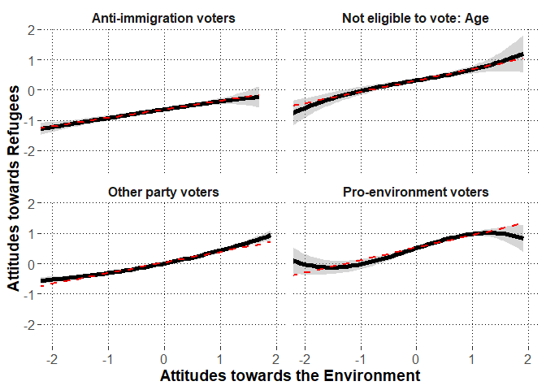

# Preparations


## Load packages


```r
library(lme4)
library(lmerTest)
library(dplyr)
library(psych)
library(emmeans)
library(ggplot2)
library(metafor)
library(merTools)
```

## Session information about the packages


```r
sessionInfo()
```

```
## R version 3.6.3 (2020-02-29)
## Platform: x86_64-w64-mingw32/x64 (64-bit)
## Running under: Windows 10 x64 (build 17763)
## 
## Matrix products: default
## 
## locale:
## [1] LC_COLLATE=Finnish_Finland.1252  LC_CTYPE=Finnish_Finland.1252   
## [3] LC_MONETARY=Finnish_Finland.1252 LC_NUMERIC=C                    
## [5] LC_TIME=Finnish_Finland.1252    
## 
## attached base packages:
## [1] stats     graphics  grDevices utils     datasets  methods   base     
## 
## other attached packages:
##  [1] merTools_0.5.0  arm_1.10-1      MASS_7.3-51.5   metafor_2.4-0  
##  [5] ggplot2_3.3.2   emmeans_1.4.6   psych_1.9.12.31 dplyr_0.8.5    
##  [9] lmerTest_3.1-2  lme4_1.1-23     Matrix_1.2-18  
## 
## loaded via a namespace (and not attached):
##  [1] Rcpp_1.0.4.6        mvtnorm_1.1-0       lattice_0.20-38    
##  [4] tidyr_1.1.0         zoo_1.8-7           assertthat_0.2.1   
##  [7] digest_0.6.25       foreach_1.5.0       mime_0.9           
## [10] R6_2.4.1            backports_1.1.6     evaluate_0.14      
## [13] coda_0.19-3         pillar_1.4.3        rlang_0.4.6        
## [16] multcomp_1.4-13     minqa_1.2.4         nloptr_1.2.2.1     
## [19] rmarkdown_2.1       splines_3.6.3       statmod_1.4.34     
## [22] stringr_1.4.0       munsell_0.5.0       shiny_1.4.0.2      
## [25] broom_0.5.6         httpuv_1.5.2        compiler_3.6.3     
## [28] numDeriv_2016.8-1.1 xfun_0.13           pkgconfig_2.0.3    
## [31] mnormt_1.5-6        htmltools_0.4.0     tidyselect_1.1.0   
## [34] tibble_3.0.1        codetools_0.2-16    later_1.0.0        
## [37] crayon_1.3.4        withr_2.2.0         grid_3.6.3         
## [40] nlme_3.1-144        xtable_1.8-4        gtable_0.3.0       
## [43] lifecycle_0.2.0     magrittr_1.5        scales_1.1.1       
## [46] estimability_1.3    stringi_1.4.6       promises_1.1.0     
## [49] ellipsis_0.3.1      vctrs_0.3.0         generics_0.0.2     
## [52] boot_1.3-24         sandwich_2.5-1      blme_1.0-4         
## [55] TH.data_1.0-10      iterators_1.0.12    tools_3.6.3        
## [58] glue_1.4.1          purrr_0.3.4         fastmap_1.0.1      
## [61] abind_1.4-5         parallel_3.6.3      survival_3.1-8     
## [64] yaml_2.2.1          colorspace_1.4-1    knitr_1.28
```

\newpage

## Custom functions


```r
#to extract fixed effects
getFE<-function(model){
  coefs<-data.frame(summary(model)$coefficients)
  coefs$lower<-coefs[,1]-qt(p=.975,df=coefs[,"df"])*coefs[,2]
  coefs$upper<-coefs[,1]+qt(p=.975,df=coefs[,"df"])*coefs[,2]
  coefs<-cbind.data.frame(round(coefs[,1:4],2),
                          p=round(coefs[,5],3),
                          LL=round(coefs$lower,2),
                          UL=round(coefs$upper,2))
  #row.names(coefs)<-substr(row.names(coefs),1,25)
  return(coefs)
}


#to extract random effects
getVC<-function(model){
  VC<-as.data.frame(VarCorr(model))
  VC<-cbind(VC[,c(1:3)],est_SD=VC[,5],est_SD2=VC[,4])
  return(VC)
}


#to extract model deviance
getDEV<-function(model){
  DEV<-unname(summary(model)$devcomp$cmp["dev"])
  return(DEV)
}


#partial correlation test
pcor.test <- function(x,y,z,use="mat",method="p",na.rm=T){


	x <- c(x)
	y <- c(y)
	z <- as.data.frame(z)

	if(use == "mat"){
		p.use <- "Var-Cov matrix"
		pcor = pcor.mat(x,y,z,method=method,na.rm=na.rm)
	}else if(use == "rec"){
		p.use <- "Recursive formula"
		pcor = pcor.rec(x,y,z,method=method,na.rm=na.rm)
	}else{
		stop("\'use\' should be either \"rec\" or \"mat\"!\n")
	}

	# print the method
	if(gregexpr("p",method)[[1]][1] == 1){
		p.method <- "Pearson"
	}else if(gregexpr("s",method)[[1]][1] == 1){
		p.method <- "Spearman"
	}else if(gregexpr("k",method)[[1]][1] == 1){
		p.method <- "Kendall"
	}else{
		stop("\'method\' should be \"pearson\" or \"spearman\" or \"kendall\"!\n")
	}

	# sample number
	n <- dim(na.omit(data.frame(x,y,z)))[1]
	
	# given variables' number
	gn <- dim(z)[2]

	# p-value
	if(p.method == "Kendall"){
		statistic <- pcor/sqrt(2*(2*(n-gn)+5)/(9*(n-gn)*(n-1-gn)))
		p.value <- 2*pnorm(-abs(statistic))

	}else{
		statistic <- pcor*sqrt((n-2-gn)/(1-pcor^2))
  		p.value <- 2*pnorm(-abs(statistic))
	}

	data.frame(estimate=pcor,p.value=p.value,statistic=statistic,n=n,gn=gn,Method=p.method,Use=p.use)
}			


# By using var-cov matrix
pcor.mat <- function(x,y,z,method="p",na.rm=T){

	x <- c(x)
	y <- c(y)
	z <- as.data.frame(z)

	if(dim(z)[2] == 0){
		stop("There should be given data\n")
	}

	data <- data.frame(x,y,z)

	if(na.rm == T){
		data = na.omit(data)
	}

	xdata <- na.omit(data.frame(data[,c(1,2)]))
	Sxx <- cov(xdata,xdata,m=method)

	xzdata <- na.omit(data)
	xdata <- data.frame(xzdata[,c(1,2)])
	zdata <- data.frame(xzdata[,-c(1,2)])
	Sxz <- cov(xdata,zdata,m=method)

	zdata <- na.omit(data.frame(data[,-c(1,2)]))
	Szz <- cov(zdata,zdata,m=method)

	# is Szz positive definite?
	zz.ev <- eigen(Szz)$values
	if(min(zz.ev)[1]<0){
		stop("\'Szz\' is not positive definite!\n")
	}

	# partial correlation
	Sxx.z <- Sxx - Sxz %*% solve(Szz) %*% t(Sxz)
	
	rxx.z <- cov2cor(Sxx.z)[1,2]

	rxx.z
}

# By using recursive formula
pcor.rec <- function(x,y,z,method="p",na.rm=T){
	# 

	x <- c(x)
	y <- c(y)
	z <- as.data.frame(z)

	if(dim(z)[2] == 0){
		stop("There should be given data\n")
	}

	data <- data.frame(x,y,z)

	if(na.rm == T){
		data = na.omit(data)
	}

	# recursive formula
	if(dim(z)[2] == 1){
		tdata <- na.omit(data.frame(data[,1],data[,2]))
		rxy <- cor(tdata[,1],tdata[,2],m=method)

		tdata <- na.omit(data.frame(data[,1],data[,-c(1,2)]))
		rxz <- cor(tdata[,1],tdata[,2],m=method)

		tdata <- na.omit(data.frame(data[,2],data[,-c(1,2)]))
		ryz <- cor(tdata[,1],tdata[,2],m=method)

		rxy.z <- (rxy - rxz*ryz)/( sqrt(1-rxz^2)*sqrt(1-ryz^2) )
		
		return(rxy.z)
	}else{
		x <- c(data[,1])
		y <- c(data[,2])
		z0 <- c(data[,3])
		zc <- as.data.frame(data[,-c(1,2,3)])

		rxy.zc <- pcor.rec(x,y,zc,method=method,na.rm=na.rm)
		rxz0.zc <- pcor.rec(x,z0,zc,method=method,na.rm=na.rm)
		ryz0.zc <- pcor.rec(y,z0,zc,method=method,na.rm=na.rm)
		
		rxy.z <- (rxy.zc - rxz0.zc*ryz0.zc)/( sqrt(1-rxz0.zc^2)*sqrt(1-ryz0.zc^2) )
		return(rxy.z)
	}			
}	
```

\newpage

## Load data


```r
dat<-read.csv2("alig.dat.csv",stringsAsFactors = F)
```

### Variable transformations

#### Country


```r
table(dat$cntry)
```

```
## 
##   AT   BE   CH   DE   EE   ES   FI   FR   GB   IE   IT   NL   NO   PT   SE   SI 
## 1973 1753 1503 2819 1974 1817 1862 2015 1876 2676 2317 1661 1538 1228 1525 1276
```

#### Voting group


```r
#make voting group variable names unique to each country
dat$voting.group<-paste0(dat$cntry,": ",dat$vote.group.combined)
```

#### Centering Attitudes towards the Environment


```r
#rename the variable
dat$environ<-dat$F.env
                                 
describe(dat$environ,fast=T)
```

```
##    vars     n mean   sd   min  max range se
## X1    1 28884    0 0.76 -2.95 1.91  4.85  0
```

```r
#grand mean center
dat$environ.gmc<-dat$environ-mean(dat$environ,na.rm=T)

#obtain dataframe with country means and add to data

environ.cntry<-dat %>%
  group_by(cntry) %>%
  summarize(environ.cntry=mean(environ.gmc,na.rm=T))

dat<-left_join(x=dat,
               y=environ.cntry,
               by=c("cntry"))

#center individuals around country means

dat$environ.cntrymc<-dat$environ.gmc-dat$environ.cntry

#obtain dataframe with voting group means and add to data

environ.voting.group<-dat %>%
  group_by(voting.group) %>%
  summarize(environ.voting.group=mean(environ.cntrymc,na.rm=T))

dat<-left_join(x=dat,
               y=environ.voting.group,
               by=c("voting.group"))

#center individuals around voting group means

dat$environ.vgmc<-dat$environ.cntrymc-dat$environ.voting.group

#describe the variable

describe(dat$environ.vgmc,fast=T)
```

```
##    vars     n mean   sd   min  max range se
## X1    1 28884    0 0.74 -3.04 2.23  5.27  0
```

```r
#rename as lvl1, lvl2, and lvl3

dat$environ.lvl1<-dat$environ.vgmc
dat$environ.lvl2<-dat$environ.voting.group
dat$environ.lvl3<-dat$environ.cntry
```

\newpage

#### Centering Political Engagement


```r
#correlation between the variables

corr.test(dat$nwspol.4,dat$polintr.R,adjust="none")
```

```
## Call:corr.test(x = dat$nwspol.4, y = dat$polintr.R, adjust = "none")
## Correlation matrix 
## [1] 0.31
## Sample Size 
## [1] 29637
## [1] 0
## 
##  To see confidence intervals of the correlations, print with the short=FALSE option
```

```r
#rename the variable

dat$engagement<-dat$polint.agg

#descriptive statistics
psych::describe(dat$engagement,fast=T)
```

```
##    vars     n mean   sd min max range se
## X1    1 29813 2.54 0.79   1   4     3  0
```

```r
#grand mean center
dat$engagement.gmc<-dat$engagement-mean(dat$engagement,na.rm=T)

#obtain dataframe with country means and add to data

engagement.cntry<-dat %>%
  group_by(cntry) %>%
  summarize(engagement.cntry=mean(engagement.gmc,na.rm=T))

dat<-left_join(x=dat,
               y=engagement.cntry,
               by=c("cntry"))

#center individuals around country means

dat$engagement.cntrymc<-dat$engagement.gmc-dat$engagement.cntry

#obtain dataframe with voting group means and add to data

engagement.voting.group<-dat %>%
  group_by(voting.group) %>%
  summarize(engagement.voting.group=mean(engagement.cntrymc,na.rm=T))

dat<-left_join(x=dat,
               y=engagement.voting.group,
               by=c("voting.group"))

#center individuals around voting group means

dat$engagement.vgmc<-dat$engagement.cntrymc-dat$engagement.voting.group

#describe the centered variable

describe(dat$engagement.vgmc,fast=T)
```

```
##    vars     n mean   sd   min max range se
## X1    1 29813    0 0.74 -2.06 2.1  4.17  0
```

```r
#rename as lvl1, lvl2, and lvl3

dat$engagement.lvl1<-dat$engagement.vgmc
dat$engagement.lvl2<-dat$engagement.voting.group
dat$engagement.lvl3<-dat$engagement.cntry
```

\newpage

#### Centering Political Interest Item (for exploratory analysis)


```r
#rename the variable (this will replace the previous item with same name)
dat$polintr<-dat$polintr.R

#descriptive statistics
psych::describe(dat$polintr,fast=T)
```

```
##    vars     n mean   sd min max range   se
## X1    1 29793  2.5 0.91   1   4     3 0.01
```

```r
#grand mean center
dat$polintr.gmc<-dat$polintr-mean(dat$polintr,na.rm=T)

#obtain dataframe with country means and add to data

polintr.cntry<-dat %>%
  group_by(cntry) %>%
  summarize(polintr.cntry=mean(polintr.gmc,na.rm=T))

dat<-left_join(x=dat,
               y=polintr.cntry,
               by=c("cntry"))

#center individuals around country means

dat$polintr.cntrymc<-dat$polintr.gmc-dat$polintr.cntry

#obtain dataframe with voting group means and add to data

polintr.voting.group<-dat %>%
  group_by(voting.group) %>%
  summarize(polintr.voting.group=mean(polintr.cntrymc,na.rm=T))

dat<-left_join(x=dat,
               y=polintr.voting.group,
               by=c("voting.group"))

#center individuals around voting group means

dat$polintr.vgmc<-dat$polintr.cntrymc-dat$polintr.voting.group

#describe the centered variable

describe(dat$polintr.vgmc,fast=T)
```

```
##    vars     n mean   sd   min  max range se
## X1    1 29793    0 0.83 -2.19 2.36  4.55  0
```

```r
#rename as lvl1, lvl2, and lvl3

dat$polintr.lvl1<-dat$polintr.vgmc
dat$polintr.lvl2<-dat$polintr.voting.group
dat$polintr.lvl3<-dat$polintr.cntry
```


\newpage

#### Centering "Time used for consuming political media" (for exploratory analysis)


```r
#rename the variable
dat$polnews<-dat$nwspol.4

#descriptive statistics
psych::describe(dat$polnews,fast=T)
```

```
##    vars     n mean   sd min max range   se
## X1    1 29657 2.59 1.04   1   4     3 0.01
```

```r
#grand mean center
dat$polnews.gmc<-dat$polnews-mean(dat$polnews,na.rm=T)

#obtain dataframe with country means and add to data

polnews.cntry<-dat %>%
  group_by(cntry) %>%
  summarize(polnews.cntry=mean(polnews.gmc,na.rm=T))

dat<-left_join(x=dat,
               y=polnews.cntry,
               by=c("cntry"))

#center individuals around country means

dat$polnews.cntrymc<-dat$polnews.gmc-dat$polnews.cntry

#obtain dataframe with voting group means and add to data

polnews.voting.group<-dat %>%
  group_by(voting.group) %>%
  summarize(polnews.voting.group=mean(polnews.cntrymc,na.rm=T))

dat<-left_join(x=dat,
               y=polnews.voting.group,
               by=c("voting.group"))

#center individuals around voting group means

dat$polnews.vgmc<-dat$polnews.cntrymc-dat$polnews.voting.group

#describe the centered variable

describe(dat$polnews.vgmc,fast=T)
```

```
##    vars     n mean sd   min  max range   se
## X1    1 29657    0  1 -2.19 2.31   4.5 0.01
```

```r
#rename as lvl1, lvl2, and lvl3

dat$polnews.lvl1<-dat$polnews.vgmc
dat$polnews.lvl2<-dat$polnews.voting.group
dat$polnews.lvl3<-dat$polnews.cntry
```

\newpage

#### Rename and grand mean center the Attitudes towards refugees (pro-refugee attitudes indicate high scores)


```r
#calculate the sum score
dat$refugees<-dat$F.imm
                                 
describe(dat$refugees,fast=T)
```

```
##    vars     n mean   sd   min  max range   se
## X1    1 27492    0 1.27 -3.96 3.96  7.92 0.01
```

```r
#grand mean center
dat$refugees<-dat$refugees-mean(dat$refugees,na.rm=T)

#rename
dat$refugees.gmc<-dat$refugees

#obtain dataframe with country means and add to data

refugees.cntry<-dat %>%
  group_by(cntry) %>%
  summarize(refugees.cntry=mean(refugees.gmc,na.rm=T))

dat<-left_join(x=dat,
               y=refugees.cntry,
               by=c("cntry"))

#center individuals around country means

dat$refugees.cntrymc<-dat$refugees.gmc-dat$refugees.cntry

#obtain dataframe with voting group means and add to data

refugees.voting.group<-dat %>%
  group_by(voting.group) %>%
  summarize(refugees.voting.group=mean(refugees.cntrymc,na.rm=T))

dat<-left_join(x=dat,
               y=refugees.voting.group,
               by=c("voting.group"))

#center individuals around voting group means

dat$refugees.vgmc<-dat$refugees.cntrymc-dat$refugees.voting.group

#describe the variable

describe(dat$refugees.vgmc,fast=T)
```

```
##    vars     n mean  sd   min  max range   se
## X1    1 27492    0 1.2 -4.13 4.35  8.48 0.01
```

```r
#rename as lvl1, lvl2, and lvl3

dat$refugees.lvl1<-dat$refugees.vgmc
dat$refugees.lvl2<-dat$refugees.voting.group
dat$refugees.lvl3<-dat$refugees.cntry
```

\newpage

#### Rename and Center the covariates aroung grand mean or logical middle points if applicable


```r
#grand-mean center age
dat$age<-dat$agea-mean(dat$agea,na.rm=T)
#sex around zero
dat$gender<-dat$gndr-1.5 #-0.5 males, 0.5 females
#rename occupation variable
dat$occup<-dat$isco.13
#grand-mean center education years
dat$educ<-dat$eduyrs-mean(dat$eduyrs,na.rm=T)
#residence around zero
dat$resid<-dat$rural-0.5 #-0.5 urban, 0.5 rural
```

\newpage

#### Voting group dummy-coded variables


```r
#recode if the party voted is =1, or not =0 anti-immigration
dat$anti.imm.party.dummy<-ifelse(is.na(dat$anti.imm.party.rule2),0,1)
#recode if the party voted is =1, or not =0 pro-environment
dat$pro.env.party.dummy<-ifelse(is.na(dat$pro.env.party.manual),0,1)

#dat$other.party.dummy<-ifelse(grepl("Other",dat$vote.group.combined),1,0)

#dummy-code not voting
dat$did.not.vote.dummy<-ifelse(grepl("did not vote",dat$vote.group.combined),1,0)
table(dat$did.not.vote.dummy)
```

```
## 
##     0     1 
## 24330  5483
```

```r
#dummy-code "don't know"
dat$dont.know.dummy<-ifelse(grepl("Don't know",dat$vote.group.combined),1,0)
table(dat$dont.know.dummy)
```

```
## 
##     0     1 
## 28722  1091
```

```r
#dummy-code invalid vote
dat$invalid.vote.dummy<-ifelse(grepl("Invalid vote",dat$vote.group.combined),1,0)
table(dat$invalid.vote.dummy)
```

```
## 
##     0     1 
## 29798    15
```

```r
#dummy-code "no answer"
dat$no.answer.dummy<-ifelse(grepl("No answer",dat$vote.group.combined),1,0)
table(dat$no.answer.dummy)
```

```
## 
##     0     1 
## 29801    12
```

```r
#dummy-code not-eligible: age
dat$not.eligible.age.dummy<-ifelse(grepl("not eligible: age",dat$vote.group.combined),1,0)
table(dat$not.eligible.age.dummy)
```

```
## 
##     0     1 
## 28390  1423
```

```r
#dummy code not-eligible: citizenship
dat$not.eligible.citizenship.dummy<-ifelse(grepl("not eligible: citizenship",dat$vote.group.combined),1,0)
table(dat$not.eligible.citizenship.dummy)
```

```
## 
##     0     1 
## 28611  1202
```

```r
#dummy-code not-eligible: other reasons
dat$not.eligible.other.dummy<-ifelse(grepl("not eligible: other",dat$vote.group.combined),1,0)
table(dat$not.eligible.other.dummy)
```

```
## 
##     0     1 
## 29594   219
```

```r
#add dummy-variable for other_party voting

dat<- dat %>%
  mutate(other.party.dummy:=case_when(
    anti.imm.party.dummy==1 |
      pro.env.party.dummy==1 |
      did.not.vote.dummy==1 |
      dont.know.dummy==1 |
      invalid.vote.dummy==1 |
      no.answer.dummy==1 |
      not.eligible.age.dummy==1 |
      not.eligible.citizenship.dummy==1 |
      not.eligible.other.dummy==1 ~0,
    TRUE~1
  ))

table(dat$other.party.dummy)
```

```
## 
##     0     1 
## 14441 15372
```

```r
#recode the names for a new multi-category variable: all.parties.lvl2

dat<-dat %>%
  mutate(all.parties.lvl2:=case_when(
    did.not.vote.dummy==1~"Did not vote",
    dont.know.dummy==1~"Don't know",
    no.answer.dummy==1~"No answer",
    invalid.vote.dummy==1~"Invalid vote",
    not.eligible.age.dummy==1~"NE age",
    not.eligible.citizenship.dummy==1~"NE citizen",
    not.eligible.other.dummy==1~"NE other",
    other.party.dummy==1~"Other party",
    anti.imm.party.dummy==1~"Anti-immigration party",
    pro.env.party.dummy==1~"Pro-environment party",
  ),
  party:=case_when(
    other.party.dummy==1~"Other party",
    anti.imm.party.dummy==1~"Anti-immigration party",
    pro.env.party.dummy==1~"Pro-environment party",
    TRUE~NA_character_
  ))
```


#### Omit missing variables


```r
#missing values per each row
dat$analysis.miss<-
  is.na(dat$cntry)+
  is.na(dat$voting.group)+
  is.na(dat$refugees)+
  is.na(dat$environ)+
  is.na(dat$vote.group.combined)+
  is.na(dat$age)+
  is.na(dat$gender)+
  is.na(dat$occup)+
  is.na(dat$educ)+
  is.na(dat$resid)+
  is.na(dat$engagement)
table(dat$analysis.miss)
```

```
## 
##     0     1     2 
## 26886  2604   323
```

```r
#include only those without any missing values
dat<-dat %>%
  filter(analysis.miss ==0)
```

# Exploratory analysis: Is the association linear?

## Data re-preparations


```r
##Remove two of the smallest voting groups

Rdat<-dat %>%
  filter(all.parties.lvl2!="Invalid vote" & all.parties.lvl2!="No answer")
```

## Model 1 (H1 selected model without random effect correlations)


```r
EX9RR.NCmod1<-lmer(refugees~
                     (environ.lvl1||voting.group)+
                     (0+environ.lvl1||cntry)+
                     age+gender+educ+resid+occup+
                     environ.lvl1,data=Rdat,REML=F,
                   control=lmerControl(optimizer="bobyqa",optCtrl=list(maxfun=2e8)))

isSingular(EX9RR.NCmod1)
```

```
## [1] FALSE
```

```r
(VC.EX9RR.NCmod1<-getVC(EX9RR.NCmod1))
```

```
##              grp         var1 var2     est_SD     est_SD2
## 1   voting.group  (Intercept) <NA> 0.42018611 0.176556365
## 2 voting.group.1 environ.lvl1 <NA> 0.09386318 0.008810296
## 3          cntry environ.lvl1 <NA> 0.11630492 0.013526833
## 4       Residual         <NA> <NA> 1.16278526 1.352069560
```

```r
getFE(EX9RR.NCmod1)
```

```
##                                                         Estimate Std..Error
## (Intercept)                                                 0.04       0.11
## age                                                         0.00       0.00
## gender                                                      0.09       0.02
## educ                                                        0.03       0.00
## resid                                                      -0.11       0.02
## occupClerical support workers                              -0.03       0.11
## occupCraft and related trades workers                      -0.13       0.11
## occupElementary occupations                                 0.01       0.11
## occupManagers                                               0.05       0.11
## occupOther: Not in paid work                                0.18       0.11
## occupPlant and machine operators, and assemblers           -0.08       0.11
## occupProfessionals                                          0.17       0.11
## occupRetired                                                0.05       0.12
## occupService and sales workers                             -0.06       0.11
## occupSkilled agricultural, forestry and fishery workers    -0.02       0.12
## occupTechnicians and associate professionals               -0.01       0.11
## occupUnemployed                                             0.01       0.13
## environ.lvl1                                                0.26       0.03
##                                                               df t.value     p
## (Intercept)                                             18547.55    0.35 0.728
## age                                                     26408.23   -1.56 0.119
## gender                                                  26714.32    5.61 0.000
## educ                                                    26808.80   12.36 0.000
## resid                                                   26807.58   -7.23 0.000
## occupClerical support workers                           26680.08   -0.24 0.810
## occupCraft and related trades workers                   26687.32   -1.21 0.228
## occupElementary occupations                             26689.79    0.09 0.929
## occupManagers                                           26683.86    0.43 0.668
## occupOther: Not in paid work                            26785.47    1.61 0.107
## occupPlant and machine operators, and assemblers        26688.36   -0.69 0.489
## occupProfessionals                                      26680.86    1.57 0.116
## occupRetired                                            26683.17    0.42 0.671
## occupService and sales workers                          26681.71   -0.58 0.565
## occupSkilled agricultural, forestry and fishery workers 26688.32   -0.16 0.872
## occupTechnicians and associate professionals            26677.72   -0.11 0.915
## occupUnemployed                                         26700.80    0.09 0.924
## environ.lvl1                                               15.56    8.16 0.000
##                                                            LL    UL
## (Intercept)                                             -0.18  0.25
## age                                                      0.00  0.00
## gender                                                   0.06  0.12
## educ                                                     0.02  0.03
## resid                                                   -0.14 -0.08
## occupClerical support workers                           -0.24  0.19
## occupCraft and related trades workers                   -0.34  0.08
## occupElementary occupations                             -0.20  0.22
## occupManagers                                           -0.17  0.26
## occupOther: Not in paid work                            -0.04  0.40
## occupPlant and machine operators, and assemblers        -0.29  0.14
## occupProfessionals                                      -0.04  0.38
## occupRetired                                            -0.19  0.29
## occupService and sales workers                          -0.27  0.15
## occupSkilled agricultural, forestry and fishery workers -0.25  0.21
## occupTechnicians and associate professionals            -0.22  0.20
## occupUnemployed                                         -0.25  0.27
## environ.lvl1                                             0.19  0.33
```

\newpage

## Model 2 (add squared fixed effect)


```r
EX9RR.NCmod2<-lmer(refugees~(environ.lvl1||voting.group)+
                     (0+environ.lvl1||cntry)+
                     age+gender+educ+resid+occup+
                     environ.lvl1+
                     I(environ.lvl1^2),data=Rdat,REML=F,
                   control=lmerControl(optimizer="bobyqa",
                                       optCtrl=list(maxfun=2e8)))


anova(EX9RR.NCmod1,EX9RR.NCmod2)
```

```
## Data: Rdat
## Models:
## EX9RR.NCmod1: refugees ~ (environ.lvl1 || voting.group) + (0 + environ.lvl1 || 
## EX9RR.NCmod1:     cntry) + age + gender + educ + resid + occup + environ.lvl1
## EX9RR.NCmod2: refugees ~ (environ.lvl1 || voting.group) + (0 + environ.lvl1 || 
## EX9RR.NCmod2:     cntry) + age + gender + educ + resid + occup + environ.lvl1 + 
## EX9RR.NCmod2:     I(environ.lvl1^2)
##              npar   AIC   BIC logLik deviance Chisq Df Pr(>Chisq)
## EX9RR.NCmod1   22 85054 85234 -42505    85010                    
## EX9RR.NCmod2   23 85055 85243 -42504    85009  1.13  1     0.2878
```

```r
isSingular(EX9RR.NCmod2)
```

```
## [1] FALSE
```

```r
(VC.EX9RR.NCmod2<-getVC(EX9RR.NCmod2))
```

```
##              grp         var1 var2    est_SD     est_SD2
## 1   voting.group  (Intercept) <NA> 0.4206751 0.176967533
## 2 voting.group.1 environ.lvl1 <NA> 0.0941495 0.008864128
## 3          cntry environ.lvl1 <NA> 0.1163575 0.013539057
## 4       Residual         <NA> <NA> 1.1627433 1.351971915
```

```r
getFE(EX9RR.NCmod2)
```

```
##                                                         Estimate Std..Error
## (Intercept)                                                 0.03       0.11
## age                                                         0.00       0.00
## gender                                                      0.09       0.02
## educ                                                        0.03       0.00
## resid                                                      -0.11       0.02
## occupClerical support workers                              -0.03       0.11
## occupCraft and related trades workers                      -0.13       0.11
## occupElementary occupations                                 0.01       0.11
## occupManagers                                               0.05       0.11
## occupOther: Not in paid work                                0.18       0.11
## occupPlant and machine operators, and assemblers           -0.08       0.11
## occupProfessionals                                          0.17       0.11
## occupRetired                                                0.05       0.12
## occupService and sales workers                             -0.06       0.11
## occupSkilled agricultural, forestry and fishery workers    -0.02       0.12
## occupTechnicians and associate professionals               -0.01       0.11
## occupUnemployed                                             0.01       0.13
## environ.lvl1                                                0.27       0.03
## I(environ.lvl1^2)                                           0.01       0.01
##                                                               df t.value     p
## (Intercept)                                             18543.11    0.31 0.758
## age                                                     26412.57   -1.57 0.116
## gender                                                  26713.38    5.63 0.000
## educ                                                    26809.42   12.32 0.000
## resid                                                   26806.00   -7.22 0.000
## occupClerical support workers                           26679.90   -0.24 0.808
## occupCraft and related trades workers                   26687.07   -1.21 0.227
## occupElementary occupations                             26689.66    0.08 0.933
## occupManagers                                           26683.79    0.42 0.673
## occupOther: Not in paid work                            26785.59    1.60 0.109
## occupPlant and machine operators, and assemblers        26688.10   -0.69 0.487
## occupProfessionals                                      26680.90    1.57 0.118
## occupRetired                                            26683.31    0.42 0.678
## occupService and sales workers                          26681.50   -0.58 0.563
## occupSkilled agricultural, forestry and fishery workers 26688.22   -0.17 0.867
## occupTechnicians and associate professionals            26677.53   -0.11 0.913
## occupUnemployed                                         26700.63    0.09 0.929
## environ.lvl1                                               15.95    8.22 0.000
## I(environ.lvl1^2)                                       26433.23    1.06 0.288
##                                                            LL    UL
## (Intercept)                                             -0.18  0.25
## age                                                      0.00  0.00
## gender                                                   0.06  0.12
## educ                                                     0.02  0.03
## resid                                                   -0.14 -0.08
## occupClerical support workers                           -0.24  0.19
## occupCraft and related trades workers                   -0.34  0.08
## occupElementary occupations                             -0.20  0.22
## occupManagers                                           -0.17  0.26
## occupOther: Not in paid work                            -0.04  0.40
## occupPlant and machine operators, and assemblers        -0.29  0.14
## occupProfessionals                                      -0.04  0.38
## occupRetired                                            -0.19  0.29
## occupService and sales workers                          -0.27  0.15
## occupSkilled agricultural, forestry and fishery workers -0.25  0.21
## occupTechnicians and associate professionals            -0.22  0.20
## occupUnemployed                                         -0.25  0.27
## environ.lvl1                                             0.20  0.34
## I(environ.lvl1^2)                                       -0.01  0.03
```

\newpage

## Model 3 (add fixed cubic effect)


```r
EX9RR.NCmod3<-lmer(refugees~(environ.lvl1||voting.group)+
                     (0+environ.lvl1||cntry)+
                     age+gender+educ+resid+occup+
                     environ.lvl1+
            I(environ.lvl1^2)+
              I(environ.lvl1^3),
            data=Rdat,REML=F,
                   control=lmerControl(optimizer="bobyqa",
                                       optCtrl=list(maxfun=2e8)))

isSingular(EX9RR.NCmod3)
```

```
## [1] FALSE
```

```r
#test for cubic term only
anova(EX9RR.NCmod2,EX9RR.NCmod3)
```

```
## Data: Rdat
## Models:
## EX9RR.NCmod2: refugees ~ (environ.lvl1 || voting.group) + (0 + environ.lvl1 || 
## EX9RR.NCmod2:     cntry) + age + gender + educ + resid + occup + environ.lvl1 + 
## EX9RR.NCmod2:     I(environ.lvl1^2)
## EX9RR.NCmod3: refugees ~ (environ.lvl1 || voting.group) + (0 + environ.lvl1 || 
## EX9RR.NCmod3:     cntry) + age + gender + educ + resid + occup + environ.lvl1 + 
## EX9RR.NCmod3:     I(environ.lvl1^2) + I(environ.lvl1^3)
##              npar   AIC   BIC logLik deviance  Chisq Df Pr(>Chisq)
## EX9RR.NCmod2   23 85055 85243 -42504    85009                     
## EX9RR.NCmod3   24 85057 85254 -42504    85009 0.0085  1     0.9266
```

```r
#test for both non-linear terms
anova(EX9RR.NCmod1,EX9RR.NCmod3)
```

```
## Data: Rdat
## Models:
## EX9RR.NCmod1: refugees ~ (environ.lvl1 || voting.group) + (0 + environ.lvl1 || 
## EX9RR.NCmod1:     cntry) + age + gender + educ + resid + occup + environ.lvl1
## EX9RR.NCmod3: refugees ~ (environ.lvl1 || voting.group) + (0 + environ.lvl1 || 
## EX9RR.NCmod3:     cntry) + age + gender + educ + resid + occup + environ.lvl1 + 
## EX9RR.NCmod3:     I(environ.lvl1^2) + I(environ.lvl1^3)
##              npar   AIC   BIC logLik deviance  Chisq Df Pr(>Chisq)
## EX9RR.NCmod1   22 85054 85234 -42505    85010                     
## EX9RR.NCmod3   24 85057 85254 -42504    85009 1.1385  2      0.566
```

```r
(VC.EX9RR.NCmod3<-getVC(EX9RR.NCmod3))
```

```
##              grp         var1 var2     est_SD     est_SD2
## 1   voting.group  (Intercept) <NA> 0.42065663 0.176952000
## 2 voting.group.1 environ.lvl1 <NA> 0.09411469 0.008857574
## 3          cntry environ.lvl1 <NA> 0.11631531 0.013529251
## 4       Residual         <NA> <NA> 1.16274448 1.351974716
```

```r
getFE(EX9RR.NCmod3)
```

```
##                                                         Estimate Std..Error
## (Intercept)                                                 0.03       0.11
## age                                                         0.00       0.00
## gender                                                      0.09       0.02
## educ                                                        0.03       0.00
## resid                                                      -0.11       0.02
## occupClerical support workers                              -0.03       0.11
## occupCraft and related trades workers                      -0.13       0.11
## occupElementary occupations                                 0.01       0.11
## occupManagers                                               0.05       0.11
## occupOther: Not in paid work                                0.18       0.11
## occupPlant and machine operators, and assemblers           -0.08       0.11
## occupProfessionals                                          0.17       0.11
## occupRetired                                                0.05       0.12
## occupService and sales workers                             -0.06       0.11
## occupSkilled agricultural, forestry and fishery workers    -0.02       0.12
## occupTechnicians and associate professionals               -0.01       0.11
## occupUnemployed                                             0.01       0.13
## environ.lvl1                                                0.27       0.03
## I(environ.lvl1^2)                                           0.01       0.01
## I(environ.lvl1^3)                                           0.00       0.01
##                                                               df t.value     p
## (Intercept)                                             18550.61    0.31 0.757
## age                                                     26413.36   -1.57 0.116
## gender                                                  26714.63    5.63 0.000
## educ                                                    26809.42   12.32 0.000
## resid                                                   26806.08   -7.22 0.000
## occupClerical support workers                           26679.87   -0.24 0.808
## occupCraft and related trades workers                   26686.89   -1.21 0.227
## occupElementary occupations                             26689.61    0.08 0.933
## occupManagers                                           26683.99    0.42 0.673
## occupOther: Not in paid work                            26785.34    1.60 0.109
## occupPlant and machine operators, and assemblers        26688.02   -0.69 0.487
## occupProfessionals                                      26681.12    1.57 0.118
## occupRetired                                            26683.49    0.42 0.678
## occupService and sales workers                          26681.32   -0.58 0.563
## occupSkilled agricultural, forestry and fishery workers 26688.18   -0.17 0.867
## occupTechnicians and associate professionals            26677.66   -0.11 0.913
## occupUnemployed                                         26701.00    0.09 0.929
## environ.lvl1                                               19.65    7.85 0.000
## I(environ.lvl1^2)                                       26297.23    0.74 0.459
## I(environ.lvl1^3)                                       21463.17   -0.09 0.927
##                                                            LL    UL
## (Intercept)                                             -0.18  0.25
## age                                                      0.00  0.00
## gender                                                   0.06  0.12
## educ                                                     0.02  0.03
## resid                                                   -0.14 -0.08
## occupClerical support workers                           -0.24  0.19
## occupCraft and related trades workers                   -0.34  0.08
## occupElementary occupations                             -0.20  0.22
## occupManagers                                           -0.17  0.26
## occupOther: Not in paid work                            -0.04  0.40
## occupPlant and machine operators, and assemblers        -0.29  0.14
## occupProfessionals                                      -0.04  0.38
## occupRetired                                            -0.19  0.29
## occupService and sales workers                          -0.27  0.15
## occupSkilled agricultural, forestry and fishery workers -0.25  0.21
## occupTechnicians and associate professionals            -0.22  0.20
## occupUnemployed                                         -0.25  0.27
## environ.lvl1                                             0.20  0.34
## I(environ.lvl1^2)                                       -0.01  0.03
## I(environ.lvl1^3)                                       -0.02  0.01
```

## Model 4 (add random effects for non-linear terms by country)


```r
EX9RR.NCmod4<-lmer(refugees~(environ.lvl1||voting.group)+
                (0+environ.lvl1+
                   I(environ.lvl1^2)+
                   I(environ.lvl1^3)||cntry)+
                     age+gender+educ+resid+occup+
                     environ.lvl1+
                  I(environ.lvl1^2)+
                  I(environ.lvl1^3),
                data=Rdat,REML=F,
                   control=lmerControl(optimizer="bobyqa",
                                       optCtrl=list(maxfun=2e8)))
```

```
## boundary (singular) fit: see ?isSingular
```

```r
isSingular(EX9RR.NCmod4)
```

```
## [1] TRUE
```

```r
anova(EX9RR.NCmod3,EX9RR.NCmod4)
```

```
## Data: Rdat
## Models:
## EX9RR.NCmod3: refugees ~ (environ.lvl1 || voting.group) + (0 + environ.lvl1 || 
## EX9RR.NCmod3:     cntry) + age + gender + educ + resid + occup + environ.lvl1 + 
## EX9RR.NCmod3:     I(environ.lvl1^2) + I(environ.lvl1^3)
## EX9RR.NCmod4: refugees ~ (environ.lvl1 || voting.group) + (0 + environ.lvl1 + 
## EX9RR.NCmod4:     I(environ.lvl1^2) + I(environ.lvl1^3) || cntry) + age + gender + 
## EX9RR.NCmod4:     educ + resid + occup + environ.lvl1 + I(environ.lvl1^2) + 
## EX9RR.NCmod4:     I(environ.lvl1^3)
##              npar   AIC   BIC logLik deviance  Chisq Df Pr(>Chisq)   
## EX9RR.NCmod3   24 85057 85254 -42504    85009                        
## EX9RR.NCmod4   26 85051 85264 -42499    84999 10.309  2   0.005772 **
## ---
## Signif. codes:  0 '***' 0.001 '**' 0.01 '*' 0.05 '.' 0.1 ' ' 1
```

```r
(VC.EX9RR.NCmod4<-getVC(EX9RR.NCmod4))
```

```
##              grp              var1 var2       est_SD      est_SD2
## 1   voting.group       (Intercept) <NA> 4.204997e-01 1.768200e-01
## 2 voting.group.1      environ.lvl1 <NA> 9.545887e-02 9.112396e-03
## 3          cntry      environ.lvl1 <NA> 1.088580e-01 1.185007e-02
## 4        cntry.1 I(environ.lvl1^2) <NA> 1.341084e-05 1.798505e-10
## 5        cntry.2 I(environ.lvl1^3) <NA> 2.763390e-02 7.636325e-04
## 6       Residual              <NA> <NA> 1.162211e+00 1.350734e+00
```

```r
getFE(EX9RR.NCmod4)
```

```
##                                                         Estimate Std..Error
## (Intercept)                                                 0.03       0.11
## age                                                         0.00       0.00
## gender                                                      0.09       0.02
## educ                                                        0.03       0.00
## resid                                                      -0.11       0.02
## occupClerical support workers                              -0.03       0.11
## occupCraft and related trades workers                      -0.13       0.11
## occupElementary occupations                                 0.01       0.11
## occupManagers                                               0.05       0.11
## occupOther: Not in paid work                                0.18       0.11
## occupPlant and machine operators, and assemblers           -0.08       0.11
## occupProfessionals                                          0.17       0.11
## occupRetired                                                0.05       0.12
## occupService and sales workers                             -0.06       0.11
## occupSkilled agricultural, forestry and fishery workers    -0.02       0.12
## occupTechnicians and associate professionals               -0.01       0.11
## occupUnemployed                                             0.02       0.13
## environ.lvl1                                                0.27       0.03
## I(environ.lvl1^2)                                           0.01       0.01
## I(environ.lvl1^3)                                           0.00       0.01
##                                                               df t.value     p
## (Intercept)                                             18546.25    0.30 0.762
## age                                                     26414.33   -1.51 0.130
## gender                                                  26705.28    5.59 0.000
## educ                                                    26811.46   12.34 0.000
## resid                                                   26806.87   -7.17 0.000
## occupClerical support workers                           26673.35   -0.24 0.809
## occupCraft and related trades workers                   26678.95   -1.20 0.230
## occupElementary occupations                             26683.51    0.10 0.918
## occupManagers                                           26676.94    0.42 0.675
## occupOther: Not in paid work                            26778.05    1.63 0.104
## occupPlant and machine operators, and assemblers        26681.18   -0.69 0.489
## occupProfessionals                                      26673.95    1.57 0.116
## occupRetired                                            26679.86    0.40 0.691
## occupService and sales workers                          26674.53   -0.56 0.575
## occupSkilled agricultural, forestry and fishery workers 26681.95   -0.16 0.872
## occupTechnicians and associate professionals            26671.67   -0.11 0.914
## occupUnemployed                                         26694.21    0.16 0.872
## environ.lvl1                                               18.10    8.36 0.000
## I(environ.lvl1^2)                                       25558.41    0.57 0.571
## I(environ.lvl1^3)                                          17.03   -0.43 0.670
##                                                            LL    UL
## (Intercept)                                             -0.18  0.25
## age                                                      0.00  0.00
## gender                                                   0.06  0.12
## educ                                                     0.02  0.03
## resid                                                   -0.14 -0.08
## occupClerical support workers                           -0.24  0.19
## occupCraft and related trades workers                   -0.34  0.08
## occupElementary occupations                             -0.20  0.22
## occupManagers                                           -0.17  0.26
## occupOther: Not in paid work                            -0.04  0.40
## occupPlant and machine operators, and assemblers        -0.29  0.14
## occupProfessionals                                      -0.04  0.38
## occupRetired                                            -0.19  0.29
## occupService and sales workers                          -0.27  0.15
## occupSkilled agricultural, forestry and fishery workers -0.25  0.21
## occupTechnicians and associate professionals            -0.22  0.20
## occupUnemployed                                         -0.24  0.28
## environ.lvl1                                             0.20  0.34
## I(environ.lvl1^2)                                       -0.02  0.03
## I(environ.lvl1^3)                                       -0.03  0.02
```
## Model 5 (add random effects for non-linear terms by voting group)


```r
EX9RR.NCmod6<-lmer(refugees~
                     (environ.lvl1+
                        I(environ.lvl1^2)+
                        I(environ.lvl1^3)||voting.group)+
                     (0+environ.lvl1+
                        I(environ.lvl1^2)+
                        I(environ.lvl1^3)||cntry)+
                     age+gender+educ+resid+occup+
                     environ.lvl1+
                     I(environ.lvl1^2)+
                     I(environ.lvl1^3),data=Rdat,REML=F,
                   control=lmerControl(optimizer="bobyqa",
                                       optCtrl=list(maxfun=2e8)))
```

```
## boundary (singular) fit: see ?isSingular
```

```r
isSingular(EX9RR.NCmod6)
```

```
## [1] TRUE
```

```r
#test against fixed effects only
anova(EX9RR.NCmod3,EX9RR.NCmod6)
```

```
## Data: Rdat
## Models:
## EX9RR.NCmod3: refugees ~ (environ.lvl1 || voting.group) + (0 + environ.lvl1 || 
## EX9RR.NCmod3:     cntry) + age + gender + educ + resid + occup + environ.lvl1 + 
## EX9RR.NCmod3:     I(environ.lvl1^2) + I(environ.lvl1^3)
## EX9RR.NCmod6: refugees ~ (environ.lvl1 + I(environ.lvl1^2) + I(environ.lvl1^3) || 
## EX9RR.NCmod6:     voting.group) + (0 + environ.lvl1 + I(environ.lvl1^2) + I(environ.lvl1^3) || 
## EX9RR.NCmod6:     cntry) + age + gender + educ + resid + occup + environ.lvl1 + 
## EX9RR.NCmod6:     I(environ.lvl1^2) + I(environ.lvl1^3)
##              npar   AIC   BIC logLik deviance  Chisq Df Pr(>Chisq)   
## EX9RR.NCmod3   24 85057 85254 -42504    85009                        
## EX9RR.NCmod6   28 85050 85279 -42497    84994 15.204  4   0.004296 **
## ---
## Signif. codes:  0 '***' 0.001 '**' 0.01 '*' 0.05 '.' 0.1 ' ' 1
```

```r
#test against random effects by country
anova(EX9RR.NCmod4,EX9RR.NCmod6)
```

```
## Data: Rdat
## Models:
## EX9RR.NCmod4: refugees ~ (environ.lvl1 || voting.group) + (0 + environ.lvl1 + 
## EX9RR.NCmod4:     I(environ.lvl1^2) + I(environ.lvl1^3) || cntry) + age + gender + 
## EX9RR.NCmod4:     educ + resid + occup + environ.lvl1 + I(environ.lvl1^2) + 
## EX9RR.NCmod4:     I(environ.lvl1^3)
## EX9RR.NCmod6: refugees ~ (environ.lvl1 + I(environ.lvl1^2) + I(environ.lvl1^3) || 
## EX9RR.NCmod6:     voting.group) + (0 + environ.lvl1 + I(environ.lvl1^2) + I(environ.lvl1^3) || 
## EX9RR.NCmod6:     cntry) + age + gender + educ + resid + occup + environ.lvl1 + 
## EX9RR.NCmod6:     I(environ.lvl1^2) + I(environ.lvl1^3)
##              npar   AIC   BIC logLik deviance  Chisq Df Pr(>Chisq)  
## EX9RR.NCmod4   26 85051 85264 -42499    84999                       
## EX9RR.NCmod6   28 85050 85279 -42497    84994 4.8945  2    0.08653 .
## ---
## Signif. codes:  0 '***' 0.001 '**' 0.01 '*' 0.05 '.' 0.1 ' ' 1
```

```r
(VC.EX9RR.NCmod6<-getVC(EX9RR.NCmod6))
```

```
##              grp              var1 var2     est_SD      est_SD2
## 1   voting.group       (Intercept) <NA> 0.41831305 0.1749858106
## 2 voting.group.1      environ.lvl1 <NA> 0.09767626 0.0095406519
## 3 voting.group.2 I(environ.lvl1^2) <NA> 0.05851718 0.0034242607
## 4 voting.group.3 I(environ.lvl1^3) <NA> 0.00000000 0.0000000000
## 5          cntry      environ.lvl1 <NA> 0.10769252 0.0115976780
## 6        cntry.1 I(environ.lvl1^2) <NA> 0.00000000 0.0000000000
## 7        cntry.2 I(environ.lvl1^3) <NA> 0.02937159 0.0008626901
## 8       Residual              <NA> <NA> 1.16125836 1.3485209715
```

```r
getFE(EX9RR.NCmod6)
```

```
##                                                         Estimate Std..Error
## (Intercept)                                                 0.03       0.11
## age                                                         0.00       0.00
## gender                                                      0.09       0.02
## educ                                                        0.03       0.00
## resid                                                      -0.11       0.02
## occupClerical support workers                              -0.03       0.11
## occupCraft and related trades workers                      -0.13       0.11
## occupElementary occupations                                 0.01       0.11
## occupManagers                                               0.04       0.11
## occupOther: Not in paid work                                0.18       0.11
## occupPlant and machine operators, and assemblers           -0.08       0.11
## occupProfessionals                                          0.17       0.11
## occupRetired                                                0.05       0.12
## occupService and sales workers                             -0.06       0.11
## occupSkilled agricultural, forestry and fishery workers    -0.02       0.12
## occupTechnicians and associate professionals               -0.01       0.11
## occupUnemployed                                             0.02       0.13
## environ.lvl1                                                0.27       0.03
## I(environ.lvl1^2)                                           0.01       0.01
## I(environ.lvl1^3)                                           0.00       0.01
##                                                               df t.value     p
## (Intercept)                                             18569.27    0.31 0.754
## age                                                     26385.10   -1.51 0.132
## gender                                                  26696.38    5.57 0.000
## educ                                                    26810.48   12.35 0.000
## resid                                                   26797.83   -7.17 0.000
## occupClerical support workers                           26655.67   -0.25 0.803
## occupCraft and related trades workers                   26661.15   -1.21 0.224
## occupElementary occupations                             26665.27    0.09 0.930
## occupManagers                                           26654.27    0.41 0.682
## occupOther: Not in paid work                            26762.95    1.62 0.105
## occupPlant and machine operators, and assemblers        26659.10   -0.70 0.482
## occupProfessionals                                      26654.79    1.55 0.120
## occupRetired                                            26668.10    0.41 0.685
## occupService and sales workers                          26653.48   -0.57 0.569
## occupSkilled agricultural, forestry and fishery workers 26669.08   -0.19 0.853
## occupTechnicians and associate professionals            26654.33   -0.12 0.907
## occupUnemployed                                         26676.22    0.16 0.872
## environ.lvl1                                               18.04    8.39 0.000
## I(environ.lvl1^2)                                         149.71    0.54 0.588
## I(environ.lvl1^3)                                          15.56   -0.37 0.715
##                                                            LL    UL
## (Intercept)                                             -0.18  0.25
## age                                                      0.00  0.00
## gender                                                   0.06  0.12
## educ                                                     0.02  0.03
## resid                                                   -0.14 -0.08
## occupClerical support workers                           -0.24  0.19
## occupCraft and related trades workers                   -0.34  0.08
## occupElementary occupations                             -0.20  0.22
## occupManagers                                           -0.17  0.26
## occupOther: Not in paid work                            -0.04  0.40
## occupPlant and machine operators, and assemblers        -0.29  0.14
## occupProfessionals                                      -0.04  0.38
## occupRetired                                            -0.19  0.29
## occupService and sales workers                          -0.27  0.15
## occupSkilled agricultural, forestry and fishery workers -0.25  0.21
## occupTechnicians and associate professionals            -0.22  0.20
## occupUnemployed                                         -0.24  0.28
## environ.lvl1                                             0.20  0.34
## I(environ.lvl1^2)                                       -0.02  0.03
## I(environ.lvl1^3)                                       -0.03  0.02
```

\newpage

### Marginal effects for non-linearity at level-1 


```r
EX9RR.NCmod6.trends<-
  emtrends(EX9RR.NCmod6,
           specs = c("environ.lvl1"),
           var=c("environ.lvl1"),
           at=list(environ.lvl1=
                     c(mean(Rdat$environ.lvl1)-1*sd(Rdat$environ.lvl1),
                       mean(Rdat$environ.lvl1)-0*sd(Rdat$environ.lvl1),
                       mean(Rdat$environ.lvl1)+1*sd(Rdat$environ.lvl1))))

(EX9RR.NCmod6.trends.tab<-data.frame(EX9RR.NCmod6.trends))
```

```
##   environ.lvl1 environ.lvl1.trend         SE  df asymp.LCL asymp.UCL
## 1 -0.732642543          0.2558959 0.03639197 Inf 0.1845690 0.3272229
## 2  0.005082754          0.2733260 0.03252750 Inf 0.2095732 0.3370787
## 3  0.742808052          0.2771310 0.04075873 Inf 0.1972453 0.3570166
```

```r
EX9RR.NCmod6.trends.tab$p<-
  2*(1-pnorm(abs(EX9RR.NCmod6.trends.tab$environ.lvl1.trend/
                   EX9RR.NCmod6.trends.tab$SE)))
EX9RR.NCmod6.trends.tab$adj.p<-
  p.adjust(EX9RR.NCmod6.trends.tab$p,method="holm")

EX9RR.NCmod6.trends.tab<-
  cbind(group=EX9RR.NCmod6.trends.tab[,1],
        round(EX9RR.NCmod6.trends.tab[,c(2,3)],2),
        round(EX9RR.NCmod6.trends.tab[,c(7,8)],4),
        round(EX9RR.NCmod6.trends.tab[,c(5,6)],2))
EX9RR.NCmod6.trends.tab
```

```
##          group environ.lvl1.trend   SE p adj.p asymp.LCL asymp.UCL
## 1 -0.732642543               0.26 0.04 0     0      0.18      0.33
## 2  0.005082754               0.27 0.03 0     0      0.21      0.34
## 3  0.742808052               0.28 0.04 0     0      0.20      0.36
```

```r
write.csv2(EX9RR.NCmod6.trends.tab,"EX9RR.NCmod6.trends.tab.csv")
```

\newpage

## Model 6 (include voting group main effects at level-2)


```r
EX9RR.NCmod7<-lmer(refugees~
                     (environ.lvl1+
                        I(environ.lvl1^2)+
                        I(environ.lvl1^3)||voting.group)+
                     (0+environ.lvl1+
                        I(environ.lvl1^2)+
                        I(environ.lvl1^3)||cntry)+
                     age+gender+educ+resid+occup+
                     environ.lvl1+
                     I(environ.lvl1^2)+
                     I(environ.lvl1^3)+
                     all.parties.lvl2,data=Rdat,REML=F,
                   control=lmerControl(optimizer="bobyqa",
                                       optCtrl=list(maxfun=2e8)))
```

```
## boundary (singular) fit: see ?isSingular
```

```r
isSingular(EX9RR.NCmod7)
```

```
## [1] TRUE
```

```r
anova(EX9RR.NCmod6,EX9RR.NCmod7)
```

```
## Data: Rdat
## Models:
## EX9RR.NCmod6: refugees ~ (environ.lvl1 + I(environ.lvl1^2) + I(environ.lvl1^3) || 
## EX9RR.NCmod6:     voting.group) + (0 + environ.lvl1 + I(environ.lvl1^2) + I(environ.lvl1^3) || 
## EX9RR.NCmod6:     cntry) + age + gender + educ + resid + occup + environ.lvl1 + 
## EX9RR.NCmod6:     I(environ.lvl1^2) + I(environ.lvl1^3)
## EX9RR.NCmod7: refugees ~ (environ.lvl1 + I(environ.lvl1^2) + I(environ.lvl1^3) || 
## EX9RR.NCmod7:     voting.group) + (0 + environ.lvl1 + I(environ.lvl1^2) + I(environ.lvl1^3) || 
## EX9RR.NCmod7:     cntry) + age + gender + educ + resid + occup + environ.lvl1 + 
## EX9RR.NCmod7:     I(environ.lvl1^2) + I(environ.lvl1^3) + all.parties.lvl2
##              npar   AIC   BIC logLik deviance  Chisq Df Pr(>Chisq)    
## EX9RR.NCmod6   28 85050 85279 -42497    84994                         
## EX9RR.NCmod7   35 84876 85163 -42403    84806 187.57  7  < 2.2e-16 ***
## ---
## Signif. codes:  0 '***' 0.001 '**' 0.01 '*' 0.05 '.' 0.1 ' ' 1
```

```r
getFE(EX9RR.NCmod7)
```

```
##                                                         Estimate Std..Error
## (Intercept)                                                -0.76       0.12
## age                                                         0.00       0.00
## gender                                                      0.09       0.02
## educ                                                        0.03       0.00
## resid                                                      -0.11       0.02
## occupClerical support workers                              -0.02       0.11
## occupCraft and related trades workers                      -0.13       0.11
## occupElementary occupations                                 0.01       0.11
## occupManagers                                               0.05       0.11
## occupOther: Not in paid work                                0.17       0.11
## occupPlant and machine operators, and assemblers           -0.07       0.11
## occupProfessionals                                          0.17       0.11
## occupRetired                                                0.05       0.12
## occupService and sales workers                             -0.06       0.11
## occupSkilled agricultural, forestry and fishery workers    -0.02       0.12
## occupTechnicians and associate professionals               -0.01       0.11
## occupUnemployed                                             0.02       0.13
## environ.lvl1                                                0.27       0.03
## I(environ.lvl1^2)                                           0.01       0.01
## I(environ.lvl1^3)                                           0.00       0.01
## all.parties.lvl2Did not vote                                0.64       0.09
## all.parties.lvl2Don't know                                  0.59       0.10
## all.parties.lvl2NE age                                      1.03       0.10
## all.parties.lvl2NE citizen                                  1.17       0.10
## all.parties.lvl2NE other                                    1.02       0.13
## all.parties.lvl2Other party                                 0.79       0.07
## all.parties.lvl2Pro-environment party                       1.31       0.09
##                                                               df t.value     p
## (Intercept)                                              3097.71   -6.24 0.000
## age                                                     26838.11   -1.10 0.269
## gender                                                  26735.60    5.56 0.000
## educ                                                    26564.94   12.31 0.000
## resid                                                   26827.00   -7.01 0.000
## occupClerical support workers                           26724.69   -0.23 0.820
## occupCraft and related trades workers                   26730.46   -1.18 0.236
## occupElementary occupations                             26734.97    0.10 0.918
## occupManagers                                           26721.74    0.42 0.671
## occupOther: Not in paid work                            26771.19    1.55 0.122
## occupPlant and machine operators, and assemblers        26730.78   -0.68 0.496
## occupProfessionals                                      26718.67    1.57 0.117
## occupRetired                                            26730.36    0.43 0.665
## occupService and sales workers                          26720.29   -0.54 0.589
## occupSkilled agricultural, forestry and fishery workers 26735.53   -0.18 0.855
## occupTechnicians and associate professionals            26721.32   -0.10 0.923
## occupUnemployed                                         26729.93    0.14 0.887
## environ.lvl1                                               18.08    8.37 0.000
## I(environ.lvl1^2)                                         158.62    0.46 0.647
## I(environ.lvl1^3)                                          16.08   -0.39 0.699
## all.parties.lvl2Did not vote                              174.45    7.04 0.000
## all.parties.lvl2Don't know                                233.68    6.01 0.000
## all.parties.lvl2NE age                                    241.65   10.47 0.000
## all.parties.lvl2NE citizen                                238.79   11.58 0.000
## all.parties.lvl2NE other                                  581.22    7.62 0.000
## all.parties.lvl2Other party                               213.59   11.84 0.000
## all.parties.lvl2Pro-environment party                     230.78   15.16 0.000
##                                                            LL    UL
## (Intercept)                                             -1.00 -0.52
## age                                                      0.00  0.00
## gender                                                   0.06  0.11
## educ                                                     0.02  0.03
## resid                                                   -0.14 -0.08
## occupClerical support workers                           -0.24  0.19
## occupCraft and related trades workers                   -0.34  0.08
## occupElementary occupations                             -0.20  0.22
## occupManagers                                           -0.17  0.26
## occupOther: Not in paid work                            -0.05  0.39
## occupPlant and machine operators, and assemblers        -0.29  0.14
## occupProfessionals                                      -0.04  0.38
## occupRetired                                            -0.19  0.29
## occupService and sales workers                          -0.27  0.15
## occupSkilled agricultural, forestry and fishery workers -0.25  0.21
## occupTechnicians and associate professionals            -0.22  0.20
## occupUnemployed                                         -0.24  0.28
## environ.lvl1                                             0.20  0.34
## I(environ.lvl1^2)                                       -0.02  0.03
## I(environ.lvl1^3)                                       -0.03  0.02
## all.parties.lvl2Did not vote                             0.46  0.81
## all.parties.lvl2Don't know                               0.40  0.78
## all.parties.lvl2NE age                                   0.84  1.23
## all.parties.lvl2NE citizen                               0.97  1.36
## all.parties.lvl2NE other                                 0.76  1.28
## all.parties.lvl2Other party                              0.66  0.92
## all.parties.lvl2Pro-environment party                    1.14  1.48
```

```r
getVC(EX9RR.NCmod7)
```

```
##              grp              var1 var2     est_SD      est_SD2
## 1   voting.group       (Intercept) <NA> 0.25425676 0.0646465004
## 2 voting.group.1      environ.lvl1 <NA> 0.09788057 0.0095806069
## 3 voting.group.2 I(environ.lvl1^2) <NA> 0.06135442 0.0037643643
## 4 voting.group.3 I(environ.lvl1^3) <NA> 0.00000000 0.0000000000
## 5          cntry      environ.lvl1 <NA> 0.10844002 0.0117592383
## 6        cntry.1 I(environ.lvl1^2) <NA> 0.00000000 0.0000000000
## 7        cntry.2 I(environ.lvl1^3) <NA> 0.02899099 0.0008404777
## 8       Residual              <NA> <NA> 1.16121284 1.3484152634
```

## Model 7 (voting group interactions with linear term)


```r
EX9RR.NCmod8<-lmer(refugees~
                     (environ.lvl1+
                        I(environ.lvl1^2)+
                        I(environ.lvl1^3)||voting.group)+
                     (0+environ.lvl1+
                        I(environ.lvl1^2)+
                        I(environ.lvl1^3)||cntry)+
                     age+gender+educ+resid+occup+
                     environ.lvl1+
                     I(environ.lvl1^2)+
                     I(environ.lvl1^3)+
                     all.parties.lvl2+
                     all.parties.lvl2:environ.lvl1,
                   data=Rdat,REML=F,
                   control=lmerControl(optimizer="bobyqa",
                                       optCtrl=list(maxfun=2e8)))
```

```
## boundary (singular) fit: see ?isSingular
```

```r
isSingular(EX9RR.NCmod8)
```

```
## [1] TRUE
```

```r
anova(EX9RR.NCmod7,EX9RR.NCmod8)
```

```
## Data: Rdat
## Models:
## EX9RR.NCmod7: refugees ~ (environ.lvl1 + I(environ.lvl1^2) + I(environ.lvl1^3) || 
## EX9RR.NCmod7:     voting.group) + (0 + environ.lvl1 + I(environ.lvl1^2) + I(environ.lvl1^3) || 
## EX9RR.NCmod7:     cntry) + age + gender + educ + resid + occup + environ.lvl1 + 
## EX9RR.NCmod7:     I(environ.lvl1^2) + I(environ.lvl1^3) + all.parties.lvl2
## EX9RR.NCmod8: refugees ~ (environ.lvl1 + I(environ.lvl1^2) + I(environ.lvl1^3) || 
## EX9RR.NCmod8:     voting.group) + (0 + environ.lvl1 + I(environ.lvl1^2) + I(environ.lvl1^3) || 
## EX9RR.NCmod8:     cntry) + age + gender + educ + resid + occup + environ.lvl1 + 
## EX9RR.NCmod8:     I(environ.lvl1^2) + I(environ.lvl1^3) + all.parties.lvl2 + 
## EX9RR.NCmod8:     all.parties.lvl2:environ.lvl1
##              npar   AIC   BIC logLik deviance  Chisq Df Pr(>Chisq)    
## EX9RR.NCmod7   35 84876 85163 -42403    84806                         
## EX9RR.NCmod8   42 84865 85210 -42391    84781 24.823  7  0.0008156 ***
## ---
## Signif. codes:  0 '***' 0.001 '**' 0.01 '*' 0.05 '.' 0.1 ' ' 1
```

```r
getFE(EX9RR.NCmod8)
```

```
##                                                         Estimate Std..Error
## (Intercept)                                                -0.75       0.12
## age                                                         0.00       0.00
## gender                                                      0.08       0.02
## educ                                                        0.03       0.00
## resid                                                      -0.11       0.02
## occupClerical support workers                              -0.03       0.11
## occupCraft and related trades workers                      -0.13       0.11
## occupElementary occupations                                 0.01       0.11
## occupManagers                                               0.04       0.11
## occupOther: Not in paid work                                0.17       0.11
## occupPlant and machine operators, and assemblers           -0.08       0.11
## occupProfessionals                                          0.16       0.11
## occupRetired                                                0.05       0.12
## occupService and sales workers                             -0.06       0.11
## occupSkilled agricultural, forestry and fishery workers    -0.02       0.12
## occupTechnicians and associate professionals               -0.01       0.11
## occupUnemployed                                             0.01       0.13
## environ.lvl1                                                0.15       0.05
## I(environ.lvl1^2)                                           0.01       0.01
## I(environ.lvl1^3)                                           0.00       0.01
## all.parties.lvl2Did not vote                                0.64       0.09
## all.parties.lvl2Don't know                                  0.58       0.10
## all.parties.lvl2NE age                                      1.03       0.10
## all.parties.lvl2NE citizen                                  1.17       0.10
## all.parties.lvl2NE other                                    1.02       0.13
## all.parties.lvl2Other party                                 0.79       0.07
## all.parties.lvl2Pro-environment party                       1.31       0.09
## environ.lvl1:all.parties.lvl2Did not vote                   0.05       0.05
## environ.lvl1:all.parties.lvl2Don't know                     0.16       0.07
## environ.lvl1:all.parties.lvl2NE age                         0.21       0.07
## environ.lvl1:all.parties.lvl2NE citizen                     0.03       0.07
## environ.lvl1:all.parties.lvl2NE other                       0.02       0.13
## environ.lvl1:all.parties.lvl2Other party                    0.16       0.04
## environ.lvl1:all.parties.lvl2Pro-environment party          0.15       0.06
##                                                               df t.value     p
## (Intercept)                                              3101.29   -6.20 0.000
## age                                                     26837.36   -1.07 0.286
## gender                                                  26740.05    5.56 0.000
## educ                                                    26564.82   12.31 0.000
## resid                                                   26836.59   -7.01 0.000
## occupClerical support workers                           26726.22   -0.25 0.801
## occupCraft and related trades workers                   26732.87   -1.21 0.226
## occupElementary occupations                             26737.07    0.08 0.938
## occupManagers                                           26723.84    0.39 0.694
## occupOther: Not in paid work                            26772.36    1.53 0.126
## occupPlant and machine operators, and assemblers        26732.25   -0.71 0.480
## occupProfessionals                                      26719.95    1.54 0.124
## occupRetired                                            26730.97    0.39 0.696
## occupService and sales workers                          26722.58   -0.56 0.573
## occupSkilled agricultural, forestry and fishery workers 26738.67   -0.19 0.849
## occupTechnicians and associate professionals            26723.27   -0.12 0.904
## occupUnemployed                                         26736.08    0.11 0.912
## environ.lvl1                                               66.86    3.11 0.003
## I(environ.lvl1^2)                                         169.31    0.62 0.536
## I(environ.lvl1^3)                                          16.69   -0.19 0.855
## all.parties.lvl2Did not vote                              174.50    7.04 0.000
## all.parties.lvl2Don't know                                233.96    5.97 0.000
## all.parties.lvl2NE age                                    241.76   10.45 0.000
## all.parties.lvl2NE citizen                                239.20   11.58 0.000
## all.parties.lvl2NE other                                  585.21    7.63 0.000
## all.parties.lvl2Other party                               213.78   11.78 0.000
## all.parties.lvl2Pro-environment party                     230.92   15.13 0.000
## environ.lvl1:all.parties.lvl2Did not vote                  83.22    1.01 0.315
## environ.lvl1:all.parties.lvl2Don't know                   309.78    2.25 0.025
## environ.lvl1:all.parties.lvl2NE age                       255.01    3.13 0.002
## environ.lvl1:all.parties.lvl2NE citizen                   201.25    0.52 0.603
## environ.lvl1:all.parties.lvl2NE other                     933.66    0.15 0.883
## environ.lvl1:all.parties.lvl2Other party                  128.53    3.81 0.000
## environ.lvl1:all.parties.lvl2Pro-environment party        228.19    2.39 0.018
##                                                            LL    UL
## (Intercept)                                             -0.99 -0.51
## age                                                      0.00  0.00
## gender                                                   0.06  0.11
## educ                                                     0.02  0.03
## resid                                                   -0.14 -0.08
## occupClerical support workers                           -0.24  0.19
## occupCraft and related trades workers                   -0.34  0.08
## occupElementary occupations                             -0.20  0.22
## occupManagers                                           -0.17  0.26
## occupOther: Not in paid work                            -0.05  0.39
## occupPlant and machine operators, and assemblers        -0.29  0.14
## occupProfessionals                                      -0.04  0.37
## occupRetired                                            -0.19  0.29
## occupService and sales workers                          -0.27  0.15
## occupSkilled agricultural, forestry and fishery workers -0.25  0.20
## occupTechnicians and associate professionals            -0.22  0.20
## occupUnemployed                                         -0.25  0.28
## environ.lvl1                                             0.05  0.25
## I(environ.lvl1^2)                                       -0.02  0.04
## I(environ.lvl1^3)                                       -0.03  0.02
## all.parties.lvl2Did not vote                             0.46  0.81
## all.parties.lvl2Don't know                               0.39  0.78
## all.parties.lvl2NE age                                   0.84  1.23
## all.parties.lvl2NE citizen                               0.97  1.36
## all.parties.lvl2NE other                                 0.76  1.28
## all.parties.lvl2Other party                              0.66  0.92
## all.parties.lvl2Pro-environment party                    1.14  1.48
## environ.lvl1:all.parties.lvl2Did not vote               -0.05  0.15
## environ.lvl1:all.parties.lvl2Don't know                  0.02  0.30
## environ.lvl1:all.parties.lvl2NE age                      0.08  0.34
## environ.lvl1:all.parties.lvl2NE citizen                 -0.10  0.16
## environ.lvl1:all.parties.lvl2NE other                   -0.23  0.27
## environ.lvl1:all.parties.lvl2Other party                 0.08  0.24
## environ.lvl1:all.parties.lvl2Pro-environment party       0.03  0.26
```

```r
getVC(EX9RR.NCmod8)
```

```
##              grp              var1 var2     est_SD      est_SD2
## 1   voting.group       (Intercept) <NA> 0.25388671 0.0644584628
## 2 voting.group.1      environ.lvl1 <NA> 0.07689706 0.0059131583
## 3 voting.group.2 I(environ.lvl1^2) <NA> 0.06645007 0.0044156112
## 4 voting.group.3 I(environ.lvl1^3) <NA> 0.00000000 0.0000000000
## 5          cntry      environ.lvl1 <NA> 0.11409395 0.0130174302
## 6        cntry.1 I(environ.lvl1^2) <NA> 0.00000000 0.0000000000
## 7        cntry.2 I(environ.lvl1^3) <NA> 0.02780874 0.0007733258
## 8       Residual              <NA> <NA> 1.16099058 1.3478991330
```

\newpage

## Model 8 (interactions with non-linear terms)


```r
EX9RR.NCmod10<-lmer(refugees~
                      (environ.lvl1+
                         I(environ.lvl1^2)+
                         I(environ.lvl1^3)||voting.group)+
                      (0+environ.lvl1+
                         I(environ.lvl1^2)+
                         I(environ.lvl1^3)||cntry)+
                      age+gender+educ+resid+occup+
                      environ.lvl1+
                      I(environ.lvl1^2)+
                      I(environ.lvl1^3)+
                      all.parties.lvl2+
                      all.parties.lvl2:environ.lvl1+
                      all.parties.lvl2:I(environ.lvl1^2)+
                      all.parties.lvl2:I(environ.lvl1^3),
                    data=Rdat,REML=F,
                    control=lmerControl(optimizer="bobyqa",
                                        optCtrl=list(maxfun=2e8)))
```

```
## boundary (singular) fit: see ?isSingular
```

```r
#test against linear interaction by voting groups
anova(EX9RR.NCmod8,EX9RR.NCmod10)
```

```
## Data: Rdat
## Models:
## EX9RR.NCmod8: refugees ~ (environ.lvl1 + I(environ.lvl1^2) + I(environ.lvl1^3) || 
## EX9RR.NCmod8:     voting.group) + (0 + environ.lvl1 + I(environ.lvl1^2) + I(environ.lvl1^3) || 
## EX9RR.NCmod8:     cntry) + age + gender + educ + resid + occup + environ.lvl1 + 
## EX9RR.NCmod8:     I(environ.lvl1^2) + I(environ.lvl1^3) + all.parties.lvl2 + 
## EX9RR.NCmod8:     all.parties.lvl2:environ.lvl1
## EX9RR.NCmod10: refugees ~ (environ.lvl1 + I(environ.lvl1^2) + I(environ.lvl1^3) || 
## EX9RR.NCmod10:     voting.group) + (0 + environ.lvl1 + I(environ.lvl1^2) + I(environ.lvl1^3) || 
## EX9RR.NCmod10:     cntry) + age + gender + educ + resid + occup + environ.lvl1 + 
## EX9RR.NCmod10:     I(environ.lvl1^2) + I(environ.lvl1^3) + all.parties.lvl2 + 
## EX9RR.NCmod10:     all.parties.lvl2:environ.lvl1 + all.parties.lvl2:I(environ.lvl1^2) + 
## EX9RR.NCmod10:     all.parties.lvl2:I(environ.lvl1^3)
##               npar   AIC   BIC logLik deviance  Chisq Df Pr(>Chisq)
## EX9RR.NCmod8    42 84865 85210 -42391    84781                     
## EX9RR.NCmod10   56 84875 85334 -42381    84763 18.401 14     0.1891
```

```r
getFE(EX9RR.NCmod10)
```

```
##                                                         Estimate Std..Error
## (Intercept)                                                -0.73       0.12
## age                                                         0.00       0.00
## gender                                                      0.09       0.02
## educ                                                        0.03       0.00
## resid                                                      -0.11       0.02
## occupClerical support workers                              -0.03       0.11
## occupCraft and related trades workers                      -0.13       0.11
## occupElementary occupations                                 0.01       0.11
## occupManagers                                               0.04       0.11
## occupOther: Not in paid work                                0.17       0.11
## occupPlant and machine operators, and assemblers           -0.08       0.11
## occupProfessionals                                          0.16       0.11
## occupRetired                                                0.05       0.12
## occupService and sales workers                             -0.06       0.11
## occupSkilled agricultural, forestry and fishery workers    -0.02       0.12
## occupTechnicians and associate professionals               -0.01       0.11
## occupUnemployed                                             0.02       0.13
## environ.lvl1                                                0.13       0.06
## I(environ.lvl1^2)                                          -0.03       0.04
## I(environ.lvl1^3)                                           0.01       0.02
## all.parties.lvl2Did not vote                                0.63       0.09
## all.parties.lvl2Don't know                                  0.56       0.10
## all.parties.lvl2NE age                                      1.00       0.10
## all.parties.lvl2NE citizen                                  1.19       0.11
## all.parties.lvl2NE other                                    1.03       0.15
## all.parties.lvl2Other party                                 0.75       0.07
## all.parties.lvl2Pro-environment party                       1.30       0.09
## environ.lvl1:all.parties.lvl2Did not vote                   0.06       0.07
## environ.lvl1:all.parties.lvl2Don't know                     0.21       0.10
## environ.lvl1:all.parties.lvl2NE age                         0.15       0.09
## environ.lvl1:all.parties.lvl2NE citizen                     0.07       0.10
## environ.lvl1:all.parties.lvl2NE other                      -0.05       0.20
## environ.lvl1:all.parties.lvl2Other party                    0.19       0.06
## environ.lvl1:all.parties.lvl2Pro-environment party          0.23       0.08
## I(environ.lvl1^2):all.parties.lvl2Did not vote              0.00       0.05
## I(environ.lvl1^2):all.parties.lvl2Don't know                0.04       0.08
## I(environ.lvl1^2):all.parties.lvl2NE age                    0.09       0.08
## I(environ.lvl1^2):all.parties.lvl2NE citizen               -0.05       0.07
## I(environ.lvl1^2):all.parties.lvl2NE other                  0.00       0.14
## I(environ.lvl1^2):all.parties.lvl2Other party               0.07       0.04
## I(environ.lvl1^2):all.parties.lvl2Pro-environment party    -0.02       0.08
## I(environ.lvl1^3):all.parties.lvl2Did not vote             -0.01       0.03
## I(environ.lvl1^3):all.parties.lvl2Don't know               -0.02       0.05
## I(environ.lvl1^3):all.parties.lvl2NE age                    0.06       0.05
## I(environ.lvl1^3):all.parties.lvl2NE citizen               -0.02       0.04
## I(environ.lvl1^3):all.parties.lvl2NE other                  0.05       0.10
## I(environ.lvl1^3):all.parties.lvl2Other party              -0.01       0.03
## I(environ.lvl1^3):all.parties.lvl2Pro-environment party    -0.06       0.04
##                                                               df t.value     p
## (Intercept)                                              3157.50   -6.00 0.000
## age                                                     26815.19   -1.09 0.275
## gender                                                  26742.40    5.56 0.000
## educ                                                    26496.14   12.26 0.000
## resid                                                   26841.99   -7.01 0.000
## occupClerical support workers                           26722.82   -0.26 0.797
## occupCraft and related trades workers                   26734.33   -1.21 0.225
## occupElementary occupations                             26739.40    0.07 0.941
## occupManagers                                           26724.45    0.39 0.698
## occupOther: Not in paid work                            26777.78    1.52 0.127
## occupPlant and machine operators, and assemblers        26735.00   -0.72 0.475
## occupProfessionals                                      26720.94    1.54 0.123
## occupRetired                                            26732.46    0.40 0.688
## occupService and sales workers                          26721.70   -0.56 0.573
## occupSkilled agricultural, forestry and fishery workers 26739.87   -0.20 0.845
## occupTechnicians and associate professionals            26722.96   -0.12 0.907
## occupUnemployed                                         26737.37    0.14 0.885
## environ.lvl1                                              146.95    2.08 0.039
## I(environ.lvl1^2)                                         145.12   -0.84 0.404
## I(environ.lvl1^3)                                         268.79    0.24 0.810
## all.parties.lvl2Did not vote                              188.31    6.83 0.000
## all.parties.lvl2Don't know                                278.68    5.48 0.000
## all.parties.lvl2NE age                                    280.16    9.71 0.000
## all.parties.lvl2NE citizen                                286.74   11.24 0.000
## all.parties.lvl2NE other                                  919.81    6.98 0.000
## all.parties.lvl2Other party                               240.30   10.93 0.000
## all.parties.lvl2Pro-environment party                     280.16   14.31 0.000
## environ.lvl1:all.parties.lvl2Did not vote                 302.70    0.93 0.354
## environ.lvl1:all.parties.lvl2Don't know                  1318.83    2.08 0.038
## environ.lvl1:all.parties.lvl2NE age                       872.87    1.59 0.113
## environ.lvl1:all.parties.lvl2NE citizen                   793.09    0.69 0.490
## environ.lvl1:all.parties.lvl2NE other                    8418.39   -0.27 0.789
## environ.lvl1:all.parties.lvl2Other party                  444.29    3.30 0.001
## environ.lvl1:all.parties.lvl2Pro-environment party        677.32    2.84 0.005
## I(environ.lvl1^2):all.parties.lvl2Did not vote             97.72   -0.02 0.984
## I(environ.lvl1^2):all.parties.lvl2Don't know              703.50    0.57 0.568
## I(environ.lvl1^2):all.parties.lvl2NE age                  682.73    1.17 0.241
## I(environ.lvl1^2):all.parties.lvl2NE citizen              364.71   -0.67 0.503
## I(environ.lvl1^2):all.parties.lvl2NE other               1378.69   -0.02 0.981
## I(environ.lvl1^2):all.parties.lvl2Other party             171.56    1.80 0.074
## I(environ.lvl1^2):all.parties.lvl2Pro-environment party   820.54   -0.20 0.839
## I(environ.lvl1^3):all.parties.lvl2Did not vote           4644.27   -0.18 0.854
## I(environ.lvl1^3):all.parties.lvl2Don't know             5904.72   -0.45 0.651
## I(environ.lvl1^3):all.parties.lvl2NE age                 8628.41    1.24 0.216
## I(environ.lvl1^3):all.parties.lvl2NE citizen             3875.92   -0.57 0.568
## I(environ.lvl1^3):all.parties.lvl2NE other              18389.79    0.52 0.603
## I(environ.lvl1^3):all.parties.lvl2Other party            2828.10   -0.26 0.797
## I(environ.lvl1^3):all.parties.lvl2Pro-environment party  3427.54   -1.42 0.157
##                                                            LL    UL
## (Intercept)                                             -0.97 -0.49
## age                                                      0.00  0.00
## gender                                                   0.06  0.11
## educ                                                     0.02  0.03
## resid                                                   -0.14 -0.08
## occupClerical support workers                           -0.24  0.18
## occupCraft and related trades workers                   -0.34  0.08
## occupElementary occupations                             -0.21  0.22
## occupManagers                                           -0.17  0.25
## occupOther: Not in paid work                            -0.05  0.39
## occupPlant and machine operators, and assemblers        -0.29  0.14
## occupProfessionals                                      -0.04  0.37
## occupRetired                                            -0.19  0.29
## occupService and sales workers                          -0.27  0.15
## occupSkilled agricultural, forestry and fishery workers -0.25  0.20
## occupTechnicians and associate professionals            -0.22  0.20
## occupUnemployed                                         -0.24  0.28
## environ.lvl1                                             0.01  0.24
## I(environ.lvl1^2)                                       -0.11  0.04
## I(environ.lvl1^3)                                       -0.04  0.05
## all.parties.lvl2Did not vote                             0.45  0.81
## all.parties.lvl2Don't know                               0.36  0.76
## all.parties.lvl2NE age                                   0.80  1.20
## all.parties.lvl2NE citizen                               0.98  1.39
## all.parties.lvl2NE other                                 0.74  1.32
## all.parties.lvl2Other party                              0.62  0.89
## all.parties.lvl2Pro-environment party                    1.12  1.48
## environ.lvl1:all.parties.lvl2Did not vote               -0.07  0.20
## environ.lvl1:all.parties.lvl2Don't know                  0.01  0.41
## environ.lvl1:all.parties.lvl2NE age                     -0.03  0.33
## environ.lvl1:all.parties.lvl2NE citizen                 -0.12  0.26
## environ.lvl1:all.parties.lvl2NE other                   -0.44  0.33
## environ.lvl1:all.parties.lvl2Other party                 0.08  0.31
## environ.lvl1:all.parties.lvl2Pro-environment party       0.07  0.39
## I(environ.lvl1^2):all.parties.lvl2Did not vote          -0.09  0.09
## I(environ.lvl1^2):all.parties.lvl2Don't know            -0.11  0.20
## I(environ.lvl1^2):all.parties.lvl2NE age                -0.06  0.24
## I(environ.lvl1^2):all.parties.lvl2NE citizen            -0.18  0.09
## I(environ.lvl1^2):all.parties.lvl2NE other              -0.28  0.27
## I(environ.lvl1^2):all.parties.lvl2Other party           -0.01  0.16
## I(environ.lvl1^2):all.parties.lvl2Pro-environment party -0.17  0.14
## I(environ.lvl1^3):all.parties.lvl2Did not vote          -0.06  0.05
## I(environ.lvl1^3):all.parties.lvl2Don't know            -0.11  0.07
## I(environ.lvl1^3):all.parties.lvl2NE age                -0.03  0.15
## I(environ.lvl1^3):all.parties.lvl2NE citizen            -0.11  0.06
## I(environ.lvl1^3):all.parties.lvl2NE other              -0.15  0.25
## I(environ.lvl1^3):all.parties.lvl2Other party           -0.06  0.04
## I(environ.lvl1^3):all.parties.lvl2Pro-environment party -0.14  0.02
```

```r
getVC(EX9RR.NCmod10)
```

```
##              grp              var1 var2     est_SD      est_SD2
## 1   voting.group       (Intercept) <NA> 0.25445909 0.0647494293
## 2 voting.group.1      environ.lvl1 <NA> 0.07935646 0.0062974480
## 3 voting.group.2 I(environ.lvl1^2) <NA> 0.04480070 0.0020071027
## 4 voting.group.3 I(environ.lvl1^3) <NA> 0.00000000 0.0000000000
## 5          cntry      environ.lvl1 <NA> 0.11483711 0.0131875614
## 6        cntry.1 I(environ.lvl1^2) <NA> 0.02016514 0.0004066330
## 7        cntry.2 I(environ.lvl1^3) <NA> 0.02890422 0.0008354541
## 8       Residual              <NA> <NA> 1.16095502 1.3478165516
```

\newpage

### Marginal trends for each voting group

#### Linear coefficients


```r
EX9RR.NCmod10.linear<-
  emtrends(EX9RR.NCmod10,specs = c("all.parties.lvl2"),var=c("environ.lvl1"))
(EX9RR.NCmod10.linear.tab<-data.frame(EX9RR.NCmod10.linear))
```

```
##         all.parties.lvl2 environ.lvl1.trend         SE  df    asymp.LCL
## 1 Anti-immigration party         0.12457067 0.06005645 Inf  0.006862191
## 2           Did not vote         0.18731950 0.05120979 Inf  0.086950149
## 3             Don't know         0.33635230 0.09116013 Inf  0.157681733
## 4                 NE age         0.27353878 0.08174494 Inf  0.113321650
## 5             NE citizen         0.19125924 0.08662169 Inf  0.021483838
## 6               NE other         0.07167838 0.19181535 Inf -0.304272805
## 7            Other party         0.31758165 0.03759503 Inf  0.243896742
## 8  Pro-environment party         0.35314692 0.06725403 Inf  0.221331443
##   asymp.UCL
## 1 0.2422792
## 2 0.2876888
## 3 0.5150229
## 4 0.4337559
## 5 0.3610346
## 6 0.4476296
## 7 0.3912666
## 8 0.4849624
```

```r
EX9RR.NCmod10.linear.tab$p<-
  2*(1-pnorm(abs(EX9RR.NCmod10.linear.tab$environ.lvl1.trend/
                   EX9RR.NCmod10.linear.tab$SE)))
EX9RR.NCmod10.linear.tab$adj.p<-
  p.adjust(EX9RR.NCmod10.linear.tab$p,method="holm")

EX9RR.NCmod10.linear.tab<-
  cbind(group=EX9RR.NCmod10.linear.tab[,1],
        round(EX9RR.NCmod10.linear.tab[,c(2,3)],2),
        round(EX9RR.NCmod10.linear.tab[,c(7,8)],4),
        round(EX9RR.NCmod10.linear.tab[,c(5,6)],2))
EX9RR.NCmod10.linear.tab
```

```
##                    group environ.lvl1.trend   SE      p  adj.p asymp.LCL
## 1 Anti-immigration party               0.12 0.06 0.0381 0.0817      0.01
## 2           Did not vote               0.19 0.05 0.0003 0.0013      0.09
## 3             Don't know               0.34 0.09 0.0002 0.0013      0.16
## 4                 NE age               0.27 0.08 0.0008 0.0033      0.11
## 5             NE citizen               0.19 0.09 0.0272 0.0817      0.02
## 6               NE other               0.07 0.19 0.7086 0.7086     -0.30
## 7            Other party               0.32 0.04 0.0000 0.0000      0.24
## 8  Pro-environment party               0.35 0.07 0.0000 0.0000      0.22
##   asymp.UCL
## 1      0.24
## 2      0.29
## 3      0.52
## 4      0.43
## 5      0.36
## 6      0.45
## 7      0.39
## 8      0.48
```

```r
write.csv2(EX9RR.NCmod10.linear.tab,"EX9RR.NCmod10.linear.tab.csv")

#contrast for three voting groups
(EX9RR.more.contrasts<-data.frame(pairs(EX9RR.NCmod10.linear, 
                                        exclude=c(2:6), by = NULL,adjust=c("none"),reverse=T)))
```

```
##                                         contrast   estimate         SE  df
## 1           Other party - Anti-immigration party 0.19301098 0.05791551 Inf
## 2 Pro-environment party - Anti-immigration party 0.22857625 0.08038410 Inf
## 3            Pro-environment party - Other party 0.03556527 0.06513308 Inf
##    z.ratio      p.value
## 1 3.332630 0.0008602921
## 2 2.843551 0.0044613928
## 3 0.546040 0.5850384576
```

### Quadratic and cubic coefficients

* Non-linear variables must be manually recoded to new variables for extracting marginal effects


```r
#recoding
Rdat$environ.lvl1.sq<-Rdat$environ.lvl1^2
Rdat$environ.lvl1.cu<-Rdat$environ.lvl1^3

#refitting the model
EX9RR.NCmod10.ma<-lmer(refugees~
                         (environ.lvl1+
                            environ.lvl1.sq+
                            environ.lvl1.cu||voting.group)+
                         (0+environ.lvl1+
                            environ.lvl1.sq+
                            environ.lvl1.cu||cntry)+
                         age+gender+educ+resid+occup+
                         environ.lvl1+
                         environ.lvl1.sq+
                         environ.lvl1.cu+
                         all.parties.lvl2+
                         all.parties.lvl2:environ.lvl1+
                         all.parties.lvl2:environ.lvl1.sq+
                       all.parties.lvl2:environ.lvl1.cu,
                       data=Rdat,REML=F,
                       control=lmerControl(optimizer="bobyqa",
                                           optCtrl=list(maxfun=2e8)))
```

```
## boundary (singular) fit: see ?isSingular
```

```r
isSingular(EX9RR.NCmod10.ma)
```

```
## [1] TRUE
```

```r
#check if identical
anova(EX9RR.NCmod10,EX9RR.NCmod10.ma)
```

```
## Data: Rdat
## Models:
## EX9RR.NCmod10: refugees ~ (environ.lvl1 + I(environ.lvl1^2) + I(environ.lvl1^3) || 
## EX9RR.NCmod10:     voting.group) + (0 + environ.lvl1 + I(environ.lvl1^2) + I(environ.lvl1^3) || 
## EX9RR.NCmod10:     cntry) + age + gender + educ + resid + occup + environ.lvl1 + 
## EX9RR.NCmod10:     I(environ.lvl1^2) + I(environ.lvl1^3) + all.parties.lvl2 + 
## EX9RR.NCmod10:     all.parties.lvl2:environ.lvl1 + all.parties.lvl2:I(environ.lvl1^2) + 
## EX9RR.NCmod10:     all.parties.lvl2:I(environ.lvl1^3)
## EX9RR.NCmod10.ma: refugees ~ (environ.lvl1 + environ.lvl1.sq + environ.lvl1.cu || 
## EX9RR.NCmod10.ma:     voting.group) + (0 + environ.lvl1 + environ.lvl1.sq + environ.lvl1.cu || 
## EX9RR.NCmod10.ma:     cntry) + age + gender + educ + resid + occup + environ.lvl1 + 
## EX9RR.NCmod10.ma:     environ.lvl1.sq + environ.lvl1.cu + all.parties.lvl2 + all.parties.lvl2:environ.lvl1 + 
## EX9RR.NCmod10.ma:     all.parties.lvl2:environ.lvl1.sq + all.parties.lvl2:environ.lvl1.cu
##                  npar   AIC   BIC logLik deviance Chisq Df Pr(>Chisq)
## EX9RR.NCmod10      56 84875 85334 -42381    84763                    
## EX9RR.NCmod10.ma   56 84875 85334 -42381    84763     0  0          1
```

```r
#
anova(EX9RR.NCmod8,EX9RR.NCmod10.ma)
```

```
## Data: Rdat
## Models:
## EX9RR.NCmod8: refugees ~ (environ.lvl1 + I(environ.lvl1^2) + I(environ.lvl1^3) || 
## EX9RR.NCmod8:     voting.group) + (0 + environ.lvl1 + I(environ.lvl1^2) + I(environ.lvl1^3) || 
## EX9RR.NCmod8:     cntry) + age + gender + educ + resid + occup + environ.lvl1 + 
## EX9RR.NCmod8:     I(environ.lvl1^2) + I(environ.lvl1^3) + all.parties.lvl2 + 
## EX9RR.NCmod8:     all.parties.lvl2:environ.lvl1
## EX9RR.NCmod10.ma: refugees ~ (environ.lvl1 + environ.lvl1.sq + environ.lvl1.cu || 
## EX9RR.NCmod10.ma:     voting.group) + (0 + environ.lvl1 + environ.lvl1.sq + environ.lvl1.cu || 
## EX9RR.NCmod10.ma:     cntry) + age + gender + educ + resid + occup + environ.lvl1 + 
## EX9RR.NCmod10.ma:     environ.lvl1.sq + environ.lvl1.cu + all.parties.lvl2 + all.parties.lvl2:environ.lvl1 + 
## EX9RR.NCmod10.ma:     all.parties.lvl2:environ.lvl1.sq + all.parties.lvl2:environ.lvl1.cu
##                  npar   AIC   BIC logLik deviance  Chisq Df Pr(>Chisq)
## EX9RR.NCmod8       42 84865 85210 -42391    84781                     
## EX9RR.NCmod10.ma   56 84875 85334 -42381    84763 18.401 14     0.1891
```

```r
getFE(EX9RR.NCmod10.ma)
```

```
##                                                         Estimate Std..Error
## (Intercept)                                                -0.73       0.12
## age                                                         0.00       0.00
## gender                                                      0.09       0.02
## educ                                                        0.03       0.00
## resid                                                      -0.11       0.02
## occupClerical support workers                              -0.03       0.11
## occupCraft and related trades workers                      -0.13       0.11
## occupElementary occupations                                 0.01       0.11
## occupManagers                                               0.04       0.11
## occupOther: Not in paid work                                0.17       0.11
## occupPlant and machine operators, and assemblers           -0.08       0.11
## occupProfessionals                                          0.16       0.11
## occupRetired                                                0.05       0.12
## occupService and sales workers                             -0.06       0.11
## occupSkilled agricultural, forestry and fishery workers    -0.02       0.12
## occupTechnicians and associate professionals               -0.01       0.11
## occupUnemployed                                             0.02       0.13
## environ.lvl1                                                0.13       0.06
## environ.lvl1.sq                                            -0.03       0.04
## environ.lvl1.cu                                             0.01       0.02
## all.parties.lvl2Did not vote                                0.63       0.09
## all.parties.lvl2Don't know                                  0.56       0.10
## all.parties.lvl2NE age                                      1.00       0.10
## all.parties.lvl2NE citizen                                  1.19       0.11
## all.parties.lvl2NE other                                    1.03       0.15
## all.parties.lvl2Other party                                 0.75       0.07
## all.parties.lvl2Pro-environment party                       1.30       0.09
## environ.lvl1:all.parties.lvl2Did not vote                   0.06       0.07
## environ.lvl1:all.parties.lvl2Don't know                     0.21       0.10
## environ.lvl1:all.parties.lvl2NE age                         0.15       0.09
## environ.lvl1:all.parties.lvl2NE citizen                     0.07       0.10
## environ.lvl1:all.parties.lvl2NE other                      -0.05       0.20
## environ.lvl1:all.parties.lvl2Other party                    0.19       0.06
## environ.lvl1:all.parties.lvl2Pro-environment party          0.23       0.08
## environ.lvl1.sq:all.parties.lvl2Did not vote                0.00       0.05
## environ.lvl1.sq:all.parties.lvl2Don't know                  0.04       0.08
## environ.lvl1.sq:all.parties.lvl2NE age                      0.09       0.08
## environ.lvl1.sq:all.parties.lvl2NE citizen                 -0.05       0.07
## environ.lvl1.sq:all.parties.lvl2NE other                    0.00       0.14
## environ.lvl1.sq:all.parties.lvl2Other party                 0.07       0.04
## environ.lvl1.sq:all.parties.lvl2Pro-environment party      -0.02       0.08
## environ.lvl1.cu:all.parties.lvl2Did not vote               -0.01       0.03
## environ.lvl1.cu:all.parties.lvl2Don't know                 -0.02       0.05
## environ.lvl1.cu:all.parties.lvl2NE age                      0.06       0.05
## environ.lvl1.cu:all.parties.lvl2NE citizen                 -0.02       0.04
## environ.lvl1.cu:all.parties.lvl2NE other                    0.05       0.10
## environ.lvl1.cu:all.parties.lvl2Other party                -0.01       0.03
## environ.lvl1.cu:all.parties.lvl2Pro-environment party      -0.06       0.04
##                                                               df t.value     p
## (Intercept)                                              3157.50   -6.00 0.000
## age                                                     26815.19   -1.09 0.275
## gender                                                  26742.40    5.56 0.000
## educ                                                    26496.14   12.26 0.000
## resid                                                   26841.99   -7.01 0.000
## occupClerical support workers                           26722.82   -0.26 0.797
## occupCraft and related trades workers                   26734.33   -1.21 0.225
## occupElementary occupations                             26739.40    0.07 0.941
## occupManagers                                           26724.45    0.39 0.698
## occupOther: Not in paid work                            26777.78    1.52 0.127
## occupPlant and machine operators, and assemblers        26735.00   -0.72 0.475
## occupProfessionals                                      26720.94    1.54 0.123
## occupRetired                                            26732.46    0.40 0.688
## occupService and sales workers                          26721.70   -0.56 0.573
## occupSkilled agricultural, forestry and fishery workers 26739.87   -0.20 0.845
## occupTechnicians and associate professionals            26722.96   -0.12 0.907
## occupUnemployed                                         26737.37    0.14 0.885
## environ.lvl1                                              146.95    2.08 0.039
## environ.lvl1.sq                                           145.12   -0.84 0.404
## environ.lvl1.cu                                           268.79    0.24 0.810
## all.parties.lvl2Did not vote                              188.31    6.83 0.000
## all.parties.lvl2Don't know                                278.68    5.48 0.000
## all.parties.lvl2NE age                                    280.16    9.71 0.000
## all.parties.lvl2NE citizen                                286.74   11.24 0.000
## all.parties.lvl2NE other                                  919.81    6.98 0.000
## all.parties.lvl2Other party                               240.30   10.93 0.000
## all.parties.lvl2Pro-environment party                     280.16   14.31 0.000
## environ.lvl1:all.parties.lvl2Did not vote                 302.70    0.93 0.354
## environ.lvl1:all.parties.lvl2Don't know                  1318.83    2.08 0.038
## environ.lvl1:all.parties.lvl2NE age                       872.87    1.59 0.113
## environ.lvl1:all.parties.lvl2NE citizen                   793.09    0.69 0.490
## environ.lvl1:all.parties.lvl2NE other                    8418.39   -0.27 0.789
## environ.lvl1:all.parties.lvl2Other party                  444.29    3.30 0.001
## environ.lvl1:all.parties.lvl2Pro-environment party        677.32    2.84 0.005
## environ.lvl1.sq:all.parties.lvl2Did not vote               97.72   -0.02 0.984
## environ.lvl1.sq:all.parties.lvl2Don't know                703.50    0.57 0.568
## environ.lvl1.sq:all.parties.lvl2NE age                    682.73    1.17 0.241
## environ.lvl1.sq:all.parties.lvl2NE citizen                364.71   -0.67 0.503
## environ.lvl1.sq:all.parties.lvl2NE other                 1378.69   -0.02 0.981
## environ.lvl1.sq:all.parties.lvl2Other party               171.56    1.80 0.074
## environ.lvl1.sq:all.parties.lvl2Pro-environment party     820.54   -0.20 0.839
## environ.lvl1.cu:all.parties.lvl2Did not vote             4644.27   -0.18 0.854
## environ.lvl1.cu:all.parties.lvl2Don't know               5904.72   -0.45 0.651
## environ.lvl1.cu:all.parties.lvl2NE age                   8628.41    1.24 0.216
## environ.lvl1.cu:all.parties.lvl2NE citizen               3875.92   -0.57 0.568
## environ.lvl1.cu:all.parties.lvl2NE other                18389.79    0.52 0.603
## environ.lvl1.cu:all.parties.lvl2Other party              2828.10   -0.26 0.797
## environ.lvl1.cu:all.parties.lvl2Pro-environment party    3427.54   -1.42 0.157
##                                                            LL    UL
## (Intercept)                                             -0.97 -0.49
## age                                                      0.00  0.00
## gender                                                   0.06  0.11
## educ                                                     0.02  0.03
## resid                                                   -0.14 -0.08
## occupClerical support workers                           -0.24  0.18
## occupCraft and related trades workers                   -0.34  0.08
## occupElementary occupations                             -0.21  0.22
## occupManagers                                           -0.17  0.25
## occupOther: Not in paid work                            -0.05  0.39
## occupPlant and machine operators, and assemblers        -0.29  0.14
## occupProfessionals                                      -0.04  0.37
## occupRetired                                            -0.19  0.29
## occupService and sales workers                          -0.27  0.15
## occupSkilled agricultural, forestry and fishery workers -0.25  0.20
## occupTechnicians and associate professionals            -0.22  0.20
## occupUnemployed                                         -0.24  0.28
## environ.lvl1                                             0.01  0.24
## environ.lvl1.sq                                         -0.11  0.04
## environ.lvl1.cu                                         -0.04  0.05
## all.parties.lvl2Did not vote                             0.45  0.81
## all.parties.lvl2Don't know                               0.36  0.76
## all.parties.lvl2NE age                                   0.80  1.20
## all.parties.lvl2NE citizen                               0.98  1.39
## all.parties.lvl2NE other                                 0.74  1.32
## all.parties.lvl2Other party                              0.62  0.89
## all.parties.lvl2Pro-environment party                    1.12  1.48
## environ.lvl1:all.parties.lvl2Did not vote               -0.07  0.20
## environ.lvl1:all.parties.lvl2Don't know                  0.01  0.41
## environ.lvl1:all.parties.lvl2NE age                     -0.03  0.33
## environ.lvl1:all.parties.lvl2NE citizen                 -0.12  0.26
## environ.lvl1:all.parties.lvl2NE other                   -0.44  0.33
## environ.lvl1:all.parties.lvl2Other party                 0.08  0.31
## environ.lvl1:all.parties.lvl2Pro-environment party       0.07  0.39
## environ.lvl1.sq:all.parties.lvl2Did not vote            -0.09  0.09
## environ.lvl1.sq:all.parties.lvl2Don't know              -0.11  0.20
## environ.lvl1.sq:all.parties.lvl2NE age                  -0.06  0.24
## environ.lvl1.sq:all.parties.lvl2NE citizen              -0.18  0.09
## environ.lvl1.sq:all.parties.lvl2NE other                -0.28  0.27
## environ.lvl1.sq:all.parties.lvl2Other party             -0.01  0.16
## environ.lvl1.sq:all.parties.lvl2Pro-environment party   -0.17  0.14
## environ.lvl1.cu:all.parties.lvl2Did not vote            -0.06  0.05
## environ.lvl1.cu:all.parties.lvl2Don't know              -0.11  0.07
## environ.lvl1.cu:all.parties.lvl2NE age                  -0.03  0.15
## environ.lvl1.cu:all.parties.lvl2NE citizen              -0.11  0.06
## environ.lvl1.cu:all.parties.lvl2NE other                -0.15  0.25
## environ.lvl1.cu:all.parties.lvl2Other party             -0.06  0.04
## environ.lvl1.cu:all.parties.lvl2Pro-environment party   -0.14  0.02
```

```r
getVC(EX9RR.NCmod10.ma)
```

```
##              grp            var1 var2     est_SD      est_SD2
## 1   voting.group     (Intercept) <NA> 0.25445909 0.0647494293
## 2 voting.group.1    environ.lvl1 <NA> 0.07935646 0.0062974480
## 3 voting.group.2 environ.lvl1.sq <NA> 0.04480070 0.0020071027
## 4 voting.group.3 environ.lvl1.cu <NA> 0.00000000 0.0000000000
## 5          cntry    environ.lvl1 <NA> 0.11483711 0.0131875614
## 6        cntry.1 environ.lvl1.sq <NA> 0.02016514 0.0004066330
## 7        cntry.2 environ.lvl1.cu <NA> 0.02890422 0.0008354541
## 8       Residual            <NA> <NA> 1.16095502 1.3478165516
```

#### Marginal quadratic effects


```r
EX9RR.NCmod10.quadratic<-
  emtrends(EX9RR.NCmod10.ma,specs = c("all.parties.lvl2"),var=c("environ.lvl1.sq"))
(EX9RR.NCmod10.quadratic.tab<-data.frame(EX9RR.NCmod10.quadratic))
```

```
##         all.parties.lvl2 environ.lvl1.sq.trend         SE  df    asymp.LCL
## 1 Anti-immigration party           -0.03131884 0.03742349 Inf -0.104667532
## 2           Did not vote           -0.03224909 0.02814433 Inf -0.087410969
## 3             Don't know            0.01330015 0.06890462 Inf -0.121750426
## 4                 NE age            0.05958371 0.06818967 Inf -0.074065598
## 5             NE citizen           -0.07832264 0.05968792 Inf -0.195308814
## 6               NE other           -0.03473194 0.13611014 Inf -0.301502906
## 7            Other party            0.04301486 0.01890830 Inf  0.005955274
## 8  Pro-environment party           -0.04741514 0.06991337 Inf -0.184442834
##    asymp.UCL
## 1 0.04202984
## 2 0.02291278
## 3 0.14835072
## 4 0.19323301
## 5 0.03866353
## 6 0.23203903
## 7 0.08007445
## 8 0.08961256
```

```r
EX9RR.NCmod10.quadratic.tab$p<-
  2*(1-pnorm(abs(EX9RR.NCmod10.quadratic.tab$environ.lvl1.sq.trend/
                   EX9RR.NCmod10.quadratic.tab$SE)))
EX9RR.NCmod10.quadratic.tab$adj.p<-
  p.adjust(EX9RR.NCmod10.quadratic.tab$p,method="holm")

EX9RR.NCmod10.quadratic.tab<-
  cbind(group=EX9RR.NCmod10.quadratic.tab[,1],
        round(EX9RR.NCmod10.quadratic.tab[,c(2,3)],2),
        round(EX9RR.NCmod10.quadratic.tab[,c(7,8)],4),
        round(EX9RR.NCmod10.quadratic.tab[,c(5,6)],2))
EX9RR.NCmod10.quadratic.tab
```

```
##                    group environ.lvl1.sq.trend   SE      p  adj.p asymp.LCL
## 1 Anti-immigration party                 -0.03 0.04 0.4027 1.0000     -0.10
## 2           Did not vote                 -0.03 0.03 0.2519 1.0000     -0.09
## 3             Don't know                  0.01 0.07 0.8469 1.0000     -0.12
## 4                 NE age                  0.06 0.07 0.3822 1.0000     -0.07
## 5             NE citizen                 -0.08 0.06 0.1895 1.0000     -0.20
## 6               NE other                 -0.03 0.14 0.7986 1.0000     -0.30
## 7            Other party                  0.04 0.02 0.0229 0.1833      0.01
## 8  Pro-environment party                 -0.05 0.07 0.4976 1.0000     -0.18
##   asymp.UCL
## 1      0.04
## 2      0.02
## 3      0.15
## 4      0.19
## 5      0.04
## 6      0.23
## 7      0.08
## 8      0.09
```

```r
write.csv2(EX9RR.NCmod10.quadratic.tab,"EX9RR.NCmod10.quadratic.tab.csv")

#contrast for three voting groups
(EX9RR.more.contrasts<-data.frame(pairs(EX9RR.NCmod10.quadratic, 
                                        exclude=c(2:6), by = NULL,adjust=c("none"),reverse=T)))
```

```
##                                         contrast    estimate         SE  df
## 1           Other party - Anti-immigration party  0.07433371 0.04129465 Inf
## 2 Pro-environment party - Anti-immigration party -0.01609629 0.07896824 Inf
## 3            Pro-environment party - Other party -0.09043000 0.07193672 Inf
##      z.ratio    p.value
## 1  1.8000810 0.07184786
## 2 -0.2038325 0.83848439
## 3 -1.2570770 0.20872576
```

```r
(EX9RR.more.contrasts<-data.frame(pairs(EX9RR.NCmod10.quadratic, "del.eff",
                                        exclude=c(2:6), by = NULL,adjust=c("none"),reverse=T)))
```

```
##        all.parties.lvl2_del.eff    estimate         SE  df    z.ratio
## 1 Anti-immigration party effect -0.02911871 0.05173869 Inf -0.5628033
## 2            Other party effect  0.08238185 0.04337135 Inf  1.8994531
## 3  Pro-environment party effect -0.05326315 0.07265759 Inf -0.7330706
##      p.value
## 1 0.57356885
## 2 0.05750492
## 3 0.46351535
```

\newpage

#### Marginal cubic effects


```r
EX9RR.NCmod10.cubic<-
  emtrends(EX9RR.NCmod10.ma,specs = c("all.parties.lvl2"),var=c("environ.lvl1.cu"))
(EX9RR.NCmod10.cubic.tab<-data.frame(EX9RR.NCmod10.cubic))
```

```
##         all.parties.lvl2 environ.lvl1.cu.trend         SE  df   asymp.LCL
## 1 Anti-immigration party          0.0057898683 0.02412149 Inf -0.04148739
## 2           Did not vote          0.0006465263 0.01825857 Inf -0.03513961
## 3             Don't know         -0.0148195397 0.04033033 Inf -0.09386554
## 4                 NE age          0.0620505051 0.04033451 Inf -0.01700368
## 5             NE citizen         -0.0187196007 0.03723764 Inf -0.09170404
## 6               NE other          0.0588988984 0.09990144 Inf -0.13690433
## 7            Other party         -0.0007275800 0.01350796 Inf -0.02720270
## 8  Pro-environment party         -0.0522382754 0.03475163 Inf -0.12035021
##    asymp.UCL
## 1 0.05306713
## 2 0.03643266
## 3 0.06422646
## 4 0.14110469
## 5 0.05426484
## 6 0.25470213
## 7 0.02574754
## 8 0.01587366
```

```r
EX9RR.NCmod10.cubic.tab$p<-
  2*(1-pnorm(abs(EX9RR.NCmod10.cubic.tab$environ.lvl1.cu.trend/
                   EX9RR.NCmod10.cubic.tab$SE)))
EX9RR.NCmod10.cubic.tab$adj.p<-
  p.adjust(EX9RR.NCmod10.cubic.tab$p,method="holm")

EX9RR.NCmod10.cubic.tab<-
  cbind(group=EX9RR.NCmod10.cubic.tab[,1],
        round(EX9RR.NCmod10.cubic.tab[,c(2,3)],2),
        round(EX9RR.NCmod10.cubic.tab[,c(7,8)],4),
        round(EX9RR.NCmod10.cubic.tab[,c(5,6)],2))
EX9RR.NCmod10.cubic.tab
```

```
##                    group environ.lvl1.cu.trend   SE      p  adj.p asymp.LCL
## 1 Anti-immigration party                  0.01 0.02 0.8103 1.0000     -0.04
## 2           Did not vote                  0.00 0.02 0.9718 1.0000     -0.04
## 3             Don't know                 -0.01 0.04 0.7133 1.0000     -0.09
## 4                 NE age                  0.06 0.04 0.1240 0.9916     -0.02
## 5             NE citizen                 -0.02 0.04 0.6152 1.0000     -0.09
## 6               NE other                  0.06 0.10 0.5555 1.0000     -0.14
## 7            Other party                  0.00 0.01 0.9570 1.0000     -0.03
## 8  Pro-environment party                 -0.05 0.03 0.1328 0.9916     -0.12
##   asymp.UCL
## 1      0.05
## 2      0.04
## 3      0.06
## 4      0.14
## 5      0.05
## 6      0.25
## 7      0.03
## 8      0.02
```

```r
write.csv2(EX9RR.NCmod10.cubic.tab,"EX9RR.NCmod10.cubic.tab.csv")

#contrast for three voting groups
(EX9RR.more.contrasts<-data.frame(pairs(EX9RR.NCmod10.cubic, 
                                        exclude=c(2:6), by = NULL,adjust=c("none"),reverse=T)))
```

```
##                                         contrast     estimate         SE  df
## 1           Other party - Anti-immigration party -0.006517448 0.02527909 Inf
## 2 Pro-environment party - Anti-immigration party -0.058028144 0.04095367 Inf
## 3            Pro-environment party - Other party -0.051510695 0.03553559 Inf
##      z.ratio   p.value
## 1 -0.2578198 0.7965460
## 2 -1.4169218 0.1565058
## 3 -1.4495522 0.1471834
```

```r
(EX9RR.more.contrasts<-data.frame(pairs(EX9RR.NCmod10.cubic, "del.eff",
                                        exclude=c(2:6), by = NULL,adjust=c("none"),reverse=T)))
```

```
##        all.parties.lvl2_del.eff    estimate         SE  df   z.ratio   p.value
## 1 Anti-immigration party effect  0.03227280 0.02902452 Inf  1.111915 0.2661748
## 2            Other party effect  0.02249662 0.02305655 Inf  0.975715 0.3292057
## 3  Pro-environment party effect -0.05476942 0.03619713 Inf -1.513087 0.1302575
```

\newpage

### Simple slopes for each voting group at -1SD, mean, and +1SD (grand mean used to enhance comparisons between voting groups)

* Because the location of points on grand-mean vary for group-means, the locations of grand mean points for each voting group are calculated separately

#### This script would produce the slopes for group means (not interpreted in the main text)


```r
EX9RR.NCmod10.slopes<-emtrends(EX9RR.NCmod10,specs = c("environ.lvl1","all.parties.lvl2"),var="environ.lvl1",
                               at=list(environ.lvl1=c(mean(dat$environ.lvl1)-sd(dat$environ.lvl1),
                                                      mean(dat$environ.lvl1)-0*sd(dat$environ.lvl1),
                                                      mean(dat$environ.lvl1)+sd(dat$environ.lvl1))))
(EX9RR.NCmod10.slopes.tab<-data.frame(EX9RR.NCmod10.slopes))
```

```
##    environ.lvl1       all.parties.lvl2 environ.lvl1.trend         SE  df
## 1  -0.732651275 Anti-immigration party         0.18003631 0.06677437 Inf
## 2   0.005031221 Anti-immigration party         0.12457389 0.06005724 Inf
## 3   0.742713717 Anti-immigration party         0.08801569 0.08221233 Inf
## 4  -0.732651275           Did not vote         0.23593554 0.05783983 Inf
## 5   0.005031221           Did not vote         0.18732282 0.05121033 Inf
## 6   0.742713717           Did not vote         0.14082104 0.06469682 Inf
## 7  -0.732651275             Don't know         0.29303785 0.10672010 Inf
## 8   0.005031221             Don't know         0.33635097 0.09116198 Inf
## 9   0.742713717             Don't know         0.33127751 0.14127035 Inf
## 10 -0.732651275                 NE age         0.28481884 0.10162884 Inf
## 11  0.005031221                 NE age         0.27353249 0.08174690 Inf
## 12  0.742713717                 NE age         0.46484432 0.13944157 Inf
## 13 -0.732651275             NE citizen         0.27689665 0.09850805 Inf
## 14  0.005031221             NE citizen         0.19126736 0.08662362 Inf
## 15  0.742713717             NE citizen         0.04451758 0.12046942 Inf
## 16 -0.732651275               NE other         0.21708000 0.21471184 Inf
## 17  0.005031221               NE other         0.07168182 0.19181870 Inf
## 18  0.742713717               NE other         0.11859165 0.26407185 Inf
## 19 -0.732651275            Other party         0.25295149 0.04261773 Inf
## 20  0.005031221            Other party         0.31757722 0.03759531 Inf
## 21  0.742713717            Other party         0.37982736 0.04939521 Inf
## 22 -0.732651275  Pro-environment party         0.33959835 0.09188282 Inf
## 23  0.005031221  Pro-environment party         0.35315193 0.06725524 Inf
## 24  0.742713717  Pro-environment party         0.19614478 0.14778612 Inf
##      asymp.LCL asymp.UCL
## 1   0.04916096 0.3109117
## 2   0.00686386 0.2422839
## 3  -0.07311752 0.2491489
## 4   0.12257155 0.3492995
## 5   0.08695242 0.2876932
## 6   0.01401760 0.2676245
## 7   0.08387029 0.5022054
## 8   0.15767677 0.5150252
## 9   0.05439270 0.6081623
## 10  0.08562997 0.4840077
## 11  0.11331151 0.4337535
## 12  0.19154388 0.7381448
## 13  0.08382442 0.4699689
## 14  0.02148818 0.3610465
## 15 -0.19159814 0.2806333
## 16 -0.20374747 0.6379075
## 17 -0.30427593 0.4476396
## 18 -0.39897966 0.6361630
## 19  0.16942227 0.3364807
## 20  0.24389177 0.3912627
## 21  0.28301453 0.4766402
## 22  0.15951134 0.5196854
## 23  0.22133409 0.4849698
## 24 -0.09351069 0.4858002
```

```r
EX9RR.NCmod10.slopes.tab$p<-
  2*(1-pnorm(abs(EX9RR.NCmod10.slopes.tab$environ.lvl1.trend/
                   EX9RR.NCmod10.slopes.tab$SE)))
EX9RR.NCmod10.slopes.tab$adj.p<-
  p.adjust(EX9RR.NCmod10.slopes.tab$p,method="holm")

EX9RR.NCmod10.slopes.tab<-
  cbind(env_point=EX9RR.NCmod10.slopes.tab[,1],group=EX9RR.NCmod10.slopes.tab[,2],
        round(EX9RR.NCmod10.slopes.tab[,c(3,4)],2),
        round(EX9RR.NCmod10.slopes.tab[,c(8,9)],4),
        round(EX9RR.NCmod10.slopes.tab[,c(6,7)],2))
EX9RR.NCmod10.slopes.tab
```

```
##       env_point                  group environ.lvl1.trend   SE      p  adj.p
## 1  -0.732651275 Anti-immigration party               0.18 0.07 0.0070 0.0772
## 2   0.005031221 Anti-immigration party               0.12 0.06 0.0381 0.2664
## 3   0.742713717 Anti-immigration party               0.09 0.08 0.2844 1.0000
## 4  -0.732651275           Did not vote               0.24 0.06 0.0000 0.0009
## 5   0.005031221           Did not vote               0.19 0.05 0.0003 0.0043
## 6   0.742713717           Did not vote               0.14 0.06 0.0295 0.2452
## 7  -0.732651275             Don't know               0.29 0.11 0.0060 0.0724
## 8   0.005031221             Don't know               0.34 0.09 0.0002 0.0042
## 9   0.742713717             Don't know               0.33 0.14 0.0190 0.1903
## 10 -0.732651275                 NE age               0.28 0.10 0.0051 0.0692
## 11  0.005031221                 NE age               0.27 0.08 0.0008 0.0131
## 12  0.742713717                 NE age               0.46 0.14 0.0009 0.0131
## 13 -0.732651275             NE citizen               0.28 0.10 0.0049 0.0692
## 14  0.005031221             NE citizen               0.19 0.09 0.0272 0.2452
## 15  0.742713717             NE citizen               0.04 0.12 0.7117 1.0000
## 16 -0.732651275               NE other               0.22 0.21 0.3120 1.0000
## 17  0.005031221               NE other               0.07 0.19 0.7086 1.0000
## 18  0.742713717               NE other               0.12 0.26 0.6534 1.0000
## 19 -0.732651275            Other party               0.25 0.04 0.0000 0.0000
## 20  0.005031221            Other party               0.32 0.04 0.0000 0.0000
## 21  0.742713717            Other party               0.38 0.05 0.0000 0.0000
## 22 -0.732651275  Pro-environment party               0.34 0.09 0.0002 0.0042
## 23  0.005031221  Pro-environment party               0.35 0.07 0.0000 0.0000
## 24  0.742713717  Pro-environment party               0.20 0.15 0.1844 1.0000
##    asymp.LCL asymp.UCL
## 1       0.05      0.31
## 2       0.01      0.24
## 3      -0.07      0.25
## 4       0.12      0.35
## 5       0.09      0.29
## 6       0.01      0.27
## 7       0.08      0.50
## 8       0.16      0.52
## 9       0.05      0.61
## 10      0.09      0.48
## 11      0.11      0.43
## 12      0.19      0.74
## 13      0.08      0.47
## 14      0.02      0.36
## 15     -0.19      0.28
## 16     -0.20      0.64
## 17     -0.30      0.45
## 18     -0.40      0.64
## 19      0.17      0.34
## 20      0.24      0.39
## 21      0.28      0.48
## 22      0.16      0.52
## 23      0.22      0.48
## 24     -0.09      0.49
```

```r
write.csv2(EX9RR.NCmod10.slopes.tab,"EX9RR.NCmod10.slopes.tab.csv")
```

\newpage

#### Locating the grand-mean points for group-means


```r
all.parties.lvl2.means<-Rdat %>%
  group_by(all.parties.lvl2) %>%
  summarize(env.lvl2.mean=mean(environ.cntrymc),
            env.lvl1.sd=sd(environ.lvl1),
            ref.lvl2.mean=mean(refugees.cntrymc),
            ref.lvl1.sd=sd(refugees.lvl1),
            n=n())

all.parties.lvl2.means<-data.frame(all.parties.lvl2.means)

all.parties.lvl2.means$env.num<-
  (all.parties.lvl2.means$n-1)*
  (all.parties.lvl2.means$env.lvl1.sd^2)

all.parties.lvl2.means$env.pooled.sd<-
  sqrt(sum(all.parties.lvl2.means$env.num)/
         (sum(all.parties.lvl2.means$n)-
            nrow(all.parties.lvl2.means)))

all.parties.lvl2.means$ref.num<-
  (all.parties.lvl2.means$n-1)*
  (all.parties.lvl2.means$ref.lvl1.sd^2)

all.parties.lvl2.means$ref.pooled.sd<-
  sqrt(sum(all.parties.lvl2.means$ref.num)/
         (sum(all.parties.lvl2.means$n)-
            nrow(all.parties.lvl2.means)))
all.parties.lvl2.means
```

```
##         all.parties.lvl2 env.lvl2.mean env.lvl1.sd ref.lvl2.mean ref.lvl1.sd
## 1 Anti-immigration party   -0.12965518   0.7452427   -0.68091781    1.140878
## 2           Did not vote   -0.11272603   0.7669877   -0.12981858    1.258465
## 3             Don't know   -0.07632149   0.7010388   -0.13921433    1.200881
## 4                 NE age    0.01780473   0.6459101    0.31979582    1.115241
## 5             NE citizen    0.03275884   0.7825044    0.43175211    1.261020
## 6               NE other    0.14357143   0.7368132    0.22518877    1.089917
## 7            Other party    0.02874254   0.7419764    0.04685267    1.197374
## 8  Pro-environment party    0.37554736   0.6639112    0.68654378    1.130794
##       n   env.num env.pooled.sd    ref.num ref.pooled.sd
## 1  2849 1581.7412     0.7377974  3706.9661      1.196603
## 2  4847 2850.7573     0.7377974  7674.7729      1.196603
## 3   946  464.4254     0.7377974  1362.7997      1.196603
## 4  1309  545.6975     0.7377974  1626.8425      1.196603
## 5  1025  627.0087     0.7377974  1628.3353      1.196603
## 6   186  100.4353     0.7377974   219.7652      1.196603
## 7 13935 7671.0714     0.7377974 19977.2441      1.196603
## 8  1773  781.0587     0.7377974  2265.8486      1.196603
```

##### group.1: Anti-immigration party


```r
x.points.group.1<-
  c(mean(dat$environ.lvl1)-1*all.parties.lvl2.means$env.pooled.sd[1]+
      (mean(dat$environ.lvl1)-all.parties.lvl2.means$env.lvl2.mean[1]),
    mean(dat$environ.lvl1)-0*all.parties.lvl2.means$env.pooled.sd[1]+
      (mean(dat$environ.lvl1)-all.parties.lvl2.means$env.lvl2.mean[1]),
    mean(dat$environ.lvl1)+1*all.parties.lvl2.means$env.pooled.sd[1]+
      (mean(dat$environ.lvl1)-all.parties.lvl2.means$env.lvl2.mean[1]))

x.points.group.1
```

```
## [1] -0.5980798  0.1397176  0.8775150
```

```r
EX9RR.NCmod10.slopes.group.1<-emtrends(EX9RR.NCmod10,specs = c("environ.lvl1","all.parties.lvl2"),var="environ.lvl1",
                                       at=list(environ.lvl1=c(x.points.group.1)))
EX9RR.NCmod10.slopes.group.1.tab<-data.frame(EX9RR.NCmod10.slopes.group.1)
(EX9RR.NCmod10.slopes.group.1.tab<-
    EX9RR.NCmod10.slopes.group.1.tab[EX9RR.NCmod10.slopes.group.1.tab$all.parties.lvl2=="Anti-immigration party",])
```

```
##   environ.lvl1       all.parties.lvl2 environ.lvl1.trend         SE  df
## 1   -0.5980798 Anti-immigration party         0.16850885 0.06588107 Inf
## 2    0.1397176 Anti-immigration party         0.11648840 0.05823586 Inf
## 3    0.8775150 Anti-immigration party         0.08337806 0.09906922 Inf
##      asymp.LCL asymp.UCL
## 1  0.039384326 0.2976334
## 2  0.002348214 0.2306286
## 3 -0.110794048 0.2775502
```

```r
EX9RR.NCmod10.slopes.group.1.tab$p<-
  2*(1-pnorm(abs(EX9RR.NCmod10.slopes.group.1.tab$environ.lvl1.trend/
                   EX9RR.NCmod10.slopes.group.1.tab$SE)))
EX9RR.NCmod10.slopes.group.1.tab$adj.p<-
  p.adjust(EX9RR.NCmod10.slopes.group.1.tab$p,method="holm")

EX9RR.NCmod10.slopes.group.1.tab<-
  cbind(env_point=EX9RR.NCmod10.slopes.group.1.tab[,1],group=EX9RR.NCmod10.slopes.group.1.tab[,2],
        round(EX9RR.NCmod10.slopes.group.1.tab[,c(3,4)],2),
        round(EX9RR.NCmod10.slopes.group.1.tab[,c(8,9)],4),
        round(EX9RR.NCmod10.slopes.group.1.tab[,c(6,7)],2))
EX9RR.NCmod10.slopes.group.1.tab
```

```
##    env_point                  group environ.lvl1.trend   SE      p  adj.p
## 1 -0.5980798 Anti-immigration party               0.17 0.07 0.0105 0.0316
## 2  0.1397176 Anti-immigration party               0.12 0.06 0.0455 0.0909
## 3  0.8775150 Anti-immigration party               0.08 0.10 0.4000 0.4000
##   asymp.LCL asymp.UCL
## 1      0.04      0.30
## 2      0.00      0.23
## 3     -0.11      0.28
```

\newpage

##### group.2: Did not vote -group


```r
x.points.group.2<-
  c(mean(dat$environ.lvl1)-1*all.parties.lvl2.means$env.pooled.sd[2]+
      (mean(dat$environ.lvl1)-all.parties.lvl2.means$env.lvl2.mean[2]),
    mean(dat$environ.lvl1)-0*all.parties.lvl2.means$env.pooled.sd[2]+
      (mean(dat$environ.lvl1)-all.parties.lvl2.means$env.lvl2.mean[2]),
    mean(dat$environ.lvl1)+1*all.parties.lvl2.means$env.pooled.sd[2]+
      (mean(dat$environ.lvl1)-all.parties.lvl2.means$env.lvl2.mean[2]))

x.points.group.2
```

```
## [1] -0.6150089  0.1227885  0.8605859
```

```r
EX9RR.NCmod10.slopes.group.2<-emtrends(EX9RR.NCmod10,specs = c("environ.lvl1","all.parties.lvl2"),var="environ.lvl1",
                                       at=list(environ.lvl1=c(x.points.group.2)))
EX9RR.NCmod10.slopes.group.2.tab<-data.frame(EX9RR.NCmod10.slopes.group.2)
(EX9RR.NCmod10.slopes.group.2.tab<-
    EX9RR.NCmod10.slopes.group.2.tab[EX9RR.NCmod10.slopes.group.2.tab$all.parties.lvl2=="Did not vote",])
```

```
##   environ.lvl1 all.parties.lvl2 environ.lvl1.trend         SE  df   asymp.LCL
## 4   -0.6150089     Did not vote          0.2280415 0.05648159 Inf  0.11733964
## 5    0.1227885     Did not vote          0.1797581 0.05009041 Inf  0.08158269
## 6    0.8605859     Did not vote          0.1335863 0.07444692 Inf -0.01232703
##   asymp.UCL
## 4 0.3387434
## 5 0.2779335
## 6 0.2794995
```

```r
EX9RR.NCmod10.slopes.group.2.tab$p<-
  2*(1-pnorm(abs(EX9RR.NCmod10.slopes.group.2.tab$environ.lvl1.trend/
                   EX9RR.NCmod10.slopes.group.2.tab$SE)))
EX9RR.NCmod10.slopes.group.2.tab$adj.p<-
  p.adjust(EX9RR.NCmod10.slopes.group.2.tab$p,method="holm")

EX9RR.NCmod10.slopes.group.2.tab<-
  cbind(env_point=EX9RR.NCmod10.slopes.group.2.tab[,1],group=EX9RR.NCmod10.slopes.group.2.tab[,2],
        round(EX9RR.NCmod10.slopes.group.2.tab[,c(3,4)],2),
        round(EX9RR.NCmod10.slopes.group.2.tab[,c(8,9)],4),
        round(EX9RR.NCmod10.slopes.group.2.tab[,c(6,7)],2))
EX9RR.NCmod10.slopes.group.2.tab
```

```
##    env_point        group environ.lvl1.trend   SE      p  adj.p asymp.LCL
## 4 -0.6150089 Did not vote               0.23 0.06 0.0001 0.0002      0.12
## 5  0.1227885 Did not vote               0.18 0.05 0.0003 0.0007      0.08
## 6  0.8605859 Did not vote               0.13 0.07 0.0728 0.0728     -0.01
##   asymp.UCL
## 4      0.34
## 5      0.28
## 6      0.28
```

\newpage

##### group.3: Don't know -group


```r
x.points.group.3<-
  c(mean(dat$environ.lvl1)-1*all.parties.lvl2.means$env.pooled.sd[3]+
      (mean(dat$environ.lvl1)-all.parties.lvl2.means$env.lvl2.mean[3]),
    mean(dat$environ.lvl1)-0*all.parties.lvl2.means$env.pooled.sd[3]+
      (mean(dat$environ.lvl1)-all.parties.lvl2.means$env.lvl2.mean[3]),
    mean(dat$environ.lvl1)+1*all.parties.lvl2.means$env.pooled.sd[3]+
      (mean(dat$environ.lvl1)-all.parties.lvl2.means$env.lvl2.mean[3]))

x.points.group.3
```

```
## [1] -0.65141347  0.08638393  0.82418133
```

```r
EX9RR.NCmod10.slopes.group.3<-emtrends(EX9RR.NCmod10,specs = c("environ.lvl1","all.parties.lvl2"),var="environ.lvl1",
                                       at=list(environ.lvl1=c(x.points.group.3)))
EX9RR.NCmod10.slopes.group.3.tab<-data.frame(EX9RR.NCmod10.slopes.group.3)
(EX9RR.NCmod10.slopes.group.3.tab<-
    EX9RR.NCmod10.slopes.group.3.tab[EX9RR.NCmod10.slopes.group.3.tab$all.parties.lvl2=="Don't know",])
```

```
##   environ.lvl1 all.parties.lvl2 environ.lvl1.trend         SE  df  asymp.LCL
## 7  -0.65141347       Don't know          0.3001786 0.10631033 Inf 0.09181421
## 8   0.08638393       Don't know          0.3381653 0.08847418 Inf 0.16475909
## 9   0.82418133       Don't know          0.3277503 0.16047050 Inf 0.01323390
##   asymp.UCL
## 7 0.5085430
## 8 0.5115715
## 9 0.6422667
```

```r
EX9RR.NCmod10.slopes.group.3.tab$p<-
  2*(1-pnorm(abs(EX9RR.NCmod10.slopes.group.3.tab$environ.lvl1.trend/
                   EX9RR.NCmod10.slopes.group.3.tab$SE)))
EX9RR.NCmod10.slopes.group.3.tab$adj.p<-
  p.adjust(EX9RR.NCmod10.slopes.group.3.tab$p,method="holm")

EX9RR.NCmod10.slopes.group.3.tab<-
  cbind(env_point=EX9RR.NCmod10.slopes.group.3.tab[,1],group=EX9RR.NCmod10.slopes.group.3.tab[,2],
        round(EX9RR.NCmod10.slopes.group.3.tab[,c(3,4)],2),
        round(EX9RR.NCmod10.slopes.group.3.tab[,c(8,9)],4),
        round(EX9RR.NCmod10.slopes.group.3.tab[,c(6,7)],2))
EX9RR.NCmod10.slopes.group.3.tab
```

```
##     env_point      group environ.lvl1.trend   SE      p  adj.p asymp.LCL
## 7 -0.65141347 Don't know               0.30 0.11 0.0047 0.0095      0.09
## 8  0.08638393 Don't know               0.34 0.09 0.0001 0.0004      0.16
## 9  0.82418133 Don't know               0.33 0.16 0.0411 0.0411      0.01
##   asymp.UCL
## 7      0.51
## 8      0.51
## 9      0.64
```

\newpage

##### group.4: Not eligible Age -group


```r
x.points.group.4<-
  c(mean(dat$environ.lvl1)-1*all.parties.lvl2.means$env.pooled.sd[4]+
      (mean(dat$environ.lvl1)-all.parties.lvl2.means$env.lvl2.mean[4]),
    mean(dat$environ.lvl1)-0*all.parties.lvl2.means$env.pooled.sd[4]+
      (mean(dat$environ.lvl1)-all.parties.lvl2.means$env.lvl2.mean[4]),
    mean(dat$environ.lvl1)+1*all.parties.lvl2.means$env.pooled.sd[4]+
      (mean(dat$environ.lvl1)-all.parties.lvl2.means$env.lvl2.mean[4]))

x.points.group.4
```

```
## [1] -0.745539681 -0.007742284  0.730055114
```

```r
EX9RR.NCmod10.slopes.group.4<-emtrends(EX9RR.NCmod10,specs = c("environ.lvl1","all.parties.lvl2"),var="environ.lvl1",
                                       at=list(environ.lvl1=c(x.points.group.4)))
EX9RR.NCmod10.slopes.group.4.tab<-data.frame(EX9RR.NCmod10.slopes.group.4)
(EX9RR.NCmod10.slopes.group.4.tab<-
    EX9RR.NCmod10.slopes.group.4.tab[EX9RR.NCmod10.slopes.group.4.tab$all.parties.lvl2=="NE age",])
```

```
##    environ.lvl1 all.parties.lvl2 environ.lvl1.trend         SE  df  asymp.LCL
## 10 -0.745539681           NE age          0.2868168 0.10182223 Inf 0.08724888
## 11 -0.007742284           NE age          0.2720042 0.08223933 Inf 0.11081812
## 12  0.730055114           NE age          0.4598530 0.13652060 Inf 0.19227750
##    asymp.UCL
## 10 0.4863847
## 11 0.4331903
## 12 0.7274284
```

```r
EX9RR.NCmod10.slopes.group.4.tab$p<-
  2*(1-pnorm(abs(EX9RR.NCmod10.slopes.group.4.tab$environ.lvl1.trend/
                   EX9RR.NCmod10.slopes.group.4.tab$SE)))
EX9RR.NCmod10.slopes.group.4.tab$adj.p<-
  p.adjust(EX9RR.NCmod10.slopes.group.4.tab$p,method="holm")

EX9RR.NCmod10.slopes.group.4.tab<-
  cbind(env_point=EX9RR.NCmod10.slopes.group.4.tab[,1],group=EX9RR.NCmod10.slopes.group.4.tab[,2],
        round(EX9RR.NCmod10.slopes.group.4.tab[,c(3,4)],2),
        round(EX9RR.NCmod10.slopes.group.4.tab[,c(8,9)],4),
        round(EX9RR.NCmod10.slopes.group.4.tab[,c(6,7)],2))
EX9RR.NCmod10.slopes.group.4.tab
```

```
##       env_point  group environ.lvl1.trend   SE      p  adj.p asymp.LCL
## 10 -0.745539681 NE age               0.29 0.10 0.0048 0.0048      0.09
## 11 -0.007742284 NE age               0.27 0.08 0.0009 0.0023      0.11
## 12  0.730055114 NE age               0.46 0.14 0.0008 0.0023      0.19
##    asymp.UCL
## 10      0.49
## 11      0.43
## 12      0.73
```

\newpage

##### group.5: Not eligible citizenship -group


```r
x.points.group.5<-
  c(mean(dat$environ.lvl1)-1*all.parties.lvl2.means$env.pooled.sd[5]+
      (mean(dat$environ.lvl1)-all.parties.lvl2.means$env.lvl2.mean[5]),
    mean(dat$environ.lvl1)-0*all.parties.lvl2.means$env.pooled.sd[5]+
      (mean(dat$environ.lvl1)-all.parties.lvl2.means$env.lvl2.mean[5]),
    mean(dat$environ.lvl1)+1*all.parties.lvl2.means$env.pooled.sd[5]+
      (mean(dat$environ.lvl1)-all.parties.lvl2.means$env.lvl2.mean[5]))

x.points.group.5
```

```
## [1] -0.7604938 -0.0226964  0.7151010
```

```r
EX9RR.NCmod10.slopes.group.5<-emtrends(EX9RR.NCmod10,specs = c("environ.lvl1","all.parties.lvl2"),var="environ.lvl1",
                                       at=list(environ.lvl1=c(x.points.group.5)))
EX9RR.NCmod10.slopes.group.5.tab<-data.frame(EX9RR.NCmod10.slopes.group.5)
(EX9RR.NCmod10.slopes.group.5.tab<-
    EX9RR.NCmod10.slopes.group.5.tab[EX9RR.NCmod10.slopes.group.5.tab$all.parties.lvl2=="NE citizen",])
```

```
##    environ.lvl1 all.parties.lvl2 environ.lvl1.trend         SE  df   asymp.LCL
## 13   -0.7604938       NE citizen         0.27893160 0.09849086 Inf  0.08589306
## 14   -0.0226964       NE citizen         0.19559145 0.08765827 Inf  0.02378440
## 15    0.7151010       NE citizen         0.05111178 0.11543617 Inf -0.17513895
##    asymp.UCL
## 13 0.4719701
## 14 0.3673985
## 15 0.2773625
```

```r
EX9RR.NCmod10.slopes.group.5.tab$p<-
  2*(1-pnorm(abs(EX9RR.NCmod10.slopes.group.5.tab$environ.lvl1.trend/
                   EX9RR.NCmod10.slopes.group.5.tab$SE)))
EX9RR.NCmod10.slopes.group.5.tab$adj.p<-
  p.adjust(EX9RR.NCmod10.slopes.group.5.tab$p,method="holm")

EX9RR.NCmod10.slopes.group.5.tab<-
  cbind(env_point=EX9RR.NCmod10.slopes.group.5.tab[,1],group=EX9RR.NCmod10.slopes.group.5.tab[,2],
        round(EX9RR.NCmod10.slopes.group.5.tab[,c(3,4)],2),
        round(EX9RR.NCmod10.slopes.group.5.tab[,c(8,9)],4),
        round(EX9RR.NCmod10.slopes.group.5.tab[,c(6,7)],2))
EX9RR.NCmod10.slopes.group.5.tab
```

```
##     env_point      group environ.lvl1.trend   SE      p  adj.p asymp.LCL
## 13 -0.7604938 NE citizen               0.28 0.10 0.0046 0.0139      0.09
## 14 -0.0226964 NE citizen               0.20 0.09 0.0257 0.0513      0.02
## 15  0.7151010 NE citizen               0.05 0.12 0.6579 0.6579     -0.18
##    asymp.UCL
## 13      0.47
## 14      0.37
## 15      0.28
```

\newpage

##### group.6: Not eligible Other -group


```r
x.points.group.6<-
  c(mean(dat$environ.lvl1)-1*all.parties.lvl2.means$env.pooled.sd[6]+
      (mean(dat$environ.lvl1)-all.parties.lvl2.means$env.lvl2.mean[6]),
    mean(dat$environ.lvl1)-0*all.parties.lvl2.means$env.pooled.sd[6]+
      (mean(dat$environ.lvl1)-all.parties.lvl2.means$env.lvl2.mean[6]),
    mean(dat$environ.lvl1)+1*all.parties.lvl2.means$env.pooled.sd[6]+
      (mean(dat$environ.lvl1)-all.parties.lvl2.means$env.lvl2.mean[6]))

x.points.group.6
```

```
## [1] -0.8713064 -0.1335090  0.6042884
```

```r
EX9RR.NCmod10.slopes.group.6<-emtrends(EX9RR.NCmod10,specs = c("environ.lvl1","all.parties.lvl2"),var="environ.lvl1",
                                       at=list(environ.lvl1=c(x.points.group.6)))
EX9RR.NCmod10.slopes.group.6.tab<-data.frame(EX9RR.NCmod10.slopes.group.6)
(EX9RR.NCmod10.slopes.group.6.tab<-
    EX9RR.NCmod10.slopes.group.6.tab[EX9RR.NCmod10.slopes.group.6.tab$all.parties.lvl2=="NE other",])
```

```
##    environ.lvl1 all.parties.lvl2 environ.lvl1.trend        SE  df  asymp.LCL
## 16   -0.8713064         NE other         0.26587929 0.2307474 Inf -0.1863773
## 17   -0.1335090         NE other         0.08432151 0.1997224 Inf -0.3071272
## 18    0.6042884         NE other         0.09513166 0.2145151 Inf -0.3253103
##    asymp.UCL
## 16 0.7181359
## 17 0.4757703
## 18 0.5155736
```

```r
EX9RR.NCmod10.slopes.group.6.tab$p<-
  2*(1-pnorm(abs(EX9RR.NCmod10.slopes.group.6.tab$environ.lvl1.trend/
                   EX9RR.NCmod10.slopes.group.6.tab$SE)))
EX9RR.NCmod10.slopes.group.6.tab$adj.p<-
  p.adjust(EX9RR.NCmod10.slopes.group.6.tab$p,method="holm")

EX9RR.NCmod10.slopes.group.6.tab<-
  cbind(env_point=EX9RR.NCmod10.slopes.group.6.tab[,1],group=EX9RR.NCmod10.slopes.group.6.tab[,2],
        round(EX9RR.NCmod10.slopes.group.6.tab[,c(3,4)],2),
        round(EX9RR.NCmod10.slopes.group.6.tab[,c(8,9)],4),
        round(EX9RR.NCmod10.slopes.group.6.tab[,c(6,7)],2))
EX9RR.NCmod10.slopes.group.6.tab
```

```
##     env_point    group environ.lvl1.trend   SE      p  adj.p asymp.LCL
## 16 -0.8713064 NE other               0.27 0.23 0.2492 0.7477     -0.19
## 17 -0.1335090 NE other               0.08 0.20 0.6729 1.0000     -0.31
## 18  0.6042884 NE other               0.10 0.21 0.6574 1.0000     -0.33
##    asymp.UCL
## 16      0.72
## 17      0.48
## 18      0.52
```

##### group.7: Other party -group


```r
x.points.group.7<-
  c(mean(dat$environ.lvl1)-1*all.parties.lvl2.means$env.pooled.sd[7]+
      (mean(dat$environ.lvl1)-all.parties.lvl2.means$env.lvl2.mean[7]),
    mean(dat$environ.lvl1)-0*all.parties.lvl2.means$env.pooled.sd[7]+
      (mean(dat$environ.lvl1)-all.parties.lvl2.means$env.lvl2.mean[7]),
    mean(dat$environ.lvl1)+1*all.parties.lvl2.means$env.pooled.sd[7]+
      (mean(dat$environ.lvl1)-all.parties.lvl2.means$env.lvl2.mean[7]))

x.points.group.7
```

```
## [1] -0.75647749 -0.01868009  0.71911730
```

```r
EX9RR.NCmod10.slopes.group.7<-emtrends(EX9RR.NCmod10,specs = c("environ.lvl1","all.parties.lvl2"),var="environ.lvl1",
                                       at=list(environ.lvl1=c(x.points.group.7)))
EX9RR.NCmod10.slopes.group.7.tab<-data.frame(EX9RR.NCmod10.slopes.group.7)
(EX9RR.NCmod10.slopes.group.7.tab<-
    EX9RR.NCmod10.slopes.group.7.tab[EX9RR.NCmod10.slopes.group.7.tab$all.parties.lvl2=="Other party",])
```

```
##    environ.lvl1 all.parties.lvl2 environ.lvl1.trend         SE  df asymp.LCL
## 19  -0.75647749      Other party          0.2508246 0.04296279 Inf 0.1666190
## 20  -0.01868009      Other party          0.3155369 0.03772538 Inf 0.2415965
## 21   0.71911730      Other party          0.3778729 0.04815676 Inf 0.2834874
##    asymp.UCL
## 19 0.3350301
## 20 0.3894773
## 21 0.4722584
```

```r
EX9RR.NCmod10.slopes.group.7.tab$p<-
  2*(1-pnorm(abs(EX9RR.NCmod10.slopes.group.7.tab$environ.lvl1.trend/
                   EX9RR.NCmod10.slopes.group.7.tab$SE)))
EX9RR.NCmod10.slopes.group.7.tab$adj.p<-
  p.adjust(EX9RR.NCmod10.slopes.group.7.tab$p,method="holm")

EX9RR.NCmod10.slopes.group.7.tab<-
  cbind(env_point=EX9RR.NCmod10.slopes.group.7.tab[,1],group=EX9RR.NCmod10.slopes.group.7.tab[,2],
        round(EX9RR.NCmod10.slopes.group.7.tab[,c(3,4)],2),
        round(EX9RR.NCmod10.slopes.group.7.tab[,c(8,9)],4),
        round(EX9RR.NCmod10.slopes.group.7.tab[,c(6,7)],2))
EX9RR.NCmod10.slopes.group.7.tab
```

```
##      env_point       group environ.lvl1.trend   SE p adj.p asymp.LCL asymp.UCL
## 19 -0.75647749 Other party               0.25 0.04 0     0      0.17      0.34
## 20 -0.01868009 Other party               0.32 0.04 0     0      0.24      0.39
## 21  0.71911730 Other party               0.38 0.05 0     0      0.28      0.47
```

\newpage

##### group.8: Pro-environment party -group


```r
x.points.group.8<-
  c(mean(dat$environ.lvl1)-1*all.parties.lvl2.means$env.pooled.sd[8]+
      (mean(dat$environ.lvl1)-all.parties.lvl2.means$env.lvl2.mean[8]),
    mean(dat$environ.lvl1)-0*all.parties.lvl2.means$env.pooled.sd[8]+
      (mean(dat$environ.lvl1)-all.parties.lvl2.means$env.lvl2.mean[8]),
    mean(dat$environ.lvl1)+1*all.parties.lvl2.means$env.pooled.sd[8]+
      (mean(dat$environ.lvl1)-all.parties.lvl2.means$env.lvl2.mean[8]))

x.points.group.8
```

```
## [1] -1.1032823 -0.3654849  0.3723125
```

```r
EX9RR.NCmod10.slopes.group.8<-emtrends(EX9RR.NCmod10,specs = c("environ.lvl1","all.parties.lvl2"),var="environ.lvl1",
                                       at=list(environ.lvl1=c(x.points.group.8)))
EX9RR.NCmod10.slopes.group.8.tab<-data.frame(EX9RR.NCmod10.slopes.group.8)
(EX9RR.NCmod10.slopes.group.8.tab<-
    EX9RR.NCmod10.slopes.group.8.tab[EX9RR.NCmod10.slopes.group.8.tab$all.parties.lvl2=="Pro-environment party",])
```

```
##    environ.lvl1      all.parties.lvl2 environ.lvl1.trend         SE  df
## 22   -1.1032823 Pro-environment party          0.2684141 0.10255837 Inf
## 23   -0.3654849 Pro-environment party          0.3676640 0.08135465 Inf
## 24    0.3723125 Pro-environment party          0.2963001 0.08069794 Inf
##     asymp.LCL asymp.UCL
## 22 0.06740337 0.4694248
## 23 0.20821183 0.5271162
## 24 0.13813503 0.4544652
```

```r
EX9RR.NCmod10.slopes.group.8.tab$p<-
  2*(1-pnorm(abs(EX9RR.NCmod10.slopes.group.8.tab$environ.lvl1.trend/
                   EX9RR.NCmod10.slopes.group.8.tab$SE)))
EX9RR.NCmod10.slopes.group.8.tab$adj.p<-
  p.adjust(EX9RR.NCmod10.slopes.group.8.tab$p,method="holm")

EX9RR.NCmod10.slopes.group.8.tab<-
  cbind(env_point=EX9RR.NCmod10.slopes.group.8.tab[,1],group=EX9RR.NCmod10.slopes.group.8.tab[,2],
        round(EX9RR.NCmod10.slopes.group.8.tab[,c(3,4)],2),
        round(EX9RR.NCmod10.slopes.group.8.tab[,c(8,9)],4),
        round(EX9RR.NCmod10.slopes.group.8.tab[,c(6,7)],2))
EX9RR.NCmod10.slopes.group.8.tab
```

```
##     env_point                 group environ.lvl1.trend   SE      p  adj.p
## 22 -1.1032823 Pro-environment party               0.27 0.10 0.0089 0.0089
## 23 -0.3654849 Pro-environment party               0.37 0.08 0.0000 0.0000
## 24  0.3723125 Pro-environment party               0.30 0.08 0.0002 0.0005
##    asymp.LCL asymp.UCL
## 22      0.07      0.47
## 23      0.21      0.53
## 24      0.14      0.45
```

### Plotting the effects

#### Make a separate long format data file for the focal groups + young non-voters


```r
EX9.plot.dat<-Rdat %>%
  filter(anti.imm.party.dummy==1 |
           pro.env.party.dummy==1 |
           other.party.dummy==1 |
           not.eligible.age.dummy==1)

#rename the groups
EX9.plot.dat$party<-ifelse(EX9.plot.dat$anti.imm.party.dummy==1,"Anti-immigration voters",
                           ifelse(EX9.plot.dat$pro.env.party.dummy==1,"Pro-environment voters",
                                  ifelse(EX9.plot.dat$other.party.dummy==1,"Other party voters",
                                         ifelse(EX9.plot.dat$not.eligible.age.dummy==1,"Not eligible to vote: Age",NA))))
```

\newpage

#### Plot the curves


```r
non.lin.plot<-
  ggplot(data=EX9.plot.dat,aes(x=environ.gmc,y=refugees))+
  geom_smooth(method="lm",
              se=T,
              formula=y ~ poly(x, 3),
              size=2,color="black")+
  geom_smooth(method="lm",
              se=F,
              formula=y ~ x,
              size=1,
              color="red",linetype="dashed")+
  xlab("Attitudes towards the Environment")+
  ylab("Attitudes towards Refugees")+
  theme(axis.text=element_text(size=12),
        axis.title=element_text(size=14,face="bold"),
        plot.title = element_text(size = 16, face = "bold"),
        legend.title=element_text(size=14), 
        legend.text=element_text(size=14),
        panel.background = element_blank(),
        panel.grid.major = element_line(size = 0.25,
                                        linetype = 'dotted',
                                        colour = "black"))+
  coord_cartesian(xlim=c(-2,2))+
  facet_wrap(~party,ncol=2)+
  theme(strip.text.x = element_text(size = 12,face="bold"),
        strip.background = element_blank())

non.lin.plot
```

<!-- -->

```r
ggsave(plot = non.lin.plot,
       filename="non.lin.plot.png",device = "png",
       units = "cm",width=12,height=18,dpi = 600)
```

