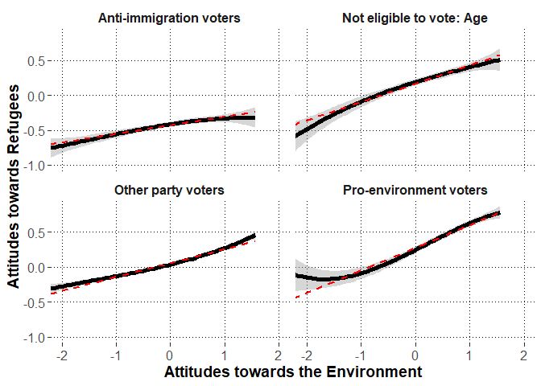

# Preparations


## Load packages


```r
library(lme4)
library(lmerTest)
library(dplyr)
library(psych)
library(emmeans)
library(ggplot2)
library(metafor)
library(merTools)
```

## Session information about the packages


```r
sessionInfo()
```

```
## R version 3.6.3 (2020-02-29)
## Platform: x86_64-w64-mingw32/x64 (64-bit)
## Running under: Windows 10 x64 (build 18362)
## 
## Matrix products: default
## 
## locale:
## [1] LC_COLLATE=Finnish_Finland.1252  LC_CTYPE=Finnish_Finland.1252   
## [3] LC_MONETARY=Finnish_Finland.1252 LC_NUMERIC=C                    
## [5] LC_TIME=Finnish_Finland.1252    
## 
## attached base packages:
## [1] stats     graphics  grDevices utils     datasets  methods   base     
## 
## other attached packages:
##  [1] merTools_0.5.0  arm_1.10-1      MASS_7.3-51.5   metafor_2.4-0  
##  [5] ggplot2_3.3.0   emmeans_1.4.5   psych_1.9.12.31 dplyr_0.8.5    
##  [9] lmerTest_3.1-2  lme4_1.1-23     Matrix_1.2-18  
## 
## loaded via a namespace (and not attached):
##  [1] Rcpp_1.0.4.6        mvtnorm_1.1-0       lattice_0.20-38    
##  [4] tidyr_1.0.2         zoo_1.8-7           foreach_1.5.0      
##  [7] assertthat_0.2.1    digest_0.6.25       mime_0.9           
## [10] R6_2.4.1            backports_1.1.6     evaluate_0.14      
## [13] coda_0.19-3         pillar_1.4.3        rlang_0.4.5        
## [16] multcomp_1.4-13     minqa_1.2.4         nloptr_1.2.2.1     
## [19] rmarkdown_2.1       splines_3.6.3       statmod_1.4.34     
## [22] stringr_1.4.0       munsell_0.5.0       shiny_1.4.0.2      
## [25] broom_0.5.5         httpuv_1.5.2        compiler_3.6.3     
## [28] numDeriv_2016.8-1.1 xfun_0.13           pkgconfig_2.0.3    
## [31] mnormt_1.5-6        htmltools_0.4.0     tidyselect_1.0.0   
## [34] tibble_3.0.0        codetools_0.2-16    fansi_0.4.1        
## [37] later_1.0.0         crayon_1.3.4        withr_2.1.2        
## [40] grid_3.6.3          nlme_3.1-144        xtable_1.8-4       
## [43] gtable_0.3.0        lifecycle_0.2.0     magrittr_1.5       
## [46] scales_1.1.0        estimability_1.3    cli_2.0.2          
## [49] stringi_1.4.6       promises_1.1.0      generics_0.0.2     
## [52] ellipsis_0.3.0      vctrs_0.2.4         boot_1.3-24        
## [55] sandwich_2.5-1      blme_1.0-4          TH.data_1.0-10     
## [58] iterators_1.0.12    tools_3.6.3         glue_1.4.0         
## [61] purrr_0.3.3         fastmap_1.0.1       abind_1.4-5        
## [64] parallel_3.6.3      survival_3.1-8      yaml_2.2.0         
## [67] colorspace_1.4-1    knitr_1.28
```

\newpage

## Custom functions


```r
#to extract fixed effects
getFE<-function(model){
  coefs<-data.frame(summary(model)$coefficients)
  coefs$lower<-coefs[,1]-qt(p=.975,df=coefs[,"df"])*coefs[,2]
  coefs$upper<-coefs[,1]+qt(p=.975,df=coefs[,"df"])*coefs[,2]
  coefs<-cbind.data.frame(round(coefs[,1:4],2),
                          p=round(coefs[,5],3),
                          LL=round(coefs$lower,2),
                          UL=round(coefs$upper,2))
  #row.names(coefs)<-substr(row.names(coefs),1,25)
  return(coefs)
}


#to extract random effects
getVC<-function(model){
  VC<-as.data.frame(VarCorr(model))
  VC<-cbind(VC[,c(1:3)],est_SD=VC[,5],est_SD2=VC[,4])
  return(VC)
}


#to extract model deviance
getDEV<-function(model){
  DEV<-unname(summary(model)$devcomp$cmp["dev"])
  return(DEV)
}


#partial correlation test
pcor.test <- function(x,y,z,use="mat",method="p",na.rm=T){


	x <- c(x)
	y <- c(y)
	z <- as.data.frame(z)

	if(use == "mat"){
		p.use <- "Var-Cov matrix"
		pcor = pcor.mat(x,y,z,method=method,na.rm=na.rm)
	}else if(use == "rec"){
		p.use <- "Recursive formula"
		pcor = pcor.rec(x,y,z,method=method,na.rm=na.rm)
	}else{
		stop("\'use\' should be either \"rec\" or \"mat\"!\n")
	}

	# print the method
	if(gregexpr("p",method)[[1]][1] == 1){
		p.method <- "Pearson"
	}else if(gregexpr("s",method)[[1]][1] == 1){
		p.method <- "Spearman"
	}else if(gregexpr("k",method)[[1]][1] == 1){
		p.method <- "Kendall"
	}else{
		stop("\'method\' should be \"pearson\" or \"spearman\" or \"kendall\"!\n")
	}

	# sample number
	n <- dim(na.omit(data.frame(x,y,z)))[1]
	
	# given variables' number
	gn <- dim(z)[2]

	# p-value
	if(p.method == "Kendall"){
		statistic <- pcor/sqrt(2*(2*(n-gn)+5)/(9*(n-gn)*(n-1-gn)))
		p.value <- 2*pnorm(-abs(statistic))

	}else{
		statistic <- pcor*sqrt((n-2-gn)/(1-pcor^2))
  		p.value <- 2*pnorm(-abs(statistic))
	}

	data.frame(estimate=pcor,p.value=p.value,statistic=statistic,n=n,gn=gn,Method=p.method,Use=p.use)
}			


# By using var-cov matrix
pcor.mat <- function(x,y,z,method="p",na.rm=T){

	x <- c(x)
	y <- c(y)
	z <- as.data.frame(z)

	if(dim(z)[2] == 0){
		stop("There should be given data\n")
	}

	data <- data.frame(x,y,z)

	if(na.rm == T){
		data = na.omit(data)
	}

	xdata <- na.omit(data.frame(data[,c(1,2)]))
	Sxx <- cov(xdata,xdata,m=method)

	xzdata <- na.omit(data)
	xdata <- data.frame(xzdata[,c(1,2)])
	zdata <- data.frame(xzdata[,-c(1,2)])
	Sxz <- cov(xdata,zdata,m=method)

	zdata <- na.omit(data.frame(data[,-c(1,2)]))
	Szz <- cov(zdata,zdata,m=method)

	# is Szz positive definite?
	zz.ev <- eigen(Szz)$values
	if(min(zz.ev)[1]<0){
		stop("\'Szz\' is not positive definite!\n")
	}

	# partial correlation
	Sxx.z <- Sxx - Sxz %*% solve(Szz) %*% t(Sxz)
	
	rxx.z <- cov2cor(Sxx.z)[1,2]

	rxx.z
}

# By using recursive formula
pcor.rec <- function(x,y,z,method="p",na.rm=T){
	# 

	x <- c(x)
	y <- c(y)
	z <- as.data.frame(z)

	if(dim(z)[2] == 0){
		stop("There should be given data\n")
	}

	data <- data.frame(x,y,z)

	if(na.rm == T){
		data = na.omit(data)
	}

	# recursive formula
	if(dim(z)[2] == 1){
		tdata <- na.omit(data.frame(data[,1],data[,2]))
		rxy <- cor(tdata[,1],tdata[,2],m=method)

		tdata <- na.omit(data.frame(data[,1],data[,-c(1,2)]))
		rxz <- cor(tdata[,1],tdata[,2],m=method)

		tdata <- na.omit(data.frame(data[,2],data[,-c(1,2)]))
		ryz <- cor(tdata[,1],tdata[,2],m=method)

		rxy.z <- (rxy - rxz*ryz)/( sqrt(1-rxz^2)*sqrt(1-ryz^2) )
		
		return(rxy.z)
	}else{
		x <- c(data[,1])
		y <- c(data[,2])
		z0 <- c(data[,3])
		zc <- as.data.frame(data[,-c(1,2,3)])

		rxy.zc <- pcor.rec(x,y,zc,method=method,na.rm=na.rm)
		rxz0.zc <- pcor.rec(x,z0,zc,method=method,na.rm=na.rm)
		ryz0.zc <- pcor.rec(y,z0,zc,method=method,na.rm=na.rm)
		
		rxy.z <- (rxy.zc - rxz0.zc*ryz0.zc)/( sqrt(1-rxz0.zc^2)*sqrt(1-ryz0.zc^2) )
		return(rxy.z)
	}			
}	
```

\newpage

## Load data


```r
dat<-read.csv2("dat.no.miss.csv",stringsAsFactors = F)
```

### Variable transformations

#### Country


```r
table(dat$cntry)
```

```
## 
##   AT   BE   CH   CZ   DE   EE   ES   FI   FR   GB   HU   IE   IT   LT   NL   NO 
## 1973 1753 1503 2156 2819 1974 1817 1862 2015 1876 1391 2676 2317 1927 1661 1538 
##   PL   PT   SE   SI 
## 1589 1228 1525 1276
```

#### Voting group


```r
#make voting group variable names unique to each country
dat$voting.group<-paste0(dat$cntry,": ",dat$vote.group.combined)
```

#### Centering Attitudes towards the Environment


```r
#calculate the sum score
dat$environ<-rowMeans(data.frame(dat$inctxff.R,
                                 dat$sbsrnen.R,
                                 dat$banhhap.R),na.rm=T)
                                 
describe(dat$environ,fast=T)
```

```
##    vars     n mean   sd min max range se
## X1    1 36876 3.44 0.83   1   5     4  0
```

```r
#grand mean center
dat$environ.gmc<-dat$environ-mean(dat$environ,na.rm=T)

#obtain dataframe with country means and add to data

environ.cntry<-dat %>%
  group_by(cntry) %>%
  summarize(environ.cntry=mean(environ.gmc,na.rm=T))

dat<-left_join(x=dat,
               y=environ.cntry,
               by=c("cntry"))

#center individuals around country means

dat$environ.cntrymc<-dat$environ.gmc-dat$environ.cntry

#obtain dataframe with voting group means and add to data

environ.voting.group<-dat %>%
  group_by(voting.group) %>%
  summarize(environ.voting.group=mean(environ.cntrymc,na.rm=T))

dat<-left_join(x=dat,
               y=environ.voting.group,
               by=c("voting.group"))

#center individuals around voting group means

dat$environ.vgmc<-dat$environ.cntrymc-dat$environ.voting.group

#describe the variable

describe(dat$environ.vgmc,fast=T)
```

```
##    vars     n mean   sd   min  max range se
## X1    1 36876    0 0.79 -3.06 2.11  5.17  0
```

```r
#rename as lvl1, lvl2, and lvl3

dat$environ.lvl1<-dat$environ.vgmc
dat$environ.lvl2<-dat$environ.voting.group
dat$environ.lvl3<-dat$environ.cntry
```

\newpage

#### Centering Political Engagement


```r
#correlation between the variables

corr.test(dat$nwspol.4,dat$polintr.R,adjust="none")
```

```
## Call:corr.test(x = dat$nwspol.4, y = dat$polintr.R, adjust = "none")
## Correlation matrix 
## [1] 0.32
## Sample Size 
## [1] 36545
## [1] 0
## 
##  To see confidence intervals of the correlations, print with the short=FALSE option
```

```r
#rename the variable

dat$engagement<-dat$polint.agg

#descriptive statistics
psych::describe(dat$engagement,fast=T)
```

```
##    vars     n mean  sd min max range se
## X1    1 36876 2.49 0.8   1   4     3  0
```

```r
#grand mean center
dat$engagement.gmc<-dat$engagement-mean(dat$engagement,na.rm=T)

#obtain dataframe with country means and add to data

engagement.cntry<-dat %>%
  group_by(cntry) %>%
  summarize(engagement.cntry=mean(engagement.gmc,na.rm=T))

dat<-left_join(x=dat,
               y=engagement.cntry,
               by=c("cntry"))

#center individuals around country means

dat$engagement.cntrymc<-dat$engagement.gmc-dat$engagement.cntry

#obtain dataframe with voting group means and add to data

engagement.voting.group<-dat %>%
  group_by(voting.group) %>%
  summarize(engagement.voting.group=mean(engagement.cntrymc,na.rm=T))

dat<-left_join(x=dat,
               y=engagement.voting.group,
               by=c("voting.group"))

#center individuals around voting group means

dat$engagement.vgmc<-dat$engagement.cntrymc-dat$engagement.voting.group

#describe the centered variable

describe(dat$engagement.vgmc,fast=T)
```

```
##    vars     n mean   sd   min  max range se
## X1    1 36876    0 0.74 -2.06 2.63  4.69  0
```

```r
#rename as lvl1, lvl2, and lvl3

dat$engagement.lvl1<-dat$engagement.vgmc
dat$engagement.lvl2<-dat$engagement.voting.group
dat$engagement.lvl3<-dat$engagement.cntry
```

\newpage

#### Centering Political Interest Item (for exploratory analysis)


```r
#rename the variable (this will replace the previous item with same name)
dat$polintr<-dat$polintr.R

#descriptive statistics
psych::describe(dat$polintr,fast=T)
```

```
##    vars     n mean   sd min max range se
## X1    1 36831 2.42 0.91   1   4     3  0
```

```r
#grand mean center
dat$polintr.gmc<-dat$polintr-mean(dat$polintr,na.rm=T)

#obtain dataframe with country means and add to data

polintr.cntry<-dat %>%
  group_by(cntry) %>%
  summarize(polintr.cntry=mean(polintr.gmc,na.rm=T))

dat<-left_join(x=dat,
               y=polintr.cntry,
               by=c("cntry"))

#center individuals around country means

dat$polintr.cntrymc<-dat$polintr.gmc-dat$polintr.cntry

#obtain dataframe with voting group means and add to data

polintr.voting.group<-dat %>%
  group_by(voting.group) %>%
  summarize(polintr.voting.group=mean(polintr.cntrymc,na.rm=T))

dat<-left_join(x=dat,
               y=polintr.voting.group,
               by=c("voting.group"))

#center individuals around voting group means

dat$polintr.vgmc<-dat$polintr.cntrymc-dat$polintr.voting.group

#describe the centered variable

describe(dat$polintr.vgmc,fast=T)
```

```
##    vars     n mean   sd   min  max range se
## X1    1 36831    0 0.81 -2.19 2.65  4.85  0
```

```r
#rename as lvl1, lvl2, and lvl3

dat$polintr.lvl1<-dat$polintr.vgmc
dat$polintr.lvl2<-dat$polintr.voting.group
dat$polintr.lvl3<-dat$polintr.cntry
```


\newpage

#### Centering "Time used for consuming political media" (for exploratory analysis)


```r
#rename the variable
dat$polnews<-dat$nwspol.4

#descriptive statistics
psych::describe(dat$polnews,fast=T)
```

```
##    vars     n mean   sd min max range   se
## X1    1 36590 2.57 1.05   1   4     3 0.01
```

```r
#grand mean center
dat$polnews.gmc<-dat$polnews-mean(dat$polnews,na.rm=T)

#obtain dataframe with country means and add to data

polnews.cntry<-dat %>%
  group_by(cntry) %>%
  summarize(polnews.cntry=mean(polnews.gmc,na.rm=T))

dat<-left_join(x=dat,
               y=polnews.cntry,
               by=c("cntry"))

#center individuals around country means

dat$polnews.cntrymc<-dat$polnews.gmc-dat$polnews.cntry

#obtain dataframe with voting group means and add to data

polnews.voting.group<-dat %>%
  group_by(voting.group) %>%
  summarize(polnews.voting.group=mean(polnews.cntrymc,na.rm=T))

dat<-left_join(x=dat,
               y=polnews.voting.group,
               by=c("voting.group"))

#center individuals around voting group means

dat$polnews.vgmc<-dat$polnews.cntrymc-dat$polnews.voting.group

#describe the centered variable

describe(dat$polnews.vgmc,fast=T)
```

```
##    vars     n mean sd   min max range   se
## X1    1 36590    0  1 -2.19 2.6  4.79 0.01
```

```r
#rename as lvl1, lvl2, and lvl3

dat$polnews.lvl1<-dat$polnews.vgmc
dat$polnews.lvl2<-dat$polnews.voting.group
dat$polnews.lvl3<-dat$polnews.cntry
```

\newpage

#### Rename and grand mean center the Attitudes towards refugees (pro-refugee attitudes indicate high scores)


```r
#calculate the sum score
dat$refugees<-rowMeans(data.frame(dat$gvrfgap.R,
                                 dat$rfgfrpc,
                                 dat$rfgbfml.R),na.rm=T)
                                 
describe(dat$refugees,fast=T)
```

```
##    vars     n mean   sd min max range se
## X1    1 36876 3.02 0.88   1   5     4  0
```

```r
#grand mean center
dat$refugees<-dat$refugees-mean(dat$refugees,na.rm=T)

#rename
dat$refugees.gmc<-dat$refugees

#obtain dataframe with country means and add to data

refugees.cntry<-dat %>%
  group_by(cntry) %>%
  summarize(refugees.cntry=mean(refugees.gmc,na.rm=T))

dat<-left_join(x=dat,
               y=refugees.cntry,
               by=c("cntry"))

#center individuals around country means

dat$refugees.cntrymc<-dat$refugees.gmc-dat$refugees.cntry

#obtain dataframe with voting group means and add to data

refugees.voting.group<-dat %>%
  group_by(voting.group) %>%
  summarize(refugees.voting.group=mean(refugees.cntrymc,na.rm=T))

dat<-left_join(x=dat,
               y=refugees.voting.group,
               by=c("voting.group"))

#center individuals around voting group means

dat$refugees.vgmc<-dat$refugees.cntrymc-dat$refugees.voting.group

#describe the variable

describe(dat$refugees.vgmc,fast=T)
```

```
##    vars     n mean   sd   min  max range se
## X1    1 36876    0 0.77 -2.92 3.15  6.07  0
```

```r
#rename as lvl1, lvl2, and lvl3

dat$refugees.lvl1<-dat$refugees.vgmc
dat$refugees.lvl2<-dat$refugees.voting.group
dat$refugees.lvl3<-dat$refugees.cntry
```

\newpage

#### Rename and Center the covariates aroung grand mean or logical middle points if applicable


```r
#grand-mean center age
dat$age<-dat$agea-mean(dat$agea,na.rm=T)
#sex around zero
dat$gender<-dat$gndr-1.5 #-0.5 males, 0.5 females
#rename occupation variable
dat$occup<-dat$isco.13
#grand-mean center education years
dat$educ<-dat$eduyrs-mean(dat$eduyrs,na.rm=T)
#residence around zero
dat$resid<-dat$rural-0.5 #-0.5 urban, 0.5 rural
```

\newpage

#### Voting group dummy-coded variables


```r
#recode if the party voted is =1, or not =0 anti-immigration
dat$anti.imm.party.dummy<-ifelse(is.na(dat$anti.imm.party.rule2),0,1)
#recode if the party voted is =1, or not =0 pro-environment
dat$pro.env.party.dummy<-ifelse(is.na(dat$pro.env.party.manual),0,1)

#dat$other.party.dummy<-ifelse(grepl("Other",dat$vote.group.combined),1,0)

#dummy-code not voting
dat$did.not.vote.dummy<-ifelse(grepl("did not vote",dat$vote.group.combined),1,0)
table(dat$did.not.vote.dummy)
```

```
## 
##     0     1 
## 29063  7813
```

```r
#dummy-code "don't know"
dat$dont.know.dummy<-ifelse(grepl("Don't know",dat$vote.group.combined),1,0)
table(dat$dont.know.dummy)
```

```
## 
##     0     1 
## 35670  1206
```

```r
#dummy-code invalid vote
dat$invalid.vote.dummy<-ifelse(grepl("Invalid vote",dat$vote.group.combined),1,0)
table(dat$invalid.vote.dummy)
```

```
## 
##     0     1 
## 36861    15
```

```r
#dummy-code "no answer"
dat$no.answer.dummy<-ifelse(grepl("No answer",dat$vote.group.combined),1,0)
table(dat$no.answer.dummy)
```

```
## 
##     0     1 
## 36864    12
```

```r
#dummy-code not-eligible: age
dat$not.eligible.age.dummy<-ifelse(grepl("not eligible: age",dat$vote.group.combined),1,0)
table(dat$not.eligible.age.dummy)
```

```
## 
##     0     1 
## 35063  1813
```

```r
#dummy code not-eligible: citizenship
dat$not.eligible.citizenship.dummy<-ifelse(grepl("not eligible: citizenship",dat$vote.group.combined),1,0)
table(dat$not.eligible.citizenship.dummy)
```

```
## 
##     0     1 
## 35663  1213
```

```r
#dummy-code not-eligible: other reasons
dat$not.eligible.other.dummy<-ifelse(grepl("not eligible: other",dat$vote.group.combined),1,0)
table(dat$not.eligible.other.dummy)
```

```
## 
##     0     1 
## 36611   265
```

```r
#add dummy-variable for other_party voting

dat<- dat %>%
  mutate(other.party.dummy:=case_when(
    anti.imm.party.dummy==1 |
      pro.env.party.dummy==1 |
      did.not.vote.dummy==1 |
      dont.know.dummy==1 |
      invalid.vote.dummy==1 |
      no.answer.dummy==1 |
      not.eligible.age.dummy==1 |
      not.eligible.citizenship.dummy==1 |
      not.eligible.other.dummy==1 ~0,
    TRUE~1
  ))

table(dat$other.party.dummy)
```

```
## 
##     0     1 
## 18517 18359
```

```r
#recode the names for a new multi-category variable: all.parties.lvl2

dat<-dat %>%
  mutate(all.parties.lvl2:=case_when(
    did.not.vote.dummy==1~"Did not vote",
    dont.know.dummy==1~"Don't know",
    no.answer.dummy==1~"No answer",
    invalid.vote.dummy==1~"Invalid vote",
    not.eligible.age.dummy==1~"NE age",
    not.eligible.citizenship.dummy==1~"NE citizen",
    not.eligible.other.dummy==1~"NE other",
    other.party.dummy==1~"Other party",
    anti.imm.party.dummy==1~"Anti-immigration party",
    pro.env.party.dummy==1~"Pro-environment party",
  ),
  party:=case_when(
    other.party.dummy==1~"Other party",
    anti.imm.party.dummy==1~"Anti-immigration party",
    pro.env.party.dummy==1~"Pro-environment party",
    TRUE~NA_character_
  ))
```


#### Omit missing variables


```r
#missing values per each row
dat$analysis.miss<-
  is.na(dat$cntry)+
  is.na(dat$voting.group)+
  is.na(dat$refugees)+
  is.na(dat$environ)+
  is.na(dat$vote.group.combined)+
  is.na(dat$age)+
  is.na(dat$gender)+
  is.na(dat$occup)+
  is.na(dat$educ)+
  is.na(dat$resid)+
  is.na(dat$engagement)
table(dat$analysis.miss)
```

```
## 
##     0 
## 36876
```

```r
#include only those without any missing values
dat<-dat %>%
  filter(analysis.miss ==0)
```

# Exploratory analysis: Is the association linear?

## Data re-preparations


```r
##Remove two of the smallest voting groups

Rdat<-dat %>%
  filter(all.parties.lvl2!="Invalid vote" & all.parties.lvl2!="No answer")
```

## Model 1 (H1 selected model without random effect correlations)


```r
EX9RR.NCmod1<-lmer(refugees~
                     (environ.lvl1||voting.group)+
                     (environ.lvl1||cntry)+
                     age+gender+educ+resid+occup+
                     environ.lvl1,data=Rdat,REML=F,
                   control=lmerControl(optimizer="bobyqa",optCtrl=list(maxfun=2e8)))

isSingular(EX9RR.NCmod1)
```

```
## [1] FALSE
```

```r
(VC.EX9RR.NCmod1<-getVC(EX9RR.NCmod1))
```

```
##              grp         var1 var2     est_SD     est_SD2
## 1   voting.group  (Intercept) <NA> 0.25667066 0.065879825
## 2 voting.group.1 environ.lvl1 <NA> 0.06020580 0.003624738
## 3          cntry  (Intercept) <NA> 0.35903261 0.128904415
## 4        cntry.1 environ.lvl1 <NA> 0.05957269 0.003548905
## 5       Residual         <NA> <NA> 0.75425590 0.568901956
```

```r
getFE(EX9RR.NCmod1)
```

```
##                                                         Estimate Std..Error
## (Intercept)                                                 0.02       0.10
## age                                                         0.00       0.00
## gender                                                      0.06       0.01
## educ                                                        0.02       0.00
## resid                                                      -0.05       0.01
## occupClerical support workers                              -0.01       0.06
## occupCraft and related trades workers                      -0.05       0.06
## occupElementary occupations                                 0.02       0.06
## occupManagers                                               0.04       0.06
## occupOther: Not in paid work                                0.13       0.07
## occupPlant and machine operators, and assemblers           -0.02       0.06
## occupProfessionals                                          0.11       0.06
## occupRetired                                                0.03       0.07
## occupService and sales workers                             -0.01       0.06
## occupSkilled agricultural, forestry and fishery workers    -0.03       0.07
## occupTechnicians and associate professionals                0.02       0.06
## occupUnemployed                                            -0.08       0.08
## environ.lvl1                                                0.15       0.02
##                                                               df t.value     p
## (Intercept)                                                49.48    0.18 0.859
## age                                                     35981.17   -3.24 0.001
## gender                                                  36651.95    7.32 0.000
## educ                                                    36838.56   13.23 0.000
## resid                                                   36704.86   -5.83 0.000
## occupClerical support workers                           36576.60   -0.21 0.833
## occupCraft and related trades workers                   36590.24   -0.78 0.438
## occupElementary occupations                             36588.25    0.35 0.726
## occupManagers                                           36582.76    0.70 0.484
## occupOther: Not in paid work                            36725.34    2.00 0.046
## occupPlant and machine operators, and assemblers        36588.59   -0.31 0.754
## occupProfessionals                                      36586.71    1.70 0.090
## occupRetired                                            36588.57    0.46 0.644
## occupService and sales workers                          36583.25   -0.23 0.818
## occupSkilled agricultural, forestry and fishery workers 36592.61   -0.39 0.698
## occupTechnicians and associate professionals            36578.15    0.28 0.780
## occupUnemployed                                         36589.65   -1.06 0.291
## environ.lvl1                                               19.96    9.97 0.000
##                                                            LL    UL
## (Intercept)                                             -0.19  0.23
## age                                                      0.00  0.00
## gender                                                   0.05  0.08
## educ                                                     0.02  0.02
## resid                                                   -0.07 -0.03
## occupClerical support workers                           -0.14  0.11
## occupCraft and related trades workers                   -0.17  0.08
## occupElementary occupations                             -0.10  0.15
## occupManagers                                           -0.08  0.17
## occupOther: Not in paid work                             0.00  0.26
## occupPlant and machine operators, and assemblers        -0.15  0.11
## occupProfessionals                                      -0.02  0.23
## occupRetired                                            -0.11  0.17
## occupService and sales workers                          -0.14  0.11
## occupSkilled agricultural, forestry and fishery workers -0.16  0.11
## occupTechnicians and associate professionals            -0.11  0.14
## occupUnemployed                                         -0.23  0.07
## environ.lvl1                                             0.12  0.18
```

\newpage

## Model 2 (add squared fixed effect)


```r
EX9RR.NCmod2<-lmer(refugees~(environ.lvl1||voting.group)+
                     (environ.lvl1||cntry)+
                     age+gender+educ+resid+occup+
                     environ.lvl1+
                     I(environ.lvl1^2),data=Rdat,REML=F,
                   control=lmerControl(optimizer="bobyqa",
                                       optCtrl=list(maxfun=2e8)))


anova(EX9RR.NCmod1,EX9RR.NCmod2)
```

```
## Data: Rdat
## Models:
## EX9RR.NCmod1: refugees ~ (environ.lvl1 || voting.group) + (environ.lvl1 || 
## EX9RR.NCmod1:     cntry) + age + gender + educ + resid + occup + environ.lvl1
## EX9RR.NCmod2: refugees ~ (environ.lvl1 || voting.group) + (environ.lvl1 || 
## EX9RR.NCmod2:     cntry) + age + gender + educ + resid + occup + environ.lvl1 + 
## EX9RR.NCmod2:     I(environ.lvl1^2)
##              npar   AIC   BIC logLik deviance  Chisq Df Pr(>Chisq)
## EX9RR.NCmod1   23 84700 84896 -42327    84654                     
## EX9RR.NCmod2   24 84701 84906 -42327    84653 0.6599  1     0.4166
```

```r
isSingular(EX9RR.NCmod2)
```

```
## [1] FALSE
```

```r
(VC.EX9RR.NCmod2<-getVC(EX9RR.NCmod2))
```

```
##              grp         var1 var2     est_SD     est_SD2
## 1   voting.group  (Intercept) <NA> 0.25653424 0.065809816
## 2 voting.group.1 environ.lvl1 <NA> 0.06016884 0.003620290
## 3          cntry  (Intercept) <NA> 0.35897689 0.128864409
## 4        cntry.1 environ.lvl1 <NA> 0.05954582 0.003545705
## 5       Residual         <NA> <NA> 0.75425275 0.568897216
```

```r
getFE(EX9RR.NCmod2)
```

```
##                                                         Estimate Std..Error
## (Intercept)                                                 0.02       0.10
## age                                                         0.00       0.00
## gender                                                      0.06       0.01
## educ                                                        0.02       0.00
## resid                                                      -0.05       0.01
## occupClerical support workers                              -0.01       0.06
## occupCraft and related trades workers                      -0.05       0.06
## occupElementary occupations                                 0.02       0.06
## occupManagers                                               0.05       0.06
## occupOther: Not in paid work                                0.13       0.07
## occupPlant and machine operators, and assemblers           -0.02       0.06
## occupProfessionals                                          0.11       0.06
## occupRetired                                                0.03       0.07
## occupService and sales workers                             -0.01       0.06
## occupSkilled agricultural, forestry and fishery workers    -0.03       0.07
## occupTechnicians and associate professionals                0.02       0.06
## occupUnemployed                                            -0.08       0.08
## environ.lvl1                                                0.15       0.02
## I(environ.lvl1^2)                                           0.00       0.00
##                                                               df t.value     p
## (Intercept)                                                49.54    0.20 0.845
## age                                                     35980.26   -3.23 0.001
## gender                                                  36651.68    7.30 0.000
## educ                                                    36838.69   13.24 0.000
## resid                                                   36704.76   -5.85 0.000
## occupClerical support workers                           36576.85   -0.21 0.836
## occupCraft and related trades workers                   36590.51   -0.77 0.440
## occupElementary occupations                             36588.72    0.36 0.722
## occupManagers                                           36583.23    0.71 0.480
## occupOther: Not in paid work                            36726.03    2.01 0.045
## occupPlant and machine operators, and assemblers        36588.83   -0.31 0.757
## occupProfessionals                                      36587.27    1.70 0.088
## occupRetired                                            36589.27    0.47 0.636
## occupService and sales workers                          36583.56   -0.23 0.822
## occupSkilled agricultural, forestry and fishery workers 36592.86   -0.39 0.700
## occupTechnicians and associate professionals            36578.48    0.28 0.777
## occupUnemployed                                         36589.96   -1.05 0.293
## environ.lvl1                                               20.31    9.86 0.000
## I(environ.lvl1^2)                                       36519.80   -0.81 0.417
##                                                            LL    UL
## (Intercept)                                             -0.19  0.23
## age                                                      0.00  0.00
## gender                                                   0.05  0.08
## educ                                                     0.02  0.02
## resid                                                   -0.07 -0.03
## occupClerical support workers                           -0.14  0.11
## occupCraft and related trades workers                   -0.17  0.08
## occupElementary occupations                             -0.10  0.15
## occupManagers                                           -0.08  0.17
## occupOther: Not in paid work                             0.00  0.26
## occupPlant and machine operators, and assemblers        -0.15  0.11
## occupProfessionals                                      -0.02  0.23
## occupRetired                                            -0.11  0.17
## occupService and sales workers                          -0.14  0.11
## occupSkilled agricultural, forestry and fishery workers -0.16  0.11
## occupTechnicians and associate professionals            -0.11  0.14
## occupUnemployed                                         -0.23  0.07
## environ.lvl1                                             0.12  0.18
## I(environ.lvl1^2)                                       -0.01  0.01
```

\newpage

## Model 3 (add fixed cubic effect)


```r
EX9RR.NCmod3<-lmer(refugees~(environ.lvl1||voting.group)+
                     (environ.lvl1||cntry)+
                     age+gender+educ+resid+occup+
                     environ.lvl1+
            I(environ.lvl1^2)+
              I(environ.lvl1^3),
            data=Rdat,REML=F,
                   control=lmerControl(optimizer="bobyqa",
                                       optCtrl=list(maxfun=2e8)))

isSingular(EX9RR.NCmod3)
```

```
## [1] FALSE
```

```r
#test for cubic term only
anova(EX9RR.NCmod2,EX9RR.NCmod3)
```

```
## Data: Rdat
## Models:
## EX9RR.NCmod2: refugees ~ (environ.lvl1 || voting.group) + (environ.lvl1 || 
## EX9RR.NCmod2:     cntry) + age + gender + educ + resid + occup + environ.lvl1 + 
## EX9RR.NCmod2:     I(environ.lvl1^2)
## EX9RR.NCmod3: refugees ~ (environ.lvl1 || voting.group) + (environ.lvl1 || 
## EX9RR.NCmod3:     cntry) + age + gender + educ + resid + occup + environ.lvl1 + 
## EX9RR.NCmod3:     I(environ.lvl1^2) + I(environ.lvl1^3)
##              npar   AIC   BIC logLik deviance  Chisq Df Pr(>Chisq)
## EX9RR.NCmod2   24 84701 84906 -42327    84653                     
## EX9RR.NCmod3   25 84703 84916 -42327    84653 0.0527  1     0.8185
```

```r
#test for both non-linear terms
anova(EX9RR.NCmod1,EX9RR.NCmod3)
```

```
## Data: Rdat
## Models:
## EX9RR.NCmod1: refugees ~ (environ.lvl1 || voting.group) + (environ.lvl1 || 
## EX9RR.NCmod1:     cntry) + age + gender + educ + resid + occup + environ.lvl1
## EX9RR.NCmod3: refugees ~ (environ.lvl1 || voting.group) + (environ.lvl1 || 
## EX9RR.NCmod3:     cntry) + age + gender + educ + resid + occup + environ.lvl1 + 
## EX9RR.NCmod3:     I(environ.lvl1^2) + I(environ.lvl1^3)
##              npar   AIC   BIC logLik deviance  Chisq Df Pr(>Chisq)
## EX9RR.NCmod1   23 84700 84896 -42327    84654                     
## EX9RR.NCmod3   25 84703 84916 -42327    84653 0.7126  2     0.7003
```

```r
(VC.EX9RR.NCmod3<-getVC(EX9RR.NCmod3))
```

```
##              grp         var1 var2     est_SD     est_SD2
## 1   voting.group  (Intercept) <NA> 0.25650822 0.065796466
## 2 voting.group.1 environ.lvl1 <NA> 0.06014022 0.003616846
## 3          cntry  (Intercept) <NA> 0.35896484 0.128855757
## 4        cntry.1 environ.lvl1 <NA> 0.05944337 0.003533515
## 5       Residual         <NA> <NA> 0.75425396 0.568899032
```

```r
getFE(EX9RR.NCmod3)
```

```
##                                                         Estimate Std..Error
## (Intercept)                                                 0.02       0.10
## age                                                         0.00       0.00
## gender                                                      0.06       0.01
## educ                                                        0.02       0.00
## resid                                                      -0.05       0.01
## occupClerical support workers                              -0.01       0.06
## occupCraft and related trades workers                      -0.05       0.06
## occupElementary occupations                                 0.02       0.06
## occupManagers                                               0.05       0.06
## occupOther: Not in paid work                                0.13       0.07
## occupPlant and machine operators, and assemblers           -0.02       0.06
## occupProfessionals                                          0.11       0.06
## occupRetired                                                0.03       0.07
## occupService and sales workers                             -0.01       0.06
## occupSkilled agricultural, forestry and fishery workers    -0.03       0.07
## occupTechnicians and associate professionals                0.02       0.06
## occupUnemployed                                            -0.08       0.08
## environ.lvl1                                                0.15       0.02
## I(environ.lvl1^2)                                           0.00       0.01
## I(environ.lvl1^3)                                           0.00       0.00
##                                                               df t.value     p
## (Intercept)                                                49.56    0.20 0.843
## age                                                     35980.04   -3.23 0.001
## gender                                                  36651.77    7.30 0.000
## educ                                                    36838.69   13.24 0.000
## resid                                                   36704.80   -5.85 0.000
## occupClerical support workers                           36576.71   -0.21 0.836
## occupCraft and related trades workers                   36590.42   -0.77 0.441
## occupElementary occupations                             36588.66    0.36 0.721
## occupManagers                                           36583.13    0.71 0.479
## occupOther: Not in paid work                            36726.01    2.01 0.045
## occupPlant and machine operators, and assemblers        36588.74   -0.31 0.757
## occupProfessionals                                      36587.19    1.70 0.088
## occupRetired                                            36589.17    0.47 0.636
## occupService and sales workers                          36583.44   -0.22 0.822
## occupSkilled agricultural, forestry and fishery workers 36592.81   -0.39 0.700
## occupTechnicians and associate professionals            36578.39    0.28 0.777
## occupUnemployed                                         36589.90   -1.05 0.293
## environ.lvl1                                               28.38    9.17 0.000
## I(environ.lvl1^2)                                       36511.60   -0.80 0.423
## I(environ.lvl1^3)                                       34075.62   -0.23 0.818
##                                                            LL    UL
## (Intercept)                                             -0.19  0.23
## age                                                      0.00  0.00
## gender                                                   0.05  0.08
## educ                                                     0.02  0.02
## resid                                                   -0.07 -0.03
## occupClerical support workers                           -0.14  0.11
## occupCraft and related trades workers                   -0.17  0.08
## occupElementary occupations                             -0.10  0.15
## occupManagers                                           -0.08  0.17
## occupOther: Not in paid work                             0.00  0.26
## occupPlant and machine operators, and assemblers        -0.15  0.11
## occupProfessionals                                      -0.02  0.23
## occupRetired                                            -0.11  0.17
## occupService and sales workers                          -0.14  0.11
## occupSkilled agricultural, forestry and fishery workers -0.16  0.11
## occupTechnicians and associate professionals            -0.11  0.14
## occupUnemployed                                         -0.23  0.07
## environ.lvl1                                             0.12  0.18
## I(environ.lvl1^2)                                       -0.01  0.01
## I(environ.lvl1^3)                                       -0.01  0.01
```

## Model 4 (add random effects for non-linear terms by country)


```r
EX9RR.NCmod4<-lmer(refugees~(environ.lvl1||voting.group)+
                (environ.lvl1+
                   I(environ.lvl1^2)+
                   I(environ.lvl1^3)||cntry)+
                     age+gender+educ+resid+occup+
                     environ.lvl1+
                  I(environ.lvl1^2)+
                  I(environ.lvl1^3),
                data=Rdat,REML=F,
                   control=lmerControl(optimizer="bobyqa",
                                       optCtrl=list(maxfun=2e8)))

isSingular(EX9RR.NCmod4)
```

```
## [1] FALSE
```

```r
anova(EX9RR.NCmod3,EX9RR.NCmod4)
```

```
## Data: Rdat
## Models:
## EX9RR.NCmod3: refugees ~ (environ.lvl1 || voting.group) + (environ.lvl1 || 
## EX9RR.NCmod3:     cntry) + age + gender + educ + resid + occup + environ.lvl1 + 
## EX9RR.NCmod3:     I(environ.lvl1^2) + I(environ.lvl1^3)
## EX9RR.NCmod4: refugees ~ (environ.lvl1 || voting.group) + (environ.lvl1 + I(environ.lvl1^2) + 
## EX9RR.NCmod4:     I(environ.lvl1^3) || cntry) + age + gender + educ + resid + 
## EX9RR.NCmod4:     occup + environ.lvl1 + I(environ.lvl1^2) + I(environ.lvl1^3)
##              npar   AIC   BIC logLik deviance  Chisq Df Pr(>Chisq)   
## EX9RR.NCmod3   25 84703 84916 -42327    84653                        
## EX9RR.NCmod4   27 84697 84927 -42322    84643 9.6972  2    0.00784 **
## ---
## Signif. codes:  0 '***' 0.001 '**' 0.01 '*' 0.05 '.' 0.1 ' ' 1
```

```r
(VC.EX9RR.NCmod4<-getVC(EX9RR.NCmod4))
```

```
##              grp              var1 var2     est_SD      est_SD2
## 1   voting.group       (Intercept) <NA> 0.25668798 0.0658887214
## 2 voting.group.1      environ.lvl1 <NA> 0.06028433 0.0036342000
## 3          cntry       (Intercept) <NA> 0.35576174 0.1265664134
## 4        cntry.1      environ.lvl1 <NA> 0.06373713 0.0040624214
## 5        cntry.2 I(environ.lvl1^2) <NA> 0.01334036 0.0001779652
## 6        cntry.3 I(environ.lvl1^3) <NA> 0.01458571 0.0002127429
## 7       Residual              <NA> <NA> 0.75389911 0.5683638741
```

```r
getFE(EX9RR.NCmod4)
```

```
##                                                         Estimate Std..Error
## (Intercept)                                                 0.02       0.10
## age                                                         0.00       0.00
## gender                                                      0.06       0.01
## educ                                                        0.02       0.00
## resid                                                      -0.05       0.01
## occupClerical support workers                              -0.01       0.06
## occupCraft and related trades workers                      -0.05       0.06
## occupElementary occupations                                 0.02       0.06
## occupManagers                                               0.05       0.06
## occupOther: Not in paid work                                0.13       0.07
## occupPlant and machine operators, and assemblers           -0.02       0.06
## occupProfessionals                                          0.11       0.06
## occupRetired                                                0.03       0.07
## occupService and sales workers                             -0.01       0.06
## occupSkilled agricultural, forestry and fishery workers    -0.02       0.07
## occupTechnicians and associate professionals                0.02       0.06
## occupUnemployed                                            -0.08       0.08
## environ.lvl1                                                0.15       0.02
## I(environ.lvl1^2)                                           0.00       0.01
## I(environ.lvl1^3)                                           0.00       0.01
##                                                               df t.value     p
## (Intercept)                                                50.05    0.19 0.850
## age                                                     35976.19   -3.21 0.001
## gender                                                  36638.82    7.25 0.000
## educ                                                    36824.10   13.25 0.000
## resid                                                   36706.29   -5.84 0.000
## occupClerical support workers                           36552.80   -0.19 0.846
## occupCraft and related trades workers                   36566.77   -0.76 0.448
## occupElementary occupations                             36566.48    0.38 0.706
## occupManagers                                           36560.12    0.72 0.473
## occupOther: Not in paid work                            36704.39    2.03 0.042
## occupPlant and machine operators, and assemblers        36566.69   -0.30 0.766
## occupProfessionals                                      36563.05    1.72 0.086
## occupRetired                                            36577.87    0.48 0.629
## occupService and sales workers                          36558.29   -0.20 0.841
## occupSkilled agricultural, forestry and fishery workers 36575.51   -0.37 0.713
## occupTechnicians and associate professionals            36556.41    0.30 0.766
## occupUnemployed                                         36575.27   -1.00 0.320
## environ.lvl1                                               23.52    8.73 0.000
## I(environ.lvl1^2)                                          27.72   -0.66 0.512
## I(environ.lvl1^3)                                          29.84   -0.14 0.890
##                                                            LL    UL
## (Intercept)                                             -0.19  0.23
## age                                                      0.00  0.00
## gender                                                   0.05  0.08
## educ                                                     0.02  0.02
## resid                                                   -0.07 -0.03
## occupClerical support workers                           -0.14  0.11
## occupCraft and related trades workers                   -0.17  0.08
## occupElementary occupations                             -0.10  0.15
## occupManagers                                           -0.08  0.17
## occupOther: Not in paid work                             0.00  0.26
## occupPlant and machine operators, and assemblers        -0.15  0.11
## occupProfessionals                                      -0.02  0.23
## occupRetired                                            -0.10  0.17
## occupService and sales workers                          -0.14  0.11
## occupSkilled agricultural, forestry and fishery workers -0.16  0.11
## occupTechnicians and associate professionals            -0.11  0.14
## occupUnemployed                                         -0.23  0.07
## environ.lvl1                                             0.12  0.19
## I(environ.lvl1^2)                                       -0.02  0.01
## I(environ.lvl1^3)                                       -0.01  0.01
```
## Model 5 (add random effects for non-linear terms by voting group)


```r
EX9RR.NCmod6<-lmer(refugees~
                     (environ.lvl1+
                        I(environ.lvl1^2)+
                        I(environ.lvl1^3)||voting.group)+
                     (environ.lvl1+
                        I(environ.lvl1^2)+
                        I(environ.lvl1^3)||cntry)+
                     age+gender+educ+resid+occup+
                     environ.lvl1+
                     I(environ.lvl1^2)+
                     I(environ.lvl1^3),data=Rdat,REML=F,
                   control=lmerControl(optimizer="bobyqa",
                                       optCtrl=list(maxfun=2e8)))
```

```
## boundary (singular) fit: see ?isSingular
```

```r
isSingular(EX9RR.NCmod6)
```

```
## [1] TRUE
```

```r
#test against fixed effects only
anova(EX9RR.NCmod3,EX9RR.NCmod6)
```

```
## Data: Rdat
## Models:
## EX9RR.NCmod3: refugees ~ (environ.lvl1 || voting.group) + (environ.lvl1 || 
## EX9RR.NCmod3:     cntry) + age + gender + educ + resid + occup + environ.lvl1 + 
## EX9RR.NCmod3:     I(environ.lvl1^2) + I(environ.lvl1^3)
## EX9RR.NCmod6: refugees ~ (environ.lvl1 + I(environ.lvl1^2) + I(environ.lvl1^3) || 
## EX9RR.NCmod6:     voting.group) + (environ.lvl1 + I(environ.lvl1^2) + I(environ.lvl1^3) || 
## EX9RR.NCmod6:     cntry) + age + gender + educ + resid + occup + environ.lvl1 + 
## EX9RR.NCmod6:     I(environ.lvl1^2) + I(environ.lvl1^3)
##              npar   AIC   BIC logLik deviance  Chisq Df Pr(>Chisq)   
## EX9RR.NCmod3   25 84703 84916 -42327    84653                        
## EX9RR.NCmod6   29 84696 84943 -42319    84638 14.796  4   0.005143 **
## ---
## Signif. codes:  0 '***' 0.001 '**' 0.01 '*' 0.05 '.' 0.1 ' ' 1
```

```r
#test against random effects by country
anova(EX9RR.NCmod4,EX9RR.NCmod6)
```

```
## Data: Rdat
## Models:
## EX9RR.NCmod4: refugees ~ (environ.lvl1 || voting.group) + (environ.lvl1 + I(environ.lvl1^2) + 
## EX9RR.NCmod4:     I(environ.lvl1^3) || cntry) + age + gender + educ + resid + 
## EX9RR.NCmod4:     occup + environ.lvl1 + I(environ.lvl1^2) + I(environ.lvl1^3)
## EX9RR.NCmod6: refugees ~ (environ.lvl1 + I(environ.lvl1^2) + I(environ.lvl1^3) || 
## EX9RR.NCmod6:     voting.group) + (environ.lvl1 + I(environ.lvl1^2) + I(environ.lvl1^3) || 
## EX9RR.NCmod6:     cntry) + age + gender + educ + resid + occup + environ.lvl1 + 
## EX9RR.NCmod6:     I(environ.lvl1^2) + I(environ.lvl1^3)
##              npar   AIC   BIC logLik deviance  Chisq Df Pr(>Chisq)  
## EX9RR.NCmod4   27 84697 84927 -42322    84643                       
## EX9RR.NCmod6   29 84696 84943 -42319    84638 5.0992  2    0.07811 .
## ---
## Signif. codes:  0 '***' 0.001 '**' 0.01 '*' 0.05 '.' 0.1 ' ' 1
```

```r
(VC.EX9RR.NCmod6<-getVC(EX9RR.NCmod6))
```

```
##              grp              var1 var2       est_SD      est_SD2
## 1   voting.group       (Intercept) <NA> 2.556232e-01 6.534324e-02
## 2 voting.group.1      environ.lvl1 <NA> 6.069764e-02 3.684204e-03
## 3 voting.group.2 I(environ.lvl1^2) <NA> 3.073277e-02 9.445034e-04
## 4 voting.group.3 I(environ.lvl1^3) <NA> 2.371639e-03 5.624674e-06
## 5          cntry       (Intercept) <NA> 3.575544e-01 1.278452e-01
## 6        cntry.1      environ.lvl1 <NA> 6.295830e-02 3.963747e-03
## 7        cntry.2 I(environ.lvl1^2) <NA> 8.720710e-09 7.605079e-17
## 8        cntry.3 I(environ.lvl1^3) <NA> 1.370904e-02 1.879378e-04
## 9       Residual              <NA> <NA> 7.534959e-01 5.677561e-01
```

```r
getFE(EX9RR.NCmod6)
```

```
##                                                         Estimate Std..Error
## (Intercept)                                                 0.02       0.10
## age                                                         0.00       0.00
## gender                                                      0.06       0.01
## educ                                                        0.02       0.00
## resid                                                      -0.05       0.01
## occupClerical support workers                              -0.01       0.06
## occupCraft and related trades workers                      -0.05       0.06
## occupElementary occupations                                 0.02       0.06
## occupManagers                                               0.05       0.06
## occupOther: Not in paid work                                0.13       0.07
## occupPlant and machine operators, and assemblers           -0.02       0.06
## occupProfessionals                                          0.11       0.06
## occupRetired                                                0.04       0.07
## occupService and sales workers                             -0.01       0.06
## occupSkilled agricultural, forestry and fishery workers    -0.03       0.07
## occupTechnicians and associate professionals                0.02       0.06
## occupUnemployed                                            -0.08       0.08
## environ.lvl1                                                0.15       0.02
## I(environ.lvl1^2)                                           0.00       0.01
## I(environ.lvl1^3)                                           0.00       0.00
##                                                               df t.value     p
## (Intercept)                                                49.79    0.20 0.845
## age                                                     35964.20   -3.22 0.001
## gender                                                  36640.13    7.24 0.000
## educ                                                    36835.63   13.25 0.000
## resid                                                   36697.20   -5.87 0.000
## occupClerical support workers                           36531.27   -0.20 0.844
## occupCraft and related trades workers                   36544.39   -0.78 0.438
## occupElementary occupations                             36542.63    0.36 0.716
## occupManagers                                           36528.74    0.71 0.479
## occupOther: Not in paid work                            36682.16    2.02 0.044
## occupPlant and machine operators, and assemblers        36542.39   -0.31 0.760
## occupProfessionals                                      36538.32    1.71 0.088
## occupRetired                                            36573.68    0.50 0.620
## occupService and sales workers                          36533.17   -0.21 0.836
## occupSkilled agricultural, forestry and fishery workers 36550.45   -0.37 0.708
## occupTechnicians and associate professionals            36535.73    0.29 0.771
## occupUnemployed                                         36566.85   -1.01 0.312
## environ.lvl1                                               23.79    8.78 0.000
## I(environ.lvl1^2)                                         219.53   -0.67 0.504
## I(environ.lvl1^3)                                          32.13   -0.10 0.923
##                                                            LL    UL
## (Intercept)                                             -0.19  0.23
## age                                                      0.00  0.00
## gender                                                   0.05  0.08
## educ                                                     0.02  0.02
## resid                                                   -0.07 -0.03
## occupClerical support workers                           -0.14  0.11
## occupCraft and related trades workers                   -0.17  0.08
## occupElementary occupations                             -0.10  0.15
## occupManagers                                           -0.08  0.17
## occupOther: Not in paid work                             0.00  0.26
## occupPlant and machine operators, and assemblers        -0.15  0.11
## occupProfessionals                                      -0.02  0.23
## occupRetired                                            -0.10  0.17
## occupService and sales workers                          -0.14  0.11
## occupSkilled agricultural, forestry and fishery workers -0.16  0.11
## occupTechnicians and associate professionals            -0.11  0.14
## occupUnemployed                                         -0.23  0.07
## environ.lvl1                                             0.12  0.19
## I(environ.lvl1^2)                                       -0.02  0.01
## I(environ.lvl1^3)                                       -0.01  0.01
```

\newpage

### Marginal effects for non-linearity at level-1 


```r
EX9RR.NCmod6.trends<-
  emtrends(EX9RR.NCmod6,
           specs = c("environ.lvl1"),
           var=c("environ.lvl1"),
           at=list(environ.lvl1=
                     c(mean(Rdat$environ.lvl1)-1*sd(Rdat$environ.lvl1),
                       mean(Rdat$environ.lvl1)-0*sd(Rdat$environ.lvl1),
                       mean(Rdat$environ.lvl1)+1*sd(Rdat$environ.lvl1))))

(EX9RR.NCmod6.trends.tab<-data.frame(EX9RR.NCmod6.trends))
```

```
##    environ.lvl1 environ.lvl1.trend         SE  df asymp.LCL asymp.UCL
## 1 -7.936292e-01          0.1559900 0.01865853 Inf 0.1194199 0.1925600
## 2  1.274085e-18          0.1504328 0.01713194 Inf 0.1168549 0.1840108
## 3  7.936292e-01          0.1430506 0.02025407 Inf 0.1033534 0.1827479
```

```r
EX9RR.NCmod6.trends.tab$p<-
  2*(1-pnorm(abs(EX9RR.NCmod6.trends.tab$environ.lvl1.trend/
                   EX9RR.NCmod6.trends.tab$SE)))
EX9RR.NCmod6.trends.tab$adj.p<-
  p.adjust(EX9RR.NCmod6.trends.tab$p,method="holm")

EX9RR.NCmod6.trends.tab<-
  cbind(group=EX9RR.NCmod6.trends.tab[,1],
        round(EX9RR.NCmod6.trends.tab[,c(2,3)],2),
        round(EX9RR.NCmod6.trends.tab[,c(7,8)],4),
        round(EX9RR.NCmod6.trends.tab[,c(5,6)],2))
EX9RR.NCmod6.trends.tab
```

```
##           group environ.lvl1.trend   SE p adj.p asymp.LCL asymp.UCL
## 1 -7.936292e-01               0.16 0.02 0     0      0.12      0.19
## 2  1.274085e-18               0.15 0.02 0     0      0.12      0.18
## 3  7.936292e-01               0.14 0.02 0     0      0.10      0.18
```

```r
write.csv2(EX9RR.NCmod6.trends.tab,"EX9RR.NCmod6.trends.tab.csv")
```

\newpage

## Model 6 (include voting group main effects at level-2)


```r
EX9RR.NCmod7<-lmer(refugees~
                     (environ.lvl1+
                        I(environ.lvl1^2)+
                        I(environ.lvl1^3)||voting.group)+
                     (environ.lvl1+
                        I(environ.lvl1^2)+
                        I(environ.lvl1^3)||cntry)+
                     age+gender+educ+resid+occup+
                     environ.lvl1+
                     I(environ.lvl1^2)+
                     I(environ.lvl1^3)+
                     all.parties.lvl2,data=Rdat,REML=F,
                   control=lmerControl(optimizer="bobyqa",
                                       optCtrl=list(maxfun=2e8)))
```

```
## boundary (singular) fit: see ?isSingular
```

```r
isSingular(EX9RR.NCmod7)
```

```
## [1] TRUE
```

```r
anova(EX9RR.NCmod6,EX9RR.NCmod7)
```

```
## Data: Rdat
## Models:
## EX9RR.NCmod6: refugees ~ (environ.lvl1 + I(environ.lvl1^2) + I(environ.lvl1^3) || 
## EX9RR.NCmod6:     voting.group) + (environ.lvl1 + I(environ.lvl1^2) + I(environ.lvl1^3) || 
## EX9RR.NCmod6:     cntry) + age + gender + educ + resid + occup + environ.lvl1 + 
## EX9RR.NCmod6:     I(environ.lvl1^2) + I(environ.lvl1^3)
## EX9RR.NCmod7: refugees ~ (environ.lvl1 + I(environ.lvl1^2) + I(environ.lvl1^3) || 
## EX9RR.NCmod7:     voting.group) + (environ.lvl1 + I(environ.lvl1^2) + I(environ.lvl1^3) || 
## EX9RR.NCmod7:     cntry) + age + gender + educ + resid + occup + environ.lvl1 + 
## EX9RR.NCmod7:     I(environ.lvl1^2) + I(environ.lvl1^3) + all.parties.lvl2
##              npar   AIC   BIC logLik deviance  Chisq Df Pr(>Chisq)    
## EX9RR.NCmod6   29 84696 84943 -42319    84638                         
## EX9RR.NCmod7   36 84515 84822 -42222    84443 194.88  7  < 2.2e-16 ***
## ---
## Signif. codes:  0 '***' 0.001 '**' 0.01 '*' 0.05 '.' 0.1 ' ' 1
```

```r
getFE(EX9RR.NCmod7)
```

```
##                                                         Estimate Std..Error
## (Intercept)                                                -0.43       0.10
## age                                                         0.00       0.00
## gender                                                      0.06       0.01
## educ                                                        0.02       0.00
## resid                                                      -0.05       0.01
## occupClerical support workers                              -0.01       0.06
## occupCraft and related trades workers                      -0.05       0.06
## occupElementary occupations                                 0.02       0.06
## occupManagers                                               0.04       0.06
## occupOther: Not in paid work                                0.12       0.07
## occupPlant and machine operators, and assemblers           -0.02       0.06
## occupProfessionals                                          0.11       0.06
## occupRetired                                                0.03       0.07
## occupService and sales workers                             -0.01       0.06
## occupSkilled agricultural, forestry and fishery workers    -0.03       0.07
## occupTechnicians and associate professionals                0.02       0.06
## occupUnemployed                                            -0.08       0.08
## environ.lvl1                                                0.15       0.02
## I(environ.lvl1^2)                                           0.00       0.01
## I(environ.lvl1^3)                                           0.00       0.00
## all.parties.lvl2Did not vote                                0.37       0.05
## all.parties.lvl2Don't know                                  0.33       0.06
## all.parties.lvl2NE age                                      0.57       0.06
## all.parties.lvl2NE citizen                                  0.69       0.06
## all.parties.lvl2NE other                                    0.55       0.07
## all.parties.lvl2Other party                                 0.47       0.04
## all.parties.lvl2Pro-environment party                       0.78       0.05
##                                                               df t.value     p
## (Intercept)                                                67.26   -4.14 0.000
## age                                                     36807.63   -2.92 0.003
## gender                                                  36669.60    7.19 0.000
## educ                                                    36812.08   13.22 0.000
## resid                                                   36757.55   -5.80 0.000
## occupClerical support workers                           36601.52   -0.22 0.830
## occupCraft and related trades workers                   36616.33   -0.78 0.434
## occupElementary occupations                             36611.52    0.34 0.735
## occupManagers                                           36606.65    0.70 0.484
## occupOther: Not in paid work                            36651.35    1.88 0.060
## occupPlant and machine operators, and assemblers        36614.33   -0.32 0.747
## occupProfessionals                                      36608.57    1.69 0.091
## occupRetired                                            36625.20    0.45 0.650
## occupService and sales workers                          36605.35   -0.21 0.833
## occupSkilled agricultural, forestry and fishery workers 36627.57   -0.40 0.687
## occupTechnicians and associate professionals            36606.77    0.28 0.779
## occupUnemployed                                         36610.66   -1.07 0.283
## environ.lvl1                                               23.77    8.78 0.000
## I(environ.lvl1^2)                                         233.27   -0.70 0.486
## I(environ.lvl1^3)                                          32.26   -0.11 0.917
## all.parties.lvl2Did not vote                              198.32    7.11 0.000
## all.parties.lvl2Don't know                                273.12    5.95 0.000
## all.parties.lvl2NE age                                    274.29   10.15 0.000
## all.parties.lvl2NE citizen                                280.09   11.39 0.000
## all.parties.lvl2NE other                                  612.12    7.41 0.000
## all.parties.lvl2Other party                               246.15   12.02 0.000
## all.parties.lvl2Pro-environment party                     268.18   15.11 0.000
##                                                            LL    UL
## (Intercept)                                             -0.64 -0.22
## age                                                      0.00  0.00
## gender                                                   0.04  0.08
## educ                                                     0.02  0.02
## resid                                                   -0.07 -0.03
## occupClerical support workers                           -0.14  0.11
## occupCraft and related trades workers                   -0.17  0.07
## occupElementary occupations                             -0.10  0.15
## occupManagers                                           -0.08  0.17
## occupOther: Not in paid work                            -0.01  0.25
## occupPlant and machine operators, and assemblers        -0.15  0.11
## occupProfessionals                                      -0.02  0.23
## occupRetired                                            -0.11  0.17
## occupService and sales workers                          -0.14  0.11
## occupSkilled agricultural, forestry and fishery workers -0.16  0.10
## occupTechnicians and associate professionals            -0.11  0.14
## occupUnemployed                                         -0.23  0.07
## environ.lvl1                                             0.12  0.19
## I(environ.lvl1^2)                                       -0.02  0.01
## I(environ.lvl1^3)                                       -0.01  0.01
## all.parties.lvl2Did not vote                             0.26  0.47
## all.parties.lvl2Don't know                               0.22  0.45
## all.parties.lvl2NE age                                   0.46  0.68
## all.parties.lvl2NE citizen                               0.57  0.81
## all.parties.lvl2NE other                                 0.41  0.70
## all.parties.lvl2Other party                              0.39  0.54
## all.parties.lvl2Pro-environment party                    0.68  0.88
```

```r
getVC(EX9RR.NCmod7)
```

```
##              grp              var1 var2       est_SD      est_SD2
## 1   voting.group       (Intercept) <NA> 1.626733e-01 2.646262e-02
## 2 voting.group.1      environ.lvl1 <NA> 6.084940e-02 3.702649e-03
## 3 voting.group.2 I(environ.lvl1^2) <NA> 2.966835e-02 8.802111e-04
## 4 voting.group.3 I(environ.lvl1^3) <NA> 4.286508e-07 1.837415e-13
## 5          cntry       (Intercept) <NA> 3.399412e-01 1.155600e-01
## 6        cntry.1      environ.lvl1 <NA> 6.304758e-02 3.974998e-03
## 7        cntry.2 I(environ.lvl1^2) <NA> 2.382967e-07 5.678532e-14
## 8        cntry.3 I(environ.lvl1^3) <NA> 1.371837e-02 1.881938e-04
## 9       Residual              <NA> <NA> 7.535454e-01 5.678306e-01
```

## Model 7 (voting group interactions with linear term)


```r
EX9RR.NCmod8<-lmer(refugees~
                     (environ.lvl1+
                        I(environ.lvl1^2)+
                        I(environ.lvl1^3)||voting.group)+
                     (environ.lvl1+
                        I(environ.lvl1^2)+
                        I(environ.lvl1^3)||cntry)+
                     age+gender+educ+resid+occup+
                     environ.lvl1+
                     I(environ.lvl1^2)+
                     I(environ.lvl1^3)+
                     all.parties.lvl2+
                     all.parties.lvl2:environ.lvl1,
                   data=Rdat,REML=F,
                   control=lmerControl(optimizer="bobyqa",
                                       optCtrl=list(maxfun=2e8)))
```

```
## boundary (singular) fit: see ?isSingular
```

```r
isSingular(EX9RR.NCmod8)
```

```
## [1] TRUE
```

```r
anova(EX9RR.NCmod7,EX9RR.NCmod8)
```

```
## Data: Rdat
## Models:
## EX9RR.NCmod7: refugees ~ (environ.lvl1 + I(environ.lvl1^2) + I(environ.lvl1^3) || 
## EX9RR.NCmod7:     voting.group) + (environ.lvl1 + I(environ.lvl1^2) + I(environ.lvl1^3) || 
## EX9RR.NCmod7:     cntry) + age + gender + educ + resid + occup + environ.lvl1 + 
## EX9RR.NCmod7:     I(environ.lvl1^2) + I(environ.lvl1^3) + all.parties.lvl2
## EX9RR.NCmod8: refugees ~ (environ.lvl1 + I(environ.lvl1^2) + I(environ.lvl1^3) || 
## EX9RR.NCmod8:     voting.group) + (environ.lvl1 + I(environ.lvl1^2) + I(environ.lvl1^3) || 
## EX9RR.NCmod8:     cntry) + age + gender + educ + resid + occup + environ.lvl1 + 
## EX9RR.NCmod8:     I(environ.lvl1^2) + I(environ.lvl1^3) + all.parties.lvl2 + 
## EX9RR.NCmod8:     all.parties.lvl2:environ.lvl1
##              npar   AIC   BIC logLik deviance  Chisq Df Pr(>Chisq)  
## EX9RR.NCmod7   36 84515 84822 -42222    84443                       
## EX9RR.NCmod8   43 84515 84881 -42214    84429 14.762  7    0.03918 *
## ---
## Signif. codes:  0 '***' 0.001 '**' 0.01 '*' 0.05 '.' 0.1 ' ' 1
```

```r
getFE(EX9RR.NCmod8)
```

```
##                                                         Estimate Std..Error
## (Intercept)                                                -0.43       0.10
## age                                                         0.00       0.00
## gender                                                      0.06       0.01
## educ                                                        0.02       0.00
## resid                                                      -0.05       0.01
## occupClerical support workers                              -0.01       0.06
## occupCraft and related trades workers                      -0.05       0.06
## occupElementary occupations                                 0.02       0.06
## occupManagers                                               0.04       0.06
## occupOther: Not in paid work                                0.12       0.07
## occupPlant and machine operators, and assemblers           -0.02       0.06
## occupProfessionals                                          0.11       0.06
## occupRetired                                                0.03       0.07
## occupService and sales workers                             -0.01       0.06
## occupSkilled agricultural, forestry and fishery workers    -0.03       0.07
## occupTechnicians and associate professionals                0.02       0.06
## occupUnemployed                                            -0.08       0.08
## environ.lvl1                                                0.12       0.03
## I(environ.lvl1^2)                                           0.00       0.01
## I(environ.lvl1^3)                                           0.00       0.00
## all.parties.lvl2Did not vote                                0.37       0.05
## all.parties.lvl2Don't know                                  0.33       0.06
## all.parties.lvl2NE age                                      0.57       0.06
## all.parties.lvl2NE citizen                                  0.69       0.06
## all.parties.lvl2NE other                                    0.55       0.07
## all.parties.lvl2Other party                                 0.46       0.04
## all.parties.lvl2Pro-environment party                       0.78       0.05
## environ.lvl1:all.parties.lvl2Did not vote                   0.00       0.03
## environ.lvl1:all.parties.lvl2Don't know                     0.02       0.04
## environ.lvl1:all.parties.lvl2NE age                         0.10       0.03
## environ.lvl1:all.parties.lvl2NE citizen                    -0.01       0.04
## environ.lvl1:all.parties.lvl2NE other                       0.00       0.06
## environ.lvl1:all.parties.lvl2Other party                    0.04       0.02
## environ.lvl1:all.parties.lvl2Pro-environment party          0.05       0.03
##                                                               df t.value     p
## (Intercept)                                                67.26   -4.13 0.000
## age                                                     36806.33   -2.94 0.003
## gender                                                  36671.36    7.19 0.000
## educ                                                    36810.80   13.23 0.000
## resid                                                   36761.28   -5.80 0.000
## occupClerical support workers                           36589.99   -0.23 0.816
## occupCraft and related trades workers                   36604.45   -0.81 0.421
## occupElementary occupations                             36597.89    0.32 0.750
## occupManagers                                           36589.14    0.68 0.497
## occupOther: Not in paid work                            36640.32    1.87 0.062
## occupPlant and machine operators, and assemblers        36602.71   -0.34 0.732
## occupProfessionals                                      36595.65    1.67 0.095
## occupRetired                                            36623.04    0.42 0.673
## occupService and sales workers                          36591.62   -0.23 0.817
## occupSkilled agricultural, forestry and fishery workers 36615.15   -0.42 0.677
## occupTechnicians and associate professionals            36594.79    0.26 0.795
## occupUnemployed                                         36610.00   -1.10 0.273
## environ.lvl1                                               89.67    4.58 0.000
## I(environ.lvl1^2)                                         229.62   -0.57 0.567
## I(environ.lvl1^3)                                          32.55    0.04 0.972
## all.parties.lvl2Did not vote                              198.38    7.11 0.000
## all.parties.lvl2Don't know                                273.17    5.94 0.000
## all.parties.lvl2NE age                                    274.33   10.13 0.000
## all.parties.lvl2NE citizen                                280.18   11.38 0.000
## all.parties.lvl2NE other                                  612.06    7.40 0.000
## all.parties.lvl2Other party                               246.21   12.00 0.000
## all.parties.lvl2Pro-environment party                     268.23   15.10 0.000
## environ.lvl1:all.parties.lvl2Did not vote                 101.43    0.10 0.917
## environ.lvl1:all.parties.lvl2Don't know                   363.93    0.52 0.603
## environ.lvl1:all.parties.lvl2NE age                       249.22    2.97 0.003
## environ.lvl1:all.parties.lvl2NE citizen                   229.63   -0.23 0.817
## environ.lvl1:all.parties.lvl2NE other                    1351.71   -0.02 0.984
## environ.lvl1:all.parties.lvl2Other party                  159.05    1.88 0.062
## environ.lvl1:all.parties.lvl2Pro-environment party        241.67    1.41 0.159
##                                                            LL    UL
## (Intercept)                                             -0.64 -0.22
## age                                                      0.00  0.00
## gender                                                   0.04  0.08
## educ                                                     0.02  0.02
## resid                                                   -0.07 -0.03
## occupClerical support workers                           -0.14  0.11
## occupCraft and related trades workers                   -0.18  0.07
## occupElementary occupations                             -0.11  0.15
## occupManagers                                           -0.08  0.17
## occupOther: Not in paid work                            -0.01  0.25
## occupPlant and machine operators, and assemblers        -0.15  0.10
## occupProfessionals                                      -0.02  0.23
## occupRetired                                            -0.11  0.17
## occupService and sales workers                          -0.14  0.11
## occupSkilled agricultural, forestry and fishery workers -0.16  0.10
## occupTechnicians and associate professionals            -0.11  0.14
## occupUnemployed                                         -0.24  0.07
## environ.lvl1                                             0.07  0.17
## I(environ.lvl1^2)                                       -0.02  0.01
## I(environ.lvl1^3)                                       -0.01  0.01
## all.parties.lvl2Did not vote                             0.26  0.47
## all.parties.lvl2Don't know                               0.22  0.44
## all.parties.lvl2NE age                                   0.46  0.68
## all.parties.lvl2NE citizen                               0.57  0.81
## all.parties.lvl2NE other                                 0.41  0.70
## all.parties.lvl2Other party                              0.39  0.54
## all.parties.lvl2Pro-environment party                    0.68  0.88
## environ.lvl1:all.parties.lvl2Did not vote               -0.05  0.05
## environ.lvl1:all.parties.lvl2Don't know                 -0.06  0.10
## environ.lvl1:all.parties.lvl2NE age                      0.03  0.17
## environ.lvl1:all.parties.lvl2NE citizen                 -0.08  0.07
## environ.lvl1:all.parties.lvl2NE other                   -0.13  0.12
## environ.lvl1:all.parties.lvl2Other party                 0.00  0.09
## environ.lvl1:all.parties.lvl2Pro-environment party      -0.02  0.11
```

```r
getVC(EX9RR.NCmod8)
```

```
##              grp              var1 var2      est_SD      est_SD2
## 1   voting.group       (Intercept) <NA> 0.162708921 2.647419e-02
## 2 voting.group.1      environ.lvl1 <NA> 0.053412645 2.852911e-03
## 3 voting.group.2 I(environ.lvl1^2) <NA> 0.030044924 9.026975e-04
## 4 voting.group.3 I(environ.lvl1^3) <NA> 0.005413378 2.930466e-05
## 5          cntry       (Intercept) <NA> 0.339935540 1.155562e-01
## 6        cntry.1      environ.lvl1 <NA> 0.064610637 4.174534e-03
## 7        cntry.2 I(environ.lvl1^2) <NA> 0.000000000 0.000000e+00
## 8        cntry.3 I(environ.lvl1^3) <NA> 0.013276912 1.762764e-04
## 9       Residual              <NA> <NA> 0.753506584 5.677722e-01
```

\newpage

## Model 8 (interactions with non-linear terms)


```r
EX9RR.NCmod10<-lmer(refugees~
                      (environ.lvl1+
                         I(environ.lvl1^2)+
                         I(environ.lvl1^3)||voting.group)+
                      (environ.lvl1+
                         I(environ.lvl1^2)+
                         I(environ.lvl1^3)||cntry)+
                      age+gender+educ+resid+occup+
                      environ.lvl1+
                      I(environ.lvl1^2)+
                      I(environ.lvl1^3)+
                      all.parties.lvl2+
                      all.parties.lvl2:environ.lvl1+
                      all.parties.lvl2:I(environ.lvl1^2)+
                      all.parties.lvl2:I(environ.lvl1^3),
                    data=Rdat,REML=F,
                    control=lmerControl(optimizer="bobyqa",
                                        optCtrl=list(maxfun=2e8)))
```

```
## boundary (singular) fit: see ?isSingular
```

```r
#test against linear interaction by voting groups
anova(EX9RR.NCmod8,EX9RR.NCmod10)
```

```
## Data: Rdat
## Models:
## EX9RR.NCmod8: refugees ~ (environ.lvl1 + I(environ.lvl1^2) + I(environ.lvl1^3) || 
## EX9RR.NCmod8:     voting.group) + (environ.lvl1 + I(environ.lvl1^2) + I(environ.lvl1^3) || 
## EX9RR.NCmod8:     cntry) + age + gender + educ + resid + occup + environ.lvl1 + 
## EX9RR.NCmod8:     I(environ.lvl1^2) + I(environ.lvl1^3) + all.parties.lvl2 + 
## EX9RR.NCmod8:     all.parties.lvl2:environ.lvl1
## EX9RR.NCmod10: refugees ~ (environ.lvl1 + I(environ.lvl1^2) + I(environ.lvl1^3) || 
## EX9RR.NCmod10:     voting.group) + (environ.lvl1 + I(environ.lvl1^2) + I(environ.lvl1^3) || 
## EX9RR.NCmod10:     cntry) + age + gender + educ + resid + occup + environ.lvl1 + 
## EX9RR.NCmod10:     I(environ.lvl1^2) + I(environ.lvl1^3) + all.parties.lvl2 + 
## EX9RR.NCmod10:     all.parties.lvl2:environ.lvl1 + all.parties.lvl2:I(environ.lvl1^2) + 
## EX9RR.NCmod10:     all.parties.lvl2:I(environ.lvl1^3)
##               npar   AIC   BIC logLik deviance  Chisq Df Pr(>Chisq)
## EX9RR.NCmod8    43 84515 84881 -42214    84429                     
## EX9RR.NCmod10   57 84525 85010 -42205    84411 18.075 14     0.2034
```

```r
getFE(EX9RR.NCmod10)
```

```
##                                                         Estimate Std..Error
## (Intercept)                                                -0.42       0.10
## age                                                         0.00       0.00
## gender                                                      0.06       0.01
## educ                                                        0.02       0.00
## resid                                                      -0.05       0.01
## occupClerical support workers                              -0.01       0.06
## occupCraft and related trades workers                      -0.05       0.06
## occupElementary occupations                                 0.02       0.06
## occupManagers                                               0.04       0.06
## occupOther: Not in paid work                                0.12       0.07
## occupPlant and machine operators, and assemblers           -0.02       0.06
## occupProfessionals                                          0.11       0.06
## occupRetired                                                0.03       0.07
## occupService and sales workers                             -0.01       0.06
## occupSkilled agricultural, forestry and fishery workers    -0.03       0.07
## occupTechnicians and associate professionals                0.02       0.06
## occupUnemployed                                            -0.08       0.08
## environ.lvl1                                                0.11       0.03
## I(environ.lvl1^2)                                          -0.02       0.02
## I(environ.lvl1^3)                                           0.00       0.01
## all.parties.lvl2Did not vote                                0.36       0.05
## all.parties.lvl2Don't know                                  0.33       0.06
## all.parties.lvl2NE age                                      0.55       0.06
## all.parties.lvl2NE citizen                                  0.68       0.06
## all.parties.lvl2NE other                                    0.54       0.08
## all.parties.lvl2Other party                                 0.45       0.04
## all.parties.lvl2Pro-environment party                       0.78       0.05
## environ.lvl1:all.parties.lvl2Did not vote                  -0.01       0.04
## environ.lvl1:all.parties.lvl2Don't know                     0.05       0.06
## environ.lvl1:all.parties.lvl2NE age                         0.08       0.05
## environ.lvl1:all.parties.lvl2NE citizen                     0.05       0.06
## environ.lvl1:all.parties.lvl2NE other                      -0.14       0.11
## environ.lvl1:all.parties.lvl2Other party                    0.05       0.03
## environ.lvl1:all.parties.lvl2Pro-environment party          0.10       0.05
## I(environ.lvl1^2):all.parties.lvl2Did not vote              0.00       0.02
## I(environ.lvl1^2):all.parties.lvl2Don't know               -0.01       0.04
## I(environ.lvl1^2):all.parties.lvl2NE age                    0.03       0.03
## I(environ.lvl1^2):all.parties.lvl2NE citizen                0.00       0.03
## I(environ.lvl1^2):all.parties.lvl2NE other                  0.03       0.06
## I(environ.lvl1^2):all.parties.lvl2Other party               0.02       0.02
## I(environ.lvl1^2):all.parties.lvl2Pro-environment party    -0.02       0.03
## I(environ.lvl1^3):all.parties.lvl2Did not vote              0.01       0.01
## I(environ.lvl1^3):all.parties.lvl2Don't know               -0.02       0.02
## I(environ.lvl1^3):all.parties.lvl2NE age                    0.02       0.02
## I(environ.lvl1^3):all.parties.lvl2NE citizen               -0.03       0.02
## I(environ.lvl1^3):all.parties.lvl2NE other                  0.08       0.05
## I(environ.lvl1^3):all.parties.lvl2Other party               0.00       0.01
## I(environ.lvl1^3):all.parties.lvl2Pro-environment party    -0.04       0.02
##                                                               df t.value     p
## (Intercept)                                                67.96   -4.04 0.000
## age                                                     36788.74   -2.98 0.003
## gender                                                  36662.43    7.19 0.000
## educ                                                    36790.40   13.18 0.000
## resid                                                   36762.16   -5.77 0.000
## occupClerical support workers                           36598.63   -0.22 0.822
## occupCraft and related trades workers                   36615.61   -0.80 0.426
## occupElementary occupations                             36609.89    0.33 0.744
## occupManagers                                           36605.71    0.70 0.486
## occupOther: Not in paid work                            36650.35    1.85 0.064
## occupPlant and machine operators, and assemblers        36612.53   -0.34 0.734
## occupProfessionals                                      36606.79    1.68 0.093
## occupRetired                                            36622.84    0.46 0.644
## occupService and sales workers                          36603.51   -0.22 0.824
## occupSkilled agricultural, forestry and fishery workers 36629.20   -0.41 0.680
## occupTechnicians and associate professionals            36604.89    0.27 0.786
## occupUnemployed                                         36614.46   -1.07 0.283
## environ.lvl1                                              214.62    3.46 0.001
## I(environ.lvl1^2)                                         306.71   -1.01 0.313
## I(environ.lvl1^3)                                         742.27    0.14 0.886
## all.parties.lvl2Did not vote                              214.02    6.92 0.000
## all.parties.lvl2Don't know                                325.44    5.68 0.000
## all.parties.lvl2NE age                                    316.33    9.49 0.000
## all.parties.lvl2NE citizen                                333.33   10.79 0.000
## all.parties.lvl2NE other                                  903.41    6.51 0.000
## all.parties.lvl2Other party                               277.22   11.30 0.000
## all.parties.lvl2Pro-environment party                     314.69   14.49 0.000
## environ.lvl1:all.parties.lvl2Did not vote                 378.74   -0.27 0.784
## environ.lvl1:all.parties.lvl2Don't know                  1866.05    0.95 0.344
## environ.lvl1:all.parties.lvl2NE age                      1127.62    1.51 0.130
## environ.lvl1:all.parties.lvl2NE citizen                  1125.78    0.85 0.395
## environ.lvl1:all.parties.lvl2NE other                    7582.63   -1.35 0.177
## environ.lvl1:all.parties.lvl2Other party                  620.90    1.54 0.124
## environ.lvl1:all.parties.lvl2Pro-environment party        851.95    2.19 0.029
## I(environ.lvl1^2):all.parties.lvl2Did not vote            145.29    0.09 0.926
## I(environ.lvl1^2):all.parties.lvl2Don't know              998.36   -0.17 0.862
## I(environ.lvl1^2):all.parties.lvl2NE age                  478.07    1.06 0.290
## I(environ.lvl1^2):all.parties.lvl2NE citizen              488.59    0.12 0.905
## I(environ.lvl1^2):all.parties.lvl2NE other               3654.71    0.48 0.633
## I(environ.lvl1^2):all.parties.lvl2Other party             302.73    1.25 0.213
## I(environ.lvl1^2):all.parties.lvl2Pro-environment party   486.95   -0.54 0.592
## I(environ.lvl1^3):all.parties.lvl2Did not vote          11007.64    0.50 0.620
## I(environ.lvl1^3):all.parties.lvl2Don't know            12996.62   -0.80 0.421
## I(environ.lvl1^3):all.parties.lvl2NE age                11289.89    0.89 0.374
## I(environ.lvl1^3):all.parties.lvl2NE citizen             8780.75   -1.20 0.232
## I(environ.lvl1^3):all.parties.lvl2NE other              27069.14    1.67 0.095
## I(environ.lvl1^3):all.parties.lvl2Other party            6916.93   -0.07 0.944
## I(environ.lvl1^3):all.parties.lvl2Pro-environment party  3960.64   -1.75 0.080
##                                                            LL    UL
## (Intercept)                                             -0.63 -0.21
## age                                                      0.00  0.00
## gender                                                   0.04  0.08
## educ                                                     0.02  0.02
## resid                                                   -0.07 -0.03
## occupClerical support workers                           -0.14  0.11
## occupCraft and related trades workers                   -0.18  0.07
## occupElementary occupations                             -0.10  0.15
## occupManagers                                           -0.08  0.17
## occupOther: Not in paid work                            -0.01  0.25
## occupPlant and machine operators, and assemblers        -0.15  0.10
## occupProfessionals                                      -0.02  0.23
## occupRetired                                            -0.11  0.17
## occupService and sales workers                          -0.14  0.11
## occupSkilled agricultural, forestry and fishery workers -0.16  0.10
## occupTechnicians and associate professionals            -0.11  0.14
## occupUnemployed                                         -0.23  0.07
## environ.lvl1                                             0.05  0.18
## I(environ.lvl1^2)                                       -0.05  0.02
## I(environ.lvl1^3)                                       -0.02  0.03
## all.parties.lvl2Did not vote                             0.26  0.47
## all.parties.lvl2Don't know                               0.22  0.45
## all.parties.lvl2NE age                                   0.44  0.67
## all.parties.lvl2NE citizen                               0.56  0.81
## all.parties.lvl2NE other                                 0.38  0.71
## all.parties.lvl2Other party                              0.37  0.53
## all.parties.lvl2Pro-environment party                    0.68  0.89
## environ.lvl1:all.parties.lvl2Did not vote               -0.08  0.06
## environ.lvl1:all.parties.lvl2Don't know                 -0.06  0.17
## environ.lvl1:all.parties.lvl2NE age                     -0.02  0.17
## environ.lvl1:all.parties.lvl2NE citizen                 -0.06  0.16
## environ.lvl1:all.parties.lvl2NE other                   -0.35  0.06
## environ.lvl1:all.parties.lvl2Other party                -0.01  0.11
## environ.lvl1:all.parties.lvl2Pro-environment party       0.01  0.19
## I(environ.lvl1^2):all.parties.lvl2Did not vote          -0.04  0.04
## I(environ.lvl1^2):all.parties.lvl2Don't know            -0.08  0.06
## I(environ.lvl1^2):all.parties.lvl2NE age                -0.03  0.10
## I(environ.lvl1^2):all.parties.lvl2NE citizen            -0.06  0.07
## I(environ.lvl1^2):all.parties.lvl2NE other              -0.09  0.15
## I(environ.lvl1^2):all.parties.lvl2Other party           -0.01  0.06
## I(environ.lvl1^2):all.parties.lvl2Pro-environment party -0.09  0.05
## I(environ.lvl1^3):all.parties.lvl2Did not vote          -0.02  0.03
## I(environ.lvl1^3):all.parties.lvl2Don't know            -0.07  0.03
## I(environ.lvl1^3):all.parties.lvl2NE age                -0.02  0.06
## I(environ.lvl1^3):all.parties.lvl2NE citizen            -0.07  0.02
## I(environ.lvl1^3):all.parties.lvl2NE other              -0.01  0.17
## I(environ.lvl1^3):all.parties.lvl2Other party           -0.03  0.02
## I(environ.lvl1^3):all.parties.lvl2Pro-environment party -0.08  0.00
```

```r
getVC(EX9RR.NCmod10)
```

```
##              grp              var1 var2      est_SD      est_SD2
## 1   voting.group       (Intercept) <NA> 0.162913422 2.654078e-02
## 2 voting.group.1      environ.lvl1 <NA> 0.054300787 2.948575e-03
## 3 voting.group.2 I(environ.lvl1^2) <NA> 0.026185886 6.857006e-04
## 4 voting.group.3 I(environ.lvl1^3) <NA> 0.000000000 0.000000e+00
## 5          cntry       (Intercept) <NA> 0.340070205 1.156477e-01
## 6        cntry.1      environ.lvl1 <NA> 0.064316366 4.136595e-03
## 7        cntry.2 I(environ.lvl1^2) <NA> 0.002740793 7.511949e-06
## 8        cntry.3 I(environ.lvl1^3) <NA> 0.013719806 1.882331e-04
## 9       Residual              <NA> <NA> 0.753426589 5.676516e-01
```

\newpage

### Marginal trends for each voting group

#### Linear coefficients


```r
EX9RR.NCmod10.linear<-
  emtrends(EX9RR.NCmod10,specs = c("all.parties.lvl2"),var=c("environ.lvl1"))
(EX9RR.NCmod10.linear.tab<-data.frame(EX9RR.NCmod10.linear))
```

```
##         all.parties.lvl2 environ.lvl1.trend         SE  df   asymp.LCL
## 1 Anti-immigration party         0.11207853 0.03243750 Inf  0.04850221
## 2           Did not vote         0.10199847 0.02662095 Inf  0.04982237
## 3             Don't know         0.16631665 0.05138955 Inf  0.06559498
## 4                 NE age         0.18825675 0.04334203 Inf  0.10330793
## 5             NE citizen         0.16034130 0.05061899 Inf  0.06112990
## 6               NE other        -0.03012542 0.10241279 Inf -0.23085080
## 7            Other party         0.16190370 0.01977880 Inf  0.12313797
## 8  Pro-environment party         0.21339255 0.03850988 Inf  0.13791458
##   asymp.UCL
## 1 0.1756549
## 2 0.1541746
## 3 0.2670383
## 4 0.2732056
## 5 0.2595527
## 6 0.1705999
## 7 0.2006694
## 8 0.2888705
```

```r
EX9RR.NCmod10.linear.tab$p<-
  2*(1-pnorm(abs(EX9RR.NCmod10.linear.tab$environ.lvl1.trend/
                   EX9RR.NCmod10.linear.tab$SE)))
EX9RR.NCmod10.linear.tab$adj.p<-
  p.adjust(EX9RR.NCmod10.linear.tab$p,method="holm")

EX9RR.NCmod10.linear.tab<-
  cbind(group=EX9RR.NCmod10.linear.tab[,1],
        round(EX9RR.NCmod10.linear.tab[,c(2,3)],2),
        round(EX9RR.NCmod10.linear.tab[,c(7,8)],4),
        round(EX9RR.NCmod10.linear.tab[,c(5,6)],2))
EX9RR.NCmod10.linear.tab
```

```
##                    group environ.lvl1.trend   SE      p  adj.p asymp.LCL
## 1 Anti-immigration party               0.11 0.03 0.0005 0.0022      0.05
## 2           Did not vote               0.10 0.03 0.0001 0.0006      0.05
## 3             Don't know               0.17 0.05 0.0012 0.0036      0.07
## 4                 NE age               0.19 0.04 0.0000 0.0001      0.10
## 5             NE citizen               0.16 0.05 0.0015 0.0036      0.06
## 6               NE other              -0.03 0.10 0.7686 0.7686     -0.23
## 7            Other party               0.16 0.02 0.0000 0.0000      0.12
## 8  Pro-environment party               0.21 0.04 0.0000 0.0000      0.14
##   asymp.UCL
## 1      0.18
## 2      0.15
## 3      0.27
## 4      0.27
## 5      0.26
## 6      0.17
## 7      0.20
## 8      0.29
```

```r
write.csv2(EX9RR.NCmod10.linear.tab,"EX9RR.NCmod10.linear.tab.csv")

#contrast for three voting groups
(EX9RR.more.contrasts<-data.frame(pairs(EX9RR.NCmod10.linear, 
                                        exclude=c(2:6), by = NULL,adjust=c("none"),reverse=T)))
```

```
##                                         contrast   estimate         SE  df
## 1           Other party - Anti-immigration party 0.04982517 0.03225130 Inf
## 2 Pro-environment party - Anti-immigration party 0.10131402 0.04620531 Inf
## 3            Pro-environment party - Other party 0.05148885 0.03812604 Inf
##    z.ratio    p.value
## 1 1.544904 0.12236949
## 2 2.192692 0.02832956
## 3 1.350490 0.17685871
```

### Quadratic and cubic coefficients

* Non-linear variables must be manually recoded to new variables for extracting marginal effects


```r
#recoding
Rdat$environ.lvl1.sq<-Rdat$environ.lvl1^2
Rdat$environ.lvl1.cu<-Rdat$environ.lvl1^3

#refitting the model
EX9RR.NCmod10.ma<-lmer(refugees~
                         (environ.lvl1+
                            environ.lvl1.sq+
                            environ.lvl1.cu||voting.group)+
                         (environ.lvl1+
                            environ.lvl1.sq+
                            environ.lvl1.cu||cntry)+
                         age+gender+educ+resid+occup+
                         environ.lvl1+
                         environ.lvl1.sq+
                         environ.lvl1.cu+
                         all.parties.lvl2+
                         all.parties.lvl2:environ.lvl1+
                         all.parties.lvl2:environ.lvl1.sq+
                       all.parties.lvl2:environ.lvl1.cu,
                       data=Rdat,REML=F,
                       control=lmerControl(optimizer="bobyqa",
                                           optCtrl=list(maxfun=2e8)))
```

```
## boundary (singular) fit: see ?isSingular
```

```r
isSingular(EX9RR.NCmod10.ma)
```

```
## [1] TRUE
```

```r
#check if identical
anova(EX9RR.NCmod10,EX9RR.NCmod10.ma)
```

```
## Data: Rdat
## Models:
## EX9RR.NCmod10: refugees ~ (environ.lvl1 + I(environ.lvl1^2) + I(environ.lvl1^3) || 
## EX9RR.NCmod10:     voting.group) + (environ.lvl1 + I(environ.lvl1^2) + I(environ.lvl1^3) || 
## EX9RR.NCmod10:     cntry) + age + gender + educ + resid + occup + environ.lvl1 + 
## EX9RR.NCmod10:     I(environ.lvl1^2) + I(environ.lvl1^3) + all.parties.lvl2 + 
## EX9RR.NCmod10:     all.parties.lvl2:environ.lvl1 + all.parties.lvl2:I(environ.lvl1^2) + 
## EX9RR.NCmod10:     all.parties.lvl2:I(environ.lvl1^3)
## EX9RR.NCmod10.ma: refugees ~ (environ.lvl1 + environ.lvl1.sq + environ.lvl1.cu || 
## EX9RR.NCmod10.ma:     voting.group) + (environ.lvl1 + environ.lvl1.sq + environ.lvl1.cu || 
## EX9RR.NCmod10.ma:     cntry) + age + gender + educ + resid + occup + environ.lvl1 + 
## EX9RR.NCmod10.ma:     environ.lvl1.sq + environ.lvl1.cu + all.parties.lvl2 + all.parties.lvl2:environ.lvl1 + 
## EX9RR.NCmod10.ma:     all.parties.lvl2:environ.lvl1.sq + all.parties.lvl2:environ.lvl1.cu
##                  npar   AIC   BIC logLik deviance Chisq Df Pr(>Chisq)
## EX9RR.NCmod10      57 84525 85010 -42205    84411                    
## EX9RR.NCmod10.ma   57 84525 85010 -42205    84411     0  0          1
```

```r
#
anova(EX9RR.NCmod8,EX9RR.NCmod10.ma)
```

```
## Data: Rdat
## Models:
## EX9RR.NCmod8: refugees ~ (environ.lvl1 + I(environ.lvl1^2) + I(environ.lvl1^3) || 
## EX9RR.NCmod8:     voting.group) + (environ.lvl1 + I(environ.lvl1^2) + I(environ.lvl1^3) || 
## EX9RR.NCmod8:     cntry) + age + gender + educ + resid + occup + environ.lvl1 + 
## EX9RR.NCmod8:     I(environ.lvl1^2) + I(environ.lvl1^3) + all.parties.lvl2 + 
## EX9RR.NCmod8:     all.parties.lvl2:environ.lvl1
## EX9RR.NCmod10.ma: refugees ~ (environ.lvl1 + environ.lvl1.sq + environ.lvl1.cu || 
## EX9RR.NCmod10.ma:     voting.group) + (environ.lvl1 + environ.lvl1.sq + environ.lvl1.cu || 
## EX9RR.NCmod10.ma:     cntry) + age + gender + educ + resid + occup + environ.lvl1 + 
## EX9RR.NCmod10.ma:     environ.lvl1.sq + environ.lvl1.cu + all.parties.lvl2 + all.parties.lvl2:environ.lvl1 + 
## EX9RR.NCmod10.ma:     all.parties.lvl2:environ.lvl1.sq + all.parties.lvl2:environ.lvl1.cu
##                  npar   AIC   BIC logLik deviance  Chisq Df Pr(>Chisq)
## EX9RR.NCmod8       43 84515 84881 -42214    84429                     
## EX9RR.NCmod10.ma   57 84525 85010 -42205    84411 18.075 14     0.2034
```

```r
getFE(EX9RR.NCmod10.ma)
```

```
##                                                         Estimate Std..Error
## (Intercept)                                                -0.42       0.10
## age                                                         0.00       0.00
## gender                                                      0.06       0.01
## educ                                                        0.02       0.00
## resid                                                      -0.05       0.01
## occupClerical support workers                              -0.01       0.06
## occupCraft and related trades workers                      -0.05       0.06
## occupElementary occupations                                 0.02       0.06
## occupManagers                                               0.04       0.06
## occupOther: Not in paid work                                0.12       0.07
## occupPlant and machine operators, and assemblers           -0.02       0.06
## occupProfessionals                                          0.11       0.06
## occupRetired                                                0.03       0.07
## occupService and sales workers                             -0.01       0.06
## occupSkilled agricultural, forestry and fishery workers    -0.03       0.07
## occupTechnicians and associate professionals                0.02       0.06
## occupUnemployed                                            -0.08       0.08
## environ.lvl1                                                0.11       0.03
## environ.lvl1.sq                                            -0.02       0.02
## environ.lvl1.cu                                             0.00       0.01
## all.parties.lvl2Did not vote                                0.36       0.05
## all.parties.lvl2Don't know                                  0.33       0.06
## all.parties.lvl2NE age                                      0.55       0.06
## all.parties.lvl2NE citizen                                  0.68       0.06
## all.parties.lvl2NE other                                    0.54       0.08
## all.parties.lvl2Other party                                 0.45       0.04
## all.parties.lvl2Pro-environment party                       0.78       0.05
## environ.lvl1:all.parties.lvl2Did not vote                  -0.01       0.04
## environ.lvl1:all.parties.lvl2Don't know                     0.05       0.06
## environ.lvl1:all.parties.lvl2NE age                         0.08       0.05
## environ.lvl1:all.parties.lvl2NE citizen                     0.05       0.06
## environ.lvl1:all.parties.lvl2NE other                      -0.14       0.11
## environ.lvl1:all.parties.lvl2Other party                    0.05       0.03
## environ.lvl1:all.parties.lvl2Pro-environment party          0.10       0.05
## environ.lvl1.sq:all.parties.lvl2Did not vote                0.00       0.02
## environ.lvl1.sq:all.parties.lvl2Don't know                 -0.01       0.04
## environ.lvl1.sq:all.parties.lvl2NE age                      0.03       0.03
## environ.lvl1.sq:all.parties.lvl2NE citizen                  0.00       0.03
## environ.lvl1.sq:all.parties.lvl2NE other                    0.03       0.06
## environ.lvl1.sq:all.parties.lvl2Other party                 0.02       0.02
## environ.lvl1.sq:all.parties.lvl2Pro-environment party      -0.02       0.03
## environ.lvl1.cu:all.parties.lvl2Did not vote                0.01       0.01
## environ.lvl1.cu:all.parties.lvl2Don't know                 -0.02       0.02
## environ.lvl1.cu:all.parties.lvl2NE age                      0.02       0.02
## environ.lvl1.cu:all.parties.lvl2NE citizen                 -0.03       0.02
## environ.lvl1.cu:all.parties.lvl2NE other                    0.08       0.05
## environ.lvl1.cu:all.parties.lvl2Other party                 0.00       0.01
## environ.lvl1.cu:all.parties.lvl2Pro-environment party      -0.04       0.02
##                                                               df t.value     p
## (Intercept)                                                67.96   -4.04 0.000
## age                                                     36788.74   -2.98 0.003
## gender                                                  36662.43    7.19 0.000
## educ                                                    36790.40   13.18 0.000
## resid                                                   36762.16   -5.77 0.000
## occupClerical support workers                           36598.63   -0.22 0.822
## occupCraft and related trades workers                   36615.61   -0.80 0.426
## occupElementary occupations                             36609.89    0.33 0.744
## occupManagers                                           36605.71    0.70 0.486
## occupOther: Not in paid work                            36650.35    1.85 0.064
## occupPlant and machine operators, and assemblers        36612.53   -0.34 0.734
## occupProfessionals                                      36606.79    1.68 0.093
## occupRetired                                            36622.84    0.46 0.644
## occupService and sales workers                          36603.51   -0.22 0.824
## occupSkilled agricultural, forestry and fishery workers 36629.20   -0.41 0.680
## occupTechnicians and associate professionals            36604.89    0.27 0.786
## occupUnemployed                                         36614.46   -1.07 0.283
## environ.lvl1                                              214.62    3.46 0.001
## environ.lvl1.sq                                           306.71   -1.01 0.313
## environ.lvl1.cu                                           742.27    0.14 0.886
## all.parties.lvl2Did not vote                              214.02    6.92 0.000
## all.parties.lvl2Don't know                                325.44    5.68 0.000
## all.parties.lvl2NE age                                    316.33    9.49 0.000
## all.parties.lvl2NE citizen                                333.33   10.79 0.000
## all.parties.lvl2NE other                                  903.41    6.51 0.000
## all.parties.lvl2Other party                               277.22   11.30 0.000
## all.parties.lvl2Pro-environment party                     314.69   14.49 0.000
## environ.lvl1:all.parties.lvl2Did not vote                 378.74   -0.27 0.784
## environ.lvl1:all.parties.lvl2Don't know                  1866.05    0.95 0.344
## environ.lvl1:all.parties.lvl2NE age                      1127.62    1.51 0.130
## environ.lvl1:all.parties.lvl2NE citizen                  1125.78    0.85 0.395
## environ.lvl1:all.parties.lvl2NE other                    7582.63   -1.35 0.177
## environ.lvl1:all.parties.lvl2Other party                  620.90    1.54 0.124
## environ.lvl1:all.parties.lvl2Pro-environment party        851.95    2.19 0.029
## environ.lvl1.sq:all.parties.lvl2Did not vote              145.29    0.09 0.926
## environ.lvl1.sq:all.parties.lvl2Don't know                998.36   -0.17 0.862
## environ.lvl1.sq:all.parties.lvl2NE age                    478.07    1.06 0.290
## environ.lvl1.sq:all.parties.lvl2NE citizen                488.59    0.12 0.905
## environ.lvl1.sq:all.parties.lvl2NE other                 3654.71    0.48 0.633
## environ.lvl1.sq:all.parties.lvl2Other party               302.73    1.25 0.213
## environ.lvl1.sq:all.parties.lvl2Pro-environment party     486.95   -0.54 0.592
## environ.lvl1.cu:all.parties.lvl2Did not vote            11007.64    0.50 0.620
## environ.lvl1.cu:all.parties.lvl2Don't know              12996.62   -0.80 0.421
## environ.lvl1.cu:all.parties.lvl2NE age                  11289.89    0.89 0.374
## environ.lvl1.cu:all.parties.lvl2NE citizen               8780.75   -1.20 0.232
## environ.lvl1.cu:all.parties.lvl2NE other                27069.14    1.67 0.095
## environ.lvl1.cu:all.parties.lvl2Other party              6916.93   -0.07 0.944
## environ.lvl1.cu:all.parties.lvl2Pro-environment party    3960.64   -1.75 0.080
##                                                            LL    UL
## (Intercept)                                             -0.63 -0.21
## age                                                      0.00  0.00
## gender                                                   0.04  0.08
## educ                                                     0.02  0.02
## resid                                                   -0.07 -0.03
## occupClerical support workers                           -0.14  0.11
## occupCraft and related trades workers                   -0.18  0.07
## occupElementary occupations                             -0.10  0.15
## occupManagers                                           -0.08  0.17
## occupOther: Not in paid work                            -0.01  0.25
## occupPlant and machine operators, and assemblers        -0.15  0.10
## occupProfessionals                                      -0.02  0.23
## occupRetired                                            -0.11  0.17
## occupService and sales workers                          -0.14  0.11
## occupSkilled agricultural, forestry and fishery workers -0.16  0.10
## occupTechnicians and associate professionals            -0.11  0.14
## occupUnemployed                                         -0.23  0.07
## environ.lvl1                                             0.05  0.18
## environ.lvl1.sq                                         -0.05  0.02
## environ.lvl1.cu                                         -0.02  0.03
## all.parties.lvl2Did not vote                             0.26  0.47
## all.parties.lvl2Don't know                               0.22  0.45
## all.parties.lvl2NE age                                   0.44  0.67
## all.parties.lvl2NE citizen                               0.56  0.81
## all.parties.lvl2NE other                                 0.38  0.71
## all.parties.lvl2Other party                              0.37  0.53
## all.parties.lvl2Pro-environment party                    0.68  0.89
## environ.lvl1:all.parties.lvl2Did not vote               -0.08  0.06
## environ.lvl1:all.parties.lvl2Don't know                 -0.06  0.17
## environ.lvl1:all.parties.lvl2NE age                     -0.02  0.17
## environ.lvl1:all.parties.lvl2NE citizen                 -0.06  0.16
## environ.lvl1:all.parties.lvl2NE other                   -0.35  0.06
## environ.lvl1:all.parties.lvl2Other party                -0.01  0.11
## environ.lvl1:all.parties.lvl2Pro-environment party       0.01  0.19
## environ.lvl1.sq:all.parties.lvl2Did not vote            -0.04  0.04
## environ.lvl1.sq:all.parties.lvl2Don't know              -0.08  0.06
## environ.lvl1.sq:all.parties.lvl2NE age                  -0.03  0.10
## environ.lvl1.sq:all.parties.lvl2NE citizen              -0.06  0.07
## environ.lvl1.sq:all.parties.lvl2NE other                -0.09  0.15
## environ.lvl1.sq:all.parties.lvl2Other party             -0.01  0.06
## environ.lvl1.sq:all.parties.lvl2Pro-environment party   -0.09  0.05
## environ.lvl1.cu:all.parties.lvl2Did not vote            -0.02  0.03
## environ.lvl1.cu:all.parties.lvl2Don't know              -0.07  0.03
## environ.lvl1.cu:all.parties.lvl2NE age                  -0.02  0.06
## environ.lvl1.cu:all.parties.lvl2NE citizen              -0.07  0.02
## environ.lvl1.cu:all.parties.lvl2NE other                -0.01  0.17
## environ.lvl1.cu:all.parties.lvl2Other party             -0.03  0.02
## environ.lvl1.cu:all.parties.lvl2Pro-environment party   -0.08  0.00
```

```r
getVC(EX9RR.NCmod10.ma)
```

```
##              grp            var1 var2      est_SD      est_SD2
## 1   voting.group     (Intercept) <NA> 0.162913422 2.654078e-02
## 2 voting.group.1    environ.lvl1 <NA> 0.054300787 2.948575e-03
## 3 voting.group.2 environ.lvl1.sq <NA> 0.026185886 6.857006e-04
## 4 voting.group.3 environ.lvl1.cu <NA> 0.000000000 0.000000e+00
## 5          cntry     (Intercept) <NA> 0.340070205 1.156477e-01
## 6        cntry.1    environ.lvl1 <NA> 0.064316366 4.136595e-03
## 7        cntry.2 environ.lvl1.sq <NA> 0.002740793 7.511949e-06
## 8        cntry.3 environ.lvl1.cu <NA> 0.013719806 1.882331e-04
## 9       Residual            <NA> <NA> 0.753426589 5.676516e-01
```

#### Marginal quadratic effects


```r
EX9RR.NCmod10.quadratic<-
  emtrends(EX9RR.NCmod10.ma,specs = c("all.parties.lvl2"),var=c("environ.lvl1.sq"))
(EX9RR.NCmod10.quadratic.tab<-data.frame(EX9RR.NCmod10.quadratic))
```

```
##         all.parties.lvl2 environ.lvl1.sq.trend          SE  df   asymp.LCL
## 1 Anti-immigration party          -0.017406555 0.017237302 Inf -0.05119105
## 2           Did not vote          -0.015430442 0.012289489 Inf -0.03951740
## 3             Don't know          -0.023723498 0.031903047 Inf -0.08625232
## 4                 NE age           0.017023802 0.027559263 Inf -0.03699136
## 5             NE citizen          -0.013350940 0.029138081 Inf -0.07046053
## 6               NE other           0.011860415 0.058865862 Inf -0.10351455
## 7            Other party           0.006588138 0.008562947 Inf -0.01019493
## 8  Pro-environment party          -0.035921568 0.029902146 Inf -0.09452870
##     asymp.UCL
## 1 0.016377936
## 2 0.008656514
## 3 0.038805326
## 4 0.071038965
## 5 0.043758650
## 6 0.127235383
## 7 0.023371205
## 8 0.022685561
```

```r
EX9RR.NCmod10.quadratic.tab$p<-
  2*(1-pnorm(abs(EX9RR.NCmod10.quadratic.tab$environ.lvl1.sq.trend/
                   EX9RR.NCmod10.quadratic.tab$SE)))
EX9RR.NCmod10.quadratic.tab$adj.p<-
  p.adjust(EX9RR.NCmod10.quadratic.tab$p,method="holm")

EX9RR.NCmod10.quadratic.tab<-
  cbind(group=EX9RR.NCmod10.quadratic.tab[,1],
        round(EX9RR.NCmod10.quadratic.tab[,c(2,3)],2),
        round(EX9RR.NCmod10.quadratic.tab[,c(7,8)],4),
        round(EX9RR.NCmod10.quadratic.tab[,c(5,6)],2))
EX9RR.NCmod10.quadratic.tab
```

```
##                    group environ.lvl1.sq.trend   SE      p adj.p asymp.LCL
## 1 Anti-immigration party                 -0.02 0.02 0.3126     1     -0.05
## 2           Did not vote                 -0.02 0.01 0.2093     1     -0.04
## 3             Don't know                 -0.02 0.03 0.4571     1     -0.09
## 4                 NE age                  0.02 0.03 0.5368     1     -0.04
## 5             NE citizen                 -0.01 0.03 0.6468     1     -0.07
## 6               NE other                  0.01 0.06 0.8403     1     -0.10
## 7            Other party                  0.01 0.01 0.4417     1     -0.01
## 8  Pro-environment party                 -0.04 0.03 0.2296     1     -0.09
##   asymp.UCL
## 1      0.02
## 2      0.01
## 3      0.04
## 4      0.07
## 5      0.04
## 6      0.13
## 7      0.02
## 8      0.02
```

```r
write.csv2(EX9RR.NCmod10.quadratic.tab,"EX9RR.NCmod10.quadratic.tab.csv")

#contrast for three voting groups
(EX9RR.more.contrasts<-data.frame(pairs(EX9RR.NCmod10.quadratic, 
                                        exclude=c(2:6), by = NULL,adjust=c("none"),reverse=T)))
```

```
##                                         contrast    estimate         SE  df
## 1           Other party - Anti-immigration party  0.02399469 0.01921939 Inf
## 2 Pro-environment party - Anti-immigration party -0.01851501 0.03450101 Inf
## 3            Pro-environment party - Other party -0.04250971 0.03104339 Inf
##      z.ratio   p.value
## 1  1.2484629 0.2118616
## 2 -0.5366513 0.5915085
## 3 -1.3693644 0.1708854
```

```r
(EX9RR.more.contrasts<-data.frame(pairs(EX9RR.NCmod10.quadratic, "del.eff",
                                        exclude=c(2:6), by = NULL,adjust=c("none"),reverse=T)))
```

```
##        all.parties.lvl2_del.eff    estimate         SE  df    z.ratio
## 1 Anti-immigration party effect -0.00273984 0.02321485 Inf -0.1180210
## 2            Other party effect  0.03325220 0.01920829 Inf  1.7311381
## 3  Pro-environment party effect -0.03051236 0.03137929 Inf -0.9723726
##      p.value
## 1 0.90605103
## 2 0.08342714
## 3 0.33086521
```

\newpage

#### Marginal cubic effects


```r
EX9RR.NCmod10.cubic<-
  emtrends(EX9RR.NCmod10.ma,specs = c("all.parties.lvl2"),var=c("environ.lvl1.cu"))
(EX9RR.NCmod10.cubic.tab<-data.frame(EX9RR.NCmod10.cubic))
```

```
##         all.parties.lvl2 environ.lvl1.cu.trend          SE  df    asymp.LCL
## 1 Anti-immigration party          0.0017525778 0.012214660 Inf -0.022187715
## 2           Did not vote          0.0087550860 0.008332548 Inf -0.007576408
## 3             Don't know         -0.0177230986 0.021282432 Inf -0.059435899
## 4                 NE age          0.0210190985 0.018538719 Inf -0.015316124
## 5             NE citizen         -0.0250689678 0.019322378 Inf -0.062940132
## 6               NE other          0.0780401181 0.044261004 Inf -0.008709856
## 7            Other party          0.0008258815 0.006487649 Inf -0.011889678
## 8  Pro-environment party         -0.0339924483 0.016854858 Inf -0.067027364
##       asymp.UCL
## 1  0.0256928706
## 2  0.0250865798
## 3  0.0239897015
## 4  0.0573543206
## 5  0.0128021964
## 6  0.1647900920
## 7  0.0135414408
## 8 -0.0009575328
```

```r
EX9RR.NCmod10.cubic.tab$p<-
  2*(1-pnorm(abs(EX9RR.NCmod10.cubic.tab$environ.lvl1.cu.trend/
                   EX9RR.NCmod10.cubic.tab$SE)))
EX9RR.NCmod10.cubic.tab$adj.p<-
  p.adjust(EX9RR.NCmod10.cubic.tab$p,method="holm")

EX9RR.NCmod10.cubic.tab<-
  cbind(group=EX9RR.NCmod10.cubic.tab[,1],
        round(EX9RR.NCmod10.cubic.tab[,c(2,3)],2),
        round(EX9RR.NCmod10.cubic.tab[,c(7,8)],4),
        round(EX9RR.NCmod10.cubic.tab[,c(5,6)],2))
EX9RR.NCmod10.cubic.tab
```

```
##                    group environ.lvl1.cu.trend   SE      p  adj.p asymp.LCL
## 1 Anti-immigration party                  0.00 0.01 0.8859 1.0000     -0.02
## 2           Did not vote                  0.01 0.01 0.2934 1.0000     -0.01
## 3             Don't know                 -0.02 0.02 0.4050 1.0000     -0.06
## 4                 NE age                  0.02 0.02 0.2569 1.0000     -0.02
## 5             NE citizen                 -0.03 0.02 0.1945 1.0000     -0.06
## 6               NE other                  0.08 0.04 0.0779 0.5451     -0.01
## 7            Other party                  0.00 0.01 0.8987 1.0000     -0.01
## 8  Pro-environment party                 -0.03 0.02 0.0437 0.3498     -0.07
##   asymp.UCL
## 1      0.03
## 2      0.03
## 3      0.02
## 4      0.06
## 5      0.01
## 6      0.16
## 7      0.01
## 8      0.00
```

```r
write.csv2(EX9RR.NCmod10.cubic.tab,"EX9RR.NCmod10.cubic.tab.csv")

#contrast for three voting groups
(EX9RR.more.contrasts<-data.frame(pairs(EX9RR.NCmod10.cubic, 
                                        exclude=c(2:6), by = NULL,adjust=c("none"),reverse=T)))
```

```
##                                         contrast      estimate         SE  df
## 1           Other party - Anti-immigration party -0.0009266963 0.01316154 Inf
## 2 Pro-environment party - Anti-immigration party -0.0357450260 0.02044127 Inf
## 3            Pro-environment party - Other party -0.0348183298 0.01751446 Inf
##       z.ratio    p.value
## 1 -0.07040943 0.94386778
## 2 -1.74866992 0.08034809
## 3 -1.98797614 0.04681433
```

```r
(EX9RR.more.contrasts<-data.frame(pairs(EX9RR.NCmod10.cubic, "del.eff",
                                        exclude=c(2:6), by = NULL,adjust=c("none"),reverse=T)))
```

```
##        all.parties.lvl2_del.eff    estimate         SE  df   z.ratio    p.value
## 1 Anti-immigration party effect  0.01833586 0.01479346 Inf  1.239457 0.21517635
## 2            Other party effect  0.01694582 0.01164173 Inf  1.455610 0.14550045
## 3  Pro-environment party effect -0.03528168 0.01786041 Inf -1.975412 0.04822138
```

\newpage

### Simple slopes for each voting group at -1SD, mean, and +1SD (grand mean used to enhance comparisons between voting groups)

* Because the location of points on grand-mean vary for group-means, the locations of grand mean points for each voting group are calculated separately

#### This script would produce the slopes for group means (not interpreted in the main text)


```r
EX9RR.NCmod10.slopes<-emtrends(EX9RR.NCmod10,specs = c("environ.lvl1","all.parties.lvl2"),var="environ.lvl1",
                               at=list(environ.lvl1=c(mean(dat$environ.lvl1)-sd(dat$environ.lvl1),
                                                      mean(dat$environ.lvl1)-0*sd(dat$environ.lvl1),
                                                      mean(dat$environ.lvl1)+sd(dat$environ.lvl1))))
(EX9RR.NCmod10.slopes.tab<-data.frame(EX9RR.NCmod10.slopes))
```

```
##     environ.lvl1       all.parties.lvl2 environ.lvl1.trend         SE  df
## 1  -7.936097e-01 Anti-immigration party         0.14299639 0.03431894 Inf
## 2   1.293160e-18 Anti-immigration party         0.11207853 0.03243750 Inf
## 3   7.936097e-01 Anti-immigration party         0.08778349 0.04073580 Inf
## 4  -7.936097e-01           Did not vote         0.14292449 0.02891148 Inf
## 5   1.293160e-18           Did not vote         0.10199847 0.02662095 Inf
## 6   7.936097e-01           Did not vote         0.09415702 0.03133316 Inf
## 7  -7.936097e-01             Don't know         0.17070230 0.05561708 Inf
## 8   1.293160e-18             Don't know         0.16631665 0.05138955 Inf
## 9   7.936097e-01             Don't know         0.09495721 0.06960985 Inf
## 10 -7.936097e-01                 NE age         0.20069204 0.04871114 Inf
## 11  1.293160e-18                 NE age         0.18825675 0.04334203 Inf
## 12  7.936097e-01                 NE age         0.25525049 0.06028830 Inf
## 13 -7.936097e-01             NE citizen         0.13447420 0.05408317 Inf
## 14  1.293160e-18             NE citizen         0.16034130 0.05061899 Inf
## 15  7.936097e-01             NE citizen         0.09147533 0.06285654 Inf
## 16 -7.936097e-01               NE other         0.09754174 0.10541327 Inf
## 17  1.293160e-18               NE other        -0.03012542 0.10241279 Inf
## 18  7.936097e-01               NE other         0.13711306 0.11987851 Inf
## 19 -7.936097e-01            Other party         0.15299718 0.02146207 Inf
## 20  1.293160e-18            Other party         0.16190370 0.01977880 Inf
## 21  7.936097e-01            Other party         0.17393115 0.02429976 Inf
## 22 -7.936097e-01  Pro-environment party         0.20659937 0.04616790 Inf
## 23  1.293160e-18  Pro-environment party         0.21339255 0.03850988 Inf
## 24  7.936097e-01  Pro-environment party         0.09173174 0.06835466 Inf
##       asymp.LCL asymp.UCL
## 1   0.075732511 0.2102603
## 2   0.048502209 0.1756549
## 3   0.007942791 0.1676242
## 4   0.086259034 0.1995899
## 5   0.049822368 0.1541746
## 6   0.032745167 0.1555689
## 7   0.061694824 0.2797098
## 8   0.065594977 0.2670383
## 9  -0.041475582 0.2313900
## 10  0.105219964 0.2961641
## 11  0.103307927 0.2732056
## 12  0.137087605 0.3734134
## 13  0.028473139 0.2404753
## 14  0.061129901 0.2595527
## 15 -0.031721237 0.2146719
## 16 -0.109064473 0.3041480
## 17 -0.230850796 0.1705999
## 18 -0.097844507 0.3720706
## 19  0.110932287 0.1950621
## 20  0.123137968 0.2006694
## 21  0.126304488 0.2215578
## 22  0.116111940 0.2970868
## 23  0.137914579 0.2888705
## 24 -0.042240931 0.2257044
```

```r
EX9RR.NCmod10.slopes.tab$p<-
  2*(1-pnorm(abs(EX9RR.NCmod10.slopes.tab$environ.lvl1.trend/
                   EX9RR.NCmod10.slopes.tab$SE)))
EX9RR.NCmod10.slopes.tab$adj.p<-
  p.adjust(EX9RR.NCmod10.slopes.tab$p,method="holm")

EX9RR.NCmod10.slopes.tab<-
  cbind(env_point=EX9RR.NCmod10.slopes.tab[,1],group=EX9RR.NCmod10.slopes.tab[,2],
        round(EX9RR.NCmod10.slopes.tab[,c(3,4)],2),
        round(EX9RR.NCmod10.slopes.tab[,c(8,9)],4),
        round(EX9RR.NCmod10.slopes.tab[,c(6,7)],2))
EX9RR.NCmod10.slopes.tab
```

```
##        env_point                  group environ.lvl1.trend   SE      p  adj.p
## 1  -7.936097e-01 Anti-immigration party               0.14 0.03 0.0000 0.0005
## 2   1.293160e-18 Anti-immigration party               0.11 0.03 0.0005 0.0071
## 3   7.936097e-01 Anti-immigration party               0.09 0.04 0.0312 0.2182
## 4  -7.936097e-01           Did not vote               0.14 0.03 0.0000 0.0000
## 5   1.293160e-18           Did not vote               0.10 0.03 0.0001 0.0018
## 6   7.936097e-01           Did not vote               0.09 0.03 0.0027 0.0239
## 7  -7.936097e-01             Don't know               0.17 0.06 0.0021 0.0215
## 8   1.293160e-18             Don't know               0.17 0.05 0.0012 0.0145
## 9   7.936097e-01             Don't know               0.09 0.07 0.1725 0.8735
## 10 -7.936097e-01                 NE age               0.20 0.05 0.0000 0.0006
## 11  1.293160e-18                 NE age               0.19 0.04 0.0000 0.0003
## 12  7.936097e-01                 NE age               0.26 0.06 0.0000 0.0004
## 13 -7.936097e-01             NE citizen               0.13 0.05 0.0129 0.1032
## 14  1.293160e-18             NE citizen               0.16 0.05 0.0015 0.0169
## 15  7.936097e-01             NE citizen               0.09 0.06 0.1456 0.8735
## 16 -7.936097e-01               NE other               0.10 0.11 0.3548 0.8735
## 17  1.293160e-18               NE other              -0.03 0.10 0.7686 0.8735
## 18  7.936097e-01               NE other               0.14 0.12 0.2527 0.8735
## 19 -7.936097e-01            Other party               0.15 0.02 0.0000 0.0000
## 20  1.293160e-18            Other party               0.16 0.02 0.0000 0.0000
## 21  7.936097e-01            Other party               0.17 0.02 0.0000 0.0000
## 22 -7.936097e-01  Pro-environment party               0.21 0.05 0.0000 0.0001
## 23  1.293160e-18  Pro-environment party               0.21 0.04 0.0000 0.0000
## 24  7.936097e-01  Pro-environment party               0.09 0.07 0.1796 0.8735
##    asymp.LCL asymp.UCL
## 1       0.08      0.21
## 2       0.05      0.18
## 3       0.01      0.17
## 4       0.09      0.20
## 5       0.05      0.15
## 6       0.03      0.16
## 7       0.06      0.28
## 8       0.07      0.27
## 9      -0.04      0.23
## 10      0.11      0.30
## 11      0.10      0.27
## 12      0.14      0.37
## 13      0.03      0.24
## 14      0.06      0.26
## 15     -0.03      0.21
## 16     -0.11      0.30
## 17     -0.23      0.17
## 18     -0.10      0.37
## 19      0.11      0.20
## 20      0.12      0.20
## 21      0.13      0.22
## 22      0.12      0.30
## 23      0.14      0.29
## 24     -0.04      0.23
```

```r
write.csv2(EX9RR.NCmod10.slopes.tab,"EX9RR.NCmod10.slopes.tab.csv")
```

\newpage

#### Locating the grand-mean points for group-means


```r
all.parties.lvl2.means<-Rdat %>%
  group_by(all.parties.lvl2) %>%
  summarize(env.lvl2.mean=mean(environ.cntrymc),
            env.lvl1.sd=sd(environ.lvl1),
            ref.lvl2.mean=mean(refugees.cntrymc),
            ref.lvl1.sd=sd(refugees.lvl1),
            n=n())

all.parties.lvl2.means<-data.frame(all.parties.lvl2.means)

all.parties.lvl2.means$env.num<-
  (all.parties.lvl2.means$n-1)*
  (all.parties.lvl2.means$env.lvl1.sd^2)

all.parties.lvl2.means$env.pooled.sd<-
  sqrt(sum(all.parties.lvl2.means$env.num)/
         (sum(all.parties.lvl2.means$n)-
            nrow(all.parties.lvl2.means)))

all.parties.lvl2.means$ref.num<-
  (all.parties.lvl2.means$n-1)*
  (all.parties.lvl2.means$ref.lvl1.sd^2)

all.parties.lvl2.means$ref.pooled.sd<-
  sqrt(sum(all.parties.lvl2.means$ref.num)/
         (sum(all.parties.lvl2.means$n)-
            nrow(all.parties.lvl2.means)))
all.parties.lvl2.means
```

```
##         all.parties.lvl2 env.lvl2.mean env.lvl1.sd ref.lvl2.mean ref.lvl1.sd
## 1 Anti-immigration party   -0.12422569   0.7913500   -0.37710775   0.8000894
## 2           Did not vote   -0.09517508   0.8261583   -0.06122674   0.8020666
## 3             Don't know   -0.07823543   0.7505951   -0.08568739   0.7784456
## 4                 NE age    0.04718353   0.7437840    0.19833397   0.7566849
## 5             NE citizen    0.02156932   0.8289559    0.25496141   0.8106302
## 6               NE other    0.10453130   0.8115979    0.13390567   0.8669487
## 7            Other party    0.02482545   0.7916614    0.03247932   0.7574474
## 8  Pro-environment party    0.34151291   0.7353798    0.36547198   0.7204526
##       n    env.num env.pooled.sd    ref.num ref.pooled.sd
## 1  4005  2507.4443     0.7937046  2563.1330     0.7729747
## 2  7813  5331.9837     0.7937046  5025.5447     0.7729747
## 3  1206   678.8885     0.7937046   730.2029     0.7729747
## 4  1813  1002.4249     0.7937046  1037.5005     0.7729747
## 5  1213   832.8474     0.7937046   796.4310     0.7729747
## 6   265   173.8945     0.7937046   198.4224     0.7729747
## 7 18359 11505.4680     0.7937046 10532.4733     0.7729747
## 8  2175  1175.6633     0.7937046  1128.4189     0.7729747
```

##### group.1: Anti-immigration party


```r
x.points.group.1<-
  c(mean(dat$environ.lvl1)-1*all.parties.lvl2.means$env.pooled.sd[1]+
      (mean(dat$environ.lvl1)-all.parties.lvl2.means$env.lvl2.mean[1]),
    mean(dat$environ.lvl1)-0*all.parties.lvl2.means$env.pooled.sd[1]+
      (mean(dat$environ.lvl1)-all.parties.lvl2.means$env.lvl2.mean[1]),
    mean(dat$environ.lvl1)+1*all.parties.lvl2.means$env.pooled.sd[1]+
      (mean(dat$environ.lvl1)-all.parties.lvl2.means$env.lvl2.mean[1]))

x.points.group.1
```

```
## [1] -0.6694789  0.1242257  0.9179303
```

```r
EX9RR.NCmod10.slopes.group.1<-emtrends(EX9RR.NCmod10,specs = c("environ.lvl1","all.parties.lvl2"),var="environ.lvl1",
                                       at=list(environ.lvl1=c(x.points.group.1)))
EX9RR.NCmod10.slopes.group.1.tab<-data.frame(EX9RR.NCmod10.slopes.group.1)
(EX9RR.NCmod10.slopes.group.1.tab<-
    EX9RR.NCmod10.slopes.group.1.tab[EX9RR.NCmod10.slopes.group.1.tab$all.parties.lvl2=="Anti-immigration party",])
```

```
##   environ.lvl1       all.parties.lvl2 environ.lvl1.trend         SE  df
## 1   -0.6694789 Anti-immigration party         0.13772351 0.03381587 Inf
## 2    0.1242257 Anti-immigration party         0.10783837 0.03156513 Inf
## 3    0.9179303 Anti-immigration party         0.08457762 0.04786861 Inf
##      asymp.LCL asymp.UCL
## 1  0.071445609 0.2040014
## 2  0.045971855 0.1697049
## 3 -0.009243132 0.1783984
```

```r
EX9RR.NCmod10.slopes.group.1.tab$p<-
  2*(1-pnorm(abs(EX9RR.NCmod10.slopes.group.1.tab$environ.lvl1.trend/
                   EX9RR.NCmod10.slopes.group.1.tab$SE)))
EX9RR.NCmod10.slopes.group.1.tab$adj.p<-
  p.adjust(EX9RR.NCmod10.slopes.group.1.tab$p,method="holm")

EX9RR.NCmod10.slopes.group.1.tab<-
  cbind(env_point=EX9RR.NCmod10.slopes.group.1.tab[,1],group=EX9RR.NCmod10.slopes.group.1.tab[,2],
        round(EX9RR.NCmod10.slopes.group.1.tab[,c(3,4)],2),
        round(EX9RR.NCmod10.slopes.group.1.tab[,c(8,9)],4),
        round(EX9RR.NCmod10.slopes.group.1.tab[,c(6,7)],2))
EX9RR.NCmod10.slopes.group.1.tab
```

```
##    env_point                  group environ.lvl1.trend   SE      p  adj.p
## 1 -0.6694789 Anti-immigration party               0.14 0.03 0.0000 0.0001
## 2  0.1242257 Anti-immigration party               0.11 0.03 0.0006 0.0013
## 3  0.9179303 Anti-immigration party               0.08 0.05 0.0772 0.0772
##   asymp.LCL asymp.UCL
## 1      0.07      0.20
## 2      0.05      0.17
## 3     -0.01      0.18
```

\newpage

##### group.2: Did not vote -group


```r
x.points.group.2<-
  c(mean(dat$environ.lvl1)-1*all.parties.lvl2.means$env.pooled.sd[2]+
      (mean(dat$environ.lvl1)-all.parties.lvl2.means$env.lvl2.mean[2]),
    mean(dat$environ.lvl1)-0*all.parties.lvl2.means$env.pooled.sd[2]+
      (mean(dat$environ.lvl1)-all.parties.lvl2.means$env.lvl2.mean[2]),
    mean(dat$environ.lvl1)+1*all.parties.lvl2.means$env.pooled.sd[2]+
      (mean(dat$environ.lvl1)-all.parties.lvl2.means$env.lvl2.mean[2]))

x.points.group.2
```

```
## [1] -0.69852953  0.09517508  0.88887969
```

```r
EX9RR.NCmod10.slopes.group.2<-emtrends(EX9RR.NCmod10,specs = c("environ.lvl1","all.parties.lvl2"),var="environ.lvl1",
                                       at=list(environ.lvl1=c(x.points.group.2)))
EX9RR.NCmod10.slopes.group.2.tab<-data.frame(EX9RR.NCmod10.slopes.group.2)
(EX9RR.NCmod10.slopes.group.2.tab<-
    EX9RR.NCmod10.slopes.group.2.tab[EX9RR.NCmod10.slopes.group.2.tab$all.parties.lvl2=="Did not vote",])
```

```
##   environ.lvl1 all.parties.lvl2 environ.lvl1.trend         SE  df  asymp.LCL
## 4  -0.69852953     Did not vote         0.13627681 0.02838350 Inf 0.08064617
## 5   0.09517508     Did not vote         0.09931212 0.02621766 Inf 0.04792645
## 6   0.88887969     Did not vote         0.09543992 0.03451892 Inf 0.02778409
##   asymp.UCL
## 4 0.1919075
## 5 0.1506978
## 6 0.1630958
```

```r
EX9RR.NCmod10.slopes.group.2.tab$p<-
  2*(1-pnorm(abs(EX9RR.NCmod10.slopes.group.2.tab$environ.lvl1.trend/
                   EX9RR.NCmod10.slopes.group.2.tab$SE)))
EX9RR.NCmod10.slopes.group.2.tab$adj.p<-
  p.adjust(EX9RR.NCmod10.slopes.group.2.tab$p,method="holm")

EX9RR.NCmod10.slopes.group.2.tab<-
  cbind(env_point=EX9RR.NCmod10.slopes.group.2.tab[,1],group=EX9RR.NCmod10.slopes.group.2.tab[,2],
        round(EX9RR.NCmod10.slopes.group.2.tab[,c(3,4)],2),
        round(EX9RR.NCmod10.slopes.group.2.tab[,c(8,9)],4),
        round(EX9RR.NCmod10.slopes.group.2.tab[,c(6,7)],2))
EX9RR.NCmod10.slopes.group.2.tab
```

```
##     env_point        group environ.lvl1.trend   SE      p  adj.p asymp.LCL
## 4 -0.69852953 Did not vote               0.14 0.03 0.0000 0.0000      0.08
## 5  0.09517508 Did not vote               0.10 0.03 0.0002 0.0003      0.05
## 6  0.88887969 Did not vote               0.10 0.03 0.0057 0.0057      0.03
##   asymp.UCL
## 4      0.19
## 5      0.15
## 6      0.16
```

\newpage

##### group.3: Don't know -group


```r
x.points.group.3<-
  c(mean(dat$environ.lvl1)-1*all.parties.lvl2.means$env.pooled.sd[3]+
      (mean(dat$environ.lvl1)-all.parties.lvl2.means$env.lvl2.mean[3]),
    mean(dat$environ.lvl1)-0*all.parties.lvl2.means$env.pooled.sd[3]+
      (mean(dat$environ.lvl1)-all.parties.lvl2.means$env.lvl2.mean[3]),
    mean(dat$environ.lvl1)+1*all.parties.lvl2.means$env.pooled.sd[3]+
      (mean(dat$environ.lvl1)-all.parties.lvl2.means$env.lvl2.mean[3]))

x.points.group.3
```

```
## [1] -0.71546918  0.07823543  0.87194004
```

```r
EX9RR.NCmod10.slopes.group.3<-emtrends(EX9RR.NCmod10,specs = c("environ.lvl1","all.parties.lvl2"),var="environ.lvl1",
                                       at=list(environ.lvl1=c(x.points.group.3)))
EX9RR.NCmod10.slopes.group.3.tab<-data.frame(EX9RR.NCmod10.slopes.group.3)
(EX9RR.NCmod10.slopes.group.3.tab<-
    EX9RR.NCmod10.slopes.group.3.tab[EX9RR.NCmod10.slopes.group.3.tab$all.parties.lvl2=="Don't know",])
```

```
##   environ.lvl1 all.parties.lvl2 environ.lvl1.trend         SE  df   asymp.LCL
## 7  -0.71546918       Don't know         0.17324303 0.05544861 Inf  0.06456575
## 8   0.07823543       Don't know         0.16225767 0.04999147 Inf  0.06427620
## 9   0.87194004       Don't know         0.08428251 0.07833998 Inf -0.06926104
##   asymp.UCL
## 7 0.2819203
## 8 0.2602391
## 9 0.2378261
```

```r
EX9RR.NCmod10.slopes.group.3.tab$p<-
  2*(1-pnorm(abs(EX9RR.NCmod10.slopes.group.3.tab$environ.lvl1.trend/
                   EX9RR.NCmod10.slopes.group.3.tab$SE)))
EX9RR.NCmod10.slopes.group.3.tab$adj.p<-
  p.adjust(EX9RR.NCmod10.slopes.group.3.tab$p,method="holm")

EX9RR.NCmod10.slopes.group.3.tab<-
  cbind(env_point=EX9RR.NCmod10.slopes.group.3.tab[,1],group=EX9RR.NCmod10.slopes.group.3.tab[,2],
        round(EX9RR.NCmod10.slopes.group.3.tab[,c(3,4)],2),
        round(EX9RR.NCmod10.slopes.group.3.tab[,c(8,9)],4),
        round(EX9RR.NCmod10.slopes.group.3.tab[,c(6,7)],2))
EX9RR.NCmod10.slopes.group.3.tab
```

```
##     env_point      group environ.lvl1.trend   SE      p  adj.p asymp.LCL
## 7 -0.71546918 Don't know               0.17 0.06 0.0018 0.0036      0.06
## 8  0.07823543 Don't know               0.16 0.05 0.0012 0.0035      0.06
## 9  0.87194004 Don't know               0.08 0.08 0.2820 0.2820     -0.07
##   asymp.UCL
## 7      0.28
## 8      0.26
## 9      0.24
```

\newpage

##### group.4: Not eligible Age -group


```r
x.points.group.4<-
  c(mean(dat$environ.lvl1)-1*all.parties.lvl2.means$env.pooled.sd[4]+
      (mean(dat$environ.lvl1)-all.parties.lvl2.means$env.lvl2.mean[4]),
    mean(dat$environ.lvl1)-0*all.parties.lvl2.means$env.pooled.sd[4]+
      (mean(dat$environ.lvl1)-all.parties.lvl2.means$env.lvl2.mean[4]),
    mean(dat$environ.lvl1)+1*all.parties.lvl2.means$env.pooled.sd[4]+
      (mean(dat$environ.lvl1)-all.parties.lvl2.means$env.lvl2.mean[4]))

x.points.group.4
```

```
## [1] -0.84088814 -0.04718353  0.74652108
```

```r
EX9RR.NCmod10.slopes.group.4<-emtrends(EX9RR.NCmod10,specs = c("environ.lvl1","all.parties.lvl2"),var="environ.lvl1",
                                       at=list(environ.lvl1=c(x.points.group.4)))
EX9RR.NCmod10.slopes.group.4.tab<-data.frame(EX9RR.NCmod10.slopes.group.4)
(EX9RR.NCmod10.slopes.group.4.tab<-
    EX9RR.NCmod10.slopes.group.4.tab[EX9RR.NCmod10.slopes.group.4.tab$all.parties.lvl2=="NE age",])
```

```
##    environ.lvl1 all.parties.lvl2 environ.lvl1.trend         SE  df asymp.LCL
## 10  -0.84088814           NE age          0.2039398 0.04928426 Inf 0.1073444
## 11  -0.04718353           NE age          0.1867753 0.04402142 Inf 0.1004949
## 12   0.74652108           NE age          0.2490588 0.05625771 Inf 0.1387957
##    asymp.UCL
## 10 0.3005351
## 11 0.2730557
## 12 0.3593219
```

```r
EX9RR.NCmod10.slopes.group.4.tab$p<-
  2*(1-pnorm(abs(EX9RR.NCmod10.slopes.group.4.tab$environ.lvl1.trend/
                   EX9RR.NCmod10.slopes.group.4.tab$SE)))
EX9RR.NCmod10.slopes.group.4.tab$adj.p<-
  p.adjust(EX9RR.NCmod10.slopes.group.4.tab$p,method="holm")

EX9RR.NCmod10.slopes.group.4.tab<-
  cbind(env_point=EX9RR.NCmod10.slopes.group.4.tab[,1],group=EX9RR.NCmod10.slopes.group.4.tab[,2],
        round(EX9RR.NCmod10.slopes.group.4.tab[,c(3,4)],2),
        round(EX9RR.NCmod10.slopes.group.4.tab[,c(8,9)],4),
        round(EX9RR.NCmod10.slopes.group.4.tab[,c(6,7)],2))
EX9RR.NCmod10.slopes.group.4.tab
```

```
##      env_point  group environ.lvl1.trend   SE p adj.p asymp.LCL asymp.UCL
## 10 -0.84088814 NE age               0.20 0.05 0     0      0.11      0.30
## 11 -0.04718353 NE age               0.19 0.04 0     0      0.10      0.27
## 12  0.74652108 NE age               0.25 0.06 0     0      0.14      0.36
```

\newpage

##### group.5: Not eligible citizenship -group


```r
x.points.group.5<-
  c(mean(dat$environ.lvl1)-1*all.parties.lvl2.means$env.pooled.sd[5]+
      (mean(dat$environ.lvl1)-all.parties.lvl2.means$env.lvl2.mean[5]),
    mean(dat$environ.lvl1)-0*all.parties.lvl2.means$env.pooled.sd[5]+
      (mean(dat$environ.lvl1)-all.parties.lvl2.means$env.lvl2.mean[5]),
    mean(dat$environ.lvl1)+1*all.parties.lvl2.means$env.pooled.sd[5]+
      (mean(dat$environ.lvl1)-all.parties.lvl2.means$env.lvl2.mean[5]))

x.points.group.5
```

```
## [1] -0.81527393 -0.02156932  0.77213529
```

```r
EX9RR.NCmod10.slopes.group.5<-emtrends(EX9RR.NCmod10,specs = c("environ.lvl1","all.parties.lvl2"),var="environ.lvl1",
                                       at=list(environ.lvl1=c(x.points.group.5)))
EX9RR.NCmod10.slopes.group.5.tab<-data.frame(EX9RR.NCmod10.slopes.group.5)
(EX9RR.NCmod10.slopes.group.5.tab<-
    EX9RR.NCmod10.slopes.group.5.tab[EX9RR.NCmod10.slopes.group.5.tab$all.parties.lvl2=="NE citizen",])
```

```
##    environ.lvl1 all.parties.lvl2 environ.lvl1.trend         SE  df   asymp.LCL
## 13  -0.81527393       NE citizen          0.1324397 0.05410176 Inf  0.02640224
## 14  -0.02156932       NE citizen          0.1608906 0.05099697 Inf  0.06093842
## 15   0.77213529       NE citizen          0.0945858 0.06100976 Inf -0.02499113
##    asymp.UCL
## 13 0.2384772
## 14 0.2608429
## 15 0.2141627
```

```r
EX9RR.NCmod10.slopes.group.5.tab$p<-
  2*(1-pnorm(abs(EX9RR.NCmod10.slopes.group.5.tab$environ.lvl1.trend/
                   EX9RR.NCmod10.slopes.group.5.tab$SE)))
EX9RR.NCmod10.slopes.group.5.tab$adj.p<-
  p.adjust(EX9RR.NCmod10.slopes.group.5.tab$p,method="holm")

EX9RR.NCmod10.slopes.group.5.tab<-
  cbind(env_point=EX9RR.NCmod10.slopes.group.5.tab[,1],group=EX9RR.NCmod10.slopes.group.5.tab[,2],
        round(EX9RR.NCmod10.slopes.group.5.tab[,c(3,4)],2),
        round(EX9RR.NCmod10.slopes.group.5.tab[,c(8,9)],4),
        round(EX9RR.NCmod10.slopes.group.5.tab[,c(6,7)],2))
EX9RR.NCmod10.slopes.group.5.tab
```

```
##      env_point      group environ.lvl1.trend   SE      p  adj.p asymp.LCL
## 13 -0.81527393 NE citizen               0.13 0.05 0.0144 0.0287      0.03
## 14 -0.02156932 NE citizen               0.16 0.05 0.0016 0.0048      0.06
## 15  0.77213529 NE citizen               0.09 0.06 0.1211 0.1211     -0.02
##    asymp.UCL
## 13      0.24
## 14      0.26
## 15      0.21
```

\newpage

##### group.6: Not eligible Other -group


```r
x.points.group.6<-
  c(mean(dat$environ.lvl1)-1*all.parties.lvl2.means$env.pooled.sd[6]+
      (mean(dat$environ.lvl1)-all.parties.lvl2.means$env.lvl2.mean[6]),
    mean(dat$environ.lvl1)-0*all.parties.lvl2.means$env.pooled.sd[6]+
      (mean(dat$environ.lvl1)-all.parties.lvl2.means$env.lvl2.mean[6]),
    mean(dat$environ.lvl1)+1*all.parties.lvl2.means$env.pooled.sd[6]+
      (mean(dat$environ.lvl1)-all.parties.lvl2.means$env.lvl2.mean[6]))

x.points.group.6
```

```
## [1] -0.8982359 -0.1045313  0.6891733
```

```r
EX9RR.NCmod10.slopes.group.6<-emtrends(EX9RR.NCmod10,specs = c("environ.lvl1","all.parties.lvl2"),var="environ.lvl1",
                                       at=list(environ.lvl1=c(x.points.group.6)))
EX9RR.NCmod10.slopes.group.6.tab<-data.frame(EX9RR.NCmod10.slopes.group.6)
(EX9RR.NCmod10.slopes.group.6.tab<-
    EX9RR.NCmod10.slopes.group.6.tab[EX9RR.NCmod10.slopes.group.6.tab$all.parties.lvl2=="NE other",])
```

```
##    environ.lvl1 all.parties.lvl2 environ.lvl1.trend        SE  df   asymp.LCL
## 16   -0.8982359         NE other         0.13637526 0.1089976 Inf -0.07725609
## 17   -0.1045313         NE other        -0.03017333 0.1052412 Inf -0.23644228
## 18    0.6891733         NE other         0.09825428 0.1041657 Inf -0.10590674
##    asymp.UCL
## 16 0.3500066
## 17 0.1760956
## 18 0.3024153
```

```r
EX9RR.NCmod10.slopes.group.6.tab$p<-
  2*(1-pnorm(abs(EX9RR.NCmod10.slopes.group.6.tab$environ.lvl1.trend/
                   EX9RR.NCmod10.slopes.group.6.tab$SE)))
EX9RR.NCmod10.slopes.group.6.tab$adj.p<-
  p.adjust(EX9RR.NCmod10.slopes.group.6.tab$p,method="holm")

EX9RR.NCmod10.slopes.group.6.tab<-
  cbind(env_point=EX9RR.NCmod10.slopes.group.6.tab[,1],group=EX9RR.NCmod10.slopes.group.6.tab[,2],
        round(EX9RR.NCmod10.slopes.group.6.tab[,c(3,4)],2),
        round(EX9RR.NCmod10.slopes.group.6.tab[,c(8,9)],4),
        round(EX9RR.NCmod10.slopes.group.6.tab[,c(6,7)],2))
EX9RR.NCmod10.slopes.group.6.tab
```

```
##     env_point    group environ.lvl1.trend   SE      p  adj.p asymp.LCL
## 16 -0.8982359 NE other               0.14 0.11 0.2109 0.6326     -0.08
## 17 -0.1045313 NE other              -0.03 0.11 0.7743 0.7743     -0.24
## 18  0.6891733 NE other               0.10 0.10 0.3456 0.6911     -0.11
##    asymp.UCL
## 16      0.35
## 17      0.18
## 18      0.30
```

##### group.7: Other party -group


```r
x.points.group.7<-
  c(mean(dat$environ.lvl1)-1*all.parties.lvl2.means$env.pooled.sd[7]+
      (mean(dat$environ.lvl1)-all.parties.lvl2.means$env.lvl2.mean[7]),
    mean(dat$environ.lvl1)-0*all.parties.lvl2.means$env.pooled.sd[7]+
      (mean(dat$environ.lvl1)-all.parties.lvl2.means$env.lvl2.mean[7]),
    mean(dat$environ.lvl1)+1*all.parties.lvl2.means$env.pooled.sd[7]+
      (mean(dat$environ.lvl1)-all.parties.lvl2.means$env.lvl2.mean[7]))

x.points.group.7
```

```
## [1] -0.81853006 -0.02482545  0.76887916
```

```r
EX9RR.NCmod10.slopes.group.7<-emtrends(EX9RR.NCmod10,specs = c("environ.lvl1","all.parties.lvl2"),var="environ.lvl1",
                                       at=list(environ.lvl1=c(x.points.group.7)))
EX9RR.NCmod10.slopes.group.7.tab<-data.frame(EX9RR.NCmod10.slopes.group.7)
(EX9RR.NCmod10.slopes.group.7.tab<-
    EX9RR.NCmod10.slopes.group.7.tab[EX9RR.NCmod10.slopes.group.7.tab$all.parties.lvl2=="Other party",])
```

```
##    environ.lvl1 all.parties.lvl2 environ.lvl1.trend         SE  df asymp.LCL
## 19  -0.81853006      Other party          0.1527680 0.02161221 Inf 0.1104089
## 20  -0.02482545      Other party          0.1615778 0.01985014 Inf 0.1226722
## 21   0.76887916      Other party          0.1735092 0.02371264 Inf 0.1270333
##    asymp.UCL
## 19 0.1951272
## 20 0.2004834
## 21 0.2199852
```

```r
EX9RR.NCmod10.slopes.group.7.tab$p<-
  2*(1-pnorm(abs(EX9RR.NCmod10.slopes.group.7.tab$environ.lvl1.trend/
                   EX9RR.NCmod10.slopes.group.7.tab$SE)))
EX9RR.NCmod10.slopes.group.7.tab$adj.p<-
  p.adjust(EX9RR.NCmod10.slopes.group.7.tab$p,method="holm")

EX9RR.NCmod10.slopes.group.7.tab<-
  cbind(env_point=EX9RR.NCmod10.slopes.group.7.tab[,1],group=EX9RR.NCmod10.slopes.group.7.tab[,2],
        round(EX9RR.NCmod10.slopes.group.7.tab[,c(3,4)],2),
        round(EX9RR.NCmod10.slopes.group.7.tab[,c(8,9)],4),
        round(EX9RR.NCmod10.slopes.group.7.tab[,c(6,7)],2))
EX9RR.NCmod10.slopes.group.7.tab
```

```
##      env_point       group environ.lvl1.trend   SE p adj.p asymp.LCL asymp.UCL
## 19 -0.81853006 Other party               0.15 0.02 0     0      0.11      0.20
## 20 -0.02482545 Other party               0.16 0.02 0     0      0.12      0.20
## 21  0.76887916 Other party               0.17 0.02 0     0      0.13      0.22
```

\newpage

##### group.8: Pro-environment party -group


```r
x.points.group.8<-
  c(mean(dat$environ.lvl1)-1*all.parties.lvl2.means$env.pooled.sd[8]+
      (mean(dat$environ.lvl1)-all.parties.lvl2.means$env.lvl2.mean[8]),
    mean(dat$environ.lvl1)-0*all.parties.lvl2.means$env.pooled.sd[8]+
      (mean(dat$environ.lvl1)-all.parties.lvl2.means$env.lvl2.mean[8]),
    mean(dat$environ.lvl1)+1*all.parties.lvl2.means$env.pooled.sd[8]+
      (mean(dat$environ.lvl1)-all.parties.lvl2.means$env.lvl2.mean[8]))

x.points.group.8
```

```
## [1] -1.1352175 -0.3415129  0.4521917
```

```r
EX9RR.NCmod10.slopes.group.8<-emtrends(EX9RR.NCmod10,specs = c("environ.lvl1","all.parties.lvl2"),var="environ.lvl1",
                                       at=list(environ.lvl1=c(x.points.group.8)))
EX9RR.NCmod10.slopes.group.8.tab<-data.frame(EX9RR.NCmod10.slopes.group.8)
(EX9RR.NCmod10.slopes.group.8.tab<-
    EX9RR.NCmod10.slopes.group.8.tab[EX9RR.NCmod10.slopes.group.8.tab$all.parties.lvl2=="Pro-environment party",])
```

```
##    environ.lvl1      all.parties.lvl2 environ.lvl1.trend         SE  df
## 22   -1.1352175 Pro-environment party          0.1641285 0.05283335 Inf
## 23   -0.3415129 Pro-environment party          0.2262142 0.04283615 Inf
## 24    0.4521917 Pro-environment party          0.1598152 0.04293445 Inf
##     asymp.LCL asymp.UCL
## 22 0.06057706 0.2676800
## 23 0.14225692 0.3101716
## 24 0.07566525 0.2439652
```

```r
EX9RR.NCmod10.slopes.group.8.tab$p<-
  2*(1-pnorm(abs(EX9RR.NCmod10.slopes.group.8.tab$environ.lvl1.trend/
                   EX9RR.NCmod10.slopes.group.8.tab$SE)))
EX9RR.NCmod10.slopes.group.8.tab$adj.p<-
  p.adjust(EX9RR.NCmod10.slopes.group.8.tab$p,method="holm")

EX9RR.NCmod10.slopes.group.8.tab<-
  cbind(env_point=EX9RR.NCmod10.slopes.group.8.tab[,1],group=EX9RR.NCmod10.slopes.group.8.tab[,2],
        round(EX9RR.NCmod10.slopes.group.8.tab[,c(3,4)],2),
        round(EX9RR.NCmod10.slopes.group.8.tab[,c(8,9)],4),
        round(EX9RR.NCmod10.slopes.group.8.tab[,c(6,7)],2))
EX9RR.NCmod10.slopes.group.8.tab
```

```
##     env_point                 group environ.lvl1.trend   SE      p  adj.p
## 22 -1.1352175 Pro-environment party               0.16 0.05 0.0019 0.0019
## 23 -0.3415129 Pro-environment party               0.23 0.04 0.0000 0.0000
## 24  0.4521917 Pro-environment party               0.16 0.04 0.0002 0.0004
##    asymp.LCL asymp.UCL
## 22      0.06      0.27
## 23      0.14      0.31
## 24      0.08      0.24
```

### Plotting the effects

#### Make a separate long format data file for the focal groups + young non-voters


```r
EX9.plot.dat<-Rdat %>%
  filter(anti.imm.party.dummy==1 |
           pro.env.party.dummy==1 |
           other.party.dummy==1 |
           not.eligible.age.dummy==1)

#rename the groups
EX9.plot.dat$party<-ifelse(EX9.plot.dat$anti.imm.party.dummy==1,"Anti-immigration voters",
                           ifelse(EX9.plot.dat$pro.env.party.dummy==1,"Pro-environment voters",
                                  ifelse(EX9.plot.dat$other.party.dummy==1,"Other party voters",
                                         ifelse(EX9.plot.dat$not.eligible.age.dummy==1,"Not eligible to vote: Age",NA))))
```

\newpage

#### Plot the curves


```r
non.lin.plot<-
  ggplot(data=EX9.plot.dat,aes(x=environ.gmc,y=refugees))+
  geom_smooth(method="lm",
              se=T,
              formula=y ~ poly(x, 3),
              size=2,color="black")+
  geom_smooth(method="lm",
              se=F,
              formula=y ~ x,
              size=1,
              color="red",linetype="dashed")+
  xlab("Attitudes towards the Environment")+
  ylab("Attitudes towards Refugees")+
  theme(axis.text=element_text(size=12),
        axis.title=element_text(size=14,face="bold"),
        plot.title = element_text(size = 16, face = "bold"),
        legend.title=element_text(size=14), 
        legend.text=element_text(size=14),
        panel.background = element_blank(),
        panel.grid.major = element_line(size = 0.25,
                                        linetype = 'dotted',
                                        colour = "black"))+
  coord_cartesian(xlim=c(-2,2))+
  facet_wrap(~party,ncol=2)+
  theme(strip.text.x = element_text(size = 12,face="bold"),
        strip.background = element_blank())

non.lin.plot
```

<!-- -->

```r
ggsave(plot = non.lin.plot,
       filename="non.lin.plot.png",device = "png",
       units = "cm",width=12,height=18,dpi = 600)
```

